cola Report for recount2:DRP000987
==================

**Date**: 2019-12-25 22:22:42 CET, **cola version**: 1.3.2

----------------------------------------------------------------

<style type='text/css'>

body, td, th {
   font-family: Arial,Helvetica,sans-serif;
   background-color: white;
   font-size: 13px;
  max-width: 800px;
  margin: auto;
  margin-left:210px;
  padding: 0px 10px 0px 10px;
  border-left: 1px solid #EEEEEE;
  line-height: 150%;
}

tt, code, pre {
   font-family: 'DejaVu Sans Mono', 'Droid Sans Mono', 'Lucida Console', Consolas, Monaco, 

monospace;
}

h1 {
   font-size:2.2em;
}

h2 {
   font-size:1.8em;
}

h3 {
   font-size:1.4em;
}

h4 {
   font-size:1.0em;
}

h5 {
   font-size:0.9em;
}

h6 {
   font-size:0.8em;
}

a {
  text-decoration: none;
  color: #0366d6;
}

a:hover {
  text-decoration: underline;
}

a:visited {
   color: #0366d6;
}

pre, img {
  max-width: 100%;
}
pre {
  overflow-x: auto;
}
pre code {
   display: block; padding: 0.5em;
}

code {
  font-size: 92%;
  border: 1px solid #ccc;
}

code[class] {
  background-color: #F8F8F8;
}

table, td, th {
  border: 1px solid #ccc;
}

blockquote {
   color:#666666;
   margin:0;
   padding-left: 1em;
   border-left: 0.5em #EEE solid;
}

hr {
   height: 0px;
   border-bottom: none;
   border-top-width: thin;
   border-top-style: dotted;
   border-top-color: #999999;
}

@media print {
   * {
      background: transparent !important;
      color: black !important;
      filter:none !important;
      -ms-filter: none !important;
   }

   body {
      font-size:12pt;
      max-width:100%;
   }

   a, a:visited {
      text-decoration: underline;
   }

   hr {
      visibility: hidden;
      page-break-before: always;
   }

   pre, blockquote {
      padding-right: 1em;
      page-break-inside: avoid;
   }

   tr, img {
      page-break-inside: avoid;
   }

   img {
      max-width: 100% !important;
   }

   @page :left {
      margin: 15mm 20mm 15mm 10mm;
   }

   @page :right {
      margin: 15mm 10mm 15mm 20mm;
   }

   p, h2, h3 {
      orphans: 3; widows: 3;
   }

   h2, h3 {
      page-break-after: avoid;
   }
}
</style>


## Summary


All available functions which can be applied to this `res_list` object:


```r
res_list
```

```
#> A 'ConsensusPartitionList' object with 24 methods.
#>   On a matrix with 16187 rows and 121 columns.
#>   Top rows are extracted by 'SD, CV, MAD, ATC' methods.
#>   Subgroups are detected by 'hclust, kmeans, skmeans, pam, mclust, NMF' method.
#>   Number of partitions are tried for k = 2, 3, 4, 5, 6.
#>   Performed in total 30000 partitions by row resampling.
#> 
#> Following methods can be applied to this 'ConsensusPartitionList' object:
#>  [1] "cola_report"           "collect_classes"       "collect_plots"         "collect_stats"        
#>  [5] "colnames"              "functional_enrichment" "get_anno_col"          "get_anno"             
#>  [9] "get_classes"           "get_matrix"            "get_membership"        "get_stats"            
#> [13] "is_best_k"             "is_stable_k"           "ncol"                  "nrow"                 
#> [17] "rownames"              "show"                  "suggest_best_k"        "test_to_known_factors"
#> [21] "top_rows_heatmap"      "top_rows_overlap"     
#> 
#> You can get result for a single method by, e.g. object["SD", "hclust"] or object["SD:hclust"]
#> or a subset of methods by object[c("SD", "CV")], c("hclust", "kmeans")]
```

The call of `run_all_consensus_partition_methods()` was:


```
#> run_all_consensus_partition_methods(data = mat, mc.cores = 4)
```

Dimension of the input matrix:


```r
mat = get_matrix(res_list)
dim(mat)
```

```
#> [1] 16187   121
```

### Density distribution

The density distribution for each sample is visualized as in one column in the
following heatmap. The clustering is based on the distance which is the
Kolmogorov-Smirnov statistic between two distributions.


```r
library(ComplexHeatmap)
densityHeatmap(mat, ylab = "value", cluster_columns = TRUE, show_column_names = FALSE,
    mc.cores = 4)
```


### Suggest the best k


Folowing table shows the best `k` (number of partitions) for each combination
of top-value methods and partition methods. Clicking on the method name in
the table goes to the section for a single combination of methods.

[The cola vignette](http://bioconductor.org/packages/devel/bioc/vignettes/cola/inst/doc/cola.html#toc_13)
explains the definition of the metrics used for determining the best
number of partitions.


```r
suggest_best_k(res_list)
```


|                            | The best k| 1-PAC| Mean silhouette| Concordance|   |Optional k |
|:---------------------------|----------:|-----:|---------------:|-----------:|:--|:----------|
|[SD:kmeans](#SD-kmeans)     |          2| 1.000|           0.969|       0.988|** |           |
|[SD:skmeans](#SD-skmeans)   |          3| 1.000|           0.969|       0.987|** |2          |
|[SD:pam](#SD-pam)           |          2| 1.000|           0.984|       0.993|** |           |
|[CV:NMF](#CV-NMF)           |          2| 1.000|           0.983|       0.992|** |           |
|[MAD:kmeans](#MAD-kmeans)   |          2| 1.000|           0.977|       0.991|** |           |
|[ATC:kmeans](#ATC-kmeans)   |          2| 1.000|           1.000|       1.000|** |           |
|[ATC:pam](#ATC-pam)         |          4| 1.000|           0.962|       0.987|** |2          |
|[ATC:hclust](#ATC-hclust)   |          2| 0.980|           0.972|       0.986|** |           |
|[CV:mclust](#CV-mclust)     |          2| 0.947|           0.951|       0.979|*  |           |
|[ATC:mclust](#ATC-mclust)   |          4| 0.938|           0.913|       0.964|*  |           |
|[ATC:skmeans](#ATC-skmeans) |          6| 0.933|           0.847|       0.937|*  |2,3,5      |
|[CV:kmeans](#CV-kmeans)     |          4| 0.920|           0.945|       0.960|*  |           |
|[MAD:skmeans](#MAD-skmeans) |          4| 0.916|           0.880|       0.941|*  |2,3        |
|[MAD:pam](#MAD-pam)         |          6| 0.914|           0.894|       0.938|*  |2          |
|[SD:NMF](#SD-NMF)           |          2| 0.882|           0.929|       0.968|   |           |
|[MAD:NMF](#MAD-NMF)         |          2| 0.868|           0.941|       0.973|   |           |
|[CV:pam](#CV-pam)           |          4| 0.850|           0.865|       0.940|   |           |
|[CV:skmeans](#CV-skmeans)   |          3| 0.827|           0.886|       0.951|   |           |
|[SD:mclust](#SD-mclust)     |          4| 0.786|           0.852|       0.913|   |           |
|[SD:hclust](#SD-hclust)     |          3| 0.776|           0.859|       0.910|   |           |
|[ATC:NMF](#ATC-NMF)         |          2| 0.669|           0.826|       0.928|   |           |
|[CV:hclust](#CV-hclust)     |          3| 0.494|           0.697|       0.845|   |           |
|[MAD:hclust](#MAD-hclust)   |          3| 0.478|           0.727|       0.828|   |           |
|[MAD:mclust](#MAD-mclust)   |          2| 0.289|           0.720|       0.836|   |           |

\*\*: 1-PAC > 0.95, \*: 1-PAC > 0.9


### CDF of consensus matrices

Cumulative distribution function curves of consensus matrix for all methods.


```r
collect_plots(res_list, fun = plot_ecdf)
```


### Consensus heatmap

Consensus heatmaps for all methods. ([What is a consensus heatmap?](http://bioconductor.org/packages/devel/bioc/vignettes/cola/inst/doc/cola.html#toc_9))


<style type='text/css'>


.ui-helper-hidden {
	display: none;
}
.ui-helper-hidden-accessible {
	border: 0;
	clip: rect(0 0 0 0);
	height: 1px;
	margin: -1px;
	overflow: hidden;
	padding: 0;
	position: absolute;
	width: 1px;
}
.ui-helper-reset {
	margin: 0;
	padding: 0;
	border: 0;
	outline: 0;
	line-height: 1.3;
	text-decoration: none;
	font-size: 100%;
	list-style: none;
}
.ui-helper-clearfix:before,
.ui-helper-clearfix:after {
	content: "";
	display: table;
	border-collapse: collapse;
}
.ui-helper-clearfix:after {
	clear: both;
}
.ui-helper-zfix {
	width: 100%;
	height: 100%;
	top: 0;
	left: 0;
	position: absolute;
	opacity: 0;
	filter:Alpha(Opacity=0); 
}

.ui-front {
	z-index: 100;
}


.ui-state-disabled {
	cursor: default !important;
	pointer-events: none;
}


.ui-icon {
	display: inline-block;
	vertical-align: middle;
	margin-top: -.25em;
	position: relative;
	text-indent: -99999px;
	overflow: hidden;
	background-repeat: no-repeat;
}

.ui-widget-icon-block {
	left: 50%;
	margin-left: -8px;
	display: block;
}


.ui-widget-overlay {
	position: fixed;
	top: 0;
	left: 0;
	width: 100%;
	height: 100%;
}
.ui-accordion .ui-accordion-header {
	display: block;
	cursor: pointer;
	position: relative;
	margin: 2px 0 0 0;
	padding: .5em .5em .5em .7em;
	font-size: 100%;
}
.ui-accordion .ui-accordion-content {
	padding: 1em 2.2em;
	border-top: 0;
	overflow: auto;
}
.ui-autocomplete {
	position: absolute;
	top: 0;
	left: 0;
	cursor: default;
}
.ui-menu {
	list-style: none;
	padding: 0;
	margin: 0;
	display: block;
	outline: 0;
}
.ui-menu .ui-menu {
	position: absolute;
}
.ui-menu .ui-menu-item {
	margin: 0;
	cursor: pointer;
	
	list-style-image: url("data:image/gif;base64,R0lGODlhAQABAIAAAAAAAP///yH5BAEAAAAALAAAAAABAAEAAAIBRAA7");
}
.ui-menu .ui-menu-item-wrapper {
	position: relative;
	padding: 3px 1em 3px .4em;
}
.ui-menu .ui-menu-divider {
	margin: 5px 0;
	height: 0;
	font-size: 0;
	line-height: 0;
	border-width: 1px 0 0 0;
}
.ui-menu .ui-state-focus,
.ui-menu .ui-state-active {
	margin: -1px;
}


.ui-menu-icons {
	position: relative;
}
.ui-menu-icons .ui-menu-item-wrapper {
	padding-left: 2em;
}


.ui-menu .ui-icon {
	position: absolute;
	top: 0;
	bottom: 0;
	left: .2em;
	margin: auto 0;
}


.ui-menu .ui-menu-icon {
	left: auto;
	right: 0;
}
.ui-button {
	padding: .4em 1em;
	display: inline-block;
	position: relative;
	line-height: normal;
	margin-right: .1em;
	cursor: pointer;
	vertical-align: middle;
	text-align: center;
	-webkit-user-select: none;
	-moz-user-select: none;
	-ms-user-select: none;
	user-select: none;

	
	overflow: visible;
}

.ui-button,
.ui-button:link,
.ui-button:visited,
.ui-button:hover,
.ui-button:active {
	text-decoration: none;
}


.ui-button-icon-only {
	width: 2em;
	box-sizing: border-box;
	text-indent: -9999px;
	white-space: nowrap;
}


input.ui-button.ui-button-icon-only {
	text-indent: 0;
}


.ui-button-icon-only .ui-icon {
	position: absolute;
	top: 50%;
	left: 50%;
	margin-top: -8px;
	margin-left: -8px;
}

.ui-button.ui-icon-notext .ui-icon {
	padding: 0;
	width: 2.1em;
	height: 2.1em;
	text-indent: -9999px;
	white-space: nowrap;

}

input.ui-button.ui-icon-notext .ui-icon {
	width: auto;
	height: auto;
	text-indent: 0;
	white-space: normal;
	padding: .4em 1em;
}


input.ui-button::-moz-focus-inner,
button.ui-button::-moz-focus-inner {
	border: 0;
	padding: 0;
}
.ui-controlgroup {
	vertical-align: middle;
	display: inline-block;
}
.ui-controlgroup > .ui-controlgroup-item {
	float: left;
	margin-left: 0;
	margin-right: 0;
}
.ui-controlgroup > .ui-controlgroup-item:focus,
.ui-controlgroup > .ui-controlgroup-item.ui-visual-focus {
	z-index: 9999;
}
.ui-controlgroup-vertical > .ui-controlgroup-item {
	display: block;
	float: none;
	width: 100%;
	margin-top: 0;
	margin-bottom: 0;
	text-align: left;
}
.ui-controlgroup-vertical .ui-controlgroup-item {
	box-sizing: border-box;
}
.ui-controlgroup .ui-controlgroup-label {
	padding: .4em 1em;
}
.ui-controlgroup .ui-controlgroup-label span {
	font-size: 80%;
}
.ui-controlgroup-horizontal .ui-controlgroup-label + .ui-controlgroup-item {
	border-left: none;
}
.ui-controlgroup-vertical .ui-controlgroup-label + .ui-controlgroup-item {
	border-top: none;
}
.ui-controlgroup-horizontal .ui-controlgroup-label.ui-widget-content {
	border-right: none;
}
.ui-controlgroup-vertical .ui-controlgroup-label.ui-widget-content {
	border-bottom: none;
}


.ui-controlgroup-vertical .ui-spinner-input {

	
	width: 75%;
	width: calc( 100% - 2.4em );
}
.ui-controlgroup-vertical .ui-spinner .ui-spinner-up {
	border-top-style: solid;
}

.ui-checkboxradio-label .ui-icon-background {
	box-shadow: inset 1px 1px 1px #ccc;
	border-radius: .12em;
	border: none;
}
.ui-checkboxradio-radio-label .ui-icon-background {
	width: 16px;
	height: 16px;
	border-radius: 1em;
	overflow: visible;
	border: none;
}
.ui-checkboxradio-radio-label.ui-checkboxradio-checked .ui-icon,
.ui-checkboxradio-radio-label.ui-checkboxradio-checked:hover .ui-icon {
	background-image: none;
	width: 8px;
	height: 8px;
	border-width: 4px;
	border-style: solid;
}
.ui-checkboxradio-disabled {
	pointer-events: none;
}
.ui-datepicker {
	width: 17em;
	padding: .2em .2em 0;
	display: none;
}
.ui-datepicker .ui-datepicker-header {
	position: relative;
	padding: .2em 0;
}
.ui-datepicker .ui-datepicker-prev,
.ui-datepicker .ui-datepicker-next {
	position: absolute;
	top: 2px;
	width: 1.8em;
	height: 1.8em;
}
.ui-datepicker .ui-datepicker-prev-hover,
.ui-datepicker .ui-datepicker-next-hover {
	top: 1px;
}
.ui-datepicker .ui-datepicker-prev {
	left: 2px;
}
.ui-datepicker .ui-datepicker-next {
	right: 2px;
}
.ui-datepicker .ui-datepicker-prev-hover {
	left: 1px;
}
.ui-datepicker .ui-datepicker-next-hover {
	right: 1px;
}
.ui-datepicker .ui-datepicker-prev span,
.ui-datepicker .ui-datepicker-next span {
	display: block;
	position: absolute;
	left: 50%;
	margin-left: -8px;
	top: 50%;
	margin-top: -8px;
}
.ui-datepicker .ui-datepicker-title {
	margin: 0 2.3em;
	line-height: 1.8em;
	text-align: center;
}
.ui-datepicker .ui-datepicker-title select {
	font-size: 1em;
	margin: 1px 0;
}
.ui-datepicker select.ui-datepicker-month,
.ui-datepicker select.ui-datepicker-year {
	width: 45%;
}
.ui-datepicker table {
	width: 100%;
	font-size: .9em;
	border-collapse: collapse;
	margin: 0 0 .4em;
}
.ui-datepicker th {
	padding: .7em .3em;
	text-align: center;
	font-weight: bold;
	border: 0;
}
.ui-datepicker td {
	border: 0;
	padding: 1px;
}
.ui-datepicker td span,
.ui-datepicker td a {
	display: block;
	padding: .2em;
	text-align: right;
	text-decoration: none;
}
.ui-datepicker .ui-datepicker-buttonpane {
	background-image: none;
	margin: .7em 0 0 0;
	padding: 0 .2em;
	border-left: 0;
	border-right: 0;
	border-bottom: 0;
}
.ui-datepicker .ui-datepicker-buttonpane button {
	float: right;
	margin: .5em .2em .4em;
	cursor: pointer;
	padding: .2em .6em .3em .6em;
	width: auto;
	overflow: visible;
}
.ui-datepicker .ui-datepicker-buttonpane button.ui-datepicker-current {
	float: left;
}


.ui-datepicker.ui-datepicker-multi {
	width: auto;
}
.ui-datepicker-multi .ui-datepicker-group {
	float: left;
}
.ui-datepicker-multi .ui-datepicker-group table {
	width: 95%;
	margin: 0 auto .4em;
}
.ui-datepicker-multi-2 .ui-datepicker-group {
	width: 50%;
}
.ui-datepicker-multi-3 .ui-datepicker-group {
	width: 33.3%;
}
.ui-datepicker-multi-4 .ui-datepicker-group {
	width: 25%;
}
.ui-datepicker-multi .ui-datepicker-group-last .ui-datepicker-header,
.ui-datepicker-multi .ui-datepicker-group-middle .ui-datepicker-header {
	border-left-width: 0;
}
.ui-datepicker-multi .ui-datepicker-buttonpane {
	clear: left;
}
.ui-datepicker-row-break {
	clear: both;
	width: 100%;
	font-size: 0;
}


.ui-datepicker-rtl {
	direction: rtl;
}
.ui-datepicker-rtl .ui-datepicker-prev {
	right: 2px;
	left: auto;
}
.ui-datepicker-rtl .ui-datepicker-next {
	left: 2px;
	right: auto;
}
.ui-datepicker-rtl .ui-datepicker-prev:hover {
	right: 1px;
	left: auto;
}
.ui-datepicker-rtl .ui-datepicker-next:hover {
	left: 1px;
	right: auto;
}
.ui-datepicker-rtl .ui-datepicker-buttonpane {
	clear: right;
}
.ui-datepicker-rtl .ui-datepicker-buttonpane button {
	float: left;
}
.ui-datepicker-rtl .ui-datepicker-buttonpane button.ui-datepicker-current,
.ui-datepicker-rtl .ui-datepicker-group {
	float: right;
}
.ui-datepicker-rtl .ui-datepicker-group-last .ui-datepicker-header,
.ui-datepicker-rtl .ui-datepicker-group-middle .ui-datepicker-header {
	border-right-width: 0;
	border-left-width: 1px;
}


.ui-datepicker .ui-icon {
	display: block;
	text-indent: -99999px;
	overflow: hidden;
	background-repeat: no-repeat;
	left: .5em;
	top: .3em;
}
.ui-dialog {
	position: absolute;
	top: 0;
	left: 0;
	padding: .2em;
	outline: 0;
}
.ui-dialog .ui-dialog-titlebar {
	padding: .4em 1em;
	position: relative;
}
.ui-dialog .ui-dialog-title {
	float: left;
	margin: .1em 0;
	white-space: nowrap;
	width: 90%;
	overflow: hidden;
	text-overflow: ellipsis;
}
.ui-dialog .ui-dialog-titlebar-close {
	position: absolute;
	right: .3em;
	top: 50%;
	width: 20px;
	margin: -10px 0 0 0;
	padding: 1px;
	height: 20px;
}
.ui-dialog .ui-dialog-content {
	position: relative;
	border: 0;
	padding: .5em 1em;
	background: none;
	overflow: auto;
}
.ui-dialog .ui-dialog-buttonpane {
	text-align: left;
	border-width: 1px 0 0 0;
	background-image: none;
	margin-top: .5em;
	padding: .3em 1em .5em .4em;
}
.ui-dialog .ui-dialog-buttonpane .ui-dialog-buttonset {
	float: right;
}
.ui-dialog .ui-dialog-buttonpane button {
	margin: .5em .4em .5em 0;
	cursor: pointer;
}
.ui-dialog .ui-resizable-n {
	height: 2px;
	top: 0;
}
.ui-dialog .ui-resizable-e {
	width: 2px;
	right: 0;
}
.ui-dialog .ui-resizable-s {
	height: 2px;
	bottom: 0;
}
.ui-dialog .ui-resizable-w {
	width: 2px;
	left: 0;
}
.ui-dialog .ui-resizable-se,
.ui-dialog .ui-resizable-sw,
.ui-dialog .ui-resizable-ne,
.ui-dialog .ui-resizable-nw {
	width: 7px;
	height: 7px;
}
.ui-dialog .ui-resizable-se {
	right: 0;
	bottom: 0;
}
.ui-dialog .ui-resizable-sw {
	left: 0;
	bottom: 0;
}
.ui-dialog .ui-resizable-ne {
	right: 0;
	top: 0;
}
.ui-dialog .ui-resizable-nw {
	left: 0;
	top: 0;
}
.ui-draggable .ui-dialog-titlebar {
	cursor: move;
}
.ui-draggable-handle {
	-ms-touch-action: none;
	touch-action: none;
}
.ui-resizable {
	position: relative;
}
.ui-resizable-handle {
	position: absolute;
	font-size: 0.1px;
	display: block;
	-ms-touch-action: none;
	touch-action: none;
}
.ui-resizable-disabled .ui-resizable-handle,
.ui-resizable-autohide .ui-resizable-handle {
	display: none;
}
.ui-resizable-n {
	cursor: n-resize;
	height: 7px;
	width: 100%;
	top: -5px;
	left: 0;
}
.ui-resizable-s {
	cursor: s-resize;
	height: 7px;
	width: 100%;
	bottom: -5px;
	left: 0;
}
.ui-resizable-e {
	cursor: e-resize;
	width: 7px;
	right: -5px;
	top: 0;
	height: 100%;
}
.ui-resizable-w {
	cursor: w-resize;
	width: 7px;
	left: -5px;
	top: 0;
	height: 100%;
}
.ui-resizable-se {
	cursor: se-resize;
	width: 12px;
	height: 12px;
	right: 1px;
	bottom: 1px;
}
.ui-resizable-sw {
	cursor: sw-resize;
	width: 9px;
	height: 9px;
	left: -5px;
	bottom: -5px;
}
.ui-resizable-nw {
	cursor: nw-resize;
	width: 9px;
	height: 9px;
	left: -5px;
	top: -5px;
}
.ui-resizable-ne {
	cursor: ne-resize;
	width: 9px;
	height: 9px;
	right: -5px;
	top: -5px;
}
.ui-progressbar {
	height: 2em;
	text-align: left;
	overflow: hidden;
}
.ui-progressbar .ui-progressbar-value {
	margin: -1px;
	height: 100%;
}
.ui-progressbar .ui-progressbar-overlay {
	background: url("data:image/gif;base64,R0lGODlhKAAoAIABAAAAAP///yH/C05FVFNDQVBFMi4wAwEAAAAh+QQJAQABACwAAAAAKAAoAAACkYwNqXrdC52DS06a7MFZI+4FHBCKoDeWKXqymPqGqxvJrXZbMx7Ttc+w9XgU2FB3lOyQRWET2IFGiU9m1frDVpxZZc6bfHwv4c1YXP6k1Vdy292Fb6UkuvFtXpvWSzA+HycXJHUXiGYIiMg2R6W459gnWGfHNdjIqDWVqemH2ekpObkpOlppWUqZiqr6edqqWQAAIfkECQEAAQAsAAAAACgAKAAAApSMgZnGfaqcg1E2uuzDmmHUBR8Qil95hiPKqWn3aqtLsS18y7G1SzNeowWBENtQd+T1JktP05nzPTdJZlR6vUxNWWjV+vUWhWNkWFwxl9VpZRedYcflIOLafaa28XdsH/ynlcc1uPVDZxQIR0K25+cICCmoqCe5mGhZOfeYSUh5yJcJyrkZWWpaR8doJ2o4NYq62lAAACH5BAkBAAEALAAAAAAoACgAAAKVDI4Yy22ZnINRNqosw0Bv7i1gyHUkFj7oSaWlu3ovC8GxNso5fluz3qLVhBVeT/Lz7ZTHyxL5dDalQWPVOsQWtRnuwXaFTj9jVVh8pma9JjZ4zYSj5ZOyma7uuolffh+IR5aW97cHuBUXKGKXlKjn+DiHWMcYJah4N0lYCMlJOXipGRr5qdgoSTrqWSq6WFl2ypoaUAAAIfkECQEAAQAsAAAAACgAKAAAApaEb6HLgd/iO7FNWtcFWe+ufODGjRfoiJ2akShbueb0wtI50zm02pbvwfWEMWBQ1zKGlLIhskiEPm9R6vRXxV4ZzWT2yHOGpWMyorblKlNp8HmHEb/lCXjcW7bmtXP8Xt229OVWR1fod2eWqNfHuMjXCPkIGNileOiImVmCOEmoSfn3yXlJWmoHGhqp6ilYuWYpmTqKUgAAIfkECQEAAQAsAAAAACgAKAAAApiEH6kb58biQ3FNWtMFWW3eNVcojuFGfqnZqSebuS06w5V80/X02pKe8zFwP6EFWOT1lDFk8rGERh1TTNOocQ61Hm4Xm2VexUHpzjymViHrFbiELsefVrn6XKfnt2Q9G/+Xdie499XHd2g4h7ioOGhXGJboGAnXSBnoBwKYyfioubZJ2Hn0RuRZaflZOil56Zp6iioKSXpUAAAh+QQJAQABACwAAAAAKAAoAAACkoQRqRvnxuI7kU1a1UU5bd5tnSeOZXhmn5lWK3qNTWvRdQxP8qvaC+/yaYQzXO7BMvaUEmJRd3TsiMAgswmNYrSgZdYrTX6tSHGZO73ezuAw2uxuQ+BbeZfMxsexY35+/Qe4J1inV0g4x3WHuMhIl2jXOKT2Q+VU5fgoSUI52VfZyfkJGkha6jmY+aaYdirq+lQAACH5BAkBAAEALAAAAAAoACgAAAKWBIKpYe0L3YNKToqswUlvznigd4wiR4KhZrKt9Upqip61i9E3vMvxRdHlbEFiEXfk9YARYxOZZD6VQ2pUunBmtRXo1Lf8hMVVcNl8JafV38aM2/Fu5V16Bn63r6xt97j09+MXSFi4BniGFae3hzbH9+hYBzkpuUh5aZmHuanZOZgIuvbGiNeomCnaxxap2upaCZsq+1kAACH5BAkBAAEALAAAAAAoACgAAAKXjI8By5zf4kOxTVrXNVlv1X0d8IGZGKLnNpYtm8Lr9cqVeuOSvfOW79D9aDHizNhDJidFZhNydEahOaDH6nomtJjp1tutKoNWkvA6JqfRVLHU/QUfau9l2x7G54d1fl995xcIGAdXqMfBNadoYrhH+Mg2KBlpVpbluCiXmMnZ2Sh4GBqJ+ckIOqqJ6LmKSllZmsoq6wpQAAAh+QQJAQABACwAAAAAKAAoAAAClYx/oLvoxuJDkU1a1YUZbJ59nSd2ZXhWqbRa2/gF8Gu2DY3iqs7yrq+xBYEkYvFSM8aSSObE+ZgRl1BHFZNr7pRCavZ5BW2142hY3AN/zWtsmf12p9XxxFl2lpLn1rseztfXZjdIWIf2s5dItwjYKBgo9yg5pHgzJXTEeGlZuenpyPmpGQoKOWkYmSpaSnqKileI2FAAACH5BAkBAAEALAAAAAAoACgAAAKVjB+gu+jG4kORTVrVhRlsnn2dJ3ZleFaptFrb+CXmO9OozeL5VfP99HvAWhpiUdcwkpBH3825AwYdU8xTqlLGhtCosArKMpvfa1mMRae9VvWZfeB2XfPkeLmm18lUcBj+p5dnN8jXZ3YIGEhYuOUn45aoCDkp16hl5IjYJvjWKcnoGQpqyPlpOhr3aElaqrq56Bq7VAAAOw==");
	height: 100%;
	filter: alpha(opacity=25); 
	opacity: 0.25;
}
.ui-progressbar-indeterminate .ui-progressbar-value {
	background-image: none;
}
.ui-selectable {
	-ms-touch-action: none;
	touch-action: none;
}
.ui-selectable-helper {
	position: absolute;
	z-index: 100;
	border: 1px dotted black;
}
.ui-selectmenu-menu {
	padding: 0;
	margin: 0;
	position: absolute;
	top: 0;
	left: 0;
	display: none;
}
.ui-selectmenu-menu .ui-menu {
	overflow: auto;
	overflow-x: hidden;
	padding-bottom: 1px;
}
.ui-selectmenu-menu .ui-menu .ui-selectmenu-optgroup {
	font-size: 1em;
	font-weight: bold;
	line-height: 1.5;
	padding: 2px 0.4em;
	margin: 0.5em 0 0 0;
	height: auto;
	border: 0;
}
.ui-selectmenu-open {
	display: block;
}
.ui-selectmenu-text {
	display: block;
	margin-right: 20px;
	overflow: hidden;
	text-overflow: ellipsis;
}
.ui-selectmenu-button.ui-button {
	text-align: left;
	white-space: nowrap;
	width: 14em;
}
.ui-selectmenu-icon.ui-icon {
	float: right;
	margin-top: 0;
}
.ui-slider {
	position: relative;
	text-align: left;
}
.ui-slider .ui-slider-handle {
	position: absolute;
	z-index: 2;
	width: 1.2em;
	height: 1.2em;
	cursor: default;
	-ms-touch-action: none;
	touch-action: none;
}
.ui-slider .ui-slider-range {
	position: absolute;
	z-index: 1;
	font-size: .7em;
	display: block;
	border: 0;
	background-position: 0 0;
}


.ui-slider.ui-state-disabled .ui-slider-handle,
.ui-slider.ui-state-disabled .ui-slider-range {
	filter: inherit;
}

.ui-slider-horizontal {
	height: .8em;
}
.ui-slider-horizontal .ui-slider-handle {
	top: -.3em;
	margin-left: -.6em;
}
.ui-slider-horizontal .ui-slider-range {
	top: 0;
	height: 100%;
}
.ui-slider-horizontal .ui-slider-range-min {
	left: 0;
}
.ui-slider-horizontal .ui-slider-range-max {
	right: 0;
}

.ui-slider-vertical {
	width: .8em;
	height: 100px;
}
.ui-slider-vertical .ui-slider-handle {
	left: -.3em;
	margin-left: 0;
	margin-bottom: -.6em;
}
.ui-slider-vertical .ui-slider-range {
	left: 0;
	width: 100%;
}
.ui-slider-vertical .ui-slider-range-min {
	bottom: 0;
}
.ui-slider-vertical .ui-slider-range-max {
	top: 0;
}
.ui-sortable-handle {
	-ms-touch-action: none;
	touch-action: none;
}
.ui-spinner {
	position: relative;
	display: inline-block;
	overflow: hidden;
	padding: 0;
	vertical-align: middle;
}
.ui-spinner-input {
	border: none;
	background: none;
	color: inherit;
	padding: .222em 0;
	margin: .2em 0;
	vertical-align: middle;
	margin-left: .4em;
	margin-right: 2em;
}
.ui-spinner-button {
	width: 1.6em;
	height: 50%;
	font-size: .5em;
	padding: 0;
	margin: 0;
	text-align: center;
	position: absolute;
	cursor: default;
	display: block;
	overflow: hidden;
	right: 0;
}

.ui-spinner a.ui-spinner-button {
	border-top-style: none;
	border-bottom-style: none;
	border-right-style: none;
}
.ui-spinner-up {
	top: 0;
}
.ui-spinner-down {
	bottom: 0;
}
.ui-tabs {
	position: relative;
	padding: .2em;
}
.ui-tabs .ui-tabs-nav {
	margin: 0;
	padding: .2em .2em 0;
}
.ui-tabs .ui-tabs-nav li {
	list-style: none;
	float: left;
	position: relative;
	top: 0;
	margin: 1px .2em 0 0;
	border-bottom-width: 0;
	padding: 0;
	white-space: nowrap;
}
.ui-tabs .ui-tabs-nav .ui-tabs-anchor {
	float: left;
	padding: .5em 1em;
	text-decoration: none;
}
.ui-tabs .ui-tabs-nav li.ui-tabs-active {
	margin-bottom: -1px;
	padding-bottom: 1px;
}
.ui-tabs .ui-tabs-nav li.ui-tabs-active .ui-tabs-anchor,
.ui-tabs .ui-tabs-nav li.ui-state-disabled .ui-tabs-anchor,
.ui-tabs .ui-tabs-nav li.ui-tabs-loading .ui-tabs-anchor {
	cursor: text;
}
.ui-tabs-collapsible .ui-tabs-nav li.ui-tabs-active .ui-tabs-anchor {
	cursor: pointer;
}
.ui-tabs .ui-tabs-panel {
	display: block;
	border-width: 0;
	padding: 1em 1.4em;
	background: none;
}
.ui-tooltip {
	padding: 8px;
	position: absolute;
	z-index: 9999;
	max-width: 300px;
}
body .ui-tooltip {
	border-width: 2px;
}

.ui-widget {
	font-family: Arial,Helvetica,sans-serif;
	font-size: 1em;
}
.ui-widget .ui-widget {
	font-size: 1em;
}
.ui-widget input,
.ui-widget select,
.ui-widget textarea,
.ui-widget button {
	font-family: Arial,Helvetica,sans-serif;
	font-size: 1em;
}
.ui-widget.ui-widget-content {
	border: 1px solid #c5c5c5;
}
.ui-widget-content {
	border: 1px solid #dddddd;
	background: #ffffff;
	color: #333333;
}
.ui-widget-content a {
	color: #333333;
}
.ui-widget-header {
	border: 1px solid #dddddd;
	background: #e9e9e9;
	color: #333333;
	font-weight: bold;
}
.ui-widget-header a {
	color: #333333;
}


.ui-state-default,
.ui-widget-content .ui-state-default,
.ui-widget-header .ui-state-default,
.ui-button,


html .ui-button.ui-state-disabled:hover,
html .ui-button.ui-state-disabled:active {
	border: 1px solid #c5c5c5;
	background: #f6f6f6;
	font-weight: normal;
	color: #454545;
}
.ui-state-default a,
.ui-state-default a:link,
.ui-state-default a:visited,
a.ui-button,
a:link.ui-button,
a:visited.ui-button,
.ui-button {
	color: #454545;
	text-decoration: none;
}
.ui-state-hover,
.ui-widget-content .ui-state-hover,
.ui-widget-header .ui-state-hover,
.ui-state-focus,
.ui-widget-content .ui-state-focus,
.ui-widget-header .ui-state-focus,
.ui-button:hover,
.ui-button:focus {
	border: 1px solid #cccccc;
	background: #ededed;
	font-weight: normal;
	color: #2b2b2b;
}
.ui-state-hover a,
.ui-state-hover a:hover,
.ui-state-hover a:link,
.ui-state-hover a:visited,
.ui-state-focus a,
.ui-state-focus a:hover,
.ui-state-focus a:link,
.ui-state-focus a:visited,
a.ui-button:hover,
a.ui-button:focus {
	color: #2b2b2b;
	text-decoration: none;
}

.ui-visual-focus {
	box-shadow: 0 0 3px 1px rgb(94, 158, 214);
}
.ui-state-active,
.ui-widget-content .ui-state-active,
.ui-widget-header .ui-state-active,
a.ui-button:active,
.ui-button:active,
.ui-button.ui-state-active:hover {
	border: 1px solid #003eff;
	background: #007fff;
	font-weight: normal;
	color: #ffffff;
}
.ui-icon-background,
.ui-state-active .ui-icon-background {
	border: #003eff;
	background-color: #ffffff;
}
.ui-state-active a,
.ui-state-active a:link,
.ui-state-active a:visited {
	color: #ffffff;
	text-decoration: none;
}


.ui-state-highlight,
.ui-widget-content .ui-state-highlight,
.ui-widget-header .ui-state-highlight {
	border: 1px solid #dad55e;
	background: #fffa90;
	color: #777620;
}
.ui-state-checked {
	border: 1px solid #dad55e;
	background: #fffa90;
}
.ui-state-highlight a,
.ui-widget-content .ui-state-highlight a,
.ui-widget-header .ui-state-highlight a {
	color: #777620;
}
.ui-state-error,
.ui-widget-content .ui-state-error,
.ui-widget-header .ui-state-error {
	border: 1px solid #f1a899;
	background: #fddfdf;
	color: #5f3f3f;
}
.ui-state-error a,
.ui-widget-content .ui-state-error a,
.ui-widget-header .ui-state-error a {
	color: #5f3f3f;
}
.ui-state-error-text,
.ui-widget-content .ui-state-error-text,
.ui-widget-header .ui-state-error-text {
	color: #5f3f3f;
}
.ui-priority-primary,
.ui-widget-content .ui-priority-primary,
.ui-widget-header .ui-priority-primary {
	font-weight: bold;
}
.ui-priority-secondary,
.ui-widget-content .ui-priority-secondary,
.ui-widget-header .ui-priority-secondary {
	opacity: .7;
	filter:Alpha(Opacity=70); 
	font-weight: normal;
}
.ui-state-disabled,
.ui-widget-content .ui-state-disabled,
.ui-widget-header .ui-state-disabled {
	opacity: .35;
	filter:Alpha(Opacity=35); 
	background-image: none;
}
.ui-state-disabled .ui-icon {
	filter:Alpha(Opacity=35); 
}


.ui-icon {
	width: 16px;
	height: 16px;
}
.ui-icon,
.ui-widget-content .ui-icon {
	background-image: url("images/ui-icons_444444_256x240.png");
}
.ui-widget-header .ui-icon {
	background-image: url("images/ui-icons_444444_256x240.png");
}
.ui-state-hover .ui-icon,
.ui-state-focus .ui-icon,
.ui-button:hover .ui-icon,
.ui-button:focus .ui-icon {
	background-image: url("images/ui-icons_555555_256x240.png");
}
.ui-state-active .ui-icon,
.ui-button:active .ui-icon {
	background-image: url("images/ui-icons_ffffff_256x240.png");
}
.ui-state-highlight .ui-icon,
.ui-button .ui-state-highlight.ui-icon {
	background-image: url("images/ui-icons_777620_256x240.png");
}
.ui-state-error .ui-icon,
.ui-state-error-text .ui-icon {
	background-image: url("images/ui-icons_cc0000_256x240.png");
}
.ui-button .ui-icon {
	background-image: url("images/ui-icons_777777_256x240.png");
}


.ui-icon-blank { background-position: 16px 16px; }
.ui-icon-caret-1-n { background-position: 0 0; }
.ui-icon-caret-1-ne { background-position: -16px 0; }
.ui-icon-caret-1-e { background-position: -32px 0; }
.ui-icon-caret-1-se { background-position: -48px 0; }
.ui-icon-caret-1-s { background-position: -65px 0; }
.ui-icon-caret-1-sw { background-position: -80px 0; }
.ui-icon-caret-1-w { background-position: -96px 0; }
.ui-icon-caret-1-nw { background-position: -112px 0; }
.ui-icon-caret-2-n-s { background-position: -128px 0; }
.ui-icon-caret-2-e-w { background-position: -144px 0; }
.ui-icon-triangle-1-n { background-position: 0 -16px; }
.ui-icon-triangle-1-ne { background-position: -16px -16px; }
.ui-icon-triangle-1-e { background-position: -32px -16px; }
.ui-icon-triangle-1-se { background-position: -48px -16px; }
.ui-icon-triangle-1-s { background-position: -65px -16px; }
.ui-icon-triangle-1-sw { background-position: -80px -16px; }
.ui-icon-triangle-1-w { background-position: -96px -16px; }
.ui-icon-triangle-1-nw { background-position: -112px -16px; }
.ui-icon-triangle-2-n-s { background-position: -128px -16px; }
.ui-icon-triangle-2-e-w { background-position: -144px -16px; }
.ui-icon-arrow-1-n { background-position: 0 -32px; }
.ui-icon-arrow-1-ne { background-position: -16px -32px; }
.ui-icon-arrow-1-e { background-position: -32px -32px; }
.ui-icon-arrow-1-se { background-position: -48px -32px; }
.ui-icon-arrow-1-s { background-position: -65px -32px; }
.ui-icon-arrow-1-sw { background-position: -80px -32px; }
.ui-icon-arrow-1-w { background-position: -96px -32px; }
.ui-icon-arrow-1-nw { background-position: -112px -32px; }
.ui-icon-arrow-2-n-s { background-position: -128px -32px; }
.ui-icon-arrow-2-ne-sw { background-position: -144px -32px; }
.ui-icon-arrow-2-e-w { background-position: -160px -32px; }
.ui-icon-arrow-2-se-nw { background-position: -176px -32px; }
.ui-icon-arrowstop-1-n { background-position: -192px -32px; }
.ui-icon-arrowstop-1-e { background-position: -208px -32px; }
.ui-icon-arrowstop-1-s { background-position: -224px -32px; }
.ui-icon-arrowstop-1-w { background-position: -240px -32px; }
.ui-icon-arrowthick-1-n { background-position: 1px -48px; }
.ui-icon-arrowthick-1-ne { background-position: -16px -48px; }
.ui-icon-arrowthick-1-e { background-position: -32px -48px; }
.ui-icon-arrowthick-1-se { background-position: -48px -48px; }
.ui-icon-arrowthick-1-s { background-position: -64px -48px; }
.ui-icon-arrowthick-1-sw { background-position: -80px -48px; }
.ui-icon-arrowthick-1-w { background-position: -96px -48px; }
.ui-icon-arrowthick-1-nw { background-position: -112px -48px; }
.ui-icon-arrowthick-2-n-s { background-position: -128px -48px; }
.ui-icon-arrowthick-2-ne-sw { background-position: -144px -48px; }
.ui-icon-arrowthick-2-e-w { background-position: -160px -48px; }
.ui-icon-arrowthick-2-se-nw { background-position: -176px -48px; }
.ui-icon-arrowthickstop-1-n { background-position: -192px -48px; }
.ui-icon-arrowthickstop-1-e { background-position: -208px -48px; }
.ui-icon-arrowthickstop-1-s { background-position: -224px -48px; }
.ui-icon-arrowthickstop-1-w { background-position: -240px -48px; }
.ui-icon-arrowreturnthick-1-w { background-position: 0 -64px; }
.ui-icon-arrowreturnthick-1-n { background-position: -16px -64px; }
.ui-icon-arrowreturnthick-1-e { background-position: -32px -64px; }
.ui-icon-arrowreturnthick-1-s { background-position: -48px -64px; }
.ui-icon-arrowreturn-1-w { background-position: -64px -64px; }
.ui-icon-arrowreturn-1-n { background-position: -80px -64px; }
.ui-icon-arrowreturn-1-e { background-position: -96px -64px; }
.ui-icon-arrowreturn-1-s { background-position: -112px -64px; }
.ui-icon-arrowrefresh-1-w { background-position: -128px -64px; }
.ui-icon-arrowrefresh-1-n { background-position: -144px -64px; }
.ui-icon-arrowrefresh-1-e { background-position: -160px -64px; }
.ui-icon-arrowrefresh-1-s { background-position: -176px -64px; }
.ui-icon-arrow-4 { background-position: 0 -80px; }
.ui-icon-arrow-4-diag { background-position: -16px -80px; }
.ui-icon-extlink { background-position: -32px -80px; }
.ui-icon-newwin { background-position: -48px -80px; }
.ui-icon-refresh { background-position: -64px -80px; }
.ui-icon-shuffle { background-position: -80px -80px; }
.ui-icon-transfer-e-w { background-position: -96px -80px; }
.ui-icon-transferthick-e-w { background-position: -112px -80px; }
.ui-icon-folder-collapsed { background-position: 0 -96px; }
.ui-icon-folder-open { background-position: -16px -96px; }
.ui-icon-document { background-position: -32px -96px; }
.ui-icon-document-b { background-position: -48px -96px; }
.ui-icon-note { background-position: -64px -96px; }
.ui-icon-mail-closed { background-position: -80px -96px; }
.ui-icon-mail-open { background-position: -96px -96px; }
.ui-icon-suitcase { background-position: -112px -96px; }
.ui-icon-comment { background-position: -128px -96px; }
.ui-icon-person { background-position: -144px -96px; }
.ui-icon-print { background-position: -160px -96px; }
.ui-icon-trash { background-position: -176px -96px; }
.ui-icon-locked { background-position: -192px -96px; }
.ui-icon-unlocked { background-position: -208px -96px; }
.ui-icon-bookmark { background-position: -224px -96px; }
.ui-icon-tag { background-position: -240px -96px; }
.ui-icon-home { background-position: 0 -112px; }
.ui-icon-flag { background-position: -16px -112px; }
.ui-icon-calendar { background-position: -32px -112px; }
.ui-icon-cart { background-position: -48px -112px; }
.ui-icon-pencil { background-position: -64px -112px; }
.ui-icon-clock { background-position: -80px -112px; }
.ui-icon-disk { background-position: -96px -112px; }
.ui-icon-calculator { background-position: -112px -112px; }
.ui-icon-zoomin { background-position: -128px -112px; }
.ui-icon-zoomout { background-position: -144px -112px; }
.ui-icon-search { background-position: -160px -112px; }
.ui-icon-wrench { background-position: -176px -112px; }
.ui-icon-gear { background-position: -192px -112px; }
.ui-icon-heart { background-position: -208px -112px; }
.ui-icon-star { background-position: -224px -112px; }
.ui-icon-link { background-position: -240px -112px; }
.ui-icon-cancel { background-position: 0 -128px; }
.ui-icon-plus { background-position: -16px -128px; }
.ui-icon-plusthick { background-position: -32px -128px; }
.ui-icon-minus { background-position: -48px -128px; }
.ui-icon-minusthick { background-position: -64px -128px; }
.ui-icon-close { background-position: -80px -128px; }
.ui-icon-closethick { background-position: -96px -128px; }
.ui-icon-key { background-position: -112px -128px; }
.ui-icon-lightbulb { background-position: -128px -128px; }
.ui-icon-scissors { background-position: -144px -128px; }
.ui-icon-clipboard { background-position: -160px -128px; }
.ui-icon-copy { background-position: -176px -128px; }
.ui-icon-contact { background-position: -192px -128px; }
.ui-icon-image { background-position: -208px -128px; }
.ui-icon-video { background-position: -224px -128px; }
.ui-icon-script { background-position: -240px -128px; }
.ui-icon-alert { background-position: 0 -144px; }
.ui-icon-info { background-position: -16px -144px; }
.ui-icon-notice { background-position: -32px -144px; }
.ui-icon-help { background-position: -48px -144px; }
.ui-icon-check { background-position: -64px -144px; }
.ui-icon-bullet { background-position: -80px -144px; }
.ui-icon-radio-on { background-position: -96px -144px; }
.ui-icon-radio-off { background-position: -112px -144px; }
.ui-icon-pin-w { background-position: -128px -144px; }
.ui-icon-pin-s { background-position: -144px -144px; }
.ui-icon-play { background-position: 0 -160px; }
.ui-icon-pause { background-position: -16px -160px; }
.ui-icon-seek-next { background-position: -32px -160px; }
.ui-icon-seek-prev { background-position: -48px -160px; }
.ui-icon-seek-end { background-position: -64px -160px; }
.ui-icon-seek-start { background-position: -80px -160px; }

.ui-icon-seek-first { background-position: -80px -160px; }
.ui-icon-stop { background-position: -96px -160px; }
.ui-icon-eject { background-position: -112px -160px; }
.ui-icon-volume-off { background-position: -128px -160px; }
.ui-icon-volume-on { background-position: -144px -160px; }
.ui-icon-power { background-position: 0 -176px; }
.ui-icon-signal-diag { background-position: -16px -176px; }
.ui-icon-signal { background-position: -32px -176px; }
.ui-icon-battery-0 { background-position: -48px -176px; }
.ui-icon-battery-1 { background-position: -64px -176px; }
.ui-icon-battery-2 { background-position: -80px -176px; }
.ui-icon-battery-3 { background-position: -96px -176px; }
.ui-icon-circle-plus { background-position: 0 -192px; }
.ui-icon-circle-minus { background-position: -16px -192px; }
.ui-icon-circle-close { background-position: -32px -192px; }
.ui-icon-circle-triangle-e { background-position: -48px -192px; }
.ui-icon-circle-triangle-s { background-position: -64px -192px; }
.ui-icon-circle-triangle-w { background-position: -80px -192px; }
.ui-icon-circle-triangle-n { background-position: -96px -192px; }
.ui-icon-circle-arrow-e { background-position: -112px -192px; }
.ui-icon-circle-arrow-s { background-position: -128px -192px; }
.ui-icon-circle-arrow-w { background-position: -144px -192px; }
.ui-icon-circle-arrow-n { background-position: -160px -192px; }
.ui-icon-circle-zoomin { background-position: -176px -192px; }
.ui-icon-circle-zoomout { background-position: -192px -192px; }
.ui-icon-circle-check { background-position: -208px -192px; }
.ui-icon-circlesmall-plus { background-position: 0 -208px; }
.ui-icon-circlesmall-minus { background-position: -16px -208px; }
.ui-icon-circlesmall-close { background-position: -32px -208px; }
.ui-icon-squaresmall-plus { background-position: -48px -208px; }
.ui-icon-squaresmall-minus { background-position: -64px -208px; }
.ui-icon-squaresmall-close { background-position: -80px -208px; }
.ui-icon-grip-dotted-vertical { background-position: 0 -224px; }
.ui-icon-grip-dotted-horizontal { background-position: -16px -224px; }
.ui-icon-grip-solid-vertical { background-position: -32px -224px; }
.ui-icon-grip-solid-horizontal { background-position: -48px -224px; }
.ui-icon-gripsmall-diagonal-se { background-position: -64px -224px; }
.ui-icon-grip-diagonal-se { background-position: -80px -224px; }


.ui-corner-all,
.ui-corner-top,
.ui-corner-left,
.ui-corner-tl {
	border-top-left-radius: 3px;
}
.ui-corner-all,
.ui-corner-top,
.ui-corner-right,
.ui-corner-tr {
	border-top-right-radius: 3px;
}
.ui-corner-all,
.ui-corner-bottom,
.ui-corner-left,
.ui-corner-bl {
	border-bottom-left-radius: 3px;
}
.ui-corner-all,
.ui-corner-bottom,
.ui-corner-right,
.ui-corner-br {
	border-bottom-right-radius: 3px;
}


.ui-widget-overlay {
	background: #aaaaaa;
	opacity: .3;
	filter: Alpha(Opacity=30); 
}
.ui-widget-shadow {
	-webkit-box-shadow: 0px 0px 5px #666666;
	box-shadow: 0px 0px 5px #666666;
} 
</style>
<script src='js/jquery-1.12.4.js'></script>
<script src='js/jquery-ui.js'></script>

<script>
$( function() {
	$( '#tabs-collect-consensus-heatmap' ).tabs();
} );
</script>
<div id='tabs-collect-consensus-heatmap'>
<ul>
<li><a href='#tab-collect-consensus-heatmap-1'>k = 2</a></li>
<li><a href='#tab-collect-consensus-heatmap-2'>k = 3</a></li>
<li><a href='#tab-collect-consensus-heatmap-3'>k = 4</a></li>
<li><a href='#tab-collect-consensus-heatmap-4'>k = 5</a></li>
<li><a href='#tab-collect-consensus-heatmap-5'>k = 6</a></li>
</ul>
<div id='tab-collect-consensus-heatmap-1'>
<pre><code class="r">collect_plots(res_list, k = 2, fun = consensus_heatmap, mc.cores = 4)
</code></pre>

<p></p>

</div>
<div id='tab-collect-consensus-heatmap-2'>
<pre><code class="r">collect_plots(res_list, k = 3, fun = consensus_heatmap, mc.cores = 4)
</code></pre>

<p></p>

</div>
<div id='tab-collect-consensus-heatmap-3'>
<pre><code class="r">collect_plots(res_list, k = 4, fun = consensus_heatmap, mc.cores = 4)
</code></pre>

<p></p>

</div>
<div id='tab-collect-consensus-heatmap-4'>
<pre><code class="r">collect_plots(res_list, k = 5, fun = consensus_heatmap, mc.cores = 4)
</code></pre>

<p></p>

</div>
<div id='tab-collect-consensus-heatmap-5'>
<pre><code class="r">collect_plots(res_list, k = 6, fun = consensus_heatmap, mc.cores = 4)
</code></pre>

<p></p>

</div>
</div>


### Membership heatmap

Membership heatmaps for all methods. ([What is a membership heatmap?](http://bioconductor.org/packages/devel/bioc/vignettes/cola/inst/doc/cola.html#toc_12))


<script>
$( function() {
	$( '#tabs-collect-membership-heatmap' ).tabs();
} );
</script>
<div id='tabs-collect-membership-heatmap'>
<ul>
<li><a href='#tab-collect-membership-heatmap-1'>k = 2</a></li>
<li><a href='#tab-collect-membership-heatmap-2'>k = 3</a></li>
<li><a href='#tab-collect-membership-heatmap-3'>k = 4</a></li>
<li><a href='#tab-collect-membership-heatmap-4'>k = 5</a></li>
<li><a href='#tab-collect-membership-heatmap-5'>k = 6</a></li>
</ul>
<div id='tab-collect-membership-heatmap-1'>
<pre><code class="r">collect_plots(res_list, k = 2, fun = membership_heatmap, mc.cores = 4)
</code></pre>

<p></p>

</div>
<div id='tab-collect-membership-heatmap-2'>
<pre><code class="r">collect_plots(res_list, k = 3, fun = membership_heatmap, mc.cores = 4)
</code></pre>

<p></p>

</div>
<div id='tab-collect-membership-heatmap-3'>
<pre><code class="r">collect_plots(res_list, k = 4, fun = membership_heatmap, mc.cores = 4)
</code></pre>

<p></p>

</div>
<div id='tab-collect-membership-heatmap-4'>
<pre><code class="r">collect_plots(res_list, k = 5, fun = membership_heatmap, mc.cores = 4)
</code></pre>

<p></p>

</div>
<div id='tab-collect-membership-heatmap-5'>
<pre><code class="r">collect_plots(res_list, k = 6, fun = membership_heatmap, mc.cores = 4)
</code></pre>

<p></p>

</div>
</div>


### Signature heatmap

Signature heatmaps for all methods. ([What is a signature heatmap?](http://bioconductor.org/packages/devel/bioc/vignettes/cola/inst/doc/cola.html#toc_22))


Note in following heatmaps, rows are scaled.


<script>
$( function() {
	$( '#tabs-collect-get-signatures' ).tabs();
} );
</script>
<div id='tabs-collect-get-signatures'>
<ul>
<li><a href='#tab-collect-get-signatures-1'>k = 2</a></li>
<li><a href='#tab-collect-get-signatures-2'>k = 3</a></li>
<li><a href='#tab-collect-get-signatures-3'>k = 4</a></li>
<li><a href='#tab-collect-get-signatures-4'>k = 5</a></li>
<li><a href='#tab-collect-get-signatures-5'>k = 6</a></li>
</ul>
<div id='tab-collect-get-signatures-1'>
<pre><code class="r">collect_plots(res_list, k = 2, fun = get_signatures, mc.cores = 4)
</code></pre>

<p></p>

</div>
<div id='tab-collect-get-signatures-2'>
<pre><code class="r">collect_plots(res_list, k = 3, fun = get_signatures, mc.cores = 4)
</code></pre>

<p></p>

</div>
<div id='tab-collect-get-signatures-3'>
<pre><code class="r">collect_plots(res_list, k = 4, fun = get_signatures, mc.cores = 4)
</code></pre>

<p></p>

</div>
<div id='tab-collect-get-signatures-4'>
<pre><code class="r">collect_plots(res_list, k = 5, fun = get_signatures, mc.cores = 4)
</code></pre>

<p></p>

</div>
<div id='tab-collect-get-signatures-5'>
<pre><code class="r">collect_plots(res_list, k = 6, fun = get_signatures, mc.cores = 4)
</code></pre>

<p></p>

</div>
</div>


### Statistics table

The statistics used for measuring the stability of consensus partitioning.
([How are they
defined?](http://bioconductor.org/packages/devel/bioc/vignettes/cola/inst/doc/cola.html#toc_13))


<script>
$( function() {
	$( '#tabs-get-stats-from-consensus-partition-list' ).tabs();
} );
</script>
<div id='tabs-get-stats-from-consensus-partition-list'>
<ul>
<li><a href='#tab-get-stats-from-consensus-partition-list-1'>k = 2</a></li>
<li><a href='#tab-get-stats-from-consensus-partition-list-2'>k = 3</a></li>
<li><a href='#tab-get-stats-from-consensus-partition-list-3'>k = 4</a></li>
<li><a href='#tab-get-stats-from-consensus-partition-list-4'>k = 5</a></li>
<li><a href='#tab-get-stats-from-consensus-partition-list-5'>k = 6</a></li>
</ul>
<div id='tab-get-stats-from-consensus-partition-list-1'>
<pre><code class="r">get_stats(res_list, k = 2)
</code></pre>

<pre><code>#&gt;             k 1-PAC mean_silhouette concordance area_increased  Rand Jaccard
#&gt; SD:NMF      2 0.882           0.929       0.968          0.460 0.538   0.538
#&gt; CV:NMF      2 1.000           0.983       0.992          0.487 0.514   0.514
#&gt; MAD:NMF     2 0.868           0.941       0.973          0.471 0.529   0.529
#&gt; ATC:NMF     2 0.669           0.826       0.928          0.470 0.533   0.533
#&gt; SD:skmeans  2 1.000           0.959       0.984          0.456 0.548   0.548
#&gt; CV:skmeans  2 0.660           0.866       0.938          0.504 0.496   0.496
#&gt; MAD:skmeans 2 0.983           0.941       0.978          0.470 0.533   0.533
#&gt; ATC:skmeans 2 1.000           0.994       0.997          0.464 0.538   0.538
#&gt; SD:mclust   2 0.636           0.847       0.907          0.479 0.498   0.498
#&gt; CV:mclust   2 0.947           0.951       0.979          0.320 0.690   0.690
#&gt; MAD:mclust  2 0.289           0.720       0.836          0.427 0.496   0.496
#&gt; ATC:mclust  2 0.417           0.679       0.814          0.280 0.890   0.890
#&gt; SD:kmeans   2 1.000           0.969       0.988          0.418 0.579   0.579
#&gt; CV:kmeans   2 0.595           0.816       0.911          0.493 0.496   0.496
#&gt; MAD:kmeans  2 1.000           0.977       0.991          0.420 0.579   0.579
#&gt; ATC:kmeans  2 1.000           1.000       1.000          0.441 0.560   0.560
#&gt; SD:pam      2 1.000           0.984       0.993          0.436 0.566   0.566
#&gt; CV:pam      2 0.428           0.788       0.892          0.475 0.498   0.498
#&gt; MAD:pam     2 1.000           0.984       0.993          0.439 0.560   0.560
#&gt; ATC:pam     2 1.000           0.991       0.997          0.445 0.554   0.554
#&gt; SD:hclust   2 0.836           0.929       0.963          0.322 0.700   0.700
#&gt; CV:hclust   2 0.466           0.749       0.827          0.380 0.711   0.711
#&gt; MAD:hclust  2 0.899           0.918       0.966          0.360 0.660   0.660
#&gt; ATC:hclust  2 0.980           0.972       0.986          0.440 0.554   0.554
</code></pre>

</div>
<div id='tab-get-stats-from-consensus-partition-list-2'>
<pre><code class="r">get_stats(res_list, k = 3)
</code></pre>

<pre><code>#&gt;             k 1-PAC mean_silhouette concordance area_increased  Rand Jaccard
#&gt; SD:NMF      3 0.495           0.679       0.805          0.368 0.735   0.547
#&gt; CV:NMF      3 0.488           0.552       0.722          0.343 0.757   0.553
#&gt; MAD:NMF     3 0.476           0.581       0.809          0.324 0.742   0.564
#&gt; ATC:NMF     3 0.710           0.803       0.911          0.398 0.717   0.510
#&gt; SD:skmeans  3 1.000           0.969       0.987          0.429 0.785   0.613
#&gt; CV:skmeans  3 0.827           0.886       0.951          0.295 0.725   0.509
#&gt; MAD:skmeans 3 0.989           0.965       0.985          0.381 0.799   0.630
#&gt; ATC:skmeans 3 1.000           0.984       0.994          0.285 0.870   0.758
#&gt; SD:mclust   3 0.370           0.664       0.792          0.113 0.940   0.880
#&gt; CV:mclust   3 0.741           0.836       0.918          0.976 0.657   0.507
#&gt; MAD:mclust  3 0.216           0.312       0.653          0.267 0.638   0.481
#&gt; ATC:mclust  3 0.795           0.906       0.944          0.952 0.592   0.542
#&gt; SD:kmeans   3 0.557           0.712       0.859          0.474 0.736   0.572
#&gt; CV:kmeans   3 0.510           0.676       0.782          0.308 0.680   0.454
#&gt; MAD:kmeans  3 0.584           0.735       0.858          0.543 0.742   0.562
#&gt; ATC:kmeans  3 0.672           0.896       0.920          0.459 0.706   0.508
#&gt; SD:pam      3 0.588           0.831       0.850          0.479 0.731   0.538
#&gt; CV:pam      3 0.579           0.685       0.785          0.382 0.708   0.484
#&gt; MAD:pam     3 0.813           0.764       0.912          0.520 0.759   0.574
#&gt; ATC:pam     3 0.889           0.915       0.964          0.416 0.803   0.649
#&gt; SD:hclust   3 0.776           0.859       0.910          0.591 0.817   0.739
#&gt; CV:hclust   3 0.494           0.697       0.845          0.491 0.722   0.609
#&gt; MAD:hclust  3 0.478           0.727       0.828          0.572 0.747   0.625
#&gt; ATC:hclust  3 0.766           0.898       0.891          0.220 0.947   0.904
</code></pre>

</div>
<div id='tab-get-stats-from-consensus-partition-list-3'>
<pre><code class="r">get_stats(res_list, k = 4)
</code></pre>

<pre><code>#&gt;             k 1-PAC mean_silhouette concordance area_increased  Rand Jaccard
#&gt; SD:NMF      4 0.583           0.638       0.779         0.1575 0.846   0.602
#&gt; CV:NMF      4 0.527           0.551       0.753         0.1336 0.735   0.380
#&gt; MAD:NMF     4 0.575           0.595       0.752         0.1774 0.796   0.521
#&gt; ATC:NMF     4 0.604           0.685       0.834         0.1239 0.811   0.518
#&gt; SD:skmeans  4 0.814           0.730       0.861         0.1356 0.883   0.674
#&gt; CV:skmeans  4 0.841           0.884       0.945         0.1244 0.905   0.736
#&gt; MAD:skmeans 4 0.916           0.880       0.941         0.1321 0.898   0.720
#&gt; ATC:skmeans 4 0.850           0.784       0.889         0.1511 0.912   0.788
#&gt; SD:mclust   4 0.786           0.852       0.913         0.2994 0.752   0.495
#&gt; CV:mclust   4 0.653           0.566       0.778         0.1434 0.901   0.728
#&gt; MAD:mclust  4 0.332           0.582       0.717         0.2395 0.681   0.456
#&gt; ATC:mclust  4 0.938           0.913       0.964         0.3085 0.689   0.421
#&gt; SD:kmeans   4 0.609           0.716       0.836         0.1703 0.811   0.564
#&gt; CV:kmeans   4 0.920           0.945       0.960         0.1417 0.889   0.696
#&gt; MAD:kmeans  4 0.608           0.639       0.787         0.1328 0.819   0.527
#&gt; ATC:kmeans  4 0.749           0.663       0.777         0.1410 0.868   0.635
#&gt; SD:pam      4 0.743           0.816       0.915         0.0822 0.968   0.903
#&gt; CV:pam      4 0.850           0.865       0.940         0.1170 0.834   0.575
#&gt; MAD:pam     4 0.735           0.725       0.850         0.0699 0.850   0.615
#&gt; ATC:pam     4 1.000           0.962       0.987         0.0876 0.929   0.813
#&gt; SD:hclust   4 0.510           0.631       0.751         0.2181 0.933   0.872
#&gt; CV:hclust   4 0.492           0.623       0.776         0.1609 0.865   0.696
#&gt; MAD:hclust  4 0.573           0.625       0.806         0.2040 0.901   0.779
#&gt; ATC:hclust  4 0.699           0.833       0.881         0.2945 0.799   0.599
</code></pre>

</div>
<div id='tab-get-stats-from-consensus-partition-list-4'>
<pre><code class="r">get_stats(res_list, k = 5)
</code></pre>

<pre><code>#&gt;             k 1-PAC mean_silhouette concordance area_increased  Rand Jaccard
#&gt; SD:NMF      5 0.786           0.820       0.892         0.0690 0.931   0.745
#&gt; CV:NMF      5 0.661           0.614       0.788         0.0690 0.817   0.438
#&gt; MAD:NMF     5 0.794           0.807       0.894         0.0657 0.877   0.585
#&gt; ATC:NMF     5 0.605           0.628       0.780         0.0773 0.853   0.511
#&gt; SD:skmeans  5 0.816           0.809       0.863         0.0501 0.959   0.843
#&gt; CV:skmeans  5 0.794           0.751       0.881         0.0496 0.954   0.836
#&gt; MAD:skmeans 5 0.894           0.876       0.915         0.0492 0.952   0.828
#&gt; ATC:skmeans 5 0.928           0.939       0.970         0.0509 0.917   0.763
#&gt; SD:mclust   5 0.633           0.671       0.781         0.0829 0.937   0.799
#&gt; CV:mclust   5 0.619           0.578       0.717         0.0498 0.829   0.503
#&gt; MAD:mclust  5 0.494           0.549       0.733         0.0828 0.897   0.711
#&gt; ATC:mclust  5 0.875           0.900       0.912         0.0447 0.952   0.838
#&gt; SD:kmeans   5 0.645           0.643       0.772         0.0845 0.869   0.580
#&gt; CV:kmeans   5 0.788           0.708       0.845         0.0625 0.997   0.987
#&gt; MAD:kmeans  5 0.684           0.728       0.815         0.0747 0.928   0.724
#&gt; ATC:kmeans  5 0.688           0.768       0.813         0.0729 0.900   0.637
#&gt; SD:pam      5 0.775           0.794       0.900         0.1181 0.812   0.465
#&gt; CV:pam      5 0.795           0.816       0.892         0.0566 0.915   0.705
#&gt; MAD:pam     5 0.760           0.713       0.879         0.0818 0.848   0.546
#&gt; ATC:pam     5 0.883           0.866       0.942         0.1392 0.833   0.527
#&gt; SD:hclust   5 0.550           0.593       0.749         0.1369 0.811   0.600
#&gt; CV:hclust   5 0.574           0.662       0.747         0.0987 0.852   0.590
#&gt; MAD:hclust  5 0.594           0.575       0.743         0.0647 0.965   0.906
#&gt; ATC:hclust  5 0.832           0.803       0.911         0.1413 0.903   0.677
</code></pre>

</div>
<div id='tab-get-stats-from-consensus-partition-list-5'>
<pre><code class="r">get_stats(res_list, k = 6)
</code></pre>

<pre><code>#&gt;             k 1-PAC mean_silhouette concordance area_increased  Rand Jaccard
#&gt; SD:NMF      6 0.727           0.646       0.812         0.0529 0.872   0.514
#&gt; CV:NMF      6 0.779           0.741       0.865         0.0463 0.877   0.506
#&gt; MAD:NMF     6 0.765           0.664       0.830         0.0505 0.874   0.517
#&gt; ATC:NMF     6 0.598           0.476       0.676         0.0386 0.899   0.569
#&gt; SD:skmeans  6 0.821           0.781       0.863         0.0368 0.972   0.880
#&gt; CV:skmeans  6 0.795           0.666       0.802         0.0436 0.916   0.671
#&gt; MAD:skmeans 6 0.856           0.796       0.885         0.0391 0.940   0.755
#&gt; ATC:skmeans 6 0.933           0.847       0.937         0.0297 0.986   0.949
#&gt; SD:mclust   6 0.623           0.613       0.711         0.0333 0.903   0.683
#&gt; CV:mclust   6 0.650           0.556       0.733         0.0431 0.880   0.562
#&gt; MAD:mclust  6 0.537           0.442       0.659         0.0469 0.898   0.670
#&gt; ATC:mclust  6 0.838           0.821       0.865         0.0430 0.985   0.944
#&gt; SD:kmeans   6 0.692           0.564       0.728         0.0490 0.941   0.738
#&gt; CV:kmeans   6 0.768           0.637       0.745         0.0437 0.889   0.595
#&gt; MAD:kmeans  6 0.749           0.666       0.755         0.0429 0.927   0.670
#&gt; ATC:kmeans  6 0.758           0.667       0.782         0.0450 0.967   0.840
#&gt; SD:pam      6 0.808           0.843       0.911         0.0474 0.921   0.670
#&gt; CV:pam      6 0.836           0.812       0.902         0.0355 0.963   0.837
#&gt; MAD:pam     6 0.914           0.894       0.938         0.0578 0.929   0.698
#&gt; ATC:pam     6 0.873           0.826       0.891         0.0415 0.944   0.757
#&gt; SD:hclust   6 0.570           0.572       0.721         0.0485 0.970   0.895
#&gt; CV:hclust   6 0.693           0.710       0.781         0.0546 0.947   0.800
#&gt; MAD:hclust  6 0.625           0.595       0.715         0.0557 0.852   0.584
#&gt; ATC:hclust  6 0.806           0.777       0.852         0.0372 0.947   0.761
</code></pre>

</div>
</div>

Following heatmap plots the partition for each combination of methods and the
lightness correspond to the silhouette scores for samples in each method. On
top the consensus subgroup is inferred from all methods by taking the mean
silhouette scores as weight.


<script>
$( function() {
	$( '#tabs-collect-stats-from-consensus-partition-list' ).tabs();
} );
</script>
<div id='tabs-collect-stats-from-consensus-partition-list'>
<ul>
<li><a href='#tab-collect-stats-from-consensus-partition-list-1'>k = 2</a></li>
<li><a href='#tab-collect-stats-from-consensus-partition-list-2'>k = 3</a></li>
<li><a href='#tab-collect-stats-from-consensus-partition-list-3'>k = 4</a></li>
<li><a href='#tab-collect-stats-from-consensus-partition-list-4'>k = 5</a></li>
<li><a href='#tab-collect-stats-from-consensus-partition-list-5'>k = 6</a></li>
</ul>
<div id='tab-collect-stats-from-consensus-partition-list-1'>
<pre><code class="r">collect_stats(res_list, k = 2)
</code></pre>

<p></p>

</div>
<div id='tab-collect-stats-from-consensus-partition-list-2'>
<pre><code class="r">collect_stats(res_list, k = 3)
</code></pre>

<p></p>

</div>
<div id='tab-collect-stats-from-consensus-partition-list-3'>
<pre><code class="r">collect_stats(res_list, k = 4)
</code></pre>

<p></p>

</div>
<div id='tab-collect-stats-from-consensus-partition-list-4'>
<pre><code class="r">collect_stats(res_list, k = 5)
</code></pre>

<p></p>

</div>
<div id='tab-collect-stats-from-consensus-partition-list-5'>
<pre><code class="r">collect_stats(res_list, k = 6)
</code></pre>

<p></p>

</div>
</div>

### Partition from all methods


Collect partitions from all methods:


<script>
$( function() {
	$( '#tabs-collect-classes-from-consensus-partition-list' ).tabs();
} );
</script>
<div id='tabs-collect-classes-from-consensus-partition-list'>
<ul>
<li><a href='#tab-collect-classes-from-consensus-partition-list-1'>k = 2</a></li>
<li><a href='#tab-collect-classes-from-consensus-partition-list-2'>k = 3</a></li>
<li><a href='#tab-collect-classes-from-consensus-partition-list-3'>k = 4</a></li>
<li><a href='#tab-collect-classes-from-consensus-partition-list-4'>k = 5</a></li>
<li><a href='#tab-collect-classes-from-consensus-partition-list-5'>k = 6</a></li>
</ul>
<div id='tab-collect-classes-from-consensus-partition-list-1'>
<pre><code class="r">collect_classes(res_list, k = 2)
</code></pre>

<p></p>

</div>
<div id='tab-collect-classes-from-consensus-partition-list-2'>
<pre><code class="r">collect_classes(res_list, k = 3)
</code></pre>

<p></p>

</div>
<div id='tab-collect-classes-from-consensus-partition-list-3'>
<pre><code class="r">collect_classes(res_list, k = 4)
</code></pre>

<p></p>

</div>
<div id='tab-collect-classes-from-consensus-partition-list-4'>
<pre><code class="r">collect_classes(res_list, k = 5)
</code></pre>

<p></p>

</div>
<div id='tab-collect-classes-from-consensus-partition-list-5'>
<pre><code class="r">collect_classes(res_list, k = 6)
</code></pre>

<p></p>

</div>
</div>


### Top rows overlap


Overlap of top rows from different top-row methods:


<script>
$( function() {
	$( '#tabs-top-rows-overlap-by-euler' ).tabs();
} );
</script>
<div id='tabs-top-rows-overlap-by-euler'>
<ul>
<li><a href='#tab-top-rows-overlap-by-euler-1'>top_n = 1000</a></li>
<li><a href='#tab-top-rows-overlap-by-euler-2'>top_n = 2000</a></li>
<li><a href='#tab-top-rows-overlap-by-euler-3'>top_n = 3000</a></li>
<li><a href='#tab-top-rows-overlap-by-euler-4'>top_n = 4000</a></li>
<li><a href='#tab-top-rows-overlap-by-euler-5'>top_n = 5000</a></li>
</ul>
<div id='tab-top-rows-overlap-by-euler-1'>
<pre><code class="r">top_rows_overlap(res_list, top_n = 1000, method = &quot;euler&quot;)
</code></pre>

<p></p>

</div>
<div id='tab-top-rows-overlap-by-euler-2'>
<pre><code class="r">top_rows_overlap(res_list, top_n = 2000, method = &quot;euler&quot;)
</code></pre>

<p></p>

</div>
<div id='tab-top-rows-overlap-by-euler-3'>
<pre><code class="r">top_rows_overlap(res_list, top_n = 3000, method = &quot;euler&quot;)
</code></pre>

<p></p>

</div>
<div id='tab-top-rows-overlap-by-euler-4'>
<pre><code class="r">top_rows_overlap(res_list, top_n = 4000, method = &quot;euler&quot;)
</code></pre>

<p></p>

</div>
<div id='tab-top-rows-overlap-by-euler-5'>
<pre><code class="r">top_rows_overlap(res_list, top_n = 5000, method = &quot;euler&quot;)
</code></pre>

<p></p>

</div>
</div>

Also visualize the correspondance of rankings between different top-row methods:


<script>
$( function() {
	$( '#tabs-top-rows-overlap-by-correspondance' ).tabs();
} );
</script>
<div id='tabs-top-rows-overlap-by-correspondance'>
<ul>
<li><a href='#tab-top-rows-overlap-by-correspondance-1'>top_n = 1000</a></li>
<li><a href='#tab-top-rows-overlap-by-correspondance-2'>top_n = 2000</a></li>
<li><a href='#tab-top-rows-overlap-by-correspondance-3'>top_n = 3000</a></li>
<li><a href='#tab-top-rows-overlap-by-correspondance-4'>top_n = 4000</a></li>
<li><a href='#tab-top-rows-overlap-by-correspondance-5'>top_n = 5000</a></li>
</ul>
<div id='tab-top-rows-overlap-by-correspondance-1'>
<pre><code class="r">top_rows_overlap(res_list, top_n = 1000, method = &quot;correspondance&quot;)
</code></pre>

<p></p>

</div>
<div id='tab-top-rows-overlap-by-correspondance-2'>
<pre><code class="r">top_rows_overlap(res_list, top_n = 2000, method = &quot;correspondance&quot;)
</code></pre>

<p></p>

</div>
<div id='tab-top-rows-overlap-by-correspondance-3'>
<pre><code class="r">top_rows_overlap(res_list, top_n = 3000, method = &quot;correspondance&quot;)
</code></pre>

<p></p>

</div>
<div id='tab-top-rows-overlap-by-correspondance-4'>
<pre><code class="r">top_rows_overlap(res_list, top_n = 4000, method = &quot;correspondance&quot;)
</code></pre>

<p></p>

</div>
<div id='tab-top-rows-overlap-by-correspondance-5'>
<pre><code class="r">top_rows_overlap(res_list, top_n = 5000, method = &quot;correspondance&quot;)
</code></pre>

<p></p>

</div>
</div>


Heatmaps of the top rows:


<script>
$( function() {
	$( '#tabs-top-rows-heatmap' ).tabs();
} );
</script>
<div id='tabs-top-rows-heatmap'>
<ul>
<li><a href='#tab-top-rows-heatmap-1'>top_n = 1000</a></li>
<li><a href='#tab-top-rows-heatmap-2'>top_n = 2000</a></li>
<li><a href='#tab-top-rows-heatmap-3'>top_n = 3000</a></li>
<li><a href='#tab-top-rows-heatmap-4'>top_n = 4000</a></li>
<li><a href='#tab-top-rows-heatmap-5'>top_n = 5000</a></li>
</ul>
<div id='tab-top-rows-heatmap-1'>
<pre><code class="r">top_rows_heatmap(res_list, top_n = 1000)
</code></pre>

<p></p>

</div>
<div id='tab-top-rows-heatmap-2'>
<pre><code class="r">top_rows_heatmap(res_list, top_n = 2000)
</code></pre>

<p></p>

</div>
<div id='tab-top-rows-heatmap-3'>
<pre><code class="r">top_rows_heatmap(res_list, top_n = 3000)
</code></pre>

<p></p>

</div>
<div id='tab-top-rows-heatmap-4'>
<pre><code class="r">top_rows_heatmap(res_list, top_n = 4000)
</code></pre>

<p></p>

</div>
<div id='tab-top-rows-heatmap-5'>
<pre><code class="r">top_rows_heatmap(res_list, top_n = 5000)
</code></pre>

<p></p>

</div>
</div>


 
## Results for each method


---------------------------------------------------


### SD:hclust


The object with results only for a single top-value method and a single partition method 
can be extracted as:

```r
res = res_list["SD", "hclust"]
# you can also extract it by
# res = res_list["SD:hclust"]
```

A summary of `res` and all the functions that can be applied to it:

```r
res
```

```
#> A 'ConsensusPartition' object with k = 2, 3, 4, 5, 6.
#>   On a matrix with 16187 rows and 121 columns.
#>   Top rows (1000, 2000, 3000, 4000, 5000) are extracted by 'SD' method.
#>   Subgroups are detected by 'hclust' method.
#>   Performed in total 1250 partitions by row resampling.
#>   Best k for subgroups seems to be 3.
#> 
#> Following methods can be applied to this 'ConsensusPartition' object:
#>  [1] "cola_report"             "collect_classes"         "collect_plots"          
#>  [4] "collect_stats"           "colnames"                "compare_signatures"     
#>  [7] "consensus_heatmap"       "dimension_reduction"     "functional_enrichment"  
#> [10] "get_anno_col"            "get_anno"                "get_classes"            
#> [13] "get_consensus"           "get_matrix"              "get_membership"         
#> [16] "get_param"               "get_signatures"          "get_stats"              
#> [19] "is_best_k"               "is_stable_k"             "membership_heatmap"     
#> [22] "ncol"                    "nrow"                    "plot_ecdf"              
#> [25] "rownames"                "select_partition_number" "show"                   
#> [28] "suggest_best_k"          "test_to_known_factors"
```

`collect_plots()` function collects all the plots made from `res` for all `k` (number of partitions)
into one single page to provide an easy and fast comparison between different `k`.

```r
collect_plots(res)
```


The plots are:

- The first row: a plot of the ECDF (empirical cumulative distribution
  function) curves of the consensus matrix for each `k` and the heatmap of
  predicted classes for each `k`.
- The second row: heatmaps of the consensus matrix for each `k`.
- The third row: heatmaps of the membership matrix for each `k`.
- The fouth row: heatmaps of the signatures for each `k`.

All the plots in panels can be made by individual functions and they are
plotted later in this section.

`select_partition_number()` produces several plots showing different
statistics for choosing "optimized" `k`. There are following statistics:

- ECDF curves of the consensus matrix for each `k`;
- 1-PAC. [The PAC
  score](https://en.wikipedia.org/wiki/Consensus_clustering#Over-interpretation_potential_of_consensus_clustering)
  measures the proportion of the ambiguous subgrouping.
- Mean silhouette score.
- Concordance. The mean probability of fiting the consensus class ids in all
  partitions.
- Area increased. Denote $A_k$ as the area under the ECDF curve for current
  `k`, the area increased is defined as $A_k - A_{k-1}$.
- Rand index. The percent of pairs of samples that are both in a same cluster
  or both are not in a same cluster in the partition of k and k-1.
- Jaccard index. The ratio of pairs of samples are both in a same cluster in
  the partition of k and k-1 and the pairs of samples are both in a same
  cluster in the partition k or k-1.

The detailed explanations of these statistics can be found in [the _cola_
vignette](http://bioconductor.org/packages/devel/bioc/vignettes/cola/inst/doc/cola.html#toc_13).

Generally speaking, lower PAC score, higher mean silhouette score or higher
concordance corresponds to better partition. Rand index and Jaccard index
measure how similar the current partition is compared to partition with `k-1`.
If they are too similar, we won't accept `k` is better than `k-1`.

```r
select_partition_number(res)
```


The numeric values for all these statistics can be obtained by `get_stats()`.

```r
get_stats(res)
```

```
#>   k 1-PAC mean_silhouette concordance area_increased  Rand Jaccard
#> 2 2 0.836           0.929       0.963         0.3223 0.700   0.700
#> 3 3 0.776           0.859       0.910         0.5911 0.817   0.739
#> 4 4 0.510           0.631       0.751         0.2181 0.933   0.872
#> 5 5 0.550           0.593       0.749         0.1369 0.811   0.600
#> 6 6 0.570           0.572       0.721         0.0485 0.970   0.895
```

`suggest_best_k()` suggests the best $k$ based on these statistics. The rules are as follows:

- All $k$ with Jaccard index larger than 0.95 are removed because increasing
  $k$ does not provide enough extra information. If all $k$ are removed, it is
  marked as no subgroup is detected.
- For all $k$ with 1-PAC score larger than 0.9, the maximal $k$ is taken as
  the best $k$, and other $k$ are marked as optional $k$.
- If it does not fit the second rule. The $k$ with the maximal vote of the
  highest 1-PAC score, highest mean silhouette, and highest concordance is
  taken as the best $k$.

```r
suggest_best_k(res)
```

```
#> [1] 3
```


Following shows the table of the partitions (You need to click the **show/hide
code output** link to see it). The membership matrix (columns with name `p*`)
is inferred by
[`clue::cl_consensus()`](https://www.rdocumentation.org/link/cl_consensus?package=clue)
function with the `SE` method. Basically the value in the membership matrix
represents the probability to belong to a certain group. The finall class
label for an item is determined with the group with highest probability it
belongs to.

In `get_classes()` function, the entropy is calculated from the membership
matrix and the silhouette score is calculated from the consensus matrix.


<script>
$( function() {
	$( '#tabs-SD-hclust-get-classes' ).tabs();
} );
</script>
<div id='tabs-SD-hclust-get-classes'>
<ul>
<li><a href='#tab-SD-hclust-get-classes-1'>k = 2</a></li>
<li><a href='#tab-SD-hclust-get-classes-2'>k = 3</a></li>
<li><a href='#tab-SD-hclust-get-classes-3'>k = 4</a></li>
<li><a href='#tab-SD-hclust-get-classes-4'>k = 5</a></li>
<li><a href='#tab-SD-hclust-get-classes-5'>k = 6</a></li>
</ul>

<div id='tab-SD-hclust-get-classes-1'>
<p><a id='tab-SD-hclust-get-classes-1-a' style='color:#0366d6' href='#'>show/hide code output</a></p>
<pre><code class="r">cbind(get_classes(res, k = 2), get_membership(res, k = 2))
</code></pre>

<pre><code>#&gt;           class entropy silhouette    p1    p2
#&gt; DRR006374     2  0.2423      0.966 0.040 0.960
#&gt; DRR006375     1  0.0000      0.960 1.000 0.000
#&gt; DRR006376     1  0.0000      0.960 1.000 0.000
#&gt; DRR006377     1  0.0000      0.960 1.000 0.000
#&gt; DRR006378     1  0.8207      0.692 0.744 0.256
#&gt; DRR006379     1  0.0000      0.960 1.000 0.000
#&gt; DRR006380     1  0.8386      0.674 0.732 0.268
#&gt; DRR006381     1  0.0000      0.960 1.000 0.000
#&gt; DRR006382     1  0.8555      0.653 0.720 0.280
#&gt; DRR006383     1  0.8555      0.653 0.720 0.280
#&gt; DRR006384     2  0.2778      0.965 0.048 0.952
#&gt; DRR006385     1  0.0000      0.960 1.000 0.000
#&gt; DRR006386     2  0.0000      0.956 0.000 1.000
#&gt; DRR006387     1  0.0000      0.960 1.000 0.000
#&gt; DRR006388     1  0.0000      0.960 1.000 0.000
#&gt; DRR006389     1  0.0000      0.960 1.000 0.000
#&gt; DRR006390     2  0.4022      0.950 0.080 0.920
#&gt; DRR006391     2  0.4022      0.950 0.080 0.920
#&gt; DRR006392     1  0.0000      0.960 1.000 0.000
#&gt; DRR006393     1  0.0000      0.960 1.000 0.000
#&gt; DRR006394     1  0.6247      0.819 0.844 0.156
#&gt; DRR006395     1  0.0000      0.960 1.000 0.000
#&gt; DRR006396     1  0.0000      0.960 1.000 0.000
#&gt; DRR006397     1  0.0000      0.960 1.000 0.000
#&gt; DRR006398     1  0.0000      0.960 1.000 0.000
#&gt; DRR006399     1  0.0000      0.960 1.000 0.000
#&gt; DRR006400     1  0.0000      0.960 1.000 0.000
#&gt; DRR006401     2  0.2423      0.966 0.040 0.960
#&gt; DRR006402     2  0.2423      0.966 0.040 0.960
#&gt; DRR006403     1  0.0000      0.960 1.000 0.000
#&gt; DRR006404     1  0.0000      0.960 1.000 0.000
#&gt; DRR006405     1  0.0000      0.960 1.000 0.000
#&gt; DRR006406     1  0.0000      0.960 1.000 0.000
#&gt; DRR006407     1  0.0000      0.960 1.000 0.000
#&gt; DRR006408     1  0.6712      0.799 0.824 0.176
#&gt; DRR006409     1  0.0000      0.960 1.000 0.000
#&gt; DRR006410     1  0.0000      0.960 1.000 0.000
#&gt; DRR006411     1  0.0000      0.960 1.000 0.000
#&gt; DRR006412     2  0.4022      0.950 0.080 0.920
#&gt; DRR006413     1  0.0000      0.960 1.000 0.000
#&gt; DRR006414     1  0.0376      0.958 0.996 0.004
#&gt; DRR006415     1  0.0376      0.958 0.996 0.004
#&gt; DRR006416     1  0.0000      0.960 1.000 0.000
#&gt; DRR006417     1  0.0000      0.960 1.000 0.000
#&gt; DRR006418     1  0.0000      0.960 1.000 0.000
#&gt; DRR006419     1  0.0000      0.960 1.000 0.000
#&gt; DRR006420     1  0.0000      0.960 1.000 0.000
#&gt; DRR006421     1  0.0000      0.960 1.000 0.000
#&gt; DRR006422     1  0.8327      0.679 0.736 0.264
#&gt; DRR006423     2  0.4022      0.950 0.080 0.920
#&gt; DRR006424     1  0.0000      0.960 1.000 0.000
#&gt; DRR006425     1  0.8327      0.679 0.736 0.264
#&gt; DRR006426     1  0.0000      0.960 1.000 0.000
#&gt; DRR006427     2  0.0000      0.956 0.000 1.000
#&gt; DRR006428     1  0.0000      0.960 1.000 0.000
#&gt; DRR006429     1  0.6438      0.812 0.836 0.164
#&gt; DRR006430     1  0.0000      0.960 1.000 0.000
#&gt; DRR006431     1  0.0000      0.960 1.000 0.000
#&gt; DRR006432     1  0.0000      0.960 1.000 0.000
#&gt; DRR006433     1  0.0000      0.960 1.000 0.000
#&gt; DRR006434     2  0.3431      0.958 0.064 0.936
#&gt; DRR006435     2  0.0000      0.956 0.000 1.000
#&gt; DRR006436     2  0.0000      0.956 0.000 1.000
#&gt; DRR006437     1  0.0000      0.960 1.000 0.000
#&gt; DRR006438     1  0.0000      0.960 1.000 0.000
#&gt; DRR006439     1  0.0000      0.960 1.000 0.000
#&gt; DRR006440     1  0.7883      0.721 0.764 0.236
#&gt; DRR006441     1  0.7219      0.769 0.800 0.200
#&gt; DRR006442     1  0.0000      0.960 1.000 0.000
#&gt; DRR006443     1  0.7883      0.721 0.764 0.236
#&gt; DRR006444     2  0.0000      0.956 0.000 1.000
#&gt; DRR006445     1  0.0000      0.960 1.000 0.000
#&gt; DRR006446     2  0.4022      0.950 0.080 0.920
#&gt; DRR006447     1  0.0000      0.960 1.000 0.000
#&gt; DRR006448     1  0.0000      0.960 1.000 0.000
#&gt; DRR006449     1  0.0000      0.960 1.000 0.000
#&gt; DRR006450     1  0.0000      0.960 1.000 0.000
#&gt; DRR006451     1  0.0000      0.960 1.000 0.000
#&gt; DRR006452     1  0.0000      0.960 1.000 0.000
#&gt; DRR006453     1  0.0000      0.960 1.000 0.000
#&gt; DRR006454     1  0.0000      0.960 1.000 0.000
#&gt; DRR006455     2  0.0000      0.956 0.000 1.000
#&gt; DRR006456     1  0.0376      0.958 0.996 0.004
#&gt; DRR006457     1  0.0000      0.960 1.000 0.000
#&gt; DRR006458     1  0.0000      0.960 1.000 0.000
#&gt; DRR006459     1  0.0000      0.960 1.000 0.000
#&gt; DRR006460     2  0.2423      0.966 0.040 0.960
#&gt; DRR006461     2  0.3431      0.958 0.064 0.936
#&gt; DRR006462     1  0.0000      0.960 1.000 0.000
#&gt; DRR006463     1  0.7883      0.721 0.764 0.236
#&gt; DRR006464     1  0.5294      0.856 0.880 0.120
#&gt; DRR006465     1  0.0000      0.960 1.000 0.000
#&gt; DRR006466     1  0.0000      0.960 1.000 0.000
#&gt; DRR006467     1  0.0000      0.960 1.000 0.000
#&gt; DRR006468     2  0.0000      0.956 0.000 1.000
#&gt; DRR006469     1  0.7219      0.769 0.800 0.200
#&gt; DRR006470     1  0.0000      0.960 1.000 0.000
#&gt; DRR006471     1  0.0000      0.960 1.000 0.000
#&gt; DRR006472     1  0.0000      0.960 1.000 0.000
#&gt; DRR006473     2  0.4022      0.950 0.080 0.920
#&gt; DRR006474     2  0.2603      0.966 0.044 0.956
#&gt; DRR006475     1  0.0000      0.960 1.000 0.000
#&gt; DRR006476     1  0.3431      0.910 0.936 0.064
#&gt; DRR006477     1  0.0938      0.952 0.988 0.012
#&gt; DRR006478     1  0.0000      0.960 1.000 0.000
#&gt; DRR006479     1  0.0000      0.960 1.000 0.000
#&gt; DRR006480     1  0.0000      0.960 1.000 0.000
#&gt; DRR006481     1  0.0000      0.960 1.000 0.000
#&gt; DRR006482     1  0.0000      0.960 1.000 0.000
#&gt; DRR006483     1  0.0000      0.960 1.000 0.000
#&gt; DRR006484     1  0.0000      0.960 1.000 0.000
#&gt; DRR006485     1  0.7883      0.721 0.764 0.236
#&gt; DRR006486     1  0.0000      0.960 1.000 0.000
#&gt; DRR006487     1  0.0376      0.958 0.996 0.004
#&gt; DRR006488     2  0.0000      0.956 0.000 1.000
#&gt; DRR006489     1  0.0000      0.960 1.000 0.000
#&gt; DRR006490     1  0.0000      0.960 1.000 0.000
#&gt; DRR006491     1  0.0000      0.960 1.000 0.000
#&gt; DRR006492     1  0.0000      0.960 1.000 0.000
#&gt; DRR006493     1  0.0376      0.958 0.996 0.004
#&gt; DRR006494     1  0.0000      0.960 1.000 0.000
</code></pre>

<script>
$('#tab-SD-hclust-get-classes-1-a').parent().next().next().hide();
$('#tab-SD-hclust-get-classes-1-a').click(function(){
  $('#tab-SD-hclust-get-classes-1-a').parent().next().next().toggle();
  return(false);
});
</script>
</div>

<div id='tab-SD-hclust-get-classes-2'>
<p><a id='tab-SD-hclust-get-classes-2-a' style='color:#0366d6' href='#'>show/hide code output</a></p>
<pre><code class="r">cbind(get_classes(res, k = 3), get_membership(res, k = 3))
</code></pre>

<pre><code>#&gt;           class entropy silhouette    p1    p2    p3
#&gt; DRR006374     2  0.1860     0.9542 0.000 0.948 0.052
#&gt; DRR006375     1  0.0592     0.9256 0.988 0.000 0.012
#&gt; DRR006376     1  0.1289     0.9242 0.968 0.000 0.032
#&gt; DRR006377     1  0.4002     0.8260 0.840 0.000 0.160
#&gt; DRR006378     3  0.4527     0.8558 0.052 0.088 0.860
#&gt; DRR006379     1  0.3116     0.8793 0.892 0.000 0.108
#&gt; DRR006380     3  0.5416     0.8413 0.080 0.100 0.820
#&gt; DRR006381     1  0.0237     0.9252 0.996 0.000 0.004
#&gt; DRR006382     3  0.3193     0.8071 0.004 0.100 0.896
#&gt; DRR006383     3  0.3193     0.8071 0.004 0.100 0.896
#&gt; DRR006384     2  0.2448     0.9491 0.000 0.924 0.076
#&gt; DRR006385     1  0.1411     0.9236 0.964 0.000 0.036
#&gt; DRR006386     2  0.0000     0.9433 0.000 1.000 0.000
#&gt; DRR006387     1  0.1031     0.9249 0.976 0.000 0.024
#&gt; DRR006388     1  0.1643     0.9226 0.956 0.000 0.044
#&gt; DRR006389     1  0.1643     0.9226 0.956 0.000 0.044
#&gt; DRR006390     2  0.3116     0.9343 0.000 0.892 0.108
#&gt; DRR006391     2  0.3116     0.9343 0.000 0.892 0.108
#&gt; DRR006392     1  0.0237     0.9252 0.996 0.000 0.004
#&gt; DRR006393     1  0.1031     0.9249 0.976 0.000 0.024
#&gt; DRR006394     3  0.4733     0.7512 0.196 0.004 0.800
#&gt; DRR006395     1  0.1529     0.9228 0.960 0.000 0.040
#&gt; DRR006396     1  0.1163     0.9238 0.972 0.000 0.028
#&gt; DRR006397     1  0.1643     0.9226 0.956 0.000 0.044
#&gt; DRR006398     1  0.1643     0.9226 0.956 0.000 0.044
#&gt; DRR006399     1  0.3116     0.8793 0.892 0.000 0.108
#&gt; DRR006400     1  0.3116     0.8793 0.892 0.000 0.108
#&gt; DRR006401     2  0.1860     0.9542 0.000 0.948 0.052
#&gt; DRR006402     2  0.1860     0.9542 0.000 0.948 0.052
#&gt; DRR006403     1  0.3116     0.8793 0.892 0.000 0.108
#&gt; DRR006404     1  0.3038     0.8820 0.896 0.000 0.104
#&gt; DRR006405     1  0.1753     0.9185 0.952 0.000 0.048
#&gt; DRR006406     1  0.1753     0.9185 0.952 0.000 0.048
#&gt; DRR006407     1  0.4002     0.8260 0.840 0.000 0.160
#&gt; DRR006408     3  0.3454     0.8203 0.104 0.008 0.888
#&gt; DRR006409     1  0.0237     0.9252 0.996 0.000 0.004
#&gt; DRR006410     1  0.1031     0.9249 0.976 0.000 0.024
#&gt; DRR006411     1  0.1289     0.9239 0.968 0.000 0.032
#&gt; DRR006412     2  0.3116     0.9343 0.000 0.892 0.108
#&gt; DRR006413     1  0.0424     0.9258 0.992 0.000 0.008
#&gt; DRR006414     1  0.6302     0.0161 0.520 0.000 0.480
#&gt; DRR006415     1  0.6302     0.0161 0.520 0.000 0.480
#&gt; DRR006416     1  0.1753     0.9185 0.952 0.000 0.048
#&gt; DRR006417     1  0.0892     0.9225 0.980 0.000 0.020
#&gt; DRR006418     1  0.0592     0.9261 0.988 0.000 0.012
#&gt; DRR006419     1  0.0237     0.9245 0.996 0.000 0.004
#&gt; DRR006420     1  0.0237     0.9245 0.996 0.000 0.004
#&gt; DRR006421     1  0.1753     0.9166 0.952 0.000 0.048
#&gt; DRR006422     3  0.4505     0.8534 0.048 0.092 0.860
#&gt; DRR006423     2  0.3116     0.9343 0.000 0.892 0.108
#&gt; DRR006424     1  0.0892     0.9260 0.980 0.000 0.020
#&gt; DRR006425     3  0.4505     0.8534 0.048 0.092 0.860
#&gt; DRR006426     1  0.0892     0.9225 0.980 0.000 0.020
#&gt; DRR006427     2  0.0000     0.9433 0.000 1.000 0.000
#&gt; DRR006428     1  0.0424     0.9244 0.992 0.000 0.008
#&gt; DRR006429     3  0.5826     0.7293 0.204 0.032 0.764
#&gt; DRR006430     1  0.0237     0.9252 0.996 0.000 0.004
#&gt; DRR006431     1  0.0237     0.9252 0.996 0.000 0.004
#&gt; DRR006432     1  0.0892     0.9225 0.980 0.000 0.020
#&gt; DRR006433     1  0.1753     0.9166 0.952 0.000 0.048
#&gt; DRR006434     2  0.2448     0.9449 0.000 0.924 0.076
#&gt; DRR006435     2  0.0000     0.9433 0.000 1.000 0.000
#&gt; DRR006436     2  0.0000     0.9433 0.000 1.000 0.000
#&gt; DRR006437     1  0.1411     0.9236 0.964 0.000 0.036
#&gt; DRR006438     1  0.0237     0.9245 0.996 0.000 0.004
#&gt; DRR006439     1  0.1753     0.9166 0.952 0.000 0.048
#&gt; DRR006440     3  0.3764     0.8488 0.040 0.068 0.892
#&gt; DRR006441     3  0.4007     0.8523 0.084 0.036 0.880
#&gt; DRR006442     1  0.2537     0.8736 0.920 0.000 0.080
#&gt; DRR006443     3  0.3764     0.8488 0.040 0.068 0.892
#&gt; DRR006444     2  0.0000     0.9433 0.000 1.000 0.000
#&gt; DRR006445     1  0.0892     0.9256 0.980 0.000 0.020
#&gt; DRR006446     2  0.3116     0.9343 0.000 0.892 0.108
#&gt; DRR006447     1  0.0592     0.9261 0.988 0.000 0.012
#&gt; DRR006448     1  0.3192     0.8766 0.888 0.000 0.112
#&gt; DRR006449     1  0.0892     0.9256 0.980 0.000 0.020
#&gt; DRR006450     1  0.0892     0.9256 0.980 0.000 0.020
#&gt; DRR006451     1  0.3116     0.8793 0.892 0.000 0.108
#&gt; DRR006452     1  0.0747     0.9259 0.984 0.000 0.016
#&gt; DRR006453     1  0.1860     0.9170 0.948 0.000 0.052
#&gt; DRR006454     1  0.1643     0.9226 0.956 0.000 0.044
#&gt; DRR006455     2  0.0000     0.9433 0.000 1.000 0.000
#&gt; DRR006456     1  0.6302     0.0161 0.520 0.000 0.480
#&gt; DRR006457     1  0.1643     0.9183 0.956 0.000 0.044
#&gt; DRR006458     1  0.0237     0.9252 0.996 0.000 0.004
#&gt; DRR006459     1  0.0237     0.9252 0.996 0.000 0.004
#&gt; DRR006460     2  0.1860     0.9542 0.000 0.948 0.052
#&gt; DRR006461     2  0.2448     0.9449 0.000 0.924 0.076
#&gt; DRR006462     1  0.1163     0.9238 0.972 0.000 0.028
#&gt; DRR006463     3  0.3764     0.8488 0.040 0.068 0.892
#&gt; DRR006464     3  0.5678     0.5817 0.316 0.000 0.684
#&gt; DRR006465     1  0.0747     0.9262 0.984 0.000 0.016
#&gt; DRR006466     1  0.2711     0.8870 0.912 0.000 0.088
#&gt; DRR006467     1  0.0237     0.9252 0.996 0.000 0.004
#&gt; DRR006468     2  0.0000     0.9433 0.000 1.000 0.000
#&gt; DRR006469     3  0.4007     0.8523 0.084 0.036 0.880
#&gt; DRR006470     1  0.0892     0.9225 0.980 0.000 0.020
#&gt; DRR006471     1  0.0237     0.9245 0.996 0.000 0.004
#&gt; DRR006472     1  0.3816     0.8285 0.852 0.000 0.148
#&gt; DRR006473     2  0.3116     0.9343 0.000 0.892 0.108
#&gt; DRR006474     2  0.2066     0.9532 0.000 0.940 0.060
#&gt; DRR006475     1  0.0237     0.9245 0.996 0.000 0.004
#&gt; DRR006476     1  0.7386     0.0675 0.508 0.032 0.460
#&gt; DRR006477     1  0.5706     0.5629 0.680 0.000 0.320
#&gt; DRR006478     1  0.1031     0.9249 0.976 0.000 0.024
#&gt; DRR006479     1  0.0237     0.9245 0.996 0.000 0.004
#&gt; DRR006480     1  0.0237     0.9252 0.996 0.000 0.004
#&gt; DRR006481     1  0.1163     0.9194 0.972 0.000 0.028
#&gt; DRR006482     1  0.1411     0.9236 0.964 0.000 0.036
#&gt; DRR006483     1  0.0237     0.9245 0.996 0.000 0.004
#&gt; DRR006484     1  0.0237     0.9245 0.996 0.000 0.004
#&gt; DRR006485     3  0.3764     0.8488 0.040 0.068 0.892
#&gt; DRR006486     1  0.0237     0.9245 0.996 0.000 0.004
#&gt; DRR006487     1  0.6302     0.0161 0.520 0.000 0.480
#&gt; DRR006488     2  0.0000     0.9433 0.000 1.000 0.000
#&gt; DRR006489     1  0.0237     0.9252 0.996 0.000 0.004
#&gt; DRR006490     1  0.0424     0.9244 0.992 0.000 0.008
#&gt; DRR006491     1  0.2537     0.8736 0.920 0.000 0.080
#&gt; DRR006492     1  0.1529     0.9228 0.960 0.000 0.040
#&gt; DRR006493     1  0.6302     0.0161 0.520 0.000 0.480
#&gt; DRR006494     1  0.0237     0.9252 0.996 0.000 0.004
</code></pre>

<script>
$('#tab-SD-hclust-get-classes-2-a').parent().next().next().hide();
$('#tab-SD-hclust-get-classes-2-a').click(function(){
  $('#tab-SD-hclust-get-classes-2-a').parent().next().next().toggle();
  return(false);
});
</script>
</div>

<div id='tab-SD-hclust-get-classes-3'>
<p><a id='tab-SD-hclust-get-classes-3-a' style='color:#0366d6' href='#'>show/hide code output</a></p>
<pre><code class="r">cbind(get_classes(res, k = 4), get_membership(res, k = 4))
</code></pre>

<pre><code>#&gt;           class entropy silhouette    p1    p2    p3    p4
#&gt; DRR006374     2  0.1302     0.9325 0.000 0.956 0.044 0.000
#&gt; DRR006375     1  0.1211     0.8039 0.960 0.000 0.000 0.040
#&gt; DRR006376     1  0.3172     0.7961 0.840 0.000 0.000 0.160
#&gt; DRR006377     1  0.6107     0.7086 0.648 0.000 0.088 0.264
#&gt; DRR006378     3  0.7076    -0.7611 0.012 0.088 0.496 0.404
#&gt; DRR006379     1  0.3801     0.6898 0.780 0.000 0.000 0.220
#&gt; DRR006380     4  0.7010     0.7269 0.004 0.100 0.444 0.452
#&gt; DRR006381     1  0.0469     0.8031 0.988 0.000 0.000 0.012
#&gt; DRR006382     3  0.2563     0.0105 0.000 0.072 0.908 0.020
#&gt; DRR006383     3  0.2563     0.0105 0.000 0.072 0.908 0.020
#&gt; DRR006384     2  0.2124     0.9248 0.000 0.924 0.068 0.008
#&gt; DRR006385     1  0.4164     0.7683 0.736 0.000 0.000 0.264
#&gt; DRR006386     2  0.1576     0.9116 0.000 0.948 0.004 0.048
#&gt; DRR006387     1  0.1637     0.7932 0.940 0.000 0.000 0.060
#&gt; DRR006388     1  0.4222     0.7648 0.728 0.000 0.000 0.272
#&gt; DRR006389     1  0.4222     0.7648 0.728 0.000 0.000 0.272
#&gt; DRR006390     2  0.2843     0.9110 0.000 0.892 0.088 0.020
#&gt; DRR006391     2  0.2843     0.9110 0.000 0.892 0.088 0.020
#&gt; DRR006392     1  0.0469     0.8029 0.988 0.000 0.000 0.012
#&gt; DRR006393     1  0.1867     0.8019 0.928 0.000 0.000 0.072
#&gt; DRR006394     3  0.7385    -0.4405 0.140 0.004 0.428 0.428
#&gt; DRR006395     1  0.3142     0.7945 0.860 0.000 0.008 0.132
#&gt; DRR006396     1  0.2011     0.7928 0.920 0.000 0.000 0.080
#&gt; DRR006397     1  0.4222     0.7648 0.728 0.000 0.000 0.272
#&gt; DRR006398     1  0.4222     0.7648 0.728 0.000 0.000 0.272
#&gt; DRR006399     1  0.3801     0.6898 0.780 0.000 0.000 0.220
#&gt; DRR006400     1  0.3801     0.6898 0.780 0.000 0.000 0.220
#&gt; DRR006401     2  0.1302     0.9325 0.000 0.956 0.044 0.000
#&gt; DRR006402     2  0.1302     0.9325 0.000 0.956 0.044 0.000
#&gt; DRR006403     1  0.3801     0.6898 0.780 0.000 0.000 0.220
#&gt; DRR006404     1  0.4008     0.7315 0.756 0.000 0.000 0.244
#&gt; DRR006405     1  0.3528     0.7965 0.808 0.000 0.000 0.192
#&gt; DRR006406     1  0.3528     0.7965 0.808 0.000 0.000 0.192
#&gt; DRR006407     1  0.6107     0.7086 0.648 0.000 0.088 0.264
#&gt; DRR006408     4  0.6429     0.7360 0.012 0.048 0.380 0.560
#&gt; DRR006409     1  0.0336     0.8034 0.992 0.000 0.000 0.008
#&gt; DRR006410     1  0.1637     0.7932 0.940 0.000 0.000 0.060
#&gt; DRR006411     1  0.4964     0.6829 0.616 0.000 0.004 0.380
#&gt; DRR006412     2  0.2843     0.9110 0.000 0.892 0.088 0.020
#&gt; DRR006413     1  0.0592     0.8034 0.984 0.000 0.000 0.016
#&gt; DRR006414     3  0.7148     0.3165 0.140 0.000 0.496 0.364
#&gt; DRR006415     3  0.7148     0.3165 0.140 0.000 0.496 0.364
#&gt; DRR006416     1  0.3688     0.7925 0.792 0.000 0.000 0.208
#&gt; DRR006417     1  0.4905     0.6758 0.632 0.000 0.004 0.364
#&gt; DRR006418     1  0.3610     0.7782 0.800 0.000 0.000 0.200
#&gt; DRR006419     1  0.4564     0.7056 0.672 0.000 0.000 0.328
#&gt; DRR006420     1  0.4564     0.7056 0.672 0.000 0.000 0.328
#&gt; DRR006421     1  0.5630     0.6755 0.608 0.000 0.032 0.360
#&gt; DRR006422     3  0.7012    -0.7566 0.008 0.092 0.496 0.404
#&gt; DRR006423     2  0.2843     0.9110 0.000 0.892 0.088 0.020
#&gt; DRR006424     1  0.0817     0.8010 0.976 0.000 0.000 0.024
#&gt; DRR006425     3  0.7012    -0.7566 0.008 0.092 0.496 0.404
#&gt; DRR006426     1  0.4905     0.6758 0.632 0.000 0.004 0.364
#&gt; DRR006427     2  0.1576     0.9116 0.000 0.948 0.004 0.048
#&gt; DRR006428     1  0.5069     0.6979 0.664 0.000 0.016 0.320
#&gt; DRR006429     3  0.8145    -0.4450 0.128 0.044 0.440 0.388
#&gt; DRR006430     1  0.0469     0.8029 0.988 0.000 0.000 0.012
#&gt; DRR006431     1  0.0336     0.8034 0.992 0.000 0.000 0.008
#&gt; DRR006432     1  0.4905     0.6758 0.632 0.000 0.004 0.364
#&gt; DRR006433     1  0.5630     0.6755 0.608 0.000 0.032 0.360
#&gt; DRR006434     2  0.1792     0.9266 0.000 0.932 0.068 0.000
#&gt; DRR006435     2  0.1576     0.9116 0.000 0.948 0.004 0.048
#&gt; DRR006436     2  0.1576     0.9116 0.000 0.948 0.004 0.048
#&gt; DRR006437     1  0.3764     0.7861 0.784 0.000 0.000 0.216
#&gt; DRR006438     1  0.4564     0.7056 0.672 0.000 0.000 0.328
#&gt; DRR006439     1  0.5630     0.6755 0.608 0.000 0.032 0.360
#&gt; DRR006440     3  0.0712     0.1094 0.004 0.004 0.984 0.008
#&gt; DRR006441     3  0.7142    -0.7396 0.040 0.048 0.472 0.440
#&gt; DRR006442     1  0.6570     0.5991 0.580 0.000 0.100 0.320
#&gt; DRR006443     3  0.0712     0.1094 0.004 0.004 0.984 0.008
#&gt; DRR006444     2  0.1576     0.9116 0.000 0.948 0.004 0.048
#&gt; DRR006445     1  0.1302     0.8047 0.956 0.000 0.000 0.044
#&gt; DRR006446     2  0.2843     0.9110 0.000 0.892 0.088 0.020
#&gt; DRR006447     1  0.3610     0.7782 0.800 0.000 0.000 0.200
#&gt; DRR006448     1  0.3837     0.6858 0.776 0.000 0.000 0.224
#&gt; DRR006449     1  0.1211     0.7983 0.960 0.000 0.000 0.040
#&gt; DRR006450     1  0.1211     0.7983 0.960 0.000 0.000 0.040
#&gt; DRR006451     1  0.3801     0.6898 0.780 0.000 0.000 0.220
#&gt; DRR006452     1  0.0817     0.8011 0.976 0.000 0.000 0.024
#&gt; DRR006453     1  0.2530     0.8034 0.888 0.000 0.000 0.112
#&gt; DRR006454     1  0.4222     0.7648 0.728 0.000 0.000 0.272
#&gt; DRR006455     2  0.1576     0.9116 0.000 0.948 0.004 0.048
#&gt; DRR006456     3  0.7148     0.3165 0.140 0.000 0.496 0.364
#&gt; DRR006457     1  0.5543     0.6794 0.612 0.000 0.028 0.360
#&gt; DRR006458     1  0.0336     0.8034 0.992 0.000 0.000 0.008
#&gt; DRR006459     1  0.0336     0.8034 0.992 0.000 0.000 0.008
#&gt; DRR006460     2  0.1302     0.9325 0.000 0.956 0.044 0.000
#&gt; DRR006461     2  0.1792     0.9266 0.000 0.932 0.068 0.000
#&gt; DRR006462     1  0.2011     0.7928 0.920 0.000 0.000 0.080
#&gt; DRR006463     3  0.0712     0.1094 0.004 0.004 0.984 0.008
#&gt; DRR006464     3  0.7731    -0.1964 0.228 0.000 0.396 0.376
#&gt; DRR006465     1  0.1211     0.8078 0.960 0.000 0.000 0.040
#&gt; DRR006466     1  0.6058     0.6916 0.632 0.000 0.072 0.296
#&gt; DRR006467     1  0.0469     0.8029 0.988 0.000 0.000 0.012
#&gt; DRR006468     2  0.1576     0.9116 0.000 0.948 0.004 0.048
#&gt; DRR006469     3  0.7142    -0.7396 0.040 0.048 0.472 0.440
#&gt; DRR006470     1  0.4905     0.6758 0.632 0.000 0.004 0.364
#&gt; DRR006471     1  0.2011     0.8034 0.920 0.000 0.000 0.080
#&gt; DRR006472     1  0.6386     0.6874 0.640 0.000 0.124 0.236
#&gt; DRR006473     2  0.2843     0.9110 0.000 0.892 0.088 0.020
#&gt; DRR006474     2  0.1661     0.9310 0.000 0.944 0.052 0.004
#&gt; DRR006475     1  0.2011     0.8034 0.920 0.000 0.000 0.080
#&gt; DRR006476     1  0.8879    -0.0220 0.396 0.052 0.284 0.268
#&gt; DRR006477     1  0.7958     0.4424 0.560 0.044 0.204 0.192
#&gt; DRR006478     1  0.1716     0.8040 0.936 0.000 0.000 0.064
#&gt; DRR006479     1  0.4564     0.7056 0.672 0.000 0.000 0.328
#&gt; DRR006480     1  0.0336     0.8034 0.992 0.000 0.000 0.008
#&gt; DRR006481     1  0.5400     0.6566 0.608 0.000 0.020 0.372
#&gt; DRR006482     1  0.4164     0.7683 0.736 0.000 0.000 0.264
#&gt; DRR006483     1  0.2011     0.8034 0.920 0.000 0.000 0.080
#&gt; DRR006484     1  0.4955     0.6888 0.648 0.000 0.008 0.344
#&gt; DRR006485     3  0.0712     0.1094 0.004 0.004 0.984 0.008
#&gt; DRR006486     1  0.2081     0.8027 0.916 0.000 0.000 0.084
#&gt; DRR006487     3  0.7148     0.3165 0.140 0.000 0.496 0.364
#&gt; DRR006488     2  0.1576     0.9116 0.000 0.948 0.004 0.048
#&gt; DRR006489     1  0.0469     0.8029 0.988 0.000 0.000 0.012
#&gt; DRR006490     1  0.5069     0.6979 0.664 0.000 0.016 0.320
#&gt; DRR006491     1  0.6570     0.5991 0.580 0.000 0.100 0.320
#&gt; DRR006492     1  0.3142     0.7945 0.860 0.000 0.008 0.132
#&gt; DRR006493     3  0.7148     0.3165 0.140 0.000 0.496 0.364
#&gt; DRR006494     1  0.0336     0.8034 0.992 0.000 0.000 0.008
</code></pre>

<script>
$('#tab-SD-hclust-get-classes-3-a').parent().next().next().hide();
$('#tab-SD-hclust-get-classes-3-a').click(function(){
  $('#tab-SD-hclust-get-classes-3-a').parent().next().next().toggle();
  return(false);
});
</script>
</div>

<div id='tab-SD-hclust-get-classes-4'>
<p><a id='tab-SD-hclust-get-classes-4-a' style='color:#0366d6' href='#'>show/hide code output</a></p>
<pre><code class="r">cbind(get_classes(res, k = 5), get_membership(res, k = 5))
</code></pre>

<pre><code>#&gt;           class entropy silhouette    p1    p2    p3    p4    p5
#&gt; DRR006374     2  0.0290     0.9163 0.000 0.992 0.008 0.000 0.000
#&gt; DRR006375     1  0.2233     0.6984 0.892 0.000 0.000 0.104 0.004
#&gt; DRR006376     1  0.3934     0.5323 0.716 0.000 0.000 0.276 0.008
#&gt; DRR006377     4  0.6088     0.5600 0.304 0.000 0.012 0.572 0.112
#&gt; DRR006378     5  0.6510     0.7546 0.016 0.112 0.296 0.012 0.564
#&gt; DRR006379     1  0.4404     0.5556 0.760 0.000 0.000 0.152 0.088
#&gt; DRR006380     5  0.3413     0.6027 0.000 0.124 0.044 0.000 0.832
#&gt; DRR006381     1  0.1121     0.7063 0.956 0.000 0.000 0.044 0.000
#&gt; DRR006382     3  0.3246     0.3464 0.000 0.096 0.860 0.020 0.024
#&gt; DRR006383     3  0.3246     0.3464 0.000 0.096 0.860 0.020 0.024
#&gt; DRR006384     2  0.1469     0.9066 0.000 0.948 0.036 0.000 0.016
#&gt; DRR006385     4  0.4278     0.4257 0.452 0.000 0.000 0.548 0.000
#&gt; DRR006386     2  0.3011     0.8873 0.000 0.876 0.036 0.012 0.076
#&gt; DRR006387     1  0.1121     0.6905 0.956 0.000 0.000 0.044 0.000
#&gt; DRR006388     4  0.4283     0.4665 0.456 0.000 0.000 0.544 0.000
#&gt; DRR006389     4  0.4283     0.4665 0.456 0.000 0.000 0.544 0.000
#&gt; DRR006390     2  0.2074     0.8936 0.000 0.920 0.036 0.000 0.044
#&gt; DRR006391     2  0.2074     0.8936 0.000 0.920 0.036 0.000 0.044
#&gt; DRR006392     1  0.0880     0.7060 0.968 0.000 0.000 0.032 0.000
#&gt; DRR006393     1  0.2127     0.6707 0.892 0.000 0.000 0.108 0.000
#&gt; DRR006394     5  0.7062     0.6445 0.120 0.004 0.268 0.064 0.544
#&gt; DRR006395     1  0.4313     0.4525 0.716 0.000 0.008 0.260 0.016
#&gt; DRR006396     1  0.2230     0.6770 0.884 0.000 0.000 0.116 0.000
#&gt; DRR006397     4  0.4283     0.4665 0.456 0.000 0.000 0.544 0.000
#&gt; DRR006398     4  0.4283     0.4665 0.456 0.000 0.000 0.544 0.000
#&gt; DRR006399     1  0.4404     0.5556 0.760 0.000 0.000 0.152 0.088
#&gt; DRR006400     1  0.4404     0.5556 0.760 0.000 0.000 0.152 0.088
#&gt; DRR006401     2  0.0290     0.9163 0.000 0.992 0.008 0.000 0.000
#&gt; DRR006402     2  0.0290     0.9163 0.000 0.992 0.008 0.000 0.000
#&gt; DRR006403     1  0.4404     0.5556 0.760 0.000 0.000 0.152 0.088
#&gt; DRR006404     1  0.5067     0.4539 0.648 0.000 0.000 0.288 0.064
#&gt; DRR006405     1  0.4473     0.4056 0.656 0.000 0.000 0.324 0.020
#&gt; DRR006406     1  0.4473     0.4056 0.656 0.000 0.000 0.324 0.020
#&gt; DRR006407     4  0.6088     0.5600 0.304 0.000 0.012 0.572 0.112
#&gt; DRR006408     5  0.2308     0.5886 0.004 0.048 0.000 0.036 0.912
#&gt; DRR006409     1  0.0963     0.7059 0.964 0.000 0.000 0.036 0.000
#&gt; DRR006410     1  0.1121     0.6905 0.956 0.000 0.000 0.044 0.000
#&gt; DRR006411     4  0.3424     0.6697 0.240 0.000 0.000 0.760 0.000
#&gt; DRR006412     2  0.2074     0.8936 0.000 0.920 0.036 0.000 0.044
#&gt; DRR006413     1  0.1478     0.7046 0.936 0.000 0.000 0.064 0.000
#&gt; DRR006414     3  0.5406     0.4872 0.056 0.000 0.480 0.464 0.000
#&gt; DRR006415     3  0.5406     0.4872 0.056 0.000 0.480 0.464 0.000
#&gt; DRR006416     1  0.4639     0.3191 0.612 0.000 0.000 0.368 0.020
#&gt; DRR006417     4  0.3395     0.6653 0.236 0.000 0.000 0.764 0.000
#&gt; DRR006418     1  0.4138     0.2625 0.616 0.000 0.000 0.384 0.000
#&gt; DRR006419     1  0.4273     0.0891 0.552 0.000 0.000 0.448 0.000
#&gt; DRR006420     1  0.4273     0.0891 0.552 0.000 0.000 0.448 0.000
#&gt; DRR006421     4  0.3656     0.6630 0.196 0.000 0.020 0.784 0.000
#&gt; DRR006422     5  0.6573     0.7515 0.016 0.120 0.292 0.012 0.560
#&gt; DRR006423     2  0.2074     0.8936 0.000 0.920 0.036 0.000 0.044
#&gt; DRR006424     1  0.1043     0.7039 0.960 0.000 0.000 0.040 0.000
#&gt; DRR006425     5  0.6573     0.7515 0.016 0.120 0.292 0.012 0.560
#&gt; DRR006426     4  0.3395     0.6653 0.236 0.000 0.000 0.764 0.000
#&gt; DRR006427     2  0.3011     0.8873 0.000 0.876 0.036 0.012 0.076
#&gt; DRR006428     1  0.4610     0.1465 0.556 0.000 0.012 0.432 0.000
#&gt; DRR006429     5  0.7789     0.6793 0.036 0.044 0.296 0.148 0.476
#&gt; DRR006430     1  0.0794     0.7062 0.972 0.000 0.000 0.028 0.000
#&gt; DRR006431     1  0.1043     0.7049 0.960 0.000 0.000 0.040 0.000
#&gt; DRR006432     4  0.3395     0.6653 0.236 0.000 0.000 0.764 0.000
#&gt; DRR006433     4  0.3656     0.6630 0.196 0.000 0.020 0.784 0.000
#&gt; DRR006434     2  0.0880     0.9114 0.000 0.968 0.032 0.000 0.000
#&gt; DRR006435     2  0.3011     0.8873 0.000 0.876 0.036 0.012 0.076
#&gt; DRR006436     2  0.3011     0.8873 0.000 0.876 0.036 0.012 0.076
#&gt; DRR006437     1  0.4297    -0.2210 0.528 0.000 0.000 0.472 0.000
#&gt; DRR006438     1  0.4283     0.0740 0.544 0.000 0.000 0.456 0.000
#&gt; DRR006439     4  0.3656     0.6630 0.196 0.000 0.020 0.784 0.000
#&gt; DRR006440     3  0.1485     0.4623 0.000 0.032 0.948 0.020 0.000
#&gt; DRR006441     5  0.6442     0.7668 0.032 0.048 0.296 0.032 0.592
#&gt; DRR006442     1  0.5880     0.0476 0.484 0.000 0.100 0.416 0.000
#&gt; DRR006443     3  0.1485     0.4623 0.000 0.032 0.948 0.020 0.000
#&gt; DRR006444     2  0.3011     0.8873 0.000 0.876 0.036 0.012 0.076
#&gt; DRR006445     1  0.1043     0.7071 0.960 0.000 0.000 0.040 0.000
#&gt; DRR006446     2  0.2074     0.8936 0.000 0.920 0.036 0.000 0.044
#&gt; DRR006447     1  0.4138     0.2625 0.616 0.000 0.000 0.384 0.000
#&gt; DRR006448     1  0.4469     0.5503 0.756 0.000 0.000 0.148 0.096
#&gt; DRR006449     1  0.0510     0.6996 0.984 0.000 0.000 0.016 0.000
#&gt; DRR006450     1  0.0510     0.6996 0.984 0.000 0.000 0.016 0.000
#&gt; DRR006451     1  0.4404     0.5556 0.760 0.000 0.000 0.152 0.088
#&gt; DRR006452     1  0.0794     0.7049 0.972 0.000 0.000 0.028 0.000
#&gt; DRR006453     1  0.3476     0.6259 0.804 0.000 0.000 0.176 0.020
#&gt; DRR006454     4  0.4283     0.4665 0.456 0.000 0.000 0.544 0.000
#&gt; DRR006455     2  0.3011     0.8873 0.000 0.876 0.036 0.012 0.076
#&gt; DRR006456     3  0.5406     0.4872 0.056 0.000 0.480 0.464 0.000
#&gt; DRR006457     4  0.3596     0.6665 0.200 0.000 0.016 0.784 0.000
#&gt; DRR006458     1  0.1043     0.7049 0.960 0.000 0.000 0.040 0.000
#&gt; DRR006459     1  0.1043     0.7049 0.960 0.000 0.000 0.040 0.000
#&gt; DRR006460     2  0.0290     0.9163 0.000 0.992 0.008 0.000 0.000
#&gt; DRR006461     2  0.0880     0.9114 0.000 0.968 0.032 0.000 0.000
#&gt; DRR006462     1  0.2230     0.6770 0.884 0.000 0.000 0.116 0.000
#&gt; DRR006463     3  0.1485     0.4623 0.000 0.032 0.948 0.020 0.000
#&gt; DRR006464     5  0.7976     0.5099 0.124 0.000 0.268 0.180 0.428
#&gt; DRR006465     1  0.1908     0.6802 0.908 0.000 0.000 0.092 0.000
#&gt; DRR006466     4  0.5037     0.6568 0.236 0.000 0.032 0.700 0.032
#&gt; DRR006467     1  0.0880     0.7060 0.968 0.000 0.000 0.032 0.000
#&gt; DRR006468     2  0.3011     0.8873 0.000 0.876 0.036 0.012 0.076
#&gt; DRR006469     5  0.6442     0.7668 0.032 0.048 0.296 0.032 0.592
#&gt; DRR006470     4  0.3395     0.6653 0.236 0.000 0.000 0.764 0.000
#&gt; DRR006471     1  0.2648     0.6425 0.848 0.000 0.000 0.152 0.000
#&gt; DRR006472     4  0.6285     0.5901 0.272 0.000 0.072 0.600 0.056
#&gt; DRR006473     2  0.2074     0.8936 0.000 0.920 0.036 0.000 0.044
#&gt; DRR006474     2  0.0898     0.9131 0.000 0.972 0.020 0.000 0.008
#&gt; DRR006475     1  0.2648     0.6425 0.848 0.000 0.000 0.152 0.000
#&gt; DRR006476     4  0.9112    -0.2385 0.144 0.052 0.212 0.364 0.228
#&gt; DRR006477     4  0.8736     0.2333 0.304 0.052 0.076 0.360 0.208
#&gt; DRR006478     1  0.2074     0.6724 0.896 0.000 0.000 0.104 0.000
#&gt; DRR006479     1  0.4283     0.0740 0.544 0.000 0.000 0.456 0.000
#&gt; DRR006480     1  0.1043     0.7049 0.960 0.000 0.000 0.040 0.000
#&gt; DRR006481     4  0.3427     0.6262 0.192 0.000 0.012 0.796 0.000
#&gt; DRR006482     4  0.4278     0.4257 0.452 0.000 0.000 0.548 0.000
#&gt; DRR006483     1  0.2648     0.6425 0.848 0.000 0.000 0.152 0.000
#&gt; DRR006484     1  0.4304    -0.0013 0.516 0.000 0.000 0.484 0.000
#&gt; DRR006485     3  0.1485     0.4623 0.000 0.032 0.948 0.020 0.000
#&gt; DRR006486     1  0.2690     0.6385 0.844 0.000 0.000 0.156 0.000
#&gt; DRR006487     3  0.5406     0.4872 0.056 0.000 0.480 0.464 0.000
#&gt; DRR006488     2  0.3011     0.8873 0.000 0.876 0.036 0.012 0.076
#&gt; DRR006489     1  0.0963     0.7064 0.964 0.000 0.000 0.036 0.000
#&gt; DRR006490     1  0.4604     0.1530 0.560 0.000 0.012 0.428 0.000
#&gt; DRR006491     1  0.5880     0.0476 0.484 0.000 0.100 0.416 0.000
#&gt; DRR006492     1  0.4313     0.4525 0.716 0.000 0.008 0.260 0.016
#&gt; DRR006493     3  0.5406     0.4872 0.056 0.000 0.480 0.464 0.000
#&gt; DRR006494     1  0.1043     0.7049 0.960 0.000 0.000 0.040 0.000
</code></pre>

<script>
$('#tab-SD-hclust-get-classes-4-a').parent().next().next().hide();
$('#tab-SD-hclust-get-classes-4-a').click(function(){
  $('#tab-SD-hclust-get-classes-4-a').parent().next().next().toggle();
  return(false);
});
</script>
</div>

<div id='tab-SD-hclust-get-classes-5'>
<p><a id='tab-SD-hclust-get-classes-5-a' style='color:#0366d6' href='#'>show/hide code output</a></p>
<pre><code class="r">cbind(get_classes(res, k = 6), get_membership(res, k = 6))
</code></pre>

<pre><code>#&gt;           class entropy silhouette    p1    p2    p3    p4    p5    p6
#&gt; DRR006374     5  0.0260     0.9128 0.000 0.000 0.000 0.008 0.992 0.000
#&gt; DRR006375     1  0.1958     0.7020 0.896 0.000 0.004 0.000 0.000 0.100
#&gt; DRR006376     1  0.3975     0.3617 0.544 0.000 0.000 0.004 0.000 0.452
#&gt; DRR006377     6  0.3731     0.4883 0.112 0.064 0.004 0.012 0.000 0.808
#&gt; DRR006378     2  0.6062     0.6471 0.000 0.572 0.004 0.268 0.100 0.056
#&gt; DRR006379     1  0.4521     0.4806 0.616 0.028 0.004 0.004 0.000 0.348
#&gt; DRR006380     2  0.4303     0.3492 0.000 0.784 0.020 0.044 0.120 0.032
#&gt; DRR006381     1  0.0717     0.7113 0.976 0.000 0.016 0.000 0.000 0.008
#&gt; DRR006382     4  0.5803     0.4994 0.000 0.028 0.408 0.472 0.092 0.000
#&gt; DRR006383     4  0.5803     0.4994 0.000 0.028 0.408 0.472 0.092 0.000
#&gt; DRR006384     5  0.1418     0.9026 0.000 0.032 0.000 0.024 0.944 0.000
#&gt; DRR006385     6  0.5542     0.3867 0.384 0.000 0.120 0.004 0.000 0.492
#&gt; DRR006386     5  0.2618     0.8879 0.000 0.052 0.000 0.076 0.872 0.000
#&gt; DRR006387     1  0.1411     0.7020 0.936 0.000 0.004 0.000 0.000 0.060
#&gt; DRR006388     6  0.5568     0.4337 0.380 0.000 0.124 0.004 0.000 0.492
#&gt; DRR006389     6  0.5568     0.4337 0.380 0.000 0.124 0.004 0.000 0.492
#&gt; DRR006390     5  0.1913     0.8893 0.000 0.080 0.000 0.012 0.908 0.000
#&gt; DRR006391     5  0.1913     0.8893 0.000 0.080 0.000 0.012 0.908 0.000
#&gt; DRR006392     1  0.0363     0.7110 0.988 0.000 0.012 0.000 0.000 0.000
#&gt; DRR006393     1  0.2773     0.6516 0.836 0.000 0.008 0.004 0.000 0.152
#&gt; DRR006394     2  0.6860     0.5470 0.096 0.504 0.004 0.264 0.004 0.128
#&gt; DRR006395     1  0.4867     0.3664 0.608 0.000 0.068 0.004 0.000 0.320
#&gt; DRR006396     1  0.2402     0.6862 0.856 0.000 0.004 0.000 0.000 0.140
#&gt; DRR006397     6  0.5568     0.4337 0.380 0.000 0.124 0.004 0.000 0.492
#&gt; DRR006398     6  0.5568     0.4337 0.380 0.000 0.124 0.004 0.000 0.492
#&gt; DRR006399     1  0.4521     0.4806 0.616 0.028 0.004 0.004 0.000 0.348
#&gt; DRR006400     1  0.4521     0.4806 0.616 0.028 0.004 0.004 0.000 0.348
#&gt; DRR006401     5  0.0260     0.9128 0.000 0.000 0.000 0.008 0.992 0.000
#&gt; DRR006402     5  0.0260     0.9128 0.000 0.000 0.000 0.008 0.992 0.000
#&gt; DRR006403     1  0.4521     0.4806 0.616 0.028 0.004 0.004 0.000 0.348
#&gt; DRR006404     6  0.4225    -0.3140 0.480 0.008 0.000 0.004 0.000 0.508
#&gt; DRR006405     1  0.4220     0.2582 0.520 0.004 0.008 0.000 0.000 0.468
#&gt; DRR006406     1  0.4220     0.2582 0.520 0.004 0.008 0.000 0.000 0.468
#&gt; DRR006407     6  0.3731     0.4883 0.112 0.064 0.004 0.012 0.000 0.808
#&gt; DRR006408     2  0.3234     0.3562 0.000 0.840 0.020 0.016 0.008 0.116
#&gt; DRR006409     1  0.0603     0.7116 0.980 0.000 0.016 0.000 0.000 0.004
#&gt; DRR006410     1  0.1411     0.7020 0.936 0.000 0.004 0.000 0.000 0.060
#&gt; DRR006411     6  0.5442     0.5428 0.204 0.000 0.220 0.000 0.000 0.576
#&gt; DRR006412     5  0.1913     0.8893 0.000 0.080 0.000 0.012 0.908 0.000
#&gt; DRR006413     1  0.1168     0.7094 0.956 0.000 0.016 0.000 0.000 0.028
#&gt; DRR006414     3  0.0891     0.6450 0.024 0.000 0.968 0.008 0.000 0.000
#&gt; DRR006415     3  0.0891     0.6450 0.024 0.000 0.968 0.008 0.000 0.000
#&gt; DRR006416     1  0.5027     0.3393 0.580 0.004 0.076 0.000 0.000 0.340
#&gt; DRR006417     6  0.5607     0.5288 0.216 0.000 0.240 0.000 0.000 0.544
#&gt; DRR006418     1  0.5012     0.3092 0.600 0.000 0.100 0.000 0.000 0.300
#&gt; DRR006419     1  0.5369     0.2394 0.540 0.000 0.332 0.000 0.000 0.128
#&gt; DRR006420     1  0.5379     0.2339 0.536 0.000 0.336 0.000 0.000 0.128
#&gt; DRR006421     6  0.5664     0.4508 0.120 0.012 0.348 0.000 0.000 0.520
#&gt; DRR006422     2  0.5876     0.6477 0.000 0.580 0.000 0.268 0.100 0.052
#&gt; DRR006423     5  0.1913     0.8893 0.000 0.080 0.000 0.012 0.908 0.000
#&gt; DRR006424     1  0.0935     0.7088 0.964 0.000 0.004 0.000 0.000 0.032
#&gt; DRR006425     2  0.5876     0.6477 0.000 0.580 0.000 0.268 0.100 0.052
#&gt; DRR006426     6  0.5607     0.5288 0.216 0.000 0.240 0.000 0.000 0.544
#&gt; DRR006427     5  0.2618     0.8879 0.000 0.052 0.000 0.076 0.872 0.000
#&gt; DRR006428     1  0.4671     0.1437 0.532 0.000 0.424 0.000 0.000 0.044
#&gt; DRR006429     2  0.6639     0.5748 0.008 0.476 0.004 0.268 0.024 0.220
#&gt; DRR006430     1  0.0260     0.7115 0.992 0.000 0.008 0.000 0.000 0.000
#&gt; DRR006431     1  0.0603     0.7102 0.980 0.000 0.016 0.000 0.000 0.004
#&gt; DRR006432     6  0.5607     0.5288 0.216 0.000 0.240 0.000 0.000 0.544
#&gt; DRR006433     6  0.5664     0.4508 0.120 0.012 0.348 0.000 0.000 0.520
#&gt; DRR006434     5  0.0790     0.9070 0.000 0.000 0.000 0.032 0.968 0.000
#&gt; DRR006435     5  0.2618     0.8879 0.000 0.052 0.000 0.076 0.872 0.000
#&gt; DRR006436     5  0.2618     0.8879 0.000 0.052 0.000 0.076 0.872 0.000
#&gt; DRR006437     1  0.5243    -0.2081 0.460 0.000 0.080 0.004 0.000 0.456
#&gt; DRR006438     1  0.5399     0.2219 0.528 0.000 0.344 0.000 0.000 0.128
#&gt; DRR006439     6  0.5664     0.4508 0.120 0.012 0.348 0.000 0.000 0.520
#&gt; DRR006440     4  0.2312     0.7641 0.000 0.000 0.112 0.876 0.012 0.000
#&gt; DRR006441     2  0.5884     0.6644 0.008 0.592 0.004 0.268 0.028 0.100
#&gt; DRR006442     3  0.4328     0.0304 0.460 0.000 0.520 0.000 0.000 0.020
#&gt; DRR006443     4  0.2312     0.7641 0.000 0.000 0.112 0.876 0.012 0.000
#&gt; DRR006444     5  0.2618     0.8879 0.000 0.052 0.000 0.076 0.872 0.000
#&gt; DRR006445     1  0.1204     0.7118 0.944 0.000 0.000 0.000 0.000 0.056
#&gt; DRR006446     5  0.1913     0.8893 0.000 0.080 0.000 0.012 0.908 0.000
#&gt; DRR006447     1  0.5012     0.3092 0.600 0.000 0.100 0.000 0.000 0.300
#&gt; DRR006448     1  0.4627     0.4796 0.616 0.036 0.004 0.004 0.000 0.340
#&gt; DRR006449     1  0.0865     0.7079 0.964 0.000 0.000 0.000 0.000 0.036
#&gt; DRR006450     1  0.0865     0.7079 0.964 0.000 0.000 0.000 0.000 0.036
#&gt; DRR006451     1  0.4521     0.4806 0.616 0.028 0.004 0.004 0.000 0.348
#&gt; DRR006452     1  0.0692     0.7104 0.976 0.000 0.004 0.000 0.000 0.020
#&gt; DRR006453     1  0.3536     0.5931 0.736 0.004 0.008 0.000 0.000 0.252
#&gt; DRR006454     6  0.5568     0.4337 0.380 0.000 0.124 0.004 0.000 0.492
#&gt; DRR006455     5  0.2618     0.8879 0.000 0.052 0.000 0.076 0.872 0.000
#&gt; DRR006456     3  0.0891     0.6450 0.024 0.000 0.968 0.008 0.000 0.000
#&gt; DRR006457     6  0.5687     0.4552 0.124 0.012 0.344 0.000 0.000 0.520
#&gt; DRR006458     1  0.0603     0.7102 0.980 0.000 0.016 0.000 0.000 0.004
#&gt; DRR006459     1  0.0603     0.7102 0.980 0.000 0.016 0.000 0.000 0.004
#&gt; DRR006460     5  0.0260     0.9128 0.000 0.000 0.000 0.008 0.992 0.000
#&gt; DRR006461     5  0.0790     0.9070 0.000 0.000 0.000 0.032 0.968 0.000
#&gt; DRR006462     1  0.2402     0.6862 0.856 0.000 0.004 0.000 0.000 0.140
#&gt; DRR006463     4  0.2312     0.7641 0.000 0.000 0.112 0.876 0.012 0.000
#&gt; DRR006464     2  0.7321     0.4286 0.096 0.388 0.004 0.264 0.000 0.248
#&gt; DRR006465     1  0.2346     0.6651 0.868 0.000 0.008 0.000 0.000 0.124
#&gt; DRR006466     6  0.5707     0.4608 0.120 0.012 0.264 0.012 0.000 0.592
#&gt; DRR006467     1  0.0363     0.7110 0.988 0.000 0.012 0.000 0.000 0.000
#&gt; DRR006468     5  0.2618     0.8879 0.000 0.052 0.000 0.076 0.872 0.000
#&gt; DRR006469     2  0.5884     0.6644 0.008 0.592 0.004 0.268 0.028 0.100
#&gt; DRR006470     6  0.5607     0.5288 0.216 0.000 0.240 0.000 0.000 0.544
#&gt; DRR006471     1  0.2633     0.6589 0.864 0.000 0.032 0.000 0.000 0.104
#&gt; DRR006472     6  0.5528     0.4251 0.092 0.016 0.172 0.044 0.000 0.676
#&gt; DRR006473     5  0.1913     0.8893 0.000 0.080 0.000 0.012 0.908 0.000
#&gt; DRR006474     5  0.0713     0.9099 0.000 0.028 0.000 0.000 0.972 0.000
#&gt; DRR006475     1  0.2633     0.6589 0.864 0.000 0.032 0.000 0.000 0.104
#&gt; DRR006476     6  0.6777    -0.2823 0.004 0.232 0.032 0.176 0.028 0.528
#&gt; DRR006477     6  0.8067     0.1769 0.140 0.196 0.104 0.068 0.020 0.472
#&gt; DRR006478     1  0.2734     0.6543 0.840 0.000 0.008 0.004 0.000 0.148
#&gt; DRR006479     1  0.5399     0.2219 0.528 0.000 0.344 0.000 0.000 0.128
#&gt; DRR006480     1  0.0603     0.7102 0.980 0.000 0.016 0.000 0.000 0.004
#&gt; DRR006481     6  0.5679     0.3863 0.156 0.000 0.408 0.000 0.000 0.436
#&gt; DRR006482     6  0.5542     0.3867 0.384 0.000 0.120 0.004 0.000 0.492
#&gt; DRR006483     1  0.2633     0.6589 0.864 0.000 0.032 0.000 0.000 0.104
#&gt; DRR006484     1  0.5462     0.1545 0.496 0.000 0.376 0.000 0.000 0.128
#&gt; DRR006485     4  0.2312     0.7641 0.000 0.000 0.112 0.876 0.012 0.000
#&gt; DRR006486     1  0.2706     0.6561 0.860 0.000 0.036 0.000 0.000 0.104
#&gt; DRR006487     3  0.0891     0.6450 0.024 0.000 0.968 0.008 0.000 0.000
#&gt; DRR006488     5  0.2618     0.8879 0.000 0.052 0.000 0.076 0.872 0.000
#&gt; DRR006489     1  0.0508     0.7116 0.984 0.000 0.012 0.000 0.000 0.004
#&gt; DRR006490     1  0.4703     0.1851 0.544 0.000 0.408 0.000 0.000 0.048
#&gt; DRR006491     3  0.4328     0.0304 0.460 0.000 0.520 0.000 0.000 0.020
#&gt; DRR006492     1  0.4867     0.3664 0.608 0.000 0.068 0.004 0.000 0.320
#&gt; DRR006493     3  0.0891     0.6450 0.024 0.000 0.968 0.008 0.000 0.000
#&gt; DRR006494     1  0.0603     0.7102 0.980 0.000 0.016 0.000 0.000 0.004
</code></pre>

<script>
$('#tab-SD-hclust-get-classes-5-a').parent().next().next().hide();
$('#tab-SD-hclust-get-classes-5-a').click(function(){
  $('#tab-SD-hclust-get-classes-5-a').parent().next().next().toggle();
  return(false);
});
</script>
</div>
</div>

Heatmaps for the consensus matrix. It visualizes the probability of two
samples to be in a same group.


<script>
$( function() {
	$( '#tabs-SD-hclust-consensus-heatmap' ).tabs();
} );
</script>
<div id='tabs-SD-hclust-consensus-heatmap'>
<ul>
<li><a href='#tab-SD-hclust-consensus-heatmap-1'>k = 2</a></li>
<li><a href='#tab-SD-hclust-consensus-heatmap-2'>k = 3</a></li>
<li><a href='#tab-SD-hclust-consensus-heatmap-3'>k = 4</a></li>
<li><a href='#tab-SD-hclust-consensus-heatmap-4'>k = 5</a></li>
<li><a href='#tab-SD-hclust-consensus-heatmap-5'>k = 6</a></li>
</ul>
<div id='tab-SD-hclust-consensus-heatmap-1'>
<pre><code class="r">consensus_heatmap(res, k = 2)
</code></pre>

<p></p>

</div>
<div id='tab-SD-hclust-consensus-heatmap-2'>
<pre><code class="r">consensus_heatmap(res, k = 3)
</code></pre>

<p></p>

</div>
<div id='tab-SD-hclust-consensus-heatmap-3'>
<pre><code class="r">consensus_heatmap(res, k = 4)
</code></pre>

<p></p>

</div>
<div id='tab-SD-hclust-consensus-heatmap-4'>
<pre><code class="r">consensus_heatmap(res, k = 5)
</code></pre>

<p></p>

</div>
<div id='tab-SD-hclust-consensus-heatmap-5'>
<pre><code class="r">consensus_heatmap(res, k = 6)
</code></pre>

<p></p>

</div>
</div>

Heatmaps for the membership of samples in all partitions to see how consistent they are:


<script>
$( function() {
	$( '#tabs-SD-hclust-membership-heatmap' ).tabs();
} );
</script>
<div id='tabs-SD-hclust-membership-heatmap'>
<ul>
<li><a href='#tab-SD-hclust-membership-heatmap-1'>k = 2</a></li>
<li><a href='#tab-SD-hclust-membership-heatmap-2'>k = 3</a></li>
<li><a href='#tab-SD-hclust-membership-heatmap-3'>k = 4</a></li>
<li><a href='#tab-SD-hclust-membership-heatmap-4'>k = 5</a></li>
<li><a href='#tab-SD-hclust-membership-heatmap-5'>k = 6</a></li>
</ul>
<div id='tab-SD-hclust-membership-heatmap-1'>
<pre><code class="r">membership_heatmap(res, k = 2)
</code></pre>

<p></p>

</div>
<div id='tab-SD-hclust-membership-heatmap-2'>
<pre><code class="r">membership_heatmap(res, k = 3)
</code></pre>

<p></p>

</div>
<div id='tab-SD-hclust-membership-heatmap-3'>
<pre><code class="r">membership_heatmap(res, k = 4)
</code></pre>

<p></p>

</div>
<div id='tab-SD-hclust-membership-heatmap-4'>
<pre><code class="r">membership_heatmap(res, k = 5)
</code></pre>

<p></p>

</div>
<div id='tab-SD-hclust-membership-heatmap-5'>
<pre><code class="r">membership_heatmap(res, k = 6)
</code></pre>

<p></p>

</div>
</div>

As soon as we have had the classes for columns, we can look for signatures
which are significantly different between classes which can be candidate marks
for certain classes. Following are the heatmaps for signatures.


Signature heatmaps where rows are scaled:


<script>
$( function() {
	$( '#tabs-SD-hclust-get-signatures' ).tabs();
} );
</script>
<div id='tabs-SD-hclust-get-signatures'>
<ul>
<li><a href='#tab-SD-hclust-get-signatures-1'>k = 2</a></li>
<li><a href='#tab-SD-hclust-get-signatures-2'>k = 3</a></li>
<li><a href='#tab-SD-hclust-get-signatures-3'>k = 4</a></li>
<li><a href='#tab-SD-hclust-get-signatures-4'>k = 5</a></li>
<li><a href='#tab-SD-hclust-get-signatures-5'>k = 6</a></li>
</ul>
<div id='tab-SD-hclust-get-signatures-1'>
<pre><code class="r">get_signatures(res, k = 2)
</code></pre>

<p></p>

</div>
<div id='tab-SD-hclust-get-signatures-2'>
<pre><code class="r">get_signatures(res, k = 3)
</code></pre>

<p></p>

</div>
<div id='tab-SD-hclust-get-signatures-3'>
<pre><code class="r">get_signatures(res, k = 4)
</code></pre>

<p></p>

</div>
<div id='tab-SD-hclust-get-signatures-4'>
<pre><code class="r">get_signatures(res, k = 5)
</code></pre>

<p></p>

</div>
<div id='tab-SD-hclust-get-signatures-5'>
<pre><code class="r">get_signatures(res, k = 6)
</code></pre>

<p></p>

</div>
</div>


Signature heatmaps where rows are not scaled:


<script>
$( function() {
	$( '#tabs-SD-hclust-get-signatures-no-scale' ).tabs();
} );
</script>
<div id='tabs-SD-hclust-get-signatures-no-scale'>
<ul>
<li><a href='#tab-SD-hclust-get-signatures-no-scale-1'>k = 2</a></li>
<li><a href='#tab-SD-hclust-get-signatures-no-scale-2'>k = 3</a></li>
<li><a href='#tab-SD-hclust-get-signatures-no-scale-3'>k = 4</a></li>
<li><a href='#tab-SD-hclust-get-signatures-no-scale-4'>k = 5</a></li>
<li><a href='#tab-SD-hclust-get-signatures-no-scale-5'>k = 6</a></li>
</ul>
<div id='tab-SD-hclust-get-signatures-no-scale-1'>
<pre><code class="r">get_signatures(res, k = 2, scale_rows = FALSE)
</code></pre>

<p></p>

</div>
<div id='tab-SD-hclust-get-signatures-no-scale-2'>
<pre><code class="r">get_signatures(res, k = 3, scale_rows = FALSE)
</code></pre>

<p></p>

</div>
<div id='tab-SD-hclust-get-signatures-no-scale-3'>
<pre><code class="r">get_signatures(res, k = 4, scale_rows = FALSE)
</code></pre>

<p></p>

</div>
<div id='tab-SD-hclust-get-signatures-no-scale-4'>
<pre><code class="r">get_signatures(res, k = 5, scale_rows = FALSE)
</code></pre>

<p></p>

</div>
<div id='tab-SD-hclust-get-signatures-no-scale-5'>
<pre><code class="r">get_signatures(res, k = 6, scale_rows = FALSE)
</code></pre>

<p></p>

</div>
</div>


Compare the overlap of signatures from different k:

```r
compare_signatures(res)
```


`get_signature()` returns a data frame invisibly. TO get the list of signatures, the function
call should be assigned to a variable explicitly. In following code, if `plot` argument is set
to `FALSE`, no heatmap is plotted while only the differential analysis is performed.

```r
# code only for demonstration
tb = get_signature(res, k = ..., plot = FALSE)
```

An example of the output of `tb` is:

```
#>   which_row         fdr    mean_1    mean_2 scaled_mean_1 scaled_mean_2 km
#> 1        38 0.042760348  8.373488  9.131774    -0.5533452     0.5164555  1
#> 2        40 0.018707592  7.106213  8.469186    -0.6173731     0.5762149  1
#> 3        55 0.019134737 10.221463 11.207825    -0.6159697     0.5749050  1
#> 4        59 0.006059896  5.921854  7.869574    -0.6899429     0.6439467  1
#> 5        60 0.018055526  8.928898 10.211722    -0.6204761     0.5791110  1
#> 6        98 0.009384629 15.714769 14.887706     0.6635654    -0.6193277  2
...
```

The columns in `tb` are:

1. `which_row`: row indices corresponding to the input matrix.
2. `fdr`: FDR for the differential test. 
3. `mean_x`: The mean value in group x.
4. `scaled_mean_x`: The mean value in group x after rows are scaled.
5. `km`: Row groups if k-means clustering is applied to rows.


UMAP plot which shows how samples are separated.


<script>
$( function() {
	$( '#tabs-SD-hclust-dimension-reduction' ).tabs();
} );
</script>
<div id='tabs-SD-hclust-dimension-reduction'>
<ul>
<li><a href='#tab-SD-hclust-dimension-reduction-1'>k = 2</a></li>
<li><a href='#tab-SD-hclust-dimension-reduction-2'>k = 3</a></li>
<li><a href='#tab-SD-hclust-dimension-reduction-3'>k = 4</a></li>
<li><a href='#tab-SD-hclust-dimension-reduction-4'>k = 5</a></li>
<li><a href='#tab-SD-hclust-dimension-reduction-5'>k = 6</a></li>
</ul>
<div id='tab-SD-hclust-dimension-reduction-1'>
<pre><code class="r">dimension_reduction(res, k = 2, method = &quot;UMAP&quot;)
</code></pre>

<p></p>

</div>
<div id='tab-SD-hclust-dimension-reduction-2'>
<pre><code class="r">dimension_reduction(res, k = 3, method = &quot;UMAP&quot;)
</code></pre>

<p></p>

</div>
<div id='tab-SD-hclust-dimension-reduction-3'>
<pre><code class="r">dimension_reduction(res, k = 4, method = &quot;UMAP&quot;)
</code></pre>

<p></p>

</div>
<div id='tab-SD-hclust-dimension-reduction-4'>
<pre><code class="r">dimension_reduction(res, k = 5, method = &quot;UMAP&quot;)
</code></pre>

<p></p>

</div>
<div id='tab-SD-hclust-dimension-reduction-5'>
<pre><code class="r">dimension_reduction(res, k = 6, method = &quot;UMAP&quot;)
</code></pre>

<p>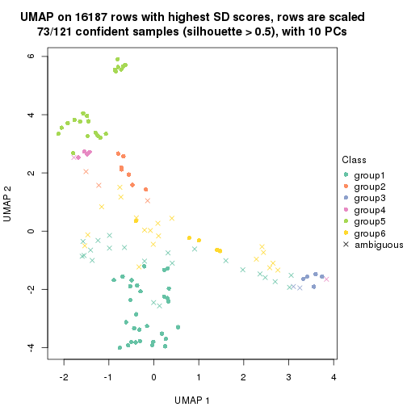</p>

</div>
</div>


Following heatmap shows how subgroups are split when increasing `k`:

```r
collect_classes(res)
```


If matrix rows can be associated to genes, consider to use `functional_enrichment(res,
...)` to perform function enrichment for the signature genes. See [this vignette](http://bioconductor.org/packages/devel/bioc/vignettes/cola/inst/doc/functional_enrichment.html) for more detailed explanations.


 

---------------------------------------------------


### SD:kmeans**


The object with results only for a single top-value method and a single partition method 
can be extracted as:

```r
res = res_list["SD", "kmeans"]
# you can also extract it by
# res = res_list["SD:kmeans"]
```

A summary of `res` and all the functions that can be applied to it:

```r
res
```

```
#> A 'ConsensusPartition' object with k = 2, 3, 4, 5, 6.
#>   On a matrix with 16187 rows and 121 columns.
#>   Top rows (1000, 2000, 3000, 4000, 5000) are extracted by 'SD' method.
#>   Subgroups are detected by 'kmeans' method.
#>   Performed in total 1250 partitions by row resampling.
#>   Best k for subgroups seems to be 2.
#> 
#> Following methods can be applied to this 'ConsensusPartition' object:
#>  [1] "cola_report"             "collect_classes"         "collect_plots"          
#>  [4] "collect_stats"           "colnames"                "compare_signatures"     
#>  [7] "consensus_heatmap"       "dimension_reduction"     "functional_enrichment"  
#> [10] "get_anno_col"            "get_anno"                "get_classes"            
#> [13] "get_consensus"           "get_matrix"              "get_membership"         
#> [16] "get_param"               "get_signatures"          "get_stats"              
#> [19] "is_best_k"               "is_stable_k"             "membership_heatmap"     
#> [22] "ncol"                    "nrow"                    "plot_ecdf"              
#> [25] "rownames"                "select_partition_number" "show"                   
#> [28] "suggest_best_k"          "test_to_known_factors"
```

`collect_plots()` function collects all the plots made from `res` for all `k` (number of partitions)
into one single page to provide an easy and fast comparison between different `k`.

```r
collect_plots(res)
```


The plots are:

- The first row: a plot of the ECDF (empirical cumulative distribution
  function) curves of the consensus matrix for each `k` and the heatmap of
  predicted classes for each `k`.
- The second row: heatmaps of the consensus matrix for each `k`.
- The third row: heatmaps of the membership matrix for each `k`.
- The fouth row: heatmaps of the signatures for each `k`.

All the plots in panels can be made by individual functions and they are
plotted later in this section.

`select_partition_number()` produces several plots showing different
statistics for choosing "optimized" `k`. There are following statistics:

- ECDF curves of the consensus matrix for each `k`;
- 1-PAC. [The PAC
  score](https://en.wikipedia.org/wiki/Consensus_clustering#Over-interpretation_potential_of_consensus_clustering)
  measures the proportion of the ambiguous subgrouping.
- Mean silhouette score.
- Concordance. The mean probability of fiting the consensus class ids in all
  partitions.
- Area increased. Denote $A_k$ as the area under the ECDF curve for current
  `k`, the area increased is defined as $A_k - A_{k-1}$.
- Rand index. The percent of pairs of samples that are both in a same cluster
  or both are not in a same cluster in the partition of k and k-1.
- Jaccard index. The ratio of pairs of samples are both in a same cluster in
  the partition of k and k-1 and the pairs of samples are both in a same
  cluster in the partition k or k-1.

The detailed explanations of these statistics can be found in [the _cola_
vignette](http://bioconductor.org/packages/devel/bioc/vignettes/cola/inst/doc/cola.html#toc_13).

Generally speaking, lower PAC score, higher mean silhouette score or higher
concordance corresponds to better partition. Rand index and Jaccard index
measure how similar the current partition is compared to partition with `k-1`.
If they are too similar, we won't accept `k` is better than `k-1`.

```r
select_partition_number(res)
```


The numeric values for all these statistics can be obtained by `get_stats()`.

```r
get_stats(res)
```

```
#>   k 1-PAC mean_silhouette concordance area_increased  Rand Jaccard
#> 2 2 1.000           0.969       0.988         0.4175 0.579   0.579
#> 3 3 0.557           0.712       0.859         0.4740 0.736   0.572
#> 4 4 0.609           0.716       0.836         0.1703 0.811   0.564
#> 5 5 0.645           0.643       0.772         0.0845 0.869   0.580
#> 6 6 0.692           0.564       0.728         0.0490 0.941   0.738
```

`suggest_best_k()` suggests the best $k$ based on these statistics. The rules are as follows:

- All $k$ with Jaccard index larger than 0.95 are removed because increasing
  $k$ does not provide enough extra information. If all $k$ are removed, it is
  marked as no subgroup is detected.
- For all $k$ with 1-PAC score larger than 0.9, the maximal $k$ is taken as
  the best $k$, and other $k$ are marked as optional $k$.
- If it does not fit the second rule. The $k$ with the maximal vote of the
  highest 1-PAC score, highest mean silhouette, and highest concordance is
  taken as the best $k$.

```r
suggest_best_k(res)
```

```
#> [1] 2
```


Following shows the table of the partitions (You need to click the **show/hide
code output** link to see it). The membership matrix (columns with name `p*`)
is inferred by
[`clue::cl_consensus()`](https://www.rdocumentation.org/link/cl_consensus?package=clue)
function with the `SE` method. Basically the value in the membership matrix
represents the probability to belong to a certain group. The finall class
label for an item is determined with the group with highest probability it
belongs to.

In `get_classes()` function, the entropy is calculated from the membership
matrix and the silhouette score is calculated from the consensus matrix.


<script>
$( function() {
	$( '#tabs-SD-kmeans-get-classes' ).tabs();
} );
</script>
<div id='tabs-SD-kmeans-get-classes'>
<ul>
<li><a href='#tab-SD-kmeans-get-classes-1'>k = 2</a></li>
<li><a href='#tab-SD-kmeans-get-classes-2'>k = 3</a></li>
<li><a href='#tab-SD-kmeans-get-classes-3'>k = 4</a></li>
<li><a href='#tab-SD-kmeans-get-classes-4'>k = 5</a></li>
<li><a href='#tab-SD-kmeans-get-classes-5'>k = 6</a></li>
</ul>

<div id='tab-SD-kmeans-get-classes-1'>
<p><a id='tab-SD-kmeans-get-classes-1-a' style='color:#0366d6' href='#'>show/hide code output</a></p>
<pre><code class="r">cbind(get_classes(res, k = 2), get_membership(res, k = 2))
</code></pre>

<pre><code>#&gt;           class entropy silhouette    p1    p2
#&gt; DRR006374     2  0.0000      0.969 0.000 1.000
#&gt; DRR006375     1  0.0000      0.995 1.000 0.000
#&gt; DRR006376     1  0.0000      0.995 1.000 0.000
#&gt; DRR006377     1  0.0000      0.995 1.000 0.000
#&gt; DRR006378     2  0.0000      0.969 0.000 1.000
#&gt; DRR006379     1  0.0000      0.995 1.000 0.000
#&gt; DRR006380     2  0.0000      0.969 0.000 1.000
#&gt; DRR006381     1  0.0000      0.995 1.000 0.000
#&gt; DRR006382     2  0.0000      0.969 0.000 1.000
#&gt; DRR006383     2  0.9710      0.354 0.400 0.600
#&gt; DRR006384     2  0.0000      0.969 0.000 1.000
#&gt; DRR006385     1  0.0000      0.995 1.000 0.000
#&gt; DRR006386     2  0.0000      0.969 0.000 1.000
#&gt; DRR006387     1  0.0000      0.995 1.000 0.000
#&gt; DRR006388     1  0.0000      0.995 1.000 0.000
#&gt; DRR006389     1  0.0000      0.995 1.000 0.000
#&gt; DRR006390     2  0.0000      0.969 0.000 1.000
#&gt; DRR006391     2  0.0000      0.969 0.000 1.000
#&gt; DRR006392     1  0.0000      0.995 1.000 0.000
#&gt; DRR006393     1  0.0000      0.995 1.000 0.000
#&gt; DRR006394     2  0.9686      0.357 0.396 0.604
#&gt; DRR006395     1  0.0000      0.995 1.000 0.000
#&gt; DRR006396     1  0.0000      0.995 1.000 0.000
#&gt; DRR006397     1  0.0000      0.995 1.000 0.000
#&gt; DRR006398     1  0.0000      0.995 1.000 0.000
#&gt; DRR006399     1  0.0000      0.995 1.000 0.000
#&gt; DRR006400     1  0.0000      0.995 1.000 0.000
#&gt; DRR006401     2  0.0000      0.969 0.000 1.000
#&gt; DRR006402     2  0.0000      0.969 0.000 1.000
#&gt; DRR006403     1  0.0000      0.995 1.000 0.000
#&gt; DRR006404     1  0.0000      0.995 1.000 0.000
#&gt; DRR006405     1  0.0000      0.995 1.000 0.000
#&gt; DRR006406     1  0.0000      0.995 1.000 0.000
#&gt; DRR006407     1  0.0000      0.995 1.000 0.000
#&gt; DRR006408     2  0.7376      0.737 0.208 0.792
#&gt; DRR006409     1  0.0000      0.995 1.000 0.000
#&gt; DRR006410     1  0.0000      0.995 1.000 0.000
#&gt; DRR006411     1  0.0000      0.995 1.000 0.000
#&gt; DRR006412     2  0.0000      0.969 0.000 1.000
#&gt; DRR006413     1  0.0000      0.995 1.000 0.000
#&gt; DRR006414     1  0.0000      0.995 1.000 0.000
#&gt; DRR006415     1  0.0000      0.995 1.000 0.000
#&gt; DRR006416     1  0.0000      0.995 1.000 0.000
#&gt; DRR006417     1  0.0000      0.995 1.000 0.000
#&gt; DRR006418     1  0.0000      0.995 1.000 0.000
#&gt; DRR006419     1  0.0000      0.995 1.000 0.000
#&gt; DRR006420     1  0.0000      0.995 1.000 0.000
#&gt; DRR006421     1  0.0000      0.995 1.000 0.000
#&gt; DRR006422     2  0.3274      0.915 0.060 0.940
#&gt; DRR006423     2  0.0000      0.969 0.000 1.000
#&gt; DRR006424     1  0.0000      0.995 1.000 0.000
#&gt; DRR006425     2  0.0000      0.969 0.000 1.000
#&gt; DRR006426     1  0.0000      0.995 1.000 0.000
#&gt; DRR006427     2  0.0000      0.969 0.000 1.000
#&gt; DRR006428     1  0.0000      0.995 1.000 0.000
#&gt; DRR006429     1  0.9661      0.318 0.608 0.392
#&gt; DRR006430     1  0.0000      0.995 1.000 0.000
#&gt; DRR006431     1  0.0000      0.995 1.000 0.000
#&gt; DRR006432     1  0.0000      0.995 1.000 0.000
#&gt; DRR006433     1  0.0000      0.995 1.000 0.000
#&gt; DRR006434     2  0.0000      0.969 0.000 1.000
#&gt; DRR006435     2  0.0000      0.969 0.000 1.000
#&gt; DRR006436     2  0.0000      0.969 0.000 1.000
#&gt; DRR006437     1  0.0000      0.995 1.000 0.000
#&gt; DRR006438     1  0.0000      0.995 1.000 0.000
#&gt; DRR006439     1  0.0000      0.995 1.000 0.000
#&gt; DRR006440     2  0.0376      0.966 0.004 0.996
#&gt; DRR006441     2  0.0000      0.969 0.000 1.000
#&gt; DRR006442     1  0.0000      0.995 1.000 0.000
#&gt; DRR006443     2  0.0000      0.969 0.000 1.000
#&gt; DRR006444     2  0.0000      0.969 0.000 1.000
#&gt; DRR006445     1  0.0000      0.995 1.000 0.000
#&gt; DRR006446     2  0.0000      0.969 0.000 1.000
#&gt; DRR006447     1  0.0000      0.995 1.000 0.000
#&gt; DRR006448     1  0.0000      0.995 1.000 0.000
#&gt; DRR006449     1  0.0000      0.995 1.000 0.000
#&gt; DRR006450     1  0.0000      0.995 1.000 0.000
#&gt; DRR006451     1  0.0000      0.995 1.000 0.000
#&gt; DRR006452     1  0.0000      0.995 1.000 0.000
#&gt; DRR006453     1  0.0000      0.995 1.000 0.000
#&gt; DRR006454     1  0.0000      0.995 1.000 0.000
#&gt; DRR006455     2  0.0000      0.969 0.000 1.000
#&gt; DRR006456     1  0.0000      0.995 1.000 0.000
#&gt; DRR006457     1  0.0000      0.995 1.000 0.000
#&gt; DRR006458     1  0.0000      0.995 1.000 0.000
#&gt; DRR006459     1  0.0000      0.995 1.000 0.000
#&gt; DRR006460     2  0.0000      0.969 0.000 1.000
#&gt; DRR006461     2  0.0000      0.969 0.000 1.000
#&gt; DRR006462     1  0.0000      0.995 1.000 0.000
#&gt; DRR006463     2  0.0000      0.969 0.000 1.000
#&gt; DRR006464     1  0.0000      0.995 1.000 0.000
#&gt; DRR006465     1  0.0000      0.995 1.000 0.000
#&gt; DRR006466     1  0.0000      0.995 1.000 0.000
#&gt; DRR006467     1  0.0000      0.995 1.000 0.000
#&gt; DRR006468     2  0.0000      0.969 0.000 1.000
#&gt; DRR006469     2  0.0000      0.969 0.000 1.000
#&gt; DRR006470     1  0.0000      0.995 1.000 0.000
#&gt; DRR006471     1  0.0000      0.995 1.000 0.000
#&gt; DRR006472     1  0.0000      0.995 1.000 0.000
#&gt; DRR006473     2  0.0000      0.969 0.000 1.000
#&gt; DRR006474     2  0.0000      0.969 0.000 1.000
#&gt; DRR006475     1  0.0000      0.995 1.000 0.000
#&gt; DRR006476     1  0.1633      0.970 0.976 0.024
#&gt; DRR006477     1  0.0000      0.995 1.000 0.000
#&gt; DRR006478     1  0.0000      0.995 1.000 0.000
#&gt; DRR006479     1  0.0000      0.995 1.000 0.000
#&gt; DRR006480     1  0.0000      0.995 1.000 0.000
#&gt; DRR006481     1  0.0000      0.995 1.000 0.000
#&gt; DRR006482     1  0.0000      0.995 1.000 0.000
#&gt; DRR006483     1  0.0000      0.995 1.000 0.000
#&gt; DRR006484     1  0.0000      0.995 1.000 0.000
#&gt; DRR006485     2  0.0000      0.969 0.000 1.000
#&gt; DRR006486     1  0.0000      0.995 1.000 0.000
#&gt; DRR006487     1  0.0000      0.995 1.000 0.000
#&gt; DRR006488     2  0.0000      0.969 0.000 1.000
#&gt; DRR006489     1  0.0000      0.995 1.000 0.000
#&gt; DRR006490     1  0.0000      0.995 1.000 0.000
#&gt; DRR006491     1  0.0000      0.995 1.000 0.000
#&gt; DRR006492     1  0.0000      0.995 1.000 0.000
#&gt; DRR006493     1  0.0000      0.995 1.000 0.000
#&gt; DRR006494     1  0.0000      0.995 1.000 0.000
</code></pre>

<script>
$('#tab-SD-kmeans-get-classes-1-a').parent().next().next().hide();
$('#tab-SD-kmeans-get-classes-1-a').click(function(){
  $('#tab-SD-kmeans-get-classes-1-a').parent().next().next().toggle();
  return(false);
});
</script>
</div>

<div id='tab-SD-kmeans-get-classes-2'>
<p><a id='tab-SD-kmeans-get-classes-2-a' style='color:#0366d6' href='#'>show/hide code output</a></p>
<pre><code class="r">cbind(get_classes(res, k = 3), get_membership(res, k = 3))
</code></pre>

<pre><code>#&gt;           class entropy silhouette    p1    p2    p3
#&gt; DRR006374     2  0.2165     0.9389 0.000 0.936 0.064
#&gt; DRR006375     1  0.0592     0.8461 0.988 0.000 0.012
#&gt; DRR006376     1  0.2711     0.8147 0.912 0.000 0.088
#&gt; DRR006377     3  0.4555     0.6654 0.200 0.000 0.800
#&gt; DRR006378     2  0.5926     0.5345 0.000 0.644 0.356
#&gt; DRR006379     1  0.2796     0.8126 0.908 0.000 0.092
#&gt; DRR006380     3  0.5988     0.2808 0.000 0.368 0.632
#&gt; DRR006381     1  0.0592     0.8461 0.988 0.000 0.012
#&gt; DRR006382     3  0.6204     0.1470 0.000 0.424 0.576
#&gt; DRR006383     3  0.5216     0.4723 0.000 0.260 0.740
#&gt; DRR006384     2  0.1411     0.9382 0.000 0.964 0.036
#&gt; DRR006385     1  0.1289     0.8410 0.968 0.000 0.032
#&gt; DRR006386     2  0.0000     0.9299 0.000 1.000 0.000
#&gt; DRR006387     1  0.1289     0.8410 0.968 0.000 0.032
#&gt; DRR006388     1  0.5760     0.4644 0.672 0.000 0.328
#&gt; DRR006389     1  0.5760     0.4644 0.672 0.000 0.328
#&gt; DRR006390     2  0.2878     0.9336 0.000 0.904 0.096
#&gt; DRR006391     2  0.2878     0.9336 0.000 0.904 0.096
#&gt; DRR006392     1  0.0592     0.8461 0.988 0.000 0.012
#&gt; DRR006393     1  0.0000     0.8460 1.000 0.000 0.000
#&gt; DRR006394     3  0.2383     0.6794 0.016 0.044 0.940
#&gt; DRR006395     1  0.2796     0.8126 0.908 0.000 0.092
#&gt; DRR006396     1  0.1289     0.8410 0.968 0.000 0.032
#&gt; DRR006397     1  0.5760     0.4644 0.672 0.000 0.328
#&gt; DRR006398     1  0.5760     0.4644 0.672 0.000 0.328
#&gt; DRR006399     1  0.2796     0.8126 0.908 0.000 0.092
#&gt; DRR006400     1  0.2796     0.8126 0.908 0.000 0.092
#&gt; DRR006401     2  0.1860     0.9397 0.000 0.948 0.052
#&gt; DRR006402     2  0.1860     0.9397 0.000 0.948 0.052
#&gt; DRR006403     1  0.2796     0.8126 0.908 0.000 0.092
#&gt; DRR006404     1  0.2796     0.8126 0.908 0.000 0.092
#&gt; DRR006405     1  0.2796     0.8126 0.908 0.000 0.092
#&gt; DRR006406     1  0.2796     0.8126 0.908 0.000 0.092
#&gt; DRR006407     3  0.6244     0.2293 0.440 0.000 0.560
#&gt; DRR006408     3  0.7603     0.4449 0.096 0.236 0.668
#&gt; DRR006409     1  0.1031     0.8432 0.976 0.000 0.024
#&gt; DRR006410     1  0.0237     0.8456 0.996 0.000 0.004
#&gt; DRR006411     3  0.6309     0.0356 0.500 0.000 0.500
#&gt; DRR006412     2  0.2878     0.9336 0.000 0.904 0.096
#&gt; DRR006413     1  0.0592     0.8461 0.988 0.000 0.012
#&gt; DRR006414     1  0.5859     0.4799 0.656 0.000 0.344
#&gt; DRR006415     3  0.4399     0.6938 0.188 0.000 0.812
#&gt; DRR006416     1  0.6308    -0.0535 0.508 0.000 0.492
#&gt; DRR006417     3  0.5431     0.5808 0.284 0.000 0.716
#&gt; DRR006418     1  0.2356     0.8196 0.928 0.000 0.072
#&gt; DRR006419     1  0.5733     0.5150 0.676 0.000 0.324
#&gt; DRR006420     1  0.5706     0.5217 0.680 0.000 0.320
#&gt; DRR006421     3  0.4504     0.6568 0.196 0.000 0.804
#&gt; DRR006422     3  0.6294     0.4180 0.020 0.288 0.692
#&gt; DRR006423     2  0.2959     0.9318 0.000 0.900 0.100
#&gt; DRR006424     1  0.0592     0.8461 0.988 0.000 0.012
#&gt; DRR006425     3  0.5988     0.2804 0.000 0.368 0.632
#&gt; DRR006426     3  0.4842     0.6215 0.224 0.000 0.776
#&gt; DRR006427     2  0.0000     0.9299 0.000 1.000 0.000
#&gt; DRR006428     1  0.5760     0.5074 0.672 0.000 0.328
#&gt; DRR006429     3  0.1170     0.6920 0.016 0.008 0.976
#&gt; DRR006430     1  0.0592     0.8461 0.988 0.000 0.012
#&gt; DRR006431     1  0.0592     0.8461 0.988 0.000 0.012
#&gt; DRR006432     3  0.4504     0.6563 0.196 0.000 0.804
#&gt; DRR006433     3  0.3192     0.7192 0.112 0.000 0.888
#&gt; DRR006434     2  0.3116     0.9263 0.000 0.892 0.108
#&gt; DRR006435     2  0.0000     0.9299 0.000 1.000 0.000
#&gt; DRR006436     2  0.0000     0.9299 0.000 1.000 0.000
#&gt; DRR006437     1  0.1289     0.8410 0.968 0.000 0.032
#&gt; DRR006438     1  0.5733     0.5150 0.676 0.000 0.324
#&gt; DRR006439     1  0.5785     0.5015 0.668 0.000 0.332
#&gt; DRR006440     3  0.4235     0.5942 0.000 0.176 0.824
#&gt; DRR006441     3  0.5465     0.4536 0.000 0.288 0.712
#&gt; DRR006442     1  0.5882     0.4722 0.652 0.000 0.348
#&gt; DRR006443     3  0.4235     0.5942 0.000 0.176 0.824
#&gt; DRR006444     2  0.0000     0.9299 0.000 1.000 0.000
#&gt; DRR006445     1  0.1289     0.8410 0.968 0.000 0.032
#&gt; DRR006446     2  0.2878     0.9336 0.000 0.904 0.096
#&gt; DRR006447     1  0.1289     0.8410 0.968 0.000 0.032
#&gt; DRR006448     1  0.2796     0.8126 0.908 0.000 0.092
#&gt; DRR006449     1  0.0237     0.8456 0.996 0.000 0.004
#&gt; DRR006450     1  0.0000     0.8460 1.000 0.000 0.000
#&gt; DRR006451     1  0.2796     0.8126 0.908 0.000 0.092
#&gt; DRR006452     1  0.0000     0.8460 1.000 0.000 0.000
#&gt; DRR006453     1  0.0892     0.8436 0.980 0.000 0.020
#&gt; DRR006454     1  0.6309    -0.0786 0.500 0.000 0.500
#&gt; DRR006455     2  0.0000     0.9299 0.000 1.000 0.000
#&gt; DRR006456     3  0.3551     0.7125 0.132 0.000 0.868
#&gt; DRR006457     3  0.4931     0.6527 0.232 0.000 0.768
#&gt; DRR006458     1  0.0892     0.8443 0.980 0.000 0.020
#&gt; DRR006459     1  0.1031     0.8432 0.976 0.000 0.024
#&gt; DRR006460     2  0.1411     0.9382 0.000 0.964 0.036
#&gt; DRR006461     2  0.3941     0.8810 0.000 0.844 0.156
#&gt; DRR006462     1  0.1289     0.8410 0.968 0.000 0.032
#&gt; DRR006463     3  0.4452     0.5795 0.000 0.192 0.808
#&gt; DRR006464     3  0.2796     0.7243 0.092 0.000 0.908
#&gt; DRR006465     1  0.0000     0.8460 1.000 0.000 0.000
#&gt; DRR006466     3  0.3116     0.7254 0.108 0.000 0.892
#&gt; DRR006467     1  0.0592     0.8461 0.988 0.000 0.012
#&gt; DRR006468     2  0.0000     0.9299 0.000 1.000 0.000
#&gt; DRR006469     3  0.5560     0.4355 0.000 0.300 0.700
#&gt; DRR006470     3  0.6305     0.0181 0.484 0.000 0.516
#&gt; DRR006471     1  0.1031     0.8432 0.976 0.000 0.024
#&gt; DRR006472     3  0.3038     0.7229 0.104 0.000 0.896
#&gt; DRR006473     2  0.2959     0.9318 0.000 0.900 0.100
#&gt; DRR006474     2  0.2959     0.9318 0.000 0.900 0.100
#&gt; DRR006475     1  0.1031     0.8432 0.976 0.000 0.024
#&gt; DRR006476     3  0.1031     0.6951 0.024 0.000 0.976
#&gt; DRR006477     3  0.2261     0.7215 0.068 0.000 0.932
#&gt; DRR006478     1  0.0592     0.8461 0.988 0.000 0.012
#&gt; DRR006479     1  0.3116     0.7911 0.892 0.000 0.108
#&gt; DRR006480     1  0.1031     0.8432 0.976 0.000 0.024
#&gt; DRR006481     3  0.5327     0.6007 0.272 0.000 0.728
#&gt; DRR006482     1  0.4399     0.7143 0.812 0.000 0.188
#&gt; DRR006483     1  0.1031     0.8432 0.976 0.000 0.024
#&gt; DRR006484     1  0.5785     0.5015 0.668 0.000 0.332
#&gt; DRR006485     3  0.4291     0.5908 0.000 0.180 0.820
#&gt; DRR006486     1  0.2878     0.8010 0.904 0.000 0.096
#&gt; DRR006487     3  0.4399     0.6938 0.188 0.000 0.812
#&gt; DRR006488     2  0.0000     0.9299 0.000 1.000 0.000
#&gt; DRR006489     1  0.0592     0.8461 0.988 0.000 0.012
#&gt; DRR006490     1  0.5760     0.5074 0.672 0.000 0.328
#&gt; DRR006491     1  0.5835     0.4874 0.660 0.000 0.340
#&gt; DRR006492     1  0.1643     0.8350 0.956 0.000 0.044
#&gt; DRR006493     3  0.4399     0.6938 0.188 0.000 0.812
#&gt; DRR006494     1  0.1031     0.8432 0.976 0.000 0.024
</code></pre>

<script>
$('#tab-SD-kmeans-get-classes-2-a').parent().next().next().hide();
$('#tab-SD-kmeans-get-classes-2-a').click(function(){
  $('#tab-SD-kmeans-get-classes-2-a').parent().next().next().toggle();
  return(false);
});
</script>
</div>

<div id='tab-SD-kmeans-get-classes-3'>
<p><a id='tab-SD-kmeans-get-classes-3-a' style='color:#0366d6' href='#'>show/hide code output</a></p>
<pre><code class="r">cbind(get_classes(res, k = 4), get_membership(res, k = 4))
</code></pre>

<pre><code>#&gt;           class entropy silhouette    p1    p2    p3    p4
#&gt; DRR006374     2  0.3610     0.8421 0.000 0.800 0.000 0.200
#&gt; DRR006375     1  0.3219     0.7803 0.836 0.000 0.164 0.000
#&gt; DRR006376     1  0.2198     0.8046 0.920 0.000 0.008 0.072
#&gt; DRR006377     4  0.7683     0.0786 0.244 0.000 0.304 0.452
#&gt; DRR006378     4  0.4164     0.4682 0.000 0.264 0.000 0.736
#&gt; DRR006379     1  0.3196     0.7765 0.856 0.000 0.008 0.136
#&gt; DRR006380     4  0.2611     0.7243 0.000 0.096 0.008 0.896
#&gt; DRR006381     1  0.3311     0.7752 0.828 0.000 0.172 0.000
#&gt; DRR006382     4  0.4245     0.6230 0.000 0.196 0.020 0.784
#&gt; DRR006383     4  0.4931     0.7224 0.000 0.092 0.132 0.776
#&gt; DRR006384     2  0.2921     0.8537 0.000 0.860 0.000 0.140
#&gt; DRR006385     1  0.0376     0.8169 0.992 0.000 0.004 0.004
#&gt; DRR006386     2  0.0000     0.8272 0.000 1.000 0.000 0.000
#&gt; DRR006387     1  0.0188     0.8165 0.996 0.000 0.000 0.004
#&gt; DRR006388     1  0.5646     0.6583 0.708 0.000 0.088 0.204
#&gt; DRR006389     1  0.5646     0.6583 0.708 0.000 0.088 0.204
#&gt; DRR006390     2  0.4040     0.8213 0.000 0.752 0.000 0.248
#&gt; DRR006391     2  0.4040     0.8213 0.000 0.752 0.000 0.248
#&gt; DRR006392     1  0.3266     0.7782 0.832 0.000 0.168 0.000
#&gt; DRR006393     1  0.3074     0.7841 0.848 0.000 0.152 0.000
#&gt; DRR006394     4  0.0188     0.7501 0.000 0.000 0.004 0.996
#&gt; DRR006395     1  0.2976     0.7871 0.872 0.000 0.008 0.120
#&gt; DRR006396     1  0.0524     0.8168 0.988 0.000 0.004 0.008
#&gt; DRR006397     1  0.5609     0.6632 0.712 0.000 0.088 0.200
#&gt; DRR006398     1  0.5609     0.6632 0.712 0.000 0.088 0.200
#&gt; DRR006399     1  0.2831     0.7890 0.876 0.000 0.004 0.120
#&gt; DRR006400     1  0.2831     0.7890 0.876 0.000 0.004 0.120
#&gt; DRR006401     2  0.3123     0.8532 0.000 0.844 0.000 0.156
#&gt; DRR006402     2  0.3123     0.8532 0.000 0.844 0.000 0.156
#&gt; DRR006403     1  0.2831     0.7890 0.876 0.000 0.004 0.120
#&gt; DRR006404     1  0.3196     0.7765 0.856 0.000 0.008 0.136
#&gt; DRR006405     1  0.2799     0.7929 0.884 0.000 0.008 0.108
#&gt; DRR006406     1  0.2799     0.7929 0.884 0.000 0.008 0.108
#&gt; DRR006407     1  0.6386     0.3544 0.552 0.000 0.072 0.376
#&gt; DRR006408     4  0.4837     0.5577 0.160 0.056 0.004 0.780
#&gt; DRR006409     1  0.3688     0.7504 0.792 0.000 0.208 0.000
#&gt; DRR006410     1  0.0188     0.8166 0.996 0.000 0.004 0.000
#&gt; DRR006411     1  0.6338     0.4768 0.600 0.000 0.084 0.316
#&gt; DRR006412     2  0.4040     0.8213 0.000 0.752 0.000 0.248
#&gt; DRR006413     1  0.3219     0.7793 0.836 0.000 0.164 0.000
#&gt; DRR006414     3  0.2844     0.7726 0.048 0.000 0.900 0.052
#&gt; DRR006415     3  0.3982     0.6774 0.004 0.000 0.776 0.220
#&gt; DRR006416     1  0.5681     0.6536 0.704 0.000 0.088 0.208
#&gt; DRR006417     3  0.3577     0.7304 0.012 0.000 0.832 0.156
#&gt; DRR006418     3  0.4948    -0.0776 0.440 0.000 0.560 0.000
#&gt; DRR006419     3  0.1637     0.7714 0.060 0.000 0.940 0.000
#&gt; DRR006420     3  0.2281     0.7499 0.096 0.000 0.904 0.000
#&gt; DRR006421     3  0.4011     0.7025 0.008 0.000 0.784 0.208
#&gt; DRR006422     4  0.1792     0.7341 0.000 0.068 0.000 0.932
#&gt; DRR006423     2  0.4134     0.8107 0.000 0.740 0.000 0.260
#&gt; DRR006424     1  0.3219     0.7793 0.836 0.000 0.164 0.000
#&gt; DRR006425     4  0.1867     0.7339 0.000 0.072 0.000 0.928
#&gt; DRR006426     3  0.3910     0.7331 0.024 0.000 0.820 0.156
#&gt; DRR006427     2  0.0000     0.8272 0.000 1.000 0.000 0.000
#&gt; DRR006428     3  0.1389     0.7753 0.048 0.000 0.952 0.000
#&gt; DRR006429     4  0.0707     0.7508 0.000 0.000 0.020 0.980
#&gt; DRR006430     1  0.3356     0.7738 0.824 0.000 0.176 0.000
#&gt; DRR006431     1  0.3400     0.7715 0.820 0.000 0.180 0.000
#&gt; DRR006432     3  0.4139     0.7222 0.024 0.000 0.800 0.176
#&gt; DRR006433     3  0.4018     0.6844 0.004 0.000 0.772 0.224
#&gt; DRR006434     2  0.4837     0.6680 0.000 0.648 0.004 0.348
#&gt; DRR006435     2  0.0000     0.8272 0.000 1.000 0.000 0.000
#&gt; DRR006436     2  0.0000     0.8272 0.000 1.000 0.000 0.000
#&gt; DRR006437     1  0.0376     0.8169 0.992 0.000 0.004 0.004
#&gt; DRR006438     3  0.2081     0.7566 0.084 0.000 0.916 0.000
#&gt; DRR006439     3  0.1389     0.7753 0.048 0.000 0.952 0.000
#&gt; DRR006440     4  0.4356     0.7305 0.000 0.064 0.124 0.812
#&gt; DRR006441     4  0.1637     0.7504 0.000 0.060 0.000 0.940
#&gt; DRR006442     3  0.2759     0.7725 0.044 0.000 0.904 0.052
#&gt; DRR006443     4  0.4374     0.7313 0.000 0.068 0.120 0.812
#&gt; DRR006444     2  0.0000     0.8272 0.000 1.000 0.000 0.000
#&gt; DRR006445     1  0.0376     0.8169 0.992 0.000 0.004 0.004
#&gt; DRR006446     2  0.4008     0.8236 0.000 0.756 0.000 0.244
#&gt; DRR006447     1  0.0524     0.8168 0.988 0.000 0.008 0.004
#&gt; DRR006448     1  0.2831     0.7890 0.876 0.000 0.004 0.120
#&gt; DRR006449     1  0.0188     0.8166 0.996 0.000 0.004 0.000
#&gt; DRR006450     1  0.0921     0.8150 0.972 0.000 0.028 0.000
#&gt; DRR006451     1  0.3032     0.7845 0.868 0.000 0.008 0.124
#&gt; DRR006452     1  0.0921     0.8150 0.972 0.000 0.028 0.000
#&gt; DRR006453     1  0.0188     0.8166 0.996 0.000 0.004 0.000
#&gt; DRR006454     1  0.6338     0.4768 0.600 0.000 0.084 0.316
#&gt; DRR006455     2  0.0000     0.8272 0.000 1.000 0.000 0.000
#&gt; DRR006456     3  0.3801     0.6787 0.000 0.000 0.780 0.220
#&gt; DRR006457     3  0.3791     0.7071 0.004 0.000 0.796 0.200
#&gt; DRR006458     1  0.3688     0.7504 0.792 0.000 0.208 0.000
#&gt; DRR006459     1  0.4008     0.7161 0.756 0.000 0.244 0.000
#&gt; DRR006460     2  0.2921     0.8537 0.000 0.860 0.000 0.140
#&gt; DRR006461     4  0.5127     0.2346 0.000 0.356 0.012 0.632
#&gt; DRR006462     1  0.0336     0.8162 0.992 0.000 0.000 0.008
#&gt; DRR006463     4  0.4374     0.7313 0.000 0.068 0.120 0.812
#&gt; DRR006464     4  0.4123     0.5334 0.008 0.000 0.220 0.772
#&gt; DRR006465     1  0.3172     0.7817 0.840 0.000 0.160 0.000
#&gt; DRR006466     4  0.5028     0.2119 0.004 0.000 0.400 0.596
#&gt; DRR006467     1  0.3400     0.7715 0.820 0.000 0.180 0.000
#&gt; DRR006468     2  0.0000     0.8272 0.000 1.000 0.000 0.000
#&gt; DRR006469     4  0.1792     0.7469 0.000 0.068 0.000 0.932
#&gt; DRR006470     3  0.1256     0.7759 0.028 0.000 0.964 0.008
#&gt; DRR006471     1  0.4277     0.6720 0.720 0.000 0.280 0.000
#&gt; DRR006472     3  0.4905     0.4481 0.004 0.000 0.632 0.364
#&gt; DRR006473     2  0.4134     0.8107 0.000 0.740 0.000 0.260
#&gt; DRR006474     2  0.4134     0.8107 0.000 0.740 0.000 0.260
#&gt; DRR006475     3  0.4967     0.0221 0.452 0.000 0.548 0.000
#&gt; DRR006476     4  0.0707     0.7508 0.000 0.000 0.020 0.980
#&gt; DRR006477     4  0.5018     0.4033 0.012 0.000 0.332 0.656
#&gt; DRR006478     1  0.3311     0.7752 0.828 0.000 0.172 0.000
#&gt; DRR006479     3  0.2345     0.7447 0.100 0.000 0.900 0.000
#&gt; DRR006480     1  0.4040     0.7115 0.752 0.000 0.248 0.000
#&gt; DRR006481     3  0.3257     0.7299 0.004 0.000 0.844 0.152
#&gt; DRR006482     1  0.4764     0.7359 0.788 0.000 0.088 0.124
#&gt; DRR006483     1  0.4277     0.6720 0.720 0.000 0.280 0.000
#&gt; DRR006484     3  0.0707     0.7760 0.020 0.000 0.980 0.000
#&gt; DRR006485     4  0.4374     0.7313 0.000 0.068 0.120 0.812
#&gt; DRR006486     3  0.3400     0.6689 0.180 0.000 0.820 0.000
#&gt; DRR006487     3  0.3801     0.6787 0.000 0.000 0.780 0.220
#&gt; DRR006488     2  0.0000     0.8272 0.000 1.000 0.000 0.000
#&gt; DRR006489     1  0.3400     0.7715 0.820 0.000 0.180 0.000
#&gt; DRR006490     3  0.1389     0.7753 0.048 0.000 0.952 0.000
#&gt; DRR006491     3  0.1302     0.7759 0.044 0.000 0.956 0.000
#&gt; DRR006492     1  0.4500     0.6142 0.684 0.000 0.316 0.000
#&gt; DRR006493     3  0.3688     0.6934 0.000 0.000 0.792 0.208
#&gt; DRR006494     1  0.4277     0.6720 0.720 0.000 0.280 0.000
</code></pre>

<script>
$('#tab-SD-kmeans-get-classes-3-a').parent().next().next().hide();
$('#tab-SD-kmeans-get-classes-3-a').click(function(){
  $('#tab-SD-kmeans-get-classes-3-a').parent().next().next().toggle();
  return(false);
});
</script>
</div>

<div id='tab-SD-kmeans-get-classes-4'>
<p><a id='tab-SD-kmeans-get-classes-4-a' style='color:#0366d6' href='#'>show/hide code output</a></p>
<pre><code class="r">cbind(get_classes(res, k = 5), get_membership(res, k = 5))
</code></pre>

<pre><code>#&gt;           class entropy silhouette    p1    p2    p3    p4    p5
#&gt; DRR006374     5  0.4526    0.75212 0.000 0.300 0.000 0.028 0.672
#&gt; DRR006375     1  0.2130    0.70534 0.908 0.000 0.012 0.080 0.000
#&gt; DRR006376     4  0.3999    0.64303 0.344 0.000 0.000 0.656 0.000
#&gt; DRR006377     4  0.5540    0.48969 0.032 0.104 0.164 0.700 0.000
#&gt; DRR006378     2  0.2989    0.73168 0.000 0.868 0.000 0.072 0.060
#&gt; DRR006379     4  0.3480    0.71211 0.248 0.000 0.000 0.752 0.000
#&gt; DRR006380     2  0.2629    0.75615 0.000 0.896 0.008 0.064 0.032
#&gt; DRR006381     1  0.0865    0.72639 0.972 0.000 0.004 0.024 0.000
#&gt; DRR006382     2  0.3806    0.74667 0.000 0.840 0.056 0.064 0.040
#&gt; DRR006383     2  0.4933    0.76229 0.000 0.760 0.100 0.104 0.036
#&gt; DRR006384     5  0.4095    0.77884 0.000 0.220 0.004 0.024 0.752
#&gt; DRR006385     1  0.5148   -0.09286 0.528 0.000 0.040 0.432 0.000
#&gt; DRR006386     5  0.0794    0.75147 0.000 0.000 0.000 0.028 0.972
#&gt; DRR006387     1  0.4074    0.23779 0.636 0.000 0.000 0.364 0.000
#&gt; DRR006388     4  0.5145    0.71665 0.148 0.052 0.060 0.740 0.000
#&gt; DRR006389     4  0.5145    0.71665 0.148 0.052 0.060 0.740 0.000
#&gt; DRR006390     5  0.4060    0.73216 0.000 0.360 0.000 0.000 0.640
#&gt; DRR006391     5  0.4060    0.73216 0.000 0.360 0.000 0.000 0.640
#&gt; DRR006392     1  0.1211    0.72781 0.960 0.000 0.016 0.024 0.000
#&gt; DRR006393     1  0.1638    0.71029 0.932 0.000 0.004 0.064 0.000
#&gt; DRR006394     2  0.3821    0.73351 0.000 0.764 0.020 0.216 0.000
#&gt; DRR006395     4  0.3895    0.67274 0.320 0.000 0.000 0.680 0.000
#&gt; DRR006396     1  0.4375    0.09051 0.576 0.000 0.004 0.420 0.000
#&gt; DRR006397     4  0.5078    0.71761 0.148 0.048 0.060 0.744 0.000
#&gt; DRR006398     4  0.5078    0.71761 0.148 0.048 0.060 0.744 0.000
#&gt; DRR006399     4  0.4138    0.57436 0.384 0.000 0.000 0.616 0.000
#&gt; DRR006400     4  0.4138    0.57436 0.384 0.000 0.000 0.616 0.000
#&gt; DRR006401     5  0.4295    0.77560 0.000 0.248 0.004 0.024 0.724
#&gt; DRR006402     5  0.4295    0.77560 0.000 0.248 0.004 0.024 0.724
#&gt; DRR006403     4  0.4138    0.57436 0.384 0.000 0.000 0.616 0.000
#&gt; DRR006404     4  0.3661    0.70467 0.276 0.000 0.000 0.724 0.000
#&gt; DRR006405     4  0.4101    0.66192 0.332 0.004 0.000 0.664 0.000
#&gt; DRR006406     4  0.4101    0.66192 0.332 0.004 0.000 0.664 0.000
#&gt; DRR006407     4  0.4075    0.68516 0.096 0.100 0.004 0.800 0.000
#&gt; DRR006408     4  0.4403   -0.10827 0.000 0.436 0.004 0.560 0.000
#&gt; DRR006409     1  0.1608    0.70863 0.928 0.000 0.072 0.000 0.000
#&gt; DRR006410     1  0.3274    0.55613 0.780 0.000 0.000 0.220 0.000
#&gt; DRR006411     4  0.5214    0.69931 0.120 0.076 0.060 0.744 0.000
#&gt; DRR006412     5  0.4074    0.72800 0.000 0.364 0.000 0.000 0.636
#&gt; DRR006413     1  0.2017    0.70228 0.912 0.000 0.008 0.080 0.000
#&gt; DRR006414     3  0.3166    0.80908 0.104 0.016 0.860 0.020 0.000
#&gt; DRR006415     3  0.2729    0.74478 0.000 0.060 0.884 0.056 0.000
#&gt; DRR006416     4  0.5350    0.70226 0.156 0.056 0.064 0.724 0.000
#&gt; DRR006417     3  0.2853    0.80246 0.036 0.028 0.892 0.044 0.000
#&gt; DRR006418     3  0.6664    0.35431 0.356 0.012 0.468 0.164 0.000
#&gt; DRR006419     3  0.3729    0.80129 0.124 0.012 0.824 0.040 0.000
#&gt; DRR006420     3  0.3573    0.80269 0.124 0.012 0.832 0.032 0.000
#&gt; DRR006421     3  0.1914    0.79295 0.004 0.032 0.932 0.032 0.000
#&gt; DRR006422     2  0.2915    0.76422 0.000 0.860 0.000 0.116 0.024
#&gt; DRR006423     5  0.4114    0.71434 0.000 0.376 0.000 0.000 0.624
#&gt; DRR006424     1  0.1430    0.71264 0.944 0.000 0.004 0.052 0.000
#&gt; DRR006425     2  0.2362    0.76148 0.000 0.900 0.000 0.076 0.024
#&gt; DRR006426     3  0.4387    0.77148 0.048 0.040 0.796 0.116 0.000
#&gt; DRR006427     5  0.0794    0.75147 0.000 0.000 0.000 0.028 0.972
#&gt; DRR006428     3  0.2852    0.78751 0.172 0.000 0.828 0.000 0.000
#&gt; DRR006429     2  0.4522    0.74379 0.000 0.736 0.068 0.196 0.000
#&gt; DRR006430     1  0.0671    0.72984 0.980 0.000 0.016 0.004 0.000
#&gt; DRR006431     1  0.0671    0.72984 0.980 0.000 0.016 0.004 0.000
#&gt; DRR006432     3  0.5317    0.69556 0.036 0.068 0.712 0.184 0.000
#&gt; DRR006433     3  0.2871    0.76456 0.000 0.040 0.872 0.088 0.000
#&gt; DRR006434     2  0.4716    0.19418 0.000 0.656 0.000 0.036 0.308
#&gt; DRR006435     5  0.0794    0.75147 0.000 0.000 0.000 0.028 0.972
#&gt; DRR006436     5  0.0794    0.75147 0.000 0.000 0.000 0.028 0.972
#&gt; DRR006437     1  0.4542   -0.06858 0.536 0.000 0.008 0.456 0.000
#&gt; DRR006438     3  0.3684    0.77362 0.192 0.004 0.788 0.016 0.000
#&gt; DRR006439     3  0.2753    0.80549 0.136 0.000 0.856 0.008 0.000
#&gt; DRR006440     2  0.4199    0.74897 0.000 0.772 0.160 0.068 0.000
#&gt; DRR006441     2  0.1732    0.77537 0.000 0.920 0.000 0.080 0.000
#&gt; DRR006442     3  0.3590    0.79305 0.148 0.016 0.820 0.016 0.000
#&gt; DRR006443     2  0.4199    0.74897 0.000 0.772 0.160 0.068 0.000
#&gt; DRR006444     5  0.0794    0.75147 0.000 0.000 0.000 0.028 0.972
#&gt; DRR006445     1  0.4504    0.03977 0.564 0.000 0.008 0.428 0.000
#&gt; DRR006446     5  0.4060    0.73216 0.000 0.360 0.000 0.000 0.640
#&gt; DRR006447     1  0.5587   -0.24049 0.472 0.012 0.044 0.472 0.000
#&gt; DRR006448     4  0.4045    0.59988 0.356 0.000 0.000 0.644 0.000
#&gt; DRR006449     1  0.3300    0.57212 0.792 0.000 0.004 0.204 0.000
#&gt; DRR006450     1  0.3282    0.60412 0.804 0.000 0.008 0.188 0.000
#&gt; DRR006451     4  0.3586    0.70362 0.264 0.000 0.000 0.736 0.000
#&gt; DRR006452     1  0.2929    0.64321 0.840 0.000 0.008 0.152 0.000
#&gt; DRR006453     1  0.3957    0.45718 0.712 0.000 0.008 0.280 0.000
#&gt; DRR006454     4  0.5258    0.70097 0.124 0.076 0.060 0.740 0.000
#&gt; DRR006455     5  0.0794    0.75147 0.000 0.000 0.000 0.028 0.972
#&gt; DRR006456     3  0.3180    0.72472 0.000 0.076 0.856 0.068 0.000
#&gt; DRR006457     3  0.1982    0.79438 0.012 0.028 0.932 0.028 0.000
#&gt; DRR006458     1  0.1478    0.71220 0.936 0.000 0.064 0.000 0.000
#&gt; DRR006459     1  0.2020    0.69250 0.900 0.000 0.100 0.000 0.000
#&gt; DRR006460     5  0.4095    0.77884 0.000 0.220 0.004 0.024 0.752
#&gt; DRR006461     2  0.3216    0.68692 0.000 0.856 0.004 0.044 0.096
#&gt; DRR006462     1  0.4291   -0.13628 0.536 0.000 0.000 0.464 0.000
#&gt; DRR006463     2  0.4199    0.74897 0.000 0.772 0.160 0.068 0.000
#&gt; DRR006464     2  0.5998    0.52649 0.004 0.544 0.112 0.340 0.000
#&gt; DRR006465     1  0.1281    0.72545 0.956 0.000 0.012 0.032 0.000
#&gt; DRR006466     3  0.6388    0.11755 0.000 0.312 0.496 0.192 0.000
#&gt; DRR006467     1  0.0671    0.72984 0.980 0.000 0.016 0.004 0.000
#&gt; DRR006468     5  0.0794    0.75147 0.000 0.000 0.000 0.028 0.972
#&gt; DRR006469     2  0.1732    0.77537 0.000 0.920 0.000 0.080 0.000
#&gt; DRR006470     3  0.3617    0.80445 0.088 0.012 0.840 0.060 0.000
#&gt; DRR006471     1  0.2574    0.67528 0.876 0.000 0.112 0.012 0.000
#&gt; DRR006472     3  0.5045    0.60435 0.000 0.108 0.696 0.196 0.000
#&gt; DRR006473     5  0.4114    0.71434 0.000 0.376 0.000 0.000 0.624
#&gt; DRR006474     5  0.4555    0.72923 0.000 0.344 0.000 0.020 0.636
#&gt; DRR006475     1  0.3280    0.60784 0.812 0.000 0.176 0.012 0.000
#&gt; DRR006476     2  0.4455    0.75265 0.000 0.744 0.068 0.188 0.000
#&gt; DRR006477     3  0.6732   -0.00883 0.000 0.272 0.412 0.316 0.000
#&gt; DRR006478     1  0.0798    0.72927 0.976 0.000 0.016 0.008 0.000
#&gt; DRR006479     3  0.3718    0.77049 0.196 0.004 0.784 0.016 0.000
#&gt; DRR006480     1  0.1908    0.69738 0.908 0.000 0.092 0.000 0.000
#&gt; DRR006481     3  0.2436    0.80574 0.036 0.020 0.912 0.032 0.000
#&gt; DRR006482     4  0.4933    0.70256 0.248 0.004 0.060 0.688 0.000
#&gt; DRR006483     1  0.2574    0.67528 0.876 0.000 0.112 0.012 0.000
#&gt; DRR006484     3  0.3031    0.80865 0.120 0.004 0.856 0.020 0.000
#&gt; DRR006485     2  0.4199    0.74897 0.000 0.772 0.160 0.068 0.000
#&gt; DRR006486     1  0.4644   -0.16580 0.528 0.000 0.460 0.012 0.000
#&gt; DRR006487     3  0.2729    0.74478 0.000 0.060 0.884 0.056 0.000
#&gt; DRR006488     5  0.0794    0.75147 0.000 0.000 0.000 0.028 0.972
#&gt; DRR006489     1  0.0671    0.72984 0.980 0.000 0.016 0.004 0.000
#&gt; DRR006490     3  0.3010    0.78737 0.172 0.000 0.824 0.004 0.000
#&gt; DRR006491     3  0.3154    0.79416 0.148 0.004 0.836 0.012 0.000
#&gt; DRR006492     1  0.2806    0.65802 0.844 0.000 0.152 0.004 0.000
#&gt; DRR006493     3  0.2592    0.75040 0.000 0.052 0.892 0.056 0.000
#&gt; DRR006494     1  0.2074    0.68946 0.896 0.000 0.104 0.000 0.000
</code></pre>

<script>
$('#tab-SD-kmeans-get-classes-4-a').parent().next().next().hide();
$('#tab-SD-kmeans-get-classes-4-a').click(function(){
  $('#tab-SD-kmeans-get-classes-4-a').parent().next().next().toggle();
  return(false);
});
</script>
</div>

<div id='tab-SD-kmeans-get-classes-5'>
<p><a id='tab-SD-kmeans-get-classes-5-a' style='color:#0366d6' href='#'>show/hide code output</a></p>
<pre><code class="r">cbind(get_classes(res, k = 6), get_membership(res, k = 6))
</code></pre>

<pre><code>#&gt;           class entropy silhouette    p1    p2    p3    p4    p5    p6
#&gt; DRR006374     5  0.4370     0.6795 0.000 0.356 0.000 0.020 0.616 0.008
#&gt; DRR006375     1  0.1556     0.7855 0.920 0.000 0.000 0.000 0.000 0.080
#&gt; DRR006376     6  0.5564     0.2417 0.148 0.000 0.000 0.352 0.000 0.500
#&gt; DRR006377     4  0.5921     0.5718 0.016 0.024 0.080 0.532 0.000 0.348
#&gt; DRR006378     2  0.4961     0.6251 0.000 0.720 0.012 0.160 0.076 0.032
#&gt; DRR006379     6  0.5147     0.1850 0.096 0.000 0.000 0.356 0.000 0.548
#&gt; DRR006380     2  0.3262     0.6959 0.000 0.828 0.004 0.132 0.008 0.028
#&gt; DRR006381     1  0.2092     0.7647 0.876 0.000 0.000 0.000 0.000 0.124
#&gt; DRR006382     2  0.2312     0.6839 0.000 0.896 0.012 0.080 0.008 0.004
#&gt; DRR006383     2  0.3664     0.6799 0.000 0.816 0.052 0.112 0.008 0.012
#&gt; DRR006384     5  0.3957     0.7145 0.000 0.280 0.000 0.020 0.696 0.004
#&gt; DRR006385     6  0.3050     0.4118 0.236 0.000 0.000 0.000 0.000 0.764
#&gt; DRR006386     5  0.1556     0.6756 0.000 0.000 0.000 0.080 0.920 0.000
#&gt; DRR006387     1  0.4814     0.0515 0.532 0.000 0.000 0.056 0.000 0.412
#&gt; DRR006388     6  0.4062     0.1608 0.024 0.012 0.052 0.116 0.000 0.796
#&gt; DRR006389     6  0.4062     0.1608 0.024 0.012 0.052 0.116 0.000 0.796
#&gt; DRR006390     5  0.4829     0.6681 0.000 0.356 0.000 0.056 0.584 0.004
#&gt; DRR006391     5  0.4829     0.6681 0.000 0.356 0.000 0.056 0.584 0.004
#&gt; DRR006392     1  0.0713     0.8045 0.972 0.000 0.000 0.000 0.000 0.028
#&gt; DRR006393     1  0.1957     0.7624 0.888 0.000 0.000 0.000 0.000 0.112
#&gt; DRR006394     2  0.6003     0.4952 0.000 0.536 0.028 0.288 0.000 0.148
#&gt; DRR006395     6  0.5536     0.2355 0.144 0.000 0.000 0.352 0.000 0.504
#&gt; DRR006396     6  0.4118     0.3983 0.312 0.000 0.000 0.028 0.000 0.660
#&gt; DRR006397     6  0.3883     0.1741 0.024 0.012 0.052 0.100 0.000 0.812
#&gt; DRR006398     6  0.3883     0.1741 0.024 0.012 0.052 0.100 0.000 0.812
#&gt; DRR006399     6  0.5778     0.2677 0.184 0.000 0.000 0.352 0.000 0.464
#&gt; DRR006400     6  0.5778     0.2677 0.184 0.000 0.000 0.352 0.000 0.464
#&gt; DRR006401     5  0.4135     0.7124 0.000 0.300 0.000 0.032 0.668 0.000
#&gt; DRR006402     5  0.4135     0.7124 0.000 0.300 0.000 0.032 0.668 0.000
#&gt; DRR006403     6  0.5778     0.2677 0.184 0.000 0.000 0.352 0.000 0.464
#&gt; DRR006404     6  0.5362     0.1887 0.120 0.000 0.000 0.356 0.000 0.524
#&gt; DRR006405     6  0.5571     0.2101 0.144 0.000 0.000 0.372 0.000 0.484
#&gt; DRR006406     6  0.5571     0.2101 0.144 0.000 0.000 0.372 0.000 0.484
#&gt; DRR006407     4  0.5383     0.4935 0.020 0.020 0.028 0.508 0.000 0.424
#&gt; DRR006408     4  0.5908     0.4529 0.000 0.256 0.008 0.520 0.000 0.216
#&gt; DRR006409     1  0.0837     0.7995 0.972 0.000 0.020 0.004 0.000 0.004
#&gt; DRR006410     1  0.4408     0.4509 0.664 0.000 0.000 0.056 0.000 0.280
#&gt; DRR006411     6  0.4434     0.0417 0.016 0.008 0.064 0.164 0.000 0.748
#&gt; DRR006412     5  0.4840     0.6646 0.000 0.360 0.000 0.056 0.580 0.004
#&gt; DRR006413     1  0.3737     0.4055 0.608 0.000 0.000 0.000 0.000 0.392
#&gt; DRR006414     3  0.3327     0.7910 0.044 0.000 0.844 0.076 0.000 0.036
#&gt; DRR006415     3  0.2912     0.7635 0.000 0.040 0.844 0.116 0.000 0.000
#&gt; DRR006416     6  0.4726     0.0628 0.032 0.012 0.056 0.164 0.000 0.736
#&gt; DRR006417     3  0.4056     0.7388 0.020 0.000 0.780 0.124 0.000 0.076
#&gt; DRR006418     6  0.7345    -0.0362 0.156 0.000 0.280 0.172 0.000 0.392
#&gt; DRR006419     3  0.4475     0.7379 0.036 0.000 0.756 0.108 0.000 0.100
#&gt; DRR006420     3  0.4008     0.7755 0.060 0.000 0.800 0.080 0.000 0.060
#&gt; DRR006421     3  0.1036     0.7943 0.004 0.000 0.964 0.024 0.000 0.008
#&gt; DRR006422     2  0.4262     0.6725 0.000 0.744 0.016 0.180 0.000 0.060
#&gt; DRR006423     5  0.4808     0.6612 0.000 0.368 0.000 0.052 0.576 0.004
#&gt; DRR006424     1  0.1765     0.7771 0.904 0.000 0.000 0.000 0.000 0.096
#&gt; DRR006425     2  0.4018     0.6738 0.000 0.768 0.012 0.176 0.008 0.036
#&gt; DRR006426     3  0.5287     0.6125 0.016 0.004 0.660 0.176 0.000 0.144
#&gt; DRR006427     5  0.1556     0.6756 0.000 0.000 0.000 0.080 0.920 0.000
#&gt; DRR006428     3  0.2618     0.7870 0.116 0.000 0.860 0.024 0.000 0.000
#&gt; DRR006429     2  0.6139     0.5534 0.000 0.548 0.060 0.280 0.000 0.112
#&gt; DRR006430     1  0.0632     0.8052 0.976 0.000 0.000 0.000 0.000 0.024
#&gt; DRR006431     1  0.0508     0.8048 0.984 0.000 0.000 0.004 0.000 0.012
#&gt; DRR006432     3  0.5722     0.5361 0.016 0.004 0.600 0.200 0.000 0.180
#&gt; DRR006433     3  0.2393     0.7675 0.004 0.000 0.884 0.092 0.000 0.020
#&gt; DRR006434     2  0.4063     0.2517 0.000 0.712 0.000 0.028 0.252 0.008
#&gt; DRR006435     5  0.1556     0.6756 0.000 0.000 0.000 0.080 0.920 0.000
#&gt; DRR006436     5  0.1556     0.6756 0.000 0.000 0.000 0.080 0.920 0.000
#&gt; DRR006437     6  0.3797     0.4160 0.292 0.000 0.000 0.016 0.000 0.692
#&gt; DRR006438     3  0.3742     0.7712 0.120 0.000 0.796 0.076 0.000 0.008
#&gt; DRR006439     3  0.2146     0.7885 0.116 0.000 0.880 0.004 0.000 0.000
#&gt; DRR006440     2  0.3925     0.6653 0.000 0.764 0.064 0.168 0.000 0.004
#&gt; DRR006441     2  0.3901     0.6869 0.000 0.764 0.012 0.184 0.000 0.040
#&gt; DRR006442     3  0.3221     0.7845 0.096 0.000 0.828 0.076 0.000 0.000
#&gt; DRR006443     2  0.3869     0.6678 0.000 0.768 0.060 0.168 0.000 0.004
#&gt; DRR006444     5  0.1556     0.6756 0.000 0.000 0.000 0.080 0.920 0.000
#&gt; DRR006445     6  0.3874     0.3044 0.356 0.000 0.000 0.008 0.000 0.636
#&gt; DRR006446     5  0.4765     0.6755 0.000 0.352 0.000 0.052 0.592 0.004
#&gt; DRR006447     6  0.4521     0.3541 0.236 0.000 0.008 0.064 0.000 0.692
#&gt; DRR006448     6  0.5592     0.2817 0.156 0.000 0.000 0.340 0.000 0.504
#&gt; DRR006449     1  0.4101     0.4751 0.664 0.000 0.000 0.028 0.000 0.308
#&gt; DRR006450     1  0.3862     0.1853 0.524 0.000 0.000 0.000 0.000 0.476
#&gt; DRR006451     6  0.5098     0.2164 0.092 0.000 0.000 0.352 0.000 0.556
#&gt; DRR006452     1  0.3810     0.3239 0.572 0.000 0.000 0.000 0.000 0.428
#&gt; DRR006453     6  0.3843     0.0121 0.452 0.000 0.000 0.000 0.000 0.548
#&gt; DRR006454     6  0.4062     0.1567 0.024 0.012 0.052 0.116 0.000 0.796
#&gt; DRR006455     5  0.1556     0.6756 0.000 0.000 0.000 0.080 0.920 0.000
#&gt; DRR006456     3  0.3784     0.7198 0.000 0.080 0.776 0.144 0.000 0.000
#&gt; DRR006457     3  0.1168     0.7964 0.016 0.000 0.956 0.028 0.000 0.000
#&gt; DRR006458     1  0.0748     0.8006 0.976 0.000 0.016 0.004 0.000 0.004
#&gt; DRR006459     1  0.0777     0.7967 0.972 0.000 0.024 0.004 0.000 0.000
#&gt; DRR006460     5  0.3840     0.7151 0.000 0.284 0.000 0.020 0.696 0.000
#&gt; DRR006461     2  0.1867     0.6601 0.000 0.924 0.000 0.036 0.036 0.004
#&gt; DRR006462     6  0.4945     0.3994 0.304 0.000 0.000 0.092 0.000 0.604
#&gt; DRR006463     2  0.3869     0.6678 0.000 0.768 0.060 0.168 0.000 0.004
#&gt; DRR006464     2  0.7312     0.0788 0.000 0.328 0.100 0.308 0.000 0.264
#&gt; DRR006465     1  0.1141     0.7961 0.948 0.000 0.000 0.000 0.000 0.052
#&gt; DRR006466     3  0.6681     0.1318 0.000 0.252 0.488 0.192 0.000 0.068
#&gt; DRR006467     1  0.0632     0.8059 0.976 0.000 0.000 0.000 0.000 0.024
#&gt; DRR006468     5  0.1556     0.6756 0.000 0.000 0.000 0.080 0.920 0.000
#&gt; DRR006469     2  0.3932     0.6876 0.000 0.760 0.012 0.188 0.000 0.040
#&gt; DRR006470     3  0.4419     0.7219 0.028 0.000 0.752 0.140 0.000 0.080
#&gt; DRR006471     1  0.2703     0.7340 0.876 0.000 0.064 0.052 0.000 0.008
#&gt; DRR006472     3  0.5670     0.5529 0.000 0.056 0.640 0.176 0.000 0.128
#&gt; DRR006473     5  0.4808     0.6612 0.000 0.368 0.000 0.052 0.576 0.004
#&gt; DRR006474     5  0.4394     0.6816 0.000 0.364 0.000 0.020 0.608 0.008
#&gt; DRR006475     1  0.3029     0.7112 0.852 0.000 0.088 0.052 0.000 0.008
#&gt; DRR006476     2  0.6005     0.5828 0.000 0.560 0.060 0.284 0.000 0.096
#&gt; DRR006477     3  0.6501     0.3592 0.000 0.152 0.512 0.268 0.000 0.068
#&gt; DRR006478     1  0.0858     0.8058 0.968 0.000 0.000 0.004 0.000 0.028
#&gt; DRR006479     3  0.3852     0.7654 0.136 0.000 0.784 0.072 0.000 0.008
#&gt; DRR006480     1  0.0777     0.7972 0.972 0.000 0.024 0.004 0.000 0.000
#&gt; DRR006481     3  0.2203     0.7875 0.016 0.000 0.896 0.084 0.000 0.004
#&gt; DRR006482     6  0.2547     0.3724 0.112 0.000 0.016 0.004 0.000 0.868
#&gt; DRR006483     1  0.2703     0.7340 0.876 0.000 0.064 0.052 0.000 0.008
#&gt; DRR006484     3  0.3426     0.7797 0.116 0.000 0.816 0.064 0.000 0.004
#&gt; DRR006485     2  0.3869     0.6678 0.000 0.768 0.060 0.168 0.000 0.004
#&gt; DRR006486     1  0.4284     0.5136 0.720 0.000 0.216 0.056 0.000 0.008
#&gt; DRR006487     3  0.2912     0.7635 0.000 0.040 0.844 0.116 0.000 0.000
#&gt; DRR006488     5  0.1556     0.6756 0.000 0.000 0.000 0.080 0.920 0.000
#&gt; DRR006489     1  0.0790     0.8046 0.968 0.000 0.000 0.000 0.000 0.032
#&gt; DRR006490     3  0.2618     0.7870 0.116 0.000 0.860 0.024 0.000 0.000
#&gt; DRR006491     3  0.2971     0.7892 0.104 0.000 0.844 0.052 0.000 0.000
#&gt; DRR006492     1  0.3656     0.6839 0.784 0.000 0.164 0.004 0.000 0.048
#&gt; DRR006493     3  0.2912     0.7635 0.000 0.040 0.844 0.116 0.000 0.000
#&gt; DRR006494     1  0.1082     0.7884 0.956 0.000 0.040 0.004 0.000 0.000
</code></pre>

<script>
$('#tab-SD-kmeans-get-classes-5-a').parent().next().next().hide();
$('#tab-SD-kmeans-get-classes-5-a').click(function(){
  $('#tab-SD-kmeans-get-classes-5-a').parent().next().next().toggle();
  return(false);
});
</script>
</div>
</div>

Heatmaps for the consensus matrix. It visualizes the probability of two
samples to be in a same group.


<script>
$( function() {
	$( '#tabs-SD-kmeans-consensus-heatmap' ).tabs();
} );
</script>
<div id='tabs-SD-kmeans-consensus-heatmap'>
<ul>
<li><a href='#tab-SD-kmeans-consensus-heatmap-1'>k = 2</a></li>
<li><a href='#tab-SD-kmeans-consensus-heatmap-2'>k = 3</a></li>
<li><a href='#tab-SD-kmeans-consensus-heatmap-3'>k = 4</a></li>
<li><a href='#tab-SD-kmeans-consensus-heatmap-4'>k = 5</a></li>
<li><a href='#tab-SD-kmeans-consensus-heatmap-5'>k = 6</a></li>
</ul>
<div id='tab-SD-kmeans-consensus-heatmap-1'>
<pre><code class="r">consensus_heatmap(res, k = 2)
</code></pre>

<p></p>

</div>
<div id='tab-SD-kmeans-consensus-heatmap-2'>
<pre><code class="r">consensus_heatmap(res, k = 3)
</code></pre>

<p></p>

</div>
<div id='tab-SD-kmeans-consensus-heatmap-3'>
<pre><code class="r">consensus_heatmap(res, k = 4)
</code></pre>

<p></p>

</div>
<div id='tab-SD-kmeans-consensus-heatmap-4'>
<pre><code class="r">consensus_heatmap(res, k = 5)
</code></pre>

<p></p>

</div>
<div id='tab-SD-kmeans-consensus-heatmap-5'>
<pre><code class="r">consensus_heatmap(res, k = 6)
</code></pre>

<p></p>

</div>
</div>

Heatmaps for the membership of samples in all partitions to see how consistent they are:


<script>
$( function() {
	$( '#tabs-SD-kmeans-membership-heatmap' ).tabs();
} );
</script>
<div id='tabs-SD-kmeans-membership-heatmap'>
<ul>
<li><a href='#tab-SD-kmeans-membership-heatmap-1'>k = 2</a></li>
<li><a href='#tab-SD-kmeans-membership-heatmap-2'>k = 3</a></li>
<li><a href='#tab-SD-kmeans-membership-heatmap-3'>k = 4</a></li>
<li><a href='#tab-SD-kmeans-membership-heatmap-4'>k = 5</a></li>
<li><a href='#tab-SD-kmeans-membership-heatmap-5'>k = 6</a></li>
</ul>
<div id='tab-SD-kmeans-membership-heatmap-1'>
<pre><code class="r">membership_heatmap(res, k = 2)
</code></pre>

<p></p>

</div>
<div id='tab-SD-kmeans-membership-heatmap-2'>
<pre><code class="r">membership_heatmap(res, k = 3)
</code></pre>

<p>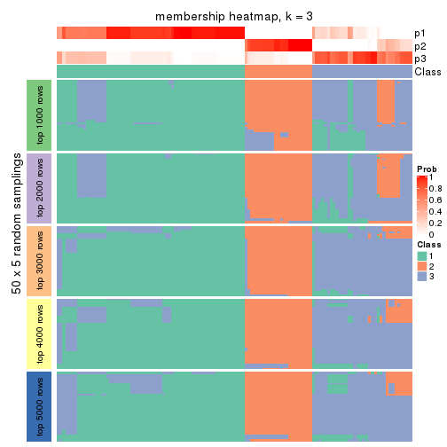</p>

</div>
<div id='tab-SD-kmeans-membership-heatmap-3'>
<pre><code class="r">membership_heatmap(res, k = 4)
</code></pre>

<p>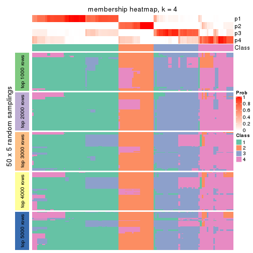</p>

</div>
<div id='tab-SD-kmeans-membership-heatmap-4'>
<pre><code class="r">membership_heatmap(res, k = 5)
</code></pre>

<p></p>

</div>
<div id='tab-SD-kmeans-membership-heatmap-5'>
<pre><code class="r">membership_heatmap(res, k = 6)
</code></pre>

<p></p>

</div>
</div>

As soon as we have had the classes for columns, we can look for signatures
which are significantly different between classes which can be candidate marks
for certain classes. Following are the heatmaps for signatures.


Signature heatmaps where rows are scaled:


<script>
$( function() {
	$( '#tabs-SD-kmeans-get-signatures' ).tabs();
} );
</script>
<div id='tabs-SD-kmeans-get-signatures'>
<ul>
<li><a href='#tab-SD-kmeans-get-signatures-1'>k = 2</a></li>
<li><a href='#tab-SD-kmeans-get-signatures-2'>k = 3</a></li>
<li><a href='#tab-SD-kmeans-get-signatures-3'>k = 4</a></li>
<li><a href='#tab-SD-kmeans-get-signatures-4'>k = 5</a></li>
<li><a href='#tab-SD-kmeans-get-signatures-5'>k = 6</a></li>
</ul>
<div id='tab-SD-kmeans-get-signatures-1'>
<pre><code class="r">get_signatures(res, k = 2)
</code></pre>

<p></p>

</div>
<div id='tab-SD-kmeans-get-signatures-2'>
<pre><code class="r">get_signatures(res, k = 3)
</code></pre>

<p></p>

</div>
<div id='tab-SD-kmeans-get-signatures-3'>
<pre><code class="r">get_signatures(res, k = 4)
</code></pre>

<p></p>

</div>
<div id='tab-SD-kmeans-get-signatures-4'>
<pre><code class="r">get_signatures(res, k = 5)
</code></pre>

<p></p>

</div>
<div id='tab-SD-kmeans-get-signatures-5'>
<pre><code class="r">get_signatures(res, k = 6)
</code></pre>

<p></p>

</div>
</div>


Signature heatmaps where rows are not scaled:


<script>
$( function() {
	$( '#tabs-SD-kmeans-get-signatures-no-scale' ).tabs();
} );
</script>
<div id='tabs-SD-kmeans-get-signatures-no-scale'>
<ul>
<li><a href='#tab-SD-kmeans-get-signatures-no-scale-1'>k = 2</a></li>
<li><a href='#tab-SD-kmeans-get-signatures-no-scale-2'>k = 3</a></li>
<li><a href='#tab-SD-kmeans-get-signatures-no-scale-3'>k = 4</a></li>
<li><a href='#tab-SD-kmeans-get-signatures-no-scale-4'>k = 5</a></li>
<li><a href='#tab-SD-kmeans-get-signatures-no-scale-5'>k = 6</a></li>
</ul>
<div id='tab-SD-kmeans-get-signatures-no-scale-1'>
<pre><code class="r">get_signatures(res, k = 2, scale_rows = FALSE)
</code></pre>

<p></p>

</div>
<div id='tab-SD-kmeans-get-signatures-no-scale-2'>
<pre><code class="r">get_signatures(res, k = 3, scale_rows = FALSE)
</code></pre>

<p></p>

</div>
<div id='tab-SD-kmeans-get-signatures-no-scale-3'>
<pre><code class="r">get_signatures(res, k = 4, scale_rows = FALSE)
</code></pre>

<p></p>

</div>
<div id='tab-SD-kmeans-get-signatures-no-scale-4'>
<pre><code class="r">get_signatures(res, k = 5, scale_rows = FALSE)
</code></pre>

<p></p>

</div>
<div id='tab-SD-kmeans-get-signatures-no-scale-5'>
<pre><code class="r">get_signatures(res, k = 6, scale_rows = FALSE)
</code></pre>

<p></p>

</div>
</div>


Compare the overlap of signatures from different k:

```r
compare_signatures(res)
```


`get_signature()` returns a data frame invisibly. TO get the list of signatures, the function
call should be assigned to a variable explicitly. In following code, if `plot` argument is set
to `FALSE`, no heatmap is plotted while only the differential analysis is performed.

```r
# code only for demonstration
tb = get_signature(res, k = ..., plot = FALSE)
```

An example of the output of `tb` is:

```
#>   which_row         fdr    mean_1    mean_2 scaled_mean_1 scaled_mean_2 km
#> 1        38 0.042760348  8.373488  9.131774    -0.5533452     0.5164555  1
#> 2        40 0.018707592  7.106213  8.469186    -0.6173731     0.5762149  1
#> 3        55 0.019134737 10.221463 11.207825    -0.6159697     0.5749050  1
#> 4        59 0.006059896  5.921854  7.869574    -0.6899429     0.6439467  1
#> 5        60 0.018055526  8.928898 10.211722    -0.6204761     0.5791110  1
#> 6        98 0.009384629 15.714769 14.887706     0.6635654    -0.6193277  2
...
```

The columns in `tb` are:

1. `which_row`: row indices corresponding to the input matrix.
2. `fdr`: FDR for the differential test. 
3. `mean_x`: The mean value in group x.
4. `scaled_mean_x`: The mean value in group x after rows are scaled.
5. `km`: Row groups if k-means clustering is applied to rows.


UMAP plot which shows how samples are separated.


<script>
$( function() {
	$( '#tabs-SD-kmeans-dimension-reduction' ).tabs();
} );
</script>
<div id='tabs-SD-kmeans-dimension-reduction'>
<ul>
<li><a href='#tab-SD-kmeans-dimension-reduction-1'>k = 2</a></li>
<li><a href='#tab-SD-kmeans-dimension-reduction-2'>k = 3</a></li>
<li><a href='#tab-SD-kmeans-dimension-reduction-3'>k = 4</a></li>
<li><a href='#tab-SD-kmeans-dimension-reduction-4'>k = 5</a></li>
<li><a href='#tab-SD-kmeans-dimension-reduction-5'>k = 6</a></li>
</ul>
<div id='tab-SD-kmeans-dimension-reduction-1'>
<pre><code class="r">dimension_reduction(res, k = 2, method = &quot;UMAP&quot;)
</code></pre>

<p></p>

</div>
<div id='tab-SD-kmeans-dimension-reduction-2'>
<pre><code class="r">dimension_reduction(res, k = 3, method = &quot;UMAP&quot;)
</code></pre>

<p></p>

</div>
<div id='tab-SD-kmeans-dimension-reduction-3'>
<pre><code class="r">dimension_reduction(res, k = 4, method = &quot;UMAP&quot;)
</code></pre>

<p></p>

</div>
<div id='tab-SD-kmeans-dimension-reduction-4'>
<pre><code class="r">dimension_reduction(res, k = 5, method = &quot;UMAP&quot;)
</code></pre>

<p></p>

</div>
<div id='tab-SD-kmeans-dimension-reduction-5'>
<pre><code class="r">dimension_reduction(res, k = 6, method = &quot;UMAP&quot;)
</code></pre>

<p></p>

</div>
</div>


Following heatmap shows how subgroups are split when increasing `k`:

```r
collect_classes(res)
```


If matrix rows can be associated to genes, consider to use `functional_enrichment(res,
...)` to perform function enrichment for the signature genes. See [this vignette](http://bioconductor.org/packages/devel/bioc/vignettes/cola/inst/doc/functional_enrichment.html) for more detailed explanations.


 

---------------------------------------------------


### SD:skmeans**


The object with results only for a single top-value method and a single partition method 
can be extracted as:

```r
res = res_list["SD", "skmeans"]
# you can also extract it by
# res = res_list["SD:skmeans"]
```

A summary of `res` and all the functions that can be applied to it:

```r
res
```

```
#> A 'ConsensusPartition' object with k = 2, 3, 4, 5, 6.
#>   On a matrix with 16187 rows and 121 columns.
#>   Top rows (1000, 2000, 3000, 4000, 5000) are extracted by 'SD' method.
#>   Subgroups are detected by 'skmeans' method.
#>   Performed in total 1250 partitions by row resampling.
#>   Best k for subgroups seems to be 3.
#> 
#> Following methods can be applied to this 'ConsensusPartition' object:
#>  [1] "cola_report"             "collect_classes"         "collect_plots"          
#>  [4] "collect_stats"           "colnames"                "compare_signatures"     
#>  [7] "consensus_heatmap"       "dimension_reduction"     "functional_enrichment"  
#> [10] "get_anno_col"            "get_anno"                "get_classes"            
#> [13] "get_consensus"           "get_matrix"              "get_membership"         
#> [16] "get_param"               "get_signatures"          "get_stats"              
#> [19] "is_best_k"               "is_stable_k"             "membership_heatmap"     
#> [22] "ncol"                    "nrow"                    "plot_ecdf"              
#> [25] "rownames"                "select_partition_number" "show"                   
#> [28] "suggest_best_k"          "test_to_known_factors"
```

`collect_plots()` function collects all the plots made from `res` for all `k` (number of partitions)
into one single page to provide an easy and fast comparison between different `k`.

```r
collect_plots(res)
```


The plots are:

- The first row: a plot of the ECDF (empirical cumulative distribution
  function) curves of the consensus matrix for each `k` and the heatmap of
  predicted classes for each `k`.
- The second row: heatmaps of the consensus matrix for each `k`.
- The third row: heatmaps of the membership matrix for each `k`.
- The fouth row: heatmaps of the signatures for each `k`.

All the plots in panels can be made by individual functions and they are
plotted later in this section.

`select_partition_number()` produces several plots showing different
statistics for choosing "optimized" `k`. There are following statistics:

- ECDF curves of the consensus matrix for each `k`;
- 1-PAC. [The PAC
  score](https://en.wikipedia.org/wiki/Consensus_clustering#Over-interpretation_potential_of_consensus_clustering)
  measures the proportion of the ambiguous subgrouping.
- Mean silhouette score.
- Concordance. The mean probability of fiting the consensus class ids in all
  partitions.
- Area increased. Denote $A_k$ as the area under the ECDF curve for current
  `k`, the area increased is defined as $A_k - A_{k-1}$.
- Rand index. The percent of pairs of samples that are both in a same cluster
  or both are not in a same cluster in the partition of k and k-1.
- Jaccard index. The ratio of pairs of samples are both in a same cluster in
  the partition of k and k-1 and the pairs of samples are both in a same
  cluster in the partition k or k-1.

The detailed explanations of these statistics can be found in [the _cola_
vignette](http://bioconductor.org/packages/devel/bioc/vignettes/cola/inst/doc/cola.html#toc_13).

Generally speaking, lower PAC score, higher mean silhouette score or higher
concordance corresponds to better partition. Rand index and Jaccard index
measure how similar the current partition is compared to partition with `k-1`.
If they are too similar, we won't accept `k` is better than `k-1`.

```r
select_partition_number(res)
```


The numeric values for all these statistics can be obtained by `get_stats()`.

```r
get_stats(res)
```

```
#>   k 1-PAC mean_silhouette concordance area_increased  Rand Jaccard
#> 2 2 1.000           0.959       0.984         0.4560 0.548   0.548
#> 3 3 1.000           0.969       0.987         0.4286 0.785   0.613
#> 4 4 0.814           0.730       0.861         0.1356 0.883   0.674
#> 5 5 0.816           0.809       0.863         0.0501 0.959   0.843
#> 6 6 0.821           0.781       0.863         0.0368 0.972   0.880
```

`suggest_best_k()` suggests the best $k$ based on these statistics. The rules are as follows:

- All $k$ with Jaccard index larger than 0.95 are removed because increasing
  $k$ does not provide enough extra information. If all $k$ are removed, it is
  marked as no subgroup is detected.
- For all $k$ with 1-PAC score larger than 0.9, the maximal $k$ is taken as
  the best $k$, and other $k$ are marked as optional $k$.
- If it does not fit the second rule. The $k$ with the maximal vote of the
  highest 1-PAC score, highest mean silhouette, and highest concordance is
  taken as the best $k$.

```r
suggest_best_k(res)
```

```
#> [1] 3
#> attr(,"optional")
#> [1] 2
```

There is also optional best $k$ = 2 that is worth to check.

Following shows the table of the partitions (You need to click the **show/hide
code output** link to see it). The membership matrix (columns with name `p*`)
is inferred by
[`clue::cl_consensus()`](https://www.rdocumentation.org/link/cl_consensus?package=clue)
function with the `SE` method. Basically the value in the membership matrix
represents the probability to belong to a certain group. The finall class
label for an item is determined with the group with highest probability it
belongs to.

In `get_classes()` function, the entropy is calculated from the membership
matrix and the silhouette score is calculated from the consensus matrix.


<script>
$( function() {
	$( '#tabs-SD-skmeans-get-classes' ).tabs();
} );
</script>
<div id='tabs-SD-skmeans-get-classes'>
<ul>
<li><a href='#tab-SD-skmeans-get-classes-1'>k = 2</a></li>
<li><a href='#tab-SD-skmeans-get-classes-2'>k = 3</a></li>
<li><a href='#tab-SD-skmeans-get-classes-3'>k = 4</a></li>
<li><a href='#tab-SD-skmeans-get-classes-4'>k = 5</a></li>
<li><a href='#tab-SD-skmeans-get-classes-5'>k = 6</a></li>
</ul>

<div id='tab-SD-skmeans-get-classes-1'>
<p><a id='tab-SD-skmeans-get-classes-1-a' style='color:#0366d6' href='#'>show/hide code output</a></p>
<pre><code class="r">cbind(get_classes(res, k = 2), get_membership(res, k = 2))
</code></pre>

<pre><code>#&gt;           class entropy silhouette    p1    p2
#&gt; DRR006374     2  0.0000      0.984 0.000 1.000
#&gt; DRR006375     1  0.0000      0.983 1.000 0.000
#&gt; DRR006376     1  0.0000      0.983 1.000 0.000
#&gt; DRR006377     1  0.0000      0.983 1.000 0.000
#&gt; DRR006378     2  0.0000      0.984 0.000 1.000
#&gt; DRR006379     1  0.0000      0.983 1.000 0.000
#&gt; DRR006380     2  0.0000      0.984 0.000 1.000
#&gt; DRR006381     1  0.0000      0.983 1.000 0.000
#&gt; DRR006382     2  0.0000      0.984 0.000 1.000
#&gt; DRR006383     2  0.0000      0.984 0.000 1.000
#&gt; DRR006384     2  0.0000      0.984 0.000 1.000
#&gt; DRR006385     1  0.0000      0.983 1.000 0.000
#&gt; DRR006386     2  0.0000      0.984 0.000 1.000
#&gt; DRR006387     1  0.0000      0.983 1.000 0.000
#&gt; DRR006388     1  0.0000      0.983 1.000 0.000
#&gt; DRR006389     1  0.0000      0.983 1.000 0.000
#&gt; DRR006390     2  0.0000      0.984 0.000 1.000
#&gt; DRR006391     2  0.0000      0.984 0.000 1.000
#&gt; DRR006392     1  0.0000      0.983 1.000 0.000
#&gt; DRR006393     1  0.0000      0.983 1.000 0.000
#&gt; DRR006394     2  0.0000      0.984 0.000 1.000
#&gt; DRR006395     1  0.0000      0.983 1.000 0.000
#&gt; DRR006396     1  0.0000      0.983 1.000 0.000
#&gt; DRR006397     1  0.0000      0.983 1.000 0.000
#&gt; DRR006398     1  0.0000      0.983 1.000 0.000
#&gt; DRR006399     1  0.0000      0.983 1.000 0.000
#&gt; DRR006400     1  0.0000      0.983 1.000 0.000
#&gt; DRR006401     2  0.0000      0.984 0.000 1.000
#&gt; DRR006402     2  0.0000      0.984 0.000 1.000
#&gt; DRR006403     1  0.0000      0.983 1.000 0.000
#&gt; DRR006404     1  0.0000      0.983 1.000 0.000
#&gt; DRR006405     1  0.0000      0.983 1.000 0.000
#&gt; DRR006406     1  0.0000      0.983 1.000 0.000
#&gt; DRR006407     1  0.8763      0.574 0.704 0.296
#&gt; DRR006408     2  0.0000      0.984 0.000 1.000
#&gt; DRR006409     1  0.0000      0.983 1.000 0.000
#&gt; DRR006410     1  0.0000      0.983 1.000 0.000
#&gt; DRR006411     1  0.7219      0.742 0.800 0.200
#&gt; DRR006412     2  0.0000      0.984 0.000 1.000
#&gt; DRR006413     1  0.0000      0.983 1.000 0.000
#&gt; DRR006414     1  0.0000      0.983 1.000 0.000
#&gt; DRR006415     1  0.0000      0.983 1.000 0.000
#&gt; DRR006416     1  0.0000      0.983 1.000 0.000
#&gt; DRR006417     1  0.0000      0.983 1.000 0.000
#&gt; DRR006418     1  0.0000      0.983 1.000 0.000
#&gt; DRR006419     1  0.0000      0.983 1.000 0.000
#&gt; DRR006420     1  0.0000      0.983 1.000 0.000
#&gt; DRR006421     1  0.0000      0.983 1.000 0.000
#&gt; DRR006422     2  0.0000      0.984 0.000 1.000
#&gt; DRR006423     2  0.0000      0.984 0.000 1.000
#&gt; DRR006424     1  0.0000      0.983 1.000 0.000
#&gt; DRR006425     2  0.0000      0.984 0.000 1.000
#&gt; DRR006426     1  0.0000      0.983 1.000 0.000
#&gt; DRR006427     2  0.0000      0.984 0.000 1.000
#&gt; DRR006428     1  0.0000      0.983 1.000 0.000
#&gt; DRR006429     2  0.0000      0.984 0.000 1.000
#&gt; DRR006430     1  0.0000      0.983 1.000 0.000
#&gt; DRR006431     1  0.0000      0.983 1.000 0.000
#&gt; DRR006432     1  0.0000      0.983 1.000 0.000
#&gt; DRR006433     1  0.0000      0.983 1.000 0.000
#&gt; DRR006434     2  0.0000      0.984 0.000 1.000
#&gt; DRR006435     2  0.0000      0.984 0.000 1.000
#&gt; DRR006436     2  0.0000      0.984 0.000 1.000
#&gt; DRR006437     1  0.0000      0.983 1.000 0.000
#&gt; DRR006438     1  0.0000      0.983 1.000 0.000
#&gt; DRR006439     1  0.0000      0.983 1.000 0.000
#&gt; DRR006440     2  0.0000      0.984 0.000 1.000
#&gt; DRR006441     2  0.0000      0.984 0.000 1.000
#&gt; DRR006442     1  0.0000      0.983 1.000 0.000
#&gt; DRR006443     2  0.0000      0.984 0.000 1.000
#&gt; DRR006444     2  0.0000      0.984 0.000 1.000
#&gt; DRR006445     1  0.0000      0.983 1.000 0.000
#&gt; DRR006446     2  0.0000      0.984 0.000 1.000
#&gt; DRR006447     1  0.0000      0.983 1.000 0.000
#&gt; DRR006448     1  0.0000      0.983 1.000 0.000
#&gt; DRR006449     1  0.0000      0.983 1.000 0.000
#&gt; DRR006450     1  0.0000      0.983 1.000 0.000
#&gt; DRR006451     1  0.0000      0.983 1.000 0.000
#&gt; DRR006452     1  0.0000      0.983 1.000 0.000
#&gt; DRR006453     1  0.0000      0.983 1.000 0.000
#&gt; DRR006454     1  0.0000      0.983 1.000 0.000
#&gt; DRR006455     2  0.0000      0.984 0.000 1.000
#&gt; DRR006456     1  0.9710      0.335 0.600 0.400
#&gt; DRR006457     1  0.0000      0.983 1.000 0.000
#&gt; DRR006458     1  0.0000      0.983 1.000 0.000
#&gt; DRR006459     1  0.0000      0.983 1.000 0.000
#&gt; DRR006460     2  0.0000      0.984 0.000 1.000
#&gt; DRR006461     2  0.0000      0.984 0.000 1.000
#&gt; DRR006462     1  0.0000      0.983 1.000 0.000
#&gt; DRR006463     2  0.0000      0.984 0.000 1.000
#&gt; DRR006464     2  0.6887      0.765 0.184 0.816
#&gt; DRR006465     1  0.0000      0.983 1.000 0.000
#&gt; DRR006466     2  0.0376      0.981 0.004 0.996
#&gt; DRR006467     1  0.0000      0.983 1.000 0.000
#&gt; DRR006468     2  0.0000      0.984 0.000 1.000
#&gt; DRR006469     2  0.0000      0.984 0.000 1.000
#&gt; DRR006470     1  0.0000      0.983 1.000 0.000
#&gt; DRR006471     1  0.0000      0.983 1.000 0.000
#&gt; DRR006472     2  0.9775      0.288 0.412 0.588
#&gt; DRR006473     2  0.0000      0.984 0.000 1.000
#&gt; DRR006474     2  0.0000      0.984 0.000 1.000
#&gt; DRR006475     1  0.0000      0.983 1.000 0.000
#&gt; DRR006476     2  0.0000      0.984 0.000 1.000
#&gt; DRR006477     1  0.9710      0.335 0.600 0.400
#&gt; DRR006478     1  0.0000      0.983 1.000 0.000
#&gt; DRR006479     1  0.0000      0.983 1.000 0.000
#&gt; DRR006480     1  0.0000      0.983 1.000 0.000
#&gt; DRR006481     1  0.0000      0.983 1.000 0.000
#&gt; DRR006482     1  0.0000      0.983 1.000 0.000
#&gt; DRR006483     1  0.0000      0.983 1.000 0.000
#&gt; DRR006484     1  0.0000      0.983 1.000 0.000
#&gt; DRR006485     2  0.0000      0.984 0.000 1.000
#&gt; DRR006486     1  0.0000      0.983 1.000 0.000
#&gt; DRR006487     1  0.1633      0.960 0.976 0.024
#&gt; DRR006488     2  0.0000      0.984 0.000 1.000
#&gt; DRR006489     1  0.0000      0.983 1.000 0.000
#&gt; DRR006490     1  0.0000      0.983 1.000 0.000
#&gt; DRR006491     1  0.0000      0.983 1.000 0.000
#&gt; DRR006492     1  0.0000      0.983 1.000 0.000
#&gt; DRR006493     1  0.0000      0.983 1.000 0.000
#&gt; DRR006494     1  0.0000      0.983 1.000 0.000
</code></pre>

<script>
$('#tab-SD-skmeans-get-classes-1-a').parent().next().next().hide();
$('#tab-SD-skmeans-get-classes-1-a').click(function(){
  $('#tab-SD-skmeans-get-classes-1-a').parent().next().next().toggle();
  return(false);
});
</script>
</div>

<div id='tab-SD-skmeans-get-classes-2'>
<p><a id='tab-SD-skmeans-get-classes-2-a' style='color:#0366d6' href='#'>show/hide code output</a></p>
<pre><code class="r">cbind(get_classes(res, k = 3), get_membership(res, k = 3))
</code></pre>

<pre><code>#&gt;           class entropy silhouette    p1   p2    p3
#&gt; DRR006374     2  0.0000      0.995 0.000 1.00 0.000
#&gt; DRR006375     1  0.0000      0.990 1.000 0.00 0.000
#&gt; DRR006376     1  0.0000      0.990 1.000 0.00 0.000
#&gt; DRR006377     3  0.4504      0.748 0.196 0.00 0.804
#&gt; DRR006378     2  0.0000      0.995 0.000 1.00 0.000
#&gt; DRR006379     1  0.0000      0.990 1.000 0.00 0.000
#&gt; DRR006380     2  0.0000      0.995 0.000 1.00 0.000
#&gt; DRR006381     1  0.0000      0.990 1.000 0.00 0.000
#&gt; DRR006382     2  0.0000      0.995 0.000 1.00 0.000
#&gt; DRR006383     2  0.0000      0.995 0.000 1.00 0.000
#&gt; DRR006384     2  0.0000      0.995 0.000 1.00 0.000
#&gt; DRR006385     1  0.0000      0.990 1.000 0.00 0.000
#&gt; DRR006386     2  0.0000      0.995 0.000 1.00 0.000
#&gt; DRR006387     1  0.0000      0.990 1.000 0.00 0.000
#&gt; DRR006388     1  0.0000      0.990 1.000 0.00 0.000
#&gt; DRR006389     1  0.0000      0.990 1.000 0.00 0.000
#&gt; DRR006390     2  0.0000      0.995 0.000 1.00 0.000
#&gt; DRR006391     2  0.0000      0.995 0.000 1.00 0.000
#&gt; DRR006392     1  0.0000      0.990 1.000 0.00 0.000
#&gt; DRR006393     1  0.0000      0.990 1.000 0.00 0.000
#&gt; DRR006394     2  0.0000      0.995 0.000 1.00 0.000
#&gt; DRR006395     1  0.0000      0.990 1.000 0.00 0.000
#&gt; DRR006396     1  0.0000      0.990 1.000 0.00 0.000
#&gt; DRR006397     1  0.0000      0.990 1.000 0.00 0.000
#&gt; DRR006398     1  0.0000      0.990 1.000 0.00 0.000
#&gt; DRR006399     1  0.0000      0.990 1.000 0.00 0.000
#&gt; DRR006400     1  0.0000      0.990 1.000 0.00 0.000
#&gt; DRR006401     2  0.0000      0.995 0.000 1.00 0.000
#&gt; DRR006402     2  0.0000      0.995 0.000 1.00 0.000
#&gt; DRR006403     1  0.0000      0.990 1.000 0.00 0.000
#&gt; DRR006404     1  0.0000      0.990 1.000 0.00 0.000
#&gt; DRR006405     1  0.0000      0.990 1.000 0.00 0.000
#&gt; DRR006406     1  0.0000      0.990 1.000 0.00 0.000
#&gt; DRR006407     1  0.4291      0.780 0.820 0.18 0.000
#&gt; DRR006408     2  0.0000      0.995 0.000 1.00 0.000
#&gt; DRR006409     1  0.0000      0.990 1.000 0.00 0.000
#&gt; DRR006410     1  0.0000      0.990 1.000 0.00 0.000
#&gt; DRR006411     1  0.2537      0.904 0.920 0.08 0.000
#&gt; DRR006412     2  0.0000      0.995 0.000 1.00 0.000
#&gt; DRR006413     1  0.0000      0.990 1.000 0.00 0.000
#&gt; DRR006414     3  0.0000      0.967 0.000 0.00 1.000
#&gt; DRR006415     3  0.0000      0.967 0.000 0.00 1.000
#&gt; DRR006416     1  0.0000      0.990 1.000 0.00 0.000
#&gt; DRR006417     3  0.0000      0.967 0.000 0.00 1.000
#&gt; DRR006418     1  0.0000      0.990 1.000 0.00 0.000
#&gt; DRR006419     3  0.0000      0.967 0.000 0.00 1.000
#&gt; DRR006420     3  0.0000      0.967 0.000 0.00 1.000
#&gt; DRR006421     3  0.0000      0.967 0.000 0.00 1.000
#&gt; DRR006422     2  0.0000      0.995 0.000 1.00 0.000
#&gt; DRR006423     2  0.0000      0.995 0.000 1.00 0.000
#&gt; DRR006424     1  0.0000      0.990 1.000 0.00 0.000
#&gt; DRR006425     2  0.0000      0.995 0.000 1.00 0.000
#&gt; DRR006426     3  0.0000      0.967 0.000 0.00 1.000
#&gt; DRR006427     2  0.0000      0.995 0.000 1.00 0.000
#&gt; DRR006428     3  0.0000      0.967 0.000 0.00 1.000
#&gt; DRR006429     2  0.0000      0.995 0.000 1.00 0.000
#&gt; DRR006430     1  0.0000      0.990 1.000 0.00 0.000
#&gt; DRR006431     1  0.0000      0.990 1.000 0.00 0.000
#&gt; DRR006432     3  0.0000      0.967 0.000 0.00 1.000
#&gt; DRR006433     3  0.0000      0.967 0.000 0.00 1.000
#&gt; DRR006434     2  0.0000      0.995 0.000 1.00 0.000
#&gt; DRR006435     2  0.0000      0.995 0.000 1.00 0.000
#&gt; DRR006436     2  0.0000      0.995 0.000 1.00 0.000
#&gt; DRR006437     1  0.0000      0.990 1.000 0.00 0.000
#&gt; DRR006438     3  0.0000      0.967 0.000 0.00 1.000
#&gt; DRR006439     3  0.0000      0.967 0.000 0.00 1.000
#&gt; DRR006440     2  0.0000      0.995 0.000 1.00 0.000
#&gt; DRR006441     2  0.0000      0.995 0.000 1.00 0.000
#&gt; DRR006442     3  0.0000      0.967 0.000 0.00 1.000
#&gt; DRR006443     2  0.0000      0.995 0.000 1.00 0.000
#&gt; DRR006444     2  0.0000      0.995 0.000 1.00 0.000
#&gt; DRR006445     1  0.0000      0.990 1.000 0.00 0.000
#&gt; DRR006446     2  0.0000      0.995 0.000 1.00 0.000
#&gt; DRR006447     1  0.0000      0.990 1.000 0.00 0.000
#&gt; DRR006448     1  0.0000      0.990 1.000 0.00 0.000
#&gt; DRR006449     1  0.0000      0.990 1.000 0.00 0.000
#&gt; DRR006450     1  0.0000      0.990 1.000 0.00 0.000
#&gt; DRR006451     1  0.0000      0.990 1.000 0.00 0.000
#&gt; DRR006452     1  0.0000      0.990 1.000 0.00 0.000
#&gt; DRR006453     1  0.0000      0.990 1.000 0.00 0.000
#&gt; DRR006454     1  0.0000      0.990 1.000 0.00 0.000
#&gt; DRR006455     2  0.0000      0.995 0.000 1.00 0.000
#&gt; DRR006456     3  0.0000      0.967 0.000 0.00 1.000
#&gt; DRR006457     3  0.0000      0.967 0.000 0.00 1.000
#&gt; DRR006458     1  0.0000      0.990 1.000 0.00 0.000
#&gt; DRR006459     1  0.0000      0.990 1.000 0.00 0.000
#&gt; DRR006460     2  0.0000      0.995 0.000 1.00 0.000
#&gt; DRR006461     2  0.0000      0.995 0.000 1.00 0.000
#&gt; DRR006462     1  0.0000      0.990 1.000 0.00 0.000
#&gt; DRR006463     2  0.0000      0.995 0.000 1.00 0.000
#&gt; DRR006464     2  0.4555      0.746 0.000 0.80 0.200
#&gt; DRR006465     1  0.0000      0.990 1.000 0.00 0.000
#&gt; DRR006466     3  0.0000      0.967 0.000 0.00 1.000
#&gt; DRR006467     1  0.0000      0.990 1.000 0.00 0.000
#&gt; DRR006468     2  0.0000      0.995 0.000 1.00 0.000
#&gt; DRR006469     2  0.0000      0.995 0.000 1.00 0.000
#&gt; DRR006470     3  0.0000      0.967 0.000 0.00 1.000
#&gt; DRR006471     1  0.0000      0.990 1.000 0.00 0.000
#&gt; DRR006472     3  0.0000      0.967 0.000 0.00 1.000
#&gt; DRR006473     2  0.0000      0.995 0.000 1.00 0.000
#&gt; DRR006474     2  0.0000      0.995 0.000 1.00 0.000
#&gt; DRR006475     3  0.6274      0.158 0.456 0.00 0.544
#&gt; DRR006476     2  0.0000      0.995 0.000 1.00 0.000
#&gt; DRR006477     3  0.4555      0.733 0.000 0.20 0.800
#&gt; DRR006478     1  0.0000      0.990 1.000 0.00 0.000
#&gt; DRR006479     3  0.0000      0.967 0.000 0.00 1.000
#&gt; DRR006480     1  0.0000      0.990 1.000 0.00 0.000
#&gt; DRR006481     3  0.0000      0.967 0.000 0.00 1.000
#&gt; DRR006482     1  0.0000      0.990 1.000 0.00 0.000
#&gt; DRR006483     1  0.0000      0.990 1.000 0.00 0.000
#&gt; DRR006484     3  0.0000      0.967 0.000 0.00 1.000
#&gt; DRR006485     2  0.0000      0.995 0.000 1.00 0.000
#&gt; DRR006486     3  0.0000      0.967 0.000 0.00 1.000
#&gt; DRR006487     3  0.0000      0.967 0.000 0.00 1.000
#&gt; DRR006488     2  0.0000      0.995 0.000 1.00 0.000
#&gt; DRR006489     1  0.0000      0.990 1.000 0.00 0.000
#&gt; DRR006490     3  0.0000      0.967 0.000 0.00 1.000
#&gt; DRR006491     3  0.0000      0.967 0.000 0.00 1.000
#&gt; DRR006492     1  0.4555      0.742 0.800 0.00 0.200
#&gt; DRR006493     3  0.0000      0.967 0.000 0.00 1.000
#&gt; DRR006494     1  0.0424      0.983 0.992 0.00 0.008
</code></pre>

<script>
$('#tab-SD-skmeans-get-classes-2-a').parent().next().next().hide();
$('#tab-SD-skmeans-get-classes-2-a').click(function(){
  $('#tab-SD-skmeans-get-classes-2-a').parent().next().next().toggle();
  return(false);
});
</script>
</div>

<div id='tab-SD-skmeans-get-classes-3'>
<p><a id='tab-SD-skmeans-get-classes-3-a' style='color:#0366d6' href='#'>show/hide code output</a></p>
<pre><code class="r">cbind(get_classes(res, k = 4), get_membership(res, k = 4))
</code></pre>

<pre><code>#&gt;           class entropy silhouette    p1    p2    p3    p4
#&gt; DRR006374     2  0.0000     0.9807 0.000 1.000 0.000 0.000
#&gt; DRR006375     1  0.2814     0.5723 0.868 0.000 0.000 0.132
#&gt; DRR006376     4  0.4866     0.5466 0.404 0.000 0.000 0.596
#&gt; DRR006377     1  0.7236    -0.0799 0.520 0.000 0.168 0.312
#&gt; DRR006378     2  0.0000     0.9807 0.000 1.000 0.000 0.000
#&gt; DRR006379     4  0.4866     0.5466 0.404 0.000 0.000 0.596
#&gt; DRR006380     2  0.0000     0.9807 0.000 1.000 0.000 0.000
#&gt; DRR006381     1  0.4830     0.3937 0.608 0.000 0.000 0.392
#&gt; DRR006382     2  0.0000     0.9807 0.000 1.000 0.000 0.000
#&gt; DRR006383     2  0.0000     0.9807 0.000 1.000 0.000 0.000
#&gt; DRR006384     2  0.0000     0.9807 0.000 1.000 0.000 0.000
#&gt; DRR006385     4  0.4454     0.3303 0.308 0.000 0.000 0.692
#&gt; DRR006386     2  0.0000     0.9807 0.000 1.000 0.000 0.000
#&gt; DRR006387     1  0.4790    -0.1208 0.620 0.000 0.000 0.380
#&gt; DRR006388     4  0.2704     0.5215 0.124 0.000 0.000 0.876
#&gt; DRR006389     4  0.2704     0.5215 0.124 0.000 0.000 0.876
#&gt; DRR006390     2  0.0000     0.9807 0.000 1.000 0.000 0.000
#&gt; DRR006391     2  0.0000     0.9807 0.000 1.000 0.000 0.000
#&gt; DRR006392     1  0.1557     0.6573 0.944 0.000 0.000 0.056
#&gt; DRR006393     1  0.1557     0.6573 0.944 0.000 0.000 0.056
#&gt; DRR006394     2  0.0817     0.9625 0.000 0.976 0.000 0.024
#&gt; DRR006395     4  0.4866     0.5466 0.404 0.000 0.000 0.596
#&gt; DRR006396     4  0.4304     0.3826 0.284 0.000 0.000 0.716
#&gt; DRR006397     4  0.2408     0.5339 0.104 0.000 0.000 0.896
#&gt; DRR006398     4  0.2408     0.5339 0.104 0.000 0.000 0.896
#&gt; DRR006399     4  0.4866     0.5466 0.404 0.000 0.000 0.596
#&gt; DRR006400     4  0.4866     0.5466 0.404 0.000 0.000 0.596
#&gt; DRR006401     2  0.0000     0.9807 0.000 1.000 0.000 0.000
#&gt; DRR006402     2  0.0000     0.9807 0.000 1.000 0.000 0.000
#&gt; DRR006403     4  0.4866     0.5466 0.404 0.000 0.000 0.596
#&gt; DRR006404     4  0.4866     0.5466 0.404 0.000 0.000 0.596
#&gt; DRR006405     4  0.4999     0.3963 0.492 0.000 0.000 0.508
#&gt; DRR006406     4  0.4999     0.3963 0.492 0.000 0.000 0.508
#&gt; DRR006407     4  0.4605     0.5312 0.336 0.000 0.000 0.664
#&gt; DRR006408     2  0.3688     0.7527 0.000 0.792 0.000 0.208
#&gt; DRR006409     1  0.0000     0.6559 1.000 0.000 0.000 0.000
#&gt; DRR006410     1  0.4431     0.1607 0.696 0.000 0.000 0.304
#&gt; DRR006411     4  0.0336     0.5345 0.008 0.000 0.000 0.992
#&gt; DRR006412     2  0.0000     0.9807 0.000 1.000 0.000 0.000
#&gt; DRR006413     1  0.4830     0.3937 0.608 0.000 0.000 0.392
#&gt; DRR006414     3  0.0000     0.9464 0.000 0.000 1.000 0.000
#&gt; DRR006415     3  0.0000     0.9464 0.000 0.000 1.000 0.000
#&gt; DRR006416     1  0.4967     0.3319 0.548 0.000 0.000 0.452
#&gt; DRR006417     3  0.2342     0.9396 0.080 0.000 0.912 0.008
#&gt; DRR006418     1  0.4866     0.3295 0.596 0.000 0.000 0.404
#&gt; DRR006419     3  0.2081     0.9389 0.084 0.000 0.916 0.000
#&gt; DRR006420     3  0.3219     0.8661 0.164 0.000 0.836 0.000
#&gt; DRR006421     3  0.1557     0.9492 0.056 0.000 0.944 0.000
#&gt; DRR006422     2  0.0000     0.9807 0.000 1.000 0.000 0.000
#&gt; DRR006423     2  0.0000     0.9807 0.000 1.000 0.000 0.000
#&gt; DRR006424     1  0.1637     0.6565 0.940 0.000 0.000 0.060
#&gt; DRR006425     2  0.0000     0.9807 0.000 1.000 0.000 0.000
#&gt; DRR006426     3  0.3828     0.9050 0.084 0.000 0.848 0.068
#&gt; DRR006427     2  0.0000     0.9807 0.000 1.000 0.000 0.000
#&gt; DRR006428     3  0.1557     0.9492 0.056 0.000 0.944 0.000
#&gt; DRR006429     2  0.0000     0.9807 0.000 1.000 0.000 0.000
#&gt; DRR006430     1  0.1557     0.6573 0.944 0.000 0.000 0.056
#&gt; DRR006431     1  0.1557     0.6573 0.944 0.000 0.000 0.056
#&gt; DRR006432     3  0.4083     0.8919 0.100 0.000 0.832 0.068
#&gt; DRR006433     3  0.0000     0.9464 0.000 0.000 1.000 0.000
#&gt; DRR006434     2  0.0000     0.9807 0.000 1.000 0.000 0.000
#&gt; DRR006435     2  0.0000     0.9807 0.000 1.000 0.000 0.000
#&gt; DRR006436     2  0.0000     0.9807 0.000 1.000 0.000 0.000
#&gt; DRR006437     4  0.4304     0.3826 0.284 0.000 0.000 0.716
#&gt; DRR006438     3  0.2081     0.9389 0.084 0.000 0.916 0.000
#&gt; DRR006439     3  0.1637     0.9481 0.060 0.000 0.940 0.000
#&gt; DRR006440     2  0.1867     0.9286 0.000 0.928 0.072 0.000
#&gt; DRR006441     2  0.0000     0.9807 0.000 1.000 0.000 0.000
#&gt; DRR006442     3  0.0000     0.9464 0.000 0.000 1.000 0.000
#&gt; DRR006443     2  0.1867     0.9286 0.000 0.928 0.072 0.000
#&gt; DRR006444     2  0.0000     0.9807 0.000 1.000 0.000 0.000
#&gt; DRR006445     1  0.4972     0.2926 0.544 0.000 0.000 0.456
#&gt; DRR006446     2  0.0000     0.9807 0.000 1.000 0.000 0.000
#&gt; DRR006447     1  0.4998     0.2788 0.512 0.000 0.000 0.488
#&gt; DRR006448     4  0.4855     0.5475 0.400 0.000 0.000 0.600
#&gt; DRR006449     1  0.2704     0.5851 0.876 0.000 0.000 0.124
#&gt; DRR006450     1  0.4830     0.3937 0.608 0.000 0.000 0.392
#&gt; DRR006451     4  0.1792     0.5550 0.068 0.000 0.000 0.932
#&gt; DRR006452     1  0.4916     0.3495 0.576 0.000 0.000 0.424
#&gt; DRR006453     1  0.4830     0.3937 0.608 0.000 0.000 0.392
#&gt; DRR006454     4  0.1637     0.5425 0.060 0.000 0.000 0.940
#&gt; DRR006455     2  0.0000     0.9807 0.000 1.000 0.000 0.000
#&gt; DRR006456     3  0.0000     0.9464 0.000 0.000 1.000 0.000
#&gt; DRR006457     3  0.0707     0.9493 0.020 0.000 0.980 0.000
#&gt; DRR006458     1  0.0000     0.6559 1.000 0.000 0.000 0.000
#&gt; DRR006459     1  0.0000     0.6559 1.000 0.000 0.000 0.000
#&gt; DRR006460     2  0.0000     0.9807 0.000 1.000 0.000 0.000
#&gt; DRR006461     2  0.0000     0.9807 0.000 1.000 0.000 0.000
#&gt; DRR006462     1  0.4925    -0.2607 0.572 0.000 0.000 0.428
#&gt; DRR006463     2  0.1867     0.9286 0.000 0.928 0.072 0.000
#&gt; DRR006464     2  0.5882     0.7333 0.112 0.756 0.064 0.068
#&gt; DRR006465     1  0.1557     0.6573 0.944 0.000 0.000 0.056
#&gt; DRR006466     3  0.0000     0.9464 0.000 0.000 1.000 0.000
#&gt; DRR006467     1  0.1557     0.6573 0.944 0.000 0.000 0.056
#&gt; DRR006468     2  0.0000     0.9807 0.000 1.000 0.000 0.000
#&gt; DRR006469     2  0.0000     0.9807 0.000 1.000 0.000 0.000
#&gt; DRR006470     3  0.3828     0.9050 0.084 0.000 0.848 0.068
#&gt; DRR006471     1  0.0000     0.6559 1.000 0.000 0.000 0.000
#&gt; DRR006472     3  0.0672     0.9478 0.008 0.000 0.984 0.008
#&gt; DRR006473     2  0.0000     0.9807 0.000 1.000 0.000 0.000
#&gt; DRR006474     2  0.0000     0.9807 0.000 1.000 0.000 0.000
#&gt; DRR006475     1  0.0817     0.6402 0.976 0.000 0.024 0.000
#&gt; DRR006476     2  0.0000     0.9807 0.000 1.000 0.000 0.000
#&gt; DRR006477     3  0.2918     0.8267 0.000 0.116 0.876 0.008
#&gt; DRR006478     1  0.1474     0.6580 0.948 0.000 0.000 0.052
#&gt; DRR006479     3  0.2081     0.9389 0.084 0.000 0.916 0.000
#&gt; DRR006480     1  0.0000     0.6559 1.000 0.000 0.000 0.000
#&gt; DRR006481     3  0.1557     0.9492 0.056 0.000 0.944 0.000
#&gt; DRR006482     4  0.4304     0.3826 0.284 0.000 0.000 0.716
#&gt; DRR006483     1  0.0000     0.6559 1.000 0.000 0.000 0.000
#&gt; DRR006484     3  0.1557     0.9492 0.056 0.000 0.944 0.000
#&gt; DRR006485     2  0.1867     0.9286 0.000 0.928 0.072 0.000
#&gt; DRR006486     1  0.4985    -0.0659 0.532 0.000 0.468 0.000
#&gt; DRR006487     3  0.0000     0.9464 0.000 0.000 1.000 0.000
#&gt; DRR006488     2  0.0000     0.9807 0.000 1.000 0.000 0.000
#&gt; DRR006489     1  0.1557     0.6573 0.944 0.000 0.000 0.056
#&gt; DRR006490     3  0.1557     0.9492 0.056 0.000 0.944 0.000
#&gt; DRR006491     3  0.0188     0.9473 0.004 0.000 0.996 0.000
#&gt; DRR006492     1  0.2589     0.5493 0.884 0.000 0.116 0.000
#&gt; DRR006493     3  0.0000     0.9464 0.000 0.000 1.000 0.000
#&gt; DRR006494     1  0.0000     0.6559 1.000 0.000 0.000 0.000
</code></pre>

<script>
$('#tab-SD-skmeans-get-classes-3-a').parent().next().next().hide();
$('#tab-SD-skmeans-get-classes-3-a').click(function(){
  $('#tab-SD-skmeans-get-classes-3-a').parent().next().next().toggle();
  return(false);
});
</script>
</div>

<div id='tab-SD-skmeans-get-classes-4'>
<p><a id='tab-SD-skmeans-get-classes-4-a' style='color:#0366d6' href='#'>show/hide code output</a></p>
<pre><code class="r">cbind(get_classes(res, k = 5), get_membership(res, k = 5))
</code></pre>

<pre><code>#&gt;           class entropy silhouette    p1    p2    p3    p4    p5
#&gt; DRR006374     2  0.0000     0.9662 0.000 1.000 0.000 0.000 0.000
#&gt; DRR006375     1  0.3146     0.7167 0.844 0.000 0.000 0.028 0.128
#&gt; DRR006376     4  0.5190     0.8546 0.096 0.000 0.000 0.668 0.236
#&gt; DRR006377     4  0.2302     0.5765 0.048 0.000 0.016 0.916 0.020
#&gt; DRR006378     2  0.0000     0.9662 0.000 1.000 0.000 0.000 0.000
#&gt; DRR006379     4  0.5142     0.8528 0.088 0.000 0.000 0.668 0.244
#&gt; DRR006380     2  0.0000     0.9662 0.000 1.000 0.000 0.000 0.000
#&gt; DRR006381     1  0.2179     0.7924 0.888 0.000 0.000 0.000 0.112
#&gt; DRR006382     2  0.0771     0.9519 0.000 0.976 0.000 0.020 0.004
#&gt; DRR006383     2  0.0771     0.9519 0.000 0.976 0.000 0.020 0.004
#&gt; DRR006384     2  0.0000     0.9662 0.000 1.000 0.000 0.000 0.000
#&gt; DRR006385     5  0.2660     0.7601 0.128 0.000 0.000 0.008 0.864
#&gt; DRR006386     2  0.0000     0.9662 0.000 1.000 0.000 0.000 0.000
#&gt; DRR006387     1  0.4380     0.4887 0.708 0.000 0.000 0.032 0.260
#&gt; DRR006388     5  0.1582     0.7762 0.028 0.000 0.000 0.028 0.944
#&gt; DRR006389     5  0.1582     0.7762 0.028 0.000 0.000 0.028 0.944
#&gt; DRR006390     2  0.0000     0.9662 0.000 1.000 0.000 0.000 0.000
#&gt; DRR006391     2  0.0000     0.9662 0.000 1.000 0.000 0.000 0.000
#&gt; DRR006392     1  0.0162     0.8526 0.996 0.000 0.000 0.000 0.004
#&gt; DRR006393     1  0.0162     0.8526 0.996 0.000 0.000 0.000 0.004
#&gt; DRR006394     2  0.1300     0.9321 0.000 0.956 0.000 0.028 0.016
#&gt; DRR006395     4  0.5190     0.8546 0.096 0.000 0.000 0.668 0.236
#&gt; DRR006396     5  0.4718     0.4332 0.344 0.000 0.000 0.028 0.628
#&gt; DRR006397     5  0.0865     0.7785 0.024 0.000 0.000 0.004 0.972
#&gt; DRR006398     5  0.0865     0.7785 0.024 0.000 0.000 0.004 0.972
#&gt; DRR006399     4  0.5142     0.8528 0.088 0.000 0.000 0.668 0.244
#&gt; DRR006400     4  0.5142     0.8528 0.088 0.000 0.000 0.668 0.244
#&gt; DRR006401     2  0.0000     0.9662 0.000 1.000 0.000 0.000 0.000
#&gt; DRR006402     2  0.0000     0.9662 0.000 1.000 0.000 0.000 0.000
#&gt; DRR006403     4  0.5190     0.8546 0.096 0.000 0.000 0.668 0.236
#&gt; DRR006404     4  0.5190     0.8546 0.096 0.000 0.000 0.668 0.236
#&gt; DRR006405     4  0.5115     0.7731 0.168 0.000 0.000 0.696 0.136
#&gt; DRR006406     4  0.5115     0.7731 0.168 0.000 0.000 0.696 0.136
#&gt; DRR006407     4  0.4325     0.8021 0.044 0.000 0.000 0.736 0.220
#&gt; DRR006408     4  0.4150     0.3590 0.000 0.388 0.000 0.612 0.000
#&gt; DRR006409     1  0.0404     0.8500 0.988 0.000 0.012 0.000 0.000
#&gt; DRR006410     1  0.3944     0.6029 0.768 0.000 0.000 0.032 0.200
#&gt; DRR006411     5  0.2280     0.6739 0.000 0.000 0.000 0.120 0.880
#&gt; DRR006412     2  0.0000     0.9662 0.000 1.000 0.000 0.000 0.000
#&gt; DRR006413     1  0.3837     0.5467 0.692 0.000 0.000 0.000 0.308
#&gt; DRR006414     3  0.0798     0.8359 0.016 0.000 0.976 0.008 0.000
#&gt; DRR006415     3  0.1205     0.8271 0.000 0.000 0.956 0.040 0.004
#&gt; DRR006416     1  0.4520     0.5656 0.684 0.000 0.000 0.032 0.284
#&gt; DRR006417     3  0.5866     0.7159 0.004 0.000 0.604 0.260 0.132
#&gt; DRR006418     1  0.7036     0.0460 0.420 0.000 0.012 0.280 0.288
#&gt; DRR006419     3  0.6153     0.7304 0.024 0.000 0.620 0.220 0.136
#&gt; DRR006420     3  0.5221     0.7345 0.172 0.000 0.696 0.128 0.004
#&gt; DRR006421     3  0.2439     0.8502 0.004 0.000 0.876 0.120 0.000
#&gt; DRR006422     2  0.0000     0.9662 0.000 1.000 0.000 0.000 0.000
#&gt; DRR006423     2  0.0000     0.9662 0.000 1.000 0.000 0.000 0.000
#&gt; DRR006424     1  0.0510     0.8494 0.984 0.000 0.000 0.000 0.016
#&gt; DRR006425     2  0.0000     0.9662 0.000 1.000 0.000 0.000 0.000
#&gt; DRR006426     3  0.6410     0.6783 0.016 0.000 0.556 0.280 0.148
#&gt; DRR006427     2  0.0000     0.9662 0.000 1.000 0.000 0.000 0.000
#&gt; DRR006428     3  0.2416     0.8515 0.012 0.000 0.888 0.100 0.000
#&gt; DRR006429     2  0.0000     0.9662 0.000 1.000 0.000 0.000 0.000
#&gt; DRR006430     1  0.0162     0.8526 0.996 0.000 0.000 0.000 0.004
#&gt; DRR006431     1  0.0162     0.8526 0.996 0.000 0.000 0.000 0.004
#&gt; DRR006432     3  0.6427     0.6755 0.016 0.000 0.552 0.284 0.148
#&gt; DRR006433     3  0.0609     0.8353 0.000 0.000 0.980 0.020 0.000
#&gt; DRR006434     2  0.0290     0.9620 0.000 0.992 0.000 0.008 0.000
#&gt; DRR006435     2  0.0000     0.9662 0.000 1.000 0.000 0.000 0.000
#&gt; DRR006436     2  0.0000     0.9662 0.000 1.000 0.000 0.000 0.000
#&gt; DRR006437     5  0.3146     0.7372 0.128 0.000 0.000 0.028 0.844
#&gt; DRR006438     3  0.3536     0.8372 0.032 0.000 0.812 0.156 0.000
#&gt; DRR006439     3  0.2722     0.8496 0.020 0.000 0.872 0.108 0.000
#&gt; DRR006440     2  0.3712     0.8161 0.000 0.820 0.124 0.052 0.004
#&gt; DRR006441     2  0.0000     0.9662 0.000 1.000 0.000 0.000 0.000
#&gt; DRR006442     3  0.0898     0.8357 0.008 0.000 0.972 0.020 0.000
#&gt; DRR006443     2  0.3712     0.8161 0.000 0.820 0.124 0.052 0.004
#&gt; DRR006444     2  0.0000     0.9662 0.000 1.000 0.000 0.000 0.000
#&gt; DRR006445     1  0.4283     0.4573 0.644 0.000 0.000 0.008 0.348
#&gt; DRR006446     2  0.0000     0.9662 0.000 1.000 0.000 0.000 0.000
#&gt; DRR006447     5  0.3615     0.6907 0.156 0.000 0.000 0.036 0.808
#&gt; DRR006448     4  0.4995     0.8350 0.068 0.000 0.000 0.668 0.264
#&gt; DRR006449     1  0.1697     0.8171 0.932 0.000 0.000 0.008 0.060
#&gt; DRR006450     1  0.3837     0.5473 0.692 0.000 0.000 0.000 0.308
#&gt; DRR006451     4  0.4348     0.7558 0.016 0.000 0.000 0.668 0.316
#&gt; DRR006452     1  0.4147     0.5248 0.676 0.000 0.000 0.008 0.316
#&gt; DRR006453     1  0.2605     0.7613 0.852 0.000 0.000 0.000 0.148
#&gt; DRR006454     5  0.0898     0.7744 0.020 0.000 0.000 0.008 0.972
#&gt; DRR006455     2  0.0000     0.9662 0.000 1.000 0.000 0.000 0.000
#&gt; DRR006456     3  0.1282     0.8252 0.000 0.000 0.952 0.044 0.004
#&gt; DRR006457     3  0.2074     0.8515 0.000 0.000 0.896 0.104 0.000
#&gt; DRR006458     1  0.0000     0.8519 1.000 0.000 0.000 0.000 0.000
#&gt; DRR006459     1  0.0404     0.8500 0.988 0.000 0.012 0.000 0.000
#&gt; DRR006460     2  0.0000     0.9662 0.000 1.000 0.000 0.000 0.000
#&gt; DRR006461     2  0.0290     0.9620 0.000 0.992 0.000 0.008 0.000
#&gt; DRR006462     5  0.5115     0.0997 0.480 0.000 0.000 0.036 0.484
#&gt; DRR006463     2  0.3712     0.8161 0.000 0.820 0.124 0.052 0.004
#&gt; DRR006464     2  0.6433     0.3989 0.004 0.560 0.012 0.280 0.144
#&gt; DRR006465     1  0.0162     0.8526 0.996 0.000 0.000 0.000 0.004
#&gt; DRR006466     3  0.1430     0.8221 0.000 0.000 0.944 0.052 0.004
#&gt; DRR006467     1  0.0162     0.8526 0.996 0.000 0.000 0.000 0.004
#&gt; DRR006468     2  0.0000     0.9662 0.000 1.000 0.000 0.000 0.000
#&gt; DRR006469     2  0.0000     0.9662 0.000 1.000 0.000 0.000 0.000
#&gt; DRR006470     3  0.6308     0.6866 0.016 0.000 0.568 0.280 0.136
#&gt; DRR006471     1  0.1012     0.8432 0.968 0.000 0.020 0.012 0.000
#&gt; DRR006472     3  0.4326     0.8042 0.000 0.000 0.708 0.264 0.028
#&gt; DRR006473     2  0.0000     0.9662 0.000 1.000 0.000 0.000 0.000
#&gt; DRR006474     2  0.0000     0.9662 0.000 1.000 0.000 0.000 0.000
#&gt; DRR006475     1  0.1403     0.8345 0.952 0.000 0.024 0.024 0.000
#&gt; DRR006476     2  0.0000     0.9662 0.000 1.000 0.000 0.000 0.000
#&gt; DRR006477     3  0.4527     0.5356 0.000 0.028 0.696 0.272 0.004
#&gt; DRR006478     1  0.0162     0.8526 0.996 0.000 0.000 0.000 0.004
#&gt; DRR006479     3  0.4454     0.7955 0.112 0.000 0.760 0.128 0.000
#&gt; DRR006480     1  0.0404     0.8500 0.988 0.000 0.012 0.000 0.000
#&gt; DRR006481     3  0.2848     0.8439 0.004 0.000 0.840 0.156 0.000
#&gt; DRR006482     5  0.2624     0.7582 0.116 0.000 0.000 0.012 0.872
#&gt; DRR006483     1  0.1012     0.8432 0.968 0.000 0.020 0.012 0.000
#&gt; DRR006484     3  0.2439     0.8502 0.004 0.000 0.876 0.120 0.000
#&gt; DRR006485     2  0.3712     0.8161 0.000 0.820 0.124 0.052 0.004
#&gt; DRR006486     1  0.2570     0.7809 0.888 0.000 0.084 0.028 0.000
#&gt; DRR006487     3  0.1205     0.8271 0.000 0.000 0.956 0.040 0.004
#&gt; DRR006488     2  0.0000     0.9662 0.000 1.000 0.000 0.000 0.000
#&gt; DRR006489     1  0.0162     0.8526 0.996 0.000 0.000 0.000 0.004
#&gt; DRR006490     3  0.2470     0.8513 0.012 0.000 0.884 0.104 0.000
#&gt; DRR006491     3  0.0290     0.8396 0.008 0.000 0.992 0.000 0.000
#&gt; DRR006492     1  0.1638     0.8202 0.932 0.000 0.064 0.004 0.000
#&gt; DRR006493     3  0.1043     0.8286 0.000 0.000 0.960 0.040 0.000
#&gt; DRR006494     1  0.0510     0.8490 0.984 0.000 0.016 0.000 0.000
</code></pre>

<script>
$('#tab-SD-skmeans-get-classes-4-a').parent().next().next().hide();
$('#tab-SD-skmeans-get-classes-4-a').click(function(){
  $('#tab-SD-skmeans-get-classes-4-a').parent().next().next().toggle();
  return(false);
});
</script>
</div>

<div id='tab-SD-skmeans-get-classes-5'>
<p><a id='tab-SD-skmeans-get-classes-5-a' style='color:#0366d6' href='#'>show/hide code output</a></p>
<pre><code class="r">cbind(get_classes(res, k = 6), get_membership(res, k = 6))
</code></pre>

<pre><code>#&gt;           class entropy silhouette    p1    p2    p3    p4    p5    p6
#&gt; DRR006374     2  0.0260     0.9319 0.000 0.992 0.000 0.008 0.000 0.000
#&gt; DRR006375     1  0.2066     0.8033 0.904 0.000 0.000 0.024 0.000 0.072
#&gt; DRR006376     4  0.2558     0.9106 0.028 0.000 0.000 0.868 0.000 0.104
#&gt; DRR006377     4  0.1672     0.8103 0.004 0.000 0.000 0.932 0.048 0.016
#&gt; DRR006378     2  0.0622     0.9304 0.000 0.980 0.000 0.012 0.008 0.000
#&gt; DRR006379     4  0.2445     0.9097 0.020 0.000 0.000 0.872 0.000 0.108
#&gt; DRR006380     2  0.0993     0.9210 0.000 0.964 0.000 0.012 0.024 0.000
#&gt; DRR006381     1  0.2994     0.7056 0.788 0.000 0.000 0.004 0.000 0.208
#&gt; DRR006382     2  0.2776     0.8463 0.000 0.860 0.004 0.020 0.112 0.004
#&gt; DRR006383     2  0.3164     0.8346 0.000 0.844 0.020 0.020 0.112 0.004
#&gt; DRR006384     2  0.0146     0.9330 0.000 0.996 0.000 0.004 0.000 0.000
#&gt; DRR006385     6  0.1225     0.8348 0.036 0.000 0.000 0.012 0.000 0.952
#&gt; DRR006386     2  0.0000     0.9338 0.000 1.000 0.000 0.000 0.000 0.000
#&gt; DRR006387     1  0.4325     0.6021 0.692 0.000 0.000 0.064 0.000 0.244
#&gt; DRR006388     6  0.1442     0.8184 0.004 0.000 0.000 0.040 0.012 0.944
#&gt; DRR006389     6  0.1442     0.8184 0.004 0.000 0.000 0.040 0.012 0.944
#&gt; DRR006390     2  0.0622     0.9304 0.000 0.980 0.000 0.012 0.008 0.000
#&gt; DRR006391     2  0.0622     0.9304 0.000 0.980 0.000 0.012 0.008 0.000
#&gt; DRR006392     1  0.0291     0.8530 0.992 0.000 0.000 0.004 0.000 0.004
#&gt; DRR006393     1  0.0291     0.8530 0.992 0.000 0.000 0.004 0.000 0.004
#&gt; DRR006394     2  0.2737     0.8424 0.000 0.868 0.000 0.096 0.012 0.024
#&gt; DRR006395     4  0.2573     0.9087 0.024 0.000 0.000 0.864 0.000 0.112
#&gt; DRR006396     6  0.3817     0.5695 0.252 0.000 0.000 0.028 0.000 0.720
#&gt; DRR006397     6  0.0767     0.8364 0.004 0.000 0.000 0.008 0.012 0.976
#&gt; DRR006398     6  0.0767     0.8364 0.004 0.000 0.000 0.008 0.012 0.976
#&gt; DRR006399     4  0.2480     0.9111 0.024 0.000 0.000 0.872 0.000 0.104
#&gt; DRR006400     4  0.2480     0.9111 0.024 0.000 0.000 0.872 0.000 0.104
#&gt; DRR006401     2  0.0000     0.9338 0.000 1.000 0.000 0.000 0.000 0.000
#&gt; DRR006402     2  0.0000     0.9338 0.000 1.000 0.000 0.000 0.000 0.000
#&gt; DRR006403     4  0.2480     0.9111 0.024 0.000 0.000 0.872 0.000 0.104
#&gt; DRR006404     4  0.2558     0.9106 0.028 0.000 0.000 0.868 0.000 0.104
#&gt; DRR006405     4  0.1320     0.8583 0.036 0.000 0.000 0.948 0.000 0.016
#&gt; DRR006406     4  0.1320     0.8583 0.036 0.000 0.000 0.948 0.000 0.016
#&gt; DRR006407     4  0.1364     0.8574 0.004 0.000 0.000 0.944 0.004 0.048
#&gt; DRR006408     4  0.3927     0.4389 0.000 0.344 0.000 0.644 0.012 0.000
#&gt; DRR006409     1  0.0363     0.8512 0.988 0.000 0.012 0.000 0.000 0.000
#&gt; DRR006410     1  0.2897     0.7656 0.852 0.000 0.000 0.060 0.000 0.088
#&gt; DRR006411     6  0.4552     0.3330 0.000 0.000 0.000 0.060 0.300 0.640
#&gt; DRR006412     2  0.0520     0.9314 0.000 0.984 0.000 0.008 0.008 0.000
#&gt; DRR006413     1  0.3979     0.2419 0.540 0.000 0.000 0.004 0.000 0.456
#&gt; DRR006414     3  0.1297     0.7731 0.012 0.000 0.948 0.000 0.040 0.000
#&gt; DRR006415     3  0.2772     0.7167 0.000 0.000 0.816 0.004 0.180 0.000
#&gt; DRR006416     1  0.4871     0.4939 0.616 0.000 0.000 0.088 0.000 0.296
#&gt; DRR006417     5  0.4094     0.7494 0.000 0.000 0.324 0.000 0.652 0.024
#&gt; DRR006418     5  0.6115     0.6119 0.108 0.000 0.036 0.072 0.652 0.132
#&gt; DRR006419     5  0.4274     0.7319 0.004 0.000 0.336 0.000 0.636 0.024
#&gt; DRR006420     3  0.5478     0.0937 0.352 0.000 0.512 0.000 0.136 0.000
#&gt; DRR006421     3  0.1524     0.7591 0.008 0.000 0.932 0.000 0.060 0.000
#&gt; DRR006422     2  0.0000     0.9338 0.000 1.000 0.000 0.000 0.000 0.000
#&gt; DRR006423     2  0.0260     0.9327 0.000 0.992 0.000 0.000 0.008 0.000
#&gt; DRR006424     1  0.0622     0.8504 0.980 0.000 0.000 0.008 0.000 0.012
#&gt; DRR006425     2  0.0405     0.9322 0.000 0.988 0.000 0.004 0.008 0.000
#&gt; DRR006426     5  0.5291     0.7828 0.000 0.000 0.232 0.060 0.652 0.056
#&gt; DRR006427     2  0.0000     0.9338 0.000 1.000 0.000 0.000 0.000 0.000
#&gt; DRR006428     3  0.1320     0.7675 0.016 0.000 0.948 0.000 0.036 0.000
#&gt; DRR006429     2  0.0622     0.9304 0.000 0.980 0.000 0.012 0.008 0.000
#&gt; DRR006430     1  0.0146     0.8534 0.996 0.000 0.000 0.004 0.000 0.000
#&gt; DRR006431     1  0.0146     0.8534 0.996 0.000 0.000 0.004 0.000 0.000
#&gt; DRR006432     5  0.5222     0.7713 0.000 0.000 0.168 0.076 0.688 0.068
#&gt; DRR006433     3  0.2488     0.7555 0.004 0.000 0.864 0.008 0.124 0.000
#&gt; DRR006434     2  0.1889     0.8915 0.000 0.920 0.000 0.020 0.056 0.004
#&gt; DRR006435     2  0.0000     0.9338 0.000 1.000 0.000 0.000 0.000 0.000
#&gt; DRR006436     2  0.0000     0.9338 0.000 1.000 0.000 0.000 0.000 0.000
#&gt; DRR006437     6  0.1700     0.8238 0.048 0.000 0.000 0.024 0.000 0.928
#&gt; DRR006438     3  0.2768     0.6608 0.012 0.000 0.832 0.000 0.156 0.000
#&gt; DRR006439     3  0.1657     0.7585 0.016 0.000 0.928 0.000 0.056 0.000
#&gt; DRR006440     2  0.5282     0.5490 0.000 0.600 0.052 0.028 0.316 0.004
#&gt; DRR006441     2  0.0622     0.9304 0.000 0.980 0.000 0.012 0.008 0.000
#&gt; DRR006442     3  0.1500     0.7714 0.012 0.000 0.936 0.000 0.052 0.000
#&gt; DRR006443     2  0.5282     0.5490 0.000 0.600 0.052 0.028 0.316 0.004
#&gt; DRR006444     2  0.0000     0.9338 0.000 1.000 0.000 0.000 0.000 0.000
#&gt; DRR006445     1  0.3982     0.2299 0.536 0.000 0.000 0.004 0.000 0.460
#&gt; DRR006446     2  0.0520     0.9314 0.000 0.984 0.000 0.008 0.008 0.000
#&gt; DRR006447     6  0.2582     0.7768 0.032 0.000 0.000 0.060 0.020 0.888
#&gt; DRR006448     4  0.2527     0.9091 0.024 0.000 0.000 0.868 0.000 0.108
#&gt; DRR006449     1  0.2199     0.8077 0.892 0.000 0.000 0.020 0.000 0.088
#&gt; DRR006450     1  0.3975     0.2523 0.544 0.000 0.000 0.004 0.000 0.452
#&gt; DRR006451     4  0.2404     0.9072 0.016 0.000 0.000 0.872 0.000 0.112
#&gt; DRR006452     1  0.3975     0.2523 0.544 0.000 0.000 0.004 0.000 0.452
#&gt; DRR006453     1  0.2838     0.7276 0.808 0.000 0.000 0.004 0.000 0.188
#&gt; DRR006454     6  0.0964     0.8365 0.004 0.000 0.000 0.016 0.012 0.968
#&gt; DRR006455     2  0.0000     0.9338 0.000 1.000 0.000 0.000 0.000 0.000
#&gt; DRR006456     3  0.3342     0.6773 0.000 0.000 0.760 0.012 0.228 0.000
#&gt; DRR006457     3  0.1333     0.7655 0.008 0.000 0.944 0.000 0.048 0.000
#&gt; DRR006458     1  0.0146     0.8528 0.996 0.000 0.004 0.000 0.000 0.000
#&gt; DRR006459     1  0.0363     0.8512 0.988 0.000 0.012 0.000 0.000 0.000
#&gt; DRR006460     2  0.0000     0.9338 0.000 1.000 0.000 0.000 0.000 0.000
#&gt; DRR006461     2  0.2237     0.8749 0.000 0.896 0.000 0.020 0.080 0.004
#&gt; DRR006462     6  0.4911     0.4801 0.276 0.000 0.000 0.100 0.000 0.624
#&gt; DRR006463     2  0.5282     0.5490 0.000 0.600 0.052 0.028 0.316 0.004
#&gt; DRR006464     5  0.5662     0.5393 0.000 0.184 0.000 0.100 0.644 0.072
#&gt; DRR006465     1  0.0146     0.8534 0.996 0.000 0.000 0.004 0.000 0.000
#&gt; DRR006466     3  0.4119     0.5776 0.000 0.000 0.644 0.016 0.336 0.004
#&gt; DRR006467     1  0.0146     0.8534 0.996 0.000 0.000 0.004 0.000 0.000
#&gt; DRR006468     2  0.0000     0.9338 0.000 1.000 0.000 0.000 0.000 0.000
#&gt; DRR006469     2  0.0622     0.9304 0.000 0.980 0.000 0.012 0.008 0.000
#&gt; DRR006470     5  0.4536     0.7690 0.000 0.000 0.300 0.012 0.652 0.036
#&gt; DRR006471     1  0.0458     0.8500 0.984 0.000 0.016 0.000 0.000 0.000
#&gt; DRR006472     5  0.3101     0.7062 0.000 0.000 0.244 0.000 0.756 0.000
#&gt; DRR006473     2  0.0260     0.9327 0.000 0.992 0.000 0.000 0.008 0.000
#&gt; DRR006474     2  0.0000     0.9338 0.000 1.000 0.000 0.000 0.000 0.000
#&gt; DRR006475     1  0.1285     0.8275 0.944 0.000 0.052 0.000 0.004 0.000
#&gt; DRR006476     2  0.0717     0.9287 0.000 0.976 0.000 0.008 0.016 0.000
#&gt; DRR006477     3  0.4367     0.6195 0.000 0.008 0.696 0.048 0.248 0.000
#&gt; DRR006478     1  0.0146     0.8534 0.996 0.000 0.000 0.004 0.000 0.000
#&gt; DRR006479     3  0.4340     0.5021 0.176 0.000 0.720 0.000 0.104 0.000
#&gt; DRR006480     1  0.0458     0.8500 0.984 0.000 0.016 0.000 0.000 0.000
#&gt; DRR006481     3  0.2664     0.6297 0.000 0.000 0.816 0.000 0.184 0.000
#&gt; DRR006482     6  0.1334     0.8334 0.032 0.000 0.000 0.020 0.000 0.948
#&gt; DRR006483     1  0.0363     0.8512 0.988 0.000 0.012 0.000 0.000 0.000
#&gt; DRR006484     3  0.1686     0.7550 0.012 0.000 0.924 0.000 0.064 0.000
#&gt; DRR006485     2  0.5282     0.5490 0.000 0.600 0.052 0.028 0.316 0.004
#&gt; DRR006486     1  0.2191     0.7713 0.876 0.000 0.120 0.000 0.004 0.000
#&gt; DRR006487     3  0.2871     0.7094 0.000 0.000 0.804 0.004 0.192 0.000
#&gt; DRR006488     2  0.0000     0.9338 0.000 1.000 0.000 0.000 0.000 0.000
#&gt; DRR006489     1  0.0291     0.8530 0.992 0.000 0.000 0.004 0.000 0.004
#&gt; DRR006490     3  0.1391     0.7642 0.016 0.000 0.944 0.000 0.040 0.000
#&gt; DRR006491     3  0.0508     0.7734 0.012 0.000 0.984 0.000 0.004 0.000
#&gt; DRR006492     1  0.2362     0.7598 0.860 0.000 0.136 0.000 0.004 0.000
#&gt; DRR006493     3  0.2838     0.7122 0.000 0.000 0.808 0.004 0.188 0.000
#&gt; DRR006494     1  0.0458     0.8500 0.984 0.000 0.016 0.000 0.000 0.000
</code></pre>

<script>
$('#tab-SD-skmeans-get-classes-5-a').parent().next().next().hide();
$('#tab-SD-skmeans-get-classes-5-a').click(function(){
  $('#tab-SD-skmeans-get-classes-5-a').parent().next().next().toggle();
  return(false);
});
</script>
</div>
</div>

Heatmaps for the consensus matrix. It visualizes the probability of two
samples to be in a same group.


<script>
$( function() {
	$( '#tabs-SD-skmeans-consensus-heatmap' ).tabs();
} );
</script>
<div id='tabs-SD-skmeans-consensus-heatmap'>
<ul>
<li><a href='#tab-SD-skmeans-consensus-heatmap-1'>k = 2</a></li>
<li><a href='#tab-SD-skmeans-consensus-heatmap-2'>k = 3</a></li>
<li><a href='#tab-SD-skmeans-consensus-heatmap-3'>k = 4</a></li>
<li><a href='#tab-SD-skmeans-consensus-heatmap-4'>k = 5</a></li>
<li><a href='#tab-SD-skmeans-consensus-heatmap-5'>k = 6</a></li>
</ul>
<div id='tab-SD-skmeans-consensus-heatmap-1'>
<pre><code class="r">consensus_heatmap(res, k = 2)
</code></pre>

<p></p>

</div>
<div id='tab-SD-skmeans-consensus-heatmap-2'>
<pre><code class="r">consensus_heatmap(res, k = 3)
</code></pre>

<p></p>

</div>
<div id='tab-SD-skmeans-consensus-heatmap-3'>
<pre><code class="r">consensus_heatmap(res, k = 4)
</code></pre>

<p></p>

</div>
<div id='tab-SD-skmeans-consensus-heatmap-4'>
<pre><code class="r">consensus_heatmap(res, k = 5)
</code></pre>

<p></p>

</div>
<div id='tab-SD-skmeans-consensus-heatmap-5'>
<pre><code class="r">consensus_heatmap(res, k = 6)
</code></pre>

<p></p>

</div>
</div>

Heatmaps for the membership of samples in all partitions to see how consistent they are:


<script>
$( function() {
	$( '#tabs-SD-skmeans-membership-heatmap' ).tabs();
} );
</script>
<div id='tabs-SD-skmeans-membership-heatmap'>
<ul>
<li><a href='#tab-SD-skmeans-membership-heatmap-1'>k = 2</a></li>
<li><a href='#tab-SD-skmeans-membership-heatmap-2'>k = 3</a></li>
<li><a href='#tab-SD-skmeans-membership-heatmap-3'>k = 4</a></li>
<li><a href='#tab-SD-skmeans-membership-heatmap-4'>k = 5</a></li>
<li><a href='#tab-SD-skmeans-membership-heatmap-5'>k = 6</a></li>
</ul>
<div id='tab-SD-skmeans-membership-heatmap-1'>
<pre><code class="r">membership_heatmap(res, k = 2)
</code></pre>

<p></p>

</div>
<div id='tab-SD-skmeans-membership-heatmap-2'>
<pre><code class="r">membership_heatmap(res, k = 3)
</code></pre>

<p></p>

</div>
<div id='tab-SD-skmeans-membership-heatmap-3'>
<pre><code class="r">membership_heatmap(res, k = 4)
</code></pre>

<p></p>

</div>
<div id='tab-SD-skmeans-membership-heatmap-4'>
<pre><code class="r">membership_heatmap(res, k = 5)
</code></pre>

<p></p>

</div>
<div id='tab-SD-skmeans-membership-heatmap-5'>
<pre><code class="r">membership_heatmap(res, k = 6)
</code></pre>

<p></p>

</div>
</div>

As soon as we have had the classes for columns, we can look for signatures
which are significantly different between classes which can be candidate marks
for certain classes. Following are the heatmaps for signatures.


Signature heatmaps where rows are scaled:


<script>
$( function() {
	$( '#tabs-SD-skmeans-get-signatures' ).tabs();
} );
</script>
<div id='tabs-SD-skmeans-get-signatures'>
<ul>
<li><a href='#tab-SD-skmeans-get-signatures-1'>k = 2</a></li>
<li><a href='#tab-SD-skmeans-get-signatures-2'>k = 3</a></li>
<li><a href='#tab-SD-skmeans-get-signatures-3'>k = 4</a></li>
<li><a href='#tab-SD-skmeans-get-signatures-4'>k = 5</a></li>
<li><a href='#tab-SD-skmeans-get-signatures-5'>k = 6</a></li>
</ul>
<div id='tab-SD-skmeans-get-signatures-1'>
<pre><code class="r">get_signatures(res, k = 2)
</code></pre>

<p></p>

</div>
<div id='tab-SD-skmeans-get-signatures-2'>
<pre><code class="r">get_signatures(res, k = 3)
</code></pre>

<p></p>

</div>
<div id='tab-SD-skmeans-get-signatures-3'>
<pre><code class="r">get_signatures(res, k = 4)
</code></pre>

<p></p>

</div>
<div id='tab-SD-skmeans-get-signatures-4'>
<pre><code class="r">get_signatures(res, k = 5)
</code></pre>

<p></p>

</div>
<div id='tab-SD-skmeans-get-signatures-5'>
<pre><code class="r">get_signatures(res, k = 6)
</code></pre>

<p></p>

</div>
</div>


Signature heatmaps where rows are not scaled:


<script>
$( function() {
	$( '#tabs-SD-skmeans-get-signatures-no-scale' ).tabs();
} );
</script>
<div id='tabs-SD-skmeans-get-signatures-no-scale'>
<ul>
<li><a href='#tab-SD-skmeans-get-signatures-no-scale-1'>k = 2</a></li>
<li><a href='#tab-SD-skmeans-get-signatures-no-scale-2'>k = 3</a></li>
<li><a href='#tab-SD-skmeans-get-signatures-no-scale-3'>k = 4</a></li>
<li><a href='#tab-SD-skmeans-get-signatures-no-scale-4'>k = 5</a></li>
<li><a href='#tab-SD-skmeans-get-signatures-no-scale-5'>k = 6</a></li>
</ul>
<div id='tab-SD-skmeans-get-signatures-no-scale-1'>
<pre><code class="r">get_signatures(res, k = 2, scale_rows = FALSE)
</code></pre>

<p></p>

</div>
<div id='tab-SD-skmeans-get-signatures-no-scale-2'>
<pre><code class="r">get_signatures(res, k = 3, scale_rows = FALSE)
</code></pre>

<p></p>

</div>
<div id='tab-SD-skmeans-get-signatures-no-scale-3'>
<pre><code class="r">get_signatures(res, k = 4, scale_rows = FALSE)
</code></pre>

<p></p>

</div>
<div id='tab-SD-skmeans-get-signatures-no-scale-4'>
<pre><code class="r">get_signatures(res, k = 5, scale_rows = FALSE)
</code></pre>

<p></p>

</div>
<div id='tab-SD-skmeans-get-signatures-no-scale-5'>
<pre><code class="r">get_signatures(res, k = 6, scale_rows = FALSE)
</code></pre>

<p></p>

</div>
</div>


Compare the overlap of signatures from different k:

```r
compare_signatures(res)
```


`get_signature()` returns a data frame invisibly. TO get the list of signatures, the function
call should be assigned to a variable explicitly. In following code, if `plot` argument is set
to `FALSE`, no heatmap is plotted while only the differential analysis is performed.

```r
# code only for demonstration
tb = get_signature(res, k = ..., plot = FALSE)
```

An example of the output of `tb` is:

```
#>   which_row         fdr    mean_1    mean_2 scaled_mean_1 scaled_mean_2 km
#> 1        38 0.042760348  8.373488  9.131774    -0.5533452     0.5164555  1
#> 2        40 0.018707592  7.106213  8.469186    -0.6173731     0.5762149  1
#> 3        55 0.019134737 10.221463 11.207825    -0.6159697     0.5749050  1
#> 4        59 0.006059896  5.921854  7.869574    -0.6899429     0.6439467  1
#> 5        60 0.018055526  8.928898 10.211722    -0.6204761     0.5791110  1
#> 6        98 0.009384629 15.714769 14.887706     0.6635654    -0.6193277  2
...
```

The columns in `tb` are:

1. `which_row`: row indices corresponding to the input matrix.
2. `fdr`: FDR for the differential test. 
3. `mean_x`: The mean value in group x.
4. `scaled_mean_x`: The mean value in group x after rows are scaled.
5. `km`: Row groups if k-means clustering is applied to rows.


UMAP plot which shows how samples are separated.


<script>
$( function() {
	$( '#tabs-SD-skmeans-dimension-reduction' ).tabs();
} );
</script>
<div id='tabs-SD-skmeans-dimension-reduction'>
<ul>
<li><a href='#tab-SD-skmeans-dimension-reduction-1'>k = 2</a></li>
<li><a href='#tab-SD-skmeans-dimension-reduction-2'>k = 3</a></li>
<li><a href='#tab-SD-skmeans-dimension-reduction-3'>k = 4</a></li>
<li><a href='#tab-SD-skmeans-dimension-reduction-4'>k = 5</a></li>
<li><a href='#tab-SD-skmeans-dimension-reduction-5'>k = 6</a></li>
</ul>
<div id='tab-SD-skmeans-dimension-reduction-1'>
<pre><code class="r">dimension_reduction(res, k = 2, method = &quot;UMAP&quot;)
</code></pre>

<p></p>

</div>
<div id='tab-SD-skmeans-dimension-reduction-2'>
<pre><code class="r">dimension_reduction(res, k = 3, method = &quot;UMAP&quot;)
</code></pre>

<p></p>

</div>
<div id='tab-SD-skmeans-dimension-reduction-3'>
<pre><code class="r">dimension_reduction(res, k = 4, method = &quot;UMAP&quot;)
</code></pre>

<p></p>

</div>
<div id='tab-SD-skmeans-dimension-reduction-4'>
<pre><code class="r">dimension_reduction(res, k = 5, method = &quot;UMAP&quot;)
</code></pre>

<p></p>

</div>
<div id='tab-SD-skmeans-dimension-reduction-5'>
<pre><code class="r">dimension_reduction(res, k = 6, method = &quot;UMAP&quot;)
</code></pre>

<p></p>

</div>
</div>


Following heatmap shows how subgroups are split when increasing `k`:

```r
collect_classes(res)
```


If matrix rows can be associated to genes, consider to use `functional_enrichment(res,
...)` to perform function enrichment for the signature genes. See [this vignette](http://bioconductor.org/packages/devel/bioc/vignettes/cola/inst/doc/functional_enrichment.html) for more detailed explanations.


 

---------------------------------------------------


### SD:pam**


The object with results only for a single top-value method and a single partition method 
can be extracted as:

```r
res = res_list["SD", "pam"]
# you can also extract it by
# res = res_list["SD:pam"]
```

A summary of `res` and all the functions that can be applied to it:

```r
res
```

```
#> A 'ConsensusPartition' object with k = 2, 3, 4, 5, 6.
#>   On a matrix with 16187 rows and 121 columns.
#>   Top rows (1000, 2000, 3000, 4000, 5000) are extracted by 'SD' method.
#>   Subgroups are detected by 'pam' method.
#>   Performed in total 1250 partitions by row resampling.
#>   Best k for subgroups seems to be 2.
#> 
#> Following methods can be applied to this 'ConsensusPartition' object:
#>  [1] "cola_report"             "collect_classes"         "collect_plots"          
#>  [4] "collect_stats"           "colnames"                "compare_signatures"     
#>  [7] "consensus_heatmap"       "dimension_reduction"     "functional_enrichment"  
#> [10] "get_anno_col"            "get_anno"                "get_classes"            
#> [13] "get_consensus"           "get_matrix"              "get_membership"         
#> [16] "get_param"               "get_signatures"          "get_stats"              
#> [19] "is_best_k"               "is_stable_k"             "membership_heatmap"     
#> [22] "ncol"                    "nrow"                    "plot_ecdf"              
#> [25] "rownames"                "select_partition_number" "show"                   
#> [28] "suggest_best_k"          "test_to_known_factors"
```

`collect_plots()` function collects all the plots made from `res` for all `k` (number of partitions)
into one single page to provide an easy and fast comparison between different `k`.

```r
collect_plots(res)
```


The plots are:

- The first row: a plot of the ECDF (empirical cumulative distribution
  function) curves of the consensus matrix for each `k` and the heatmap of
  predicted classes for each `k`.
- The second row: heatmaps of the consensus matrix for each `k`.
- The third row: heatmaps of the membership matrix for each `k`.
- The fouth row: heatmaps of the signatures for each `k`.

All the plots in panels can be made by individual functions and they are
plotted later in this section.

`select_partition_number()` produces several plots showing different
statistics for choosing "optimized" `k`. There are following statistics:

- ECDF curves of the consensus matrix for each `k`;
- 1-PAC. [The PAC
  score](https://en.wikipedia.org/wiki/Consensus_clustering#Over-interpretation_potential_of_consensus_clustering)
  measures the proportion of the ambiguous subgrouping.
- Mean silhouette score.
- Concordance. The mean probability of fiting the consensus class ids in all
  partitions.
- Area increased. Denote $A_k$ as the area under the ECDF curve for current
  `k`, the area increased is defined as $A_k - A_{k-1}$.
- Rand index. The percent of pairs of samples that are both in a same cluster
  or both are not in a same cluster in the partition of k and k-1.
- Jaccard index. The ratio of pairs of samples are both in a same cluster in
  the partition of k and k-1 and the pairs of samples are both in a same
  cluster in the partition k or k-1.

The detailed explanations of these statistics can be found in [the _cola_
vignette](http://bioconductor.org/packages/devel/bioc/vignettes/cola/inst/doc/cola.html#toc_13).

Generally speaking, lower PAC score, higher mean silhouette score or higher
concordance corresponds to better partition. Rand index and Jaccard index
measure how similar the current partition is compared to partition with `k-1`.
If they are too similar, we won't accept `k` is better than `k-1`.

```r
select_partition_number(res)
```


The numeric values for all these statistics can be obtained by `get_stats()`.

```r
get_stats(res)
```

```
#>   k 1-PAC mean_silhouette concordance area_increased  Rand Jaccard
#> 2 2 1.000           0.984       0.993         0.4361 0.566   0.566
#> 3 3 0.588           0.831       0.850         0.4792 0.731   0.538
#> 4 4 0.743           0.816       0.915         0.0822 0.968   0.903
#> 5 5 0.775           0.794       0.900         0.1181 0.812   0.465
#> 6 6 0.808           0.843       0.911         0.0474 0.921   0.670
```

`suggest_best_k()` suggests the best $k$ based on these statistics. The rules are as follows:

- All $k$ with Jaccard index larger than 0.95 are removed because increasing
  $k$ does not provide enough extra information. If all $k$ are removed, it is
  marked as no subgroup is detected.
- For all $k$ with 1-PAC score larger than 0.9, the maximal $k$ is taken as
  the best $k$, and other $k$ are marked as optional $k$.
- If it does not fit the second rule. The $k$ with the maximal vote of the
  highest 1-PAC score, highest mean silhouette, and highest concordance is
  taken as the best $k$.

```r
suggest_best_k(res)
```

```
#> [1] 2
```


Following shows the table of the partitions (You need to click the **show/hide
code output** link to see it). The membership matrix (columns with name `p*`)
is inferred by
[`clue::cl_consensus()`](https://www.rdocumentation.org/link/cl_consensus?package=clue)
function with the `SE` method. Basically the value in the membership matrix
represents the probability to belong to a certain group. The finall class
label for an item is determined with the group with highest probability it
belongs to.

In `get_classes()` function, the entropy is calculated from the membership
matrix and the silhouette score is calculated from the consensus matrix.


<script>
$( function() {
	$( '#tabs-SD-pam-get-classes' ).tabs();
} );
</script>
<div id='tabs-SD-pam-get-classes'>
<ul>
<li><a href='#tab-SD-pam-get-classes-1'>k = 2</a></li>
<li><a href='#tab-SD-pam-get-classes-2'>k = 3</a></li>
<li><a href='#tab-SD-pam-get-classes-3'>k = 4</a></li>
<li><a href='#tab-SD-pam-get-classes-4'>k = 5</a></li>
<li><a href='#tab-SD-pam-get-classes-5'>k = 6</a></li>
</ul>

<div id='tab-SD-pam-get-classes-1'>
<p><a id='tab-SD-pam-get-classes-1-a' style='color:#0366d6' href='#'>show/hide code output</a></p>
<pre><code class="r">cbind(get_classes(res, k = 2), get_membership(res, k = 2))
</code></pre>

<pre><code>#&gt;           class entropy silhouette    p1    p2
#&gt; DRR006374     2   0.000      0.991 0.000 1.000
#&gt; DRR006375     1   0.000      0.993 1.000 0.000
#&gt; DRR006376     1   0.000      0.993 1.000 0.000
#&gt; DRR006377     1   0.000      0.993 1.000 0.000
#&gt; DRR006378     2   0.000      0.991 0.000 1.000
#&gt; DRR006379     1   0.000      0.993 1.000 0.000
#&gt; DRR006380     2   0.000      0.991 0.000 1.000
#&gt; DRR006381     1   0.000      0.993 1.000 0.000
#&gt; DRR006382     2   0.000      0.991 0.000 1.000
#&gt; DRR006383     2   0.653      0.801 0.168 0.832
#&gt; DRR006384     2   0.000      0.991 0.000 1.000
#&gt; DRR006385     1   0.000      0.993 1.000 0.000
#&gt; DRR006386     2   0.000      0.991 0.000 1.000
#&gt; DRR006387     1   0.000      0.993 1.000 0.000
#&gt; DRR006388     1   0.000      0.993 1.000 0.000
#&gt; DRR006389     1   0.000      0.993 1.000 0.000
#&gt; DRR006390     2   0.000      0.991 0.000 1.000
#&gt; DRR006391     2   0.000      0.991 0.000 1.000
#&gt; DRR006392     1   0.000      0.993 1.000 0.000
#&gt; DRR006393     1   0.000      0.993 1.000 0.000
#&gt; DRR006394     2   0.000      0.991 0.000 1.000
#&gt; DRR006395     1   0.000      0.993 1.000 0.000
#&gt; DRR006396     1   0.000      0.993 1.000 0.000
#&gt; DRR006397     1   0.000      0.993 1.000 0.000
#&gt; DRR006398     1   0.000      0.993 1.000 0.000
#&gt; DRR006399     1   0.000      0.993 1.000 0.000
#&gt; DRR006400     1   0.000      0.993 1.000 0.000
#&gt; DRR006401     2   0.000      0.991 0.000 1.000
#&gt; DRR006402     2   0.000      0.991 0.000 1.000
#&gt; DRR006403     1   0.000      0.993 1.000 0.000
#&gt; DRR006404     1   0.000      0.993 1.000 0.000
#&gt; DRR006405     1   0.000      0.993 1.000 0.000
#&gt; DRR006406     1   0.000      0.993 1.000 0.000
#&gt; DRR006407     1   0.000      0.993 1.000 0.000
#&gt; DRR006408     2   0.000      0.991 0.000 1.000
#&gt; DRR006409     1   0.000      0.993 1.000 0.000
#&gt; DRR006410     1   0.000      0.993 1.000 0.000
#&gt; DRR006411     1   0.000      0.993 1.000 0.000
#&gt; DRR006412     2   0.000      0.991 0.000 1.000
#&gt; DRR006413     1   0.000      0.993 1.000 0.000
#&gt; DRR006414     1   0.000      0.993 1.000 0.000
#&gt; DRR006415     1   0.000      0.993 1.000 0.000
#&gt; DRR006416     1   0.000      0.993 1.000 0.000
#&gt; DRR006417     1   0.000      0.993 1.000 0.000
#&gt; DRR006418     1   0.000      0.993 1.000 0.000
#&gt; DRR006419     1   0.000      0.993 1.000 0.000
#&gt; DRR006420     1   0.000      0.993 1.000 0.000
#&gt; DRR006421     1   0.000      0.993 1.000 0.000
#&gt; DRR006422     2   0.000      0.991 0.000 1.000
#&gt; DRR006423     2   0.000      0.991 0.000 1.000
#&gt; DRR006424     1   0.000      0.993 1.000 0.000
#&gt; DRR006425     2   0.000      0.991 0.000 1.000
#&gt; DRR006426     1   0.000      0.993 1.000 0.000
#&gt; DRR006427     2   0.000      0.991 0.000 1.000
#&gt; DRR006428     1   0.000      0.993 1.000 0.000
#&gt; DRR006429     2   0.000      0.991 0.000 1.000
#&gt; DRR006430     1   0.000      0.993 1.000 0.000
#&gt; DRR006431     1   0.000      0.993 1.000 0.000
#&gt; DRR006432     1   0.000      0.993 1.000 0.000
#&gt; DRR006433     1   0.000      0.993 1.000 0.000
#&gt; DRR006434     2   0.000      0.991 0.000 1.000
#&gt; DRR006435     2   0.000      0.991 0.000 1.000
#&gt; DRR006436     2   0.000      0.991 0.000 1.000
#&gt; DRR006437     1   0.000      0.993 1.000 0.000
#&gt; DRR006438     1   0.000      0.993 1.000 0.000
#&gt; DRR006439     1   0.000      0.993 1.000 0.000
#&gt; DRR006440     2   0.000      0.991 0.000 1.000
#&gt; DRR006441     2   0.000      0.991 0.000 1.000
#&gt; DRR006442     1   0.000      0.993 1.000 0.000
#&gt; DRR006443     2   0.000      0.991 0.000 1.000
#&gt; DRR006444     2   0.000      0.991 0.000 1.000
#&gt; DRR006445     1   0.000      0.993 1.000 0.000
#&gt; DRR006446     2   0.000      0.991 0.000 1.000
#&gt; DRR006447     1   0.000      0.993 1.000 0.000
#&gt; DRR006448     1   0.000      0.993 1.000 0.000
#&gt; DRR006449     1   0.000      0.993 1.000 0.000
#&gt; DRR006450     1   0.000      0.993 1.000 0.000
#&gt; DRR006451     1   0.000      0.993 1.000 0.000
#&gt; DRR006452     1   0.000      0.993 1.000 0.000
#&gt; DRR006453     1   0.000      0.993 1.000 0.000
#&gt; DRR006454     1   0.000      0.993 1.000 0.000
#&gt; DRR006455     2   0.000      0.991 0.000 1.000
#&gt; DRR006456     1   0.311      0.936 0.944 0.056
#&gt; DRR006457     1   0.000      0.993 1.000 0.000
#&gt; DRR006458     1   0.000      0.993 1.000 0.000
#&gt; DRR006459     1   0.000      0.993 1.000 0.000
#&gt; DRR006460     2   0.000      0.991 0.000 1.000
#&gt; DRR006461     2   0.000      0.991 0.000 1.000
#&gt; DRR006462     1   0.000      0.993 1.000 0.000
#&gt; DRR006463     2   0.000      0.991 0.000 1.000
#&gt; DRR006464     1   0.876      0.580 0.704 0.296
#&gt; DRR006465     1   0.000      0.993 1.000 0.000
#&gt; DRR006466     1   0.000      0.993 1.000 0.000
#&gt; DRR006467     1   0.000      0.993 1.000 0.000
#&gt; DRR006468     2   0.000      0.991 0.000 1.000
#&gt; DRR006469     2   0.000      0.991 0.000 1.000
#&gt; DRR006470     1   0.000      0.993 1.000 0.000
#&gt; DRR006471     1   0.000      0.993 1.000 0.000
#&gt; DRR006472     1   0.000      0.993 1.000 0.000
#&gt; DRR006473     2   0.000      0.991 0.000 1.000
#&gt; DRR006474     2   0.000      0.991 0.000 1.000
#&gt; DRR006475     1   0.000      0.993 1.000 0.000
#&gt; DRR006476     2   0.662      0.796 0.172 0.828
#&gt; DRR006477     1   0.697      0.766 0.812 0.188
#&gt; DRR006478     1   0.000      0.993 1.000 0.000
#&gt; DRR006479     1   0.000      0.993 1.000 0.000
#&gt; DRR006480     1   0.000      0.993 1.000 0.000
#&gt; DRR006481     1   0.000      0.993 1.000 0.000
#&gt; DRR006482     1   0.000      0.993 1.000 0.000
#&gt; DRR006483     1   0.000      0.993 1.000 0.000
#&gt; DRR006484     1   0.000      0.993 1.000 0.000
#&gt; DRR006485     2   0.000      0.991 0.000 1.000
#&gt; DRR006486     1   0.000      0.993 1.000 0.000
#&gt; DRR006487     1   0.000      0.993 1.000 0.000
#&gt; DRR006488     2   0.000      0.991 0.000 1.000
#&gt; DRR006489     1   0.000      0.993 1.000 0.000
#&gt; DRR006490     1   0.000      0.993 1.000 0.000
#&gt; DRR006491     1   0.000      0.993 1.000 0.000
#&gt; DRR006492     1   0.000      0.993 1.000 0.000
#&gt; DRR006493     1   0.000      0.993 1.000 0.000
#&gt; DRR006494     1   0.000      0.993 1.000 0.000
</code></pre>

<script>
$('#tab-SD-pam-get-classes-1-a').parent().next().next().hide();
$('#tab-SD-pam-get-classes-1-a').click(function(){
  $('#tab-SD-pam-get-classes-1-a').parent().next().next().toggle();
  return(false);
});
</script>
</div>

<div id='tab-SD-pam-get-classes-2'>
<p><a id='tab-SD-pam-get-classes-2-a' style='color:#0366d6' href='#'>show/hide code output</a></p>
<pre><code class="r">cbind(get_classes(res, k = 3), get_membership(res, k = 3))
</code></pre>

<pre><code>#&gt;           class entropy silhouette    p1    p2    p3
#&gt; DRR006374     2  0.0000      0.914 0.000 1.000 0.000
#&gt; DRR006375     1  0.5216      0.450 0.740 0.000 0.260
#&gt; DRR006376     1  0.3752      0.718 0.856 0.000 0.144
#&gt; DRR006377     3  0.3116      0.865 0.108 0.000 0.892
#&gt; DRR006378     2  0.1529      0.922 0.000 0.960 0.040
#&gt; DRR006379     1  0.4291      0.755 0.820 0.000 0.180
#&gt; DRR006380     2  0.1529      0.922 0.000 0.960 0.040
#&gt; DRR006381     1  0.0000      0.891 1.000 0.000 0.000
#&gt; DRR006382     2  0.1529      0.922 0.000 0.960 0.040
#&gt; DRR006383     2  0.6267      0.232 0.000 0.548 0.452
#&gt; DRR006384     2  0.0000      0.914 0.000 1.000 0.000
#&gt; DRR006385     1  0.0000      0.891 1.000 0.000 0.000
#&gt; DRR006386     2  0.3116      0.880 0.000 0.892 0.108
#&gt; DRR006387     1  0.0000      0.891 1.000 0.000 0.000
#&gt; DRR006388     1  0.5016      0.712 0.760 0.000 0.240
#&gt; DRR006389     1  0.5016      0.712 0.760 0.000 0.240
#&gt; DRR006390     2  0.1529      0.922 0.000 0.960 0.040
#&gt; DRR006391     2  0.1529      0.922 0.000 0.960 0.040
#&gt; DRR006392     1  0.0000      0.891 1.000 0.000 0.000
#&gt; DRR006393     1  0.0000      0.891 1.000 0.000 0.000
#&gt; DRR006394     2  0.2959      0.887 0.000 0.900 0.100
#&gt; DRR006395     3  0.3941      0.876 0.156 0.000 0.844
#&gt; DRR006396     1  0.0000      0.891 1.000 0.000 0.000
#&gt; DRR006397     1  0.4974      0.715 0.764 0.000 0.236
#&gt; DRR006398     1  0.4974      0.715 0.764 0.000 0.236
#&gt; DRR006399     1  0.0000      0.891 1.000 0.000 0.000
#&gt; DRR006400     1  0.0000      0.891 1.000 0.000 0.000
#&gt; DRR006401     2  0.0000      0.914 0.000 1.000 0.000
#&gt; DRR006402     2  0.0000      0.914 0.000 1.000 0.000
#&gt; DRR006403     3  0.6045      0.704 0.380 0.000 0.620
#&gt; DRR006404     3  0.5835      0.732 0.340 0.000 0.660
#&gt; DRR006405     1  0.0000      0.891 1.000 0.000 0.000
#&gt; DRR006406     1  0.0000      0.891 1.000 0.000 0.000
#&gt; DRR006407     3  0.3619      0.855 0.136 0.000 0.864
#&gt; DRR006408     1  0.7637      0.420 0.616 0.320 0.064
#&gt; DRR006409     3  0.5926      0.735 0.356 0.000 0.644
#&gt; DRR006410     1  0.0000      0.891 1.000 0.000 0.000
#&gt; DRR006411     1  0.5016      0.709 0.760 0.000 0.240
#&gt; DRR006412     2  0.1529      0.922 0.000 0.960 0.040
#&gt; DRR006413     1  0.0000      0.891 1.000 0.000 0.000
#&gt; DRR006414     3  0.3686      0.878 0.140 0.000 0.860
#&gt; DRR006415     3  0.3116      0.865 0.108 0.000 0.892
#&gt; DRR006416     1  0.5058      0.706 0.756 0.000 0.244
#&gt; DRR006417     3  0.3816      0.879 0.148 0.000 0.852
#&gt; DRR006418     1  0.4062      0.771 0.836 0.000 0.164
#&gt; DRR006419     3  0.3816      0.879 0.148 0.000 0.852
#&gt; DRR006420     3  0.3752      0.879 0.144 0.000 0.856
#&gt; DRR006421     3  0.3116      0.865 0.108 0.000 0.892
#&gt; DRR006422     2  0.1529      0.922 0.000 0.960 0.040
#&gt; DRR006423     2  0.1529      0.922 0.000 0.960 0.040
#&gt; DRR006424     1  0.0000      0.891 1.000 0.000 0.000
#&gt; DRR006425     2  0.1529      0.922 0.000 0.960 0.040
#&gt; DRR006426     3  0.3816      0.879 0.148 0.000 0.852
#&gt; DRR006427     2  0.3116      0.880 0.000 0.892 0.108
#&gt; DRR006428     3  0.3816      0.879 0.148 0.000 0.852
#&gt; DRR006429     2  0.5291      0.705 0.000 0.732 0.268
#&gt; DRR006430     1  0.1860      0.845 0.948 0.000 0.052
#&gt; DRR006431     3  0.5926      0.735 0.356 0.000 0.644
#&gt; DRR006432     3  0.3116      0.865 0.108 0.000 0.892
#&gt; DRR006433     3  0.3116      0.865 0.108 0.000 0.892
#&gt; DRR006434     2  0.1411      0.922 0.000 0.964 0.036
#&gt; DRR006435     2  0.3116      0.880 0.000 0.892 0.108
#&gt; DRR006436     2  0.3116      0.880 0.000 0.892 0.108
#&gt; DRR006437     1  0.0237      0.888 0.996 0.000 0.004
#&gt; DRR006438     3  0.3816      0.879 0.148 0.000 0.852
#&gt; DRR006439     3  0.3816      0.879 0.148 0.000 0.852
#&gt; DRR006440     2  0.5291      0.706 0.000 0.732 0.268
#&gt; DRR006441     2  0.1529      0.922 0.000 0.960 0.040
#&gt; DRR006442     3  0.3686      0.878 0.140 0.000 0.860
#&gt; DRR006443     2  0.4002      0.832 0.000 0.840 0.160
#&gt; DRR006444     2  0.3116      0.880 0.000 0.892 0.108
#&gt; DRR006445     1  0.0000      0.891 1.000 0.000 0.000
#&gt; DRR006446     2  0.1529      0.922 0.000 0.960 0.040
#&gt; DRR006447     1  0.0000      0.891 1.000 0.000 0.000
#&gt; DRR006448     1  0.1163      0.871 0.972 0.000 0.028
#&gt; DRR006449     1  0.0000      0.891 1.000 0.000 0.000
#&gt; DRR006450     1  0.0000      0.891 1.000 0.000 0.000
#&gt; DRR006451     1  0.1860      0.862 0.948 0.000 0.052
#&gt; DRR006452     1  0.0000      0.891 1.000 0.000 0.000
#&gt; DRR006453     1  0.0000      0.891 1.000 0.000 0.000
#&gt; DRR006454     1  0.5138      0.697 0.748 0.000 0.252
#&gt; DRR006455     2  0.3116      0.880 0.000 0.892 0.108
#&gt; DRR006456     3  0.3713      0.836 0.076 0.032 0.892
#&gt; DRR006457     3  0.3412      0.873 0.124 0.000 0.876
#&gt; DRR006458     3  0.5926      0.735 0.356 0.000 0.644
#&gt; DRR006459     3  0.5926      0.735 0.356 0.000 0.644
#&gt; DRR006460     2  0.0000      0.914 0.000 1.000 0.000
#&gt; DRR006461     2  0.1411      0.922 0.000 0.964 0.036
#&gt; DRR006462     1  0.0000      0.891 1.000 0.000 0.000
#&gt; DRR006463     2  0.1529      0.922 0.000 0.960 0.040
#&gt; DRR006464     2  0.9606      0.134 0.208 0.440 0.352
#&gt; DRR006465     1  0.0000      0.891 1.000 0.000 0.000
#&gt; DRR006466     3  0.3116      0.865 0.108 0.000 0.892
#&gt; DRR006467     1  0.0000      0.891 1.000 0.000 0.000
#&gt; DRR006468     2  0.3116      0.880 0.000 0.892 0.108
#&gt; DRR006469     2  0.1753      0.919 0.000 0.952 0.048
#&gt; DRR006470     3  0.3816      0.879 0.148 0.000 0.852
#&gt; DRR006471     3  0.6079      0.692 0.388 0.000 0.612
#&gt; DRR006472     3  0.3116      0.865 0.108 0.000 0.892
#&gt; DRR006473     2  0.1529      0.922 0.000 0.960 0.040
#&gt; DRR006474     2  0.1411      0.922 0.000 0.964 0.036
#&gt; DRR006475     3  0.5926      0.735 0.356 0.000 0.644
#&gt; DRR006476     3  0.4504      0.643 0.000 0.196 0.804
#&gt; DRR006477     3  0.3375      0.759 0.008 0.100 0.892
#&gt; DRR006478     3  0.5988      0.720 0.368 0.000 0.632
#&gt; DRR006479     3  0.4605      0.851 0.204 0.000 0.796
#&gt; DRR006480     3  0.5926      0.735 0.356 0.000 0.644
#&gt; DRR006481     3  0.3686      0.878 0.140 0.000 0.860
#&gt; DRR006482     1  0.5098      0.700 0.752 0.000 0.248
#&gt; DRR006483     3  0.5926      0.735 0.356 0.000 0.644
#&gt; DRR006484     3  0.3816      0.879 0.148 0.000 0.852
#&gt; DRR006485     2  0.2165      0.911 0.000 0.936 0.064
#&gt; DRR006486     3  0.5905      0.738 0.352 0.000 0.648
#&gt; DRR006487     3  0.3116      0.865 0.108 0.000 0.892
#&gt; DRR006488     2  0.3116      0.880 0.000 0.892 0.108
#&gt; DRR006489     1  0.0000      0.891 1.000 0.000 0.000
#&gt; DRR006490     3  0.3816      0.879 0.148 0.000 0.852
#&gt; DRR006491     3  0.3816      0.879 0.148 0.000 0.852
#&gt; DRR006492     3  0.4002      0.875 0.160 0.000 0.840
#&gt; DRR006493     3  0.3116      0.865 0.108 0.000 0.892
#&gt; DRR006494     3  0.5926      0.735 0.356 0.000 0.644
</code></pre>

<script>
$('#tab-SD-pam-get-classes-2-a').parent().next().next().hide();
$('#tab-SD-pam-get-classes-2-a').click(function(){
  $('#tab-SD-pam-get-classes-2-a').parent().next().next().toggle();
  return(false);
});
</script>
</div>

<div id='tab-SD-pam-get-classes-3'>
<p><a id='tab-SD-pam-get-classes-3-a' style='color:#0366d6' href='#'>show/hide code output</a></p>
<pre><code class="r">cbind(get_classes(res, k = 4), get_membership(res, k = 4))
</code></pre>

<pre><code>#&gt;           class entropy silhouette    p1    p2    p3 p4
#&gt; DRR006374     2  0.0000      0.896 0.000 1.000 0.000  0
#&gt; DRR006375     1  0.4134      0.533 0.740 0.000 0.260  0
#&gt; DRR006376     1  0.2973      0.742 0.856 0.000 0.144  0
#&gt; DRR006377     3  0.0592      0.868 0.016 0.000 0.984  0
#&gt; DRR006378     2  0.0000      0.896 0.000 1.000 0.000  0
#&gt; DRR006379     1  0.3528      0.747 0.808 0.000 0.192  0
#&gt; DRR006380     2  0.0000      0.896 0.000 1.000 0.000  0
#&gt; DRR006381     1  0.0000      0.876 1.000 0.000 0.000  0
#&gt; DRR006382     2  0.0000      0.896 0.000 1.000 0.000  0
#&gt; DRR006383     2  0.4888      0.254 0.000 0.588 0.412  0
#&gt; DRR006384     2  0.0000      0.896 0.000 1.000 0.000  0
#&gt; DRR006385     1  0.0000      0.876 1.000 0.000 0.000  0
#&gt; DRR006386     4  0.0000      1.000 0.000 0.000 0.000  1
#&gt; DRR006387     1  0.0000      0.876 1.000 0.000 0.000  0
#&gt; DRR006388     1  0.4164      0.684 0.736 0.000 0.264  0
#&gt; DRR006389     1  0.4164      0.684 0.736 0.000 0.264  0
#&gt; DRR006390     2  0.0000      0.896 0.000 1.000 0.000  0
#&gt; DRR006391     2  0.0000      0.896 0.000 1.000 0.000  0
#&gt; DRR006392     1  0.0000      0.876 1.000 0.000 0.000  0
#&gt; DRR006393     1  0.0000      0.876 1.000 0.000 0.000  0
#&gt; DRR006394     2  0.2973      0.768 0.000 0.856 0.144  0
#&gt; DRR006395     3  0.0921      0.864 0.028 0.000 0.972  0
#&gt; DRR006396     1  0.0000      0.876 1.000 0.000 0.000  0
#&gt; DRR006397     1  0.4164      0.684 0.736 0.000 0.264  0
#&gt; DRR006398     1  0.4164      0.684 0.736 0.000 0.264  0
#&gt; DRR006399     1  0.0000      0.876 1.000 0.000 0.000  0
#&gt; DRR006400     1  0.0000      0.876 1.000 0.000 0.000  0
#&gt; DRR006401     2  0.0000      0.896 0.000 1.000 0.000  0
#&gt; DRR006402     2  0.0000      0.896 0.000 1.000 0.000  0
#&gt; DRR006403     3  0.4543      0.648 0.324 0.000 0.676  0
#&gt; DRR006404     3  0.4661      0.576 0.348 0.000 0.652  0
#&gt; DRR006405     1  0.0000      0.876 1.000 0.000 0.000  0
#&gt; DRR006406     1  0.0000      0.876 1.000 0.000 0.000  0
#&gt; DRR006407     3  0.1940      0.828 0.076 0.000 0.924  0
#&gt; DRR006408     1  0.5452      0.423 0.616 0.360 0.024  0
#&gt; DRR006409     3  0.4356      0.689 0.292 0.000 0.708  0
#&gt; DRR006410     1  0.0000      0.876 1.000 0.000 0.000  0
#&gt; DRR006411     1  0.4250      0.670 0.724 0.000 0.276  0
#&gt; DRR006412     2  0.0000      0.896 0.000 1.000 0.000  0
#&gt; DRR006413     1  0.0000      0.876 1.000 0.000 0.000  0
#&gt; DRR006414     3  0.0000      0.867 0.000 0.000 1.000  0
#&gt; DRR006415     3  0.0000      0.867 0.000 0.000 1.000  0
#&gt; DRR006416     1  0.4222      0.675 0.728 0.000 0.272  0
#&gt; DRR006417     3  0.0592      0.868 0.016 0.000 0.984  0
#&gt; DRR006418     1  0.3907      0.712 0.768 0.000 0.232  0
#&gt; DRR006419     3  0.0592      0.868 0.016 0.000 0.984  0
#&gt; DRR006420     3  0.0592      0.868 0.016 0.000 0.984  0
#&gt; DRR006421     3  0.0000      0.867 0.000 0.000 1.000  0
#&gt; DRR006422     2  0.0000      0.896 0.000 1.000 0.000  0
#&gt; DRR006423     2  0.0000      0.896 0.000 1.000 0.000  0
#&gt; DRR006424     1  0.0000      0.876 1.000 0.000 0.000  0
#&gt; DRR006425     2  0.0000      0.896 0.000 1.000 0.000  0
#&gt; DRR006426     3  0.0592      0.868 0.016 0.000 0.984  0
#&gt; DRR006427     4  0.0000      1.000 0.000 0.000 0.000  1
#&gt; DRR006428     3  0.0000      0.867 0.000 0.000 1.000  0
#&gt; DRR006429     2  0.4730      0.500 0.000 0.636 0.364  0
#&gt; DRR006430     1  0.1474      0.837 0.948 0.000 0.052  0
#&gt; DRR006431     3  0.4356      0.689 0.292 0.000 0.708  0
#&gt; DRR006432     3  0.0592      0.868 0.016 0.000 0.984  0
#&gt; DRR006433     3  0.0000      0.867 0.000 0.000 1.000  0
#&gt; DRR006434     2  0.0000      0.896 0.000 1.000 0.000  0
#&gt; DRR006435     4  0.0000      1.000 0.000 0.000 0.000  1
#&gt; DRR006436     4  0.0000      1.000 0.000 0.000 0.000  1
#&gt; DRR006437     1  0.0707      0.863 0.980 0.000 0.020  0
#&gt; DRR006438     3  0.0592      0.868 0.016 0.000 0.984  0
#&gt; DRR006439     3  0.0000      0.867 0.000 0.000 1.000  0
#&gt; DRR006440     2  0.4746      0.495 0.000 0.632 0.368  0
#&gt; DRR006441     2  0.0000      0.896 0.000 1.000 0.000  0
#&gt; DRR006442     3  0.0000      0.867 0.000 0.000 1.000  0
#&gt; DRR006443     2  0.3649      0.698 0.000 0.796 0.204  0
#&gt; DRR006444     4  0.0000      1.000 0.000 0.000 0.000  1
#&gt; DRR006445     1  0.0000      0.876 1.000 0.000 0.000  0
#&gt; DRR006446     2  0.0000      0.896 0.000 1.000 0.000  0
#&gt; DRR006447     1  0.0000      0.876 1.000 0.000 0.000  0
#&gt; DRR006448     1  0.0000      0.876 1.000 0.000 0.000  0
#&gt; DRR006449     1  0.0000      0.876 1.000 0.000 0.000  0
#&gt; DRR006450     1  0.0000      0.876 1.000 0.000 0.000  0
#&gt; DRR006451     1  0.1474      0.848 0.948 0.000 0.052  0
#&gt; DRR006452     1  0.0000      0.876 1.000 0.000 0.000  0
#&gt; DRR006453     1  0.0000      0.876 1.000 0.000 0.000  0
#&gt; DRR006454     1  0.4406      0.645 0.700 0.000 0.300  0
#&gt; DRR006455     4  0.0000      1.000 0.000 0.000 0.000  1
#&gt; DRR006456     3  0.0000      0.867 0.000 0.000 1.000  0
#&gt; DRR006457     3  0.0000      0.867 0.000 0.000 1.000  0
#&gt; DRR006458     3  0.4356      0.689 0.292 0.000 0.708  0
#&gt; DRR006459     3  0.4356      0.689 0.292 0.000 0.708  0
#&gt; DRR006460     2  0.0000      0.896 0.000 1.000 0.000  0
#&gt; DRR006461     2  0.0000      0.896 0.000 1.000 0.000  0
#&gt; DRR006462     1  0.0000      0.876 1.000 0.000 0.000  0
#&gt; DRR006463     2  0.0592      0.885 0.000 0.984 0.016  0
#&gt; DRR006464     2  0.7416      0.205 0.168 0.440 0.392  0
#&gt; DRR006465     1  0.0000      0.876 1.000 0.000 0.000  0
#&gt; DRR006466     3  0.0000      0.867 0.000 0.000 1.000  0
#&gt; DRR006467     1  0.0000      0.876 1.000 0.000 0.000  0
#&gt; DRR006468     4  0.0000      1.000 0.000 0.000 0.000  1
#&gt; DRR006469     2  0.0000      0.896 0.000 1.000 0.000  0
#&gt; DRR006470     3  0.0592      0.868 0.016 0.000 0.984  0
#&gt; DRR006471     3  0.4817      0.541 0.388 0.000 0.612  0
#&gt; DRR006472     3  0.0000      0.867 0.000 0.000 1.000  0
#&gt; DRR006473     2  0.0000      0.896 0.000 1.000 0.000  0
#&gt; DRR006474     2  0.0000      0.896 0.000 1.000 0.000  0
#&gt; DRR006475     3  0.4356      0.689 0.292 0.000 0.708  0
#&gt; DRR006476     3  0.3074      0.721 0.000 0.152 0.848  0
#&gt; DRR006477     3  0.0000      0.867 0.000 0.000 1.000  0
#&gt; DRR006478     3  0.4431      0.675 0.304 0.000 0.696  0
#&gt; DRR006479     3  0.1867      0.842 0.072 0.000 0.928  0
#&gt; DRR006480     3  0.4356      0.689 0.292 0.000 0.708  0
#&gt; DRR006481     3  0.0000      0.867 0.000 0.000 1.000  0
#&gt; DRR006482     1  0.4643      0.588 0.656 0.000 0.344  0
#&gt; DRR006483     3  0.4356      0.689 0.292 0.000 0.708  0
#&gt; DRR006484     3  0.0000      0.867 0.000 0.000 1.000  0
#&gt; DRR006485     2  0.2469      0.804 0.000 0.892 0.108  0
#&gt; DRR006486     3  0.4304      0.695 0.284 0.000 0.716  0
#&gt; DRR006487     3  0.0000      0.867 0.000 0.000 1.000  0
#&gt; DRR006488     4  0.0000      1.000 0.000 0.000 0.000  1
#&gt; DRR006489     1  0.0000      0.876 1.000 0.000 0.000  0
#&gt; DRR006490     3  0.0000      0.867 0.000 0.000 1.000  0
#&gt; DRR006491     3  0.0000      0.867 0.000 0.000 1.000  0
#&gt; DRR006492     3  0.0921      0.865 0.028 0.000 0.972  0
#&gt; DRR006493     3  0.0000      0.867 0.000 0.000 1.000  0
#&gt; DRR006494     3  0.4356      0.689 0.292 0.000 0.708  0
</code></pre>

<script>
$('#tab-SD-pam-get-classes-3-a').parent().next().next().hide();
$('#tab-SD-pam-get-classes-3-a').click(function(){
  $('#tab-SD-pam-get-classes-3-a').parent().next().next().toggle();
  return(false);
});
</script>
</div>

<div id='tab-SD-pam-get-classes-4'>
<p><a id='tab-SD-pam-get-classes-4-a' style='color:#0366d6' href='#'>show/hide code output</a></p>
<pre><code class="r">cbind(get_classes(res, k = 5), get_membership(res, k = 5))
</code></pre>

<pre><code>#&gt;           class entropy silhouette    p1    p2    p3    p4 p5
#&gt; DRR006374     2  0.0000    0.95234 0.000 1.000 0.000 0.000  0
#&gt; DRR006375     1  0.1671    0.81380 0.924 0.000 0.000 0.076  0
#&gt; DRR006376     1  0.5341    0.24364 0.564 0.000 0.376 0.060  0
#&gt; DRR006377     3  0.1341    0.88237 0.000 0.000 0.944 0.056  0
#&gt; DRR006378     2  0.0000    0.95234 0.000 1.000 0.000 0.000  0
#&gt; DRR006379     4  0.0290    0.77710 0.008 0.000 0.000 0.992  0
#&gt; DRR006380     2  0.0510    0.93824 0.000 0.984 0.000 0.016  0
#&gt; DRR006381     1  0.2852    0.76321 0.828 0.000 0.000 0.172  0
#&gt; DRR006382     2  0.0000    0.95234 0.000 1.000 0.000 0.000  0
#&gt; DRR006383     4  0.4656    0.14268 0.000 0.480 0.012 0.508  0
#&gt; DRR006384     2  0.0000    0.95234 0.000 1.000 0.000 0.000  0
#&gt; DRR006385     4  0.1341    0.77768 0.056 0.000 0.000 0.944  0
#&gt; DRR006386     5  0.0000    1.00000 0.000 0.000 0.000 0.000  1
#&gt; DRR006387     1  0.2891    0.76059 0.824 0.000 0.000 0.176  0
#&gt; DRR006388     4  0.1410    0.79444 0.000 0.000 0.060 0.940  0
#&gt; DRR006389     4  0.1410    0.79444 0.000 0.000 0.060 0.940  0
#&gt; DRR006390     2  0.0000    0.95234 0.000 1.000 0.000 0.000  0
#&gt; DRR006391     2  0.0000    0.95234 0.000 1.000 0.000 0.000  0
#&gt; DRR006392     1  0.0000    0.83632 1.000 0.000 0.000 0.000  0
#&gt; DRR006393     1  0.1197    0.82452 0.952 0.000 0.000 0.048  0
#&gt; DRR006394     4  0.6237    0.48319 0.000 0.276 0.188 0.536  0
#&gt; DRR006395     3  0.4393    0.73033 0.076 0.000 0.756 0.168  0
#&gt; DRR006396     4  0.4294    0.00952 0.468 0.000 0.000 0.532  0
#&gt; DRR006397     4  0.1341    0.79373 0.000 0.000 0.056 0.944  0
#&gt; DRR006398     4  0.1341    0.79373 0.000 0.000 0.056 0.944  0
#&gt; DRR006399     1  0.6778    0.27062 0.380 0.000 0.280 0.340  0
#&gt; DRR006400     1  0.6755    0.24691 0.376 0.000 0.264 0.360  0
#&gt; DRR006401     2  0.0000    0.95234 0.000 1.000 0.000 0.000  0
#&gt; DRR006402     2  0.0000    0.95234 0.000 1.000 0.000 0.000  0
#&gt; DRR006403     3  0.6537   -0.15370 0.400 0.000 0.404 0.196  0
#&gt; DRR006404     4  0.0609    0.77739 0.020 0.000 0.000 0.980  0
#&gt; DRR006405     4  0.3039    0.70766 0.192 0.000 0.000 0.808  0
#&gt; DRR006406     4  0.3039    0.70766 0.192 0.000 0.000 0.808  0
#&gt; DRR006407     4  0.2929    0.74059 0.000 0.000 0.180 0.820  0
#&gt; DRR006408     4  0.3109    0.66990 0.000 0.200 0.000 0.800  0
#&gt; DRR006409     1  0.4294    0.05273 0.532 0.000 0.468 0.000  0
#&gt; DRR006410     1  0.2891    0.76059 0.824 0.000 0.000 0.176  0
#&gt; DRR006411     4  0.1732    0.79398 0.000 0.000 0.080 0.920  0
#&gt; DRR006412     2  0.0000    0.95234 0.000 1.000 0.000 0.000  0
#&gt; DRR006413     4  0.4291    0.02193 0.464 0.000 0.000 0.536  0
#&gt; DRR006414     3  0.0000    0.92137 0.000 0.000 1.000 0.000  0
#&gt; DRR006415     3  0.0000    0.92137 0.000 0.000 1.000 0.000  0
#&gt; DRR006416     4  0.3074    0.75215 0.000 0.000 0.196 0.804  0
#&gt; DRR006417     3  0.0000    0.92137 0.000 0.000 1.000 0.000  0
#&gt; DRR006418     4  0.3779    0.76862 0.052 0.000 0.144 0.804  0
#&gt; DRR006419     3  0.0880    0.91105 0.032 0.000 0.968 0.000  0
#&gt; DRR006420     3  0.0992    0.90722 0.008 0.000 0.968 0.024  0
#&gt; DRR006421     3  0.0000    0.92137 0.000 0.000 1.000 0.000  0
#&gt; DRR006422     2  0.3109    0.70387 0.000 0.800 0.000 0.200  0
#&gt; DRR006423     2  0.0000    0.95234 0.000 1.000 0.000 0.000  0
#&gt; DRR006424     1  0.2891    0.76059 0.824 0.000 0.000 0.176  0
#&gt; DRR006425     2  0.0000    0.95234 0.000 1.000 0.000 0.000  0
#&gt; DRR006426     3  0.0609    0.91587 0.020 0.000 0.980 0.000  0
#&gt; DRR006427     5  0.0000    1.00000 0.000 0.000 0.000 0.000  1
#&gt; DRR006428     3  0.2852    0.77815 0.172 0.000 0.828 0.000  0
#&gt; DRR006429     4  0.3395    0.72755 0.000 0.000 0.236 0.764  0
#&gt; DRR006430     1  0.0000    0.83632 1.000 0.000 0.000 0.000  0
#&gt; DRR006431     1  0.0000    0.83632 1.000 0.000 0.000 0.000  0
#&gt; DRR006432     4  0.3977    0.73461 0.032 0.000 0.204 0.764  0
#&gt; DRR006433     3  0.0000    0.92137 0.000 0.000 1.000 0.000  0
#&gt; DRR006434     2  0.0000    0.95234 0.000 1.000 0.000 0.000  0
#&gt; DRR006435     5  0.0000    1.00000 0.000 0.000 0.000 0.000  1
#&gt; DRR006436     5  0.0000    1.00000 0.000 0.000 0.000 0.000  1
#&gt; DRR006437     4  0.3508    0.57376 0.252 0.000 0.000 0.748  0
#&gt; DRR006438     3  0.2813    0.78290 0.168 0.000 0.832 0.000  0
#&gt; DRR006439     3  0.0000    0.92137 0.000 0.000 1.000 0.000  0
#&gt; DRR006440     2  0.3508    0.65804 0.000 0.748 0.252 0.000  0
#&gt; DRR006441     2  0.0000    0.95234 0.000 1.000 0.000 0.000  0
#&gt; DRR006442     3  0.0000    0.92137 0.000 0.000 1.000 0.000  0
#&gt; DRR006443     2  0.3143    0.72457 0.000 0.796 0.204 0.000  0
#&gt; DRR006444     5  0.0000    1.00000 0.000 0.000 0.000 0.000  1
#&gt; DRR006445     4  0.1544    0.77511 0.068 0.000 0.000 0.932  0
#&gt; DRR006446     2  0.0000    0.95234 0.000 1.000 0.000 0.000  0
#&gt; DRR006447     4  0.2104    0.78764 0.060 0.000 0.024 0.916  0
#&gt; DRR006448     4  0.1197    0.76650 0.048 0.000 0.000 0.952  0
#&gt; DRR006449     1  0.1043    0.82615 0.960 0.000 0.000 0.040  0
#&gt; DRR006450     1  0.1965    0.80047 0.904 0.000 0.000 0.096  0
#&gt; DRR006451     4  0.0290    0.77710 0.008 0.000 0.000 0.992  0
#&gt; DRR006452     1  0.2891    0.76059 0.824 0.000 0.000 0.176  0
#&gt; DRR006453     4  0.3366    0.69562 0.232 0.000 0.000 0.768  0
#&gt; DRR006454     4  0.3395    0.72755 0.000 0.000 0.236 0.764  0
#&gt; DRR006455     5  0.0000    1.00000 0.000 0.000 0.000 0.000  1
#&gt; DRR006456     3  0.0000    0.92137 0.000 0.000 1.000 0.000  0
#&gt; DRR006457     3  0.0000    0.92137 0.000 0.000 1.000 0.000  0
#&gt; DRR006458     1  0.0000    0.83632 1.000 0.000 0.000 0.000  0
#&gt; DRR006459     1  0.0510    0.83175 0.984 0.000 0.016 0.000  0
#&gt; DRR006460     2  0.0000    0.95234 0.000 1.000 0.000 0.000  0
#&gt; DRR006461     2  0.0000    0.95234 0.000 1.000 0.000 0.000  0
#&gt; DRR006462     1  0.2929    0.75793 0.820 0.000 0.000 0.180  0
#&gt; DRR006463     2  0.0880    0.92491 0.000 0.968 0.032 0.000  0
#&gt; DRR006464     4  0.3395    0.72755 0.000 0.000 0.236 0.764  0
#&gt; DRR006465     1  0.0162    0.83577 0.996 0.000 0.004 0.000  0
#&gt; DRR006466     3  0.0000    0.92137 0.000 0.000 1.000 0.000  0
#&gt; DRR006467     1  0.0000    0.83632 1.000 0.000 0.000 0.000  0
#&gt; DRR006468     5  0.0000    1.00000 0.000 0.000 0.000 0.000  1
#&gt; DRR006469     2  0.0000    0.95234 0.000 1.000 0.000 0.000  0
#&gt; DRR006470     3  0.0880    0.91105 0.032 0.000 0.968 0.000  0
#&gt; DRR006471     1  0.0162    0.83577 0.996 0.000 0.004 0.000  0
#&gt; DRR006472     3  0.3177    0.64097 0.000 0.000 0.792 0.208  0
#&gt; DRR006473     2  0.0000    0.95234 0.000 1.000 0.000 0.000  0
#&gt; DRR006474     2  0.0000    0.95234 0.000 1.000 0.000 0.000  0
#&gt; DRR006475     1  0.0404    0.83323 0.988 0.000 0.012 0.000  0
#&gt; DRR006476     4  0.3395    0.72755 0.000 0.000 0.236 0.764  0
#&gt; DRR006477     3  0.0000    0.92137 0.000 0.000 1.000 0.000  0
#&gt; DRR006478     1  0.0000    0.83632 1.000 0.000 0.000 0.000  0
#&gt; DRR006479     3  0.3274    0.71002 0.220 0.000 0.780 0.000  0
#&gt; DRR006480     1  0.0290    0.83451 0.992 0.000 0.008 0.000  0
#&gt; DRR006481     3  0.0000    0.92137 0.000 0.000 1.000 0.000  0
#&gt; DRR006482     4  0.1671    0.79362 0.000 0.000 0.076 0.924  0
#&gt; DRR006483     1  0.0290    0.83451 0.992 0.000 0.008 0.000  0
#&gt; DRR006484     3  0.0880    0.91105 0.032 0.000 0.968 0.000  0
#&gt; DRR006485     2  0.2852    0.76508 0.000 0.828 0.172 0.000  0
#&gt; DRR006486     1  0.4126    0.31026 0.620 0.000 0.380 0.000  0
#&gt; DRR006487     3  0.0000    0.92137 0.000 0.000 1.000 0.000  0
#&gt; DRR006488     5  0.0000    1.00000 0.000 0.000 0.000 0.000  1
#&gt; DRR006489     1  0.0000    0.83632 1.000 0.000 0.000 0.000  0
#&gt; DRR006490     3  0.0880    0.91105 0.032 0.000 0.968 0.000  0
#&gt; DRR006491     3  0.0000    0.92137 0.000 0.000 1.000 0.000  0
#&gt; DRR006492     3  0.1197    0.90178 0.048 0.000 0.952 0.000  0
#&gt; DRR006493     3  0.0000    0.92137 0.000 0.000 1.000 0.000  0
#&gt; DRR006494     1  0.1121    0.81437 0.956 0.000 0.044 0.000  0
</code></pre>

<script>
$('#tab-SD-pam-get-classes-4-a').parent().next().next().hide();
$('#tab-SD-pam-get-classes-4-a').click(function(){
  $('#tab-SD-pam-get-classes-4-a').parent().next().next().toggle();
  return(false);
});
</script>
</div>

<div id='tab-SD-pam-get-classes-5'>
<p><a id='tab-SD-pam-get-classes-5-a' style='color:#0366d6' href='#'>show/hide code output</a></p>
<pre><code class="r">cbind(get_classes(res, k = 6), get_membership(res, k = 6))
</code></pre>

<pre><code>#&gt;           class entropy silhouette    p1    p2    p3    p4 p5    p6
#&gt; DRR006374     2  0.0000     0.9521 0.000 1.000 0.000 0.000  0 0.000
#&gt; DRR006375     1  0.1663     0.8575 0.912 0.000 0.000 0.088  0 0.000
#&gt; DRR006376     4  0.2697     0.7260 0.188 0.000 0.000 0.812  0 0.000
#&gt; DRR006377     4  0.3572     0.7140 0.032 0.000 0.204 0.764  0 0.000
#&gt; DRR006378     2  0.0146     0.9515 0.000 0.996 0.000 0.000  0 0.004
#&gt; DRR006379     4  0.0363     0.8231 0.000 0.000 0.000 0.988  0 0.012
#&gt; DRR006380     2  0.0260     0.9468 0.000 0.992 0.000 0.000  0 0.008
#&gt; DRR006381     1  0.2768     0.8192 0.832 0.000 0.000 0.156  0 0.012
#&gt; DRR006382     2  0.0000     0.9521 0.000 1.000 0.000 0.000  0 0.000
#&gt; DRR006383     6  0.3868     0.0835 0.000 0.496 0.000 0.000  0 0.504
#&gt; DRR006384     2  0.0000     0.9521 0.000 1.000 0.000 0.000  0 0.000
#&gt; DRR006385     6  0.2669     0.8078 0.008 0.000 0.000 0.156  0 0.836
#&gt; DRR006386     5  0.0000     1.0000 0.000 0.000 0.000 0.000  1 0.000
#&gt; DRR006387     1  0.3176     0.8068 0.812 0.000 0.000 0.156  0 0.032
#&gt; DRR006388     6  0.2442     0.8192 0.000 0.000 0.004 0.144  0 0.852
#&gt; DRR006389     6  0.2442     0.8192 0.000 0.000 0.004 0.144  0 0.852
#&gt; DRR006390     2  0.0146     0.9515 0.000 0.996 0.000 0.000  0 0.004
#&gt; DRR006391     2  0.0146     0.9515 0.000 0.996 0.000 0.000  0 0.004
#&gt; DRR006392     1  0.0000     0.8808 1.000 0.000 0.000 0.000  0 0.000
#&gt; DRR006393     1  0.1364     0.8634 0.944 0.000 0.004 0.004  0 0.048
#&gt; DRR006394     6  0.5249     0.5127 0.000 0.244 0.156 0.000  0 0.600
#&gt; DRR006395     4  0.3753     0.7567 0.016 0.000 0.156 0.788  0 0.040
#&gt; DRR006396     1  0.3542     0.7911 0.788 0.000 0.000 0.160  0 0.052
#&gt; DRR006397     6  0.2340     0.8174 0.000 0.000 0.000 0.148  0 0.852
#&gt; DRR006398     6  0.2340     0.8174 0.000 0.000 0.000 0.148  0 0.852
#&gt; DRR006399     4  0.0363     0.8231 0.000 0.000 0.000 0.988  0 0.012
#&gt; DRR006400     4  0.0363     0.8231 0.000 0.000 0.000 0.988  0 0.012
#&gt; DRR006401     2  0.0000     0.9521 0.000 1.000 0.000 0.000  0 0.000
#&gt; DRR006402     2  0.0000     0.9521 0.000 1.000 0.000 0.000  0 0.000
#&gt; DRR006403     4  0.0363     0.8207 0.012 0.000 0.000 0.988  0 0.000
#&gt; DRR006404     4  0.0363     0.8231 0.000 0.000 0.000 0.988  0 0.012
#&gt; DRR006405     4  0.3947     0.7588 0.136 0.000 0.000 0.764  0 0.100
#&gt; DRR006406     4  0.3893     0.7512 0.156 0.000 0.000 0.764  0 0.080
#&gt; DRR006407     4  0.3877     0.7330 0.000 0.000 0.160 0.764  0 0.076
#&gt; DRR006408     4  0.3649     0.6773 0.000 0.196 0.000 0.764  0 0.040
#&gt; DRR006409     3  0.2730     0.8051 0.192 0.000 0.808 0.000  0 0.000
#&gt; DRR006410     1  0.2768     0.8192 0.832 0.000 0.000 0.156  0 0.012
#&gt; DRR006411     6  0.0865     0.8248 0.000 0.000 0.000 0.036  0 0.964
#&gt; DRR006412     2  0.0146     0.9515 0.000 0.996 0.000 0.000  0 0.004
#&gt; DRR006413     1  0.3344     0.8011 0.804 0.000 0.000 0.152  0 0.044
#&gt; DRR006414     3  0.0000     0.8993 0.000 0.000 1.000 0.000  0 0.000
#&gt; DRR006415     3  0.0146     0.8988 0.000 0.000 0.996 0.000  0 0.004
#&gt; DRR006416     6  0.0865     0.8211 0.000 0.000 0.036 0.000  0 0.964
#&gt; DRR006417     3  0.2613     0.8573 0.000 0.000 0.848 0.012  0 0.140
#&gt; DRR006418     6  0.0260     0.8153 0.000 0.000 0.008 0.000  0 0.992
#&gt; DRR006419     3  0.2768     0.8502 0.000 0.000 0.832 0.012  0 0.156
#&gt; DRR006420     3  0.2768     0.8502 0.000 0.000 0.832 0.012  0 0.156
#&gt; DRR006421     3  0.0000     0.8993 0.000 0.000 1.000 0.000  0 0.000
#&gt; DRR006422     2  0.2793     0.7033 0.000 0.800 0.000 0.000  0 0.200
#&gt; DRR006423     2  0.0000     0.9521 0.000 1.000 0.000 0.000  0 0.000
#&gt; DRR006424     1  0.2768     0.8192 0.832 0.000 0.000 0.156  0 0.012
#&gt; DRR006425     2  0.0000     0.9521 0.000 1.000 0.000 0.000  0 0.000
#&gt; DRR006426     3  0.2872     0.8513 0.004 0.000 0.832 0.012  0 0.152
#&gt; DRR006427     5  0.0000     1.0000 0.000 0.000 0.000 0.000  1 0.000
#&gt; DRR006428     3  0.3219     0.8461 0.132 0.000 0.828 0.012  0 0.028
#&gt; DRR006429     6  0.2597     0.7609 0.000 0.000 0.176 0.000  0 0.824
#&gt; DRR006430     1  0.0000     0.8808 1.000 0.000 0.000 0.000  0 0.000
#&gt; DRR006431     1  0.0000     0.8808 1.000 0.000 0.000 0.000  0 0.000
#&gt; DRR006432     6  0.0622     0.8086 0.000 0.000 0.008 0.012  0 0.980
#&gt; DRR006433     3  0.0000     0.8993 0.000 0.000 1.000 0.000  0 0.000
#&gt; DRR006434     2  0.0000     0.9521 0.000 1.000 0.000 0.000  0 0.000
#&gt; DRR006435     5  0.0000     1.0000 0.000 0.000 0.000 0.000  1 0.000
#&gt; DRR006436     5  0.0000     1.0000 0.000 0.000 0.000 0.000  1 0.000
#&gt; DRR006437     1  0.5406     0.4464 0.568 0.000 0.000 0.160  0 0.272
#&gt; DRR006438     3  0.3219     0.8461 0.132 0.000 0.828 0.012  0 0.028
#&gt; DRR006439     3  0.0000     0.8993 0.000 0.000 1.000 0.000  0 0.000
#&gt; DRR006440     2  0.2793     0.7654 0.000 0.800 0.200 0.000  0 0.000
#&gt; DRR006441     2  0.0146     0.9515 0.000 0.996 0.000 0.000  0 0.004
#&gt; DRR006442     3  0.0146     0.8988 0.000 0.000 0.996 0.000  0 0.004
#&gt; DRR006443     2  0.2703     0.7945 0.000 0.824 0.172 0.000  0 0.004
#&gt; DRR006444     5  0.0000     1.0000 0.000 0.000 0.000 0.000  1 0.000
#&gt; DRR006445     6  0.2442     0.8178 0.004 0.000 0.000 0.144  0 0.852
#&gt; DRR006446     2  0.0146     0.9515 0.000 0.996 0.000 0.000  0 0.004
#&gt; DRR006447     6  0.1218     0.8244 0.012 0.000 0.004 0.028  0 0.956
#&gt; DRR006448     4  0.0363     0.8231 0.000 0.000 0.000 0.988  0 0.012
#&gt; DRR006449     1  0.0508     0.8779 0.984 0.000 0.000 0.004  0 0.012
#&gt; DRR006450     1  0.2234     0.8271 0.872 0.000 0.000 0.004  0 0.124
#&gt; DRR006451     4  0.3371     0.4346 0.000 0.000 0.000 0.708  0 0.292
#&gt; DRR006452     1  0.3025     0.8127 0.820 0.000 0.000 0.156  0 0.024
#&gt; DRR006453     6  0.1910     0.7742 0.108 0.000 0.000 0.000  0 0.892
#&gt; DRR006454     6  0.2454     0.7723 0.000 0.000 0.160 0.000  0 0.840
#&gt; DRR006455     5  0.0000     1.0000 0.000 0.000 0.000 0.000  1 0.000
#&gt; DRR006456     3  0.0146     0.8988 0.000 0.000 0.996 0.000  0 0.004
#&gt; DRR006457     3  0.0000     0.8993 0.000 0.000 1.000 0.000  0 0.000
#&gt; DRR006458     1  0.0000     0.8808 1.000 0.000 0.000 0.000  0 0.000
#&gt; DRR006459     1  0.1327     0.8355 0.936 0.000 0.064 0.000  0 0.000
#&gt; DRR006460     2  0.0000     0.9521 0.000 1.000 0.000 0.000  0 0.000
#&gt; DRR006461     2  0.0000     0.9521 0.000 1.000 0.000 0.000  0 0.000
#&gt; DRR006462     1  0.3078     0.7948 0.796 0.000 0.000 0.192  0 0.012
#&gt; DRR006463     2  0.2668     0.7978 0.000 0.828 0.168 0.000  0 0.004
#&gt; DRR006464     6  0.1075     0.8160 0.000 0.000 0.048 0.000  0 0.952
#&gt; DRR006465     1  0.0000     0.8808 1.000 0.000 0.000 0.000  0 0.000
#&gt; DRR006466     3  0.0000     0.8993 0.000 0.000 1.000 0.000  0 0.000
#&gt; DRR006467     1  0.0000     0.8808 1.000 0.000 0.000 0.000  0 0.000
#&gt; DRR006468     5  0.0000     1.0000 0.000 0.000 0.000 0.000  1 0.000
#&gt; DRR006469     2  0.0146     0.9515 0.000 0.996 0.000 0.000  0 0.004
#&gt; DRR006470     3  0.3056     0.8531 0.016 0.000 0.832 0.012  0 0.140
#&gt; DRR006471     1  0.0000     0.8808 1.000 0.000 0.000 0.000  0 0.000
#&gt; DRR006472     3  0.2854     0.6589 0.000 0.000 0.792 0.000  0 0.208
#&gt; DRR006473     2  0.0000     0.9521 0.000 1.000 0.000 0.000  0 0.000
#&gt; DRR006474     2  0.0000     0.9521 0.000 1.000 0.000 0.000  0 0.000
#&gt; DRR006475     1  0.0000     0.8808 1.000 0.000 0.000 0.000  0 0.000
#&gt; DRR006476     6  0.2597     0.7609 0.000 0.000 0.176 0.000  0 0.824
#&gt; DRR006477     3  0.0000     0.8993 0.000 0.000 1.000 0.000  0 0.000
#&gt; DRR006478     1  0.0000     0.8808 1.000 0.000 0.000 0.000  0 0.000
#&gt; DRR006479     3  0.3219     0.8461 0.132 0.000 0.828 0.012  0 0.028
#&gt; DRR006480     1  0.0000     0.8808 1.000 0.000 0.000 0.000  0 0.000
#&gt; DRR006481     3  0.1074     0.8949 0.000 0.000 0.960 0.012  0 0.028
#&gt; DRR006482     6  0.2416     0.8119 0.000 0.000 0.000 0.156  0 0.844
#&gt; DRR006483     1  0.0000     0.8808 1.000 0.000 0.000 0.000  0 0.000
#&gt; DRR006484     3  0.3178     0.8488 0.128 0.000 0.832 0.012  0 0.028
#&gt; DRR006485     2  0.2703     0.7945 0.000 0.824 0.172 0.000  0 0.004
#&gt; DRR006486     1  0.2912     0.6571 0.784 0.000 0.216 0.000  0 0.000
#&gt; DRR006487     3  0.0146     0.8988 0.000 0.000 0.996 0.000  0 0.004
#&gt; DRR006488     5  0.0000     1.0000 0.000 0.000 0.000 0.000  1 0.000
#&gt; DRR006489     1  0.0000     0.8808 1.000 0.000 0.000 0.000  0 0.000
#&gt; DRR006490     3  0.3252     0.8484 0.128 0.000 0.828 0.012  0 0.032
#&gt; DRR006491     3  0.0603     0.8987 0.000 0.000 0.980 0.004  0 0.016
#&gt; DRR006492     3  0.2632     0.8303 0.164 0.000 0.832 0.000  0 0.004
#&gt; DRR006493     3  0.0146     0.8988 0.000 0.000 0.996 0.000  0 0.004
#&gt; DRR006494     1  0.3076     0.6193 0.760 0.000 0.240 0.000  0 0.000
</code></pre>

<script>
$('#tab-SD-pam-get-classes-5-a').parent().next().next().hide();
$('#tab-SD-pam-get-classes-5-a').click(function(){
  $('#tab-SD-pam-get-classes-5-a').parent().next().next().toggle();
  return(false);
});
</script>
</div>
</div>

Heatmaps for the consensus matrix. It visualizes the probability of two
samples to be in a same group.


<script>
$( function() {
	$( '#tabs-SD-pam-consensus-heatmap' ).tabs();
} );
</script>
<div id='tabs-SD-pam-consensus-heatmap'>
<ul>
<li><a href='#tab-SD-pam-consensus-heatmap-1'>k = 2</a></li>
<li><a href='#tab-SD-pam-consensus-heatmap-2'>k = 3</a></li>
<li><a href='#tab-SD-pam-consensus-heatmap-3'>k = 4</a></li>
<li><a href='#tab-SD-pam-consensus-heatmap-4'>k = 5</a></li>
<li><a href='#tab-SD-pam-consensus-heatmap-5'>k = 6</a></li>
</ul>
<div id='tab-SD-pam-consensus-heatmap-1'>
<pre><code class="r">consensus_heatmap(res, k = 2)
</code></pre>

<p></p>

</div>
<div id='tab-SD-pam-consensus-heatmap-2'>
<pre><code class="r">consensus_heatmap(res, k = 3)
</code></pre>

<p></p>

</div>
<div id='tab-SD-pam-consensus-heatmap-3'>
<pre><code class="r">consensus_heatmap(res, k = 4)
</code></pre>

<p></p>

</div>
<div id='tab-SD-pam-consensus-heatmap-4'>
<pre><code class="r">consensus_heatmap(res, k = 5)
</code></pre>

<p></p>

</div>
<div id='tab-SD-pam-consensus-heatmap-5'>
<pre><code class="r">consensus_heatmap(res, k = 6)
</code></pre>

<p></p>

</div>
</div>

Heatmaps for the membership of samples in all partitions to see how consistent they are:


<script>
$( function() {
	$( '#tabs-SD-pam-membership-heatmap' ).tabs();
} );
</script>
<div id='tabs-SD-pam-membership-heatmap'>
<ul>
<li><a href='#tab-SD-pam-membership-heatmap-1'>k = 2</a></li>
<li><a href='#tab-SD-pam-membership-heatmap-2'>k = 3</a></li>
<li><a href='#tab-SD-pam-membership-heatmap-3'>k = 4</a></li>
<li><a href='#tab-SD-pam-membership-heatmap-4'>k = 5</a></li>
<li><a href='#tab-SD-pam-membership-heatmap-5'>k = 6</a></li>
</ul>
<div id='tab-SD-pam-membership-heatmap-1'>
<pre><code class="r">membership_heatmap(res, k = 2)
</code></pre>

<p></p>

</div>
<div id='tab-SD-pam-membership-heatmap-2'>
<pre><code class="r">membership_heatmap(res, k = 3)
</code></pre>

<p></p>

</div>
<div id='tab-SD-pam-membership-heatmap-3'>
<pre><code class="r">membership_heatmap(res, k = 4)
</code></pre>

<p></p>

</div>
<div id='tab-SD-pam-membership-heatmap-4'>
<pre><code class="r">membership_heatmap(res, k = 5)
</code></pre>

<p></p>

</div>
<div id='tab-SD-pam-membership-heatmap-5'>
<pre><code class="r">membership_heatmap(res, k = 6)
</code></pre>

<p></p>

</div>
</div>

As soon as we have had the classes for columns, we can look for signatures
which are significantly different between classes which can be candidate marks
for certain classes. Following are the heatmaps for signatures.


Signature heatmaps where rows are scaled:


<script>
$( function() {
	$( '#tabs-SD-pam-get-signatures' ).tabs();
} );
</script>
<div id='tabs-SD-pam-get-signatures'>
<ul>
<li><a href='#tab-SD-pam-get-signatures-1'>k = 2</a></li>
<li><a href='#tab-SD-pam-get-signatures-2'>k = 3</a></li>
<li><a href='#tab-SD-pam-get-signatures-3'>k = 4</a></li>
<li><a href='#tab-SD-pam-get-signatures-4'>k = 5</a></li>
<li><a href='#tab-SD-pam-get-signatures-5'>k = 6</a></li>
</ul>
<div id='tab-SD-pam-get-signatures-1'>
<pre><code class="r">get_signatures(res, k = 2)
</code></pre>

<p></p>

</div>
<div id='tab-SD-pam-get-signatures-2'>
<pre><code class="r">get_signatures(res, k = 3)
</code></pre>

<p></p>

</div>
<div id='tab-SD-pam-get-signatures-3'>
<pre><code class="r">get_signatures(res, k = 4)
</code></pre>

<p></p>

</div>
<div id='tab-SD-pam-get-signatures-4'>
<pre><code class="r">get_signatures(res, k = 5)
</code></pre>

<p></p>

</div>
<div id='tab-SD-pam-get-signatures-5'>
<pre><code class="r">get_signatures(res, k = 6)
</code></pre>

<p></p>

</div>
</div>


Signature heatmaps where rows are not scaled:


<script>
$( function() {
	$( '#tabs-SD-pam-get-signatures-no-scale' ).tabs();
} );
</script>
<div id='tabs-SD-pam-get-signatures-no-scale'>
<ul>
<li><a href='#tab-SD-pam-get-signatures-no-scale-1'>k = 2</a></li>
<li><a href='#tab-SD-pam-get-signatures-no-scale-2'>k = 3</a></li>
<li><a href='#tab-SD-pam-get-signatures-no-scale-3'>k = 4</a></li>
<li><a href='#tab-SD-pam-get-signatures-no-scale-4'>k = 5</a></li>
<li><a href='#tab-SD-pam-get-signatures-no-scale-5'>k = 6</a></li>
</ul>
<div id='tab-SD-pam-get-signatures-no-scale-1'>
<pre><code class="r">get_signatures(res, k = 2, scale_rows = FALSE)
</code></pre>

<p></p>

</div>
<div id='tab-SD-pam-get-signatures-no-scale-2'>
<pre><code class="r">get_signatures(res, k = 3, scale_rows = FALSE)
</code></pre>

<p></p>

</div>
<div id='tab-SD-pam-get-signatures-no-scale-3'>
<pre><code class="r">get_signatures(res, k = 4, scale_rows = FALSE)
</code></pre>

<p></p>

</div>
<div id='tab-SD-pam-get-signatures-no-scale-4'>
<pre><code class="r">get_signatures(res, k = 5, scale_rows = FALSE)
</code></pre>

<p></p>

</div>
<div id='tab-SD-pam-get-signatures-no-scale-5'>
<pre><code class="r">get_signatures(res, k = 6, scale_rows = FALSE)
</code></pre>

<p></p>

</div>
</div>


Compare the overlap of signatures from different k:

```r
compare_signatures(res)
```


`get_signature()` returns a data frame invisibly. TO get the list of signatures, the function
call should be assigned to a variable explicitly. In following code, if `plot` argument is set
to `FALSE`, no heatmap is plotted while only the differential analysis is performed.

```r
# code only for demonstration
tb = get_signature(res, k = ..., plot = FALSE)
```

An example of the output of `tb` is:

```
#>   which_row         fdr    mean_1    mean_2 scaled_mean_1 scaled_mean_2 km
#> 1        38 0.042760348  8.373488  9.131774    -0.5533452     0.5164555  1
#> 2        40 0.018707592  7.106213  8.469186    -0.6173731     0.5762149  1
#> 3        55 0.019134737 10.221463 11.207825    -0.6159697     0.5749050  1
#> 4        59 0.006059896  5.921854  7.869574    -0.6899429     0.6439467  1
#> 5        60 0.018055526  8.928898 10.211722    -0.6204761     0.5791110  1
#> 6        98 0.009384629 15.714769 14.887706     0.6635654    -0.6193277  2
...
```

The columns in `tb` are:

1. `which_row`: row indices corresponding to the input matrix.
2. `fdr`: FDR for the differential test. 
3. `mean_x`: The mean value in group x.
4. `scaled_mean_x`: The mean value in group x after rows are scaled.
5. `km`: Row groups if k-means clustering is applied to rows.


UMAP plot which shows how samples are separated.


<script>
$( function() {
	$( '#tabs-SD-pam-dimension-reduction' ).tabs();
} );
</script>
<div id='tabs-SD-pam-dimension-reduction'>
<ul>
<li><a href='#tab-SD-pam-dimension-reduction-1'>k = 2</a></li>
<li><a href='#tab-SD-pam-dimension-reduction-2'>k = 3</a></li>
<li><a href='#tab-SD-pam-dimension-reduction-3'>k = 4</a></li>
<li><a href='#tab-SD-pam-dimension-reduction-4'>k = 5</a></li>
<li><a href='#tab-SD-pam-dimension-reduction-5'>k = 6</a></li>
</ul>
<div id='tab-SD-pam-dimension-reduction-1'>
<pre><code class="r">dimension_reduction(res, k = 2, method = &quot;UMAP&quot;)
</code></pre>

<p></p>

</div>
<div id='tab-SD-pam-dimension-reduction-2'>
<pre><code class="r">dimension_reduction(res, k = 3, method = &quot;UMAP&quot;)
</code></pre>

<p></p>

</div>
<div id='tab-SD-pam-dimension-reduction-3'>
<pre><code class="r">dimension_reduction(res, k = 4, method = &quot;UMAP&quot;)
</code></pre>

<p></p>

</div>
<div id='tab-SD-pam-dimension-reduction-4'>
<pre><code class="r">dimension_reduction(res, k = 5, method = &quot;UMAP&quot;)
</code></pre>

<p></p>

</div>
<div id='tab-SD-pam-dimension-reduction-5'>
<pre><code class="r">dimension_reduction(res, k = 6, method = &quot;UMAP&quot;)
</code></pre>

<p></p>

</div>
</div>


Following heatmap shows how subgroups are split when increasing `k`:

```r
collect_classes(res)
```


If matrix rows can be associated to genes, consider to use `functional_enrichment(res,
...)` to perform function enrichment for the signature genes. See [this vignette](http://bioconductor.org/packages/devel/bioc/vignettes/cola/inst/doc/functional_enrichment.html) for more detailed explanations.


 

---------------------------------------------------


### SD:mclust


The object with results only for a single top-value method and a single partition method 
can be extracted as:

```r
res = res_list["SD", "mclust"]
# you can also extract it by
# res = res_list["SD:mclust"]
```

A summary of `res` and all the functions that can be applied to it:

```r
res
```

```
#> A 'ConsensusPartition' object with k = 2, 3, 4, 5, 6.
#>   On a matrix with 16187 rows and 121 columns.
#>   Top rows (1000, 2000, 3000, 4000, 5000) are extracted by 'SD' method.
#>   Subgroups are detected by 'mclust' method.
#>   Performed in total 1250 partitions by row resampling.
#>   Best k for subgroups seems to be 4.
#> 
#> Following methods can be applied to this 'ConsensusPartition' object:
#>  [1] "cola_report"             "collect_classes"         "collect_plots"          
#>  [4] "collect_stats"           "colnames"                "compare_signatures"     
#>  [7] "consensus_heatmap"       "dimension_reduction"     "functional_enrichment"  
#> [10] "get_anno_col"            "get_anno"                "get_classes"            
#> [13] "get_consensus"           "get_matrix"              "get_membership"         
#> [16] "get_param"               "get_signatures"          "get_stats"              
#> [19] "is_best_k"               "is_stable_k"             "membership_heatmap"     
#> [22] "ncol"                    "nrow"                    "plot_ecdf"              
#> [25] "rownames"                "select_partition_number" "show"                   
#> [28] "suggest_best_k"          "test_to_known_factors"
```

`collect_plots()` function collects all the plots made from `res` for all `k` (number of partitions)
into one single page to provide an easy and fast comparison between different `k`.

```r
collect_plots(res)
```


The plots are:

- The first row: a plot of the ECDF (empirical cumulative distribution
  function) curves of the consensus matrix for each `k` and the heatmap of
  predicted classes for each `k`.
- The second row: heatmaps of the consensus matrix for each `k`.
- The third row: heatmaps of the membership matrix for each `k`.
- The fouth row: heatmaps of the signatures for each `k`.

All the plots in panels can be made by individual functions and they are
plotted later in this section.

`select_partition_number()` produces several plots showing different
statistics for choosing "optimized" `k`. There are following statistics:

- ECDF curves of the consensus matrix for each `k`;
- 1-PAC. [The PAC
  score](https://en.wikipedia.org/wiki/Consensus_clustering#Over-interpretation_potential_of_consensus_clustering)
  measures the proportion of the ambiguous subgrouping.
- Mean silhouette score.
- Concordance. The mean probability of fiting the consensus class ids in all
  partitions.
- Area increased. Denote $A_k$ as the area under the ECDF curve for current
  `k`, the area increased is defined as $A_k - A_{k-1}$.
- Rand index. The percent of pairs of samples that are both in a same cluster
  or both are not in a same cluster in the partition of k and k-1.
- Jaccard index. The ratio of pairs of samples are both in a same cluster in
  the partition of k and k-1 and the pairs of samples are both in a same
  cluster in the partition k or k-1.

The detailed explanations of these statistics can be found in [the _cola_
vignette](http://bioconductor.org/packages/devel/bioc/vignettes/cola/inst/doc/cola.html#toc_13).

Generally speaking, lower PAC score, higher mean silhouette score or higher
concordance corresponds to better partition. Rand index and Jaccard index
measure how similar the current partition is compared to partition with `k-1`.
If they are too similar, we won't accept `k` is better than `k-1`.

```r
select_partition_number(res)
```


The numeric values for all these statistics can be obtained by `get_stats()`.

```r
get_stats(res)
```

```
#>   k 1-PAC mean_silhouette concordance area_increased  Rand Jaccard
#> 2 2 0.636           0.847       0.907         0.4788 0.498   0.498
#> 3 3 0.370           0.664       0.792         0.1130 0.940   0.880
#> 4 4 0.786           0.852       0.913         0.2994 0.752   0.495
#> 5 5 0.633           0.671       0.781         0.0829 0.937   0.799
#> 6 6 0.623           0.613       0.711         0.0333 0.903   0.683
```

`suggest_best_k()` suggests the best $k$ based on these statistics. The rules are as follows:

- All $k$ with Jaccard index larger than 0.95 are removed because increasing
  $k$ does not provide enough extra information. If all $k$ are removed, it is
  marked as no subgroup is detected.
- For all $k$ with 1-PAC score larger than 0.9, the maximal $k$ is taken as
  the best $k$, and other $k$ are marked as optional $k$.
- If it does not fit the second rule. The $k$ with the maximal vote of the
  highest 1-PAC score, highest mean silhouette, and highest concordance is
  taken as the best $k$.

```r
suggest_best_k(res)
```

```
#> [1] 4
```


Following shows the table of the partitions (You need to click the **show/hide
code output** link to see it). The membership matrix (columns with name `p*`)
is inferred by
[`clue::cl_consensus()`](https://www.rdocumentation.org/link/cl_consensus?package=clue)
function with the `SE` method. Basically the value in the membership matrix
represents the probability to belong to a certain group. The finall class
label for an item is determined with the group with highest probability it
belongs to.

In `get_classes()` function, the entropy is calculated from the membership
matrix and the silhouette score is calculated from the consensus matrix.


<script>
$( function() {
	$( '#tabs-SD-mclust-get-classes' ).tabs();
} );
</script>
<div id='tabs-SD-mclust-get-classes'>
<ul>
<li><a href='#tab-SD-mclust-get-classes-1'>k = 2</a></li>
<li><a href='#tab-SD-mclust-get-classes-2'>k = 3</a></li>
<li><a href='#tab-SD-mclust-get-classes-3'>k = 4</a></li>
<li><a href='#tab-SD-mclust-get-classes-4'>k = 5</a></li>
<li><a href='#tab-SD-mclust-get-classes-5'>k = 6</a></li>
</ul>

<div id='tab-SD-mclust-get-classes-1'>
<p><a id='tab-SD-mclust-get-classes-1-a' style='color:#0366d6' href='#'>show/hide code output</a></p>
<pre><code class="r">cbind(get_classes(res, k = 2), get_membership(res, k = 2))
</code></pre>

<pre><code>#&gt;           class entropy silhouette    p1    p2
#&gt; DRR006374     2  0.1633      0.866 0.024 0.976
#&gt; DRR006375     1  0.0376      0.941 0.996 0.004
#&gt; DRR006376     1  0.0000      0.943 1.000 0.000
#&gt; DRR006377     1  0.3114      0.922 0.944 0.056
#&gt; DRR006378     2  0.2603      0.872 0.044 0.956
#&gt; DRR006379     1  0.0000      0.943 1.000 0.000
#&gt; DRR006380     2  0.3114      0.873 0.056 0.944
#&gt; DRR006381     1  0.0938      0.938 0.988 0.012
#&gt; DRR006382     2  0.1633      0.866 0.024 0.976
#&gt; DRR006383     2  0.1633      0.866 0.024 0.976
#&gt; DRR006384     2  0.3114      0.873 0.056 0.944
#&gt; DRR006385     1  0.0938      0.938 0.988 0.012
#&gt; DRR006386     2  0.2043      0.866 0.032 0.968
#&gt; DRR006387     1  0.0000      0.943 1.000 0.000
#&gt; DRR006388     1  0.0938      0.938 0.988 0.012
#&gt; DRR006389     1  0.0938      0.938 0.988 0.012
#&gt; DRR006390     2  0.2603      0.872 0.044 0.956
#&gt; DRR006391     2  0.2603      0.872 0.044 0.956
#&gt; DRR006392     1  0.0000      0.943 1.000 0.000
#&gt; DRR006393     1  0.0000      0.943 1.000 0.000
#&gt; DRR006394     2  0.2603      0.872 0.044 0.956
#&gt; DRR006395     1  0.0000      0.943 1.000 0.000
#&gt; DRR006396     1  0.0000      0.943 1.000 0.000
#&gt; DRR006397     1  0.1414      0.939 0.980 0.020
#&gt; DRR006398     1  0.1633      0.939 0.976 0.024
#&gt; DRR006399     1  0.1633      0.936 0.976 0.024
#&gt; DRR006400     1  0.1633      0.936 0.976 0.024
#&gt; DRR006401     2  0.3114      0.873 0.056 0.944
#&gt; DRR006402     2  0.3114      0.873 0.056 0.944
#&gt; DRR006403     1  0.1633      0.936 0.976 0.024
#&gt; DRR006404     1  0.0000      0.943 1.000 0.000
#&gt; DRR006405     1  0.0000      0.943 1.000 0.000
#&gt; DRR006406     1  0.0000      0.943 1.000 0.000
#&gt; DRR006407     1  0.0000      0.943 1.000 0.000
#&gt; DRR006408     2  0.9522      0.540 0.372 0.628
#&gt; DRR006409     1  0.6148      0.826 0.848 0.152
#&gt; DRR006410     1  0.0000      0.943 1.000 0.000
#&gt; DRR006411     1  0.1843      0.934 0.972 0.028
#&gt; DRR006412     2  0.2603      0.872 0.044 0.956
#&gt; DRR006413     1  0.0000      0.943 1.000 0.000
#&gt; DRR006414     2  0.9170      0.619 0.332 0.668
#&gt; DRR006415     2  0.8499      0.691 0.276 0.724
#&gt; DRR006416     1  0.1414      0.939 0.980 0.020
#&gt; DRR006417     1  0.7139      0.763 0.804 0.196
#&gt; DRR006418     1  0.1633      0.936 0.976 0.024
#&gt; DRR006419     1  0.5408      0.861 0.876 0.124
#&gt; DRR006420     1  0.3274      0.919 0.940 0.060
#&gt; DRR006421     2  0.9170      0.619 0.332 0.668
#&gt; DRR006422     2  0.2603      0.872 0.044 0.956
#&gt; DRR006423     2  0.2603      0.872 0.044 0.956
#&gt; DRR006424     1  0.0376      0.941 0.996 0.004
#&gt; DRR006425     2  0.3114      0.873 0.056 0.944
#&gt; DRR006426     1  0.3879      0.908 0.924 0.076
#&gt; DRR006427     2  0.2043      0.866 0.032 0.968
#&gt; DRR006428     2  0.9170      0.619 0.332 0.668
#&gt; DRR006429     2  0.3114      0.873 0.056 0.944
#&gt; DRR006430     1  0.0000      0.943 1.000 0.000
#&gt; DRR006431     1  0.2423      0.926 0.960 0.040
#&gt; DRR006432     1  0.6973      0.790 0.812 0.188
#&gt; DRR006433     2  0.9170      0.619 0.332 0.668
#&gt; DRR006434     2  0.1633      0.866 0.024 0.976
#&gt; DRR006435     2  0.2043      0.866 0.032 0.968
#&gt; DRR006436     2  0.2043      0.866 0.032 0.968
#&gt; DRR006437     1  0.0000      0.943 1.000 0.000
#&gt; DRR006438     1  0.9896      0.112 0.560 0.440
#&gt; DRR006439     2  0.9170      0.619 0.332 0.668
#&gt; DRR006440     2  0.1633      0.866 0.024 0.976
#&gt; DRR006441     2  0.2603      0.872 0.044 0.956
#&gt; DRR006442     2  0.9170      0.619 0.332 0.668
#&gt; DRR006443     2  0.1633      0.866 0.024 0.976
#&gt; DRR006444     2  0.2043      0.866 0.032 0.968
#&gt; DRR006445     1  0.0000      0.943 1.000 0.000
#&gt; DRR006446     2  0.2603      0.872 0.044 0.956
#&gt; DRR006447     1  0.1633      0.936 0.976 0.024
#&gt; DRR006448     1  0.1633      0.936 0.976 0.024
#&gt; DRR006449     1  0.0000      0.943 1.000 0.000
#&gt; DRR006450     1  0.0938      0.938 0.988 0.012
#&gt; DRR006451     1  0.0000      0.943 1.000 0.000
#&gt; DRR006452     1  0.0000      0.943 1.000 0.000
#&gt; DRR006453     1  0.0938      0.938 0.988 0.012
#&gt; DRR006454     1  0.0938      0.938 0.988 0.012
#&gt; DRR006455     2  0.2043      0.866 0.032 0.968
#&gt; DRR006456     2  0.6247      0.801 0.156 0.844
#&gt; DRR006457     2  0.9170      0.619 0.332 0.668
#&gt; DRR006458     1  0.3114      0.922 0.944 0.056
#&gt; DRR006459     1  0.3114      0.922 0.944 0.056
#&gt; DRR006460     2  0.3114      0.873 0.056 0.944
#&gt; DRR006461     2  0.1633      0.866 0.024 0.976
#&gt; DRR006462     1  0.0000      0.943 1.000 0.000
#&gt; DRR006463     2  0.1633      0.866 0.024 0.976
#&gt; DRR006464     2  0.6048      0.820 0.148 0.852
#&gt; DRR006465     1  0.0000      0.943 1.000 0.000
#&gt; DRR006466     2  0.6247      0.801 0.156 0.844
#&gt; DRR006467     1  0.0938      0.938 0.988 0.012
#&gt; DRR006468     2  0.2043      0.866 0.032 0.968
#&gt; DRR006469     2  0.2603      0.872 0.044 0.956
#&gt; DRR006470     1  0.5519      0.857 0.872 0.128
#&gt; DRR006471     1  0.3114      0.922 0.944 0.056
#&gt; DRR006472     2  0.8955      0.647 0.312 0.688
#&gt; DRR006473     2  0.3114      0.873 0.056 0.944
#&gt; DRR006474     2  0.3114      0.873 0.056 0.944
#&gt; DRR006475     1  0.6973      0.776 0.812 0.188
#&gt; DRR006476     2  0.2603      0.872 0.044 0.956
#&gt; DRR006477     2  0.6247      0.801 0.156 0.844
#&gt; DRR006478     1  0.0938      0.938 0.988 0.012
#&gt; DRR006479     1  0.9491      0.375 0.632 0.368
#&gt; DRR006480     1  0.3114      0.922 0.944 0.056
#&gt; DRR006481     2  0.9209      0.611 0.336 0.664
#&gt; DRR006482     1  0.0000      0.943 1.000 0.000
#&gt; DRR006483     1  0.3114      0.922 0.944 0.056
#&gt; DRR006484     2  0.9170      0.619 0.332 0.668
#&gt; DRR006485     2  0.1633      0.866 0.024 0.976
#&gt; DRR006486     1  0.7299      0.750 0.796 0.204
#&gt; DRR006487     2  0.8555      0.686 0.280 0.720
#&gt; DRR006488     2  0.2043      0.866 0.032 0.968
#&gt; DRR006489     1  0.0938      0.938 0.988 0.012
#&gt; DRR006490     2  0.9170      0.619 0.332 0.668
#&gt; DRR006491     2  0.9170      0.619 0.332 0.668
#&gt; DRR006492     1  0.9209      0.466 0.664 0.336
#&gt; DRR006493     2  0.9087      0.631 0.324 0.676
#&gt; DRR006494     1  0.3114      0.922 0.944 0.056
</code></pre>

<script>
$('#tab-SD-mclust-get-classes-1-a').parent().next().next().hide();
$('#tab-SD-mclust-get-classes-1-a').click(function(){
  $('#tab-SD-mclust-get-classes-1-a').parent().next().next().toggle();
  return(false);
});
</script>
</div>

<div id='tab-SD-mclust-get-classes-2'>
<p><a id='tab-SD-mclust-get-classes-2-a' style='color:#0366d6' href='#'>show/hide code output</a></p>
<pre><code class="r">cbind(get_classes(res, k = 3), get_membership(res, k = 3))
</code></pre>

<pre><code>#&gt;           class entropy silhouette    p1    p2    p3
#&gt; DRR006374     2  0.6140    -0.0660 0.000 0.596 0.404
#&gt; DRR006375     1  0.0000     0.8414 1.000 0.000 0.000
#&gt; DRR006376     1  0.0424     0.8440 0.992 0.008 0.000
#&gt; DRR006377     1  0.4750     0.7991 0.784 0.216 0.000
#&gt; DRR006378     2  0.4931     0.5242 0.000 0.768 0.232
#&gt; DRR006379     1  0.2356     0.8562 0.928 0.072 0.000
#&gt; DRR006380     2  0.4887     0.4600 0.000 0.772 0.228
#&gt; DRR006381     1  0.0237     0.8429 0.996 0.004 0.000
#&gt; DRR006382     2  0.4605     0.3806 0.000 0.796 0.204
#&gt; DRR006383     2  0.7762     0.4477 0.120 0.668 0.212
#&gt; DRR006384     3  0.6302    -0.2001 0.000 0.480 0.520
#&gt; DRR006385     1  0.0000     0.8414 1.000 0.000 0.000
#&gt; DRR006386     3  0.0237     0.9058 0.000 0.004 0.996
#&gt; DRR006387     1  0.2066     0.8549 0.940 0.060 0.000
#&gt; DRR006388     1  0.3349     0.8513 0.888 0.108 0.004
#&gt; DRR006389     1  0.3644     0.8494 0.872 0.124 0.004
#&gt; DRR006390     2  0.4974     0.5201 0.000 0.764 0.236
#&gt; DRR006391     2  0.4974     0.5201 0.000 0.764 0.236
#&gt; DRR006392     1  0.0000     0.8414 1.000 0.000 0.000
#&gt; DRR006393     1  0.0000     0.8414 1.000 0.000 0.000
#&gt; DRR006394     2  0.4931     0.5242 0.000 0.768 0.232
#&gt; DRR006395     1  0.2448     0.8561 0.924 0.076 0.000
#&gt; DRR006396     1  0.0000     0.8414 1.000 0.000 0.000
#&gt; DRR006397     1  0.3193     0.8487 0.896 0.100 0.004
#&gt; DRR006398     1  0.3272     0.8481 0.892 0.104 0.004
#&gt; DRR006399     1  0.5008     0.8261 0.804 0.180 0.016
#&gt; DRR006400     1  0.5008     0.8261 0.804 0.180 0.016
#&gt; DRR006401     2  0.5497     0.4712 0.000 0.708 0.292
#&gt; DRR006402     2  0.5497     0.4712 0.000 0.708 0.292
#&gt; DRR006403     1  0.3941     0.8420 0.844 0.156 0.000
#&gt; DRR006404     1  0.2448     0.8561 0.924 0.076 0.000
#&gt; DRR006405     1  0.0000     0.8414 1.000 0.000 0.000
#&gt; DRR006406     1  0.0000     0.8414 1.000 0.000 0.000
#&gt; DRR006407     1  0.3686     0.8485 0.860 0.140 0.000
#&gt; DRR006408     2  0.5988     0.5345 0.168 0.776 0.056
#&gt; DRR006409     1  0.4346     0.8277 0.816 0.184 0.000
#&gt; DRR006410     1  0.2261     0.8558 0.932 0.068 0.000
#&gt; DRR006411     1  0.6264     0.7131 0.716 0.256 0.028
#&gt; DRR006412     2  0.4974     0.5201 0.000 0.764 0.236
#&gt; DRR006413     1  0.2356     0.8562 0.928 0.072 0.000
#&gt; DRR006414     2  0.6008     0.4234 0.372 0.628 0.000
#&gt; DRR006415     2  0.8460     0.5549 0.264 0.600 0.136
#&gt; DRR006416     1  0.4521     0.8297 0.816 0.180 0.004
#&gt; DRR006417     1  0.5591     0.6550 0.696 0.304 0.000
#&gt; DRR006418     1  0.4654     0.8075 0.792 0.208 0.000
#&gt; DRR006419     1  0.5098     0.7571 0.752 0.248 0.000
#&gt; DRR006420     1  0.4750     0.7992 0.784 0.216 0.000
#&gt; DRR006421     2  0.6045     0.4068 0.380 0.620 0.000
#&gt; DRR006422     2  0.3879     0.5345 0.000 0.848 0.152
#&gt; DRR006423     2  0.4974     0.5201 0.000 0.764 0.236
#&gt; DRR006424     1  0.0000     0.8414 1.000 0.000 0.000
#&gt; DRR006425     2  0.4931     0.5242 0.000 0.768 0.232
#&gt; DRR006426     1  0.5178     0.7447 0.744 0.256 0.000
#&gt; DRR006427     3  0.2066     0.8286 0.000 0.060 0.940
#&gt; DRR006428     2  0.6008     0.4234 0.372 0.628 0.000
#&gt; DRR006429     2  0.5335     0.5274 0.008 0.760 0.232
#&gt; DRR006430     1  0.0000     0.8414 1.000 0.000 0.000
#&gt; DRR006431     1  0.2625     0.8566 0.916 0.084 0.000
#&gt; DRR006432     1  0.5216     0.7383 0.740 0.260 0.000
#&gt; DRR006433     2  0.6008     0.4234 0.372 0.628 0.000
#&gt; DRR006434     2  0.5988     0.0401 0.000 0.632 0.368
#&gt; DRR006435     3  0.0237     0.9058 0.000 0.004 0.996
#&gt; DRR006436     3  0.0237     0.9058 0.000 0.004 0.996
#&gt; DRR006437     1  0.0000     0.8414 1.000 0.000 0.000
#&gt; DRR006438     1  0.5216     0.7387 0.740 0.260 0.000
#&gt; DRR006439     2  0.6045     0.4068 0.380 0.620 0.000
#&gt; DRR006440     2  0.2711     0.4874 0.000 0.912 0.088
#&gt; DRR006441     2  0.4931     0.5242 0.000 0.768 0.232
#&gt; DRR006442     2  0.6388     0.5459 0.284 0.692 0.024
#&gt; DRR006443     2  0.3686     0.4559 0.000 0.860 0.140
#&gt; DRR006444     3  0.0237     0.9058 0.000 0.004 0.996
#&gt; DRR006445     1  0.0000     0.8414 1.000 0.000 0.000
#&gt; DRR006446     2  0.4974     0.5201 0.000 0.764 0.236
#&gt; DRR006447     1  0.4399     0.8250 0.812 0.188 0.000
#&gt; DRR006448     1  0.5062     0.8231 0.800 0.184 0.016
#&gt; DRR006449     1  0.0000     0.8414 1.000 0.000 0.000
#&gt; DRR006450     1  0.0000     0.8414 1.000 0.000 0.000
#&gt; DRR006451     1  0.1411     0.8506 0.964 0.036 0.000
#&gt; DRR006452     1  0.0000     0.8414 1.000 0.000 0.000
#&gt; DRR006453     1  0.0000     0.8414 1.000 0.000 0.000
#&gt; DRR006454     1  0.4575     0.8276 0.812 0.184 0.004
#&gt; DRR006455     3  0.0237     0.9058 0.000 0.004 0.996
#&gt; DRR006456     2  0.7865     0.4446 0.124 0.660 0.216
#&gt; DRR006457     2  0.5968     0.4367 0.364 0.636 0.000
#&gt; DRR006458     1  0.3752     0.8463 0.856 0.144 0.000
#&gt; DRR006459     1  0.3340     0.8523 0.880 0.120 0.000
#&gt; DRR006460     2  0.6045     0.4207 0.000 0.620 0.380
#&gt; DRR006461     2  0.6095    -0.0306 0.000 0.608 0.392
#&gt; DRR006462     1  0.0000     0.8414 1.000 0.000 0.000
#&gt; DRR006463     2  0.5621     0.1908 0.000 0.692 0.308
#&gt; DRR006464     2  0.7581     0.1428 0.464 0.496 0.040
#&gt; DRR006465     1  0.0000     0.8414 1.000 0.000 0.000
#&gt; DRR006466     2  0.5431     0.5424 0.284 0.716 0.000
#&gt; DRR006467     1  0.0237     0.8392 0.996 0.000 0.004
#&gt; DRR006468     3  0.0237     0.9058 0.000 0.004 0.996
#&gt; DRR006469     2  0.4931     0.5242 0.000 0.768 0.232
#&gt; DRR006470     1  0.5178     0.7447 0.744 0.256 0.000
#&gt; DRR006471     1  0.4504     0.8185 0.804 0.196 0.000
#&gt; DRR006472     2  0.6062     0.3975 0.384 0.616 0.000
#&gt; DRR006473     2  0.4974     0.5201 0.000 0.764 0.236
#&gt; DRR006474     2  0.5529     0.4448 0.000 0.704 0.296
#&gt; DRR006475     1  0.4504     0.8185 0.804 0.196 0.000
#&gt; DRR006476     2  0.3412     0.5339 0.000 0.876 0.124
#&gt; DRR006477     2  0.7500     0.5364 0.164 0.696 0.140
#&gt; DRR006478     1  0.0000     0.8414 1.000 0.000 0.000
#&gt; DRR006479     1  0.4974     0.7739 0.764 0.236 0.000
#&gt; DRR006480     1  0.4346     0.8277 0.816 0.184 0.000
#&gt; DRR006481     2  0.6045     0.4068 0.380 0.620 0.000
#&gt; DRR006482     1  0.0237     0.8428 0.996 0.004 0.000
#&gt; DRR006483     1  0.4504     0.8185 0.804 0.196 0.000
#&gt; DRR006484     2  0.6008     0.4234 0.372 0.628 0.000
#&gt; DRR006485     2  0.5591     0.2002 0.000 0.696 0.304
#&gt; DRR006486     1  0.5363     0.7125 0.724 0.276 0.000
#&gt; DRR006487     2  0.8565     0.5509 0.264 0.592 0.144
#&gt; DRR006488     3  0.0237     0.9058 0.000 0.004 0.996
#&gt; DRR006489     1  0.0237     0.8392 0.996 0.000 0.004
#&gt; DRR006490     2  0.5968     0.4367 0.364 0.636 0.000
#&gt; DRR006491     2  0.6155     0.4895 0.328 0.664 0.008
#&gt; DRR006492     1  0.5363     0.7119 0.724 0.276 0.000
#&gt; DRR006493     2  0.8513     0.5531 0.264 0.596 0.140
#&gt; DRR006494     1  0.4346     0.8277 0.816 0.184 0.000
</code></pre>

<script>
$('#tab-SD-mclust-get-classes-2-a').parent().next().next().hide();
$('#tab-SD-mclust-get-classes-2-a').click(function(){
  $('#tab-SD-mclust-get-classes-2-a').parent().next().next().toggle();
  return(false);
});
</script>
</div>

<div id='tab-SD-mclust-get-classes-3'>
<p><a id='tab-SD-mclust-get-classes-3-a' style='color:#0366d6' href='#'>show/hide code output</a></p>
<pre><code class="r">cbind(get_classes(res, k = 4), get_membership(res, k = 4))
</code></pre>

<pre><code>#&gt;           class entropy silhouette    p1    p2    p3    p4
#&gt; DRR006374     2  0.2216     0.9346 0.000 0.908 0.092 0.000
#&gt; DRR006375     1  0.0336     0.8978 0.992 0.000 0.008 0.000
#&gt; DRR006376     1  0.0000     0.8940 1.000 0.000 0.000 0.000
#&gt; DRR006377     3  0.3224     0.8499 0.120 0.016 0.864 0.000
#&gt; DRR006378     2  0.2214     0.9344 0.028 0.928 0.044 0.000
#&gt; DRR006379     1  0.0707     0.8831 0.980 0.020 0.000 0.000
#&gt; DRR006380     2  0.1824     0.9362 0.000 0.936 0.060 0.004
#&gt; DRR006381     1  0.0817     0.8938 0.976 0.000 0.024 0.000
#&gt; DRR006382     2  0.2216     0.9346 0.000 0.908 0.092 0.000
#&gt; DRR006383     2  0.3569     0.8244 0.000 0.804 0.196 0.000
#&gt; DRR006384     2  0.1824     0.9362 0.000 0.936 0.060 0.004
#&gt; DRR006385     1  0.0804     0.8958 0.980 0.012 0.008 0.000
#&gt; DRR006386     4  0.0188     0.9987 0.000 0.004 0.000 0.996
#&gt; DRR006387     1  0.1042     0.8837 0.972 0.020 0.008 0.000
#&gt; DRR006388     1  0.5472     0.1102 0.544 0.016 0.440 0.000
#&gt; DRR006389     1  0.5663     0.0951 0.536 0.024 0.440 0.000
#&gt; DRR006390     2  0.1733     0.9245 0.028 0.948 0.024 0.000
#&gt; DRR006391     2  0.1733     0.9245 0.028 0.948 0.024 0.000
#&gt; DRR006392     1  0.0336     0.8978 0.992 0.000 0.008 0.000
#&gt; DRR006393     1  0.0817     0.8938 0.976 0.000 0.024 0.000
#&gt; DRR006394     2  0.2300     0.9329 0.028 0.924 0.048 0.000
#&gt; DRR006395     1  0.2032     0.8822 0.936 0.028 0.036 0.000
#&gt; DRR006396     1  0.0336     0.8978 0.992 0.000 0.008 0.000
#&gt; DRR006397     1  0.5800     0.1542 0.548 0.032 0.420 0.000
#&gt; DRR006398     1  0.5800     0.1542 0.548 0.032 0.420 0.000
#&gt; DRR006399     1  0.2722     0.8594 0.904 0.032 0.064 0.000
#&gt; DRR006400     1  0.2722     0.8594 0.904 0.032 0.064 0.000
#&gt; DRR006401     2  0.2197     0.9386 0.000 0.916 0.080 0.004
#&gt; DRR006402     2  0.2197     0.9386 0.000 0.916 0.080 0.004
#&gt; DRR006403     1  0.2300     0.8689 0.924 0.028 0.048 0.000
#&gt; DRR006404     1  0.1510     0.8788 0.956 0.028 0.016 0.000
#&gt; DRR006405     1  0.0336     0.8978 0.992 0.000 0.008 0.000
#&gt; DRR006406     1  0.0336     0.8978 0.992 0.000 0.008 0.000
#&gt; DRR006407     3  0.5511     0.5172 0.332 0.032 0.636 0.000
#&gt; DRR006408     2  0.2311     0.9379 0.004 0.916 0.076 0.004
#&gt; DRR006409     1  0.3485     0.8306 0.856 0.028 0.116 0.000
#&gt; DRR006410     1  0.1411     0.8875 0.960 0.020 0.020 0.000
#&gt; DRR006411     3  0.3372     0.8573 0.096 0.036 0.868 0.000
#&gt; DRR006412     2  0.1733     0.9245 0.028 0.948 0.024 0.000
#&gt; DRR006413     1  0.1677     0.8801 0.948 0.012 0.040 0.000
#&gt; DRR006414     3  0.0895     0.8774 0.004 0.020 0.976 0.000
#&gt; DRR006415     3  0.0707     0.8757 0.000 0.020 0.980 0.000
#&gt; DRR006416     3  0.5157     0.6352 0.284 0.028 0.688 0.000
#&gt; DRR006417     3  0.2131     0.8760 0.036 0.032 0.932 0.000
#&gt; DRR006418     3  0.3342     0.8573 0.100 0.032 0.868 0.000
#&gt; DRR006419     3  0.2131     0.8760 0.036 0.032 0.932 0.000
#&gt; DRR006420     3  0.2773     0.8584 0.116 0.004 0.880 0.000
#&gt; DRR006421     3  0.0524     0.8815 0.008 0.004 0.988 0.000
#&gt; DRR006422     2  0.2797     0.9373 0.032 0.900 0.068 0.000
#&gt; DRR006423     2  0.2214     0.9344 0.028 0.928 0.044 0.000
#&gt; DRR006424     1  0.0524     0.8977 0.988 0.004 0.008 0.000
#&gt; DRR006425     2  0.2385     0.9370 0.028 0.920 0.052 0.000
#&gt; DRR006426     3  0.2131     0.8760 0.036 0.032 0.932 0.000
#&gt; DRR006427     4  0.0524     0.9905 0.000 0.008 0.004 0.988
#&gt; DRR006428     3  0.0895     0.8774 0.004 0.020 0.976 0.000
#&gt; DRR006429     2  0.2385     0.9310 0.028 0.920 0.052 0.000
#&gt; DRR006430     1  0.0336     0.8978 0.992 0.000 0.008 0.000
#&gt; DRR006431     1  0.1722     0.8854 0.944 0.008 0.048 0.000
#&gt; DRR006432     3  0.2131     0.8760 0.036 0.032 0.932 0.000
#&gt; DRR006433     3  0.0817     0.8761 0.000 0.024 0.976 0.000
#&gt; DRR006434     2  0.2216     0.9346 0.000 0.908 0.092 0.000
#&gt; DRR006435     4  0.0188     0.9987 0.000 0.004 0.000 0.996
#&gt; DRR006436     4  0.0188     0.9987 0.000 0.004 0.000 0.996
#&gt; DRR006437     1  0.0336     0.8978 0.992 0.000 0.008 0.000
#&gt; DRR006438     3  0.1256     0.8835 0.028 0.008 0.964 0.000
#&gt; DRR006439     3  0.1211     0.8827 0.040 0.000 0.960 0.000
#&gt; DRR006440     2  0.2216     0.9346 0.000 0.908 0.092 0.000
#&gt; DRR006441     2  0.2214     0.9344 0.028 0.928 0.044 0.000
#&gt; DRR006442     3  0.0707     0.8757 0.000 0.020 0.980 0.000
#&gt; DRR006443     2  0.2216     0.9346 0.000 0.908 0.092 0.000
#&gt; DRR006444     4  0.0188     0.9987 0.000 0.004 0.000 0.996
#&gt; DRR006445     1  0.0524     0.8977 0.988 0.004 0.008 0.000
#&gt; DRR006446     2  0.1733     0.9245 0.028 0.948 0.024 0.000
#&gt; DRR006447     1  0.3215     0.8382 0.876 0.032 0.092 0.000
#&gt; DRR006448     1  0.5180     0.6649 0.740 0.196 0.064 0.000
#&gt; DRR006449     1  0.0336     0.8978 0.992 0.000 0.008 0.000
#&gt; DRR006450     1  0.0524     0.8977 0.988 0.004 0.008 0.000
#&gt; DRR006451     1  0.0188     0.8947 0.996 0.004 0.000 0.000
#&gt; DRR006452     1  0.0804     0.8958 0.980 0.012 0.008 0.000
#&gt; DRR006453     1  0.0524     0.8977 0.988 0.004 0.008 0.000
#&gt; DRR006454     3  0.3810     0.7991 0.188 0.008 0.804 0.000
#&gt; DRR006455     4  0.0188     0.9987 0.000 0.004 0.000 0.996
#&gt; DRR006456     3  0.1557     0.8561 0.000 0.056 0.944 0.000
#&gt; DRR006457     3  0.0707     0.8757 0.000 0.020 0.980 0.000
#&gt; DRR006458     1  0.1890     0.8807 0.936 0.008 0.056 0.000
#&gt; DRR006459     1  0.1807     0.8839 0.940 0.008 0.052 0.000
#&gt; DRR006460     2  0.1824     0.9362 0.000 0.936 0.060 0.004
#&gt; DRR006461     2  0.2216     0.9346 0.000 0.908 0.092 0.000
#&gt; DRR006462     1  0.0188     0.8962 0.996 0.000 0.004 0.000
#&gt; DRR006463     2  0.2216     0.9346 0.000 0.908 0.092 0.000
#&gt; DRR006464     3  0.3435     0.8468 0.036 0.100 0.864 0.000
#&gt; DRR006465     1  0.0336     0.8978 0.992 0.000 0.008 0.000
#&gt; DRR006466     3  0.0592     0.8771 0.000 0.016 0.984 0.000
#&gt; DRR006467     1  0.0524     0.8977 0.988 0.004 0.008 0.000
#&gt; DRR006468     4  0.0188     0.9987 0.000 0.004 0.000 0.996
#&gt; DRR006469     2  0.2214     0.9344 0.028 0.928 0.044 0.000
#&gt; DRR006470     3  0.2131     0.8760 0.036 0.032 0.932 0.000
#&gt; DRR006471     3  0.4323     0.7950 0.184 0.028 0.788 0.000
#&gt; DRR006472     3  0.1388     0.8832 0.028 0.012 0.960 0.000
#&gt; DRR006473     2  0.2214     0.9344 0.028 0.928 0.044 0.000
#&gt; DRR006474     2  0.2335     0.9417 0.020 0.920 0.060 0.000
#&gt; DRR006475     3  0.3494     0.8160 0.172 0.004 0.824 0.000
#&gt; DRR006476     2  0.2125     0.9383 0.004 0.920 0.076 0.000
#&gt; DRR006477     3  0.5386     0.6717 0.056 0.236 0.708 0.000
#&gt; DRR006478     1  0.0336     0.8978 0.992 0.000 0.008 0.000
#&gt; DRR006479     3  0.2412     0.8697 0.084 0.008 0.908 0.000
#&gt; DRR006480     3  0.5263     0.1709 0.448 0.008 0.544 0.000
#&gt; DRR006481     3  0.0336     0.8815 0.008 0.000 0.992 0.000
#&gt; DRR006482     1  0.2868     0.8099 0.864 0.000 0.136 0.000
#&gt; DRR006483     3  0.4353     0.7458 0.232 0.012 0.756 0.000
#&gt; DRR006484     3  0.0804     0.8805 0.008 0.012 0.980 0.000
#&gt; DRR006485     2  0.2216     0.9346 0.000 0.908 0.092 0.000
#&gt; DRR006486     3  0.2542     0.8718 0.084 0.012 0.904 0.000
#&gt; DRR006487     3  0.0707     0.8757 0.000 0.020 0.980 0.000
#&gt; DRR006488     4  0.0188     0.9987 0.000 0.004 0.000 0.996
#&gt; DRR006489     1  0.0524     0.8977 0.988 0.004 0.008 0.000
#&gt; DRR006490     3  0.0707     0.8757 0.000 0.020 0.980 0.000
#&gt; DRR006491     3  0.0707     0.8757 0.000 0.020 0.980 0.000
#&gt; DRR006492     1  0.5105     0.6192 0.696 0.028 0.276 0.000
#&gt; DRR006493     3  0.0707     0.8757 0.000 0.020 0.980 0.000
#&gt; DRR006494     1  0.5125     0.3745 0.604 0.008 0.388 0.000
</code></pre>

<script>
$('#tab-SD-mclust-get-classes-3-a').parent().next().next().hide();
$('#tab-SD-mclust-get-classes-3-a').click(function(){
  $('#tab-SD-mclust-get-classes-3-a').parent().next().next().toggle();
  return(false);
});
</script>
</div>

<div id='tab-SD-mclust-get-classes-4'>
<p><a id='tab-SD-mclust-get-classes-4-a' style='color:#0366d6' href='#'>show/hide code output</a></p>
<pre><code class="r">cbind(get_classes(res, k = 5), get_membership(res, k = 5))
</code></pre>

<pre><code>#&gt;           class entropy silhouette    p1    p2    p3    p4    p5
#&gt; DRR006374     2  0.0510     0.8582 0.000 0.984 0.016 0.000 0.000
#&gt; DRR006375     1  0.2329     0.6270 0.876 0.000 0.000 0.124 0.000
#&gt; DRR006376     1  0.4183     0.7188 0.668 0.000 0.008 0.324 0.000
#&gt; DRR006377     3  0.5037    -0.1794 0.040 0.000 0.584 0.376 0.000
#&gt; DRR006378     2  0.3569     0.8428 0.000 0.816 0.152 0.028 0.004
#&gt; DRR006379     1  0.4183     0.7198 0.668 0.000 0.008 0.324 0.000
#&gt; DRR006380     2  0.1211     0.8605 0.000 0.960 0.016 0.024 0.000
#&gt; DRR006381     1  0.0798     0.5906 0.976 0.000 0.008 0.016 0.000
#&gt; DRR006382     2  0.0798     0.8578 0.000 0.976 0.016 0.008 0.000
#&gt; DRR006383     2  0.3284     0.7158 0.000 0.828 0.148 0.024 0.000
#&gt; DRR006384     2  0.1117     0.8604 0.000 0.964 0.016 0.020 0.000
#&gt; DRR006385     1  0.4218     0.7137 0.660 0.000 0.008 0.332 0.000
#&gt; DRR006386     5  0.0000     0.9971 0.000 0.000 0.000 0.000 1.000
#&gt; DRR006387     1  0.3143     0.6984 0.796 0.000 0.000 0.204 0.000
#&gt; DRR006388     4  0.5964     0.8926 0.180 0.000 0.232 0.588 0.000
#&gt; DRR006389     4  0.5964     0.8926 0.180 0.000 0.232 0.588 0.000
#&gt; DRR006390     2  0.3441     0.8378 0.000 0.828 0.140 0.028 0.004
#&gt; DRR006391     2  0.3441     0.8378 0.000 0.828 0.140 0.028 0.004
#&gt; DRR006392     1  0.2377     0.6240 0.872 0.000 0.000 0.128 0.000
#&gt; DRR006393     1  0.3421     0.6935 0.788 0.000 0.008 0.204 0.000
#&gt; DRR006394     2  0.4803     0.7886 0.004 0.712 0.220 0.064 0.000
#&gt; DRR006395     1  0.3455     0.6925 0.784 0.000 0.008 0.208 0.000
#&gt; DRR006396     1  0.3913     0.7224 0.676 0.000 0.000 0.324 0.000
#&gt; DRR006397     4  0.5968     0.9118 0.156 0.000 0.268 0.576 0.000
#&gt; DRR006398     4  0.6117     0.8826 0.156 0.000 0.304 0.540 0.000
#&gt; DRR006399     1  0.4199     0.6187 0.692 0.004 0.008 0.296 0.000
#&gt; DRR006400     1  0.4199     0.6187 0.692 0.004 0.008 0.296 0.000
#&gt; DRR006401     2  0.2947     0.8423 0.088 0.876 0.016 0.020 0.000
#&gt; DRR006402     2  0.2947     0.8423 0.088 0.876 0.016 0.020 0.000
#&gt; DRR006403     1  0.3519     0.6893 0.776 0.000 0.008 0.216 0.000
#&gt; DRR006404     1  0.3659     0.6896 0.768 0.000 0.012 0.220 0.000
#&gt; DRR006405     1  0.4235     0.7080 0.656 0.000 0.008 0.336 0.000
#&gt; DRR006406     1  0.4118     0.7111 0.660 0.000 0.004 0.336 0.000
#&gt; DRR006407     4  0.6023     0.9030 0.168 0.000 0.260 0.572 0.000
#&gt; DRR006408     2  0.3730     0.8195 0.120 0.828 0.024 0.028 0.000
#&gt; DRR006409     1  0.4305     0.5388 0.780 0.004 0.128 0.088 0.000
#&gt; DRR006410     1  0.3143     0.6984 0.796 0.000 0.000 0.204 0.000
#&gt; DRR006411     3  0.2891     0.4006 0.000 0.000 0.824 0.176 0.000
#&gt; DRR006412     2  0.3441     0.8378 0.000 0.828 0.140 0.028 0.004
#&gt; DRR006413     1  0.4623     0.7133 0.664 0.000 0.032 0.304 0.000
#&gt; DRR006414     3  0.5774     0.6367 0.000 0.156 0.612 0.232 0.000
#&gt; DRR006415     3  0.6244     0.5947 0.000 0.200 0.540 0.260 0.000
#&gt; DRR006416     4  0.5965     0.8478 0.128 0.000 0.328 0.544 0.000
#&gt; DRR006417     3  0.0290     0.6280 0.000 0.000 0.992 0.008 0.000
#&gt; DRR006418     3  0.1364     0.6081 0.012 0.000 0.952 0.036 0.000
#&gt; DRR006419     3  0.0162     0.6295 0.000 0.000 0.996 0.004 0.000
#&gt; DRR006420     3  0.2179     0.6342 0.112 0.000 0.888 0.000 0.000
#&gt; DRR006421     3  0.3273     0.6458 0.112 0.036 0.848 0.004 0.000
#&gt; DRR006422     2  0.3707     0.8217 0.120 0.828 0.036 0.016 0.000
#&gt; DRR006423     2  0.3310     0.8408 0.000 0.836 0.136 0.024 0.004
#&gt; DRR006424     1  0.2930     0.6586 0.832 0.000 0.004 0.164 0.000
#&gt; DRR006425     2  0.3902     0.8449 0.068 0.824 0.092 0.016 0.000
#&gt; DRR006426     3  0.0880     0.6170 0.000 0.000 0.968 0.032 0.000
#&gt; DRR006427     5  0.0510     0.9794 0.000 0.016 0.000 0.000 0.984
#&gt; DRR006428     3  0.5673     0.6429 0.000 0.156 0.628 0.216 0.000
#&gt; DRR006429     2  0.5054     0.7738 0.004 0.696 0.216 0.084 0.000
#&gt; DRR006430     1  0.2377     0.6240 0.872 0.000 0.000 0.128 0.000
#&gt; DRR006431     1  0.0693     0.5887 0.980 0.000 0.008 0.012 0.000
#&gt; DRR006432     3  0.1121     0.6101 0.000 0.000 0.956 0.044 0.000
#&gt; DRR006433     3  0.5750     0.6382 0.000 0.156 0.616 0.228 0.000
#&gt; DRR006434     2  0.0510     0.8582 0.000 0.984 0.016 0.000 0.000
#&gt; DRR006435     5  0.0000     0.9971 0.000 0.000 0.000 0.000 1.000
#&gt; DRR006436     5  0.0000     0.9971 0.000 0.000 0.000 0.000 1.000
#&gt; DRR006437     1  0.3913     0.7224 0.676 0.000 0.000 0.324 0.000
#&gt; DRR006438     3  0.2574     0.6389 0.112 0.012 0.876 0.000 0.000
#&gt; DRR006439     3  0.5580     0.6531 0.092 0.056 0.712 0.140 0.000
#&gt; DRR006440     2  0.1469     0.8525 0.000 0.948 0.016 0.036 0.000
#&gt; DRR006441     2  0.3525     0.8474 0.000 0.816 0.156 0.024 0.004
#&gt; DRR006442     3  0.5798     0.6358 0.000 0.156 0.608 0.236 0.000
#&gt; DRR006443     2  0.1469     0.8525 0.000 0.948 0.016 0.036 0.000
#&gt; DRR006444     5  0.0000     0.9971 0.000 0.000 0.000 0.000 1.000
#&gt; DRR006445     1  0.4066     0.7214 0.672 0.000 0.004 0.324 0.000
#&gt; DRR006446     2  0.3441     0.8378 0.000 0.828 0.140 0.028 0.004
#&gt; DRR006447     3  0.6301    -0.5268 0.252 0.000 0.532 0.216 0.000
#&gt; DRR006448     1  0.6476     0.2230 0.500 0.140 0.012 0.348 0.000
#&gt; DRR006449     1  0.3796     0.7275 0.700 0.000 0.000 0.300 0.000
#&gt; DRR006450     1  0.3990     0.7240 0.688 0.000 0.004 0.308 0.000
#&gt; DRR006451     1  0.4066     0.7217 0.672 0.000 0.004 0.324 0.000
#&gt; DRR006452     1  0.4183     0.7199 0.668 0.000 0.008 0.324 0.000
#&gt; DRR006453     1  0.4084     0.7194 0.668 0.000 0.004 0.328 0.000
#&gt; DRR006454     3  0.6672    -0.5055 0.232 0.000 0.392 0.376 0.000
#&gt; DRR006455     5  0.0000     0.9971 0.000 0.000 0.000 0.000 1.000
#&gt; DRR006456     3  0.6523     0.5417 0.000 0.248 0.484 0.268 0.000
#&gt; DRR006457     3  0.5774     0.6367 0.000 0.156 0.612 0.232 0.000
#&gt; DRR006458     1  0.0693     0.5887 0.980 0.000 0.008 0.012 0.000
#&gt; DRR006459     1  0.1106     0.5700 0.964 0.000 0.024 0.012 0.000
#&gt; DRR006460     2  0.1117     0.8604 0.000 0.964 0.016 0.020 0.000
#&gt; DRR006461     2  0.0510     0.8582 0.000 0.984 0.016 0.000 0.000
#&gt; DRR006462     1  0.3913     0.7224 0.676 0.000 0.000 0.324 0.000
#&gt; DRR006463     2  0.1469     0.8525 0.000 0.948 0.016 0.036 0.000
#&gt; DRR006464     3  0.4830     0.3055 0.000 0.256 0.684 0.060 0.000
#&gt; DRR006465     1  0.3913     0.7224 0.676 0.000 0.000 0.324 0.000
#&gt; DRR006466     3  0.5444     0.6426 0.000 0.180 0.660 0.160 0.000
#&gt; DRR006467     1  0.2536     0.6228 0.868 0.000 0.004 0.128 0.000
#&gt; DRR006468     5  0.0000     0.9971 0.000 0.000 0.000 0.000 1.000
#&gt; DRR006469     2  0.4191     0.8402 0.000 0.780 0.156 0.060 0.004
#&gt; DRR006470     3  0.0880     0.6170 0.000 0.000 0.968 0.032 0.000
#&gt; DRR006471     3  0.3789     0.4207 0.212 0.000 0.768 0.020 0.000
#&gt; DRR006472     3  0.4327     0.6303 0.112 0.004 0.780 0.104 0.000
#&gt; DRR006473     2  0.3354     0.8386 0.000 0.832 0.140 0.024 0.004
#&gt; DRR006474     2  0.0960     0.8601 0.000 0.972 0.016 0.008 0.004
#&gt; DRR006475     3  0.4126     0.3564 0.380 0.000 0.620 0.000 0.000
#&gt; DRR006476     2  0.4497     0.8157 0.116 0.788 0.032 0.064 0.000
#&gt; DRR006477     2  0.5771    -0.1737 0.000 0.480 0.432 0.088 0.000
#&gt; DRR006478     1  0.3913     0.7224 0.676 0.000 0.000 0.324 0.000
#&gt; DRR006479     3  0.3039     0.6179 0.152 0.012 0.836 0.000 0.000
#&gt; DRR006480     1  0.4063     0.0726 0.708 0.000 0.280 0.012 0.000
#&gt; DRR006481     3  0.2769     0.6494 0.092 0.032 0.876 0.000 0.000
#&gt; DRR006482     1  0.4619     0.6067 0.720 0.000 0.064 0.216 0.000
#&gt; DRR006483     3  0.5516     0.2662 0.220 0.000 0.644 0.136 0.000
#&gt; DRR006484     3  0.4884     0.6607 0.000 0.152 0.720 0.128 0.000
#&gt; DRR006485     2  0.1469     0.8525 0.000 0.948 0.016 0.036 0.000
#&gt; DRR006486     3  0.2818     0.6309 0.128 0.004 0.860 0.008 0.000
#&gt; DRR006487     3  0.6244     0.5947 0.000 0.200 0.540 0.260 0.000
#&gt; DRR006488     5  0.0000     0.9971 0.000 0.000 0.000 0.000 1.000
#&gt; DRR006489     1  0.2536     0.6228 0.868 0.000 0.004 0.128 0.000
#&gt; DRR006490     3  0.5163     0.6566 0.000 0.156 0.692 0.152 0.000
#&gt; DRR006491     3  0.5798     0.6358 0.000 0.156 0.608 0.236 0.000
#&gt; DRR006492     1  0.6421     0.0353 0.528 0.012 0.316 0.144 0.000
#&gt; DRR006493     3  0.6166     0.6040 0.000 0.200 0.556 0.244 0.000
#&gt; DRR006494     1  0.3840     0.2152 0.772 0.008 0.208 0.012 0.000
</code></pre>

<script>
$('#tab-SD-mclust-get-classes-4-a').parent().next().next().hide();
$('#tab-SD-mclust-get-classes-4-a').click(function(){
  $('#tab-SD-mclust-get-classes-4-a').parent().next().next().toggle();
  return(false);
});
</script>
</div>

<div id='tab-SD-mclust-get-classes-5'>
<p><a id='tab-SD-mclust-get-classes-5-a' style='color:#0366d6' href='#'>show/hide code output</a></p>
<pre><code class="r">cbind(get_classes(res, k = 6), get_membership(res, k = 6))
</code></pre>

<pre><code>#&gt;           class entropy silhouette    p1    p2    p3 p4    p5    p6
#&gt; DRR006374     2  0.3481      0.686 0.000 0.792 0.160 NA 0.000 0.000
#&gt; DRR006375     1  0.2686      0.762 0.876 0.000 0.012 NA 0.000 0.032
#&gt; DRR006376     1  0.0547      0.773 0.980 0.000 0.000 NA 0.000 0.020
#&gt; DRR006377     6  0.7203      0.243 0.276 0.000 0.204 NA 0.000 0.408
#&gt; DRR006378     2  0.4675      0.639 0.000 0.560 0.000 NA 0.000 0.048
#&gt; DRR006379     1  0.1325      0.770 0.956 0.016 0.004 NA 0.000 0.012
#&gt; DRR006380     2  0.0291      0.679 0.000 0.992 0.004 NA 0.000 0.000
#&gt; DRR006381     1  0.4926      0.677 0.668 0.000 0.028 NA 0.000 0.060
#&gt; DRR006382     2  0.3088      0.677 0.000 0.808 0.172 NA 0.000 0.000
#&gt; DRR006383     2  0.3965      0.642 0.000 0.720 0.248 NA 0.000 0.008
#&gt; DRR006384     2  0.1075      0.677 0.000 0.952 0.000 NA 0.000 0.000
#&gt; DRR006385     1  0.1615      0.765 0.928 0.000 0.004 NA 0.000 0.064
#&gt; DRR006386     5  0.0146      0.972 0.000 0.004 0.000 NA 0.996 0.000
#&gt; DRR006387     1  0.0520      0.772 0.984 0.000 0.008 NA 0.000 0.000
#&gt; DRR006388     1  0.7143      0.319 0.400 0.000 0.320 NA 0.000 0.156
#&gt; DRR006389     1  0.7163      0.312 0.396 0.000 0.320 NA 0.000 0.160
#&gt; DRR006390     2  0.4756      0.617 0.000 0.488 0.000 NA 0.000 0.048
#&gt; DRR006391     2  0.4756      0.617 0.000 0.488 0.000 NA 0.000 0.048
#&gt; DRR006392     1  0.4316      0.703 0.728 0.000 0.020 NA 0.000 0.044
#&gt; DRR006393     1  0.0260      0.772 0.992 0.000 0.008 NA 0.000 0.000
#&gt; DRR006394     2  0.7187      0.594 0.128 0.492 0.024 NA 0.000 0.108
#&gt; DRR006395     1  0.3384      0.696 0.812 0.120 0.068 NA 0.000 0.000
#&gt; DRR006396     1  0.1398      0.769 0.940 0.000 0.000 NA 0.000 0.052
#&gt; DRR006397     1  0.7301      0.255 0.364 0.000 0.320 NA 0.000 0.192
#&gt; DRR006398     1  0.7328      0.238 0.356 0.000 0.320 NA 0.000 0.200
#&gt; DRR006399     1  0.6722      0.307 0.472 0.304 0.096 NA 0.000 0.000
#&gt; DRR006400     1  0.6722      0.307 0.472 0.304 0.096 NA 0.000 0.000
#&gt; DRR006401     2  0.1075      0.677 0.000 0.952 0.000 NA 0.000 0.000
#&gt; DRR006402     2  0.1075      0.677 0.000 0.952 0.000 NA 0.000 0.000
#&gt; DRR006403     1  0.4506      0.522 0.652 0.300 0.040 NA 0.000 0.000
#&gt; DRR006404     1  0.3823      0.683 0.788 0.148 0.052 NA 0.000 0.004
#&gt; DRR006405     1  0.0862      0.772 0.972 0.000 0.004 NA 0.000 0.016
#&gt; DRR006406     1  0.0862      0.772 0.972 0.000 0.004 NA 0.000 0.016
#&gt; DRR006407     3  0.8311     -0.338 0.300 0.136 0.340 NA 0.000 0.104
#&gt; DRR006408     2  0.0436      0.680 0.000 0.988 0.004 NA 0.000 0.004
#&gt; DRR006409     1  0.7909      0.200 0.316 0.156 0.268 NA 0.000 0.016
#&gt; DRR006410     1  0.0717      0.772 0.976 0.016 0.008 NA 0.000 0.000
#&gt; DRR006411     6  0.0692      0.649 0.000 0.020 0.004 NA 0.000 0.976
#&gt; DRR006412     2  0.4756      0.617 0.000 0.488 0.000 NA 0.000 0.048
#&gt; DRR006413     1  0.2697      0.695 0.812 0.000 0.000 NA 0.000 0.188
#&gt; DRR006414     3  0.4658      0.798 0.000 0.048 0.568 NA 0.000 0.384
#&gt; DRR006415     3  0.4727      0.790 0.000 0.056 0.576 NA 0.000 0.368
#&gt; DRR006416     1  0.7317      0.241 0.356 0.000 0.324 NA 0.000 0.196
#&gt; DRR006417     6  0.0146      0.656 0.000 0.000 0.004 NA 0.000 0.996
#&gt; DRR006418     6  0.0000      0.656 0.000 0.000 0.000 NA 0.000 1.000
#&gt; DRR006419     6  0.0000      0.656 0.000 0.000 0.000 NA 0.000 1.000
#&gt; DRR006420     6  0.5349      0.302 0.316 0.020 0.080 NA 0.000 0.584
#&gt; DRR006421     3  0.4709      0.704 0.004 0.036 0.516 NA 0.000 0.444
#&gt; DRR006422     2  0.4620      0.661 0.132 0.756 0.016 NA 0.000 0.028
#&gt; DRR006423     2  0.4731      0.634 0.000 0.524 0.000 NA 0.000 0.048
#&gt; DRR006424     1  0.1615      0.766 0.928 0.000 0.004 NA 0.000 0.064
#&gt; DRR006425     2  0.5994      0.642 0.132 0.612 0.008 NA 0.000 0.048
#&gt; DRR006426     6  0.0146      0.656 0.000 0.000 0.004 NA 0.000 0.996
#&gt; DRR006427     5  0.2706      0.802 0.000 0.160 0.000 NA 0.832 0.000
#&gt; DRR006428     3  0.4666      0.796 0.000 0.048 0.564 NA 0.000 0.388
#&gt; DRR006429     2  0.7012      0.498 0.256 0.512 0.028 NA 0.000 0.092
#&gt; DRR006430     1  0.3809      0.707 0.756 0.000 0.020 NA 0.000 0.016
#&gt; DRR006431     1  0.3770      0.685 0.728 0.000 0.028 NA 0.000 0.000
#&gt; DRR006432     6  0.0405      0.655 0.000 0.004 0.008 NA 0.000 0.988
#&gt; DRR006433     3  0.5449      0.721 0.000 0.124 0.488 NA 0.000 0.388
#&gt; DRR006434     2  0.3417      0.686 0.000 0.796 0.160 NA 0.000 0.000
#&gt; DRR006435     5  0.0000      0.974 0.000 0.000 0.000 NA 1.000 0.000
#&gt; DRR006436     5  0.0000      0.974 0.000 0.000 0.000 NA 1.000 0.000
#&gt; DRR006437     1  0.0603      0.774 0.980 0.000 0.000 NA 0.000 0.016
#&gt; DRR006438     6  0.4535      0.175 0.048 0.020 0.232 NA 0.000 0.700
#&gt; DRR006439     3  0.4508      0.781 0.000 0.036 0.568 NA 0.000 0.396
#&gt; DRR006440     2  0.4975      0.553 0.000 0.616 0.316 NA 0.000 0.028
#&gt; DRR006441     2  0.6358      0.638 0.124 0.572 0.012 NA 0.000 0.060
#&gt; DRR006442     3  0.4658      0.798 0.000 0.048 0.568 NA 0.000 0.384
#&gt; DRR006443     2  0.4859      0.545 0.000 0.616 0.324 NA 0.000 0.020
#&gt; DRR006444     5  0.0000      0.974 0.000 0.000 0.000 NA 1.000 0.000
#&gt; DRR006445     1  0.1829      0.765 0.920 0.000 0.004 NA 0.000 0.064
#&gt; DRR006446     2  0.4756      0.617 0.000 0.488 0.000 NA 0.000 0.048
#&gt; DRR006447     6  0.2100      0.585 0.112 0.000 0.004 NA 0.000 0.884
#&gt; DRR006448     2  0.7034      0.115 0.328 0.416 0.084 NA 0.000 0.004
#&gt; DRR006449     1  0.0405      0.773 0.988 0.000 0.004 NA 0.000 0.000
#&gt; DRR006450     1  0.1867      0.767 0.916 0.000 0.000 NA 0.000 0.064
#&gt; DRR006451     1  0.0870      0.772 0.972 0.000 0.004 NA 0.000 0.012
#&gt; DRR006452     1  0.1471      0.765 0.932 0.000 0.000 NA 0.000 0.064
#&gt; DRR006453     1  0.1615      0.765 0.928 0.000 0.004 NA 0.000 0.064
#&gt; DRR006454     1  0.7274      0.279 0.484 0.020 0.188 NA 0.000 0.204
#&gt; DRR006455     5  0.0146      0.972 0.000 0.004 0.000 NA 0.996 0.000
#&gt; DRR006456     3  0.6281      0.573 0.000 0.160 0.508 NA 0.000 0.292
#&gt; DRR006457     3  0.4610      0.795 0.000 0.044 0.568 NA 0.000 0.388
#&gt; DRR006458     1  0.3770      0.685 0.728 0.000 0.028 NA 0.000 0.000
#&gt; DRR006459     1  0.4015      0.680 0.720 0.000 0.028 NA 0.000 0.008
#&gt; DRR006460     2  0.1075      0.677 0.000 0.952 0.000 NA 0.000 0.000
#&gt; DRR006461     2  0.2706      0.685 0.000 0.832 0.160 NA 0.000 0.000
#&gt; DRR006462     1  0.0146      0.773 0.996 0.000 0.000 NA 0.000 0.000
#&gt; DRR006463     2  0.4859      0.545 0.000 0.616 0.324 NA 0.000 0.020
#&gt; DRR006464     6  0.2926      0.536 0.000 0.112 0.012 NA 0.000 0.852
#&gt; DRR006465     1  0.0000      0.773 1.000 0.000 0.000 NA 0.000 0.000
#&gt; DRR006466     3  0.5325      0.711 0.000 0.108 0.500 NA 0.000 0.392
#&gt; DRR006467     1  0.4606      0.698 0.708 0.000 0.020 NA 0.000 0.064
#&gt; DRR006468     5  0.0000      0.974 0.000 0.000 0.000 NA 1.000 0.000
#&gt; DRR006469     2  0.5197      0.628 0.000 0.512 0.020 NA 0.000 0.048
#&gt; DRR006470     6  0.0146      0.656 0.000 0.000 0.004 NA 0.000 0.996
#&gt; DRR006471     6  0.0790      0.651 0.032 0.000 0.000 NA 0.000 0.968
#&gt; DRR006472     6  0.5191     -0.535 0.032 0.032 0.448 NA 0.000 0.488
#&gt; DRR006473     2  0.4731      0.634 0.000 0.524 0.000 NA 0.000 0.048
#&gt; DRR006474     2  0.3254      0.695 0.000 0.816 0.136 NA 0.000 0.000
#&gt; DRR006475     6  0.4733      0.440 0.204 0.020 0.076 NA 0.000 0.700
#&gt; DRR006476     2  0.3993      0.681 0.000 0.780 0.148 NA 0.000 0.032
#&gt; DRR006477     2  0.5214      0.229 0.000 0.632 0.056 NA 0.000 0.272
#&gt; DRR006478     1  0.0260      0.774 0.992 0.000 0.000 NA 0.000 0.008
#&gt; DRR006479     6  0.5223     -0.320 0.060 0.020 0.352 NA 0.000 0.568
#&gt; DRR006480     1  0.6849      0.441 0.532 0.020 0.108 NA 0.000 0.100
#&gt; DRR006481     6  0.4219     -0.371 0.000 0.020 0.388 NA 0.000 0.592
#&gt; DRR006482     1  0.1138      0.770 0.960 0.004 0.012 NA 0.000 0.024
#&gt; DRR006483     6  0.2340      0.568 0.148 0.000 0.000 NA 0.000 0.852
#&gt; DRR006484     3  0.4620      0.749 0.000 0.040 0.532 NA 0.000 0.428
#&gt; DRR006485     2  0.4859      0.545 0.000 0.616 0.324 NA 0.000 0.020
#&gt; DRR006486     6  0.3533      0.386 0.008 0.020 0.196 NA 0.000 0.776
#&gt; DRR006487     3  0.4727      0.784 0.000 0.056 0.576 NA 0.000 0.368
#&gt; DRR006488     5  0.0000      0.974 0.000 0.000 0.000 NA 1.000 0.000
#&gt; DRR006489     1  0.4659      0.697 0.704 0.000 0.020 NA 0.000 0.068
#&gt; DRR006490     3  0.4610      0.795 0.000 0.044 0.568 NA 0.000 0.388
#&gt; DRR006491     3  0.4658      0.798 0.000 0.048 0.568 NA 0.000 0.384
#&gt; DRR006492     3  0.6298      0.460 0.164 0.032 0.468 NA 0.000 0.336
#&gt; DRR006493     3  0.4747      0.794 0.000 0.056 0.568 NA 0.000 0.376
#&gt; DRR006494     1  0.6886      0.439 0.524 0.020 0.124 NA 0.000 0.088
</code></pre>

<script>
$('#tab-SD-mclust-get-classes-5-a').parent().next().next().hide();
$('#tab-SD-mclust-get-classes-5-a').click(function(){
  $('#tab-SD-mclust-get-classes-5-a').parent().next().next().toggle();
  return(false);
});
</script>
</div>
</div>

Heatmaps for the consensus matrix. It visualizes the probability of two
samples to be in a same group.


<script>
$( function() {
	$( '#tabs-SD-mclust-consensus-heatmap' ).tabs();
} );
</script>
<div id='tabs-SD-mclust-consensus-heatmap'>
<ul>
<li><a href='#tab-SD-mclust-consensus-heatmap-1'>k = 2</a></li>
<li><a href='#tab-SD-mclust-consensus-heatmap-2'>k = 3</a></li>
<li><a href='#tab-SD-mclust-consensus-heatmap-3'>k = 4</a></li>
<li><a href='#tab-SD-mclust-consensus-heatmap-4'>k = 5</a></li>
<li><a href='#tab-SD-mclust-consensus-heatmap-5'>k = 6</a></li>
</ul>
<div id='tab-SD-mclust-consensus-heatmap-1'>
<pre><code class="r">consensus_heatmap(res, k = 2)
</code></pre>

<p></p>

</div>
<div id='tab-SD-mclust-consensus-heatmap-2'>
<pre><code class="r">consensus_heatmap(res, k = 3)
</code></pre>

<p></p>

</div>
<div id='tab-SD-mclust-consensus-heatmap-3'>
<pre><code class="r">consensus_heatmap(res, k = 4)
</code></pre>

<p></p>

</div>
<div id='tab-SD-mclust-consensus-heatmap-4'>
<pre><code class="r">consensus_heatmap(res, k = 5)
</code></pre>

<p></p>

</div>
<div id='tab-SD-mclust-consensus-heatmap-5'>
<pre><code class="r">consensus_heatmap(res, k = 6)
</code></pre>

<p></p>

</div>
</div>

Heatmaps for the membership of samples in all partitions to see how consistent they are:


<script>
$( function() {
	$( '#tabs-SD-mclust-membership-heatmap' ).tabs();
} );
</script>
<div id='tabs-SD-mclust-membership-heatmap'>
<ul>
<li><a href='#tab-SD-mclust-membership-heatmap-1'>k = 2</a></li>
<li><a href='#tab-SD-mclust-membership-heatmap-2'>k = 3</a></li>
<li><a href='#tab-SD-mclust-membership-heatmap-3'>k = 4</a></li>
<li><a href='#tab-SD-mclust-membership-heatmap-4'>k = 5</a></li>
<li><a href='#tab-SD-mclust-membership-heatmap-5'>k = 6</a></li>
</ul>
<div id='tab-SD-mclust-membership-heatmap-1'>
<pre><code class="r">membership_heatmap(res, k = 2)
</code></pre>

<p></p>

</div>
<div id='tab-SD-mclust-membership-heatmap-2'>
<pre><code class="r">membership_heatmap(res, k = 3)
</code></pre>

<p></p>

</div>
<div id='tab-SD-mclust-membership-heatmap-3'>
<pre><code class="r">membership_heatmap(res, k = 4)
</code></pre>

<p></p>

</div>
<div id='tab-SD-mclust-membership-heatmap-4'>
<pre><code class="r">membership_heatmap(res, k = 5)
</code></pre>

<p></p>

</div>
<div id='tab-SD-mclust-membership-heatmap-5'>
<pre><code class="r">membership_heatmap(res, k = 6)
</code></pre>

<p></p>

</div>
</div>

As soon as we have had the classes for columns, we can look for signatures
which are significantly different between classes which can be candidate marks
for certain classes. Following are the heatmaps for signatures.


Signature heatmaps where rows are scaled:


<script>
$( function() {
	$( '#tabs-SD-mclust-get-signatures' ).tabs();
} );
</script>
<div id='tabs-SD-mclust-get-signatures'>
<ul>
<li><a href='#tab-SD-mclust-get-signatures-1'>k = 2</a></li>
<li><a href='#tab-SD-mclust-get-signatures-2'>k = 3</a></li>
<li><a href='#tab-SD-mclust-get-signatures-3'>k = 4</a></li>
<li><a href='#tab-SD-mclust-get-signatures-4'>k = 5</a></li>
<li><a href='#tab-SD-mclust-get-signatures-5'>k = 6</a></li>
</ul>
<div id='tab-SD-mclust-get-signatures-1'>
<pre><code class="r">get_signatures(res, k = 2)
</code></pre>

<p></p>

</div>
<div id='tab-SD-mclust-get-signatures-2'>
<pre><code class="r">get_signatures(res, k = 3)
</code></pre>

<p></p>

</div>
<div id='tab-SD-mclust-get-signatures-3'>
<pre><code class="r">get_signatures(res, k = 4)
</code></pre>

<p></p>

</div>
<div id='tab-SD-mclust-get-signatures-4'>
<pre><code class="r">get_signatures(res, k = 5)
</code></pre>

<p></p>

</div>
<div id='tab-SD-mclust-get-signatures-5'>
<pre><code class="r">get_signatures(res, k = 6)
</code></pre>

<p></p>

</div>
</div>


Signature heatmaps where rows are not scaled:


<script>
$( function() {
	$( '#tabs-SD-mclust-get-signatures-no-scale' ).tabs();
} );
</script>
<div id='tabs-SD-mclust-get-signatures-no-scale'>
<ul>
<li><a href='#tab-SD-mclust-get-signatures-no-scale-1'>k = 2</a></li>
<li><a href='#tab-SD-mclust-get-signatures-no-scale-2'>k = 3</a></li>
<li><a href='#tab-SD-mclust-get-signatures-no-scale-3'>k = 4</a></li>
<li><a href='#tab-SD-mclust-get-signatures-no-scale-4'>k = 5</a></li>
<li><a href='#tab-SD-mclust-get-signatures-no-scale-5'>k = 6</a></li>
</ul>
<div id='tab-SD-mclust-get-signatures-no-scale-1'>
<pre><code class="r">get_signatures(res, k = 2, scale_rows = FALSE)
</code></pre>

<p></p>

</div>
<div id='tab-SD-mclust-get-signatures-no-scale-2'>
<pre><code class="r">get_signatures(res, k = 3, scale_rows = FALSE)
</code></pre>

<p>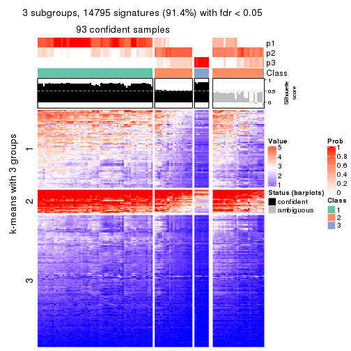</p>

</div>
<div id='tab-SD-mclust-get-signatures-no-scale-3'>
<pre><code class="r">get_signatures(res, k = 4, scale_rows = FALSE)
</code></pre>

<p></p>

</div>
<div id='tab-SD-mclust-get-signatures-no-scale-4'>
<pre><code class="r">get_signatures(res, k = 5, scale_rows = FALSE)
</code></pre>

<p></p>

</div>
<div id='tab-SD-mclust-get-signatures-no-scale-5'>
<pre><code class="r">get_signatures(res, k = 6, scale_rows = FALSE)
</code></pre>

<p></p>

</div>
</div>


Compare the overlap of signatures from different k:

```r
compare_signatures(res)
```


`get_signature()` returns a data frame invisibly. TO get the list of signatures, the function
call should be assigned to a variable explicitly. In following code, if `plot` argument is set
to `FALSE`, no heatmap is plotted while only the differential analysis is performed.

```r
# code only for demonstration
tb = get_signature(res, k = ..., plot = FALSE)
```

An example of the output of `tb` is:

```
#>   which_row         fdr    mean_1    mean_2 scaled_mean_1 scaled_mean_2 km
#> 1        38 0.042760348  8.373488  9.131774    -0.5533452     0.5164555  1
#> 2        40 0.018707592  7.106213  8.469186    -0.6173731     0.5762149  1
#> 3        55 0.019134737 10.221463 11.207825    -0.6159697     0.5749050  1
#> 4        59 0.006059896  5.921854  7.869574    -0.6899429     0.6439467  1
#> 5        60 0.018055526  8.928898 10.211722    -0.6204761     0.5791110  1
#> 6        98 0.009384629 15.714769 14.887706     0.6635654    -0.6193277  2
...
```

The columns in `tb` are:

1. `which_row`: row indices corresponding to the input matrix.
2. `fdr`: FDR for the differential test. 
3. `mean_x`: The mean value in group x.
4. `scaled_mean_x`: The mean value in group x after rows are scaled.
5. `km`: Row groups if k-means clustering is applied to rows.


UMAP plot which shows how samples are separated.


<script>
$( function() {
	$( '#tabs-SD-mclust-dimension-reduction' ).tabs();
} );
</script>
<div id='tabs-SD-mclust-dimension-reduction'>
<ul>
<li><a href='#tab-SD-mclust-dimension-reduction-1'>k = 2</a></li>
<li><a href='#tab-SD-mclust-dimension-reduction-2'>k = 3</a></li>
<li><a href='#tab-SD-mclust-dimension-reduction-3'>k = 4</a></li>
<li><a href='#tab-SD-mclust-dimension-reduction-4'>k = 5</a></li>
<li><a href='#tab-SD-mclust-dimension-reduction-5'>k = 6</a></li>
</ul>
<div id='tab-SD-mclust-dimension-reduction-1'>
<pre><code class="r">dimension_reduction(res, k = 2, method = &quot;UMAP&quot;)
</code></pre>

<p></p>

</div>
<div id='tab-SD-mclust-dimension-reduction-2'>
<pre><code class="r">dimension_reduction(res, k = 3, method = &quot;UMAP&quot;)
</code></pre>

<p></p>

</div>
<div id='tab-SD-mclust-dimension-reduction-3'>
<pre><code class="r">dimension_reduction(res, k = 4, method = &quot;UMAP&quot;)
</code></pre>

<p></p>

</div>
<div id='tab-SD-mclust-dimension-reduction-4'>
<pre><code class="r">dimension_reduction(res, k = 5, method = &quot;UMAP&quot;)
</code></pre>

<p></p>

</div>
<div id='tab-SD-mclust-dimension-reduction-5'>
<pre><code class="r">dimension_reduction(res, k = 6, method = &quot;UMAP&quot;)
</code></pre>

<p></p>

</div>
</div>


Following heatmap shows how subgroups are split when increasing `k`:

```r
collect_classes(res)
```


If matrix rows can be associated to genes, consider to use `functional_enrichment(res,
...)` to perform function enrichment for the signature genes. See [this vignette](http://bioconductor.org/packages/devel/bioc/vignettes/cola/inst/doc/functional_enrichment.html) for more detailed explanations.


 

---------------------------------------------------


### SD:NMF


The object with results only for a single top-value method and a single partition method 
can be extracted as:

```r
res = res_list["SD", "NMF"]
# you can also extract it by
# res = res_list["SD:NMF"]
```

A summary of `res` and all the functions that can be applied to it:

```r
res
```

```
#> A 'ConsensusPartition' object with k = 2, 3, 4, 5, 6.
#>   On a matrix with 16187 rows and 121 columns.
#>   Top rows (1000, 2000, 3000, 4000, 5000) are extracted by 'SD' method.
#>   Subgroups are detected by 'NMF' method.
#>   Performed in total 1250 partitions by row resampling.
#>   Best k for subgroups seems to be 2.
#> 
#> Following methods can be applied to this 'ConsensusPartition' object:
#>  [1] "cola_report"             "collect_classes"         "collect_plots"          
#>  [4] "collect_stats"           "colnames"                "compare_signatures"     
#>  [7] "consensus_heatmap"       "dimension_reduction"     "functional_enrichment"  
#> [10] "get_anno_col"            "get_anno"                "get_classes"            
#> [13] "get_consensus"           "get_matrix"              "get_membership"         
#> [16] "get_param"               "get_signatures"          "get_stats"              
#> [19] "is_best_k"               "is_stable_k"             "membership_heatmap"     
#> [22] "ncol"                    "nrow"                    "plot_ecdf"              
#> [25] "rownames"                "select_partition_number" "show"                   
#> [28] "suggest_best_k"          "test_to_known_factors"
```

`collect_plots()` function collects all the plots made from `res` for all `k` (number of partitions)
into one single page to provide an easy and fast comparison between different `k`.

```r
collect_plots(res)
```


The plots are:

- The first row: a plot of the ECDF (empirical cumulative distribution
  function) curves of the consensus matrix for each `k` and the heatmap of
  predicted classes for each `k`.
- The second row: heatmaps of the consensus matrix for each `k`.
- The third row: heatmaps of the membership matrix for each `k`.
- The fouth row: heatmaps of the signatures for each `k`.

All the plots in panels can be made by individual functions and they are
plotted later in this section.

`select_partition_number()` produces several plots showing different
statistics for choosing "optimized" `k`. There are following statistics:

- ECDF curves of the consensus matrix for each `k`;
- 1-PAC. [The PAC
  score](https://en.wikipedia.org/wiki/Consensus_clustering#Over-interpretation_potential_of_consensus_clustering)
  measures the proportion of the ambiguous subgrouping.
- Mean silhouette score.
- Concordance. The mean probability of fiting the consensus class ids in all
  partitions.
- Area increased. Denote $A_k$ as the area under the ECDF curve for current
  `k`, the area increased is defined as $A_k - A_{k-1}$.
- Rand index. The percent of pairs of samples that are both in a same cluster
  or both are not in a same cluster in the partition of k and k-1.
- Jaccard index. The ratio of pairs of samples are both in a same cluster in
  the partition of k and k-1 and the pairs of samples are both in a same
  cluster in the partition k or k-1.

The detailed explanations of these statistics can be found in [the _cola_
vignette](http://bioconductor.org/packages/devel/bioc/vignettes/cola/inst/doc/cola.html#toc_13).

Generally speaking, lower PAC score, higher mean silhouette score or higher
concordance corresponds to better partition. Rand index and Jaccard index
measure how similar the current partition is compared to partition with `k-1`.
If they are too similar, we won't accept `k` is better than `k-1`.

```r
select_partition_number(res)
```


The numeric values for all these statistics can be obtained by `get_stats()`.

```r
get_stats(res)
```

```
#>   k 1-PAC mean_silhouette concordance area_increased  Rand Jaccard
#> 2 2 0.882           0.929       0.968         0.4597 0.538   0.538
#> 3 3 0.495           0.679       0.805         0.3685 0.735   0.547
#> 4 4 0.583           0.638       0.779         0.1575 0.846   0.602
#> 5 5 0.786           0.820       0.892         0.0690 0.931   0.745
#> 6 6 0.727           0.646       0.812         0.0529 0.872   0.514
```

`suggest_best_k()` suggests the best $k$ based on these statistics. The rules are as follows:

- All $k$ with Jaccard index larger than 0.95 are removed because increasing
  $k$ does not provide enough extra information. If all $k$ are removed, it is
  marked as no subgroup is detected.
- For all $k$ with 1-PAC score larger than 0.9, the maximal $k$ is taken as
  the best $k$, and other $k$ are marked as optional $k$.
- If it does not fit the second rule. The $k$ with the maximal vote of the
  highest 1-PAC score, highest mean silhouette, and highest concordance is
  taken as the best $k$.

```r
suggest_best_k(res)
```

```
#> [1] 2
```


Following shows the table of the partitions (You need to click the **show/hide
code output** link to see it). The membership matrix (columns with name `p*`)
is inferred by
[`clue::cl_consensus()`](https://www.rdocumentation.org/link/cl_consensus?package=clue)
function with the `SE` method. Basically the value in the membership matrix
represents the probability to belong to a certain group. The finall class
label for an item is determined with the group with highest probability it
belongs to.

In `get_classes()` function, the entropy is calculated from the membership
matrix and the silhouette score is calculated from the consensus matrix.


<script>
$( function() {
	$( '#tabs-SD-NMF-get-classes' ).tabs();
} );
</script>
<div id='tabs-SD-NMF-get-classes'>
<ul>
<li><a href='#tab-SD-NMF-get-classes-1'>k = 2</a></li>
<li><a href='#tab-SD-NMF-get-classes-2'>k = 3</a></li>
<li><a href='#tab-SD-NMF-get-classes-3'>k = 4</a></li>
<li><a href='#tab-SD-NMF-get-classes-4'>k = 5</a></li>
<li><a href='#tab-SD-NMF-get-classes-5'>k = 6</a></li>
</ul>

<div id='tab-SD-NMF-get-classes-1'>
<p><a id='tab-SD-NMF-get-classes-1-a' style='color:#0366d6' href='#'>show/hide code output</a></p>
<pre><code class="r">cbind(get_classes(res, k = 2), get_membership(res, k = 2))
</code></pre>

<pre><code>#&gt;           class entropy silhouette    p1    p2
#&gt; DRR006374     2  0.0000      0.948 0.000 1.000
#&gt; DRR006375     1  0.0000      0.976 1.000 0.000
#&gt; DRR006376     1  0.0000      0.976 1.000 0.000
#&gt; DRR006377     1  0.0000      0.976 1.000 0.000
#&gt; DRR006378     1  0.0000      0.976 1.000 0.000
#&gt; DRR006379     1  0.0000      0.976 1.000 0.000
#&gt; DRR006380     1  0.6343      0.806 0.840 0.160
#&gt; DRR006381     1  0.0000      0.976 1.000 0.000
#&gt; DRR006382     2  0.0000      0.948 0.000 1.000
#&gt; DRR006383     2  0.0000      0.948 0.000 1.000
#&gt; DRR006384     1  0.7219      0.749 0.800 0.200
#&gt; DRR006385     1  0.0000      0.976 1.000 0.000
#&gt; DRR006386     1  0.5946      0.827 0.856 0.144
#&gt; DRR006387     1  0.0000      0.976 1.000 0.000
#&gt; DRR006388     1  0.0000      0.976 1.000 0.000
#&gt; DRR006389     1  0.0000      0.976 1.000 0.000
#&gt; DRR006390     1  0.0000      0.976 1.000 0.000
#&gt; DRR006391     1  0.0000      0.976 1.000 0.000
#&gt; DRR006392     1  0.0000      0.976 1.000 0.000
#&gt; DRR006393     1  0.0000      0.976 1.000 0.000
#&gt; DRR006394     1  0.0000      0.976 1.000 0.000
#&gt; DRR006395     1  0.0000      0.976 1.000 0.000
#&gt; DRR006396     1  0.0000      0.976 1.000 0.000
#&gt; DRR006397     1  0.0000      0.976 1.000 0.000
#&gt; DRR006398     1  0.0000      0.976 1.000 0.000
#&gt; DRR006399     1  0.0000      0.976 1.000 0.000
#&gt; DRR006400     1  0.0000      0.976 1.000 0.000
#&gt; DRR006401     1  0.0000      0.976 1.000 0.000
#&gt; DRR006402     1  0.0000      0.976 1.000 0.000
#&gt; DRR006403     1  0.0000      0.976 1.000 0.000
#&gt; DRR006404     1  0.0000      0.976 1.000 0.000
#&gt; DRR006405     1  0.0000      0.976 1.000 0.000
#&gt; DRR006406     1  0.0000      0.976 1.000 0.000
#&gt; DRR006407     1  0.0000      0.976 1.000 0.000
#&gt; DRR006408     1  0.0000      0.976 1.000 0.000
#&gt; DRR006409     1  0.0000      0.976 1.000 0.000
#&gt; DRR006410     1  0.0000      0.976 1.000 0.000
#&gt; DRR006411     1  0.0000      0.976 1.000 0.000
#&gt; DRR006412     1  0.0000      0.976 1.000 0.000
#&gt; DRR006413     1  0.0000      0.976 1.000 0.000
#&gt; DRR006414     2  0.2948      0.914 0.052 0.948
#&gt; DRR006415     2  0.0000      0.948 0.000 1.000
#&gt; DRR006416     1  0.0000      0.976 1.000 0.000
#&gt; DRR006417     2  0.0000      0.948 0.000 1.000
#&gt; DRR006418     1  0.0000      0.976 1.000 0.000
#&gt; DRR006419     2  0.6343      0.817 0.160 0.840
#&gt; DRR006420     1  0.9710      0.275 0.600 0.400
#&gt; DRR006421     2  0.2948      0.916 0.052 0.948
#&gt; DRR006422     1  0.0000      0.976 1.000 0.000
#&gt; DRR006423     1  0.4161      0.894 0.916 0.084
#&gt; DRR006424     1  0.0000      0.976 1.000 0.000
#&gt; DRR006425     1  0.0000      0.976 1.000 0.000
#&gt; DRR006426     2  0.6623      0.804 0.172 0.828
#&gt; DRR006427     2  0.0000      0.948 0.000 1.000
#&gt; DRR006428     2  0.0000      0.948 0.000 1.000
#&gt; DRR006429     1  0.1843      0.952 0.972 0.028
#&gt; DRR006430     1  0.0000      0.976 1.000 0.000
#&gt; DRR006431     1  0.0000      0.976 1.000 0.000
#&gt; DRR006432     2  0.7299      0.764 0.204 0.796
#&gt; DRR006433     2  0.0938      0.941 0.012 0.988
#&gt; DRR006434     2  0.0000      0.948 0.000 1.000
#&gt; DRR006435     2  0.0000      0.948 0.000 1.000
#&gt; DRR006436     2  0.0000      0.948 0.000 1.000
#&gt; DRR006437     1  0.0000      0.976 1.000 0.000
#&gt; DRR006438     2  0.3431      0.906 0.064 0.936
#&gt; DRR006439     2  0.8327      0.677 0.264 0.736
#&gt; DRR006440     2  0.0000      0.948 0.000 1.000
#&gt; DRR006441     1  0.0000      0.976 1.000 0.000
#&gt; DRR006442     2  0.0000      0.948 0.000 1.000
#&gt; DRR006443     2  0.0000      0.948 0.000 1.000
#&gt; DRR006444     2  0.0000      0.948 0.000 1.000
#&gt; DRR006445     1  0.0000      0.976 1.000 0.000
#&gt; DRR006446     1  0.0000      0.976 1.000 0.000
#&gt; DRR006447     1  0.0000      0.976 1.000 0.000
#&gt; DRR006448     1  0.0000      0.976 1.000 0.000
#&gt; DRR006449     1  0.0000      0.976 1.000 0.000
#&gt; DRR006450     1  0.0000      0.976 1.000 0.000
#&gt; DRR006451     1  0.0000      0.976 1.000 0.000
#&gt; DRR006452     1  0.0000      0.976 1.000 0.000
#&gt; DRR006453     1  0.0000      0.976 1.000 0.000
#&gt; DRR006454     1  0.0000      0.976 1.000 0.000
#&gt; DRR006455     2  0.9775      0.299 0.412 0.588
#&gt; DRR006456     2  0.0000      0.948 0.000 1.000
#&gt; DRR006457     2  0.0000      0.948 0.000 1.000
#&gt; DRR006458     1  0.0000      0.976 1.000 0.000
#&gt; DRR006459     1  0.0000      0.976 1.000 0.000
#&gt; DRR006460     1  0.3733      0.910 0.928 0.072
#&gt; DRR006461     2  0.0000      0.948 0.000 1.000
#&gt; DRR006462     1  0.0000      0.976 1.000 0.000
#&gt; DRR006463     2  0.0000      0.948 0.000 1.000
#&gt; DRR006464     1  0.8081      0.649 0.752 0.248
#&gt; DRR006465     1  0.0000      0.976 1.000 0.000
#&gt; DRR006466     2  0.0000      0.948 0.000 1.000
#&gt; DRR006467     1  0.0000      0.976 1.000 0.000
#&gt; DRR006468     2  0.0000      0.948 0.000 1.000
#&gt; DRR006469     1  0.0000      0.976 1.000 0.000
#&gt; DRR006470     2  0.4022      0.894 0.080 0.920
#&gt; DRR006471     1  0.0000      0.976 1.000 0.000
#&gt; DRR006472     2  0.0000      0.948 0.000 1.000
#&gt; DRR006473     2  0.0000      0.948 0.000 1.000
#&gt; DRR006474     2  0.0000      0.948 0.000 1.000
#&gt; DRR006475     1  0.2043      0.949 0.968 0.032
#&gt; DRR006476     1  0.2778      0.934 0.952 0.048
#&gt; DRR006477     1  0.8608      0.611 0.716 0.284
#&gt; DRR006478     1  0.0000      0.976 1.000 0.000
#&gt; DRR006479     2  0.9044      0.580 0.320 0.680
#&gt; DRR006480     1  0.0000      0.976 1.000 0.000
#&gt; DRR006481     2  0.0000      0.948 0.000 1.000
#&gt; DRR006482     1  0.0000      0.976 1.000 0.000
#&gt; DRR006483     1  0.0000      0.976 1.000 0.000
#&gt; DRR006484     2  0.0000      0.948 0.000 1.000
#&gt; DRR006485     2  0.0000      0.948 0.000 1.000
#&gt; DRR006486     2  0.9087      0.574 0.324 0.676
#&gt; DRR006487     2  0.0000      0.948 0.000 1.000
#&gt; DRR006488     2  0.0000      0.948 0.000 1.000
#&gt; DRR006489     1  0.0000      0.976 1.000 0.000
#&gt; DRR006490     2  0.0000      0.948 0.000 1.000
#&gt; DRR006491     2  0.0000      0.948 0.000 1.000
#&gt; DRR006492     1  0.0000      0.976 1.000 0.000
#&gt; DRR006493     2  0.0000      0.948 0.000 1.000
#&gt; DRR006494     1  0.0000      0.976 1.000 0.000
</code></pre>

<script>
$('#tab-SD-NMF-get-classes-1-a').parent().next().next().hide();
$('#tab-SD-NMF-get-classes-1-a').click(function(){
  $('#tab-SD-NMF-get-classes-1-a').parent().next().next().toggle();
  return(false);
});
</script>
</div>

<div id='tab-SD-NMF-get-classes-2'>
<p><a id='tab-SD-NMF-get-classes-2-a' style='color:#0366d6' href='#'>show/hide code output</a></p>
<pre><code class="r">cbind(get_classes(res, k = 3), get_membership(res, k = 3))
</code></pre>

<pre><code>#&gt;           class entropy silhouette    p1    p2    p3
#&gt; DRR006374     3  0.3752    0.83068 0.000 0.144 0.856
#&gt; DRR006375     1  0.3412    0.76315 0.876 0.124 0.000
#&gt; DRR006376     1  0.5760    0.52390 0.672 0.328 0.000
#&gt; DRR006377     1  0.4654    0.58522 0.792 0.208 0.000
#&gt; DRR006378     1  0.2356    0.75235 0.928 0.072 0.000
#&gt; DRR006379     2  0.4887    0.72791 0.228 0.772 0.000
#&gt; DRR006380     2  0.1620    0.69655 0.012 0.964 0.024
#&gt; DRR006381     1  0.6295    0.02921 0.528 0.472 0.000
#&gt; DRR006382     3  0.3272    0.86808 0.016 0.080 0.904
#&gt; DRR006383     3  0.4449    0.85016 0.040 0.100 0.860
#&gt; DRR006384     2  0.2229    0.68838 0.012 0.944 0.044
#&gt; DRR006385     1  0.3038    0.76608 0.896 0.104 0.000
#&gt; DRR006386     2  0.2749    0.68009 0.064 0.924 0.012
#&gt; DRR006387     2  0.4931    0.71946 0.232 0.768 0.000
#&gt; DRR006388     1  0.3038    0.76820 0.896 0.104 0.000
#&gt; DRR006389     1  0.3038    0.76820 0.896 0.104 0.000
#&gt; DRR006390     1  0.2165    0.74705 0.936 0.064 0.000
#&gt; DRR006391     1  0.2261    0.74522 0.932 0.068 0.000
#&gt; DRR006392     1  0.5098    0.63412 0.752 0.248 0.000
#&gt; DRR006393     1  0.6225    0.20997 0.568 0.432 0.000
#&gt; DRR006394     1  0.2066    0.74954 0.940 0.060 0.000
#&gt; DRR006395     2  0.4346    0.76096 0.184 0.816 0.000
#&gt; DRR006396     2  0.6280    0.20718 0.460 0.540 0.000
#&gt; DRR006397     1  0.3267    0.76589 0.884 0.116 0.000
#&gt; DRR006398     1  0.3116    0.76760 0.892 0.108 0.000
#&gt; DRR006399     2  0.4178    0.76530 0.172 0.828 0.000
#&gt; DRR006400     2  0.4178    0.76530 0.172 0.828 0.000
#&gt; DRR006401     2  0.2165    0.73826 0.064 0.936 0.000
#&gt; DRR006402     2  0.2165    0.73826 0.064 0.936 0.000
#&gt; DRR006403     2  0.4062    0.76586 0.164 0.836 0.000
#&gt; DRR006404     2  0.4178    0.76530 0.172 0.828 0.000
#&gt; DRR006405     1  0.4605    0.71859 0.796 0.204 0.000
#&gt; DRR006406     1  0.5497    0.60055 0.708 0.292 0.000
#&gt; DRR006407     1  0.6235   -0.00498 0.564 0.436 0.000
#&gt; DRR006408     2  0.3619    0.76253 0.136 0.864 0.000
#&gt; DRR006409     2  0.4346    0.75913 0.184 0.816 0.000
#&gt; DRR006410     2  0.5016    0.70961 0.240 0.760 0.000
#&gt; DRR006411     1  0.1529    0.75575 0.960 0.040 0.000
#&gt; DRR006412     1  0.1529    0.75377 0.960 0.040 0.000
#&gt; DRR006413     1  0.3784    0.75495 0.864 0.132 0.004
#&gt; DRR006414     3  0.2743    0.86769 0.052 0.020 0.928
#&gt; DRR006415     3  0.1636    0.88184 0.016 0.020 0.964
#&gt; DRR006416     1  0.2625    0.76969 0.916 0.084 0.000
#&gt; DRR006417     3  0.6267    0.17355 0.452 0.000 0.548
#&gt; DRR006418     1  0.1267    0.75940 0.972 0.024 0.004
#&gt; DRR006419     1  0.5138    0.56846 0.748 0.000 0.252
#&gt; DRR006420     1  0.5467    0.63173 0.792 0.032 0.176
#&gt; DRR006421     3  0.2711    0.84070 0.088 0.000 0.912
#&gt; DRR006422     1  0.6309   -0.08262 0.504 0.496 0.000
#&gt; DRR006423     1  0.2280    0.73394 0.940 0.008 0.052
#&gt; DRR006424     1  0.4178    0.72306 0.828 0.172 0.000
#&gt; DRR006425     1  0.6045    0.42330 0.620 0.380 0.000
#&gt; DRR006426     1  0.4796    0.57157 0.780 0.000 0.220
#&gt; DRR006427     3  0.5939    0.79920 0.072 0.140 0.788
#&gt; DRR006428     3  0.1491    0.88529 0.016 0.016 0.968
#&gt; DRR006429     1  0.2383    0.73840 0.940 0.016 0.044
#&gt; DRR006430     1  0.5621    0.52827 0.692 0.308 0.000
#&gt; DRR006431     2  0.6267    0.27465 0.452 0.548 0.000
#&gt; DRR006432     1  0.4702    0.57923 0.788 0.000 0.212
#&gt; DRR006433     3  0.1647    0.88140 0.004 0.036 0.960
#&gt; DRR006434     3  0.0237    0.88668 0.004 0.000 0.996
#&gt; DRR006435     3  0.6696    0.76193 0.076 0.188 0.736
#&gt; DRR006436     3  0.6435    0.77818 0.076 0.168 0.756
#&gt; DRR006437     1  0.5760    0.51883 0.672 0.328 0.000
#&gt; DRR006438     3  0.5591    0.53652 0.304 0.000 0.696
#&gt; DRR006439     3  0.2599    0.87317 0.052 0.016 0.932
#&gt; DRR006440     3  0.1031    0.88639 0.024 0.000 0.976
#&gt; DRR006441     1  0.2356    0.74866 0.928 0.072 0.000
#&gt; DRR006442     3  0.1482    0.88295 0.012 0.020 0.968
#&gt; DRR006443     3  0.0237    0.88668 0.004 0.000 0.996
#&gt; DRR006444     3  0.6511    0.77161 0.072 0.180 0.748
#&gt; DRR006445     1  0.4178    0.73506 0.828 0.172 0.000
#&gt; DRR006446     1  0.1753    0.75587 0.952 0.048 0.000
#&gt; DRR006447     1  0.2537    0.77023 0.920 0.080 0.000
#&gt; DRR006448     2  0.4452    0.75504 0.192 0.808 0.000
#&gt; DRR006449     2  0.6252    0.25892 0.444 0.556 0.000
#&gt; DRR006450     1  0.2878    0.76649 0.904 0.096 0.000
#&gt; DRR006451     2  0.6299    0.11302 0.476 0.524 0.000
#&gt; DRR006452     1  0.4504    0.69964 0.804 0.196 0.000
#&gt; DRR006453     1  0.2711    0.76797 0.912 0.088 0.000
#&gt; DRR006454     1  0.4178    0.74397 0.828 0.172 0.000
#&gt; DRR006455     2  0.7024    0.36382 0.072 0.704 0.224
#&gt; DRR006456     3  0.0237    0.88685 0.000 0.004 0.996
#&gt; DRR006457     3  0.0592    0.88647 0.012 0.000 0.988
#&gt; DRR006458     1  0.6140    0.30736 0.596 0.404 0.000
#&gt; DRR006459     1  0.4605    0.70579 0.796 0.204 0.000
#&gt; DRR006460     2  0.1129    0.71054 0.020 0.976 0.004
#&gt; DRR006461     3  0.1031    0.88479 0.000 0.024 0.976
#&gt; DRR006462     1  0.6111    0.37791 0.604 0.396 0.000
#&gt; DRR006463     3  0.0237    0.88668 0.004 0.000 0.996
#&gt; DRR006464     1  0.2550    0.72996 0.932 0.012 0.056
#&gt; DRR006465     1  0.5431    0.60755 0.716 0.284 0.000
#&gt; DRR006466     3  0.0747    0.88630 0.016 0.000 0.984
#&gt; DRR006467     1  0.2711    0.76797 0.912 0.088 0.000
#&gt; DRR006468     3  0.6696    0.76193 0.076 0.188 0.736
#&gt; DRR006469     1  0.2176    0.74809 0.948 0.032 0.020
#&gt; DRR006470     1  0.4931    0.55404 0.768 0.000 0.232
#&gt; DRR006471     1  0.2537    0.76840 0.920 0.080 0.000
#&gt; DRR006472     3  0.1289    0.88270 0.032 0.000 0.968
#&gt; DRR006473     1  0.4931    0.55691 0.768 0.000 0.232
#&gt; DRR006474     3  0.4755    0.81245 0.008 0.184 0.808
#&gt; DRR006475     1  0.5339    0.70991 0.824 0.080 0.096
#&gt; DRR006476     2  0.7263    0.65065 0.224 0.692 0.084
#&gt; DRR006477     2  0.5156    0.47880 0.008 0.776 0.216
#&gt; DRR006478     1  0.3267    0.76624 0.884 0.116 0.000
#&gt; DRR006479     3  0.7029    0.21969 0.440 0.020 0.540
#&gt; DRR006480     1  0.6451    0.16554 0.560 0.436 0.004
#&gt; DRR006481     3  0.1964    0.86972 0.056 0.000 0.944
#&gt; DRR006482     2  0.6204    0.35215 0.424 0.576 0.000
#&gt; DRR006483     1  0.2448    0.76919 0.924 0.076 0.000
#&gt; DRR006484     3  0.1753    0.87250 0.048 0.000 0.952
#&gt; DRR006485     3  0.0237    0.88668 0.004 0.000 0.996
#&gt; DRR006486     1  0.6294    0.50816 0.692 0.020 0.288
#&gt; DRR006487     3  0.0237    0.88685 0.000 0.004 0.996
#&gt; DRR006488     3  0.6324    0.78378 0.076 0.160 0.764
#&gt; DRR006489     1  0.2625    0.76815 0.916 0.084 0.000
#&gt; DRR006490     3  0.2297    0.87864 0.036 0.020 0.944
#&gt; DRR006491     3  0.2050    0.87958 0.028 0.020 0.952
#&gt; DRR006492     2  0.4805    0.76017 0.176 0.812 0.012
#&gt; DRR006493     3  0.0747    0.88592 0.000 0.016 0.984
#&gt; DRR006494     1  0.5815    0.54563 0.692 0.304 0.004
</code></pre>

<script>
$('#tab-SD-NMF-get-classes-2-a').parent().next().next().hide();
$('#tab-SD-NMF-get-classes-2-a').click(function(){
  $('#tab-SD-NMF-get-classes-2-a').parent().next().next().toggle();
  return(false);
});
</script>
</div>

<div id='tab-SD-NMF-get-classes-3'>
<p><a id='tab-SD-NMF-get-classes-3-a' style='color:#0366d6' href='#'>show/hide code output</a></p>
<pre><code class="r">cbind(get_classes(res, k = 4), get_membership(res, k = 4))
</code></pre>

<pre><code>#&gt;           class entropy silhouette    p1    p2    p3    p4
#&gt; DRR006374     3  0.0188     0.8350 0.000 0.000 0.996 0.004
#&gt; DRR006375     2  0.5220     0.1626 0.424 0.568 0.000 0.008
#&gt; DRR006376     2  0.4820     0.5626 0.012 0.692 0.000 0.296
#&gt; DRR006377     2  0.3236     0.7095 0.028 0.880 0.004 0.088
#&gt; DRR006378     2  0.0804     0.7732 0.012 0.980 0.000 0.008
#&gt; DRR006379     4  0.5228     0.4054 0.024 0.312 0.000 0.664
#&gt; DRR006380     4  0.1302     0.7726 0.044 0.000 0.000 0.956
#&gt; DRR006381     1  0.5090     0.6068 0.660 0.016 0.000 0.324
#&gt; DRR006382     3  0.0921     0.8297 0.028 0.000 0.972 0.000
#&gt; DRR006383     3  0.4866     0.2546 0.404 0.000 0.596 0.000
#&gt; DRR006384     4  0.1004     0.7670 0.024 0.000 0.004 0.972
#&gt; DRR006385     1  0.5217     0.4799 0.608 0.380 0.000 0.012
#&gt; DRR006386     4  0.5384     0.5636 0.324 0.028 0.000 0.648
#&gt; DRR006387     4  0.3764     0.6309 0.216 0.000 0.000 0.784
#&gt; DRR006388     2  0.3444     0.6979 0.184 0.816 0.000 0.000
#&gt; DRR006389     2  0.3444     0.6979 0.184 0.816 0.000 0.000
#&gt; DRR006390     2  0.1545     0.7500 0.040 0.952 0.000 0.008
#&gt; DRR006391     2  0.1677     0.7481 0.040 0.948 0.000 0.012
#&gt; DRR006392     1  0.6360     0.7257 0.656 0.180 0.000 0.164
#&gt; DRR006393     1  0.6461     0.6960 0.632 0.128 0.000 0.240
#&gt; DRR006394     2  0.1109     0.7578 0.028 0.968 0.000 0.004
#&gt; DRR006395     4  0.2983     0.7496 0.040 0.068 0.000 0.892
#&gt; DRR006396     1  0.5884     0.5692 0.592 0.044 0.000 0.364
#&gt; DRR006397     2  0.2868     0.7316 0.136 0.864 0.000 0.000
#&gt; DRR006398     2  0.2868     0.7316 0.136 0.864 0.000 0.000
#&gt; DRR006399     4  0.2011     0.7631 0.080 0.000 0.000 0.920
#&gt; DRR006400     4  0.2011     0.7631 0.080 0.000 0.000 0.920
#&gt; DRR006401     4  0.1022     0.7661 0.032 0.000 0.000 0.968
#&gt; DRR006402     4  0.1022     0.7661 0.032 0.000 0.000 0.968
#&gt; DRR006403     4  0.1716     0.7690 0.064 0.000 0.000 0.936
#&gt; DRR006404     4  0.3056     0.7474 0.040 0.072 0.000 0.888
#&gt; DRR006405     2  0.4920     0.6839 0.068 0.768 0.000 0.164
#&gt; DRR006406     2  0.5407     0.5665 0.036 0.668 0.000 0.296
#&gt; DRR006407     2  0.6079     0.2026 0.048 0.544 0.000 0.408
#&gt; DRR006408     4  0.1211     0.7729 0.040 0.000 0.000 0.960
#&gt; DRR006409     4  0.4103     0.5622 0.256 0.000 0.000 0.744
#&gt; DRR006410     4  0.4212     0.6234 0.216 0.012 0.000 0.772
#&gt; DRR006411     2  0.0592     0.7732 0.016 0.984 0.000 0.000
#&gt; DRR006412     2  0.0817     0.7604 0.024 0.976 0.000 0.000
#&gt; DRR006413     1  0.6157     0.7004 0.660 0.232 0.000 0.108
#&gt; DRR006414     3  0.4933     0.1753 0.432 0.000 0.568 0.000
#&gt; DRR006415     3  0.0921     0.8297 0.028 0.000 0.972 0.000
#&gt; DRR006416     2  0.4994    -0.0456 0.480 0.520 0.000 0.000
#&gt; DRR006417     3  0.4795     0.5119 0.012 0.292 0.696 0.000
#&gt; DRR006418     2  0.3074     0.7224 0.152 0.848 0.000 0.000
#&gt; DRR006419     2  0.5723     0.5512 0.244 0.684 0.072 0.000
#&gt; DRR006420     1  0.7353     0.4275 0.516 0.288 0.196 0.000
#&gt; DRR006421     3  0.0657     0.8335 0.004 0.012 0.984 0.000
#&gt; DRR006422     1  0.5038     0.5930 0.652 0.012 0.000 0.336
#&gt; DRR006423     2  0.1697     0.7518 0.028 0.952 0.004 0.016
#&gt; DRR006424     1  0.5953     0.6670 0.656 0.268 0.000 0.076
#&gt; DRR006425     2  0.6423     0.4682 0.084 0.580 0.000 0.336
#&gt; DRR006426     2  0.0779     0.7727 0.016 0.980 0.004 0.000
#&gt; DRR006427     3  0.8316     0.4138 0.340 0.116 0.476 0.068
#&gt; DRR006428     3  0.0469     0.8340 0.012 0.000 0.988 0.000
#&gt; DRR006429     2  0.1305     0.7717 0.036 0.960 0.004 0.000
#&gt; DRR006430     1  0.5614     0.6365 0.652 0.044 0.000 0.304
#&gt; DRR006431     1  0.4761     0.5401 0.628 0.000 0.000 0.372
#&gt; DRR006432     2  0.0592     0.7732 0.016 0.984 0.000 0.000
#&gt; DRR006433     3  0.3441     0.7467 0.024 0.000 0.856 0.120
#&gt; DRR006434     3  0.0657     0.8335 0.012 0.000 0.984 0.004
#&gt; DRR006435     3  0.9318     0.2773 0.340 0.132 0.372 0.156
#&gt; DRR006436     3  0.9266     0.2900 0.340 0.132 0.380 0.148
#&gt; DRR006437     1  0.6613     0.7157 0.628 0.200 0.000 0.172
#&gt; DRR006438     3  0.2363     0.8006 0.024 0.056 0.920 0.000
#&gt; DRR006439     3  0.0921     0.8290 0.028 0.000 0.972 0.000
#&gt; DRR006440     3  0.1082     0.8297 0.020 0.004 0.972 0.004
#&gt; DRR006441     2  0.2943     0.7184 0.032 0.892 0.000 0.076
#&gt; DRR006442     3  0.0817     0.8311 0.024 0.000 0.976 0.000
#&gt; DRR006443     3  0.0524     0.8343 0.008 0.000 0.988 0.004
#&gt; DRR006444     3  0.9288     0.2824 0.340 0.128 0.376 0.156
#&gt; DRR006445     1  0.5530     0.5717 0.632 0.336 0.000 0.032
#&gt; DRR006446     2  0.0592     0.7732 0.016 0.984 0.000 0.000
#&gt; DRR006447     2  0.3688     0.6718 0.208 0.792 0.000 0.000
#&gt; DRR006448     4  0.3123     0.7008 0.156 0.000 0.000 0.844
#&gt; DRR006449     1  0.6910     0.5904 0.548 0.128 0.000 0.324
#&gt; DRR006450     1  0.5423     0.5785 0.640 0.332 0.000 0.028
#&gt; DRR006451     2  0.6009     0.1654 0.040 0.492 0.000 0.468
#&gt; DRR006452     1  0.6267     0.6949 0.648 0.240 0.000 0.112
#&gt; DRR006453     1  0.4920     0.5013 0.628 0.368 0.000 0.004
#&gt; DRR006454     2  0.4864     0.6779 0.172 0.768 0.000 0.060
#&gt; DRR006455     4  0.7590     0.4606 0.340 0.076 0.052 0.532
#&gt; DRR006456     3  0.0000     0.8352 0.000 0.000 1.000 0.000
#&gt; DRR006457     3  0.0188     0.8351 0.004 0.000 0.996 0.000
#&gt; DRR006458     1  0.5193     0.6075 0.656 0.020 0.000 0.324
#&gt; DRR006459     1  0.6775     0.7003 0.628 0.136 0.008 0.228
#&gt; DRR006460     4  0.0921     0.7637 0.028 0.000 0.000 0.972
#&gt; DRR006461     3  0.0188     0.8350 0.000 0.000 0.996 0.004
#&gt; DRR006462     4  0.7564     0.0482 0.208 0.328 0.000 0.464
#&gt; DRR006463     3  0.0376     0.8347 0.004 0.000 0.992 0.004
#&gt; DRR006464     2  0.0592     0.7732 0.016 0.984 0.000 0.000
#&gt; DRR006465     1  0.6719     0.6947 0.608 0.240 0.000 0.152
#&gt; DRR006466     3  0.0469     0.8345 0.012 0.000 0.988 0.000
#&gt; DRR006467     1  0.5432     0.6013 0.652 0.316 0.000 0.032
#&gt; DRR006468     3  0.9318     0.2773 0.340 0.132 0.372 0.156
#&gt; DRR006469     2  0.0592     0.7635 0.016 0.984 0.000 0.000
#&gt; DRR006470     2  0.2124     0.7633 0.068 0.924 0.008 0.000
#&gt; DRR006471     2  0.5161    -0.0324 0.476 0.520 0.004 0.000
#&gt; DRR006472     3  0.0000     0.8352 0.000 0.000 1.000 0.000
#&gt; DRR006473     2  0.0524     0.7708 0.008 0.988 0.004 0.000
#&gt; DRR006474     3  0.1635     0.8213 0.008 0.000 0.948 0.044
#&gt; DRR006475     1  0.6495     0.4026 0.560 0.084 0.356 0.000
#&gt; DRR006476     4  0.6977     0.5284 0.056 0.076 0.216 0.652
#&gt; DRR006477     4  0.3128     0.7505 0.040 0.000 0.076 0.884
#&gt; DRR006478     2  0.3649     0.6778 0.204 0.796 0.000 0.000
#&gt; DRR006479     3  0.4452     0.5572 0.260 0.008 0.732 0.000
#&gt; DRR006480     1  0.6339     0.6183 0.652 0.020 0.060 0.268
#&gt; DRR006481     3  0.0336     0.8345 0.000 0.008 0.992 0.000
#&gt; DRR006482     1  0.6603     0.6197 0.580 0.104 0.000 0.316
#&gt; DRR006483     2  0.4560     0.5299 0.296 0.700 0.004 0.000
#&gt; DRR006484     3  0.0524     0.8346 0.008 0.004 0.988 0.000
#&gt; DRR006485     3  0.0657     0.8334 0.012 0.000 0.984 0.004
#&gt; DRR006486     1  0.5590     0.1673 0.524 0.020 0.456 0.000
#&gt; DRR006487     3  0.0000     0.8352 0.000 0.000 1.000 0.000
#&gt; DRR006488     3  0.9148     0.3132 0.340 0.132 0.396 0.132
#&gt; DRR006489     1  0.4990     0.5376 0.640 0.352 0.000 0.008
#&gt; DRR006490     3  0.1474     0.8162 0.052 0.000 0.948 0.000
#&gt; DRR006491     3  0.1389     0.8188 0.048 0.000 0.952 0.000
#&gt; DRR006492     4  0.6860     0.4730 0.244 0.000 0.164 0.592
#&gt; DRR006493     3  0.0000     0.8352 0.000 0.000 1.000 0.000
#&gt; DRR006494     1  0.6921     0.5947 0.644 0.020 0.152 0.184
</code></pre>

<script>
$('#tab-SD-NMF-get-classes-3-a').parent().next().next().hide();
$('#tab-SD-NMF-get-classes-3-a').click(function(){
  $('#tab-SD-NMF-get-classes-3-a').parent().next().next().toggle();
  return(false);
});
</script>
</div>

<div id='tab-SD-NMF-get-classes-4'>
<p><a id='tab-SD-NMF-get-classes-4-a' style='color:#0366d6' href='#'>show/hide code output</a></p>
<pre><code class="r">cbind(get_classes(res, k = 5), get_membership(res, k = 5))
</code></pre>

<pre><code>#&gt;           class entropy silhouette    p1    p2    p3    p4    p5
#&gt; DRR006374     3  0.0510     0.9453 0.000 0.000 0.984 0.000 0.016
#&gt; DRR006375     2  0.4197     0.7300 0.204 0.760 0.000 0.024 0.012
#&gt; DRR006376     2  0.4375     0.3552 0.000 0.576 0.000 0.420 0.004
#&gt; DRR006377     2  0.4076     0.7545 0.012 0.768 0.000 0.200 0.020
#&gt; DRR006378     2  0.0693     0.8846 0.012 0.980 0.000 0.000 0.008
#&gt; DRR006379     4  0.1329     0.8711 0.004 0.032 0.000 0.956 0.008
#&gt; DRR006380     4  0.2616     0.8436 0.020 0.000 0.000 0.880 0.100
#&gt; DRR006381     1  0.1282     0.8152 0.952 0.000 0.000 0.004 0.044
#&gt; DRR006382     3  0.1331     0.9280 0.040 0.000 0.952 0.000 0.008
#&gt; DRR006383     1  0.2416     0.7845 0.888 0.000 0.100 0.000 0.012
#&gt; DRR006384     4  0.3022     0.8156 0.012 0.000 0.004 0.848 0.136
#&gt; DRR006385     1  0.4802     0.6801 0.720 0.212 0.000 0.008 0.060
#&gt; DRR006386     5  0.1243     0.9018 0.008 0.004 0.000 0.028 0.960
#&gt; DRR006387     4  0.2654     0.8433 0.084 0.000 0.000 0.884 0.032
#&gt; DRR006388     2  0.1768     0.8722 0.072 0.924 0.000 0.000 0.004
#&gt; DRR006389     2  0.1768     0.8722 0.072 0.924 0.000 0.000 0.004
#&gt; DRR006390     2  0.0404     0.8800 0.000 0.988 0.000 0.000 0.012
#&gt; DRR006391     2  0.0404     0.8800 0.000 0.988 0.000 0.000 0.012
#&gt; DRR006392     1  0.1375     0.8256 0.960 0.016 0.008 0.008 0.008
#&gt; DRR006393     1  0.2018     0.8235 0.932 0.012 0.008 0.040 0.008
#&gt; DRR006394     2  0.0451     0.8820 0.000 0.988 0.000 0.004 0.008
#&gt; DRR006395     4  0.0162     0.8773 0.000 0.004 0.000 0.996 0.000
#&gt; DRR006396     1  0.4476     0.7140 0.764 0.016 0.000 0.172 0.048
#&gt; DRR006397     2  0.0703     0.8854 0.024 0.976 0.000 0.000 0.000
#&gt; DRR006398     2  0.0865     0.8850 0.024 0.972 0.000 0.000 0.004
#&gt; DRR006399     4  0.0693     0.8791 0.012 0.000 0.000 0.980 0.008
#&gt; DRR006400     4  0.0693     0.8791 0.012 0.000 0.000 0.980 0.008
#&gt; DRR006401     4  0.0703     0.8761 0.000 0.000 0.000 0.976 0.024
#&gt; DRR006402     4  0.0703     0.8761 0.000 0.000 0.000 0.976 0.024
#&gt; DRR006403     4  0.0579     0.8792 0.008 0.000 0.000 0.984 0.008
#&gt; DRR006404     4  0.0693     0.8757 0.000 0.008 0.000 0.980 0.012
#&gt; DRR006405     2  0.3437     0.7953 0.012 0.808 0.000 0.176 0.004
#&gt; DRR006406     2  0.4044     0.7074 0.012 0.732 0.000 0.252 0.004
#&gt; DRR006407     4  0.3527     0.6918 0.000 0.192 0.000 0.792 0.016
#&gt; DRR006408     4  0.1124     0.8754 0.004 0.000 0.000 0.960 0.036
#&gt; DRR006409     4  0.1628     0.8652 0.056 0.000 0.000 0.936 0.008
#&gt; DRR006410     4  0.1648     0.8736 0.040 0.000 0.000 0.940 0.020
#&gt; DRR006411     2  0.0162     0.8825 0.000 0.996 0.000 0.000 0.004
#&gt; DRR006412     2  0.0566     0.8817 0.004 0.984 0.000 0.000 0.012
#&gt; DRR006413     1  0.0771     0.8222 0.976 0.004 0.000 0.000 0.020
#&gt; DRR006414     1  0.4584     0.5584 0.660 0.000 0.312 0.000 0.028
#&gt; DRR006415     3  0.0693     0.9474 0.012 0.000 0.980 0.000 0.008
#&gt; DRR006416     1  0.4321     0.3226 0.600 0.396 0.004 0.000 0.000
#&gt; DRR006417     3  0.3582     0.6713 0.008 0.224 0.768 0.000 0.000
#&gt; DRR006418     2  0.1121     0.8830 0.044 0.956 0.000 0.000 0.000
#&gt; DRR006419     2  0.3955     0.7768 0.084 0.800 0.116 0.000 0.000
#&gt; DRR006420     1  0.6390     0.4448 0.536 0.260 0.200 0.000 0.004
#&gt; DRR006421     3  0.0324     0.9478 0.004 0.000 0.992 0.000 0.004
#&gt; DRR006422     1  0.1156     0.8234 0.968 0.008 0.008 0.008 0.008
#&gt; DRR006423     2  0.0854     0.8852 0.012 0.976 0.000 0.004 0.008
#&gt; DRR006424     1  0.0992     0.8233 0.968 0.008 0.000 0.000 0.024
#&gt; DRR006425     2  0.4532     0.7378 0.036 0.736 0.000 0.216 0.012
#&gt; DRR006426     2  0.0771     0.8853 0.020 0.976 0.000 0.000 0.004
#&gt; DRR006427     5  0.2629     0.9267 0.004 0.012 0.104 0.000 0.880
#&gt; DRR006428     3  0.0566     0.9472 0.012 0.000 0.984 0.004 0.000
#&gt; DRR006429     2  0.2353     0.8762 0.044 0.916 0.004 0.028 0.008
#&gt; DRR006430     1  0.1473     0.8249 0.956 0.008 0.008 0.020 0.008
#&gt; DRR006431     1  0.3282     0.7664 0.836 0.004 0.008 0.144 0.008
#&gt; DRR006432     2  0.0671     0.8855 0.016 0.980 0.000 0.000 0.004
#&gt; DRR006433     3  0.4183     0.5270 0.000 0.000 0.668 0.324 0.008
#&gt; DRR006434     3  0.0579     0.9454 0.000 0.000 0.984 0.008 0.008
#&gt; DRR006435     5  0.2103     0.9645 0.000 0.020 0.056 0.004 0.920
#&gt; DRR006436     5  0.2171     0.9625 0.000 0.024 0.064 0.000 0.912
#&gt; DRR006437     1  0.5899     0.6896 0.688 0.100 0.000 0.144 0.068
#&gt; DRR006438     3  0.1043     0.9305 0.040 0.000 0.960 0.000 0.000
#&gt; DRR006439     3  0.1121     0.9272 0.044 0.000 0.956 0.000 0.000
#&gt; DRR006440     3  0.1209     0.9372 0.000 0.012 0.964 0.012 0.012
#&gt; DRR006441     2  0.0451     0.8820 0.000 0.988 0.000 0.004 0.008
#&gt; DRR006442     3  0.0290     0.9472 0.008 0.000 0.992 0.000 0.000
#&gt; DRR006443     3  0.0579     0.9454 0.000 0.000 0.984 0.008 0.008
#&gt; DRR006444     5  0.2005     0.9636 0.000 0.016 0.056 0.004 0.924
#&gt; DRR006445     1  0.2938     0.8102 0.880 0.064 0.000 0.008 0.048
#&gt; DRR006446     2  0.0566     0.8851 0.012 0.984 0.000 0.000 0.004
#&gt; DRR006447     2  0.1704     0.8741 0.068 0.928 0.000 0.000 0.004
#&gt; DRR006448     4  0.2914     0.8397 0.076 0.000 0.000 0.872 0.052
#&gt; DRR006449     1  0.6684     0.5375 0.584 0.148 0.000 0.220 0.048
#&gt; DRR006450     1  0.3838     0.7558 0.804 0.148 0.000 0.004 0.044
#&gt; DRR006451     2  0.5636     0.1336 0.012 0.496 0.000 0.444 0.048
#&gt; DRR006452     1  0.1701     0.8184 0.936 0.016 0.000 0.000 0.048
#&gt; DRR006453     1  0.1626     0.8238 0.940 0.044 0.000 0.000 0.016
#&gt; DRR006454     2  0.3226     0.8450 0.056 0.868 0.000 0.016 0.060
#&gt; DRR006455     5  0.1493     0.9346 0.000 0.000 0.028 0.024 0.948
#&gt; DRR006456     3  0.0290     0.9461 0.000 0.000 0.992 0.000 0.008
#&gt; DRR006457     3  0.0579     0.9471 0.008 0.000 0.984 0.008 0.000
#&gt; DRR006458     1  0.2169     0.8192 0.924 0.008 0.012 0.048 0.008
#&gt; DRR006459     4  0.7116    -0.0068 0.412 0.096 0.052 0.432 0.008
#&gt; DRR006460     4  0.0963     0.8745 0.000 0.000 0.000 0.964 0.036
#&gt; DRR006461     3  0.0807     0.9422 0.000 0.000 0.976 0.012 0.012
#&gt; DRR006462     4  0.5823     0.5845 0.064 0.232 0.000 0.656 0.048
#&gt; DRR006463     3  0.0566     0.9449 0.000 0.000 0.984 0.004 0.012
#&gt; DRR006464     2  0.0798     0.8852 0.016 0.976 0.000 0.000 0.008
#&gt; DRR006465     1  0.4028     0.7768 0.816 0.092 0.004 0.080 0.008
#&gt; DRR006466     3  0.0898     0.9404 0.000 0.000 0.972 0.020 0.008
#&gt; DRR006467     1  0.1059     0.8255 0.968 0.020 0.008 0.000 0.004
#&gt; DRR006468     5  0.2103     0.9645 0.000 0.020 0.056 0.004 0.920
#&gt; DRR006469     2  0.0290     0.8817 0.000 0.992 0.000 0.000 0.008
#&gt; DRR006470     2  0.1012     0.8838 0.020 0.968 0.012 0.000 0.000
#&gt; DRR006471     2  0.4683     0.4634 0.356 0.624 0.012 0.000 0.008
#&gt; DRR006472     3  0.1187     0.9362 0.024 0.004 0.964 0.004 0.004
#&gt; DRR006473     2  0.2187     0.8719 0.056 0.920 0.008 0.004 0.012
#&gt; DRR006474     3  0.3413     0.7989 0.136 0.004 0.836 0.012 0.012
#&gt; DRR006475     1  0.4869     0.4965 0.632 0.016 0.340 0.004 0.008
#&gt; DRR006476     4  0.2518     0.8177 0.000 0.016 0.080 0.896 0.008
#&gt; DRR006477     4  0.2388     0.8366 0.000 0.000 0.072 0.900 0.028
#&gt; DRR006478     2  0.3542     0.8443 0.084 0.848 0.004 0.056 0.008
#&gt; DRR006479     3  0.1270     0.9222 0.052 0.000 0.948 0.000 0.000
#&gt; DRR006480     1  0.2242     0.8193 0.920 0.008 0.052 0.012 0.008
#&gt; DRR006481     3  0.0324     0.9483 0.004 0.000 0.992 0.004 0.000
#&gt; DRR006482     1  0.5686     0.6130 0.664 0.028 0.000 0.224 0.084
#&gt; DRR006483     2  0.3515     0.8131 0.144 0.828 0.012 0.008 0.008
#&gt; DRR006484     3  0.0290     0.9472 0.008 0.000 0.992 0.000 0.000
#&gt; DRR006485     3  0.0579     0.9454 0.000 0.000 0.984 0.008 0.008
#&gt; DRR006486     1  0.2116     0.8035 0.912 0.008 0.076 0.000 0.004
#&gt; DRR006487     3  0.0324     0.9478 0.004 0.000 0.992 0.000 0.004
#&gt; DRR006488     5  0.2171     0.9625 0.000 0.024 0.064 0.000 0.912
#&gt; DRR006489     1  0.2050     0.8199 0.920 0.064 0.008 0.000 0.008
#&gt; DRR006490     3  0.0703     0.9420 0.024 0.000 0.976 0.000 0.000
#&gt; DRR006491     3  0.0609     0.9431 0.020 0.000 0.980 0.000 0.000
#&gt; DRR006492     4  0.4534     0.7400 0.052 0.000 0.144 0.776 0.028
#&gt; DRR006493     3  0.0290     0.9461 0.000 0.000 0.992 0.000 0.008
#&gt; DRR006494     1  0.2484     0.8120 0.908 0.008 0.060 0.016 0.008
</code></pre>

<script>
$('#tab-SD-NMF-get-classes-4-a').parent().next().next().hide();
$('#tab-SD-NMF-get-classes-4-a').click(function(){
  $('#tab-SD-NMF-get-classes-4-a').parent().next().next().toggle();
  return(false);
});
</script>
</div>

<div id='tab-SD-NMF-get-classes-5'>
<p><a id='tab-SD-NMF-get-classes-5-a' style='color:#0366d6' href='#'>show/hide code output</a></p>
<pre><code class="r">cbind(get_classes(res, k = 6), get_membership(res, k = 6))
</code></pre>

<pre><code>#&gt;           class entropy silhouette    p1    p2    p3    p4    p5    p6
#&gt; DRR006374     3  0.0935     0.9178 0.032 0.000 0.964 0.000 0.004 0.000
#&gt; DRR006375     2  0.6293     0.4313 0.208 0.552 0.000 0.056 0.000 0.184
#&gt; DRR006376     4  0.4851     0.3419 0.056 0.364 0.000 0.576 0.000 0.004
#&gt; DRR006377     4  0.5373     0.2681 0.216 0.196 0.000 0.588 0.000 0.000
#&gt; DRR006378     2  0.1500     0.8302 0.052 0.936 0.000 0.012 0.000 0.000
#&gt; DRR006379     4  0.4950     0.4851 0.012 0.096 0.000 0.664 0.000 0.228
#&gt; DRR006380     6  0.3854    -0.1445 0.000 0.000 0.000 0.464 0.000 0.536
#&gt; DRR006381     6  0.3446     0.4192 0.308 0.000 0.000 0.000 0.000 0.692
#&gt; DRR006382     3  0.1549     0.8983 0.044 0.000 0.936 0.000 0.000 0.020
#&gt; DRR006383     1  0.4040     0.4284 0.688 0.000 0.032 0.000 0.000 0.280
#&gt; DRR006384     4  0.4282     0.2931 0.000 0.000 0.000 0.560 0.020 0.420
#&gt; DRR006385     6  0.3663     0.6309 0.068 0.148 0.000 0.000 0.000 0.784
#&gt; DRR006386     5  0.0000     0.9814 0.000 0.000 0.000 0.000 1.000 0.000
#&gt; DRR006387     4  0.3868     0.1889 0.000 0.000 0.000 0.508 0.000 0.492
#&gt; DRR006388     2  0.2333     0.8265 0.024 0.884 0.000 0.000 0.000 0.092
#&gt; DRR006389     2  0.2383     0.8250 0.024 0.880 0.000 0.000 0.000 0.096
#&gt; DRR006390     2  0.0858     0.8406 0.004 0.968 0.000 0.000 0.000 0.028
#&gt; DRR006391     2  0.0858     0.8406 0.004 0.968 0.000 0.000 0.000 0.028
#&gt; DRR006392     1  0.2209     0.6497 0.900 0.024 0.000 0.004 0.000 0.072
#&gt; DRR006393     1  0.2226     0.6745 0.904 0.028 0.000 0.060 0.000 0.008
#&gt; DRR006394     2  0.0972     0.8375 0.028 0.964 0.000 0.008 0.000 0.000
#&gt; DRR006395     4  0.2975     0.6220 0.004 0.004 0.012 0.832 0.000 0.148
#&gt; DRR006396     6  0.2917     0.6081 0.136 0.016 0.000 0.008 0.000 0.840
#&gt; DRR006397     2  0.2482     0.7791 0.004 0.848 0.000 0.000 0.000 0.148
#&gt; DRR006398     2  0.2482     0.7791 0.004 0.848 0.000 0.000 0.000 0.148
#&gt; DRR006399     4  0.3619     0.4983 0.000 0.004 0.000 0.680 0.000 0.316
#&gt; DRR006400     4  0.3584     0.5065 0.000 0.004 0.000 0.688 0.000 0.308
#&gt; DRR006401     4  0.1753     0.6377 0.004 0.000 0.000 0.912 0.000 0.084
#&gt; DRR006402     4  0.1644     0.6384 0.004 0.000 0.000 0.920 0.000 0.076
#&gt; DRR006403     4  0.2340     0.6215 0.000 0.000 0.000 0.852 0.000 0.148
#&gt; DRR006404     4  0.1082     0.6236 0.040 0.004 0.000 0.956 0.000 0.000
#&gt; DRR006405     4  0.5645     0.1164 0.152 0.392 0.000 0.456 0.000 0.000
#&gt; DRR006406     4  0.5164     0.3411 0.116 0.300 0.000 0.584 0.000 0.000
#&gt; DRR006407     4  0.3123     0.5790 0.056 0.112 0.000 0.832 0.000 0.000
#&gt; DRR006408     4  0.3163     0.5665 0.004 0.000 0.000 0.764 0.000 0.232
#&gt; DRR006409     4  0.1588     0.6134 0.072 0.000 0.000 0.924 0.000 0.004
#&gt; DRR006410     4  0.2357     0.6231 0.012 0.000 0.000 0.872 0.000 0.116
#&gt; DRR006411     2  0.2389     0.7875 0.008 0.864 0.000 0.000 0.000 0.128
#&gt; DRR006412     2  0.0914     0.8440 0.016 0.968 0.000 0.000 0.000 0.016
#&gt; DRR006413     1  0.3982     0.0883 0.536 0.004 0.000 0.000 0.000 0.460
#&gt; DRR006414     3  0.5663     0.2527 0.220 0.000 0.532 0.000 0.000 0.248
#&gt; DRR006415     3  0.0622     0.9310 0.008 0.000 0.980 0.000 0.000 0.012
#&gt; DRR006416     1  0.3974     0.6120 0.752 0.188 0.000 0.004 0.000 0.056
#&gt; DRR006417     3  0.4139     0.4221 0.000 0.336 0.640 0.000 0.000 0.024
#&gt; DRR006418     2  0.1471     0.8298 0.064 0.932 0.000 0.000 0.000 0.004
#&gt; DRR006419     2  0.3896     0.6249 0.000 0.744 0.204 0.000 0.000 0.052
#&gt; DRR006420     1  0.4937     0.6025 0.724 0.116 0.064 0.000 0.000 0.096
#&gt; DRR006421     3  0.0146     0.9382 0.000 0.004 0.996 0.000 0.000 0.000
#&gt; DRR006422     1  0.2618     0.6590 0.860 0.000 0.000 0.116 0.000 0.024
#&gt; DRR006423     2  0.3078     0.6957 0.192 0.796 0.000 0.012 0.000 0.000
#&gt; DRR006424     1  0.3717     0.2806 0.616 0.000 0.000 0.000 0.000 0.384
#&gt; DRR006425     4  0.5330     0.2567 0.232 0.176 0.000 0.592 0.000 0.000
#&gt; DRR006426     2  0.2053     0.7995 0.108 0.888 0.000 0.004 0.000 0.000
#&gt; DRR006427     5  0.1814     0.8646 0.100 0.000 0.000 0.000 0.900 0.000
#&gt; DRR006428     3  0.0000     0.9390 0.000 0.000 1.000 0.000 0.000 0.000
#&gt; DRR006429     2  0.5387     0.2696 0.316 0.560 0.004 0.120 0.000 0.000
#&gt; DRR006430     1  0.2046     0.6669 0.916 0.008 0.000 0.044 0.000 0.032
#&gt; DRR006431     1  0.4181     0.4779 0.644 0.000 0.000 0.328 0.000 0.028
#&gt; DRR006432     2  0.2100     0.7963 0.112 0.884 0.000 0.004 0.000 0.000
#&gt; DRR006433     4  0.3997     0.0808 0.004 0.000 0.488 0.508 0.000 0.000
#&gt; DRR006434     3  0.0000     0.9390 0.000 0.000 1.000 0.000 0.000 0.000
#&gt; DRR006435     5  0.0000     0.9814 0.000 0.000 0.000 0.000 1.000 0.000
#&gt; DRR006436     5  0.0000     0.9814 0.000 0.000 0.000 0.000 1.000 0.000
#&gt; DRR006437     6  0.1918     0.6339 0.000 0.088 0.000 0.008 0.000 0.904
#&gt; DRR006438     3  0.0000     0.9390 0.000 0.000 1.000 0.000 0.000 0.000
#&gt; DRR006439     3  0.0000     0.9390 0.000 0.000 1.000 0.000 0.000 0.000
#&gt; DRR006440     3  0.1325     0.9161 0.012 0.012 0.956 0.004 0.000 0.016
#&gt; DRR006441     2  0.2450     0.8002 0.016 0.868 0.000 0.000 0.000 0.116
#&gt; DRR006442     3  0.0458     0.9324 0.016 0.000 0.984 0.000 0.000 0.000
#&gt; DRR006443     3  0.0405     0.9358 0.008 0.004 0.988 0.000 0.000 0.000
#&gt; DRR006444     5  0.0000     0.9814 0.000 0.000 0.000 0.000 1.000 0.000
#&gt; DRR006445     6  0.4684     0.3000 0.352 0.056 0.000 0.000 0.000 0.592
#&gt; DRR006446     2  0.1176     0.8446 0.020 0.956 0.000 0.000 0.000 0.024
#&gt; DRR006447     2  0.2357     0.8136 0.012 0.872 0.000 0.000 0.000 0.116
#&gt; DRR006448     6  0.3629     0.3472 0.016 0.000 0.000 0.260 0.000 0.724
#&gt; DRR006449     6  0.4062     0.6163 0.080 0.068 0.000 0.056 0.000 0.796
#&gt; DRR006450     6  0.4823     0.5063 0.216 0.124 0.000 0.000 0.000 0.660
#&gt; DRR006451     6  0.5209     0.1834 0.000 0.416 0.000 0.092 0.000 0.492
#&gt; DRR006452     6  0.3690     0.4523 0.288 0.012 0.000 0.000 0.000 0.700
#&gt; DRR006453     1  0.4829     0.3631 0.612 0.080 0.000 0.000 0.000 0.308
#&gt; DRR006454     6  0.3636     0.4558 0.004 0.320 0.000 0.000 0.000 0.676
#&gt; DRR006455     5  0.0000     0.9814 0.000 0.000 0.000 0.000 1.000 0.000
#&gt; DRR006456     3  0.0000     0.9390 0.000 0.000 1.000 0.000 0.000 0.000
#&gt; DRR006457     3  0.0146     0.9379 0.000 0.000 0.996 0.004 0.000 0.000
#&gt; DRR006458     1  0.3284     0.6214 0.784 0.020 0.000 0.196 0.000 0.000
#&gt; DRR006459     1  0.4988     0.2117 0.484 0.068 0.000 0.448 0.000 0.000
#&gt; DRR006460     4  0.2092     0.6293 0.000 0.000 0.000 0.876 0.000 0.124
#&gt; DRR006461     3  0.0146     0.9381 0.000 0.000 0.996 0.004 0.000 0.000
#&gt; DRR006462     6  0.4172     0.5419 0.000 0.204 0.000 0.072 0.000 0.724
#&gt; DRR006463     3  0.0520     0.9339 0.008 0.008 0.984 0.000 0.000 0.000
#&gt; DRR006464     2  0.1753     0.8150 0.084 0.912 0.000 0.004 0.000 0.000
#&gt; DRR006465     1  0.4808     0.5031 0.636 0.092 0.000 0.272 0.000 0.000
#&gt; DRR006466     3  0.0405     0.9358 0.008 0.004 0.988 0.000 0.000 0.000
#&gt; DRR006467     1  0.2221     0.6511 0.896 0.032 0.000 0.000 0.000 0.072
#&gt; DRR006468     5  0.0000     0.9814 0.000 0.000 0.000 0.000 1.000 0.000
#&gt; DRR006469     2  0.1866     0.8209 0.008 0.908 0.000 0.000 0.000 0.084
#&gt; DRR006470     2  0.1944     0.8353 0.024 0.924 0.036 0.000 0.000 0.016
#&gt; DRR006471     1  0.2400     0.6570 0.872 0.116 0.000 0.004 0.000 0.008
#&gt; DRR006472     3  0.4245     0.4328 0.328 0.024 0.644 0.004 0.000 0.000
#&gt; DRR006473     1  0.4253     0.1001 0.524 0.460 0.000 0.016 0.000 0.000
#&gt; DRR006474     1  0.5570     0.2265 0.476 0.000 0.092 0.420 0.008 0.004
#&gt; DRR006475     1  0.2089     0.6553 0.908 0.012 0.072 0.004 0.000 0.004
#&gt; DRR006476     4  0.2451     0.6355 0.008 0.028 0.036 0.904 0.000 0.024
#&gt; DRR006477     4  0.5054     0.3257 0.000 0.000 0.368 0.548 0.000 0.084
#&gt; DRR006478     1  0.6080     0.2284 0.396 0.288 0.000 0.316 0.000 0.000
#&gt; DRR006479     3  0.0000     0.9390 0.000 0.000 1.000 0.000 0.000 0.000
#&gt; DRR006480     1  0.3017     0.6214 0.848 0.000 0.052 0.004 0.000 0.096
#&gt; DRR006481     3  0.0622     0.9272 0.012 0.008 0.980 0.000 0.000 0.000
#&gt; DRR006482     6  0.2265     0.6267 0.004 0.076 0.000 0.024 0.000 0.896
#&gt; DRR006483     1  0.3977     0.5266 0.692 0.284 0.000 0.020 0.000 0.004
#&gt; DRR006484     3  0.0000     0.9390 0.000 0.000 1.000 0.000 0.000 0.000
#&gt; DRR006485     3  0.0520     0.9339 0.008 0.008 0.984 0.000 0.000 0.000
#&gt; DRR006486     1  0.2189     0.6447 0.904 0.004 0.032 0.000 0.000 0.060
#&gt; DRR006487     3  0.0000     0.9390 0.000 0.000 1.000 0.000 0.000 0.000
#&gt; DRR006488     5  0.0000     0.9814 0.000 0.000 0.000 0.000 1.000 0.000
#&gt; DRR006489     1  0.4552     0.4083 0.648 0.064 0.000 0.000 0.000 0.288
#&gt; DRR006490     3  0.0000     0.9390 0.000 0.000 1.000 0.000 0.000 0.000
#&gt; DRR006491     3  0.0146     0.9380 0.004 0.000 0.996 0.000 0.000 0.000
#&gt; DRR006492     4  0.5599     0.3981 0.004 0.000 0.216 0.568 0.000 0.212
#&gt; DRR006493     3  0.0000     0.9390 0.000 0.000 1.000 0.000 0.000 0.000
#&gt; DRR006494     1  0.2715     0.6659 0.872 0.028 0.012 0.088 0.000 0.000
</code></pre>

<script>
$('#tab-SD-NMF-get-classes-5-a').parent().next().next().hide();
$('#tab-SD-NMF-get-classes-5-a').click(function(){
  $('#tab-SD-NMF-get-classes-5-a').parent().next().next().toggle();
  return(false);
});
</script>
</div>
</div>

Heatmaps for the consensus matrix. It visualizes the probability of two
samples to be in a same group.


<script>
$( function() {
	$( '#tabs-SD-NMF-consensus-heatmap' ).tabs();
} );
</script>
<div id='tabs-SD-NMF-consensus-heatmap'>
<ul>
<li><a href='#tab-SD-NMF-consensus-heatmap-1'>k = 2</a></li>
<li><a href='#tab-SD-NMF-consensus-heatmap-2'>k = 3</a></li>
<li><a href='#tab-SD-NMF-consensus-heatmap-3'>k = 4</a></li>
<li><a href='#tab-SD-NMF-consensus-heatmap-4'>k = 5</a></li>
<li><a href='#tab-SD-NMF-consensus-heatmap-5'>k = 6</a></li>
</ul>
<div id='tab-SD-NMF-consensus-heatmap-1'>
<pre><code class="r">consensus_heatmap(res, k = 2)
</code></pre>

<p></p>

</div>
<div id='tab-SD-NMF-consensus-heatmap-2'>
<pre><code class="r">consensus_heatmap(res, k = 3)
</code></pre>

<p></p>

</div>
<div id='tab-SD-NMF-consensus-heatmap-3'>
<pre><code class="r">consensus_heatmap(res, k = 4)
</code></pre>

<p></p>

</div>
<div id='tab-SD-NMF-consensus-heatmap-4'>
<pre><code class="r">consensus_heatmap(res, k = 5)
</code></pre>

<p></p>

</div>
<div id='tab-SD-NMF-consensus-heatmap-5'>
<pre><code class="r">consensus_heatmap(res, k = 6)
</code></pre>

<p></p>

</div>
</div>

Heatmaps for the membership of samples in all partitions to see how consistent they are:


<script>
$( function() {
	$( '#tabs-SD-NMF-membership-heatmap' ).tabs();
} );
</script>
<div id='tabs-SD-NMF-membership-heatmap'>
<ul>
<li><a href='#tab-SD-NMF-membership-heatmap-1'>k = 2</a></li>
<li><a href='#tab-SD-NMF-membership-heatmap-2'>k = 3</a></li>
<li><a href='#tab-SD-NMF-membership-heatmap-3'>k = 4</a></li>
<li><a href='#tab-SD-NMF-membership-heatmap-4'>k = 5</a></li>
<li><a href='#tab-SD-NMF-membership-heatmap-5'>k = 6</a></li>
</ul>
<div id='tab-SD-NMF-membership-heatmap-1'>
<pre><code class="r">membership_heatmap(res, k = 2)
</code></pre>

<p></p>

</div>
<div id='tab-SD-NMF-membership-heatmap-2'>
<pre><code class="r">membership_heatmap(res, k = 3)
</code></pre>

<p></p>

</div>
<div id='tab-SD-NMF-membership-heatmap-3'>
<pre><code class="r">membership_heatmap(res, k = 4)
</code></pre>

<p></p>

</div>
<div id='tab-SD-NMF-membership-heatmap-4'>
<pre><code class="r">membership_heatmap(res, k = 5)
</code></pre>

<p></p>

</div>
<div id='tab-SD-NMF-membership-heatmap-5'>
<pre><code class="r">membership_heatmap(res, k = 6)
</code></pre>

<p></p>

</div>
</div>

As soon as we have had the classes for columns, we can look for signatures
which are significantly different between classes which can be candidate marks
for certain classes. Following are the heatmaps for signatures.


Signature heatmaps where rows are scaled:


<script>
$( function() {
	$( '#tabs-SD-NMF-get-signatures' ).tabs();
} );
</script>
<div id='tabs-SD-NMF-get-signatures'>
<ul>
<li><a href='#tab-SD-NMF-get-signatures-1'>k = 2</a></li>
<li><a href='#tab-SD-NMF-get-signatures-2'>k = 3</a></li>
<li><a href='#tab-SD-NMF-get-signatures-3'>k = 4</a></li>
<li><a href='#tab-SD-NMF-get-signatures-4'>k = 5</a></li>
<li><a href='#tab-SD-NMF-get-signatures-5'>k = 6</a></li>
</ul>
<div id='tab-SD-NMF-get-signatures-1'>
<pre><code class="r">get_signatures(res, k = 2)
</code></pre>

<p></p>

</div>
<div id='tab-SD-NMF-get-signatures-2'>
<pre><code class="r">get_signatures(res, k = 3)
</code></pre>

<p>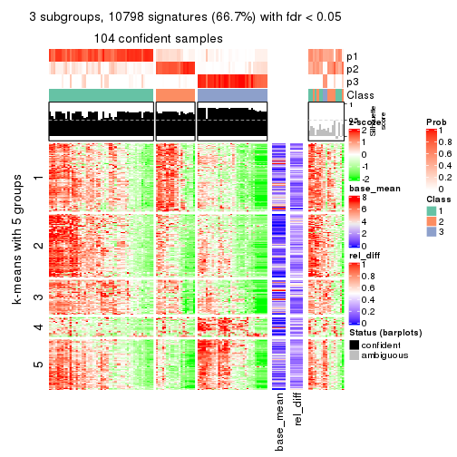</p>

</div>
<div id='tab-SD-NMF-get-signatures-3'>
<pre><code class="r">get_signatures(res, k = 4)
</code></pre>

<p></p>

</div>
<div id='tab-SD-NMF-get-signatures-4'>
<pre><code class="r">get_signatures(res, k = 5)
</code></pre>

<p></p>

</div>
<div id='tab-SD-NMF-get-signatures-5'>
<pre><code class="r">get_signatures(res, k = 6)
</code></pre>

<p></p>

</div>
</div>


Signature heatmaps where rows are not scaled:


<script>
$( function() {
	$( '#tabs-SD-NMF-get-signatures-no-scale' ).tabs();
} );
</script>
<div id='tabs-SD-NMF-get-signatures-no-scale'>
<ul>
<li><a href='#tab-SD-NMF-get-signatures-no-scale-1'>k = 2</a></li>
<li><a href='#tab-SD-NMF-get-signatures-no-scale-2'>k = 3</a></li>
<li><a href='#tab-SD-NMF-get-signatures-no-scale-3'>k = 4</a></li>
<li><a href='#tab-SD-NMF-get-signatures-no-scale-4'>k = 5</a></li>
<li><a href='#tab-SD-NMF-get-signatures-no-scale-5'>k = 6</a></li>
</ul>
<div id='tab-SD-NMF-get-signatures-no-scale-1'>
<pre><code class="r">get_signatures(res, k = 2, scale_rows = FALSE)
</code></pre>

<p></p>

</div>
<div id='tab-SD-NMF-get-signatures-no-scale-2'>
<pre><code class="r">get_signatures(res, k = 3, scale_rows = FALSE)
</code></pre>

<p></p>

</div>
<div id='tab-SD-NMF-get-signatures-no-scale-3'>
<pre><code class="r">get_signatures(res, k = 4, scale_rows = FALSE)
</code></pre>

<p>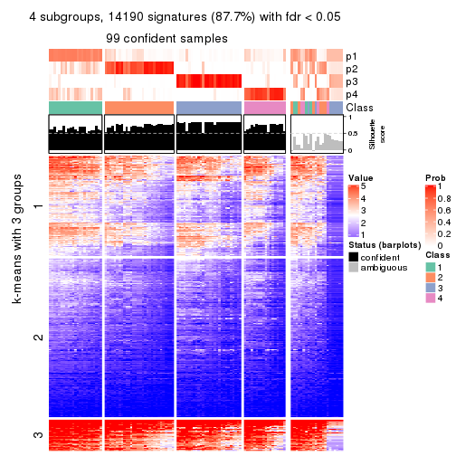</p>

</div>
<div id='tab-SD-NMF-get-signatures-no-scale-4'>
<pre><code class="r">get_signatures(res, k = 5, scale_rows = FALSE)
</code></pre>

<p></p>

</div>
<div id='tab-SD-NMF-get-signatures-no-scale-5'>
<pre><code class="r">get_signatures(res, k = 6, scale_rows = FALSE)
</code></pre>

<p></p>

</div>
</div>


Compare the overlap of signatures from different k:

```r
compare_signatures(res)
```


`get_signature()` returns a data frame invisibly. TO get the list of signatures, the function
call should be assigned to a variable explicitly. In following code, if `plot` argument is set
to `FALSE`, no heatmap is plotted while only the differential analysis is performed.

```r
# code only for demonstration
tb = get_signature(res, k = ..., plot = FALSE)
```

An example of the output of `tb` is:

```
#>   which_row         fdr    mean_1    mean_2 scaled_mean_1 scaled_mean_2 km
#> 1        38 0.042760348  8.373488  9.131774    -0.5533452     0.5164555  1
#> 2        40 0.018707592  7.106213  8.469186    -0.6173731     0.5762149  1
#> 3        55 0.019134737 10.221463 11.207825    -0.6159697     0.5749050  1
#> 4        59 0.006059896  5.921854  7.869574    -0.6899429     0.6439467  1
#> 5        60 0.018055526  8.928898 10.211722    -0.6204761     0.5791110  1
#> 6        98 0.009384629 15.714769 14.887706     0.6635654    -0.6193277  2
...
```

The columns in `tb` are:

1. `which_row`: row indices corresponding to the input matrix.
2. `fdr`: FDR for the differential test. 
3. `mean_x`: The mean value in group x.
4. `scaled_mean_x`: The mean value in group x after rows are scaled.
5. `km`: Row groups if k-means clustering is applied to rows.


UMAP plot which shows how samples are separated.


<script>
$( function() {
	$( '#tabs-SD-NMF-dimension-reduction' ).tabs();
} );
</script>
<div id='tabs-SD-NMF-dimension-reduction'>
<ul>
<li><a href='#tab-SD-NMF-dimension-reduction-1'>k = 2</a></li>
<li><a href='#tab-SD-NMF-dimension-reduction-2'>k = 3</a></li>
<li><a href='#tab-SD-NMF-dimension-reduction-3'>k = 4</a></li>
<li><a href='#tab-SD-NMF-dimension-reduction-4'>k = 5</a></li>
<li><a href='#tab-SD-NMF-dimension-reduction-5'>k = 6</a></li>
</ul>
<div id='tab-SD-NMF-dimension-reduction-1'>
<pre><code class="r">dimension_reduction(res, k = 2, method = &quot;UMAP&quot;)
</code></pre>

<p></p>

</div>
<div id='tab-SD-NMF-dimension-reduction-2'>
<pre><code class="r">dimension_reduction(res, k = 3, method = &quot;UMAP&quot;)
</code></pre>

<p></p>

</div>
<div id='tab-SD-NMF-dimension-reduction-3'>
<pre><code class="r">dimension_reduction(res, k = 4, method = &quot;UMAP&quot;)
</code></pre>

<p></p>

</div>
<div id='tab-SD-NMF-dimension-reduction-4'>
<pre><code class="r">dimension_reduction(res, k = 5, method = &quot;UMAP&quot;)
</code></pre>

<p></p>

</div>
<div id='tab-SD-NMF-dimension-reduction-5'>
<pre><code class="r">dimension_reduction(res, k = 6, method = &quot;UMAP&quot;)
</code></pre>

<p></p>

</div>
</div>


Following heatmap shows how subgroups are split when increasing `k`:

```r
collect_classes(res)
```


If matrix rows can be associated to genes, consider to use `functional_enrichment(res,
...)` to perform function enrichment for the signature genes. See [this vignette](http://bioconductor.org/packages/devel/bioc/vignettes/cola/inst/doc/functional_enrichment.html) for more detailed explanations.


 

---------------------------------------------------


### CV:hclust


The object with results only for a single top-value method and a single partition method 
can be extracted as:

```r
res = res_list["CV", "hclust"]
# you can also extract it by
# res = res_list["CV:hclust"]
```

A summary of `res` and all the functions that can be applied to it:

```r
res
```

```
#> A 'ConsensusPartition' object with k = 2, 3, 4, 5, 6.
#>   On a matrix with 16187 rows and 121 columns.
#>   Top rows (1000, 2000, 3000, 4000, 5000) are extracted by 'CV' method.
#>   Subgroups are detected by 'hclust' method.
#>   Performed in total 1250 partitions by row resampling.
#>   Best k for subgroups seems to be 3.
#> 
#> Following methods can be applied to this 'ConsensusPartition' object:
#>  [1] "cola_report"             "collect_classes"         "collect_plots"          
#>  [4] "collect_stats"           "colnames"                "compare_signatures"     
#>  [7] "consensus_heatmap"       "dimension_reduction"     "functional_enrichment"  
#> [10] "get_anno_col"            "get_anno"                "get_classes"            
#> [13] "get_consensus"           "get_matrix"              "get_membership"         
#> [16] "get_param"               "get_signatures"          "get_stats"              
#> [19] "is_best_k"               "is_stable_k"             "membership_heatmap"     
#> [22] "ncol"                    "nrow"                    "plot_ecdf"              
#> [25] "rownames"                "select_partition_number" "show"                   
#> [28] "suggest_best_k"          "test_to_known_factors"
```

`collect_plots()` function collects all the plots made from `res` for all `k` (number of partitions)
into one single page to provide an easy and fast comparison between different `k`.

```r
collect_plots(res)
```


The plots are:

- The first row: a plot of the ECDF (empirical cumulative distribution
  function) curves of the consensus matrix for each `k` and the heatmap of
  predicted classes for each `k`.
- The second row: heatmaps of the consensus matrix for each `k`.
- The third row: heatmaps of the membership matrix for each `k`.
- The fouth row: heatmaps of the signatures for each `k`.

All the plots in panels can be made by individual functions and they are
plotted later in this section.

`select_partition_number()` produces several plots showing different
statistics for choosing "optimized" `k`. There are following statistics:

- ECDF curves of the consensus matrix for each `k`;
- 1-PAC. [The PAC
  score](https://en.wikipedia.org/wiki/Consensus_clustering#Over-interpretation_potential_of_consensus_clustering)
  measures the proportion of the ambiguous subgrouping.
- Mean silhouette score.
- Concordance. The mean probability of fiting the consensus class ids in all
  partitions.
- Area increased. Denote $A_k$ as the area under the ECDF curve for current
  `k`, the area increased is defined as $A_k - A_{k-1}$.
- Rand index. The percent of pairs of samples that are both in a same cluster
  or both are not in a same cluster in the partition of k and k-1.
- Jaccard index. The ratio of pairs of samples are both in a same cluster in
  the partition of k and k-1 and the pairs of samples are both in a same
  cluster in the partition k or k-1.

The detailed explanations of these statistics can be found in [the _cola_
vignette](http://bioconductor.org/packages/devel/bioc/vignettes/cola/inst/doc/cola.html#toc_13).

Generally speaking, lower PAC score, higher mean silhouette score or higher
concordance corresponds to better partition. Rand index and Jaccard index
measure how similar the current partition is compared to partition with `k-1`.
If they are too similar, we won't accept `k` is better than `k-1`.

```r
select_partition_number(res)
```


The numeric values for all these statistics can be obtained by `get_stats()`.

```r
get_stats(res)
```

```
#>   k 1-PAC mean_silhouette concordance area_increased  Rand Jaccard
#> 2 2 0.466           0.749       0.827         0.3804 0.711   0.711
#> 3 3 0.494           0.697       0.845         0.4908 0.722   0.609
#> 4 4 0.492           0.623       0.776         0.1609 0.865   0.696
#> 5 5 0.574           0.662       0.747         0.0987 0.852   0.590
#> 6 6 0.693           0.710       0.781         0.0546 0.947   0.800
```

`suggest_best_k()` suggests the best $k$ based on these statistics. The rules are as follows:

- All $k$ with Jaccard index larger than 0.95 are removed because increasing
  $k$ does not provide enough extra information. If all $k$ are removed, it is
  marked as no subgroup is detected.
- For all $k$ with 1-PAC score larger than 0.9, the maximal $k$ is taken as
  the best $k$, and other $k$ are marked as optional $k$.
- If it does not fit the second rule. The $k$ with the maximal vote of the
  highest 1-PAC score, highest mean silhouette, and highest concordance is
  taken as the best $k$.

```r
suggest_best_k(res)
```

```
#> [1] 3
```


Following shows the table of the partitions (You need to click the **show/hide
code output** link to see it). The membership matrix (columns with name `p*`)
is inferred by
[`clue::cl_consensus()`](https://www.rdocumentation.org/link/cl_consensus?package=clue)
function with the `SE` method. Basically the value in the membership matrix
represents the probability to belong to a certain group. The finall class
label for an item is determined with the group with highest probability it
belongs to.

In `get_classes()` function, the entropy is calculated from the membership
matrix and the silhouette score is calculated from the consensus matrix.


<script>
$( function() {
	$( '#tabs-CV-hclust-get-classes' ).tabs();
} );
</script>
<div id='tabs-CV-hclust-get-classes'>
<ul>
<li><a href='#tab-CV-hclust-get-classes-1'>k = 2</a></li>
<li><a href='#tab-CV-hclust-get-classes-2'>k = 3</a></li>
<li><a href='#tab-CV-hclust-get-classes-3'>k = 4</a></li>
<li><a href='#tab-CV-hclust-get-classes-4'>k = 5</a></li>
<li><a href='#tab-CV-hclust-get-classes-5'>k = 6</a></li>
</ul>

<div id='tab-CV-hclust-get-classes-1'>
<p><a id='tab-CV-hclust-get-classes-1-a' style='color:#0366d6' href='#'>show/hide code output</a></p>
<pre><code class="r">cbind(get_classes(res, k = 2), get_membership(res, k = 2))
</code></pre>

<pre><code>#&gt;           class entropy silhouette    p1    p2
#&gt; DRR006374     1  0.0000     0.8209 1.000 0.000
#&gt; DRR006375     2  0.0672     0.9340 0.008 0.992
#&gt; DRR006376     1  0.2236     0.8198 0.964 0.036
#&gt; DRR006377     1  0.1843     0.8211 0.972 0.028
#&gt; DRR006378     1  0.0000     0.8209 1.000 0.000
#&gt; DRR006379     1  0.2236     0.8198 0.964 0.036
#&gt; DRR006380     1  0.0000     0.8209 1.000 0.000
#&gt; DRR006381     2  0.3584     0.8792 0.068 0.932
#&gt; DRR006382     1  0.0376     0.8211 0.996 0.004
#&gt; DRR006383     1  0.9460     0.6130 0.636 0.364
#&gt; DRR006384     1  0.0000     0.8209 1.000 0.000
#&gt; DRR006385     1  0.8955     0.6538 0.688 0.312
#&gt; DRR006386     1  0.0000     0.8209 1.000 0.000
#&gt; DRR006387     1  0.9635     0.5673 0.612 0.388
#&gt; DRR006388     1  0.3274     0.8150 0.940 0.060
#&gt; DRR006389     1  0.3274     0.8150 0.940 0.060
#&gt; DRR006390     1  0.0000     0.8209 1.000 0.000
#&gt; DRR006391     1  0.0000     0.8209 1.000 0.000
#&gt; DRR006392     2  0.0000     0.9383 0.000 1.000
#&gt; DRR006393     1  0.8955     0.6669 0.688 0.312
#&gt; DRR006394     1  0.0000     0.8209 1.000 0.000
#&gt; DRR006395     1  0.9944     0.4404 0.544 0.456
#&gt; DRR006396     2  0.6148     0.7798 0.152 0.848
#&gt; DRR006397     1  0.4161     0.8065 0.916 0.084
#&gt; DRR006398     1  0.4161     0.8065 0.916 0.084
#&gt; DRR006399     1  0.2603     0.8187 0.956 0.044
#&gt; DRR006400     1  0.2603     0.8187 0.956 0.044
#&gt; DRR006401     1  0.0000     0.8209 1.000 0.000
#&gt; DRR006402     1  0.0000     0.8209 1.000 0.000
#&gt; DRR006403     1  0.2423     0.8194 0.960 0.040
#&gt; DRR006404     1  0.2603     0.8192 0.956 0.044
#&gt; DRR006405     1  0.1843     0.8211 0.972 0.028
#&gt; DRR006406     1  0.1843     0.8211 0.972 0.028
#&gt; DRR006407     1  0.0000     0.8209 1.000 0.000
#&gt; DRR006408     1  0.0000     0.8209 1.000 0.000
#&gt; DRR006409     1  0.9983     0.4039 0.524 0.476
#&gt; DRR006410     1  0.9635     0.5673 0.612 0.388
#&gt; DRR006411     1  0.3114     0.8168 0.944 0.056
#&gt; DRR006412     1  0.0000     0.8209 1.000 0.000
#&gt; DRR006413     2  0.0000     0.9383 0.000 1.000
#&gt; DRR006414     1  0.9580     0.5928 0.620 0.380
#&gt; DRR006415     1  0.9580     0.5928 0.620 0.380
#&gt; DRR006416     1  0.8909     0.6703 0.692 0.308
#&gt; DRR006417     1  0.9815     0.5295 0.580 0.420
#&gt; DRR006418     1  0.9795     0.5324 0.584 0.416
#&gt; DRR006419     1  0.9580     0.5942 0.620 0.380
#&gt; DRR006420     1  0.9580     0.5942 0.620 0.380
#&gt; DRR006421     1  0.1414     0.8218 0.980 0.020
#&gt; DRR006422     1  0.2948     0.8177 0.948 0.052
#&gt; DRR006423     1  0.0000     0.8209 1.000 0.000
#&gt; DRR006424     2  0.0000     0.9383 0.000 1.000
#&gt; DRR006425     1  0.0000     0.8209 1.000 0.000
#&gt; DRR006426     1  0.9044     0.6588 0.680 0.320
#&gt; DRR006427     1  0.0000     0.8209 1.000 0.000
#&gt; DRR006428     1  0.9944     0.4556 0.544 0.456
#&gt; DRR006429     1  0.0000     0.8209 1.000 0.000
#&gt; DRR006430     2  0.0000     0.9383 0.000 1.000
#&gt; DRR006431     2  0.0000     0.9383 0.000 1.000
#&gt; DRR006432     1  0.9170     0.6484 0.668 0.332
#&gt; DRR006433     1  0.7602     0.7352 0.780 0.220
#&gt; DRR006434     1  0.0000     0.8209 1.000 0.000
#&gt; DRR006435     1  0.0000     0.8209 1.000 0.000
#&gt; DRR006436     1  0.0000     0.8209 1.000 0.000
#&gt; DRR006437     2  0.9983    -0.0984 0.476 0.524
#&gt; DRR006438     1  0.9608     0.5888 0.616 0.384
#&gt; DRR006439     1  0.9209     0.6455 0.664 0.336
#&gt; DRR006440     1  0.0000     0.8209 1.000 0.000
#&gt; DRR006441     1  0.0000     0.8209 1.000 0.000
#&gt; DRR006442     1  0.9732     0.5561 0.596 0.404
#&gt; DRR006443     1  0.0000     0.8209 1.000 0.000
#&gt; DRR006444     1  0.0000     0.8209 1.000 0.000
#&gt; DRR006445     1  0.9850     0.4777 0.572 0.428
#&gt; DRR006446     1  0.0000     0.8209 1.000 0.000
#&gt; DRR006447     1  0.9552     0.5491 0.624 0.376
#&gt; DRR006448     1  0.2603     0.8187 0.956 0.044
#&gt; DRR006449     1  0.9460     0.5628 0.636 0.364
#&gt; DRR006450     1  0.9460     0.5628 0.636 0.364
#&gt; DRR006451     1  0.2236     0.8198 0.964 0.036
#&gt; DRR006452     2  0.4815     0.8397 0.104 0.896
#&gt; DRR006453     1  0.8909     0.6703 0.692 0.308
#&gt; DRR006454     1  0.0376     0.8211 0.996 0.004
#&gt; DRR006455     1  0.0000     0.8209 1.000 0.000
#&gt; DRR006456     1  0.9732     0.5561 0.596 0.404
#&gt; DRR006457     1  0.7602     0.7352 0.780 0.220
#&gt; DRR006458     2  0.0000     0.9383 0.000 1.000
#&gt; DRR006459     2  0.0000     0.9383 0.000 1.000
#&gt; DRR006460     1  0.0000     0.8209 1.000 0.000
#&gt; DRR006461     1  0.1184     0.8218 0.984 0.016
#&gt; DRR006462     2  0.6247     0.7711 0.156 0.844
#&gt; DRR006463     1  0.0000     0.8209 1.000 0.000
#&gt; DRR006464     1  0.0000     0.8209 1.000 0.000
#&gt; DRR006465     1  0.8955     0.6669 0.688 0.312
#&gt; DRR006466     1  0.1184     0.8221 0.984 0.016
#&gt; DRR006467     2  0.0000     0.9383 0.000 1.000
#&gt; DRR006468     1  0.0000     0.8209 1.000 0.000
#&gt; DRR006469     1  0.0000     0.8209 1.000 0.000
#&gt; DRR006470     1  0.9815     0.5295 0.580 0.420
#&gt; DRR006471     2  0.0000     0.9383 0.000 1.000
#&gt; DRR006472     1  0.8955     0.6668 0.688 0.312
#&gt; DRR006473     1  0.0000     0.8209 1.000 0.000
#&gt; DRR006474     1  0.0000     0.8209 1.000 0.000
#&gt; DRR006475     2  0.0000     0.9383 0.000 1.000
#&gt; DRR006476     1  0.1184     0.8218 0.984 0.016
#&gt; DRR006477     1  0.2043     0.8216 0.968 0.032
#&gt; DRR006478     1  0.8955     0.6669 0.688 0.312
#&gt; DRR006479     1  0.9608     0.5888 0.616 0.384
#&gt; DRR006480     2  0.0000     0.9383 0.000 1.000
#&gt; DRR006481     1  0.8813     0.6768 0.700 0.300
#&gt; DRR006482     1  0.8813     0.6631 0.700 0.300
#&gt; DRR006483     2  0.0000     0.9383 0.000 1.000
#&gt; DRR006484     1  0.9552     0.5976 0.624 0.376
#&gt; DRR006485     1  0.0000     0.8209 1.000 0.000
#&gt; DRR006486     2  0.0376     0.9363 0.004 0.996
#&gt; DRR006487     1  0.9775     0.5423 0.588 0.412
#&gt; DRR006488     1  0.0000     0.8209 1.000 0.000
#&gt; DRR006489     2  0.1184     0.9280 0.016 0.984
#&gt; DRR006490     1  0.9775     0.5421 0.588 0.412
#&gt; DRR006491     1  0.9732     0.5561 0.596 0.404
#&gt; DRR006492     1  0.9944     0.4404 0.544 0.456
#&gt; DRR006493     1  0.9710     0.5616 0.600 0.400
#&gt; DRR006494     2  0.0000     0.9383 0.000 1.000
</code></pre>

<script>
$('#tab-CV-hclust-get-classes-1-a').parent().next().next().hide();
$('#tab-CV-hclust-get-classes-1-a').click(function(){
  $('#tab-CV-hclust-get-classes-1-a').parent().next().next().toggle();
  return(false);
});
</script>
</div>

<div id='tab-CV-hclust-get-classes-2'>
<p><a id='tab-CV-hclust-get-classes-2-a' style='color:#0366d6' href='#'>show/hide code output</a></p>
<pre><code class="r">cbind(get_classes(res, k = 3), get_membership(res, k = 3))
</code></pre>

<pre><code>#&gt;           class entropy silhouette    p1    p2    p3
#&gt; DRR006374     2  0.0000     0.8377 0.000 1.000 0.000
#&gt; DRR006375     1  0.2537     0.8753 0.920 0.000 0.080
#&gt; DRR006376     2  0.3765     0.7998 0.028 0.888 0.084
#&gt; DRR006377     2  0.3370     0.8072 0.024 0.904 0.072
#&gt; DRR006378     2  0.0000     0.8377 0.000 1.000 0.000
#&gt; DRR006379     2  0.3765     0.7998 0.028 0.888 0.084
#&gt; DRR006380     2  0.0000     0.8377 0.000 1.000 0.000
#&gt; DRR006381     1  0.4605     0.7598 0.796 0.000 0.204
#&gt; DRR006382     2  0.3816     0.7253 0.000 0.852 0.148
#&gt; DRR006383     3  0.5639     0.7260 0.016 0.232 0.752
#&gt; DRR006384     2  0.0000     0.8377 0.000 1.000 0.000
#&gt; DRR006385     2  0.9201     0.1035 0.160 0.488 0.352
#&gt; DRR006386     2  0.0000     0.8377 0.000 1.000 0.000
#&gt; DRR006387     2  0.9387     0.2122 0.272 0.508 0.220
#&gt; DRR006388     2  0.4840     0.7329 0.016 0.816 0.168
#&gt; DRR006389     2  0.4840     0.7329 0.016 0.816 0.168
#&gt; DRR006390     2  0.0000     0.8377 0.000 1.000 0.000
#&gt; DRR006391     2  0.0000     0.8377 0.000 1.000 0.000
#&gt; DRR006392     1  0.2066     0.8904 0.940 0.000 0.060
#&gt; DRR006393     2  0.8802     0.3820 0.200 0.584 0.216
#&gt; DRR006394     2  0.0000     0.8377 0.000 1.000 0.000
#&gt; DRR006395     3  0.9937     0.3781 0.316 0.296 0.388
#&gt; DRR006396     1  0.6624     0.5904 0.708 0.044 0.248
#&gt; DRR006397     2  0.5891     0.6786 0.036 0.764 0.200
#&gt; DRR006398     2  0.5891     0.6786 0.036 0.764 0.200
#&gt; DRR006399     2  0.3973     0.7968 0.032 0.880 0.088
#&gt; DRR006400     2  0.3973     0.7968 0.032 0.880 0.088
#&gt; DRR006401     2  0.0000     0.8377 0.000 1.000 0.000
#&gt; DRR006402     2  0.0000     0.8377 0.000 1.000 0.000
#&gt; DRR006403     2  0.3850     0.7983 0.028 0.884 0.088
#&gt; DRR006404     2  0.3933     0.7956 0.028 0.880 0.092
#&gt; DRR006405     2  0.3370     0.8072 0.024 0.904 0.072
#&gt; DRR006406     2  0.3370     0.8072 0.024 0.904 0.072
#&gt; DRR006407     2  0.1163     0.8328 0.000 0.972 0.028
#&gt; DRR006408     2  0.0237     0.8374 0.000 0.996 0.004
#&gt; DRR006409     3  0.9340     0.4394 0.308 0.192 0.500
#&gt; DRR006410     2  0.9387     0.2122 0.272 0.508 0.220
#&gt; DRR006411     2  0.6274     0.1041 0.000 0.544 0.456
#&gt; DRR006412     2  0.0000     0.8377 0.000 1.000 0.000
#&gt; DRR006413     1  0.1753     0.8789 0.952 0.000 0.048
#&gt; DRR006414     3  0.2599     0.7160 0.016 0.052 0.932
#&gt; DRR006415     3  0.2599     0.7160 0.016 0.052 0.932
#&gt; DRR006416     2  0.8799     0.3856 0.196 0.584 0.220
#&gt; DRR006417     3  0.2031     0.6867 0.032 0.016 0.952
#&gt; DRR006418     3  0.7815     0.6537 0.096 0.260 0.644
#&gt; DRR006419     3  0.6142     0.7336 0.040 0.212 0.748
#&gt; DRR006420     3  0.6232     0.7312 0.040 0.220 0.740
#&gt; DRR006421     2  0.2496     0.8139 0.004 0.928 0.068
#&gt; DRR006422     2  0.4094     0.7896 0.028 0.872 0.100
#&gt; DRR006423     2  0.0000     0.8377 0.000 1.000 0.000
#&gt; DRR006424     1  0.2165     0.8894 0.936 0.000 0.064
#&gt; DRR006425     2  0.0424     0.8370 0.000 0.992 0.008
#&gt; DRR006426     3  0.6275     0.5790 0.008 0.348 0.644
#&gt; DRR006427     2  0.0000     0.8377 0.000 1.000 0.000
#&gt; DRR006428     3  0.2878     0.6224 0.096 0.000 0.904
#&gt; DRR006429     2  0.0424     0.8370 0.000 0.992 0.008
#&gt; DRR006430     1  0.2066     0.8904 0.940 0.000 0.060
#&gt; DRR006431     1  0.1860     0.8916 0.948 0.000 0.052
#&gt; DRR006432     3  0.4033     0.7297 0.008 0.136 0.856
#&gt; DRR006433     3  0.6168     0.4532 0.000 0.412 0.588
#&gt; DRR006434     2  0.0424     0.8356 0.000 0.992 0.008
#&gt; DRR006435     2  0.0000     0.8377 0.000 1.000 0.000
#&gt; DRR006436     2  0.0000     0.8377 0.000 1.000 0.000
#&gt; DRR006437     1  0.9926    -0.1970 0.376 0.276 0.348
#&gt; DRR006438     3  0.6201     0.7337 0.044 0.208 0.748
#&gt; DRR006439     3  0.6053     0.7058 0.020 0.260 0.720
#&gt; DRR006440     2  0.0237     0.8369 0.000 0.996 0.004
#&gt; DRR006441     2  0.0000     0.8377 0.000 1.000 0.000
#&gt; DRR006442     3  0.1919     0.6943 0.024 0.020 0.956
#&gt; DRR006443     2  0.1163     0.8255 0.000 0.972 0.028
#&gt; DRR006444     2  0.0000     0.8377 0.000 1.000 0.000
#&gt; DRR006445     2  0.9663     0.0985 0.308 0.456 0.236
#&gt; DRR006446     2  0.0000     0.8377 0.000 1.000 0.000
#&gt; DRR006447     2  0.9716    -0.0614 0.228 0.428 0.344
#&gt; DRR006448     2  0.4056     0.7945 0.032 0.876 0.092
#&gt; DRR006449     2  0.9651    -0.0448 0.216 0.436 0.348
#&gt; DRR006450     2  0.9651    -0.0448 0.216 0.436 0.348
#&gt; DRR006451     2  0.3765     0.7998 0.028 0.888 0.084
#&gt; DRR006452     1  0.5945     0.6869 0.740 0.024 0.236
#&gt; DRR006453     2  0.8799     0.3856 0.196 0.584 0.220
#&gt; DRR006454     2  0.1031     0.8350 0.000 0.976 0.024
#&gt; DRR006455     2  0.0892     0.8277 0.000 0.980 0.020
#&gt; DRR006456     3  0.1919     0.6943 0.024 0.020 0.956
#&gt; DRR006457     3  0.6168     0.4532 0.000 0.412 0.588
#&gt; DRR006458     1  0.1860     0.8916 0.948 0.000 0.052
#&gt; DRR006459     1  0.1860     0.8916 0.948 0.000 0.052
#&gt; DRR006460     2  0.0000     0.8377 0.000 1.000 0.000
#&gt; DRR006461     2  0.1163     0.8339 0.000 0.972 0.028
#&gt; DRR006462     1  0.6490     0.5780 0.708 0.036 0.256
#&gt; DRR006463     2  0.1163     0.8255 0.000 0.972 0.028
#&gt; DRR006464     2  0.0424     0.8370 0.000 0.992 0.008
#&gt; DRR006465     2  0.8802     0.3820 0.200 0.584 0.216
#&gt; DRR006466     2  0.2261     0.8157 0.000 0.932 0.068
#&gt; DRR006467     1  0.1411     0.8740 0.964 0.000 0.036
#&gt; DRR006468     2  0.0000     0.8377 0.000 1.000 0.000
#&gt; DRR006469     2  0.0000     0.8377 0.000 1.000 0.000
#&gt; DRR006470     3  0.2031     0.6867 0.032 0.016 0.952
#&gt; DRR006471     1  0.1411     0.8740 0.964 0.000 0.036
#&gt; DRR006472     3  0.6318     0.5650 0.008 0.356 0.636
#&gt; DRR006473     2  0.0000     0.8377 0.000 1.000 0.000
#&gt; DRR006474     2  0.0000     0.8377 0.000 1.000 0.000
#&gt; DRR006475     1  0.1860     0.8916 0.948 0.000 0.052
#&gt; DRR006476     2  0.1163     0.8339 0.000 0.972 0.028
#&gt; DRR006477     2  0.4504     0.6856 0.000 0.804 0.196
#&gt; DRR006478     2  0.8802     0.3820 0.200 0.584 0.216
#&gt; DRR006479     3  0.6201     0.7337 0.044 0.208 0.748
#&gt; DRR006480     1  0.1860     0.8916 0.948 0.000 0.052
#&gt; DRR006481     3  0.5929     0.6261 0.004 0.320 0.676
#&gt; DRR006482     2  0.9074     0.1343 0.148 0.500 0.352
#&gt; DRR006483     1  0.1860     0.8916 0.948 0.000 0.052
#&gt; DRR006484     3  0.2599     0.7167 0.016 0.052 0.932
#&gt; DRR006485     2  0.1163     0.8255 0.000 0.972 0.028
#&gt; DRR006486     1  0.1860     0.8712 0.948 0.000 0.052
#&gt; DRR006487     3  0.2031     0.6853 0.032 0.016 0.952
#&gt; DRR006488     2  0.0000     0.8377 0.000 1.000 0.000
#&gt; DRR006489     1  0.2625     0.8783 0.916 0.000 0.084
#&gt; DRR006490     3  0.1905     0.6892 0.028 0.016 0.956
#&gt; DRR006491     3  0.1919     0.6943 0.024 0.020 0.956
#&gt; DRR006492     3  0.9937     0.3781 0.316 0.296 0.388
#&gt; DRR006493     3  0.2187     0.7005 0.024 0.028 0.948
#&gt; DRR006494     1  0.1860     0.8916 0.948 0.000 0.052
</code></pre>

<script>
$('#tab-CV-hclust-get-classes-2-a').parent().next().next().hide();
$('#tab-CV-hclust-get-classes-2-a').click(function(){
  $('#tab-CV-hclust-get-classes-2-a').parent().next().next().toggle();
  return(false);
});
</script>
</div>

<div id='tab-CV-hclust-get-classes-3'>
<p><a id='tab-CV-hclust-get-classes-3-a' style='color:#0366d6' href='#'>show/hide code output</a></p>
<pre><code class="r">cbind(get_classes(res, k = 4), get_membership(res, k = 4))
</code></pre>

<pre><code>#&gt;           class entropy silhouette    p1    p2    p3    p4
#&gt; DRR006374     2  0.0188    0.79217 0.000 0.996 0.000 0.004
#&gt; DRR006375     1  0.4535    0.83514 0.704 0.000 0.004 0.292
#&gt; DRR006376     2  0.4925    0.27169 0.000 0.572 0.000 0.428
#&gt; DRR006377     2  0.4855    0.32753 0.000 0.600 0.000 0.400
#&gt; DRR006378     2  0.0000    0.79382 0.000 1.000 0.000 0.000
#&gt; DRR006379     2  0.4933    0.26458 0.000 0.568 0.000 0.432
#&gt; DRR006380     2  0.0188    0.79217 0.000 0.996 0.000 0.004
#&gt; DRR006381     1  0.5600    0.70278 0.596 0.000 0.028 0.376
#&gt; DRR006382     2  0.3351    0.65205 0.000 0.844 0.148 0.008
#&gt; DRR006383     3  0.4635    0.63318 0.000 0.216 0.756 0.028
#&gt; DRR006384     2  0.0188    0.79217 0.000 0.996 0.000 0.004
#&gt; DRR006385     4  0.6397    0.62247 0.004 0.256 0.100 0.640
#&gt; DRR006386     2  0.0000    0.79382 0.000 1.000 0.000 0.000
#&gt; DRR006387     4  0.6230    0.67581 0.088 0.256 0.004 0.652
#&gt; DRR006388     2  0.6233    0.19845 0.000 0.552 0.060 0.388
#&gt; DRR006389     2  0.6233    0.19845 0.000 0.552 0.060 0.388
#&gt; DRR006390     2  0.0000    0.79382 0.000 1.000 0.000 0.000
#&gt; DRR006391     2  0.0000    0.79382 0.000 1.000 0.000 0.000
#&gt; DRR006392     1  0.4088    0.87685 0.764 0.000 0.004 0.232
#&gt; DRR006393     4  0.5266    0.65968 0.020 0.264 0.012 0.704
#&gt; DRR006394     2  0.0000    0.79382 0.000 1.000 0.000 0.000
#&gt; DRR006395     4  0.7869    0.46759 0.096 0.116 0.184 0.604
#&gt; DRR006396     4  0.6337   -0.35970 0.420 0.020 0.028 0.532
#&gt; DRR006397     2  0.6438    0.00706 0.000 0.496 0.068 0.436
#&gt; DRR006398     2  0.6438    0.00706 0.000 0.496 0.068 0.436
#&gt; DRR006399     2  0.4948    0.24618 0.000 0.560 0.000 0.440
#&gt; DRR006400     2  0.4948    0.24618 0.000 0.560 0.000 0.440
#&gt; DRR006401     2  0.0000    0.79382 0.000 1.000 0.000 0.000
#&gt; DRR006402     2  0.0000    0.79382 0.000 1.000 0.000 0.000
#&gt; DRR006403     2  0.4941    0.25535 0.000 0.564 0.000 0.436
#&gt; DRR006404     2  0.4948    0.24385 0.000 0.560 0.000 0.440
#&gt; DRR006405     2  0.4888    0.30599 0.000 0.588 0.000 0.412
#&gt; DRR006406     2  0.4888    0.30599 0.000 0.588 0.000 0.412
#&gt; DRR006407     2  0.4164    0.54316 0.000 0.736 0.000 0.264
#&gt; DRR006408     2  0.0707    0.78659 0.000 0.980 0.000 0.020
#&gt; DRR006409     4  0.8389    0.14202 0.116 0.072 0.348 0.464
#&gt; DRR006410     4  0.6230    0.67581 0.088 0.256 0.004 0.652
#&gt; DRR006411     2  0.7864   -0.19710 0.000 0.392 0.320 0.288
#&gt; DRR006412     2  0.0000    0.79382 0.000 1.000 0.000 0.000
#&gt; DRR006413     1  0.1661    0.76337 0.944 0.000 0.004 0.052
#&gt; DRR006414     3  0.1820    0.72082 0.000 0.036 0.944 0.020
#&gt; DRR006415     3  0.1820    0.72082 0.000 0.036 0.944 0.020
#&gt; DRR006416     4  0.5216    0.65383 0.016 0.272 0.012 0.700
#&gt; DRR006417     3  0.3774    0.69968 0.008 0.004 0.820 0.168
#&gt; DRR006418     3  0.7887    0.35999 0.036 0.124 0.496 0.344
#&gt; DRR006419     3  0.6240    0.64220 0.004 0.108 0.668 0.220
#&gt; DRR006420     3  0.6343    0.63297 0.004 0.116 0.660 0.220
#&gt; DRR006421     2  0.2675    0.74352 0.000 0.908 0.048 0.044
#&gt; DRR006422     2  0.5126    0.22011 0.000 0.552 0.004 0.444
#&gt; DRR006423     2  0.0000    0.79382 0.000 1.000 0.000 0.000
#&gt; DRR006424     1  0.4262    0.87428 0.756 0.000 0.008 0.236
#&gt; DRR006425     2  0.0336    0.79150 0.000 0.992 0.000 0.008
#&gt; DRR006426     3  0.7357    0.45113 0.000 0.260 0.524 0.216
#&gt; DRR006427     2  0.0000    0.79382 0.000 1.000 0.000 0.000
#&gt; DRR006428     3  0.3697    0.66948 0.048 0.000 0.852 0.100
#&gt; DRR006429     2  0.0336    0.79150 0.000 0.992 0.000 0.008
#&gt; DRR006430     1  0.4088    0.87685 0.764 0.000 0.004 0.232
#&gt; DRR006431     1  0.3791    0.88455 0.796 0.000 0.004 0.200
#&gt; DRR006432     3  0.5599    0.66487 0.000 0.072 0.700 0.228
#&gt; DRR006433     3  0.7441    0.38485 0.000 0.320 0.488 0.192
#&gt; DRR006434     2  0.0336    0.79037 0.000 0.992 0.008 0.000
#&gt; DRR006435     2  0.0000    0.79382 0.000 1.000 0.000 0.000
#&gt; DRR006436     2  0.0000    0.79382 0.000 1.000 0.000 0.000
#&gt; DRR006437     4  0.8258    0.45828 0.216 0.124 0.100 0.560
#&gt; DRR006438     3  0.6219    0.64531 0.004 0.104 0.668 0.224
#&gt; DRR006439     3  0.6786    0.58194 0.004 0.132 0.608 0.256
#&gt; DRR006440     2  0.0376    0.79033 0.000 0.992 0.004 0.004
#&gt; DRR006441     2  0.0000    0.79382 0.000 1.000 0.000 0.000
#&gt; DRR006442     3  0.0524    0.71217 0.000 0.008 0.988 0.004
#&gt; DRR006443     2  0.1256    0.77465 0.000 0.964 0.028 0.008
#&gt; DRR006444     2  0.0000    0.79382 0.000 1.000 0.000 0.000
#&gt; DRR006445     4  0.4978    0.67017 0.056 0.160 0.008 0.776
#&gt; DRR006446     2  0.0000    0.79382 0.000 1.000 0.000 0.000
#&gt; DRR006447     4  0.7148    0.62897 0.056 0.208 0.092 0.644
#&gt; DRR006448     2  0.4955    0.23677 0.000 0.556 0.000 0.444
#&gt; DRR006449     4  0.7297    0.62409 0.056 0.220 0.096 0.628
#&gt; DRR006450     4  0.7297    0.62409 0.056 0.220 0.096 0.628
#&gt; DRR006451     2  0.4933    0.26458 0.000 0.568 0.000 0.432
#&gt; DRR006452     1  0.6044    0.56361 0.528 0.008 0.028 0.436
#&gt; DRR006453     4  0.5216    0.65383 0.016 0.272 0.012 0.700
#&gt; DRR006454     2  0.1888    0.76563 0.000 0.940 0.016 0.044
#&gt; DRR006455     2  0.0707    0.77901 0.000 0.980 0.000 0.020
#&gt; DRR006456     3  0.0524    0.71217 0.000 0.008 0.988 0.004
#&gt; DRR006457     3  0.7441    0.38485 0.000 0.320 0.488 0.192
#&gt; DRR006458     1  0.3751    0.88508 0.800 0.000 0.004 0.196
#&gt; DRR006459     1  0.3751    0.88508 0.800 0.000 0.004 0.196
#&gt; DRR006460     2  0.0188    0.79217 0.000 0.996 0.000 0.004
#&gt; DRR006461     2  0.1297    0.77981 0.000 0.964 0.020 0.016
#&gt; DRR006462     4  0.5708   -0.34854 0.416 0.000 0.028 0.556
#&gt; DRR006463     2  0.1109    0.77417 0.000 0.968 0.028 0.004
#&gt; DRR006464     2  0.0336    0.79150 0.000 0.992 0.000 0.008
#&gt; DRR006465     4  0.5266    0.65968 0.020 0.264 0.012 0.704
#&gt; DRR006466     2  0.2586    0.74707 0.000 0.912 0.048 0.040
#&gt; DRR006467     1  0.1211    0.75475 0.960 0.000 0.000 0.040
#&gt; DRR006468     2  0.0000    0.79382 0.000 1.000 0.000 0.000
#&gt; DRR006469     2  0.0000    0.79382 0.000 1.000 0.000 0.000
#&gt; DRR006470     3  0.3774    0.69968 0.008 0.004 0.820 0.168
#&gt; DRR006471     1  0.1211    0.75475 0.960 0.000 0.000 0.040
#&gt; DRR006472     3  0.7389    0.43618 0.000 0.272 0.516 0.212
#&gt; DRR006473     2  0.0000    0.79382 0.000 1.000 0.000 0.000
#&gt; DRR006474     2  0.0000    0.79382 0.000 1.000 0.000 0.000
#&gt; DRR006475     1  0.3751    0.88508 0.800 0.000 0.004 0.196
#&gt; DRR006476     2  0.1297    0.77981 0.000 0.964 0.020 0.016
#&gt; DRR006477     2  0.4798    0.57411 0.000 0.768 0.180 0.052
#&gt; DRR006478     4  0.5266    0.65968 0.020 0.264 0.012 0.704
#&gt; DRR006479     3  0.6219    0.64531 0.004 0.104 0.668 0.224
#&gt; DRR006480     1  0.3751    0.88508 0.800 0.000 0.004 0.196
#&gt; DRR006481     3  0.7093    0.53691 0.000 0.220 0.568 0.212
#&gt; DRR006482     4  0.6473    0.61153 0.004 0.268 0.100 0.628
#&gt; DRR006483     1  0.3751    0.88508 0.800 0.000 0.004 0.196
#&gt; DRR006484     3  0.2882    0.72379 0.000 0.024 0.892 0.084
#&gt; DRR006485     2  0.1109    0.77417 0.000 0.968 0.028 0.004
#&gt; DRR006486     1  0.2611    0.71159 0.896 0.000 0.008 0.096
#&gt; DRR006487     3  0.0376    0.70785 0.000 0.004 0.992 0.004
#&gt; DRR006488     2  0.0000    0.79382 0.000 1.000 0.000 0.000
#&gt; DRR006489     1  0.4511    0.85309 0.724 0.000 0.008 0.268
#&gt; DRR006490     3  0.0524    0.71045 0.000 0.004 0.988 0.008
#&gt; DRR006491     3  0.0524    0.71217 0.000 0.008 0.988 0.004
#&gt; DRR006492     4  0.7869    0.46759 0.096 0.116 0.184 0.604
#&gt; DRR006493     3  0.0779    0.71574 0.000 0.016 0.980 0.004
#&gt; DRR006494     1  0.3751    0.88508 0.800 0.000 0.004 0.196
</code></pre>

<script>
$('#tab-CV-hclust-get-classes-3-a').parent().next().next().hide();
$('#tab-CV-hclust-get-classes-3-a').click(function(){
  $('#tab-CV-hclust-get-classes-3-a').parent().next().next().toggle();
  return(false);
});
</script>
</div>

<div id='tab-CV-hclust-get-classes-4'>
<p><a id='tab-CV-hclust-get-classes-4-a' style='color:#0366d6' href='#'>show/hide code output</a></p>
<pre><code class="r">cbind(get_classes(res, k = 5), get_membership(res, k = 5))
</code></pre>

<pre><code>#&gt;           class entropy silhouette    p1    p2    p3    p4    p5
#&gt; DRR006374     2  0.0290     0.9475 0.000 0.992 0.000 0.008 0.000
#&gt; DRR006375     1  0.5044     0.5174 0.504 0.000 0.000 0.032 0.464
#&gt; DRR006376     4  0.3741     0.6889 0.000 0.264 0.000 0.732 0.004
#&gt; DRR006377     4  0.4583     0.6622 0.000 0.296 0.000 0.672 0.032
#&gt; DRR006378     2  0.0290     0.9472 0.000 0.992 0.000 0.008 0.000
#&gt; DRR006379     4  0.3689     0.6911 0.000 0.256 0.000 0.740 0.004
#&gt; DRR006380     2  0.0290     0.9475 0.000 0.992 0.000 0.008 0.000
#&gt; DRR006381     5  0.5799    -0.0302 0.416 0.000 0.000 0.092 0.492
#&gt; DRR006382     2  0.3001     0.7850 0.000 0.844 0.144 0.008 0.004
#&gt; DRR006383     3  0.4703     0.5856 0.000 0.212 0.732 0.032 0.024
#&gt; DRR006384     2  0.0290     0.9475 0.000 0.992 0.000 0.008 0.000
#&gt; DRR006385     4  0.5802     0.4748 0.000 0.092 0.008 0.588 0.312
#&gt; DRR006386     2  0.0162     0.9487 0.000 0.996 0.000 0.004 0.000
#&gt; DRR006387     4  0.6632     0.4501 0.024 0.136 0.000 0.516 0.324
#&gt; DRR006388     4  0.5203     0.6461 0.000 0.264 0.004 0.660 0.072
#&gt; DRR006389     4  0.5203     0.6461 0.000 0.264 0.004 0.660 0.072
#&gt; DRR006390     2  0.0162     0.9487 0.000 0.996 0.000 0.004 0.000
#&gt; DRR006391     2  0.0162     0.9487 0.000 0.996 0.000 0.004 0.000
#&gt; DRR006392     1  0.4597     0.6682 0.564 0.000 0.000 0.012 0.424
#&gt; DRR006393     4  0.6070     0.5588 0.000 0.144 0.008 0.592 0.256
#&gt; DRR006394     2  0.0290     0.9472 0.000 0.992 0.000 0.008 0.000
#&gt; DRR006395     4  0.6832    -0.0593 0.020 0.024 0.084 0.440 0.432
#&gt; DRR006396     5  0.6262     0.5153 0.244 0.004 0.000 0.192 0.560
#&gt; DRR006397     4  0.5163     0.6651 0.000 0.224 0.004 0.684 0.088
#&gt; DRR006398     4  0.5163     0.6651 0.000 0.224 0.004 0.684 0.088
#&gt; DRR006399     4  0.3934     0.6918 0.000 0.244 0.000 0.740 0.016
#&gt; DRR006400     4  0.3934     0.6918 0.000 0.244 0.000 0.740 0.016
#&gt; DRR006401     2  0.0162     0.9487 0.000 0.996 0.000 0.004 0.000
#&gt; DRR006402     2  0.0162     0.9487 0.000 0.996 0.000 0.004 0.000
#&gt; DRR006403     4  0.3961     0.6915 0.000 0.248 0.000 0.736 0.016
#&gt; DRR006404     4  0.3863     0.6927 0.000 0.248 0.000 0.740 0.012
#&gt; DRR006405     4  0.4428     0.6815 0.000 0.268 0.000 0.700 0.032
#&gt; DRR006406     4  0.4428     0.6815 0.000 0.268 0.000 0.700 0.032
#&gt; DRR006407     2  0.5046    -0.2870 0.000 0.500 0.000 0.468 0.032
#&gt; DRR006408     2  0.1571     0.9068 0.000 0.936 0.000 0.060 0.004
#&gt; DRR006409     5  0.7971     0.1158 0.052 0.012 0.328 0.240 0.368
#&gt; DRR006410     4  0.6632     0.4501 0.024 0.136 0.000 0.516 0.324
#&gt; DRR006411     4  0.7126     0.1978 0.000 0.180 0.060 0.536 0.224
#&gt; DRR006412     2  0.0162     0.9487 0.000 0.996 0.000 0.004 0.000
#&gt; DRR006413     1  0.1671     0.4172 0.924 0.000 0.000 0.000 0.076
#&gt; DRR006414     3  0.2082     0.6398 0.000 0.032 0.928 0.024 0.016
#&gt; DRR006415     3  0.2082     0.6398 0.000 0.032 0.928 0.024 0.016
#&gt; DRR006416     4  0.6117     0.5655 0.000 0.152 0.008 0.588 0.252
#&gt; DRR006417     3  0.6506     0.5953 0.004 0.000 0.504 0.196 0.296
#&gt; DRR006418     3  0.8108     0.3936 0.016 0.060 0.356 0.344 0.224
#&gt; DRR006419     3  0.7217     0.6141 0.000 0.048 0.476 0.308 0.168
#&gt; DRR006420     3  0.7316     0.6103 0.000 0.056 0.472 0.304 0.168
#&gt; DRR006421     2  0.3093     0.8563 0.000 0.872 0.032 0.080 0.016
#&gt; DRR006422     4  0.4116     0.6939 0.000 0.248 0.004 0.732 0.016
#&gt; DRR006423     2  0.0290     0.9472 0.000 0.992 0.000 0.008 0.000
#&gt; DRR006424     1  0.4610     0.6570 0.556 0.000 0.000 0.012 0.432
#&gt; DRR006425     2  0.1082     0.9336 0.000 0.964 0.000 0.028 0.008
#&gt; DRR006426     3  0.8217     0.4916 0.000 0.200 0.376 0.284 0.140
#&gt; DRR006427     2  0.0162     0.9487 0.000 0.996 0.000 0.004 0.000
#&gt; DRR006428     3  0.3800     0.5729 0.052 0.000 0.824 0.012 0.112
#&gt; DRR006429     2  0.1082     0.9336 0.000 0.964 0.000 0.028 0.008
#&gt; DRR006430     1  0.4597     0.6682 0.564 0.000 0.000 0.012 0.424
#&gt; DRR006431     1  0.4182     0.7054 0.600 0.000 0.000 0.000 0.400
#&gt; DRR006432     3  0.7408     0.5954 0.000 0.036 0.416 0.296 0.252
#&gt; DRR006433     3  0.8178     0.4384 0.000 0.248 0.356 0.284 0.112
#&gt; DRR006434     2  0.0290     0.9457 0.000 0.992 0.008 0.000 0.000
#&gt; DRR006435     2  0.0162     0.9487 0.000 0.996 0.000 0.004 0.000
#&gt; DRR006436     2  0.0162     0.9487 0.000 0.996 0.000 0.004 0.000
#&gt; DRR006437     4  0.6683    -0.1590 0.156 0.004 0.008 0.460 0.372
#&gt; DRR006438     3  0.7184     0.6146 0.000 0.044 0.476 0.308 0.172
#&gt; DRR006439     3  0.7394     0.5755 0.000 0.060 0.440 0.340 0.160
#&gt; DRR006440     2  0.0324     0.9455 0.000 0.992 0.004 0.004 0.000
#&gt; DRR006441     2  0.0404     0.9463 0.000 0.988 0.000 0.012 0.000
#&gt; DRR006442     3  0.0162     0.6273 0.000 0.004 0.996 0.000 0.000
#&gt; DRR006443     2  0.1195     0.9292 0.000 0.960 0.028 0.012 0.000
#&gt; DRR006444     2  0.0162     0.9487 0.000 0.996 0.000 0.004 0.000
#&gt; DRR006445     4  0.6248     0.3629 0.016 0.080 0.008 0.544 0.352
#&gt; DRR006446     2  0.0162     0.9487 0.000 0.996 0.000 0.004 0.000
#&gt; DRR006447     4  0.6328     0.3640 0.028 0.068 0.008 0.548 0.348
#&gt; DRR006448     4  0.3999     0.6918 0.000 0.240 0.000 0.740 0.020
#&gt; DRR006449     4  0.6305     0.3760 0.028 0.068 0.008 0.556 0.340
#&gt; DRR006450     4  0.6305     0.3760 0.028 0.068 0.008 0.556 0.340
#&gt; DRR006451     4  0.3689     0.6911 0.000 0.256 0.000 0.740 0.004
#&gt; DRR006452     5  0.6075     0.3253 0.356 0.000 0.000 0.132 0.512
#&gt; DRR006453     4  0.6117     0.5655 0.000 0.152 0.008 0.588 0.252
#&gt; DRR006454     2  0.2241     0.8833 0.000 0.908 0.008 0.076 0.008
#&gt; DRR006455     2  0.0798     0.9398 0.000 0.976 0.000 0.008 0.016
#&gt; DRR006456     3  0.0162     0.6273 0.000 0.004 0.996 0.000 0.000
#&gt; DRR006457     3  0.8178     0.4384 0.000 0.248 0.356 0.284 0.112
#&gt; DRR006458     1  0.4171     0.7077 0.604 0.000 0.000 0.000 0.396
#&gt; DRR006459     1  0.4171     0.7077 0.604 0.000 0.000 0.000 0.396
#&gt; DRR006460     2  0.0404     0.9482 0.000 0.988 0.000 0.012 0.000
#&gt; DRR006461     2  0.1836     0.9149 0.000 0.936 0.016 0.040 0.008
#&gt; DRR006462     5  0.6114     0.5192 0.244 0.000 0.000 0.192 0.564
#&gt; DRR006463     2  0.0955     0.9319 0.000 0.968 0.028 0.004 0.000
#&gt; DRR006464     2  0.1082     0.9336 0.000 0.964 0.000 0.028 0.008
#&gt; DRR006465     4  0.6070     0.5588 0.000 0.144 0.008 0.592 0.256
#&gt; DRR006466     2  0.2930     0.8648 0.000 0.880 0.032 0.076 0.012
#&gt; DRR006467     1  0.0000     0.4211 1.000 0.000 0.000 0.000 0.000
#&gt; DRR006468     2  0.0162     0.9487 0.000 0.996 0.000 0.004 0.000
#&gt; DRR006469     2  0.0404     0.9463 0.000 0.988 0.000 0.012 0.000
#&gt; DRR006470     3  0.6506     0.5953 0.004 0.000 0.504 0.196 0.296
#&gt; DRR006471     1  0.0000     0.4211 1.000 0.000 0.000 0.000 0.000
#&gt; DRR006472     3  0.8238     0.4828 0.000 0.204 0.368 0.288 0.140
#&gt; DRR006473     2  0.0290     0.9472 0.000 0.992 0.000 0.008 0.000
#&gt; DRR006474     2  0.0290     0.9472 0.000 0.992 0.000 0.008 0.000
#&gt; DRR006475     1  0.4171     0.7077 0.604 0.000 0.000 0.000 0.396
#&gt; DRR006476     2  0.1836     0.9149 0.000 0.936 0.016 0.040 0.008
#&gt; DRR006477     2  0.5023     0.6418 0.000 0.732 0.168 0.080 0.020
#&gt; DRR006478     4  0.6070     0.5588 0.000 0.144 0.008 0.592 0.256
#&gt; DRR006479     3  0.7184     0.6146 0.000 0.044 0.476 0.308 0.172
#&gt; DRR006480     1  0.4171     0.7077 0.604 0.000 0.000 0.000 0.396
#&gt; DRR006481     3  0.7904     0.5597 0.000 0.160 0.432 0.284 0.124
#&gt; DRR006482     4  0.5735     0.4854 0.000 0.092 0.008 0.604 0.296
#&gt; DRR006483     1  0.4171     0.7077 0.604 0.000 0.000 0.000 0.396
#&gt; DRR006484     3  0.3661     0.6545 0.000 0.012 0.836 0.096 0.056
#&gt; DRR006485     2  0.0955     0.9319 0.000 0.968 0.028 0.004 0.000
#&gt; DRR006486     1  0.2127     0.3224 0.892 0.000 0.000 0.000 0.108
#&gt; DRR006487     3  0.0510     0.6240 0.000 0.000 0.984 0.000 0.016
#&gt; DRR006488     2  0.0162     0.9487 0.000 0.996 0.000 0.004 0.000
#&gt; DRR006489     1  0.4957     0.5811 0.528 0.000 0.000 0.028 0.444
#&gt; DRR006490     3  0.0162     0.6255 0.000 0.000 0.996 0.000 0.004
#&gt; DRR006491     3  0.0162     0.6273 0.000 0.004 0.996 0.000 0.000
#&gt; DRR006492     4  0.6832    -0.0593 0.020 0.024 0.084 0.440 0.432
#&gt; DRR006493     3  0.0404     0.6317 0.000 0.012 0.988 0.000 0.000
#&gt; DRR006494     1  0.4171     0.7077 0.604 0.000 0.000 0.000 0.396
</code></pre>

<script>
$('#tab-CV-hclust-get-classes-4-a').parent().next().next().hide();
$('#tab-CV-hclust-get-classes-4-a').click(function(){
  $('#tab-CV-hclust-get-classes-4-a').parent().next().next().toggle();
  return(false);
});
</script>
</div>

<div id='tab-CV-hclust-get-classes-5'>
<p><a id='tab-CV-hclust-get-classes-5-a' style='color:#0366d6' href='#'>show/hide code output</a></p>
<pre><code class="r">cbind(get_classes(res, k = 6), get_membership(res, k = 6))
</code></pre>

<pre><code>#&gt;           class entropy silhouette    p1    p2    p3    p4    p5    p6
#&gt; DRR006374     2  0.0551     0.9548 0.000 0.984 0.008 0.004 0.000 0.004
#&gt; DRR006375     1  0.1871     0.7654 0.928 0.000 0.024 0.032 0.016 0.000
#&gt; DRR006376     4  0.1500     0.6753 0.000 0.052 0.000 0.936 0.000 0.012
#&gt; DRR006377     4  0.2775     0.6199 0.000 0.104 0.000 0.856 0.000 0.040
#&gt; DRR006378     2  0.0458     0.9558 0.000 0.984 0.000 0.016 0.000 0.000
#&gt; DRR006379     4  0.1367     0.6767 0.000 0.044 0.000 0.944 0.000 0.012
#&gt; DRR006380     2  0.0551     0.9548 0.000 0.984 0.008 0.004 0.000 0.004
#&gt; DRR006381     1  0.4855     0.6181 0.760 0.000 0.072 0.064 0.076 0.028
#&gt; DRR006382     2  0.3103     0.8043 0.000 0.836 0.100 0.000 0.000 0.064
#&gt; DRR006383     3  0.6003     0.3232 0.000 0.200 0.520 0.008 0.004 0.268
#&gt; DRR006384     2  0.0551     0.9548 0.000 0.984 0.008 0.004 0.000 0.004
#&gt; DRR006385     4  0.7331     0.5083 0.084 0.020 0.104 0.560 0.056 0.176
#&gt; DRR006386     2  0.0405     0.9577 0.000 0.988 0.004 0.008 0.000 0.000
#&gt; DRR006387     4  0.6370     0.5750 0.184 0.012 0.120 0.616 0.048 0.020
#&gt; DRR006388     4  0.4616     0.5665 0.004 0.120 0.004 0.728 0.004 0.140
#&gt; DRR006389     4  0.4616     0.5665 0.004 0.120 0.004 0.728 0.004 0.140
#&gt; DRR006390     2  0.0405     0.9577 0.000 0.988 0.004 0.008 0.000 0.000
#&gt; DRR006391     2  0.0405     0.9577 0.000 0.988 0.004 0.008 0.000 0.000
#&gt; DRR006392     1  0.0363     0.7989 0.988 0.000 0.000 0.012 0.000 0.000
#&gt; DRR006393     4  0.6162     0.6196 0.112 0.024 0.112 0.672 0.044 0.036
#&gt; DRR006394     2  0.0458     0.9558 0.000 0.984 0.000 0.016 0.000 0.000
#&gt; DRR006395     4  0.8176     0.1270 0.268 0.008 0.100 0.328 0.040 0.256
#&gt; DRR006396     1  0.6631     0.4508 0.592 0.000 0.128 0.164 0.084 0.032
#&gt; DRR006397     4  0.4647     0.6104 0.004 0.076 0.028 0.748 0.004 0.140
#&gt; DRR006398     4  0.4647     0.6104 0.004 0.076 0.028 0.748 0.004 0.140
#&gt; DRR006399     4  0.1268     0.6791 0.008 0.036 0.000 0.952 0.000 0.004
#&gt; DRR006400     4  0.1268     0.6791 0.008 0.036 0.000 0.952 0.000 0.004
#&gt; DRR006401     2  0.0405     0.9577 0.000 0.988 0.004 0.008 0.000 0.000
#&gt; DRR006402     2  0.0405     0.9577 0.000 0.988 0.004 0.008 0.000 0.000
#&gt; DRR006403     4  0.1155     0.6784 0.004 0.036 0.000 0.956 0.000 0.004
#&gt; DRR006404     4  0.1723     0.6772 0.004 0.048 0.000 0.932 0.004 0.012
#&gt; DRR006405     4  0.2129     0.6583 0.000 0.056 0.000 0.904 0.000 0.040
#&gt; DRR006406     4  0.2129     0.6583 0.000 0.056 0.000 0.904 0.000 0.040
#&gt; DRR006407     4  0.4300     0.3358 0.000 0.324 0.000 0.640 0.000 0.036
#&gt; DRR006408     2  0.1897     0.9066 0.000 0.908 0.004 0.084 0.000 0.004
#&gt; DRR006409     3  0.8289    -0.0573 0.228 0.004 0.360 0.220 0.052 0.136
#&gt; DRR006410     4  0.6370     0.5750 0.184 0.012 0.120 0.616 0.048 0.020
#&gt; DRR006411     6  0.5902     0.0215 0.000 0.144 0.000 0.388 0.012 0.456
#&gt; DRR006412     2  0.0405     0.9577 0.000 0.988 0.004 0.008 0.000 0.000
#&gt; DRR006413     5  0.4032     0.6557 0.420 0.000 0.000 0.008 0.572 0.000
#&gt; DRR006414     3  0.3932     0.7079 0.000 0.028 0.720 0.000 0.004 0.248
#&gt; DRR006415     3  0.3932     0.7079 0.000 0.028 0.720 0.000 0.004 0.248
#&gt; DRR006416     4  0.6330     0.6195 0.108 0.036 0.112 0.664 0.044 0.036
#&gt; DRR006417     6  0.3158     0.3076 0.000 0.000 0.164 0.004 0.020 0.812
#&gt; DRR006418     6  0.5972     0.5078 0.088 0.024 0.020 0.252 0.008 0.608
#&gt; DRR006419     6  0.5344     0.6105 0.016 0.036 0.108 0.144 0.000 0.696
#&gt; DRR006420     6  0.5429     0.6136 0.016 0.044 0.104 0.144 0.000 0.692
#&gt; DRR006421     2  0.3359     0.8566 0.004 0.848 0.036 0.068 0.000 0.044
#&gt; DRR006422     4  0.1904     0.6770 0.004 0.048 0.000 0.924 0.004 0.020
#&gt; DRR006423     2  0.0458     0.9558 0.000 0.984 0.000 0.016 0.000 0.000
#&gt; DRR006424     1  0.0653     0.7974 0.980 0.000 0.000 0.012 0.004 0.004
#&gt; DRR006425     2  0.1333     0.9360 0.000 0.944 0.000 0.048 0.000 0.008
#&gt; DRR006426     6  0.5634     0.5784 0.000 0.188 0.032 0.140 0.004 0.636
#&gt; DRR006427     2  0.0405     0.9577 0.000 0.988 0.004 0.008 0.000 0.000
#&gt; DRR006428     3  0.4797     0.6134 0.012 0.000 0.640 0.000 0.056 0.292
#&gt; DRR006429     2  0.1333     0.9360 0.000 0.944 0.000 0.048 0.000 0.008
#&gt; DRR006430     1  0.0363     0.7989 0.988 0.000 0.000 0.012 0.000 0.000
#&gt; DRR006431     1  0.0790     0.7968 0.968 0.000 0.000 0.000 0.032 0.000
#&gt; DRR006432     6  0.3653     0.5440 0.000 0.032 0.032 0.096 0.012 0.828
#&gt; DRR006433     6  0.6645     0.4916 0.000 0.232 0.116 0.128 0.000 0.524
#&gt; DRR006434     2  0.0748     0.9521 0.000 0.976 0.016 0.004 0.000 0.004
#&gt; DRR006435     2  0.0405     0.9577 0.000 0.988 0.004 0.008 0.000 0.000
#&gt; DRR006436     2  0.0405     0.9577 0.000 0.988 0.004 0.008 0.000 0.000
#&gt; DRR006437     4  0.8016     0.2002 0.296 0.000 0.092 0.368 0.068 0.176
#&gt; DRR006438     6  0.5276     0.6071 0.016 0.032 0.108 0.144 0.000 0.700
#&gt; DRR006439     6  0.5558     0.6016 0.016 0.048 0.092 0.168 0.000 0.676
#&gt; DRR006440     2  0.0260     0.9545 0.000 0.992 0.008 0.000 0.000 0.000
#&gt; DRR006441     2  0.0547     0.9552 0.000 0.980 0.000 0.020 0.000 0.000
#&gt; DRR006442     3  0.2996     0.7657 0.000 0.000 0.772 0.000 0.000 0.228
#&gt; DRR006443     2  0.1268     0.9353 0.000 0.952 0.036 0.008 0.000 0.004
#&gt; DRR006444     2  0.0405     0.9577 0.000 0.988 0.004 0.008 0.000 0.000
#&gt; DRR006445     4  0.6913     0.5485 0.208 0.016 0.112 0.572 0.056 0.036
#&gt; DRR006446     2  0.0405     0.9577 0.000 0.988 0.004 0.008 0.000 0.000
#&gt; DRR006447     4  0.7736     0.4605 0.144 0.016 0.108 0.508 0.052 0.172
#&gt; DRR006448     4  0.1194     0.6787 0.008 0.032 0.000 0.956 0.000 0.004
#&gt; DRR006449     4  0.7674     0.4634 0.140 0.016 0.096 0.520 0.060 0.168
#&gt; DRR006450     4  0.7674     0.4634 0.140 0.016 0.096 0.520 0.060 0.168
#&gt; DRR006451     4  0.1367     0.6767 0.000 0.044 0.000 0.944 0.000 0.012
#&gt; DRR006452     1  0.5703     0.5535 0.692 0.000 0.092 0.104 0.080 0.032
#&gt; DRR006453     4  0.6330     0.6195 0.108 0.036 0.112 0.664 0.044 0.036
#&gt; DRR006454     2  0.2587     0.8608 0.000 0.868 0.004 0.108 0.000 0.020
#&gt; DRR006455     2  0.0951     0.9510 0.000 0.968 0.004 0.008 0.000 0.020
#&gt; DRR006456     3  0.2996     0.7657 0.000 0.000 0.772 0.000 0.000 0.228
#&gt; DRR006457     6  0.6645     0.4916 0.000 0.232 0.116 0.128 0.000 0.524
#&gt; DRR006458     1  0.0865     0.7965 0.964 0.000 0.000 0.000 0.036 0.000
#&gt; DRR006459     1  0.0865     0.7965 0.964 0.000 0.000 0.000 0.036 0.000
#&gt; DRR006460     2  0.0363     0.9573 0.000 0.988 0.000 0.012 0.000 0.000
#&gt; DRR006461     2  0.1642     0.9281 0.000 0.936 0.004 0.032 0.000 0.028
#&gt; DRR006462     1  0.6688     0.4394 0.588 0.000 0.128 0.160 0.092 0.032
#&gt; DRR006463     2  0.1010     0.9388 0.000 0.960 0.036 0.000 0.000 0.004
#&gt; DRR006464     2  0.1333     0.9360 0.000 0.944 0.000 0.048 0.000 0.008
#&gt; DRR006465     4  0.6162     0.6196 0.112 0.024 0.112 0.672 0.044 0.036
#&gt; DRR006466     2  0.3160     0.8654 0.000 0.856 0.036 0.064 0.000 0.044
#&gt; DRR006467     5  0.3563     0.8227 0.336 0.000 0.000 0.000 0.664 0.000
#&gt; DRR006468     2  0.0405     0.9577 0.000 0.988 0.004 0.008 0.000 0.000
#&gt; DRR006469     2  0.0547     0.9552 0.000 0.980 0.000 0.020 0.000 0.000
#&gt; DRR006470     6  0.3158     0.3076 0.000 0.000 0.164 0.004 0.020 0.812
#&gt; DRR006471     5  0.3563     0.8227 0.336 0.000 0.000 0.000 0.664 0.000
#&gt; DRR006472     6  0.5559     0.5769 0.000 0.192 0.032 0.144 0.000 0.632
#&gt; DRR006473     2  0.0458     0.9558 0.000 0.984 0.000 0.016 0.000 0.000
#&gt; DRR006474     2  0.0458     0.9558 0.000 0.984 0.000 0.016 0.000 0.000
#&gt; DRR006475     1  0.0865     0.7965 0.964 0.000 0.000 0.000 0.036 0.000
#&gt; DRR006476     2  0.1642     0.9281 0.000 0.936 0.004 0.032 0.000 0.028
#&gt; DRR006477     2  0.4900     0.6551 0.000 0.724 0.112 0.052 0.000 0.112
#&gt; DRR006478     4  0.6162     0.6196 0.112 0.024 0.112 0.672 0.044 0.036
#&gt; DRR006479     6  0.5276     0.6071 0.016 0.032 0.108 0.144 0.000 0.700
#&gt; DRR006480     1  0.0865     0.7965 0.964 0.000 0.000 0.000 0.036 0.000
#&gt; DRR006481     6  0.6062     0.5617 0.000 0.144 0.116 0.124 0.000 0.616
#&gt; DRR006482     4  0.7170     0.5114 0.080 0.020 0.092 0.576 0.056 0.176
#&gt; DRR006483     1  0.0865     0.7965 0.964 0.000 0.000 0.000 0.036 0.000
#&gt; DRR006484     3  0.4366     0.4253 0.000 0.004 0.540 0.016 0.000 0.440
#&gt; DRR006485     2  0.1010     0.9388 0.000 0.960 0.036 0.000 0.000 0.004
#&gt; DRR006486     5  0.2257     0.6950 0.116 0.000 0.000 0.000 0.876 0.008
#&gt; DRR006487     3  0.3052     0.7498 0.000 0.000 0.780 0.000 0.004 0.216
#&gt; DRR006488     2  0.0405     0.9577 0.000 0.988 0.004 0.008 0.000 0.000
#&gt; DRR006489     1  0.1716     0.7747 0.932 0.000 0.000 0.036 0.028 0.004
#&gt; DRR006490     3  0.3050     0.7632 0.000 0.000 0.764 0.000 0.000 0.236
#&gt; DRR006491     3  0.2996     0.7657 0.000 0.000 0.772 0.000 0.000 0.228
#&gt; DRR006492     4  0.8176     0.1270 0.268 0.008 0.100 0.328 0.040 0.256
#&gt; DRR006493     3  0.3163     0.7623 0.000 0.004 0.764 0.000 0.000 0.232
#&gt; DRR006494     1  0.0865     0.7965 0.964 0.000 0.000 0.000 0.036 0.000
</code></pre>

<script>
$('#tab-CV-hclust-get-classes-5-a').parent().next().next().hide();
$('#tab-CV-hclust-get-classes-5-a').click(function(){
  $('#tab-CV-hclust-get-classes-5-a').parent().next().next().toggle();
  return(false);
});
</script>
</div>
</div>

Heatmaps for the consensus matrix. It visualizes the probability of two
samples to be in a same group.


<script>
$( function() {
	$( '#tabs-CV-hclust-consensus-heatmap' ).tabs();
} );
</script>
<div id='tabs-CV-hclust-consensus-heatmap'>
<ul>
<li><a href='#tab-CV-hclust-consensus-heatmap-1'>k = 2</a></li>
<li><a href='#tab-CV-hclust-consensus-heatmap-2'>k = 3</a></li>
<li><a href='#tab-CV-hclust-consensus-heatmap-3'>k = 4</a></li>
<li><a href='#tab-CV-hclust-consensus-heatmap-4'>k = 5</a></li>
<li><a href='#tab-CV-hclust-consensus-heatmap-5'>k = 6</a></li>
</ul>
<div id='tab-CV-hclust-consensus-heatmap-1'>
<pre><code class="r">consensus_heatmap(res, k = 2)
</code></pre>

<p></p>

</div>
<div id='tab-CV-hclust-consensus-heatmap-2'>
<pre><code class="r">consensus_heatmap(res, k = 3)
</code></pre>

<p>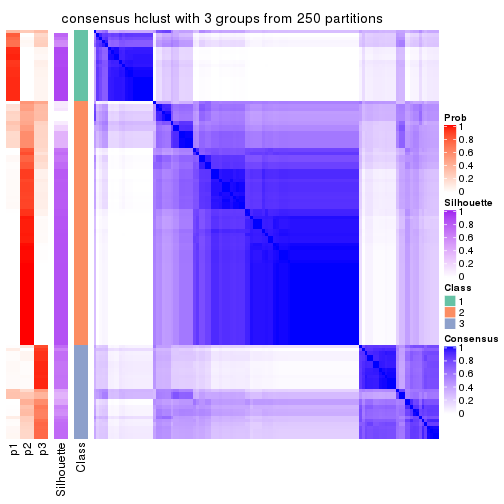</p>

</div>
<div id='tab-CV-hclust-consensus-heatmap-3'>
<pre><code class="r">consensus_heatmap(res, k = 4)
</code></pre>

<p></p>

</div>
<div id='tab-CV-hclust-consensus-heatmap-4'>
<pre><code class="r">consensus_heatmap(res, k = 5)
</code></pre>

<p></p>

</div>
<div id='tab-CV-hclust-consensus-heatmap-5'>
<pre><code class="r">consensus_heatmap(res, k = 6)
</code></pre>

<p></p>

</div>
</div>

Heatmaps for the membership of samples in all partitions to see how consistent they are:


<script>
$( function() {
	$( '#tabs-CV-hclust-membership-heatmap' ).tabs();
} );
</script>
<div id='tabs-CV-hclust-membership-heatmap'>
<ul>
<li><a href='#tab-CV-hclust-membership-heatmap-1'>k = 2</a></li>
<li><a href='#tab-CV-hclust-membership-heatmap-2'>k = 3</a></li>
<li><a href='#tab-CV-hclust-membership-heatmap-3'>k = 4</a></li>
<li><a href='#tab-CV-hclust-membership-heatmap-4'>k = 5</a></li>
<li><a href='#tab-CV-hclust-membership-heatmap-5'>k = 6</a></li>
</ul>
<div id='tab-CV-hclust-membership-heatmap-1'>
<pre><code class="r">membership_heatmap(res, k = 2)
</code></pre>

<p></p>

</div>
<div id='tab-CV-hclust-membership-heatmap-2'>
<pre><code class="r">membership_heatmap(res, k = 3)
</code></pre>

<p></p>

</div>
<div id='tab-CV-hclust-membership-heatmap-3'>
<pre><code class="r">membership_heatmap(res, k = 4)
</code></pre>

<p></p>

</div>
<div id='tab-CV-hclust-membership-heatmap-4'>
<pre><code class="r">membership_heatmap(res, k = 5)
</code></pre>

<p></p>

</div>
<div id='tab-CV-hclust-membership-heatmap-5'>
<pre><code class="r">membership_heatmap(res, k = 6)
</code></pre>

<p></p>

</div>
</div>

As soon as we have had the classes for columns, we can look for signatures
which are significantly different between classes which can be candidate marks
for certain classes. Following are the heatmaps for signatures.


Signature heatmaps where rows are scaled:


<script>
$( function() {
	$( '#tabs-CV-hclust-get-signatures' ).tabs();
} );
</script>
<div id='tabs-CV-hclust-get-signatures'>
<ul>
<li><a href='#tab-CV-hclust-get-signatures-1'>k = 2</a></li>
<li><a href='#tab-CV-hclust-get-signatures-2'>k = 3</a></li>
<li><a href='#tab-CV-hclust-get-signatures-3'>k = 4</a></li>
<li><a href='#tab-CV-hclust-get-signatures-4'>k = 5</a></li>
<li><a href='#tab-CV-hclust-get-signatures-5'>k = 6</a></li>
</ul>
<div id='tab-CV-hclust-get-signatures-1'>
<pre><code class="r">get_signatures(res, k = 2)
</code></pre>

<p></p>

</div>
<div id='tab-CV-hclust-get-signatures-2'>
<pre><code class="r">get_signatures(res, k = 3)
</code></pre>

<p></p>

</div>
<div id='tab-CV-hclust-get-signatures-3'>
<pre><code class="r">get_signatures(res, k = 4)
</code></pre>

<p></p>

</div>
<div id='tab-CV-hclust-get-signatures-4'>
<pre><code class="r">get_signatures(res, k = 5)
</code></pre>

<p>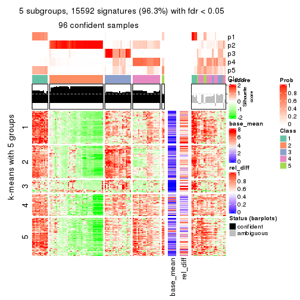</p>

</div>
<div id='tab-CV-hclust-get-signatures-5'>
<pre><code class="r">get_signatures(res, k = 6)
</code></pre>

<p></p>

</div>
</div>


Signature heatmaps where rows are not scaled:


<script>
$( function() {
	$( '#tabs-CV-hclust-get-signatures-no-scale' ).tabs();
} );
</script>
<div id='tabs-CV-hclust-get-signatures-no-scale'>
<ul>
<li><a href='#tab-CV-hclust-get-signatures-no-scale-1'>k = 2</a></li>
<li><a href='#tab-CV-hclust-get-signatures-no-scale-2'>k = 3</a></li>
<li><a href='#tab-CV-hclust-get-signatures-no-scale-3'>k = 4</a></li>
<li><a href='#tab-CV-hclust-get-signatures-no-scale-4'>k = 5</a></li>
<li><a href='#tab-CV-hclust-get-signatures-no-scale-5'>k = 6</a></li>
</ul>
<div id='tab-CV-hclust-get-signatures-no-scale-1'>
<pre><code class="r">get_signatures(res, k = 2, scale_rows = FALSE)
</code></pre>

<p></p>

</div>
<div id='tab-CV-hclust-get-signatures-no-scale-2'>
<pre><code class="r">get_signatures(res, k = 3, scale_rows = FALSE)
</code></pre>

<p></p>

</div>
<div id='tab-CV-hclust-get-signatures-no-scale-3'>
<pre><code class="r">get_signatures(res, k = 4, scale_rows = FALSE)
</code></pre>

<p></p>

</div>
<div id='tab-CV-hclust-get-signatures-no-scale-4'>
<pre><code class="r">get_signatures(res, k = 5, scale_rows = FALSE)
</code></pre>

<p></p>

</div>
<div id='tab-CV-hclust-get-signatures-no-scale-5'>
<pre><code class="r">get_signatures(res, k = 6, scale_rows = FALSE)
</code></pre>

<p></p>

</div>
</div>


Compare the overlap of signatures from different k:

```r
compare_signatures(res)
```


`get_signature()` returns a data frame invisibly. TO get the list of signatures, the function
call should be assigned to a variable explicitly. In following code, if `plot` argument is set
to `FALSE`, no heatmap is plotted while only the differential analysis is performed.

```r
# code only for demonstration
tb = get_signature(res, k = ..., plot = FALSE)
```

An example of the output of `tb` is:

```
#>   which_row         fdr    mean_1    mean_2 scaled_mean_1 scaled_mean_2 km
#> 1        38 0.042760348  8.373488  9.131774    -0.5533452     0.5164555  1
#> 2        40 0.018707592  7.106213  8.469186    -0.6173731     0.5762149  1
#> 3        55 0.019134737 10.221463 11.207825    -0.6159697     0.5749050  1
#> 4        59 0.006059896  5.921854  7.869574    -0.6899429     0.6439467  1
#> 5        60 0.018055526  8.928898 10.211722    -0.6204761     0.5791110  1
#> 6        98 0.009384629 15.714769 14.887706     0.6635654    -0.6193277  2
...
```

The columns in `tb` are:

1. `which_row`: row indices corresponding to the input matrix.
2. `fdr`: FDR for the differential test. 
3. `mean_x`: The mean value in group x.
4. `scaled_mean_x`: The mean value in group x after rows are scaled.
5. `km`: Row groups if k-means clustering is applied to rows.


UMAP plot which shows how samples are separated.


<script>
$( function() {
	$( '#tabs-CV-hclust-dimension-reduction' ).tabs();
} );
</script>
<div id='tabs-CV-hclust-dimension-reduction'>
<ul>
<li><a href='#tab-CV-hclust-dimension-reduction-1'>k = 2</a></li>
<li><a href='#tab-CV-hclust-dimension-reduction-2'>k = 3</a></li>
<li><a href='#tab-CV-hclust-dimension-reduction-3'>k = 4</a></li>
<li><a href='#tab-CV-hclust-dimension-reduction-4'>k = 5</a></li>
<li><a href='#tab-CV-hclust-dimension-reduction-5'>k = 6</a></li>
</ul>
<div id='tab-CV-hclust-dimension-reduction-1'>
<pre><code class="r">dimension_reduction(res, k = 2, method = &quot;UMAP&quot;)
</code></pre>

<p></p>

</div>
<div id='tab-CV-hclust-dimension-reduction-2'>
<pre><code class="r">dimension_reduction(res, k = 3, method = &quot;UMAP&quot;)
</code></pre>

<p></p>

</div>
<div id='tab-CV-hclust-dimension-reduction-3'>
<pre><code class="r">dimension_reduction(res, k = 4, method = &quot;UMAP&quot;)
</code></pre>

<p></p>

</div>
<div id='tab-CV-hclust-dimension-reduction-4'>
<pre><code class="r">dimension_reduction(res, k = 5, method = &quot;UMAP&quot;)
</code></pre>

<p></p>

</div>
<div id='tab-CV-hclust-dimension-reduction-5'>
<pre><code class="r">dimension_reduction(res, k = 6, method = &quot;UMAP&quot;)
</code></pre>

<p></p>

</div>
</div>


Following heatmap shows how subgroups are split when increasing `k`:

```r
collect_classes(res)
```


If matrix rows can be associated to genes, consider to use `functional_enrichment(res,
...)` to perform function enrichment for the signature genes. See [this vignette](http://bioconductor.org/packages/devel/bioc/vignettes/cola/inst/doc/functional_enrichment.html) for more detailed explanations.


 

---------------------------------------------------


### CV:kmeans*


The object with results only for a single top-value method and a single partition method 
can be extracted as:

```r
res = res_list["CV", "kmeans"]
# you can also extract it by
# res = res_list["CV:kmeans"]
```

A summary of `res` and all the functions that can be applied to it:

```r
res
```

```
#> A 'ConsensusPartition' object with k = 2, 3, 4, 5, 6.
#>   On a matrix with 16187 rows and 121 columns.
#>   Top rows (1000, 2000, 3000, 4000, 5000) are extracted by 'CV' method.
#>   Subgroups are detected by 'kmeans' method.
#>   Performed in total 1250 partitions by row resampling.
#>   Best k for subgroups seems to be 4.
#> 
#> Following methods can be applied to this 'ConsensusPartition' object:
#>  [1] "cola_report"             "collect_classes"         "collect_plots"          
#>  [4] "collect_stats"           "colnames"                "compare_signatures"     
#>  [7] "consensus_heatmap"       "dimension_reduction"     "functional_enrichment"  
#> [10] "get_anno_col"            "get_anno"                "get_classes"            
#> [13] "get_consensus"           "get_matrix"              "get_membership"         
#> [16] "get_param"               "get_signatures"          "get_stats"              
#> [19] "is_best_k"               "is_stable_k"             "membership_heatmap"     
#> [22] "ncol"                    "nrow"                    "plot_ecdf"              
#> [25] "rownames"                "select_partition_number" "show"                   
#> [28] "suggest_best_k"          "test_to_known_factors"
```

`collect_plots()` function collects all the plots made from `res` for all `k` (number of partitions)
into one single page to provide an easy and fast comparison between different `k`.

```r
collect_plots(res)
```


The plots are:

- The first row: a plot of the ECDF (empirical cumulative distribution
  function) curves of the consensus matrix for each `k` and the heatmap of
  predicted classes for each `k`.
- The second row: heatmaps of the consensus matrix for each `k`.
- The third row: heatmaps of the membership matrix for each `k`.
- The fouth row: heatmaps of the signatures for each `k`.

All the plots in panels can be made by individual functions and they are
plotted later in this section.

`select_partition_number()` produces several plots showing different
statistics for choosing "optimized" `k`. There are following statistics:

- ECDF curves of the consensus matrix for each `k`;
- 1-PAC. [The PAC
  score](https://en.wikipedia.org/wiki/Consensus_clustering#Over-interpretation_potential_of_consensus_clustering)
  measures the proportion of the ambiguous subgrouping.
- Mean silhouette score.
- Concordance. The mean probability of fiting the consensus class ids in all
  partitions.
- Area increased. Denote $A_k$ as the area under the ECDF curve for current
  `k`, the area increased is defined as $A_k - A_{k-1}$.
- Rand index. The percent of pairs of samples that are both in a same cluster
  or both are not in a same cluster in the partition of k and k-1.
- Jaccard index. The ratio of pairs of samples are both in a same cluster in
  the partition of k and k-1 and the pairs of samples are both in a same
  cluster in the partition k or k-1.

The detailed explanations of these statistics can be found in [the _cola_
vignette](http://bioconductor.org/packages/devel/bioc/vignettes/cola/inst/doc/cola.html#toc_13).

Generally speaking, lower PAC score, higher mean silhouette score or higher
concordance corresponds to better partition. Rand index and Jaccard index
measure how similar the current partition is compared to partition with `k-1`.
If they are too similar, we won't accept `k` is better than `k-1`.

```r
select_partition_number(res)
```


The numeric values for all these statistics can be obtained by `get_stats()`.

```r
get_stats(res)
```

```
#>   k 1-PAC mean_silhouette concordance area_increased  Rand Jaccard
#> 2 2 0.595           0.816       0.911         0.4927 0.496   0.496
#> 3 3 0.510           0.676       0.782         0.3080 0.680   0.454
#> 4 4 0.920           0.945       0.960         0.1417 0.889   0.696
#> 5 5 0.788           0.708       0.845         0.0625 0.997   0.987
#> 6 6 0.768           0.637       0.745         0.0437 0.889   0.595
```

`suggest_best_k()` suggests the best $k$ based on these statistics. The rules are as follows:

- All $k$ with Jaccard index larger than 0.95 are removed because increasing
  $k$ does not provide enough extra information. If all $k$ are removed, it is
  marked as no subgroup is detected.
- For all $k$ with 1-PAC score larger than 0.9, the maximal $k$ is taken as
  the best $k$, and other $k$ are marked as optional $k$.
- If it does not fit the second rule. The $k$ with the maximal vote of the
  highest 1-PAC score, highest mean silhouette, and highest concordance is
  taken as the best $k$.

```r
suggest_best_k(res)
```

```
#> [1] 4
```


Following shows the table of the partitions (You need to click the **show/hide
code output** link to see it). The membership matrix (columns with name `p*`)
is inferred by
[`clue::cl_consensus()`](https://www.rdocumentation.org/link/cl_consensus?package=clue)
function with the `SE` method. Basically the value in the membership matrix
represents the probability to belong to a certain group. The finall class
label for an item is determined with the group with highest probability it
belongs to.

In `get_classes()` function, the entropy is calculated from the membership
matrix and the silhouette score is calculated from the consensus matrix.


<script>
$( function() {
	$( '#tabs-CV-kmeans-get-classes' ).tabs();
} );
</script>
<div id='tabs-CV-kmeans-get-classes'>
<ul>
<li><a href='#tab-CV-kmeans-get-classes-1'>k = 2</a></li>
<li><a href='#tab-CV-kmeans-get-classes-2'>k = 3</a></li>
<li><a href='#tab-CV-kmeans-get-classes-3'>k = 4</a></li>
<li><a href='#tab-CV-kmeans-get-classes-4'>k = 5</a></li>
<li><a href='#tab-CV-kmeans-get-classes-5'>k = 6</a></li>
</ul>

<div id='tab-CV-kmeans-get-classes-1'>
<p><a id='tab-CV-kmeans-get-classes-1-a' style='color:#0366d6' href='#'>show/hide code output</a></p>
<pre><code class="r">cbind(get_classes(res, k = 2), get_membership(res, k = 2))
</code></pre>

<pre><code>#&gt;           class entropy silhouette    p1    p2
#&gt; DRR006374     2  0.0000      0.890 0.000 1.000
#&gt; DRR006375     1  0.0376      0.915 0.996 0.004
#&gt; DRR006376     2  0.9944      0.309 0.456 0.544
#&gt; DRR006377     2  0.6343      0.765 0.160 0.840
#&gt; DRR006378     2  0.0938      0.893 0.012 0.988
#&gt; DRR006379     2  0.7950      0.694 0.240 0.760
#&gt; DRR006380     2  0.0000      0.890 0.000 1.000
#&gt; DRR006381     1  0.0376      0.915 0.996 0.004
#&gt; DRR006382     2  0.0376      0.888 0.004 0.996
#&gt; DRR006383     1  0.8081      0.722 0.752 0.248
#&gt; DRR006384     2  0.0000      0.890 0.000 1.000
#&gt; DRR006385     1  0.0376      0.915 0.996 0.004
#&gt; DRR006386     2  0.0938      0.893 0.012 0.988
#&gt; DRR006387     1  0.0376      0.915 0.996 0.004
#&gt; DRR006388     2  0.8813      0.578 0.300 0.700
#&gt; DRR006389     2  0.8813      0.578 0.300 0.700
#&gt; DRR006390     2  0.0938      0.893 0.012 0.988
#&gt; DRR006391     2  0.0938      0.893 0.012 0.988
#&gt; DRR006392     1  0.0376      0.915 0.996 0.004
#&gt; DRR006393     1  0.0376      0.915 0.996 0.004
#&gt; DRR006394     2  0.0938      0.893 0.012 0.988
#&gt; DRR006395     1  0.1633      0.909 0.976 0.024
#&gt; DRR006396     1  0.0376      0.915 0.996 0.004
#&gt; DRR006397     2  0.9522      0.472 0.372 0.628
#&gt; DRR006398     2  0.9522      0.472 0.372 0.628
#&gt; DRR006399     2  0.9998      0.213 0.492 0.508
#&gt; DRR006400     2  0.9998      0.213 0.492 0.508
#&gt; DRR006401     2  0.0938      0.893 0.012 0.988
#&gt; DRR006402     2  0.0938      0.893 0.012 0.988
#&gt; DRR006403     2  0.9933      0.301 0.452 0.548
#&gt; DRR006404     2  0.9850      0.371 0.428 0.572
#&gt; DRR006405     1  0.9129      0.499 0.672 0.328
#&gt; DRR006406     1  0.9170      0.489 0.668 0.332
#&gt; DRR006407     2  0.0938      0.893 0.012 0.988
#&gt; DRR006408     2  0.0938      0.893 0.012 0.988
#&gt; DRR006409     1  0.0376      0.912 0.996 0.004
#&gt; DRR006410     1  0.0376      0.915 0.996 0.004
#&gt; DRR006411     2  0.2423      0.875 0.040 0.960
#&gt; DRR006412     2  0.0938      0.893 0.012 0.988
#&gt; DRR006413     1  0.0376      0.915 0.996 0.004
#&gt; DRR006414     1  0.6048      0.834 0.852 0.148
#&gt; DRR006415     1  0.7139      0.787 0.804 0.196
#&gt; DRR006416     1  0.8499      0.665 0.724 0.276
#&gt; DRR006417     1  0.4939      0.865 0.892 0.108
#&gt; DRR006418     1  0.1184      0.912 0.984 0.016
#&gt; DRR006419     1  0.4815      0.868 0.896 0.104
#&gt; DRR006420     1  0.7139      0.787 0.804 0.196
#&gt; DRR006421     2  0.0376      0.888 0.004 0.996
#&gt; DRR006422     2  0.9954      0.276 0.460 0.540
#&gt; DRR006423     2  0.0938      0.893 0.012 0.988
#&gt; DRR006424     1  0.0376      0.915 0.996 0.004
#&gt; DRR006425     2  0.0938      0.893 0.012 0.988
#&gt; DRR006426     1  0.9754      0.364 0.592 0.408
#&gt; DRR006427     2  0.0938      0.893 0.012 0.988
#&gt; DRR006428     1  0.0938      0.908 0.988 0.012
#&gt; DRR006429     2  0.0938      0.893 0.012 0.988
#&gt; DRR006430     1  0.0376      0.915 0.996 0.004
#&gt; DRR006431     1  0.0376      0.915 0.996 0.004
#&gt; DRR006432     1  0.5737      0.840 0.864 0.136
#&gt; DRR006433     2  0.0376      0.888 0.004 0.996
#&gt; DRR006434     2  0.0000      0.890 0.000 1.000
#&gt; DRR006435     2  0.0938      0.893 0.012 0.988
#&gt; DRR006436     2  0.0938      0.893 0.012 0.988
#&gt; DRR006437     1  0.0376      0.915 0.996 0.004
#&gt; DRR006438     1  0.2603      0.902 0.956 0.044
#&gt; DRR006439     1  0.2603      0.902 0.956 0.044
#&gt; DRR006440     2  0.0376      0.888 0.004 0.996
#&gt; DRR006441     2  0.0938      0.893 0.012 0.988
#&gt; DRR006442     1  0.7139      0.787 0.804 0.196
#&gt; DRR006443     2  0.0376      0.888 0.004 0.996
#&gt; DRR006444     2  0.0938      0.893 0.012 0.988
#&gt; DRR006445     1  0.0376      0.915 0.996 0.004
#&gt; DRR006446     2  0.0938      0.893 0.012 0.988
#&gt; DRR006447     1  0.0376      0.915 0.996 0.004
#&gt; DRR006448     1  0.0376      0.915 0.996 0.004
#&gt; DRR006449     1  0.0376      0.915 0.996 0.004
#&gt; DRR006450     1  0.0376      0.915 0.996 0.004
#&gt; DRR006451     2  0.6438      0.775 0.164 0.836
#&gt; DRR006452     1  0.0376      0.915 0.996 0.004
#&gt; DRR006453     1  0.1184      0.912 0.984 0.016
#&gt; DRR006454     2  0.0938      0.893 0.012 0.988
#&gt; DRR006455     2  0.0000      0.890 0.000 1.000
#&gt; DRR006456     1  0.7139      0.787 0.804 0.196
#&gt; DRR006457     2  0.9000      0.513 0.316 0.684
#&gt; DRR006458     1  0.0376      0.915 0.996 0.004
#&gt; DRR006459     1  0.0000      0.913 1.000 0.000
#&gt; DRR006460     2  0.0000      0.890 0.000 1.000
#&gt; DRR006461     2  0.0376      0.888 0.004 0.996
#&gt; DRR006462     1  0.0376      0.915 0.996 0.004
#&gt; DRR006463     2  0.0376      0.888 0.004 0.996
#&gt; DRR006464     2  0.0938      0.893 0.012 0.988
#&gt; DRR006465     1  0.0376      0.915 0.996 0.004
#&gt; DRR006466     2  0.0376      0.888 0.004 0.996
#&gt; DRR006467     1  0.0376      0.915 0.996 0.004
#&gt; DRR006468     2  0.0938      0.893 0.012 0.988
#&gt; DRR006469     2  0.0938      0.893 0.012 0.988
#&gt; DRR006470     1  0.0938      0.908 0.988 0.012
#&gt; DRR006471     1  0.0376      0.915 0.996 0.004
#&gt; DRR006472     1  0.9754      0.388 0.592 0.408
#&gt; DRR006473     2  0.0938      0.893 0.012 0.988
#&gt; DRR006474     2  0.0938      0.893 0.012 0.988
#&gt; DRR006475     1  0.0000      0.913 1.000 0.000
#&gt; DRR006476     2  0.0000      0.890 0.000 1.000
#&gt; DRR006477     2  0.0376      0.888 0.004 0.996
#&gt; DRR006478     1  0.1184      0.912 0.984 0.016
#&gt; DRR006479     1  0.2603      0.902 0.956 0.044
#&gt; DRR006480     1  0.0000      0.913 1.000 0.000
#&gt; DRR006481     1  0.9248      0.558 0.660 0.340
#&gt; DRR006482     2  0.9850      0.357 0.428 0.572
#&gt; DRR006483     1  0.0376      0.915 0.996 0.004
#&gt; DRR006484     1  0.7139      0.787 0.804 0.196
#&gt; DRR006485     2  0.0376      0.888 0.004 0.996
#&gt; DRR006486     1  0.0938      0.908 0.988 0.012
#&gt; DRR006487     1  0.5737      0.844 0.864 0.136
#&gt; DRR006488     2  0.0938      0.893 0.012 0.988
#&gt; DRR006489     1  0.0376      0.915 0.996 0.004
#&gt; DRR006490     1  0.4161      0.880 0.916 0.084
#&gt; DRR006491     1  0.5737      0.844 0.864 0.136
#&gt; DRR006492     1  0.2043      0.906 0.968 0.032
#&gt; DRR006493     1  0.8327      0.698 0.736 0.264
#&gt; DRR006494     1  0.0000      0.913 1.000 0.000
</code></pre>

<script>
$('#tab-CV-kmeans-get-classes-1-a').parent().next().next().hide();
$('#tab-CV-kmeans-get-classes-1-a').click(function(){
  $('#tab-CV-kmeans-get-classes-1-a').parent().next().next().toggle();
  return(false);
});
</script>
</div>

<div id='tab-CV-kmeans-get-classes-2'>
<p><a id='tab-CV-kmeans-get-classes-2-a' style='color:#0366d6' href='#'>show/hide code output</a></p>
<pre><code class="r">cbind(get_classes(res, k = 3), get_membership(res, k = 3))
</code></pre>

<pre><code>#&gt;           class entropy silhouette    p1    p2    p3
#&gt; DRR006374     2  0.0000      0.957 0.000 1.000 0.000
#&gt; DRR006375     1  0.5988      0.535 0.632 0.000 0.368
#&gt; DRR006376     1  0.4346      0.505 0.816 0.184 0.000
#&gt; DRR006377     1  0.6476      0.157 0.548 0.448 0.004
#&gt; DRR006378     2  0.0000      0.957 0.000 1.000 0.000
#&gt; DRR006379     1  0.4974      0.455 0.764 0.236 0.000
#&gt; DRR006380     2  0.0000      0.957 0.000 1.000 0.000
#&gt; DRR006381     1  0.6215      0.513 0.572 0.000 0.428
#&gt; DRR006382     2  0.3551      0.837 0.000 0.868 0.132
#&gt; DRR006383     3  0.6632      0.853 0.272 0.036 0.692
#&gt; DRR006384     2  0.0000      0.957 0.000 1.000 0.000
#&gt; DRR006385     1  0.0237      0.585 0.996 0.000 0.004
#&gt; DRR006386     2  0.0000      0.957 0.000 1.000 0.000
#&gt; DRR006387     1  0.0000      0.587 1.000 0.000 0.000
#&gt; DRR006388     1  0.5873      0.355 0.684 0.312 0.004
#&gt; DRR006389     1  0.5873      0.355 0.684 0.312 0.004
#&gt; DRR006390     2  0.0000      0.957 0.000 1.000 0.000
#&gt; DRR006391     2  0.0000      0.957 0.000 1.000 0.000
#&gt; DRR006392     1  0.6215      0.513 0.572 0.000 0.428
#&gt; DRR006393     1  0.2537      0.581 0.920 0.000 0.080
#&gt; DRR006394     2  0.0000      0.957 0.000 1.000 0.000
#&gt; DRR006395     1  0.3038      0.485 0.896 0.000 0.104
#&gt; DRR006396     1  0.5138      0.566 0.748 0.000 0.252
#&gt; DRR006397     1  0.5244      0.445 0.756 0.240 0.004
#&gt; DRR006398     1  0.5244      0.445 0.756 0.240 0.004
#&gt; DRR006399     1  0.3412      0.543 0.876 0.124 0.000
#&gt; DRR006400     1  0.3412      0.543 0.876 0.124 0.000
#&gt; DRR006401     2  0.0000      0.957 0.000 1.000 0.000
#&gt; DRR006402     2  0.0000      0.957 0.000 1.000 0.000
#&gt; DRR006403     1  0.4121      0.518 0.832 0.168 0.000
#&gt; DRR006404     1  0.4346      0.505 0.816 0.184 0.000
#&gt; DRR006405     1  0.4235      0.513 0.824 0.176 0.000
#&gt; DRR006406     1  0.4235      0.513 0.824 0.176 0.000
#&gt; DRR006407     2  0.0747      0.942 0.016 0.984 0.000
#&gt; DRR006408     2  0.0000      0.957 0.000 1.000 0.000
#&gt; DRR006409     1  0.5216      0.432 0.740 0.000 0.260
#&gt; DRR006410     1  0.0000      0.587 1.000 0.000 0.000
#&gt; DRR006411     2  0.5859      0.418 0.344 0.656 0.000
#&gt; DRR006412     2  0.0000      0.957 0.000 1.000 0.000
#&gt; DRR006413     1  0.6308      0.467 0.508 0.000 0.492
#&gt; DRR006414     3  0.6522      0.853 0.272 0.032 0.696
#&gt; DRR006415     3  0.6632      0.853 0.272 0.036 0.692
#&gt; DRR006416     1  0.4575      0.503 0.828 0.160 0.012
#&gt; DRR006417     3  0.6113      0.843 0.300 0.012 0.688
#&gt; DRR006418     1  0.1751      0.577 0.960 0.028 0.012
#&gt; DRR006419     3  0.6497      0.820 0.336 0.016 0.648
#&gt; DRR006420     3  0.7013      0.825 0.324 0.036 0.640
#&gt; DRR006421     3  0.9497      0.634 0.332 0.200 0.468
#&gt; DRR006422     1  0.4784      0.487 0.796 0.200 0.004
#&gt; DRR006423     2  0.0000      0.957 0.000 1.000 0.000
#&gt; DRR006424     1  0.6168      0.520 0.588 0.000 0.412
#&gt; DRR006425     2  0.0000      0.957 0.000 1.000 0.000
#&gt; DRR006426     1  0.9531     -0.367 0.468 0.208 0.324
#&gt; DRR006427     2  0.0000      0.957 0.000 1.000 0.000
#&gt; DRR006428     3  0.5016      0.801 0.240 0.000 0.760
#&gt; DRR006429     2  0.0000      0.957 0.000 1.000 0.000
#&gt; DRR006430     1  0.6215      0.513 0.572 0.000 0.428
#&gt; DRR006431     1  0.6215      0.513 0.572 0.000 0.428
#&gt; DRR006432     1  0.8457     -0.424 0.512 0.092 0.396
#&gt; DRR006433     3  0.9895      0.526 0.332 0.272 0.396
#&gt; DRR006434     2  0.0000      0.957 0.000 1.000 0.000
#&gt; DRR006435     2  0.0000      0.957 0.000 1.000 0.000
#&gt; DRR006436     2  0.0000      0.957 0.000 1.000 0.000
#&gt; DRR006437     1  0.1643      0.583 0.956 0.000 0.044
#&gt; DRR006438     3  0.5986      0.845 0.284 0.012 0.704
#&gt; DRR006439     3  0.6333      0.822 0.332 0.012 0.656
#&gt; DRR006440     2  0.4002      0.807 0.000 0.840 0.160
#&gt; DRR006441     2  0.0000      0.957 0.000 1.000 0.000
#&gt; DRR006442     3  0.6335      0.828 0.240 0.036 0.724
#&gt; DRR006443     2  0.4002      0.807 0.000 0.840 0.160
#&gt; DRR006444     2  0.0000      0.957 0.000 1.000 0.000
#&gt; DRR006445     1  0.0000      0.587 1.000 0.000 0.000
#&gt; DRR006446     2  0.0000      0.957 0.000 1.000 0.000
#&gt; DRR006447     1  0.0237      0.585 0.996 0.000 0.004
#&gt; DRR006448     1  0.0237      0.589 0.996 0.000 0.004
#&gt; DRR006449     1  0.1031      0.588 0.976 0.000 0.024
#&gt; DRR006450     1  0.1411      0.587 0.964 0.000 0.036
#&gt; DRR006451     1  0.5926      0.290 0.644 0.356 0.000
#&gt; DRR006452     1  0.5785      0.545 0.668 0.000 0.332
#&gt; DRR006453     1  0.1163      0.584 0.972 0.028 0.000
#&gt; DRR006454     2  0.2448      0.882 0.076 0.924 0.000
#&gt; DRR006455     2  0.0000      0.957 0.000 1.000 0.000
#&gt; DRR006456     3  0.6632      0.853 0.272 0.036 0.692
#&gt; DRR006457     3  0.7622      0.800 0.332 0.060 0.608
#&gt; DRR006458     1  0.6308      0.467 0.508 0.000 0.492
#&gt; DRR006459     1  0.6308      0.467 0.508 0.000 0.492
#&gt; DRR006460     2  0.0000      0.957 0.000 1.000 0.000
#&gt; DRR006461     2  0.4002      0.807 0.000 0.840 0.160
#&gt; DRR006462     1  0.2356      0.596 0.928 0.000 0.072
#&gt; DRR006463     2  0.4002      0.807 0.000 0.840 0.160
#&gt; DRR006464     2  0.2448      0.882 0.076 0.924 0.000
#&gt; DRR006465     1  0.3619      0.589 0.864 0.000 0.136
#&gt; DRR006466     2  0.0747      0.946 0.000 0.984 0.016
#&gt; DRR006467     1  0.6308      0.467 0.508 0.000 0.492
#&gt; DRR006468     2  0.0000      0.957 0.000 1.000 0.000
#&gt; DRR006469     2  0.0000      0.957 0.000 1.000 0.000
#&gt; DRR006470     3  0.5327      0.831 0.272 0.000 0.728
#&gt; DRR006471     1  0.6308      0.467 0.508 0.000 0.492
#&gt; DRR006472     3  0.7389      0.716 0.408 0.036 0.556
#&gt; DRR006473     2  0.0000      0.957 0.000 1.000 0.000
#&gt; DRR006474     2  0.0000      0.957 0.000 1.000 0.000
#&gt; DRR006475     1  0.6308      0.467 0.508 0.000 0.492
#&gt; DRR006476     2  0.0000      0.957 0.000 1.000 0.000
#&gt; DRR006477     3  0.9927      0.514 0.316 0.292 0.392
#&gt; DRR006478     1  0.0892      0.586 0.980 0.020 0.000
#&gt; DRR006479     3  0.5986      0.845 0.284 0.012 0.704
#&gt; DRR006480     1  0.6308      0.467 0.508 0.000 0.492
#&gt; DRR006481     3  0.7061      0.818 0.332 0.036 0.632
#&gt; DRR006482     1  0.8310     -0.226 0.584 0.104 0.312
#&gt; DRR006483     1  0.6308      0.467 0.508 0.000 0.492
#&gt; DRR006484     3  0.6632      0.853 0.272 0.036 0.692
#&gt; DRR006485     2  0.4002      0.807 0.000 0.840 0.160
#&gt; DRR006486     3  0.6299     -0.460 0.476 0.000 0.524
#&gt; DRR006487     3  0.6407      0.851 0.272 0.028 0.700
#&gt; DRR006488     2  0.0000      0.957 0.000 1.000 0.000
#&gt; DRR006489     1  0.6215      0.513 0.572 0.000 0.428
#&gt; DRR006490     3  0.5858      0.821 0.240 0.020 0.740
#&gt; DRR006491     3  0.6264      0.842 0.256 0.028 0.716
#&gt; DRR006492     3  0.5706      0.751 0.320 0.000 0.680
#&gt; DRR006493     3  0.6632      0.853 0.272 0.036 0.692
#&gt; DRR006494     1  0.6308      0.467 0.508 0.000 0.492
</code></pre>

<script>
$('#tab-CV-kmeans-get-classes-2-a').parent().next().next().hide();
$('#tab-CV-kmeans-get-classes-2-a').click(function(){
  $('#tab-CV-kmeans-get-classes-2-a').parent().next().next().toggle();
  return(false);
});
</script>
</div>

<div id='tab-CV-kmeans-get-classes-3'>
<p><a id='tab-CV-kmeans-get-classes-3-a' style='color:#0366d6' href='#'>show/hide code output</a></p>
<pre><code class="r">cbind(get_classes(res, k = 4), get_membership(res, k = 4))
</code></pre>

<pre><code>#&gt;           class entropy silhouette    p1    p2    p3    p4
#&gt; DRR006374     2  0.0336      0.952 0.000 0.992 0.000 0.008
#&gt; DRR006375     1  0.0779      0.983 0.980 0.000 0.004 0.016
#&gt; DRR006376     4  0.1042      0.957 0.008 0.020 0.000 0.972
#&gt; DRR006377     4  0.2345      0.893 0.000 0.100 0.000 0.900
#&gt; DRR006378     2  0.0336      0.960 0.000 0.992 0.000 0.008
#&gt; DRR006379     4  0.1118      0.952 0.000 0.036 0.000 0.964
#&gt; DRR006380     2  0.0657      0.948 0.000 0.984 0.004 0.012
#&gt; DRR006381     1  0.0779      0.983 0.980 0.000 0.004 0.016
#&gt; DRR006382     2  0.3443      0.846 0.000 0.848 0.136 0.016
#&gt; DRR006383     3  0.0657      0.974 0.000 0.012 0.984 0.004
#&gt; DRR006384     2  0.0000      0.956 0.000 1.000 0.000 0.000
#&gt; DRR006385     4  0.1305      0.952 0.036 0.000 0.004 0.960
#&gt; DRR006386     2  0.0336      0.960 0.000 0.992 0.000 0.008
#&gt; DRR006387     4  0.1022      0.954 0.032 0.000 0.000 0.968
#&gt; DRR006388     4  0.1118      0.952 0.000 0.036 0.000 0.964
#&gt; DRR006389     4  0.1118      0.952 0.000 0.036 0.000 0.964
#&gt; DRR006390     2  0.0336      0.960 0.000 0.992 0.000 0.008
#&gt; DRR006391     2  0.0336      0.960 0.000 0.992 0.000 0.008
#&gt; DRR006392     1  0.0592      0.984 0.984 0.000 0.000 0.016
#&gt; DRR006393     4  0.1022      0.954 0.032 0.000 0.000 0.968
#&gt; DRR006394     2  0.0336      0.960 0.000 0.992 0.000 0.008
#&gt; DRR006395     4  0.1394      0.948 0.012 0.008 0.016 0.964
#&gt; DRR006396     4  0.3052      0.870 0.136 0.000 0.004 0.860
#&gt; DRR006397     4  0.1118      0.952 0.000 0.036 0.000 0.964
#&gt; DRR006398     4  0.1118      0.952 0.000 0.036 0.000 0.964
#&gt; DRR006399     4  0.1443      0.955 0.028 0.008 0.004 0.960
#&gt; DRR006400     4  0.1443      0.955 0.028 0.008 0.004 0.960
#&gt; DRR006401     2  0.0336      0.960 0.000 0.992 0.000 0.008
#&gt; DRR006402     2  0.0336      0.960 0.000 0.992 0.000 0.008
#&gt; DRR006403     4  0.0779      0.957 0.004 0.016 0.000 0.980
#&gt; DRR006404     4  0.1004      0.956 0.004 0.024 0.000 0.972
#&gt; DRR006405     4  0.1118      0.952 0.000 0.036 0.000 0.964
#&gt; DRR006406     4  0.1118      0.952 0.000 0.036 0.000 0.964
#&gt; DRR006407     2  0.2469      0.872 0.000 0.892 0.000 0.108
#&gt; DRR006408     2  0.0336      0.960 0.000 0.992 0.000 0.008
#&gt; DRR006409     3  0.4136      0.727 0.196 0.000 0.788 0.016
#&gt; DRR006410     4  0.1118      0.953 0.036 0.000 0.000 0.964
#&gt; DRR006411     4  0.0921      0.952 0.000 0.028 0.000 0.972
#&gt; DRR006412     2  0.0336      0.960 0.000 0.992 0.000 0.008
#&gt; DRR006413     1  0.0657      0.983 0.984 0.000 0.004 0.012
#&gt; DRR006414     3  0.0376      0.976 0.004 0.004 0.992 0.000
#&gt; DRR006415     3  0.0376      0.976 0.004 0.004 0.992 0.000
#&gt; DRR006416     4  0.1256      0.955 0.008 0.028 0.000 0.964
#&gt; DRR006417     3  0.1247      0.968 0.016 0.004 0.968 0.012
#&gt; DRR006418     4  0.0779      0.957 0.016 0.004 0.000 0.980
#&gt; DRR006419     3  0.1124      0.970 0.012 0.004 0.972 0.012
#&gt; DRR006420     3  0.0804      0.973 0.000 0.012 0.980 0.008
#&gt; DRR006421     3  0.1059      0.969 0.000 0.012 0.972 0.016
#&gt; DRR006422     4  0.1004      0.956 0.004 0.024 0.000 0.972
#&gt; DRR006423     2  0.0336      0.960 0.000 0.992 0.000 0.008
#&gt; DRR006424     1  0.0779      0.983 0.980 0.000 0.004 0.016
#&gt; DRR006425     2  0.0336      0.960 0.000 0.992 0.000 0.008
#&gt; DRR006426     4  0.2255      0.915 0.000 0.068 0.012 0.920
#&gt; DRR006427     2  0.0336      0.960 0.000 0.992 0.000 0.008
#&gt; DRR006428     3  0.1042      0.968 0.020 0.000 0.972 0.008
#&gt; DRR006429     2  0.0336      0.960 0.000 0.992 0.000 0.008
#&gt; DRR006430     1  0.0592      0.984 0.984 0.000 0.000 0.016
#&gt; DRR006431     1  0.0592      0.984 0.984 0.000 0.000 0.016
#&gt; DRR006432     4  0.0992      0.949 0.012 0.004 0.008 0.976
#&gt; DRR006433     3  0.1059      0.969 0.000 0.012 0.972 0.016
#&gt; DRR006434     2  0.0336      0.952 0.000 0.992 0.000 0.008
#&gt; DRR006435     2  0.0336      0.960 0.000 0.992 0.000 0.008
#&gt; DRR006436     2  0.0336      0.960 0.000 0.992 0.000 0.008
#&gt; DRR006437     4  0.3052      0.864 0.136 0.000 0.004 0.860
#&gt; DRR006438     3  0.1124      0.970 0.012 0.004 0.972 0.012
#&gt; DRR006439     3  0.0564      0.976 0.004 0.004 0.988 0.004
#&gt; DRR006440     2  0.4139      0.797 0.000 0.800 0.176 0.024
#&gt; DRR006441     2  0.0336      0.960 0.000 0.992 0.000 0.008
#&gt; DRR006442     3  0.0188      0.976 0.000 0.004 0.996 0.000
#&gt; DRR006443     2  0.4012      0.795 0.000 0.800 0.184 0.016
#&gt; DRR006444     2  0.0336      0.960 0.000 0.992 0.000 0.008
#&gt; DRR006445     4  0.1118      0.953 0.036 0.000 0.000 0.964
#&gt; DRR006446     2  0.0336      0.960 0.000 0.992 0.000 0.008
#&gt; DRR006447     4  0.1109      0.953 0.028 0.000 0.004 0.968
#&gt; DRR006448     4  0.1305      0.952 0.036 0.000 0.004 0.960
#&gt; DRR006449     4  0.3157      0.861 0.144 0.000 0.004 0.852
#&gt; DRR006450     4  0.3052      0.864 0.136 0.000 0.004 0.860
#&gt; DRR006451     4  0.1118      0.952 0.000 0.036 0.000 0.964
#&gt; DRR006452     1  0.3791      0.750 0.796 0.000 0.004 0.200
#&gt; DRR006453     4  0.1004      0.956 0.024 0.004 0.000 0.972
#&gt; DRR006454     2  0.0469      0.957 0.000 0.988 0.000 0.012
#&gt; DRR006455     2  0.0592      0.956 0.000 0.984 0.000 0.016
#&gt; DRR006456     3  0.0188      0.976 0.000 0.004 0.996 0.000
#&gt; DRR006457     3  0.0804      0.973 0.000 0.012 0.980 0.008
#&gt; DRR006458     1  0.0592      0.984 0.984 0.000 0.000 0.016
#&gt; DRR006459     1  0.0592      0.984 0.984 0.000 0.000 0.016
#&gt; DRR006460     2  0.0000      0.956 0.000 1.000 0.000 0.000
#&gt; DRR006461     2  0.4012      0.795 0.000 0.800 0.184 0.016
#&gt; DRR006462     4  0.3052      0.870 0.136 0.000 0.004 0.860
#&gt; DRR006463     2  0.4012      0.795 0.000 0.800 0.184 0.016
#&gt; DRR006464     2  0.0336      0.960 0.000 0.992 0.000 0.008
#&gt; DRR006465     4  0.1118      0.953 0.036 0.000 0.000 0.964
#&gt; DRR006466     2  0.3224      0.861 0.000 0.864 0.120 0.016
#&gt; DRR006467     1  0.0469      0.983 0.988 0.000 0.000 0.012
#&gt; DRR006468     2  0.0336      0.960 0.000 0.992 0.000 0.008
#&gt; DRR006469     2  0.0336      0.960 0.000 0.992 0.000 0.008
#&gt; DRR006470     3  0.2542      0.901 0.084 0.000 0.904 0.012
#&gt; DRR006471     1  0.0469      0.983 0.988 0.000 0.000 0.012
#&gt; DRR006472     3  0.0804      0.973 0.000 0.012 0.980 0.008
#&gt; DRR006473     2  0.0336      0.960 0.000 0.992 0.000 0.008
#&gt; DRR006474     2  0.0336      0.960 0.000 0.992 0.000 0.008
#&gt; DRR006475     1  0.0469      0.983 0.988 0.000 0.000 0.012
#&gt; DRR006476     2  0.0779      0.946 0.000 0.980 0.004 0.016
#&gt; DRR006477     3  0.1059      0.969 0.000 0.012 0.972 0.016
#&gt; DRR006478     4  0.0921      0.956 0.028 0.000 0.000 0.972
#&gt; DRR006479     3  0.1124      0.970 0.012 0.004 0.972 0.012
#&gt; DRR006480     1  0.0469      0.983 0.988 0.000 0.000 0.012
#&gt; DRR006481     3  0.0524      0.975 0.000 0.004 0.988 0.008
#&gt; DRR006482     4  0.0927      0.944 0.000 0.008 0.016 0.976
#&gt; DRR006483     1  0.0469      0.983 0.988 0.000 0.000 0.012
#&gt; DRR006484     3  0.0188      0.976 0.000 0.004 0.996 0.000
#&gt; DRR006485     2  0.4012      0.795 0.000 0.800 0.184 0.016
#&gt; DRR006486     1  0.0000      0.972 1.000 0.000 0.000 0.000
#&gt; DRR006487     3  0.0524      0.975 0.008 0.004 0.988 0.000
#&gt; DRR006488     2  0.0336      0.960 0.000 0.992 0.000 0.008
#&gt; DRR006489     1  0.0779      0.983 0.980 0.000 0.004 0.016
#&gt; DRR006490     3  0.0657      0.974 0.012 0.004 0.984 0.000
#&gt; DRR006491     3  0.0376      0.976 0.004 0.004 0.992 0.000
#&gt; DRR006492     3  0.0804      0.972 0.000 0.008 0.980 0.012
#&gt; DRR006493     3  0.0188      0.976 0.000 0.004 0.996 0.000
#&gt; DRR006494     1  0.0592      0.984 0.984 0.000 0.000 0.016
</code></pre>

<script>
$('#tab-CV-kmeans-get-classes-3-a').parent().next().next().hide();
$('#tab-CV-kmeans-get-classes-3-a').click(function(){
  $('#tab-CV-kmeans-get-classes-3-a').parent().next().next().toggle();
  return(false);
});
</script>
</div>

<div id='tab-CV-kmeans-get-classes-4'>
<p><a id='tab-CV-kmeans-get-classes-4-a' style='color:#0366d6' href='#'>show/hide code output</a></p>
<pre><code class="r">cbind(get_classes(res, k = 5), get_membership(res, k = 5))
</code></pre>

<pre><code>#&gt;           class entropy silhouette    p1    p2    p3    p4    p5
#&gt; DRR006374     2  0.0000     0.8519 0.000 1.000 0.000 0.000 0.000
#&gt; DRR006375     1  0.1197     0.9158 0.952 0.000 0.000 0.000 0.048
#&gt; DRR006376     4  0.1410     0.7756 0.000 0.000 0.000 0.940 0.060
#&gt; DRR006377     4  0.4152     0.6773 0.000 0.060 0.000 0.772 0.168
#&gt; DRR006378     2  0.0000     0.8519 0.000 1.000 0.000 0.000 0.000
#&gt; DRR006379     4  0.1608     0.7747 0.000 0.000 0.000 0.928 0.072
#&gt; DRR006380     2  0.3452     0.6941 0.000 0.756 0.000 0.000 0.244
#&gt; DRR006381     1  0.3727     0.7436 0.768 0.000 0.000 0.016 0.216
#&gt; DRR006382     2  0.5875     0.4861 0.000 0.592 0.152 0.000 0.256
#&gt; DRR006383     3  0.0703     0.7532 0.000 0.000 0.976 0.000 0.024
#&gt; DRR006384     2  0.0000     0.8519 0.000 1.000 0.000 0.000 0.000
#&gt; DRR006385     4  0.4218     0.7200 0.008 0.000 0.000 0.660 0.332
#&gt; DRR006386     2  0.0000     0.8519 0.000 1.000 0.000 0.000 0.000
#&gt; DRR006387     4  0.2377     0.7900 0.000 0.000 0.000 0.872 0.128
#&gt; DRR006388     4  0.2516     0.7731 0.000 0.000 0.000 0.860 0.140
#&gt; DRR006389     4  0.2516     0.7731 0.000 0.000 0.000 0.860 0.140
#&gt; DRR006390     2  0.0000     0.8519 0.000 1.000 0.000 0.000 0.000
#&gt; DRR006391     2  0.0000     0.8519 0.000 1.000 0.000 0.000 0.000
#&gt; DRR006392     1  0.0162     0.9300 0.996 0.000 0.000 0.000 0.004
#&gt; DRR006393     4  0.3551     0.7858 0.008 0.000 0.000 0.772 0.220
#&gt; DRR006394     2  0.0000     0.8519 0.000 1.000 0.000 0.000 0.000
#&gt; DRR006395     4  0.1270     0.7821 0.000 0.000 0.000 0.948 0.052
#&gt; DRR006396     4  0.5028     0.6936 0.072 0.000 0.000 0.668 0.260
#&gt; DRR006397     4  0.1851     0.7918 0.000 0.000 0.000 0.912 0.088
#&gt; DRR006398     4  0.1851     0.7918 0.000 0.000 0.000 0.912 0.088
#&gt; DRR006399     4  0.2825     0.7630 0.016 0.000 0.000 0.860 0.124
#&gt; DRR006400     4  0.2825     0.7630 0.016 0.000 0.000 0.860 0.124
#&gt; DRR006401     2  0.0000     0.8519 0.000 1.000 0.000 0.000 0.000
#&gt; DRR006402     2  0.0000     0.8519 0.000 1.000 0.000 0.000 0.000
#&gt; DRR006403     4  0.1478     0.7747 0.000 0.000 0.000 0.936 0.064
#&gt; DRR006404     4  0.1341     0.7760 0.000 0.000 0.000 0.944 0.056
#&gt; DRR006405     4  0.2179     0.7700 0.000 0.000 0.000 0.888 0.112
#&gt; DRR006406     4  0.2179     0.7700 0.000 0.000 0.000 0.888 0.112
#&gt; DRR006407     2  0.6816    -0.0768 0.000 0.360 0.000 0.320 0.320
#&gt; DRR006408     2  0.0963     0.8363 0.000 0.964 0.000 0.000 0.036
#&gt; DRR006409     3  0.4168     0.4911 0.200 0.000 0.756 0.000 0.044
#&gt; DRR006410     4  0.2424     0.7897 0.000 0.000 0.000 0.868 0.132
#&gt; DRR006411     4  0.4074     0.5823 0.000 0.000 0.000 0.636 0.364
#&gt; DRR006412     2  0.0000     0.8519 0.000 1.000 0.000 0.000 0.000
#&gt; DRR006413     1  0.2280     0.8868 0.880 0.000 0.000 0.000 0.120
#&gt; DRR006414     3  0.0000     0.7677 0.000 0.000 1.000 0.000 0.000
#&gt; DRR006415     3  0.0000     0.7677 0.000 0.000 1.000 0.000 0.000
#&gt; DRR006416     4  0.3452     0.7816 0.000 0.000 0.000 0.756 0.244
#&gt; DRR006417     3  0.3752     0.5412 0.000 0.000 0.708 0.000 0.292
#&gt; DRR006418     4  0.4210     0.6661 0.000 0.000 0.000 0.588 0.412
#&gt; DRR006419     3  0.3730     0.5292 0.000 0.000 0.712 0.000 0.288
#&gt; DRR006420     3  0.2561     0.6985 0.000 0.000 0.856 0.000 0.144
#&gt; DRR006421     3  0.5396    -0.4001 0.000 0.000 0.588 0.072 0.340
#&gt; DRR006422     4  0.2516     0.7879 0.000 0.000 0.000 0.860 0.140
#&gt; DRR006423     2  0.0000     0.8519 0.000 1.000 0.000 0.000 0.000
#&gt; DRR006424     1  0.1197     0.9158 0.952 0.000 0.000 0.000 0.048
#&gt; DRR006425     2  0.0794     0.8400 0.000 0.972 0.000 0.000 0.028
#&gt; DRR006426     4  0.5088     0.5140 0.000 0.032 0.008 0.608 0.352
#&gt; DRR006427     2  0.0000     0.8519 0.000 1.000 0.000 0.000 0.000
#&gt; DRR006428     3  0.2020     0.7178 0.000 0.000 0.900 0.000 0.100
#&gt; DRR006429     2  0.5187     0.5865 0.000 0.656 0.000 0.084 0.260
#&gt; DRR006430     1  0.0290     0.9296 0.992 0.000 0.000 0.000 0.008
#&gt; DRR006431     1  0.0609     0.9300 0.980 0.000 0.000 0.000 0.020
#&gt; DRR006432     4  0.4489     0.4907 0.000 0.000 0.008 0.572 0.420
#&gt; DRR006433     3  0.5546    -0.4491 0.000 0.000 0.576 0.084 0.340
#&gt; DRR006434     2  0.0000     0.8519 0.000 1.000 0.000 0.000 0.000
#&gt; DRR006435     2  0.0000     0.8519 0.000 1.000 0.000 0.000 0.000
#&gt; DRR006436     2  0.0000     0.8519 0.000 1.000 0.000 0.000 0.000
#&gt; DRR006437     4  0.5467     0.6050 0.064 0.000 0.000 0.524 0.412
#&gt; DRR006438     3  0.2773     0.6986 0.000 0.000 0.836 0.000 0.164
#&gt; DRR006439     3  0.1851     0.7477 0.000 0.000 0.912 0.000 0.088
#&gt; DRR006440     2  0.5940     0.4509 0.000 0.568 0.140 0.000 0.292
#&gt; DRR006441     2  0.0880     0.8381 0.000 0.968 0.000 0.000 0.032
#&gt; DRR006442     3  0.0000     0.7677 0.000 0.000 1.000 0.000 0.000
#&gt; DRR006443     2  0.6063     0.4393 0.000 0.568 0.176 0.000 0.256
#&gt; DRR006444     2  0.0000     0.8519 0.000 1.000 0.000 0.000 0.000
#&gt; DRR006445     4  0.3242     0.7876 0.000 0.000 0.000 0.784 0.216
#&gt; DRR006446     2  0.0000     0.8519 0.000 1.000 0.000 0.000 0.000
#&gt; DRR006447     4  0.4126     0.7216 0.000 0.000 0.000 0.620 0.380
#&gt; DRR006448     4  0.4014     0.7397 0.016 0.000 0.000 0.728 0.256
#&gt; DRR006449     4  0.5393     0.6734 0.080 0.000 0.000 0.608 0.312
#&gt; DRR006450     4  0.5605     0.6174 0.076 0.000 0.000 0.520 0.404
#&gt; DRR006451     4  0.1478     0.7756 0.000 0.000 0.000 0.936 0.064
#&gt; DRR006452     1  0.6494     0.2274 0.492 0.000 0.000 0.252 0.256
#&gt; DRR006453     4  0.3242     0.7870 0.000 0.000 0.000 0.784 0.216
#&gt; DRR006454     2  0.5287     0.5761 0.000 0.648 0.000 0.092 0.260
#&gt; DRR006455     2  0.0000     0.8519 0.000 1.000 0.000 0.000 0.000
#&gt; DRR006456     3  0.0000     0.7677 0.000 0.000 1.000 0.000 0.000
#&gt; DRR006457     3  0.2852     0.5915 0.000 0.000 0.828 0.000 0.172
#&gt; DRR006458     1  0.0404     0.9295 0.988 0.000 0.000 0.000 0.012
#&gt; DRR006459     1  0.0510     0.9289 0.984 0.000 0.000 0.000 0.016
#&gt; DRR006460     2  0.0000     0.8519 0.000 1.000 0.000 0.000 0.000
#&gt; DRR006461     2  0.6083     0.4325 0.000 0.564 0.176 0.000 0.260
#&gt; DRR006462     4  0.4907     0.6944 0.056 0.000 0.000 0.664 0.280
#&gt; DRR006463     2  0.6063     0.4393 0.000 0.568 0.176 0.000 0.256
#&gt; DRR006464     2  0.5551     0.5157 0.000 0.612 0.000 0.104 0.284
#&gt; DRR006465     4  0.3487     0.7869 0.008 0.000 0.000 0.780 0.212
#&gt; DRR006466     2  0.7158     0.3042 0.000 0.500 0.160 0.052 0.288
#&gt; DRR006467     1  0.1043     0.9176 0.960 0.000 0.000 0.000 0.040
#&gt; DRR006468     2  0.0000     0.8519 0.000 1.000 0.000 0.000 0.000
#&gt; DRR006469     2  0.0000     0.8519 0.000 1.000 0.000 0.000 0.000
#&gt; DRR006470     3  0.4218     0.4552 0.008 0.000 0.660 0.000 0.332
#&gt; DRR006471     1  0.1043     0.9176 0.960 0.000 0.000 0.000 0.040
#&gt; DRR006472     5  0.6121     0.0000 0.000 0.000 0.380 0.132 0.488
#&gt; DRR006473     2  0.0000     0.8519 0.000 1.000 0.000 0.000 0.000
#&gt; DRR006474     2  0.0000     0.8519 0.000 1.000 0.000 0.000 0.000
#&gt; DRR006475     1  0.0404     0.9299 0.988 0.000 0.000 0.000 0.012
#&gt; DRR006476     2  0.5355     0.5501 0.000 0.624 0.000 0.084 0.292
#&gt; DRR006477     3  0.5179    -0.3299 0.000 0.000 0.640 0.072 0.288
#&gt; DRR006478     4  0.3242     0.7870 0.000 0.000 0.000 0.784 0.216
#&gt; DRR006479     3  0.2773     0.6986 0.000 0.000 0.836 0.000 0.164
#&gt; DRR006480     1  0.0510     0.9295 0.984 0.000 0.000 0.000 0.016
#&gt; DRR006481     3  0.1965     0.7346 0.000 0.000 0.904 0.000 0.096
#&gt; DRR006482     4  0.3895     0.6800 0.000 0.000 0.000 0.680 0.320
#&gt; DRR006483     1  0.0162     0.9299 0.996 0.000 0.000 0.000 0.004
#&gt; DRR006484     3  0.0510     0.7663 0.000 0.000 0.984 0.000 0.016
#&gt; DRR006485     2  0.6063     0.4393 0.000 0.568 0.176 0.000 0.256
#&gt; DRR006486     1  0.1197     0.9170 0.952 0.000 0.000 0.000 0.048
#&gt; DRR006487     3  0.0162     0.7675 0.000 0.000 0.996 0.000 0.004
#&gt; DRR006488     2  0.0000     0.8519 0.000 1.000 0.000 0.000 0.000
#&gt; DRR006489     1  0.0880     0.9227 0.968 0.000 0.000 0.000 0.032
#&gt; DRR006490     3  0.0880     0.7600 0.000 0.000 0.968 0.000 0.032
#&gt; DRR006491     3  0.0000     0.7677 0.000 0.000 1.000 0.000 0.000
#&gt; DRR006492     3  0.1410     0.7501 0.000 0.000 0.940 0.000 0.060
#&gt; DRR006493     3  0.0000     0.7677 0.000 0.000 1.000 0.000 0.000
#&gt; DRR006494     1  0.0510     0.9289 0.984 0.000 0.000 0.000 0.016
</code></pre>

<script>
$('#tab-CV-kmeans-get-classes-4-a').parent().next().next().hide();
$('#tab-CV-kmeans-get-classes-4-a').click(function(){
  $('#tab-CV-kmeans-get-classes-4-a').parent().next().next().toggle();
  return(false);
});
</script>
</div>

<div id='tab-CV-kmeans-get-classes-5'>
<p><a id='tab-CV-kmeans-get-classes-5-a' style='color:#0366d6' href='#'>show/hide code output</a></p>
<pre><code class="r">cbind(get_classes(res, k = 6), get_membership(res, k = 6))
</code></pre>

<pre><code>#&gt;           class entropy silhouette    p1    p2    p3    p4    p5    p6
#&gt; DRR006374     2  0.0458     0.9672 0.000 0.984 0.000 0.000 0.016 0.000
#&gt; DRR006375     1  0.2053     0.8759 0.888 0.000 0.000 0.000 0.004 0.108
#&gt; DRR006376     4  0.1320     0.5021 0.000 0.000 0.000 0.948 0.016 0.036
#&gt; DRR006377     4  0.5184     0.3973 0.000 0.024 0.000 0.672 0.144 0.160
#&gt; DRR006378     2  0.0993     0.9543 0.000 0.964 0.000 0.000 0.012 0.024
#&gt; DRR006379     4  0.0972     0.4793 0.000 0.000 0.000 0.964 0.008 0.028
#&gt; DRR006380     5  0.3995     0.4552 0.000 0.480 0.000 0.000 0.516 0.004
#&gt; DRR006381     1  0.3966     0.3281 0.552 0.000 0.000 0.000 0.004 0.444
#&gt; DRR006382     5  0.5650     0.6956 0.000 0.332 0.148 0.000 0.516 0.004
#&gt; DRR006383     3  0.1411     0.7781 0.000 0.000 0.936 0.000 0.060 0.004
#&gt; DRR006384     2  0.0146     0.9721 0.000 0.996 0.000 0.000 0.000 0.004
#&gt; DRR006385     6  0.3890     0.4060 0.004 0.000 0.000 0.400 0.000 0.596
#&gt; DRR006386     2  0.0000     0.9740 0.000 1.000 0.000 0.000 0.000 0.000
#&gt; DRR006387     4  0.3445     0.2540 0.000 0.000 0.000 0.732 0.008 0.260
#&gt; DRR006388     4  0.4871     0.4157 0.000 0.000 0.000 0.644 0.112 0.244
#&gt; DRR006389     4  0.4871     0.4157 0.000 0.000 0.000 0.644 0.112 0.244
#&gt; DRR006390     2  0.0000     0.9740 0.000 1.000 0.000 0.000 0.000 0.000
#&gt; DRR006391     2  0.0000     0.9740 0.000 1.000 0.000 0.000 0.000 0.000
#&gt; DRR006392     1  0.0260     0.9230 0.992 0.000 0.000 0.000 0.000 0.008
#&gt; DRR006393     4  0.5284     0.2455 0.020 0.000 0.000 0.516 0.056 0.408
#&gt; DRR006394     2  0.1088     0.9514 0.000 0.960 0.000 0.000 0.016 0.024
#&gt; DRR006395     4  0.1700     0.4969 0.000 0.000 0.000 0.928 0.048 0.024
#&gt; DRR006396     6  0.4722     0.3305 0.036 0.000 0.000 0.468 0.004 0.492
#&gt; DRR006397     4  0.4311     0.4217 0.000 0.000 0.000 0.716 0.088 0.196
#&gt; DRR006398     4  0.4311     0.4217 0.000 0.000 0.000 0.716 0.088 0.196
#&gt; DRR006399     4  0.2488     0.3669 0.008 0.000 0.000 0.864 0.004 0.124
#&gt; DRR006400     4  0.2488     0.3669 0.008 0.000 0.000 0.864 0.004 0.124
#&gt; DRR006401     2  0.0000     0.9740 0.000 1.000 0.000 0.000 0.000 0.000
#&gt; DRR006402     2  0.0000     0.9740 0.000 1.000 0.000 0.000 0.000 0.000
#&gt; DRR006403     4  0.0405     0.4928 0.000 0.000 0.000 0.988 0.008 0.004
#&gt; DRR006404     4  0.1074     0.5019 0.000 0.000 0.000 0.960 0.012 0.028
#&gt; DRR006405     4  0.3426     0.4880 0.000 0.000 0.000 0.808 0.068 0.124
#&gt; DRR006406     4  0.3426     0.4880 0.000 0.000 0.000 0.808 0.068 0.124
#&gt; DRR006407     4  0.6631     0.0848 0.000 0.080 0.000 0.424 0.376 0.120
#&gt; DRR006408     2  0.2558     0.8149 0.000 0.868 0.000 0.000 0.104 0.028
#&gt; DRR006409     3  0.5358     0.5900 0.268 0.000 0.628 0.004 0.068 0.032
#&gt; DRR006410     4  0.3534     0.2525 0.000 0.000 0.000 0.716 0.008 0.276
#&gt; DRR006411     4  0.6191     0.0827 0.000 0.008 0.000 0.424 0.236 0.332
#&gt; DRR006412     2  0.0000     0.9740 0.000 1.000 0.000 0.000 0.000 0.000
#&gt; DRR006413     1  0.3907     0.8004 0.756 0.000 0.000 0.000 0.068 0.176
#&gt; DRR006414     3  0.0146     0.7997 0.000 0.000 0.996 0.000 0.000 0.004
#&gt; DRR006415     3  0.0146     0.7997 0.000 0.000 0.996 0.000 0.000 0.004
#&gt; DRR006416     4  0.5313     0.2506 0.000 0.000 0.000 0.484 0.104 0.412
#&gt; DRR006417     3  0.5796     0.6361 0.000 0.000 0.500 0.000 0.268 0.232
#&gt; DRR006418     6  0.5440     0.0335 0.000 0.000 0.000 0.296 0.152 0.552
#&gt; DRR006419     3  0.5911     0.5960 0.000 0.000 0.468 0.000 0.252 0.280
#&gt; DRR006420     3  0.5351     0.6522 0.000 0.000 0.588 0.000 0.236 0.176
#&gt; DRR006421     5  0.3684     0.2953 0.000 0.000 0.300 0.004 0.692 0.004
#&gt; DRR006422     4  0.5230     0.3260 0.000 0.000 0.000 0.548 0.108 0.344
#&gt; DRR006423     2  0.0000     0.9740 0.000 1.000 0.000 0.000 0.000 0.000
#&gt; DRR006424     1  0.1753     0.8920 0.912 0.000 0.000 0.000 0.004 0.084
#&gt; DRR006425     2  0.1700     0.9126 0.000 0.928 0.000 0.000 0.048 0.024
#&gt; DRR006426     6  0.6398    -0.0887 0.000 0.000 0.012 0.324 0.296 0.368
#&gt; DRR006427     2  0.0000     0.9740 0.000 1.000 0.000 0.000 0.000 0.000
#&gt; DRR006428     3  0.2790     0.7615 0.000 0.000 0.844 0.000 0.132 0.024
#&gt; DRR006429     5  0.5404     0.4139 0.000 0.460 0.000 0.028 0.460 0.052
#&gt; DRR006430     1  0.0363     0.9230 0.988 0.000 0.000 0.000 0.000 0.012
#&gt; DRR006431     1  0.0508     0.9229 0.984 0.000 0.000 0.000 0.004 0.012
#&gt; DRR006432     6  0.6169     0.0384 0.000 0.000 0.012 0.240 0.276 0.472
#&gt; DRR006433     5  0.4122     0.2906 0.000 0.000 0.316 0.020 0.660 0.004
#&gt; DRR006434     2  0.0458     0.9672 0.000 0.984 0.000 0.000 0.016 0.000
#&gt; DRR006435     2  0.0000     0.9740 0.000 1.000 0.000 0.000 0.000 0.000
#&gt; DRR006436     2  0.0000     0.9740 0.000 1.000 0.000 0.000 0.000 0.000
#&gt; DRR006437     6  0.4391     0.4684 0.020 0.000 0.000 0.312 0.016 0.652
#&gt; DRR006438     3  0.5022     0.7273 0.000 0.000 0.640 0.000 0.204 0.156
#&gt; DRR006439     3  0.3458     0.7806 0.000 0.000 0.808 0.000 0.112 0.080
#&gt; DRR006440     5  0.5377     0.6872 0.000 0.336 0.112 0.000 0.548 0.004
#&gt; DRR006441     2  0.1765     0.9068 0.000 0.924 0.000 0.000 0.052 0.024
#&gt; DRR006442     3  0.0000     0.7997 0.000 0.000 1.000 0.000 0.000 0.000
#&gt; DRR006443     5  0.5529     0.6942 0.000 0.336 0.148 0.000 0.516 0.000
#&gt; DRR006444     2  0.0000     0.9740 0.000 1.000 0.000 0.000 0.000 0.000
#&gt; DRR006445     4  0.4591     0.1834 0.000 0.000 0.000 0.500 0.036 0.464
#&gt; DRR006446     2  0.0000     0.9740 0.000 1.000 0.000 0.000 0.000 0.000
#&gt; DRR006447     6  0.3819     0.3585 0.000 0.000 0.000 0.280 0.020 0.700
#&gt; DRR006448     4  0.3536     0.1477 0.008 0.000 0.000 0.736 0.004 0.252
#&gt; DRR006449     6  0.4860     0.4332 0.040 0.000 0.000 0.380 0.012 0.568
#&gt; DRR006450     6  0.4354     0.4704 0.028 0.000 0.000 0.272 0.016 0.684
#&gt; DRR006451     4  0.0806     0.4898 0.000 0.000 0.000 0.972 0.008 0.020
#&gt; DRR006452     6  0.5766     0.3184 0.292 0.000 0.000 0.184 0.004 0.520
#&gt; DRR006453     4  0.4837     0.2410 0.000 0.000 0.000 0.512 0.056 0.432
#&gt; DRR006454     5  0.5657     0.4731 0.000 0.416 0.000 0.060 0.484 0.040
#&gt; DRR006455     2  0.0146     0.9714 0.000 0.996 0.000 0.000 0.000 0.004
#&gt; DRR006456     3  0.0146     0.7992 0.000 0.000 0.996 0.000 0.004 0.000
#&gt; DRR006457     3  0.4234     0.5582 0.000 0.000 0.644 0.000 0.324 0.032
#&gt; DRR006458     1  0.0405     0.9229 0.988 0.000 0.000 0.000 0.004 0.008
#&gt; DRR006459     1  0.0508     0.9226 0.984 0.000 0.000 0.000 0.004 0.012
#&gt; DRR006460     2  0.0405     0.9705 0.000 0.988 0.000 0.000 0.008 0.004
#&gt; DRR006461     5  0.5421     0.6965 0.000 0.328 0.136 0.000 0.536 0.000
#&gt; DRR006462     6  0.4453     0.3628 0.020 0.000 0.000 0.452 0.004 0.524
#&gt; DRR006463     5  0.5529     0.6942 0.000 0.336 0.148 0.000 0.516 0.000
#&gt; DRR006464     5  0.6827     0.3797 0.000 0.376 0.000 0.080 0.392 0.152
#&gt; DRR006465     4  0.5284     0.2455 0.020 0.000 0.000 0.516 0.056 0.408
#&gt; DRR006466     5  0.5173     0.7020 0.000 0.276 0.128 0.000 0.596 0.000
#&gt; DRR006467     1  0.2308     0.8841 0.892 0.000 0.000 0.000 0.068 0.040
#&gt; DRR006468     2  0.0000     0.9740 0.000 1.000 0.000 0.000 0.000 0.000
#&gt; DRR006469     2  0.1176     0.9475 0.000 0.956 0.000 0.000 0.020 0.024
#&gt; DRR006470     3  0.6288     0.5217 0.008 0.000 0.396 0.000 0.288 0.308
#&gt; DRR006471     1  0.2308     0.8841 0.892 0.000 0.000 0.000 0.068 0.040
#&gt; DRR006472     5  0.6643     0.1039 0.000 0.000 0.172 0.072 0.496 0.260
#&gt; DRR006473     2  0.1088     0.9514 0.000 0.960 0.000 0.000 0.016 0.024
#&gt; DRR006474     2  0.0458     0.9672 0.000 0.984 0.000 0.000 0.016 0.000
#&gt; DRR006475     1  0.0000     0.9222 1.000 0.000 0.000 0.000 0.000 0.000
#&gt; DRR006476     5  0.4710     0.6042 0.000 0.360 0.000 0.020 0.596 0.024
#&gt; DRR006477     5  0.3986     0.2489 0.000 0.000 0.384 0.004 0.608 0.004
#&gt; DRR006478     4  0.4837     0.2490 0.000 0.000 0.000 0.512 0.056 0.432
#&gt; DRR006479     3  0.5022     0.7273 0.000 0.000 0.640 0.000 0.204 0.156
#&gt; DRR006480     1  0.0146     0.9222 0.996 0.000 0.000 0.000 0.004 0.000
#&gt; DRR006481     3  0.4344     0.7308 0.000 0.000 0.716 0.000 0.188 0.096
#&gt; DRR006482     4  0.6044    -0.1541 0.000 0.000 0.000 0.396 0.256 0.348
#&gt; DRR006483     1  0.0291     0.9210 0.992 0.000 0.000 0.000 0.004 0.004
#&gt; DRR006484     3  0.1349     0.8000 0.000 0.000 0.940 0.000 0.056 0.004
#&gt; DRR006485     5  0.5529     0.6942 0.000 0.336 0.148 0.000 0.516 0.000
#&gt; DRR006486     1  0.2365     0.8823 0.888 0.000 0.000 0.000 0.072 0.040
#&gt; DRR006487     3  0.0777     0.7988 0.000 0.000 0.972 0.000 0.024 0.004
#&gt; DRR006488     2  0.0000     0.9740 0.000 1.000 0.000 0.000 0.000 0.000
#&gt; DRR006489     1  0.1411     0.9053 0.936 0.000 0.000 0.000 0.004 0.060
#&gt; DRR006490     3  0.1584     0.7907 0.000 0.000 0.928 0.000 0.064 0.008
#&gt; DRR006491     3  0.0146     0.7997 0.000 0.000 0.996 0.000 0.004 0.000
#&gt; DRR006492     3  0.3493     0.7655 0.000 0.000 0.796 0.000 0.148 0.056
#&gt; DRR006493     3  0.0146     0.7992 0.000 0.000 0.996 0.000 0.004 0.000
#&gt; DRR006494     1  0.0508     0.9226 0.984 0.000 0.000 0.000 0.004 0.012
</code></pre>

<script>
$('#tab-CV-kmeans-get-classes-5-a').parent().next().next().hide();
$('#tab-CV-kmeans-get-classes-5-a').click(function(){
  $('#tab-CV-kmeans-get-classes-5-a').parent().next().next().toggle();
  return(false);
});
</script>
</div>
</div>

Heatmaps for the consensus matrix. It visualizes the probability of two
samples to be in a same group.


<script>
$( function() {
	$( '#tabs-CV-kmeans-consensus-heatmap' ).tabs();
} );
</script>
<div id='tabs-CV-kmeans-consensus-heatmap'>
<ul>
<li><a href='#tab-CV-kmeans-consensus-heatmap-1'>k = 2</a></li>
<li><a href='#tab-CV-kmeans-consensus-heatmap-2'>k = 3</a></li>
<li><a href='#tab-CV-kmeans-consensus-heatmap-3'>k = 4</a></li>
<li><a href='#tab-CV-kmeans-consensus-heatmap-4'>k = 5</a></li>
<li><a href='#tab-CV-kmeans-consensus-heatmap-5'>k = 6</a></li>
</ul>
<div id='tab-CV-kmeans-consensus-heatmap-1'>
<pre><code class="r">consensus_heatmap(res, k = 2)
</code></pre>

<p></p>

</div>
<div id='tab-CV-kmeans-consensus-heatmap-2'>
<pre><code class="r">consensus_heatmap(res, k = 3)
</code></pre>

<p></p>

</div>
<div id='tab-CV-kmeans-consensus-heatmap-3'>
<pre><code class="r">consensus_heatmap(res, k = 4)
</code></pre>

<p></p>

</div>
<div id='tab-CV-kmeans-consensus-heatmap-4'>
<pre><code class="r">consensus_heatmap(res, k = 5)
</code></pre>

<p></p>

</div>
<div id='tab-CV-kmeans-consensus-heatmap-5'>
<pre><code class="r">consensus_heatmap(res, k = 6)
</code></pre>

<p></p>

</div>
</div>

Heatmaps for the membership of samples in all partitions to see how consistent they are:


<script>
$( function() {
	$( '#tabs-CV-kmeans-membership-heatmap' ).tabs();
} );
</script>
<div id='tabs-CV-kmeans-membership-heatmap'>
<ul>
<li><a href='#tab-CV-kmeans-membership-heatmap-1'>k = 2</a></li>
<li><a href='#tab-CV-kmeans-membership-heatmap-2'>k = 3</a></li>
<li><a href='#tab-CV-kmeans-membership-heatmap-3'>k = 4</a></li>
<li><a href='#tab-CV-kmeans-membership-heatmap-4'>k = 5</a></li>
<li><a href='#tab-CV-kmeans-membership-heatmap-5'>k = 6</a></li>
</ul>
<div id='tab-CV-kmeans-membership-heatmap-1'>
<pre><code class="r">membership_heatmap(res, k = 2)
</code></pre>

<p></p>

</div>
<div id='tab-CV-kmeans-membership-heatmap-2'>
<pre><code class="r">membership_heatmap(res, k = 3)
</code></pre>

<p></p>

</div>
<div id='tab-CV-kmeans-membership-heatmap-3'>
<pre><code class="r">membership_heatmap(res, k = 4)
</code></pre>

<p></p>

</div>
<div id='tab-CV-kmeans-membership-heatmap-4'>
<pre><code class="r">membership_heatmap(res, k = 5)
</code></pre>

<p></p>

</div>
<div id='tab-CV-kmeans-membership-heatmap-5'>
<pre><code class="r">membership_heatmap(res, k = 6)
</code></pre>

<p></p>

</div>
</div>

As soon as we have had the classes for columns, we can look for signatures
which are significantly different between classes which can be candidate marks
for certain classes. Following are the heatmaps for signatures.


Signature heatmaps where rows are scaled:


<script>
$( function() {
	$( '#tabs-CV-kmeans-get-signatures' ).tabs();
} );
</script>
<div id='tabs-CV-kmeans-get-signatures'>
<ul>
<li><a href='#tab-CV-kmeans-get-signatures-1'>k = 2</a></li>
<li><a href='#tab-CV-kmeans-get-signatures-2'>k = 3</a></li>
<li><a href='#tab-CV-kmeans-get-signatures-3'>k = 4</a></li>
<li><a href='#tab-CV-kmeans-get-signatures-4'>k = 5</a></li>
<li><a href='#tab-CV-kmeans-get-signatures-5'>k = 6</a></li>
</ul>
<div id='tab-CV-kmeans-get-signatures-1'>
<pre><code class="r">get_signatures(res, k = 2)
</code></pre>

<p></p>

</div>
<div id='tab-CV-kmeans-get-signatures-2'>
<pre><code class="r">get_signatures(res, k = 3)
</code></pre>

<p></p>

</div>
<div id='tab-CV-kmeans-get-signatures-3'>
<pre><code class="r">get_signatures(res, k = 4)
</code></pre>

<p></p>

</div>
<div id='tab-CV-kmeans-get-signatures-4'>
<pre><code class="r">get_signatures(res, k = 5)
</code></pre>

<p></p>

</div>
<div id='tab-CV-kmeans-get-signatures-5'>
<pre><code class="r">get_signatures(res, k = 6)
</code></pre>

<p></p>

</div>
</div>


Signature heatmaps where rows are not scaled:


<script>
$( function() {
	$( '#tabs-CV-kmeans-get-signatures-no-scale' ).tabs();
} );
</script>
<div id='tabs-CV-kmeans-get-signatures-no-scale'>
<ul>
<li><a href='#tab-CV-kmeans-get-signatures-no-scale-1'>k = 2</a></li>
<li><a href='#tab-CV-kmeans-get-signatures-no-scale-2'>k = 3</a></li>
<li><a href='#tab-CV-kmeans-get-signatures-no-scale-3'>k = 4</a></li>
<li><a href='#tab-CV-kmeans-get-signatures-no-scale-4'>k = 5</a></li>
<li><a href='#tab-CV-kmeans-get-signatures-no-scale-5'>k = 6</a></li>
</ul>
<div id='tab-CV-kmeans-get-signatures-no-scale-1'>
<pre><code class="r">get_signatures(res, k = 2, scale_rows = FALSE)
</code></pre>

<p></p>

</div>
<div id='tab-CV-kmeans-get-signatures-no-scale-2'>
<pre><code class="r">get_signatures(res, k = 3, scale_rows = FALSE)
</code></pre>

<p></p>

</div>
<div id='tab-CV-kmeans-get-signatures-no-scale-3'>
<pre><code class="r">get_signatures(res, k = 4, scale_rows = FALSE)
</code></pre>

<p></p>

</div>
<div id='tab-CV-kmeans-get-signatures-no-scale-4'>
<pre><code class="r">get_signatures(res, k = 5, scale_rows = FALSE)
</code></pre>

<p></p>

</div>
<div id='tab-CV-kmeans-get-signatures-no-scale-5'>
<pre><code class="r">get_signatures(res, k = 6, scale_rows = FALSE)
</code></pre>

<p></p>

</div>
</div>


Compare the overlap of signatures from different k:

```r
compare_signatures(res)
```


`get_signature()` returns a data frame invisibly. TO get the list of signatures, the function
call should be assigned to a variable explicitly. In following code, if `plot` argument is set
to `FALSE`, no heatmap is plotted while only the differential analysis is performed.

```r
# code only for demonstration
tb = get_signature(res, k = ..., plot = FALSE)
```

An example of the output of `tb` is:

```
#>   which_row         fdr    mean_1    mean_2 scaled_mean_1 scaled_mean_2 km
#> 1        38 0.042760348  8.373488  9.131774    -0.5533452     0.5164555  1
#> 2        40 0.018707592  7.106213  8.469186    -0.6173731     0.5762149  1
#> 3        55 0.019134737 10.221463 11.207825    -0.6159697     0.5749050  1
#> 4        59 0.006059896  5.921854  7.869574    -0.6899429     0.6439467  1
#> 5        60 0.018055526  8.928898 10.211722    -0.6204761     0.5791110  1
#> 6        98 0.009384629 15.714769 14.887706     0.6635654    -0.6193277  2
...
```

The columns in `tb` are:

1. `which_row`: row indices corresponding to the input matrix.
2. `fdr`: FDR for the differential test. 
3. `mean_x`: The mean value in group x.
4. `scaled_mean_x`: The mean value in group x after rows are scaled.
5. `km`: Row groups if k-means clustering is applied to rows.


UMAP plot which shows how samples are separated.


<script>
$( function() {
	$( '#tabs-CV-kmeans-dimension-reduction' ).tabs();
} );
</script>
<div id='tabs-CV-kmeans-dimension-reduction'>
<ul>
<li><a href='#tab-CV-kmeans-dimension-reduction-1'>k = 2</a></li>
<li><a href='#tab-CV-kmeans-dimension-reduction-2'>k = 3</a></li>
<li><a href='#tab-CV-kmeans-dimension-reduction-3'>k = 4</a></li>
<li><a href='#tab-CV-kmeans-dimension-reduction-4'>k = 5</a></li>
<li><a href='#tab-CV-kmeans-dimension-reduction-5'>k = 6</a></li>
</ul>
<div id='tab-CV-kmeans-dimension-reduction-1'>
<pre><code class="r">dimension_reduction(res, k = 2, method = &quot;UMAP&quot;)
</code></pre>

<p></p>

</div>
<div id='tab-CV-kmeans-dimension-reduction-2'>
<pre><code class="r">dimension_reduction(res, k = 3, method = &quot;UMAP&quot;)
</code></pre>

<p></p>

</div>
<div id='tab-CV-kmeans-dimension-reduction-3'>
<pre><code class="r">dimension_reduction(res, k = 4, method = &quot;UMAP&quot;)
</code></pre>

<p></p>

</div>
<div id='tab-CV-kmeans-dimension-reduction-4'>
<pre><code class="r">dimension_reduction(res, k = 5, method = &quot;UMAP&quot;)
</code></pre>

<p></p>

</div>
<div id='tab-CV-kmeans-dimension-reduction-5'>
<pre><code class="r">dimension_reduction(res, k = 6, method = &quot;UMAP&quot;)
</code></pre>

<p></p>

</div>
</div>


Following heatmap shows how subgroups are split when increasing `k`:

```r
collect_classes(res)
```


If matrix rows can be associated to genes, consider to use `functional_enrichment(res,
...)` to perform function enrichment for the signature genes. See [this vignette](http://bioconductor.org/packages/devel/bioc/vignettes/cola/inst/doc/functional_enrichment.html) for more detailed explanations.


 

---------------------------------------------------


### CV:skmeans


The object with results only for a single top-value method and a single partition method 
can be extracted as:

```r
res = res_list["CV", "skmeans"]
# you can also extract it by
# res = res_list["CV:skmeans"]
```

A summary of `res` and all the functions that can be applied to it:

```r
res
```

```
#> A 'ConsensusPartition' object with k = 2, 3, 4, 5, 6.
#>   On a matrix with 16187 rows and 121 columns.
#>   Top rows (1000, 2000, 3000, 4000, 5000) are extracted by 'CV' method.
#>   Subgroups are detected by 'skmeans' method.
#>   Performed in total 1250 partitions by row resampling.
#>   Best k for subgroups seems to be 3.
#> 
#> Following methods can be applied to this 'ConsensusPartition' object:
#>  [1] "cola_report"             "collect_classes"         "collect_plots"          
#>  [4] "collect_stats"           "colnames"                "compare_signatures"     
#>  [7] "consensus_heatmap"       "dimension_reduction"     "functional_enrichment"  
#> [10] "get_anno_col"            "get_anno"                "get_classes"            
#> [13] "get_consensus"           "get_matrix"              "get_membership"         
#> [16] "get_param"               "get_signatures"          "get_stats"              
#> [19] "is_best_k"               "is_stable_k"             "membership_heatmap"     
#> [22] "ncol"                    "nrow"                    "plot_ecdf"              
#> [25] "rownames"                "select_partition_number" "show"                   
#> [28] "suggest_best_k"          "test_to_known_factors"
```

`collect_plots()` function collects all the plots made from `res` for all `k` (number of partitions)
into one single page to provide an easy and fast comparison between different `k`.

```r
collect_plots(res)
```


The plots are:

- The first row: a plot of the ECDF (empirical cumulative distribution
  function) curves of the consensus matrix for each `k` and the heatmap of
  predicted classes for each `k`.
- The second row: heatmaps of the consensus matrix for each `k`.
- The third row: heatmaps of the membership matrix for each `k`.
- The fouth row: heatmaps of the signatures for each `k`.

All the plots in panels can be made by individual functions and they are
plotted later in this section.

`select_partition_number()` produces several plots showing different
statistics for choosing "optimized" `k`. There are following statistics:

- ECDF curves of the consensus matrix for each `k`;
- 1-PAC. [The PAC
  score](https://en.wikipedia.org/wiki/Consensus_clustering#Over-interpretation_potential_of_consensus_clustering)
  measures the proportion of the ambiguous subgrouping.
- Mean silhouette score.
- Concordance. The mean probability of fiting the consensus class ids in all
  partitions.
- Area increased. Denote $A_k$ as the area under the ECDF curve for current
  `k`, the area increased is defined as $A_k - A_{k-1}$.
- Rand index. The percent of pairs of samples that are both in a same cluster
  or both are not in a same cluster in the partition of k and k-1.
- Jaccard index. The ratio of pairs of samples are both in a same cluster in
  the partition of k and k-1 and the pairs of samples are both in a same
  cluster in the partition k or k-1.

The detailed explanations of these statistics can be found in [the _cola_
vignette](http://bioconductor.org/packages/devel/bioc/vignettes/cola/inst/doc/cola.html#toc_13).

Generally speaking, lower PAC score, higher mean silhouette score or higher
concordance corresponds to better partition. Rand index and Jaccard index
measure how similar the current partition is compared to partition with `k-1`.
If they are too similar, we won't accept `k` is better than `k-1`.

```r
select_partition_number(res)
```


The numeric values for all these statistics can be obtained by `get_stats()`.

```r
get_stats(res)
```

```
#>   k 1-PAC mean_silhouette concordance area_increased  Rand Jaccard
#> 2 2 0.660           0.866       0.938         0.5044 0.496   0.496
#> 3 3 0.827           0.886       0.951         0.2950 0.725   0.509
#> 4 4 0.841           0.884       0.945         0.1244 0.905   0.736
#> 5 5 0.794           0.751       0.881         0.0496 0.954   0.836
#> 6 6 0.795           0.666       0.802         0.0436 0.916   0.671
```

`suggest_best_k()` suggests the best $k$ based on these statistics. The rules are as follows:

- All $k$ with Jaccard index larger than 0.95 are removed because increasing
  $k$ does not provide enough extra information. If all $k$ are removed, it is
  marked as no subgroup is detected.
- For all $k$ with 1-PAC score larger than 0.9, the maximal $k$ is taken as
  the best $k$, and other $k$ are marked as optional $k$.
- If it does not fit the second rule. The $k$ with the maximal vote of the
  highest 1-PAC score, highest mean silhouette, and highest concordance is
  taken as the best $k$.

```r
suggest_best_k(res)
```

```
#> [1] 3
```


Following shows the table of the partitions (You need to click the **show/hide
code output** link to see it). The membership matrix (columns with name `p*`)
is inferred by
[`clue::cl_consensus()`](https://www.rdocumentation.org/link/cl_consensus?package=clue)
function with the `SE` method. Basically the value in the membership matrix
represents the probability to belong to a certain group. The finall class
label for an item is determined with the group with highest probability it
belongs to.

In `get_classes()` function, the entropy is calculated from the membership
matrix and the silhouette score is calculated from the consensus matrix.


<script>
$( function() {
	$( '#tabs-CV-skmeans-get-classes' ).tabs();
} );
</script>
<div id='tabs-CV-skmeans-get-classes'>
<ul>
<li><a href='#tab-CV-skmeans-get-classes-1'>k = 2</a></li>
<li><a href='#tab-CV-skmeans-get-classes-2'>k = 3</a></li>
<li><a href='#tab-CV-skmeans-get-classes-3'>k = 4</a></li>
<li><a href='#tab-CV-skmeans-get-classes-4'>k = 5</a></li>
<li><a href='#tab-CV-skmeans-get-classes-5'>k = 6</a></li>
</ul>

<div id='tab-CV-skmeans-get-classes-1'>
<p><a id='tab-CV-skmeans-get-classes-1-a' style='color:#0366d6' href='#'>show/hide code output</a></p>
<pre><code class="r">cbind(get_classes(res, k = 2), get_membership(res, k = 2))
</code></pre>

<pre><code>#&gt;           class entropy silhouette    p1    p2
#&gt; DRR006374     2  0.0000      0.932 0.000 1.000
#&gt; DRR006375     1  0.0000      0.929 1.000 0.000
#&gt; DRR006376     2  0.9686      0.441 0.396 0.604
#&gt; DRR006377     2  0.0000      0.932 0.000 1.000
#&gt; DRR006378     2  0.0000      0.932 0.000 1.000
#&gt; DRR006379     2  0.7219      0.763 0.200 0.800
#&gt; DRR006380     2  0.0000      0.932 0.000 1.000
#&gt; DRR006381     1  0.0000      0.929 1.000 0.000
#&gt; DRR006382     2  0.0000      0.932 0.000 1.000
#&gt; DRR006383     1  0.9686      0.446 0.604 0.396
#&gt; DRR006384     2  0.0000      0.932 0.000 1.000
#&gt; DRR006385     1  0.0000      0.929 1.000 0.000
#&gt; DRR006386     2  0.0000      0.932 0.000 1.000
#&gt; DRR006387     1  0.0000      0.929 1.000 0.000
#&gt; DRR006388     2  0.4298      0.869 0.088 0.912
#&gt; DRR006389     2  0.4298      0.869 0.088 0.912
#&gt; DRR006390     2  0.0000      0.932 0.000 1.000
#&gt; DRR006391     2  0.0000      0.932 0.000 1.000
#&gt; DRR006392     1  0.0000      0.929 1.000 0.000
#&gt; DRR006393     1  0.0000      0.929 1.000 0.000
#&gt; DRR006394     2  0.0000      0.932 0.000 1.000
#&gt; DRR006395     1  0.0000      0.929 1.000 0.000
#&gt; DRR006396     1  0.0000      0.929 1.000 0.000
#&gt; DRR006397     2  0.7219      0.763 0.200 0.800
#&gt; DRR006398     2  0.7219      0.763 0.200 0.800
#&gt; DRR006399     2  0.9686      0.441 0.396 0.604
#&gt; DRR006400     2  0.9686      0.441 0.396 0.604
#&gt; DRR006401     2  0.0000      0.932 0.000 1.000
#&gt; DRR006402     2  0.0000      0.932 0.000 1.000
#&gt; DRR006403     2  0.9686      0.441 0.396 0.604
#&gt; DRR006404     2  0.8909      0.613 0.308 0.692
#&gt; DRR006405     1  0.4161      0.857 0.916 0.084
#&gt; DRR006406     1  0.7453      0.685 0.788 0.212
#&gt; DRR006407     2  0.0000      0.932 0.000 1.000
#&gt; DRR006408     2  0.0000      0.932 0.000 1.000
#&gt; DRR006409     1  0.0000      0.929 1.000 0.000
#&gt; DRR006410     1  0.0000      0.929 1.000 0.000
#&gt; DRR006411     2  0.5294      0.842 0.120 0.880
#&gt; DRR006412     2  0.0000      0.932 0.000 1.000
#&gt; DRR006413     1  0.0000      0.929 1.000 0.000
#&gt; DRR006414     1  0.6247      0.811 0.844 0.156
#&gt; DRR006415     1  0.7219      0.765 0.800 0.200
#&gt; DRR006416     1  0.5629      0.832 0.868 0.132
#&gt; DRR006417     1  0.1184      0.919 0.984 0.016
#&gt; DRR006418     1  0.0000      0.929 1.000 0.000
#&gt; DRR006419     1  0.0000      0.929 1.000 0.000
#&gt; DRR006420     1  0.7219      0.765 0.800 0.200
#&gt; DRR006421     2  0.0000      0.932 0.000 1.000
#&gt; DRR006422     2  0.8713      0.639 0.292 0.708
#&gt; DRR006423     2  0.0000      0.932 0.000 1.000
#&gt; DRR006424     1  0.0000      0.929 1.000 0.000
#&gt; DRR006425     2  0.0000      0.932 0.000 1.000
#&gt; DRR006426     1  0.9732      0.428 0.596 0.404
#&gt; DRR006427     2  0.0000      0.932 0.000 1.000
#&gt; DRR006428     1  0.0000      0.929 1.000 0.000
#&gt; DRR006429     2  0.0000      0.932 0.000 1.000
#&gt; DRR006430     1  0.0000      0.929 1.000 0.000
#&gt; DRR006431     1  0.0000      0.929 1.000 0.000
#&gt; DRR006432     1  0.0938      0.922 0.988 0.012
#&gt; DRR006433     2  0.0000      0.932 0.000 1.000
#&gt; DRR006434     2  0.0000      0.932 0.000 1.000
#&gt; DRR006435     2  0.0000      0.932 0.000 1.000
#&gt; DRR006436     2  0.0000      0.932 0.000 1.000
#&gt; DRR006437     1  0.0000      0.929 1.000 0.000
#&gt; DRR006438     1  0.0000      0.929 1.000 0.000
#&gt; DRR006439     1  0.0000      0.929 1.000 0.000
#&gt; DRR006440     2  0.0000      0.932 0.000 1.000
#&gt; DRR006441     2  0.0000      0.932 0.000 1.000
#&gt; DRR006442     1  0.7219      0.765 0.800 0.200
#&gt; DRR006443     2  0.0000      0.932 0.000 1.000
#&gt; DRR006444     2  0.0000      0.932 0.000 1.000
#&gt; DRR006445     1  0.0000      0.929 1.000 0.000
#&gt; DRR006446     2  0.0000      0.932 0.000 1.000
#&gt; DRR006447     1  0.0000      0.929 1.000 0.000
#&gt; DRR006448     1  0.0000      0.929 1.000 0.000
#&gt; DRR006449     1  0.0000      0.929 1.000 0.000
#&gt; DRR006450     1  0.0000      0.929 1.000 0.000
#&gt; DRR006451     2  0.7219      0.763 0.200 0.800
#&gt; DRR006452     1  0.0000      0.929 1.000 0.000
#&gt; DRR006453     1  0.0000      0.929 1.000 0.000
#&gt; DRR006454     2  0.0000      0.932 0.000 1.000
#&gt; DRR006455     2  0.0000      0.932 0.000 1.000
#&gt; DRR006456     1  0.8327      0.683 0.736 0.264
#&gt; DRR006457     2  0.4939      0.830 0.108 0.892
#&gt; DRR006458     1  0.0000      0.929 1.000 0.000
#&gt; DRR006459     1  0.0000      0.929 1.000 0.000
#&gt; DRR006460     2  0.0000      0.932 0.000 1.000
#&gt; DRR006461     2  0.0000      0.932 0.000 1.000
#&gt; DRR006462     1  0.0000      0.929 1.000 0.000
#&gt; DRR006463     2  0.0000      0.932 0.000 1.000
#&gt; DRR006464     2  0.0000      0.932 0.000 1.000
#&gt; DRR006465     1  0.0000      0.929 1.000 0.000
#&gt; DRR006466     2  0.0000      0.932 0.000 1.000
#&gt; DRR006467     1  0.0000      0.929 1.000 0.000
#&gt; DRR006468     2  0.0000      0.932 0.000 1.000
#&gt; DRR006469     2  0.0000      0.932 0.000 1.000
#&gt; DRR006470     1  0.0000      0.929 1.000 0.000
#&gt; DRR006471     1  0.0000      0.929 1.000 0.000
#&gt; DRR006472     1  0.9686      0.446 0.604 0.396
#&gt; DRR006473     2  0.0000      0.932 0.000 1.000
#&gt; DRR006474     2  0.0000      0.932 0.000 1.000
#&gt; DRR006475     1  0.0000      0.929 1.000 0.000
#&gt; DRR006476     2  0.0000      0.932 0.000 1.000
#&gt; DRR006477     2  0.0000      0.932 0.000 1.000
#&gt; DRR006478     1  0.0000      0.929 1.000 0.000
#&gt; DRR006479     1  0.0000      0.929 1.000 0.000
#&gt; DRR006480     1  0.0000      0.929 1.000 0.000
#&gt; DRR006481     1  0.9427      0.521 0.640 0.360
#&gt; DRR006482     2  0.7219      0.763 0.200 0.800
#&gt; DRR006483     1  0.0000      0.929 1.000 0.000
#&gt; DRR006484     1  0.7219      0.765 0.800 0.200
#&gt; DRR006485     2  0.0000      0.932 0.000 1.000
#&gt; DRR006486     1  0.0000      0.929 1.000 0.000
#&gt; DRR006487     1  0.6247      0.811 0.844 0.156
#&gt; DRR006488     2  0.0000      0.932 0.000 1.000
#&gt; DRR006489     1  0.0000      0.929 1.000 0.000
#&gt; DRR006490     1  0.0938      0.922 0.988 0.012
#&gt; DRR006491     1  0.6247      0.811 0.844 0.156
#&gt; DRR006492     1  0.0000      0.929 1.000 0.000
#&gt; DRR006493     1  0.9686      0.446 0.604 0.396
#&gt; DRR006494     1  0.0000      0.929 1.000 0.000
</code></pre>

<script>
$('#tab-CV-skmeans-get-classes-1-a').parent().next().next().hide();
$('#tab-CV-skmeans-get-classes-1-a').click(function(){
  $('#tab-CV-skmeans-get-classes-1-a').parent().next().next().toggle();
  return(false);
});
</script>
</div>

<div id='tab-CV-skmeans-get-classes-2'>
<p><a id='tab-CV-skmeans-get-classes-2-a' style='color:#0366d6' href='#'>show/hide code output</a></p>
<pre><code class="r">cbind(get_classes(res, k = 3), get_membership(res, k = 3))
</code></pre>

<pre><code>#&gt;           class entropy silhouette    p1    p2    p3
#&gt; DRR006374     2  0.0000      0.936 0.000 1.000 0.000
#&gt; DRR006375     1  0.0000      0.958 1.000 0.000 0.000
#&gt; DRR006376     1  0.0237      0.955 0.996 0.004 0.000
#&gt; DRR006377     2  0.0000      0.936 0.000 1.000 0.000
#&gt; DRR006378     2  0.0000      0.936 0.000 1.000 0.000
#&gt; DRR006379     1  0.4842      0.704 0.776 0.224 0.000
#&gt; DRR006380     2  0.0000      0.936 0.000 1.000 0.000
#&gt; DRR006381     1  0.0000      0.958 1.000 0.000 0.000
#&gt; DRR006382     2  0.4235      0.794 0.000 0.824 0.176
#&gt; DRR006383     3  0.0000      0.935 0.000 0.000 1.000
#&gt; DRR006384     2  0.0000      0.936 0.000 1.000 0.000
#&gt; DRR006385     1  0.0000      0.958 1.000 0.000 0.000
#&gt; DRR006386     2  0.0000      0.936 0.000 1.000 0.000
#&gt; DRR006387     1  0.0000      0.958 1.000 0.000 0.000
#&gt; DRR006388     1  0.4887      0.717 0.772 0.228 0.000
#&gt; DRR006389     1  0.4887      0.717 0.772 0.228 0.000
#&gt; DRR006390     2  0.0000      0.936 0.000 1.000 0.000
#&gt; DRR006391     2  0.0000      0.936 0.000 1.000 0.000
#&gt; DRR006392     1  0.0000      0.958 1.000 0.000 0.000
#&gt; DRR006393     1  0.0000      0.958 1.000 0.000 0.000
#&gt; DRR006394     2  0.0000      0.936 0.000 1.000 0.000
#&gt; DRR006395     1  0.0000      0.958 1.000 0.000 0.000
#&gt; DRR006396     1  0.0000      0.958 1.000 0.000 0.000
#&gt; DRR006397     1  0.0237      0.955 0.996 0.004 0.000
#&gt; DRR006398     1  0.0237      0.955 0.996 0.004 0.000
#&gt; DRR006399     1  0.0237      0.955 0.996 0.004 0.000
#&gt; DRR006400     1  0.0237      0.955 0.996 0.004 0.000
#&gt; DRR006401     2  0.0000      0.936 0.000 1.000 0.000
#&gt; DRR006402     2  0.0000      0.936 0.000 1.000 0.000
#&gt; DRR006403     1  0.0000      0.958 1.000 0.000 0.000
#&gt; DRR006404     1  0.4605      0.735 0.796 0.204 0.000
#&gt; DRR006405     1  0.0000      0.958 1.000 0.000 0.000
#&gt; DRR006406     1  0.0000      0.958 1.000 0.000 0.000
#&gt; DRR006407     2  0.0000      0.936 0.000 1.000 0.000
#&gt; DRR006408     2  0.0000      0.936 0.000 1.000 0.000
#&gt; DRR006409     1  0.6225      0.210 0.568 0.000 0.432
#&gt; DRR006410     1  0.0000      0.958 1.000 0.000 0.000
#&gt; DRR006411     2  0.0000      0.936 0.000 1.000 0.000
#&gt; DRR006412     2  0.0000      0.936 0.000 1.000 0.000
#&gt; DRR006413     1  0.0000      0.958 1.000 0.000 0.000
#&gt; DRR006414     3  0.0000      0.935 0.000 0.000 1.000
#&gt; DRR006415     3  0.0000      0.935 0.000 0.000 1.000
#&gt; DRR006416     1  0.4555      0.750 0.800 0.200 0.000
#&gt; DRR006417     3  0.0000      0.935 0.000 0.000 1.000
#&gt; DRR006418     1  0.0000      0.958 1.000 0.000 0.000
#&gt; DRR006419     3  0.0000      0.935 0.000 0.000 1.000
#&gt; DRR006420     3  0.0000      0.935 0.000 0.000 1.000
#&gt; DRR006421     3  0.6204      0.145 0.000 0.424 0.576
#&gt; DRR006422     1  0.2796      0.868 0.908 0.092 0.000
#&gt; DRR006423     2  0.0000      0.936 0.000 1.000 0.000
#&gt; DRR006424     1  0.0000      0.958 1.000 0.000 0.000
#&gt; DRR006425     2  0.0000      0.936 0.000 1.000 0.000
#&gt; DRR006426     3  0.5678      0.550 0.000 0.316 0.684
#&gt; DRR006427     2  0.0000      0.936 0.000 1.000 0.000
#&gt; DRR006428     3  0.0000      0.935 0.000 0.000 1.000
#&gt; DRR006429     2  0.0000      0.936 0.000 1.000 0.000
#&gt; DRR006430     1  0.0000      0.958 1.000 0.000 0.000
#&gt; DRR006431     1  0.0000      0.958 1.000 0.000 0.000
#&gt; DRR006432     3  0.5816      0.744 0.056 0.156 0.788
#&gt; DRR006433     2  0.5650      0.603 0.000 0.688 0.312
#&gt; DRR006434     2  0.0000      0.936 0.000 1.000 0.000
#&gt; DRR006435     2  0.0000      0.936 0.000 1.000 0.000
#&gt; DRR006436     2  0.0000      0.936 0.000 1.000 0.000
#&gt; DRR006437     1  0.0000      0.958 1.000 0.000 0.000
#&gt; DRR006438     3  0.0000      0.935 0.000 0.000 1.000
#&gt; DRR006439     3  0.0000      0.935 0.000 0.000 1.000
#&gt; DRR006440     2  0.4555      0.769 0.000 0.800 0.200
#&gt; DRR006441     2  0.0000      0.936 0.000 1.000 0.000
#&gt; DRR006442     3  0.0000      0.935 0.000 0.000 1.000
#&gt; DRR006443     2  0.4555      0.769 0.000 0.800 0.200
#&gt; DRR006444     2  0.0000      0.936 0.000 1.000 0.000
#&gt; DRR006445     1  0.0000      0.958 1.000 0.000 0.000
#&gt; DRR006446     2  0.0000      0.936 0.000 1.000 0.000
#&gt; DRR006447     1  0.0000      0.958 1.000 0.000 0.000
#&gt; DRR006448     1  0.0000      0.958 1.000 0.000 0.000
#&gt; DRR006449     1  0.0000      0.958 1.000 0.000 0.000
#&gt; DRR006450     1  0.0000      0.958 1.000 0.000 0.000
#&gt; DRR006451     2  0.6280      0.160 0.460 0.540 0.000
#&gt; DRR006452     1  0.0000      0.958 1.000 0.000 0.000
#&gt; DRR006453     1  0.0000      0.958 1.000 0.000 0.000
#&gt; DRR006454     2  0.0000      0.936 0.000 1.000 0.000
#&gt; DRR006455     2  0.0000      0.936 0.000 1.000 0.000
#&gt; DRR006456     3  0.0000      0.935 0.000 0.000 1.000
#&gt; DRR006457     3  0.0000      0.935 0.000 0.000 1.000
#&gt; DRR006458     1  0.0000      0.958 1.000 0.000 0.000
#&gt; DRR006459     1  0.0000      0.958 1.000 0.000 0.000
#&gt; DRR006460     2  0.0000      0.936 0.000 1.000 0.000
#&gt; DRR006461     2  0.4555      0.769 0.000 0.800 0.200
#&gt; DRR006462     1  0.0000      0.958 1.000 0.000 0.000
#&gt; DRR006463     2  0.4555      0.769 0.000 0.800 0.200
#&gt; DRR006464     2  0.0000      0.936 0.000 1.000 0.000
#&gt; DRR006465     1  0.0000      0.958 1.000 0.000 0.000
#&gt; DRR006466     2  0.3116      0.856 0.000 0.892 0.108
#&gt; DRR006467     1  0.0000      0.958 1.000 0.000 0.000
#&gt; DRR006468     2  0.0000      0.936 0.000 1.000 0.000
#&gt; DRR006469     2  0.0000      0.936 0.000 1.000 0.000
#&gt; DRR006470     3  0.0000      0.935 0.000 0.000 1.000
#&gt; DRR006471     1  0.0000      0.958 1.000 0.000 0.000
#&gt; DRR006472     3  0.0000      0.935 0.000 0.000 1.000
#&gt; DRR006473     2  0.0000      0.936 0.000 1.000 0.000
#&gt; DRR006474     2  0.0000      0.936 0.000 1.000 0.000
#&gt; DRR006475     1  0.0000      0.958 1.000 0.000 0.000
#&gt; DRR006476     2  0.0000      0.936 0.000 1.000 0.000
#&gt; DRR006477     2  0.5397      0.657 0.000 0.720 0.280
#&gt; DRR006478     1  0.0000      0.958 1.000 0.000 0.000
#&gt; DRR006479     3  0.0000      0.935 0.000 0.000 1.000
#&gt; DRR006480     1  0.0000      0.958 1.000 0.000 0.000
#&gt; DRR006481     3  0.0000      0.935 0.000 0.000 1.000
#&gt; DRR006482     2  0.7133      0.675 0.096 0.712 0.192
#&gt; DRR006483     1  0.0000      0.958 1.000 0.000 0.000
#&gt; DRR006484     3  0.0000      0.935 0.000 0.000 1.000
#&gt; DRR006485     2  0.4555      0.769 0.000 0.800 0.200
#&gt; DRR006486     3  0.6180      0.276 0.416 0.000 0.584
#&gt; DRR006487     3  0.0000      0.935 0.000 0.000 1.000
#&gt; DRR006488     2  0.0000      0.936 0.000 1.000 0.000
#&gt; DRR006489     1  0.0000      0.958 1.000 0.000 0.000
#&gt; DRR006490     3  0.0000      0.935 0.000 0.000 1.000
#&gt; DRR006491     3  0.0000      0.935 0.000 0.000 1.000
#&gt; DRR006492     3  0.3686      0.802 0.140 0.000 0.860
#&gt; DRR006493     3  0.0000      0.935 0.000 0.000 1.000
#&gt; DRR006494     1  0.3816      0.802 0.852 0.000 0.148
</code></pre>

<script>
$('#tab-CV-skmeans-get-classes-2-a').parent().next().next().hide();
$('#tab-CV-skmeans-get-classes-2-a').click(function(){
  $('#tab-CV-skmeans-get-classes-2-a').parent().next().next().toggle();
  return(false);
});
</script>
</div>

<div id='tab-CV-skmeans-get-classes-3'>
<p><a id='tab-CV-skmeans-get-classes-3-a' style='color:#0366d6' href='#'>show/hide code output</a></p>
<pre><code class="r">cbind(get_classes(res, k = 4), get_membership(res, k = 4))
</code></pre>

<pre><code>#&gt;           class entropy silhouette    p1    p2    p3    p4
#&gt; DRR006374     2  0.0000      0.930 0.000 1.000 0.000 0.000
#&gt; DRR006375     1  0.0000      0.941 1.000 0.000 0.000 0.000
#&gt; DRR006376     4  0.0000      0.969 0.000 0.000 0.000 1.000
#&gt; DRR006377     4  0.4331      0.586 0.000 0.288 0.000 0.712
#&gt; DRR006378     2  0.0000      0.930 0.000 1.000 0.000 0.000
#&gt; DRR006379     4  0.0000      0.969 0.000 0.000 0.000 1.000
#&gt; DRR006380     2  0.0000      0.930 0.000 1.000 0.000 0.000
#&gt; DRR006381     1  0.0000      0.941 1.000 0.000 0.000 0.000
#&gt; DRR006382     2  0.3400      0.795 0.000 0.820 0.180 0.000
#&gt; DRR006383     3  0.0000      0.930 0.000 0.000 1.000 0.000
#&gt; DRR006384     2  0.0000      0.930 0.000 1.000 0.000 0.000
#&gt; DRR006385     1  0.3219      0.814 0.836 0.000 0.000 0.164
#&gt; DRR006386     2  0.0000      0.930 0.000 1.000 0.000 0.000
#&gt; DRR006387     4  0.0000      0.969 0.000 0.000 0.000 1.000
#&gt; DRR006388     4  0.0000      0.969 0.000 0.000 0.000 1.000
#&gt; DRR006389     4  0.0000      0.969 0.000 0.000 0.000 1.000
#&gt; DRR006390     2  0.0000      0.930 0.000 1.000 0.000 0.000
#&gt; DRR006391     2  0.0000      0.930 0.000 1.000 0.000 0.000
#&gt; DRR006392     1  0.0000      0.941 1.000 0.000 0.000 0.000
#&gt; DRR006393     1  0.3219      0.825 0.836 0.000 0.000 0.164
#&gt; DRR006394     2  0.0000      0.930 0.000 1.000 0.000 0.000
#&gt; DRR006395     4  0.0000      0.969 0.000 0.000 0.000 1.000
#&gt; DRR006396     1  0.3311      0.806 0.828 0.000 0.000 0.172
#&gt; DRR006397     4  0.0000      0.969 0.000 0.000 0.000 1.000
#&gt; DRR006398     4  0.0000      0.969 0.000 0.000 0.000 1.000
#&gt; DRR006399     4  0.1211      0.939 0.040 0.000 0.000 0.960
#&gt; DRR006400     4  0.1211      0.939 0.040 0.000 0.000 0.960
#&gt; DRR006401     2  0.0000      0.930 0.000 1.000 0.000 0.000
#&gt; DRR006402     2  0.0000      0.930 0.000 1.000 0.000 0.000
#&gt; DRR006403     4  0.0000      0.969 0.000 0.000 0.000 1.000
#&gt; DRR006404     4  0.0000      0.969 0.000 0.000 0.000 1.000
#&gt; DRR006405     4  0.0000      0.969 0.000 0.000 0.000 1.000
#&gt; DRR006406     4  0.0000      0.969 0.000 0.000 0.000 1.000
#&gt; DRR006407     2  0.2868      0.816 0.000 0.864 0.000 0.136
#&gt; DRR006408     2  0.0000      0.930 0.000 1.000 0.000 0.000
#&gt; DRR006409     1  0.0336      0.936 0.992 0.000 0.008 0.000
#&gt; DRR006410     1  0.4804      0.490 0.616 0.000 0.000 0.384
#&gt; DRR006411     2  0.4164      0.646 0.000 0.736 0.000 0.264
#&gt; DRR006412     2  0.0000      0.930 0.000 1.000 0.000 0.000
#&gt; DRR006413     1  0.0000      0.941 1.000 0.000 0.000 0.000
#&gt; DRR006414     3  0.0000      0.930 0.000 0.000 1.000 0.000
#&gt; DRR006415     3  0.0000      0.930 0.000 0.000 1.000 0.000
#&gt; DRR006416     1  0.4332      0.796 0.800 0.040 0.000 0.160
#&gt; DRR006417     3  0.0000      0.930 0.000 0.000 1.000 0.000
#&gt; DRR006418     1  0.1211      0.918 0.960 0.000 0.000 0.040
#&gt; DRR006419     3  0.0000      0.930 0.000 0.000 1.000 0.000
#&gt; DRR006420     3  0.0000      0.930 0.000 0.000 1.000 0.000
#&gt; DRR006421     3  0.2011      0.846 0.000 0.080 0.920 0.000
#&gt; DRR006422     1  0.0000      0.941 1.000 0.000 0.000 0.000
#&gt; DRR006423     2  0.0000      0.930 0.000 1.000 0.000 0.000
#&gt; DRR006424     1  0.0000      0.941 1.000 0.000 0.000 0.000
#&gt; DRR006425     2  0.0000      0.930 0.000 1.000 0.000 0.000
#&gt; DRR006426     3  0.5577      0.475 0.000 0.328 0.636 0.036
#&gt; DRR006427     2  0.0000      0.930 0.000 1.000 0.000 0.000
#&gt; DRR006428     3  0.0000      0.930 0.000 0.000 1.000 0.000
#&gt; DRR006429     2  0.0000      0.930 0.000 1.000 0.000 0.000
#&gt; DRR006430     1  0.0000      0.941 1.000 0.000 0.000 0.000
#&gt; DRR006431     1  0.0000      0.941 1.000 0.000 0.000 0.000
#&gt; DRR006432     3  0.6008      0.490 0.320 0.008 0.628 0.044
#&gt; DRR006433     2  0.4855      0.435 0.000 0.600 0.400 0.000
#&gt; DRR006434     2  0.0000      0.930 0.000 1.000 0.000 0.000
#&gt; DRR006435     2  0.0000      0.930 0.000 1.000 0.000 0.000
#&gt; DRR006436     2  0.0000      0.930 0.000 1.000 0.000 0.000
#&gt; DRR006437     1  0.2814      0.844 0.868 0.000 0.000 0.132
#&gt; DRR006438     3  0.0000      0.930 0.000 0.000 1.000 0.000
#&gt; DRR006439     3  0.0000      0.930 0.000 0.000 1.000 0.000
#&gt; DRR006440     2  0.3610      0.774 0.000 0.800 0.200 0.000
#&gt; DRR006441     2  0.0000      0.930 0.000 1.000 0.000 0.000
#&gt; DRR006442     3  0.0000      0.930 0.000 0.000 1.000 0.000
#&gt; DRR006443     2  0.3610      0.774 0.000 0.800 0.200 0.000
#&gt; DRR006444     2  0.0000      0.930 0.000 1.000 0.000 0.000
#&gt; DRR006445     1  0.2973      0.842 0.856 0.000 0.000 0.144
#&gt; DRR006446     2  0.0000      0.930 0.000 1.000 0.000 0.000
#&gt; DRR006447     1  0.0336      0.937 0.992 0.000 0.000 0.008
#&gt; DRR006448     4  0.1211      0.939 0.040 0.000 0.000 0.960
#&gt; DRR006449     1  0.0000      0.941 1.000 0.000 0.000 0.000
#&gt; DRR006450     1  0.0000      0.941 1.000 0.000 0.000 0.000
#&gt; DRR006451     4  0.0000      0.969 0.000 0.000 0.000 1.000
#&gt; DRR006452     1  0.0000      0.941 1.000 0.000 0.000 0.000
#&gt; DRR006453     1  0.3444      0.807 0.816 0.000 0.000 0.184
#&gt; DRR006454     2  0.0000      0.930 0.000 1.000 0.000 0.000
#&gt; DRR006455     2  0.0000      0.930 0.000 1.000 0.000 0.000
#&gt; DRR006456     3  0.0000      0.930 0.000 0.000 1.000 0.000
#&gt; DRR006457     3  0.0000      0.930 0.000 0.000 1.000 0.000
#&gt; DRR006458     1  0.0000      0.941 1.000 0.000 0.000 0.000
#&gt; DRR006459     1  0.0000      0.941 1.000 0.000 0.000 0.000
#&gt; DRR006460     2  0.0000      0.930 0.000 1.000 0.000 0.000
#&gt; DRR006461     2  0.3610      0.774 0.000 0.800 0.200 0.000
#&gt; DRR006462     1  0.3311      0.805 0.828 0.000 0.000 0.172
#&gt; DRR006463     2  0.3610      0.774 0.000 0.800 0.200 0.000
#&gt; DRR006464     2  0.0000      0.930 0.000 1.000 0.000 0.000
#&gt; DRR006465     1  0.0000      0.941 1.000 0.000 0.000 0.000
#&gt; DRR006466     2  0.2345      0.864 0.000 0.900 0.100 0.000
#&gt; DRR006467     1  0.0000      0.941 1.000 0.000 0.000 0.000
#&gt; DRR006468     2  0.0000      0.930 0.000 1.000 0.000 0.000
#&gt; DRR006469     2  0.0000      0.930 0.000 1.000 0.000 0.000
#&gt; DRR006470     3  0.4008      0.672 0.244 0.000 0.756 0.000
#&gt; DRR006471     1  0.0000      0.941 1.000 0.000 0.000 0.000
#&gt; DRR006472     3  0.0000      0.930 0.000 0.000 1.000 0.000
#&gt; DRR006473     2  0.0000      0.930 0.000 1.000 0.000 0.000
#&gt; DRR006474     2  0.0000      0.930 0.000 1.000 0.000 0.000
#&gt; DRR006475     1  0.0000      0.941 1.000 0.000 0.000 0.000
#&gt; DRR006476     2  0.0000      0.930 0.000 1.000 0.000 0.000
#&gt; DRR006477     2  0.4817      0.462 0.000 0.612 0.388 0.000
#&gt; DRR006478     1  0.3400      0.810 0.820 0.000 0.000 0.180
#&gt; DRR006479     3  0.0000      0.930 0.000 0.000 1.000 0.000
#&gt; DRR006480     1  0.0000      0.941 1.000 0.000 0.000 0.000
#&gt; DRR006481     3  0.0000      0.930 0.000 0.000 1.000 0.000
#&gt; DRR006482     2  0.7805      0.479 0.116 0.588 0.068 0.228
#&gt; DRR006483     1  0.0000      0.941 1.000 0.000 0.000 0.000
#&gt; DRR006484     3  0.0000      0.930 0.000 0.000 1.000 0.000
#&gt; DRR006485     2  0.3610      0.774 0.000 0.800 0.200 0.000
#&gt; DRR006486     1  0.0000      0.941 1.000 0.000 0.000 0.000
#&gt; DRR006487     3  0.0000      0.930 0.000 0.000 1.000 0.000
#&gt; DRR006488     2  0.0000      0.930 0.000 1.000 0.000 0.000
#&gt; DRR006489     1  0.0000      0.941 1.000 0.000 0.000 0.000
#&gt; DRR006490     3  0.0000      0.930 0.000 0.000 1.000 0.000
#&gt; DRR006491     3  0.0000      0.930 0.000 0.000 1.000 0.000
#&gt; DRR006492     3  0.4730      0.395 0.364 0.000 0.636 0.000
#&gt; DRR006493     3  0.0000      0.930 0.000 0.000 1.000 0.000
#&gt; DRR006494     1  0.0000      0.941 1.000 0.000 0.000 0.000
</code></pre>

<script>
$('#tab-CV-skmeans-get-classes-3-a').parent().next().next().hide();
$('#tab-CV-skmeans-get-classes-3-a').click(function(){
  $('#tab-CV-skmeans-get-classes-3-a').parent().next().next().toggle();
  return(false);
});
</script>
</div>

<div id='tab-CV-skmeans-get-classes-4'>
<p><a id='tab-CV-skmeans-get-classes-4-a' style='color:#0366d6' href='#'>show/hide code output</a></p>
<pre><code class="r">cbind(get_classes(res, k = 5), get_membership(res, k = 5))
</code></pre>

<pre><code>#&gt;           class entropy silhouette    p1    p2    p3    p4    p5
#&gt; DRR006374     2  0.0000      0.932 0.000 1.000 0.000 0.000 0.000
#&gt; DRR006375     1  0.0000      0.856 1.000 0.000 0.000 0.000 0.000
#&gt; DRR006376     4  0.0404      0.801 0.000 0.000 0.000 0.988 0.012
#&gt; DRR006377     4  0.5489      0.475 0.000 0.136 0.000 0.648 0.216
#&gt; DRR006378     2  0.0000      0.932 0.000 1.000 0.000 0.000 0.000
#&gt; DRR006379     4  0.0000      0.801 0.000 0.000 0.000 1.000 0.000
#&gt; DRR006380     2  0.1956      0.870 0.000 0.916 0.008 0.000 0.076
#&gt; DRR006381     1  0.0703      0.847 0.976 0.000 0.000 0.000 0.024
#&gt; DRR006382     2  0.4612      0.677 0.000 0.736 0.180 0.000 0.084
#&gt; DRR006383     3  0.0162      0.825 0.000 0.000 0.996 0.000 0.004
#&gt; DRR006384     2  0.0000      0.932 0.000 1.000 0.000 0.000 0.000
#&gt; DRR006385     1  0.6114      0.394 0.564 0.000 0.000 0.244 0.192
#&gt; DRR006386     2  0.0000      0.932 0.000 1.000 0.000 0.000 0.000
#&gt; DRR006387     4  0.2519      0.720 0.100 0.000 0.000 0.884 0.016
#&gt; DRR006388     4  0.4304      0.423 0.000 0.000 0.000 0.516 0.484
#&gt; DRR006389     4  0.4304      0.423 0.000 0.000 0.000 0.516 0.484
#&gt; DRR006390     2  0.0000      0.932 0.000 1.000 0.000 0.000 0.000
#&gt; DRR006391     2  0.0000      0.932 0.000 1.000 0.000 0.000 0.000
#&gt; DRR006392     1  0.0000      0.856 1.000 0.000 0.000 0.000 0.000
#&gt; DRR006393     1  0.3339      0.750 0.840 0.000 0.000 0.112 0.048
#&gt; DRR006394     2  0.0000      0.932 0.000 1.000 0.000 0.000 0.000
#&gt; DRR006395     4  0.1197      0.780 0.048 0.000 0.000 0.952 0.000
#&gt; DRR006396     1  0.4937      0.565 0.672 0.000 0.000 0.264 0.064
#&gt; DRR006397     4  0.3796      0.591 0.000 0.000 0.000 0.700 0.300
#&gt; DRR006398     4  0.3796      0.591 0.000 0.000 0.000 0.700 0.300
#&gt; DRR006399     4  0.0609      0.797 0.020 0.000 0.000 0.980 0.000
#&gt; DRR006400     4  0.0609      0.797 0.020 0.000 0.000 0.980 0.000
#&gt; DRR006401     2  0.0000      0.932 0.000 1.000 0.000 0.000 0.000
#&gt; DRR006402     2  0.0000      0.932 0.000 1.000 0.000 0.000 0.000
#&gt; DRR006403     4  0.0000      0.801 0.000 0.000 0.000 1.000 0.000
#&gt; DRR006404     4  0.0162      0.801 0.004 0.000 0.000 0.996 0.000
#&gt; DRR006405     4  0.3452      0.647 0.000 0.000 0.000 0.756 0.244
#&gt; DRR006406     4  0.3452      0.647 0.000 0.000 0.000 0.756 0.244
#&gt; DRR006407     2  0.2864      0.766 0.000 0.852 0.000 0.136 0.012
#&gt; DRR006408     2  0.0000      0.932 0.000 1.000 0.000 0.000 0.000
#&gt; DRR006409     1  0.0162      0.854 0.996 0.000 0.004 0.000 0.000
#&gt; DRR006410     1  0.4114      0.469 0.624 0.000 0.000 0.376 0.000
#&gt; DRR006411     5  0.5554      0.400 0.000 0.316 0.000 0.092 0.592
#&gt; DRR006412     2  0.0000      0.932 0.000 1.000 0.000 0.000 0.000
#&gt; DRR006413     1  0.0290      0.853 0.992 0.000 0.000 0.000 0.008
#&gt; DRR006414     3  0.0162      0.827 0.000 0.000 0.996 0.000 0.004
#&gt; DRR006415     3  0.0162      0.827 0.000 0.000 0.996 0.000 0.004
#&gt; DRR006416     1  0.6678      0.088 0.488 0.044 0.000 0.092 0.376
#&gt; DRR006417     3  0.4138      0.515 0.000 0.000 0.616 0.000 0.384
#&gt; DRR006418     5  0.2930      0.472 0.164 0.000 0.000 0.004 0.832
#&gt; DRR006419     3  0.4182      0.487 0.000 0.000 0.600 0.000 0.400
#&gt; DRR006420     3  0.2773      0.753 0.000 0.000 0.836 0.000 0.164
#&gt; DRR006421     3  0.2077      0.763 0.000 0.008 0.908 0.000 0.084
#&gt; DRR006422     1  0.1854      0.821 0.936 0.020 0.000 0.036 0.008
#&gt; DRR006423     2  0.0000      0.932 0.000 1.000 0.000 0.000 0.000
#&gt; DRR006424     1  0.0000      0.856 1.000 0.000 0.000 0.000 0.000
#&gt; DRR006425     2  0.0000      0.932 0.000 1.000 0.000 0.000 0.000
#&gt; DRR006426     5  0.6659      0.464 0.032 0.152 0.172 0.020 0.624
#&gt; DRR006427     2  0.0000      0.932 0.000 1.000 0.000 0.000 0.000
#&gt; DRR006428     3  0.1732      0.796 0.000 0.000 0.920 0.000 0.080
#&gt; DRR006429     2  0.0000      0.932 0.000 1.000 0.000 0.000 0.000
#&gt; DRR006430     1  0.0000      0.856 1.000 0.000 0.000 0.000 0.000
#&gt; DRR006431     1  0.0000      0.856 1.000 0.000 0.000 0.000 0.000
#&gt; DRR006432     5  0.3320      0.453 0.012 0.000 0.164 0.004 0.820
#&gt; DRR006433     3  0.5164      0.377 0.000 0.256 0.660 0.000 0.084
#&gt; DRR006434     2  0.0000      0.932 0.000 1.000 0.000 0.000 0.000
#&gt; DRR006435     2  0.0000      0.932 0.000 1.000 0.000 0.000 0.000
#&gt; DRR006436     2  0.0000      0.932 0.000 1.000 0.000 0.000 0.000
#&gt; DRR006437     1  0.6337      0.255 0.512 0.000 0.000 0.192 0.296
#&gt; DRR006438     3  0.3109      0.728 0.000 0.000 0.800 0.000 0.200
#&gt; DRR006439     3  0.1732      0.796 0.000 0.000 0.920 0.000 0.080
#&gt; DRR006440     2  0.4879      0.659 0.000 0.720 0.124 0.000 0.156
#&gt; DRR006441     2  0.0000      0.932 0.000 1.000 0.000 0.000 0.000
#&gt; DRR006442     3  0.0000      0.827 0.000 0.000 1.000 0.000 0.000
#&gt; DRR006443     2  0.4747      0.655 0.000 0.720 0.196 0.000 0.084
#&gt; DRR006444     2  0.0000      0.932 0.000 1.000 0.000 0.000 0.000
#&gt; DRR006445     1  0.4349      0.698 0.756 0.000 0.000 0.068 0.176
#&gt; DRR006446     2  0.0000      0.932 0.000 1.000 0.000 0.000 0.000
#&gt; DRR006447     5  0.4047      0.295 0.320 0.000 0.000 0.004 0.676
#&gt; DRR006448     4  0.0609      0.797 0.020 0.000 0.000 0.980 0.000
#&gt; DRR006449     1  0.3649      0.718 0.808 0.000 0.000 0.040 0.152
#&gt; DRR006450     1  0.3366      0.667 0.768 0.000 0.000 0.000 0.232
#&gt; DRR006451     4  0.0162      0.802 0.000 0.000 0.000 0.996 0.004
#&gt; DRR006452     1  0.0963      0.840 0.964 0.000 0.000 0.000 0.036
#&gt; DRR006453     1  0.4545      0.666 0.752 0.000 0.000 0.132 0.116
#&gt; DRR006454     2  0.0000      0.932 0.000 1.000 0.000 0.000 0.000
#&gt; DRR006455     2  0.0162      0.929 0.000 0.996 0.000 0.000 0.004
#&gt; DRR006456     3  0.0000      0.827 0.000 0.000 1.000 0.000 0.000
#&gt; DRR006457     3  0.0290      0.824 0.000 0.000 0.992 0.000 0.008
#&gt; DRR006458     1  0.0000      0.856 1.000 0.000 0.000 0.000 0.000
#&gt; DRR006459     1  0.0000      0.856 1.000 0.000 0.000 0.000 0.000
#&gt; DRR006460     2  0.0000      0.932 0.000 1.000 0.000 0.000 0.000
#&gt; DRR006461     2  0.4747      0.655 0.000 0.720 0.196 0.000 0.084
#&gt; DRR006462     1  0.6071      0.382 0.556 0.000 0.000 0.284 0.160
#&gt; DRR006463     2  0.4747      0.655 0.000 0.720 0.196 0.000 0.084
#&gt; DRR006464     2  0.0000      0.932 0.000 1.000 0.000 0.000 0.000
#&gt; DRR006465     1  0.0703      0.846 0.976 0.000 0.000 0.000 0.024
#&gt; DRR006466     2  0.4390      0.708 0.000 0.760 0.156 0.000 0.084
#&gt; DRR006467     1  0.0000      0.856 1.000 0.000 0.000 0.000 0.000
#&gt; DRR006468     2  0.0000      0.932 0.000 1.000 0.000 0.000 0.000
#&gt; DRR006469     2  0.0000      0.932 0.000 1.000 0.000 0.000 0.000
#&gt; DRR006470     3  0.5594      0.263 0.072 0.000 0.492 0.000 0.436
#&gt; DRR006471     1  0.0000      0.856 1.000 0.000 0.000 0.000 0.000
#&gt; DRR006472     3  0.2891      0.742 0.000 0.000 0.824 0.000 0.176
#&gt; DRR006473     2  0.0000      0.932 0.000 1.000 0.000 0.000 0.000
#&gt; DRR006474     2  0.0000      0.932 0.000 1.000 0.000 0.000 0.000
#&gt; DRR006475     1  0.0000      0.856 1.000 0.000 0.000 0.000 0.000
#&gt; DRR006476     2  0.1430      0.892 0.000 0.944 0.004 0.000 0.052
#&gt; DRR006477     3  0.5254      0.347 0.000 0.272 0.644 0.000 0.084
#&gt; DRR006478     1  0.4025      0.708 0.792 0.000 0.000 0.132 0.076
#&gt; DRR006479     3  0.3109      0.728 0.000 0.000 0.800 0.000 0.200
#&gt; DRR006480     1  0.0000      0.856 1.000 0.000 0.000 0.000 0.000
#&gt; DRR006481     3  0.0162      0.827 0.000 0.000 0.996 0.000 0.004
#&gt; DRR006482     5  0.7726      0.253 0.020 0.248 0.032 0.256 0.444
#&gt; DRR006483     1  0.0000      0.856 1.000 0.000 0.000 0.000 0.000
#&gt; DRR006484     3  0.0162      0.827 0.000 0.000 0.996 0.000 0.004
#&gt; DRR006485     2  0.4747      0.655 0.000 0.720 0.196 0.000 0.084
#&gt; DRR006486     1  0.0000      0.856 1.000 0.000 0.000 0.000 0.000
#&gt; DRR006487     3  0.0290      0.827 0.000 0.000 0.992 0.000 0.008
#&gt; DRR006488     2  0.0000      0.932 0.000 1.000 0.000 0.000 0.000
#&gt; DRR006489     1  0.0000      0.856 1.000 0.000 0.000 0.000 0.000
#&gt; DRR006490     3  0.0404      0.826 0.000 0.000 0.988 0.000 0.012
#&gt; DRR006491     3  0.0162      0.827 0.000 0.000 0.996 0.000 0.004
#&gt; DRR006492     3  0.4288      0.264 0.384 0.000 0.612 0.000 0.004
#&gt; DRR006493     3  0.0000      0.827 0.000 0.000 1.000 0.000 0.000
#&gt; DRR006494     1  0.0000      0.856 1.000 0.000 0.000 0.000 0.000
</code></pre>

<script>
$('#tab-CV-skmeans-get-classes-4-a').parent().next().next().hide();
$('#tab-CV-skmeans-get-classes-4-a').click(function(){
  $('#tab-CV-skmeans-get-classes-4-a').parent().next().next().toggle();
  return(false);
});
</script>
</div>

<div id='tab-CV-skmeans-get-classes-5'>
<p><a id='tab-CV-skmeans-get-classes-5-a' style='color:#0366d6' href='#'>show/hide code output</a></p>
<pre><code class="r">cbind(get_classes(res, k = 6), get_membership(res, k = 6))
</code></pre>

<pre><code>#&gt;           class entropy silhouette    p1    p2    p3    p4    p5    p6
#&gt; DRR006374     2  0.0260     0.9573 0.000 0.992 0.000 0.000 0.008 0.000
#&gt; DRR006375     1  0.0000     0.8627 1.000 0.000 0.000 0.000 0.000 0.000
#&gt; DRR006376     4  0.1092     0.7812 0.000 0.000 0.000 0.960 0.020 0.020
#&gt; DRR006377     4  0.5567     0.4796 0.000 0.096 0.000 0.636 0.052 0.216
#&gt; DRR006378     2  0.0000     0.9641 0.000 1.000 0.000 0.000 0.000 0.000
#&gt; DRR006379     4  0.0260     0.7912 0.000 0.000 0.000 0.992 0.008 0.000
#&gt; DRR006380     2  0.3672     0.2831 0.000 0.632 0.000 0.000 0.368 0.000
#&gt; DRR006381     1  0.3248     0.7523 0.804 0.000 0.000 0.000 0.164 0.032
#&gt; DRR006382     5  0.5487     0.4994 0.000 0.356 0.136 0.000 0.508 0.000
#&gt; DRR006383     3  0.1204     0.8249 0.000 0.000 0.944 0.000 0.056 0.000
#&gt; DRR006384     2  0.0146     0.9608 0.000 0.996 0.000 0.000 0.004 0.000
#&gt; DRR006385     5  0.7214    -0.1864 0.320 0.000 0.000 0.224 0.360 0.096
#&gt; DRR006386     2  0.0000     0.9641 0.000 1.000 0.000 0.000 0.000 0.000
#&gt; DRR006387     4  0.3219     0.6584 0.132 0.000 0.000 0.828 0.028 0.012
#&gt; DRR006388     6  0.5803    -0.1613 0.000 0.000 0.000 0.372 0.184 0.444
#&gt; DRR006389     6  0.5803    -0.1613 0.000 0.000 0.000 0.372 0.184 0.444
#&gt; DRR006390     2  0.0000     0.9641 0.000 1.000 0.000 0.000 0.000 0.000
#&gt; DRR006391     2  0.0000     0.9641 0.000 1.000 0.000 0.000 0.000 0.000
#&gt; DRR006392     1  0.0000     0.8627 1.000 0.000 0.000 0.000 0.000 0.000
#&gt; DRR006393     1  0.2589     0.8014 0.888 0.000 0.000 0.024 0.028 0.060
#&gt; DRR006394     2  0.0000     0.9641 0.000 1.000 0.000 0.000 0.000 0.000
#&gt; DRR006395     4  0.1858     0.7466 0.076 0.000 0.000 0.912 0.012 0.000
#&gt; DRR006396     1  0.7013     0.1870 0.392 0.000 0.000 0.260 0.280 0.068
#&gt; DRR006397     4  0.5771     0.3012 0.000 0.000 0.000 0.508 0.248 0.244
#&gt; DRR006398     4  0.5771     0.3012 0.000 0.000 0.000 0.508 0.248 0.244
#&gt; DRR006399     4  0.0653     0.7900 0.004 0.000 0.000 0.980 0.012 0.004
#&gt; DRR006400     4  0.0653     0.7900 0.004 0.000 0.000 0.980 0.012 0.004
#&gt; DRR006401     2  0.0000     0.9641 0.000 1.000 0.000 0.000 0.000 0.000
#&gt; DRR006402     2  0.0000     0.9641 0.000 1.000 0.000 0.000 0.000 0.000
#&gt; DRR006403     4  0.0000     0.7919 0.000 0.000 0.000 1.000 0.000 0.000
#&gt; DRR006404     4  0.0363     0.7914 0.000 0.000 0.000 0.988 0.012 0.000
#&gt; DRR006405     4  0.4364     0.5451 0.004 0.000 0.000 0.688 0.052 0.256
#&gt; DRR006406     4  0.4364     0.5451 0.004 0.000 0.000 0.688 0.052 0.256
#&gt; DRR006407     2  0.3593     0.7095 0.000 0.808 0.000 0.136 0.028 0.028
#&gt; DRR006408     2  0.0000     0.9641 0.000 1.000 0.000 0.000 0.000 0.000
#&gt; DRR006409     1  0.0713     0.8455 0.972 0.000 0.028 0.000 0.000 0.000
#&gt; DRR006410     1  0.3930     0.4501 0.628 0.000 0.000 0.364 0.004 0.004
#&gt; DRR006411     6  0.6476     0.2129 0.000 0.276 0.000 0.036 0.216 0.472
#&gt; DRR006412     2  0.0000     0.9641 0.000 1.000 0.000 0.000 0.000 0.000
#&gt; DRR006413     1  0.2624     0.7922 0.856 0.000 0.000 0.000 0.124 0.020
#&gt; DRR006414     3  0.0146     0.8492 0.000 0.000 0.996 0.000 0.004 0.000
#&gt; DRR006415     3  0.0291     0.8491 0.000 0.000 0.992 0.000 0.004 0.004
#&gt; DRR006416     6  0.6172    -0.0409 0.412 0.012 0.000 0.056 0.060 0.460
#&gt; DRR006417     6  0.5034    -0.1298 0.000 0.000 0.456 0.000 0.072 0.472
#&gt; DRR006418     6  0.1390     0.4369 0.016 0.000 0.000 0.004 0.032 0.948
#&gt; DRR006419     6  0.5033    -0.1198 0.000 0.000 0.452 0.000 0.072 0.476
#&gt; DRR006420     3  0.3834     0.6191 0.000 0.000 0.732 0.000 0.036 0.232
#&gt; DRR006421     5  0.3868    -0.0484 0.000 0.000 0.496 0.000 0.504 0.000
#&gt; DRR006422     1  0.3615     0.7259 0.824 0.108 0.000 0.008 0.036 0.024
#&gt; DRR006423     2  0.0000     0.9641 0.000 1.000 0.000 0.000 0.000 0.000
#&gt; DRR006424     1  0.1245     0.8455 0.952 0.000 0.000 0.000 0.032 0.016
#&gt; DRR006425     2  0.0000     0.9641 0.000 1.000 0.000 0.000 0.000 0.000
#&gt; DRR006426     6  0.4095     0.4288 0.008 0.076 0.048 0.008 0.048 0.812
#&gt; DRR006427     2  0.0000     0.9641 0.000 1.000 0.000 0.000 0.000 0.000
#&gt; DRR006428     3  0.2046     0.8021 0.000 0.000 0.908 0.000 0.060 0.032
#&gt; DRR006429     2  0.0000     0.9641 0.000 1.000 0.000 0.000 0.000 0.000
#&gt; DRR006430     1  0.0000     0.8627 1.000 0.000 0.000 0.000 0.000 0.000
#&gt; DRR006431     1  0.0000     0.8627 1.000 0.000 0.000 0.000 0.000 0.000
#&gt; DRR006432     6  0.2461     0.4600 0.000 0.000 0.064 0.004 0.044 0.888
#&gt; DRR006433     5  0.4794     0.1342 0.000 0.052 0.440 0.000 0.508 0.000
#&gt; DRR006434     2  0.0790     0.9317 0.000 0.968 0.000 0.000 0.032 0.000
#&gt; DRR006435     2  0.0000     0.9641 0.000 1.000 0.000 0.000 0.000 0.000
#&gt; DRR006436     2  0.0000     0.9641 0.000 1.000 0.000 0.000 0.000 0.000
#&gt; DRR006437     5  0.7008    -0.2418 0.360 0.000 0.000 0.140 0.388 0.112
#&gt; DRR006438     3  0.3860     0.6693 0.000 0.000 0.764 0.000 0.072 0.164
#&gt; DRR006439     3  0.2106     0.7998 0.000 0.000 0.904 0.000 0.064 0.032
#&gt; DRR006440     5  0.5667     0.4423 0.000 0.352 0.056 0.000 0.540 0.052
#&gt; DRR006441     2  0.0000     0.9641 0.000 1.000 0.000 0.000 0.000 0.000
#&gt; DRR006442     3  0.0547     0.8456 0.000 0.000 0.980 0.000 0.020 0.000
#&gt; DRR006443     5  0.5536     0.5057 0.000 0.352 0.144 0.000 0.504 0.000
#&gt; DRR006444     2  0.0000     0.9641 0.000 1.000 0.000 0.000 0.000 0.000
#&gt; DRR006445     1  0.6118     0.5055 0.552 0.000 0.000 0.036 0.228 0.184
#&gt; DRR006446     2  0.0000     0.9641 0.000 1.000 0.000 0.000 0.000 0.000
#&gt; DRR006447     6  0.5378     0.2935 0.140 0.000 0.000 0.000 0.304 0.556
#&gt; DRR006448     4  0.1232     0.7777 0.004 0.000 0.000 0.956 0.024 0.016
#&gt; DRR006449     1  0.5006     0.5803 0.644 0.000 0.000 0.016 0.264 0.076
#&gt; DRR006450     1  0.4914     0.5613 0.628 0.000 0.000 0.000 0.268 0.104
#&gt; DRR006451     4  0.0622     0.7917 0.000 0.000 0.000 0.980 0.012 0.008
#&gt; DRR006452     1  0.3455     0.7356 0.784 0.000 0.000 0.000 0.180 0.036
#&gt; DRR006453     1  0.4606     0.6505 0.728 0.000 0.000 0.060 0.036 0.176
#&gt; DRR006454     2  0.0000     0.9641 0.000 1.000 0.000 0.000 0.000 0.000
#&gt; DRR006455     2  0.0405     0.9535 0.000 0.988 0.000 0.000 0.004 0.008
#&gt; DRR006456     3  0.0547     0.8456 0.000 0.000 0.980 0.000 0.020 0.000
#&gt; DRR006457     3  0.2003     0.7630 0.000 0.000 0.884 0.000 0.116 0.000
#&gt; DRR006458     1  0.0000     0.8627 1.000 0.000 0.000 0.000 0.000 0.000
#&gt; DRR006459     1  0.0000     0.8627 1.000 0.000 0.000 0.000 0.000 0.000
#&gt; DRR006460     2  0.0000     0.9641 0.000 1.000 0.000 0.000 0.000 0.000
#&gt; DRR006461     5  0.5478     0.5036 0.000 0.352 0.136 0.000 0.512 0.000
#&gt; DRR006462     5  0.7191    -0.1504 0.288 0.000 0.000 0.272 0.356 0.084
#&gt; DRR006463     5  0.5536     0.5057 0.000 0.352 0.144 0.000 0.504 0.000
#&gt; DRR006464     2  0.0405     0.9522 0.000 0.988 0.000 0.000 0.004 0.008
#&gt; DRR006465     1  0.1257     0.8413 0.952 0.000 0.000 0.000 0.020 0.028
#&gt; DRR006466     5  0.5400     0.4649 0.000 0.376 0.120 0.000 0.504 0.000
#&gt; DRR006467     1  0.0000     0.8627 1.000 0.000 0.000 0.000 0.000 0.000
#&gt; DRR006468     2  0.0000     0.9641 0.000 1.000 0.000 0.000 0.000 0.000
#&gt; DRR006469     2  0.0000     0.9641 0.000 1.000 0.000 0.000 0.000 0.000
#&gt; DRR006470     6  0.5403    -0.0487 0.008 0.000 0.420 0.000 0.088 0.484
#&gt; DRR006471     1  0.0000     0.8627 1.000 0.000 0.000 0.000 0.000 0.000
#&gt; DRR006472     3  0.5490     0.2976 0.000 0.000 0.516 0.000 0.140 0.344
#&gt; DRR006473     2  0.0000     0.9641 0.000 1.000 0.000 0.000 0.000 0.000
#&gt; DRR006474     2  0.0000     0.9641 0.000 1.000 0.000 0.000 0.000 0.000
#&gt; DRR006475     1  0.0000     0.8627 1.000 0.000 0.000 0.000 0.000 0.000
#&gt; DRR006476     2  0.3330     0.5116 0.000 0.716 0.000 0.000 0.284 0.000
#&gt; DRR006477     5  0.4837     0.1496 0.000 0.056 0.432 0.000 0.512 0.000
#&gt; DRR006478     1  0.3784     0.7363 0.808 0.000 0.000 0.048 0.036 0.108
#&gt; DRR006479     3  0.3754     0.6833 0.000 0.000 0.776 0.000 0.072 0.152
#&gt; DRR006480     1  0.0000     0.8627 1.000 0.000 0.000 0.000 0.000 0.000
#&gt; DRR006481     3  0.0909     0.8475 0.000 0.000 0.968 0.000 0.020 0.012
#&gt; DRR006482     5  0.5063    -0.1071 0.004 0.000 0.004 0.244 0.644 0.104
#&gt; DRR006483     1  0.0000     0.8627 1.000 0.000 0.000 0.000 0.000 0.000
#&gt; DRR006484     3  0.0146     0.8495 0.000 0.000 0.996 0.000 0.004 0.000
#&gt; DRR006485     5  0.5536     0.5057 0.000 0.352 0.144 0.000 0.504 0.000
#&gt; DRR006486     1  0.0000     0.8627 1.000 0.000 0.000 0.000 0.000 0.000
#&gt; DRR006487     3  0.0692     0.8458 0.000 0.000 0.976 0.000 0.020 0.004
#&gt; DRR006488     2  0.0000     0.9641 0.000 1.000 0.000 0.000 0.000 0.000
#&gt; DRR006489     1  0.0000     0.8627 1.000 0.000 0.000 0.000 0.000 0.000
#&gt; DRR006490     3  0.1092     0.8365 0.000 0.000 0.960 0.000 0.020 0.020
#&gt; DRR006491     3  0.0146     0.8492 0.000 0.000 0.996 0.000 0.004 0.000
#&gt; DRR006492     3  0.4321     0.2213 0.400 0.000 0.580 0.000 0.008 0.012
#&gt; DRR006493     3  0.0713     0.8417 0.000 0.000 0.972 0.000 0.028 0.000
#&gt; DRR006494     1  0.0000     0.8627 1.000 0.000 0.000 0.000 0.000 0.000
</code></pre>

<script>
$('#tab-CV-skmeans-get-classes-5-a').parent().next().next().hide();
$('#tab-CV-skmeans-get-classes-5-a').click(function(){
  $('#tab-CV-skmeans-get-classes-5-a').parent().next().next().toggle();
  return(false);
});
</script>
</div>
</div>

Heatmaps for the consensus matrix. It visualizes the probability of two
samples to be in a same group.


<script>
$( function() {
	$( '#tabs-CV-skmeans-consensus-heatmap' ).tabs();
} );
</script>
<div id='tabs-CV-skmeans-consensus-heatmap'>
<ul>
<li><a href='#tab-CV-skmeans-consensus-heatmap-1'>k = 2</a></li>
<li><a href='#tab-CV-skmeans-consensus-heatmap-2'>k = 3</a></li>
<li><a href='#tab-CV-skmeans-consensus-heatmap-3'>k = 4</a></li>
<li><a href='#tab-CV-skmeans-consensus-heatmap-4'>k = 5</a></li>
<li><a href='#tab-CV-skmeans-consensus-heatmap-5'>k = 6</a></li>
</ul>
<div id='tab-CV-skmeans-consensus-heatmap-1'>
<pre><code class="r">consensus_heatmap(res, k = 2)
</code></pre>

<p></p>

</div>
<div id='tab-CV-skmeans-consensus-heatmap-2'>
<pre><code class="r">consensus_heatmap(res, k = 3)
</code></pre>

<p></p>

</div>
<div id='tab-CV-skmeans-consensus-heatmap-3'>
<pre><code class="r">consensus_heatmap(res, k = 4)
</code></pre>

<p></p>

</div>
<div id='tab-CV-skmeans-consensus-heatmap-4'>
<pre><code class="r">consensus_heatmap(res, k = 5)
</code></pre>

<p></p>

</div>
<div id='tab-CV-skmeans-consensus-heatmap-5'>
<pre><code class="r">consensus_heatmap(res, k = 6)
</code></pre>

<p></p>

</div>
</div>

Heatmaps for the membership of samples in all partitions to see how consistent they are:


<script>
$( function() {
	$( '#tabs-CV-skmeans-membership-heatmap' ).tabs();
} );
</script>
<div id='tabs-CV-skmeans-membership-heatmap'>
<ul>
<li><a href='#tab-CV-skmeans-membership-heatmap-1'>k = 2</a></li>
<li><a href='#tab-CV-skmeans-membership-heatmap-2'>k = 3</a></li>
<li><a href='#tab-CV-skmeans-membership-heatmap-3'>k = 4</a></li>
<li><a href='#tab-CV-skmeans-membership-heatmap-4'>k = 5</a></li>
<li><a href='#tab-CV-skmeans-membership-heatmap-5'>k = 6</a></li>
</ul>
<div id='tab-CV-skmeans-membership-heatmap-1'>
<pre><code class="r">membership_heatmap(res, k = 2)
</code></pre>

<p></p>

</div>
<div id='tab-CV-skmeans-membership-heatmap-2'>
<pre><code class="r">membership_heatmap(res, k = 3)
</code></pre>

<p></p>

</div>
<div id='tab-CV-skmeans-membership-heatmap-3'>
<pre><code class="r">membership_heatmap(res, k = 4)
</code></pre>

<p></p>

</div>
<div id='tab-CV-skmeans-membership-heatmap-4'>
<pre><code class="r">membership_heatmap(res, k = 5)
</code></pre>

<p></p>

</div>
<div id='tab-CV-skmeans-membership-heatmap-5'>
<pre><code class="r">membership_heatmap(res, k = 6)
</code></pre>

<p></p>

</div>
</div>

As soon as we have had the classes for columns, we can look for signatures
which are significantly different between classes which can be candidate marks
for certain classes. Following are the heatmaps for signatures.


Signature heatmaps where rows are scaled:


<script>
$( function() {
	$( '#tabs-CV-skmeans-get-signatures' ).tabs();
} );
</script>
<div id='tabs-CV-skmeans-get-signatures'>
<ul>
<li><a href='#tab-CV-skmeans-get-signatures-1'>k = 2</a></li>
<li><a href='#tab-CV-skmeans-get-signatures-2'>k = 3</a></li>
<li><a href='#tab-CV-skmeans-get-signatures-3'>k = 4</a></li>
<li><a href='#tab-CV-skmeans-get-signatures-4'>k = 5</a></li>
<li><a href='#tab-CV-skmeans-get-signatures-5'>k = 6</a></li>
</ul>
<div id='tab-CV-skmeans-get-signatures-1'>
<pre><code class="r">get_signatures(res, k = 2)
</code></pre>

<p></p>

</div>
<div id='tab-CV-skmeans-get-signatures-2'>
<pre><code class="r">get_signatures(res, k = 3)
</code></pre>

<p></p>

</div>
<div id='tab-CV-skmeans-get-signatures-3'>
<pre><code class="r">get_signatures(res, k = 4)
</code></pre>

<p></p>

</div>
<div id='tab-CV-skmeans-get-signatures-4'>
<pre><code class="r">get_signatures(res, k = 5)
</code></pre>

<p></p>

</div>
<div id='tab-CV-skmeans-get-signatures-5'>
<pre><code class="r">get_signatures(res, k = 6)
</code></pre>

<p></p>

</div>
</div>


Signature heatmaps where rows are not scaled:


<script>
$( function() {
	$( '#tabs-CV-skmeans-get-signatures-no-scale' ).tabs();
} );
</script>
<div id='tabs-CV-skmeans-get-signatures-no-scale'>
<ul>
<li><a href='#tab-CV-skmeans-get-signatures-no-scale-1'>k = 2</a></li>
<li><a href='#tab-CV-skmeans-get-signatures-no-scale-2'>k = 3</a></li>
<li><a href='#tab-CV-skmeans-get-signatures-no-scale-3'>k = 4</a></li>
<li><a href='#tab-CV-skmeans-get-signatures-no-scale-4'>k = 5</a></li>
<li><a href='#tab-CV-skmeans-get-signatures-no-scale-5'>k = 6</a></li>
</ul>
<div id='tab-CV-skmeans-get-signatures-no-scale-1'>
<pre><code class="r">get_signatures(res, k = 2, scale_rows = FALSE)
</code></pre>

<p>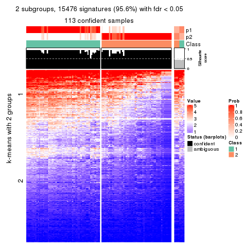</p>

</div>
<div id='tab-CV-skmeans-get-signatures-no-scale-2'>
<pre><code class="r">get_signatures(res, k = 3, scale_rows = FALSE)
</code></pre>

<p></p>

</div>
<div id='tab-CV-skmeans-get-signatures-no-scale-3'>
<pre><code class="r">get_signatures(res, k = 4, scale_rows = FALSE)
</code></pre>

<p></p>

</div>
<div id='tab-CV-skmeans-get-signatures-no-scale-4'>
<pre><code class="r">get_signatures(res, k = 5, scale_rows = FALSE)
</code></pre>

<p></p>

</div>
<div id='tab-CV-skmeans-get-signatures-no-scale-5'>
<pre><code class="r">get_signatures(res, k = 6, scale_rows = FALSE)
</code></pre>

<p></p>

</div>
</div>


Compare the overlap of signatures from different k:

```r
compare_signatures(res)
```


`get_signature()` returns a data frame invisibly. TO get the list of signatures, the function
call should be assigned to a variable explicitly. In following code, if `plot` argument is set
to `FALSE`, no heatmap is plotted while only the differential analysis is performed.

```r
# code only for demonstration
tb = get_signature(res, k = ..., plot = FALSE)
```

An example of the output of `tb` is:

```
#>   which_row         fdr    mean_1    mean_2 scaled_mean_1 scaled_mean_2 km
#> 1        38 0.042760348  8.373488  9.131774    -0.5533452     0.5164555  1
#> 2        40 0.018707592  7.106213  8.469186    -0.6173731     0.5762149  1
#> 3        55 0.019134737 10.221463 11.207825    -0.6159697     0.5749050  1
#> 4        59 0.006059896  5.921854  7.869574    -0.6899429     0.6439467  1
#> 5        60 0.018055526  8.928898 10.211722    -0.6204761     0.5791110  1
#> 6        98 0.009384629 15.714769 14.887706     0.6635654    -0.6193277  2
...
```

The columns in `tb` are:

1. `which_row`: row indices corresponding to the input matrix.
2. `fdr`: FDR for the differential test. 
3. `mean_x`: The mean value in group x.
4. `scaled_mean_x`: The mean value in group x after rows are scaled.
5. `km`: Row groups if k-means clustering is applied to rows.


UMAP plot which shows how samples are separated.


<script>
$( function() {
	$( '#tabs-CV-skmeans-dimension-reduction' ).tabs();
} );
</script>
<div id='tabs-CV-skmeans-dimension-reduction'>
<ul>
<li><a href='#tab-CV-skmeans-dimension-reduction-1'>k = 2</a></li>
<li><a href='#tab-CV-skmeans-dimension-reduction-2'>k = 3</a></li>
<li><a href='#tab-CV-skmeans-dimension-reduction-3'>k = 4</a></li>
<li><a href='#tab-CV-skmeans-dimension-reduction-4'>k = 5</a></li>
<li><a href='#tab-CV-skmeans-dimension-reduction-5'>k = 6</a></li>
</ul>
<div id='tab-CV-skmeans-dimension-reduction-1'>
<pre><code class="r">dimension_reduction(res, k = 2, method = &quot;UMAP&quot;)
</code></pre>

<p></p>

</div>
<div id='tab-CV-skmeans-dimension-reduction-2'>
<pre><code class="r">dimension_reduction(res, k = 3, method = &quot;UMAP&quot;)
</code></pre>

<p></p>

</div>
<div id='tab-CV-skmeans-dimension-reduction-3'>
<pre><code class="r">dimension_reduction(res, k = 4, method = &quot;UMAP&quot;)
</code></pre>

<p></p>

</div>
<div id='tab-CV-skmeans-dimension-reduction-4'>
<pre><code class="r">dimension_reduction(res, k = 5, method = &quot;UMAP&quot;)
</code></pre>

<p></p>

</div>
<div id='tab-CV-skmeans-dimension-reduction-5'>
<pre><code class="r">dimension_reduction(res, k = 6, method = &quot;UMAP&quot;)
</code></pre>

<p></p>

</div>
</div>


Following heatmap shows how subgroups are split when increasing `k`:

```r
collect_classes(res)
```


If matrix rows can be associated to genes, consider to use `functional_enrichment(res,
...)` to perform function enrichment for the signature genes. See [this vignette](http://bioconductor.org/packages/devel/bioc/vignettes/cola/inst/doc/functional_enrichment.html) for more detailed explanations.


 

---------------------------------------------------


### CV:pam


The object with results only for a single top-value method and a single partition method 
can be extracted as:

```r
res = res_list["CV", "pam"]
# you can also extract it by
# res = res_list["CV:pam"]
```

A summary of `res` and all the functions that can be applied to it:

```r
res
```

```
#> A 'ConsensusPartition' object with k = 2, 3, 4, 5, 6.
#>   On a matrix with 16187 rows and 121 columns.
#>   Top rows (1000, 2000, 3000, 4000, 5000) are extracted by 'CV' method.
#>   Subgroups are detected by 'pam' method.
#>   Performed in total 1250 partitions by row resampling.
#>   Best k for subgroups seems to be 4.
#> 
#> Following methods can be applied to this 'ConsensusPartition' object:
#>  [1] "cola_report"             "collect_classes"         "collect_plots"          
#>  [4] "collect_stats"           "colnames"                "compare_signatures"     
#>  [7] "consensus_heatmap"       "dimension_reduction"     "functional_enrichment"  
#> [10] "get_anno_col"            "get_anno"                "get_classes"            
#> [13] "get_consensus"           "get_matrix"              "get_membership"         
#> [16] "get_param"               "get_signatures"          "get_stats"              
#> [19] "is_best_k"               "is_stable_k"             "membership_heatmap"     
#> [22] "ncol"                    "nrow"                    "plot_ecdf"              
#> [25] "rownames"                "select_partition_number" "show"                   
#> [28] "suggest_best_k"          "test_to_known_factors"
```

`collect_plots()` function collects all the plots made from `res` for all `k` (number of partitions)
into one single page to provide an easy and fast comparison between different `k`.

```r
collect_plots(res)
```


The plots are:

- The first row: a plot of the ECDF (empirical cumulative distribution
  function) curves of the consensus matrix for each `k` and the heatmap of
  predicted classes for each `k`.
- The second row: heatmaps of the consensus matrix for each `k`.
- The third row: heatmaps of the membership matrix for each `k`.
- The fouth row: heatmaps of the signatures for each `k`.

All the plots in panels can be made by individual functions and they are
plotted later in this section.

`select_partition_number()` produces several plots showing different
statistics for choosing "optimized" `k`. There are following statistics:

- ECDF curves of the consensus matrix for each `k`;
- 1-PAC. [The PAC
  score](https://en.wikipedia.org/wiki/Consensus_clustering#Over-interpretation_potential_of_consensus_clustering)
  measures the proportion of the ambiguous subgrouping.
- Mean silhouette score.
- Concordance. The mean probability of fiting the consensus class ids in all
  partitions.
- Area increased. Denote $A_k$ as the area under the ECDF curve for current
  `k`, the area increased is defined as $A_k - A_{k-1}$.
- Rand index. The percent of pairs of samples that are both in a same cluster
  or both are not in a same cluster in the partition of k and k-1.
- Jaccard index. The ratio of pairs of samples are both in a same cluster in
  the partition of k and k-1 and the pairs of samples are both in a same
  cluster in the partition k or k-1.

The detailed explanations of these statistics can be found in [the _cola_
vignette](http://bioconductor.org/packages/devel/bioc/vignettes/cola/inst/doc/cola.html#toc_13).

Generally speaking, lower PAC score, higher mean silhouette score or higher
concordance corresponds to better partition. Rand index and Jaccard index
measure how similar the current partition is compared to partition with `k-1`.
If they are too similar, we won't accept `k` is better than `k-1`.

```r
select_partition_number(res)
```


The numeric values for all these statistics can be obtained by `get_stats()`.

```r
get_stats(res)
```

```
#>   k 1-PAC mean_silhouette concordance area_increased  Rand Jaccard
#> 2 2 0.428           0.788       0.892         0.4754 0.498   0.498
#> 3 3 0.579           0.685       0.785         0.3816 0.708   0.484
#> 4 4 0.850           0.865       0.940         0.1170 0.834   0.575
#> 5 5 0.795           0.816       0.892         0.0566 0.915   0.705
#> 6 6 0.836           0.812       0.902         0.0355 0.963   0.837
```

`suggest_best_k()` suggests the best $k$ based on these statistics. The rules are as follows:

- All $k$ with Jaccard index larger than 0.95 are removed because increasing
  $k$ does not provide enough extra information. If all $k$ are removed, it is
  marked as no subgroup is detected.
- For all $k$ with 1-PAC score larger than 0.9, the maximal $k$ is taken as
  the best $k$, and other $k$ are marked as optional $k$.
- If it does not fit the second rule. The $k$ with the maximal vote of the
  highest 1-PAC score, highest mean silhouette, and highest concordance is
  taken as the best $k$.

```r
suggest_best_k(res)
```

```
#> [1] 4
```


Following shows the table of the partitions (You need to click the **show/hide
code output** link to see it). The membership matrix (columns with name `p*`)
is inferred by
[`clue::cl_consensus()`](https://www.rdocumentation.org/link/cl_consensus?package=clue)
function with the `SE` method. Basically the value in the membership matrix
represents the probability to belong to a certain group. The finall class
label for an item is determined with the group with highest probability it
belongs to.

In `get_classes()` function, the entropy is calculated from the membership
matrix and the silhouette score is calculated from the consensus matrix.


<script>
$( function() {
	$( '#tabs-CV-pam-get-classes' ).tabs();
} );
</script>
<div id='tabs-CV-pam-get-classes'>
<ul>
<li><a href='#tab-CV-pam-get-classes-1'>k = 2</a></li>
<li><a href='#tab-CV-pam-get-classes-2'>k = 3</a></li>
<li><a href='#tab-CV-pam-get-classes-3'>k = 4</a></li>
<li><a href='#tab-CV-pam-get-classes-4'>k = 5</a></li>
<li><a href='#tab-CV-pam-get-classes-5'>k = 6</a></li>
</ul>

<div id='tab-CV-pam-get-classes-1'>
<p><a id='tab-CV-pam-get-classes-1-a' style='color:#0366d6' href='#'>show/hide code output</a></p>
<pre><code class="r">cbind(get_classes(res, k = 2), get_membership(res, k = 2))
</code></pre>

<pre><code>#&gt;           class entropy silhouette    p1    p2
#&gt; DRR006374     2  0.0000     0.9095 0.000 1.000
#&gt; DRR006375     1  0.0000     0.8309 1.000 0.000
#&gt; DRR006376     1  0.9933     0.3815 0.548 0.452
#&gt; DRR006377     2  0.8861     0.4234 0.304 0.696
#&gt; DRR006378     2  0.0000     0.9095 0.000 1.000
#&gt; DRR006379     2  0.3879     0.8467 0.076 0.924
#&gt; DRR006380     2  0.0000     0.9095 0.000 1.000
#&gt; DRR006381     1  0.0000     0.8309 1.000 0.000
#&gt; DRR006382     2  0.0000     0.9095 0.000 1.000
#&gt; DRR006383     1  0.9323     0.6216 0.652 0.348
#&gt; DRR006384     2  0.0000     0.9095 0.000 1.000
#&gt; DRR006385     1  0.6343     0.8263 0.840 0.160
#&gt; DRR006386     2  0.0000     0.9095 0.000 1.000
#&gt; DRR006387     1  0.6887     0.8207 0.816 0.184
#&gt; DRR006388     2  0.6712     0.7299 0.176 0.824
#&gt; DRR006389     2  0.6623     0.7349 0.172 0.828
#&gt; DRR006390     2  0.0000     0.9095 0.000 1.000
#&gt; DRR006391     2  0.0000     0.9095 0.000 1.000
#&gt; DRR006392     1  0.0000     0.8309 1.000 0.000
#&gt; DRR006393     1  0.6887     0.8207 0.816 0.184
#&gt; DRR006394     2  0.0000     0.9095 0.000 1.000
#&gt; DRR006395     1  0.6712     0.8234 0.824 0.176
#&gt; DRR006396     1  0.0000     0.8309 1.000 0.000
#&gt; DRR006397     2  0.6973     0.7150 0.188 0.812
#&gt; DRR006398     2  0.6887     0.7203 0.184 0.816
#&gt; DRR006399     1  0.0376     0.8315 0.996 0.004
#&gt; DRR006400     1  0.0376     0.8315 0.996 0.004
#&gt; DRR006401     2  0.0000     0.9095 0.000 1.000
#&gt; DRR006402     2  0.0000     0.9095 0.000 1.000
#&gt; DRR006403     1  0.6887     0.8207 0.816 0.184
#&gt; DRR006404     1  0.9922     0.3951 0.552 0.448
#&gt; DRR006405     1  0.9933     0.3815 0.548 0.452
#&gt; DRR006406     1  0.9933     0.3815 0.548 0.452
#&gt; DRR006407     2  0.0000     0.9095 0.000 1.000
#&gt; DRR006408     2  0.0000     0.9095 0.000 1.000
#&gt; DRR006409     1  0.0376     0.8315 0.996 0.004
#&gt; DRR006410     1  0.6712     0.8234 0.824 0.176
#&gt; DRR006411     2  0.0376     0.9065 0.004 0.996
#&gt; DRR006412     2  0.0000     0.9095 0.000 1.000
#&gt; DRR006413     1  0.0000     0.8309 1.000 0.000
#&gt; DRR006414     1  0.7056     0.8166 0.808 0.192
#&gt; DRR006415     1  0.8661     0.7149 0.712 0.288
#&gt; DRR006416     1  0.9954     0.3648 0.540 0.460
#&gt; DRR006417     1  0.8555     0.7281 0.720 0.280
#&gt; DRR006418     1  0.6887     0.8207 0.816 0.184
#&gt; DRR006419     1  0.7219     0.8114 0.800 0.200
#&gt; DRR006420     1  0.7139     0.8142 0.804 0.196
#&gt; DRR006421     2  0.8386     0.5634 0.268 0.732
#&gt; DRR006422     2  0.9815     0.0183 0.420 0.580
#&gt; DRR006423     2  0.0000     0.9095 0.000 1.000
#&gt; DRR006424     1  0.0000     0.8309 1.000 0.000
#&gt; DRR006425     2  0.0000     0.9095 0.000 1.000
#&gt; DRR006426     2  0.9850    -0.0214 0.428 0.572
#&gt; DRR006427     2  0.0000     0.9095 0.000 1.000
#&gt; DRR006428     1  0.0938     0.8303 0.988 0.012
#&gt; DRR006429     2  0.0000     0.9095 0.000 1.000
#&gt; DRR006430     1  0.0000     0.8309 1.000 0.000
#&gt; DRR006431     1  0.0000     0.8309 1.000 0.000
#&gt; DRR006432     1  0.7056     0.8168 0.808 0.192
#&gt; DRR006433     2  0.8499     0.5495 0.276 0.724
#&gt; DRR006434     2  0.0000     0.9095 0.000 1.000
#&gt; DRR006435     2  0.0000     0.9095 0.000 1.000
#&gt; DRR006436     2  0.0000     0.9095 0.000 1.000
#&gt; DRR006437     1  0.0000     0.8309 1.000 0.000
#&gt; DRR006438     1  0.6712     0.8234 0.824 0.176
#&gt; DRR006439     1  0.7056     0.8166 0.808 0.192
#&gt; DRR006440     2  0.0000     0.9095 0.000 1.000
#&gt; DRR006441     2  0.0000     0.9095 0.000 1.000
#&gt; DRR006442     1  0.7299     0.8082 0.796 0.204
#&gt; DRR006443     2  0.0000     0.9095 0.000 1.000
#&gt; DRR006444     2  0.0000     0.9095 0.000 1.000
#&gt; DRR006445     1  0.8861     0.6863 0.696 0.304
#&gt; DRR006446     2  0.0000     0.9095 0.000 1.000
#&gt; DRR006447     1  0.6712     0.8234 0.824 0.176
#&gt; DRR006448     1  0.0000     0.8309 1.000 0.000
#&gt; DRR006449     1  0.0376     0.8315 0.996 0.004
#&gt; DRR006450     1  0.0000     0.8309 1.000 0.000
#&gt; DRR006451     2  0.6531     0.7425 0.168 0.832
#&gt; DRR006452     1  0.0000     0.8309 1.000 0.000
#&gt; DRR006453     1  0.9248     0.6267 0.660 0.340
#&gt; DRR006454     2  0.0000     0.9095 0.000 1.000
#&gt; DRR006455     2  0.0000     0.9095 0.000 1.000
#&gt; DRR006456     1  0.9393     0.6034 0.644 0.356
#&gt; DRR006457     2  0.8499     0.5495 0.276 0.724
#&gt; DRR006458     1  0.0000     0.8309 1.000 0.000
#&gt; DRR006459     1  0.0000     0.8309 1.000 0.000
#&gt; DRR006460     2  0.0000     0.9095 0.000 1.000
#&gt; DRR006461     2  0.0000     0.9095 0.000 1.000
#&gt; DRR006462     1  0.0000     0.8309 1.000 0.000
#&gt; DRR006463     2  0.0000     0.9095 0.000 1.000
#&gt; DRR006464     2  0.0000     0.9095 0.000 1.000
#&gt; DRR006465     1  0.6887     0.8207 0.816 0.184
#&gt; DRR006466     2  0.0000     0.9095 0.000 1.000
#&gt; DRR006467     1  0.0000     0.8309 1.000 0.000
#&gt; DRR006468     2  0.0000     0.9095 0.000 1.000
#&gt; DRR006469     2  0.0000     0.9095 0.000 1.000
#&gt; DRR006470     1  0.6712     0.8234 0.824 0.176
#&gt; DRR006471     1  0.0000     0.8309 1.000 0.000
#&gt; DRR006472     1  0.9944     0.3983 0.544 0.456
#&gt; DRR006473     2  0.0000     0.9095 0.000 1.000
#&gt; DRR006474     2  0.0000     0.9095 0.000 1.000
#&gt; DRR006475     1  0.0000     0.8309 1.000 0.000
#&gt; DRR006476     2  0.0000     0.9095 0.000 1.000
#&gt; DRR006477     2  0.4161     0.8345 0.084 0.916
#&gt; DRR006478     1  0.6887     0.8207 0.816 0.184
#&gt; DRR006479     1  0.6712     0.8234 0.824 0.176
#&gt; DRR006480     1  0.0000     0.8309 1.000 0.000
#&gt; DRR006481     2  0.8555     0.5430 0.280 0.720
#&gt; DRR006482     2  0.9000     0.4767 0.316 0.684
#&gt; DRR006483     1  0.0000     0.8309 1.000 0.000
#&gt; DRR006484     1  0.7950     0.7750 0.760 0.240
#&gt; DRR006485     2  0.0000     0.9095 0.000 1.000
#&gt; DRR006486     1  0.0000     0.8309 1.000 0.000
#&gt; DRR006487     1  0.7674     0.7906 0.776 0.224
#&gt; DRR006488     2  0.0000     0.9095 0.000 1.000
#&gt; DRR006489     1  0.0000     0.8309 1.000 0.000
#&gt; DRR006490     1  0.7056     0.8166 0.808 0.192
#&gt; DRR006491     1  0.7056     0.8166 0.808 0.192
#&gt; DRR006492     1  0.6712     0.8234 0.824 0.176
#&gt; DRR006493     2  0.8661     0.5268 0.288 0.712
#&gt; DRR006494     1  0.0000     0.8309 1.000 0.000
</code></pre>

<script>
$('#tab-CV-pam-get-classes-1-a').parent().next().next().hide();
$('#tab-CV-pam-get-classes-1-a').click(function(){
  $('#tab-CV-pam-get-classes-1-a').parent().next().next().toggle();
  return(false);
});
</script>
</div>

<div id='tab-CV-pam-get-classes-2'>
<p><a id='tab-CV-pam-get-classes-2-a' style='color:#0366d6' href='#'>show/hide code output</a></p>
<pre><code class="r">cbind(get_classes(res, k = 3), get_membership(res, k = 3))
</code></pre>

<pre><code>#&gt;           class entropy silhouette    p1    p2    p3
#&gt; DRR006374     2  0.0000     0.9370 0.000 1.000 0.000
#&gt; DRR006375     1  0.5291     0.6530 0.732 0.000 0.268
#&gt; DRR006376     1  0.1529     0.6525 0.960 0.000 0.040
#&gt; DRR006377     1  0.7236     0.2633 0.576 0.392 0.032
#&gt; DRR006378     2  0.0000     0.9370 0.000 1.000 0.000
#&gt; DRR006379     1  0.7661     0.0674 0.504 0.452 0.044
#&gt; DRR006380     2  0.1964     0.9009 0.000 0.944 0.056
#&gt; DRR006381     1  0.5291     0.6530 0.732 0.000 0.268
#&gt; DRR006382     2  0.4291     0.7870 0.000 0.820 0.180
#&gt; DRR006383     3  0.5327     0.6034 0.000 0.272 0.728
#&gt; DRR006384     2  0.0000     0.9370 0.000 1.000 0.000
#&gt; DRR006385     1  0.1031     0.6651 0.976 0.000 0.024
#&gt; DRR006386     2  0.0000     0.9370 0.000 1.000 0.000
#&gt; DRR006387     1  0.1031     0.6651 0.976 0.000 0.024
#&gt; DRR006388     1  0.7571     0.0788 0.508 0.452 0.040
#&gt; DRR006389     2  0.7480     0.0543 0.456 0.508 0.036
#&gt; DRR006390     2  0.0000     0.9370 0.000 1.000 0.000
#&gt; DRR006391     2  0.0000     0.9370 0.000 1.000 0.000
#&gt; DRR006392     1  0.5291     0.6530 0.732 0.000 0.268
#&gt; DRR006393     1  0.0983     0.6683 0.980 0.004 0.016
#&gt; DRR006394     2  0.0000     0.9370 0.000 1.000 0.000
#&gt; DRR006395     1  0.3619     0.5496 0.864 0.000 0.136
#&gt; DRR006396     1  0.0000     0.6703 1.000 0.000 0.000
#&gt; DRR006397     1  0.7400     0.1933 0.552 0.412 0.036
#&gt; DRR006398     1  0.7619     0.1531 0.532 0.424 0.044
#&gt; DRR006399     1  0.6154    -0.2488 0.592 0.000 0.408
#&gt; DRR006400     1  0.6154    -0.2488 0.592 0.000 0.408
#&gt; DRR006401     2  0.0000     0.9370 0.000 1.000 0.000
#&gt; DRR006402     2  0.0000     0.9370 0.000 1.000 0.000
#&gt; DRR006403     1  0.5650     0.1460 0.688 0.000 0.312
#&gt; DRR006404     1  0.1267     0.6648 0.972 0.004 0.024
#&gt; DRR006405     1  0.1182     0.6677 0.976 0.012 0.012
#&gt; DRR006406     1  0.1182     0.6677 0.976 0.012 0.012
#&gt; DRR006407     2  0.0424     0.9327 0.000 0.992 0.008
#&gt; DRR006408     2  0.0000     0.9370 0.000 1.000 0.000
#&gt; DRR006409     3  0.1529     0.5487 0.040 0.000 0.960
#&gt; DRR006410     1  0.0424     0.6698 0.992 0.000 0.008
#&gt; DRR006411     2  0.5692     0.5366 0.268 0.724 0.008
#&gt; DRR006412     2  0.0000     0.9370 0.000 1.000 0.000
#&gt; DRR006413     1  0.5529     0.6419 0.704 0.000 0.296
#&gt; DRR006414     3  0.5291     0.8099 0.268 0.000 0.732
#&gt; DRR006415     3  0.5291     0.8099 0.268 0.000 0.732
#&gt; DRR006416     1  0.1170     0.6673 0.976 0.008 0.016
#&gt; DRR006417     3  0.5291     0.8099 0.268 0.000 0.732
#&gt; DRR006418     1  0.1031     0.6651 0.976 0.000 0.024
#&gt; DRR006419     3  0.5291     0.8099 0.268 0.000 0.732
#&gt; DRR006420     3  0.5291     0.8099 0.268 0.000 0.732
#&gt; DRR006421     3  0.5327     0.6034 0.000 0.272 0.728
#&gt; DRR006422     1  0.6584     0.3689 0.608 0.380 0.012
#&gt; DRR006423     2  0.0000     0.9370 0.000 1.000 0.000
#&gt; DRR006424     1  0.5291     0.6530 0.732 0.000 0.268
#&gt; DRR006425     2  0.0000     0.9370 0.000 1.000 0.000
#&gt; DRR006426     1  0.7759     0.3074 0.676 0.144 0.180
#&gt; DRR006427     2  0.0000     0.9370 0.000 1.000 0.000
#&gt; DRR006428     3  0.0424     0.5834 0.008 0.000 0.992
#&gt; DRR006429     2  0.0592     0.9308 0.000 0.988 0.012
#&gt; DRR006430     1  0.5291     0.6530 0.732 0.000 0.268
#&gt; DRR006431     1  0.5948     0.6026 0.640 0.000 0.360
#&gt; DRR006432     3  0.6540     0.6260 0.408 0.008 0.584
#&gt; DRR006433     3  0.5480     0.6152 0.004 0.264 0.732
#&gt; DRR006434     2  0.0000     0.9370 0.000 1.000 0.000
#&gt; DRR006435     2  0.0000     0.9370 0.000 1.000 0.000
#&gt; DRR006436     2  0.0000     0.9370 0.000 1.000 0.000
#&gt; DRR006437     3  0.6215     0.5868 0.428 0.000 0.572
#&gt; DRR006438     3  0.5291     0.8099 0.268 0.000 0.732
#&gt; DRR006439     3  0.5291     0.8099 0.268 0.000 0.732
#&gt; DRR006440     2  0.4605     0.7549 0.000 0.796 0.204
#&gt; DRR006441     2  0.0000     0.9370 0.000 1.000 0.000
#&gt; DRR006442     3  0.3192     0.7071 0.112 0.000 0.888
#&gt; DRR006443     2  0.4346     0.7833 0.000 0.816 0.184
#&gt; DRR006444     2  0.0000     0.9370 0.000 1.000 0.000
#&gt; DRR006445     1  0.1129     0.6666 0.976 0.004 0.020
#&gt; DRR006446     2  0.0000     0.9370 0.000 1.000 0.000
#&gt; DRR006447     1  0.1031     0.6651 0.976 0.000 0.024
#&gt; DRR006448     1  0.0000     0.6703 1.000 0.000 0.000
#&gt; DRR006449     3  0.6295     0.1819 0.472 0.000 0.528
#&gt; DRR006450     1  0.6215    -0.2915 0.572 0.000 0.428
#&gt; DRR006451     1  0.7213     0.1819 0.552 0.420 0.028
#&gt; DRR006452     1  0.5291     0.6530 0.732 0.000 0.268
#&gt; DRR006453     1  0.1129     0.6666 0.976 0.004 0.020
#&gt; DRR006454     2  0.1289     0.9182 0.000 0.968 0.032
#&gt; DRR006455     2  0.0000     0.9370 0.000 1.000 0.000
#&gt; DRR006456     3  0.6949     0.7527 0.156 0.112 0.732
#&gt; DRR006457     3  0.6588     0.6800 0.060 0.208 0.732
#&gt; DRR006458     1  0.5291     0.6530 0.732 0.000 0.268
#&gt; DRR006459     1  0.5968     0.5996 0.636 0.000 0.364
#&gt; DRR006460     2  0.0000     0.9370 0.000 1.000 0.000
#&gt; DRR006461     2  0.4346     0.7833 0.000 0.816 0.184
#&gt; DRR006462     1  0.0592     0.6682 0.988 0.000 0.012
#&gt; DRR006463     2  0.4346     0.7833 0.000 0.816 0.184
#&gt; DRR006464     2  0.0424     0.9327 0.000 0.992 0.008
#&gt; DRR006465     1  0.0592     0.6710 0.988 0.000 0.012
#&gt; DRR006466     2  0.4346     0.7833 0.000 0.816 0.184
#&gt; DRR006467     1  0.5291     0.6530 0.732 0.000 0.268
#&gt; DRR006468     2  0.0000     0.9370 0.000 1.000 0.000
#&gt; DRR006469     2  0.0000     0.9370 0.000 1.000 0.000
#&gt; DRR006470     3  0.5621     0.7704 0.308 0.000 0.692
#&gt; DRR006471     1  0.5291     0.6530 0.732 0.000 0.268
#&gt; DRR006472     3  0.7465     0.7592 0.272 0.072 0.656
#&gt; DRR006473     2  0.0000     0.9370 0.000 1.000 0.000
#&gt; DRR006474     2  0.0000     0.9370 0.000 1.000 0.000
#&gt; DRR006475     1  0.6140     0.5650 0.596 0.000 0.404
#&gt; DRR006476     2  0.1753     0.9082 0.000 0.952 0.048
#&gt; DRR006477     3  0.5926     0.4549 0.000 0.356 0.644
#&gt; DRR006478     1  0.1129     0.6666 0.976 0.004 0.020
#&gt; DRR006479     3  0.5291     0.8099 0.268 0.000 0.732
#&gt; DRR006480     1  0.6168     0.5568 0.588 0.000 0.412
#&gt; DRR006481     3  0.5291     0.8099 0.268 0.000 0.732
#&gt; DRR006482     3  0.5291     0.8099 0.268 0.000 0.732
#&gt; DRR006483     1  0.5291     0.6530 0.732 0.000 0.268
#&gt; DRR006484     3  0.5291     0.8099 0.268 0.000 0.732
#&gt; DRR006485     2  0.4178     0.7952 0.000 0.828 0.172
#&gt; DRR006486     1  0.6168     0.5568 0.588 0.000 0.412
#&gt; DRR006487     3  0.5291     0.8099 0.268 0.000 0.732
#&gt; DRR006488     2  0.0000     0.9370 0.000 1.000 0.000
#&gt; DRR006489     1  0.5291     0.6530 0.732 0.000 0.268
#&gt; DRR006490     3  0.4346     0.7665 0.184 0.000 0.816
#&gt; DRR006491     3  0.5291     0.8099 0.268 0.000 0.732
#&gt; DRR006492     3  0.5465     0.7944 0.288 0.000 0.712
#&gt; DRR006493     3  0.5480     0.6152 0.004 0.264 0.732
#&gt; DRR006494     1  0.6168     0.5568 0.588 0.000 0.412
</code></pre>

<script>
$('#tab-CV-pam-get-classes-2-a').parent().next().next().hide();
$('#tab-CV-pam-get-classes-2-a').click(function(){
  $('#tab-CV-pam-get-classes-2-a').parent().next().next().toggle();
  return(false);
});
</script>
</div>

<div id='tab-CV-pam-get-classes-3'>
<p><a id='tab-CV-pam-get-classes-3-a' style='color:#0366d6' href='#'>show/hide code output</a></p>
<pre><code class="r">cbind(get_classes(res, k = 4), get_membership(res, k = 4))
</code></pre>

<pre><code>#&gt;           class entropy silhouette    p1    p2    p3    p4
#&gt; DRR006374     2  0.0000    0.94674 0.000 1.000 0.000 0.000
#&gt; DRR006375     1  0.0000    0.97264 1.000 0.000 0.000 0.000
#&gt; DRR006376     4  0.0000    0.89417 0.000 0.000 0.000 1.000
#&gt; DRR006377     4  0.1022    0.87397 0.000 0.032 0.000 0.968
#&gt; DRR006378     2  0.0000    0.94674 0.000 1.000 0.000 0.000
#&gt; DRR006379     4  0.0000    0.89417 0.000 0.000 0.000 1.000
#&gt; DRR006380     2  0.1557    0.91217 0.000 0.944 0.056 0.000
#&gt; DRR006381     1  0.0000    0.97264 1.000 0.000 0.000 0.000
#&gt; DRR006382     2  0.3610    0.78338 0.000 0.800 0.200 0.000
#&gt; DRR006383     3  0.2408    0.83924 0.000 0.104 0.896 0.000
#&gt; DRR006384     2  0.0000    0.94674 0.000 1.000 0.000 0.000
#&gt; DRR006385     4  0.0000    0.89417 0.000 0.000 0.000 1.000
#&gt; DRR006386     2  0.0000    0.94674 0.000 1.000 0.000 0.000
#&gt; DRR006387     4  0.0000    0.89417 0.000 0.000 0.000 1.000
#&gt; DRR006388     4  0.0000    0.89417 0.000 0.000 0.000 1.000
#&gt; DRR006389     4  0.0000    0.89417 0.000 0.000 0.000 1.000
#&gt; DRR006390     2  0.0000    0.94674 0.000 1.000 0.000 0.000
#&gt; DRR006391     2  0.0000    0.94674 0.000 1.000 0.000 0.000
#&gt; DRR006392     1  0.0000    0.97264 1.000 0.000 0.000 0.000
#&gt; DRR006393     4  0.0000    0.89417 0.000 0.000 0.000 1.000
#&gt; DRR006394     2  0.0000    0.94674 0.000 1.000 0.000 0.000
#&gt; DRR006395     4  0.0000    0.89417 0.000 0.000 0.000 1.000
#&gt; DRR006396     1  0.4277    0.58701 0.720 0.000 0.000 0.280
#&gt; DRR006397     4  0.0000    0.89417 0.000 0.000 0.000 1.000
#&gt; DRR006398     4  0.0000    0.89417 0.000 0.000 0.000 1.000
#&gt; DRR006399     4  0.2589    0.81026 0.116 0.000 0.000 0.884
#&gt; DRR006400     4  0.3024    0.77935 0.148 0.000 0.000 0.852
#&gt; DRR006401     2  0.0000    0.94674 0.000 1.000 0.000 0.000
#&gt; DRR006402     2  0.0000    0.94674 0.000 1.000 0.000 0.000
#&gt; DRR006403     4  0.0000    0.89417 0.000 0.000 0.000 1.000
#&gt; DRR006404     4  0.0000    0.89417 0.000 0.000 0.000 1.000
#&gt; DRR006405     4  0.0000    0.89417 0.000 0.000 0.000 1.000
#&gt; DRR006406     4  0.0000    0.89417 0.000 0.000 0.000 1.000
#&gt; DRR006407     2  0.2011    0.88342 0.000 0.920 0.000 0.080
#&gt; DRR006408     2  0.0000    0.94674 0.000 1.000 0.000 0.000
#&gt; DRR006409     3  0.4454    0.52005 0.308 0.000 0.692 0.000
#&gt; DRR006410     4  0.0000    0.89417 0.000 0.000 0.000 1.000
#&gt; DRR006411     4  0.0000    0.89417 0.000 0.000 0.000 1.000
#&gt; DRR006412     2  0.0000    0.94674 0.000 1.000 0.000 0.000
#&gt; DRR006413     1  0.0000    0.97264 1.000 0.000 0.000 0.000
#&gt; DRR006414     3  0.0000    0.94445 0.000 0.000 1.000 0.000
#&gt; DRR006415     3  0.0000    0.94445 0.000 0.000 1.000 0.000
#&gt; DRR006416     4  0.0000    0.89417 0.000 0.000 0.000 1.000
#&gt; DRR006417     3  0.0000    0.94445 0.000 0.000 1.000 0.000
#&gt; DRR006418     4  0.0000    0.89417 0.000 0.000 0.000 1.000
#&gt; DRR006419     4  0.4925    0.32995 0.000 0.000 0.428 0.572
#&gt; DRR006420     4  0.4967    0.27106 0.000 0.000 0.452 0.548
#&gt; DRR006421     3  0.5793    0.27099 0.000 0.384 0.580 0.036
#&gt; DRR006422     4  0.4998   -0.00118 0.000 0.488 0.000 0.512
#&gt; DRR006423     2  0.0000    0.94674 0.000 1.000 0.000 0.000
#&gt; DRR006424     1  0.0000    0.97264 1.000 0.000 0.000 0.000
#&gt; DRR006425     2  0.0000    0.94674 0.000 1.000 0.000 0.000
#&gt; DRR006426     4  0.1211    0.87094 0.000 0.000 0.040 0.960
#&gt; DRR006427     2  0.0000    0.94674 0.000 1.000 0.000 0.000
#&gt; DRR006428     3  0.0000    0.94445 0.000 0.000 1.000 0.000
#&gt; DRR006429     2  0.0524    0.94102 0.000 0.988 0.004 0.008
#&gt; DRR006430     1  0.0000    0.97264 1.000 0.000 0.000 0.000
#&gt; DRR006431     1  0.0000    0.97264 1.000 0.000 0.000 0.000
#&gt; DRR006432     4  0.0000    0.89417 0.000 0.000 0.000 1.000
#&gt; DRR006433     3  0.0592    0.93160 0.000 0.016 0.984 0.000
#&gt; DRR006434     2  0.0000    0.94674 0.000 1.000 0.000 0.000
#&gt; DRR006435     2  0.0000    0.94674 0.000 1.000 0.000 0.000
#&gt; DRR006436     2  0.0000    0.94674 0.000 1.000 0.000 0.000
#&gt; DRR006437     4  0.7380    0.36623 0.200 0.000 0.288 0.512
#&gt; DRR006438     3  0.0000    0.94445 0.000 0.000 1.000 0.000
#&gt; DRR006439     3  0.0000    0.94445 0.000 0.000 1.000 0.000
#&gt; DRR006440     2  0.3610    0.78338 0.000 0.800 0.200 0.000
#&gt; DRR006441     2  0.0000    0.94674 0.000 1.000 0.000 0.000
#&gt; DRR006442     3  0.0000    0.94445 0.000 0.000 1.000 0.000
#&gt; DRR006443     2  0.3610    0.78338 0.000 0.800 0.200 0.000
#&gt; DRR006444     2  0.0000    0.94674 0.000 1.000 0.000 0.000
#&gt; DRR006445     4  0.0000    0.89417 0.000 0.000 0.000 1.000
#&gt; DRR006446     2  0.0000    0.94674 0.000 1.000 0.000 0.000
#&gt; DRR006447     4  0.0000    0.89417 0.000 0.000 0.000 1.000
#&gt; DRR006448     4  0.0000    0.89417 0.000 0.000 0.000 1.000
#&gt; DRR006449     4  0.6634    0.47026 0.292 0.000 0.116 0.592
#&gt; DRR006450     4  0.3390    0.79098 0.016 0.000 0.132 0.852
#&gt; DRR006451     4  0.0000    0.89417 0.000 0.000 0.000 1.000
#&gt; DRR006452     1  0.0000    0.97264 1.000 0.000 0.000 0.000
#&gt; DRR006453     4  0.0000    0.89417 0.000 0.000 0.000 1.000
#&gt; DRR006454     2  0.0657    0.93961 0.000 0.984 0.012 0.004
#&gt; DRR006455     2  0.0000    0.94674 0.000 1.000 0.000 0.000
#&gt; DRR006456     3  0.0000    0.94445 0.000 0.000 1.000 0.000
#&gt; DRR006457     3  0.0000    0.94445 0.000 0.000 1.000 0.000
#&gt; DRR006458     1  0.0000    0.97264 1.000 0.000 0.000 0.000
#&gt; DRR006459     1  0.0000    0.97264 1.000 0.000 0.000 0.000
#&gt; DRR006460     2  0.0000    0.94674 0.000 1.000 0.000 0.000
#&gt; DRR006461     2  0.3610    0.78338 0.000 0.800 0.200 0.000
#&gt; DRR006462     4  0.4431    0.55224 0.304 0.000 0.000 0.696
#&gt; DRR006463     2  0.3610    0.78338 0.000 0.800 0.200 0.000
#&gt; DRR006464     2  0.0188    0.94412 0.000 0.996 0.000 0.004
#&gt; DRR006465     4  0.0336    0.88963 0.008 0.000 0.000 0.992
#&gt; DRR006466     2  0.3610    0.78338 0.000 0.800 0.200 0.000
#&gt; DRR006467     1  0.0000    0.97264 1.000 0.000 0.000 0.000
#&gt; DRR006468     2  0.0000    0.94674 0.000 1.000 0.000 0.000
#&gt; DRR006469     2  0.0000    0.94674 0.000 1.000 0.000 0.000
#&gt; DRR006470     3  0.1867    0.87393 0.000 0.000 0.928 0.072
#&gt; DRR006471     1  0.0000    0.97264 1.000 0.000 0.000 0.000
#&gt; DRR006472     4  0.3569    0.72260 0.000 0.000 0.196 0.804
#&gt; DRR006473     2  0.0000    0.94674 0.000 1.000 0.000 0.000
#&gt; DRR006474     2  0.0000    0.94674 0.000 1.000 0.000 0.000
#&gt; DRR006475     1  0.0000    0.97264 1.000 0.000 0.000 0.000
#&gt; DRR006476     2  0.1284    0.92893 0.000 0.964 0.024 0.012
#&gt; DRR006477     2  0.4804    0.43714 0.000 0.616 0.384 0.000
#&gt; DRR006478     4  0.0000    0.89417 0.000 0.000 0.000 1.000
#&gt; DRR006479     3  0.0817    0.92336 0.000 0.000 0.976 0.024
#&gt; DRR006480     1  0.0000    0.97264 1.000 0.000 0.000 0.000
#&gt; DRR006481     3  0.0000    0.94445 0.000 0.000 1.000 0.000
#&gt; DRR006482     4  0.4679    0.50756 0.000 0.000 0.352 0.648
#&gt; DRR006483     1  0.0000    0.97264 1.000 0.000 0.000 0.000
#&gt; DRR006484     3  0.0000    0.94445 0.000 0.000 1.000 0.000
#&gt; DRR006485     2  0.3610    0.78338 0.000 0.800 0.200 0.000
#&gt; DRR006486     1  0.0000    0.97264 1.000 0.000 0.000 0.000
#&gt; DRR006487     3  0.0000    0.94445 0.000 0.000 1.000 0.000
#&gt; DRR006488     2  0.0000    0.94674 0.000 1.000 0.000 0.000
#&gt; DRR006489     1  0.0000    0.97264 1.000 0.000 0.000 0.000
#&gt; DRR006490     3  0.0000    0.94445 0.000 0.000 1.000 0.000
#&gt; DRR006491     3  0.0000    0.94445 0.000 0.000 1.000 0.000
#&gt; DRR006492     4  0.4431    0.57980 0.000 0.000 0.304 0.696
#&gt; DRR006493     3  0.0000    0.94445 0.000 0.000 1.000 0.000
#&gt; DRR006494     1  0.2921    0.80516 0.860 0.000 0.140 0.000
</code></pre>

<script>
$('#tab-CV-pam-get-classes-3-a').parent().next().next().hide();
$('#tab-CV-pam-get-classes-3-a').click(function(){
  $('#tab-CV-pam-get-classes-3-a').parent().next().next().toggle();
  return(false);
});
</script>
</div>

<div id='tab-CV-pam-get-classes-4'>
<p><a id='tab-CV-pam-get-classes-4-a' style='color:#0366d6' href='#'>show/hide code output</a></p>
<pre><code class="r">cbind(get_classes(res, k = 5), get_membership(res, k = 5))
</code></pre>

<pre><code>#&gt;           class entropy silhouette    p1    p2    p3    p4    p5
#&gt; DRR006374     2  0.1043     0.9478 0.000 0.960 0.000 0.000 0.040
#&gt; DRR006375     1  0.0162     0.9737 0.996 0.000 0.000 0.000 0.004
#&gt; DRR006376     4  0.0162     0.8889 0.000 0.000 0.000 0.996 0.004
#&gt; DRR006377     4  0.1041     0.8729 0.000 0.032 0.000 0.964 0.004
#&gt; DRR006378     2  0.1043     0.9478 0.000 0.960 0.000 0.000 0.040
#&gt; DRR006379     4  0.0000     0.8893 0.000 0.000 0.000 1.000 0.000
#&gt; DRR006380     5  0.3305     0.7783 0.000 0.224 0.000 0.000 0.776
#&gt; DRR006381     1  0.0162     0.9737 0.996 0.000 0.000 0.000 0.004
#&gt; DRR006382     5  0.3300     0.7875 0.000 0.204 0.004 0.000 0.792
#&gt; DRR006383     3  0.3521     0.7388 0.000 0.004 0.764 0.000 0.232
#&gt; DRR006384     2  0.0000     0.9508 0.000 1.000 0.000 0.000 0.000
#&gt; DRR006385     4  0.0162     0.8886 0.000 0.000 0.000 0.996 0.004
#&gt; DRR006386     2  0.0000     0.9508 0.000 1.000 0.000 0.000 0.000
#&gt; DRR006387     4  0.0000     0.8893 0.000 0.000 0.000 1.000 0.000
#&gt; DRR006388     4  0.0162     0.8891 0.000 0.000 0.000 0.996 0.004
#&gt; DRR006389     4  0.0162     0.8891 0.000 0.000 0.000 0.996 0.004
#&gt; DRR006390     2  0.0000     0.9508 0.000 1.000 0.000 0.000 0.000
#&gt; DRR006391     2  0.0000     0.9508 0.000 1.000 0.000 0.000 0.000
#&gt; DRR006392     1  0.0000     0.9744 1.000 0.000 0.000 0.000 0.000
#&gt; DRR006393     4  0.0000     0.8893 0.000 0.000 0.000 1.000 0.000
#&gt; DRR006394     2  0.1043     0.9478 0.000 0.960 0.000 0.000 0.040
#&gt; DRR006395     4  0.0162     0.8891 0.000 0.000 0.000 0.996 0.004
#&gt; DRR006396     1  0.3928     0.5479 0.700 0.000 0.000 0.296 0.004
#&gt; DRR006397     4  0.0162     0.8891 0.000 0.000 0.000 0.996 0.004
#&gt; DRR006398     4  0.0162     0.8891 0.000 0.000 0.000 0.996 0.004
#&gt; DRR006399     4  0.4844     0.7253 0.108 0.000 0.000 0.720 0.172
#&gt; DRR006400     4  0.5224     0.6883 0.140 0.000 0.000 0.684 0.176
#&gt; DRR006401     2  0.0000     0.9508 0.000 1.000 0.000 0.000 0.000
#&gt; DRR006402     2  0.0000     0.9508 0.000 1.000 0.000 0.000 0.000
#&gt; DRR006403     4  0.2852     0.8086 0.000 0.000 0.000 0.828 0.172
#&gt; DRR006404     4  0.2852     0.8086 0.000 0.000 0.000 0.828 0.172
#&gt; DRR006405     4  0.0000     0.8893 0.000 0.000 0.000 1.000 0.000
#&gt; DRR006406     4  0.0000     0.8893 0.000 0.000 0.000 1.000 0.000
#&gt; DRR006407     5  0.5390     0.6302 0.000 0.324 0.000 0.076 0.600
#&gt; DRR006408     2  0.1043     0.9478 0.000 0.960 0.000 0.000 0.040
#&gt; DRR006409     3  0.4524     0.4936 0.336 0.000 0.644 0.000 0.020
#&gt; DRR006410     4  0.0000     0.8893 0.000 0.000 0.000 1.000 0.000
#&gt; DRR006411     4  0.0162     0.8891 0.000 0.000 0.000 0.996 0.004
#&gt; DRR006412     2  0.0880     0.9488 0.000 0.968 0.000 0.000 0.032
#&gt; DRR006413     1  0.0162     0.9737 0.996 0.000 0.000 0.000 0.004
#&gt; DRR006414     3  0.3336     0.7449 0.000 0.000 0.772 0.000 0.228
#&gt; DRR006415     3  0.2074     0.8051 0.000 0.000 0.896 0.000 0.104
#&gt; DRR006416     4  0.0162     0.8891 0.000 0.000 0.000 0.996 0.004
#&gt; DRR006417     3  0.6542     0.0395 0.000 0.000 0.428 0.200 0.372
#&gt; DRR006418     4  0.0000     0.8893 0.000 0.000 0.000 1.000 0.000
#&gt; DRR006419     4  0.5066     0.4922 0.000 0.000 0.344 0.608 0.048
#&gt; DRR006420     4  0.4545     0.6980 0.000 0.000 0.132 0.752 0.116
#&gt; DRR006421     5  0.4600     0.6812 0.000 0.104 0.136 0.004 0.756
#&gt; DRR006422     4  0.3840     0.7334 0.000 0.116 0.000 0.808 0.076
#&gt; DRR006423     2  0.1043     0.9478 0.000 0.960 0.000 0.000 0.040
#&gt; DRR006424     1  0.0162     0.9737 0.996 0.000 0.000 0.000 0.004
#&gt; DRR006425     2  0.1043     0.9478 0.000 0.960 0.000 0.000 0.040
#&gt; DRR006426     4  0.2377     0.8091 0.000 0.000 0.000 0.872 0.128
#&gt; DRR006427     2  0.0000     0.9508 0.000 1.000 0.000 0.000 0.000
#&gt; DRR006428     3  0.0703     0.8078 0.000 0.000 0.976 0.000 0.024
#&gt; DRR006429     5  0.4375     0.5117 0.000 0.420 0.000 0.004 0.576
#&gt; DRR006430     1  0.0162     0.9737 0.996 0.000 0.000 0.000 0.004
#&gt; DRR006431     1  0.0000     0.9744 1.000 0.000 0.000 0.000 0.000
#&gt; DRR006432     4  0.0162     0.8891 0.000 0.000 0.000 0.996 0.004
#&gt; DRR006433     5  0.4042     0.5668 0.000 0.032 0.212 0.000 0.756
#&gt; DRR006434     2  0.1043     0.9478 0.000 0.960 0.000 0.000 0.040
#&gt; DRR006435     2  0.0000     0.9508 0.000 1.000 0.000 0.000 0.000
#&gt; DRR006436     2  0.0000     0.9508 0.000 1.000 0.000 0.000 0.000
#&gt; DRR006437     4  0.5531     0.5816 0.080 0.000 0.264 0.644 0.012
#&gt; DRR006438     3  0.1121     0.8047 0.000 0.000 0.956 0.000 0.044
#&gt; DRR006439     5  0.4210     0.2545 0.000 0.000 0.412 0.000 0.588
#&gt; DRR006440     5  0.3266     0.7883 0.000 0.200 0.004 0.000 0.796
#&gt; DRR006441     2  0.1043     0.9478 0.000 0.960 0.000 0.000 0.040
#&gt; DRR006442     3  0.3003     0.7694 0.000 0.000 0.812 0.000 0.188
#&gt; DRR006443     5  0.3388     0.7877 0.000 0.200 0.008 0.000 0.792
#&gt; DRR006444     2  0.0000     0.9508 0.000 1.000 0.000 0.000 0.000
#&gt; DRR006445     4  0.0000     0.8893 0.000 0.000 0.000 1.000 0.000
#&gt; DRR006446     2  0.0000     0.9508 0.000 1.000 0.000 0.000 0.000
#&gt; DRR006447     4  0.0000     0.8893 0.000 0.000 0.000 1.000 0.000
#&gt; DRR006448     4  0.2852     0.8065 0.000 0.000 0.000 0.828 0.172
#&gt; DRR006449     4  0.4503     0.5581 0.312 0.000 0.024 0.664 0.000
#&gt; DRR006450     4  0.0912     0.8803 0.012 0.000 0.016 0.972 0.000
#&gt; DRR006451     4  0.0000     0.8893 0.000 0.000 0.000 1.000 0.000
#&gt; DRR006452     1  0.0324     0.9708 0.992 0.000 0.000 0.004 0.004
#&gt; DRR006453     4  0.0000     0.8893 0.000 0.000 0.000 1.000 0.000
#&gt; DRR006454     5  0.4531     0.5030 0.000 0.424 0.004 0.004 0.568
#&gt; DRR006455     2  0.0000     0.9508 0.000 1.000 0.000 0.000 0.000
#&gt; DRR006456     3  0.3242     0.7500 0.000 0.000 0.784 0.000 0.216
#&gt; DRR006457     5  0.3452     0.5081 0.000 0.000 0.244 0.000 0.756
#&gt; DRR006458     1  0.0000     0.9744 1.000 0.000 0.000 0.000 0.000
#&gt; DRR006459     1  0.0000     0.9744 1.000 0.000 0.000 0.000 0.000
#&gt; DRR006460     2  0.1043     0.9478 0.000 0.960 0.000 0.000 0.040
#&gt; DRR006461     5  0.3266     0.7883 0.000 0.200 0.004 0.000 0.796
#&gt; DRR006462     4  0.3861     0.5924 0.284 0.000 0.000 0.712 0.004
#&gt; DRR006463     5  0.3922     0.7756 0.000 0.180 0.040 0.000 0.780
#&gt; DRR006464     2  0.5211     0.1321 0.000 0.524 0.000 0.432 0.044
#&gt; DRR006465     4  0.0404     0.8860 0.012 0.000 0.000 0.988 0.000
#&gt; DRR006466     5  0.3266     0.7883 0.000 0.200 0.004 0.000 0.796
#&gt; DRR006467     1  0.0000     0.9744 1.000 0.000 0.000 0.000 0.000
#&gt; DRR006468     2  0.0000     0.9508 0.000 1.000 0.000 0.000 0.000
#&gt; DRR006469     2  0.1043     0.9478 0.000 0.960 0.000 0.000 0.040
#&gt; DRR006470     4  0.5267     0.3005 0.000 0.000 0.428 0.524 0.048
#&gt; DRR006471     1  0.0000     0.9744 1.000 0.000 0.000 0.000 0.000
#&gt; DRR006472     4  0.4310     0.3974 0.000 0.000 0.004 0.604 0.392
#&gt; DRR006473     2  0.1043     0.9478 0.000 0.960 0.000 0.000 0.040
#&gt; DRR006474     2  0.1043     0.9478 0.000 0.960 0.000 0.000 0.040
#&gt; DRR006475     1  0.0000     0.9744 1.000 0.000 0.000 0.000 0.000
#&gt; DRR006476     5  0.4196     0.6339 0.000 0.356 0.000 0.004 0.640
#&gt; DRR006477     5  0.4493     0.7167 0.000 0.136 0.108 0.000 0.756
#&gt; DRR006478     4  0.0162     0.8891 0.000 0.000 0.000 0.996 0.004
#&gt; DRR006479     3  0.1197     0.8035 0.000 0.000 0.952 0.000 0.048
#&gt; DRR006480     1  0.0000     0.9744 1.000 0.000 0.000 0.000 0.000
#&gt; DRR006481     5  0.3305     0.5106 0.000 0.000 0.224 0.000 0.776
#&gt; DRR006482     5  0.4180     0.4968 0.000 0.000 0.036 0.220 0.744
#&gt; DRR006483     1  0.0000     0.9744 1.000 0.000 0.000 0.000 0.000
#&gt; DRR006484     3  0.1410     0.8165 0.000 0.000 0.940 0.000 0.060
#&gt; DRR006485     5  0.3596     0.7859 0.000 0.200 0.016 0.000 0.784
#&gt; DRR006486     1  0.0000     0.9744 1.000 0.000 0.000 0.000 0.000
#&gt; DRR006487     3  0.0290     0.8145 0.000 0.000 0.992 0.000 0.008
#&gt; DRR006488     2  0.0000     0.9508 0.000 1.000 0.000 0.000 0.000
#&gt; DRR006489     1  0.0162     0.9737 0.996 0.000 0.000 0.000 0.004
#&gt; DRR006490     3  0.0000     0.8133 0.000 0.000 1.000 0.000 0.000
#&gt; DRR006491     3  0.0000     0.8133 0.000 0.000 1.000 0.000 0.000
#&gt; DRR006492     4  0.3759     0.6974 0.000 0.000 0.220 0.764 0.016
#&gt; DRR006493     3  0.3242     0.7500 0.000 0.000 0.784 0.000 0.216
#&gt; DRR006494     1  0.0703     0.9480 0.976 0.000 0.024 0.000 0.000
</code></pre>

<script>
$('#tab-CV-pam-get-classes-4-a').parent().next().next().hide();
$('#tab-CV-pam-get-classes-4-a').click(function(){
  $('#tab-CV-pam-get-classes-4-a').parent().next().next().toggle();
  return(false);
});
</script>
</div>

<div id='tab-CV-pam-get-classes-5'>
<p><a id='tab-CV-pam-get-classes-5-a' style='color:#0366d6' href='#'>show/hide code output</a></p>
<pre><code class="r">cbind(get_classes(res, k = 6), get_membership(res, k = 6))
</code></pre>

<pre><code>#&gt;           class entropy silhouette    p1    p2    p3    p4    p5    p6
#&gt; DRR006374     2  0.1501      0.953 0.000 0.924 0.000 0.000 0.076 0.000
#&gt; DRR006375     1  0.2838      0.837 0.808 0.000 0.000 0.188 0.004 0.000
#&gt; DRR006376     6  0.0146      0.866 0.000 0.000 0.000 0.004 0.000 0.996
#&gt; DRR006377     6  0.0935      0.845 0.000 0.032 0.000 0.000 0.004 0.964
#&gt; DRR006378     2  0.1501      0.953 0.000 0.924 0.000 0.000 0.076 0.000
#&gt; DRR006379     6  0.0000      0.867 0.000 0.000 0.000 0.000 0.000 1.000
#&gt; DRR006380     5  0.1141      0.826 0.000 0.052 0.000 0.000 0.948 0.000
#&gt; DRR006381     1  0.2738      0.844 0.820 0.000 0.000 0.176 0.004 0.000
#&gt; DRR006382     5  0.1075      0.828 0.000 0.048 0.000 0.000 0.952 0.000
#&gt; DRR006383     3  0.3076      0.769 0.000 0.000 0.760 0.000 0.240 0.000
#&gt; DRR006384     2  0.0000      0.957 0.000 1.000 0.000 0.000 0.000 0.000
#&gt; DRR006385     6  0.2697      0.700 0.000 0.000 0.000 0.188 0.000 0.812
#&gt; DRR006386     2  0.0000      0.957 0.000 1.000 0.000 0.000 0.000 0.000
#&gt; DRR006387     6  0.0000      0.867 0.000 0.000 0.000 0.000 0.000 1.000
#&gt; DRR006388     6  0.0146      0.867 0.000 0.000 0.000 0.000 0.004 0.996
#&gt; DRR006389     6  0.0146      0.867 0.000 0.000 0.000 0.000 0.004 0.996
#&gt; DRR006390     2  0.0000      0.957 0.000 1.000 0.000 0.000 0.000 0.000
#&gt; DRR006391     2  0.0000      0.957 0.000 1.000 0.000 0.000 0.000 0.000
#&gt; DRR006392     1  0.0000      0.896 1.000 0.000 0.000 0.000 0.000 0.000
#&gt; DRR006393     6  0.0146      0.866 0.004 0.000 0.000 0.000 0.000 0.996
#&gt; DRR006394     2  0.1501      0.953 0.000 0.924 0.000 0.000 0.076 0.000
#&gt; DRR006395     6  0.0146      0.867 0.000 0.000 0.000 0.000 0.004 0.996
#&gt; DRR006396     1  0.5140      0.570 0.640 0.000 0.000 0.192 0.004 0.164
#&gt; DRR006397     6  0.0146      0.867 0.000 0.000 0.000 0.000 0.004 0.996
#&gt; DRR006398     6  0.0146      0.867 0.000 0.000 0.000 0.000 0.004 0.996
#&gt; DRR006399     4  0.0363      0.768 0.000 0.000 0.000 0.988 0.000 0.012
#&gt; DRR006400     4  0.0363      0.768 0.000 0.000 0.000 0.988 0.000 0.012
#&gt; DRR006401     2  0.0000      0.957 0.000 1.000 0.000 0.000 0.000 0.000
#&gt; DRR006402     2  0.0000      0.957 0.000 1.000 0.000 0.000 0.000 0.000
#&gt; DRR006403     4  0.3601      0.654 0.000 0.000 0.000 0.684 0.004 0.312
#&gt; DRR006404     4  0.3668      0.630 0.000 0.000 0.000 0.668 0.004 0.328
#&gt; DRR006405     6  0.0000      0.867 0.000 0.000 0.000 0.000 0.000 1.000
#&gt; DRR006406     6  0.0000      0.867 0.000 0.000 0.000 0.000 0.000 1.000
#&gt; DRR006407     5  0.3979      0.675 0.000 0.172 0.000 0.000 0.752 0.076
#&gt; DRR006408     2  0.1501      0.953 0.000 0.924 0.000 0.000 0.076 0.000
#&gt; DRR006409     3  0.3887      0.500 0.360 0.000 0.632 0.000 0.008 0.000
#&gt; DRR006410     6  0.0000      0.867 0.000 0.000 0.000 0.000 0.000 1.000
#&gt; DRR006411     6  0.0146      0.867 0.000 0.000 0.000 0.000 0.004 0.996
#&gt; DRR006412     2  0.1327      0.954 0.000 0.936 0.000 0.000 0.064 0.000
#&gt; DRR006413     1  0.2838      0.837 0.808 0.000 0.000 0.188 0.004 0.000
#&gt; DRR006414     3  0.3050      0.772 0.000 0.000 0.764 0.000 0.236 0.000
#&gt; DRR006415     3  0.2003      0.816 0.000 0.000 0.884 0.000 0.116 0.000
#&gt; DRR006416     6  0.0146      0.867 0.000 0.000 0.000 0.000 0.004 0.996
#&gt; DRR006417     5  0.6355      0.104 0.000 0.000 0.320 0.012 0.396 0.272
#&gt; DRR006418     6  0.0000      0.867 0.000 0.000 0.000 0.000 0.000 1.000
#&gt; DRR006419     6  0.4582      0.515 0.000 0.000 0.296 0.012 0.040 0.652
#&gt; DRR006420     6  0.3285      0.729 0.000 0.000 0.064 0.000 0.116 0.820
#&gt; DRR006421     5  0.2451      0.794 0.000 0.040 0.068 0.000 0.888 0.004
#&gt; DRR006422     6  0.2679      0.750 0.000 0.040 0.000 0.000 0.096 0.864
#&gt; DRR006423     2  0.1501      0.953 0.000 0.924 0.000 0.000 0.076 0.000
#&gt; DRR006424     1  0.2668      0.848 0.828 0.000 0.000 0.168 0.004 0.000
#&gt; DRR006425     2  0.1501      0.953 0.000 0.924 0.000 0.000 0.076 0.000
#&gt; DRR006426     6  0.2260      0.758 0.000 0.000 0.000 0.000 0.140 0.860
#&gt; DRR006427     2  0.0000      0.957 0.000 1.000 0.000 0.000 0.000 0.000
#&gt; DRR006428     3  0.1151      0.804 0.000 0.000 0.956 0.012 0.032 0.000
#&gt; DRR006429     5  0.3383      0.626 0.000 0.268 0.000 0.000 0.728 0.004
#&gt; DRR006430     1  0.2668      0.848 0.828 0.000 0.000 0.168 0.004 0.000
#&gt; DRR006431     1  0.0000      0.896 1.000 0.000 0.000 0.000 0.000 0.000
#&gt; DRR006432     6  0.0146      0.867 0.000 0.000 0.000 0.000 0.004 0.996
#&gt; DRR006433     5  0.2404      0.785 0.000 0.036 0.080 0.000 0.884 0.000
#&gt; DRR006434     2  0.1501      0.953 0.000 0.924 0.000 0.000 0.076 0.000
#&gt; DRR006435     2  0.0000      0.957 0.000 1.000 0.000 0.000 0.000 0.000
#&gt; DRR006436     2  0.0000      0.957 0.000 1.000 0.000 0.000 0.000 0.000
#&gt; DRR006437     6  0.4966      0.588 0.020 0.000 0.072 0.196 0.012 0.700
#&gt; DRR006438     3  0.1297      0.800 0.000 0.000 0.948 0.012 0.040 0.000
#&gt; DRR006439     5  0.3766      0.523 0.000 0.000 0.304 0.012 0.684 0.000
#&gt; DRR006440     5  0.1007      0.829 0.000 0.044 0.000 0.000 0.956 0.000
#&gt; DRR006441     2  0.1501      0.953 0.000 0.924 0.000 0.000 0.076 0.000
#&gt; DRR006442     3  0.2823      0.789 0.000 0.000 0.796 0.000 0.204 0.000
#&gt; DRR006443     5  0.1152      0.828 0.000 0.044 0.004 0.000 0.952 0.000
#&gt; DRR006444     2  0.0000      0.957 0.000 1.000 0.000 0.000 0.000 0.000
#&gt; DRR006445     6  0.0000      0.867 0.000 0.000 0.000 0.000 0.000 1.000
#&gt; DRR006446     2  0.0146      0.957 0.000 0.996 0.000 0.000 0.004 0.000
#&gt; DRR006447     6  0.0000      0.867 0.000 0.000 0.000 0.000 0.000 1.000
#&gt; DRR006448     4  0.0363      0.768 0.000 0.000 0.000 0.988 0.000 0.012
#&gt; DRR006449     6  0.3134      0.678 0.168 0.000 0.000 0.024 0.000 0.808
#&gt; DRR006450     6  0.0291      0.864 0.004 0.000 0.000 0.004 0.000 0.992
#&gt; DRR006451     6  0.0000      0.867 0.000 0.000 0.000 0.000 0.000 1.000
#&gt; DRR006452     1  0.2979      0.834 0.804 0.000 0.000 0.188 0.004 0.004
#&gt; DRR006453     6  0.0000      0.867 0.000 0.000 0.000 0.000 0.000 1.000
#&gt; DRR006454     5  0.3426      0.616 0.000 0.276 0.000 0.000 0.720 0.004
#&gt; DRR006455     2  0.0000      0.957 0.000 1.000 0.000 0.000 0.000 0.000
#&gt; DRR006456     3  0.3050      0.772 0.000 0.000 0.764 0.000 0.236 0.000
#&gt; DRR006457     5  0.2048      0.742 0.000 0.000 0.120 0.000 0.880 0.000
#&gt; DRR006458     1  0.0000      0.896 1.000 0.000 0.000 0.000 0.000 0.000
#&gt; DRR006459     1  0.0000      0.896 1.000 0.000 0.000 0.000 0.000 0.000
#&gt; DRR006460     2  0.1501      0.953 0.000 0.924 0.000 0.000 0.076 0.000
#&gt; DRR006461     5  0.1007      0.829 0.000 0.044 0.000 0.000 0.956 0.000
#&gt; DRR006462     6  0.5579      0.192 0.264 0.000 0.000 0.192 0.000 0.544
#&gt; DRR006463     5  0.1257      0.817 0.000 0.020 0.028 0.000 0.952 0.000
#&gt; DRR006464     6  0.5029      0.229 0.000 0.376 0.000 0.000 0.080 0.544
#&gt; DRR006465     6  0.2597      0.722 0.176 0.000 0.000 0.000 0.000 0.824
#&gt; DRR006466     5  0.1007      0.829 0.000 0.044 0.000 0.000 0.956 0.000
#&gt; DRR006467     1  0.0146      0.895 0.996 0.000 0.000 0.000 0.004 0.000
#&gt; DRR006468     2  0.0000      0.957 0.000 1.000 0.000 0.000 0.000 0.000
#&gt; DRR006469     2  0.1501      0.953 0.000 0.924 0.000 0.000 0.076 0.000
#&gt; DRR006470     6  0.4680      0.474 0.000 0.000 0.320 0.012 0.040 0.628
#&gt; DRR006471     1  0.0146      0.895 0.996 0.000 0.000 0.000 0.004 0.000
#&gt; DRR006472     6  0.3782      0.349 0.000 0.000 0.000 0.000 0.412 0.588
#&gt; DRR006473     2  0.1501      0.953 0.000 0.924 0.000 0.000 0.076 0.000
#&gt; DRR006474     2  0.1501      0.953 0.000 0.924 0.000 0.000 0.076 0.000
#&gt; DRR006475     1  0.0000      0.896 1.000 0.000 0.000 0.000 0.000 0.000
#&gt; DRR006476     5  0.2933      0.703 0.000 0.200 0.000 0.000 0.796 0.004
#&gt; DRR006477     5  0.2190      0.801 0.000 0.040 0.060 0.000 0.900 0.000
#&gt; DRR006478     6  0.0146      0.867 0.000 0.000 0.000 0.000 0.004 0.996
#&gt; DRR006479     3  0.1297      0.800 0.000 0.000 0.948 0.012 0.040 0.000
#&gt; DRR006480     1  0.0000      0.896 1.000 0.000 0.000 0.000 0.000 0.000
#&gt; DRR006481     5  0.1908      0.744 0.000 0.000 0.096 0.004 0.900 0.000
#&gt; DRR006482     5  0.2219      0.703 0.000 0.000 0.000 0.000 0.864 0.136
#&gt; DRR006483     1  0.0000      0.896 1.000 0.000 0.000 0.000 0.000 0.000
#&gt; DRR006484     3  0.1584      0.823 0.000 0.000 0.928 0.008 0.064 0.000
#&gt; DRR006485     5  0.1152      0.828 0.000 0.044 0.004 0.000 0.952 0.000
#&gt; DRR006486     1  0.0000      0.896 1.000 0.000 0.000 0.000 0.000 0.000
#&gt; DRR006487     3  0.0260      0.818 0.000 0.000 0.992 0.000 0.008 0.000
#&gt; DRR006488     2  0.0000      0.957 0.000 1.000 0.000 0.000 0.000 0.000
#&gt; DRR006489     1  0.2838      0.837 0.808 0.000 0.000 0.188 0.004 0.000
#&gt; DRR006490     3  0.0291      0.815 0.000 0.000 0.992 0.004 0.004 0.000
#&gt; DRR006491     3  0.0000      0.816 0.000 0.000 1.000 0.000 0.000 0.000
#&gt; DRR006492     6  0.3037      0.707 0.004 0.000 0.160 0.000 0.016 0.820
#&gt; DRR006493     3  0.3050      0.772 0.000 0.000 0.764 0.000 0.236 0.000
#&gt; DRR006494     1  0.0000      0.896 1.000 0.000 0.000 0.000 0.000 0.000
</code></pre>

<script>
$('#tab-CV-pam-get-classes-5-a').parent().next().next().hide();
$('#tab-CV-pam-get-classes-5-a').click(function(){
  $('#tab-CV-pam-get-classes-5-a').parent().next().next().toggle();
  return(false);
});
</script>
</div>
</div>

Heatmaps for the consensus matrix. It visualizes the probability of two
samples to be in a same group.


<script>
$( function() {
	$( '#tabs-CV-pam-consensus-heatmap' ).tabs();
} );
</script>
<div id='tabs-CV-pam-consensus-heatmap'>
<ul>
<li><a href='#tab-CV-pam-consensus-heatmap-1'>k = 2</a></li>
<li><a href='#tab-CV-pam-consensus-heatmap-2'>k = 3</a></li>
<li><a href='#tab-CV-pam-consensus-heatmap-3'>k = 4</a></li>
<li><a href='#tab-CV-pam-consensus-heatmap-4'>k = 5</a></li>
<li><a href='#tab-CV-pam-consensus-heatmap-5'>k = 6</a></li>
</ul>
<div id='tab-CV-pam-consensus-heatmap-1'>
<pre><code class="r">consensus_heatmap(res, k = 2)
</code></pre>

<p></p>

</div>
<div id='tab-CV-pam-consensus-heatmap-2'>
<pre><code class="r">consensus_heatmap(res, k = 3)
</code></pre>

<p></p>

</div>
<div id='tab-CV-pam-consensus-heatmap-3'>
<pre><code class="r">consensus_heatmap(res, k = 4)
</code></pre>

<p></p>

</div>
<div id='tab-CV-pam-consensus-heatmap-4'>
<pre><code class="r">consensus_heatmap(res, k = 5)
</code></pre>

<p></p>

</div>
<div id='tab-CV-pam-consensus-heatmap-5'>
<pre><code class="r">consensus_heatmap(res, k = 6)
</code></pre>

<p></p>

</div>
</div>

Heatmaps for the membership of samples in all partitions to see how consistent they are:


<script>
$( function() {
	$( '#tabs-CV-pam-membership-heatmap' ).tabs();
} );
</script>
<div id='tabs-CV-pam-membership-heatmap'>
<ul>
<li><a href='#tab-CV-pam-membership-heatmap-1'>k = 2</a></li>
<li><a href='#tab-CV-pam-membership-heatmap-2'>k = 3</a></li>
<li><a href='#tab-CV-pam-membership-heatmap-3'>k = 4</a></li>
<li><a href='#tab-CV-pam-membership-heatmap-4'>k = 5</a></li>
<li><a href='#tab-CV-pam-membership-heatmap-5'>k = 6</a></li>
</ul>
<div id='tab-CV-pam-membership-heatmap-1'>
<pre><code class="r">membership_heatmap(res, k = 2)
</code></pre>

<p></p>

</div>
<div id='tab-CV-pam-membership-heatmap-2'>
<pre><code class="r">membership_heatmap(res, k = 3)
</code></pre>

<p></p>

</div>
<div id='tab-CV-pam-membership-heatmap-3'>
<pre><code class="r">membership_heatmap(res, k = 4)
</code></pre>

<p></p>

</div>
<div id='tab-CV-pam-membership-heatmap-4'>
<pre><code class="r">membership_heatmap(res, k = 5)
</code></pre>

<p></p>

</div>
<div id='tab-CV-pam-membership-heatmap-5'>
<pre><code class="r">membership_heatmap(res, k = 6)
</code></pre>

<p></p>

</div>
</div>

As soon as we have had the classes for columns, we can look for signatures
which are significantly different between classes which can be candidate marks
for certain classes. Following are the heatmaps for signatures.


Signature heatmaps where rows are scaled:


<script>
$( function() {
	$( '#tabs-CV-pam-get-signatures' ).tabs();
} );
</script>
<div id='tabs-CV-pam-get-signatures'>
<ul>
<li><a href='#tab-CV-pam-get-signatures-1'>k = 2</a></li>
<li><a href='#tab-CV-pam-get-signatures-2'>k = 3</a></li>
<li><a href='#tab-CV-pam-get-signatures-3'>k = 4</a></li>
<li><a href='#tab-CV-pam-get-signatures-4'>k = 5</a></li>
<li><a href='#tab-CV-pam-get-signatures-5'>k = 6</a></li>
</ul>
<div id='tab-CV-pam-get-signatures-1'>
<pre><code class="r">get_signatures(res, k = 2)
</code></pre>

<p></p>

</div>
<div id='tab-CV-pam-get-signatures-2'>
<pre><code class="r">get_signatures(res, k = 3)
</code></pre>

<p>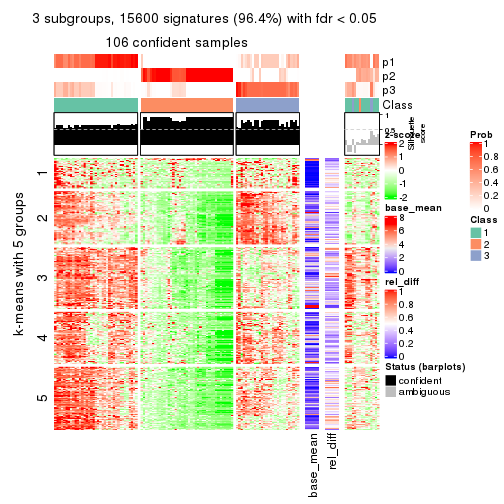</p>

</div>
<div id='tab-CV-pam-get-signatures-3'>
<pre><code class="r">get_signatures(res, k = 4)
</code></pre>

<p></p>

</div>
<div id='tab-CV-pam-get-signatures-4'>
<pre><code class="r">get_signatures(res, k = 5)
</code></pre>

<p></p>

</div>
<div id='tab-CV-pam-get-signatures-5'>
<pre><code class="r">get_signatures(res, k = 6)
</code></pre>

<p></p>

</div>
</div>


Signature heatmaps where rows are not scaled:


<script>
$( function() {
	$( '#tabs-CV-pam-get-signatures-no-scale' ).tabs();
} );
</script>
<div id='tabs-CV-pam-get-signatures-no-scale'>
<ul>
<li><a href='#tab-CV-pam-get-signatures-no-scale-1'>k = 2</a></li>
<li><a href='#tab-CV-pam-get-signatures-no-scale-2'>k = 3</a></li>
<li><a href='#tab-CV-pam-get-signatures-no-scale-3'>k = 4</a></li>
<li><a href='#tab-CV-pam-get-signatures-no-scale-4'>k = 5</a></li>
<li><a href='#tab-CV-pam-get-signatures-no-scale-5'>k = 6</a></li>
</ul>
<div id='tab-CV-pam-get-signatures-no-scale-1'>
<pre><code class="r">get_signatures(res, k = 2, scale_rows = FALSE)
</code></pre>

<p></p>

</div>
<div id='tab-CV-pam-get-signatures-no-scale-2'>
<pre><code class="r">get_signatures(res, k = 3, scale_rows = FALSE)
</code></pre>

<p>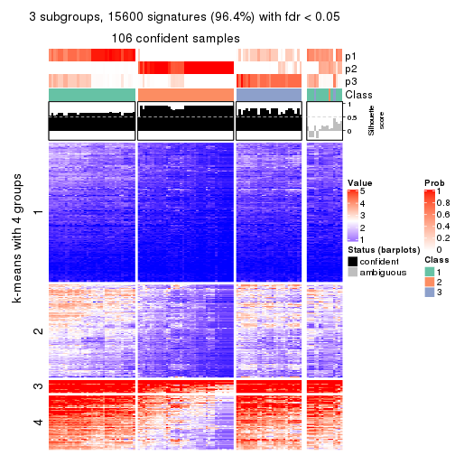</p>

</div>
<div id='tab-CV-pam-get-signatures-no-scale-3'>
<pre><code class="r">get_signatures(res, k = 4, scale_rows = FALSE)
</code></pre>

<p></p>

</div>
<div id='tab-CV-pam-get-signatures-no-scale-4'>
<pre><code class="r">get_signatures(res, k = 5, scale_rows = FALSE)
</code></pre>

<p></p>

</div>
<div id='tab-CV-pam-get-signatures-no-scale-5'>
<pre><code class="r">get_signatures(res, k = 6, scale_rows = FALSE)
</code></pre>

<p></p>

</div>
</div>


Compare the overlap of signatures from different k:

```r
compare_signatures(res)
```


`get_signature()` returns a data frame invisibly. TO get the list of signatures, the function
call should be assigned to a variable explicitly. In following code, if `plot` argument is set
to `FALSE`, no heatmap is plotted while only the differential analysis is performed.

```r
# code only for demonstration
tb = get_signature(res, k = ..., plot = FALSE)
```

An example of the output of `tb` is:

```
#>   which_row         fdr    mean_1    mean_2 scaled_mean_1 scaled_mean_2 km
#> 1        38 0.042760348  8.373488  9.131774    -0.5533452     0.5164555  1
#> 2        40 0.018707592  7.106213  8.469186    -0.6173731     0.5762149  1
#> 3        55 0.019134737 10.221463 11.207825    -0.6159697     0.5749050  1
#> 4        59 0.006059896  5.921854  7.869574    -0.6899429     0.6439467  1
#> 5        60 0.018055526  8.928898 10.211722    -0.6204761     0.5791110  1
#> 6        98 0.009384629 15.714769 14.887706     0.6635654    -0.6193277  2
...
```

The columns in `tb` are:

1. `which_row`: row indices corresponding to the input matrix.
2. `fdr`: FDR for the differential test. 
3. `mean_x`: The mean value in group x.
4. `scaled_mean_x`: The mean value in group x after rows are scaled.
5. `km`: Row groups if k-means clustering is applied to rows.


UMAP plot which shows how samples are separated.


<script>
$( function() {
	$( '#tabs-CV-pam-dimension-reduction' ).tabs();
} );
</script>
<div id='tabs-CV-pam-dimension-reduction'>
<ul>
<li><a href='#tab-CV-pam-dimension-reduction-1'>k = 2</a></li>
<li><a href='#tab-CV-pam-dimension-reduction-2'>k = 3</a></li>
<li><a href='#tab-CV-pam-dimension-reduction-3'>k = 4</a></li>
<li><a href='#tab-CV-pam-dimension-reduction-4'>k = 5</a></li>
<li><a href='#tab-CV-pam-dimension-reduction-5'>k = 6</a></li>
</ul>
<div id='tab-CV-pam-dimension-reduction-1'>
<pre><code class="r">dimension_reduction(res, k = 2, method = &quot;UMAP&quot;)
</code></pre>

<p></p>

</div>
<div id='tab-CV-pam-dimension-reduction-2'>
<pre><code class="r">dimension_reduction(res, k = 3, method = &quot;UMAP&quot;)
</code></pre>

<p></p>

</div>
<div id='tab-CV-pam-dimension-reduction-3'>
<pre><code class="r">dimension_reduction(res, k = 4, method = &quot;UMAP&quot;)
</code></pre>

<p></p>

</div>
<div id='tab-CV-pam-dimension-reduction-4'>
<pre><code class="r">dimension_reduction(res, k = 5, method = &quot;UMAP&quot;)
</code></pre>

<p></p>

</div>
<div id='tab-CV-pam-dimension-reduction-5'>
<pre><code class="r">dimension_reduction(res, k = 6, method = &quot;UMAP&quot;)
</code></pre>

<p></p>

</div>
</div>


Following heatmap shows how subgroups are split when increasing `k`:

```r
collect_classes(res)
```


If matrix rows can be associated to genes, consider to use `functional_enrichment(res,
...)` to perform function enrichment for the signature genes. See [this vignette](http://bioconductor.org/packages/devel/bioc/vignettes/cola/inst/doc/functional_enrichment.html) for more detailed explanations.


 

---------------------------------------------------


### CV:mclust*


The object with results only for a single top-value method and a single partition method 
can be extracted as:

```r
res = res_list["CV", "mclust"]
# you can also extract it by
# res = res_list["CV:mclust"]
```

A summary of `res` and all the functions that can be applied to it:

```r
res
```

```
#> A 'ConsensusPartition' object with k = 2, 3, 4, 5, 6.
#>   On a matrix with 16187 rows and 121 columns.
#>   Top rows (1000, 2000, 3000, 4000, 5000) are extracted by 'CV' method.
#>   Subgroups are detected by 'mclust' method.
#>   Performed in total 1250 partitions by row resampling.
#>   Best k for subgroups seems to be 2.
#> 
#> Following methods can be applied to this 'ConsensusPartition' object:
#>  [1] "cola_report"             "collect_classes"         "collect_plots"          
#>  [4] "collect_stats"           "colnames"                "compare_signatures"     
#>  [7] "consensus_heatmap"       "dimension_reduction"     "functional_enrichment"  
#> [10] "get_anno_col"            "get_anno"                "get_classes"            
#> [13] "get_consensus"           "get_matrix"              "get_membership"         
#> [16] "get_param"               "get_signatures"          "get_stats"              
#> [19] "is_best_k"               "is_stable_k"             "membership_heatmap"     
#> [22] "ncol"                    "nrow"                    "plot_ecdf"              
#> [25] "rownames"                "select_partition_number" "show"                   
#> [28] "suggest_best_k"          "test_to_known_factors"
```

`collect_plots()` function collects all the plots made from `res` for all `k` (number of partitions)
into one single page to provide an easy and fast comparison between different `k`.

```r
collect_plots(res)
```


The plots are:

- The first row: a plot of the ECDF (empirical cumulative distribution
  function) curves of the consensus matrix for each `k` and the heatmap of
  predicted classes for each `k`.
- The second row: heatmaps of the consensus matrix for each `k`.
- The third row: heatmaps of the membership matrix for each `k`.
- The fouth row: heatmaps of the signatures for each `k`.

All the plots in panels can be made by individual functions and they are
plotted later in this section.

`select_partition_number()` produces several plots showing different
statistics for choosing "optimized" `k`. There are following statistics:

- ECDF curves of the consensus matrix for each `k`;
- 1-PAC. [The PAC
  score](https://en.wikipedia.org/wiki/Consensus_clustering#Over-interpretation_potential_of_consensus_clustering)
  measures the proportion of the ambiguous subgrouping.
- Mean silhouette score.
- Concordance. The mean probability of fiting the consensus class ids in all
  partitions.
- Area increased. Denote $A_k$ as the area under the ECDF curve for current
  `k`, the area increased is defined as $A_k - A_{k-1}$.
- Rand index. The percent of pairs of samples that are both in a same cluster
  or both are not in a same cluster in the partition of k and k-1.
- Jaccard index. The ratio of pairs of samples are both in a same cluster in
  the partition of k and k-1 and the pairs of samples are both in a same
  cluster in the partition k or k-1.

The detailed explanations of these statistics can be found in [the _cola_
vignette](http://bioconductor.org/packages/devel/bioc/vignettes/cola/inst/doc/cola.html#toc_13).

Generally speaking, lower PAC score, higher mean silhouette score or higher
concordance corresponds to better partition. Rand index and Jaccard index
measure how similar the current partition is compared to partition with `k-1`.
If they are too similar, we won't accept `k` is better than `k-1`.

```r
select_partition_number(res)
```


The numeric values for all these statistics can be obtained by `get_stats()`.

```r
get_stats(res)
```

```
#>   k 1-PAC mean_silhouette concordance area_increased  Rand Jaccard
#> 2 2 0.947           0.951       0.979         0.3197 0.690   0.690
#> 3 3 0.741           0.836       0.918         0.9758 0.657   0.507
#> 4 4 0.653           0.566       0.778         0.1434 0.901   0.728
#> 5 5 0.619           0.578       0.717         0.0498 0.829   0.503
#> 6 6 0.650           0.556       0.733         0.0431 0.880   0.562
```

`suggest_best_k()` suggests the best $k$ based on these statistics. The rules are as follows:

- All $k$ with Jaccard index larger than 0.95 are removed because increasing
  $k$ does not provide enough extra information. If all $k$ are removed, it is
  marked as no subgroup is detected.
- For all $k$ with 1-PAC score larger than 0.9, the maximal $k$ is taken as
  the best $k$, and other $k$ are marked as optional $k$.
- If it does not fit the second rule. The $k$ with the maximal vote of the
  highest 1-PAC score, highest mean silhouette, and highest concordance is
  taken as the best $k$.

```r
suggest_best_k(res)
```

```
#> [1] 2
```


Following shows the table of the partitions (You need to click the **show/hide
code output** link to see it). The membership matrix (columns with name `p*`)
is inferred by
[`clue::cl_consensus()`](https://www.rdocumentation.org/link/cl_consensus?package=clue)
function with the `SE` method. Basically the value in the membership matrix
represents the probability to belong to a certain group. The finall class
label for an item is determined with the group with highest probability it
belongs to.

In `get_classes()` function, the entropy is calculated from the membership
matrix and the silhouette score is calculated from the consensus matrix.


<script>
$( function() {
	$( '#tabs-CV-mclust-get-classes' ).tabs();
} );
</script>
<div id='tabs-CV-mclust-get-classes'>
<ul>
<li><a href='#tab-CV-mclust-get-classes-1'>k = 2</a></li>
<li><a href='#tab-CV-mclust-get-classes-2'>k = 3</a></li>
<li><a href='#tab-CV-mclust-get-classes-3'>k = 4</a></li>
<li><a href='#tab-CV-mclust-get-classes-4'>k = 5</a></li>
<li><a href='#tab-CV-mclust-get-classes-5'>k = 6</a></li>
</ul>

<div id='tab-CV-mclust-get-classes-1'>
<p><a id='tab-CV-mclust-get-classes-1-a' style='color:#0366d6' href='#'>show/hide code output</a></p>
<pre><code class="r">cbind(get_classes(res, k = 2), get_membership(res, k = 2))
</code></pre>

<pre><code>#&gt;           class entropy silhouette    p1    p2
#&gt; DRR006374     1   0.595      0.825 0.856 0.144
#&gt; DRR006375     1   0.000      0.981 1.000 0.000
#&gt; DRR006376     1   0.000      0.981 1.000 0.000
#&gt; DRR006377     1   0.000      0.981 1.000 0.000
#&gt; DRR006378     2   0.000      0.960 0.000 1.000
#&gt; DRR006379     1   0.000      0.981 1.000 0.000
#&gt; DRR006380     1   0.000      0.981 1.000 0.000
#&gt; DRR006381     1   0.000      0.981 1.000 0.000
#&gt; DRR006382     1   0.000      0.981 1.000 0.000
#&gt; DRR006383     1   0.000      0.981 1.000 0.000
#&gt; DRR006384     2   0.855      0.643 0.280 0.720
#&gt; DRR006385     1   0.000      0.981 1.000 0.000
#&gt; DRR006386     2   0.000      0.960 0.000 1.000
#&gt; DRR006387     1   0.000      0.981 1.000 0.000
#&gt; DRR006388     1   0.443      0.894 0.908 0.092
#&gt; DRR006389     1   0.443      0.894 0.908 0.092
#&gt; DRR006390     2   0.000      0.960 0.000 1.000
#&gt; DRR006391     2   0.000      0.960 0.000 1.000
#&gt; DRR006392     1   0.000      0.981 1.000 0.000
#&gt; DRR006393     1   0.000      0.981 1.000 0.000
#&gt; DRR006394     2   0.000      0.960 0.000 1.000
#&gt; DRR006395     1   0.000      0.981 1.000 0.000
#&gt; DRR006396     1   0.000      0.981 1.000 0.000
#&gt; DRR006397     1   0.416      0.902 0.916 0.084
#&gt; DRR006398     1   0.416      0.902 0.916 0.084
#&gt; DRR006399     1   0.000      0.981 1.000 0.000
#&gt; DRR006400     1   0.000      0.981 1.000 0.000
#&gt; DRR006401     2   0.000      0.960 0.000 1.000
#&gt; DRR006402     2   0.000      0.960 0.000 1.000
#&gt; DRR006403     1   0.000      0.981 1.000 0.000
#&gt; DRR006404     1   0.000      0.981 1.000 0.000
#&gt; DRR006405     1   0.000      0.981 1.000 0.000
#&gt; DRR006406     1   0.000      0.981 1.000 0.000
#&gt; DRR006407     1   0.118      0.968 0.984 0.016
#&gt; DRR006408     1   0.224      0.951 0.964 0.036
#&gt; DRR006409     1   0.000      0.981 1.000 0.000
#&gt; DRR006410     1   0.000      0.981 1.000 0.000
#&gt; DRR006411     1   0.000      0.981 1.000 0.000
#&gt; DRR006412     2   0.000      0.960 0.000 1.000
#&gt; DRR006413     1   0.000      0.981 1.000 0.000
#&gt; DRR006414     1   0.000      0.981 1.000 0.000
#&gt; DRR006415     1   0.000      0.981 1.000 0.000
#&gt; DRR006416     1   0.416      0.902 0.916 0.084
#&gt; DRR006417     1   0.000      0.981 1.000 0.000
#&gt; DRR006418     1   0.000      0.981 1.000 0.000
#&gt; DRR006419     1   0.000      0.981 1.000 0.000
#&gt; DRR006420     1   0.000      0.981 1.000 0.000
#&gt; DRR006421     1   0.000      0.981 1.000 0.000
#&gt; DRR006422     1   0.000      0.981 1.000 0.000
#&gt; DRR006423     2   0.000      0.960 0.000 1.000
#&gt; DRR006424     1   0.000      0.981 1.000 0.000
#&gt; DRR006425     1   0.943      0.438 0.640 0.360
#&gt; DRR006426     1   0.000      0.981 1.000 0.000
#&gt; DRR006427     2   0.000      0.960 0.000 1.000
#&gt; DRR006428     1   0.000      0.981 1.000 0.000
#&gt; DRR006429     1   0.260      0.942 0.956 0.044
#&gt; DRR006430     1   0.000      0.981 1.000 0.000
#&gt; DRR006431     1   0.000      0.981 1.000 0.000
#&gt; DRR006432     1   0.000      0.981 1.000 0.000
#&gt; DRR006433     1   0.000      0.981 1.000 0.000
#&gt; DRR006434     1   0.605      0.819 0.852 0.148
#&gt; DRR006435     2   0.000      0.960 0.000 1.000
#&gt; DRR006436     2   0.000      0.960 0.000 1.000
#&gt; DRR006437     1   0.000      0.981 1.000 0.000
#&gt; DRR006438     1   0.000      0.981 1.000 0.000
#&gt; DRR006439     1   0.000      0.981 1.000 0.000
#&gt; DRR006440     1   0.000      0.981 1.000 0.000
#&gt; DRR006441     2   0.000      0.960 0.000 1.000
#&gt; DRR006442     1   0.000      0.981 1.000 0.000
#&gt; DRR006443     1   0.000      0.981 1.000 0.000
#&gt; DRR006444     2   0.000      0.960 0.000 1.000
#&gt; DRR006445     1   0.000      0.981 1.000 0.000
#&gt; DRR006446     2   0.000      0.960 0.000 1.000
#&gt; DRR006447     1   0.000      0.981 1.000 0.000
#&gt; DRR006448     1   0.000      0.981 1.000 0.000
#&gt; DRR006449     1   0.000      0.981 1.000 0.000
#&gt; DRR006450     1   0.000      0.981 1.000 0.000
#&gt; DRR006451     1   0.000      0.981 1.000 0.000
#&gt; DRR006452     1   0.000      0.981 1.000 0.000
#&gt; DRR006453     1   0.000      0.981 1.000 0.000
#&gt; DRR006454     2   0.802      0.703 0.244 0.756
#&gt; DRR006455     1   0.494      0.871 0.892 0.108
#&gt; DRR006456     1   0.000      0.981 1.000 0.000
#&gt; DRR006457     1   0.000      0.981 1.000 0.000
#&gt; DRR006458     1   0.000      0.981 1.000 0.000
#&gt; DRR006459     1   0.000      0.981 1.000 0.000
#&gt; DRR006460     2   0.730      0.764 0.204 0.796
#&gt; DRR006461     1   0.000      0.981 1.000 0.000
#&gt; DRR006462     1   0.000      0.981 1.000 0.000
#&gt; DRR006463     1   0.000      0.981 1.000 0.000
#&gt; DRR006464     1   0.991      0.191 0.556 0.444
#&gt; DRR006465     1   0.000      0.981 1.000 0.000
#&gt; DRR006466     1   0.000      0.981 1.000 0.000
#&gt; DRR006467     1   0.000      0.981 1.000 0.000
#&gt; DRR006468     2   0.000      0.960 0.000 1.000
#&gt; DRR006469     2   0.000      0.960 0.000 1.000
#&gt; DRR006470     1   0.000      0.981 1.000 0.000
#&gt; DRR006471     1   0.000      0.981 1.000 0.000
#&gt; DRR006472     1   0.000      0.981 1.000 0.000
#&gt; DRR006473     2   0.000      0.960 0.000 1.000
#&gt; DRR006474     2   0.574      0.844 0.136 0.864
#&gt; DRR006475     1   0.000      0.981 1.000 0.000
#&gt; DRR006476     1   0.000      0.981 1.000 0.000
#&gt; DRR006477     1   0.000      0.981 1.000 0.000
#&gt; DRR006478     1   0.000      0.981 1.000 0.000
#&gt; DRR006479     1   0.000      0.981 1.000 0.000
#&gt; DRR006480     1   0.000      0.981 1.000 0.000
#&gt; DRR006481     1   0.000      0.981 1.000 0.000
#&gt; DRR006482     1   0.000      0.981 1.000 0.000
#&gt; DRR006483     1   0.000      0.981 1.000 0.000
#&gt; DRR006484     1   0.000      0.981 1.000 0.000
#&gt; DRR006485     1   0.000      0.981 1.000 0.000
#&gt; DRR006486     1   0.000      0.981 1.000 0.000
#&gt; DRR006487     1   0.000      0.981 1.000 0.000
#&gt; DRR006488     2   0.000      0.960 0.000 1.000
#&gt; DRR006489     1   0.000      0.981 1.000 0.000
#&gt; DRR006490     1   0.000      0.981 1.000 0.000
#&gt; DRR006491     1   0.000      0.981 1.000 0.000
#&gt; DRR006492     1   0.000      0.981 1.000 0.000
#&gt; DRR006493     1   0.000      0.981 1.000 0.000
#&gt; DRR006494     1   0.000      0.981 1.000 0.000
</code></pre>

<script>
$('#tab-CV-mclust-get-classes-1-a').parent().next().next().hide();
$('#tab-CV-mclust-get-classes-1-a').click(function(){
  $('#tab-CV-mclust-get-classes-1-a').parent().next().next().toggle();
  return(false);
});
</script>
</div>

<div id='tab-CV-mclust-get-classes-2'>
<p><a id='tab-CV-mclust-get-classes-2-a' style='color:#0366d6' href='#'>show/hide code output</a></p>
<pre><code class="r">cbind(get_classes(res, k = 3), get_membership(res, k = 3))
</code></pre>

<pre><code>#&gt;           class entropy silhouette    p1    p2    p3
#&gt; DRR006374     3  0.4748      0.801 0.024 0.144 0.832
#&gt; DRR006375     1  0.0892      0.879 0.980 0.000 0.020
#&gt; DRR006376     1  0.0592      0.879 0.988 0.000 0.012
#&gt; DRR006377     1  0.0592      0.879 0.988 0.000 0.012
#&gt; DRR006378     2  0.0237      0.952 0.004 0.996 0.000
#&gt; DRR006379     1  0.0592      0.879 0.988 0.000 0.012
#&gt; DRR006380     3  0.7176      0.617 0.068 0.248 0.684
#&gt; DRR006381     1  0.0747      0.873 0.984 0.000 0.016
#&gt; DRR006382     3  0.0892      0.932 0.020 0.000 0.980
#&gt; DRR006383     3  0.0000      0.927 0.000 0.000 1.000
#&gt; DRR006384     2  0.4473      0.771 0.008 0.828 0.164
#&gt; DRR006385     1  0.0424      0.874 0.992 0.000 0.008
#&gt; DRR006386     2  0.0000      0.953 0.000 1.000 0.000
#&gt; DRR006387     1  0.0592      0.879 0.988 0.000 0.012
#&gt; DRR006388     1  0.0592      0.879 0.988 0.000 0.012
#&gt; DRR006389     1  0.0592      0.879 0.988 0.000 0.012
#&gt; DRR006390     2  0.0000      0.953 0.000 1.000 0.000
#&gt; DRR006391     2  0.0000      0.953 0.000 1.000 0.000
#&gt; DRR006392     1  0.0892      0.879 0.980 0.000 0.020
#&gt; DRR006393     1  0.0592      0.879 0.988 0.000 0.012
#&gt; DRR006394     2  0.0237      0.952 0.004 0.996 0.000
#&gt; DRR006395     1  0.4654      0.752 0.792 0.000 0.208
#&gt; DRR006396     1  0.0892      0.879 0.980 0.000 0.020
#&gt; DRR006397     1  0.0592      0.879 0.988 0.000 0.012
#&gt; DRR006398     1  0.0592      0.879 0.988 0.000 0.012
#&gt; DRR006399     1  0.0592      0.879 0.988 0.000 0.012
#&gt; DRR006400     1  0.0592      0.879 0.988 0.000 0.012
#&gt; DRR006401     2  0.0000      0.953 0.000 1.000 0.000
#&gt; DRR006402     2  0.0000      0.953 0.000 1.000 0.000
#&gt; DRR006403     1  0.0892      0.878 0.980 0.000 0.020
#&gt; DRR006404     1  0.0592      0.879 0.988 0.000 0.012
#&gt; DRR006405     1  0.0592      0.879 0.988 0.000 0.012
#&gt; DRR006406     1  0.0592      0.879 0.988 0.000 0.012
#&gt; DRR006407     1  0.1337      0.875 0.972 0.012 0.016
#&gt; DRR006408     1  0.6161      0.607 0.708 0.272 0.020
#&gt; DRR006409     3  0.5138      0.619 0.252 0.000 0.748
#&gt; DRR006410     1  0.0592      0.879 0.988 0.000 0.012
#&gt; DRR006411     1  0.5810      0.576 0.664 0.000 0.336
#&gt; DRR006412     2  0.0000      0.953 0.000 1.000 0.000
#&gt; DRR006413     1  0.5905      0.548 0.648 0.000 0.352
#&gt; DRR006414     3  0.0000      0.927 0.000 0.000 1.000
#&gt; DRR006415     3  0.0000      0.927 0.000 0.000 1.000
#&gt; DRR006416     1  0.0592      0.879 0.988 0.000 0.012
#&gt; DRR006417     3  0.1289      0.927 0.032 0.000 0.968
#&gt; DRR006418     1  0.4121      0.778 0.832 0.000 0.168
#&gt; DRR006419     3  0.1289      0.927 0.032 0.000 0.968
#&gt; DRR006420     3  0.0892      0.932 0.020 0.000 0.980
#&gt; DRR006421     3  0.0892      0.932 0.020 0.000 0.980
#&gt; DRR006422     1  0.0592      0.879 0.988 0.000 0.012
#&gt; DRR006423     2  0.0237      0.952 0.004 0.996 0.000
#&gt; DRR006424     1  0.0424      0.874 0.992 0.000 0.008
#&gt; DRR006425     2  0.3207      0.873 0.084 0.904 0.012
#&gt; DRR006426     1  0.5948      0.551 0.640 0.000 0.360
#&gt; DRR006427     2  0.0000      0.953 0.000 1.000 0.000
#&gt; DRR006428     3  0.0000      0.927 0.000 0.000 1.000
#&gt; DRR006429     2  0.9355      0.313 0.252 0.516 0.232
#&gt; DRR006430     1  0.0892      0.879 0.980 0.000 0.020
#&gt; DRR006431     1  0.0892      0.879 0.980 0.000 0.020
#&gt; DRR006432     1  0.5968      0.523 0.636 0.000 0.364
#&gt; DRR006433     3  0.0892      0.932 0.020 0.000 0.980
#&gt; DRR006434     3  0.1620      0.925 0.024 0.012 0.964
#&gt; DRR006435     2  0.0000      0.953 0.000 1.000 0.000
#&gt; DRR006436     2  0.0000      0.953 0.000 1.000 0.000
#&gt; DRR006437     1  0.5363      0.664 0.724 0.000 0.276
#&gt; DRR006438     3  0.0892      0.932 0.020 0.000 0.980
#&gt; DRR006439     3  0.0892      0.932 0.020 0.000 0.980
#&gt; DRR006440     3  0.0892      0.932 0.020 0.000 0.980
#&gt; DRR006441     2  0.0237      0.952 0.004 0.996 0.000
#&gt; DRR006442     3  0.0000      0.927 0.000 0.000 1.000
#&gt; DRR006443     3  0.0892      0.932 0.020 0.000 0.980
#&gt; DRR006444     2  0.0000      0.953 0.000 1.000 0.000
#&gt; DRR006445     1  0.0424      0.877 0.992 0.000 0.008
#&gt; DRR006446     2  0.0000      0.953 0.000 1.000 0.000
#&gt; DRR006447     1  0.3752      0.796 0.856 0.000 0.144
#&gt; DRR006448     1  0.0592      0.879 0.988 0.000 0.012
#&gt; DRR006449     1  0.0892      0.879 0.980 0.000 0.020
#&gt; DRR006450     1  0.4702      0.736 0.788 0.000 0.212
#&gt; DRR006451     1  0.0592      0.879 0.988 0.000 0.012
#&gt; DRR006452     1  0.0424      0.874 0.992 0.000 0.008
#&gt; DRR006453     1  0.0592      0.879 0.988 0.000 0.012
#&gt; DRR006454     2  0.3888      0.868 0.048 0.888 0.064
#&gt; DRR006455     3  0.7104      0.439 0.032 0.360 0.608
#&gt; DRR006456     3  0.0000      0.927 0.000 0.000 1.000
#&gt; DRR006457     3  0.0000      0.927 0.000 0.000 1.000
#&gt; DRR006458     1  0.5785      0.602 0.668 0.000 0.332
#&gt; DRR006459     1  0.5968      0.547 0.636 0.000 0.364
#&gt; DRR006460     2  0.3965      0.818 0.008 0.860 0.132
#&gt; DRR006461     3  0.0892      0.932 0.020 0.000 0.980
#&gt; DRR006462     1  0.2711      0.844 0.912 0.000 0.088
#&gt; DRR006463     3  0.0892      0.932 0.020 0.000 0.980
#&gt; DRR006464     1  0.6735      0.336 0.564 0.424 0.012
#&gt; DRR006465     1  0.0592      0.879 0.988 0.000 0.012
#&gt; DRR006466     3  0.0892      0.932 0.020 0.000 0.980
#&gt; DRR006467     1  0.5905      0.548 0.648 0.000 0.352
#&gt; DRR006468     2  0.0000      0.953 0.000 1.000 0.000
#&gt; DRR006469     2  0.0237      0.952 0.004 0.996 0.000
#&gt; DRR006470     3  0.1529      0.924 0.040 0.000 0.960
#&gt; DRR006471     1  0.5905      0.548 0.648 0.000 0.352
#&gt; DRR006472     3  0.0892      0.932 0.020 0.000 0.980
#&gt; DRR006473     2  0.0237      0.952 0.004 0.996 0.000
#&gt; DRR006474     2  0.1525      0.929 0.004 0.964 0.032
#&gt; DRR006475     1  0.6126      0.468 0.600 0.000 0.400
#&gt; DRR006476     3  0.7175      0.266 0.376 0.032 0.592
#&gt; DRR006477     3  0.0892      0.932 0.020 0.000 0.980
#&gt; DRR006478     1  0.0592      0.879 0.988 0.000 0.012
#&gt; DRR006479     3  0.0892      0.932 0.020 0.000 0.980
#&gt; DRR006480     3  0.6111      0.238 0.396 0.000 0.604
#&gt; DRR006481     3  0.0000      0.927 0.000 0.000 1.000
#&gt; DRR006482     1  0.5835      0.589 0.660 0.000 0.340
#&gt; DRR006483     1  0.5560      0.647 0.700 0.000 0.300
#&gt; DRR006484     3  0.0000      0.927 0.000 0.000 1.000
#&gt; DRR006485     3  0.0892      0.932 0.020 0.000 0.980
#&gt; DRR006486     3  0.1529      0.924 0.040 0.000 0.960
#&gt; DRR006487     3  0.0000      0.927 0.000 0.000 1.000
#&gt; DRR006488     2  0.0000      0.953 0.000 1.000 0.000
#&gt; DRR006489     1  0.0424      0.874 0.992 0.000 0.008
#&gt; DRR006490     3  0.0000      0.927 0.000 0.000 1.000
#&gt; DRR006491     3  0.0000      0.927 0.000 0.000 1.000
#&gt; DRR006492     3  0.0892      0.932 0.020 0.000 0.980
#&gt; DRR006493     3  0.0000      0.927 0.000 0.000 1.000
#&gt; DRR006494     3  0.4702      0.695 0.212 0.000 0.788
</code></pre>

<script>
$('#tab-CV-mclust-get-classes-2-a').parent().next().next().hide();
$('#tab-CV-mclust-get-classes-2-a').click(function(){
  $('#tab-CV-mclust-get-classes-2-a').parent().next().next().toggle();
  return(false);
});
</script>
</div>

<div id='tab-CV-mclust-get-classes-3'>
<p><a id='tab-CV-mclust-get-classes-3-a' style='color:#0366d6' href='#'>show/hide code output</a></p>
<pre><code class="r">cbind(get_classes(res, k = 4), get_membership(res, k = 4))
</code></pre>

<pre><code>#&gt;           class entropy silhouette    p1    p2    p3    p4
#&gt; DRR006374     3  0.6042     0.3697 0.052 0.368 0.580 0.000
#&gt; DRR006375     4  0.4134     0.4206 0.260 0.000 0.000 0.740
#&gt; DRR006376     4  0.3873     0.5191 0.228 0.000 0.000 0.772
#&gt; DRR006377     4  0.6200     0.5178 0.444 0.000 0.052 0.504
#&gt; DRR006378     2  0.1389     0.9529 0.000 0.952 0.048 0.000
#&gt; DRR006379     4  0.3873     0.5191 0.228 0.000 0.000 0.772
#&gt; DRR006380     3  0.6209     0.1072 0.052 0.456 0.492 0.000
#&gt; DRR006381     4  0.4356     0.3908 0.292 0.000 0.000 0.708
#&gt; DRR006382     3  0.5136     0.6350 0.048 0.224 0.728 0.000
#&gt; DRR006383     3  0.0000     0.7897 0.000 0.000 1.000 0.000
#&gt; DRR006384     2  0.3991     0.8601 0.048 0.832 0.120 0.000
#&gt; DRR006385     1  0.4999    -0.5298 0.508 0.000 0.000 0.492
#&gt; DRR006386     2  0.0000     0.9499 0.000 1.000 0.000 0.000
#&gt; DRR006387     4  0.3837     0.5203 0.224 0.000 0.000 0.776
#&gt; DRR006388     4  0.5277     0.5464 0.460 0.008 0.000 0.532
#&gt; DRR006389     4  0.5277     0.5464 0.460 0.008 0.000 0.532
#&gt; DRR006390     2  0.0000     0.9499 0.000 1.000 0.000 0.000
#&gt; DRR006391     2  0.0000     0.9499 0.000 1.000 0.000 0.000
#&gt; DRR006392     4  0.4134     0.4206 0.260 0.000 0.000 0.740
#&gt; DRR006393     4  0.4948     0.5547 0.440 0.000 0.000 0.560
#&gt; DRR006394     2  0.1389     0.9529 0.000 0.952 0.048 0.000
#&gt; DRR006395     1  0.6327    -0.4404 0.496 0.000 0.060 0.444
#&gt; DRR006396     4  0.4996     0.5057 0.484 0.000 0.000 0.516
#&gt; DRR006397     4  0.5277     0.5464 0.460 0.008 0.000 0.532
#&gt; DRR006398     4  0.5277     0.5464 0.460 0.008 0.000 0.532
#&gt; DRR006399     4  0.3837     0.5203 0.224 0.000 0.000 0.776
#&gt; DRR006400     4  0.3837     0.5203 0.224 0.000 0.000 0.776
#&gt; DRR006401     2  0.0895     0.9541 0.004 0.976 0.020 0.000
#&gt; DRR006402     2  0.1004     0.9544 0.004 0.972 0.024 0.000
#&gt; DRR006403     4  0.4164     0.5059 0.264 0.000 0.000 0.736
#&gt; DRR006404     4  0.3873     0.5191 0.228 0.000 0.000 0.772
#&gt; DRR006405     4  0.3907     0.5213 0.232 0.000 0.000 0.768
#&gt; DRR006406     4  0.3907     0.5213 0.232 0.000 0.000 0.768
#&gt; DRR006407     4  0.8896     0.1871 0.260 0.232 0.068 0.440
#&gt; DRR006408     4  0.9098     0.0589 0.228 0.344 0.072 0.356
#&gt; DRR006409     3  0.2775     0.7553 0.084 0.000 0.896 0.020
#&gt; DRR006410     4  0.3837     0.5203 0.224 0.000 0.000 0.776
#&gt; DRR006411     1  0.5072     0.3677 0.740 0.208 0.052 0.000
#&gt; DRR006412     2  0.0592     0.9532 0.000 0.984 0.016 0.000
#&gt; DRR006413     1  0.5170     0.4022 0.724 0.000 0.048 0.228
#&gt; DRR006414     3  0.1302     0.7815 0.044 0.000 0.956 0.000
#&gt; DRR006415     3  0.1557     0.7799 0.056 0.000 0.944 0.000
#&gt; DRR006416     4  0.5281     0.5433 0.464 0.008 0.000 0.528
#&gt; DRR006417     3  0.4999     0.2895 0.492 0.000 0.508 0.000
#&gt; DRR006418     1  0.2089     0.4323 0.932 0.000 0.048 0.020
#&gt; DRR006419     3  0.4999     0.2895 0.492 0.000 0.508 0.000
#&gt; DRR006420     3  0.1302     0.7815 0.044 0.000 0.956 0.000
#&gt; DRR006421     3  0.1635     0.7741 0.044 0.008 0.948 0.000
#&gt; DRR006422     4  0.4967     0.5520 0.452 0.000 0.000 0.548
#&gt; DRR006423     2  0.1389     0.9529 0.000 0.952 0.048 0.000
#&gt; DRR006424     4  0.4277     0.4074 0.280 0.000 0.000 0.720
#&gt; DRR006425     2  0.4694     0.8550 0.044 0.824 0.048 0.084
#&gt; DRR006426     1  0.7109    -0.3298 0.520 0.000 0.144 0.336
#&gt; DRR006427     2  0.0000     0.9499 0.000 1.000 0.000 0.000
#&gt; DRR006428     3  0.2011     0.7704 0.080 0.000 0.920 0.000
#&gt; DRR006429     2  0.4024     0.8996 0.048 0.856 0.072 0.024
#&gt; DRR006430     4  0.4164     0.4170 0.264 0.000 0.000 0.736
#&gt; DRR006431     4  0.4193     0.4124 0.268 0.000 0.000 0.732
#&gt; DRR006432     1  0.1389     0.4460 0.952 0.000 0.048 0.000
#&gt; DRR006433     3  0.1452     0.7840 0.008 0.036 0.956 0.000
#&gt; DRR006434     3  0.5136     0.6350 0.048 0.224 0.728 0.000
#&gt; DRR006435     2  0.0000     0.9499 0.000 1.000 0.000 0.000
#&gt; DRR006436     2  0.0000     0.9499 0.000 1.000 0.000 0.000
#&gt; DRR006437     1  0.1854     0.4394 0.940 0.000 0.048 0.012
#&gt; DRR006438     3  0.2011     0.7704 0.080 0.000 0.920 0.000
#&gt; DRR006439     3  0.1716     0.7759 0.064 0.000 0.936 0.000
#&gt; DRR006440     3  0.5988     0.6685 0.100 0.224 0.676 0.000
#&gt; DRR006441     2  0.1389     0.9529 0.000 0.952 0.048 0.000
#&gt; DRR006442     3  0.0188     0.7898 0.004 0.000 0.996 0.000
#&gt; DRR006443     3  0.5136     0.6350 0.048 0.224 0.728 0.000
#&gt; DRR006444     2  0.0000     0.9499 0.000 1.000 0.000 0.000
#&gt; DRR006445     4  0.4977     0.5477 0.460 0.000 0.000 0.540
#&gt; DRR006446     2  0.1302     0.9534 0.000 0.956 0.044 0.000
#&gt; DRR006447     1  0.1489     0.4439 0.952 0.000 0.044 0.004
#&gt; DRR006448     4  0.3873     0.5191 0.228 0.000 0.000 0.772
#&gt; DRR006449     1  0.5000    -0.5336 0.504 0.000 0.000 0.496
#&gt; DRR006450     1  0.1389     0.4460 0.952 0.000 0.048 0.000
#&gt; DRR006451     4  0.4955     0.5539 0.444 0.000 0.000 0.556
#&gt; DRR006452     4  0.4356     0.4158 0.292 0.000 0.000 0.708
#&gt; DRR006453     4  0.4972     0.5487 0.456 0.000 0.000 0.544
#&gt; DRR006454     2  0.3487     0.9172 0.040 0.880 0.064 0.016
#&gt; DRR006455     1  0.6211    -0.2588 0.488 0.460 0.052 0.000
#&gt; DRR006456     3  0.0000     0.7897 0.000 0.000 1.000 0.000
#&gt; DRR006457     3  0.0000     0.7897 0.000 0.000 1.000 0.000
#&gt; DRR006458     4  0.5623     0.2842 0.292 0.000 0.048 0.660
#&gt; DRR006459     4  0.5839     0.2640 0.292 0.000 0.060 0.648
#&gt; DRR006460     2  0.3485     0.9083 0.048 0.872 0.076 0.004
#&gt; DRR006461     3  0.5136     0.6350 0.048 0.224 0.728 0.000
#&gt; DRR006462     1  0.5408    -0.4002 0.576 0.000 0.016 0.408
#&gt; DRR006463     3  0.5136     0.6350 0.048 0.224 0.728 0.000
#&gt; DRR006464     2  0.2089     0.9443 0.020 0.932 0.048 0.000
#&gt; DRR006465     4  0.4948     0.5547 0.440 0.000 0.000 0.560
#&gt; DRR006466     3  0.5136     0.6350 0.048 0.224 0.728 0.000
#&gt; DRR006467     1  0.5170     0.4022 0.724 0.000 0.048 0.228
#&gt; DRR006468     2  0.0000     0.9499 0.000 1.000 0.000 0.000
#&gt; DRR006469     2  0.1389     0.9529 0.000 0.952 0.048 0.000
#&gt; DRR006470     3  0.5000     0.2816 0.496 0.000 0.504 0.000
#&gt; DRR006471     1  0.5170     0.4022 0.724 0.000 0.048 0.228
#&gt; DRR006472     3  0.2011     0.7532 0.080 0.000 0.920 0.000
#&gt; DRR006473     2  0.1722     0.9507 0.008 0.944 0.048 0.000
#&gt; DRR006474     2  0.3081     0.9198 0.048 0.888 0.064 0.000
#&gt; DRR006475     4  0.7905    -0.1616 0.312 0.000 0.320 0.368
#&gt; DRR006476     3  0.6563     0.1144 0.056 0.448 0.488 0.008
#&gt; DRR006477     3  0.0524     0.7905 0.004 0.008 0.988 0.000
#&gt; DRR006478     4  0.4967     0.5511 0.452 0.000 0.000 0.548
#&gt; DRR006479     3  0.2011     0.7704 0.080 0.000 0.920 0.000
#&gt; DRR006480     3  0.7659     0.1167 0.296 0.000 0.460 0.244
#&gt; DRR006481     3  0.0188     0.7896 0.004 0.000 0.996 0.000
#&gt; DRR006482     1  0.6332    -0.3886 0.532 0.000 0.064 0.404
#&gt; DRR006483     4  0.5848     0.2111 0.336 0.000 0.048 0.616
#&gt; DRR006484     3  0.0000     0.7897 0.000 0.000 1.000 0.000
#&gt; DRR006485     3  0.5136     0.6350 0.048 0.224 0.728 0.000
#&gt; DRR006486     3  0.7117     0.4924 0.208 0.000 0.564 0.228
#&gt; DRR006487     3  0.1637     0.7787 0.060 0.000 0.940 0.000
#&gt; DRR006488     2  0.0000     0.9499 0.000 1.000 0.000 0.000
#&gt; DRR006489     4  0.4277     0.4074 0.280 0.000 0.000 0.720
#&gt; DRR006490     3  0.2011     0.7704 0.080 0.000 0.920 0.000
#&gt; DRR006491     3  0.0000     0.7897 0.000 0.000 1.000 0.000
#&gt; DRR006492     3  0.1978     0.7726 0.068 0.000 0.928 0.004
#&gt; DRR006493     3  0.0000     0.7897 0.000 0.000 1.000 0.000
#&gt; DRR006494     3  0.5910     0.5954 0.084 0.000 0.672 0.244
</code></pre>

<script>
$('#tab-CV-mclust-get-classes-3-a').parent().next().next().hide();
$('#tab-CV-mclust-get-classes-3-a').click(function(){
  $('#tab-CV-mclust-get-classes-3-a').parent().next().next().toggle();
  return(false);
});
</script>
</div>

<div id='tab-CV-mclust-get-classes-4'>
<p><a id='tab-CV-mclust-get-classes-4-a' style='color:#0366d6' href='#'>show/hide code output</a></p>
<pre><code class="r">cbind(get_classes(res, k = 5), get_membership(res, k = 5))
</code></pre>

<pre><code>#&gt;           class entropy silhouette    p1    p2    p3    p4 p5
#&gt; DRR006374     2  0.4822     0.1555 0.000 0.564 0.416 0.004 NA
#&gt; DRR006375     4  0.5650    -0.2730 0.456 0.000 0.000 0.468 NA
#&gt; DRR006376     4  0.2377     0.6928 0.000 0.000 0.000 0.872 NA
#&gt; DRR006377     4  0.2248     0.7086 0.088 0.000 0.012 0.900 NA
#&gt; DRR006378     2  0.0727     0.8486 0.004 0.980 0.012 0.004 NA
#&gt; DRR006379     4  0.1908     0.7037 0.000 0.000 0.000 0.908 NA
#&gt; DRR006380     2  0.4747     0.2743 0.012 0.604 0.376 0.008 NA
#&gt; DRR006381     1  0.5831     0.2768 0.496 0.000 0.000 0.408 NA
#&gt; DRR006382     3  0.4592     0.5036 0.000 0.332 0.644 0.000 NA
#&gt; DRR006383     3  0.0000     0.8088 0.000 0.000 1.000 0.000 NA
#&gt; DRR006384     2  0.1492     0.8327 0.000 0.948 0.040 0.004 NA
#&gt; DRR006385     4  0.3995     0.6757 0.152 0.000 0.000 0.788 NA
#&gt; DRR006386     2  0.2471     0.8024 0.000 0.864 0.000 0.000 NA
#&gt; DRR006387     4  0.0162     0.7106 0.004 0.000 0.000 0.996 NA
#&gt; DRR006388     4  0.5739     0.5595 0.100 0.000 0.000 0.556 NA
#&gt; DRR006389     4  0.5739     0.5595 0.100 0.000 0.000 0.556 NA
#&gt; DRR006390     2  0.2471     0.8024 0.000 0.864 0.000 0.000 NA
#&gt; DRR006391     2  0.2471     0.8024 0.000 0.864 0.000 0.000 NA
#&gt; DRR006392     1  0.5650     0.2451 0.468 0.000 0.000 0.456 NA
#&gt; DRR006393     4  0.2628     0.7031 0.088 0.000 0.000 0.884 NA
#&gt; DRR006394     2  0.0566     0.8491 0.000 0.984 0.012 0.004 NA
#&gt; DRR006395     4  0.3463     0.6755 0.088 0.000 0.040 0.852 NA
#&gt; DRR006396     4  0.4072     0.6333 0.108 0.000 0.000 0.792 NA
#&gt; DRR006397     4  0.5696     0.5637 0.096 0.000 0.000 0.560 NA
#&gt; DRR006398     4  0.5696     0.5637 0.096 0.000 0.000 0.560 NA
#&gt; DRR006399     4  0.0000     0.7090 0.000 0.000 0.000 1.000 NA
#&gt; DRR006400     4  0.0000     0.7090 0.000 0.000 0.000 1.000 NA
#&gt; DRR006401     2  0.0854     0.8483 0.000 0.976 0.012 0.004 NA
#&gt; DRR006402     2  0.0854     0.8483 0.000 0.976 0.012 0.004 NA
#&gt; DRR006403     4  0.0451     0.7075 0.004 0.000 0.000 0.988 NA
#&gt; DRR006404     4  0.0000     0.7090 0.000 0.000 0.000 1.000 NA
#&gt; DRR006405     4  0.2674     0.6910 0.004 0.000 0.000 0.856 NA
#&gt; DRR006406     4  0.2516     0.6881 0.000 0.000 0.000 0.860 NA
#&gt; DRR006407     2  0.5588     0.2668 0.040 0.560 0.020 0.380 NA
#&gt; DRR006408     2  0.4125     0.6624 0.016 0.776 0.024 0.184 NA
#&gt; DRR006409     3  0.6726     0.1195 0.056 0.000 0.564 0.268 NA
#&gt; DRR006410     4  0.0162     0.7106 0.004 0.000 0.000 0.996 NA
#&gt; DRR006411     1  0.6454     0.2458 0.620 0.188 0.036 0.152 NA
#&gt; DRR006412     2  0.0162     0.8456 0.000 0.996 0.000 0.000 NA
#&gt; DRR006413     1  0.0798     0.4340 0.976 0.000 0.000 0.008 NA
#&gt; DRR006414     3  0.0404     0.8047 0.012 0.000 0.988 0.000 NA
#&gt; DRR006415     3  0.0794     0.8001 0.028 0.000 0.972 0.000 NA
#&gt; DRR006416     4  0.5452     0.6597 0.144 0.000 0.000 0.656 NA
#&gt; DRR006417     1  0.6530     0.0339 0.488 0.000 0.320 0.004 NA
#&gt; DRR006418     1  0.5651     0.1319 0.616 0.000 0.008 0.288 NA
#&gt; DRR006419     1  0.6552     0.0758 0.496 0.000 0.296 0.004 NA
#&gt; DRR006420     3  0.0566     0.8064 0.012 0.000 0.984 0.004 NA
#&gt; DRR006421     3  0.2169     0.7874 0.008 0.048 0.924 0.008 NA
#&gt; DRR006422     4  0.4394     0.7148 0.100 0.000 0.000 0.764 NA
#&gt; DRR006423     2  0.0566     0.8491 0.000 0.984 0.012 0.004 NA
#&gt; DRR006424     1  0.5761     0.2684 0.492 0.000 0.000 0.420 NA
#&gt; DRR006425     2  0.1016     0.8481 0.004 0.972 0.012 0.004 NA
#&gt; DRR006426     4  0.7742     0.0347 0.272 0.008 0.332 0.352 NA
#&gt; DRR006427     2  0.2471     0.8024 0.000 0.864 0.000 0.000 NA
#&gt; DRR006428     3  0.3109     0.6505 0.200 0.000 0.800 0.000 NA
#&gt; DRR006429     2  0.0833     0.8479 0.004 0.976 0.016 0.004 NA
#&gt; DRR006430     1  0.5650     0.2371 0.464 0.000 0.000 0.460 NA
#&gt; DRR006431     1  0.5650     0.2451 0.468 0.000 0.000 0.456 NA
#&gt; DRR006432     1  0.6357     0.3015 0.628 0.000 0.056 0.112 NA
#&gt; DRR006433     3  0.0671     0.8053 0.016 0.000 0.980 0.004 NA
#&gt; DRR006434     3  0.4915     0.3055 0.000 0.420 0.556 0.004 NA
#&gt; DRR006435     2  0.3752     0.7250 0.000 0.708 0.000 0.000 NA
#&gt; DRR006436     2  0.3752     0.7250 0.000 0.708 0.000 0.000 NA
#&gt; DRR006437     1  0.5774    -0.0190 0.548 0.000 0.020 0.380 NA
#&gt; DRR006438     3  0.3109     0.6505 0.200 0.000 0.800 0.000 NA
#&gt; DRR006439     3  0.0703     0.8041 0.024 0.000 0.976 0.000 NA
#&gt; DRR006440     3  0.7011     0.3293 0.208 0.332 0.444 0.004 NA
#&gt; DRR006441     2  0.0566     0.8491 0.000 0.984 0.012 0.004 NA
#&gt; DRR006442     3  0.0000     0.8088 0.000 0.000 1.000 0.000 NA
#&gt; DRR006443     3  0.4592     0.5036 0.000 0.332 0.644 0.000 NA
#&gt; DRR006444     2  0.3752     0.7250 0.000 0.708 0.000 0.000 NA
#&gt; DRR006445     4  0.4879     0.6962 0.108 0.000 0.000 0.716 NA
#&gt; DRR006446     2  0.0324     0.8482 0.000 0.992 0.004 0.004 NA
#&gt; DRR006447     1  0.5431     0.0363 0.584 0.000 0.008 0.356 NA
#&gt; DRR006448     4  0.0290     0.7059 0.000 0.000 0.000 0.992 NA
#&gt; DRR006449     4  0.3569     0.6945 0.104 0.000 0.000 0.828 NA
#&gt; DRR006450     1  0.5603     0.0354 0.572 0.000 0.008 0.356 NA
#&gt; DRR006451     4  0.4322     0.7130 0.088 0.000 0.000 0.768 NA
#&gt; DRR006452     4  0.5771    -0.1734 0.432 0.000 0.000 0.480 NA
#&gt; DRR006453     4  0.4704     0.7037 0.112 0.000 0.000 0.736 NA
#&gt; DRR006454     2  0.0727     0.8488 0.004 0.980 0.012 0.004 NA
#&gt; DRR006455     2  0.5036     0.4577 0.372 0.592 0.032 0.004 NA
#&gt; DRR006456     3  0.0000     0.8088 0.000 0.000 1.000 0.000 NA
#&gt; DRR006457     3  0.0000     0.8088 0.000 0.000 1.000 0.000 NA
#&gt; DRR006458     1  0.6229     0.3149 0.468 0.000 0.004 0.404 NA
#&gt; DRR006459     1  0.6229     0.3149 0.468 0.000 0.004 0.404 NA
#&gt; DRR006460     2  0.0854     0.8483 0.000 0.976 0.012 0.004 NA
#&gt; DRR006461     3  0.4592     0.5036 0.000 0.332 0.644 0.000 NA
#&gt; DRR006462     4  0.4823     0.5043 0.316 0.000 0.000 0.644 NA
#&gt; DRR006463     3  0.4592     0.5036 0.000 0.332 0.644 0.000 NA
#&gt; DRR006464     2  0.1200     0.8427 0.016 0.964 0.012 0.008 NA
#&gt; DRR006465     4  0.2628     0.7031 0.088 0.000 0.000 0.884 NA
#&gt; DRR006466     3  0.4742     0.5019 0.012 0.332 0.644 0.008 NA
#&gt; DRR006467     1  0.2777     0.4319 0.864 0.000 0.000 0.120 NA
#&gt; DRR006468     2  0.3752     0.7250 0.000 0.708 0.000 0.000 NA
#&gt; DRR006469     2  0.0566     0.8491 0.000 0.984 0.012 0.004 NA
#&gt; DRR006470     1  0.6516     0.1303 0.512 0.000 0.268 0.004 NA
#&gt; DRR006471     1  0.2293     0.4366 0.900 0.000 0.000 0.084 NA
#&gt; DRR006472     3  0.2151     0.7763 0.016 0.000 0.924 0.040 NA
#&gt; DRR006473     2  0.0566     0.8491 0.000 0.984 0.012 0.004 NA
#&gt; DRR006474     2  0.0854     0.8483 0.000 0.976 0.012 0.004 NA
#&gt; DRR006475     1  0.7188     0.3747 0.500 0.000 0.072 0.304 NA
#&gt; DRR006476     2  0.4805     0.3377 0.012 0.628 0.348 0.004 NA
#&gt; DRR006477     3  0.0671     0.8053 0.016 0.000 0.980 0.004 NA
#&gt; DRR006478     4  0.3146     0.7101 0.092 0.000 0.000 0.856 NA
#&gt; DRR006479     3  0.3039     0.6598 0.192 0.000 0.808 0.000 NA
#&gt; DRR006480     1  0.7586     0.3778 0.480 0.000 0.120 0.276 NA
#&gt; DRR006481     3  0.0000     0.8088 0.000 0.000 1.000 0.000 NA
#&gt; DRR006482     4  0.7291     0.2923 0.320 0.020 0.128 0.496 NA
#&gt; DRR006483     1  0.5323     0.3761 0.624 0.000 0.000 0.296 NA
#&gt; DRR006484     3  0.0000     0.8088 0.000 0.000 1.000 0.000 NA
#&gt; DRR006485     3  0.4592     0.5036 0.000 0.332 0.644 0.000 NA
#&gt; DRR006486     1  0.3718     0.3471 0.784 0.000 0.196 0.004 NA
#&gt; DRR006487     3  0.0880     0.7985 0.032 0.000 0.968 0.000 NA
#&gt; DRR006488     2  0.3752     0.7250 0.000 0.708 0.000 0.000 NA
#&gt; DRR006489     1  0.5757     0.2771 0.496 0.000 0.000 0.416 NA
#&gt; DRR006490     3  0.0880     0.7984 0.032 0.000 0.968 0.000 NA
#&gt; DRR006491     3  0.0000     0.8088 0.000 0.000 1.000 0.000 NA
#&gt; DRR006492     3  0.3077     0.6875 0.028 0.000 0.864 0.100 NA
#&gt; DRR006493     3  0.0000     0.8088 0.000 0.000 1.000 0.000 NA
#&gt; DRR006494     1  0.7762     0.3749 0.460 0.000 0.144 0.272 NA
</code></pre>

<script>
$('#tab-CV-mclust-get-classes-4-a').parent().next().next().hide();
$('#tab-CV-mclust-get-classes-4-a').click(function(){
  $('#tab-CV-mclust-get-classes-4-a').parent().next().next().toggle();
  return(false);
});
</script>
</div>

<div id='tab-CV-mclust-get-classes-5'>
<p><a id='tab-CV-mclust-get-classes-5-a' style='color:#0366d6' href='#'>show/hide code output</a></p>
<pre><code class="r">cbind(get_classes(res, k = 6), get_membership(res, k = 6))
</code></pre>

<pre><code>#&gt;           class entropy silhouette    p1    p2    p3    p4    p5    p6
#&gt; DRR006374     2  0.3050     0.6831 0.000 0.832 0.136 0.000 0.028 0.004
#&gt; DRR006375     1  0.0520     0.5977 0.984 0.000 0.000 0.008 0.008 0.000
#&gt; DRR006376     4  0.4172     0.5880 0.280 0.000 0.000 0.680 0.000 0.040
#&gt; DRR006377     4  0.5512     0.4903 0.400 0.088 0.004 0.500 0.000 0.008
#&gt; DRR006378     2  0.0632     0.8278 0.000 0.976 0.000 0.000 0.024 0.000
#&gt; DRR006379     4  0.4332     0.5859 0.316 0.000 0.000 0.644 0.000 0.040
#&gt; DRR006380     2  0.3534     0.6002 0.004 0.772 0.200 0.000 0.024 0.000
#&gt; DRR006381     1  0.2151     0.5934 0.904 0.000 0.000 0.016 0.008 0.072
#&gt; DRR006382     3  0.4861     0.4324 0.000 0.368 0.572 0.000 0.056 0.004
#&gt; DRR006383     3  0.0405     0.7672 0.000 0.004 0.988 0.000 0.008 0.000
#&gt; DRR006384     2  0.0405     0.8272 0.000 0.988 0.004 0.000 0.008 0.000
#&gt; DRR006385     1  0.5642    -0.2083 0.460 0.000 0.000 0.388 0.000 0.152
#&gt; DRR006386     5  0.3810     0.7775 0.000 0.428 0.000 0.000 0.572 0.000
#&gt; DRR006387     4  0.3930     0.5293 0.420 0.000 0.000 0.576 0.000 0.004
#&gt; DRR006388     4  0.4536     0.3459 0.044 0.000 0.000 0.752 0.080 0.124
#&gt; DRR006389     4  0.4536     0.3459 0.044 0.000 0.000 0.752 0.080 0.124
#&gt; DRR006390     5  0.3817     0.7740 0.000 0.432 0.000 0.000 0.568 0.000
#&gt; DRR006391     5  0.3817     0.7740 0.000 0.432 0.000 0.000 0.568 0.000
#&gt; DRR006392     1  0.0508     0.5964 0.984 0.000 0.000 0.004 0.012 0.000
#&gt; DRR006393     1  0.4672    -0.3127 0.548 0.000 0.000 0.416 0.012 0.024
#&gt; DRR006394     2  0.0632     0.8278 0.000 0.976 0.000 0.000 0.024 0.000
#&gt; DRR006395     1  0.5101    -0.2749 0.556 0.000 0.036 0.384 0.004 0.020
#&gt; DRR006396     1  0.3941     0.1804 0.724 0.000 0.000 0.244 0.008 0.024
#&gt; DRR006397     4  0.4536     0.3459 0.044 0.000 0.000 0.752 0.080 0.124
#&gt; DRR006398     4  0.4536     0.3459 0.044 0.000 0.000 0.752 0.080 0.124
#&gt; DRR006399     4  0.4609     0.5305 0.420 0.000 0.000 0.540 0.000 0.040
#&gt; DRR006400     4  0.4609     0.5305 0.420 0.000 0.000 0.540 0.000 0.040
#&gt; DRR006401     2  0.1007     0.8082 0.000 0.956 0.000 0.000 0.044 0.000
#&gt; DRR006402     2  0.1007     0.8082 0.000 0.956 0.000 0.000 0.044 0.000
#&gt; DRR006403     4  0.4609     0.5305 0.420 0.000 0.000 0.540 0.000 0.040
#&gt; DRR006404     4  0.4609     0.5305 0.420 0.000 0.000 0.540 0.000 0.040
#&gt; DRR006405     4  0.3778     0.5948 0.288 0.000 0.000 0.696 0.000 0.016
#&gt; DRR006406     4  0.3990     0.5923 0.284 0.000 0.000 0.688 0.000 0.028
#&gt; DRR006407     2  0.4407     0.4011 0.232 0.692 0.000 0.076 0.000 0.000
#&gt; DRR006408     2  0.2867     0.6461 0.112 0.848 0.000 0.040 0.000 0.000
#&gt; DRR006409     1  0.4777     0.1340 0.504 0.000 0.460 0.004 0.020 0.012
#&gt; DRR006410     4  0.4238     0.4921 0.444 0.000 0.000 0.540 0.000 0.016
#&gt; DRR006411     6  0.5565     0.7161 0.092 0.056 0.040 0.108 0.000 0.704
#&gt; DRR006412     2  0.3244     0.3545 0.000 0.732 0.000 0.000 0.268 0.000
#&gt; DRR006413     6  0.4067     0.4025 0.444 0.000 0.000 0.008 0.000 0.548
#&gt; DRR006414     3  0.0622     0.7654 0.000 0.000 0.980 0.000 0.008 0.012
#&gt; DRR006415     3  0.1320     0.7595 0.000 0.000 0.948 0.000 0.016 0.036
#&gt; DRR006416     4  0.5543     0.4105 0.292 0.000 0.000 0.576 0.016 0.116
#&gt; DRR006417     6  0.4433     0.6201 0.028 0.000 0.212 0.000 0.040 0.720
#&gt; DRR006418     6  0.3908     0.7132 0.100 0.000 0.000 0.132 0.000 0.768
#&gt; DRR006419     6  0.4405     0.6245 0.028 0.000 0.208 0.000 0.040 0.724
#&gt; DRR006420     3  0.2732     0.7274 0.024 0.008 0.880 0.000 0.012 0.076
#&gt; DRR006421     3  0.4557     0.6509 0.012 0.212 0.720 0.004 0.044 0.008
#&gt; DRR006422     4  0.4804     0.4699 0.416 0.012 0.000 0.540 0.000 0.032
#&gt; DRR006423     2  0.0632     0.8278 0.000 0.976 0.000 0.000 0.024 0.000
#&gt; DRR006424     1  0.1850     0.5982 0.924 0.000 0.000 0.016 0.008 0.052
#&gt; DRR006425     2  0.0458     0.8299 0.000 0.984 0.000 0.000 0.016 0.000
#&gt; DRR006426     6  0.8919     0.2663 0.116 0.136 0.200 0.236 0.012 0.300
#&gt; DRR006427     5  0.3817     0.7740 0.000 0.432 0.000 0.000 0.568 0.000
#&gt; DRR006428     3  0.3046     0.6015 0.000 0.000 0.800 0.000 0.012 0.188
#&gt; DRR006429     2  0.0717     0.8215 0.000 0.976 0.008 0.000 0.016 0.000
#&gt; DRR006430     1  0.0146     0.5991 0.996 0.000 0.004 0.000 0.000 0.000
#&gt; DRR006431     1  0.0653     0.5960 0.980 0.000 0.004 0.004 0.012 0.000
#&gt; DRR006432     6  0.4534     0.7279 0.080 0.000 0.052 0.112 0.000 0.756
#&gt; DRR006433     3  0.3250     0.7297 0.068 0.036 0.860 0.004 0.024 0.008
#&gt; DRR006434     2  0.4159     0.5095 0.000 0.704 0.252 0.000 0.040 0.004
#&gt; DRR006435     5  0.3023     0.8568 0.000 0.232 0.000 0.000 0.768 0.000
#&gt; DRR006436     5  0.3023     0.8568 0.000 0.232 0.000 0.000 0.768 0.000
#&gt; DRR006437     6  0.4183     0.6964 0.108 0.000 0.000 0.152 0.000 0.740
#&gt; DRR006438     3  0.3470     0.5342 0.000 0.000 0.740 0.000 0.012 0.248
#&gt; DRR006439     3  0.1434     0.7617 0.020 0.000 0.948 0.000 0.008 0.024
#&gt; DRR006440     3  0.6575     0.2374 0.000 0.356 0.376 0.000 0.028 0.240
#&gt; DRR006441     2  0.0547     0.8294 0.000 0.980 0.000 0.000 0.020 0.000
#&gt; DRR006442     3  0.0748     0.7670 0.000 0.004 0.976 0.000 0.016 0.004
#&gt; DRR006443     3  0.4930     0.4115 0.000 0.376 0.560 0.000 0.060 0.004
#&gt; DRR006444     5  0.3023     0.8568 0.000 0.232 0.000 0.000 0.768 0.000
#&gt; DRR006445     4  0.4727     0.4402 0.368 0.000 0.000 0.576 0.000 0.056
#&gt; DRR006446     2  0.0937     0.8142 0.000 0.960 0.000 0.000 0.040 0.000
#&gt; DRR006447     6  0.3901     0.7138 0.096 0.000 0.000 0.136 0.000 0.768
#&gt; DRR006448     4  0.4609     0.5305 0.420 0.000 0.000 0.540 0.000 0.040
#&gt; DRR006449     1  0.4624    -0.2879 0.528 0.000 0.000 0.432 0.000 0.040
#&gt; DRR006450     6  0.3985     0.7117 0.100 0.000 0.000 0.140 0.000 0.760
#&gt; DRR006451     4  0.3927     0.5556 0.344 0.000 0.000 0.644 0.000 0.012
#&gt; DRR006452     1  0.2822     0.5724 0.868 0.000 0.000 0.056 0.008 0.068
#&gt; DRR006453     4  0.4682     0.4383 0.396 0.000 0.000 0.556 0.000 0.048
#&gt; DRR006454     2  0.0436     0.8276 0.004 0.988 0.004 0.000 0.004 0.000
#&gt; DRR006455     2  0.4658     0.2840 0.000 0.580 0.040 0.000 0.004 0.376
#&gt; DRR006456     3  0.0748     0.7670 0.000 0.004 0.976 0.000 0.016 0.004
#&gt; DRR006457     3  0.0405     0.7672 0.000 0.004 0.988 0.000 0.008 0.000
#&gt; DRR006458     1  0.0982     0.5942 0.968 0.000 0.004 0.004 0.020 0.004
#&gt; DRR006459     1  0.0982     0.5942 0.968 0.000 0.004 0.004 0.020 0.004
#&gt; DRR006460     2  0.0146     0.8286 0.000 0.996 0.000 0.000 0.004 0.000
#&gt; DRR006461     3  0.4912     0.4287 0.000 0.368 0.568 0.000 0.060 0.004
#&gt; DRR006462     1  0.5648     0.1388 0.536 0.000 0.000 0.224 0.000 0.240
#&gt; DRR006463     3  0.4697     0.4441 0.000 0.368 0.584 0.000 0.044 0.004
#&gt; DRR006464     2  0.0725     0.8261 0.012 0.976 0.000 0.000 0.012 0.000
#&gt; DRR006465     1  0.4348    -0.3112 0.560 0.000 0.000 0.416 0.000 0.024
#&gt; DRR006466     3  0.5082     0.3819 0.012 0.396 0.544 0.000 0.044 0.004
#&gt; DRR006467     1  0.3993    -0.1041 0.592 0.000 0.000 0.008 0.000 0.400
#&gt; DRR006468     5  0.3023     0.8568 0.000 0.232 0.000 0.000 0.768 0.000
#&gt; DRR006469     2  0.0547     0.8294 0.000 0.980 0.000 0.000 0.020 0.000
#&gt; DRR006470     6  0.4487     0.6324 0.028 0.000 0.200 0.004 0.040 0.728
#&gt; DRR006471     1  0.4051    -0.2029 0.560 0.000 0.000 0.008 0.000 0.432
#&gt; DRR006472     3  0.3643     0.7232 0.060 0.032 0.848 0.016 0.024 0.020
#&gt; DRR006473     2  0.0547     0.8294 0.000 0.980 0.000 0.000 0.020 0.000
#&gt; DRR006474     2  0.0000     0.8282 0.000 1.000 0.000 0.000 0.000 0.000
#&gt; DRR006475     1  0.2395     0.5938 0.896 0.000 0.012 0.004 0.016 0.072
#&gt; DRR006476     2  0.3328     0.6905 0.008 0.832 0.112 0.000 0.044 0.004
#&gt; DRR006477     3  0.2663     0.7338 0.068 0.008 0.888 0.004 0.024 0.008
#&gt; DRR006478     1  0.4389    -0.3619 0.528 0.000 0.000 0.448 0.000 0.024
#&gt; DRR006479     3  0.3298     0.5549 0.000 0.000 0.756 0.000 0.008 0.236
#&gt; DRR006480     1  0.2259     0.5874 0.908 0.000 0.040 0.000 0.020 0.032
#&gt; DRR006481     3  0.0291     0.7678 0.000 0.004 0.992 0.000 0.004 0.000
#&gt; DRR006482     4  0.8726    -0.0887 0.208 0.200 0.076 0.268 0.004 0.244
#&gt; DRR006483     1  0.2445     0.5669 0.868 0.000 0.000 0.004 0.008 0.120
#&gt; DRR006484     3  0.0748     0.7670 0.000 0.004 0.976 0.000 0.016 0.004
#&gt; DRR006485     3  0.4753     0.4385 0.000 0.368 0.580 0.000 0.048 0.004
#&gt; DRR006486     6  0.5123     0.4320 0.408 0.000 0.084 0.000 0.000 0.508
#&gt; DRR006487     3  0.2060     0.7400 0.000 0.000 0.900 0.000 0.016 0.084
#&gt; DRR006488     5  0.3023     0.8568 0.000 0.232 0.000 0.000 0.768 0.000
#&gt; DRR006489     1  0.1577     0.6018 0.940 0.000 0.000 0.016 0.008 0.036
#&gt; DRR006490     3  0.1320     0.7554 0.000 0.000 0.948 0.000 0.016 0.036
#&gt; DRR006491     3  0.0748     0.7670 0.000 0.004 0.976 0.000 0.016 0.004
#&gt; DRR006492     3  0.3620     0.5458 0.200 0.000 0.772 0.004 0.016 0.008
#&gt; DRR006493     3  0.0748     0.7670 0.000 0.004 0.976 0.000 0.016 0.004
#&gt; DRR006494     1  0.2182     0.5640 0.900 0.000 0.076 0.000 0.020 0.004
</code></pre>

<script>
$('#tab-CV-mclust-get-classes-5-a').parent().next().next().hide();
$('#tab-CV-mclust-get-classes-5-a').click(function(){
  $('#tab-CV-mclust-get-classes-5-a').parent().next().next().toggle();
  return(false);
});
</script>
</div>
</div>

Heatmaps for the consensus matrix. It visualizes the probability of two
samples to be in a same group.


<script>
$( function() {
	$( '#tabs-CV-mclust-consensus-heatmap' ).tabs();
} );
</script>
<div id='tabs-CV-mclust-consensus-heatmap'>
<ul>
<li><a href='#tab-CV-mclust-consensus-heatmap-1'>k = 2</a></li>
<li><a href='#tab-CV-mclust-consensus-heatmap-2'>k = 3</a></li>
<li><a href='#tab-CV-mclust-consensus-heatmap-3'>k = 4</a></li>
<li><a href='#tab-CV-mclust-consensus-heatmap-4'>k = 5</a></li>
<li><a href='#tab-CV-mclust-consensus-heatmap-5'>k = 6</a></li>
</ul>
<div id='tab-CV-mclust-consensus-heatmap-1'>
<pre><code class="r">consensus_heatmap(res, k = 2)
</code></pre>

<p></p>

</div>
<div id='tab-CV-mclust-consensus-heatmap-2'>
<pre><code class="r">consensus_heatmap(res, k = 3)
</code></pre>

<p></p>

</div>
<div id='tab-CV-mclust-consensus-heatmap-3'>
<pre><code class="r">consensus_heatmap(res, k = 4)
</code></pre>

<p>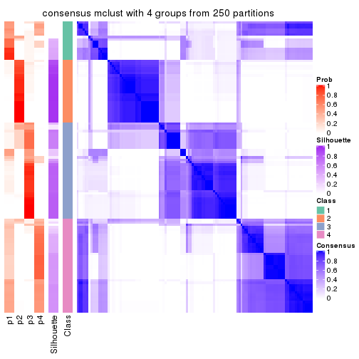</p>

</div>
<div id='tab-CV-mclust-consensus-heatmap-4'>
<pre><code class="r">consensus_heatmap(res, k = 5)
</code></pre>

<p></p>

</div>
<div id='tab-CV-mclust-consensus-heatmap-5'>
<pre><code class="r">consensus_heatmap(res, k = 6)
</code></pre>

<p></p>

</div>
</div>

Heatmaps for the membership of samples in all partitions to see how consistent they are:


<script>
$( function() {
	$( '#tabs-CV-mclust-membership-heatmap' ).tabs();
} );
</script>
<div id='tabs-CV-mclust-membership-heatmap'>
<ul>
<li><a href='#tab-CV-mclust-membership-heatmap-1'>k = 2</a></li>
<li><a href='#tab-CV-mclust-membership-heatmap-2'>k = 3</a></li>
<li><a href='#tab-CV-mclust-membership-heatmap-3'>k = 4</a></li>
<li><a href='#tab-CV-mclust-membership-heatmap-4'>k = 5</a></li>
<li><a href='#tab-CV-mclust-membership-heatmap-5'>k = 6</a></li>
</ul>
<div id='tab-CV-mclust-membership-heatmap-1'>
<pre><code class="r">membership_heatmap(res, k = 2)
</code></pre>

<p>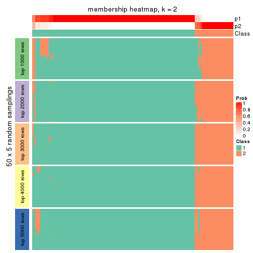</p>

</div>
<div id='tab-CV-mclust-membership-heatmap-2'>
<pre><code class="r">membership_heatmap(res, k = 3)
</code></pre>

<p></p>

</div>
<div id='tab-CV-mclust-membership-heatmap-3'>
<pre><code class="r">membership_heatmap(res, k = 4)
</code></pre>

<p></p>

</div>
<div id='tab-CV-mclust-membership-heatmap-4'>
<pre><code class="r">membership_heatmap(res, k = 5)
</code></pre>

<p></p>

</div>
<div id='tab-CV-mclust-membership-heatmap-5'>
<pre><code class="r">membership_heatmap(res, k = 6)
</code></pre>

<p></p>

</div>
</div>

As soon as we have had the classes for columns, we can look for signatures
which are significantly different between classes which can be candidate marks
for certain classes. Following are the heatmaps for signatures.


Signature heatmaps where rows are scaled:


<script>
$( function() {
	$( '#tabs-CV-mclust-get-signatures' ).tabs();
} );
</script>
<div id='tabs-CV-mclust-get-signatures'>
<ul>
<li><a href='#tab-CV-mclust-get-signatures-1'>k = 2</a></li>
<li><a href='#tab-CV-mclust-get-signatures-2'>k = 3</a></li>
<li><a href='#tab-CV-mclust-get-signatures-3'>k = 4</a></li>
<li><a href='#tab-CV-mclust-get-signatures-4'>k = 5</a></li>
<li><a href='#tab-CV-mclust-get-signatures-5'>k = 6</a></li>
</ul>
<div id='tab-CV-mclust-get-signatures-1'>
<pre><code class="r">get_signatures(res, k = 2)
</code></pre>

<p></p>

</div>
<div id='tab-CV-mclust-get-signatures-2'>
<pre><code class="r">get_signatures(res, k = 3)
</code></pre>

<p></p>

</div>
<div id='tab-CV-mclust-get-signatures-3'>
<pre><code class="r">get_signatures(res, k = 4)
</code></pre>

<p></p>

</div>
<div id='tab-CV-mclust-get-signatures-4'>
<pre><code class="r">get_signatures(res, k = 5)
</code></pre>

<p></p>

</div>
<div id='tab-CV-mclust-get-signatures-5'>
<pre><code class="r">get_signatures(res, k = 6)
</code></pre>

<p></p>

</div>
</div>


Signature heatmaps where rows are not scaled:


<script>
$( function() {
	$( '#tabs-CV-mclust-get-signatures-no-scale' ).tabs();
} );
</script>
<div id='tabs-CV-mclust-get-signatures-no-scale'>
<ul>
<li><a href='#tab-CV-mclust-get-signatures-no-scale-1'>k = 2</a></li>
<li><a href='#tab-CV-mclust-get-signatures-no-scale-2'>k = 3</a></li>
<li><a href='#tab-CV-mclust-get-signatures-no-scale-3'>k = 4</a></li>
<li><a href='#tab-CV-mclust-get-signatures-no-scale-4'>k = 5</a></li>
<li><a href='#tab-CV-mclust-get-signatures-no-scale-5'>k = 6</a></li>
</ul>
<div id='tab-CV-mclust-get-signatures-no-scale-1'>
<pre><code class="r">get_signatures(res, k = 2, scale_rows = FALSE)
</code></pre>

<p></p>

</div>
<div id='tab-CV-mclust-get-signatures-no-scale-2'>
<pre><code class="r">get_signatures(res, k = 3, scale_rows = FALSE)
</code></pre>

<p></p>

</div>
<div id='tab-CV-mclust-get-signatures-no-scale-3'>
<pre><code class="r">get_signatures(res, k = 4, scale_rows = FALSE)
</code></pre>

<p></p>

</div>
<div id='tab-CV-mclust-get-signatures-no-scale-4'>
<pre><code class="r">get_signatures(res, k = 5, scale_rows = FALSE)
</code></pre>

<p></p>

</div>
<div id='tab-CV-mclust-get-signatures-no-scale-5'>
<pre><code class="r">get_signatures(res, k = 6, scale_rows = FALSE)
</code></pre>

<p></p>

</div>
</div>


Compare the overlap of signatures from different k:

```r
compare_signatures(res)
```


`get_signature()` returns a data frame invisibly. TO get the list of signatures, the function
call should be assigned to a variable explicitly. In following code, if `plot` argument is set
to `FALSE`, no heatmap is plotted while only the differential analysis is performed.

```r
# code only for demonstration
tb = get_signature(res, k = ..., plot = FALSE)
```

An example of the output of `tb` is:

```
#>   which_row         fdr    mean_1    mean_2 scaled_mean_1 scaled_mean_2 km
#> 1        38 0.042760348  8.373488  9.131774    -0.5533452     0.5164555  1
#> 2        40 0.018707592  7.106213  8.469186    -0.6173731     0.5762149  1
#> 3        55 0.019134737 10.221463 11.207825    -0.6159697     0.5749050  1
#> 4        59 0.006059896  5.921854  7.869574    -0.6899429     0.6439467  1
#> 5        60 0.018055526  8.928898 10.211722    -0.6204761     0.5791110  1
#> 6        98 0.009384629 15.714769 14.887706     0.6635654    -0.6193277  2
...
```

The columns in `tb` are:

1. `which_row`: row indices corresponding to the input matrix.
2. `fdr`: FDR for the differential test. 
3. `mean_x`: The mean value in group x.
4. `scaled_mean_x`: The mean value in group x after rows are scaled.
5. `km`: Row groups if k-means clustering is applied to rows.


UMAP plot which shows how samples are separated.


<script>
$( function() {
	$( '#tabs-CV-mclust-dimension-reduction' ).tabs();
} );
</script>
<div id='tabs-CV-mclust-dimension-reduction'>
<ul>
<li><a href='#tab-CV-mclust-dimension-reduction-1'>k = 2</a></li>
<li><a href='#tab-CV-mclust-dimension-reduction-2'>k = 3</a></li>
<li><a href='#tab-CV-mclust-dimension-reduction-3'>k = 4</a></li>
<li><a href='#tab-CV-mclust-dimension-reduction-4'>k = 5</a></li>
<li><a href='#tab-CV-mclust-dimension-reduction-5'>k = 6</a></li>
</ul>
<div id='tab-CV-mclust-dimension-reduction-1'>
<pre><code class="r">dimension_reduction(res, k = 2, method = &quot;UMAP&quot;)
</code></pre>

<p></p>

</div>
<div id='tab-CV-mclust-dimension-reduction-2'>
<pre><code class="r">dimension_reduction(res, k = 3, method = &quot;UMAP&quot;)
</code></pre>

<p></p>

</div>
<div id='tab-CV-mclust-dimension-reduction-3'>
<pre><code class="r">dimension_reduction(res, k = 4, method = &quot;UMAP&quot;)
</code></pre>

<p></p>

</div>
<div id='tab-CV-mclust-dimension-reduction-4'>
<pre><code class="r">dimension_reduction(res, k = 5, method = &quot;UMAP&quot;)
</code></pre>

<p></p>

</div>
<div id='tab-CV-mclust-dimension-reduction-5'>
<pre><code class="r">dimension_reduction(res, k = 6, method = &quot;UMAP&quot;)
</code></pre>

<p></p>

</div>
</div>


Following heatmap shows how subgroups are split when increasing `k`:

```r
collect_classes(res)
```


If matrix rows can be associated to genes, consider to use `functional_enrichment(res,
...)` to perform function enrichment for the signature genes. See [this vignette](http://bioconductor.org/packages/devel/bioc/vignettes/cola/inst/doc/functional_enrichment.html) for more detailed explanations.


 

---------------------------------------------------


### CV:NMF**


The object with results only for a single top-value method and a single partition method 
can be extracted as:

```r
res = res_list["CV", "NMF"]
# you can also extract it by
# res = res_list["CV:NMF"]
```

A summary of `res` and all the functions that can be applied to it:

```r
res
```

```
#> A 'ConsensusPartition' object with k = 2, 3, 4, 5, 6.
#>   On a matrix with 16187 rows and 121 columns.
#>   Top rows (1000, 2000, 3000, 4000, 5000) are extracted by 'CV' method.
#>   Subgroups are detected by 'NMF' method.
#>   Performed in total 1250 partitions by row resampling.
#>   Best k for subgroups seems to be 2.
#> 
#> Following methods can be applied to this 'ConsensusPartition' object:
#>  [1] "cola_report"             "collect_classes"         "collect_plots"          
#>  [4] "collect_stats"           "colnames"                "compare_signatures"     
#>  [7] "consensus_heatmap"       "dimension_reduction"     "functional_enrichment"  
#> [10] "get_anno_col"            "get_anno"                "get_classes"            
#> [13] "get_consensus"           "get_matrix"              "get_membership"         
#> [16] "get_param"               "get_signatures"          "get_stats"              
#> [19] "is_best_k"               "is_stable_k"             "membership_heatmap"     
#> [22] "ncol"                    "nrow"                    "plot_ecdf"              
#> [25] "rownames"                "select_partition_number" "show"                   
#> [28] "suggest_best_k"          "test_to_known_factors"
```

`collect_plots()` function collects all the plots made from `res` for all `k` (number of partitions)
into one single page to provide an easy and fast comparison between different `k`.

```r
collect_plots(res)
```


The plots are:

- The first row: a plot of the ECDF (empirical cumulative distribution
  function) curves of the consensus matrix for each `k` and the heatmap of
  predicted classes for each `k`.
- The second row: heatmaps of the consensus matrix for each `k`.
- The third row: heatmaps of the membership matrix for each `k`.
- The fouth row: heatmaps of the signatures for each `k`.

All the plots in panels can be made by individual functions and they are
plotted later in this section.

`select_partition_number()` produces several plots showing different
statistics for choosing "optimized" `k`. There are following statistics:

- ECDF curves of the consensus matrix for each `k`;
- 1-PAC. [The PAC
  score](https://en.wikipedia.org/wiki/Consensus_clustering#Over-interpretation_potential_of_consensus_clustering)
  measures the proportion of the ambiguous subgrouping.
- Mean silhouette score.
- Concordance. The mean probability of fiting the consensus class ids in all
  partitions.
- Area increased. Denote $A_k$ as the area under the ECDF curve for current
  `k`, the area increased is defined as $A_k - A_{k-1}$.
- Rand index. The percent of pairs of samples that are both in a same cluster
  or both are not in a same cluster in the partition of k and k-1.
- Jaccard index. The ratio of pairs of samples are both in a same cluster in
  the partition of k and k-1 and the pairs of samples are both in a same
  cluster in the partition k or k-1.

The detailed explanations of these statistics can be found in [the _cola_
vignette](http://bioconductor.org/packages/devel/bioc/vignettes/cola/inst/doc/cola.html#toc_13).

Generally speaking, lower PAC score, higher mean silhouette score or higher
concordance corresponds to better partition. Rand index and Jaccard index
measure how similar the current partition is compared to partition with `k-1`.
If they are too similar, we won't accept `k` is better than `k-1`.

```r
select_partition_number(res)
```


The numeric values for all these statistics can be obtained by `get_stats()`.

```r
get_stats(res)
```

```
#>   k 1-PAC mean_silhouette concordance area_increased  Rand Jaccard
#> 2 2 1.000           0.983       0.992         0.4875 0.514   0.514
#> 3 3 0.488           0.552       0.722         0.3431 0.757   0.553
#> 4 4 0.527           0.551       0.753         0.1336 0.735   0.380
#> 5 5 0.661           0.614       0.788         0.0690 0.817   0.438
#> 6 6 0.779           0.741       0.865         0.0463 0.877   0.506
```

`suggest_best_k()` suggests the best $k$ based on these statistics. The rules are as follows:

- All $k$ with Jaccard index larger than 0.95 are removed because increasing
  $k$ does not provide enough extra information. If all $k$ are removed, it is
  marked as no subgroup is detected.
- For all $k$ with 1-PAC score larger than 0.9, the maximal $k$ is taken as
  the best $k$, and other $k$ are marked as optional $k$.
- If it does not fit the second rule. The $k$ with the maximal vote of the
  highest 1-PAC score, highest mean silhouette, and highest concordance is
  taken as the best $k$.

```r
suggest_best_k(res)
```

```
#> [1] 2
```


Following shows the table of the partitions (You need to click the **show/hide
code output** link to see it). The membership matrix (columns with name `p*`)
is inferred by
[`clue::cl_consensus()`](https://www.rdocumentation.org/link/cl_consensus?package=clue)
function with the `SE` method. Basically the value in the membership matrix
represents the probability to belong to a certain group. The finall class
label for an item is determined with the group with highest probability it
belongs to.

In `get_classes()` function, the entropy is calculated from the membership
matrix and the silhouette score is calculated from the consensus matrix.


<script>
$( function() {
	$( '#tabs-CV-NMF-get-classes' ).tabs();
} );
</script>
<div id='tabs-CV-NMF-get-classes'>
<ul>
<li><a href='#tab-CV-NMF-get-classes-1'>k = 2</a></li>
<li><a href='#tab-CV-NMF-get-classes-2'>k = 3</a></li>
<li><a href='#tab-CV-NMF-get-classes-3'>k = 4</a></li>
<li><a href='#tab-CV-NMF-get-classes-4'>k = 5</a></li>
<li><a href='#tab-CV-NMF-get-classes-5'>k = 6</a></li>
</ul>

<div id='tab-CV-NMF-get-classes-1'>
<p><a id='tab-CV-NMF-get-classes-1-a' style='color:#0366d6' href='#'>show/hide code output</a></p>
<pre><code class="r">cbind(get_classes(res, k = 2), get_membership(res, k = 2))
</code></pre>

<pre><code>#&gt;           class entropy silhouette    p1    p2
#&gt; DRR006374     2  0.0000      0.994 0.000 1.000
#&gt; DRR006375     1  0.0000      0.990 1.000 0.000
#&gt; DRR006376     1  0.0000      0.990 1.000 0.000
#&gt; DRR006377     1  0.0000      0.990 1.000 0.000
#&gt; DRR006378     1  0.0000      0.990 1.000 0.000
#&gt; DRR006379     1  0.0000      0.990 1.000 0.000
#&gt; DRR006380     2  0.0000      0.994 0.000 1.000
#&gt; DRR006381     1  0.0000      0.990 1.000 0.000
#&gt; DRR006382     2  0.0000      0.994 0.000 1.000
#&gt; DRR006383     2  0.0000      0.994 0.000 1.000
#&gt; DRR006384     2  0.0000      0.994 0.000 1.000
#&gt; DRR006385     1  0.0000      0.990 1.000 0.000
#&gt; DRR006386     2  0.0938      0.983 0.012 0.988
#&gt; DRR006387     1  0.0000      0.990 1.000 0.000
#&gt; DRR006388     1  0.0000      0.990 1.000 0.000
#&gt; DRR006389     1  0.0000      0.990 1.000 0.000
#&gt; DRR006390     1  0.5408      0.865 0.876 0.124
#&gt; DRR006391     1  0.6973      0.780 0.812 0.188
#&gt; DRR006392     1  0.0000      0.990 1.000 0.000
#&gt; DRR006393     1  0.0000      0.990 1.000 0.000
#&gt; DRR006394     1  0.0000      0.990 1.000 0.000
#&gt; DRR006395     1  0.0000      0.990 1.000 0.000
#&gt; DRR006396     1  0.0000      0.990 1.000 0.000
#&gt; DRR006397     1  0.0000      0.990 1.000 0.000
#&gt; DRR006398     1  0.0000      0.990 1.000 0.000
#&gt; DRR006399     1  0.0000      0.990 1.000 0.000
#&gt; DRR006400     1  0.0000      0.990 1.000 0.000
#&gt; DRR006401     1  0.0000      0.990 1.000 0.000
#&gt; DRR006402     1  0.0376      0.987 0.996 0.004
#&gt; DRR006403     1  0.0000      0.990 1.000 0.000
#&gt; DRR006404     1  0.0000      0.990 1.000 0.000
#&gt; DRR006405     1  0.0000      0.990 1.000 0.000
#&gt; DRR006406     1  0.0000      0.990 1.000 0.000
#&gt; DRR006407     1  0.0000      0.990 1.000 0.000
#&gt; DRR006408     1  0.3584      0.929 0.932 0.068
#&gt; DRR006409     1  0.0000      0.990 1.000 0.000
#&gt; DRR006410     1  0.0000      0.990 1.000 0.000
#&gt; DRR006411     1  0.0000      0.990 1.000 0.000
#&gt; DRR006412     1  0.6887      0.786 0.816 0.184
#&gt; DRR006413     1  0.0000      0.990 1.000 0.000
#&gt; DRR006414     2  0.0000      0.994 0.000 1.000
#&gt; DRR006415     2  0.0000      0.994 0.000 1.000
#&gt; DRR006416     1  0.0000      0.990 1.000 0.000
#&gt; DRR006417     2  0.0000      0.994 0.000 1.000
#&gt; DRR006418     1  0.0000      0.990 1.000 0.000
#&gt; DRR006419     2  0.0000      0.994 0.000 1.000
#&gt; DRR006420     2  0.0000      0.994 0.000 1.000
#&gt; DRR006421     2  0.0000      0.994 0.000 1.000
#&gt; DRR006422     1  0.0000      0.990 1.000 0.000
#&gt; DRR006423     2  0.3733      0.920 0.072 0.928
#&gt; DRR006424     1  0.0000      0.990 1.000 0.000
#&gt; DRR006425     1  0.0000      0.990 1.000 0.000
#&gt; DRR006426     1  0.1414      0.974 0.980 0.020
#&gt; DRR006427     2  0.0000      0.994 0.000 1.000
#&gt; DRR006428     2  0.0000      0.994 0.000 1.000
#&gt; DRR006429     1  0.2778      0.949 0.952 0.048
#&gt; DRR006430     1  0.0000      0.990 1.000 0.000
#&gt; DRR006431     1  0.0000      0.990 1.000 0.000
#&gt; DRR006432     1  0.0000      0.990 1.000 0.000
#&gt; DRR006433     2  0.0000      0.994 0.000 1.000
#&gt; DRR006434     2  0.0000      0.994 0.000 1.000
#&gt; DRR006435     2  0.0000      0.994 0.000 1.000
#&gt; DRR006436     2  0.0000      0.994 0.000 1.000
#&gt; DRR006437     1  0.0000      0.990 1.000 0.000
#&gt; DRR006438     2  0.0000      0.994 0.000 1.000
#&gt; DRR006439     2  0.0000      0.994 0.000 1.000
#&gt; DRR006440     2  0.0000      0.994 0.000 1.000
#&gt; DRR006441     1  0.1633      0.971 0.976 0.024
#&gt; DRR006442     2  0.0000      0.994 0.000 1.000
#&gt; DRR006443     2  0.0000      0.994 0.000 1.000
#&gt; DRR006444     2  0.0000      0.994 0.000 1.000
#&gt; DRR006445     1  0.0000      0.990 1.000 0.000
#&gt; DRR006446     1  0.0000      0.990 1.000 0.000
#&gt; DRR006447     1  0.0000      0.990 1.000 0.000
#&gt; DRR006448     1  0.0000      0.990 1.000 0.000
#&gt; DRR006449     1  0.0000      0.990 1.000 0.000
#&gt; DRR006450     1  0.0000      0.990 1.000 0.000
#&gt; DRR006451     1  0.0000      0.990 1.000 0.000
#&gt; DRR006452     1  0.0000      0.990 1.000 0.000
#&gt; DRR006453     1  0.0000      0.990 1.000 0.000
#&gt; DRR006454     1  0.0000      0.990 1.000 0.000
#&gt; DRR006455     2  0.0000      0.994 0.000 1.000
#&gt; DRR006456     2  0.0000      0.994 0.000 1.000
#&gt; DRR006457     2  0.0000      0.994 0.000 1.000
#&gt; DRR006458     1  0.0000      0.990 1.000 0.000
#&gt; DRR006459     1  0.0000      0.990 1.000 0.000
#&gt; DRR006460     2  0.0000      0.994 0.000 1.000
#&gt; DRR006461     2  0.0000      0.994 0.000 1.000
#&gt; DRR006462     1  0.0000      0.990 1.000 0.000
#&gt; DRR006463     2  0.0000      0.994 0.000 1.000
#&gt; DRR006464     1  0.0000      0.990 1.000 0.000
#&gt; DRR006465     1  0.0000      0.990 1.000 0.000
#&gt; DRR006466     2  0.0000      0.994 0.000 1.000
#&gt; DRR006467     1  0.0000      0.990 1.000 0.000
#&gt; DRR006468     2  0.0000      0.994 0.000 1.000
#&gt; DRR006469     1  0.0938      0.981 0.988 0.012
#&gt; DRR006470     2  0.0000      0.994 0.000 1.000
#&gt; DRR006471     1  0.0000      0.990 1.000 0.000
#&gt; DRR006472     2  0.0000      0.994 0.000 1.000
#&gt; DRR006473     1  0.2948      0.945 0.948 0.052
#&gt; DRR006474     2  0.0000      0.994 0.000 1.000
#&gt; DRR006475     1  0.0000      0.990 1.000 0.000
#&gt; DRR006476     2  0.0000      0.994 0.000 1.000
#&gt; DRR006477     2  0.0000      0.994 0.000 1.000
#&gt; DRR006478     1  0.0000      0.990 1.000 0.000
#&gt; DRR006479     2  0.0000      0.994 0.000 1.000
#&gt; DRR006480     1  0.0000      0.990 1.000 0.000
#&gt; DRR006481     2  0.0000      0.994 0.000 1.000
#&gt; DRR006482     1  0.0000      0.990 1.000 0.000
#&gt; DRR006483     1  0.0000      0.990 1.000 0.000
#&gt; DRR006484     2  0.0000      0.994 0.000 1.000
#&gt; DRR006485     2  0.0000      0.994 0.000 1.000
#&gt; DRR006486     2  0.7299      0.747 0.204 0.796
#&gt; DRR006487     2  0.0000      0.994 0.000 1.000
#&gt; DRR006488     2  0.0000      0.994 0.000 1.000
#&gt; DRR006489     1  0.0000      0.990 1.000 0.000
#&gt; DRR006490     2  0.0000      0.994 0.000 1.000
#&gt; DRR006491     2  0.0000      0.994 0.000 1.000
#&gt; DRR006492     2  0.0000      0.994 0.000 1.000
#&gt; DRR006493     2  0.0000      0.994 0.000 1.000
#&gt; DRR006494     1  0.0000      0.990 1.000 0.000
</code></pre>

<script>
$('#tab-CV-NMF-get-classes-1-a').parent().next().next().hide();
$('#tab-CV-NMF-get-classes-1-a').click(function(){
  $('#tab-CV-NMF-get-classes-1-a').parent().next().next().toggle();
  return(false);
});
</script>
</div>

<div id='tab-CV-NMF-get-classes-2'>
<p><a id='tab-CV-NMF-get-classes-2-a' style='color:#0366d6' href='#'>show/hide code output</a></p>
<pre><code class="r">cbind(get_classes(res, k = 3), get_membership(res, k = 3))
</code></pre>

<pre><code>#&gt;           class entropy silhouette    p1    p2    p3
#&gt; DRR006374     3  0.3941     0.7606 0.000 0.156 0.844
#&gt; DRR006375     2  0.6095     0.3934 0.392 0.608 0.000
#&gt; DRR006376     2  0.5058     0.5636 0.244 0.756 0.000
#&gt; DRR006377     2  0.0237     0.6270 0.004 0.996 0.000
#&gt; DRR006378     2  0.4002     0.6038 0.160 0.840 0.000
#&gt; DRR006379     2  0.3686     0.6129 0.140 0.860 0.000
#&gt; DRR006380     3  0.5948     0.6456 0.000 0.360 0.640
#&gt; DRR006381     1  0.4002     0.6395 0.840 0.160 0.000
#&gt; DRR006382     3  0.0237     0.8002 0.000 0.004 0.996
#&gt; DRR006383     3  0.0237     0.7985 0.004 0.000 0.996
#&gt; DRR006384     3  0.6026     0.6307 0.000 0.376 0.624
#&gt; DRR006385     1  0.5706     0.5163 0.680 0.320 0.000
#&gt; DRR006386     2  0.6045    -0.1534 0.000 0.620 0.380
#&gt; DRR006387     2  0.5785     0.4900 0.332 0.668 0.000
#&gt; DRR006388     2  0.6180     0.3147 0.416 0.584 0.000
#&gt; DRR006389     2  0.6252     0.2229 0.444 0.556 0.000
#&gt; DRR006390     2  0.3816     0.4952 0.000 0.852 0.148
#&gt; DRR006391     2  0.4062     0.4635 0.000 0.836 0.164
#&gt; DRR006392     1  0.5926     0.4521 0.644 0.356 0.000
#&gt; DRR006393     2  0.6235     0.2457 0.436 0.564 0.000
#&gt; DRR006394     2  0.0237     0.6270 0.004 0.996 0.000
#&gt; DRR006395     2  0.0000     0.6260 0.000 1.000 0.000
#&gt; DRR006396     2  0.6286     0.1856 0.464 0.536 0.000
#&gt; DRR006397     2  0.6095     0.3919 0.392 0.608 0.000
#&gt; DRR006398     2  0.6095     0.3919 0.392 0.608 0.000
#&gt; DRR006399     2  0.3879     0.6058 0.152 0.848 0.000
#&gt; DRR006400     2  0.3686     0.6091 0.140 0.860 0.000
#&gt; DRR006401     2  0.1031     0.6137 0.000 0.976 0.024
#&gt; DRR006402     2  0.2356     0.5784 0.000 0.928 0.072
#&gt; DRR006403     2  0.0000     0.6260 0.000 1.000 0.000
#&gt; DRR006404     2  0.0237     0.6270 0.004 0.996 0.000
#&gt; DRR006405     2  0.5678     0.5050 0.316 0.684 0.000
#&gt; DRR006406     2  0.5591     0.5173 0.304 0.696 0.000
#&gt; DRR006407     2  0.0000     0.6260 0.000 1.000 0.000
#&gt; DRR006408     2  0.3619     0.5166 0.000 0.864 0.136
#&gt; DRR006409     2  0.9717    -0.0592 0.388 0.392 0.220
#&gt; DRR006410     2  0.5810     0.4846 0.336 0.664 0.000
#&gt; DRR006411     1  0.2165     0.6222 0.936 0.064 0.000
#&gt; DRR006412     2  0.4399     0.4137 0.000 0.812 0.188
#&gt; DRR006413     1  0.0000     0.6219 1.000 0.000 0.000
#&gt; DRR006414     3  0.1529     0.7825 0.040 0.000 0.960
#&gt; DRR006415     3  0.0237     0.7985 0.004 0.000 0.996
#&gt; DRR006416     1  0.5363     0.5724 0.724 0.276 0.000
#&gt; DRR006417     1  0.6111     0.0786 0.604 0.000 0.396
#&gt; DRR006418     1  0.1753     0.6375 0.952 0.048 0.000
#&gt; DRR006419     1  0.5810     0.2299 0.664 0.000 0.336
#&gt; DRR006420     1  0.6062     0.1441 0.616 0.000 0.384
#&gt; DRR006421     3  0.0000     0.7996 0.000 0.000 1.000
#&gt; DRR006422     1  0.5905     0.4592 0.648 0.352 0.000
#&gt; DRR006423     3  0.6140     0.5927 0.000 0.404 0.596
#&gt; DRR006424     1  0.5098     0.5947 0.752 0.248 0.000
#&gt; DRR006425     2  0.0747     0.6275 0.016 0.984 0.000
#&gt; DRR006426     1  0.7403     0.5193 0.688 0.216 0.096
#&gt; DRR006427     3  0.5948     0.6452 0.000 0.360 0.640
#&gt; DRR006428     3  0.5216     0.6101 0.260 0.000 0.740
#&gt; DRR006429     1  0.8349     0.3868 0.584 0.308 0.108
#&gt; DRR006430     1  0.5835     0.4818 0.660 0.340 0.000
#&gt; DRR006431     1  0.6204     0.2519 0.576 0.424 0.000
#&gt; DRR006432     1  0.0592     0.6157 0.988 0.000 0.012
#&gt; DRR006433     3  0.5650     0.6801 0.000 0.312 0.688
#&gt; DRR006434     3  0.0237     0.8002 0.000 0.004 0.996
#&gt; DRR006435     3  0.6045     0.6260 0.000 0.380 0.620
#&gt; DRR006436     3  0.6045     0.6260 0.000 0.380 0.620
#&gt; DRR006437     1  0.0237     0.6232 0.996 0.004 0.000
#&gt; DRR006438     3  0.6308     0.2118 0.492 0.000 0.508
#&gt; DRR006439     3  0.5327     0.5975 0.272 0.000 0.728
#&gt; DRR006440     3  0.3941     0.7031 0.156 0.000 0.844
#&gt; DRR006441     2  0.0892     0.6161 0.000 0.980 0.020
#&gt; DRR006442     3  0.0000     0.7996 0.000 0.000 1.000
#&gt; DRR006443     3  0.0237     0.8002 0.000 0.004 0.996
#&gt; DRR006444     3  0.5948     0.6452 0.000 0.360 0.640
#&gt; DRR006445     1  0.5988     0.4199 0.632 0.368 0.000
#&gt; DRR006446     2  0.5859     0.4687 0.344 0.656 0.000
#&gt; DRR006447     1  0.1643     0.6365 0.956 0.044 0.000
#&gt; DRR006448     2  0.5926     0.4575 0.356 0.644 0.000
#&gt; DRR006449     1  0.5621     0.5296 0.692 0.308 0.000
#&gt; DRR006450     1  0.0000     0.6219 1.000 0.000 0.000
#&gt; DRR006451     2  0.5859     0.4757 0.344 0.656 0.000
#&gt; DRR006452     1  0.5465     0.5587 0.712 0.288 0.000
#&gt; DRR006453     1  0.5760     0.5121 0.672 0.328 0.000
#&gt; DRR006454     2  0.5098     0.5488 0.248 0.752 0.000
#&gt; DRR006455     3  0.5733     0.5342 0.324 0.000 0.676
#&gt; DRR006456     3  0.0000     0.7996 0.000 0.000 1.000
#&gt; DRR006457     3  0.0000     0.7996 0.000 0.000 1.000
#&gt; DRR006458     1  0.5529     0.5501 0.704 0.296 0.000
#&gt; DRR006459     2  0.6154     0.3369 0.408 0.592 0.000
#&gt; DRR006460     3  0.5968     0.6420 0.000 0.364 0.636
#&gt; DRR006461     3  0.0237     0.8002 0.000 0.004 0.996
#&gt; DRR006462     2  0.6140     0.3730 0.404 0.596 0.000
#&gt; DRR006463     3  0.0237     0.8002 0.000 0.004 0.996
#&gt; DRR006464     1  0.6168     0.4150 0.588 0.412 0.000
#&gt; DRR006465     1  0.6308     0.0186 0.508 0.492 0.000
#&gt; DRR006466     3  0.1529     0.7966 0.000 0.040 0.960
#&gt; DRR006467     1  0.0000     0.6219 1.000 0.000 0.000
#&gt; DRR006468     3  0.6045     0.6260 0.000 0.380 0.620
#&gt; DRR006469     2  0.0424     0.6226 0.000 0.992 0.008
#&gt; DRR006470     1  0.5733     0.2553 0.676 0.000 0.324
#&gt; DRR006471     1  0.0000     0.6219 1.000 0.000 0.000
#&gt; DRR006472     3  0.2625     0.7841 0.000 0.084 0.916
#&gt; DRR006473     1  0.9181     0.0942 0.448 0.404 0.148
#&gt; DRR006474     3  0.5497     0.6915 0.000 0.292 0.708
#&gt; DRR006475     1  0.4291     0.6330 0.820 0.180 0.000
#&gt; DRR006476     3  0.5988     0.6381 0.000 0.368 0.632
#&gt; DRR006477     3  0.5178     0.7127 0.000 0.256 0.744
#&gt; DRR006478     1  0.6260     0.2096 0.552 0.448 0.000
#&gt; DRR006479     3  0.6305     0.2319 0.484 0.000 0.516
#&gt; DRR006480     1  0.3941     0.6400 0.844 0.156 0.000
#&gt; DRR006481     3  0.0000     0.7996 0.000 0.000 1.000
#&gt; DRR006482     1  0.2066     0.6377 0.940 0.060 0.000
#&gt; DRR006483     1  0.4121     0.6375 0.832 0.168 0.000
#&gt; DRR006484     3  0.0237     0.7985 0.004 0.000 0.996
#&gt; DRR006485     3  0.0237     0.8002 0.000 0.004 0.996
#&gt; DRR006486     1  0.5098     0.3986 0.752 0.000 0.248
#&gt; DRR006487     3  0.5948     0.4781 0.360 0.000 0.640
#&gt; DRR006488     3  0.6026     0.6303 0.000 0.376 0.624
#&gt; DRR006489     1  0.5216     0.5854 0.740 0.260 0.000
#&gt; DRR006490     3  0.3412     0.7300 0.124 0.000 0.876
#&gt; DRR006491     3  0.0237     0.7985 0.004 0.000 0.996
#&gt; DRR006492     3  0.3340     0.7727 0.000 0.120 0.880
#&gt; DRR006493     3  0.0000     0.7996 0.000 0.000 1.000
#&gt; DRR006494     1  0.4002     0.6395 0.840 0.160 0.000
</code></pre>

<script>
$('#tab-CV-NMF-get-classes-2-a').parent().next().next().hide();
$('#tab-CV-NMF-get-classes-2-a').click(function(){
  $('#tab-CV-NMF-get-classes-2-a').parent().next().next().toggle();
  return(false);
});
</script>
</div>

<div id='tab-CV-NMF-get-classes-3'>
<p><a id='tab-CV-NMF-get-classes-3-a' style='color:#0366d6' href='#'>show/hide code output</a></p>
<pre><code class="r">cbind(get_classes(res, k = 4), get_membership(res, k = 4))
</code></pre>

<pre><code>#&gt;           class entropy silhouette    p1    p2    p3    p4
#&gt; DRR006374     3  0.2589    0.82965 0.000 0.116 0.884 0.000
#&gt; DRR006375     1  0.1743    0.61229 0.940 0.056 0.000 0.004
#&gt; DRR006376     1  0.6011   -0.11130 0.484 0.476 0.000 0.040
#&gt; DRR006377     2  0.4171    0.64249 0.088 0.828 0.000 0.084
#&gt; DRR006378     2  0.4171    0.64120 0.084 0.828 0.000 0.088
#&gt; DRR006379     1  0.4790    0.17505 0.620 0.380 0.000 0.000
#&gt; DRR006380     3  0.4431    0.57274 0.000 0.304 0.696 0.000
#&gt; DRR006381     1  0.3444    0.61486 0.816 0.000 0.000 0.184
#&gt; DRR006382     3  0.0188    0.89140 0.000 0.004 0.996 0.000
#&gt; DRR006383     3  0.1406    0.87176 0.016 0.000 0.960 0.024
#&gt; DRR006384     3  0.4998    0.11267 0.000 0.488 0.512 0.000
#&gt; DRR006385     1  0.4049    0.60280 0.780 0.008 0.000 0.212
#&gt; DRR006386     2  0.1545    0.65627 0.000 0.952 0.040 0.008
#&gt; DRR006387     1  0.3172    0.56679 0.840 0.160 0.000 0.000
#&gt; DRR006388     2  0.7390    0.22450 0.204 0.512 0.000 0.284
#&gt; DRR006389     2  0.7542    0.14917 0.208 0.472 0.000 0.320
#&gt; DRR006390     2  0.1489    0.66334 0.004 0.952 0.000 0.044
#&gt; DRR006391     2  0.1022    0.66296 0.000 0.968 0.000 0.032
#&gt; DRR006392     1  0.4546    0.59563 0.732 0.012 0.000 0.256
#&gt; DRR006393     1  0.7441    0.38812 0.536 0.244 0.004 0.216
#&gt; DRR006394     2  0.3128    0.65634 0.040 0.884 0.000 0.076
#&gt; DRR006395     2  0.2266    0.65759 0.084 0.912 0.004 0.000
#&gt; DRR006396     1  0.2546    0.62854 0.912 0.028 0.000 0.060
#&gt; DRR006397     2  0.7714    0.15285 0.260 0.448 0.000 0.292
#&gt; DRR006398     2  0.7763    0.09695 0.248 0.420 0.000 0.332
#&gt; DRR006399     1  0.4040    0.46465 0.752 0.248 0.000 0.000
#&gt; DRR006400     1  0.4072    0.45834 0.748 0.252 0.000 0.000
#&gt; DRR006401     2  0.2611    0.65400 0.096 0.896 0.008 0.000
#&gt; DRR006402     2  0.2741    0.65399 0.096 0.892 0.012 0.000
#&gt; DRR006403     2  0.4522    0.45518 0.320 0.680 0.000 0.000
#&gt; DRR006404     2  0.4522    0.46237 0.320 0.680 0.000 0.000
#&gt; DRR006405     2  0.6497    0.40237 0.304 0.596 0.000 0.100
#&gt; DRR006406     2  0.6457    0.41647 0.296 0.604 0.000 0.100
#&gt; DRR006407     2  0.2329    0.66062 0.072 0.916 0.000 0.012
#&gt; DRR006408     2  0.4206    0.63181 0.136 0.816 0.048 0.000
#&gt; DRR006409     1  0.4057    0.50660 0.812 0.000 0.160 0.028
#&gt; DRR006410     1  0.3311    0.56466 0.828 0.172 0.000 0.000
#&gt; DRR006411     4  0.4541    0.55544 0.060 0.144 0.000 0.796
#&gt; DRR006412     2  0.4175    0.60435 0.016 0.784 0.000 0.200
#&gt; DRR006413     4  0.4761    0.22620 0.372 0.000 0.000 0.628
#&gt; DRR006414     3  0.1284    0.87565 0.012 0.000 0.964 0.024
#&gt; DRR006415     3  0.0188    0.89097 0.000 0.000 0.996 0.004
#&gt; DRR006416     1  0.7766    0.29766 0.412 0.244 0.000 0.344
#&gt; DRR006417     4  0.4017    0.63450 0.000 0.044 0.128 0.828
#&gt; DRR006418     4  0.1820    0.57842 0.036 0.020 0.000 0.944
#&gt; DRR006419     4  0.3166    0.63105 0.016 0.000 0.116 0.868
#&gt; DRR006420     4  0.5740    0.55560 0.092 0.000 0.208 0.700
#&gt; DRR006421     3  0.0188    0.89097 0.000 0.000 0.996 0.004
#&gt; DRR006422     1  0.4053    0.60482 0.768 0.000 0.004 0.228
#&gt; DRR006423     2  0.3570    0.63664 0.000 0.860 0.092 0.048
#&gt; DRR006424     1  0.3907    0.59771 0.768 0.000 0.000 0.232
#&gt; DRR006425     2  0.5371    0.58013 0.188 0.732 0.000 0.080
#&gt; DRR006426     2  0.7367    0.21633 0.124 0.452 0.008 0.416
#&gt; DRR006427     2  0.5069    0.38347 0.000 0.664 0.320 0.016
#&gt; DRR006428     3  0.3942    0.58407 0.000 0.000 0.764 0.236
#&gt; DRR006429     2  0.6512    0.49597 0.068 0.624 0.016 0.292
#&gt; DRR006430     1  0.3123    0.62819 0.844 0.000 0.000 0.156
#&gt; DRR006431     1  0.1637    0.62996 0.940 0.000 0.000 0.060
#&gt; DRR006432     4  0.3128    0.57378 0.008 0.108 0.008 0.876
#&gt; DRR006433     3  0.3024    0.80376 0.000 0.148 0.852 0.000
#&gt; DRR006434     3  0.0921    0.88537 0.000 0.028 0.972 0.000
#&gt; DRR006435     2  0.4980    0.40511 0.000 0.680 0.304 0.016
#&gt; DRR006436     2  0.5149    0.34179 0.000 0.648 0.336 0.016
#&gt; DRR006437     4  0.4830    0.23875 0.392 0.000 0.000 0.608
#&gt; DRR006438     4  0.4679    0.42786 0.000 0.000 0.352 0.648
#&gt; DRR006439     3  0.1474    0.85860 0.000 0.000 0.948 0.052
#&gt; DRR006440     4  0.6474    0.30305 0.000 0.076 0.388 0.536
#&gt; DRR006441     2  0.0707    0.66148 0.000 0.980 0.000 0.020
#&gt; DRR006442     3  0.0657    0.88670 0.004 0.000 0.984 0.012
#&gt; DRR006443     3  0.0188    0.89097 0.000 0.000 0.996 0.004
#&gt; DRR006444     2  0.5364    0.20715 0.000 0.592 0.392 0.016
#&gt; DRR006445     1  0.4770    0.57675 0.700 0.012 0.000 0.288
#&gt; DRR006446     2  0.4370    0.62951 0.044 0.800 0.000 0.156
#&gt; DRR006447     4  0.3074    0.52903 0.152 0.000 0.000 0.848
#&gt; DRR006448     1  0.2704    0.58145 0.876 0.124 0.000 0.000
#&gt; DRR006449     1  0.2466    0.62803 0.900 0.004 0.000 0.096
#&gt; DRR006450     4  0.4454    0.40414 0.308 0.000 0.000 0.692
#&gt; DRR006451     1  0.3688    0.52589 0.792 0.208 0.000 0.000
#&gt; DRR006452     1  0.3400    0.61908 0.820 0.000 0.000 0.180
#&gt; DRR006453     1  0.7423    0.37928 0.476 0.180 0.000 0.344
#&gt; DRR006454     2  0.5941    0.49727 0.276 0.652 0.000 0.072
#&gt; DRR006455     4  0.6055    0.52780 0.000 0.096 0.240 0.664
#&gt; DRR006456     3  0.0000    0.89108 0.000 0.000 1.000 0.000
#&gt; DRR006457     3  0.0000    0.89108 0.000 0.000 1.000 0.000
#&gt; DRR006458     1  0.3306    0.63212 0.840 0.000 0.004 0.156
#&gt; DRR006459     1  0.3731    0.61758 0.856 0.032 0.008 0.104
#&gt; DRR006460     2  0.5300    0.15896 0.000 0.580 0.408 0.012
#&gt; DRR006461     3  0.0707    0.88825 0.000 0.020 0.980 0.000
#&gt; DRR006462     1  0.3616    0.58425 0.852 0.112 0.000 0.036
#&gt; DRR006463     3  0.0336    0.89045 0.000 0.000 0.992 0.008
#&gt; DRR006464     2  0.5837    0.39233 0.036 0.564 0.000 0.400
#&gt; DRR006465     1  0.6597    0.49407 0.588 0.108 0.000 0.304
#&gt; DRR006466     3  0.1474    0.87394 0.000 0.052 0.948 0.000
#&gt; DRR006467     4  0.4998   -0.16161 0.488 0.000 0.000 0.512
#&gt; DRR006468     2  0.5003    0.39824 0.000 0.676 0.308 0.016
#&gt; DRR006469     2  0.3335    0.64274 0.020 0.860 0.000 0.120
#&gt; DRR006470     4  0.3764    0.63579 0.000 0.040 0.116 0.844
#&gt; DRR006471     4  0.4624    0.15220 0.340 0.000 0.000 0.660
#&gt; DRR006472     3  0.6532    0.44840 0.004 0.232 0.640 0.124
#&gt; DRR006473     2  0.7369    0.36121 0.212 0.576 0.012 0.200
#&gt; DRR006474     3  0.4220    0.66890 0.004 0.248 0.748 0.000
#&gt; DRR006475     1  0.5070    0.43160 0.580 0.000 0.004 0.416
#&gt; DRR006476     2  0.4992   -0.00775 0.000 0.524 0.476 0.000
#&gt; DRR006477     3  0.2704    0.82307 0.000 0.124 0.876 0.000
#&gt; DRR006478     1  0.7857    0.27494 0.392 0.280 0.000 0.328
#&gt; DRR006479     4  0.4804    0.37326 0.000 0.000 0.384 0.616
#&gt; DRR006480     1  0.5300    0.50241 0.664 0.000 0.028 0.308
#&gt; DRR006481     3  0.0336    0.89045 0.000 0.000 0.992 0.008
#&gt; DRR006482     1  0.4730    0.30088 0.636 0.000 0.000 0.364
#&gt; DRR006483     1  0.6990    0.34245 0.476 0.116 0.000 0.408
#&gt; DRR006484     3  0.0188    0.89097 0.000 0.000 0.996 0.004
#&gt; DRR006485     3  0.0336    0.89045 0.000 0.000 0.992 0.008
#&gt; DRR006486     4  0.6617    0.37274 0.280 0.000 0.120 0.600
#&gt; DRR006487     3  0.2011    0.83061 0.000 0.000 0.920 0.080
#&gt; DRR006488     2  0.5026    0.39123 0.000 0.672 0.312 0.016
#&gt; DRR006489     1  0.3942    0.59505 0.764 0.000 0.000 0.236
#&gt; DRR006490     3  0.1389    0.85895 0.000 0.000 0.952 0.048
#&gt; DRR006491     3  0.0524    0.88836 0.004 0.000 0.988 0.008
#&gt; DRR006492     3  0.2125    0.85829 0.000 0.076 0.920 0.004
#&gt; DRR006493     3  0.0000    0.89108 0.000 0.000 1.000 0.000
#&gt; DRR006494     1  0.6136    0.41836 0.584 0.000 0.060 0.356
</code></pre>

<script>
$('#tab-CV-NMF-get-classes-3-a').parent().next().next().hide();
$('#tab-CV-NMF-get-classes-3-a').click(function(){
  $('#tab-CV-NMF-get-classes-3-a').parent().next().next().toggle();
  return(false);
});
</script>
</div>

<div id='tab-CV-NMF-get-classes-4'>
<p><a id='tab-CV-NMF-get-classes-4-a' style='color:#0366d6' href='#'>show/hide code output</a></p>
<pre><code class="r">cbind(get_classes(res, k = 5), get_membership(res, k = 5))
</code></pre>

<pre><code>#&gt;           class entropy silhouette    p1    p2    p3    p4    p5
#&gt; DRR006374     3  0.4045     0.5084 0.000 0.356 0.644 0.000 0.000
#&gt; DRR006375     4  0.0404     0.7707 0.000 0.000 0.000 0.988 0.012
#&gt; DRR006376     4  0.5203     0.5387 0.212 0.056 0.000 0.704 0.028
#&gt; DRR006377     2  0.6413     0.1835 0.412 0.480 0.000 0.060 0.048
#&gt; DRR006378     2  0.6131     0.2964 0.376 0.532 0.000 0.048 0.044
#&gt; DRR006379     4  0.0566     0.7700 0.000 0.012 0.000 0.984 0.004
#&gt; DRR006380     3  0.4546     0.2327 0.000 0.460 0.532 0.008 0.000
#&gt; DRR006381     4  0.4210     0.6707 0.124 0.000 0.000 0.780 0.096
#&gt; DRR006382     3  0.0727     0.9038 0.004 0.012 0.980 0.000 0.004
#&gt; DRR006383     3  0.2124     0.8421 0.096 0.000 0.900 0.000 0.004
#&gt; DRR006384     2  0.4037     0.4861 0.000 0.704 0.288 0.004 0.004
#&gt; DRR006385     4  0.4133     0.6646 0.052 0.000 0.000 0.768 0.180
#&gt; DRR006386     2  0.0290     0.7675 0.000 0.992 0.008 0.000 0.000
#&gt; DRR006387     4  0.0740     0.7697 0.008 0.004 0.000 0.980 0.008
#&gt; DRR006388     1  0.5831     0.2669 0.588 0.324 0.000 0.020 0.068
#&gt; DRR006389     1  0.5816     0.3100 0.608 0.300 0.000 0.024 0.068
#&gt; DRR006390     2  0.1800     0.7593 0.020 0.932 0.000 0.000 0.048
#&gt; DRR006391     2  0.1701     0.7604 0.016 0.936 0.000 0.000 0.048
#&gt; DRR006392     1  0.3229     0.5666 0.840 0.000 0.000 0.128 0.032
#&gt; DRR006393     1  0.0671     0.6086 0.980 0.016 0.000 0.000 0.004
#&gt; DRR006394     2  0.6210     0.3445 0.348 0.548 0.000 0.036 0.068
#&gt; DRR006395     2  0.4816     0.6841 0.060 0.748 0.000 0.168 0.024
#&gt; DRR006396     4  0.1836     0.7571 0.032 0.000 0.000 0.932 0.036
#&gt; DRR006397     4  0.6908     0.4925 0.112 0.084 0.000 0.572 0.232
#&gt; DRR006398     4  0.6905     0.4577 0.112 0.072 0.000 0.556 0.260
#&gt; DRR006399     4  0.0451     0.7709 0.000 0.008 0.000 0.988 0.004
#&gt; DRR006400     4  0.0451     0.7709 0.000 0.008 0.000 0.988 0.004
#&gt; DRR006401     2  0.2512     0.7515 0.004 0.892 0.004 0.092 0.008
#&gt; DRR006402     2  0.2580     0.7537 0.004 0.892 0.008 0.088 0.008
#&gt; DRR006403     4  0.4986     0.3261 0.024 0.368 0.000 0.600 0.008
#&gt; DRR006404     4  0.5847     0.3498 0.096 0.312 0.000 0.584 0.008
#&gt; DRR006405     1  0.6298     0.1602 0.540 0.352 0.000 0.064 0.044
#&gt; DRR006406     1  0.6318     0.1387 0.532 0.360 0.000 0.064 0.044
#&gt; DRR006407     2  0.5713     0.5422 0.228 0.660 0.000 0.084 0.028
#&gt; DRR006408     2  0.4237     0.6026 0.004 0.724 0.008 0.256 0.008
#&gt; DRR006409     3  0.6027     0.4655 0.184 0.000 0.612 0.196 0.008
#&gt; DRR006410     4  0.1857     0.7502 0.060 0.004 0.000 0.928 0.008
#&gt; DRR006411     5  0.1626     0.7795 0.016 0.044 0.000 0.000 0.940
#&gt; DRR006412     2  0.3639     0.7117 0.076 0.824 0.000 0.000 0.100
#&gt; DRR006413     5  0.5357     0.4447 0.264 0.000 0.000 0.096 0.640
#&gt; DRR006414     3  0.1251     0.8908 0.036 0.000 0.956 0.000 0.008
#&gt; DRR006415     3  0.0162     0.9045 0.000 0.000 0.996 0.000 0.004
#&gt; DRR006416     1  0.0807     0.6084 0.976 0.012 0.000 0.000 0.012
#&gt; DRR006417     5  0.2110     0.8011 0.000 0.016 0.072 0.000 0.912
#&gt; DRR006418     1  0.4449     0.0220 0.512 0.004 0.000 0.000 0.484
#&gt; DRR006419     5  0.1670     0.8005 0.012 0.000 0.052 0.000 0.936
#&gt; DRR006420     1  0.5201     0.1679 0.532 0.000 0.424 0.000 0.044
#&gt; DRR006421     3  0.0162     0.9045 0.000 0.000 0.996 0.000 0.004
#&gt; DRR006422     1  0.5035     0.4208 0.672 0.000 0.000 0.252 0.076
#&gt; DRR006423     2  0.2179     0.7401 0.100 0.896 0.000 0.000 0.004
#&gt; DRR006424     1  0.5741     0.2314 0.544 0.000 0.000 0.360 0.096
#&gt; DRR006425     1  0.5161    -0.0987 0.488 0.480 0.000 0.008 0.024
#&gt; DRR006426     1  0.4555     0.4491 0.720 0.224 0.000 0.000 0.056
#&gt; DRR006427     2  0.1357     0.7662 0.000 0.948 0.048 0.000 0.004
#&gt; DRR006428     3  0.2074     0.8233 0.000 0.000 0.896 0.000 0.104
#&gt; DRR006429     1  0.5420     0.0562 0.524 0.416 0.000 0.000 0.060
#&gt; DRR006430     1  0.5569     0.2388 0.556 0.000 0.000 0.364 0.080
#&gt; DRR006431     4  0.4292     0.5243 0.272 0.000 0.000 0.704 0.024
#&gt; DRR006432     5  0.3381     0.6390 0.176 0.016 0.000 0.000 0.808
#&gt; DRR006433     3  0.1731     0.8762 0.000 0.060 0.932 0.004 0.004
#&gt; DRR006434     3  0.0510     0.9034 0.000 0.016 0.984 0.000 0.000
#&gt; DRR006435     2  0.1282     0.7663 0.000 0.952 0.044 0.000 0.004
#&gt; DRR006436     2  0.1831     0.7531 0.000 0.920 0.076 0.000 0.004
#&gt; DRR006437     5  0.4147     0.4285 0.008 0.000 0.000 0.316 0.676
#&gt; DRR006438     5  0.3003     0.7469 0.000 0.000 0.188 0.000 0.812
#&gt; DRR006439     3  0.0162     0.9045 0.000 0.000 0.996 0.000 0.004
#&gt; DRR006440     5  0.4547     0.7208 0.000 0.072 0.192 0.000 0.736
#&gt; DRR006441     2  0.0703     0.7664 0.000 0.976 0.000 0.000 0.024
#&gt; DRR006442     3  0.1412     0.8928 0.036 0.008 0.952 0.000 0.004
#&gt; DRR006443     3  0.0162     0.9047 0.000 0.004 0.996 0.000 0.000
#&gt; DRR006444     2  0.2806     0.6963 0.000 0.844 0.152 0.000 0.004
#&gt; DRR006445     1  0.4618     0.4881 0.724 0.000 0.000 0.208 0.068
#&gt; DRR006446     2  0.6083     0.3039 0.360 0.528 0.000 0.008 0.104
#&gt; DRR006447     5  0.2142     0.7621 0.028 0.004 0.000 0.048 0.920
#&gt; DRR006448     4  0.0162     0.7709 0.000 0.000 0.000 0.996 0.004
#&gt; DRR006449     4  0.3201     0.7216 0.096 0.000 0.000 0.852 0.052
#&gt; DRR006450     5  0.3130     0.7286 0.048 0.000 0.000 0.096 0.856
#&gt; DRR006451     4  0.0324     0.7714 0.000 0.004 0.000 0.992 0.004
#&gt; DRR006452     4  0.5066     0.5162 0.240 0.000 0.000 0.676 0.084
#&gt; DRR006453     1  0.0693     0.6088 0.980 0.008 0.000 0.000 0.012
#&gt; DRR006454     4  0.5922     0.4515 0.040 0.296 0.000 0.608 0.056
#&gt; DRR006455     5  0.3339     0.7678 0.000 0.112 0.048 0.000 0.840
#&gt; DRR006456     3  0.0324     0.9053 0.004 0.000 0.992 0.000 0.004
#&gt; DRR006457     3  0.0613     0.9049 0.008 0.004 0.984 0.000 0.004
#&gt; DRR006458     1  0.4479     0.4456 0.704 0.000 0.004 0.264 0.028
#&gt; DRR006459     1  0.1901     0.6048 0.928 0.000 0.004 0.056 0.012
#&gt; DRR006460     2  0.2806     0.6989 0.000 0.844 0.152 0.000 0.004
#&gt; DRR006461     3  0.1197     0.8868 0.000 0.048 0.952 0.000 0.000
#&gt; DRR006462     4  0.1043     0.7654 0.000 0.000 0.000 0.960 0.040
#&gt; DRR006463     3  0.0290     0.9043 0.000 0.008 0.992 0.000 0.000
#&gt; DRR006464     1  0.5678     0.0959 0.524 0.392 0.000 0.000 0.084
#&gt; DRR006465     1  0.0290     0.6085 0.992 0.000 0.000 0.000 0.008
#&gt; DRR006466     3  0.0703     0.9009 0.000 0.024 0.976 0.000 0.000
#&gt; DRR006467     1  0.4761     0.2974 0.616 0.000 0.000 0.028 0.356
#&gt; DRR006468     2  0.1357     0.7654 0.000 0.948 0.048 0.000 0.004
#&gt; DRR006469     2  0.1952     0.7543 0.004 0.912 0.000 0.000 0.084
#&gt; DRR006470     5  0.2026     0.8022 0.016 0.012 0.044 0.000 0.928
#&gt; DRR006471     1  0.2516     0.5675 0.860 0.000 0.000 0.000 0.140
#&gt; DRR006472     1  0.7582    -0.0603 0.352 0.308 0.300 0.000 0.040
#&gt; DRR006473     1  0.4206     0.4164 0.708 0.272 0.000 0.000 0.020
#&gt; DRR006474     2  0.4703     0.4159 0.016 0.640 0.336 0.000 0.008
#&gt; DRR006475     1  0.3730     0.5736 0.832 0.000 0.016 0.104 0.048
#&gt; DRR006476     2  0.4391     0.7008 0.060 0.768 0.164 0.000 0.008
#&gt; DRR006477     3  0.3177     0.7328 0.000 0.208 0.792 0.000 0.000
#&gt; DRR006478     1  0.1628     0.6013 0.936 0.056 0.000 0.000 0.008
#&gt; DRR006479     5  0.3707     0.6337 0.000 0.000 0.284 0.000 0.716
#&gt; DRR006480     1  0.6217     0.3984 0.628 0.000 0.056 0.232 0.084
#&gt; DRR006481     3  0.0162     0.9045 0.000 0.000 0.996 0.000 0.004
#&gt; DRR006482     4  0.4216     0.6019 0.008 0.012 0.000 0.720 0.260
#&gt; DRR006483     1  0.0963     0.6062 0.964 0.000 0.000 0.000 0.036
#&gt; DRR006484     3  0.0324     0.9043 0.004 0.000 0.992 0.000 0.004
#&gt; DRR006485     3  0.0404     0.9034 0.000 0.012 0.988 0.000 0.000
#&gt; DRR006486     1  0.4671     0.3227 0.640 0.000 0.028 0.000 0.332
#&gt; DRR006487     3  0.1117     0.8912 0.020 0.000 0.964 0.000 0.016
#&gt; DRR006488     2  0.1282     0.7663 0.000 0.952 0.044 0.000 0.004
#&gt; DRR006489     1  0.5675     0.2533 0.556 0.000 0.000 0.352 0.092
#&gt; DRR006490     3  0.0671     0.9001 0.016 0.000 0.980 0.000 0.004
#&gt; DRR006491     3  0.0955     0.8972 0.028 0.000 0.968 0.000 0.004
#&gt; DRR006492     3  0.3365     0.7609 0.008 0.180 0.808 0.000 0.004
#&gt; DRR006493     3  0.0162     0.9052 0.004 0.000 0.996 0.000 0.000
#&gt; DRR006494     1  0.3629     0.5430 0.824 0.000 0.136 0.028 0.012
</code></pre>

<script>
$('#tab-CV-NMF-get-classes-4-a').parent().next().next().hide();
$('#tab-CV-NMF-get-classes-4-a').click(function(){
  $('#tab-CV-NMF-get-classes-4-a').parent().next().next().toggle();
  return(false);
});
</script>
</div>

<div id='tab-CV-NMF-get-classes-5'>
<p><a id='tab-CV-NMF-get-classes-5-a' style='color:#0366d6' href='#'>show/hide code output</a></p>
<pre><code class="r">cbind(get_classes(res, k = 6), get_membership(res, k = 6))
</code></pre>

<pre><code>#&gt;           class entropy silhouette    p1    p2    p3    p4    p5    p6
#&gt; DRR006374     5  0.0458     0.9119 0.000 0.000 0.016 0.000 0.984 0.000
#&gt; DRR006375     4  0.1958     0.7913 0.100 0.000 0.000 0.896 0.000 0.004
#&gt; DRR006376     4  0.3789     0.5109 0.000 0.332 0.000 0.660 0.008 0.000
#&gt; DRR006377     2  0.1149     0.7713 0.024 0.960 0.000 0.008 0.000 0.008
#&gt; DRR006378     2  0.0508     0.7743 0.012 0.984 0.000 0.000 0.004 0.000
#&gt; DRR006379     4  0.0551     0.8088 0.004 0.008 0.000 0.984 0.000 0.004
#&gt; DRR006380     5  0.0458     0.9107 0.000 0.000 0.016 0.000 0.984 0.000
#&gt; DRR006381     1  0.4939     0.3739 0.612 0.000 0.000 0.292 0.000 0.096
#&gt; DRR006382     3  0.2092     0.8396 0.000 0.000 0.876 0.000 0.124 0.000
#&gt; DRR006383     1  0.5672     0.3322 0.512 0.000 0.184 0.000 0.304 0.000
#&gt; DRR006384     5  0.0363     0.9141 0.000 0.000 0.012 0.000 0.988 0.000
#&gt; DRR006385     4  0.4800     0.6135 0.164 0.000 0.000 0.672 0.000 0.164
#&gt; DRR006386     5  0.0405     0.9158 0.000 0.004 0.008 0.000 0.988 0.000
#&gt; DRR006387     4  0.1554     0.8014 0.004 0.044 0.000 0.940 0.004 0.008
#&gt; DRR006388     2  0.1743     0.7691 0.008 0.936 0.000 0.028 0.004 0.024
#&gt; DRR006389     2  0.1965     0.7654 0.008 0.924 0.000 0.040 0.004 0.024
#&gt; DRR006390     2  0.4411     0.4224 0.000 0.612 0.000 0.004 0.356 0.028
#&gt; DRR006391     2  0.4370     0.2135 0.000 0.536 0.000 0.004 0.444 0.016
#&gt; DRR006392     1  0.1285     0.8422 0.944 0.052 0.004 0.000 0.000 0.000
#&gt; DRR006393     1  0.3430     0.7385 0.772 0.208 0.016 0.000 0.000 0.004
#&gt; DRR006394     2  0.1148     0.7681 0.000 0.960 0.000 0.016 0.004 0.020
#&gt; DRR006395     2  0.4336     0.1456 0.000 0.572 0.000 0.408 0.012 0.008
#&gt; DRR006396     4  0.2445     0.7794 0.108 0.000 0.000 0.872 0.000 0.020
#&gt; DRR006397     4  0.5011     0.6238 0.016 0.204 0.000 0.672 0.000 0.108
#&gt; DRR006398     4  0.5315     0.5830 0.016 0.216 0.000 0.636 0.000 0.132
#&gt; DRR006399     4  0.0665     0.8067 0.004 0.008 0.000 0.980 0.008 0.000
#&gt; DRR006400     4  0.0665     0.8067 0.004 0.008 0.000 0.980 0.008 0.000
#&gt; DRR006401     5  0.3582     0.7201 0.000 0.024 0.000 0.192 0.776 0.008
#&gt; DRR006402     5  0.3626     0.7215 0.000 0.028 0.000 0.188 0.776 0.008
#&gt; DRR006403     4  0.2566     0.7693 0.000 0.112 0.000 0.868 0.012 0.008
#&gt; DRR006404     4  0.2967     0.7576 0.004 0.136 0.000 0.840 0.012 0.008
#&gt; DRR006405     2  0.0922     0.7723 0.024 0.968 0.000 0.004 0.000 0.004
#&gt; DRR006406     2  0.1116     0.7710 0.028 0.960 0.000 0.008 0.000 0.004
#&gt; DRR006407     2  0.2325     0.7180 0.000 0.884 0.000 0.100 0.008 0.008
#&gt; DRR006408     4  0.4488     0.6596 0.000 0.128 0.000 0.728 0.136 0.008
#&gt; DRR006409     3  0.4503     0.6384 0.204 0.000 0.720 0.060 0.008 0.008
#&gt; DRR006410     4  0.3196     0.7485 0.008 0.148 0.000 0.824 0.012 0.008
#&gt; DRR006411     6  0.1219     0.7287 0.004 0.048 0.000 0.000 0.000 0.948
#&gt; DRR006412     2  0.4541     0.6036 0.000 0.704 0.000 0.004 0.196 0.096
#&gt; DRR006413     1  0.3606     0.6006 0.728 0.000 0.000 0.016 0.000 0.256
#&gt; DRR006414     3  0.0865     0.9180 0.036 0.000 0.964 0.000 0.000 0.000
#&gt; DRR006415     3  0.0291     0.9364 0.000 0.000 0.992 0.000 0.004 0.004
#&gt; DRR006416     1  0.2838     0.7683 0.808 0.188 0.000 0.000 0.000 0.004
#&gt; DRR006417     6  0.0935     0.7444 0.000 0.004 0.032 0.000 0.000 0.964
#&gt; DRR006418     2  0.4526     0.0831 0.032 0.512 0.000 0.000 0.000 0.456
#&gt; DRR006419     6  0.0862     0.7438 0.004 0.008 0.016 0.000 0.000 0.972
#&gt; DRR006420     3  0.3362     0.7023 0.184 0.012 0.792 0.000 0.000 0.012
#&gt; DRR006421     3  0.0547     0.9361 0.000 0.000 0.980 0.000 0.000 0.020
#&gt; DRR006422     1  0.0508     0.8413 0.984 0.012 0.004 0.000 0.000 0.000
#&gt; DRR006423     5  0.1049     0.8945 0.008 0.032 0.000 0.000 0.960 0.000
#&gt; DRR006424     1  0.1421     0.8190 0.944 0.000 0.000 0.028 0.000 0.028
#&gt; DRR006425     2  0.2698     0.7173 0.120 0.860 0.000 0.004 0.008 0.008
#&gt; DRR006426     2  0.1867     0.7602 0.064 0.916 0.000 0.000 0.000 0.020
#&gt; DRR006427     5  0.0405     0.9158 0.000 0.004 0.008 0.000 0.988 0.000
#&gt; DRR006428     3  0.2378     0.8303 0.000 0.000 0.848 0.000 0.000 0.152
#&gt; DRR006429     2  0.1245     0.7721 0.032 0.952 0.000 0.000 0.000 0.016
#&gt; DRR006430     1  0.0964     0.8323 0.968 0.004 0.000 0.016 0.000 0.012
#&gt; DRR006431     1  0.1843     0.8027 0.912 0.004 0.000 0.080 0.000 0.004
#&gt; DRR006432     6  0.3864    -0.0522 0.000 0.480 0.000 0.000 0.000 0.520
#&gt; DRR006433     3  0.1340     0.9161 0.000 0.000 0.948 0.040 0.008 0.004
#&gt; DRR006434     3  0.0909     0.9319 0.000 0.000 0.968 0.000 0.020 0.012
#&gt; DRR006435     5  0.0405     0.9158 0.000 0.004 0.008 0.000 0.988 0.000
#&gt; DRR006436     5  0.0405     0.9158 0.000 0.004 0.008 0.000 0.988 0.000
#&gt; DRR006437     6  0.4844    -0.0890 0.056 0.000 0.000 0.440 0.000 0.504
#&gt; DRR006438     6  0.2219     0.7119 0.000 0.000 0.136 0.000 0.000 0.864
#&gt; DRR006439     3  0.0790     0.9331 0.000 0.000 0.968 0.000 0.000 0.032
#&gt; DRR006440     6  0.2491     0.6912 0.000 0.000 0.164 0.000 0.000 0.836
#&gt; DRR006441     5  0.0458     0.9089 0.000 0.016 0.000 0.000 0.984 0.000
#&gt; DRR006442     3  0.0260     0.9343 0.008 0.000 0.992 0.000 0.000 0.000
#&gt; DRR006443     3  0.0777     0.9346 0.000 0.000 0.972 0.000 0.004 0.024
#&gt; DRR006444     5  0.0405     0.9158 0.000 0.004 0.008 0.000 0.988 0.000
#&gt; DRR006445     1  0.1503     0.8421 0.944 0.032 0.000 0.008 0.000 0.016
#&gt; DRR006446     2  0.1511     0.7641 0.000 0.940 0.000 0.004 0.012 0.044
#&gt; DRR006447     6  0.3269     0.6795 0.120 0.028 0.000 0.020 0.000 0.832
#&gt; DRR006448     4  0.1349     0.8043 0.056 0.000 0.000 0.940 0.000 0.004
#&gt; DRR006449     4  0.4408     0.5633 0.292 0.000 0.000 0.656 0.000 0.052
#&gt; DRR006450     6  0.4032     0.5896 0.192 0.000 0.000 0.068 0.000 0.740
#&gt; DRR006451     4  0.0862     0.8091 0.016 0.004 0.000 0.972 0.000 0.008
#&gt; DRR006452     1  0.3202     0.7185 0.816 0.000 0.000 0.144 0.000 0.040
#&gt; DRR006453     1  0.2854     0.7492 0.792 0.208 0.000 0.000 0.000 0.000
#&gt; DRR006454     4  0.2554     0.8000 0.044 0.024 0.000 0.892 0.000 0.040
#&gt; DRR006455     6  0.2882     0.6510 0.000 0.000 0.008 0.000 0.180 0.812
#&gt; DRR006456     3  0.0000     0.9357 0.000 0.000 1.000 0.000 0.000 0.000
#&gt; DRR006457     3  0.0291     0.9349 0.004 0.000 0.992 0.000 0.004 0.000
#&gt; DRR006458     1  0.1261     0.8418 0.952 0.024 0.024 0.000 0.000 0.000
#&gt; DRR006459     1  0.3838     0.7582 0.772 0.184 0.032 0.004 0.004 0.004
#&gt; DRR006460     5  0.0551     0.9082 0.000 0.004 0.004 0.008 0.984 0.000
#&gt; DRR006461     3  0.1663     0.8872 0.000 0.000 0.912 0.000 0.088 0.000
#&gt; DRR006462     4  0.2680     0.7792 0.056 0.000 0.000 0.868 0.000 0.076
#&gt; DRR006463     3  0.0777     0.9346 0.000 0.000 0.972 0.000 0.004 0.024
#&gt; DRR006464     2  0.1719     0.7666 0.032 0.932 0.000 0.000 0.004 0.032
#&gt; DRR006465     1  0.2135     0.8141 0.872 0.128 0.000 0.000 0.000 0.000
#&gt; DRR006466     3  0.0725     0.9353 0.000 0.000 0.976 0.012 0.000 0.012
#&gt; DRR006467     1  0.1411     0.8214 0.936 0.000 0.000 0.004 0.000 0.060
#&gt; DRR006468     5  0.0405     0.9158 0.000 0.004 0.008 0.000 0.988 0.000
#&gt; DRR006469     5  0.3179     0.7985 0.000 0.092 0.000 0.032 0.848 0.028
#&gt; DRR006470     6  0.0777     0.7399 0.000 0.024 0.004 0.000 0.000 0.972
#&gt; DRR006471     1  0.2680     0.8189 0.856 0.124 0.004 0.000 0.000 0.016
#&gt; DRR006472     2  0.4162     0.6744 0.028 0.784 0.116 0.000 0.068 0.004
#&gt; DRR006473     5  0.5974     0.0788 0.312 0.248 0.000 0.000 0.440 0.000
#&gt; DRR006474     5  0.1138     0.9020 0.012 0.004 0.024 0.000 0.960 0.000
#&gt; DRR006475     1  0.2052     0.8376 0.912 0.056 0.028 0.000 0.000 0.004
#&gt; DRR006476     2  0.6323     0.2830 0.000 0.504 0.340 0.044 0.100 0.012
#&gt; DRR006477     3  0.2003     0.8527 0.000 0.000 0.884 0.000 0.116 0.000
#&gt; DRR006478     2  0.3737     0.2296 0.392 0.608 0.000 0.000 0.000 0.000
#&gt; DRR006479     6  0.3864     0.0325 0.000 0.000 0.480 0.000 0.000 0.520
#&gt; DRR006480     1  0.1511     0.8338 0.940 0.000 0.044 0.004 0.000 0.012
#&gt; DRR006481     3  0.0865     0.9312 0.000 0.000 0.964 0.000 0.000 0.036
#&gt; DRR006482     4  0.4066     0.6669 0.064 0.000 0.000 0.732 0.000 0.204
#&gt; DRR006483     1  0.3789     0.5705 0.668 0.324 0.004 0.000 0.000 0.004
#&gt; DRR006484     3  0.0713     0.9344 0.000 0.000 0.972 0.000 0.000 0.028
#&gt; DRR006485     3  0.0858     0.9338 0.000 0.000 0.968 0.000 0.004 0.028
#&gt; DRR006486     1  0.1787     0.8390 0.932 0.016 0.032 0.000 0.000 0.020
#&gt; DRR006487     3  0.0622     0.9361 0.008 0.000 0.980 0.000 0.000 0.012
#&gt; DRR006488     5  0.0405     0.9158 0.000 0.004 0.008 0.000 0.988 0.000
#&gt; DRR006489     1  0.1334     0.8221 0.948 0.000 0.000 0.032 0.000 0.020
#&gt; DRR006490     3  0.0260     0.9343 0.008 0.000 0.992 0.000 0.000 0.000
#&gt; DRR006491     3  0.0260     0.9343 0.008 0.000 0.992 0.000 0.000 0.000
#&gt; DRR006492     3  0.1493     0.9030 0.000 0.000 0.936 0.004 0.056 0.004
#&gt; DRR006493     3  0.0000     0.9357 0.000 0.000 1.000 0.000 0.000 0.000
#&gt; DRR006494     1  0.2070     0.8333 0.908 0.044 0.048 0.000 0.000 0.000
</code></pre>

<script>
$('#tab-CV-NMF-get-classes-5-a').parent().next().next().hide();
$('#tab-CV-NMF-get-classes-5-a').click(function(){
  $('#tab-CV-NMF-get-classes-5-a').parent().next().next().toggle();
  return(false);
});
</script>
</div>
</div>

Heatmaps for the consensus matrix. It visualizes the probability of two
samples to be in a same group.


<script>
$( function() {
	$( '#tabs-CV-NMF-consensus-heatmap' ).tabs();
} );
</script>
<div id='tabs-CV-NMF-consensus-heatmap'>
<ul>
<li><a href='#tab-CV-NMF-consensus-heatmap-1'>k = 2</a></li>
<li><a href='#tab-CV-NMF-consensus-heatmap-2'>k = 3</a></li>
<li><a href='#tab-CV-NMF-consensus-heatmap-3'>k = 4</a></li>
<li><a href='#tab-CV-NMF-consensus-heatmap-4'>k = 5</a></li>
<li><a href='#tab-CV-NMF-consensus-heatmap-5'>k = 6</a></li>
</ul>
<div id='tab-CV-NMF-consensus-heatmap-1'>
<pre><code class="r">consensus_heatmap(res, k = 2)
</code></pre>

<p></p>

</div>
<div id='tab-CV-NMF-consensus-heatmap-2'>
<pre><code class="r">consensus_heatmap(res, k = 3)
</code></pre>

<p></p>

</div>
<div id='tab-CV-NMF-consensus-heatmap-3'>
<pre><code class="r">consensus_heatmap(res, k = 4)
</code></pre>

<p></p>

</div>
<div id='tab-CV-NMF-consensus-heatmap-4'>
<pre><code class="r">consensus_heatmap(res, k = 5)
</code></pre>

<p></p>

</div>
<div id='tab-CV-NMF-consensus-heatmap-5'>
<pre><code class="r">consensus_heatmap(res, k = 6)
</code></pre>

<p></p>

</div>
</div>

Heatmaps for the membership of samples in all partitions to see how consistent they are:


<script>
$( function() {
	$( '#tabs-CV-NMF-membership-heatmap' ).tabs();
} );
</script>
<div id='tabs-CV-NMF-membership-heatmap'>
<ul>
<li><a href='#tab-CV-NMF-membership-heatmap-1'>k = 2</a></li>
<li><a href='#tab-CV-NMF-membership-heatmap-2'>k = 3</a></li>
<li><a href='#tab-CV-NMF-membership-heatmap-3'>k = 4</a></li>
<li><a href='#tab-CV-NMF-membership-heatmap-4'>k = 5</a></li>
<li><a href='#tab-CV-NMF-membership-heatmap-5'>k = 6</a></li>
</ul>
<div id='tab-CV-NMF-membership-heatmap-1'>
<pre><code class="r">membership_heatmap(res, k = 2)
</code></pre>

<p></p>

</div>
<div id='tab-CV-NMF-membership-heatmap-2'>
<pre><code class="r">membership_heatmap(res, k = 3)
</code></pre>

<p></p>

</div>
<div id='tab-CV-NMF-membership-heatmap-3'>
<pre><code class="r">membership_heatmap(res, k = 4)
</code></pre>

<p>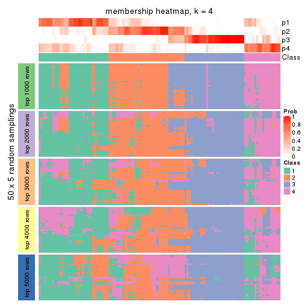</p>

</div>
<div id='tab-CV-NMF-membership-heatmap-4'>
<pre><code class="r">membership_heatmap(res, k = 5)
</code></pre>

<p></p>

</div>
<div id='tab-CV-NMF-membership-heatmap-5'>
<pre><code class="r">membership_heatmap(res, k = 6)
</code></pre>

<p></p>

</div>
</div>

As soon as we have had the classes for columns, we can look for signatures
which are significantly different between classes which can be candidate marks
for certain classes. Following are the heatmaps for signatures.


Signature heatmaps where rows are scaled:


<script>
$( function() {
	$( '#tabs-CV-NMF-get-signatures' ).tabs();
} );
</script>
<div id='tabs-CV-NMF-get-signatures'>
<ul>
<li><a href='#tab-CV-NMF-get-signatures-1'>k = 2</a></li>
<li><a href='#tab-CV-NMF-get-signatures-2'>k = 3</a></li>
<li><a href='#tab-CV-NMF-get-signatures-3'>k = 4</a></li>
<li><a href='#tab-CV-NMF-get-signatures-4'>k = 5</a></li>
<li><a href='#tab-CV-NMF-get-signatures-5'>k = 6</a></li>
</ul>
<div id='tab-CV-NMF-get-signatures-1'>
<pre><code class="r">get_signatures(res, k = 2)
</code></pre>

<p></p>

</div>
<div id='tab-CV-NMF-get-signatures-2'>
<pre><code class="r">get_signatures(res, k = 3)
</code></pre>

<p></p>

</div>
<div id='tab-CV-NMF-get-signatures-3'>
<pre><code class="r">get_signatures(res, k = 4)
</code></pre>

<p></p>

</div>
<div id='tab-CV-NMF-get-signatures-4'>
<pre><code class="r">get_signatures(res, k = 5)
</code></pre>

<p></p>

</div>
<div id='tab-CV-NMF-get-signatures-5'>
<pre><code class="r">get_signatures(res, k = 6)
</code></pre>

<p></p>

</div>
</div>


Signature heatmaps where rows are not scaled:


<script>
$( function() {
	$( '#tabs-CV-NMF-get-signatures-no-scale' ).tabs();
} );
</script>
<div id='tabs-CV-NMF-get-signatures-no-scale'>
<ul>
<li><a href='#tab-CV-NMF-get-signatures-no-scale-1'>k = 2</a></li>
<li><a href='#tab-CV-NMF-get-signatures-no-scale-2'>k = 3</a></li>
<li><a href='#tab-CV-NMF-get-signatures-no-scale-3'>k = 4</a></li>
<li><a href='#tab-CV-NMF-get-signatures-no-scale-4'>k = 5</a></li>
<li><a href='#tab-CV-NMF-get-signatures-no-scale-5'>k = 6</a></li>
</ul>
<div id='tab-CV-NMF-get-signatures-no-scale-1'>
<pre><code class="r">get_signatures(res, k = 2, scale_rows = FALSE)
</code></pre>

<p></p>

</div>
<div id='tab-CV-NMF-get-signatures-no-scale-2'>
<pre><code class="r">get_signatures(res, k = 3, scale_rows = FALSE)
</code></pre>

<p></p>

</div>
<div id='tab-CV-NMF-get-signatures-no-scale-3'>
<pre><code class="r">get_signatures(res, k = 4, scale_rows = FALSE)
</code></pre>

<p></p>

</div>
<div id='tab-CV-NMF-get-signatures-no-scale-4'>
<pre><code class="r">get_signatures(res, k = 5, scale_rows = FALSE)
</code></pre>

<p></p>

</div>
<div id='tab-CV-NMF-get-signatures-no-scale-5'>
<pre><code class="r">get_signatures(res, k = 6, scale_rows = FALSE)
</code></pre>

<p></p>

</div>
</div>


Compare the overlap of signatures from different k:

```r
compare_signatures(res)
```


`get_signature()` returns a data frame invisibly. TO get the list of signatures, the function
call should be assigned to a variable explicitly. In following code, if `plot` argument is set
to `FALSE`, no heatmap is plotted while only the differential analysis is performed.

```r
# code only for demonstration
tb = get_signature(res, k = ..., plot = FALSE)
```

An example of the output of `tb` is:

```
#>   which_row         fdr    mean_1    mean_2 scaled_mean_1 scaled_mean_2 km
#> 1        38 0.042760348  8.373488  9.131774    -0.5533452     0.5164555  1
#> 2        40 0.018707592  7.106213  8.469186    -0.6173731     0.5762149  1
#> 3        55 0.019134737 10.221463 11.207825    -0.6159697     0.5749050  1
#> 4        59 0.006059896  5.921854  7.869574    -0.6899429     0.6439467  1
#> 5        60 0.018055526  8.928898 10.211722    -0.6204761     0.5791110  1
#> 6        98 0.009384629 15.714769 14.887706     0.6635654    -0.6193277  2
...
```

The columns in `tb` are:

1. `which_row`: row indices corresponding to the input matrix.
2. `fdr`: FDR for the differential test. 
3. `mean_x`: The mean value in group x.
4. `scaled_mean_x`: The mean value in group x after rows are scaled.
5. `km`: Row groups if k-means clustering is applied to rows.


UMAP plot which shows how samples are separated.


<script>
$( function() {
	$( '#tabs-CV-NMF-dimension-reduction' ).tabs();
} );
</script>
<div id='tabs-CV-NMF-dimension-reduction'>
<ul>
<li><a href='#tab-CV-NMF-dimension-reduction-1'>k = 2</a></li>
<li><a href='#tab-CV-NMF-dimension-reduction-2'>k = 3</a></li>
<li><a href='#tab-CV-NMF-dimension-reduction-3'>k = 4</a></li>
<li><a href='#tab-CV-NMF-dimension-reduction-4'>k = 5</a></li>
<li><a href='#tab-CV-NMF-dimension-reduction-5'>k = 6</a></li>
</ul>
<div id='tab-CV-NMF-dimension-reduction-1'>
<pre><code class="r">dimension_reduction(res, k = 2, method = &quot;UMAP&quot;)
</code></pre>

<p></p>

</div>
<div id='tab-CV-NMF-dimension-reduction-2'>
<pre><code class="r">dimension_reduction(res, k = 3, method = &quot;UMAP&quot;)
</code></pre>

<p></p>

</div>
<div id='tab-CV-NMF-dimension-reduction-3'>
<pre><code class="r">dimension_reduction(res, k = 4, method = &quot;UMAP&quot;)
</code></pre>

<p></p>

</div>
<div id='tab-CV-NMF-dimension-reduction-4'>
<pre><code class="r">dimension_reduction(res, k = 5, method = &quot;UMAP&quot;)
</code></pre>

<p></p>

</div>
<div id='tab-CV-NMF-dimension-reduction-5'>
<pre><code class="r">dimension_reduction(res, k = 6, method = &quot;UMAP&quot;)
</code></pre>

<p></p>

</div>
</div>


Following heatmap shows how subgroups are split when increasing `k`:

```r
collect_classes(res)
```


If matrix rows can be associated to genes, consider to use `functional_enrichment(res,
...)` to perform function enrichment for the signature genes. See [this vignette](http://bioconductor.org/packages/devel/bioc/vignettes/cola/inst/doc/functional_enrichment.html) for more detailed explanations.


 

---------------------------------------------------


### MAD:hclust


The object with results only for a single top-value method and a single partition method 
can be extracted as:

```r
res = res_list["MAD", "hclust"]
# you can also extract it by
# res = res_list["MAD:hclust"]
```

A summary of `res` and all the functions that can be applied to it:

```r
res
```

```
#> A 'ConsensusPartition' object with k = 2, 3, 4, 5, 6.
#>   On a matrix with 16187 rows and 121 columns.
#>   Top rows (1000, 2000, 3000, 4000, 5000) are extracted by 'MAD' method.
#>   Subgroups are detected by 'hclust' method.
#>   Performed in total 1250 partitions by row resampling.
#>   Best k for subgroups seems to be 3.
#> 
#> Following methods can be applied to this 'ConsensusPartition' object:
#>  [1] "cola_report"             "collect_classes"         "collect_plots"          
#>  [4] "collect_stats"           "colnames"                "compare_signatures"     
#>  [7] "consensus_heatmap"       "dimension_reduction"     "functional_enrichment"  
#> [10] "get_anno_col"            "get_anno"                "get_classes"            
#> [13] "get_consensus"           "get_matrix"              "get_membership"         
#> [16] "get_param"               "get_signatures"          "get_stats"              
#> [19] "is_best_k"               "is_stable_k"             "membership_heatmap"     
#> [22] "ncol"                    "nrow"                    "plot_ecdf"              
#> [25] "rownames"                "select_partition_number" "show"                   
#> [28] "suggest_best_k"          "test_to_known_factors"
```

`collect_plots()` function collects all the plots made from `res` for all `k` (number of partitions)
into one single page to provide an easy and fast comparison between different `k`.

```r
collect_plots(res)
```


The plots are:

- The first row: a plot of the ECDF (empirical cumulative distribution
  function) curves of the consensus matrix for each `k` and the heatmap of
  predicted classes for each `k`.
- The second row: heatmaps of the consensus matrix for each `k`.
- The third row: heatmaps of the membership matrix for each `k`.
- The fouth row: heatmaps of the signatures for each `k`.

All the plots in panels can be made by individual functions and they are
plotted later in this section.

`select_partition_number()` produces several plots showing different
statistics for choosing "optimized" `k`. There are following statistics:

- ECDF curves of the consensus matrix for each `k`;
- 1-PAC. [The PAC
  score](https://en.wikipedia.org/wiki/Consensus_clustering#Over-interpretation_potential_of_consensus_clustering)
  measures the proportion of the ambiguous subgrouping.
- Mean silhouette score.
- Concordance. The mean probability of fiting the consensus class ids in all
  partitions.
- Area increased. Denote $A_k$ as the area under the ECDF curve for current
  `k`, the area increased is defined as $A_k - A_{k-1}$.
- Rand index. The percent of pairs of samples that are both in a same cluster
  or both are not in a same cluster in the partition of k and k-1.
- Jaccard index. The ratio of pairs of samples are both in a same cluster in
  the partition of k and k-1 and the pairs of samples are both in a same
  cluster in the partition k or k-1.

The detailed explanations of these statistics can be found in [the _cola_
vignette](http://bioconductor.org/packages/devel/bioc/vignettes/cola/inst/doc/cola.html#toc_13).

Generally speaking, lower PAC score, higher mean silhouette score or higher
concordance corresponds to better partition. Rand index and Jaccard index
measure how similar the current partition is compared to partition with `k-1`.
If they are too similar, we won't accept `k` is better than `k-1`.

```r
select_partition_number(res)
```


The numeric values for all these statistics can be obtained by `get_stats()`.

```r
get_stats(res)
```

```
#>   k 1-PAC mean_silhouette concordance area_increased  Rand Jaccard
#> 2 2 0.899           0.918       0.966         0.3600 0.660   0.660
#> 3 3 0.478           0.727       0.828         0.5718 0.747   0.625
#> 4 4 0.573           0.625       0.806         0.2040 0.901   0.779
#> 5 5 0.594           0.575       0.743         0.0647 0.965   0.906
#> 6 6 0.625           0.595       0.715         0.0557 0.852   0.584
```

`suggest_best_k()` suggests the best $k$ based on these statistics. The rules are as follows:

- All $k$ with Jaccard index larger than 0.95 are removed because increasing
  $k$ does not provide enough extra information. If all $k$ are removed, it is
  marked as no subgroup is detected.
- For all $k$ with 1-PAC score larger than 0.9, the maximal $k$ is taken as
  the best $k$, and other $k$ are marked as optional $k$.
- If it does not fit the second rule. The $k$ with the maximal vote of the
  highest 1-PAC score, highest mean silhouette, and highest concordance is
  taken as the best $k$.

```r
suggest_best_k(res)
```

```
#> [1] 3
```


Following shows the table of the partitions (You need to click the **show/hide
code output** link to see it). The membership matrix (columns with name `p*`)
is inferred by
[`clue::cl_consensus()`](https://www.rdocumentation.org/link/cl_consensus?package=clue)
function with the `SE` method. Basically the value in the membership matrix
represents the probability to belong to a certain group. The finall class
label for an item is determined with the group with highest probability it
belongs to.

In `get_classes()` function, the entropy is calculated from the membership
matrix and the silhouette score is calculated from the consensus matrix.


<script>
$( function() {
	$( '#tabs-MAD-hclust-get-classes' ).tabs();
} );
</script>
<div id='tabs-MAD-hclust-get-classes'>
<ul>
<li><a href='#tab-MAD-hclust-get-classes-1'>k = 2</a></li>
<li><a href='#tab-MAD-hclust-get-classes-2'>k = 3</a></li>
<li><a href='#tab-MAD-hclust-get-classes-3'>k = 4</a></li>
<li><a href='#tab-MAD-hclust-get-classes-4'>k = 5</a></li>
<li><a href='#tab-MAD-hclust-get-classes-5'>k = 6</a></li>
</ul>

<div id='tab-MAD-hclust-get-classes-1'>
<p><a id='tab-MAD-hclust-get-classes-1-a' style='color:#0366d6' href='#'>show/hide code output</a></p>
<pre><code class="r">cbind(get_classes(res, k = 2), get_membership(res, k = 2))
</code></pre>

<pre><code>#&gt;           class entropy silhouette    p1    p2
#&gt; DRR006374     2  0.0000      0.963 0.000 1.000
#&gt; DRR006375     1  0.0000      0.964 1.000 0.000
#&gt; DRR006376     1  0.0000      0.964 1.000 0.000
#&gt; DRR006377     1  0.1843      0.943 0.972 0.028
#&gt; DRR006378     1  0.9933      0.179 0.548 0.452
#&gt; DRR006379     1  0.0000      0.964 1.000 0.000
#&gt; DRR006380     1  0.7602      0.727 0.780 0.220
#&gt; DRR006381     1  0.0000      0.964 1.000 0.000
#&gt; DRR006382     1  0.8144      0.672 0.748 0.252
#&gt; DRR006383     1  0.8144      0.672 0.748 0.252
#&gt; DRR006384     2  0.0000      0.963 0.000 1.000
#&gt; DRR006385     1  0.0000      0.964 1.000 0.000
#&gt; DRR006386     2  0.0000      0.963 0.000 1.000
#&gt; DRR006387     1  0.0000      0.964 1.000 0.000
#&gt; DRR006388     1  0.0000      0.964 1.000 0.000
#&gt; DRR006389     1  0.0000      0.964 1.000 0.000
#&gt; DRR006390     2  0.0000      0.963 0.000 1.000
#&gt; DRR006391     2  0.0000      0.963 0.000 1.000
#&gt; DRR006392     1  0.0000      0.964 1.000 0.000
#&gt; DRR006393     1  0.0000      0.964 1.000 0.000
#&gt; DRR006394     1  0.9933      0.179 0.548 0.452
#&gt; DRR006395     1  0.0000      0.964 1.000 0.000
#&gt; DRR006396     1  0.0000      0.964 1.000 0.000
#&gt; DRR006397     1  0.0000      0.964 1.000 0.000
#&gt; DRR006398     1  0.0000      0.964 1.000 0.000
#&gt; DRR006399     1  0.0000      0.964 1.000 0.000
#&gt; DRR006400     1  0.0000      0.964 1.000 0.000
#&gt; DRR006401     2  0.0000      0.963 0.000 1.000
#&gt; DRR006402     2  0.0000      0.963 0.000 1.000
#&gt; DRR006403     1  0.0000      0.964 1.000 0.000
#&gt; DRR006404     1  0.0000      0.964 1.000 0.000
#&gt; DRR006405     1  0.0000      0.964 1.000 0.000
#&gt; DRR006406     1  0.0000      0.964 1.000 0.000
#&gt; DRR006407     1  0.1843      0.943 0.972 0.028
#&gt; DRR006408     1  0.6887      0.778 0.816 0.184
#&gt; DRR006409     1  0.0000      0.964 1.000 0.000
#&gt; DRR006410     1  0.0000      0.964 1.000 0.000
#&gt; DRR006411     1  0.0000      0.964 1.000 0.000
#&gt; DRR006412     2  0.0000      0.963 0.000 1.000
#&gt; DRR006413     1  0.0000      0.964 1.000 0.000
#&gt; DRR006414     1  0.0000      0.964 1.000 0.000
#&gt; DRR006415     1  0.0000      0.964 1.000 0.000
#&gt; DRR006416     1  0.0000      0.964 1.000 0.000
#&gt; DRR006417     1  0.0000      0.964 1.000 0.000
#&gt; DRR006418     1  0.0000      0.964 1.000 0.000
#&gt; DRR006419     1  0.0000      0.964 1.000 0.000
#&gt; DRR006420     1  0.0000      0.964 1.000 0.000
#&gt; DRR006421     1  0.0376      0.961 0.996 0.004
#&gt; DRR006422     1  0.4022      0.898 0.920 0.080
#&gt; DRR006423     2  0.0000      0.963 0.000 1.000
#&gt; DRR006424     1  0.0000      0.964 1.000 0.000
#&gt; DRR006425     1  0.4022      0.898 0.920 0.080
#&gt; DRR006426     1  0.0000      0.964 1.000 0.000
#&gt; DRR006427     2  0.0000      0.963 0.000 1.000
#&gt; DRR006428     1  0.0000      0.964 1.000 0.000
#&gt; DRR006429     1  0.3431      0.913 0.936 0.064
#&gt; DRR006430     1  0.0000      0.964 1.000 0.000
#&gt; DRR006431     1  0.0000      0.964 1.000 0.000
#&gt; DRR006432     1  0.0000      0.964 1.000 0.000
#&gt; DRR006433     1  0.1843      0.943 0.972 0.028
#&gt; DRR006434     2  0.0000      0.963 0.000 1.000
#&gt; DRR006435     2  0.0000      0.963 0.000 1.000
#&gt; DRR006436     2  0.0000      0.963 0.000 1.000
#&gt; DRR006437     1  0.0000      0.964 1.000 0.000
#&gt; DRR006438     1  0.0000      0.964 1.000 0.000
#&gt; DRR006439     1  0.0000      0.964 1.000 0.000
#&gt; DRR006440     2  0.7453      0.745 0.212 0.788
#&gt; DRR006441     1  0.9933      0.179 0.548 0.452
#&gt; DRR006442     1  0.0000      0.964 1.000 0.000
#&gt; DRR006443     2  0.7453      0.745 0.212 0.788
#&gt; DRR006444     2  0.0000      0.963 0.000 1.000
#&gt; DRR006445     1  0.0000      0.964 1.000 0.000
#&gt; DRR006446     2  0.0000      0.963 0.000 1.000
#&gt; DRR006447     1  0.0000      0.964 1.000 0.000
#&gt; DRR006448     1  0.0000      0.964 1.000 0.000
#&gt; DRR006449     1  0.0000      0.964 1.000 0.000
#&gt; DRR006450     1  0.0000      0.964 1.000 0.000
#&gt; DRR006451     1  0.0000      0.964 1.000 0.000
#&gt; DRR006452     1  0.0000      0.964 1.000 0.000
#&gt; DRR006453     1  0.0000      0.964 1.000 0.000
#&gt; DRR006454     1  0.0000      0.964 1.000 0.000
#&gt; DRR006455     2  0.0000      0.963 0.000 1.000
#&gt; DRR006456     1  0.0000      0.964 1.000 0.000
#&gt; DRR006457     1  0.0000      0.964 1.000 0.000
#&gt; DRR006458     1  0.0000      0.964 1.000 0.000
#&gt; DRR006459     1  0.0000      0.964 1.000 0.000
#&gt; DRR006460     2  0.0000      0.963 0.000 1.000
#&gt; DRR006461     2  0.0000      0.963 0.000 1.000
#&gt; DRR006462     1  0.0000      0.964 1.000 0.000
#&gt; DRR006463     2  0.7453      0.745 0.212 0.788
#&gt; DRR006464     1  0.3431      0.913 0.936 0.064
#&gt; DRR006465     1  0.0000      0.964 1.000 0.000
#&gt; DRR006466     1  0.1843      0.943 0.972 0.028
#&gt; DRR006467     1  0.0000      0.964 1.000 0.000
#&gt; DRR006468     2  0.0000      0.963 0.000 1.000
#&gt; DRR006469     1  0.9933      0.179 0.548 0.452
#&gt; DRR006470     1  0.0000      0.964 1.000 0.000
#&gt; DRR006471     1  0.0000      0.964 1.000 0.000
#&gt; DRR006472     1  0.1184      0.952 0.984 0.016
#&gt; DRR006473     2  0.0000      0.963 0.000 1.000
#&gt; DRR006474     2  0.0000      0.963 0.000 1.000
#&gt; DRR006475     1  0.0000      0.964 1.000 0.000
#&gt; DRR006476     1  0.3879      0.902 0.924 0.076
#&gt; DRR006477     1  0.3584      0.908 0.932 0.068
#&gt; DRR006478     1  0.0000      0.964 1.000 0.000
#&gt; DRR006479     1  0.0000      0.964 1.000 0.000
#&gt; DRR006480     1  0.0000      0.964 1.000 0.000
#&gt; DRR006481     1  0.0000      0.964 1.000 0.000
#&gt; DRR006482     1  0.0000      0.964 1.000 0.000
#&gt; DRR006483     1  0.0000      0.964 1.000 0.000
#&gt; DRR006484     1  0.0000      0.964 1.000 0.000
#&gt; DRR006485     2  0.7453      0.745 0.212 0.788
#&gt; DRR006486     1  0.0000      0.964 1.000 0.000
#&gt; DRR006487     1  0.0000      0.964 1.000 0.000
#&gt; DRR006488     2  0.0000      0.963 0.000 1.000
#&gt; DRR006489     1  0.0000      0.964 1.000 0.000
#&gt; DRR006490     1  0.0000      0.964 1.000 0.000
#&gt; DRR006491     1  0.0000      0.964 1.000 0.000
#&gt; DRR006492     1  0.0000      0.964 1.000 0.000
#&gt; DRR006493     1  0.0000      0.964 1.000 0.000
#&gt; DRR006494     1  0.0000      0.964 1.000 0.000
</code></pre>

<script>
$('#tab-MAD-hclust-get-classes-1-a').parent().next().next().hide();
$('#tab-MAD-hclust-get-classes-1-a').click(function(){
  $('#tab-MAD-hclust-get-classes-1-a').parent().next().next().toggle();
  return(false);
});
</script>
</div>

<div id='tab-MAD-hclust-get-classes-2'>
<p><a id='tab-MAD-hclust-get-classes-2-a' style='color:#0366d6' href='#'>show/hide code output</a></p>
<pre><code class="r">cbind(get_classes(res, k = 3), get_membership(res, k = 3))
</code></pre>

<pre><code>#&gt;           class entropy silhouette    p1    p2    p3
#&gt; DRR006374     2  0.0747     0.8733 0.000 0.984 0.016
#&gt; DRR006375     1  0.0592     0.8233 0.988 0.000 0.012
#&gt; DRR006376     3  0.6026     0.7816 0.376 0.000 0.624
#&gt; DRR006377     3  0.5016     0.7893 0.240 0.000 0.760
#&gt; DRR006378     2  0.9494    -0.0719 0.184 0.412 0.404
#&gt; DRR006379     3  0.6045     0.7816 0.380 0.000 0.620
#&gt; DRR006380     3  0.8199     0.6540 0.200 0.160 0.640
#&gt; DRR006381     1  0.0000     0.8253 1.000 0.000 0.000
#&gt; DRR006382     1  0.9149     0.0353 0.440 0.144 0.416
#&gt; DRR006383     1  0.9149     0.0353 0.440 0.144 0.416
#&gt; DRR006384     2  0.1031     0.8703 0.000 0.976 0.024
#&gt; DRR006385     1  0.4062     0.7446 0.836 0.000 0.164
#&gt; DRR006386     2  0.0424     0.8678 0.000 0.992 0.008
#&gt; DRR006387     1  0.1529     0.8126 0.960 0.000 0.040
#&gt; DRR006388     1  0.4504     0.7364 0.804 0.000 0.196
#&gt; DRR006389     1  0.4504     0.7364 0.804 0.000 0.196
#&gt; DRR006390     2  0.0747     0.8733 0.000 0.984 0.016
#&gt; DRR006391     2  0.0747     0.8733 0.000 0.984 0.016
#&gt; DRR006392     1  0.0000     0.8253 1.000 0.000 0.000
#&gt; DRR006393     1  0.4121     0.6999 0.832 0.000 0.168
#&gt; DRR006394     2  0.9494    -0.0719 0.184 0.412 0.404
#&gt; DRR006395     1  0.5810     0.3451 0.664 0.000 0.336
#&gt; DRR006396     1  0.1529     0.8126 0.960 0.000 0.040
#&gt; DRR006397     1  0.4504     0.7364 0.804 0.000 0.196
#&gt; DRR006398     1  0.4504     0.7364 0.804 0.000 0.196
#&gt; DRR006399     3  0.6045     0.7816 0.380 0.000 0.620
#&gt; DRR006400     3  0.6045     0.7816 0.380 0.000 0.620
#&gt; DRR006401     2  0.0747     0.8733 0.000 0.984 0.016
#&gt; DRR006402     2  0.0747     0.8733 0.000 0.984 0.016
#&gt; DRR006403     3  0.6045     0.7816 0.380 0.000 0.620
#&gt; DRR006404     3  0.6026     0.7816 0.376 0.000 0.624
#&gt; DRR006405     1  0.4842     0.6065 0.776 0.000 0.224
#&gt; DRR006406     1  0.4842     0.6065 0.776 0.000 0.224
#&gt; DRR006407     3  0.5016     0.7893 0.240 0.000 0.760
#&gt; DRR006408     3  0.8493     0.7294 0.248 0.148 0.604
#&gt; DRR006409     1  0.0237     0.8250 0.996 0.000 0.004
#&gt; DRR006410     1  0.1529     0.8126 0.960 0.000 0.040
#&gt; DRR006411     1  0.4399     0.7453 0.812 0.000 0.188
#&gt; DRR006412     2  0.0747     0.8733 0.000 0.984 0.016
#&gt; DRR006413     1  0.0000     0.8253 1.000 0.000 0.000
#&gt; DRR006414     1  0.5363     0.6364 0.724 0.000 0.276
#&gt; DRR006415     1  0.5363     0.6364 0.724 0.000 0.276
#&gt; DRR006416     1  0.2165     0.8154 0.936 0.000 0.064
#&gt; DRR006417     1  0.3879     0.7788 0.848 0.000 0.152
#&gt; DRR006418     1  0.1643     0.8241 0.956 0.000 0.044
#&gt; DRR006419     1  0.2165     0.8173 0.936 0.000 0.064
#&gt; DRR006420     1  0.2165     0.8173 0.936 0.000 0.064
#&gt; DRR006421     1  0.5216     0.6770 0.740 0.000 0.260
#&gt; DRR006422     3  0.6049     0.7841 0.204 0.040 0.756
#&gt; DRR006423     2  0.0747     0.8733 0.000 0.984 0.016
#&gt; DRR006424     1  0.0424     0.8242 0.992 0.000 0.008
#&gt; DRR006425     3  0.6049     0.7841 0.204 0.040 0.756
#&gt; DRR006426     1  0.3879     0.7788 0.848 0.000 0.152
#&gt; DRR006427     2  0.0424     0.8678 0.000 0.992 0.008
#&gt; DRR006428     1  0.1753     0.8182 0.952 0.000 0.048
#&gt; DRR006429     3  0.5772     0.7874 0.220 0.024 0.756
#&gt; DRR006430     1  0.0000     0.8253 1.000 0.000 0.000
#&gt; DRR006431     1  0.0000     0.8253 1.000 0.000 0.000
#&gt; DRR006432     1  0.3879     0.7788 0.848 0.000 0.152
#&gt; DRR006433     1  0.6154     0.2172 0.592 0.000 0.408
#&gt; DRR006434     2  0.0747     0.8733 0.000 0.984 0.016
#&gt; DRR006435     2  0.0424     0.8678 0.000 0.992 0.008
#&gt; DRR006436     2  0.0424     0.8678 0.000 0.992 0.008
#&gt; DRR006437     1  0.4062     0.7446 0.836 0.000 0.164
#&gt; DRR006438     1  0.2165     0.8173 0.936 0.000 0.064
#&gt; DRR006439     1  0.4062     0.7705 0.836 0.000 0.164
#&gt; DRR006440     2  0.5650     0.6880 0.000 0.688 0.312
#&gt; DRR006441     2  0.9494    -0.0719 0.184 0.412 0.404
#&gt; DRR006442     1  0.2356     0.8079 0.928 0.000 0.072
#&gt; DRR006443     2  0.5650     0.6880 0.000 0.688 0.312
#&gt; DRR006444     2  0.0424     0.8678 0.000 0.992 0.008
#&gt; DRR006445     1  0.0747     0.8222 0.984 0.000 0.016
#&gt; DRR006446     2  0.0747     0.8733 0.000 0.984 0.016
#&gt; DRR006447     1  0.1643     0.8241 0.956 0.000 0.044
#&gt; DRR006448     3  0.6045     0.7816 0.380 0.000 0.620
#&gt; DRR006449     1  0.0747     0.8222 0.984 0.000 0.016
#&gt; DRR006450     1  0.0747     0.8222 0.984 0.000 0.016
#&gt; DRR006451     3  0.6045     0.7816 0.380 0.000 0.620
#&gt; DRR006452     1  0.0747     0.8222 0.984 0.000 0.016
#&gt; DRR006453     1  0.4121     0.6999 0.832 0.000 0.168
#&gt; DRR006454     1  0.4399     0.7444 0.812 0.000 0.188
#&gt; DRR006455     2  0.0424     0.8678 0.000 0.992 0.008
#&gt; DRR006456     1  0.5363     0.6364 0.724 0.000 0.276
#&gt; DRR006457     1  0.4291     0.7569 0.820 0.000 0.180
#&gt; DRR006458     1  0.0000     0.8253 1.000 0.000 0.000
#&gt; DRR006459     1  0.0000     0.8253 1.000 0.000 0.000
#&gt; DRR006460     2  0.0747     0.8733 0.000 0.984 0.016
#&gt; DRR006461     2  0.0747     0.8733 0.000 0.984 0.016
#&gt; DRR006462     1  0.1529     0.8126 0.960 0.000 0.040
#&gt; DRR006463     2  0.5650     0.6880 0.000 0.688 0.312
#&gt; DRR006464     3  0.5772     0.7874 0.220 0.024 0.756
#&gt; DRR006465     1  0.4002     0.7105 0.840 0.000 0.160
#&gt; DRR006466     1  0.6308    -0.1726 0.508 0.000 0.492
#&gt; DRR006467     1  0.0000     0.8253 1.000 0.000 0.000
#&gt; DRR006468     2  0.0424     0.8678 0.000 0.992 0.008
#&gt; DRR006469     2  0.9494    -0.0719 0.184 0.412 0.404
#&gt; DRR006470     1  0.3879     0.7788 0.848 0.000 0.152
#&gt; DRR006471     1  0.0000     0.8253 1.000 0.000 0.000
#&gt; DRR006472     3  0.6045     0.5204 0.380 0.000 0.620
#&gt; DRR006473     2  0.0747     0.8733 0.000 0.984 0.016
#&gt; DRR006474     2  0.0747     0.8733 0.000 0.984 0.016
#&gt; DRR006475     1  0.0237     0.8250 0.996 0.000 0.004
#&gt; DRR006476     3  0.5940     0.7847 0.204 0.036 0.760
#&gt; DRR006477     3  0.6521     0.7060 0.340 0.016 0.644
#&gt; DRR006478     1  0.4121     0.6999 0.832 0.000 0.168
#&gt; DRR006479     1  0.2165     0.8173 0.936 0.000 0.064
#&gt; DRR006480     1  0.0000     0.8253 1.000 0.000 0.000
#&gt; DRR006481     1  0.4291     0.7569 0.820 0.000 0.180
#&gt; DRR006482     1  0.4062     0.7446 0.836 0.000 0.164
#&gt; DRR006483     1  0.0000     0.8253 1.000 0.000 0.000
#&gt; DRR006484     1  0.3116     0.8004 0.892 0.000 0.108
#&gt; DRR006485     2  0.5650     0.6880 0.000 0.688 0.312
#&gt; DRR006486     1  0.0237     0.8250 0.996 0.000 0.004
#&gt; DRR006487     1  0.5363     0.6364 0.724 0.000 0.276
#&gt; DRR006488     2  0.0424     0.8678 0.000 0.992 0.008
#&gt; DRR006489     1  0.0000     0.8253 1.000 0.000 0.000
#&gt; DRR006490     1  0.2356     0.8079 0.928 0.000 0.072
#&gt; DRR006491     1  0.2356     0.8079 0.928 0.000 0.072
#&gt; DRR006492     1  0.5810     0.3451 0.664 0.000 0.336
#&gt; DRR006493     1  0.5363     0.6364 0.724 0.000 0.276
#&gt; DRR006494     1  0.0000     0.8253 1.000 0.000 0.000
</code></pre>

<script>
$('#tab-MAD-hclust-get-classes-2-a').parent().next().next().hide();
$('#tab-MAD-hclust-get-classes-2-a').click(function(){
  $('#tab-MAD-hclust-get-classes-2-a').parent().next().next().toggle();
  return(false);
});
</script>
</div>

<div id='tab-MAD-hclust-get-classes-3'>
<p><a id='tab-MAD-hclust-get-classes-3-a' style='color:#0366d6' href='#'>show/hide code output</a></p>
<pre><code class="r">cbind(get_classes(res, k = 4), get_membership(res, k = 4))
</code></pre>

<pre><code>#&gt;           class entropy silhouette    p1    p2    p3    p4
#&gt; DRR006374     2  0.0188     0.9164 0.000 0.996 0.004 0.000
#&gt; DRR006375     1  0.1389     0.7141 0.952 0.000 0.000 0.048
#&gt; DRR006376     4  0.2048     0.6841 0.064 0.000 0.008 0.928
#&gt; DRR006377     4  0.5251     0.6325 0.032 0.016 0.212 0.740
#&gt; DRR006378     4  0.7423     0.2567 0.000 0.404 0.168 0.428
#&gt; DRR006379     4  0.1867     0.6845 0.072 0.000 0.000 0.928
#&gt; DRR006380     4  0.4940     0.6092 0.000 0.128 0.096 0.776
#&gt; DRR006381     1  0.0000     0.7263 1.000 0.000 0.000 0.000
#&gt; DRR006382     3  0.2644     0.5035 0.000 0.060 0.908 0.032
#&gt; DRR006383     3  0.2644     0.5035 0.000 0.060 0.908 0.032
#&gt; DRR006384     2  0.1174     0.8993 0.000 0.968 0.020 0.012
#&gt; DRR006385     1  0.6159     0.5511 0.672 0.000 0.196 0.132
#&gt; DRR006386     2  0.1743     0.9011 0.000 0.940 0.056 0.004
#&gt; DRR006387     1  0.2081     0.6984 0.916 0.000 0.000 0.084
#&gt; DRR006388     1  0.7302     0.2088 0.500 0.000 0.332 0.168
#&gt; DRR006389     1  0.7302     0.2088 0.500 0.000 0.332 0.168
#&gt; DRR006390     2  0.0000     0.9168 0.000 1.000 0.000 0.000
#&gt; DRR006391     2  0.0000     0.9168 0.000 1.000 0.000 0.000
#&gt; DRR006392     1  0.0000     0.7263 1.000 0.000 0.000 0.000
#&gt; DRR006393     1  0.5354     0.5620 0.712 0.000 0.056 0.232
#&gt; DRR006394     4  0.7423     0.2567 0.000 0.404 0.168 0.428
#&gt; DRR006395     1  0.7246     0.1379 0.448 0.000 0.144 0.408
#&gt; DRR006396     1  0.2081     0.6984 0.916 0.000 0.000 0.084
#&gt; DRR006397     1  0.7302     0.2088 0.500 0.000 0.332 0.168
#&gt; DRR006398     1  0.7302     0.2088 0.500 0.000 0.332 0.168
#&gt; DRR006399     4  0.1867     0.6845 0.072 0.000 0.000 0.928
#&gt; DRR006400     4  0.1867     0.6845 0.072 0.000 0.000 0.928
#&gt; DRR006401     2  0.0000     0.9168 0.000 1.000 0.000 0.000
#&gt; DRR006402     2  0.0000     0.9168 0.000 1.000 0.000 0.000
#&gt; DRR006403     4  0.1867     0.6845 0.072 0.000 0.000 0.928
#&gt; DRR006404     4  0.2048     0.6841 0.064 0.000 0.008 0.928
#&gt; DRR006405     1  0.6106     0.4141 0.604 0.000 0.064 0.332
#&gt; DRR006406     1  0.6106     0.4141 0.604 0.000 0.064 0.332
#&gt; DRR006407     4  0.5251     0.6325 0.032 0.016 0.212 0.740
#&gt; DRR006408     4  0.3842     0.6385 0.000 0.128 0.036 0.836
#&gt; DRR006409     1  0.0469     0.7243 0.988 0.000 0.012 0.000
#&gt; DRR006410     1  0.2081     0.6984 0.916 0.000 0.000 0.084
#&gt; DRR006411     1  0.7146     0.2283 0.516 0.000 0.336 0.148
#&gt; DRR006412     2  0.0000     0.9168 0.000 1.000 0.000 0.000
#&gt; DRR006413     1  0.0000     0.7263 1.000 0.000 0.000 0.000
#&gt; DRR006414     3  0.4134     0.8099 0.260 0.000 0.740 0.000
#&gt; DRR006415     3  0.4134     0.8099 0.260 0.000 0.740 0.000
#&gt; DRR006416     1  0.4188     0.6782 0.824 0.000 0.112 0.064
#&gt; DRR006417     1  0.4776     0.3915 0.624 0.000 0.376 0.000
#&gt; DRR006418     1  0.3108     0.6988 0.872 0.000 0.112 0.016
#&gt; DRR006419     1  0.3172     0.6633 0.840 0.000 0.160 0.000
#&gt; DRR006420     1  0.3172     0.6633 0.840 0.000 0.160 0.000
#&gt; DRR006421     1  0.6577     0.2157 0.540 0.004 0.384 0.072
#&gt; DRR006422     4  0.4524     0.6590 0.000 0.028 0.204 0.768
#&gt; DRR006423     2  0.0188     0.9164 0.000 0.996 0.004 0.000
#&gt; DRR006424     1  0.0921     0.7204 0.972 0.000 0.000 0.028
#&gt; DRR006425     4  0.4524     0.6590 0.000 0.028 0.204 0.768
#&gt; DRR006426     1  0.4776     0.3915 0.624 0.000 0.376 0.000
#&gt; DRR006427     2  0.1743     0.9011 0.000 0.940 0.056 0.004
#&gt; DRR006428     1  0.2704     0.6880 0.876 0.000 0.124 0.000
#&gt; DRR006429     4  0.4809     0.6483 0.012 0.016 0.220 0.752
#&gt; DRR006430     1  0.0000     0.7263 1.000 0.000 0.000 0.000
#&gt; DRR006431     1  0.0000     0.7263 1.000 0.000 0.000 0.000
#&gt; DRR006432     1  0.4776     0.3915 0.624 0.000 0.376 0.000
#&gt; DRR006433     1  0.8305    -0.1424 0.400 0.016 0.300 0.284
#&gt; DRR006434     2  0.0188     0.9164 0.000 0.996 0.004 0.000
#&gt; DRR006435     2  0.1743     0.9011 0.000 0.940 0.056 0.004
#&gt; DRR006436     2  0.1743     0.9011 0.000 0.940 0.056 0.004
#&gt; DRR006437     1  0.6159     0.5511 0.672 0.000 0.196 0.132
#&gt; DRR006438     1  0.3311     0.6540 0.828 0.000 0.172 0.000
#&gt; DRR006439     1  0.4897     0.4596 0.660 0.000 0.332 0.008
#&gt; DRR006440     2  0.5339     0.5706 0.000 0.624 0.356 0.020
#&gt; DRR006441     4  0.7423     0.2567 0.000 0.404 0.168 0.428
#&gt; DRR006442     1  0.3074     0.6729 0.848 0.000 0.152 0.000
#&gt; DRR006443     2  0.5339     0.5706 0.000 0.624 0.356 0.020
#&gt; DRR006444     2  0.1743     0.9011 0.000 0.940 0.056 0.004
#&gt; DRR006445     1  0.1474     0.7129 0.948 0.000 0.000 0.052
#&gt; DRR006446     2  0.0000     0.9168 0.000 1.000 0.000 0.000
#&gt; DRR006447     1  0.3108     0.6988 0.872 0.000 0.112 0.016
#&gt; DRR006448     4  0.1867     0.6845 0.072 0.000 0.000 0.928
#&gt; DRR006449     1  0.1474     0.7129 0.948 0.000 0.000 0.052
#&gt; DRR006450     1  0.1474     0.7129 0.948 0.000 0.000 0.052
#&gt; DRR006451     4  0.1867     0.6845 0.072 0.000 0.000 0.928
#&gt; DRR006452     1  0.1474     0.7129 0.948 0.000 0.000 0.052
#&gt; DRR006453     1  0.5321     0.5657 0.716 0.000 0.056 0.228
#&gt; DRR006454     1  0.7238     0.2207 0.508 0.000 0.332 0.160
#&gt; DRR006455     2  0.1743     0.9011 0.000 0.940 0.056 0.004
#&gt; DRR006456     3  0.4134     0.8099 0.260 0.000 0.740 0.000
#&gt; DRR006457     1  0.5099     0.3648 0.612 0.000 0.380 0.008
#&gt; DRR006458     1  0.0000     0.7263 1.000 0.000 0.000 0.000
#&gt; DRR006459     1  0.0000     0.7263 1.000 0.000 0.000 0.000
#&gt; DRR006460     2  0.0000     0.9168 0.000 1.000 0.000 0.000
#&gt; DRR006461     2  0.0188     0.9164 0.000 0.996 0.004 0.000
#&gt; DRR006462     1  0.2081     0.6984 0.916 0.000 0.000 0.084
#&gt; DRR006463     2  0.5339     0.5706 0.000 0.624 0.356 0.020
#&gt; DRR006464     4  0.4809     0.6483 0.012 0.016 0.220 0.752
#&gt; DRR006465     1  0.5254     0.5741 0.724 0.000 0.056 0.220
#&gt; DRR006466     4  0.8310    -0.1985 0.356 0.016 0.260 0.368
#&gt; DRR006467     1  0.0000     0.7263 1.000 0.000 0.000 0.000
#&gt; DRR006468     2  0.1743     0.9011 0.000 0.940 0.056 0.004
#&gt; DRR006469     4  0.7423     0.2567 0.000 0.404 0.168 0.428
#&gt; DRR006470     1  0.4776     0.3915 0.624 0.000 0.376 0.000
#&gt; DRR006471     1  0.0000     0.7263 1.000 0.000 0.000 0.000
#&gt; DRR006472     4  0.8197    -0.0537 0.292 0.016 0.256 0.436
#&gt; DRR006473     2  0.0188     0.9164 0.000 0.996 0.004 0.000
#&gt; DRR006474     2  0.0188     0.9164 0.000 0.996 0.004 0.000
#&gt; DRR006475     1  0.0188     0.7256 0.996 0.000 0.004 0.000
#&gt; DRR006476     4  0.4742     0.6576 0.004 0.028 0.208 0.760
#&gt; DRR006477     4  0.6196     0.4857 0.100 0.004 0.228 0.668
#&gt; DRR006478     1  0.5354     0.5620 0.712 0.000 0.056 0.232
#&gt; DRR006479     1  0.3311     0.6540 0.828 0.000 0.172 0.000
#&gt; DRR006480     1  0.0000     0.7263 1.000 0.000 0.000 0.000
#&gt; DRR006481     1  0.5099     0.3648 0.612 0.000 0.380 0.008
#&gt; DRR006482     1  0.6159     0.5511 0.672 0.000 0.196 0.132
#&gt; DRR006483     1  0.0000     0.7263 1.000 0.000 0.000 0.000
#&gt; DRR006484     1  0.4331     0.5279 0.712 0.000 0.288 0.000
#&gt; DRR006485     2  0.5339     0.5706 0.000 0.624 0.356 0.020
#&gt; DRR006486     1  0.0336     0.7250 0.992 0.000 0.008 0.000
#&gt; DRR006487     3  0.4134     0.8099 0.260 0.000 0.740 0.000
#&gt; DRR006488     2  0.1743     0.9011 0.000 0.940 0.056 0.004
#&gt; DRR006489     1  0.0000     0.7263 1.000 0.000 0.000 0.000
#&gt; DRR006490     1  0.3074     0.6729 0.848 0.000 0.152 0.000
#&gt; DRR006491     1  0.3074     0.6729 0.848 0.000 0.152 0.000
#&gt; DRR006492     1  0.7246     0.1379 0.448 0.000 0.144 0.408
#&gt; DRR006493     3  0.4134     0.8099 0.260 0.000 0.740 0.000
#&gt; DRR006494     1  0.0000     0.7263 1.000 0.000 0.000 0.000
</code></pre>

<script>
$('#tab-MAD-hclust-get-classes-3-a').parent().next().next().hide();
$('#tab-MAD-hclust-get-classes-3-a').click(function(){
  $('#tab-MAD-hclust-get-classes-3-a').parent().next().next().toggle();
  return(false);
});
</script>
</div>

<div id='tab-MAD-hclust-get-classes-4'>
<p><a id='tab-MAD-hclust-get-classes-4-a' style='color:#0366d6' href='#'>show/hide code output</a></p>
<pre><code class="r">cbind(get_classes(res, k = 5), get_membership(res, k = 5))
</code></pre>

<pre><code>#&gt;           class entropy silhouette    p1    p2    p3    p4    p5
#&gt; DRR006374     2  0.0162     0.8447 0.000 0.996 0.000 0.000 0.004
#&gt; DRR006375     1  0.1270     0.6827 0.948 0.000 0.000 0.052 0.000
#&gt; DRR006376     4  0.1697     0.6338 0.060 0.000 0.000 0.932 0.008
#&gt; DRR006377     4  0.4589     0.6136 0.000 0.000 0.064 0.724 0.212
#&gt; DRR006378     4  0.7010     0.2292 0.000 0.392 0.024 0.408 0.176
#&gt; DRR006379     4  0.1544     0.6342 0.068 0.000 0.000 0.932 0.000
#&gt; DRR006380     4  0.4660     0.5414 0.000 0.000 0.080 0.728 0.192
#&gt; DRR006381     1  0.0000     0.6971 1.000 0.000 0.000 0.000 0.000
#&gt; DRR006382     3  0.5639     0.5531 0.000 0.060 0.616 0.020 0.304
#&gt; DRR006383     3  0.5639     0.5531 0.000 0.060 0.616 0.020 0.304
#&gt; DRR006384     2  0.3423     0.7660 0.000 0.856 0.068 0.016 0.060
#&gt; DRR006385     1  0.6819     0.5212 0.600 0.000 0.176 0.136 0.088
#&gt; DRR006386     2  0.3210     0.7784 0.000 0.788 0.000 0.000 0.212
#&gt; DRR006387     1  0.1851     0.6688 0.912 0.000 0.000 0.088 0.000
#&gt; DRR006388     1  0.8287     0.1648 0.340 0.000 0.320 0.176 0.164
#&gt; DRR006389     1  0.8287     0.1648 0.340 0.000 0.320 0.176 0.164
#&gt; DRR006390     2  0.0000     0.8452 0.000 1.000 0.000 0.000 0.000
#&gt; DRR006391     2  0.0000     0.8452 0.000 1.000 0.000 0.000 0.000
#&gt; DRR006392     1  0.0162     0.6966 0.996 0.000 0.000 0.004 0.000
#&gt; DRR006393     1  0.5178     0.5525 0.692 0.000 0.056 0.232 0.020
#&gt; DRR006394     4  0.7010     0.2292 0.000 0.392 0.024 0.408 0.176
#&gt; DRR006395     4  0.7187    -0.0869 0.396 0.000 0.136 0.416 0.052
#&gt; DRR006396     1  0.1851     0.6688 0.912 0.000 0.000 0.088 0.000
#&gt; DRR006397     1  0.8287     0.1648 0.340 0.000 0.320 0.176 0.164
#&gt; DRR006398     1  0.8287     0.1648 0.340 0.000 0.320 0.176 0.164
#&gt; DRR006399     4  0.1544     0.6342 0.068 0.000 0.000 0.932 0.000
#&gt; DRR006400     4  0.1544     0.6342 0.068 0.000 0.000 0.932 0.000
#&gt; DRR006401     2  0.0000     0.8452 0.000 1.000 0.000 0.000 0.000
#&gt; DRR006402     2  0.0000     0.8452 0.000 1.000 0.000 0.000 0.000
#&gt; DRR006403     4  0.1544     0.6342 0.068 0.000 0.000 0.932 0.000
#&gt; DRR006404     4  0.1697     0.6338 0.060 0.000 0.000 0.932 0.008
#&gt; DRR006405     1  0.5731     0.3972 0.592 0.000 0.048 0.332 0.028
#&gt; DRR006406     1  0.5731     0.3972 0.592 0.000 0.048 0.332 0.028
#&gt; DRR006407     4  0.4589     0.6136 0.000 0.000 0.064 0.724 0.212
#&gt; DRR006408     4  0.4083     0.5751 0.000 0.000 0.080 0.788 0.132
#&gt; DRR006409     1  0.0693     0.6956 0.980 0.000 0.008 0.000 0.012
#&gt; DRR006410     1  0.1851     0.6688 0.912 0.000 0.000 0.088 0.000
#&gt; DRR006411     1  0.8213     0.1795 0.356 0.000 0.320 0.156 0.168
#&gt; DRR006412     2  0.0000     0.8452 0.000 1.000 0.000 0.000 0.000
#&gt; DRR006413     1  0.0000     0.6971 1.000 0.000 0.000 0.000 0.000
#&gt; DRR006414     3  0.2984     0.8358 0.124 0.000 0.856 0.004 0.016
#&gt; DRR006415     3  0.2984     0.8358 0.124 0.000 0.856 0.004 0.016
#&gt; DRR006416     1  0.4866     0.6426 0.768 0.000 0.112 0.072 0.048
#&gt; DRR006417     1  0.6762     0.3107 0.452 0.000 0.336 0.008 0.204
#&gt; DRR006418     1  0.4016     0.6601 0.816 0.000 0.112 0.024 0.048
#&gt; DRR006419     1  0.4933     0.5672 0.688 0.000 0.236 0.000 0.076
#&gt; DRR006420     1  0.4933     0.5672 0.688 0.000 0.236 0.000 0.076
#&gt; DRR006421     1  0.7814     0.1243 0.360 0.000 0.348 0.072 0.220
#&gt; DRR006422     4  0.4193     0.6205 0.000 0.000 0.040 0.748 0.212
#&gt; DRR006423     2  0.0162     0.8447 0.000 0.996 0.000 0.000 0.004
#&gt; DRR006424     1  0.0880     0.6899 0.968 0.000 0.000 0.032 0.000
#&gt; DRR006425     4  0.4193     0.6205 0.000 0.000 0.040 0.748 0.212
#&gt; DRR006426     1  0.6762     0.3107 0.452 0.000 0.336 0.008 0.204
#&gt; DRR006427     2  0.3210     0.7784 0.000 0.788 0.000 0.000 0.212
#&gt; DRR006428     1  0.3878     0.5970 0.748 0.000 0.236 0.000 0.016
#&gt; DRR006429     4  0.4450     0.6177 0.004 0.000 0.044 0.736 0.216
#&gt; DRR006430     1  0.0162     0.6966 0.996 0.000 0.000 0.004 0.000
#&gt; DRR006431     1  0.0000     0.6971 1.000 0.000 0.000 0.000 0.000
#&gt; DRR006432     1  0.6762     0.3107 0.452 0.000 0.336 0.008 0.204
#&gt; DRR006433     4  0.8533    -0.0508 0.280 0.000 0.244 0.288 0.188
#&gt; DRR006434     2  0.0162     0.8447 0.000 0.996 0.000 0.000 0.004
#&gt; DRR006435     2  0.3210     0.7784 0.000 0.788 0.000 0.000 0.212
#&gt; DRR006436     2  0.3210     0.7784 0.000 0.788 0.000 0.000 0.212
#&gt; DRR006437     1  0.6819     0.5212 0.600 0.000 0.176 0.136 0.088
#&gt; DRR006438     1  0.5028     0.5483 0.668 0.000 0.260 0.000 0.072
#&gt; DRR006439     1  0.6452     0.3568 0.500 0.000 0.340 0.008 0.152
#&gt; DRR006440     2  0.5619     0.3994 0.000 0.516 0.064 0.004 0.416
#&gt; DRR006441     4  0.7010     0.2292 0.000 0.392 0.024 0.408 0.176
#&gt; DRR006442     1  0.4132     0.5757 0.720 0.000 0.260 0.000 0.020
#&gt; DRR006443     2  0.5619     0.3994 0.000 0.516 0.064 0.004 0.416
#&gt; DRR006444     2  0.3210     0.7784 0.000 0.788 0.000 0.000 0.212
#&gt; DRR006445     1  0.1341     0.6814 0.944 0.000 0.000 0.056 0.000
#&gt; DRR006446     2  0.0000     0.8452 0.000 1.000 0.000 0.000 0.000
#&gt; DRR006447     1  0.4016     0.6601 0.816 0.000 0.112 0.024 0.048
#&gt; DRR006448     4  0.1544     0.6342 0.068 0.000 0.000 0.932 0.000
#&gt; DRR006449     1  0.1341     0.6814 0.944 0.000 0.000 0.056 0.000
#&gt; DRR006450     1  0.1341     0.6814 0.944 0.000 0.000 0.056 0.000
#&gt; DRR006451     4  0.1544     0.6342 0.068 0.000 0.000 0.932 0.000
#&gt; DRR006452     1  0.1341     0.6814 0.944 0.000 0.000 0.056 0.000
#&gt; DRR006453     1  0.5212     0.5554 0.692 0.000 0.060 0.228 0.020
#&gt; DRR006454     1  0.8252     0.1741 0.348 0.000 0.320 0.168 0.164
#&gt; DRR006455     2  0.3210     0.7784 0.000 0.788 0.000 0.000 0.212
#&gt; DRR006456     3  0.2984     0.8358 0.124 0.000 0.856 0.004 0.016
#&gt; DRR006457     1  0.6861     0.2454 0.424 0.000 0.368 0.012 0.196
#&gt; DRR006458     1  0.0000     0.6971 1.000 0.000 0.000 0.000 0.000
#&gt; DRR006459     1  0.0000     0.6971 1.000 0.000 0.000 0.000 0.000
#&gt; DRR006460     2  0.0000     0.8452 0.000 1.000 0.000 0.000 0.000
#&gt; DRR006461     2  0.0162     0.8447 0.000 0.996 0.000 0.000 0.004
#&gt; DRR006462     1  0.1851     0.6688 0.912 0.000 0.000 0.088 0.000
#&gt; DRR006463     2  0.5619     0.3994 0.000 0.516 0.064 0.004 0.416
#&gt; DRR006464     4  0.4450     0.6177 0.004 0.000 0.044 0.736 0.216
#&gt; DRR006465     1  0.5094     0.5664 0.704 0.000 0.056 0.220 0.020
#&gt; DRR006466     4  0.8349     0.1073 0.248 0.000 0.204 0.372 0.176
#&gt; DRR006467     1  0.0162     0.6966 0.996 0.000 0.000 0.004 0.000
#&gt; DRR006468     2  0.3210     0.7784 0.000 0.788 0.000 0.000 0.212
#&gt; DRR006469     4  0.7010     0.2292 0.000 0.392 0.024 0.408 0.176
#&gt; DRR006470     1  0.6762     0.3107 0.452 0.000 0.336 0.008 0.204
#&gt; DRR006471     1  0.0162     0.6967 0.996 0.000 0.004 0.000 0.000
#&gt; DRR006472     4  0.8125     0.2086 0.188 0.000 0.184 0.432 0.196
#&gt; DRR006473     2  0.0162     0.8447 0.000 0.996 0.000 0.000 0.004
#&gt; DRR006474     2  0.0162     0.8447 0.000 0.996 0.000 0.000 0.004
#&gt; DRR006475     1  0.0324     0.6962 0.992 0.000 0.004 0.000 0.004
#&gt; DRR006476     4  0.4119     0.6208 0.000 0.000 0.036 0.752 0.212
#&gt; DRR006477     4  0.6411     0.4862 0.064 0.000 0.120 0.632 0.184
#&gt; DRR006478     1  0.5178     0.5525 0.692 0.000 0.056 0.232 0.020
#&gt; DRR006479     1  0.5028     0.5483 0.668 0.000 0.260 0.000 0.072
#&gt; DRR006480     1  0.0000     0.6971 1.000 0.000 0.000 0.000 0.000
#&gt; DRR006481     1  0.6876     0.2473 0.424 0.000 0.364 0.012 0.200
#&gt; DRR006482     1  0.6819     0.5212 0.600 0.000 0.176 0.136 0.088
#&gt; DRR006483     1  0.0162     0.6967 0.996 0.000 0.004 0.000 0.000
#&gt; DRR006484     1  0.6162     0.4081 0.532 0.000 0.308 0.000 0.160
#&gt; DRR006485     2  0.5619     0.3994 0.000 0.516 0.064 0.004 0.416
#&gt; DRR006486     1  0.0671     0.6948 0.980 0.000 0.016 0.000 0.004
#&gt; DRR006487     3  0.2984     0.8358 0.124 0.000 0.856 0.004 0.016
#&gt; DRR006488     2  0.3210     0.7784 0.000 0.788 0.000 0.000 0.212
#&gt; DRR006489     1  0.0162     0.6966 0.996 0.000 0.000 0.004 0.000
#&gt; DRR006490     1  0.4132     0.5757 0.720 0.000 0.260 0.000 0.020
#&gt; DRR006491     1  0.4132     0.5757 0.720 0.000 0.260 0.000 0.020
#&gt; DRR006492     4  0.7187    -0.0869 0.396 0.000 0.136 0.416 0.052
#&gt; DRR006493     3  0.2984     0.8358 0.124 0.000 0.856 0.004 0.016
#&gt; DRR006494     1  0.0000     0.6971 1.000 0.000 0.000 0.000 0.000
</code></pre>

<script>
$('#tab-MAD-hclust-get-classes-4-a').parent().next().next().hide();
$('#tab-MAD-hclust-get-classes-4-a').click(function(){
  $('#tab-MAD-hclust-get-classes-4-a').parent().next().next().toggle();
  return(false);
});
</script>
</div>

<div id='tab-MAD-hclust-get-classes-5'>
<p><a id='tab-MAD-hclust-get-classes-5-a' style='color:#0366d6' href='#'>show/hide code output</a></p>
<pre><code class="r">cbind(get_classes(res, k = 6), get_membership(res, k = 6))
</code></pre>

<pre><code>#&gt;           class entropy silhouette    p1    p2    p3    p4    p5    p6
#&gt; DRR006374     5  0.3747    0.73517 0.000 0.396 0.000 0.000 0.604 0.000
#&gt; DRR006375     1  0.0865    0.75749 0.964 0.000 0.000 0.036 0.000 0.000
#&gt; DRR006376     4  0.1732    0.63541 0.072 0.000 0.004 0.920 0.000 0.004
#&gt; DRR006377     4  0.5573    0.54107 0.000 0.208 0.020 0.612 0.000 0.160
#&gt; DRR006378     2  0.5007    0.58885 0.000 0.636 0.012 0.272 0.000 0.080
#&gt; DRR006379     4  0.1757    0.63584 0.076 0.000 0.008 0.916 0.000 0.000
#&gt; DRR006380     4  0.6508    0.44131 0.000 0.172 0.132 0.560 0.000 0.136
#&gt; DRR006381     1  0.0632    0.76491 0.976 0.000 0.000 0.000 0.000 0.024
#&gt; DRR006382     3  0.2982    0.51803 0.000 0.152 0.828 0.008 0.000 0.012
#&gt; DRR006383     3  0.2982    0.51803 0.000 0.152 0.828 0.008 0.000 0.012
#&gt; DRR006384     5  0.5770    0.53288 0.000 0.416 0.104 0.008 0.464 0.008
#&gt; DRR006385     1  0.5268    0.23119 0.572 0.000 0.000 0.128 0.000 0.300
#&gt; DRR006386     5  0.0000    0.62664 0.000 0.000 0.000 0.000 1.000 0.000
#&gt; DRR006387     1  0.1501    0.74099 0.924 0.000 0.000 0.076 0.000 0.000
#&gt; DRR006388     6  0.5528    0.68128 0.180 0.040 0.004 0.120 0.000 0.656
#&gt; DRR006389     6  0.5528    0.68128 0.180 0.040 0.004 0.120 0.000 0.656
#&gt; DRR006390     5  0.3737    0.73700 0.000 0.392 0.000 0.000 0.608 0.000
#&gt; DRR006391     5  0.3737    0.73700 0.000 0.392 0.000 0.000 0.608 0.000
#&gt; DRR006392     1  0.0547    0.76558 0.980 0.000 0.000 0.000 0.000 0.020
#&gt; DRR006393     1  0.4632    0.54461 0.688 0.004 0.000 0.216 0.000 0.092
#&gt; DRR006394     2  0.5007    0.58885 0.000 0.636 0.012 0.272 0.000 0.080
#&gt; DRR006395     4  0.6317   -0.07365 0.352 0.000 0.012 0.392 0.000 0.244
#&gt; DRR006396     1  0.1501    0.74099 0.924 0.000 0.000 0.076 0.000 0.000
#&gt; DRR006397     6  0.5528    0.68128 0.180 0.040 0.004 0.120 0.000 0.656
#&gt; DRR006398     6  0.5528    0.68128 0.180 0.040 0.004 0.120 0.000 0.656
#&gt; DRR006399     4  0.1757    0.63584 0.076 0.000 0.008 0.916 0.000 0.000
#&gt; DRR006400     4  0.1757    0.63584 0.076 0.000 0.008 0.916 0.000 0.000
#&gt; DRR006401     5  0.3737    0.73700 0.000 0.392 0.000 0.000 0.608 0.000
#&gt; DRR006402     5  0.3737    0.73700 0.000 0.392 0.000 0.000 0.608 0.000
#&gt; DRR006403     4  0.1757    0.63584 0.076 0.000 0.008 0.916 0.000 0.000
#&gt; DRR006404     4  0.1732    0.63541 0.072 0.000 0.004 0.920 0.000 0.004
#&gt; DRR006405     1  0.5172    0.42353 0.592 0.004 0.004 0.316 0.000 0.084
#&gt; DRR006406     1  0.5172    0.42353 0.592 0.004 0.004 0.316 0.000 0.084
#&gt; DRR006407     4  0.5573    0.54107 0.000 0.208 0.020 0.612 0.000 0.160
#&gt; DRR006408     4  0.6202    0.48192 0.000 0.144 0.120 0.600 0.000 0.136
#&gt; DRR006409     1  0.1700    0.73251 0.916 0.000 0.000 0.004 0.000 0.080
#&gt; DRR006410     1  0.1501    0.74099 0.924 0.000 0.000 0.076 0.000 0.000
#&gt; DRR006411     6  0.5518    0.68787 0.192 0.040 0.008 0.100 0.000 0.660
#&gt; DRR006412     5  0.3737    0.73700 0.000 0.392 0.000 0.000 0.608 0.000
#&gt; DRR006413     1  0.0632    0.76491 0.976 0.000 0.000 0.000 0.000 0.024
#&gt; DRR006414     3  0.3659    0.81717 0.000 0.000 0.636 0.000 0.000 0.364
#&gt; DRR006415     3  0.3659    0.81717 0.000 0.000 0.636 0.000 0.000 0.364
#&gt; DRR006416     1  0.4723    0.37338 0.636 0.004 0.000 0.064 0.000 0.296
#&gt; DRR006417     6  0.3298    0.71532 0.236 0.000 0.008 0.000 0.000 0.756
#&gt; DRR006418     1  0.4025    0.39837 0.668 0.004 0.000 0.016 0.000 0.312
#&gt; DRR006419     6  0.4177    0.39449 0.468 0.000 0.012 0.000 0.000 0.520
#&gt; DRR006420     6  0.4177    0.39449 0.468 0.000 0.012 0.000 0.000 0.520
#&gt; DRR006421     6  0.5206    0.63581 0.192 0.020 0.028 0.068 0.000 0.692
#&gt; DRR006422     4  0.5354    0.53061 0.000 0.244 0.028 0.632 0.000 0.096
#&gt; DRR006423     5  0.3747    0.73517 0.000 0.396 0.000 0.000 0.604 0.000
#&gt; DRR006424     1  0.0458    0.76196 0.984 0.000 0.000 0.016 0.000 0.000
#&gt; DRR006425     4  0.5354    0.53061 0.000 0.244 0.028 0.632 0.000 0.096
#&gt; DRR006426     6  0.3298    0.71532 0.236 0.000 0.008 0.000 0.000 0.756
#&gt; DRR006427     5  0.0000    0.62664 0.000 0.000 0.000 0.000 1.000 0.000
#&gt; DRR006428     1  0.4184    0.04592 0.576 0.000 0.016 0.000 0.000 0.408
#&gt; DRR006429     4  0.5526    0.53431 0.000 0.232 0.024 0.616 0.000 0.128
#&gt; DRR006430     1  0.0547    0.76558 0.980 0.000 0.000 0.000 0.000 0.020
#&gt; DRR006431     1  0.0632    0.76491 0.976 0.000 0.000 0.000 0.000 0.024
#&gt; DRR006432     6  0.3298    0.71532 0.236 0.000 0.008 0.000 0.000 0.756
#&gt; DRR006433     6  0.7120    0.31266 0.136 0.092 0.028 0.236 0.000 0.508
#&gt; DRR006434     5  0.3747    0.73517 0.000 0.396 0.000 0.000 0.604 0.000
#&gt; DRR006435     5  0.0000    0.62664 0.000 0.000 0.000 0.000 1.000 0.000
#&gt; DRR006436     5  0.0000    0.62664 0.000 0.000 0.000 0.000 1.000 0.000
#&gt; DRR006437     1  0.5268    0.23119 0.572 0.000 0.000 0.128 0.000 0.300
#&gt; DRR006438     6  0.4129    0.46624 0.424 0.000 0.012 0.000 0.000 0.564
#&gt; DRR006439     6  0.4230    0.61474 0.324 0.000 0.024 0.004 0.000 0.648
#&gt; DRR006440     2  0.3241    0.60766 0.000 0.848 0.080 0.000 0.032 0.040
#&gt; DRR006441     2  0.5007    0.58885 0.000 0.636 0.012 0.272 0.000 0.080
#&gt; DRR006442     1  0.4763   -0.04880 0.536 0.000 0.052 0.000 0.000 0.412
#&gt; DRR006443     2  0.3241    0.60766 0.000 0.848 0.080 0.000 0.032 0.040
#&gt; DRR006444     5  0.0000    0.62664 0.000 0.000 0.000 0.000 1.000 0.000
#&gt; DRR006445     1  0.0937    0.75640 0.960 0.000 0.000 0.040 0.000 0.000
#&gt; DRR006446     5  0.3737    0.73700 0.000 0.392 0.000 0.000 0.608 0.000
#&gt; DRR006447     1  0.4025    0.39837 0.668 0.004 0.000 0.016 0.000 0.312
#&gt; DRR006448     4  0.1757    0.63584 0.076 0.000 0.008 0.916 0.000 0.000
#&gt; DRR006449     1  0.0937    0.75640 0.960 0.000 0.000 0.040 0.000 0.000
#&gt; DRR006450     1  0.0937    0.75640 0.960 0.000 0.000 0.040 0.000 0.000
#&gt; DRR006451     4  0.1757    0.63584 0.076 0.000 0.008 0.916 0.000 0.000
#&gt; DRR006452     1  0.0937    0.75640 0.960 0.000 0.000 0.040 0.000 0.000
#&gt; DRR006453     1  0.4694    0.54083 0.684 0.004 0.000 0.212 0.000 0.100
#&gt; DRR006454     6  0.5507    0.68489 0.188 0.040 0.004 0.112 0.000 0.656
#&gt; DRR006455     5  0.0000    0.62664 0.000 0.000 0.000 0.000 1.000 0.000
#&gt; DRR006456     3  0.3659    0.81717 0.000 0.000 0.636 0.000 0.000 0.364
#&gt; DRR006457     6  0.3351    0.63949 0.168 0.000 0.028 0.004 0.000 0.800
#&gt; DRR006458     1  0.0632    0.76491 0.976 0.000 0.000 0.000 0.000 0.024
#&gt; DRR006459     1  0.0632    0.76491 0.976 0.000 0.000 0.000 0.000 0.024
#&gt; DRR006460     5  0.3737    0.73700 0.000 0.392 0.000 0.000 0.608 0.000
#&gt; DRR006461     5  0.3747    0.73517 0.000 0.396 0.000 0.000 0.604 0.000
#&gt; DRR006462     1  0.1501    0.74099 0.924 0.000 0.000 0.076 0.000 0.000
#&gt; DRR006463     2  0.3241    0.60766 0.000 0.848 0.080 0.000 0.032 0.040
#&gt; DRR006464     4  0.5526    0.53431 0.000 0.232 0.024 0.616 0.000 0.128
#&gt; DRR006465     1  0.4552    0.55895 0.700 0.004 0.000 0.204 0.000 0.092
#&gt; DRR006466     6  0.7296   -0.00126 0.104 0.112 0.028 0.320 0.000 0.436
#&gt; DRR006467     1  0.0547    0.76558 0.980 0.000 0.000 0.000 0.000 0.020
#&gt; DRR006468     5  0.0000    0.62664 0.000 0.000 0.000 0.000 1.000 0.000
#&gt; DRR006469     2  0.5007    0.58885 0.000 0.636 0.012 0.272 0.000 0.080
#&gt; DRR006470     6  0.3298    0.71532 0.236 0.000 0.008 0.000 0.000 0.756
#&gt; DRR006471     1  0.0790    0.76170 0.968 0.000 0.000 0.000 0.000 0.032
#&gt; DRR006472     4  0.6457    0.24704 0.060 0.068 0.020 0.428 0.000 0.424
#&gt; DRR006473     5  0.3747    0.73517 0.000 0.396 0.000 0.000 0.604 0.000
#&gt; DRR006474     5  0.3747    0.73517 0.000 0.396 0.000 0.000 0.604 0.000
#&gt; DRR006475     1  0.0865    0.75890 0.964 0.000 0.000 0.000 0.000 0.036
#&gt; DRR006476     4  0.5475    0.53403 0.000 0.244 0.028 0.620 0.000 0.108
#&gt; DRR006477     4  0.6976    0.47169 0.048 0.132 0.044 0.504 0.000 0.272
#&gt; DRR006478     1  0.4632    0.54461 0.688 0.004 0.000 0.216 0.000 0.092
#&gt; DRR006479     6  0.4129    0.46624 0.424 0.000 0.012 0.000 0.000 0.564
#&gt; DRR006480     1  0.0632    0.76491 0.976 0.000 0.000 0.000 0.000 0.024
#&gt; DRR006481     6  0.3274    0.64161 0.168 0.000 0.024 0.004 0.000 0.804
#&gt; DRR006482     1  0.5268    0.23119 0.572 0.000 0.000 0.128 0.000 0.300
#&gt; DRR006483     1  0.0790    0.76170 0.968 0.000 0.000 0.000 0.000 0.032
#&gt; DRR006484     6  0.3564    0.67100 0.264 0.000 0.012 0.000 0.000 0.724
#&gt; DRR006485     2  0.3241    0.60766 0.000 0.848 0.080 0.000 0.032 0.040
#&gt; DRR006486     1  0.1219    0.74863 0.948 0.000 0.004 0.000 0.000 0.048
#&gt; DRR006487     3  0.3659    0.81717 0.000 0.000 0.636 0.000 0.000 0.364
#&gt; DRR006488     5  0.0000    0.62664 0.000 0.000 0.000 0.000 1.000 0.000
#&gt; DRR006489     1  0.0547    0.76558 0.980 0.000 0.000 0.000 0.000 0.020
#&gt; DRR006490     1  0.4763   -0.04880 0.536 0.000 0.052 0.000 0.000 0.412
#&gt; DRR006491     1  0.4763   -0.04880 0.536 0.000 0.052 0.000 0.000 0.412
#&gt; DRR006492     4  0.6317   -0.07365 0.352 0.000 0.012 0.392 0.000 0.244
#&gt; DRR006493     3  0.3659    0.81717 0.000 0.000 0.636 0.000 0.000 0.364
#&gt; DRR006494     1  0.0632    0.76491 0.976 0.000 0.000 0.000 0.000 0.024
</code></pre>

<script>
$('#tab-MAD-hclust-get-classes-5-a').parent().next().next().hide();
$('#tab-MAD-hclust-get-classes-5-a').click(function(){
  $('#tab-MAD-hclust-get-classes-5-a').parent().next().next().toggle();
  return(false);
});
</script>
</div>
</div>

Heatmaps for the consensus matrix. It visualizes the probability of two
samples to be in a same group.


<script>
$( function() {
	$( '#tabs-MAD-hclust-consensus-heatmap' ).tabs();
} );
</script>
<div id='tabs-MAD-hclust-consensus-heatmap'>
<ul>
<li><a href='#tab-MAD-hclust-consensus-heatmap-1'>k = 2</a></li>
<li><a href='#tab-MAD-hclust-consensus-heatmap-2'>k = 3</a></li>
<li><a href='#tab-MAD-hclust-consensus-heatmap-3'>k = 4</a></li>
<li><a href='#tab-MAD-hclust-consensus-heatmap-4'>k = 5</a></li>
<li><a href='#tab-MAD-hclust-consensus-heatmap-5'>k = 6</a></li>
</ul>
<div id='tab-MAD-hclust-consensus-heatmap-1'>
<pre><code class="r">consensus_heatmap(res, k = 2)
</code></pre>

<p></p>

</div>
<div id='tab-MAD-hclust-consensus-heatmap-2'>
<pre><code class="r">consensus_heatmap(res, k = 3)
</code></pre>

<p></p>

</div>
<div id='tab-MAD-hclust-consensus-heatmap-3'>
<pre><code class="r">consensus_heatmap(res, k = 4)
</code></pre>

<p></p>

</div>
<div id='tab-MAD-hclust-consensus-heatmap-4'>
<pre><code class="r">consensus_heatmap(res, k = 5)
</code></pre>

<p></p>

</div>
<div id='tab-MAD-hclust-consensus-heatmap-5'>
<pre><code class="r">consensus_heatmap(res, k = 6)
</code></pre>

<p></p>

</div>
</div>

Heatmaps for the membership of samples in all partitions to see how consistent they are:


<script>
$( function() {
	$( '#tabs-MAD-hclust-membership-heatmap' ).tabs();
} );
</script>
<div id='tabs-MAD-hclust-membership-heatmap'>
<ul>
<li><a href='#tab-MAD-hclust-membership-heatmap-1'>k = 2</a></li>
<li><a href='#tab-MAD-hclust-membership-heatmap-2'>k = 3</a></li>
<li><a href='#tab-MAD-hclust-membership-heatmap-3'>k = 4</a></li>
<li><a href='#tab-MAD-hclust-membership-heatmap-4'>k = 5</a></li>
<li><a href='#tab-MAD-hclust-membership-heatmap-5'>k = 6</a></li>
</ul>
<div id='tab-MAD-hclust-membership-heatmap-1'>
<pre><code class="r">membership_heatmap(res, k = 2)
</code></pre>

<p></p>

</div>
<div id='tab-MAD-hclust-membership-heatmap-2'>
<pre><code class="r">membership_heatmap(res, k = 3)
</code></pre>

<p></p>

</div>
<div id='tab-MAD-hclust-membership-heatmap-3'>
<pre><code class="r">membership_heatmap(res, k = 4)
</code></pre>

<p></p>

</div>
<div id='tab-MAD-hclust-membership-heatmap-4'>
<pre><code class="r">membership_heatmap(res, k = 5)
</code></pre>

<p></p>

</div>
<div id='tab-MAD-hclust-membership-heatmap-5'>
<pre><code class="r">membership_heatmap(res, k = 6)
</code></pre>

<p></p>

</div>
</div>

As soon as we have had the classes for columns, we can look for signatures
which are significantly different between classes which can be candidate marks
for certain classes. Following are the heatmaps for signatures.


Signature heatmaps where rows are scaled:


<script>
$( function() {
	$( '#tabs-MAD-hclust-get-signatures' ).tabs();
} );
</script>
<div id='tabs-MAD-hclust-get-signatures'>
<ul>
<li><a href='#tab-MAD-hclust-get-signatures-1'>k = 2</a></li>
<li><a href='#tab-MAD-hclust-get-signatures-2'>k = 3</a></li>
<li><a href='#tab-MAD-hclust-get-signatures-3'>k = 4</a></li>
<li><a href='#tab-MAD-hclust-get-signatures-4'>k = 5</a></li>
<li><a href='#tab-MAD-hclust-get-signatures-5'>k = 6</a></li>
</ul>
<div id='tab-MAD-hclust-get-signatures-1'>
<pre><code class="r">get_signatures(res, k = 2)
</code></pre>

<p></p>

</div>
<div id='tab-MAD-hclust-get-signatures-2'>
<pre><code class="r">get_signatures(res, k = 3)
</code></pre>

<p></p>

</div>
<div id='tab-MAD-hclust-get-signatures-3'>
<pre><code class="r">get_signatures(res, k = 4)
</code></pre>

<p></p>

</div>
<div id='tab-MAD-hclust-get-signatures-4'>
<pre><code class="r">get_signatures(res, k = 5)
</code></pre>

<p></p>

</div>
<div id='tab-MAD-hclust-get-signatures-5'>
<pre><code class="r">get_signatures(res, k = 6)
</code></pre>

<p></p>

</div>
</div>


Signature heatmaps where rows are not scaled:


<script>
$( function() {
	$( '#tabs-MAD-hclust-get-signatures-no-scale' ).tabs();
} );
</script>
<div id='tabs-MAD-hclust-get-signatures-no-scale'>
<ul>
<li><a href='#tab-MAD-hclust-get-signatures-no-scale-1'>k = 2</a></li>
<li><a href='#tab-MAD-hclust-get-signatures-no-scale-2'>k = 3</a></li>
<li><a href='#tab-MAD-hclust-get-signatures-no-scale-3'>k = 4</a></li>
<li><a href='#tab-MAD-hclust-get-signatures-no-scale-4'>k = 5</a></li>
<li><a href='#tab-MAD-hclust-get-signatures-no-scale-5'>k = 6</a></li>
</ul>
<div id='tab-MAD-hclust-get-signatures-no-scale-1'>
<pre><code class="r">get_signatures(res, k = 2, scale_rows = FALSE)
</code></pre>

<p></p>

</div>
<div id='tab-MAD-hclust-get-signatures-no-scale-2'>
<pre><code class="r">get_signatures(res, k = 3, scale_rows = FALSE)
</code></pre>

<p></p>

</div>
<div id='tab-MAD-hclust-get-signatures-no-scale-3'>
<pre><code class="r">get_signatures(res, k = 4, scale_rows = FALSE)
</code></pre>

<p></p>

</div>
<div id='tab-MAD-hclust-get-signatures-no-scale-4'>
<pre><code class="r">get_signatures(res, k = 5, scale_rows = FALSE)
</code></pre>

<p></p>

</div>
<div id='tab-MAD-hclust-get-signatures-no-scale-5'>
<pre><code class="r">get_signatures(res, k = 6, scale_rows = FALSE)
</code></pre>

<p></p>

</div>
</div>


Compare the overlap of signatures from different k:

```r
compare_signatures(res)
```


`get_signature()` returns a data frame invisibly. TO get the list of signatures, the function
call should be assigned to a variable explicitly. In following code, if `plot` argument is set
to `FALSE`, no heatmap is plotted while only the differential analysis is performed.

```r
# code only for demonstration
tb = get_signature(res, k = ..., plot = FALSE)
```

An example of the output of `tb` is:

```
#>   which_row         fdr    mean_1    mean_2 scaled_mean_1 scaled_mean_2 km
#> 1        38 0.042760348  8.373488  9.131774    -0.5533452     0.5164555  1
#> 2        40 0.018707592  7.106213  8.469186    -0.6173731     0.5762149  1
#> 3        55 0.019134737 10.221463 11.207825    -0.6159697     0.5749050  1
#> 4        59 0.006059896  5.921854  7.869574    -0.6899429     0.6439467  1
#> 5        60 0.018055526  8.928898 10.211722    -0.6204761     0.5791110  1
#> 6        98 0.009384629 15.714769 14.887706     0.6635654    -0.6193277  2
...
```

The columns in `tb` are:

1. `which_row`: row indices corresponding to the input matrix.
2. `fdr`: FDR for the differential test. 
3. `mean_x`: The mean value in group x.
4. `scaled_mean_x`: The mean value in group x after rows are scaled.
5. `km`: Row groups if k-means clustering is applied to rows.


UMAP plot which shows how samples are separated.


<script>
$( function() {
	$( '#tabs-MAD-hclust-dimension-reduction' ).tabs();
} );
</script>
<div id='tabs-MAD-hclust-dimension-reduction'>
<ul>
<li><a href='#tab-MAD-hclust-dimension-reduction-1'>k = 2</a></li>
<li><a href='#tab-MAD-hclust-dimension-reduction-2'>k = 3</a></li>
<li><a href='#tab-MAD-hclust-dimension-reduction-3'>k = 4</a></li>
<li><a href='#tab-MAD-hclust-dimension-reduction-4'>k = 5</a></li>
<li><a href='#tab-MAD-hclust-dimension-reduction-5'>k = 6</a></li>
</ul>
<div id='tab-MAD-hclust-dimension-reduction-1'>
<pre><code class="r">dimension_reduction(res, k = 2, method = &quot;UMAP&quot;)
</code></pre>

<p></p>

</div>
<div id='tab-MAD-hclust-dimension-reduction-2'>
<pre><code class="r">dimension_reduction(res, k = 3, method = &quot;UMAP&quot;)
</code></pre>

<p></p>

</div>
<div id='tab-MAD-hclust-dimension-reduction-3'>
<pre><code class="r">dimension_reduction(res, k = 4, method = &quot;UMAP&quot;)
</code></pre>

<p></p>

</div>
<div id='tab-MAD-hclust-dimension-reduction-4'>
<pre><code class="r">dimension_reduction(res, k = 5, method = &quot;UMAP&quot;)
</code></pre>

<p></p>

</div>
<div id='tab-MAD-hclust-dimension-reduction-5'>
<pre><code class="r">dimension_reduction(res, k = 6, method = &quot;UMAP&quot;)
</code></pre>

<p></p>

</div>
</div>


Following heatmap shows how subgroups are split when increasing `k`:

```r
collect_classes(res)
```


If matrix rows can be associated to genes, consider to use `functional_enrichment(res,
...)` to perform function enrichment for the signature genes. See [this vignette](http://bioconductor.org/packages/devel/bioc/vignettes/cola/inst/doc/functional_enrichment.html) for more detailed explanations.


 

---------------------------------------------------


### MAD:kmeans**


The object with results only for a single top-value method and a single partition method 
can be extracted as:

```r
res = res_list["MAD", "kmeans"]
# you can also extract it by
# res = res_list["MAD:kmeans"]
```

A summary of `res` and all the functions that can be applied to it:

```r
res
```

```
#> A 'ConsensusPartition' object with k = 2, 3, 4, 5, 6.
#>   On a matrix with 16187 rows and 121 columns.
#>   Top rows (1000, 2000, 3000, 4000, 5000) are extracted by 'MAD' method.
#>   Subgroups are detected by 'kmeans' method.
#>   Performed in total 1250 partitions by row resampling.
#>   Best k for subgroups seems to be 2.
#> 
#> Following methods can be applied to this 'ConsensusPartition' object:
#>  [1] "cola_report"             "collect_classes"         "collect_plots"          
#>  [4] "collect_stats"           "colnames"                "compare_signatures"     
#>  [7] "consensus_heatmap"       "dimension_reduction"     "functional_enrichment"  
#> [10] "get_anno_col"            "get_anno"                "get_classes"            
#> [13] "get_consensus"           "get_matrix"              "get_membership"         
#> [16] "get_param"               "get_signatures"          "get_stats"              
#> [19] "is_best_k"               "is_stable_k"             "membership_heatmap"     
#> [22] "ncol"                    "nrow"                    "plot_ecdf"              
#> [25] "rownames"                "select_partition_number" "show"                   
#> [28] "suggest_best_k"          "test_to_known_factors"
```

`collect_plots()` function collects all the plots made from `res` for all `k` (number of partitions)
into one single page to provide an easy and fast comparison between different `k`.

```r
collect_plots(res)
```


The plots are:

- The first row: a plot of the ECDF (empirical cumulative distribution
  function) curves of the consensus matrix for each `k` and the heatmap of
  predicted classes for each `k`.
- The second row: heatmaps of the consensus matrix for each `k`.
- The third row: heatmaps of the membership matrix for each `k`.
- The fouth row: heatmaps of the signatures for each `k`.

All the plots in panels can be made by individual functions and they are
plotted later in this section.

`select_partition_number()` produces several plots showing different
statistics for choosing "optimized" `k`. There are following statistics:

- ECDF curves of the consensus matrix for each `k`;
- 1-PAC. [The PAC
  score](https://en.wikipedia.org/wiki/Consensus_clustering#Over-interpretation_potential_of_consensus_clustering)
  measures the proportion of the ambiguous subgrouping.
- Mean silhouette score.
- Concordance. The mean probability of fiting the consensus class ids in all
  partitions.
- Area increased. Denote $A_k$ as the area under the ECDF curve for current
  `k`, the area increased is defined as $A_k - A_{k-1}$.
- Rand index. The percent of pairs of samples that are both in a same cluster
  or both are not in a same cluster in the partition of k and k-1.
- Jaccard index. The ratio of pairs of samples are both in a same cluster in
  the partition of k and k-1 and the pairs of samples are both in a same
  cluster in the partition k or k-1.

The detailed explanations of these statistics can be found in [the _cola_
vignette](http://bioconductor.org/packages/devel/bioc/vignettes/cola/inst/doc/cola.html#toc_13).

Generally speaking, lower PAC score, higher mean silhouette score or higher
concordance corresponds to better partition. Rand index and Jaccard index
measure how similar the current partition is compared to partition with `k-1`.
If they are too similar, we won't accept `k` is better than `k-1`.

```r
select_partition_number(res)
```


The numeric values for all these statistics can be obtained by `get_stats()`.

```r
get_stats(res)
```

```
#>   k 1-PAC mean_silhouette concordance area_increased  Rand Jaccard
#> 2 2 1.000           0.977       0.991         0.4200 0.579   0.579
#> 3 3 0.584           0.735       0.858         0.5433 0.742   0.562
#> 4 4 0.608           0.639       0.787         0.1328 0.819   0.527
#> 5 5 0.684           0.728       0.815         0.0747 0.928   0.724
#> 6 6 0.749           0.666       0.755         0.0429 0.927   0.670
```

`suggest_best_k()` suggests the best $k$ based on these statistics. The rules are as follows:

- All $k$ with Jaccard index larger than 0.95 are removed because increasing
  $k$ does not provide enough extra information. If all $k$ are removed, it is
  marked as no subgroup is detected.
- For all $k$ with 1-PAC score larger than 0.9, the maximal $k$ is taken as
  the best $k$, and other $k$ are marked as optional $k$.
- If it does not fit the second rule. The $k$ with the maximal vote of the
  highest 1-PAC score, highest mean silhouette, and highest concordance is
  taken as the best $k$.

```r
suggest_best_k(res)
```

```
#> [1] 2
```


Following shows the table of the partitions (You need to click the **show/hide
code output** link to see it). The membership matrix (columns with name `p*`)
is inferred by
[`clue::cl_consensus()`](https://www.rdocumentation.org/link/cl_consensus?package=clue)
function with the `SE` method. Basically the value in the membership matrix
represents the probability to belong to a certain group. The finall class
label for an item is determined with the group with highest probability it
belongs to.

In `get_classes()` function, the entropy is calculated from the membership
matrix and the silhouette score is calculated from the consensus matrix.


<script>
$( function() {
	$( '#tabs-MAD-kmeans-get-classes' ).tabs();
} );
</script>
<div id='tabs-MAD-kmeans-get-classes'>
<ul>
<li><a href='#tab-MAD-kmeans-get-classes-1'>k = 2</a></li>
<li><a href='#tab-MAD-kmeans-get-classes-2'>k = 3</a></li>
<li><a href='#tab-MAD-kmeans-get-classes-3'>k = 4</a></li>
<li><a href='#tab-MAD-kmeans-get-classes-4'>k = 5</a></li>
<li><a href='#tab-MAD-kmeans-get-classes-5'>k = 6</a></li>
</ul>

<div id='tab-MAD-kmeans-get-classes-1'>
<p><a id='tab-MAD-kmeans-get-classes-1-a' style='color:#0366d6' href='#'>show/hide code output</a></p>
<pre><code class="r">cbind(get_classes(res, k = 2), get_membership(res, k = 2))
</code></pre>

<pre><code>#&gt;           class entropy silhouette    p1    p2
#&gt; DRR006374     2   0.000      0.980 0.000 1.000
#&gt; DRR006375     1   0.000      0.995 1.000 0.000
#&gt; DRR006376     1   0.000      0.995 1.000 0.000
#&gt; DRR006377     1   0.000      0.995 1.000 0.000
#&gt; DRR006378     2   0.000      0.980 0.000 1.000
#&gt; DRR006379     1   0.000      0.995 1.000 0.000
#&gt; DRR006380     2   0.000      0.980 0.000 1.000
#&gt; DRR006381     1   0.000      0.995 1.000 0.000
#&gt; DRR006382     2   0.000      0.980 0.000 1.000
#&gt; DRR006383     1   0.518      0.864 0.884 0.116
#&gt; DRR006384     2   0.000      0.980 0.000 1.000
#&gt; DRR006385     1   0.000      0.995 1.000 0.000
#&gt; DRR006386     2   0.000      0.980 0.000 1.000
#&gt; DRR006387     1   0.000      0.995 1.000 0.000
#&gt; DRR006388     1   0.000      0.995 1.000 0.000
#&gt; DRR006389     1   0.000      0.995 1.000 0.000
#&gt; DRR006390     2   0.000      0.980 0.000 1.000
#&gt; DRR006391     2   0.000      0.980 0.000 1.000
#&gt; DRR006392     1   0.000      0.995 1.000 0.000
#&gt; DRR006393     1   0.000      0.995 1.000 0.000
#&gt; DRR006394     2   0.000      0.980 0.000 1.000
#&gt; DRR006395     1   0.000      0.995 1.000 0.000
#&gt; DRR006396     1   0.000      0.995 1.000 0.000
#&gt; DRR006397     1   0.000      0.995 1.000 0.000
#&gt; DRR006398     1   0.000      0.995 1.000 0.000
#&gt; DRR006399     1   0.000      0.995 1.000 0.000
#&gt; DRR006400     1   0.000      0.995 1.000 0.000
#&gt; DRR006401     2   0.000      0.980 0.000 1.000
#&gt; DRR006402     2   0.000      0.980 0.000 1.000
#&gt; DRR006403     1   0.000      0.995 1.000 0.000
#&gt; DRR006404     1   0.000      0.995 1.000 0.000
#&gt; DRR006405     1   0.000      0.995 1.000 0.000
#&gt; DRR006406     1   0.000      0.995 1.000 0.000
#&gt; DRR006407     1   0.000      0.995 1.000 0.000
#&gt; DRR006408     2   0.000      0.980 0.000 1.000
#&gt; DRR006409     1   0.000      0.995 1.000 0.000
#&gt; DRR006410     1   0.000      0.995 1.000 0.000
#&gt; DRR006411     1   0.000      0.995 1.000 0.000
#&gt; DRR006412     2   0.000      0.980 0.000 1.000
#&gt; DRR006413     1   0.000      0.995 1.000 0.000
#&gt; DRR006414     1   0.000      0.995 1.000 0.000
#&gt; DRR006415     1   0.000      0.995 1.000 0.000
#&gt; DRR006416     1   0.000      0.995 1.000 0.000
#&gt; DRR006417     1   0.000      0.995 1.000 0.000
#&gt; DRR006418     1   0.000      0.995 1.000 0.000
#&gt; DRR006419     1   0.000      0.995 1.000 0.000
#&gt; DRR006420     1   0.000      0.995 1.000 0.000
#&gt; DRR006421     1   0.000      0.995 1.000 0.000
#&gt; DRR006422     1   0.861      0.595 0.716 0.284
#&gt; DRR006423     2   0.000      0.980 0.000 1.000
#&gt; DRR006424     1   0.000      0.995 1.000 0.000
#&gt; DRR006425     2   0.000      0.980 0.000 1.000
#&gt; DRR006426     1   0.000      0.995 1.000 0.000
#&gt; DRR006427     2   0.000      0.980 0.000 1.000
#&gt; DRR006428     1   0.000      0.995 1.000 0.000
#&gt; DRR006429     2   0.995      0.158 0.460 0.540
#&gt; DRR006430     1   0.000      0.995 1.000 0.000
#&gt; DRR006431     1   0.000      0.995 1.000 0.000
#&gt; DRR006432     1   0.000      0.995 1.000 0.000
#&gt; DRR006433     1   0.000      0.995 1.000 0.000
#&gt; DRR006434     2   0.000      0.980 0.000 1.000
#&gt; DRR006435     2   0.000      0.980 0.000 1.000
#&gt; DRR006436     2   0.000      0.980 0.000 1.000
#&gt; DRR006437     1   0.000      0.995 1.000 0.000
#&gt; DRR006438     1   0.000      0.995 1.000 0.000
#&gt; DRR006439     1   0.000      0.995 1.000 0.000
#&gt; DRR006440     2   0.000      0.980 0.000 1.000
#&gt; DRR006441     2   0.000      0.980 0.000 1.000
#&gt; DRR006442     1   0.000      0.995 1.000 0.000
#&gt; DRR006443     2   0.000      0.980 0.000 1.000
#&gt; DRR006444     2   0.000      0.980 0.000 1.000
#&gt; DRR006445     1   0.000      0.995 1.000 0.000
#&gt; DRR006446     2   0.000      0.980 0.000 1.000
#&gt; DRR006447     1   0.000      0.995 1.000 0.000
#&gt; DRR006448     1   0.000      0.995 1.000 0.000
#&gt; DRR006449     1   0.000      0.995 1.000 0.000
#&gt; DRR006450     1   0.000      0.995 1.000 0.000
#&gt; DRR006451     1   0.000      0.995 1.000 0.000
#&gt; DRR006452     1   0.000      0.995 1.000 0.000
#&gt; DRR006453     1   0.000      0.995 1.000 0.000
#&gt; DRR006454     1   0.000      0.995 1.000 0.000
#&gt; DRR006455     2   0.000      0.980 0.000 1.000
#&gt; DRR006456     1   0.000      0.995 1.000 0.000
#&gt; DRR006457     1   0.000      0.995 1.000 0.000
#&gt; DRR006458     1   0.000      0.995 1.000 0.000
#&gt; DRR006459     1   0.000      0.995 1.000 0.000
#&gt; DRR006460     2   0.000      0.980 0.000 1.000
#&gt; DRR006461     2   0.000      0.980 0.000 1.000
#&gt; DRR006462     1   0.000      0.995 1.000 0.000
#&gt; DRR006463     2   0.000      0.980 0.000 1.000
#&gt; DRR006464     1   0.000      0.995 1.000 0.000
#&gt; DRR006465     1   0.000      0.995 1.000 0.000
#&gt; DRR006466     1   0.000      0.995 1.000 0.000
#&gt; DRR006467     1   0.000      0.995 1.000 0.000
#&gt; DRR006468     2   0.000      0.980 0.000 1.000
#&gt; DRR006469     2   0.000      0.980 0.000 1.000
#&gt; DRR006470     1   0.000      0.995 1.000 0.000
#&gt; DRR006471     1   0.000      0.995 1.000 0.000
#&gt; DRR006472     1   0.000      0.995 1.000 0.000
#&gt; DRR006473     2   0.000      0.980 0.000 1.000
#&gt; DRR006474     2   0.000      0.980 0.000 1.000
#&gt; DRR006475     1   0.000      0.995 1.000 0.000
#&gt; DRR006476     2   0.760      0.714 0.220 0.780
#&gt; DRR006477     1   0.000      0.995 1.000 0.000
#&gt; DRR006478     1   0.000      0.995 1.000 0.000
#&gt; DRR006479     1   0.000      0.995 1.000 0.000
#&gt; DRR006480     1   0.000      0.995 1.000 0.000
#&gt; DRR006481     1   0.000      0.995 1.000 0.000
#&gt; DRR006482     1   0.000      0.995 1.000 0.000
#&gt; DRR006483     1   0.000      0.995 1.000 0.000
#&gt; DRR006484     1   0.000      0.995 1.000 0.000
#&gt; DRR006485     2   0.000      0.980 0.000 1.000
#&gt; DRR006486     1   0.000      0.995 1.000 0.000
#&gt; DRR006487     1   0.000      0.995 1.000 0.000
#&gt; DRR006488     2   0.000      0.980 0.000 1.000
#&gt; DRR006489     1   0.000      0.995 1.000 0.000
#&gt; DRR006490     1   0.000      0.995 1.000 0.000
#&gt; DRR006491     1   0.000      0.995 1.000 0.000
#&gt; DRR006492     1   0.000      0.995 1.000 0.000
#&gt; DRR006493     1   0.000      0.995 1.000 0.000
#&gt; DRR006494     1   0.000      0.995 1.000 0.000
</code></pre>

<script>
$('#tab-MAD-kmeans-get-classes-1-a').parent().next().next().hide();
$('#tab-MAD-kmeans-get-classes-1-a').click(function(){
  $('#tab-MAD-kmeans-get-classes-1-a').parent().next().next().toggle();
  return(false);
});
</script>
</div>

<div id='tab-MAD-kmeans-get-classes-2'>
<p><a id='tab-MAD-kmeans-get-classes-2-a' style='color:#0366d6' href='#'>show/hide code output</a></p>
<pre><code class="r">cbind(get_classes(res, k = 3), get_membership(res, k = 3))
</code></pre>

<pre><code>#&gt;           class entropy silhouette    p1    p2    p3
#&gt; DRR006374     2  0.0237      0.912 0.000 0.996 0.004
#&gt; DRR006375     1  0.0000      0.832 1.000 0.000 0.000
#&gt; DRR006376     1  0.5016      0.692 0.760 0.000 0.240
#&gt; DRR006377     3  0.1525      0.734 0.032 0.004 0.964
#&gt; DRR006378     2  0.2796      0.881 0.000 0.908 0.092
#&gt; DRR006379     1  0.5016      0.692 0.760 0.000 0.240
#&gt; DRR006380     2  0.5591      0.699 0.000 0.696 0.304
#&gt; DRR006381     1  0.0237      0.831 0.996 0.000 0.004
#&gt; DRR006382     2  0.3941      0.845 0.000 0.844 0.156
#&gt; DRR006383     3  0.2187      0.736 0.028 0.024 0.948
#&gt; DRR006384     2  0.0000      0.912 0.000 1.000 0.000
#&gt; DRR006385     1  0.1411      0.826 0.964 0.000 0.036
#&gt; DRR006386     2  0.1289      0.904 0.000 0.968 0.032
#&gt; DRR006387     1  0.1643      0.824 0.956 0.000 0.044
#&gt; DRR006388     1  0.6274      0.306 0.544 0.000 0.456
#&gt; DRR006389     1  0.6274      0.306 0.544 0.000 0.456
#&gt; DRR006390     2  0.0237      0.912 0.000 0.996 0.004
#&gt; DRR006391     2  0.0237      0.912 0.000 0.996 0.004
#&gt; DRR006392     1  0.0237      0.831 0.996 0.000 0.004
#&gt; DRR006393     1  0.0000      0.832 1.000 0.000 0.000
#&gt; DRR006394     2  0.6095      0.561 0.000 0.608 0.392
#&gt; DRR006395     1  0.5016      0.692 0.760 0.000 0.240
#&gt; DRR006396     1  0.1643      0.824 0.956 0.000 0.044
#&gt; DRR006397     1  0.6274      0.306 0.544 0.000 0.456
#&gt; DRR006398     1  0.6274      0.306 0.544 0.000 0.456
#&gt; DRR006399     1  0.4702      0.713 0.788 0.000 0.212
#&gt; DRR006400     1  0.4702      0.713 0.788 0.000 0.212
#&gt; DRR006401     2  0.0000      0.912 0.000 1.000 0.000
#&gt; DRR006402     2  0.0000      0.912 0.000 1.000 0.000
#&gt; DRR006403     1  0.4702      0.713 0.788 0.000 0.212
#&gt; DRR006404     1  0.5016      0.692 0.760 0.000 0.240
#&gt; DRR006405     1  0.5016      0.692 0.760 0.000 0.240
#&gt; DRR006406     1  0.5016      0.692 0.760 0.000 0.240
#&gt; DRR006407     3  0.4912      0.596 0.196 0.008 0.796
#&gt; DRR006408     2  0.6282      0.561 0.004 0.612 0.384
#&gt; DRR006409     1  0.0237      0.831 0.996 0.000 0.004
#&gt; DRR006410     1  0.1163      0.828 0.972 0.000 0.028
#&gt; DRR006411     3  0.4887      0.568 0.228 0.000 0.772
#&gt; DRR006412     2  0.0237      0.912 0.000 0.996 0.004
#&gt; DRR006413     1  0.0237      0.831 0.996 0.000 0.004
#&gt; DRR006414     3  0.6192      0.584 0.420 0.000 0.580
#&gt; DRR006415     3  0.5058      0.724 0.244 0.000 0.756
#&gt; DRR006416     3  0.5882      0.373 0.348 0.000 0.652
#&gt; DRR006417     3  0.5058      0.724 0.244 0.000 0.756
#&gt; DRR006418     1  0.6260     -0.277 0.552 0.000 0.448
#&gt; DRR006419     3  0.6095      0.616 0.392 0.000 0.608
#&gt; DRR006420     3  0.6095      0.616 0.392 0.000 0.608
#&gt; DRR006421     3  0.2066      0.746 0.060 0.000 0.940
#&gt; DRR006422     3  0.4784      0.529 0.004 0.200 0.796
#&gt; DRR006423     2  0.0237      0.912 0.000 0.996 0.004
#&gt; DRR006424     1  0.0237      0.831 0.996 0.000 0.004
#&gt; DRR006425     2  0.5529      0.703 0.000 0.704 0.296
#&gt; DRR006426     3  0.2356      0.748 0.072 0.000 0.928
#&gt; DRR006427     2  0.1289      0.904 0.000 0.968 0.032
#&gt; DRR006428     3  0.6225      0.564 0.432 0.000 0.568
#&gt; DRR006429     3  0.1525      0.723 0.004 0.032 0.964
#&gt; DRR006430     1  0.0237      0.831 0.996 0.000 0.004
#&gt; DRR006431     1  0.0237      0.831 0.996 0.000 0.004
#&gt; DRR006432     3  0.2066      0.746 0.060 0.000 0.940
#&gt; DRR006433     3  0.1525      0.734 0.032 0.004 0.964
#&gt; DRR006434     2  0.0237      0.912 0.000 0.996 0.004
#&gt; DRR006435     2  0.1289      0.904 0.000 0.968 0.032
#&gt; DRR006436     2  0.1289      0.904 0.000 0.968 0.032
#&gt; DRR006437     1  0.1643      0.824 0.956 0.000 0.044
#&gt; DRR006438     3  0.6215      0.571 0.428 0.000 0.572
#&gt; DRR006439     3  0.6095      0.616 0.392 0.000 0.608
#&gt; DRR006440     2  0.3941      0.845 0.000 0.844 0.156
#&gt; DRR006441     2  0.5138      0.760 0.000 0.748 0.252
#&gt; DRR006442     3  0.6180      0.589 0.416 0.000 0.584
#&gt; DRR006443     2  0.3941      0.845 0.000 0.844 0.156
#&gt; DRR006444     2  0.1289      0.904 0.000 0.968 0.032
#&gt; DRR006445     1  0.1643      0.824 0.956 0.000 0.044
#&gt; DRR006446     2  0.0237      0.912 0.000 0.996 0.004
#&gt; DRR006447     1  0.1289      0.827 0.968 0.000 0.032
#&gt; DRR006448     1  0.4702      0.713 0.788 0.000 0.212
#&gt; DRR006449     1  0.1031      0.829 0.976 0.000 0.024
#&gt; DRR006450     1  0.0237      0.831 0.996 0.000 0.004
#&gt; DRR006451     1  0.5016      0.692 0.760 0.000 0.240
#&gt; DRR006452     1  0.0000      0.832 1.000 0.000 0.000
#&gt; DRR006453     1  0.0000      0.832 1.000 0.000 0.000
#&gt; DRR006454     3  0.4750      0.584 0.216 0.000 0.784
#&gt; DRR006455     2  0.1289      0.904 0.000 0.968 0.032
#&gt; DRR006456     3  0.4291      0.749 0.152 0.008 0.840
#&gt; DRR006457     3  0.3816      0.752 0.148 0.000 0.852
#&gt; DRR006458     1  0.0237      0.831 0.996 0.000 0.004
#&gt; DRR006459     1  0.0237      0.831 0.996 0.000 0.004
#&gt; DRR006460     2  0.0424      0.910 0.000 0.992 0.008
#&gt; DRR006461     2  0.0237      0.912 0.000 0.996 0.004
#&gt; DRR006462     1  0.1643      0.824 0.956 0.000 0.044
#&gt; DRR006463     2  0.3941      0.845 0.000 0.844 0.156
#&gt; DRR006464     3  0.1525      0.723 0.004 0.032 0.964
#&gt; DRR006465     1  0.0000      0.832 1.000 0.000 0.000
#&gt; DRR006466     3  0.1525      0.723 0.004 0.032 0.964
#&gt; DRR006467     1  0.0237      0.831 0.996 0.000 0.004
#&gt; DRR006468     2  0.1289      0.904 0.000 0.968 0.032
#&gt; DRR006469     2  0.4235      0.832 0.000 0.824 0.176
#&gt; DRR006470     3  0.5465      0.705 0.288 0.000 0.712
#&gt; DRR006471     1  0.0237      0.831 0.996 0.000 0.004
#&gt; DRR006472     3  0.1964      0.745 0.056 0.000 0.944
#&gt; DRR006473     2  0.0237      0.912 0.000 0.996 0.004
#&gt; DRR006474     2  0.0237      0.912 0.000 0.996 0.004
#&gt; DRR006475     1  0.0237      0.831 0.996 0.000 0.004
#&gt; DRR006476     3  0.4733      0.535 0.004 0.196 0.800
#&gt; DRR006477     3  0.1585      0.733 0.028 0.008 0.964
#&gt; DRR006478     1  0.0237      0.831 0.996 0.000 0.004
#&gt; DRR006479     3  0.6260      0.532 0.448 0.000 0.552
#&gt; DRR006480     1  0.0237      0.831 0.996 0.000 0.004
#&gt; DRR006481     3  0.3816      0.752 0.148 0.000 0.852
#&gt; DRR006482     1  0.6180      0.389 0.584 0.000 0.416
#&gt; DRR006483     1  0.0237      0.831 0.996 0.000 0.004
#&gt; DRR006484     3  0.5882      0.661 0.348 0.000 0.652
#&gt; DRR006485     2  0.3941      0.845 0.000 0.844 0.156
#&gt; DRR006486     1  0.6192     -0.181 0.580 0.000 0.420
#&gt; DRR006487     3  0.5058      0.724 0.244 0.000 0.756
#&gt; DRR006488     2  0.1289      0.904 0.000 0.968 0.032
#&gt; DRR006489     1  0.0237      0.831 0.996 0.000 0.004
#&gt; DRR006490     3  0.6215      0.571 0.428 0.000 0.572
#&gt; DRR006491     3  0.6180      0.589 0.416 0.000 0.584
#&gt; DRR006492     1  0.3879      0.635 0.848 0.000 0.152
#&gt; DRR006493     3  0.5058      0.724 0.244 0.000 0.756
#&gt; DRR006494     1  0.0237      0.831 0.996 0.000 0.004
</code></pre>

<script>
$('#tab-MAD-kmeans-get-classes-2-a').parent().next().next().hide();
$('#tab-MAD-kmeans-get-classes-2-a').click(function(){
  $('#tab-MAD-kmeans-get-classes-2-a').parent().next().next().toggle();
  return(false);
});
</script>
</div>

<div id='tab-MAD-kmeans-get-classes-3'>
<p><a id='tab-MAD-kmeans-get-classes-3-a' style='color:#0366d6' href='#'>show/hide code output</a></p>
<pre><code class="r">cbind(get_classes(res, k = 4), get_membership(res, k = 4))
</code></pre>

<pre><code>#&gt;           class entropy silhouette    p1    p2    p3    p4
#&gt; DRR006374     2  0.1661    0.82578 0.000 0.944 0.004 0.052
#&gt; DRR006375     1  0.1305    0.84050 0.960 0.000 0.004 0.036
#&gt; DRR006376     4  0.5050    0.38173 0.408 0.000 0.004 0.588
#&gt; DRR006377     4  0.5203    0.25644 0.016 0.000 0.348 0.636
#&gt; DRR006378     2  0.5769    0.55083 0.000 0.588 0.036 0.376
#&gt; DRR006379     4  0.4819    0.46455 0.344 0.000 0.004 0.652
#&gt; DRR006380     4  0.6980    0.07786 0.000 0.264 0.164 0.572
#&gt; DRR006381     1  0.0336    0.85817 0.992 0.000 0.008 0.000
#&gt; DRR006382     2  0.7241    0.53303 0.000 0.540 0.196 0.264
#&gt; DRR006383     3  0.4773    0.46752 0.004 0.008 0.708 0.280
#&gt; DRR006384     2  0.0524    0.82802 0.000 0.988 0.004 0.008
#&gt; DRR006385     1  0.4252    0.62488 0.744 0.000 0.004 0.252
#&gt; DRR006386     2  0.2670    0.80364 0.000 0.904 0.024 0.072
#&gt; DRR006387     1  0.4134    0.61609 0.740 0.000 0.000 0.260
#&gt; DRR006388     4  0.6640    0.52516 0.268 0.000 0.128 0.604
#&gt; DRR006389     4  0.6640    0.52516 0.268 0.000 0.128 0.604
#&gt; DRR006390     2  0.1022    0.82990 0.000 0.968 0.000 0.032
#&gt; DRR006391     2  0.1022    0.82990 0.000 0.968 0.000 0.032
#&gt; DRR006392     1  0.0336    0.85817 0.992 0.000 0.008 0.000
#&gt; DRR006393     1  0.0707    0.84773 0.980 0.000 0.000 0.020
#&gt; DRR006394     4  0.6823    0.20623 0.000 0.200 0.196 0.604
#&gt; DRR006395     4  0.5016    0.40017 0.396 0.000 0.004 0.600
#&gt; DRR006396     1  0.4134    0.61609 0.740 0.000 0.000 0.260
#&gt; DRR006397     4  0.6640    0.52516 0.268 0.000 0.128 0.604
#&gt; DRR006398     4  0.6640    0.52516 0.268 0.000 0.128 0.604
#&gt; DRR006399     4  0.5070    0.36522 0.416 0.000 0.004 0.580
#&gt; DRR006400     4  0.5070    0.36522 0.416 0.000 0.004 0.580
#&gt; DRR006401     2  0.0524    0.82802 0.000 0.988 0.004 0.008
#&gt; DRR006402     2  0.0524    0.82802 0.000 0.988 0.004 0.008
#&gt; DRR006403     4  0.5070    0.36522 0.416 0.000 0.004 0.580
#&gt; DRR006404     4  0.4819    0.46455 0.344 0.000 0.004 0.652
#&gt; DRR006405     4  0.5050    0.38173 0.408 0.000 0.004 0.588
#&gt; DRR006406     4  0.5050    0.38173 0.408 0.000 0.004 0.588
#&gt; DRR006407     4  0.3017    0.52968 0.024 0.028 0.044 0.904
#&gt; DRR006408     4  0.2647    0.43965 0.000 0.120 0.000 0.880
#&gt; DRR006409     1  0.0336    0.85817 0.992 0.000 0.008 0.000
#&gt; DRR006410     1  0.3801    0.66876 0.780 0.000 0.000 0.220
#&gt; DRR006411     4  0.5574    0.56438 0.148 0.000 0.124 0.728
#&gt; DRR006412     2  0.1022    0.82990 0.000 0.968 0.000 0.032
#&gt; DRR006413     1  0.0376    0.85563 0.992 0.000 0.004 0.004
#&gt; DRR006414     3  0.3870    0.78282 0.208 0.000 0.788 0.004
#&gt; DRR006415     3  0.0921    0.78588 0.028 0.000 0.972 0.000
#&gt; DRR006416     4  0.6897    0.52304 0.256 0.000 0.160 0.584
#&gt; DRR006417     3  0.0921    0.78588 0.028 0.000 0.972 0.000
#&gt; DRR006418     3  0.5212    0.47247 0.420 0.000 0.572 0.008
#&gt; DRR006419     3  0.3791    0.78554 0.200 0.000 0.796 0.004
#&gt; DRR006420     3  0.3791    0.78554 0.200 0.000 0.796 0.004
#&gt; DRR006421     3  0.1174    0.77376 0.012 0.000 0.968 0.020
#&gt; DRR006422     4  0.6300    0.33520 0.000 0.108 0.252 0.640
#&gt; DRR006423     2  0.1978    0.82253 0.000 0.928 0.004 0.068
#&gt; DRR006424     1  0.0336    0.85817 0.992 0.000 0.008 0.000
#&gt; DRR006425     4  0.6856    0.05430 0.000 0.284 0.140 0.576
#&gt; DRR006426     3  0.1284    0.77196 0.012 0.000 0.964 0.024
#&gt; DRR006427     2  0.2670    0.80364 0.000 0.904 0.024 0.072
#&gt; DRR006428     3  0.4164    0.75141 0.264 0.000 0.736 0.000
#&gt; DRR006429     4  0.6280    0.27226 0.000 0.080 0.316 0.604
#&gt; DRR006430     1  0.0336    0.85817 0.992 0.000 0.008 0.000
#&gt; DRR006431     1  0.0336    0.85817 0.992 0.000 0.008 0.000
#&gt; DRR006432     3  0.1284    0.77196 0.012 0.000 0.964 0.024
#&gt; DRR006433     3  0.5024    0.30187 0.008 0.000 0.632 0.360
#&gt; DRR006434     2  0.1902    0.82281 0.000 0.932 0.004 0.064
#&gt; DRR006435     2  0.2670    0.80364 0.000 0.904 0.024 0.072
#&gt; DRR006436     2  0.2670    0.80364 0.000 0.904 0.024 0.072
#&gt; DRR006437     1  0.4343    0.60754 0.732 0.000 0.004 0.264
#&gt; DRR006438     3  0.4103    0.75796 0.256 0.000 0.744 0.000
#&gt; DRR006439     3  0.3649    0.78524 0.204 0.000 0.796 0.000
#&gt; DRR006440     2  0.7377    0.51049 0.000 0.520 0.216 0.264
#&gt; DRR006441     4  0.7374   -0.25049 0.000 0.380 0.164 0.456
#&gt; DRR006442     3  0.3975    0.76858 0.240 0.000 0.760 0.000
#&gt; DRR006443     2  0.7297    0.52452 0.000 0.532 0.204 0.264
#&gt; DRR006444     2  0.2670    0.80364 0.000 0.904 0.024 0.072
#&gt; DRR006445     1  0.4220    0.63143 0.748 0.000 0.004 0.248
#&gt; DRR006446     2  0.1022    0.82990 0.000 0.968 0.000 0.032
#&gt; DRR006447     1  0.4262    0.64146 0.756 0.000 0.008 0.236
#&gt; DRR006448     4  0.5070    0.36522 0.416 0.000 0.004 0.580
#&gt; DRR006449     1  0.3688    0.67936 0.792 0.000 0.000 0.208
#&gt; DRR006450     1  0.0336    0.85433 0.992 0.000 0.000 0.008
#&gt; DRR006451     4  0.4991    0.40914 0.388 0.000 0.004 0.608
#&gt; DRR006452     1  0.1557    0.82795 0.944 0.000 0.000 0.056
#&gt; DRR006453     1  0.2593    0.78872 0.892 0.000 0.004 0.104
#&gt; DRR006454     4  0.5624    0.56344 0.148 0.000 0.128 0.724
#&gt; DRR006455     2  0.2670    0.80364 0.000 0.904 0.024 0.072
#&gt; DRR006456     3  0.0927    0.78058 0.016 0.000 0.976 0.008
#&gt; DRR006457     3  0.1059    0.77837 0.012 0.000 0.972 0.016
#&gt; DRR006458     1  0.0336    0.85817 0.992 0.000 0.008 0.000
#&gt; DRR006459     1  0.0336    0.85817 0.992 0.000 0.008 0.000
#&gt; DRR006460     2  0.0376    0.82717 0.000 0.992 0.004 0.004
#&gt; DRR006461     2  0.4576    0.69384 0.000 0.728 0.012 0.260
#&gt; DRR006462     1  0.4164    0.60826 0.736 0.000 0.000 0.264
#&gt; DRR006463     2  0.7241    0.53303 0.000 0.540 0.196 0.264
#&gt; DRR006464     4  0.5601    0.20412 0.004 0.020 0.380 0.596
#&gt; DRR006465     1  0.0000    0.85593 1.000 0.000 0.000 0.000
#&gt; DRR006466     3  0.5277    0.08660 0.000 0.008 0.532 0.460
#&gt; DRR006467     1  0.0336    0.85817 0.992 0.000 0.008 0.000
#&gt; DRR006468     2  0.2670    0.80364 0.000 0.904 0.024 0.072
#&gt; DRR006469     2  0.7362    0.40013 0.000 0.464 0.164 0.372
#&gt; DRR006470     3  0.3444    0.78880 0.184 0.000 0.816 0.000
#&gt; DRR006471     1  0.0336    0.85817 0.992 0.000 0.008 0.000
#&gt; DRR006472     3  0.2021    0.74889 0.012 0.000 0.932 0.056
#&gt; DRR006473     2  0.1978    0.82253 0.000 0.928 0.004 0.068
#&gt; DRR006474     2  0.1902    0.82281 0.000 0.932 0.004 0.064
#&gt; DRR006475     1  0.2281    0.75566 0.904 0.000 0.096 0.000
#&gt; DRR006476     4  0.6473    0.30664 0.000 0.108 0.280 0.612
#&gt; DRR006477     4  0.5406    0.00659 0.012 0.000 0.480 0.508
#&gt; DRR006478     1  0.0336    0.85817 0.992 0.000 0.008 0.000
#&gt; DRR006479     3  0.4741    0.66376 0.328 0.000 0.668 0.004
#&gt; DRR006480     1  0.0336    0.85817 0.992 0.000 0.008 0.000
#&gt; DRR006481     3  0.1059    0.77837 0.012 0.000 0.972 0.016
#&gt; DRR006482     4  0.6949    0.43047 0.348 0.000 0.124 0.528
#&gt; DRR006483     1  0.0336    0.85817 0.992 0.000 0.008 0.000
#&gt; DRR006484     3  0.3528    0.78816 0.192 0.000 0.808 0.000
#&gt; DRR006485     2  0.7241    0.53303 0.000 0.540 0.196 0.264
#&gt; DRR006486     1  0.5050   -0.06916 0.588 0.000 0.408 0.004
#&gt; DRR006487     3  0.0921    0.78588 0.028 0.000 0.972 0.000
#&gt; DRR006488     2  0.2670    0.80364 0.000 0.904 0.024 0.072
#&gt; DRR006489     1  0.0336    0.85817 0.992 0.000 0.008 0.000
#&gt; DRR006490     3  0.4164    0.75141 0.264 0.000 0.736 0.000
#&gt; DRR006491     3  0.4008    0.76610 0.244 0.000 0.756 0.000
#&gt; DRR006492     1  0.2944    0.72773 0.868 0.000 0.128 0.004
#&gt; DRR006493     3  0.0921    0.78588 0.028 0.000 0.972 0.000
#&gt; DRR006494     1  0.0336    0.85817 0.992 0.000 0.008 0.000
</code></pre>

<script>
$('#tab-MAD-kmeans-get-classes-3-a').parent().next().next().hide();
$('#tab-MAD-kmeans-get-classes-3-a').click(function(){
  $('#tab-MAD-kmeans-get-classes-3-a').parent().next().next().toggle();
  return(false);
});
</script>
</div>

<div id='tab-MAD-kmeans-get-classes-4'>
<p><a id='tab-MAD-kmeans-get-classes-4-a' style='color:#0366d6' href='#'>show/hide code output</a></p>
<pre><code class="r">cbind(get_classes(res, k = 5), get_membership(res, k = 5))
</code></pre>

<pre><code>#&gt;           class entropy silhouette    p1    p2    p3    p4    p5
#&gt; DRR006374     5  0.3967     0.7706 0.000 0.264 0.000 0.012 0.724
#&gt; DRR006375     1  0.1282     0.7921 0.952 0.004 0.000 0.044 0.000
#&gt; DRR006376     4  0.3242     0.7502 0.172 0.012 0.000 0.816 0.000
#&gt; DRR006377     4  0.5664     0.1347 0.000 0.348 0.092 0.560 0.000
#&gt; DRR006378     2  0.4927     0.7295 0.000 0.744 0.016 0.104 0.136
#&gt; DRR006379     4  0.2519     0.7704 0.100 0.016 0.000 0.884 0.000
#&gt; DRR006380     2  0.3148     0.7812 0.000 0.864 0.004 0.072 0.060
#&gt; DRR006381     1  0.0898     0.8016 0.972 0.020 0.000 0.008 0.000
#&gt; DRR006382     2  0.3595     0.7399 0.000 0.836 0.024 0.024 0.116
#&gt; DRR006383     2  0.4558     0.4838 0.000 0.652 0.324 0.024 0.000
#&gt; DRR006384     5  0.2818     0.8633 0.000 0.132 0.000 0.012 0.856
#&gt; DRR006385     1  0.6231     0.2383 0.500 0.056 0.040 0.404 0.000
#&gt; DRR006386     5  0.0771     0.8370 0.000 0.000 0.004 0.020 0.976
#&gt; DRR006387     1  0.5352     0.3383 0.556 0.048 0.004 0.392 0.000
#&gt; DRR006388     4  0.5758     0.7202 0.068 0.168 0.072 0.692 0.000
#&gt; DRR006389     4  0.5758     0.7202 0.068 0.168 0.072 0.692 0.000
#&gt; DRR006390     5  0.3053     0.8567 0.000 0.164 0.000 0.008 0.828
#&gt; DRR006391     5  0.3053     0.8567 0.000 0.164 0.000 0.008 0.828
#&gt; DRR006392     1  0.0290     0.8033 0.992 0.000 0.000 0.008 0.000
#&gt; DRR006393     1  0.0912     0.8021 0.972 0.016 0.000 0.012 0.000
#&gt; DRR006394     2  0.3898     0.7711 0.000 0.820 0.032 0.120 0.028
#&gt; DRR006395     4  0.2997     0.7613 0.148 0.012 0.000 0.840 0.000
#&gt; DRR006396     1  0.5983     0.3388 0.544 0.052 0.032 0.372 0.000
#&gt; DRR006397     4  0.5758     0.7202 0.068 0.168 0.072 0.692 0.000
#&gt; DRR006398     4  0.5758     0.7202 0.068 0.168 0.072 0.692 0.000
#&gt; DRR006399     4  0.3391     0.7353 0.188 0.012 0.000 0.800 0.000
#&gt; DRR006400     4  0.3391     0.7353 0.188 0.012 0.000 0.800 0.000
#&gt; DRR006401     5  0.2920     0.8631 0.000 0.132 0.000 0.016 0.852
#&gt; DRR006402     5  0.2920     0.8631 0.000 0.132 0.000 0.016 0.852
#&gt; DRR006403     4  0.3355     0.7398 0.184 0.012 0.000 0.804 0.000
#&gt; DRR006404     4  0.2625     0.7693 0.108 0.016 0.000 0.876 0.000
#&gt; DRR006405     4  0.3242     0.7502 0.172 0.012 0.000 0.816 0.000
#&gt; DRR006406     4  0.3242     0.7502 0.172 0.012 0.000 0.816 0.000
#&gt; DRR006407     4  0.4550     0.4431 0.004 0.276 0.028 0.692 0.000
#&gt; DRR006408     4  0.4585     0.0797 0.000 0.396 0.008 0.592 0.004
#&gt; DRR006409     1  0.0609     0.7972 0.980 0.000 0.020 0.000 0.000
#&gt; DRR006410     1  0.4557     0.5825 0.700 0.032 0.004 0.264 0.000
#&gt; DRR006411     4  0.5465     0.6546 0.020 0.216 0.084 0.680 0.000
#&gt; DRR006412     5  0.3053     0.8567 0.000 0.164 0.000 0.008 0.828
#&gt; DRR006413     1  0.3082     0.7667 0.880 0.052 0.036 0.032 0.000
#&gt; DRR006414     3  0.1901     0.8821 0.056 0.012 0.928 0.004 0.000
#&gt; DRR006415     3  0.2408     0.8583 0.004 0.096 0.892 0.008 0.000
#&gt; DRR006416     4  0.6115     0.6883 0.060 0.176 0.104 0.660 0.000
#&gt; DRR006417     3  0.2060     0.8742 0.008 0.052 0.924 0.016 0.000
#&gt; DRR006418     3  0.5595     0.6338 0.216 0.048 0.680 0.056 0.000
#&gt; DRR006419     3  0.2243     0.8774 0.056 0.012 0.916 0.016 0.000
#&gt; DRR006420     3  0.1983     0.8797 0.060 0.008 0.924 0.008 0.000
#&gt; DRR006421     3  0.1591     0.8701 0.004 0.052 0.940 0.004 0.000
#&gt; DRR006422     2  0.4612     0.7056 0.000 0.740 0.056 0.196 0.008
#&gt; DRR006423     5  0.3861     0.7731 0.000 0.264 0.000 0.008 0.728
#&gt; DRR006424     1  0.0693     0.8024 0.980 0.012 0.000 0.008 0.000
#&gt; DRR006425     2  0.4280     0.7712 0.000 0.796 0.016 0.112 0.076
#&gt; DRR006426     3  0.2629     0.8653 0.008 0.064 0.896 0.032 0.000
#&gt; DRR006427     5  0.0771     0.8370 0.000 0.000 0.004 0.020 0.976
#&gt; DRR006428     3  0.2536     0.8590 0.128 0.000 0.868 0.004 0.000
#&gt; DRR006429     2  0.4149     0.7478 0.000 0.784 0.088 0.128 0.000
#&gt; DRR006430     1  0.0290     0.8033 0.992 0.000 0.000 0.008 0.000
#&gt; DRR006431     1  0.0162     0.8032 0.996 0.000 0.000 0.004 0.000
#&gt; DRR006432     3  0.3117     0.8373 0.004 0.100 0.860 0.036 0.000
#&gt; DRR006433     3  0.5245     0.4332 0.000 0.280 0.640 0.080 0.000
#&gt; DRR006434     5  0.4306     0.6866 0.000 0.328 0.000 0.012 0.660
#&gt; DRR006435     5  0.0771     0.8370 0.000 0.000 0.004 0.020 0.976
#&gt; DRR006436     5  0.0771     0.8370 0.000 0.000 0.004 0.020 0.976
#&gt; DRR006437     1  0.6106     0.2404 0.504 0.056 0.032 0.408 0.000
#&gt; DRR006438     3  0.2707     0.8545 0.132 0.000 0.860 0.008 0.000
#&gt; DRR006439     3  0.1851     0.8782 0.088 0.000 0.912 0.000 0.000
#&gt; DRR006440     2  0.3633     0.7449 0.000 0.832 0.040 0.012 0.116
#&gt; DRR006441     2  0.4023     0.7755 0.000 0.816 0.016 0.092 0.076
#&gt; DRR006442     3  0.2621     0.8680 0.112 0.008 0.876 0.004 0.000
#&gt; DRR006443     2  0.3633     0.7449 0.000 0.832 0.040 0.012 0.116
#&gt; DRR006444     5  0.0771     0.8370 0.000 0.000 0.004 0.020 0.976
#&gt; DRR006445     1  0.5952     0.4001 0.572 0.056 0.032 0.340 0.000
#&gt; DRR006446     5  0.3053     0.8567 0.000 0.164 0.000 0.008 0.828
#&gt; DRR006447     1  0.6264     0.3702 0.552 0.064 0.044 0.340 0.000
#&gt; DRR006448     4  0.3318     0.7296 0.180 0.012 0.000 0.808 0.000
#&gt; DRR006449     1  0.5511     0.5469 0.660 0.052 0.032 0.256 0.000
#&gt; DRR006450     1  0.3581     0.7507 0.852 0.052 0.032 0.064 0.000
#&gt; DRR006451     4  0.2719     0.7618 0.144 0.004 0.000 0.852 0.000
#&gt; DRR006452     1  0.3515     0.7530 0.856 0.052 0.032 0.060 0.000
#&gt; DRR006453     1  0.5423     0.5795 0.680 0.056 0.032 0.232 0.000
#&gt; DRR006454     4  0.5440     0.6635 0.024 0.208 0.080 0.688 0.000
#&gt; DRR006455     5  0.0771     0.8370 0.000 0.000 0.004 0.020 0.976
#&gt; DRR006456     3  0.2956     0.8257 0.004 0.140 0.848 0.008 0.000
#&gt; DRR006457     3  0.1357     0.8733 0.004 0.048 0.948 0.000 0.000
#&gt; DRR006458     1  0.0510     0.7985 0.984 0.000 0.016 0.000 0.000
#&gt; DRR006459     1  0.0880     0.7919 0.968 0.000 0.032 0.000 0.000
#&gt; DRR006460     5  0.2818     0.8633 0.000 0.132 0.000 0.012 0.856
#&gt; DRR006461     2  0.4206     0.4935 0.000 0.708 0.000 0.020 0.272
#&gt; DRR006462     1  0.5494     0.1358 0.484 0.052 0.004 0.460 0.000
#&gt; DRR006463     2  0.3711     0.7284 0.000 0.820 0.032 0.012 0.136
#&gt; DRR006464     2  0.5159     0.6559 0.000 0.688 0.124 0.188 0.000
#&gt; DRR006465     1  0.0290     0.8033 0.992 0.000 0.000 0.008 0.000
#&gt; DRR006466     2  0.5040     0.6419 0.000 0.680 0.236 0.084 0.000
#&gt; DRR006467     1  0.0162     0.8032 0.996 0.000 0.000 0.004 0.000
#&gt; DRR006468     5  0.0771     0.8370 0.000 0.000 0.004 0.020 0.976
#&gt; DRR006469     2  0.3970     0.7720 0.000 0.820 0.016 0.080 0.084
#&gt; DRR006470     3  0.1799     0.8769 0.028 0.012 0.940 0.020 0.000
#&gt; DRR006471     1  0.1251     0.7856 0.956 0.000 0.036 0.008 0.000
#&gt; DRR006472     3  0.3536     0.7634 0.000 0.156 0.812 0.032 0.000
#&gt; DRR006473     5  0.3957     0.7540 0.000 0.280 0.000 0.008 0.712
#&gt; DRR006474     5  0.3861     0.7746 0.000 0.264 0.000 0.008 0.728
#&gt; DRR006475     1  0.1764     0.7630 0.928 0.000 0.064 0.008 0.000
#&gt; DRR006476     2  0.4439     0.7214 0.000 0.760 0.056 0.176 0.008
#&gt; DRR006477     2  0.6625     0.3376 0.000 0.456 0.276 0.268 0.000
#&gt; DRR006478     1  0.0162     0.8032 0.996 0.000 0.000 0.004 0.000
#&gt; DRR006479     3  0.2886     0.8423 0.148 0.000 0.844 0.008 0.000
#&gt; DRR006480     1  0.0880     0.7919 0.968 0.000 0.032 0.000 0.000
#&gt; DRR006481     3  0.1282     0.8751 0.004 0.044 0.952 0.000 0.000
#&gt; DRR006482     4  0.6239     0.6695 0.172 0.124 0.056 0.648 0.000
#&gt; DRR006483     1  0.1251     0.7856 0.956 0.000 0.036 0.008 0.000
#&gt; DRR006484     3  0.1544     0.8830 0.068 0.000 0.932 0.000 0.000
#&gt; DRR006485     2  0.3711     0.7284 0.000 0.820 0.032 0.012 0.136
#&gt; DRR006486     1  0.3612     0.5541 0.764 0.000 0.228 0.008 0.000
#&gt; DRR006487     3  0.2408     0.8583 0.004 0.096 0.892 0.008 0.000
#&gt; DRR006488     5  0.0771     0.8370 0.000 0.000 0.004 0.020 0.976
#&gt; DRR006489     1  0.0451     0.8031 0.988 0.004 0.000 0.008 0.000
#&gt; DRR006490     3  0.2536     0.8590 0.128 0.000 0.868 0.004 0.000
#&gt; DRR006491     3  0.2597     0.8637 0.120 0.004 0.872 0.004 0.000
#&gt; DRR006492     1  0.3203     0.6853 0.820 0.012 0.168 0.000 0.000
#&gt; DRR006493     3  0.2408     0.8583 0.004 0.096 0.892 0.008 0.000
#&gt; DRR006494     1  0.0963     0.7899 0.964 0.000 0.036 0.000 0.000
</code></pre>

<script>
$('#tab-MAD-kmeans-get-classes-4-a').parent().next().next().hide();
$('#tab-MAD-kmeans-get-classes-4-a').click(function(){
  $('#tab-MAD-kmeans-get-classes-4-a').parent().next().next().toggle();
  return(false);
});
</script>
</div>

<div id='tab-MAD-kmeans-get-classes-5'>
<p><a id='tab-MAD-kmeans-get-classes-5-a' style='color:#0366d6' href='#'>show/hide code output</a></p>
<pre><code class="r">cbind(get_classes(res, k = 6), get_membership(res, k = 6))
</code></pre>

<pre><code>#&gt;           class entropy silhouette    p1    p2    p3    p4    p5    p6
#&gt; DRR006374     5  0.5823     0.3443 0.000 0.372 0.000 0.188 0.440 0.000
#&gt; DRR006375     1  0.2039     0.8179 0.904 0.000 0.000 0.020 0.000 0.076
#&gt; DRR006376     4  0.4899     0.7872 0.064 0.000 0.000 0.532 0.000 0.404
#&gt; DRR006377     4  0.6733     0.3322 0.000 0.256 0.052 0.448 0.000 0.244
#&gt; DRR006378     2  0.2980     0.7195 0.000 0.868 0.004 0.056 0.016 0.056
#&gt; DRR006379     4  0.4314     0.7595 0.020 0.000 0.000 0.536 0.000 0.444
#&gt; DRR006380     2  0.2505     0.7433 0.000 0.888 0.004 0.080 0.012 0.016
#&gt; DRR006381     1  0.2191     0.7978 0.876 0.000 0.004 0.000 0.000 0.120
#&gt; DRR006382     2  0.4420     0.6977 0.000 0.708 0.028 0.240 0.016 0.008
#&gt; DRR006383     2  0.5937     0.2895 0.000 0.496 0.356 0.124 0.000 0.024
#&gt; DRR006384     5  0.4077     0.7857 0.000 0.124 0.000 0.100 0.768 0.008
#&gt; DRR006385     6  0.3979     0.5433 0.264 0.000 0.008 0.020 0.000 0.708
#&gt; DRR006386     5  0.0146     0.7754 0.000 0.000 0.000 0.000 0.996 0.004
#&gt; DRR006387     6  0.5213     0.2831 0.420 0.000 0.000 0.092 0.000 0.488
#&gt; DRR006388     6  0.3695     0.3528 0.012 0.040 0.032 0.088 0.000 0.828
#&gt; DRR006389     6  0.3695     0.3528 0.012 0.040 0.032 0.088 0.000 0.828
#&gt; DRR006390     5  0.4205     0.7683 0.000 0.188 0.000 0.084 0.728 0.000
#&gt; DRR006391     5  0.4205     0.7683 0.000 0.188 0.000 0.084 0.728 0.000
#&gt; DRR006392     1  0.0713     0.8551 0.972 0.000 0.000 0.000 0.000 0.028
#&gt; DRR006393     1  0.2100     0.8022 0.884 0.000 0.000 0.004 0.000 0.112
#&gt; DRR006394     2  0.2890     0.7408 0.000 0.860 0.012 0.032 0.000 0.096
#&gt; DRR006395     4  0.4768     0.7842 0.052 0.000 0.000 0.532 0.000 0.416
#&gt; DRR006396     6  0.4652     0.5080 0.312 0.000 0.000 0.064 0.000 0.624
#&gt; DRR006397     6  0.3645     0.3524 0.012 0.040 0.032 0.084 0.000 0.832
#&gt; DRR006398     6  0.3645     0.3524 0.012 0.040 0.032 0.084 0.000 0.832
#&gt; DRR006399     4  0.5029     0.7717 0.076 0.000 0.000 0.524 0.000 0.400
#&gt; DRR006400     4  0.5029     0.7717 0.076 0.000 0.000 0.524 0.000 0.400
#&gt; DRR006401     5  0.3955     0.7866 0.000 0.132 0.000 0.092 0.772 0.004
#&gt; DRR006402     5  0.3955     0.7866 0.000 0.132 0.000 0.092 0.772 0.004
#&gt; DRR006403     4  0.5029     0.7717 0.076 0.000 0.000 0.524 0.000 0.400
#&gt; DRR006404     4  0.4561     0.7729 0.036 0.000 0.000 0.536 0.000 0.428
#&gt; DRR006405     4  0.4899     0.7872 0.064 0.000 0.000 0.532 0.000 0.404
#&gt; DRR006406     4  0.4899     0.7872 0.064 0.000 0.000 0.532 0.000 0.404
#&gt; DRR006407     4  0.6029     0.4751 0.000 0.224 0.008 0.488 0.000 0.280
#&gt; DRR006408     4  0.5645     0.2452 0.000 0.392 0.000 0.456 0.000 0.152
#&gt; DRR006409     1  0.0622     0.8545 0.980 0.000 0.000 0.012 0.000 0.008
#&gt; DRR006410     1  0.5016     0.2912 0.592 0.000 0.000 0.096 0.000 0.312
#&gt; DRR006411     6  0.4128     0.3265 0.004 0.060 0.040 0.104 0.000 0.792
#&gt; DRR006412     5  0.4205     0.7683 0.000 0.188 0.000 0.084 0.728 0.000
#&gt; DRR006413     1  0.3872     0.3175 0.604 0.000 0.004 0.000 0.000 0.392
#&gt; DRR006414     3  0.2384     0.8457 0.032 0.004 0.904 0.044 0.000 0.016
#&gt; DRR006415     3  0.2125     0.8352 0.004 0.016 0.908 0.068 0.000 0.004
#&gt; DRR006416     6  0.4677     0.3380 0.012 0.060 0.048 0.124 0.000 0.756
#&gt; DRR006417     3  0.4108     0.7959 0.016 0.008 0.788 0.104 0.000 0.084
#&gt; DRR006418     6  0.7039    -0.0579 0.100 0.012 0.360 0.112 0.000 0.416
#&gt; DRR006419     3  0.4247     0.8023 0.036 0.000 0.776 0.096 0.000 0.092
#&gt; DRR006420     3  0.3648     0.8265 0.040 0.000 0.824 0.064 0.000 0.072
#&gt; DRR006421     3  0.0810     0.8487 0.004 0.004 0.976 0.008 0.000 0.008
#&gt; DRR006422     2  0.3256     0.7397 0.000 0.836 0.020 0.032 0.000 0.112
#&gt; DRR006423     5  0.5205     0.4608 0.000 0.412 0.000 0.092 0.496 0.000
#&gt; DRR006424     1  0.1588     0.8334 0.924 0.000 0.004 0.000 0.000 0.072
#&gt; DRR006425     2  0.2146     0.7453 0.000 0.908 0.008 0.024 0.000 0.060
#&gt; DRR006426     3  0.5206     0.7150 0.016 0.016 0.688 0.108 0.000 0.172
#&gt; DRR006427     5  0.0146     0.7754 0.000 0.000 0.000 0.000 0.996 0.004
#&gt; DRR006428     3  0.2705     0.8409 0.072 0.004 0.872 0.052 0.000 0.000
#&gt; DRR006429     2  0.3384     0.7342 0.000 0.828 0.028 0.028 0.000 0.116
#&gt; DRR006430     1  0.0713     0.8551 0.972 0.000 0.000 0.000 0.000 0.028
#&gt; DRR006431     1  0.0547     0.8562 0.980 0.000 0.000 0.000 0.000 0.020
#&gt; DRR006432     3  0.5643     0.6770 0.016 0.028 0.652 0.120 0.000 0.184
#&gt; DRR006433     3  0.4238     0.6705 0.000 0.160 0.760 0.040 0.000 0.040
#&gt; DRR006434     2  0.5961    -0.1376 0.000 0.432 0.000 0.232 0.336 0.000
#&gt; DRR006435     5  0.0146     0.7754 0.000 0.000 0.000 0.000 0.996 0.004
#&gt; DRR006436     5  0.0146     0.7754 0.000 0.000 0.000 0.000 0.996 0.004
#&gt; DRR006437     6  0.4468     0.5235 0.288 0.000 0.004 0.048 0.000 0.660
#&gt; DRR006438     3  0.2882     0.8403 0.076 0.000 0.860 0.060 0.000 0.004
#&gt; DRR006439     3  0.1625     0.8506 0.060 0.000 0.928 0.012 0.000 0.000
#&gt; DRR006440     2  0.3909     0.7086 0.000 0.732 0.020 0.236 0.012 0.000
#&gt; DRR006441     2  0.1606     0.7480 0.000 0.932 0.008 0.000 0.004 0.056
#&gt; DRR006442     3  0.2610     0.8403 0.060 0.004 0.884 0.048 0.000 0.004
#&gt; DRR006443     2  0.3909     0.7086 0.000 0.732 0.020 0.236 0.012 0.000
#&gt; DRR006444     5  0.0146     0.7754 0.000 0.000 0.000 0.000 0.996 0.004
#&gt; DRR006445     6  0.4302     0.4786 0.344 0.000 0.004 0.024 0.000 0.628
#&gt; DRR006446     5  0.4186     0.7678 0.000 0.192 0.000 0.080 0.728 0.000
#&gt; DRR006447     6  0.3852     0.5441 0.256 0.000 0.016 0.008 0.000 0.720
#&gt; DRR006448     4  0.4882     0.7515 0.060 0.000 0.000 0.512 0.000 0.428
#&gt; DRR006449     6  0.4591     0.3525 0.408 0.000 0.000 0.040 0.000 0.552
#&gt; DRR006450     1  0.3982     0.0726 0.536 0.000 0.004 0.000 0.000 0.460
#&gt; DRR006451     4  0.4632     0.7719 0.040 0.000 0.000 0.520 0.000 0.440
#&gt; DRR006452     1  0.3881     0.3065 0.600 0.000 0.004 0.000 0.000 0.396
#&gt; DRR006453     6  0.3930     0.3173 0.420 0.000 0.004 0.000 0.000 0.576
#&gt; DRR006454     6  0.3984     0.3234 0.004 0.068 0.036 0.088 0.000 0.804
#&gt; DRR006455     5  0.0146     0.7754 0.000 0.000 0.000 0.000 0.996 0.004
#&gt; DRR006456     3  0.2812     0.8145 0.004 0.040 0.868 0.084 0.000 0.004
#&gt; DRR006457     3  0.0551     0.8491 0.004 0.004 0.984 0.008 0.000 0.000
#&gt; DRR006458     1  0.0291     0.8544 0.992 0.000 0.000 0.004 0.000 0.004
#&gt; DRR006459     1  0.0458     0.8504 0.984 0.000 0.000 0.016 0.000 0.000
#&gt; DRR006460     5  0.3915     0.7872 0.000 0.128 0.000 0.092 0.776 0.004
#&gt; DRR006461     2  0.4112     0.6662 0.000 0.724 0.004 0.224 0.048 0.000
#&gt; DRR006462     6  0.4934     0.4336 0.264 0.000 0.000 0.108 0.000 0.628
#&gt; DRR006463     2  0.3998     0.7043 0.000 0.728 0.016 0.236 0.020 0.000
#&gt; DRR006464     2  0.5999     0.5317 0.000 0.596 0.076 0.104 0.000 0.224
#&gt; DRR006465     1  0.0935     0.8544 0.964 0.000 0.000 0.004 0.000 0.032
#&gt; DRR006466     2  0.5575     0.5824 0.000 0.632 0.228 0.064 0.000 0.076
#&gt; DRR006467     1  0.0632     0.8561 0.976 0.000 0.000 0.000 0.000 0.024
#&gt; DRR006468     5  0.0146     0.7754 0.000 0.000 0.000 0.000 0.996 0.004
#&gt; DRR006469     2  0.2145     0.7455 0.000 0.912 0.008 0.020 0.004 0.056
#&gt; DRR006470     3  0.4188     0.7859 0.016 0.004 0.776 0.108 0.000 0.096
#&gt; DRR006471     1  0.0692     0.8435 0.976 0.000 0.004 0.020 0.000 0.000
#&gt; DRR006472     3  0.4967     0.7287 0.004 0.040 0.720 0.104 0.000 0.132
#&gt; DRR006473     5  0.5350     0.4291 0.000 0.416 0.000 0.108 0.476 0.000
#&gt; DRR006474     5  0.5475     0.4067 0.000 0.416 0.000 0.124 0.460 0.000
#&gt; DRR006475     1  0.0909     0.8365 0.968 0.000 0.012 0.020 0.000 0.000
#&gt; DRR006476     2  0.3181     0.7399 0.000 0.840 0.020 0.028 0.000 0.112
#&gt; DRR006477     3  0.6523     0.2578 0.000 0.280 0.500 0.156 0.000 0.064
#&gt; DRR006478     1  0.1010     0.8552 0.960 0.000 0.000 0.004 0.000 0.036
#&gt; DRR006479     3  0.3196     0.8111 0.136 0.000 0.824 0.036 0.000 0.004
#&gt; DRR006480     1  0.0363     0.8505 0.988 0.000 0.000 0.012 0.000 0.000
#&gt; DRR006481     3  0.2253     0.8394 0.012 0.004 0.896 0.084 0.000 0.004
#&gt; DRR006482     6  0.3134     0.4065 0.068 0.004 0.024 0.044 0.000 0.860
#&gt; DRR006483     1  0.0692     0.8435 0.976 0.000 0.004 0.020 0.000 0.000
#&gt; DRR006484     3  0.1864     0.8520 0.040 0.000 0.924 0.032 0.000 0.004
#&gt; DRR006485     2  0.3998     0.7043 0.000 0.728 0.016 0.236 0.020 0.000
#&gt; DRR006486     1  0.2147     0.7579 0.896 0.000 0.084 0.020 0.000 0.000
#&gt; DRR006487     3  0.2125     0.8352 0.004 0.016 0.908 0.068 0.000 0.004
#&gt; DRR006488     5  0.0146     0.7754 0.000 0.000 0.000 0.000 0.996 0.004
#&gt; DRR006489     1  0.0937     0.8522 0.960 0.000 0.000 0.000 0.000 0.040
#&gt; DRR006490     3  0.2641     0.8417 0.072 0.004 0.876 0.048 0.000 0.000
#&gt; DRR006491     3  0.2604     0.8397 0.064 0.004 0.884 0.044 0.000 0.004
#&gt; DRR006492     1  0.4341     0.6510 0.748 0.000 0.152 0.016 0.000 0.084
#&gt; DRR006493     3  0.2125     0.8352 0.004 0.016 0.908 0.068 0.000 0.004
#&gt; DRR006494     1  0.0603     0.8483 0.980 0.000 0.004 0.016 0.000 0.000
</code></pre>

<script>
$('#tab-MAD-kmeans-get-classes-5-a').parent().next().next().hide();
$('#tab-MAD-kmeans-get-classes-5-a').click(function(){
  $('#tab-MAD-kmeans-get-classes-5-a').parent().next().next().toggle();
  return(false);
});
</script>
</div>
</div>

Heatmaps for the consensus matrix. It visualizes the probability of two
samples to be in a same group.


<script>
$( function() {
	$( '#tabs-MAD-kmeans-consensus-heatmap' ).tabs();
} );
</script>
<div id='tabs-MAD-kmeans-consensus-heatmap'>
<ul>
<li><a href='#tab-MAD-kmeans-consensus-heatmap-1'>k = 2</a></li>
<li><a href='#tab-MAD-kmeans-consensus-heatmap-2'>k = 3</a></li>
<li><a href='#tab-MAD-kmeans-consensus-heatmap-3'>k = 4</a></li>
<li><a href='#tab-MAD-kmeans-consensus-heatmap-4'>k = 5</a></li>
<li><a href='#tab-MAD-kmeans-consensus-heatmap-5'>k = 6</a></li>
</ul>
<div id='tab-MAD-kmeans-consensus-heatmap-1'>
<pre><code class="r">consensus_heatmap(res, k = 2)
</code></pre>

<p></p>

</div>
<div id='tab-MAD-kmeans-consensus-heatmap-2'>
<pre><code class="r">consensus_heatmap(res, k = 3)
</code></pre>

<p></p>

</div>
<div id='tab-MAD-kmeans-consensus-heatmap-3'>
<pre><code class="r">consensus_heatmap(res, k = 4)
</code></pre>

<p></p>

</div>
<div id='tab-MAD-kmeans-consensus-heatmap-4'>
<pre><code class="r">consensus_heatmap(res, k = 5)
</code></pre>

<p></p>

</div>
<div id='tab-MAD-kmeans-consensus-heatmap-5'>
<pre><code class="r">consensus_heatmap(res, k = 6)
</code></pre>

<p></p>

</div>
</div>

Heatmaps for the membership of samples in all partitions to see how consistent they are:


<script>
$( function() {
	$( '#tabs-MAD-kmeans-membership-heatmap' ).tabs();
} );
</script>
<div id='tabs-MAD-kmeans-membership-heatmap'>
<ul>
<li><a href='#tab-MAD-kmeans-membership-heatmap-1'>k = 2</a></li>
<li><a href='#tab-MAD-kmeans-membership-heatmap-2'>k = 3</a></li>
<li><a href='#tab-MAD-kmeans-membership-heatmap-3'>k = 4</a></li>
<li><a href='#tab-MAD-kmeans-membership-heatmap-4'>k = 5</a></li>
<li><a href='#tab-MAD-kmeans-membership-heatmap-5'>k = 6</a></li>
</ul>
<div id='tab-MAD-kmeans-membership-heatmap-1'>
<pre><code class="r">membership_heatmap(res, k = 2)
</code></pre>

<p></p>

</div>
<div id='tab-MAD-kmeans-membership-heatmap-2'>
<pre><code class="r">membership_heatmap(res, k = 3)
</code></pre>

<p></p>

</div>
<div id='tab-MAD-kmeans-membership-heatmap-3'>
<pre><code class="r">membership_heatmap(res, k = 4)
</code></pre>

<p></p>

</div>
<div id='tab-MAD-kmeans-membership-heatmap-4'>
<pre><code class="r">membership_heatmap(res, k = 5)
</code></pre>

<p></p>

</div>
<div id='tab-MAD-kmeans-membership-heatmap-5'>
<pre><code class="r">membership_heatmap(res, k = 6)
</code></pre>

<p></p>

</div>
</div>

As soon as we have had the classes for columns, we can look for signatures
which are significantly different between classes which can be candidate marks
for certain classes. Following are the heatmaps for signatures.


Signature heatmaps where rows are scaled:


<script>
$( function() {
	$( '#tabs-MAD-kmeans-get-signatures' ).tabs();
} );
</script>
<div id='tabs-MAD-kmeans-get-signatures'>
<ul>
<li><a href='#tab-MAD-kmeans-get-signatures-1'>k = 2</a></li>
<li><a href='#tab-MAD-kmeans-get-signatures-2'>k = 3</a></li>
<li><a href='#tab-MAD-kmeans-get-signatures-3'>k = 4</a></li>
<li><a href='#tab-MAD-kmeans-get-signatures-4'>k = 5</a></li>
<li><a href='#tab-MAD-kmeans-get-signatures-5'>k = 6</a></li>
</ul>
<div id='tab-MAD-kmeans-get-signatures-1'>
<pre><code class="r">get_signatures(res, k = 2)
</code></pre>

<p></p>

</div>
<div id='tab-MAD-kmeans-get-signatures-2'>
<pre><code class="r">get_signatures(res, k = 3)
</code></pre>

<p></p>

</div>
<div id='tab-MAD-kmeans-get-signatures-3'>
<pre><code class="r">get_signatures(res, k = 4)
</code></pre>

<p></p>

</div>
<div id='tab-MAD-kmeans-get-signatures-4'>
<pre><code class="r">get_signatures(res, k = 5)
</code></pre>

<p></p>

</div>
<div id='tab-MAD-kmeans-get-signatures-5'>
<pre><code class="r">get_signatures(res, k = 6)
</code></pre>

<p></p>

</div>
</div>


Signature heatmaps where rows are not scaled:


<script>
$( function() {
	$( '#tabs-MAD-kmeans-get-signatures-no-scale' ).tabs();
} );
</script>
<div id='tabs-MAD-kmeans-get-signatures-no-scale'>
<ul>
<li><a href='#tab-MAD-kmeans-get-signatures-no-scale-1'>k = 2</a></li>
<li><a href='#tab-MAD-kmeans-get-signatures-no-scale-2'>k = 3</a></li>
<li><a href='#tab-MAD-kmeans-get-signatures-no-scale-3'>k = 4</a></li>
<li><a href='#tab-MAD-kmeans-get-signatures-no-scale-4'>k = 5</a></li>
<li><a href='#tab-MAD-kmeans-get-signatures-no-scale-5'>k = 6</a></li>
</ul>
<div id='tab-MAD-kmeans-get-signatures-no-scale-1'>
<pre><code class="r">get_signatures(res, k = 2, scale_rows = FALSE)
</code></pre>

<p></p>

</div>
<div id='tab-MAD-kmeans-get-signatures-no-scale-2'>
<pre><code class="r">get_signatures(res, k = 3, scale_rows = FALSE)
</code></pre>

<p></p>

</div>
<div id='tab-MAD-kmeans-get-signatures-no-scale-3'>
<pre><code class="r">get_signatures(res, k = 4, scale_rows = FALSE)
</code></pre>

<p></p>

</div>
<div id='tab-MAD-kmeans-get-signatures-no-scale-4'>
<pre><code class="r">get_signatures(res, k = 5, scale_rows = FALSE)
</code></pre>

<p></p>

</div>
<div id='tab-MAD-kmeans-get-signatures-no-scale-5'>
<pre><code class="r">get_signatures(res, k = 6, scale_rows = FALSE)
</code></pre>

<p></p>

</div>
</div>


Compare the overlap of signatures from different k:

```r
compare_signatures(res)
```


`get_signature()` returns a data frame invisibly. TO get the list of signatures, the function
call should be assigned to a variable explicitly. In following code, if `plot` argument is set
to `FALSE`, no heatmap is plotted while only the differential analysis is performed.

```r
# code only for demonstration
tb = get_signature(res, k = ..., plot = FALSE)
```

An example of the output of `tb` is:

```
#>   which_row         fdr    mean_1    mean_2 scaled_mean_1 scaled_mean_2 km
#> 1        38 0.042760348  8.373488  9.131774    -0.5533452     0.5164555  1
#> 2        40 0.018707592  7.106213  8.469186    -0.6173731     0.5762149  1
#> 3        55 0.019134737 10.221463 11.207825    -0.6159697     0.5749050  1
#> 4        59 0.006059896  5.921854  7.869574    -0.6899429     0.6439467  1
#> 5        60 0.018055526  8.928898 10.211722    -0.6204761     0.5791110  1
#> 6        98 0.009384629 15.714769 14.887706     0.6635654    -0.6193277  2
...
```

The columns in `tb` are:

1. `which_row`: row indices corresponding to the input matrix.
2. `fdr`: FDR for the differential test. 
3. `mean_x`: The mean value in group x.
4. `scaled_mean_x`: The mean value in group x after rows are scaled.
5. `km`: Row groups if k-means clustering is applied to rows.


UMAP plot which shows how samples are separated.


<script>
$( function() {
	$( '#tabs-MAD-kmeans-dimension-reduction' ).tabs();
} );
</script>
<div id='tabs-MAD-kmeans-dimension-reduction'>
<ul>
<li><a href='#tab-MAD-kmeans-dimension-reduction-1'>k = 2</a></li>
<li><a href='#tab-MAD-kmeans-dimension-reduction-2'>k = 3</a></li>
<li><a href='#tab-MAD-kmeans-dimension-reduction-3'>k = 4</a></li>
<li><a href='#tab-MAD-kmeans-dimension-reduction-4'>k = 5</a></li>
<li><a href='#tab-MAD-kmeans-dimension-reduction-5'>k = 6</a></li>
</ul>
<div id='tab-MAD-kmeans-dimension-reduction-1'>
<pre><code class="r">dimension_reduction(res, k = 2, method = &quot;UMAP&quot;)
</code></pre>

<p></p>

</div>
<div id='tab-MAD-kmeans-dimension-reduction-2'>
<pre><code class="r">dimension_reduction(res, k = 3, method = &quot;UMAP&quot;)
</code></pre>

<p></p>

</div>
<div id='tab-MAD-kmeans-dimension-reduction-3'>
<pre><code class="r">dimension_reduction(res, k = 4, method = &quot;UMAP&quot;)
</code></pre>

<p></p>

</div>
<div id='tab-MAD-kmeans-dimension-reduction-4'>
<pre><code class="r">dimension_reduction(res, k = 5, method = &quot;UMAP&quot;)
</code></pre>

<p></p>

</div>
<div id='tab-MAD-kmeans-dimension-reduction-5'>
<pre><code class="r">dimension_reduction(res, k = 6, method = &quot;UMAP&quot;)
</code></pre>

<p></p>

</div>
</div>


Following heatmap shows how subgroups are split when increasing `k`:

```r
collect_classes(res)
```


If matrix rows can be associated to genes, consider to use `functional_enrichment(res,
...)` to perform function enrichment for the signature genes. See [this vignette](http://bioconductor.org/packages/devel/bioc/vignettes/cola/inst/doc/functional_enrichment.html) for more detailed explanations.


 

---------------------------------------------------


### MAD:skmeans*


The object with results only for a single top-value method and a single partition method 
can be extracted as:

```r
res = res_list["MAD", "skmeans"]
# you can also extract it by
# res = res_list["MAD:skmeans"]
```

A summary of `res` and all the functions that can be applied to it:

```r
res
```

```
#> A 'ConsensusPartition' object with k = 2, 3, 4, 5, 6.
#>   On a matrix with 16187 rows and 121 columns.
#>   Top rows (1000, 2000, 3000, 4000, 5000) are extracted by 'MAD' method.
#>   Subgroups are detected by 'skmeans' method.
#>   Performed in total 1250 partitions by row resampling.
#>   Best k for subgroups seems to be 4.
#> 
#> Following methods can be applied to this 'ConsensusPartition' object:
#>  [1] "cola_report"             "collect_classes"         "collect_plots"          
#>  [4] "collect_stats"           "colnames"                "compare_signatures"     
#>  [7] "consensus_heatmap"       "dimension_reduction"     "functional_enrichment"  
#> [10] "get_anno_col"            "get_anno"                "get_classes"            
#> [13] "get_consensus"           "get_matrix"              "get_membership"         
#> [16] "get_param"               "get_signatures"          "get_stats"              
#> [19] "is_best_k"               "is_stable_k"             "membership_heatmap"     
#> [22] "ncol"                    "nrow"                    "plot_ecdf"              
#> [25] "rownames"                "select_partition_number" "show"                   
#> [28] "suggest_best_k"          "test_to_known_factors"
```

`collect_plots()` function collects all the plots made from `res` for all `k` (number of partitions)
into one single page to provide an easy and fast comparison between different `k`.

```r
collect_plots(res)
```

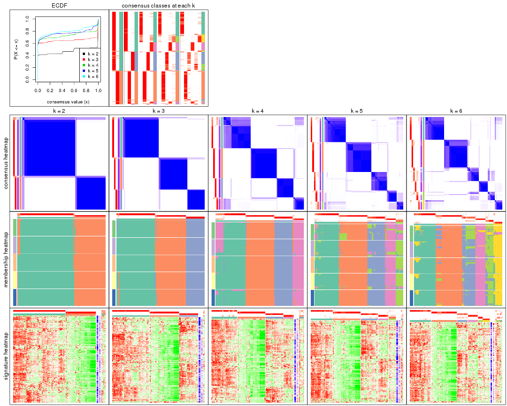

The plots are:

- The first row: a plot of the ECDF (empirical cumulative distribution
  function) curves of the consensus matrix for each `k` and the heatmap of
  predicted classes for each `k`.
- The second row: heatmaps of the consensus matrix for each `k`.
- The third row: heatmaps of the membership matrix for each `k`.
- The fouth row: heatmaps of the signatures for each `k`.

All the plots in panels can be made by individual functions and they are
plotted later in this section.

`select_partition_number()` produces several plots showing different
statistics for choosing "optimized" `k`. There are following statistics:

- ECDF curves of the consensus matrix for each `k`;
- 1-PAC. [The PAC
  score](https://en.wikipedia.org/wiki/Consensus_clustering#Over-interpretation_potential_of_consensus_clustering)
  measures the proportion of the ambiguous subgrouping.
- Mean silhouette score.
- Concordance. The mean probability of fiting the consensus class ids in all
  partitions.
- Area increased. Denote $A_k$ as the area under the ECDF curve for current
  `k`, the area increased is defined as $A_k - A_{k-1}$.
- Rand index. The percent of pairs of samples that are both in a same cluster
  or both are not in a same cluster in the partition of k and k-1.
- Jaccard index. The ratio of pairs of samples are both in a same cluster in
  the partition of k and k-1 and the pairs of samples are both in a same
  cluster in the partition k or k-1.

The detailed explanations of these statistics can be found in [the _cola_
vignette](http://bioconductor.org/packages/devel/bioc/vignettes/cola/inst/doc/cola.html#toc_13).

Generally speaking, lower PAC score, higher mean silhouette score or higher
concordance corresponds to better partition. Rand index and Jaccard index
measure how similar the current partition is compared to partition with `k-1`.
If they are too similar, we won't accept `k` is better than `k-1`.

```r
select_partition_number(res)
```


The numeric values for all these statistics can be obtained by `get_stats()`.

```r
get_stats(res)
```

```
#>   k 1-PAC mean_silhouette concordance area_increased  Rand Jaccard
#> 2 2 0.983           0.941       0.978         0.4703 0.533   0.533
#> 3 3 0.989           0.965       0.985         0.3812 0.799   0.630
#> 4 4 0.916           0.880       0.941         0.1321 0.898   0.720
#> 5 5 0.894           0.876       0.915         0.0492 0.952   0.828
#> 6 6 0.856           0.796       0.885         0.0391 0.940   0.755
```

`suggest_best_k()` suggests the best $k$ based on these statistics. The rules are as follows:

- All $k$ with Jaccard index larger than 0.95 are removed because increasing
  $k$ does not provide enough extra information. If all $k$ are removed, it is
  marked as no subgroup is detected.
- For all $k$ with 1-PAC score larger than 0.9, the maximal $k$ is taken as
  the best $k$, and other $k$ are marked as optional $k$.
- If it does not fit the second rule. The $k$ with the maximal vote of the
  highest 1-PAC score, highest mean silhouette, and highest concordance is
  taken as the best $k$.

```r
suggest_best_k(res)
```

```
#> [1] 4
#> attr(,"optional")
#> [1] 2 3
```

There is also optional best $k$ = 2 3 that is worth to check.

Following shows the table of the partitions (You need to click the **show/hide
code output** link to see it). The membership matrix (columns with name `p*`)
is inferred by
[`clue::cl_consensus()`](https://www.rdocumentation.org/link/cl_consensus?package=clue)
function with the `SE` method. Basically the value in the membership matrix
represents the probability to belong to a certain group. The finall class
label for an item is determined with the group with highest probability it
belongs to.

In `get_classes()` function, the entropy is calculated from the membership
matrix and the silhouette score is calculated from the consensus matrix.


<script>
$( function() {
	$( '#tabs-MAD-skmeans-get-classes' ).tabs();
} );
</script>
<div id='tabs-MAD-skmeans-get-classes'>
<ul>
<li><a href='#tab-MAD-skmeans-get-classes-1'>k = 2</a></li>
<li><a href='#tab-MAD-skmeans-get-classes-2'>k = 3</a></li>
<li><a href='#tab-MAD-skmeans-get-classes-3'>k = 4</a></li>
<li><a href='#tab-MAD-skmeans-get-classes-4'>k = 5</a></li>
<li><a href='#tab-MAD-skmeans-get-classes-5'>k = 6</a></li>
</ul>

<div id='tab-MAD-skmeans-get-classes-1'>
<p><a id='tab-MAD-skmeans-get-classes-1-a' style='color:#0366d6' href='#'>show/hide code output</a></p>
<pre><code class="r">cbind(get_classes(res, k = 2), get_membership(res, k = 2))
</code></pre>

<pre><code>#&gt;           class entropy silhouette    p1    p2
#&gt; DRR006374     2   0.000      0.977 0.000 1.000
#&gt; DRR006375     1   0.000      0.977 1.000 0.000
#&gt; DRR006376     1   0.000      0.977 1.000 0.000
#&gt; DRR006377     2   0.971      0.310 0.400 0.600
#&gt; DRR006378     2   0.000      0.977 0.000 1.000
#&gt; DRR006379     1   0.000      0.977 1.000 0.000
#&gt; DRR006380     2   0.000      0.977 0.000 1.000
#&gt; DRR006381     1   0.000      0.977 1.000 0.000
#&gt; DRR006382     2   0.000      0.977 0.000 1.000
#&gt; DRR006383     2   0.000      0.977 0.000 1.000
#&gt; DRR006384     2   0.000      0.977 0.000 1.000
#&gt; DRR006385     1   0.000      0.977 1.000 0.000
#&gt; DRR006386     2   0.000      0.977 0.000 1.000
#&gt; DRR006387     1   0.000      0.977 1.000 0.000
#&gt; DRR006388     1   0.000      0.977 1.000 0.000
#&gt; DRR006389     1   0.000      0.977 1.000 0.000
#&gt; DRR006390     2   0.000      0.977 0.000 1.000
#&gt; DRR006391     2   0.000      0.977 0.000 1.000
#&gt; DRR006392     1   0.000      0.977 1.000 0.000
#&gt; DRR006393     1   0.000      0.977 1.000 0.000
#&gt; DRR006394     2   0.000      0.977 0.000 1.000
#&gt; DRR006395     1   0.000      0.977 1.000 0.000
#&gt; DRR006396     1   0.000      0.977 1.000 0.000
#&gt; DRR006397     1   0.000      0.977 1.000 0.000
#&gt; DRR006398     1   0.000      0.977 1.000 0.000
#&gt; DRR006399     1   0.000      0.977 1.000 0.000
#&gt; DRR006400     1   0.000      0.977 1.000 0.000
#&gt; DRR006401     2   0.000      0.977 0.000 1.000
#&gt; DRR006402     2   0.000      0.977 0.000 1.000
#&gt; DRR006403     1   0.000      0.977 1.000 0.000
#&gt; DRR006404     1   0.000      0.977 1.000 0.000
#&gt; DRR006405     1   0.000      0.977 1.000 0.000
#&gt; DRR006406     1   0.000      0.977 1.000 0.000
#&gt; DRR006407     2   0.000      0.977 0.000 1.000
#&gt; DRR006408     2   0.000      0.977 0.000 1.000
#&gt; DRR006409     1   0.000      0.977 1.000 0.000
#&gt; DRR006410     1   0.000      0.977 1.000 0.000
#&gt; DRR006411     2   0.978      0.290 0.412 0.588
#&gt; DRR006412     2   0.000      0.977 0.000 1.000
#&gt; DRR006413     1   0.000      0.977 1.000 0.000
#&gt; DRR006414     1   0.000      0.977 1.000 0.000
#&gt; DRR006415     1   0.000      0.977 1.000 0.000
#&gt; DRR006416     1   0.000      0.977 1.000 0.000
#&gt; DRR006417     1   0.000      0.977 1.000 0.000
#&gt; DRR006418     1   0.000      0.977 1.000 0.000
#&gt; DRR006419     1   0.000      0.977 1.000 0.000
#&gt; DRR006420     1   0.000      0.977 1.000 0.000
#&gt; DRR006421     1   0.000      0.977 1.000 0.000
#&gt; DRR006422     2   0.000      0.977 0.000 1.000
#&gt; DRR006423     2   0.000      0.977 0.000 1.000
#&gt; DRR006424     1   0.000      0.977 1.000 0.000
#&gt; DRR006425     2   0.000      0.977 0.000 1.000
#&gt; DRR006426     1   0.000      0.977 1.000 0.000
#&gt; DRR006427     2   0.000      0.977 0.000 1.000
#&gt; DRR006428     1   0.000      0.977 1.000 0.000
#&gt; DRR006429     2   0.000      0.977 0.000 1.000
#&gt; DRR006430     1   0.000      0.977 1.000 0.000
#&gt; DRR006431     1   0.000      0.977 1.000 0.000
#&gt; DRR006432     1   0.000      0.977 1.000 0.000
#&gt; DRR006433     1   0.978      0.299 0.588 0.412
#&gt; DRR006434     2   0.000      0.977 0.000 1.000
#&gt; DRR006435     2   0.000      0.977 0.000 1.000
#&gt; DRR006436     2   0.000      0.977 0.000 1.000
#&gt; DRR006437     1   0.000      0.977 1.000 0.000
#&gt; DRR006438     1   0.000      0.977 1.000 0.000
#&gt; DRR006439     1   0.000      0.977 1.000 0.000
#&gt; DRR006440     2   0.000      0.977 0.000 1.000
#&gt; DRR006441     2   0.000      0.977 0.000 1.000
#&gt; DRR006442     1   0.000      0.977 1.000 0.000
#&gt; DRR006443     2   0.000      0.977 0.000 1.000
#&gt; DRR006444     2   0.000      0.977 0.000 1.000
#&gt; DRR006445     1   0.000      0.977 1.000 0.000
#&gt; DRR006446     2   0.000      0.977 0.000 1.000
#&gt; DRR006447     1   0.000      0.977 1.000 0.000
#&gt; DRR006448     1   0.000      0.977 1.000 0.000
#&gt; DRR006449     1   0.000      0.977 1.000 0.000
#&gt; DRR006450     1   0.000      0.977 1.000 0.000
#&gt; DRR006451     1   0.000      0.977 1.000 0.000
#&gt; DRR006452     1   0.000      0.977 1.000 0.000
#&gt; DRR006453     1   0.000      0.977 1.000 0.000
#&gt; DRR006454     1   0.971      0.313 0.600 0.400
#&gt; DRR006455     2   0.000      0.977 0.000 1.000
#&gt; DRR006456     1   0.978      0.299 0.588 0.412
#&gt; DRR006457     1   0.141      0.958 0.980 0.020
#&gt; DRR006458     1   0.000      0.977 1.000 0.000
#&gt; DRR006459     1   0.000      0.977 1.000 0.000
#&gt; DRR006460     2   0.000      0.977 0.000 1.000
#&gt; DRR006461     2   0.000      0.977 0.000 1.000
#&gt; DRR006462     1   0.000      0.977 1.000 0.000
#&gt; DRR006463     2   0.000      0.977 0.000 1.000
#&gt; DRR006464     2   0.000      0.977 0.000 1.000
#&gt; DRR006465     1   0.000      0.977 1.000 0.000
#&gt; DRR006466     2   0.000      0.977 0.000 1.000
#&gt; DRR006467     1   0.000      0.977 1.000 0.000
#&gt; DRR006468     2   0.000      0.977 0.000 1.000
#&gt; DRR006469     2   0.000      0.977 0.000 1.000
#&gt; DRR006470     1   0.000      0.977 1.000 0.000
#&gt; DRR006471     1   0.000      0.977 1.000 0.000
#&gt; DRR006472     2   0.605      0.812 0.148 0.852
#&gt; DRR006473     2   0.000      0.977 0.000 1.000
#&gt; DRR006474     2   0.000      0.977 0.000 1.000
#&gt; DRR006475     1   0.000      0.977 1.000 0.000
#&gt; DRR006476     2   0.000      0.977 0.000 1.000
#&gt; DRR006477     1   0.978      0.299 0.588 0.412
#&gt; DRR006478     1   0.000      0.977 1.000 0.000
#&gt; DRR006479     1   0.000      0.977 1.000 0.000
#&gt; DRR006480     1   0.000      0.977 1.000 0.000
#&gt; DRR006481     1   0.000      0.977 1.000 0.000
#&gt; DRR006482     1   0.000      0.977 1.000 0.000
#&gt; DRR006483     1   0.000      0.977 1.000 0.000
#&gt; DRR006484     1   0.000      0.977 1.000 0.000
#&gt; DRR006485     2   0.000      0.977 0.000 1.000
#&gt; DRR006486     1   0.000      0.977 1.000 0.000
#&gt; DRR006487     1   0.118      0.962 0.984 0.016
#&gt; DRR006488     2   0.000      0.977 0.000 1.000
#&gt; DRR006489     1   0.000      0.977 1.000 0.000
#&gt; DRR006490     1   0.000      0.977 1.000 0.000
#&gt; DRR006491     1   0.000      0.977 1.000 0.000
#&gt; DRR006492     1   0.000      0.977 1.000 0.000
#&gt; DRR006493     1   0.118      0.962 0.984 0.016
#&gt; DRR006494     1   0.000      0.977 1.000 0.000
</code></pre>

<script>
$('#tab-MAD-skmeans-get-classes-1-a').parent().next().next().hide();
$('#tab-MAD-skmeans-get-classes-1-a').click(function(){
  $('#tab-MAD-skmeans-get-classes-1-a').parent().next().next().toggle();
  return(false);
});
</script>
</div>

<div id='tab-MAD-skmeans-get-classes-2'>
<p><a id='tab-MAD-skmeans-get-classes-2-a' style='color:#0366d6' href='#'>show/hide code output</a></p>
<pre><code class="r">cbind(get_classes(res, k = 3), get_membership(res, k = 3))
</code></pre>

<pre><code>#&gt;           class entropy silhouette    p1    p2    p3
#&gt; DRR006374     2  0.0000      0.981 0.000 1.000 0.000
#&gt; DRR006375     1  0.0000      0.982 1.000 0.000 0.000
#&gt; DRR006376     1  0.0000      0.982 1.000 0.000 0.000
#&gt; DRR006377     2  0.8590      0.447 0.164 0.600 0.236
#&gt; DRR006378     2  0.0000      0.981 0.000 1.000 0.000
#&gt; DRR006379     1  0.0000      0.982 1.000 0.000 0.000
#&gt; DRR006380     2  0.0000      0.981 0.000 1.000 0.000
#&gt; DRR006381     1  0.0000      0.982 1.000 0.000 0.000
#&gt; DRR006382     2  0.0000      0.981 0.000 1.000 0.000
#&gt; DRR006383     2  0.3551      0.840 0.000 0.868 0.132
#&gt; DRR006384     2  0.0000      0.981 0.000 1.000 0.000
#&gt; DRR006385     1  0.0000      0.982 1.000 0.000 0.000
#&gt; DRR006386     2  0.0000      0.981 0.000 1.000 0.000
#&gt; DRR006387     1  0.0000      0.982 1.000 0.000 0.000
#&gt; DRR006388     1  0.0000      0.982 1.000 0.000 0.000
#&gt; DRR006389     1  0.0000      0.982 1.000 0.000 0.000
#&gt; DRR006390     2  0.0000      0.981 0.000 1.000 0.000
#&gt; DRR006391     2  0.0000      0.981 0.000 1.000 0.000
#&gt; DRR006392     1  0.0000      0.982 1.000 0.000 0.000
#&gt; DRR006393     1  0.0000      0.982 1.000 0.000 0.000
#&gt; DRR006394     2  0.0000      0.981 0.000 1.000 0.000
#&gt; DRR006395     1  0.0000      0.982 1.000 0.000 0.000
#&gt; DRR006396     1  0.0000      0.982 1.000 0.000 0.000
#&gt; DRR006397     1  0.0000      0.982 1.000 0.000 0.000
#&gt; DRR006398     1  0.0000      0.982 1.000 0.000 0.000
#&gt; DRR006399     1  0.0000      0.982 1.000 0.000 0.000
#&gt; DRR006400     1  0.0000      0.982 1.000 0.000 0.000
#&gt; DRR006401     2  0.0000      0.981 0.000 1.000 0.000
#&gt; DRR006402     2  0.0000      0.981 0.000 1.000 0.000
#&gt; DRR006403     1  0.0000      0.982 1.000 0.000 0.000
#&gt; DRR006404     1  0.0000      0.982 1.000 0.000 0.000
#&gt; DRR006405     1  0.0000      0.982 1.000 0.000 0.000
#&gt; DRR006406     1  0.0000      0.982 1.000 0.000 0.000
#&gt; DRR006407     2  0.0237      0.977 0.004 0.996 0.000
#&gt; DRR006408     2  0.0000      0.981 0.000 1.000 0.000
#&gt; DRR006409     1  0.0000      0.982 1.000 0.000 0.000
#&gt; DRR006410     1  0.0000      0.982 1.000 0.000 0.000
#&gt; DRR006411     1  0.6126      0.340 0.600 0.400 0.000
#&gt; DRR006412     2  0.0000      0.981 0.000 1.000 0.000
#&gt; DRR006413     1  0.0000      0.982 1.000 0.000 0.000
#&gt; DRR006414     3  0.0000      0.994 0.000 0.000 1.000
#&gt; DRR006415     3  0.0000      0.994 0.000 0.000 1.000
#&gt; DRR006416     1  0.0000      0.982 1.000 0.000 0.000
#&gt; DRR006417     3  0.0000      0.994 0.000 0.000 1.000
#&gt; DRR006418     1  0.0000      0.982 1.000 0.000 0.000
#&gt; DRR006419     3  0.0000      0.994 0.000 0.000 1.000
#&gt; DRR006420     3  0.0000      0.994 0.000 0.000 1.000
#&gt; DRR006421     3  0.0000      0.994 0.000 0.000 1.000
#&gt; DRR006422     2  0.0000      0.981 0.000 1.000 0.000
#&gt; DRR006423     2  0.0000      0.981 0.000 1.000 0.000
#&gt; DRR006424     1  0.0000      0.982 1.000 0.000 0.000
#&gt; DRR006425     2  0.0000      0.981 0.000 1.000 0.000
#&gt; DRR006426     3  0.0000      0.994 0.000 0.000 1.000
#&gt; DRR006427     2  0.0000      0.981 0.000 1.000 0.000
#&gt; DRR006428     3  0.0000      0.994 0.000 0.000 1.000
#&gt; DRR006429     2  0.0000      0.981 0.000 1.000 0.000
#&gt; DRR006430     1  0.0000      0.982 1.000 0.000 0.000
#&gt; DRR006431     1  0.0000      0.982 1.000 0.000 0.000
#&gt; DRR006432     3  0.0000      0.994 0.000 0.000 1.000
#&gt; DRR006433     3  0.0000      0.994 0.000 0.000 1.000
#&gt; DRR006434     2  0.0000      0.981 0.000 1.000 0.000
#&gt; DRR006435     2  0.0000      0.981 0.000 1.000 0.000
#&gt; DRR006436     2  0.0000      0.981 0.000 1.000 0.000
#&gt; DRR006437     1  0.0000      0.982 1.000 0.000 0.000
#&gt; DRR006438     3  0.0000      0.994 0.000 0.000 1.000
#&gt; DRR006439     3  0.0000      0.994 0.000 0.000 1.000
#&gt; DRR006440     2  0.0000      0.981 0.000 1.000 0.000
#&gt; DRR006441     2  0.0000      0.981 0.000 1.000 0.000
#&gt; DRR006442     3  0.0000      0.994 0.000 0.000 1.000
#&gt; DRR006443     2  0.0000      0.981 0.000 1.000 0.000
#&gt; DRR006444     2  0.0000      0.981 0.000 1.000 0.000
#&gt; DRR006445     1  0.0000      0.982 1.000 0.000 0.000
#&gt; DRR006446     2  0.0000      0.981 0.000 1.000 0.000
#&gt; DRR006447     1  0.0000      0.982 1.000 0.000 0.000
#&gt; DRR006448     1  0.0000      0.982 1.000 0.000 0.000
#&gt; DRR006449     1  0.0000      0.982 1.000 0.000 0.000
#&gt; DRR006450     1  0.0000      0.982 1.000 0.000 0.000
#&gt; DRR006451     1  0.0000      0.982 1.000 0.000 0.000
#&gt; DRR006452     1  0.0000      0.982 1.000 0.000 0.000
#&gt; DRR006453     1  0.0000      0.982 1.000 0.000 0.000
#&gt; DRR006454     1  0.5058      0.677 0.756 0.244 0.000
#&gt; DRR006455     2  0.0000      0.981 0.000 1.000 0.000
#&gt; DRR006456     3  0.0000      0.994 0.000 0.000 1.000
#&gt; DRR006457     3  0.0000      0.994 0.000 0.000 1.000
#&gt; DRR006458     1  0.0000      0.982 1.000 0.000 0.000
#&gt; DRR006459     1  0.0000      0.982 1.000 0.000 0.000
#&gt; DRR006460     2  0.0000      0.981 0.000 1.000 0.000
#&gt; DRR006461     2  0.0000      0.981 0.000 1.000 0.000
#&gt; DRR006462     1  0.0000      0.982 1.000 0.000 0.000
#&gt; DRR006463     2  0.0000      0.981 0.000 1.000 0.000
#&gt; DRR006464     2  0.0000      0.981 0.000 1.000 0.000
#&gt; DRR006465     1  0.0000      0.982 1.000 0.000 0.000
#&gt; DRR006466     2  0.4931      0.698 0.000 0.768 0.232
#&gt; DRR006467     1  0.0000      0.982 1.000 0.000 0.000
#&gt; DRR006468     2  0.0000      0.981 0.000 1.000 0.000
#&gt; DRR006469     2  0.0000      0.981 0.000 1.000 0.000
#&gt; DRR006470     3  0.0000      0.994 0.000 0.000 1.000
#&gt; DRR006471     1  0.0000      0.982 1.000 0.000 0.000
#&gt; DRR006472     3  0.0000      0.994 0.000 0.000 1.000
#&gt; DRR006473     2  0.0000      0.981 0.000 1.000 0.000
#&gt; DRR006474     2  0.0000      0.981 0.000 1.000 0.000
#&gt; DRR006475     1  0.2711      0.894 0.912 0.000 0.088
#&gt; DRR006476     2  0.0000      0.981 0.000 1.000 0.000
#&gt; DRR006477     3  0.3752      0.826 0.000 0.144 0.856
#&gt; DRR006478     1  0.0000      0.982 1.000 0.000 0.000
#&gt; DRR006479     3  0.0000      0.994 0.000 0.000 1.000
#&gt; DRR006480     1  0.0000      0.982 1.000 0.000 0.000
#&gt; DRR006481     3  0.0000      0.994 0.000 0.000 1.000
#&gt; DRR006482     1  0.0000      0.982 1.000 0.000 0.000
#&gt; DRR006483     1  0.0000      0.982 1.000 0.000 0.000
#&gt; DRR006484     3  0.0000      0.994 0.000 0.000 1.000
#&gt; DRR006485     2  0.0000      0.981 0.000 1.000 0.000
#&gt; DRR006486     3  0.0000      0.994 0.000 0.000 1.000
#&gt; DRR006487     3  0.0000      0.994 0.000 0.000 1.000
#&gt; DRR006488     2  0.0000      0.981 0.000 1.000 0.000
#&gt; DRR006489     1  0.0000      0.982 1.000 0.000 0.000
#&gt; DRR006490     3  0.0000      0.994 0.000 0.000 1.000
#&gt; DRR006491     3  0.0000      0.994 0.000 0.000 1.000
#&gt; DRR006492     1  0.3412      0.852 0.876 0.000 0.124
#&gt; DRR006493     3  0.0000      0.994 0.000 0.000 1.000
#&gt; DRR006494     1  0.0000      0.982 1.000 0.000 0.000
</code></pre>

<script>
$('#tab-MAD-skmeans-get-classes-2-a').parent().next().next().hide();
$('#tab-MAD-skmeans-get-classes-2-a').click(function(){
  $('#tab-MAD-skmeans-get-classes-2-a').parent().next().next().toggle();
  return(false);
});
</script>
</div>

<div id='tab-MAD-skmeans-get-classes-3'>
<p><a id='tab-MAD-skmeans-get-classes-3-a' style='color:#0366d6' href='#'>show/hide code output</a></p>
<pre><code class="r">cbind(get_classes(res, k = 4), get_membership(res, k = 4))
</code></pre>

<pre><code>#&gt;           class entropy silhouette    p1    p2    p3    p4
#&gt; DRR006374     2  0.0000      0.989 0.000 1.000 0.000 0.000
#&gt; DRR006375     1  0.1557      0.834 0.944 0.000 0.000 0.056
#&gt; DRR006376     4  0.0921      0.910 0.028 0.000 0.000 0.972
#&gt; DRR006377     4  0.5355      0.433 0.020 0.360 0.000 0.620
#&gt; DRR006378     2  0.0000      0.989 0.000 1.000 0.000 0.000
#&gt; DRR006379     4  0.0921      0.910 0.028 0.000 0.000 0.972
#&gt; DRR006380     2  0.0000      0.989 0.000 1.000 0.000 0.000
#&gt; DRR006381     1  0.0707      0.858 0.980 0.000 0.000 0.020
#&gt; DRR006382     2  0.0336      0.983 0.000 0.992 0.000 0.008
#&gt; DRR006383     2  0.0524      0.980 0.000 0.988 0.004 0.008
#&gt; DRR006384     2  0.0000      0.989 0.000 1.000 0.000 0.000
#&gt; DRR006385     1  0.4543      0.614 0.676 0.000 0.000 0.324
#&gt; DRR006386     2  0.0000      0.989 0.000 1.000 0.000 0.000
#&gt; DRR006387     1  0.4679      0.557 0.648 0.000 0.000 0.352
#&gt; DRR006388     1  0.4977      0.390 0.540 0.000 0.000 0.460
#&gt; DRR006389     1  0.4977      0.390 0.540 0.000 0.000 0.460
#&gt; DRR006390     2  0.0000      0.989 0.000 1.000 0.000 0.000
#&gt; DRR006391     2  0.0000      0.989 0.000 1.000 0.000 0.000
#&gt; DRR006392     1  0.0000      0.861 1.000 0.000 0.000 0.000
#&gt; DRR006393     1  0.0000      0.861 1.000 0.000 0.000 0.000
#&gt; DRR006394     2  0.0000      0.989 0.000 1.000 0.000 0.000
#&gt; DRR006395     4  0.0921      0.910 0.028 0.000 0.000 0.972
#&gt; DRR006396     1  0.4761      0.555 0.628 0.000 0.000 0.372
#&gt; DRR006397     1  0.4992      0.352 0.524 0.000 0.000 0.476
#&gt; DRR006398     1  0.4992      0.352 0.524 0.000 0.000 0.476
#&gt; DRR006399     4  0.0921      0.910 0.028 0.000 0.000 0.972
#&gt; DRR006400     4  0.0921      0.910 0.028 0.000 0.000 0.972
#&gt; DRR006401     2  0.0000      0.989 0.000 1.000 0.000 0.000
#&gt; DRR006402     2  0.0000      0.989 0.000 1.000 0.000 0.000
#&gt; DRR006403     4  0.0921      0.910 0.028 0.000 0.000 0.972
#&gt; DRR006404     4  0.0921      0.910 0.028 0.000 0.000 0.972
#&gt; DRR006405     4  0.0921      0.910 0.028 0.000 0.000 0.972
#&gt; DRR006406     4  0.0921      0.910 0.028 0.000 0.000 0.972
#&gt; DRR006407     4  0.0921      0.894 0.000 0.028 0.000 0.972
#&gt; DRR006408     4  0.4817      0.371 0.000 0.388 0.000 0.612
#&gt; DRR006409     1  0.0336      0.860 0.992 0.000 0.008 0.000
#&gt; DRR006410     1  0.4679      0.557 0.648 0.000 0.000 0.352
#&gt; DRR006411     4  0.2918      0.816 0.008 0.116 0.000 0.876
#&gt; DRR006412     2  0.0000      0.989 0.000 1.000 0.000 0.000
#&gt; DRR006413     1  0.0707      0.858 0.980 0.000 0.000 0.020
#&gt; DRR006414     3  0.0000      0.986 0.000 0.000 1.000 0.000
#&gt; DRR006415     3  0.0336      0.984 0.000 0.000 0.992 0.008
#&gt; DRR006416     1  0.0707      0.858 0.980 0.000 0.000 0.020
#&gt; DRR006417     3  0.0000      0.986 0.000 0.000 1.000 0.000
#&gt; DRR006418     1  0.1042      0.856 0.972 0.000 0.008 0.020
#&gt; DRR006419     3  0.0000      0.986 0.000 0.000 1.000 0.000
#&gt; DRR006420     3  0.0000      0.986 0.000 0.000 1.000 0.000
#&gt; DRR006421     3  0.0188      0.985 0.000 0.000 0.996 0.004
#&gt; DRR006422     2  0.0000      0.989 0.000 1.000 0.000 0.000
#&gt; DRR006423     2  0.0000      0.989 0.000 1.000 0.000 0.000
#&gt; DRR006424     1  0.0000      0.861 1.000 0.000 0.000 0.000
#&gt; DRR006425     2  0.0000      0.989 0.000 1.000 0.000 0.000
#&gt; DRR006426     3  0.0000      0.986 0.000 0.000 1.000 0.000
#&gt; DRR006427     2  0.0000      0.989 0.000 1.000 0.000 0.000
#&gt; DRR006428     3  0.0000      0.986 0.000 0.000 1.000 0.000
#&gt; DRR006429     2  0.0000      0.989 0.000 1.000 0.000 0.000
#&gt; DRR006430     1  0.0000      0.861 1.000 0.000 0.000 0.000
#&gt; DRR006431     1  0.0000      0.861 1.000 0.000 0.000 0.000
#&gt; DRR006432     3  0.0000      0.986 0.000 0.000 1.000 0.000
#&gt; DRR006433     3  0.0336      0.984 0.000 0.000 0.992 0.008
#&gt; DRR006434     2  0.0000      0.989 0.000 1.000 0.000 0.000
#&gt; DRR006435     2  0.0000      0.989 0.000 1.000 0.000 0.000
#&gt; DRR006436     2  0.0000      0.989 0.000 1.000 0.000 0.000
#&gt; DRR006437     1  0.4761      0.555 0.628 0.000 0.000 0.372
#&gt; DRR006438     3  0.0000      0.986 0.000 0.000 1.000 0.000
#&gt; DRR006439     3  0.0000      0.986 0.000 0.000 1.000 0.000
#&gt; DRR006440     2  0.0336      0.983 0.000 0.992 0.000 0.008
#&gt; DRR006441     2  0.0000      0.989 0.000 1.000 0.000 0.000
#&gt; DRR006442     3  0.0336      0.984 0.000 0.000 0.992 0.008
#&gt; DRR006443     2  0.0336      0.983 0.000 0.992 0.000 0.008
#&gt; DRR006444     2  0.0000      0.989 0.000 1.000 0.000 0.000
#&gt; DRR006445     1  0.0707      0.858 0.980 0.000 0.000 0.020
#&gt; DRR006446     2  0.0000      0.989 0.000 1.000 0.000 0.000
#&gt; DRR006447     1  0.0707      0.858 0.980 0.000 0.000 0.020
#&gt; DRR006448     4  0.0921      0.910 0.028 0.000 0.000 0.972
#&gt; DRR006449     1  0.0000      0.861 1.000 0.000 0.000 0.000
#&gt; DRR006450     1  0.0707      0.858 0.980 0.000 0.000 0.020
#&gt; DRR006451     4  0.0336      0.897 0.008 0.000 0.000 0.992
#&gt; DRR006452     1  0.0707      0.858 0.980 0.000 0.000 0.020
#&gt; DRR006453     1  0.0707      0.858 0.980 0.000 0.000 0.020
#&gt; DRR006454     4  0.2816      0.845 0.036 0.064 0.000 0.900
#&gt; DRR006455     2  0.0000      0.989 0.000 1.000 0.000 0.000
#&gt; DRR006456     3  0.0336      0.984 0.000 0.000 0.992 0.008
#&gt; DRR006457     3  0.0336      0.984 0.000 0.000 0.992 0.008
#&gt; DRR006458     1  0.0336      0.860 0.992 0.000 0.008 0.000
#&gt; DRR006459     1  0.0336      0.860 0.992 0.000 0.008 0.000
#&gt; DRR006460     2  0.0000      0.989 0.000 1.000 0.000 0.000
#&gt; DRR006461     2  0.0000      0.989 0.000 1.000 0.000 0.000
#&gt; DRR006462     1  0.4713      0.545 0.640 0.000 0.000 0.360
#&gt; DRR006463     2  0.0336      0.983 0.000 0.992 0.000 0.008
#&gt; DRR006464     2  0.0000      0.989 0.000 1.000 0.000 0.000
#&gt; DRR006465     1  0.0000      0.861 1.000 0.000 0.000 0.000
#&gt; DRR006466     2  0.4746      0.546 0.000 0.688 0.304 0.008
#&gt; DRR006467     1  0.0000      0.861 1.000 0.000 0.000 0.000
#&gt; DRR006468     2  0.0000      0.989 0.000 1.000 0.000 0.000
#&gt; DRR006469     2  0.0000      0.989 0.000 1.000 0.000 0.000
#&gt; DRR006470     3  0.0000      0.986 0.000 0.000 1.000 0.000
#&gt; DRR006471     1  0.0336      0.860 0.992 0.000 0.008 0.000
#&gt; DRR006472     3  0.0336      0.984 0.000 0.000 0.992 0.008
#&gt; DRR006473     2  0.0000      0.989 0.000 1.000 0.000 0.000
#&gt; DRR006474     2  0.0000      0.989 0.000 1.000 0.000 0.000
#&gt; DRR006475     1  0.0336      0.860 0.992 0.000 0.008 0.000
#&gt; DRR006476     2  0.0000      0.989 0.000 1.000 0.000 0.000
#&gt; DRR006477     3  0.5483      0.678 0.000 0.136 0.736 0.128
#&gt; DRR006478     1  0.0000      0.861 1.000 0.000 0.000 0.000
#&gt; DRR006479     3  0.0000      0.986 0.000 0.000 1.000 0.000
#&gt; DRR006480     1  0.0336      0.860 0.992 0.000 0.008 0.000
#&gt; DRR006481     3  0.0000      0.986 0.000 0.000 1.000 0.000
#&gt; DRR006482     1  0.4761      0.555 0.628 0.000 0.000 0.372
#&gt; DRR006483     1  0.0336      0.860 0.992 0.000 0.008 0.000
#&gt; DRR006484     3  0.0000      0.986 0.000 0.000 1.000 0.000
#&gt; DRR006485     2  0.0336      0.983 0.000 0.992 0.000 0.008
#&gt; DRR006486     1  0.4697      0.390 0.644 0.000 0.356 0.000
#&gt; DRR006487     3  0.0336      0.984 0.000 0.000 0.992 0.008
#&gt; DRR006488     2  0.0000      0.989 0.000 1.000 0.000 0.000
#&gt; DRR006489     1  0.0000      0.861 1.000 0.000 0.000 0.000
#&gt; DRR006490     3  0.0000      0.986 0.000 0.000 1.000 0.000
#&gt; DRR006491     3  0.0000      0.986 0.000 0.000 1.000 0.000
#&gt; DRR006492     1  0.0336      0.860 0.992 0.000 0.008 0.000
#&gt; DRR006493     3  0.0336      0.984 0.000 0.000 0.992 0.008
#&gt; DRR006494     1  0.0336      0.860 0.992 0.000 0.008 0.000
</code></pre>

<script>
$('#tab-MAD-skmeans-get-classes-3-a').parent().next().next().hide();
$('#tab-MAD-skmeans-get-classes-3-a').click(function(){
  $('#tab-MAD-skmeans-get-classes-3-a').parent().next().next().toggle();
  return(false);
});
</script>
</div>

<div id='tab-MAD-skmeans-get-classes-4'>
<p><a id='tab-MAD-skmeans-get-classes-4-a' style='color:#0366d6' href='#'>show/hide code output</a></p>
<pre><code class="r">cbind(get_classes(res, k = 5), get_membership(res, k = 5))
</code></pre>

<pre><code>#&gt;           class entropy silhouette    p1    p2    p3    p4    p5
#&gt; DRR006374     2  0.0000      0.959 0.000 1.000 0.000 0.000 0.000
#&gt; DRR006375     1  0.1197      0.887 0.952 0.000 0.000 0.048 0.000
#&gt; DRR006376     4  0.0404      0.886 0.012 0.000 0.000 0.988 0.000
#&gt; DRR006377     4  0.4214      0.677 0.004 0.088 0.000 0.788 0.120
#&gt; DRR006378     2  0.0290      0.958 0.000 0.992 0.000 0.000 0.008
#&gt; DRR006379     4  0.0404      0.886 0.012 0.000 0.000 0.988 0.000
#&gt; DRR006380     2  0.1792      0.918 0.000 0.916 0.000 0.000 0.084
#&gt; DRR006381     1  0.0609      0.913 0.980 0.000 0.000 0.000 0.020
#&gt; DRR006382     2  0.1965      0.911 0.000 0.904 0.000 0.000 0.096
#&gt; DRR006383     2  0.4164      0.795 0.000 0.784 0.120 0.000 0.096
#&gt; DRR006384     2  0.0000      0.959 0.000 1.000 0.000 0.000 0.000
#&gt; DRR006385     5  0.5307      0.851 0.156 0.000 0.000 0.168 0.676
#&gt; DRR006386     2  0.0000      0.959 0.000 1.000 0.000 0.000 0.000
#&gt; DRR006387     1  0.3863      0.654 0.772 0.000 0.000 0.200 0.028
#&gt; DRR006388     5  0.4766      0.900 0.072 0.000 0.000 0.220 0.708
#&gt; DRR006389     5  0.4766      0.900 0.072 0.000 0.000 0.220 0.708
#&gt; DRR006390     2  0.0290      0.958 0.000 0.992 0.000 0.000 0.008
#&gt; DRR006391     2  0.0290      0.958 0.000 0.992 0.000 0.000 0.008
#&gt; DRR006392     1  0.0000      0.920 1.000 0.000 0.000 0.000 0.000
#&gt; DRR006393     1  0.0000      0.920 1.000 0.000 0.000 0.000 0.000
#&gt; DRR006394     2  0.0404      0.956 0.000 0.988 0.000 0.000 0.012
#&gt; DRR006395     4  0.0404      0.886 0.012 0.000 0.000 0.988 0.000
#&gt; DRR006396     1  0.6206      0.137 0.548 0.000 0.000 0.200 0.252
#&gt; DRR006397     5  0.4737      0.898 0.068 0.000 0.000 0.224 0.708
#&gt; DRR006398     5  0.4737      0.898 0.068 0.000 0.000 0.224 0.708
#&gt; DRR006399     4  0.0404      0.886 0.012 0.000 0.000 0.988 0.000
#&gt; DRR006400     4  0.0404      0.886 0.012 0.000 0.000 0.988 0.000
#&gt; DRR006401     2  0.0000      0.959 0.000 1.000 0.000 0.000 0.000
#&gt; DRR006402     2  0.0000      0.959 0.000 1.000 0.000 0.000 0.000
#&gt; DRR006403     4  0.0404      0.886 0.012 0.000 0.000 0.988 0.000
#&gt; DRR006404     4  0.0404      0.886 0.012 0.000 0.000 0.988 0.000
#&gt; DRR006405     4  0.0404      0.886 0.012 0.000 0.000 0.988 0.000
#&gt; DRR006406     4  0.0404      0.886 0.012 0.000 0.000 0.988 0.000
#&gt; DRR006407     4  0.0807      0.866 0.000 0.012 0.000 0.976 0.012
#&gt; DRR006408     4  0.3861      0.518 0.000 0.284 0.000 0.712 0.004
#&gt; DRR006409     1  0.0290      0.919 0.992 0.000 0.008 0.000 0.000
#&gt; DRR006410     1  0.3231      0.688 0.800 0.000 0.000 0.196 0.004
#&gt; DRR006411     5  0.3177      0.786 0.000 0.000 0.000 0.208 0.792
#&gt; DRR006412     2  0.0290      0.958 0.000 0.992 0.000 0.000 0.008
#&gt; DRR006413     1  0.1792      0.871 0.916 0.000 0.000 0.000 0.084
#&gt; DRR006414     3  0.0000      0.925 0.000 0.000 1.000 0.000 0.000
#&gt; DRR006415     3  0.0290      0.924 0.000 0.000 0.992 0.000 0.008
#&gt; DRR006416     1  0.1270      0.898 0.948 0.000 0.000 0.000 0.052
#&gt; DRR006417     3  0.3462      0.849 0.000 0.000 0.792 0.012 0.196
#&gt; DRR006418     1  0.3935      0.690 0.760 0.000 0.008 0.012 0.220
#&gt; DRR006419     3  0.3618      0.847 0.004 0.000 0.788 0.012 0.196
#&gt; DRR006420     3  0.2853      0.886 0.052 0.000 0.876 0.000 0.072
#&gt; DRR006421     3  0.0162      0.925 0.000 0.000 0.996 0.000 0.004
#&gt; DRR006422     2  0.0000      0.959 0.000 1.000 0.000 0.000 0.000
#&gt; DRR006423     2  0.0290      0.958 0.000 0.992 0.000 0.000 0.008
#&gt; DRR006424     1  0.0000      0.920 1.000 0.000 0.000 0.000 0.000
#&gt; DRR006425     2  0.0290      0.958 0.000 0.992 0.000 0.000 0.008
#&gt; DRR006426     3  0.3783      0.833 0.004 0.000 0.768 0.012 0.216
#&gt; DRR006427     2  0.0000      0.959 0.000 1.000 0.000 0.000 0.000
#&gt; DRR006428     3  0.0000      0.925 0.000 0.000 1.000 0.000 0.000
#&gt; DRR006429     2  0.0404      0.956 0.000 0.988 0.000 0.000 0.012
#&gt; DRR006430     1  0.0000      0.920 1.000 0.000 0.000 0.000 0.000
#&gt; DRR006431     1  0.0000      0.920 1.000 0.000 0.000 0.000 0.000
#&gt; DRR006432     3  0.3783      0.833 0.004 0.000 0.768 0.012 0.216
#&gt; DRR006433     3  0.1965      0.868 0.000 0.000 0.904 0.000 0.096
#&gt; DRR006434     2  0.1732      0.920 0.000 0.920 0.000 0.000 0.080
#&gt; DRR006435     2  0.0000      0.959 0.000 1.000 0.000 0.000 0.000
#&gt; DRR006436     2  0.0000      0.959 0.000 1.000 0.000 0.000 0.000
#&gt; DRR006437     5  0.5253      0.878 0.124 0.000 0.000 0.200 0.676
#&gt; DRR006438     3  0.1502      0.915 0.004 0.000 0.940 0.000 0.056
#&gt; DRR006439     3  0.0000      0.925 0.000 0.000 1.000 0.000 0.000
#&gt; DRR006440     2  0.1965      0.911 0.000 0.904 0.000 0.000 0.096
#&gt; DRR006441     2  0.0290      0.958 0.000 0.992 0.000 0.000 0.008
#&gt; DRR006442     3  0.0162      0.925 0.000 0.000 0.996 0.000 0.004
#&gt; DRR006443     2  0.1965      0.911 0.000 0.904 0.000 0.000 0.096
#&gt; DRR006444     2  0.0000      0.959 0.000 1.000 0.000 0.000 0.000
#&gt; DRR006445     1  0.1851      0.868 0.912 0.000 0.000 0.000 0.088
#&gt; DRR006446     2  0.0290      0.958 0.000 0.992 0.000 0.000 0.008
#&gt; DRR006447     5  0.3730      0.637 0.288 0.000 0.000 0.000 0.712
#&gt; DRR006448     4  0.0404      0.886 0.012 0.000 0.000 0.988 0.000
#&gt; DRR006449     1  0.0290      0.918 0.992 0.000 0.000 0.000 0.008
#&gt; DRR006450     1  0.1851      0.868 0.912 0.000 0.000 0.000 0.088
#&gt; DRR006451     4  0.0404      0.871 0.000 0.000 0.000 0.988 0.012
#&gt; DRR006452     1  0.1851      0.868 0.912 0.000 0.000 0.000 0.088
#&gt; DRR006453     1  0.0510      0.914 0.984 0.000 0.000 0.000 0.016
#&gt; DRR006454     5  0.4584      0.885 0.056 0.000 0.000 0.228 0.716
#&gt; DRR006455     2  0.0000      0.959 0.000 1.000 0.000 0.000 0.000
#&gt; DRR006456     3  0.1908      0.870 0.000 0.000 0.908 0.000 0.092
#&gt; DRR006457     3  0.0290      0.924 0.000 0.000 0.992 0.000 0.008
#&gt; DRR006458     1  0.0162      0.920 0.996 0.000 0.004 0.000 0.000
#&gt; DRR006459     1  0.0290      0.919 0.992 0.000 0.008 0.000 0.000
#&gt; DRR006460     2  0.0000      0.959 0.000 1.000 0.000 0.000 0.000
#&gt; DRR006461     2  0.1851      0.916 0.000 0.912 0.000 0.000 0.088
#&gt; DRR006462     1  0.6150      0.161 0.560 0.000 0.000 0.204 0.236
#&gt; DRR006463     2  0.1965      0.911 0.000 0.904 0.000 0.000 0.096
#&gt; DRR006464     2  0.3628      0.745 0.000 0.772 0.000 0.012 0.216
#&gt; DRR006465     1  0.0000      0.920 1.000 0.000 0.000 0.000 0.000
#&gt; DRR006466     2  0.5404      0.575 0.000 0.636 0.264 0.000 0.100
#&gt; DRR006467     1  0.0000      0.920 1.000 0.000 0.000 0.000 0.000
#&gt; DRR006468     2  0.0000      0.959 0.000 1.000 0.000 0.000 0.000
#&gt; DRR006469     2  0.0290      0.958 0.000 0.992 0.000 0.000 0.008
#&gt; DRR006470     3  0.3719      0.839 0.004 0.000 0.776 0.012 0.208
#&gt; DRR006471     1  0.0290      0.919 0.992 0.000 0.008 0.000 0.000
#&gt; DRR006472     3  0.3318      0.864 0.000 0.000 0.808 0.012 0.180
#&gt; DRR006473     2  0.0290      0.958 0.000 0.992 0.000 0.000 0.008
#&gt; DRR006474     2  0.0000      0.959 0.000 1.000 0.000 0.000 0.000
#&gt; DRR006475     1  0.0290      0.919 0.992 0.000 0.008 0.000 0.000
#&gt; DRR006476     2  0.0162      0.958 0.000 0.996 0.000 0.000 0.004
#&gt; DRR006477     4  0.6775      0.213 0.000 0.044 0.388 0.468 0.100
#&gt; DRR006478     1  0.0000      0.920 1.000 0.000 0.000 0.000 0.000
#&gt; DRR006479     3  0.2171      0.889 0.064 0.000 0.912 0.000 0.024
#&gt; DRR006480     1  0.0290      0.919 0.992 0.000 0.008 0.000 0.000
#&gt; DRR006481     3  0.2017      0.906 0.000 0.000 0.912 0.008 0.080
#&gt; DRR006482     5  0.5240      0.880 0.120 0.000 0.000 0.204 0.676
#&gt; DRR006483     1  0.0290      0.919 0.992 0.000 0.008 0.000 0.000
#&gt; DRR006484     3  0.0162      0.925 0.000 0.000 0.996 0.000 0.004
#&gt; DRR006485     2  0.1965      0.911 0.000 0.904 0.000 0.000 0.096
#&gt; DRR006486     1  0.0880      0.904 0.968 0.000 0.032 0.000 0.000
#&gt; DRR006487     3  0.0290      0.924 0.000 0.000 0.992 0.000 0.008
#&gt; DRR006488     2  0.0000      0.959 0.000 1.000 0.000 0.000 0.000
#&gt; DRR006489     1  0.0000      0.920 1.000 0.000 0.000 0.000 0.000
#&gt; DRR006490     3  0.0000      0.925 0.000 0.000 1.000 0.000 0.000
#&gt; DRR006491     3  0.0000      0.925 0.000 0.000 1.000 0.000 0.000
#&gt; DRR006492     1  0.0880      0.906 0.968 0.000 0.032 0.000 0.000
#&gt; DRR006493     3  0.0290      0.924 0.000 0.000 0.992 0.000 0.008
#&gt; DRR006494     1  0.0290      0.919 0.992 0.000 0.008 0.000 0.000
</code></pre>

<script>
$('#tab-MAD-skmeans-get-classes-4-a').parent().next().next().hide();
$('#tab-MAD-skmeans-get-classes-4-a').click(function(){
  $('#tab-MAD-skmeans-get-classes-4-a').parent().next().next().toggle();
  return(false);
});
</script>
</div>

<div id='tab-MAD-skmeans-get-classes-5'>
<p><a id='tab-MAD-skmeans-get-classes-5-a' style='color:#0366d6' href='#'>show/hide code output</a></p>
<pre><code class="r">cbind(get_classes(res, k = 6), get_membership(res, k = 6))
</code></pre>

<pre><code>#&gt;           class entropy silhouette    p1    p2    p3    p4    p5    p6
#&gt; DRR006374     2  0.0000     0.9417 0.000 1.000 0.000 0.000 0.000 0.000
#&gt; DRR006375     1  0.0692     0.9105 0.976 0.000 0.000 0.004 0.000 0.020
#&gt; DRR006376     4  0.0713     0.9498 0.000 0.000 0.000 0.972 0.000 0.028
#&gt; DRR006377     4  0.2172     0.8681 0.000 0.020 0.024 0.912 0.044 0.000
#&gt; DRR006378     2  0.0146     0.9408 0.000 0.996 0.000 0.004 0.000 0.000
#&gt; DRR006379     4  0.0790     0.9505 0.000 0.000 0.000 0.968 0.000 0.032
#&gt; DRR006380     2  0.3130     0.8264 0.000 0.824 0.144 0.004 0.000 0.028
#&gt; DRR006381     1  0.1863     0.8623 0.896 0.000 0.000 0.000 0.000 0.104
#&gt; DRR006382     2  0.4136     0.7486 0.000 0.732 0.216 0.004 0.004 0.044
#&gt; DRR006383     3  0.3262     0.4399 0.000 0.116 0.832 0.004 0.004 0.044
#&gt; DRR006384     2  0.0000     0.9417 0.000 1.000 0.000 0.000 0.000 0.000
#&gt; DRR006385     6  0.1575     0.8446 0.032 0.000 0.000 0.032 0.000 0.936
#&gt; DRR006386     2  0.0000     0.9417 0.000 1.000 0.000 0.000 0.000 0.000
#&gt; DRR006387     1  0.3807     0.7192 0.756 0.000 0.000 0.052 0.000 0.192
#&gt; DRR006388     6  0.1296     0.8463 0.012 0.000 0.000 0.032 0.004 0.952
#&gt; DRR006389     6  0.1296     0.8463 0.012 0.000 0.000 0.032 0.004 0.952
#&gt; DRR006390     2  0.0146     0.9408 0.000 0.996 0.000 0.004 0.000 0.000
#&gt; DRR006391     2  0.0146     0.9408 0.000 0.996 0.000 0.004 0.000 0.000
#&gt; DRR006392     1  0.0146     0.9187 0.996 0.000 0.000 0.000 0.000 0.004
#&gt; DRR006393     1  0.0146     0.9187 0.996 0.000 0.000 0.000 0.000 0.004
#&gt; DRR006394     2  0.0363     0.9375 0.000 0.988 0.000 0.012 0.000 0.000
#&gt; DRR006395     4  0.0790     0.9505 0.000 0.000 0.000 0.968 0.000 0.032
#&gt; DRR006396     6  0.4526     0.0783 0.456 0.000 0.000 0.032 0.000 0.512
#&gt; DRR006397     6  0.1296     0.8463 0.012 0.000 0.000 0.032 0.004 0.952
#&gt; DRR006398     6  0.1296     0.8463 0.012 0.000 0.000 0.032 0.004 0.952
#&gt; DRR006399     4  0.0790     0.9505 0.000 0.000 0.000 0.968 0.000 0.032
#&gt; DRR006400     4  0.0790     0.9505 0.000 0.000 0.000 0.968 0.000 0.032
#&gt; DRR006401     2  0.0000     0.9417 0.000 1.000 0.000 0.000 0.000 0.000
#&gt; DRR006402     2  0.0000     0.9417 0.000 1.000 0.000 0.000 0.000 0.000
#&gt; DRR006403     4  0.0790     0.9505 0.000 0.000 0.000 0.968 0.000 0.032
#&gt; DRR006404     4  0.0713     0.9498 0.000 0.000 0.000 0.972 0.000 0.028
#&gt; DRR006405     4  0.0692     0.9462 0.004 0.000 0.000 0.976 0.000 0.020
#&gt; DRR006406     4  0.0692     0.9462 0.004 0.000 0.000 0.976 0.000 0.020
#&gt; DRR006407     4  0.0777     0.9193 0.000 0.000 0.024 0.972 0.004 0.000
#&gt; DRR006408     4  0.4165     0.5125 0.000 0.308 0.024 0.664 0.000 0.004
#&gt; DRR006409     1  0.0000     0.9195 1.000 0.000 0.000 0.000 0.000 0.000
#&gt; DRR006410     1  0.2325     0.8516 0.892 0.000 0.000 0.048 0.000 0.060
#&gt; DRR006411     6  0.2972     0.7136 0.000 0.000 0.000 0.036 0.128 0.836
#&gt; DRR006412     2  0.0146     0.9408 0.000 0.996 0.000 0.004 0.000 0.000
#&gt; DRR006413     1  0.3266     0.6689 0.728 0.000 0.000 0.000 0.000 0.272
#&gt; DRR006414     3  0.3298     0.7751 0.008 0.000 0.756 0.000 0.236 0.000
#&gt; DRR006415     3  0.3050     0.7748 0.000 0.000 0.764 0.000 0.236 0.000
#&gt; DRR006416     1  0.2633     0.8468 0.864 0.000 0.000 0.004 0.020 0.112
#&gt; DRR006417     5  0.0291     0.7068 0.000 0.000 0.004 0.000 0.992 0.004
#&gt; DRR006418     5  0.3974     0.4653 0.188 0.000 0.000 0.004 0.752 0.056
#&gt; DRR006419     5  0.0935     0.6936 0.000 0.000 0.032 0.000 0.964 0.004
#&gt; DRR006420     5  0.5556     0.1772 0.188 0.000 0.264 0.000 0.548 0.000
#&gt; DRR006421     3  0.3288     0.7514 0.000 0.000 0.724 0.000 0.276 0.000
#&gt; DRR006422     2  0.0000     0.9417 0.000 1.000 0.000 0.000 0.000 0.000
#&gt; DRR006423     2  0.0000     0.9417 0.000 1.000 0.000 0.000 0.000 0.000
#&gt; DRR006424     1  0.0260     0.9171 0.992 0.000 0.000 0.000 0.000 0.008
#&gt; DRR006425     2  0.0000     0.9417 0.000 1.000 0.000 0.000 0.000 0.000
#&gt; DRR006426     5  0.0964     0.7031 0.000 0.000 0.004 0.012 0.968 0.016
#&gt; DRR006427     2  0.0000     0.9417 0.000 1.000 0.000 0.000 0.000 0.000
#&gt; DRR006428     3  0.3323     0.7739 0.008 0.000 0.752 0.000 0.240 0.000
#&gt; DRR006429     2  0.0405     0.9374 0.000 0.988 0.000 0.008 0.004 0.000
#&gt; DRR006430     1  0.0000     0.9195 1.000 0.000 0.000 0.000 0.000 0.000
#&gt; DRR006431     1  0.0000     0.9195 1.000 0.000 0.000 0.000 0.000 0.000
#&gt; DRR006432     5  0.0820     0.7016 0.000 0.000 0.000 0.012 0.972 0.016
#&gt; DRR006433     3  0.2632     0.6139 0.000 0.000 0.880 0.012 0.076 0.032
#&gt; DRR006434     2  0.3196     0.8352 0.000 0.836 0.116 0.004 0.004 0.040
#&gt; DRR006435     2  0.0000     0.9417 0.000 1.000 0.000 0.000 0.000 0.000
#&gt; DRR006436     2  0.0000     0.9417 0.000 1.000 0.000 0.000 0.000 0.000
#&gt; DRR006437     6  0.1649     0.8428 0.036 0.000 0.000 0.032 0.000 0.932
#&gt; DRR006438     5  0.4381    -0.1922 0.024 0.000 0.440 0.000 0.536 0.000
#&gt; DRR006439     3  0.3541     0.7603 0.012 0.000 0.728 0.000 0.260 0.000
#&gt; DRR006440     2  0.4351     0.7417 0.000 0.724 0.216 0.008 0.008 0.044
#&gt; DRR006441     2  0.0146     0.9408 0.000 0.996 0.000 0.004 0.000 0.000
#&gt; DRR006442     3  0.3298     0.7751 0.008 0.000 0.756 0.000 0.236 0.000
#&gt; DRR006443     2  0.4351     0.7417 0.000 0.724 0.216 0.008 0.008 0.044
#&gt; DRR006444     2  0.0000     0.9417 0.000 1.000 0.000 0.000 0.000 0.000
#&gt; DRR006445     1  0.3351     0.6409 0.712 0.000 0.000 0.000 0.000 0.288
#&gt; DRR006446     2  0.0146     0.9408 0.000 0.996 0.000 0.004 0.000 0.000
#&gt; DRR006447     6  0.1588     0.7999 0.072 0.000 0.000 0.000 0.004 0.924
#&gt; DRR006448     4  0.0790     0.9505 0.000 0.000 0.000 0.968 0.000 0.032
#&gt; DRR006449     1  0.2442     0.8263 0.852 0.000 0.000 0.004 0.000 0.144
#&gt; DRR006450     1  0.3244     0.6755 0.732 0.000 0.000 0.000 0.000 0.268
#&gt; DRR006451     4  0.0790     0.9505 0.000 0.000 0.000 0.968 0.000 0.032
#&gt; DRR006452     1  0.3244     0.6750 0.732 0.000 0.000 0.000 0.000 0.268
#&gt; DRR006453     1  0.1910     0.8602 0.892 0.000 0.000 0.000 0.000 0.108
#&gt; DRR006454     6  0.1225     0.8384 0.004 0.004 0.000 0.032 0.004 0.956
#&gt; DRR006455     2  0.0000     0.9417 0.000 1.000 0.000 0.000 0.000 0.000
#&gt; DRR006456     3  0.2420     0.6395 0.000 0.000 0.888 0.004 0.076 0.032
#&gt; DRR006457     3  0.3244     0.7560 0.000 0.000 0.732 0.000 0.268 0.000
#&gt; DRR006458     1  0.0000     0.9195 1.000 0.000 0.000 0.000 0.000 0.000
#&gt; DRR006459     1  0.0000     0.9195 1.000 0.000 0.000 0.000 0.000 0.000
#&gt; DRR006460     2  0.0000     0.9417 0.000 1.000 0.000 0.000 0.000 0.000
#&gt; DRR006461     2  0.4080     0.7560 0.000 0.740 0.208 0.004 0.004 0.044
#&gt; DRR006462     6  0.4855     0.0416 0.460 0.000 0.000 0.056 0.000 0.484
#&gt; DRR006463     2  0.4351     0.7417 0.000 0.724 0.216 0.008 0.008 0.044
#&gt; DRR006464     5  0.4303     0.3746 0.000 0.332 0.000 0.016 0.640 0.012
#&gt; DRR006465     1  0.0000     0.9195 1.000 0.000 0.000 0.000 0.000 0.000
#&gt; DRR006466     3  0.5268     0.0447 0.000 0.356 0.572 0.012 0.016 0.044
#&gt; DRR006467     1  0.0000     0.9195 1.000 0.000 0.000 0.000 0.000 0.000
#&gt; DRR006468     2  0.0000     0.9417 0.000 1.000 0.000 0.000 0.000 0.000
#&gt; DRR006469     2  0.0146     0.9408 0.000 0.996 0.000 0.004 0.000 0.000
#&gt; DRR006470     5  0.0291     0.7068 0.000 0.000 0.004 0.000 0.992 0.004
#&gt; DRR006471     1  0.0000     0.9195 1.000 0.000 0.000 0.000 0.000 0.000
#&gt; DRR006472     5  0.0547     0.6997 0.000 0.000 0.020 0.000 0.980 0.000
#&gt; DRR006473     2  0.0000     0.9417 0.000 1.000 0.000 0.000 0.000 0.000
#&gt; DRR006474     2  0.0000     0.9417 0.000 1.000 0.000 0.000 0.000 0.000
#&gt; DRR006475     1  0.0000     0.9195 1.000 0.000 0.000 0.000 0.000 0.000
#&gt; DRR006476     2  0.0713     0.9246 0.000 0.972 0.028 0.000 0.000 0.000
#&gt; DRR006477     3  0.1155     0.5665 0.000 0.004 0.956 0.004 0.000 0.036
#&gt; DRR006478     1  0.0000     0.9195 1.000 0.000 0.000 0.000 0.000 0.000
#&gt; DRR006479     3  0.6057     0.1534 0.264 0.000 0.396 0.000 0.340 0.000
#&gt; DRR006480     1  0.0000     0.9195 1.000 0.000 0.000 0.000 0.000 0.000
#&gt; DRR006481     5  0.3634     0.1215 0.000 0.000 0.356 0.000 0.644 0.000
#&gt; DRR006482     6  0.1498     0.8450 0.028 0.000 0.000 0.032 0.000 0.940
#&gt; DRR006483     1  0.0000     0.9195 1.000 0.000 0.000 0.000 0.000 0.000
#&gt; DRR006484     3  0.3528     0.7273 0.004 0.000 0.700 0.000 0.296 0.000
#&gt; DRR006485     2  0.4351     0.7417 0.000 0.724 0.216 0.008 0.008 0.044
#&gt; DRR006486     1  0.0935     0.8927 0.964 0.000 0.004 0.000 0.032 0.000
#&gt; DRR006487     3  0.3050     0.7748 0.000 0.000 0.764 0.000 0.236 0.000
#&gt; DRR006488     2  0.0000     0.9417 0.000 1.000 0.000 0.000 0.000 0.000
#&gt; DRR006489     1  0.0146     0.9187 0.996 0.000 0.000 0.000 0.000 0.004
#&gt; DRR006490     3  0.3298     0.7751 0.008 0.000 0.756 0.000 0.236 0.000
#&gt; DRR006491     3  0.3298     0.7751 0.008 0.000 0.756 0.000 0.236 0.000
#&gt; DRR006492     1  0.0632     0.9045 0.976 0.000 0.024 0.000 0.000 0.000
#&gt; DRR006493     3  0.3050     0.7748 0.000 0.000 0.764 0.000 0.236 0.000
#&gt; DRR006494     1  0.0000     0.9195 1.000 0.000 0.000 0.000 0.000 0.000
</code></pre>

<script>
$('#tab-MAD-skmeans-get-classes-5-a').parent().next().next().hide();
$('#tab-MAD-skmeans-get-classes-5-a').click(function(){
  $('#tab-MAD-skmeans-get-classes-5-a').parent().next().next().toggle();
  return(false);
});
</script>
</div>
</div>

Heatmaps for the consensus matrix. It visualizes the probability of two
samples to be in a same group.


<script>
$( function() {
	$( '#tabs-MAD-skmeans-consensus-heatmap' ).tabs();
} );
</script>
<div id='tabs-MAD-skmeans-consensus-heatmap'>
<ul>
<li><a href='#tab-MAD-skmeans-consensus-heatmap-1'>k = 2</a></li>
<li><a href='#tab-MAD-skmeans-consensus-heatmap-2'>k = 3</a></li>
<li><a href='#tab-MAD-skmeans-consensus-heatmap-3'>k = 4</a></li>
<li><a href='#tab-MAD-skmeans-consensus-heatmap-4'>k = 5</a></li>
<li><a href='#tab-MAD-skmeans-consensus-heatmap-5'>k = 6</a></li>
</ul>
<div id='tab-MAD-skmeans-consensus-heatmap-1'>
<pre><code class="r">consensus_heatmap(res, k = 2)
</code></pre>

<p></p>

</div>
<div id='tab-MAD-skmeans-consensus-heatmap-2'>
<pre><code class="r">consensus_heatmap(res, k = 3)
</code></pre>

<p></p>

</div>
<div id='tab-MAD-skmeans-consensus-heatmap-3'>
<pre><code class="r">consensus_heatmap(res, k = 4)
</code></pre>

<p></p>

</div>
<div id='tab-MAD-skmeans-consensus-heatmap-4'>
<pre><code class="r">consensus_heatmap(res, k = 5)
</code></pre>

<p></p>

</div>
<div id='tab-MAD-skmeans-consensus-heatmap-5'>
<pre><code class="r">consensus_heatmap(res, k = 6)
</code></pre>

<p></p>

</div>
</div>

Heatmaps for the membership of samples in all partitions to see how consistent they are:


<script>
$( function() {
	$( '#tabs-MAD-skmeans-membership-heatmap' ).tabs();
} );
</script>
<div id='tabs-MAD-skmeans-membership-heatmap'>
<ul>
<li><a href='#tab-MAD-skmeans-membership-heatmap-1'>k = 2</a></li>
<li><a href='#tab-MAD-skmeans-membership-heatmap-2'>k = 3</a></li>
<li><a href='#tab-MAD-skmeans-membership-heatmap-3'>k = 4</a></li>
<li><a href='#tab-MAD-skmeans-membership-heatmap-4'>k = 5</a></li>
<li><a href='#tab-MAD-skmeans-membership-heatmap-5'>k = 6</a></li>
</ul>
<div id='tab-MAD-skmeans-membership-heatmap-1'>
<pre><code class="r">membership_heatmap(res, k = 2)
</code></pre>

<p></p>

</div>
<div id='tab-MAD-skmeans-membership-heatmap-2'>
<pre><code class="r">membership_heatmap(res, k = 3)
</code></pre>

<p></p>

</div>
<div id='tab-MAD-skmeans-membership-heatmap-3'>
<pre><code class="r">membership_heatmap(res, k = 4)
</code></pre>

<p></p>

</div>
<div id='tab-MAD-skmeans-membership-heatmap-4'>
<pre><code class="r">membership_heatmap(res, k = 5)
</code></pre>

<p></p>

</div>
<div id='tab-MAD-skmeans-membership-heatmap-5'>
<pre><code class="r">membership_heatmap(res, k = 6)
</code></pre>

<p></p>

</div>
</div>

As soon as we have had the classes for columns, we can look for signatures
which are significantly different between classes which can be candidate marks
for certain classes. Following are the heatmaps for signatures.


Signature heatmaps where rows are scaled:


<script>
$( function() {
	$( '#tabs-MAD-skmeans-get-signatures' ).tabs();
} );
</script>
<div id='tabs-MAD-skmeans-get-signatures'>
<ul>
<li><a href='#tab-MAD-skmeans-get-signatures-1'>k = 2</a></li>
<li><a href='#tab-MAD-skmeans-get-signatures-2'>k = 3</a></li>
<li><a href='#tab-MAD-skmeans-get-signatures-3'>k = 4</a></li>
<li><a href='#tab-MAD-skmeans-get-signatures-4'>k = 5</a></li>
<li><a href='#tab-MAD-skmeans-get-signatures-5'>k = 6</a></li>
</ul>
<div id='tab-MAD-skmeans-get-signatures-1'>
<pre><code class="r">get_signatures(res, k = 2)
</code></pre>

<p></p>

</div>
<div id='tab-MAD-skmeans-get-signatures-2'>
<pre><code class="r">get_signatures(res, k = 3)
</code></pre>

<p></p>

</div>
<div id='tab-MAD-skmeans-get-signatures-3'>
<pre><code class="r">get_signatures(res, k = 4)
</code></pre>

<p></p>

</div>
<div id='tab-MAD-skmeans-get-signatures-4'>
<pre><code class="r">get_signatures(res, k = 5)
</code></pre>

<p></p>

</div>
<div id='tab-MAD-skmeans-get-signatures-5'>
<pre><code class="r">get_signatures(res, k = 6)
</code></pre>

<p></p>

</div>
</div>


Signature heatmaps where rows are not scaled:


<script>
$( function() {
	$( '#tabs-MAD-skmeans-get-signatures-no-scale' ).tabs();
} );
</script>
<div id='tabs-MAD-skmeans-get-signatures-no-scale'>
<ul>
<li><a href='#tab-MAD-skmeans-get-signatures-no-scale-1'>k = 2</a></li>
<li><a href='#tab-MAD-skmeans-get-signatures-no-scale-2'>k = 3</a></li>
<li><a href='#tab-MAD-skmeans-get-signatures-no-scale-3'>k = 4</a></li>
<li><a href='#tab-MAD-skmeans-get-signatures-no-scale-4'>k = 5</a></li>
<li><a href='#tab-MAD-skmeans-get-signatures-no-scale-5'>k = 6</a></li>
</ul>
<div id='tab-MAD-skmeans-get-signatures-no-scale-1'>
<pre><code class="r">get_signatures(res, k = 2, scale_rows = FALSE)
</code></pre>

<p></p>

</div>
<div id='tab-MAD-skmeans-get-signatures-no-scale-2'>
<pre><code class="r">get_signatures(res, k = 3, scale_rows = FALSE)
</code></pre>

<p></p>

</div>
<div id='tab-MAD-skmeans-get-signatures-no-scale-3'>
<pre><code class="r">get_signatures(res, k = 4, scale_rows = FALSE)
</code></pre>

<p></p>

</div>
<div id='tab-MAD-skmeans-get-signatures-no-scale-4'>
<pre><code class="r">get_signatures(res, k = 5, scale_rows = FALSE)
</code></pre>

<p></p>

</div>
<div id='tab-MAD-skmeans-get-signatures-no-scale-5'>
<pre><code class="r">get_signatures(res, k = 6, scale_rows = FALSE)
</code></pre>

<p></p>

</div>
</div>


Compare the overlap of signatures from different k:

```r
compare_signatures(res)
```


`get_signature()` returns a data frame invisibly. TO get the list of signatures, the function
call should be assigned to a variable explicitly. In following code, if `plot` argument is set
to `FALSE`, no heatmap is plotted while only the differential analysis is performed.

```r
# code only for demonstration
tb = get_signature(res, k = ..., plot = FALSE)
```

An example of the output of `tb` is:

```
#>   which_row         fdr    mean_1    mean_2 scaled_mean_1 scaled_mean_2 km
#> 1        38 0.042760348  8.373488  9.131774    -0.5533452     0.5164555  1
#> 2        40 0.018707592  7.106213  8.469186    -0.6173731     0.5762149  1
#> 3        55 0.019134737 10.221463 11.207825    -0.6159697     0.5749050  1
#> 4        59 0.006059896  5.921854  7.869574    -0.6899429     0.6439467  1
#> 5        60 0.018055526  8.928898 10.211722    -0.6204761     0.5791110  1
#> 6        98 0.009384629 15.714769 14.887706     0.6635654    -0.6193277  2
...
```

The columns in `tb` are:

1. `which_row`: row indices corresponding to the input matrix.
2. `fdr`: FDR for the differential test. 
3. `mean_x`: The mean value in group x.
4. `scaled_mean_x`: The mean value in group x after rows are scaled.
5. `km`: Row groups if k-means clustering is applied to rows.


UMAP plot which shows how samples are separated.


<script>
$( function() {
	$( '#tabs-MAD-skmeans-dimension-reduction' ).tabs();
} );
</script>
<div id='tabs-MAD-skmeans-dimension-reduction'>
<ul>
<li><a href='#tab-MAD-skmeans-dimension-reduction-1'>k = 2</a></li>
<li><a href='#tab-MAD-skmeans-dimension-reduction-2'>k = 3</a></li>
<li><a href='#tab-MAD-skmeans-dimension-reduction-3'>k = 4</a></li>
<li><a href='#tab-MAD-skmeans-dimension-reduction-4'>k = 5</a></li>
<li><a href='#tab-MAD-skmeans-dimension-reduction-5'>k = 6</a></li>
</ul>
<div id='tab-MAD-skmeans-dimension-reduction-1'>
<pre><code class="r">dimension_reduction(res, k = 2, method = &quot;UMAP&quot;)
</code></pre>

<p></p>

</div>
<div id='tab-MAD-skmeans-dimension-reduction-2'>
<pre><code class="r">dimension_reduction(res, k = 3, method = &quot;UMAP&quot;)
</code></pre>

<p></p>

</div>
<div id='tab-MAD-skmeans-dimension-reduction-3'>
<pre><code class="r">dimension_reduction(res, k = 4, method = &quot;UMAP&quot;)
</code></pre>

<p></p>

</div>
<div id='tab-MAD-skmeans-dimension-reduction-4'>
<pre><code class="r">dimension_reduction(res, k = 5, method = &quot;UMAP&quot;)
</code></pre>

<p></p>

</div>
<div id='tab-MAD-skmeans-dimension-reduction-5'>
<pre><code class="r">dimension_reduction(res, k = 6, method = &quot;UMAP&quot;)
</code></pre>

<p></p>

</div>
</div>


Following heatmap shows how subgroups are split when increasing `k`:

```r
collect_classes(res)
```


If matrix rows can be associated to genes, consider to use `functional_enrichment(res,
...)` to perform function enrichment for the signature genes. See [this vignette](http://bioconductor.org/packages/devel/bioc/vignettes/cola/inst/doc/functional_enrichment.html) for more detailed explanations.


 

---------------------------------------------------


### MAD:pam*


The object with results only for a single top-value method and a single partition method 
can be extracted as:

```r
res = res_list["MAD", "pam"]
# you can also extract it by
# res = res_list["MAD:pam"]
```

A summary of `res` and all the functions that can be applied to it:

```r
res
```

```
#> A 'ConsensusPartition' object with k = 2, 3, 4, 5, 6.
#>   On a matrix with 16187 rows and 121 columns.
#>   Top rows (1000, 2000, 3000, 4000, 5000) are extracted by 'MAD' method.
#>   Subgroups are detected by 'pam' method.
#>   Performed in total 1250 partitions by row resampling.
#>   Best k for subgroups seems to be 6.
#> 
#> Following methods can be applied to this 'ConsensusPartition' object:
#>  [1] "cola_report"             "collect_classes"         "collect_plots"          
#>  [4] "collect_stats"           "colnames"                "compare_signatures"     
#>  [7] "consensus_heatmap"       "dimension_reduction"     "functional_enrichment"  
#> [10] "get_anno_col"            "get_anno"                "get_classes"            
#> [13] "get_consensus"           "get_matrix"              "get_membership"         
#> [16] "get_param"               "get_signatures"          "get_stats"              
#> [19] "is_best_k"               "is_stable_k"             "membership_heatmap"     
#> [22] "ncol"                    "nrow"                    "plot_ecdf"              
#> [25] "rownames"                "select_partition_number" "show"                   
#> [28] "suggest_best_k"          "test_to_known_factors"
```

`collect_plots()` function collects all the plots made from `res` for all `k` (number of partitions)
into one single page to provide an easy and fast comparison between different `k`.

```r
collect_plots(res)
```


The plots are:

- The first row: a plot of the ECDF (empirical cumulative distribution
  function) curves of the consensus matrix for each `k` and the heatmap of
  predicted classes for each `k`.
- The second row: heatmaps of the consensus matrix for each `k`.
- The third row: heatmaps of the membership matrix for each `k`.
- The fouth row: heatmaps of the signatures for each `k`.

All the plots in panels can be made by individual functions and they are
plotted later in this section.

`select_partition_number()` produces several plots showing different
statistics for choosing "optimized" `k`. There are following statistics:

- ECDF curves of the consensus matrix for each `k`;
- 1-PAC. [The PAC
  score](https://en.wikipedia.org/wiki/Consensus_clustering#Over-interpretation_potential_of_consensus_clustering)
  measures the proportion of the ambiguous subgrouping.
- Mean silhouette score.
- Concordance. The mean probability of fiting the consensus class ids in all
  partitions.
- Area increased. Denote $A_k$ as the area under the ECDF curve for current
  `k`, the area increased is defined as $A_k - A_{k-1}$.
- Rand index. The percent of pairs of samples that are both in a same cluster
  or both are not in a same cluster in the partition of k and k-1.
- Jaccard index. The ratio of pairs of samples are both in a same cluster in
  the partition of k and k-1 and the pairs of samples are both in a same
  cluster in the partition k or k-1.

The detailed explanations of these statistics can be found in [the _cola_
vignette](http://bioconductor.org/packages/devel/bioc/vignettes/cola/inst/doc/cola.html#toc_13).

Generally speaking, lower PAC score, higher mean silhouette score or higher
concordance corresponds to better partition. Rand index and Jaccard index
measure how similar the current partition is compared to partition with `k-1`.
If they are too similar, we won't accept `k` is better than `k-1`.

```r
select_partition_number(res)
```


The numeric values for all these statistics can be obtained by `get_stats()`.

```r
get_stats(res)
```

```
#>   k 1-PAC mean_silhouette concordance area_increased  Rand Jaccard
#> 2 2 1.000           0.984       0.993         0.4391 0.560   0.560
#> 3 3 0.813           0.764       0.912         0.5202 0.759   0.574
#> 4 4 0.735           0.725       0.850         0.0699 0.850   0.615
#> 5 5 0.760           0.713       0.879         0.0818 0.848   0.546
#> 6 6 0.914           0.894       0.938         0.0578 0.929   0.698
```

`suggest_best_k()` suggests the best $k$ based on these statistics. The rules are as follows:

- All $k$ with Jaccard index larger than 0.95 are removed because increasing
  $k$ does not provide enough extra information. If all $k$ are removed, it is
  marked as no subgroup is detected.
- For all $k$ with 1-PAC score larger than 0.9, the maximal $k$ is taken as
  the best $k$, and other $k$ are marked as optional $k$.
- If it does not fit the second rule. The $k$ with the maximal vote of the
  highest 1-PAC score, highest mean silhouette, and highest concordance is
  taken as the best $k$.

```r
suggest_best_k(res)
```

```
#> [1] 6
#> attr(,"optional")
#> [1] 2
```

There is also optional best $k$ = 2 that is worth to check.

Following shows the table of the partitions (You need to click the **show/hide
code output** link to see it). The membership matrix (columns with name `p*`)
is inferred by
[`clue::cl_consensus()`](https://www.rdocumentation.org/link/cl_consensus?package=clue)
function with the `SE` method. Basically the value in the membership matrix
represents the probability to belong to a certain group. The finall class
label for an item is determined with the group with highest probability it
belongs to.

In `get_classes()` function, the entropy is calculated from the membership
matrix and the silhouette score is calculated from the consensus matrix.


<script>
$( function() {
	$( '#tabs-MAD-pam-get-classes' ).tabs();
} );
</script>
<div id='tabs-MAD-pam-get-classes'>
<ul>
<li><a href='#tab-MAD-pam-get-classes-1'>k = 2</a></li>
<li><a href='#tab-MAD-pam-get-classes-2'>k = 3</a></li>
<li><a href='#tab-MAD-pam-get-classes-3'>k = 4</a></li>
<li><a href='#tab-MAD-pam-get-classes-4'>k = 5</a></li>
<li><a href='#tab-MAD-pam-get-classes-5'>k = 6</a></li>
</ul>

<div id='tab-MAD-pam-get-classes-1'>
<p><a id='tab-MAD-pam-get-classes-1-a' style='color:#0366d6' href='#'>show/hide code output</a></p>
<pre><code class="r">cbind(get_classes(res, k = 2), get_membership(res, k = 2))
</code></pre>

<pre><code>#&gt;           class entropy silhouette    p1    p2
#&gt; DRR006374     2   0.000      0.985 0.000 1.000
#&gt; DRR006375     1   0.000      0.997 1.000 0.000
#&gt; DRR006376     1   0.000      0.997 1.000 0.000
#&gt; DRR006377     1   0.000      0.997 1.000 0.000
#&gt; DRR006378     2   0.000      0.985 0.000 1.000
#&gt; DRR006379     1   0.000      0.997 1.000 0.000
#&gt; DRR006380     2   0.000      0.985 0.000 1.000
#&gt; DRR006381     1   0.000      0.997 1.000 0.000
#&gt; DRR006382     2   0.000      0.985 0.000 1.000
#&gt; DRR006383     2   0.895      0.550 0.312 0.688
#&gt; DRR006384     2   0.000      0.985 0.000 1.000
#&gt; DRR006385     1   0.000      0.997 1.000 0.000
#&gt; DRR006386     2   0.000      0.985 0.000 1.000
#&gt; DRR006387     1   0.000      0.997 1.000 0.000
#&gt; DRR006388     1   0.000      0.997 1.000 0.000
#&gt; DRR006389     1   0.000      0.997 1.000 0.000
#&gt; DRR006390     2   0.000      0.985 0.000 1.000
#&gt; DRR006391     2   0.000      0.985 0.000 1.000
#&gt; DRR006392     1   0.000      0.997 1.000 0.000
#&gt; DRR006393     1   0.000      0.997 1.000 0.000
#&gt; DRR006394     2   0.000      0.985 0.000 1.000
#&gt; DRR006395     1   0.000      0.997 1.000 0.000
#&gt; DRR006396     1   0.000      0.997 1.000 0.000
#&gt; DRR006397     1   0.000      0.997 1.000 0.000
#&gt; DRR006398     1   0.000      0.997 1.000 0.000
#&gt; DRR006399     1   0.000      0.997 1.000 0.000
#&gt; DRR006400     1   0.000      0.997 1.000 0.000
#&gt; DRR006401     2   0.000      0.985 0.000 1.000
#&gt; DRR006402     2   0.000      0.985 0.000 1.000
#&gt; DRR006403     1   0.000      0.997 1.000 0.000
#&gt; DRR006404     1   0.000      0.997 1.000 0.000
#&gt; DRR006405     1   0.000      0.997 1.000 0.000
#&gt; DRR006406     1   0.000      0.997 1.000 0.000
#&gt; DRR006407     1   0.000      0.997 1.000 0.000
#&gt; DRR006408     2   0.000      0.985 0.000 1.000
#&gt; DRR006409     1   0.000      0.997 1.000 0.000
#&gt; DRR006410     1   0.000      0.997 1.000 0.000
#&gt; DRR006411     1   0.000      0.997 1.000 0.000
#&gt; DRR006412     2   0.000      0.985 0.000 1.000
#&gt; DRR006413     1   0.000      0.997 1.000 0.000
#&gt; DRR006414     1   0.000      0.997 1.000 0.000
#&gt; DRR006415     1   0.000      0.997 1.000 0.000
#&gt; DRR006416     1   0.000      0.997 1.000 0.000
#&gt; DRR006417     1   0.000      0.997 1.000 0.000
#&gt; DRR006418     1   0.000      0.997 1.000 0.000
#&gt; DRR006419     1   0.000      0.997 1.000 0.000
#&gt; DRR006420     1   0.000      0.997 1.000 0.000
#&gt; DRR006421     1   0.000      0.997 1.000 0.000
#&gt; DRR006422     2   0.000      0.985 0.000 1.000
#&gt; DRR006423     2   0.000      0.985 0.000 1.000
#&gt; DRR006424     1   0.000      0.997 1.000 0.000
#&gt; DRR006425     2   0.000      0.985 0.000 1.000
#&gt; DRR006426     1   0.000      0.997 1.000 0.000
#&gt; DRR006427     2   0.000      0.985 0.000 1.000
#&gt; DRR006428     1   0.000      0.997 1.000 0.000
#&gt; DRR006429     2   0.000      0.985 0.000 1.000
#&gt; DRR006430     1   0.000      0.997 1.000 0.000
#&gt; DRR006431     1   0.000      0.997 1.000 0.000
#&gt; DRR006432     1   0.000      0.997 1.000 0.000
#&gt; DRR006433     1   0.000      0.997 1.000 0.000
#&gt; DRR006434     2   0.000      0.985 0.000 1.000
#&gt; DRR006435     2   0.000      0.985 0.000 1.000
#&gt; DRR006436     2   0.000      0.985 0.000 1.000
#&gt; DRR006437     1   0.000      0.997 1.000 0.000
#&gt; DRR006438     1   0.000      0.997 1.000 0.000
#&gt; DRR006439     1   0.000      0.997 1.000 0.000
#&gt; DRR006440     2   0.000      0.985 0.000 1.000
#&gt; DRR006441     2   0.000      0.985 0.000 1.000
#&gt; DRR006442     1   0.000      0.997 1.000 0.000
#&gt; DRR006443     2   0.000      0.985 0.000 1.000
#&gt; DRR006444     2   0.000      0.985 0.000 1.000
#&gt; DRR006445     1   0.000      0.997 1.000 0.000
#&gt; DRR006446     2   0.000      0.985 0.000 1.000
#&gt; DRR006447     1   0.000      0.997 1.000 0.000
#&gt; DRR006448     1   0.000      0.997 1.000 0.000
#&gt; DRR006449     1   0.000      0.997 1.000 0.000
#&gt; DRR006450     1   0.000      0.997 1.000 0.000
#&gt; DRR006451     1   0.000      0.997 1.000 0.000
#&gt; DRR006452     1   0.000      0.997 1.000 0.000
#&gt; DRR006453     1   0.000      0.997 1.000 0.000
#&gt; DRR006454     1   0.000      0.997 1.000 0.000
#&gt; DRR006455     2   0.000      0.985 0.000 1.000
#&gt; DRR006456     1   0.000      0.997 1.000 0.000
#&gt; DRR006457     1   0.000      0.997 1.000 0.000
#&gt; DRR006458     1   0.000      0.997 1.000 0.000
#&gt; DRR006459     1   0.000      0.997 1.000 0.000
#&gt; DRR006460     2   0.000      0.985 0.000 1.000
#&gt; DRR006461     2   0.000      0.985 0.000 1.000
#&gt; DRR006462     1   0.000      0.997 1.000 0.000
#&gt; DRR006463     2   0.000      0.985 0.000 1.000
#&gt; DRR006464     2   0.814      0.667 0.252 0.748
#&gt; DRR006465     1   0.000      0.997 1.000 0.000
#&gt; DRR006466     1   0.808      0.664 0.752 0.248
#&gt; DRR006467     1   0.000      0.997 1.000 0.000
#&gt; DRR006468     2   0.000      0.985 0.000 1.000
#&gt; DRR006469     2   0.000      0.985 0.000 1.000
#&gt; DRR006470     1   0.000      0.997 1.000 0.000
#&gt; DRR006471     1   0.000      0.997 1.000 0.000
#&gt; DRR006472     1   0.000      0.997 1.000 0.000
#&gt; DRR006473     2   0.000      0.985 0.000 1.000
#&gt; DRR006474     2   0.000      0.985 0.000 1.000
#&gt; DRR006475     1   0.000      0.997 1.000 0.000
#&gt; DRR006476     2   0.000      0.985 0.000 1.000
#&gt; DRR006477     1   0.000      0.997 1.000 0.000
#&gt; DRR006478     1   0.000      0.997 1.000 0.000
#&gt; DRR006479     1   0.000      0.997 1.000 0.000
#&gt; DRR006480     1   0.000      0.997 1.000 0.000
#&gt; DRR006481     1   0.000      0.997 1.000 0.000
#&gt; DRR006482     1   0.000      0.997 1.000 0.000
#&gt; DRR006483     1   0.000      0.997 1.000 0.000
#&gt; DRR006484     1   0.000      0.997 1.000 0.000
#&gt; DRR006485     2   0.000      0.985 0.000 1.000
#&gt; DRR006486     1   0.000      0.997 1.000 0.000
#&gt; DRR006487     1   0.000      0.997 1.000 0.000
#&gt; DRR006488     2   0.000      0.985 0.000 1.000
#&gt; DRR006489     1   0.000      0.997 1.000 0.000
#&gt; DRR006490     1   0.000      0.997 1.000 0.000
#&gt; DRR006491     1   0.000      0.997 1.000 0.000
#&gt; DRR006492     1   0.000      0.997 1.000 0.000
#&gt; DRR006493     1   0.000      0.997 1.000 0.000
#&gt; DRR006494     1   0.000      0.997 1.000 0.000
</code></pre>

<script>
$('#tab-MAD-pam-get-classes-1-a').parent().next().next().hide();
$('#tab-MAD-pam-get-classes-1-a').click(function(){
  $('#tab-MAD-pam-get-classes-1-a').parent().next().next().toggle();
  return(false);
});
</script>
</div>

<div id='tab-MAD-pam-get-classes-2'>
<p><a id='tab-MAD-pam-get-classes-2-a' style='color:#0366d6' href='#'>show/hide code output</a></p>
<pre><code class="r">cbind(get_classes(res, k = 3), get_membership(res, k = 3))
</code></pre>

<pre><code>#&gt;           class entropy silhouette    p1    p2    p3
#&gt; DRR006374     2  0.0000     0.9537 0.000 1.000 0.000
#&gt; DRR006375     1  0.0000     0.8833 1.000 0.000 0.000
#&gt; DRR006376     1  0.0747     0.8747 0.984 0.000 0.016
#&gt; DRR006377     3  0.0000     0.8365 0.000 0.000 1.000
#&gt; DRR006378     2  0.0000     0.9537 0.000 1.000 0.000
#&gt; DRR006379     1  0.0892     0.8723 0.980 0.000 0.020
#&gt; DRR006380     2  0.0000     0.9537 0.000 1.000 0.000
#&gt; DRR006381     1  0.0000     0.8833 1.000 0.000 0.000
#&gt; DRR006382     2  0.0000     0.9537 0.000 1.000 0.000
#&gt; DRR006383     3  0.1643     0.7992 0.000 0.044 0.956
#&gt; DRR006384     2  0.0000     0.9537 0.000 1.000 0.000
#&gt; DRR006385     1  0.0000     0.8833 1.000 0.000 0.000
#&gt; DRR006386     2  0.0000     0.9537 0.000 1.000 0.000
#&gt; DRR006387     1  0.0000     0.8833 1.000 0.000 0.000
#&gt; DRR006388     1  0.2066     0.8436 0.940 0.000 0.060
#&gt; DRR006389     1  0.1964     0.8470 0.944 0.000 0.056
#&gt; DRR006390     2  0.0000     0.9537 0.000 1.000 0.000
#&gt; DRR006391     2  0.0000     0.9537 0.000 1.000 0.000
#&gt; DRR006392     1  0.0000     0.8833 1.000 0.000 0.000
#&gt; DRR006393     1  0.0000     0.8833 1.000 0.000 0.000
#&gt; DRR006394     2  0.0000     0.9537 0.000 1.000 0.000
#&gt; DRR006395     3  0.6299     0.1937 0.476 0.000 0.524
#&gt; DRR006396     1  0.0000     0.8833 1.000 0.000 0.000
#&gt; DRR006397     1  0.2878     0.8086 0.904 0.000 0.096
#&gt; DRR006398     1  0.2878     0.8086 0.904 0.000 0.096
#&gt; DRR006399     1  0.0000     0.8833 1.000 0.000 0.000
#&gt; DRR006400     1  0.0000     0.8833 1.000 0.000 0.000
#&gt; DRR006401     2  0.0000     0.9537 0.000 1.000 0.000
#&gt; DRR006402     2  0.0000     0.9537 0.000 1.000 0.000
#&gt; DRR006403     1  0.3816     0.7285 0.852 0.000 0.148
#&gt; DRR006404     1  0.5706     0.4315 0.680 0.000 0.320
#&gt; DRR006405     1  0.0000     0.8833 1.000 0.000 0.000
#&gt; DRR006406     1  0.0000     0.8833 1.000 0.000 0.000
#&gt; DRR006407     3  0.0892     0.8213 0.020 0.000 0.980
#&gt; DRR006408     2  0.0000     0.9537 0.000 1.000 0.000
#&gt; DRR006409     3  0.6309     0.1615 0.496 0.000 0.504
#&gt; DRR006410     1  0.0000     0.8833 1.000 0.000 0.000
#&gt; DRR006411     1  0.6309     0.0742 0.504 0.000 0.496
#&gt; DRR006412     2  0.0000     0.9537 0.000 1.000 0.000
#&gt; DRR006413     1  0.0000     0.8833 1.000 0.000 0.000
#&gt; DRR006414     3  0.0000     0.8365 0.000 0.000 1.000
#&gt; DRR006415     3  0.0000     0.8365 0.000 0.000 1.000
#&gt; DRR006416     1  0.0892     0.8723 0.980 0.000 0.020
#&gt; DRR006417     3  0.0000     0.8365 0.000 0.000 1.000
#&gt; DRR006418     1  0.6192     0.2427 0.580 0.000 0.420
#&gt; DRR006419     3  0.0000     0.8365 0.000 0.000 1.000
#&gt; DRR006420     3  0.0000     0.8365 0.000 0.000 1.000
#&gt; DRR006421     3  0.0000     0.8365 0.000 0.000 1.000
#&gt; DRR006422     2  0.4291     0.7661 0.000 0.820 0.180
#&gt; DRR006423     2  0.0000     0.9537 0.000 1.000 0.000
#&gt; DRR006424     1  0.0000     0.8833 1.000 0.000 0.000
#&gt; DRR006425     2  0.0000     0.9537 0.000 1.000 0.000
#&gt; DRR006426     3  0.0000     0.8365 0.000 0.000 1.000
#&gt; DRR006427     2  0.0000     0.9537 0.000 1.000 0.000
#&gt; DRR006428     3  0.0000     0.8365 0.000 0.000 1.000
#&gt; DRR006429     2  0.6309     0.1931 0.000 0.504 0.496
#&gt; DRR006430     1  0.0000     0.8833 1.000 0.000 0.000
#&gt; DRR006431     3  0.6309     0.1615 0.496 0.000 0.504
#&gt; DRR006432     3  0.0000     0.8365 0.000 0.000 1.000
#&gt; DRR006433     3  0.0000     0.8365 0.000 0.000 1.000
#&gt; DRR006434     2  0.0000     0.9537 0.000 1.000 0.000
#&gt; DRR006435     2  0.0000     0.9537 0.000 1.000 0.000
#&gt; DRR006436     2  0.0000     0.9537 0.000 1.000 0.000
#&gt; DRR006437     1  0.0237     0.8813 0.996 0.000 0.004
#&gt; DRR006438     3  0.0000     0.8365 0.000 0.000 1.000
#&gt; DRR006439     3  0.0000     0.8365 0.000 0.000 1.000
#&gt; DRR006440     2  0.0000     0.9537 0.000 1.000 0.000
#&gt; DRR006441     2  0.0000     0.9537 0.000 1.000 0.000
#&gt; DRR006442     3  0.1163     0.8176 0.028 0.000 0.972
#&gt; DRR006443     2  0.0000     0.9537 0.000 1.000 0.000
#&gt; DRR006444     2  0.0000     0.9537 0.000 1.000 0.000
#&gt; DRR006445     1  0.0000     0.8833 1.000 0.000 0.000
#&gt; DRR006446     2  0.0000     0.9537 0.000 1.000 0.000
#&gt; DRR006447     1  0.0000     0.8833 1.000 0.000 0.000
#&gt; DRR006448     1  0.0000     0.8833 1.000 0.000 0.000
#&gt; DRR006449     1  0.0000     0.8833 1.000 0.000 0.000
#&gt; DRR006450     1  0.0000     0.8833 1.000 0.000 0.000
#&gt; DRR006451     1  0.2165     0.8397 0.936 0.000 0.064
#&gt; DRR006452     1  0.0000     0.8833 1.000 0.000 0.000
#&gt; DRR006453     1  0.0000     0.8833 1.000 0.000 0.000
#&gt; DRR006454     1  0.6309     0.0742 0.504 0.000 0.496
#&gt; DRR006455     2  0.0000     0.9537 0.000 1.000 0.000
#&gt; DRR006456     3  0.0000     0.8365 0.000 0.000 1.000
#&gt; DRR006457     3  0.0000     0.8365 0.000 0.000 1.000
#&gt; DRR006458     3  0.6309     0.1615 0.496 0.000 0.504
#&gt; DRR006459     3  0.6309     0.1615 0.496 0.000 0.504
#&gt; DRR006460     2  0.0000     0.9537 0.000 1.000 0.000
#&gt; DRR006461     2  0.0000     0.9537 0.000 1.000 0.000
#&gt; DRR006462     1  0.0000     0.8833 1.000 0.000 0.000
#&gt; DRR006463     2  0.0000     0.9537 0.000 1.000 0.000
#&gt; DRR006464     2  0.6309     0.1931 0.000 0.504 0.496
#&gt; DRR006465     1  0.0000     0.8833 1.000 0.000 0.000
#&gt; DRR006466     3  0.0000     0.8365 0.000 0.000 1.000
#&gt; DRR006467     1  0.0000     0.8833 1.000 0.000 0.000
#&gt; DRR006468     2  0.0000     0.9537 0.000 1.000 0.000
#&gt; DRR006469     2  0.0000     0.9537 0.000 1.000 0.000
#&gt; DRR006470     3  0.0000     0.8365 0.000 0.000 1.000
#&gt; DRR006471     1  0.5591     0.4469 0.696 0.000 0.304
#&gt; DRR006472     3  0.0000     0.8365 0.000 0.000 1.000
#&gt; DRR006473     2  0.0000     0.9537 0.000 1.000 0.000
#&gt; DRR006474     2  0.0000     0.9537 0.000 1.000 0.000
#&gt; DRR006475     3  0.6309     0.1615 0.496 0.000 0.504
#&gt; DRR006476     2  0.6309     0.1931 0.000 0.504 0.496
#&gt; DRR006477     3  0.0000     0.8365 0.000 0.000 1.000
#&gt; DRR006478     1  0.5785     0.3779 0.668 0.000 0.332
#&gt; DRR006479     3  0.0892     0.8230 0.020 0.000 0.980
#&gt; DRR006480     3  0.6309     0.1615 0.496 0.000 0.504
#&gt; DRR006481     3  0.0000     0.8365 0.000 0.000 1.000
#&gt; DRR006482     1  0.6309     0.0633 0.500 0.000 0.500
#&gt; DRR006483     1  0.6309    -0.1892 0.500 0.000 0.500
#&gt; DRR006484     3  0.0000     0.8365 0.000 0.000 1.000
#&gt; DRR006485     2  0.0000     0.9537 0.000 1.000 0.000
#&gt; DRR006486     3  0.6309     0.1615 0.496 0.000 0.504
#&gt; DRR006487     3  0.0000     0.8365 0.000 0.000 1.000
#&gt; DRR006488     2  0.0000     0.9537 0.000 1.000 0.000
#&gt; DRR006489     1  0.0000     0.8833 1.000 0.000 0.000
#&gt; DRR006490     3  0.0000     0.8365 0.000 0.000 1.000
#&gt; DRR006491     3  0.0000     0.8365 0.000 0.000 1.000
#&gt; DRR006492     3  0.6302     0.1877 0.480 0.000 0.520
#&gt; DRR006493     3  0.0000     0.8365 0.000 0.000 1.000
#&gt; DRR006494     3  0.6309     0.1615 0.496 0.000 0.504
</code></pre>

<script>
$('#tab-MAD-pam-get-classes-2-a').parent().next().next().hide();
$('#tab-MAD-pam-get-classes-2-a').click(function(){
  $('#tab-MAD-pam-get-classes-2-a').parent().next().next().toggle();
  return(false);
});
</script>
</div>

<div id='tab-MAD-pam-get-classes-3'>
<p><a id='tab-MAD-pam-get-classes-3-a' style='color:#0366d6' href='#'>show/hide code output</a></p>
<pre><code class="r">cbind(get_classes(res, k = 4), get_membership(res, k = 4))
</code></pre>

<pre><code>#&gt;           class entropy silhouette    p1    p2    p3    p4
#&gt; DRR006374     2  0.4431      0.812 0.000 0.696 0.000 0.304
#&gt; DRR006375     1  0.0000      0.792 1.000 0.000 0.000 0.000
#&gt; DRR006376     1  0.6119      0.696 0.680 0.152 0.168 0.000
#&gt; DRR006377     3  0.0000      0.859 0.000 0.000 1.000 0.000
#&gt; DRR006378     2  0.4431      0.812 0.000 0.696 0.000 0.304
#&gt; DRR006379     1  0.5085      0.735 0.676 0.304 0.020 0.000
#&gt; DRR006380     2  0.4431      0.812 0.000 0.696 0.000 0.304
#&gt; DRR006381     1  0.0000      0.792 1.000 0.000 0.000 0.000
#&gt; DRR006382     2  0.4431      0.812 0.000 0.696 0.000 0.304
#&gt; DRR006383     3  0.1302      0.818 0.000 0.044 0.956 0.000
#&gt; DRR006384     2  0.4431      0.812 0.000 0.696 0.000 0.304
#&gt; DRR006385     1  0.4431      0.744 0.696 0.304 0.000 0.000
#&gt; DRR006386     4  0.0000      1.000 0.000 0.000 0.000 1.000
#&gt; DRR006387     1  0.0000      0.792 1.000 0.000 0.000 0.000
#&gt; DRR006388     1  0.5905      0.705 0.636 0.304 0.060 0.000
#&gt; DRR006389     1  0.5836      0.709 0.640 0.304 0.056 0.000
#&gt; DRR006390     2  0.4431      0.812 0.000 0.696 0.000 0.304
#&gt; DRR006391     2  0.4431      0.812 0.000 0.696 0.000 0.304
#&gt; DRR006392     1  0.0000      0.792 1.000 0.000 0.000 0.000
#&gt; DRR006393     1  0.0000      0.792 1.000 0.000 0.000 0.000
#&gt; DRR006394     2  0.4431      0.812 0.000 0.696 0.000 0.304
#&gt; DRR006395     1  0.6990      0.340 0.476 0.116 0.408 0.000
#&gt; DRR006396     1  0.0000      0.792 1.000 0.000 0.000 0.000
#&gt; DRR006397     1  0.6445      0.665 0.600 0.304 0.096 0.000
#&gt; DRR006398     1  0.6445      0.665 0.600 0.304 0.096 0.000
#&gt; DRR006399     1  0.4431      0.744 0.696 0.304 0.000 0.000
#&gt; DRR006400     1  0.4431      0.744 0.696 0.304 0.000 0.000
#&gt; DRR006401     2  0.4431      0.812 0.000 0.696 0.000 0.304
#&gt; DRR006402     2  0.4431      0.812 0.000 0.696 0.000 0.304
#&gt; DRR006403     1  0.5387      0.635 0.696 0.048 0.256 0.000
#&gt; DRR006404     1  0.5085      0.735 0.676 0.304 0.020 0.000
#&gt; DRR006405     1  0.4431      0.744 0.696 0.304 0.000 0.000
#&gt; DRR006406     1  0.4431      0.744 0.696 0.304 0.000 0.000
#&gt; DRR006407     3  0.5085      0.585 0.020 0.304 0.676 0.000
#&gt; DRR006408     2  0.0000      0.380 0.000 1.000 0.000 0.000
#&gt; DRR006409     3  0.5000     -0.215 0.496 0.000 0.504 0.000
#&gt; DRR006410     1  0.0000      0.792 1.000 0.000 0.000 0.000
#&gt; DRR006411     3  0.7442      0.320 0.200 0.304 0.496 0.000
#&gt; DRR006412     2  0.4431      0.812 0.000 0.696 0.000 0.304
#&gt; DRR006413     1  0.0000      0.792 1.000 0.000 0.000 0.000
#&gt; DRR006414     3  0.0000      0.859 0.000 0.000 1.000 0.000
#&gt; DRR006415     3  0.0000      0.859 0.000 0.000 1.000 0.000
#&gt; DRR006416     1  0.5085      0.735 0.676 0.304 0.020 0.000
#&gt; DRR006417     3  0.0000      0.859 0.000 0.000 1.000 0.000
#&gt; DRR006418     3  0.7802      0.138 0.276 0.304 0.420 0.000
#&gt; DRR006419     3  0.0000      0.859 0.000 0.000 1.000 0.000
#&gt; DRR006420     3  0.0000      0.859 0.000 0.000 1.000 0.000
#&gt; DRR006421     3  0.0000      0.859 0.000 0.000 1.000 0.000
#&gt; DRR006422     2  0.3969      0.208 0.000 0.804 0.180 0.016
#&gt; DRR006423     2  0.4431      0.812 0.000 0.696 0.000 0.304
#&gt; DRR006424     1  0.0000      0.792 1.000 0.000 0.000 0.000
#&gt; DRR006425     2  0.4431      0.812 0.000 0.696 0.000 0.304
#&gt; DRR006426     3  0.0000      0.859 0.000 0.000 1.000 0.000
#&gt; DRR006427     4  0.0000      1.000 0.000 0.000 0.000 1.000
#&gt; DRR006428     3  0.0000      0.859 0.000 0.000 1.000 0.000
#&gt; DRR006429     2  0.5000     -0.368 0.000 0.504 0.496 0.000
#&gt; DRR006430     1  0.0000      0.792 1.000 0.000 0.000 0.000
#&gt; DRR006431     1  0.3610      0.651 0.800 0.000 0.200 0.000
#&gt; DRR006432     3  0.4431      0.603 0.000 0.304 0.696 0.000
#&gt; DRR006433     3  0.0000      0.859 0.000 0.000 1.000 0.000
#&gt; DRR006434     2  0.4431      0.812 0.000 0.696 0.000 0.304
#&gt; DRR006435     4  0.0000      1.000 0.000 0.000 0.000 1.000
#&gt; DRR006436     4  0.0000      1.000 0.000 0.000 0.000 1.000
#&gt; DRR006437     1  0.4509      0.748 0.708 0.288 0.004 0.000
#&gt; DRR006438     3  0.0000      0.859 0.000 0.000 1.000 0.000
#&gt; DRR006439     3  0.0000      0.859 0.000 0.000 1.000 0.000
#&gt; DRR006440     2  0.4431      0.812 0.000 0.696 0.000 0.304
#&gt; DRR006441     2  0.4431      0.812 0.000 0.696 0.000 0.304
#&gt; DRR006442     3  0.0921      0.835 0.028 0.000 0.972 0.000
#&gt; DRR006443     2  0.4431      0.812 0.000 0.696 0.000 0.304
#&gt; DRR006444     4  0.0000      1.000 0.000 0.000 0.000 1.000
#&gt; DRR006445     1  0.4431      0.744 0.696 0.304 0.000 0.000
#&gt; DRR006446     2  0.4431      0.812 0.000 0.696 0.000 0.304
#&gt; DRR006447     1  0.4431      0.744 0.696 0.304 0.000 0.000
#&gt; DRR006448     1  0.4431      0.744 0.696 0.304 0.000 0.000
#&gt; DRR006449     1  0.0000      0.792 1.000 0.000 0.000 0.000
#&gt; DRR006450     1  0.0000      0.792 1.000 0.000 0.000 0.000
#&gt; DRR006451     1  0.5972      0.702 0.632 0.304 0.064 0.000
#&gt; DRR006452     1  0.0000      0.792 1.000 0.000 0.000 0.000
#&gt; DRR006453     1  0.4431      0.744 0.696 0.304 0.000 0.000
#&gt; DRR006454     3  0.7442      0.320 0.200 0.304 0.496 0.000
#&gt; DRR006455     4  0.0000      1.000 0.000 0.000 0.000 1.000
#&gt; DRR006456     3  0.0000      0.859 0.000 0.000 1.000 0.000
#&gt; DRR006457     3  0.0000      0.859 0.000 0.000 1.000 0.000
#&gt; DRR006458     1  0.3610      0.651 0.800 0.000 0.200 0.000
#&gt; DRR006459     1  0.3610      0.651 0.800 0.000 0.200 0.000
#&gt; DRR006460     2  0.4431      0.812 0.000 0.696 0.000 0.304
#&gt; DRR006461     2  0.4431      0.812 0.000 0.696 0.000 0.304
#&gt; DRR006462     1  0.0000      0.792 1.000 0.000 0.000 0.000
#&gt; DRR006463     2  0.4431      0.812 0.000 0.696 0.000 0.304
#&gt; DRR006464     2  0.5000     -0.368 0.000 0.504 0.496 0.000
#&gt; DRR006465     1  0.0000      0.792 1.000 0.000 0.000 0.000
#&gt; DRR006466     3  0.0000      0.859 0.000 0.000 1.000 0.000
#&gt; DRR006467     1  0.0000      0.792 1.000 0.000 0.000 0.000
#&gt; DRR006468     4  0.0000      1.000 0.000 0.000 0.000 1.000
#&gt; DRR006469     2  0.4431      0.812 0.000 0.696 0.000 0.304
#&gt; DRR006470     3  0.0000      0.859 0.000 0.000 1.000 0.000
#&gt; DRR006471     1  0.0000      0.792 1.000 0.000 0.000 0.000
#&gt; DRR006472     3  0.2216      0.792 0.000 0.092 0.908 0.000
#&gt; DRR006473     2  0.4431      0.812 0.000 0.696 0.000 0.304
#&gt; DRR006474     2  0.4431      0.812 0.000 0.696 0.000 0.304
#&gt; DRR006475     1  0.3610      0.651 0.800 0.000 0.200 0.000
#&gt; DRR006476     2  0.5000     -0.368 0.000 0.504 0.496 0.000
#&gt; DRR006477     3  0.0000      0.859 0.000 0.000 1.000 0.000
#&gt; DRR006478     1  0.0921      0.780 0.972 0.000 0.028 0.000
#&gt; DRR006479     3  0.0707      0.841 0.020 0.000 0.980 0.000
#&gt; DRR006480     1  0.3610      0.651 0.800 0.000 0.200 0.000
#&gt; DRR006481     3  0.0000      0.859 0.000 0.000 1.000 0.000
#&gt; DRR006482     3  0.7415      0.327 0.196 0.304 0.500 0.000
#&gt; DRR006483     1  0.3569      0.655 0.804 0.000 0.196 0.000
#&gt; DRR006484     3  0.0000      0.859 0.000 0.000 1.000 0.000
#&gt; DRR006485     2  0.4431      0.812 0.000 0.696 0.000 0.304
#&gt; DRR006486     1  0.3610      0.651 0.800 0.000 0.200 0.000
#&gt; DRR006487     3  0.0000      0.859 0.000 0.000 1.000 0.000
#&gt; DRR006488     4  0.0000      1.000 0.000 0.000 0.000 1.000
#&gt; DRR006489     1  0.0000      0.792 1.000 0.000 0.000 0.000
#&gt; DRR006490     3  0.0000      0.859 0.000 0.000 1.000 0.000
#&gt; DRR006491     3  0.0000      0.859 0.000 0.000 1.000 0.000
#&gt; DRR006492     3  0.4994     -0.175 0.480 0.000 0.520 0.000
#&gt; DRR006493     3  0.0000      0.859 0.000 0.000 1.000 0.000
#&gt; DRR006494     1  0.3610      0.651 0.800 0.000 0.200 0.000
</code></pre>

<script>
$('#tab-MAD-pam-get-classes-3-a').parent().next().next().hide();
$('#tab-MAD-pam-get-classes-3-a').click(function(){
  $('#tab-MAD-pam-get-classes-3-a').parent().next().next().toggle();
  return(false);
});
</script>
</div>

<div id='tab-MAD-pam-get-classes-4'>
<p><a id='tab-MAD-pam-get-classes-4-a' style='color:#0366d6' href='#'>show/hide code output</a></p>
<pre><code class="r">cbind(get_classes(res, k = 5), get_membership(res, k = 5))
</code></pre>

<pre><code>#&gt;           class entropy silhouette    p1    p2    p3    p4 p5
#&gt; DRR006374     2  0.0000    0.95758 0.000 1.000 0.000 0.000  0
#&gt; DRR006375     1  0.0000    0.84222 1.000 0.000 0.000 0.000  0
#&gt; DRR006376     4  0.5025    0.42270 0.124 0.000 0.172 0.704  0
#&gt; DRR006377     3  0.4201    0.24066 0.000 0.000 0.592 0.408  0
#&gt; DRR006378     2  0.0000    0.95758 0.000 1.000 0.000 0.000  0
#&gt; DRR006379     4  0.0000    0.59286 0.000 0.000 0.000 1.000  0
#&gt; DRR006380     2  0.0703    0.93307 0.000 0.976 0.024 0.000  0
#&gt; DRR006381     1  0.3395    0.74325 0.764 0.000 0.000 0.236  0
#&gt; DRR006382     2  0.0000    0.95758 0.000 1.000 0.000 0.000  0
#&gt; DRR006383     3  0.0000    0.84904 0.000 0.000 1.000 0.000  0
#&gt; DRR006384     2  0.0000    0.95758 0.000 1.000 0.000 0.000  0
#&gt; DRR006385     4  0.4201    0.17881 0.408 0.000 0.000 0.592  0
#&gt; DRR006386     5  0.0000    1.00000 0.000 0.000 0.000 0.000  1
#&gt; DRR006387     1  0.3395    0.74325 0.764 0.000 0.000 0.236  0
#&gt; DRR006388     4  0.4201    0.37832 0.000 0.000 0.408 0.592  0
#&gt; DRR006389     4  0.4201    0.37832 0.000 0.000 0.408 0.592  0
#&gt; DRR006390     2  0.0000    0.95758 0.000 1.000 0.000 0.000  0
#&gt; DRR006391     2  0.0000    0.95758 0.000 1.000 0.000 0.000  0
#&gt; DRR006392     1  0.0000    0.84222 1.000 0.000 0.000 0.000  0
#&gt; DRR006393     1  0.3210    0.75553 0.788 0.000 0.000 0.212  0
#&gt; DRR006394     2  0.0000    0.95758 0.000 1.000 0.000 0.000  0
#&gt; DRR006395     4  0.6133    0.27521 0.216 0.000 0.220 0.564  0
#&gt; DRR006396     1  0.3395    0.74325 0.764 0.000 0.000 0.236  0
#&gt; DRR006397     4  0.4201    0.37832 0.000 0.000 0.408 0.592  0
#&gt; DRR006398     4  0.4201    0.37832 0.000 0.000 0.408 0.592  0
#&gt; DRR006399     4  0.0000    0.59286 0.000 0.000 0.000 1.000  0
#&gt; DRR006400     4  0.0000    0.59286 0.000 0.000 0.000 1.000  0
#&gt; DRR006401     2  0.0000    0.95758 0.000 1.000 0.000 0.000  0
#&gt; DRR006402     2  0.0000    0.95758 0.000 1.000 0.000 0.000  0
#&gt; DRR006403     4  0.5049    0.31501 0.060 0.000 0.296 0.644  0
#&gt; DRR006404     4  0.2516    0.51494 0.140 0.000 0.000 0.860  0
#&gt; DRR006405     4  0.0000    0.59286 0.000 0.000 0.000 1.000  0
#&gt; DRR006406     4  0.0000    0.59286 0.000 0.000 0.000 1.000  0
#&gt; DRR006407     4  0.3395    0.42784 0.000 0.000 0.236 0.764  0
#&gt; DRR006408     4  0.3395    0.38186 0.000 0.236 0.000 0.764  0
#&gt; DRR006409     1  0.4045    0.38788 0.644 0.000 0.356 0.000  0
#&gt; DRR006410     1  0.3395    0.74325 0.764 0.000 0.000 0.236  0
#&gt; DRR006411     4  0.4297    0.22167 0.000 0.000 0.472 0.528  0
#&gt; DRR006412     2  0.0000    0.95758 0.000 1.000 0.000 0.000  0
#&gt; DRR006413     1  0.3395    0.74325 0.764 0.000 0.000 0.236  0
#&gt; DRR006414     3  0.0000    0.84904 0.000 0.000 1.000 0.000  0
#&gt; DRR006415     3  0.0000    0.84904 0.000 0.000 1.000 0.000  0
#&gt; DRR006416     4  0.4201    0.37832 0.000 0.000 0.408 0.592  0
#&gt; DRR006417     3  0.0000    0.84904 0.000 0.000 1.000 0.000  0
#&gt; DRR006418     4  0.4210    0.37042 0.000 0.000 0.412 0.588  0
#&gt; DRR006419     3  0.0000    0.84904 0.000 0.000 1.000 0.000  0
#&gt; DRR006420     3  0.0000    0.84904 0.000 0.000 1.000 0.000  0
#&gt; DRR006421     3  0.0000    0.84904 0.000 0.000 1.000 0.000  0
#&gt; DRR006422     2  0.6024    0.13048 0.000 0.532 0.132 0.336  0
#&gt; DRR006423     2  0.0000    0.95758 0.000 1.000 0.000 0.000  0
#&gt; DRR006424     1  0.3395    0.74325 0.764 0.000 0.000 0.236  0
#&gt; DRR006425     2  0.0000    0.95758 0.000 1.000 0.000 0.000  0
#&gt; DRR006426     3  0.0000    0.84904 0.000 0.000 1.000 0.000  0
#&gt; DRR006427     5  0.0000    1.00000 0.000 0.000 0.000 0.000  1
#&gt; DRR006428     3  0.3366    0.59350 0.232 0.000 0.768 0.000  0
#&gt; DRR006429     3  0.4196    0.28468 0.000 0.004 0.640 0.356  0
#&gt; DRR006430     1  0.0000    0.84222 1.000 0.000 0.000 0.000  0
#&gt; DRR006431     1  0.0000    0.84222 1.000 0.000 0.000 0.000  0
#&gt; DRR006432     3  0.4045    0.29036 0.000 0.000 0.644 0.356  0
#&gt; DRR006433     3  0.0000    0.84904 0.000 0.000 1.000 0.000  0
#&gt; DRR006434     2  0.0000    0.95758 0.000 1.000 0.000 0.000  0
#&gt; DRR006435     5  0.0000    1.00000 0.000 0.000 0.000 0.000  1
#&gt; DRR006436     5  0.0000    1.00000 0.000 0.000 0.000 0.000  1
#&gt; DRR006437     4  0.4242    0.11689 0.428 0.000 0.000 0.572  0
#&gt; DRR006438     3  0.2732    0.68566 0.160 0.000 0.840 0.000  0
#&gt; DRR006439     3  0.0000    0.84904 0.000 0.000 1.000 0.000  0
#&gt; DRR006440     2  0.3039    0.72142 0.000 0.808 0.192 0.000  0
#&gt; DRR006441     2  0.0000    0.95758 0.000 1.000 0.000 0.000  0
#&gt; DRR006442     3  0.0000    0.84904 0.000 0.000 1.000 0.000  0
#&gt; DRR006443     2  0.2732    0.76681 0.000 0.840 0.160 0.000  0
#&gt; DRR006444     5  0.0000    1.00000 0.000 0.000 0.000 0.000  1
#&gt; DRR006445     4  0.4201    0.17881 0.408 0.000 0.000 0.592  0
#&gt; DRR006446     2  0.0000    0.95758 0.000 1.000 0.000 0.000  0
#&gt; DRR006447     4  0.4201    0.17881 0.408 0.000 0.000 0.592  0
#&gt; DRR006448     4  0.0000    0.59286 0.000 0.000 0.000 1.000  0
#&gt; DRR006449     1  0.3395    0.74325 0.764 0.000 0.000 0.236  0
#&gt; DRR006450     1  0.3395    0.74325 0.764 0.000 0.000 0.236  0
#&gt; DRR006451     4  0.0000    0.59286 0.000 0.000 0.000 1.000  0
#&gt; DRR006452     1  0.3395    0.74325 0.764 0.000 0.000 0.236  0
#&gt; DRR006453     4  0.4201    0.17881 0.408 0.000 0.000 0.592  0
#&gt; DRR006454     3  0.4060    0.27998 0.000 0.000 0.640 0.360  0
#&gt; DRR006455     5  0.0000    1.00000 0.000 0.000 0.000 0.000  1
#&gt; DRR006456     3  0.0000    0.84904 0.000 0.000 1.000 0.000  0
#&gt; DRR006457     3  0.0000    0.84904 0.000 0.000 1.000 0.000  0
#&gt; DRR006458     1  0.0000    0.84222 1.000 0.000 0.000 0.000  0
#&gt; DRR006459     1  0.0162    0.83935 0.996 0.000 0.004 0.000  0
#&gt; DRR006460     2  0.0000    0.95758 0.000 1.000 0.000 0.000  0
#&gt; DRR006461     2  0.0000    0.95758 0.000 1.000 0.000 0.000  0
#&gt; DRR006462     1  0.3395    0.74325 0.764 0.000 0.000 0.236  0
#&gt; DRR006463     2  0.0000    0.95758 0.000 1.000 0.000 0.000  0
#&gt; DRR006464     3  0.4196    0.28468 0.000 0.004 0.640 0.356  0
#&gt; DRR006465     1  0.0000    0.84222 1.000 0.000 0.000 0.000  0
#&gt; DRR006466     3  0.0000    0.84904 0.000 0.000 1.000 0.000  0
#&gt; DRR006467     1  0.0000    0.84222 1.000 0.000 0.000 0.000  0
#&gt; DRR006468     5  0.0000    1.00000 0.000 0.000 0.000 0.000  1
#&gt; DRR006469     2  0.0000    0.95758 0.000 1.000 0.000 0.000  0
#&gt; DRR006470     3  0.0000    0.84904 0.000 0.000 1.000 0.000  0
#&gt; DRR006471     1  0.0000    0.84222 1.000 0.000 0.000 0.000  0
#&gt; DRR006472     3  0.1908    0.75492 0.000 0.000 0.908 0.092  0
#&gt; DRR006473     2  0.0000    0.95758 0.000 1.000 0.000 0.000  0
#&gt; DRR006474     2  0.0000    0.95758 0.000 1.000 0.000 0.000  0
#&gt; DRR006475     1  0.0000    0.84222 1.000 0.000 0.000 0.000  0
#&gt; DRR006476     3  0.6342   -0.02091 0.000 0.168 0.476 0.356  0
#&gt; DRR006477     3  0.0000    0.84904 0.000 0.000 1.000 0.000  0
#&gt; DRR006478     1  0.0000    0.84222 1.000 0.000 0.000 0.000  0
#&gt; DRR006479     1  0.4060    0.38328 0.640 0.000 0.360 0.000  0
#&gt; DRR006480     1  0.0000    0.84222 1.000 0.000 0.000 0.000  0
#&gt; DRR006481     3  0.0000    0.84904 0.000 0.000 1.000 0.000  0
#&gt; DRR006482     4  0.4201    0.37832 0.000 0.000 0.408 0.592  0
#&gt; DRR006483     1  0.0000    0.84222 1.000 0.000 0.000 0.000  0
#&gt; DRR006484     3  0.0000    0.84904 0.000 0.000 1.000 0.000  0
#&gt; DRR006485     2  0.0000    0.95758 0.000 1.000 0.000 0.000  0
#&gt; DRR006486     1  0.0000    0.84222 1.000 0.000 0.000 0.000  0
#&gt; DRR006487     3  0.0000    0.84904 0.000 0.000 1.000 0.000  0
#&gt; DRR006488     5  0.0000    1.00000 0.000 0.000 0.000 0.000  1
#&gt; DRR006489     1  0.0162    0.84115 0.996 0.000 0.000 0.004  0
#&gt; DRR006490     3  0.0609    0.83278 0.020 0.000 0.980 0.000  0
#&gt; DRR006491     3  0.0000    0.84904 0.000 0.000 1.000 0.000  0
#&gt; DRR006492     3  0.4307   -0.00949 0.500 0.000 0.500 0.000  0
#&gt; DRR006493     3  0.0000    0.84904 0.000 0.000 1.000 0.000  0
#&gt; DRR006494     1  0.0000    0.84222 1.000 0.000 0.000 0.000  0
</code></pre>

<script>
$('#tab-MAD-pam-get-classes-4-a').parent().next().next().hide();
$('#tab-MAD-pam-get-classes-4-a').click(function(){
  $('#tab-MAD-pam-get-classes-4-a').parent().next().next().toggle();
  return(false);
});
</script>
</div>

<div id='tab-MAD-pam-get-classes-5'>
<p><a id='tab-MAD-pam-get-classes-5-a' style='color:#0366d6' href='#'>show/hide code output</a></p>
<pre><code class="r">cbind(get_classes(res, k = 6), get_membership(res, k = 6))
</code></pre>

<pre><code>#&gt;           class entropy silhouette    p1    p2    p3    p4 p5    p6
#&gt; DRR006374     2  0.0000     0.9761 0.000 1.000 0.000 0.000  0 0.000
#&gt; DRR006375     1  0.2491     0.8565 0.836 0.000 0.000 0.164  0 0.000
#&gt; DRR006376     4  0.1327     0.8454 0.064 0.000 0.000 0.936  0 0.000
#&gt; DRR006377     4  0.3649     0.7913 0.004 0.000 0.112 0.800  0 0.084
#&gt; DRR006378     2  0.0000     0.9761 0.000 1.000 0.000 0.000  0 0.000
#&gt; DRR006379     4  0.0146     0.8667 0.000 0.000 0.000 0.996  0 0.004
#&gt; DRR006380     2  0.0146     0.9721 0.000 0.996 0.004 0.000  0 0.000
#&gt; DRR006381     1  0.3927     0.8354 0.756 0.000 0.000 0.172  0 0.072
#&gt; DRR006382     2  0.0000     0.9761 0.000 1.000 0.000 0.000  0 0.000
#&gt; DRR006383     3  0.0790     0.9441 0.000 0.032 0.968 0.000  0 0.000
#&gt; DRR006384     2  0.0000     0.9761 0.000 1.000 0.000 0.000  0 0.000
#&gt; DRR006385     6  0.1327     0.8522 0.000 0.000 0.000 0.064  0 0.936
#&gt; DRR006386     5  0.0000     1.0000 0.000 0.000 0.000 0.000  1 0.000
#&gt; DRR006387     1  0.3927     0.8354 0.756 0.000 0.000 0.172  0 0.072
#&gt; DRR006388     6  0.0000     0.8859 0.000 0.000 0.000 0.000  0 1.000
#&gt; DRR006389     6  0.0000     0.8859 0.000 0.000 0.000 0.000  0 1.000
#&gt; DRR006390     2  0.0000     0.9761 0.000 1.000 0.000 0.000  0 0.000
#&gt; DRR006391     2  0.0000     0.9761 0.000 1.000 0.000 0.000  0 0.000
#&gt; DRR006392     1  0.1007     0.8751 0.956 0.000 0.000 0.044  0 0.000
#&gt; DRR006393     1  0.3017     0.8610 0.840 0.000 0.000 0.108  0 0.052
#&gt; DRR006394     2  0.0000     0.9761 0.000 1.000 0.000 0.000  0 0.000
#&gt; DRR006395     4  0.3210     0.8292 0.028 0.000 0.000 0.804  0 0.168
#&gt; DRR006396     1  0.3927     0.8354 0.756 0.000 0.000 0.172  0 0.072
#&gt; DRR006397     6  0.0000     0.8859 0.000 0.000 0.000 0.000  0 1.000
#&gt; DRR006398     6  0.0000     0.8859 0.000 0.000 0.000 0.000  0 1.000
#&gt; DRR006399     4  0.0000     0.8656 0.000 0.000 0.000 1.000  0 0.000
#&gt; DRR006400     4  0.0000     0.8656 0.000 0.000 0.000 1.000  0 0.000
#&gt; DRR006401     2  0.0000     0.9761 0.000 1.000 0.000 0.000  0 0.000
#&gt; DRR006402     2  0.0000     0.9761 0.000 1.000 0.000 0.000  0 0.000
#&gt; DRR006403     4  0.0000     0.8656 0.000 0.000 0.000 1.000  0 0.000
#&gt; DRR006404     4  0.1327     0.8714 0.000 0.000 0.000 0.936  0 0.064
#&gt; DRR006405     4  0.2631     0.8416 0.000 0.000 0.000 0.820  0 0.180
#&gt; DRR006406     4  0.2491     0.8517 0.000 0.000 0.000 0.836  0 0.164
#&gt; DRR006407     4  0.3245     0.8211 0.000 0.000 0.028 0.800  0 0.172
#&gt; DRR006408     4  0.3563     0.7911 0.000 0.108 0.000 0.800  0 0.092
#&gt; DRR006409     3  0.3101     0.7142 0.244 0.000 0.756 0.000  0 0.000
#&gt; DRR006410     1  0.3927     0.8354 0.756 0.000 0.000 0.172  0 0.072
#&gt; DRR006411     6  0.0865     0.8708 0.000 0.000 0.036 0.000  0 0.964
#&gt; DRR006412     2  0.0000     0.9761 0.000 1.000 0.000 0.000  0 0.000
#&gt; DRR006413     1  0.3907     0.7928 0.756 0.000 0.000 0.068  0 0.176
#&gt; DRR006414     3  0.0000     0.9711 0.000 0.000 1.000 0.000  0 0.000
#&gt; DRR006415     3  0.0000     0.9711 0.000 0.000 1.000 0.000  0 0.000
#&gt; DRR006416     6  0.0000     0.8859 0.000 0.000 0.000 0.000  0 1.000
#&gt; DRR006417     3  0.0000     0.9711 0.000 0.000 1.000 0.000  0 0.000
#&gt; DRR006418     6  0.0000     0.8859 0.000 0.000 0.000 0.000  0 1.000
#&gt; DRR006419     3  0.0000     0.9711 0.000 0.000 1.000 0.000  0 0.000
#&gt; DRR006420     3  0.0000     0.9711 0.000 0.000 1.000 0.000  0 0.000
#&gt; DRR006421     3  0.0000     0.9711 0.000 0.000 1.000 0.000  0 0.000
#&gt; DRR006422     2  0.4326     0.2159 0.000 0.572 0.024 0.000  0 0.404
#&gt; DRR006423     2  0.0000     0.9761 0.000 1.000 0.000 0.000  0 0.000
#&gt; DRR006424     1  0.3860     0.8386 0.764 0.000 0.000 0.164  0 0.072
#&gt; DRR006425     2  0.0000     0.9761 0.000 1.000 0.000 0.000  0 0.000
#&gt; DRR006426     3  0.1075     0.9325 0.000 0.000 0.952 0.000  0 0.048
#&gt; DRR006427     5  0.0000     1.0000 0.000 0.000 0.000 0.000  1 0.000
#&gt; DRR006428     3  0.1501     0.9127 0.076 0.000 0.924 0.000  0 0.000
#&gt; DRR006429     6  0.1951     0.8396 0.000 0.016 0.076 0.000  0 0.908
#&gt; DRR006430     1  0.0000     0.8746 1.000 0.000 0.000 0.000  0 0.000
#&gt; DRR006431     1  0.0000     0.8746 1.000 0.000 0.000 0.000  0 0.000
#&gt; DRR006432     6  0.1610     0.8379 0.000 0.000 0.084 0.000  0 0.916
#&gt; DRR006433     3  0.0000     0.9711 0.000 0.000 1.000 0.000  0 0.000
#&gt; DRR006434     2  0.0000     0.9761 0.000 1.000 0.000 0.000  0 0.000
#&gt; DRR006435     5  0.0000     1.0000 0.000 0.000 0.000 0.000  1 0.000
#&gt; DRR006436     5  0.0000     1.0000 0.000 0.000 0.000 0.000  1 0.000
#&gt; DRR006437     6  0.5709    -0.0107 0.364 0.000 0.000 0.168  0 0.468
#&gt; DRR006438     3  0.1007     0.9410 0.044 0.000 0.956 0.000  0 0.000
#&gt; DRR006439     3  0.0000     0.9711 0.000 0.000 1.000 0.000  0 0.000
#&gt; DRR006440     2  0.0937     0.9324 0.000 0.960 0.040 0.000  0 0.000
#&gt; DRR006441     2  0.0000     0.9761 0.000 1.000 0.000 0.000  0 0.000
#&gt; DRR006442     3  0.0000     0.9711 0.000 0.000 1.000 0.000  0 0.000
#&gt; DRR006443     2  0.0937     0.9324 0.000 0.960 0.040 0.000  0 0.000
#&gt; DRR006444     5  0.0000     1.0000 0.000 0.000 0.000 0.000  1 0.000
#&gt; DRR006445     6  0.2416     0.7639 0.000 0.000 0.000 0.156  0 0.844
#&gt; DRR006446     2  0.0000     0.9761 0.000 1.000 0.000 0.000  0 0.000
#&gt; DRR006447     6  0.0000     0.8859 0.000 0.000 0.000 0.000  0 1.000
#&gt; DRR006448     4  0.1007     0.8376 0.000 0.000 0.000 0.956  0 0.044
#&gt; DRR006449     1  0.3894     0.8372 0.760 0.000 0.000 0.168  0 0.072
#&gt; DRR006450     1  0.3927     0.8354 0.756 0.000 0.000 0.172  0 0.072
#&gt; DRR006451     6  0.3076     0.6646 0.000 0.000 0.000 0.240  0 0.760
#&gt; DRR006452     1  0.3927     0.8354 0.756 0.000 0.000 0.172  0 0.072
#&gt; DRR006453     6  0.0000     0.8859 0.000 0.000 0.000 0.000  0 1.000
#&gt; DRR006454     6  0.1327     0.8530 0.000 0.000 0.064 0.000  0 0.936
#&gt; DRR006455     5  0.0000     1.0000 0.000 0.000 0.000 0.000  1 0.000
#&gt; DRR006456     3  0.0000     0.9711 0.000 0.000 1.000 0.000  0 0.000
#&gt; DRR006457     3  0.0000     0.9711 0.000 0.000 1.000 0.000  0 0.000
#&gt; DRR006458     1  0.0000     0.8746 1.000 0.000 0.000 0.000  0 0.000
#&gt; DRR006459     1  0.1910     0.7796 0.892 0.000 0.108 0.000  0 0.000
#&gt; DRR006460     2  0.0000     0.9761 0.000 1.000 0.000 0.000  0 0.000
#&gt; DRR006461     2  0.0000     0.9761 0.000 1.000 0.000 0.000  0 0.000
#&gt; DRR006462     1  0.3744     0.8305 0.756 0.000 0.000 0.200  0 0.044
#&gt; DRR006463     2  0.0000     0.9761 0.000 1.000 0.000 0.000  0 0.000
#&gt; DRR006464     6  0.1584     0.8494 0.000 0.008 0.064 0.000  0 0.928
#&gt; DRR006465     1  0.0000     0.8746 1.000 0.000 0.000 0.000  0 0.000
#&gt; DRR006466     3  0.0000     0.9711 0.000 0.000 1.000 0.000  0 0.000
#&gt; DRR006467     1  0.0000     0.8746 1.000 0.000 0.000 0.000  0 0.000
#&gt; DRR006468     5  0.0000     1.0000 0.000 0.000 0.000 0.000  1 0.000
#&gt; DRR006469     2  0.0000     0.9761 0.000 1.000 0.000 0.000  0 0.000
#&gt; DRR006470     3  0.0000     0.9711 0.000 0.000 1.000 0.000  0 0.000
#&gt; DRR006471     1  0.0000     0.8746 1.000 0.000 0.000 0.000  0 0.000
#&gt; DRR006472     3  0.1663     0.8855 0.000 0.000 0.912 0.000  0 0.088
#&gt; DRR006473     2  0.0000     0.9761 0.000 1.000 0.000 0.000  0 0.000
#&gt; DRR006474     2  0.0000     0.9761 0.000 1.000 0.000 0.000  0 0.000
#&gt; DRR006475     1  0.0000     0.8746 1.000 0.000 0.000 0.000  0 0.000
#&gt; DRR006476     6  0.3551     0.6914 0.000 0.192 0.036 0.000  0 0.772
#&gt; DRR006477     3  0.0000     0.9711 0.000 0.000 1.000 0.000  0 0.000
#&gt; DRR006478     1  0.0000     0.8746 1.000 0.000 0.000 0.000  0 0.000
#&gt; DRR006479     3  0.1501     0.9127 0.076 0.000 0.924 0.000  0 0.000
#&gt; DRR006480     1  0.0000     0.8746 1.000 0.000 0.000 0.000  0 0.000
#&gt; DRR006481     3  0.0000     0.9711 0.000 0.000 1.000 0.000  0 0.000
#&gt; DRR006482     6  0.1471     0.8533 0.000 0.000 0.004 0.064  0 0.932
#&gt; DRR006483     1  0.0000     0.8746 1.000 0.000 0.000 0.000  0 0.000
#&gt; DRR006484     3  0.0000     0.9711 0.000 0.000 1.000 0.000  0 0.000
#&gt; DRR006485     2  0.0000     0.9761 0.000 1.000 0.000 0.000  0 0.000
#&gt; DRR006486     1  0.0713     0.8579 0.972 0.000 0.028 0.000  0 0.000
#&gt; DRR006487     3  0.0000     0.9711 0.000 0.000 1.000 0.000  0 0.000
#&gt; DRR006488     5  0.0000     1.0000 0.000 0.000 0.000 0.000  1 0.000
#&gt; DRR006489     1  0.2006     0.8677 0.892 0.000 0.000 0.104  0 0.004
#&gt; DRR006490     3  0.0458     0.9614 0.016 0.000 0.984 0.000  0 0.000
#&gt; DRR006491     3  0.0000     0.9711 0.000 0.000 1.000 0.000  0 0.000
#&gt; DRR006492     3  0.1471     0.9219 0.064 0.000 0.932 0.000  0 0.004
#&gt; DRR006493     3  0.0000     0.9711 0.000 0.000 1.000 0.000  0 0.000
#&gt; DRR006494     1  0.1663     0.8030 0.912 0.000 0.088 0.000  0 0.000
</code></pre>

<script>
$('#tab-MAD-pam-get-classes-5-a').parent().next().next().hide();
$('#tab-MAD-pam-get-classes-5-a').click(function(){
  $('#tab-MAD-pam-get-classes-5-a').parent().next().next().toggle();
  return(false);
});
</script>
</div>
</div>

Heatmaps for the consensus matrix. It visualizes the probability of two
samples to be in a same group.


<script>
$( function() {
	$( '#tabs-MAD-pam-consensus-heatmap' ).tabs();
} );
</script>
<div id='tabs-MAD-pam-consensus-heatmap'>
<ul>
<li><a href='#tab-MAD-pam-consensus-heatmap-1'>k = 2</a></li>
<li><a href='#tab-MAD-pam-consensus-heatmap-2'>k = 3</a></li>
<li><a href='#tab-MAD-pam-consensus-heatmap-3'>k = 4</a></li>
<li><a href='#tab-MAD-pam-consensus-heatmap-4'>k = 5</a></li>
<li><a href='#tab-MAD-pam-consensus-heatmap-5'>k = 6</a></li>
</ul>
<div id='tab-MAD-pam-consensus-heatmap-1'>
<pre><code class="r">consensus_heatmap(res, k = 2)
</code></pre>

<p></p>

</div>
<div id='tab-MAD-pam-consensus-heatmap-2'>
<pre><code class="r">consensus_heatmap(res, k = 3)
</code></pre>

<p></p>

</div>
<div id='tab-MAD-pam-consensus-heatmap-3'>
<pre><code class="r">consensus_heatmap(res, k = 4)
</code></pre>

<p></p>

</div>
<div id='tab-MAD-pam-consensus-heatmap-4'>
<pre><code class="r">consensus_heatmap(res, k = 5)
</code></pre>

<p></p>

</div>
<div id='tab-MAD-pam-consensus-heatmap-5'>
<pre><code class="r">consensus_heatmap(res, k = 6)
</code></pre>

<p></p>

</div>
</div>

Heatmaps for the membership of samples in all partitions to see how consistent they are:


<script>
$( function() {
	$( '#tabs-MAD-pam-membership-heatmap' ).tabs();
} );
</script>
<div id='tabs-MAD-pam-membership-heatmap'>
<ul>
<li><a href='#tab-MAD-pam-membership-heatmap-1'>k = 2</a></li>
<li><a href='#tab-MAD-pam-membership-heatmap-2'>k = 3</a></li>
<li><a href='#tab-MAD-pam-membership-heatmap-3'>k = 4</a></li>
<li><a href='#tab-MAD-pam-membership-heatmap-4'>k = 5</a></li>
<li><a href='#tab-MAD-pam-membership-heatmap-5'>k = 6</a></li>
</ul>
<div id='tab-MAD-pam-membership-heatmap-1'>
<pre><code class="r">membership_heatmap(res, k = 2)
</code></pre>

<p></p>

</div>
<div id='tab-MAD-pam-membership-heatmap-2'>
<pre><code class="r">membership_heatmap(res, k = 3)
</code></pre>

<p></p>

</div>
<div id='tab-MAD-pam-membership-heatmap-3'>
<pre><code class="r">membership_heatmap(res, k = 4)
</code></pre>

<p></p>

</div>
<div id='tab-MAD-pam-membership-heatmap-4'>
<pre><code class="r">membership_heatmap(res, k = 5)
</code></pre>

<p></p>

</div>
<div id='tab-MAD-pam-membership-heatmap-5'>
<pre><code class="r">membership_heatmap(res, k = 6)
</code></pre>

<p></p>

</div>
</div>

As soon as we have had the classes for columns, we can look for signatures
which are significantly different between classes which can be candidate marks
for certain classes. Following are the heatmaps for signatures.


Signature heatmaps where rows are scaled:


<script>
$( function() {
	$( '#tabs-MAD-pam-get-signatures' ).tabs();
} );
</script>
<div id='tabs-MAD-pam-get-signatures'>
<ul>
<li><a href='#tab-MAD-pam-get-signatures-1'>k = 2</a></li>
<li><a href='#tab-MAD-pam-get-signatures-2'>k = 3</a></li>
<li><a href='#tab-MAD-pam-get-signatures-3'>k = 4</a></li>
<li><a href='#tab-MAD-pam-get-signatures-4'>k = 5</a></li>
<li><a href='#tab-MAD-pam-get-signatures-5'>k = 6</a></li>
</ul>
<div id='tab-MAD-pam-get-signatures-1'>
<pre><code class="r">get_signatures(res, k = 2)
</code></pre>

<p></p>

</div>
<div id='tab-MAD-pam-get-signatures-2'>
<pre><code class="r">get_signatures(res, k = 3)
</code></pre>

<p></p>

</div>
<div id='tab-MAD-pam-get-signatures-3'>
<pre><code class="r">get_signatures(res, k = 4)
</code></pre>

<p></p>

</div>
<div id='tab-MAD-pam-get-signatures-4'>
<pre><code class="r">get_signatures(res, k = 5)
</code></pre>

<p></p>

</div>
<div id='tab-MAD-pam-get-signatures-5'>
<pre><code class="r">get_signatures(res, k = 6)
</code></pre>

<p></p>

</div>
</div>


Signature heatmaps where rows are not scaled:


<script>
$( function() {
	$( '#tabs-MAD-pam-get-signatures-no-scale' ).tabs();
} );
</script>
<div id='tabs-MAD-pam-get-signatures-no-scale'>
<ul>
<li><a href='#tab-MAD-pam-get-signatures-no-scale-1'>k = 2</a></li>
<li><a href='#tab-MAD-pam-get-signatures-no-scale-2'>k = 3</a></li>
<li><a href='#tab-MAD-pam-get-signatures-no-scale-3'>k = 4</a></li>
<li><a href='#tab-MAD-pam-get-signatures-no-scale-4'>k = 5</a></li>
<li><a href='#tab-MAD-pam-get-signatures-no-scale-5'>k = 6</a></li>
</ul>
<div id='tab-MAD-pam-get-signatures-no-scale-1'>
<pre><code class="r">get_signatures(res, k = 2, scale_rows = FALSE)
</code></pre>

<p></p>

</div>
<div id='tab-MAD-pam-get-signatures-no-scale-2'>
<pre><code class="r">get_signatures(res, k = 3, scale_rows = FALSE)
</code></pre>

<p></p>

</div>
<div id='tab-MAD-pam-get-signatures-no-scale-3'>
<pre><code class="r">get_signatures(res, k = 4, scale_rows = FALSE)
</code></pre>

<p></p>

</div>
<div id='tab-MAD-pam-get-signatures-no-scale-4'>
<pre><code class="r">get_signatures(res, k = 5, scale_rows = FALSE)
</code></pre>

<p></p>

</div>
<div id='tab-MAD-pam-get-signatures-no-scale-5'>
<pre><code class="r">get_signatures(res, k = 6, scale_rows = FALSE)
</code></pre>

<p></p>

</div>
</div>


Compare the overlap of signatures from different k:

```r
compare_signatures(res)
```


`get_signature()` returns a data frame invisibly. TO get the list of signatures, the function
call should be assigned to a variable explicitly. In following code, if `plot` argument is set
to `FALSE`, no heatmap is plotted while only the differential analysis is performed.

```r
# code only for demonstration
tb = get_signature(res, k = ..., plot = FALSE)
```

An example of the output of `tb` is:

```
#>   which_row         fdr    mean_1    mean_2 scaled_mean_1 scaled_mean_2 km
#> 1        38 0.042760348  8.373488  9.131774    -0.5533452     0.5164555  1
#> 2        40 0.018707592  7.106213  8.469186    -0.6173731     0.5762149  1
#> 3        55 0.019134737 10.221463 11.207825    -0.6159697     0.5749050  1
#> 4        59 0.006059896  5.921854  7.869574    -0.6899429     0.6439467  1
#> 5        60 0.018055526  8.928898 10.211722    -0.6204761     0.5791110  1
#> 6        98 0.009384629 15.714769 14.887706     0.6635654    -0.6193277  2
...
```

The columns in `tb` are:

1. `which_row`: row indices corresponding to the input matrix.
2. `fdr`: FDR for the differential test. 
3. `mean_x`: The mean value in group x.
4. `scaled_mean_x`: The mean value in group x after rows are scaled.
5. `km`: Row groups if k-means clustering is applied to rows.


UMAP plot which shows how samples are separated.


<script>
$( function() {
	$( '#tabs-MAD-pam-dimension-reduction' ).tabs();
} );
</script>
<div id='tabs-MAD-pam-dimension-reduction'>
<ul>
<li><a href='#tab-MAD-pam-dimension-reduction-1'>k = 2</a></li>
<li><a href='#tab-MAD-pam-dimension-reduction-2'>k = 3</a></li>
<li><a href='#tab-MAD-pam-dimension-reduction-3'>k = 4</a></li>
<li><a href='#tab-MAD-pam-dimension-reduction-4'>k = 5</a></li>
<li><a href='#tab-MAD-pam-dimension-reduction-5'>k = 6</a></li>
</ul>
<div id='tab-MAD-pam-dimension-reduction-1'>
<pre><code class="r">dimension_reduction(res, k = 2, method = &quot;UMAP&quot;)
</code></pre>

<p></p>

</div>
<div id='tab-MAD-pam-dimension-reduction-2'>
<pre><code class="r">dimension_reduction(res, k = 3, method = &quot;UMAP&quot;)
</code></pre>

<p></p>

</div>
<div id='tab-MAD-pam-dimension-reduction-3'>
<pre><code class="r">dimension_reduction(res, k = 4, method = &quot;UMAP&quot;)
</code></pre>

<p></p>

</div>
<div id='tab-MAD-pam-dimension-reduction-4'>
<pre><code class="r">dimension_reduction(res, k = 5, method = &quot;UMAP&quot;)
</code></pre>

<p></p>

</div>
<div id='tab-MAD-pam-dimension-reduction-5'>
<pre><code class="r">dimension_reduction(res, k = 6, method = &quot;UMAP&quot;)
</code></pre>

<p></p>

</div>
</div>


Following heatmap shows how subgroups are split when increasing `k`:

```r
collect_classes(res)
```


If matrix rows can be associated to genes, consider to use `functional_enrichment(res,
...)` to perform function enrichment for the signature genes. See [this vignette](http://bioconductor.org/packages/devel/bioc/vignettes/cola/inst/doc/functional_enrichment.html) for more detailed explanations.


 

---------------------------------------------------


### MAD:mclust


The object with results only for a single top-value method and a single partition method 
can be extracted as:

```r
res = res_list["MAD", "mclust"]
# you can also extract it by
# res = res_list["MAD:mclust"]
```

A summary of `res` and all the functions that can be applied to it:

```r
res
```

```
#> A 'ConsensusPartition' object with k = 2, 3, 4, 5, 6.
#>   On a matrix with 16187 rows and 121 columns.
#>   Top rows (1000, 2000, 3000, 4000, 5000) are extracted by 'MAD' method.
#>   Subgroups are detected by 'mclust' method.
#>   Performed in total 1250 partitions by row resampling.
#>   Best k for subgroups seems to be 2.
#> 
#> Following methods can be applied to this 'ConsensusPartition' object:
#>  [1] "cola_report"             "collect_classes"         "collect_plots"          
#>  [4] "collect_stats"           "colnames"                "compare_signatures"     
#>  [7] "consensus_heatmap"       "dimension_reduction"     "functional_enrichment"  
#> [10] "get_anno_col"            "get_anno"                "get_classes"            
#> [13] "get_consensus"           "get_matrix"              "get_membership"         
#> [16] "get_param"               "get_signatures"          "get_stats"              
#> [19] "is_best_k"               "is_stable_k"             "membership_heatmap"     
#> [22] "ncol"                    "nrow"                    "plot_ecdf"              
#> [25] "rownames"                "select_partition_number" "show"                   
#> [28] "suggest_best_k"          "test_to_known_factors"
```

`collect_plots()` function collects all the plots made from `res` for all `k` (number of partitions)
into one single page to provide an easy and fast comparison between different `k`.

```r
collect_plots(res)
```


The plots are:

- The first row: a plot of the ECDF (empirical cumulative distribution
  function) curves of the consensus matrix for each `k` and the heatmap of
  predicted classes for each `k`.
- The second row: heatmaps of the consensus matrix for each `k`.
- The third row: heatmaps of the membership matrix for each `k`.
- The fouth row: heatmaps of the signatures for each `k`.

All the plots in panels can be made by individual functions and they are
plotted later in this section.

`select_partition_number()` produces several plots showing different
statistics for choosing "optimized" `k`. There are following statistics:

- ECDF curves of the consensus matrix for each `k`;
- 1-PAC. [The PAC
  score](https://en.wikipedia.org/wiki/Consensus_clustering#Over-interpretation_potential_of_consensus_clustering)
  measures the proportion of the ambiguous subgrouping.
- Mean silhouette score.
- Concordance. The mean probability of fiting the consensus class ids in all
  partitions.
- Area increased. Denote $A_k$ as the area under the ECDF curve for current
  `k`, the area increased is defined as $A_k - A_{k-1}$.
- Rand index. The percent of pairs of samples that are both in a same cluster
  or both are not in a same cluster in the partition of k and k-1.
- Jaccard index. The ratio of pairs of samples are both in a same cluster in
  the partition of k and k-1 and the pairs of samples are both in a same
  cluster in the partition k or k-1.

The detailed explanations of these statistics can be found in [the _cola_
vignette](http://bioconductor.org/packages/devel/bioc/vignettes/cola/inst/doc/cola.html#toc_13).

Generally speaking, lower PAC score, higher mean silhouette score or higher
concordance corresponds to better partition. Rand index and Jaccard index
measure how similar the current partition is compared to partition with `k-1`.
If they are too similar, we won't accept `k` is better than `k-1`.

```r
select_partition_number(res)
```


The numeric values for all these statistics can be obtained by `get_stats()`.

```r
get_stats(res)
```

```
#>   k 1-PAC mean_silhouette concordance area_increased  Rand Jaccard
#> 2 2 0.289           0.720       0.836         0.4270 0.496   0.496
#> 3 3 0.216           0.312       0.653         0.2667 0.638   0.481
#> 4 4 0.332           0.582       0.717         0.2395 0.681   0.456
#> 5 5 0.494           0.549       0.733         0.0828 0.897   0.711
#> 6 6 0.537           0.442       0.659         0.0469 0.898   0.670
```

`suggest_best_k()` suggests the best $k$ based on these statistics. The rules are as follows:

- All $k$ with Jaccard index larger than 0.95 are removed because increasing
  $k$ does not provide enough extra information. If all $k$ are removed, it is
  marked as no subgroup is detected.
- For all $k$ with 1-PAC score larger than 0.9, the maximal $k$ is taken as
  the best $k$, and other $k$ are marked as optional $k$.
- If it does not fit the second rule. The $k$ with the maximal vote of the
  highest 1-PAC score, highest mean silhouette, and highest concordance is
  taken as the best $k$.

```r
suggest_best_k(res)
```

```
#> [1] 2
```


Following shows the table of the partitions (You need to click the **show/hide
code output** link to see it). The membership matrix (columns with name `p*`)
is inferred by
[`clue::cl_consensus()`](https://www.rdocumentation.org/link/cl_consensus?package=clue)
function with the `SE` method. Basically the value in the membership matrix
represents the probability to belong to a certain group. The finall class
label for an item is determined with the group with highest probability it
belongs to.

In `get_classes()` function, the entropy is calculated from the membership
matrix and the silhouette score is calculated from the consensus matrix.


<script>
$( function() {
	$( '#tabs-MAD-mclust-get-classes' ).tabs();
} );
</script>
<div id='tabs-MAD-mclust-get-classes'>
<ul>
<li><a href='#tab-MAD-mclust-get-classes-1'>k = 2</a></li>
<li><a href='#tab-MAD-mclust-get-classes-2'>k = 3</a></li>
<li><a href='#tab-MAD-mclust-get-classes-3'>k = 4</a></li>
<li><a href='#tab-MAD-mclust-get-classes-4'>k = 5</a></li>
<li><a href='#tab-MAD-mclust-get-classes-5'>k = 6</a></li>
</ul>

<div id='tab-MAD-mclust-get-classes-1'>
<p><a id='tab-MAD-mclust-get-classes-1-a' style='color:#0366d6' href='#'>show/hide code output</a></p>
<pre><code class="r">cbind(get_classes(res, k = 2), get_membership(res, k = 2))
</code></pre>

<pre><code>#&gt;           class entropy silhouette    p1    p2
#&gt; DRR006374     2  0.5408     0.7939 0.124 0.876
#&gt; DRR006375     1  0.0000     0.8773 1.000 0.000
#&gt; DRR006376     1  0.0000     0.8773 1.000 0.000
#&gt; DRR006377     1  0.9686     0.0708 0.604 0.396
#&gt; DRR006378     2  0.5946     0.7959 0.144 0.856
#&gt; DRR006379     1  0.0000     0.8773 1.000 0.000
#&gt; DRR006380     2  0.5946     0.7969 0.144 0.856
#&gt; DRR006381     1  0.0376     0.8749 0.996 0.004
#&gt; DRR006382     2  0.5408     0.7939 0.124 0.876
#&gt; DRR006383     2  0.9710     0.6075 0.400 0.600
#&gt; DRR006384     2  0.6048     0.7967 0.148 0.852
#&gt; DRR006385     1  0.0376     0.8749 0.996 0.004
#&gt; DRR006386     2  0.1633     0.7055 0.024 0.976
#&gt; DRR006387     1  0.0000     0.8773 1.000 0.000
#&gt; DRR006388     1  0.3274     0.8384 0.940 0.060
#&gt; DRR006389     1  0.3274     0.8384 0.940 0.060
#&gt; DRR006390     2  0.5946     0.7959 0.144 0.856
#&gt; DRR006391     2  0.5946     0.7959 0.144 0.856
#&gt; DRR006392     1  0.0000     0.8773 1.000 0.000
#&gt; DRR006393     1  0.0000     0.8773 1.000 0.000
#&gt; DRR006394     2  0.5946     0.7959 0.144 0.856
#&gt; DRR006395     1  0.0000     0.8773 1.000 0.000
#&gt; DRR006396     1  0.0000     0.8773 1.000 0.000
#&gt; DRR006397     1  0.2778     0.8486 0.952 0.048
#&gt; DRR006398     1  0.2778     0.8486 0.952 0.048
#&gt; DRR006399     1  0.0000     0.8773 1.000 0.000
#&gt; DRR006400     1  0.0000     0.8773 1.000 0.000
#&gt; DRR006401     2  0.6048     0.7967 0.148 0.852
#&gt; DRR006402     2  0.6048     0.7967 0.148 0.852
#&gt; DRR006403     1  0.0000     0.8773 1.000 0.000
#&gt; DRR006404     1  0.0000     0.8773 1.000 0.000
#&gt; DRR006405     1  0.0000     0.8773 1.000 0.000
#&gt; DRR006406     1  0.0000     0.8773 1.000 0.000
#&gt; DRR006407     1  0.4298     0.8063 0.912 0.088
#&gt; DRR006408     2  0.9286     0.6761 0.344 0.656
#&gt; DRR006409     1  0.7139     0.6696 0.804 0.196
#&gt; DRR006410     1  0.0000     0.8773 1.000 0.000
#&gt; DRR006411     1  0.8555     0.4539 0.720 0.280
#&gt; DRR006412     2  0.5946     0.7959 0.144 0.856
#&gt; DRR006413     1  0.0000     0.8773 1.000 0.000
#&gt; DRR006414     2  0.9710     0.6075 0.400 0.600
#&gt; DRR006415     2  0.9710     0.6075 0.400 0.600
#&gt; DRR006416     1  0.3584     0.8307 0.932 0.068
#&gt; DRR006417     1  0.9815     0.0099 0.580 0.420
#&gt; DRR006418     1  0.6247     0.7151 0.844 0.156
#&gt; DRR006419     1  0.9732     0.0893 0.596 0.404
#&gt; DRR006420     1  0.9732     0.0893 0.596 0.404
#&gt; DRR006421     2  0.9710     0.6075 0.400 0.600
#&gt; DRR006422     2  0.6247     0.7949 0.156 0.844
#&gt; DRR006423     2  0.5946     0.7959 0.144 0.856
#&gt; DRR006424     1  0.0376     0.8749 0.996 0.004
#&gt; DRR006425     2  0.6048     0.7967 0.148 0.852
#&gt; DRR006426     1  0.9732     0.0893 0.596 0.404
#&gt; DRR006427     2  0.5178     0.7784 0.116 0.884
#&gt; DRR006428     2  0.9710     0.6075 0.400 0.600
#&gt; DRR006429     2  0.6343     0.7947 0.160 0.840
#&gt; DRR006430     1  0.0000     0.8773 1.000 0.000
#&gt; DRR006431     1  0.0938     0.8703 0.988 0.012
#&gt; DRR006432     1  0.9661     0.1054 0.608 0.392
#&gt; DRR006433     2  0.9710     0.6075 0.400 0.600
#&gt; DRR006434     2  0.5408     0.7939 0.124 0.876
#&gt; DRR006435     2  0.1633     0.7055 0.024 0.976
#&gt; DRR006436     2  0.1633     0.7055 0.024 0.976
#&gt; DRR006437     1  0.0000     0.8773 1.000 0.000
#&gt; DRR006438     2  0.9970     0.4333 0.468 0.532
#&gt; DRR006439     2  0.9710     0.6075 0.400 0.600
#&gt; DRR006440     2  0.5408     0.7939 0.124 0.876
#&gt; DRR006441     2  0.5946     0.7959 0.144 0.856
#&gt; DRR006442     2  0.9710     0.6075 0.400 0.600
#&gt; DRR006443     2  0.5408     0.7939 0.124 0.876
#&gt; DRR006444     2  0.1633     0.7055 0.024 0.976
#&gt; DRR006445     1  0.0000     0.8773 1.000 0.000
#&gt; DRR006446     2  0.5946     0.7959 0.144 0.856
#&gt; DRR006447     1  0.0672     0.8741 0.992 0.008
#&gt; DRR006448     1  0.0000     0.8773 1.000 0.000
#&gt; DRR006449     1  0.0000     0.8773 1.000 0.000
#&gt; DRR006450     1  0.0376     0.8749 0.996 0.004
#&gt; DRR006451     1  0.0000     0.8773 1.000 0.000
#&gt; DRR006452     1  0.0000     0.8773 1.000 0.000
#&gt; DRR006453     1  0.0376     0.8749 0.996 0.004
#&gt; DRR006454     1  0.6887     0.6794 0.816 0.184
#&gt; DRR006455     2  0.1633     0.7055 0.024 0.976
#&gt; DRR006456     2  0.9710     0.6075 0.400 0.600
#&gt; DRR006457     2  0.9710     0.6075 0.400 0.600
#&gt; DRR006458     1  0.1633     0.8609 0.976 0.024
#&gt; DRR006459     1  0.1633     0.8609 0.976 0.024
#&gt; DRR006460     2  0.6048     0.7967 0.148 0.852
#&gt; DRR006461     2  0.5408     0.7939 0.124 0.876
#&gt; DRR006462     1  0.0000     0.8773 1.000 0.000
#&gt; DRR006463     2  0.5408     0.7939 0.124 0.876
#&gt; DRR006464     2  0.9970     0.4311 0.468 0.532
#&gt; DRR006465     1  0.0000     0.8773 1.000 0.000
#&gt; DRR006466     2  0.9710     0.6075 0.400 0.600
#&gt; DRR006467     1  0.0376     0.8749 0.996 0.004
#&gt; DRR006468     2  0.1633     0.7055 0.024 0.976
#&gt; DRR006469     2  0.5946     0.7959 0.144 0.856
#&gt; DRR006470     1  0.9732     0.0893 0.596 0.404
#&gt; DRR006471     1  0.0938     0.8703 0.988 0.012
#&gt; DRR006472     2  0.9710     0.6075 0.400 0.600
#&gt; DRR006473     2  0.6048     0.7967 0.148 0.852
#&gt; DRR006474     2  0.6048     0.7967 0.148 0.852
#&gt; DRR006475     1  0.7745     0.6040 0.772 0.228
#&gt; DRR006476     2  0.6247     0.7955 0.156 0.844
#&gt; DRR006477     2  0.9710     0.6075 0.400 0.600
#&gt; DRR006478     1  0.0376     0.8753 0.996 0.004
#&gt; DRR006479     2  1.0000     0.3400 0.496 0.504
#&gt; DRR006480     1  0.6148     0.7361 0.848 0.152
#&gt; DRR006481     2  0.9710     0.6075 0.400 0.600
#&gt; DRR006482     1  0.0938     0.8731 0.988 0.012
#&gt; DRR006483     1  0.1414     0.8642 0.980 0.020
#&gt; DRR006484     2  0.9710     0.6075 0.400 0.600
#&gt; DRR006485     2  0.5408     0.7939 0.124 0.876
#&gt; DRR006486     1  0.9732     0.0893 0.596 0.404
#&gt; DRR006487     2  0.9710     0.6075 0.400 0.600
#&gt; DRR006488     2  0.1633     0.7055 0.024 0.976
#&gt; DRR006489     1  0.0376     0.8749 0.996 0.004
#&gt; DRR006490     2  0.9710     0.6075 0.400 0.600
#&gt; DRR006491     2  0.9710     0.6075 0.400 0.600
#&gt; DRR006492     2  0.9922     0.4931 0.448 0.552
#&gt; DRR006493     2  0.9710     0.6075 0.400 0.600
#&gt; DRR006494     1  0.7056     0.6731 0.808 0.192
</code></pre>

<script>
$('#tab-MAD-mclust-get-classes-1-a').parent().next().next().hide();
$('#tab-MAD-mclust-get-classes-1-a').click(function(){
  $('#tab-MAD-mclust-get-classes-1-a').parent().next().next().toggle();
  return(false);
});
</script>
</div>

<div id='tab-MAD-mclust-get-classes-2'>
<p><a id='tab-MAD-mclust-get-classes-2-a' style='color:#0366d6' href='#'>show/hide code output</a></p>
<pre><code class="r">cbind(get_classes(res, k = 3), get_membership(res, k = 3))
</code></pre>

<pre><code>#&gt;           class entropy silhouette    p1    p2    p3
#&gt; DRR006374     3  0.8111    0.63733 0.264 0.112 0.624
#&gt; DRR006375     1  0.5254    0.53206 0.736 0.000 0.264
#&gt; DRR006376     1  0.4062    0.55940 0.836 0.000 0.164
#&gt; DRR006377     1  0.6372    0.36661 0.756 0.176 0.068
#&gt; DRR006378     2  0.8535    0.17740 0.404 0.500 0.096
#&gt; DRR006379     1  0.0424    0.55942 0.992 0.000 0.008
#&gt; DRR006380     3  0.9092    0.60312 0.304 0.168 0.528
#&gt; DRR006381     1  0.7844    0.45916 0.624 0.084 0.292
#&gt; DRR006382     3  0.5896    0.73972 0.292 0.008 0.700
#&gt; DRR006383     1  0.9259   -0.47781 0.440 0.156 0.404
#&gt; DRR006384     3  0.9018    0.58669 0.276 0.176 0.548
#&gt; DRR006385     1  0.6193    0.50959 0.692 0.016 0.292
#&gt; DRR006386     2  0.6200    0.18285 0.012 0.676 0.312
#&gt; DRR006387     1  0.4346    0.55439 0.816 0.000 0.184
#&gt; DRR006388     1  0.6974    0.44507 0.728 0.168 0.104
#&gt; DRR006389     1  0.6974    0.44507 0.728 0.168 0.104
#&gt; DRR006390     2  0.7642    0.17117 0.248 0.660 0.092
#&gt; DRR006391     2  0.7642    0.17117 0.248 0.660 0.092
#&gt; DRR006392     1  0.5722    0.51592 0.704 0.004 0.292
#&gt; DRR006393     1  0.5058    0.53543 0.756 0.000 0.244
#&gt; DRR006394     2  0.8535    0.17740 0.404 0.500 0.096
#&gt; DRR006395     1  0.2261    0.56928 0.932 0.000 0.068
#&gt; DRR006396     1  0.5178    0.53558 0.744 0.000 0.256
#&gt; DRR006397     1  0.7309    0.44096 0.708 0.168 0.124
#&gt; DRR006398     1  0.7113    0.44396 0.720 0.168 0.112
#&gt; DRR006399     1  0.1753    0.54455 0.952 0.048 0.000
#&gt; DRR006400     1  0.1753    0.54455 0.952 0.048 0.000
#&gt; DRR006401     2  0.9681   -0.31889 0.284 0.460 0.256
#&gt; DRR006402     2  0.9681   -0.31889 0.284 0.460 0.256
#&gt; DRR006403     1  0.0424    0.55912 0.992 0.000 0.008
#&gt; DRR006404     1  0.1411    0.56545 0.964 0.000 0.036
#&gt; DRR006405     1  0.4346    0.55428 0.816 0.000 0.184
#&gt; DRR006406     1  0.4346    0.55428 0.816 0.000 0.184
#&gt; DRR006407     1  0.5466    0.42753 0.800 0.160 0.040
#&gt; DRR006408     1  0.9066   -0.13845 0.540 0.284 0.176
#&gt; DRR006409     1  0.1163    0.54707 0.972 0.000 0.028
#&gt; DRR006410     1  0.3941    0.56172 0.844 0.000 0.156
#&gt; DRR006411     1  0.7775    0.41025 0.676 0.168 0.156
#&gt; DRR006412     2  0.7931    0.15652 0.284 0.624 0.092
#&gt; DRR006413     1  0.3267    0.57025 0.884 0.000 0.116
#&gt; DRR006414     1  0.9488   -0.19070 0.480 0.312 0.208
#&gt; DRR006415     1  0.9424   -0.36061 0.472 0.188 0.340
#&gt; DRR006416     1  0.6719    0.44207 0.744 0.160 0.096
#&gt; DRR006417     1  0.6171    0.38079 0.776 0.144 0.080
#&gt; DRR006418     1  0.6792    0.42822 0.744 0.132 0.124
#&gt; DRR006419     1  0.6979    0.41528 0.732 0.140 0.128
#&gt; DRR006420     1  0.7524    0.36934 0.692 0.180 0.128
#&gt; DRR006421     1  0.9046   -0.08282 0.528 0.312 0.160
#&gt; DRR006422     2  0.8190    0.14714 0.432 0.496 0.072
#&gt; DRR006423     2  0.7642    0.17117 0.248 0.660 0.092
#&gt; DRR006424     1  0.5497    0.51718 0.708 0.000 0.292
#&gt; DRR006425     2  0.8474    0.17924 0.404 0.504 0.092
#&gt; DRR006426     1  0.6714    0.40846 0.748 0.140 0.112
#&gt; DRR006427     2  0.8414    0.04437 0.092 0.528 0.380
#&gt; DRR006428     1  0.9517   -0.19962 0.476 0.312 0.212
#&gt; DRR006429     2  0.8595    0.17280 0.404 0.496 0.100
#&gt; DRR006430     1  0.5291    0.52895 0.732 0.000 0.268
#&gt; DRR006431     1  0.3412    0.56700 0.876 0.000 0.124
#&gt; DRR006432     1  0.6714    0.40808 0.748 0.140 0.112
#&gt; DRR006433     1  0.9546   -0.20854 0.472 0.312 0.216
#&gt; DRR006434     3  0.6161    0.73249 0.288 0.016 0.696
#&gt; DRR006435     2  0.6200    0.18285 0.012 0.676 0.312
#&gt; DRR006436     2  0.6200    0.18285 0.012 0.676 0.312
#&gt; DRR006437     1  0.5497    0.51718 0.708 0.000 0.292
#&gt; DRR006438     1  0.6349    0.37483 0.768 0.140 0.092
#&gt; DRR006439     1  0.9392   -0.16430 0.492 0.312 0.196
#&gt; DRR006440     3  0.8896    0.61101 0.292 0.156 0.552
#&gt; DRR006441     2  0.8535    0.17740 0.404 0.500 0.096
#&gt; DRR006442     1  0.9546   -0.20854 0.472 0.312 0.216
#&gt; DRR006443     3  0.8849    0.61612 0.292 0.152 0.556
#&gt; DRR006444     2  0.6200    0.18285 0.012 0.676 0.312
#&gt; DRR006445     1  0.5178    0.53558 0.744 0.000 0.256
#&gt; DRR006446     2  0.7931    0.15652 0.284 0.624 0.092
#&gt; DRR006447     1  0.2878    0.56261 0.904 0.000 0.096
#&gt; DRR006448     1  0.1753    0.54455 0.952 0.048 0.000
#&gt; DRR006449     1  0.4654    0.54627 0.792 0.000 0.208
#&gt; DRR006450     1  0.6193    0.50959 0.692 0.016 0.292
#&gt; DRR006451     1  0.1031    0.56313 0.976 0.000 0.024
#&gt; DRR006452     1  0.5397    0.52462 0.720 0.000 0.280
#&gt; DRR006453     1  0.7916    0.45532 0.620 0.088 0.292
#&gt; DRR006454     1  0.8561    0.00718 0.528 0.368 0.104
#&gt; DRR006455     2  0.6200    0.18285 0.012 0.676 0.312
#&gt; DRR006456     3  0.7583    0.45691 0.468 0.040 0.492
#&gt; DRR006457     1  0.9546   -0.20854 0.472 0.312 0.216
#&gt; DRR006458     1  0.2448    0.56966 0.924 0.000 0.076
#&gt; DRR006459     1  0.2165    0.56890 0.936 0.000 0.064
#&gt; DRR006460     3  0.8976    0.58430 0.276 0.172 0.552
#&gt; DRR006461     3  0.5722    0.73945 0.292 0.004 0.704
#&gt; DRR006462     1  0.4654    0.54627 0.792 0.000 0.208
#&gt; DRR006463     3  0.5497    0.73979 0.292 0.000 0.708
#&gt; DRR006464     1  0.7607    0.22238 0.644 0.280 0.076
#&gt; DRR006465     1  0.5138    0.53364 0.748 0.000 0.252
#&gt; DRR006466     1  0.9836   -0.33579 0.420 0.312 0.268
#&gt; DRR006467     1  0.8896    0.38537 0.552 0.156 0.292
#&gt; DRR006468     2  0.6200    0.18285 0.012 0.676 0.312
#&gt; DRR006469     2  0.8519    0.18193 0.396 0.508 0.096
#&gt; DRR006470     1  0.6500    0.40080 0.760 0.140 0.100
#&gt; DRR006471     1  0.2959    0.54983 0.900 0.000 0.100
#&gt; DRR006472     1  0.8181    0.07034 0.592 0.312 0.096
#&gt; DRR006473     2  0.8089    0.14466 0.308 0.600 0.092
#&gt; DRR006474     3  0.9886    0.49980 0.276 0.320 0.404
#&gt; DRR006475     1  0.2448    0.54820 0.924 0.000 0.076
#&gt; DRR006476     1  0.9724   -0.36388 0.412 0.364 0.224
#&gt; DRR006477     1  0.9180   -0.40158 0.472 0.152 0.376
#&gt; DRR006478     1  0.4887    0.54335 0.772 0.000 0.228
#&gt; DRR006479     1  0.6271    0.37884 0.772 0.140 0.088
#&gt; DRR006480     1  0.0237    0.55543 0.996 0.000 0.004
#&gt; DRR006481     1  0.9392   -0.16430 0.492 0.312 0.196
#&gt; DRR006482     1  0.7003    0.51317 0.692 0.060 0.248
#&gt; DRR006483     1  0.3267    0.56212 0.884 0.000 0.116
#&gt; DRR006484     1  0.9488   -0.19070 0.480 0.312 0.208
#&gt; DRR006485     3  0.5497    0.73979 0.292 0.000 0.708
#&gt; DRR006486     1  0.6918    0.41990 0.736 0.136 0.128
#&gt; DRR006487     1  0.9212   -0.39695 0.472 0.156 0.372
#&gt; DRR006488     2  0.6200    0.18285 0.012 0.676 0.312
#&gt; DRR006489     1  0.8752    0.39833 0.564 0.144 0.292
#&gt; DRR006490     1  0.9488   -0.19070 0.480 0.312 0.208
#&gt; DRR006491     1  0.9546   -0.20854 0.472 0.312 0.216
#&gt; DRR006492     1  0.7306    0.24408 0.684 0.236 0.080
#&gt; DRR006493     1  0.9212   -0.39695 0.472 0.156 0.372
#&gt; DRR006494     1  0.0237    0.55543 0.996 0.000 0.004
</code></pre>

<script>
$('#tab-MAD-mclust-get-classes-2-a').parent().next().next().hide();
$('#tab-MAD-mclust-get-classes-2-a').click(function(){
  $('#tab-MAD-mclust-get-classes-2-a').parent().next().next().toggle();
  return(false);
});
</script>
</div>

<div id='tab-MAD-mclust-get-classes-3'>
<p><a id='tab-MAD-mclust-get-classes-3-a' style='color:#0366d6' href='#'>show/hide code output</a></p>
<pre><code class="r">cbind(get_classes(res, k = 4), get_membership(res, k = 4))
</code></pre>

<pre><code>#&gt;           class entropy silhouette    p1    p2    p3    p4
#&gt; DRR006374     2  0.5353     0.3328 0.000 0.556 0.432 0.012
#&gt; DRR006375     1  0.0000     0.7942 1.000 0.000 0.000 0.000
#&gt; DRR006376     1  0.4605     0.7540 0.796 0.132 0.072 0.000
#&gt; DRR006377     3  0.8376     0.3536 0.160 0.364 0.432 0.044
#&gt; DRR006378     2  0.7407     0.6878 0.160 0.632 0.052 0.156
#&gt; DRR006379     1  0.5186     0.7267 0.752 0.164 0.084 0.000
#&gt; DRR006380     2  0.4831     0.4652 0.012 0.740 0.236 0.012
#&gt; DRR006381     1  0.0927     0.7934 0.976 0.000 0.008 0.016
#&gt; DRR006382     2  0.5257     0.3142 0.000 0.548 0.444 0.008
#&gt; DRR006383     3  0.5393     0.3214 0.028 0.272 0.692 0.008
#&gt; DRR006384     2  0.4434     0.4782 0.000 0.756 0.228 0.016
#&gt; DRR006385     1  0.2275     0.7853 0.928 0.004 0.020 0.048
#&gt; DRR006386     4  0.0000     0.9851 0.000 0.000 0.000 1.000
#&gt; DRR006387     1  0.3862     0.7354 0.824 0.152 0.024 0.000
#&gt; DRR006388     1  0.6177     0.6558 0.712 0.020 0.116 0.152
#&gt; DRR006389     1  0.6177     0.6558 0.712 0.020 0.116 0.152
#&gt; DRR006390     2  0.6298     0.6557 0.156 0.676 0.004 0.164
#&gt; DRR006391     2  0.6298     0.6557 0.156 0.676 0.004 0.164
#&gt; DRR006392     1  0.0188     0.7942 0.996 0.004 0.000 0.000
#&gt; DRR006393     1  0.0707     0.7993 0.980 0.000 0.020 0.000
#&gt; DRR006394     2  0.7407     0.6878 0.160 0.632 0.052 0.156
#&gt; DRR006395     1  0.5537     0.6717 0.688 0.256 0.056 0.000
#&gt; DRR006396     1  0.0895     0.7996 0.976 0.004 0.020 0.000
#&gt; DRR006397     1  0.6499     0.6452 0.700 0.036 0.112 0.152
#&gt; DRR006398     1  0.6583     0.6413 0.696 0.040 0.112 0.152
#&gt; DRR006399     1  0.6281     0.6597 0.660 0.232 0.104 0.004
#&gt; DRR006400     1  0.6281     0.6597 0.660 0.232 0.104 0.004
#&gt; DRR006401     2  0.3758     0.5408 0.000 0.848 0.104 0.048
#&gt; DRR006402     2  0.3758     0.5408 0.000 0.848 0.104 0.048
#&gt; DRR006403     1  0.6104     0.6620 0.664 0.232 0.104 0.000
#&gt; DRR006404     1  0.5938     0.6739 0.676 0.232 0.092 0.000
#&gt; DRR006405     1  0.2125     0.7838 0.920 0.004 0.076 0.000
#&gt; DRR006406     1  0.3617     0.7821 0.860 0.064 0.076 0.000
#&gt; DRR006407     3  0.8274     0.1138 0.308 0.312 0.368 0.012
#&gt; DRR006408     2  0.4524     0.5055 0.052 0.816 0.120 0.012
#&gt; DRR006409     1  0.7227     0.5054 0.544 0.256 0.200 0.000
#&gt; DRR006410     1  0.3910     0.7323 0.820 0.156 0.024 0.000
#&gt; DRR006411     1  0.8816    -0.1281 0.404 0.096 0.372 0.128
#&gt; DRR006412     2  0.6394     0.6608 0.156 0.676 0.008 0.160
#&gt; DRR006413     1  0.1486     0.7998 0.960 0.008 0.024 0.008
#&gt; DRR006414     3  0.3013     0.5850 0.080 0.032 0.888 0.000
#&gt; DRR006415     3  0.2623     0.5730 0.028 0.064 0.908 0.000
#&gt; DRR006416     1  0.8140     0.1942 0.484 0.040 0.328 0.148
#&gt; DRR006417     3  0.6990     0.4739 0.304 0.144 0.552 0.000
#&gt; DRR006418     3  0.6979     0.4283 0.344 0.128 0.528 0.000
#&gt; DRR006419     3  0.6951     0.4741 0.304 0.140 0.556 0.000
#&gt; DRR006420     3  0.6806     0.4501 0.344 0.112 0.544 0.000
#&gt; DRR006421     3  0.4731     0.5751 0.060 0.160 0.780 0.000
#&gt; DRR006422     2  0.8919     0.5702 0.184 0.504 0.156 0.156
#&gt; DRR006423     2  0.7446     0.6883 0.156 0.628 0.052 0.164
#&gt; DRR006424     1  0.0707     0.7993 0.980 0.000 0.020 0.000
#&gt; DRR006425     2  0.7546     0.6868 0.160 0.624 0.060 0.156
#&gt; DRR006426     3  0.7007     0.4689 0.308 0.144 0.548 0.000
#&gt; DRR006427     4  0.2197     0.8863 0.004 0.080 0.000 0.916
#&gt; DRR006428     3  0.1798     0.5846 0.040 0.016 0.944 0.000
#&gt; DRR006429     2  0.8326     0.6122 0.160 0.568 0.116 0.156
#&gt; DRR006430     1  0.0336     0.7942 0.992 0.008 0.000 0.000
#&gt; DRR006431     1  0.4100     0.7293 0.816 0.148 0.036 0.000
#&gt; DRR006432     3  0.7007     0.4689 0.308 0.144 0.548 0.000
#&gt; DRR006433     3  0.4057     0.5565 0.028 0.160 0.812 0.000
#&gt; DRR006434     3  0.5295    -0.3060 0.000 0.488 0.504 0.008
#&gt; DRR006435     4  0.0000     0.9851 0.000 0.000 0.000 1.000
#&gt; DRR006436     4  0.0000     0.9851 0.000 0.000 0.000 1.000
#&gt; DRR006437     1  0.0707     0.7993 0.980 0.000 0.020 0.000
#&gt; DRR006438     3  0.6401     0.5415 0.176 0.172 0.652 0.000
#&gt; DRR006439     3  0.4163     0.5864 0.076 0.096 0.828 0.000
#&gt; DRR006440     3  0.5295    -0.3060 0.000 0.488 0.504 0.008
#&gt; DRR006441     2  0.7478     0.6867 0.160 0.628 0.056 0.156
#&gt; DRR006442     3  0.1118     0.5782 0.036 0.000 0.964 0.000
#&gt; DRR006443     3  0.5294    -0.3029 0.000 0.484 0.508 0.008
#&gt; DRR006444     4  0.0000     0.9851 0.000 0.000 0.000 1.000
#&gt; DRR006445     1  0.0817     0.7996 0.976 0.000 0.024 0.000
#&gt; DRR006446     2  0.6627     0.6698 0.156 0.668 0.016 0.160
#&gt; DRR006447     1  0.4694     0.7474 0.824 0.044 0.084 0.048
#&gt; DRR006448     1  0.5706     0.7082 0.724 0.168 0.104 0.004
#&gt; DRR006449     1  0.0895     0.7996 0.976 0.004 0.020 0.000
#&gt; DRR006450     1  0.1082     0.7991 0.972 0.004 0.020 0.004
#&gt; DRR006451     1  0.2402     0.7839 0.912 0.012 0.076 0.000
#&gt; DRR006452     1  0.0707     0.7993 0.980 0.000 0.020 0.000
#&gt; DRR006453     1  0.2674     0.7725 0.908 0.004 0.020 0.068
#&gt; DRR006454     3  0.9229     0.1779 0.348 0.120 0.376 0.156
#&gt; DRR006455     4  0.0000     0.9851 0.000 0.000 0.000 1.000
#&gt; DRR006456     3  0.0921     0.5760 0.028 0.000 0.972 0.000
#&gt; DRR006457     3  0.1624     0.5826 0.028 0.020 0.952 0.000
#&gt; DRR006458     1  0.3821     0.7542 0.840 0.120 0.040 0.000
#&gt; DRR006459     1  0.4290     0.7285 0.800 0.164 0.036 0.000
#&gt; DRR006460     2  0.4434     0.4782 0.000 0.756 0.228 0.016
#&gt; DRR006461     3  0.5294    -0.3029 0.000 0.484 0.508 0.008
#&gt; DRR006462     1  0.0895     0.7996 0.976 0.004 0.020 0.000
#&gt; DRR006463     3  0.5294    -0.3029 0.000 0.484 0.508 0.008
#&gt; DRR006464     3  0.9139     0.3084 0.244 0.176 0.456 0.124
#&gt; DRR006465     1  0.0895     0.7994 0.976 0.004 0.020 0.000
#&gt; DRR006466     3  0.3367     0.5743 0.028 0.108 0.864 0.000
#&gt; DRR006467     1  0.3032     0.7212 0.868 0.008 0.000 0.124
#&gt; DRR006468     4  0.0000     0.9851 0.000 0.000 0.000 1.000
#&gt; DRR006469     2  0.7373     0.6875 0.160 0.632 0.048 0.160
#&gt; DRR006470     3  0.6990     0.4739 0.304 0.144 0.552 0.000
#&gt; DRR006471     1  0.3498     0.7098 0.832 0.008 0.160 0.000
#&gt; DRR006472     3  0.6889     0.4970 0.232 0.176 0.592 0.000
#&gt; DRR006473     2  0.7478     0.6877 0.156 0.628 0.056 0.160
#&gt; DRR006474     2  0.7556     0.5535 0.060 0.592 0.256 0.092
#&gt; DRR006475     1  0.6523     0.0884 0.564 0.088 0.348 0.000
#&gt; DRR006476     2  0.5219     0.5139 0.060 0.780 0.136 0.024
#&gt; DRR006477     3  0.5026     0.4632 0.028 0.224 0.740 0.008
#&gt; DRR006478     1  0.1302     0.7966 0.956 0.000 0.044 0.000
#&gt; DRR006479     3  0.6675     0.5232 0.228 0.156 0.616 0.000
#&gt; DRR006480     1  0.5440     0.6718 0.736 0.160 0.104 0.000
#&gt; DRR006481     3  0.3810     0.5861 0.060 0.092 0.848 0.000
#&gt; DRR006482     1  0.6464     0.6490 0.720 0.096 0.072 0.112
#&gt; DRR006483     1  0.2530     0.7684 0.896 0.004 0.100 0.000
#&gt; DRR006484     3  0.3082     0.5836 0.032 0.084 0.884 0.000
#&gt; DRR006485     3  0.5294    -0.3029 0.000 0.484 0.508 0.008
#&gt; DRR006486     3  0.6738     0.4362 0.352 0.104 0.544 0.000
#&gt; DRR006487     3  0.2623     0.5730 0.028 0.064 0.908 0.000
#&gt; DRR006488     4  0.0000     0.9851 0.000 0.000 0.000 1.000
#&gt; DRR006489     1  0.2053     0.7603 0.924 0.004 0.000 0.072
#&gt; DRR006490     3  0.1677     0.5835 0.040 0.012 0.948 0.000
#&gt; DRR006491     3  0.1211     0.5787 0.040 0.000 0.960 0.000
#&gt; DRR006492     1  0.7889     0.0897 0.380 0.316 0.304 0.000
#&gt; DRR006493     3  0.0921     0.5760 0.028 0.000 0.972 0.000
#&gt; DRR006494     1  0.6075     0.6144 0.680 0.192 0.128 0.000
</code></pre>

<script>
$('#tab-MAD-mclust-get-classes-3-a').parent().next().next().hide();
$('#tab-MAD-mclust-get-classes-3-a').click(function(){
  $('#tab-MAD-mclust-get-classes-3-a').parent().next().next().toggle();
  return(false);
});
</script>
</div>

<div id='tab-MAD-mclust-get-classes-4'>
<p><a id='tab-MAD-mclust-get-classes-4-a' style='color:#0366d6' href='#'>show/hide code output</a></p>
<pre><code class="r">cbind(get_classes(res, k = 5), get_membership(res, k = 5))
</code></pre>

<pre><code>#&gt;           class entropy silhouette    p1    p2    p3    p4    p5
#&gt; DRR006374     2  0.4251     0.7973 0.000 0.672 0.316 0.012 0.000
#&gt; DRR006375     1  0.3857     0.3187 0.688 0.000 0.000 0.312 0.000
#&gt; DRR006376     1  0.3426     0.5419 0.860 0.032 0.040 0.068 0.000
#&gt; DRR006377     3  0.7379     0.2956 0.124 0.120 0.528 0.228 0.000
#&gt; DRR006378     2  0.3978     0.7583 0.000 0.804 0.144 0.036 0.016
#&gt; DRR006379     1  0.4267     0.5440 0.800 0.116 0.024 0.060 0.000
#&gt; DRR006380     2  0.4405     0.8028 0.004 0.696 0.280 0.020 0.000
#&gt; DRR006381     1  0.4705     0.2528 0.504 0.008 0.004 0.484 0.000
#&gt; DRR006382     2  0.4473     0.7897 0.000 0.656 0.324 0.020 0.000
#&gt; DRR006383     3  0.3630     0.5347 0.000 0.204 0.780 0.016 0.000
#&gt; DRR006384     2  0.4650     0.8024 0.004 0.684 0.280 0.032 0.000
#&gt; DRR006385     1  0.3283     0.5732 0.848 0.008 0.028 0.116 0.000
#&gt; DRR006386     5  0.0162     0.9290 0.000 0.004 0.000 0.000 0.996
#&gt; DRR006387     1  0.1792     0.5668 0.916 0.000 0.000 0.084 0.000
#&gt; DRR006388     1  0.5944     0.3031 0.564 0.044 0.040 0.352 0.000
#&gt; DRR006389     1  0.5944     0.3031 0.564 0.044 0.040 0.352 0.000
#&gt; DRR006390     2  0.4381     0.7435 0.000 0.788 0.128 0.064 0.020
#&gt; DRR006391     2  0.4381     0.7435 0.000 0.788 0.128 0.064 0.020
#&gt; DRR006392     1  0.3857     0.3187 0.688 0.000 0.000 0.312 0.000
#&gt; DRR006393     1  0.2193     0.5676 0.900 0.000 0.008 0.092 0.000
#&gt; DRR006394     2  0.4540     0.7301 0.016 0.772 0.140 0.072 0.000
#&gt; DRR006395     1  0.3962     0.4748 0.800 0.000 0.112 0.088 0.000
#&gt; DRR006396     1  0.0693     0.5827 0.980 0.008 0.000 0.012 0.000
#&gt; DRR006397     1  0.6088     0.2959 0.556 0.064 0.032 0.348 0.000
#&gt; DRR006398     1  0.6141     0.2915 0.552 0.068 0.032 0.348 0.000
#&gt; DRR006399     1  0.6026     0.4673 0.672 0.108 0.044 0.172 0.004
#&gt; DRR006400     1  0.6026     0.4673 0.672 0.108 0.044 0.172 0.004
#&gt; DRR006401     2  0.5038     0.8037 0.004 0.656 0.288 0.052 0.000
#&gt; DRR006402     2  0.5038     0.8037 0.004 0.656 0.288 0.052 0.000
#&gt; DRR006403     1  0.5814     0.4760 0.700 0.108 0.076 0.116 0.000
#&gt; DRR006404     1  0.5031     0.5304 0.752 0.108 0.036 0.104 0.000
#&gt; DRR006405     1  0.2374     0.5589 0.912 0.016 0.020 0.052 0.000
#&gt; DRR006406     1  0.2208     0.5626 0.916 0.012 0.012 0.060 0.000
#&gt; DRR006407     1  0.8183    -0.2635 0.380 0.124 0.264 0.232 0.000
#&gt; DRR006408     2  0.4911     0.6840 0.012 0.740 0.144 0.104 0.000
#&gt; DRR006409     1  0.6417    -0.3778 0.424 0.000 0.404 0.172 0.000
#&gt; DRR006410     1  0.1608     0.5717 0.928 0.000 0.000 0.072 0.000
#&gt; DRR006411     3  0.7330     0.3483 0.112 0.140 0.540 0.208 0.000
#&gt; DRR006412     2  0.4381     0.7435 0.000 0.788 0.128 0.064 0.020
#&gt; DRR006413     1  0.6031    -0.1518 0.580 0.012 0.300 0.108 0.000
#&gt; DRR006414     3  0.1251     0.7098 0.000 0.008 0.956 0.036 0.000
#&gt; DRR006415     3  0.1121     0.7031 0.000 0.044 0.956 0.000 0.000
#&gt; DRR006416     3  0.8154    -0.2293 0.292 0.100 0.324 0.284 0.000
#&gt; DRR006417     3  0.4588     0.6287 0.000 0.136 0.748 0.116 0.000
#&gt; DRR006418     3  0.5895     0.5678 0.064 0.140 0.688 0.108 0.000
#&gt; DRR006419     3  0.4588     0.6287 0.000 0.136 0.748 0.116 0.000
#&gt; DRR006420     3  0.4683     0.6331 0.016 0.068 0.756 0.160 0.000
#&gt; DRR006421     3  0.2408     0.7018 0.000 0.016 0.892 0.092 0.000
#&gt; DRR006422     2  0.6621     0.6746 0.036 0.556 0.280 0.128 0.000
#&gt; DRR006423     2  0.3902     0.7755 0.000 0.804 0.152 0.028 0.016
#&gt; DRR006424     1  0.4446     0.3178 0.592 0.008 0.000 0.400 0.000
#&gt; DRR006425     2  0.4174     0.7761 0.016 0.776 0.180 0.028 0.000
#&gt; DRR006426     3  0.4648     0.6289 0.004 0.136 0.752 0.108 0.000
#&gt; DRR006427     5  0.5433     0.2513 0.000 0.288 0.092 0.000 0.620
#&gt; DRR006428     3  0.1124     0.7133 0.004 0.000 0.960 0.036 0.000
#&gt; DRR006429     2  0.5814     0.6190 0.016 0.652 0.196 0.136 0.000
#&gt; DRR006430     1  0.3913     0.3140 0.676 0.000 0.000 0.324 0.000
#&gt; DRR006431     1  0.5484     0.1282 0.540 0.000 0.068 0.392 0.000
#&gt; DRR006432     3  0.4648     0.6289 0.004 0.136 0.752 0.108 0.000
#&gt; DRR006433     3  0.1364     0.7191 0.012 0.000 0.952 0.036 0.000
#&gt; DRR006434     2  0.4437     0.7942 0.000 0.664 0.316 0.020 0.000
#&gt; DRR006435     5  0.0162     0.9290 0.000 0.004 0.000 0.000 0.996
#&gt; DRR006436     5  0.0162     0.9290 0.000 0.004 0.000 0.000 0.996
#&gt; DRR006437     1  0.2462     0.5773 0.880 0.008 0.000 0.112 0.000
#&gt; DRR006438     3  0.3608     0.6705 0.000 0.040 0.812 0.148 0.000
#&gt; DRR006439     3  0.1026     0.7148 0.004 0.004 0.968 0.024 0.000
#&gt; DRR006440     2  0.4558     0.7887 0.000 0.652 0.324 0.024 0.000
#&gt; DRR006441     2  0.4255     0.7814 0.000 0.772 0.180 0.032 0.016
#&gt; DRR006442     3  0.1251     0.7098 0.000 0.008 0.956 0.036 0.000
#&gt; DRR006443     2  0.4558     0.7887 0.000 0.652 0.324 0.024 0.000
#&gt; DRR006444     5  0.0162     0.9290 0.000 0.004 0.000 0.000 0.996
#&gt; DRR006445     1  0.2193     0.5783 0.900 0.008 0.000 0.092 0.000
#&gt; DRR006446     2  0.3972     0.7557 0.000 0.812 0.128 0.040 0.020
#&gt; DRR006447     1  0.7089     0.2206 0.568 0.140 0.096 0.196 0.000
#&gt; DRR006448     1  0.6026     0.4673 0.672 0.108 0.044 0.172 0.004
#&gt; DRR006449     1  0.1121     0.5743 0.956 0.000 0.000 0.044 0.000
#&gt; DRR006450     1  0.3402     0.5516 0.804 0.008 0.004 0.184 0.000
#&gt; DRR006451     1  0.4182     0.4715 0.808 0.024 0.104 0.064 0.000
#&gt; DRR006452     1  0.3282     0.5507 0.804 0.008 0.000 0.188 0.000
#&gt; DRR006453     1  0.2789     0.5760 0.880 0.008 0.020 0.092 0.000
#&gt; DRR006454     3  0.7003     0.1190 0.212 0.044 0.536 0.208 0.000
#&gt; DRR006455     5  0.0162     0.9290 0.000 0.004 0.000 0.000 0.996
#&gt; DRR006456     3  0.1121     0.7031 0.000 0.044 0.956 0.000 0.000
#&gt; DRR006457     3  0.0794     0.7160 0.000 0.000 0.972 0.028 0.000
#&gt; DRR006458     1  0.5849     0.0384 0.508 0.000 0.100 0.392 0.000
#&gt; DRR006459     1  0.5843     0.0479 0.512 0.000 0.100 0.388 0.000
#&gt; DRR006460     2  0.4573     0.8028 0.004 0.688 0.280 0.028 0.000
#&gt; DRR006461     2  0.4437     0.7942 0.000 0.664 0.316 0.020 0.000
#&gt; DRR006462     1  0.0000     0.5796 1.000 0.000 0.000 0.000 0.000
#&gt; DRR006463     2  0.4558     0.7887 0.000 0.652 0.324 0.024 0.000
#&gt; DRR006464     3  0.5943     0.5267 0.012 0.192 0.632 0.164 0.000
#&gt; DRR006465     1  0.1205     0.5807 0.956 0.000 0.004 0.040 0.000
#&gt; DRR006466     3  0.1836     0.7061 0.008 0.040 0.936 0.016 0.000
#&gt; DRR006467     1  0.5717     0.1451 0.592 0.004 0.096 0.308 0.000
#&gt; DRR006468     5  0.0162     0.9290 0.000 0.004 0.000 0.000 0.996
#&gt; DRR006469     2  0.3967     0.7529 0.000 0.808 0.136 0.040 0.016
#&gt; DRR006470     3  0.4696     0.6271 0.004 0.136 0.748 0.112 0.000
#&gt; DRR006471     4  0.8084     0.5816 0.316 0.108 0.212 0.364 0.000
#&gt; DRR006472     3  0.3849     0.6746 0.004 0.052 0.808 0.136 0.000
#&gt; DRR006473     2  0.3902     0.7755 0.000 0.804 0.152 0.028 0.016
#&gt; DRR006474     2  0.4624     0.8047 0.000 0.676 0.296 0.012 0.016
#&gt; DRR006475     4  0.7506     0.6425 0.208 0.048 0.368 0.376 0.000
#&gt; DRR006476     2  0.6249     0.7320 0.024 0.588 0.272 0.116 0.000
#&gt; DRR006477     3  0.4052     0.5812 0.016 0.176 0.784 0.024 0.000
#&gt; DRR006478     1  0.3925     0.5030 0.820 0.012 0.088 0.080 0.000
#&gt; DRR006479     3  0.3904     0.6489 0.044 0.016 0.816 0.124 0.000
#&gt; DRR006480     1  0.6458    -0.2243 0.424 0.000 0.180 0.396 0.000
#&gt; DRR006481     3  0.3237     0.6943 0.000 0.048 0.848 0.104 0.000
#&gt; DRR006482     1  0.5104     0.3386 0.704 0.008 0.200 0.088 0.000
#&gt; DRR006483     1  0.7301    -0.3436 0.440 0.068 0.128 0.364 0.000
#&gt; DRR006484     3  0.0609     0.7194 0.000 0.000 0.980 0.020 0.000
#&gt; DRR006485     2  0.4558     0.7887 0.000 0.652 0.324 0.024 0.000
#&gt; DRR006486     3  0.4180     0.6401 0.044 0.024 0.800 0.132 0.000
#&gt; DRR006487     3  0.1121     0.7031 0.000 0.044 0.956 0.000 0.000
#&gt; DRR006488     5  0.0162     0.9290 0.000 0.004 0.000 0.000 0.996
#&gt; DRR006489     1  0.4446     0.3178 0.592 0.008 0.000 0.400 0.000
#&gt; DRR006490     3  0.0963     0.7133 0.000 0.000 0.964 0.036 0.000
#&gt; DRR006491     3  0.1251     0.7098 0.000 0.008 0.956 0.036 0.000
#&gt; DRR006492     3  0.5150     0.0157 0.272 0.000 0.652 0.076 0.000
#&gt; DRR006493     3  0.1121     0.7031 0.000 0.044 0.956 0.000 0.000
#&gt; DRR006494     1  0.6711    -0.3326 0.396 0.004 0.204 0.396 0.000
</code></pre>

<script>
$('#tab-MAD-mclust-get-classes-4-a').parent().next().next().hide();
$('#tab-MAD-mclust-get-classes-4-a').click(function(){
  $('#tab-MAD-mclust-get-classes-4-a').parent().next().next().toggle();
  return(false);
});
</script>
</div>

<div id='tab-MAD-mclust-get-classes-5'>
<p><a id='tab-MAD-mclust-get-classes-5-a' style='color:#0366d6' href='#'>show/hide code output</a></p>
<pre><code class="r">cbind(get_classes(res, k = 6), get_membership(res, k = 6))
</code></pre>

<pre><code>#&gt;           class entropy silhouette    p1    p2    p3    p4    p5    p6
#&gt; DRR006374     2  0.4911     0.5765 0.000 0.548 0.384 0.068 0.000 0.000
#&gt; DRR006375     1  0.0508     0.6294 0.984 0.000 0.012 0.000 0.000 0.004
#&gt; DRR006376     1  0.5829     0.2860 0.600 0.000 0.096 0.244 0.000 0.060
#&gt; DRR006377     6  0.7257     0.2766 0.228 0.040 0.172 0.068 0.000 0.492
#&gt; DRR006378     2  0.1088     0.5769 0.000 0.960 0.016 0.000 0.000 0.024
#&gt; DRR006379     1  0.6059     0.1830 0.552 0.000 0.100 0.288 0.000 0.060
#&gt; DRR006380     2  0.5566     0.5653 0.000 0.528 0.120 0.344 0.000 0.008
#&gt; DRR006381     1  0.2263     0.6309 0.884 0.000 0.016 0.000 0.000 0.100
#&gt; DRR006382     2  0.4946     0.5740 0.000 0.528 0.404 0.068 0.000 0.000
#&gt; DRR006383     3  0.6636     0.3226 0.000 0.240 0.440 0.040 0.000 0.280
#&gt; DRR006384     2  0.5193     0.5727 0.000 0.552 0.104 0.344 0.000 0.000
#&gt; DRR006385     1  0.3618     0.5808 0.768 0.000 0.000 0.040 0.000 0.192
#&gt; DRR006386     5  0.0000     0.9646 0.000 0.000 0.000 0.000 1.000 0.000
#&gt; DRR006387     1  0.2118     0.6120 0.888 0.000 0.000 0.104 0.000 0.008
#&gt; DRR006388     1  0.7486     0.1297 0.348 0.004 0.324 0.140 0.000 0.184
#&gt; DRR006389     1  0.7486     0.1297 0.348 0.004 0.324 0.140 0.000 0.184
#&gt; DRR006390     2  0.3500     0.4444 0.000 0.816 0.052 0.120 0.000 0.012
#&gt; DRR006391     2  0.3500     0.4444 0.000 0.816 0.052 0.120 0.000 0.012
#&gt; DRR006392     1  0.0363     0.6291 0.988 0.000 0.012 0.000 0.000 0.000
#&gt; DRR006393     1  0.1663     0.6216 0.912 0.000 0.000 0.088 0.000 0.000
#&gt; DRR006394     2  0.3613     0.5399 0.084 0.832 0.032 0.008 0.000 0.044
#&gt; DRR006395     1  0.6680     0.0109 0.508 0.000 0.100 0.252 0.000 0.140
#&gt; DRR006396     1  0.2826     0.6321 0.856 0.000 0.000 0.092 0.000 0.052
#&gt; DRR006397     1  0.7486     0.1272 0.348 0.004 0.324 0.140 0.000 0.184
#&gt; DRR006398     1  0.7486     0.1272 0.348 0.004 0.324 0.140 0.000 0.184
#&gt; DRR006399     4  0.3386     0.7970 0.188 0.000 0.016 0.788 0.000 0.008
#&gt; DRR006400     4  0.3386     0.7970 0.188 0.000 0.016 0.788 0.000 0.008
#&gt; DRR006401     2  0.5193     0.5727 0.000 0.552 0.104 0.344 0.000 0.000
#&gt; DRR006402     2  0.5193     0.5727 0.000 0.552 0.104 0.344 0.000 0.000
#&gt; DRR006403     4  0.5053     0.6182 0.368 0.000 0.056 0.564 0.000 0.012
#&gt; DRR006404     4  0.6178     0.4685 0.356 0.000 0.104 0.488 0.000 0.052
#&gt; DRR006405     1  0.5591     0.3263 0.632 0.000 0.096 0.220 0.000 0.052
#&gt; DRR006406     1  0.5591     0.3263 0.632 0.000 0.096 0.220 0.000 0.052
#&gt; DRR006407     6  0.8463    -0.1069 0.192 0.056 0.224 0.256 0.000 0.272
#&gt; DRR006408     2  0.5631     0.5616 0.000 0.520 0.128 0.344 0.000 0.008
#&gt; DRR006409     1  0.5907    -0.1731 0.560 0.000 0.212 0.208 0.000 0.020
#&gt; DRR006410     1  0.2118     0.6117 0.888 0.000 0.000 0.104 0.000 0.008
#&gt; DRR006411     6  0.4273     0.3628 0.008 0.012 0.176 0.052 0.000 0.752
#&gt; DRR006412     2  0.3500     0.4444 0.000 0.816 0.052 0.120 0.000 0.012
#&gt; DRR006413     1  0.3592     0.3735 0.656 0.000 0.000 0.000 0.000 0.344
#&gt; DRR006414     3  0.4086     0.7903 0.000 0.000 0.528 0.008 0.000 0.464
#&gt; DRR006415     3  0.3854     0.7955 0.000 0.000 0.536 0.000 0.000 0.464
#&gt; DRR006416     6  0.6864     0.0146 0.308 0.004 0.180 0.064 0.000 0.444
#&gt; DRR006417     6  0.0508     0.3743 0.000 0.004 0.012 0.000 0.000 0.984
#&gt; DRR006418     6  0.0405     0.3837 0.000 0.004 0.000 0.008 0.000 0.988
#&gt; DRR006419     6  0.0777     0.3683 0.000 0.004 0.024 0.000 0.000 0.972
#&gt; DRR006420     6  0.4917     0.2348 0.228 0.000 0.112 0.004 0.000 0.656
#&gt; DRR006421     6  0.4297    -0.6556 0.012 0.000 0.452 0.004 0.000 0.532
#&gt; DRR006422     2  0.7951     0.2541 0.248 0.396 0.128 0.044 0.000 0.184
#&gt; DRR006423     2  0.0820     0.5804 0.000 0.972 0.016 0.000 0.000 0.012
#&gt; DRR006424     1  0.1814     0.6333 0.900 0.000 0.000 0.000 0.000 0.100
#&gt; DRR006425     2  0.5413     0.4940 0.208 0.652 0.112 0.016 0.000 0.012
#&gt; DRR006426     6  0.0146     0.3800 0.000 0.004 0.000 0.000 0.000 0.996
#&gt; DRR006427     5  0.2946     0.7334 0.000 0.176 0.000 0.012 0.812 0.000
#&gt; DRR006428     3  0.4318     0.7838 0.000 0.000 0.532 0.020 0.000 0.448
#&gt; DRR006429     2  0.7251     0.3520 0.212 0.488 0.136 0.016 0.000 0.148
#&gt; DRR006430     1  0.0363     0.6291 0.988 0.000 0.012 0.000 0.000 0.000
#&gt; DRR006431     1  0.1065     0.6266 0.964 0.000 0.020 0.008 0.000 0.008
#&gt; DRR006432     6  0.0405     0.3837 0.000 0.004 0.000 0.008 0.000 0.988
#&gt; DRR006433     6  0.5350    -0.6546 0.000 0.000 0.416 0.108 0.000 0.476
#&gt; DRR006434     2  0.4933     0.5748 0.000 0.536 0.396 0.068 0.000 0.000
#&gt; DRR006435     5  0.0000     0.9646 0.000 0.000 0.000 0.000 1.000 0.000
#&gt; DRR006436     5  0.0000     0.9646 0.000 0.000 0.000 0.000 1.000 0.000
#&gt; DRR006437     1  0.2448     0.6451 0.884 0.000 0.000 0.052 0.000 0.064
#&gt; DRR006438     6  0.5035    -0.5082 0.068 0.000 0.380 0.004 0.000 0.548
#&gt; DRR006439     3  0.4536     0.7337 0.024 0.000 0.496 0.004 0.000 0.476
#&gt; DRR006440     2  0.5200     0.5640 0.000 0.500 0.424 0.068 0.000 0.008
#&gt; DRR006441     2  0.5251     0.4951 0.204 0.668 0.100 0.008 0.000 0.020
#&gt; DRR006442     3  0.3971     0.7927 0.000 0.000 0.548 0.004 0.000 0.448
#&gt; DRR006443     2  0.5097     0.5667 0.000 0.508 0.420 0.068 0.000 0.004
#&gt; DRR006444     5  0.0000     0.9646 0.000 0.000 0.000 0.000 1.000 0.000
#&gt; DRR006445     1  0.3703     0.6238 0.796 0.000 0.004 0.092 0.000 0.108
#&gt; DRR006446     2  0.2462     0.5122 0.000 0.892 0.032 0.064 0.000 0.012
#&gt; DRR006447     6  0.5898     0.0661 0.192 0.008 0.104 0.064 0.000 0.632
#&gt; DRR006448     4  0.3678     0.7819 0.228 0.000 0.016 0.748 0.000 0.008
#&gt; DRR006449     1  0.1265     0.6323 0.948 0.000 0.000 0.044 0.000 0.008
#&gt; DRR006450     1  0.1814     0.6333 0.900 0.000 0.000 0.000 0.000 0.100
#&gt; DRR006451     1  0.5591     0.3255 0.632 0.000 0.096 0.220 0.000 0.052
#&gt; DRR006452     1  0.1910     0.6342 0.892 0.000 0.000 0.000 0.000 0.108
#&gt; DRR006453     1  0.3807     0.6226 0.800 0.000 0.016 0.080 0.000 0.104
#&gt; DRR006454     1  0.6700     0.0366 0.384 0.000 0.184 0.052 0.000 0.380
#&gt; DRR006455     5  0.0000     0.9646 0.000 0.000 0.000 0.000 1.000 0.000
#&gt; DRR006456     3  0.5121     0.7073 0.000 0.004 0.464 0.068 0.000 0.464
#&gt; DRR006457     3  0.4181     0.7786 0.000 0.000 0.512 0.012 0.000 0.476
#&gt; DRR006458     1  0.1230     0.6231 0.956 0.000 0.028 0.008 0.000 0.008
#&gt; DRR006459     1  0.1340     0.6237 0.948 0.000 0.040 0.004 0.000 0.008
#&gt; DRR006460     2  0.5193     0.5727 0.000 0.552 0.104 0.344 0.000 0.000
#&gt; DRR006461     2  0.4946     0.5740 0.000 0.528 0.404 0.068 0.000 0.000
#&gt; DRR006462     1  0.1970     0.6172 0.900 0.000 0.000 0.092 0.000 0.008
#&gt; DRR006463     2  0.4967     0.5671 0.000 0.512 0.420 0.068 0.000 0.000
#&gt; DRR006464     6  0.2619     0.3647 0.004 0.072 0.032 0.008 0.000 0.884
#&gt; DRR006465     1  0.1204     0.6309 0.944 0.000 0.000 0.056 0.000 0.000
#&gt; DRR006466     6  0.5908    -0.5865 0.000 0.056 0.416 0.064 0.000 0.464
#&gt; DRR006467     1  0.2170     0.6309 0.888 0.000 0.012 0.000 0.000 0.100
#&gt; DRR006468     5  0.0000     0.9646 0.000 0.000 0.000 0.000 1.000 0.000
#&gt; DRR006469     2  0.1168     0.5756 0.000 0.956 0.016 0.000 0.000 0.028
#&gt; DRR006470     6  0.0405     0.3765 0.000 0.004 0.008 0.000 0.000 0.988
#&gt; DRR006471     6  0.4521    -0.0909 0.400 0.004 0.028 0.000 0.000 0.568
#&gt; DRR006472     6  0.5279    -0.3684 0.096 0.000 0.356 0.004 0.000 0.544
#&gt; DRR006473     2  0.0820     0.5804 0.000 0.972 0.016 0.000 0.000 0.012
#&gt; DRR006474     2  0.4985     0.5821 0.000 0.548 0.376 0.076 0.000 0.000
#&gt; DRR006475     1  0.5353     0.1730 0.504 0.000 0.096 0.004 0.000 0.396
#&gt; DRR006476     2  0.5855     0.5800 0.000 0.500 0.364 0.112 0.000 0.024
#&gt; DRR006477     6  0.7255    -0.0854 0.000 0.156 0.140 0.344 0.000 0.360
#&gt; DRR006478     1  0.2066     0.6346 0.908 0.000 0.000 0.052 0.000 0.040
#&gt; DRR006479     6  0.5366    -0.4924 0.100 0.000 0.380 0.004 0.000 0.516
#&gt; DRR006480     1  0.2773     0.4768 0.836 0.000 0.152 0.004 0.000 0.008
#&gt; DRR006481     6  0.4319    -0.5365 0.024 0.000 0.400 0.000 0.000 0.576
#&gt; DRR006482     1  0.4866     0.4730 0.692 0.000 0.020 0.092 0.000 0.196
#&gt; DRR006483     1  0.4254     0.4345 0.656 0.004 0.028 0.000 0.000 0.312
#&gt; DRR006484     6  0.4098    -0.7419 0.008 0.000 0.496 0.000 0.000 0.496
#&gt; DRR006485     2  0.5097     0.5667 0.000 0.508 0.420 0.068 0.000 0.004
#&gt; DRR006486     6  0.4559     0.2054 0.128 0.000 0.156 0.004 0.000 0.712
#&gt; DRR006487     3  0.4089     0.7897 0.000 0.000 0.524 0.008 0.000 0.468
#&gt; DRR006488     5  0.0000     0.9646 0.000 0.000 0.000 0.000 1.000 0.000
#&gt; DRR006489     1  0.2170     0.6309 0.888 0.000 0.012 0.000 0.000 0.100
#&gt; DRR006490     3  0.3971     0.7927 0.000 0.000 0.548 0.004 0.000 0.448
#&gt; DRR006491     3  0.3971     0.7927 0.000 0.000 0.548 0.004 0.000 0.448
#&gt; DRR006492     3  0.6017     0.0908 0.352 0.000 0.436 0.004 0.000 0.208
#&gt; DRR006493     3  0.3854     0.7955 0.000 0.000 0.536 0.000 0.000 0.464
#&gt; DRR006494     1  0.3341     0.4050 0.776 0.000 0.208 0.004 0.000 0.012
</code></pre>

<script>
$('#tab-MAD-mclust-get-classes-5-a').parent().next().next().hide();
$('#tab-MAD-mclust-get-classes-5-a').click(function(){
  $('#tab-MAD-mclust-get-classes-5-a').parent().next().next().toggle();
  return(false);
});
</script>
</div>
</div>

Heatmaps for the consensus matrix. It visualizes the probability of two
samples to be in a same group.


<script>
$( function() {
	$( '#tabs-MAD-mclust-consensus-heatmap' ).tabs();
} );
</script>
<div id='tabs-MAD-mclust-consensus-heatmap'>
<ul>
<li><a href='#tab-MAD-mclust-consensus-heatmap-1'>k = 2</a></li>
<li><a href='#tab-MAD-mclust-consensus-heatmap-2'>k = 3</a></li>
<li><a href='#tab-MAD-mclust-consensus-heatmap-3'>k = 4</a></li>
<li><a href='#tab-MAD-mclust-consensus-heatmap-4'>k = 5</a></li>
<li><a href='#tab-MAD-mclust-consensus-heatmap-5'>k = 6</a></li>
</ul>
<div id='tab-MAD-mclust-consensus-heatmap-1'>
<pre><code class="r">consensus_heatmap(res, k = 2)
</code></pre>

<p></p>

</div>
<div id='tab-MAD-mclust-consensus-heatmap-2'>
<pre><code class="r">consensus_heatmap(res, k = 3)
</code></pre>

<p></p>

</div>
<div id='tab-MAD-mclust-consensus-heatmap-3'>
<pre><code class="r">consensus_heatmap(res, k = 4)
</code></pre>

<p></p>

</div>
<div id='tab-MAD-mclust-consensus-heatmap-4'>
<pre><code class="r">consensus_heatmap(res, k = 5)
</code></pre>

<p></p>

</div>
<div id='tab-MAD-mclust-consensus-heatmap-5'>
<pre><code class="r">consensus_heatmap(res, k = 6)
</code></pre>

<p></p>

</div>
</div>

Heatmaps for the membership of samples in all partitions to see how consistent they are:


<script>
$( function() {
	$( '#tabs-MAD-mclust-membership-heatmap' ).tabs();
} );
</script>
<div id='tabs-MAD-mclust-membership-heatmap'>
<ul>
<li><a href='#tab-MAD-mclust-membership-heatmap-1'>k = 2</a></li>
<li><a href='#tab-MAD-mclust-membership-heatmap-2'>k = 3</a></li>
<li><a href='#tab-MAD-mclust-membership-heatmap-3'>k = 4</a></li>
<li><a href='#tab-MAD-mclust-membership-heatmap-4'>k = 5</a></li>
<li><a href='#tab-MAD-mclust-membership-heatmap-5'>k = 6</a></li>
</ul>
<div id='tab-MAD-mclust-membership-heatmap-1'>
<pre><code class="r">membership_heatmap(res, k = 2)
</code></pre>

<p></p>

</div>
<div id='tab-MAD-mclust-membership-heatmap-2'>
<pre><code class="r">membership_heatmap(res, k = 3)
</code></pre>

<p></p>

</div>
<div id='tab-MAD-mclust-membership-heatmap-3'>
<pre><code class="r">membership_heatmap(res, k = 4)
</code></pre>

<p></p>

</div>
<div id='tab-MAD-mclust-membership-heatmap-4'>
<pre><code class="r">membership_heatmap(res, k = 5)
</code></pre>

<p>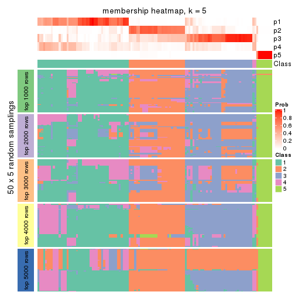</p>

</div>
<div id='tab-MAD-mclust-membership-heatmap-5'>
<pre><code class="r">membership_heatmap(res, k = 6)
</code></pre>

<p></p>

</div>
</div>

As soon as we have had the classes for columns, we can look for signatures
which are significantly different between classes which can be candidate marks
for certain classes. Following are the heatmaps for signatures.


Signature heatmaps where rows are scaled:


<script>
$( function() {
	$( '#tabs-MAD-mclust-get-signatures' ).tabs();
} );
</script>
<div id='tabs-MAD-mclust-get-signatures'>
<ul>
<li><a href='#tab-MAD-mclust-get-signatures-1'>k = 2</a></li>
<li><a href='#tab-MAD-mclust-get-signatures-2'>k = 3</a></li>
<li><a href='#tab-MAD-mclust-get-signatures-3'>k = 4</a></li>
<li><a href='#tab-MAD-mclust-get-signatures-4'>k = 5</a></li>
<li><a href='#tab-MAD-mclust-get-signatures-5'>k = 6</a></li>
</ul>
<div id='tab-MAD-mclust-get-signatures-1'>
<pre><code class="r">get_signatures(res, k = 2)
</code></pre>

<p></p>

</div>
<div id='tab-MAD-mclust-get-signatures-2'>
<pre><code class="r">get_signatures(res, k = 3)
</code></pre>

<p></p>

</div>
<div id='tab-MAD-mclust-get-signatures-3'>
<pre><code class="r">get_signatures(res, k = 4)
</code></pre>

<p></p>

</div>
<div id='tab-MAD-mclust-get-signatures-4'>
<pre><code class="r">get_signatures(res, k = 5)
</code></pre>

<p></p>

</div>
<div id='tab-MAD-mclust-get-signatures-5'>
<pre><code class="r">get_signatures(res, k = 6)
</code></pre>

<p></p>

</div>
</div>


Signature heatmaps where rows are not scaled:


<script>
$( function() {
	$( '#tabs-MAD-mclust-get-signatures-no-scale' ).tabs();
} );
</script>
<div id='tabs-MAD-mclust-get-signatures-no-scale'>
<ul>
<li><a href='#tab-MAD-mclust-get-signatures-no-scale-1'>k = 2</a></li>
<li><a href='#tab-MAD-mclust-get-signatures-no-scale-2'>k = 3</a></li>
<li><a href='#tab-MAD-mclust-get-signatures-no-scale-3'>k = 4</a></li>
<li><a href='#tab-MAD-mclust-get-signatures-no-scale-4'>k = 5</a></li>
<li><a href='#tab-MAD-mclust-get-signatures-no-scale-5'>k = 6</a></li>
</ul>
<div id='tab-MAD-mclust-get-signatures-no-scale-1'>
<pre><code class="r">get_signatures(res, k = 2, scale_rows = FALSE)
</code></pre>

<p></p>

</div>
<div id='tab-MAD-mclust-get-signatures-no-scale-2'>
<pre><code class="r">get_signatures(res, k = 3, scale_rows = FALSE)
</code></pre>

<p></p>

</div>
<div id='tab-MAD-mclust-get-signatures-no-scale-3'>
<pre><code class="r">get_signatures(res, k = 4, scale_rows = FALSE)
</code></pre>

<p>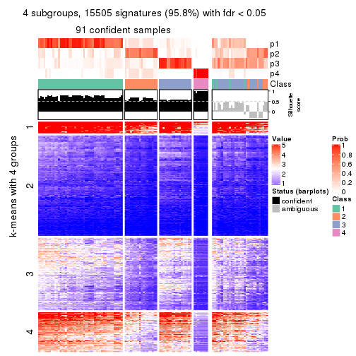</p>

</div>
<div id='tab-MAD-mclust-get-signatures-no-scale-4'>
<pre><code class="r">get_signatures(res, k = 5, scale_rows = FALSE)
</code></pre>

<p></p>

</div>
<div id='tab-MAD-mclust-get-signatures-no-scale-5'>
<pre><code class="r">get_signatures(res, k = 6, scale_rows = FALSE)
</code></pre>

<p></p>

</div>
</div>


Compare the overlap of signatures from different k:

```r
compare_signatures(res)
```


`get_signature()` returns a data frame invisibly. TO get the list of signatures, the function
call should be assigned to a variable explicitly. In following code, if `plot` argument is set
to `FALSE`, no heatmap is plotted while only the differential analysis is performed.

```r
# code only for demonstration
tb = get_signature(res, k = ..., plot = FALSE)
```

An example of the output of `tb` is:

```
#>   which_row         fdr    mean_1    mean_2 scaled_mean_1 scaled_mean_2 km
#> 1        38 0.042760348  8.373488  9.131774    -0.5533452     0.5164555  1
#> 2        40 0.018707592  7.106213  8.469186    -0.6173731     0.5762149  1
#> 3        55 0.019134737 10.221463 11.207825    -0.6159697     0.5749050  1
#> 4        59 0.006059896  5.921854  7.869574    -0.6899429     0.6439467  1
#> 5        60 0.018055526  8.928898 10.211722    -0.6204761     0.5791110  1
#> 6        98 0.009384629 15.714769 14.887706     0.6635654    -0.6193277  2
...
```

The columns in `tb` are:

1. `which_row`: row indices corresponding to the input matrix.
2. `fdr`: FDR for the differential test. 
3. `mean_x`: The mean value in group x.
4. `scaled_mean_x`: The mean value in group x after rows are scaled.
5. `km`: Row groups if k-means clustering is applied to rows.


UMAP plot which shows how samples are separated.


<script>
$( function() {
	$( '#tabs-MAD-mclust-dimension-reduction' ).tabs();
} );
</script>
<div id='tabs-MAD-mclust-dimension-reduction'>
<ul>
<li><a href='#tab-MAD-mclust-dimension-reduction-1'>k = 2</a></li>
<li><a href='#tab-MAD-mclust-dimension-reduction-2'>k = 3</a></li>
<li><a href='#tab-MAD-mclust-dimension-reduction-3'>k = 4</a></li>
<li><a href='#tab-MAD-mclust-dimension-reduction-4'>k = 5</a></li>
<li><a href='#tab-MAD-mclust-dimension-reduction-5'>k = 6</a></li>
</ul>
<div id='tab-MAD-mclust-dimension-reduction-1'>
<pre><code class="r">dimension_reduction(res, k = 2, method = &quot;UMAP&quot;)
</code></pre>

<p></p>

</div>
<div id='tab-MAD-mclust-dimension-reduction-2'>
<pre><code class="r">dimension_reduction(res, k = 3, method = &quot;UMAP&quot;)
</code></pre>

<p></p>

</div>
<div id='tab-MAD-mclust-dimension-reduction-3'>
<pre><code class="r">dimension_reduction(res, k = 4, method = &quot;UMAP&quot;)
</code></pre>

<p></p>

</div>
<div id='tab-MAD-mclust-dimension-reduction-4'>
<pre><code class="r">dimension_reduction(res, k = 5, method = &quot;UMAP&quot;)
</code></pre>

<p></p>

</div>
<div id='tab-MAD-mclust-dimension-reduction-5'>
<pre><code class="r">dimension_reduction(res, k = 6, method = &quot;UMAP&quot;)
</code></pre>

<p></p>

</div>
</div>


Following heatmap shows how subgroups are split when increasing `k`:

```r
collect_classes(res)
```

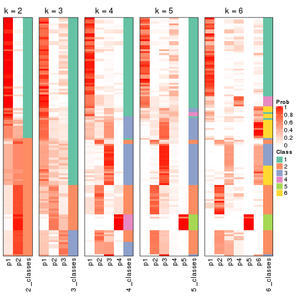


If matrix rows can be associated to genes, consider to use `functional_enrichment(res,
...)` to perform function enrichment for the signature genes. See [this vignette](http://bioconductor.org/packages/devel/bioc/vignettes/cola/inst/doc/functional_enrichment.html) for more detailed explanations.


 

---------------------------------------------------


### MAD:NMF


The object with results only for a single top-value method and a single partition method 
can be extracted as:

```r
res = res_list["MAD", "NMF"]
# you can also extract it by
# res = res_list["MAD:NMF"]
```

A summary of `res` and all the functions that can be applied to it:

```r
res
```

```
#> A 'ConsensusPartition' object with k = 2, 3, 4, 5, 6.
#>   On a matrix with 16187 rows and 121 columns.
#>   Top rows (1000, 2000, 3000, 4000, 5000) are extracted by 'MAD' method.
#>   Subgroups are detected by 'NMF' method.
#>   Performed in total 1250 partitions by row resampling.
#>   Best k for subgroups seems to be 2.
#> 
#> Following methods can be applied to this 'ConsensusPartition' object:
#>  [1] "cola_report"             "collect_classes"         "collect_plots"          
#>  [4] "collect_stats"           "colnames"                "compare_signatures"     
#>  [7] "consensus_heatmap"       "dimension_reduction"     "functional_enrichment"  
#> [10] "get_anno_col"            "get_anno"                "get_classes"            
#> [13] "get_consensus"           "get_matrix"              "get_membership"         
#> [16] "get_param"               "get_signatures"          "get_stats"              
#> [19] "is_best_k"               "is_stable_k"             "membership_heatmap"     
#> [22] "ncol"                    "nrow"                    "plot_ecdf"              
#> [25] "rownames"                "select_partition_number" "show"                   
#> [28] "suggest_best_k"          "test_to_known_factors"
```

`collect_plots()` function collects all the plots made from `res` for all `k` (number of partitions)
into one single page to provide an easy and fast comparison between different `k`.

```r
collect_plots(res)
```


The plots are:

- The first row: a plot of the ECDF (empirical cumulative distribution
  function) curves of the consensus matrix for each `k` and the heatmap of
  predicted classes for each `k`.
- The second row: heatmaps of the consensus matrix for each `k`.
- The third row: heatmaps of the membership matrix for each `k`.
- The fouth row: heatmaps of the signatures for each `k`.

All the plots in panels can be made by individual functions and they are
plotted later in this section.

`select_partition_number()` produces several plots showing different
statistics for choosing "optimized" `k`. There are following statistics:

- ECDF curves of the consensus matrix for each `k`;
- 1-PAC. [The PAC
  score](https://en.wikipedia.org/wiki/Consensus_clustering#Over-interpretation_potential_of_consensus_clustering)
  measures the proportion of the ambiguous subgrouping.
- Mean silhouette score.
- Concordance. The mean probability of fiting the consensus class ids in all
  partitions.
- Area increased. Denote $A_k$ as the area under the ECDF curve for current
  `k`, the area increased is defined as $A_k - A_{k-1}$.
- Rand index. The percent of pairs of samples that are both in a same cluster
  or both are not in a same cluster in the partition of k and k-1.
- Jaccard index. The ratio of pairs of samples are both in a same cluster in
  the partition of k and k-1 and the pairs of samples are both in a same
  cluster in the partition k or k-1.

The detailed explanations of these statistics can be found in [the _cola_
vignette](http://bioconductor.org/packages/devel/bioc/vignettes/cola/inst/doc/cola.html#toc_13).

Generally speaking, lower PAC score, higher mean silhouette score or higher
concordance corresponds to better partition. Rand index and Jaccard index
measure how similar the current partition is compared to partition with `k-1`.
If they are too similar, we won't accept `k` is better than `k-1`.

```r
select_partition_number(res)
```


The numeric values for all these statistics can be obtained by `get_stats()`.

```r
get_stats(res)
```

```
#>   k 1-PAC mean_silhouette concordance area_increased  Rand Jaccard
#> 2 2 0.868           0.941       0.973         0.4706 0.529   0.529
#> 3 3 0.476           0.581       0.809         0.3239 0.742   0.564
#> 4 4 0.575           0.595       0.752         0.1774 0.796   0.521
#> 5 5 0.794           0.807       0.894         0.0657 0.877   0.585
#> 6 6 0.765           0.664       0.830         0.0505 0.874   0.517
```

`suggest_best_k()` suggests the best $k$ based on these statistics. The rules are as follows:

- All $k$ with Jaccard index larger than 0.95 are removed because increasing
  $k$ does not provide enough extra information. If all $k$ are removed, it is
  marked as no subgroup is detected.
- For all $k$ with 1-PAC score larger than 0.9, the maximal $k$ is taken as
  the best $k$, and other $k$ are marked as optional $k$.
- If it does not fit the second rule. The $k$ with the maximal vote of the
  highest 1-PAC score, highest mean silhouette, and highest concordance is
  taken as the best $k$.

```r
suggest_best_k(res)
```

```
#> [1] 2
```


Following shows the table of the partitions (You need to click the **show/hide
code output** link to see it). The membership matrix (columns with name `p*`)
is inferred by
[`clue::cl_consensus()`](https://www.rdocumentation.org/link/cl_consensus?package=clue)
function with the `SE` method. Basically the value in the membership matrix
represents the probability to belong to a certain group. The finall class
label for an item is determined with the group with highest probability it
belongs to.

In `get_classes()` function, the entropy is calculated from the membership
matrix and the silhouette score is calculated from the consensus matrix.


<script>
$( function() {
	$( '#tabs-MAD-NMF-get-classes' ).tabs();
} );
</script>
<div id='tabs-MAD-NMF-get-classes'>
<ul>
<li><a href='#tab-MAD-NMF-get-classes-1'>k = 2</a></li>
<li><a href='#tab-MAD-NMF-get-classes-2'>k = 3</a></li>
<li><a href='#tab-MAD-NMF-get-classes-3'>k = 4</a></li>
<li><a href='#tab-MAD-NMF-get-classes-4'>k = 5</a></li>
<li><a href='#tab-MAD-NMF-get-classes-5'>k = 6</a></li>
</ul>

<div id='tab-MAD-NMF-get-classes-1'>
<p><a id='tab-MAD-NMF-get-classes-1-a' style='color:#0366d6' href='#'>show/hide code output</a></p>
<pre><code class="r">cbind(get_classes(res, k = 2), get_membership(res, k = 2))
</code></pre>

<pre><code>#&gt;           class entropy silhouette    p1    p2
#&gt; DRR006374     2  0.0000      0.961 0.000 1.000
#&gt; DRR006375     1  0.0000      0.977 1.000 0.000
#&gt; DRR006376     1  0.0000      0.977 1.000 0.000
#&gt; DRR006377     1  0.0000      0.977 1.000 0.000
#&gt; DRR006378     1  0.0000      0.977 1.000 0.000
#&gt; DRR006379     1  0.0000      0.977 1.000 0.000
#&gt; DRR006380     1  0.0000      0.977 1.000 0.000
#&gt; DRR006381     1  0.0000      0.977 1.000 0.000
#&gt; DRR006382     2  0.0000      0.961 0.000 1.000
#&gt; DRR006383     2  0.0000      0.961 0.000 1.000
#&gt; DRR006384     1  0.6973      0.775 0.812 0.188
#&gt; DRR006385     1  0.0000      0.977 1.000 0.000
#&gt; DRR006386     1  0.4815      0.879 0.896 0.104
#&gt; DRR006387     1  0.0000      0.977 1.000 0.000
#&gt; DRR006388     1  0.0000      0.977 1.000 0.000
#&gt; DRR006389     1  0.0000      0.977 1.000 0.000
#&gt; DRR006390     1  0.0000      0.977 1.000 0.000
#&gt; DRR006391     1  0.0000      0.977 1.000 0.000
#&gt; DRR006392     1  0.0000      0.977 1.000 0.000
#&gt; DRR006393     1  0.0000      0.977 1.000 0.000
#&gt; DRR006394     1  0.0000      0.977 1.000 0.000
#&gt; DRR006395     1  0.0000      0.977 1.000 0.000
#&gt; DRR006396     1  0.0000      0.977 1.000 0.000
#&gt; DRR006397     1  0.0000      0.977 1.000 0.000
#&gt; DRR006398     1  0.0000      0.977 1.000 0.000
#&gt; DRR006399     1  0.0000      0.977 1.000 0.000
#&gt; DRR006400     1  0.0000      0.977 1.000 0.000
#&gt; DRR006401     1  0.0000      0.977 1.000 0.000
#&gt; DRR006402     1  0.0000      0.977 1.000 0.000
#&gt; DRR006403     1  0.0000      0.977 1.000 0.000
#&gt; DRR006404     1  0.0000      0.977 1.000 0.000
#&gt; DRR006405     1  0.0000      0.977 1.000 0.000
#&gt; DRR006406     1  0.0000      0.977 1.000 0.000
#&gt; DRR006407     1  0.0000      0.977 1.000 0.000
#&gt; DRR006408     1  0.0000      0.977 1.000 0.000
#&gt; DRR006409     1  0.0000      0.977 1.000 0.000
#&gt; DRR006410     1  0.0000      0.977 1.000 0.000
#&gt; DRR006411     1  0.0000      0.977 1.000 0.000
#&gt; DRR006412     1  0.0672      0.971 0.992 0.008
#&gt; DRR006413     1  0.0000      0.977 1.000 0.000
#&gt; DRR006414     2  0.4161      0.898 0.084 0.916
#&gt; DRR006415     2  0.0000      0.961 0.000 1.000
#&gt; DRR006416     1  0.0000      0.977 1.000 0.000
#&gt; DRR006417     2  0.0000      0.961 0.000 1.000
#&gt; DRR006418     1  0.4939      0.870 0.892 0.108
#&gt; DRR006419     2  0.1414      0.949 0.020 0.980
#&gt; DRR006420     2  0.8327      0.676 0.264 0.736
#&gt; DRR006421     2  0.0000      0.961 0.000 1.000
#&gt; DRR006422     1  0.0000      0.977 1.000 0.000
#&gt; DRR006423     2  0.9044      0.546 0.320 0.680
#&gt; DRR006424     1  0.0000      0.977 1.000 0.000
#&gt; DRR006425     1  0.0000      0.977 1.000 0.000
#&gt; DRR006426     2  0.1184      0.952 0.016 0.984
#&gt; DRR006427     2  0.0000      0.961 0.000 1.000
#&gt; DRR006428     2  0.0000      0.961 0.000 1.000
#&gt; DRR006429     1  0.7745      0.703 0.772 0.228
#&gt; DRR006430     1  0.0000      0.977 1.000 0.000
#&gt; DRR006431     1  0.0000      0.977 1.000 0.000
#&gt; DRR006432     2  0.3274      0.919 0.060 0.940
#&gt; DRR006433     2  0.1184      0.951 0.016 0.984
#&gt; DRR006434     2  0.0000      0.961 0.000 1.000
#&gt; DRR006435     2  0.0000      0.961 0.000 1.000
#&gt; DRR006436     2  0.0000      0.961 0.000 1.000
#&gt; DRR006437     1  0.0000      0.977 1.000 0.000
#&gt; DRR006438     2  0.1843      0.943 0.028 0.972
#&gt; DRR006439     2  0.6148      0.830 0.152 0.848
#&gt; DRR006440     2  0.0000      0.961 0.000 1.000
#&gt; DRR006441     1  0.0000      0.977 1.000 0.000
#&gt; DRR006442     2  0.0000      0.961 0.000 1.000
#&gt; DRR006443     2  0.0000      0.961 0.000 1.000
#&gt; DRR006444     2  0.0000      0.961 0.000 1.000
#&gt; DRR006445     1  0.0000      0.977 1.000 0.000
#&gt; DRR006446     1  0.0000      0.977 1.000 0.000
#&gt; DRR006447     1  0.0000      0.977 1.000 0.000
#&gt; DRR006448     1  0.0000      0.977 1.000 0.000
#&gt; DRR006449     1  0.0000      0.977 1.000 0.000
#&gt; DRR006450     1  0.0000      0.977 1.000 0.000
#&gt; DRR006451     1  0.0000      0.977 1.000 0.000
#&gt; DRR006452     1  0.0000      0.977 1.000 0.000
#&gt; DRR006453     1  0.0000      0.977 1.000 0.000
#&gt; DRR006454     1  0.0000      0.977 1.000 0.000
#&gt; DRR006455     1  0.9044      0.548 0.680 0.320
#&gt; DRR006456     2  0.0000      0.961 0.000 1.000
#&gt; DRR006457     2  0.0000      0.961 0.000 1.000
#&gt; DRR006458     1  0.0000      0.977 1.000 0.000
#&gt; DRR006459     1  0.0000      0.977 1.000 0.000
#&gt; DRR006460     1  0.3114      0.928 0.944 0.056
#&gt; DRR006461     2  0.0000      0.961 0.000 1.000
#&gt; DRR006462     1  0.0000      0.977 1.000 0.000
#&gt; DRR006463     2  0.0000      0.961 0.000 1.000
#&gt; DRR006464     2  0.9248      0.531 0.340 0.660
#&gt; DRR006465     1  0.0000      0.977 1.000 0.000
#&gt; DRR006466     2  0.0000      0.961 0.000 1.000
#&gt; DRR006467     1  0.0000      0.977 1.000 0.000
#&gt; DRR006468     2  0.0000      0.961 0.000 1.000
#&gt; DRR006469     1  0.0672      0.971 0.992 0.008
#&gt; DRR006470     2  0.0000      0.961 0.000 1.000
#&gt; DRR006471     1  0.1633      0.957 0.976 0.024
#&gt; DRR006472     2  0.0000      0.961 0.000 1.000
#&gt; DRR006473     2  0.0000      0.961 0.000 1.000
#&gt; DRR006474     2  0.0000      0.961 0.000 1.000
#&gt; DRR006475     1  0.7056      0.757 0.808 0.192
#&gt; DRR006476     1  0.5408      0.856 0.876 0.124
#&gt; DRR006477     1  0.8327      0.660 0.736 0.264
#&gt; DRR006478     1  0.0000      0.977 1.000 0.000
#&gt; DRR006479     2  0.7056      0.782 0.192 0.808
#&gt; DRR006480     1  0.0000      0.977 1.000 0.000
#&gt; DRR006481     2  0.0000      0.961 0.000 1.000
#&gt; DRR006482     1  0.0000      0.977 1.000 0.000
#&gt; DRR006483     1  0.0000      0.977 1.000 0.000
#&gt; DRR006484     2  0.0000      0.961 0.000 1.000
#&gt; DRR006485     2  0.0000      0.961 0.000 1.000
#&gt; DRR006486     2  0.7056      0.781 0.192 0.808
#&gt; DRR006487     2  0.0000      0.961 0.000 1.000
#&gt; DRR006488     2  0.0000      0.961 0.000 1.000
#&gt; DRR006489     1  0.0000      0.977 1.000 0.000
#&gt; DRR006490     2  0.0000      0.961 0.000 1.000
#&gt; DRR006491     2  0.0000      0.961 0.000 1.000
#&gt; DRR006492     1  0.0000      0.977 1.000 0.000
#&gt; DRR006493     2  0.0000      0.961 0.000 1.000
#&gt; DRR006494     1  0.0376      0.974 0.996 0.004
</code></pre>

<script>
$('#tab-MAD-NMF-get-classes-1-a').parent().next().next().hide();
$('#tab-MAD-NMF-get-classes-1-a').click(function(){
  $('#tab-MAD-NMF-get-classes-1-a').parent().next().next().toggle();
  return(false);
});
</script>
</div>

<div id='tab-MAD-NMF-get-classes-2'>
<p><a id='tab-MAD-NMF-get-classes-2-a' style='color:#0366d6' href='#'>show/hide code output</a></p>
<pre><code class="r">cbind(get_classes(res, k = 3), get_membership(res, k = 3))
</code></pre>

<pre><code>#&gt;           class entropy silhouette    p1    p2    p3
#&gt; DRR006374     3  0.5760     0.5750 0.000 0.328 0.672
#&gt; DRR006375     1  0.1529     0.7629 0.960 0.040 0.000
#&gt; DRR006376     1  0.6299    -0.0721 0.524 0.476 0.000
#&gt; DRR006377     2  0.6026     0.3229 0.376 0.624 0.000
#&gt; DRR006378     1  0.5254     0.5752 0.736 0.264 0.000
#&gt; DRR006379     2  0.6260     0.2701 0.448 0.552 0.000
#&gt; DRR006380     2  0.3896     0.6584 0.128 0.864 0.008
#&gt; DRR006381     1  0.2187     0.7593 0.948 0.024 0.028
#&gt; DRR006382     3  0.1015     0.8149 0.008 0.012 0.980
#&gt; DRR006383     3  0.2356     0.7860 0.072 0.000 0.928
#&gt; DRR006384     2  0.3359     0.6562 0.084 0.900 0.016
#&gt; DRR006385     1  0.0592     0.7655 0.988 0.012 0.000
#&gt; DRR006386     2  0.2356     0.6542 0.072 0.928 0.000
#&gt; DRR006387     1  0.6168     0.1941 0.588 0.412 0.000
#&gt; DRR006388     1  0.1289     0.7647 0.968 0.032 0.000
#&gt; DRR006389     1  0.1289     0.7647 0.968 0.032 0.000
#&gt; DRR006390     1  0.6809     0.1861 0.524 0.464 0.012
#&gt; DRR006391     1  0.6809     0.1861 0.524 0.464 0.012
#&gt; DRR006392     1  0.1163     0.7654 0.972 0.028 0.000
#&gt; DRR006393     1  0.2165     0.7563 0.936 0.064 0.000
#&gt; DRR006394     1  0.6062     0.4142 0.616 0.384 0.000
#&gt; DRR006395     2  0.6026     0.4682 0.376 0.624 0.000
#&gt; DRR006396     1  0.3038     0.7335 0.896 0.104 0.000
#&gt; DRR006397     1  0.1860     0.7606 0.948 0.052 0.000
#&gt; DRR006398     1  0.1411     0.7644 0.964 0.036 0.000
#&gt; DRR006399     2  0.6045     0.4596 0.380 0.620 0.000
#&gt; DRR006400     2  0.6008     0.4756 0.372 0.628 0.000
#&gt; DRR006401     2  0.3619     0.6566 0.136 0.864 0.000
#&gt; DRR006402     2  0.3482     0.6576 0.128 0.872 0.000
#&gt; DRR006403     2  0.5905     0.5072 0.352 0.648 0.000
#&gt; DRR006404     2  0.5968     0.4891 0.364 0.636 0.000
#&gt; DRR006405     1  0.5591     0.4562 0.696 0.304 0.000
#&gt; DRR006406     1  0.6062     0.2639 0.616 0.384 0.000
#&gt; DRR006407     2  0.5363     0.5482 0.276 0.724 0.000
#&gt; DRR006408     2  0.5431     0.5806 0.284 0.716 0.000
#&gt; DRR006409     1  0.6931     0.0127 0.528 0.456 0.016
#&gt; DRR006410     1  0.6140     0.2186 0.596 0.404 0.000
#&gt; DRR006411     1  0.2261     0.7577 0.932 0.068 0.000
#&gt; DRR006412     1  0.4702     0.6682 0.788 0.212 0.000
#&gt; DRR006413     1  0.1950     0.7534 0.952 0.008 0.040
#&gt; DRR006414     3  0.4555     0.6660 0.200 0.000 0.800
#&gt; DRR006415     3  0.1289     0.8083 0.032 0.000 0.968
#&gt; DRR006416     1  0.0237     0.7647 0.996 0.004 0.000
#&gt; DRR006417     3  0.4784     0.6586 0.200 0.004 0.796
#&gt; DRR006418     1  0.2280     0.7439 0.940 0.008 0.052
#&gt; DRR006419     1  0.6235     0.1392 0.564 0.000 0.436
#&gt; DRR006420     1  0.5859     0.3884 0.656 0.000 0.344
#&gt; DRR006421     3  0.1031     0.8132 0.024 0.000 0.976
#&gt; DRR006422     1  0.1964     0.7533 0.944 0.056 0.000
#&gt; DRR006423     1  0.8518     0.3488 0.592 0.272 0.136
#&gt; DRR006424     1  0.0424     0.7651 0.992 0.008 0.000
#&gt; DRR006425     1  0.5882     0.3591 0.652 0.348 0.000
#&gt; DRR006426     1  0.8310     0.0415 0.500 0.080 0.420
#&gt; DRR006427     3  0.5882     0.5681 0.000 0.348 0.652
#&gt; DRR006428     3  0.0424     0.8156 0.008 0.000 0.992
#&gt; DRR006429     1  0.5377     0.6818 0.820 0.112 0.068
#&gt; DRR006430     1  0.1031     0.7659 0.976 0.024 0.000
#&gt; DRR006431     1  0.2261     0.7552 0.932 0.068 0.000
#&gt; DRR006432     1  0.8765     0.0714 0.504 0.116 0.380
#&gt; DRR006433     3  0.5363     0.6229 0.000 0.276 0.724
#&gt; DRR006434     3  0.2711     0.7985 0.000 0.088 0.912
#&gt; DRR006435     2  0.6299    -0.3011 0.000 0.524 0.476
#&gt; DRR006436     3  0.6307     0.3279 0.000 0.488 0.512
#&gt; DRR006437     1  0.1860     0.7605 0.948 0.052 0.000
#&gt; DRR006438     3  0.4974     0.6155 0.236 0.000 0.764
#&gt; DRR006439     3  0.1163     0.8132 0.028 0.000 0.972
#&gt; DRR006440     3  0.3116     0.7857 0.000 0.108 0.892
#&gt; DRR006441     1  0.6577     0.2854 0.572 0.420 0.008
#&gt; DRR006442     3  0.0237     0.8148 0.004 0.000 0.996
#&gt; DRR006443     3  0.2066     0.8076 0.000 0.060 0.940
#&gt; DRR006444     2  0.6307    -0.3261 0.000 0.512 0.488
#&gt; DRR006445     1  0.1031     0.7662 0.976 0.024 0.000
#&gt; DRR006446     1  0.3879     0.7153 0.848 0.152 0.000
#&gt; DRR006447     1  0.0237     0.7647 0.996 0.004 0.000
#&gt; DRR006448     1  0.6299    -0.0415 0.524 0.476 0.000
#&gt; DRR006449     1  0.3038     0.7352 0.896 0.104 0.000
#&gt; DRR006450     1  0.0237     0.7652 0.996 0.004 0.000
#&gt; DRR006451     1  0.6180     0.1716 0.584 0.416 0.000
#&gt; DRR006452     1  0.0424     0.7651 0.992 0.008 0.000
#&gt; DRR006453     1  0.0000     0.7649 1.000 0.000 0.000
#&gt; DRR006454     1  0.2625     0.7468 0.916 0.084 0.000
#&gt; DRR006455     2  0.2261     0.5309 0.000 0.932 0.068
#&gt; DRR006456     3  0.0237     0.8148 0.000 0.004 0.996
#&gt; DRR006457     3  0.1031     0.8142 0.000 0.024 0.976
#&gt; DRR006458     1  0.1905     0.7598 0.956 0.016 0.028
#&gt; DRR006459     1  0.2063     0.7659 0.948 0.044 0.008
#&gt; DRR006460     2  0.2165     0.6530 0.064 0.936 0.000
#&gt; DRR006461     3  0.3619     0.7656 0.000 0.136 0.864
#&gt; DRR006462     1  0.3816     0.6976 0.852 0.148 0.000
#&gt; DRR006463     3  0.2066     0.8078 0.000 0.060 0.940
#&gt; DRR006464     1  0.5377     0.6544 0.820 0.112 0.068
#&gt; DRR006465     1  0.1753     0.7613 0.952 0.048 0.000
#&gt; DRR006466     3  0.2625     0.8002 0.000 0.084 0.916
#&gt; DRR006467     1  0.0592     0.7630 0.988 0.000 0.012
#&gt; DRR006468     2  0.6299    -0.3011 0.000 0.524 0.476
#&gt; DRR006469     1  0.5058     0.6752 0.820 0.148 0.032
#&gt; DRR006470     3  0.7059     0.1362 0.460 0.020 0.520
#&gt; DRR006471     1  0.2200     0.7429 0.940 0.004 0.056
#&gt; DRR006472     3  0.1525     0.8141 0.004 0.032 0.964
#&gt; DRR006473     3  0.8976     0.1856 0.416 0.128 0.456
#&gt; DRR006474     3  0.5926     0.5165 0.000 0.356 0.644
#&gt; DRR006475     1  0.4178     0.6360 0.828 0.000 0.172
#&gt; DRR006476     2  0.7228     0.6067 0.188 0.708 0.104
#&gt; DRR006477     2  0.7979     0.4463 0.100 0.628 0.272
#&gt; DRR006478     1  0.1411     0.7642 0.964 0.036 0.000
#&gt; DRR006479     3  0.6168     0.3110 0.412 0.000 0.588
#&gt; DRR006480     1  0.2383     0.7514 0.940 0.016 0.044
#&gt; DRR006481     3  0.2774     0.8055 0.008 0.072 0.920
#&gt; DRR006482     1  0.3482     0.7061 0.872 0.128 0.000
#&gt; DRR006483     1  0.1525     0.7554 0.964 0.004 0.032
#&gt; DRR006484     3  0.0829     0.8161 0.012 0.004 0.984
#&gt; DRR006485     3  0.2261     0.8054 0.000 0.068 0.932
#&gt; DRR006486     1  0.6062     0.2957 0.616 0.000 0.384
#&gt; DRR006487     3  0.0592     0.8138 0.012 0.000 0.988
#&gt; DRR006488     3  0.6235     0.4318 0.000 0.436 0.564
#&gt; DRR006489     1  0.0592     0.7630 0.988 0.000 0.012
#&gt; DRR006490     3  0.1643     0.8045 0.044 0.000 0.956
#&gt; DRR006491     3  0.1411     0.8075 0.036 0.000 0.964
#&gt; DRR006492     1  0.7143     0.2098 0.576 0.396 0.028
#&gt; DRR006493     3  0.0000     0.8146 0.000 0.000 1.000
#&gt; DRR006494     1  0.2280     0.7481 0.940 0.008 0.052
</code></pre>

<script>
$('#tab-MAD-NMF-get-classes-2-a').parent().next().next().hide();
$('#tab-MAD-NMF-get-classes-2-a').click(function(){
  $('#tab-MAD-NMF-get-classes-2-a').parent().next().next().toggle();
  return(false);
});
</script>
</div>

<div id='tab-MAD-NMF-get-classes-3'>
<p><a id='tab-MAD-NMF-get-classes-3-a' style='color:#0366d6' href='#'>show/hide code output</a></p>
<pre><code class="r">cbind(get_classes(res, k = 4), get_membership(res, k = 4))
</code></pre>

<pre><code>#&gt;           class entropy silhouette    p1    p2    p3    p4
#&gt; DRR006374     3  0.3636     0.7536 0.000 0.172 0.820 0.008
#&gt; DRR006375     1  0.5088     0.0956 0.572 0.004 0.000 0.424
#&gt; DRR006376     4  0.6212     0.4544 0.060 0.380 0.000 0.560
#&gt; DRR006377     4  0.3725     0.5874 0.000 0.180 0.008 0.812
#&gt; DRR006378     4  0.1867     0.7564 0.072 0.000 0.000 0.928
#&gt; DRR006379     2  0.6443     0.4098 0.400 0.528 0.000 0.072
#&gt; DRR006380     2  0.4830     0.4926 0.392 0.608 0.000 0.000
#&gt; DRR006381     1  0.0524     0.6822 0.988 0.000 0.008 0.004
#&gt; DRR006382     3  0.1557     0.8722 0.056 0.000 0.944 0.000
#&gt; DRR006383     3  0.4356     0.5938 0.292 0.000 0.708 0.000
#&gt; DRR006384     2  0.2011     0.5745 0.080 0.920 0.000 0.000
#&gt; DRR006385     1  0.2760     0.6707 0.872 0.000 0.000 0.128
#&gt; DRR006386     2  0.2412     0.5420 0.008 0.908 0.000 0.084
#&gt; DRR006387     1  0.4800     0.1446 0.656 0.340 0.000 0.004
#&gt; DRR006388     4  0.4250     0.6420 0.276 0.000 0.000 0.724
#&gt; DRR006389     4  0.4277     0.6378 0.280 0.000 0.000 0.720
#&gt; DRR006390     4  0.2345     0.6651 0.000 0.100 0.000 0.900
#&gt; DRR006391     4  0.2408     0.6614 0.000 0.104 0.000 0.896
#&gt; DRR006392     1  0.0817     0.6910 0.976 0.000 0.000 0.024
#&gt; DRR006393     1  0.0524     0.6848 0.988 0.004 0.000 0.008
#&gt; DRR006394     4  0.1389     0.7144 0.000 0.048 0.000 0.952
#&gt; DRR006395     2  0.5039     0.4757 0.404 0.592 0.000 0.004
#&gt; DRR006396     1  0.1174     0.6793 0.968 0.020 0.000 0.012
#&gt; DRR006397     4  0.3942     0.6782 0.236 0.000 0.000 0.764
#&gt; DRR006398     4  0.3942     0.6782 0.236 0.000 0.000 0.764
#&gt; DRR006399     2  0.4961     0.4093 0.448 0.552 0.000 0.000
#&gt; DRR006400     2  0.4955     0.4169 0.444 0.556 0.000 0.000
#&gt; DRR006401     2  0.4103     0.5598 0.256 0.744 0.000 0.000
#&gt; DRR006402     2  0.4072     0.5609 0.252 0.748 0.000 0.000
#&gt; DRR006403     2  0.4888     0.4691 0.412 0.588 0.000 0.000
#&gt; DRR006404     2  0.5204     0.4984 0.376 0.612 0.000 0.012
#&gt; DRR006405     4  0.6251     0.6347 0.140 0.196 0.000 0.664
#&gt; DRR006406     4  0.6674     0.5435 0.116 0.300 0.000 0.584
#&gt; DRR006407     4  0.5070     0.2284 0.004 0.416 0.000 0.580
#&gt; DRR006408     2  0.4830     0.4921 0.392 0.608 0.000 0.000
#&gt; DRR006409     1  0.4761     0.0289 0.628 0.372 0.000 0.000
#&gt; DRR006410     1  0.4936     0.1397 0.652 0.340 0.000 0.008
#&gt; DRR006411     4  0.2408     0.7499 0.104 0.000 0.000 0.896
#&gt; DRR006412     4  0.0469     0.7448 0.012 0.000 0.000 0.988
#&gt; DRR006413     1  0.3032     0.6703 0.868 0.000 0.008 0.124
#&gt; DRR006414     3  0.4543     0.5337 0.324 0.000 0.676 0.000
#&gt; DRR006415     3  0.1637     0.8700 0.060 0.000 0.940 0.000
#&gt; DRR006416     4  0.4985     0.2682 0.468 0.000 0.000 0.532
#&gt; DRR006417     3  0.2021     0.8755 0.024 0.000 0.936 0.040
#&gt; DRR006418     4  0.3975     0.6755 0.240 0.000 0.000 0.760
#&gt; DRR006419     1  0.7806     0.0913 0.392 0.000 0.356 0.252
#&gt; DRR006420     1  0.6752     0.0845 0.468 0.000 0.440 0.092
#&gt; DRR006421     3  0.0376     0.8881 0.004 0.000 0.992 0.004
#&gt; DRR006422     1  0.0188     0.6850 0.996 0.000 0.000 0.004
#&gt; DRR006423     4  0.1767     0.7107 0.000 0.044 0.012 0.944
#&gt; DRR006424     1  0.3266     0.6301 0.832 0.000 0.000 0.168
#&gt; DRR006425     4  0.6616     0.6143 0.156 0.220 0.000 0.624
#&gt; DRR006426     4  0.1938     0.7555 0.052 0.000 0.012 0.936
#&gt; DRR006427     2  0.7679     0.0843 0.000 0.424 0.356 0.220
#&gt; DRR006428     3  0.0592     0.8872 0.016 0.000 0.984 0.000
#&gt; DRR006429     4  0.1970     0.7570 0.060 0.000 0.008 0.932
#&gt; DRR006430     1  0.0921     0.6919 0.972 0.000 0.000 0.028
#&gt; DRR006431     1  0.1474     0.6442 0.948 0.052 0.000 0.000
#&gt; DRR006432     4  0.1545     0.7535 0.040 0.000 0.008 0.952
#&gt; DRR006433     3  0.4868     0.5251 0.000 0.304 0.684 0.012
#&gt; DRR006434     3  0.2197     0.8653 0.000 0.048 0.928 0.024
#&gt; DRR006435     2  0.7088     0.3665 0.000 0.568 0.204 0.228
#&gt; DRR006436     2  0.7173     0.3530 0.000 0.556 0.216 0.228
#&gt; DRR006437     1  0.0592     0.6883 0.984 0.000 0.000 0.016
#&gt; DRR006438     3  0.1109     0.8870 0.028 0.000 0.968 0.004
#&gt; DRR006439     3  0.0921     0.8853 0.028 0.000 0.972 0.000
#&gt; DRR006440     3  0.2363     0.8595 0.000 0.024 0.920 0.056
#&gt; DRR006441     4  0.3311     0.6043 0.000 0.172 0.000 0.828
#&gt; DRR006442     3  0.0921     0.8851 0.028 0.000 0.972 0.000
#&gt; DRR006443     3  0.1406     0.8808 0.000 0.016 0.960 0.024
#&gt; DRR006444     2  0.7120     0.3588 0.000 0.564 0.212 0.224
#&gt; DRR006445     1  0.4277     0.4753 0.720 0.000 0.000 0.280
#&gt; DRR006446     4  0.2081     0.7547 0.084 0.000 0.000 0.916
#&gt; DRR006447     4  0.4477     0.5957 0.312 0.000 0.000 0.688
#&gt; DRR006448     1  0.5193    -0.0985 0.580 0.412 0.000 0.008
#&gt; DRR006449     1  0.1902     0.6417 0.932 0.064 0.000 0.004
#&gt; DRR006450     1  0.4040     0.5307 0.752 0.000 0.000 0.248
#&gt; DRR006451     4  0.7746     0.2696 0.272 0.288 0.000 0.440
#&gt; DRR006452     1  0.2216     0.6921 0.908 0.000 0.000 0.092
#&gt; DRR006453     1  0.4746     0.2484 0.632 0.000 0.000 0.368
#&gt; DRR006454     1  0.5349     0.3572 0.640 0.024 0.000 0.336
#&gt; DRR006455     2  0.3806     0.4944 0.000 0.824 0.020 0.156
#&gt; DRR006456     3  0.0188     0.8873 0.004 0.000 0.996 0.000
#&gt; DRR006457     3  0.0336     0.8863 0.000 0.000 0.992 0.008
#&gt; DRR006458     1  0.0712     0.6798 0.984 0.004 0.008 0.004
#&gt; DRR006459     1  0.1909     0.6935 0.940 0.008 0.004 0.048
#&gt; DRR006460     2  0.2921     0.5762 0.140 0.860 0.000 0.000
#&gt; DRR006461     3  0.1042     0.8838 0.000 0.020 0.972 0.008
#&gt; DRR006462     1  0.4880     0.4799 0.760 0.188 0.000 0.052
#&gt; DRR006463     3  0.1284     0.8819 0.000 0.012 0.964 0.024
#&gt; DRR006464     4  0.1970     0.7569 0.060 0.000 0.008 0.932
#&gt; DRR006465     1  0.4088     0.5590 0.764 0.004 0.000 0.232
#&gt; DRR006466     3  0.2060     0.8675 0.000 0.052 0.932 0.016
#&gt; DRR006467     1  0.4040     0.5224 0.752 0.000 0.000 0.248
#&gt; DRR006468     2  0.7088     0.3665 0.000 0.568 0.204 0.228
#&gt; DRR006469     4  0.0564     0.7362 0.004 0.004 0.004 0.988
#&gt; DRR006470     4  0.3793     0.7379 0.112 0.000 0.044 0.844
#&gt; DRR006471     4  0.4948     0.3461 0.440 0.000 0.000 0.560
#&gt; DRR006472     3  0.0921     0.8841 0.000 0.000 0.972 0.028
#&gt; DRR006473     4  0.1174     0.7458 0.020 0.000 0.012 0.968
#&gt; DRR006474     3  0.3400     0.7512 0.000 0.180 0.820 0.000
#&gt; DRR006475     1  0.6867     0.2162 0.508 0.000 0.384 0.108
#&gt; DRR006476     2  0.6058     0.4855 0.032 0.704 0.212 0.052
#&gt; DRR006477     2  0.6139     0.4710 0.404 0.544 0.052 0.000
#&gt; DRR006478     4  0.4304     0.6335 0.284 0.000 0.000 0.716
#&gt; DRR006479     3  0.3444     0.7502 0.184 0.000 0.816 0.000
#&gt; DRR006480     1  0.1743     0.6664 0.940 0.000 0.056 0.004
#&gt; DRR006481     3  0.1398     0.8789 0.000 0.004 0.956 0.040
#&gt; DRR006482     1  0.1356     0.6562 0.960 0.032 0.008 0.000
#&gt; DRR006483     4  0.4746     0.5042 0.368 0.000 0.000 0.632
#&gt; DRR006484     3  0.0188     0.8867 0.000 0.000 0.996 0.004
#&gt; DRR006485     3  0.1584     0.8778 0.000 0.012 0.952 0.036
#&gt; DRR006486     3  0.5137     0.1717 0.452 0.000 0.544 0.004
#&gt; DRR006487     3  0.0336     0.8872 0.008 0.000 0.992 0.000
#&gt; DRR006488     2  0.7450     0.2779 0.000 0.508 0.264 0.228
#&gt; DRR006489     1  0.4331     0.4578 0.712 0.000 0.000 0.288
#&gt; DRR006490     3  0.1940     0.8584 0.076 0.000 0.924 0.000
#&gt; DRR006491     3  0.2149     0.8483 0.088 0.000 0.912 0.000
#&gt; DRR006492     1  0.5877     0.2373 0.656 0.276 0.068 0.000
#&gt; DRR006493     3  0.0592     0.8872 0.016 0.000 0.984 0.000
#&gt; DRR006494     1  0.4313     0.5164 0.736 0.000 0.260 0.004
</code></pre>

<script>
$('#tab-MAD-NMF-get-classes-3-a').parent().next().next().hide();
$('#tab-MAD-NMF-get-classes-3-a').click(function(){
  $('#tab-MAD-NMF-get-classes-3-a').parent().next().next().toggle();
  return(false);
});
</script>
</div>

<div id='tab-MAD-NMF-get-classes-4'>
<p><a id='tab-MAD-NMF-get-classes-4-a' style='color:#0366d6' href='#'>show/hide code output</a></p>
<pre><code class="r">cbind(get_classes(res, k = 5), get_membership(res, k = 5))
</code></pre>

<pre><code>#&gt;           class entropy silhouette    p1    p2    p3    p4    p5
#&gt; DRR006374     3  0.0609     0.9451 0.000 0.000 0.980 0.000 0.020
#&gt; DRR006375     2  0.5759     0.3940 0.356 0.560 0.000 0.076 0.008
#&gt; DRR006376     4  0.3480     0.6076 0.000 0.248 0.000 0.752 0.000
#&gt; DRR006377     2  0.3916     0.6573 0.000 0.732 0.000 0.256 0.012
#&gt; DRR006378     2  0.0324     0.8620 0.000 0.992 0.000 0.004 0.004
#&gt; DRR006379     4  0.0404     0.8181 0.000 0.012 0.000 0.988 0.000
#&gt; DRR006380     4  0.3323     0.7716 0.036 0.000 0.004 0.844 0.116
#&gt; DRR006381     1  0.1116     0.8728 0.964 0.004 0.000 0.004 0.028
#&gt; DRR006382     3  0.2248     0.8721 0.088 0.000 0.900 0.000 0.012
#&gt; DRR006383     1  0.2284     0.8357 0.896 0.000 0.096 0.004 0.004
#&gt; DRR006384     4  0.3585     0.6928 0.004 0.000 0.004 0.772 0.220
#&gt; DRR006385     1  0.1569     0.8671 0.944 0.004 0.000 0.008 0.044
#&gt; DRR006386     5  0.0912     0.9115 0.012 0.000 0.000 0.016 0.972
#&gt; DRR006387     4  0.4527     0.6308 0.260 0.000 0.000 0.700 0.040
#&gt; DRR006388     2  0.2249     0.8315 0.096 0.896 0.000 0.000 0.008
#&gt; DRR006389     2  0.2249     0.8315 0.096 0.896 0.000 0.000 0.008
#&gt; DRR006390     2  0.0510     0.8584 0.000 0.984 0.000 0.000 0.016
#&gt; DRR006391     2  0.0510     0.8584 0.000 0.984 0.000 0.000 0.016
#&gt; DRR006392     1  0.1143     0.8748 0.968 0.008 0.008 0.012 0.004
#&gt; DRR006393     1  0.1680     0.8736 0.948 0.012 0.008 0.024 0.008
#&gt; DRR006394     2  0.0290     0.8607 0.000 0.992 0.000 0.000 0.008
#&gt; DRR006395     4  0.0693     0.8174 0.000 0.012 0.000 0.980 0.008
#&gt; DRR006396     1  0.2153     0.8593 0.916 0.000 0.000 0.044 0.040
#&gt; DRR006397     2  0.1408     0.8570 0.044 0.948 0.000 0.000 0.008
#&gt; DRR006398     2  0.1408     0.8570 0.044 0.948 0.000 0.000 0.008
#&gt; DRR006399     4  0.0671     0.8205 0.004 0.000 0.000 0.980 0.016
#&gt; DRR006400     4  0.0671     0.8205 0.004 0.000 0.000 0.980 0.016
#&gt; DRR006401     4  0.1124     0.8179 0.000 0.004 0.000 0.960 0.036
#&gt; DRR006402     4  0.1124     0.8179 0.000 0.004 0.000 0.960 0.036
#&gt; DRR006403     4  0.0451     0.8199 0.000 0.004 0.000 0.988 0.008
#&gt; DRR006404     4  0.0693     0.8167 0.000 0.012 0.000 0.980 0.008
#&gt; DRR006405     2  0.3928     0.6024 0.004 0.700 0.000 0.296 0.000
#&gt; DRR006406     2  0.4452     0.0998 0.004 0.500 0.000 0.496 0.000
#&gt; DRR006407     4  0.2723     0.7440 0.000 0.124 0.000 0.864 0.012
#&gt; DRR006408     4  0.1357     0.8150 0.004 0.000 0.000 0.948 0.048
#&gt; DRR006409     4  0.0833     0.8174 0.016 0.004 0.000 0.976 0.004
#&gt; DRR006410     4  0.3001     0.7553 0.144 0.004 0.000 0.844 0.008
#&gt; DRR006411     2  0.0451     0.8624 0.004 0.988 0.000 0.000 0.008
#&gt; DRR006412     2  0.0510     0.8584 0.000 0.984 0.000 0.000 0.016
#&gt; DRR006413     1  0.0833     0.8753 0.976 0.004 0.004 0.000 0.016
#&gt; DRR006414     1  0.2408     0.8398 0.892 0.000 0.096 0.004 0.008
#&gt; DRR006415     3  0.1124     0.9330 0.036 0.000 0.960 0.000 0.004
#&gt; DRR006416     1  0.4049     0.6018 0.724 0.264 0.004 0.004 0.004
#&gt; DRR006417     3  0.2012     0.8928 0.020 0.060 0.920 0.000 0.000
#&gt; DRR006418     2  0.1197     0.8588 0.048 0.952 0.000 0.000 0.000
#&gt; DRR006419     3  0.6567     0.0826 0.160 0.372 0.460 0.000 0.008
#&gt; DRR006420     1  0.4348     0.6835 0.744 0.032 0.216 0.000 0.008
#&gt; DRR006421     3  0.0000     0.9499 0.000 0.000 1.000 0.000 0.000
#&gt; DRR006422     1  0.1657     0.8722 0.948 0.008 0.008 0.028 0.008
#&gt; DRR006423     2  0.0404     0.8601 0.000 0.988 0.000 0.000 0.012
#&gt; DRR006424     1  0.0854     0.8755 0.976 0.008 0.000 0.004 0.012
#&gt; DRR006425     2  0.4054     0.7005 0.028 0.748 0.000 0.224 0.000
#&gt; DRR006426     2  0.0510     0.8630 0.016 0.984 0.000 0.000 0.000
#&gt; DRR006427     5  0.2448     0.9240 0.000 0.020 0.088 0.000 0.892
#&gt; DRR006428     3  0.0671     0.9459 0.016 0.000 0.980 0.000 0.004
#&gt; DRR006429     2  0.1814     0.8548 0.028 0.940 0.004 0.024 0.004
#&gt; DRR006430     1  0.1856     0.8724 0.940 0.012 0.008 0.032 0.008
#&gt; DRR006431     1  0.3787     0.7303 0.784 0.004 0.008 0.196 0.008
#&gt; DRR006432     2  0.0404     0.8628 0.012 0.988 0.000 0.000 0.000
#&gt; DRR006433     4  0.4698     0.1197 0.000 0.004 0.468 0.520 0.008
#&gt; DRR006434     3  0.0404     0.9487 0.000 0.000 0.988 0.000 0.012
#&gt; DRR006435     5  0.1830     0.9690 0.000 0.028 0.040 0.000 0.932
#&gt; DRR006436     5  0.1830     0.9690 0.000 0.028 0.040 0.000 0.932
#&gt; DRR006437     1  0.1992     0.8600 0.924 0.000 0.000 0.032 0.044
#&gt; DRR006438     3  0.0609     0.9457 0.020 0.000 0.980 0.000 0.000
#&gt; DRR006439     3  0.0771     0.9439 0.020 0.000 0.976 0.000 0.004
#&gt; DRR006440     3  0.0404     0.9487 0.000 0.000 0.988 0.000 0.012
#&gt; DRR006441     2  0.0404     0.8601 0.000 0.988 0.000 0.000 0.012
#&gt; DRR006442     3  0.0566     0.9475 0.012 0.000 0.984 0.000 0.004
#&gt; DRR006443     3  0.0404     0.9487 0.000 0.000 0.988 0.000 0.012
#&gt; DRR006444     5  0.1661     0.9669 0.000 0.024 0.036 0.000 0.940
#&gt; DRR006445     1  0.1442     0.8720 0.952 0.012 0.000 0.004 0.032
#&gt; DRR006446     2  0.0290     0.8611 0.000 0.992 0.000 0.000 0.008
#&gt; DRR006447     2  0.2953     0.7926 0.144 0.844 0.000 0.000 0.012
#&gt; DRR006448     4  0.5122     0.5263 0.312 0.000 0.000 0.628 0.060
#&gt; DRR006449     1  0.3446     0.8052 0.840 0.008 0.000 0.116 0.036
#&gt; DRR006450     1  0.1329     0.8708 0.956 0.004 0.000 0.008 0.032
#&gt; DRR006451     2  0.6261     0.0766 0.044 0.476 0.000 0.428 0.052
#&gt; DRR006452     1  0.1202     0.8718 0.960 0.004 0.000 0.004 0.032
#&gt; DRR006453     1  0.1018     0.8748 0.968 0.016 0.000 0.000 0.016
#&gt; DRR006454     1  0.5197     0.6761 0.712 0.188 0.000 0.020 0.080
#&gt; DRR006455     5  0.0898     0.9439 0.000 0.000 0.020 0.008 0.972
#&gt; DRR006456     3  0.0290     0.9493 0.000 0.000 0.992 0.000 0.008
#&gt; DRR006457     3  0.0324     0.9492 0.004 0.000 0.992 0.000 0.004
#&gt; DRR006458     1  0.1905     0.8689 0.936 0.008 0.008 0.040 0.008
#&gt; DRR006459     4  0.5677     0.5988 0.232 0.028 0.060 0.672 0.008
#&gt; DRR006460     4  0.1502     0.8116 0.004 0.000 0.000 0.940 0.056
#&gt; DRR006461     3  0.0290     0.9493 0.000 0.000 0.992 0.000 0.008
#&gt; DRR006462     4  0.6278     0.5411 0.248 0.116 0.000 0.604 0.032
#&gt; DRR006463     3  0.0404     0.9487 0.000 0.000 0.988 0.000 0.012
#&gt; DRR006464     2  0.0290     0.8624 0.008 0.992 0.000 0.000 0.000
#&gt; DRR006465     1  0.5724     0.5887 0.648 0.232 0.004 0.108 0.008
#&gt; DRR006466     3  0.0912     0.9399 0.000 0.000 0.972 0.016 0.012
#&gt; DRR006467     1  0.0902     0.8737 0.976 0.008 0.008 0.004 0.004
#&gt; DRR006468     5  0.1830     0.9690 0.000 0.028 0.040 0.000 0.932
#&gt; DRR006469     2  0.0404     0.8601 0.000 0.988 0.000 0.000 0.012
#&gt; DRR006470     2  0.1568     0.8562 0.036 0.944 0.020 0.000 0.000
#&gt; DRR006471     2  0.4783     0.4428 0.372 0.608 0.008 0.004 0.008
#&gt; DRR006472     3  0.0960     0.9419 0.016 0.004 0.972 0.000 0.008
#&gt; DRR006473     2  0.1695     0.8558 0.044 0.940 0.008 0.000 0.008
#&gt; DRR006474     3  0.2267     0.9033 0.008 0.000 0.916 0.028 0.048
#&gt; DRR006475     1  0.5267     0.3532 0.572 0.028 0.388 0.004 0.008
#&gt; DRR006476     4  0.2630     0.7781 0.000 0.012 0.080 0.892 0.016
#&gt; DRR006477     4  0.2708     0.7820 0.000 0.000 0.072 0.884 0.044
#&gt; DRR006478     2  0.3428     0.8186 0.060 0.860 0.008 0.064 0.008
#&gt; DRR006479     3  0.1043     0.9331 0.040 0.000 0.960 0.000 0.000
#&gt; DRR006480     1  0.1588     0.8720 0.948 0.000 0.028 0.016 0.008
#&gt; DRR006481     3  0.0290     0.9493 0.000 0.000 0.992 0.000 0.008
#&gt; DRR006482     1  0.2922     0.8314 0.872 0.000 0.000 0.056 0.072
#&gt; DRR006483     2  0.3682     0.7774 0.160 0.812 0.008 0.012 0.008
#&gt; DRR006484     3  0.0162     0.9495 0.004 0.000 0.996 0.000 0.000
#&gt; DRR006485     3  0.0404     0.9487 0.000 0.000 0.988 0.000 0.012
#&gt; DRR006486     1  0.3421     0.7181 0.788 0.000 0.204 0.000 0.008
#&gt; DRR006487     3  0.0162     0.9498 0.000 0.000 0.996 0.000 0.004
#&gt; DRR006488     5  0.1907     0.9669 0.000 0.028 0.044 0.000 0.928
#&gt; DRR006489     1  0.0960     0.8739 0.972 0.016 0.008 0.004 0.000
#&gt; DRR006490     3  0.0703     0.9439 0.024 0.000 0.976 0.000 0.000
#&gt; DRR006491     3  0.0955     0.9398 0.028 0.000 0.968 0.000 0.004
#&gt; DRR006492     4  0.5831     0.6067 0.152 0.000 0.168 0.660 0.020
#&gt; DRR006493     3  0.0290     0.9493 0.000 0.000 0.992 0.000 0.008
#&gt; DRR006494     1  0.3721     0.7809 0.816 0.004 0.148 0.024 0.008
</code></pre>

<script>
$('#tab-MAD-NMF-get-classes-4-a').parent().next().next().hide();
$('#tab-MAD-NMF-get-classes-4-a').click(function(){
  $('#tab-MAD-NMF-get-classes-4-a').parent().next().next().toggle();
  return(false);
});
</script>
</div>

<div id='tab-MAD-NMF-get-classes-5'>
<p><a id='tab-MAD-NMF-get-classes-5-a' style='color:#0366d6' href='#'>show/hide code output</a></p>
<pre><code class="r">cbind(get_classes(res, k = 6), get_membership(res, k = 6))
</code></pre>

<pre><code>#&gt;           class entropy silhouette    p1    p2    p3    p4    p5    p6
#&gt; DRR006374     3  0.1636    0.89441 0.024 0.000 0.936 0.004 0.036 0.000
#&gt; DRR006375     1  0.7220   -0.00473 0.340 0.340 0.000 0.096 0.000 0.224
#&gt; DRR006376     4  0.3104    0.62946 0.016 0.184 0.000 0.800 0.000 0.000
#&gt; DRR006377     4  0.4043    0.58396 0.128 0.116 0.000 0.756 0.000 0.000
#&gt; DRR006378     2  0.0622    0.87856 0.008 0.980 0.000 0.012 0.000 0.000
#&gt; DRR006379     4  0.4035    0.61676 0.004 0.052 0.000 0.740 0.000 0.204
#&gt; DRR006380     6  0.3468    0.27182 0.000 0.000 0.008 0.264 0.000 0.728
#&gt; DRR006381     6  0.3828    0.24671 0.440 0.000 0.000 0.000 0.000 0.560
#&gt; DRR006382     3  0.2821    0.83175 0.096 0.000 0.860 0.000 0.004 0.040
#&gt; DRR006383     1  0.3394    0.55832 0.776 0.000 0.024 0.000 0.000 0.200
#&gt; DRR006384     6  0.4894   -0.07210 0.000 0.000 0.000 0.376 0.068 0.556
#&gt; DRR006385     6  0.3102    0.60316 0.156 0.028 0.000 0.000 0.000 0.816
#&gt; DRR006386     5  0.0000    0.99792 0.000 0.000 0.000 0.000 1.000 0.000
#&gt; DRR006387     6  0.4388    0.34748 0.056 0.000 0.000 0.276 0.000 0.668
#&gt; DRR006388     2  0.2121    0.84508 0.012 0.892 0.000 0.000 0.000 0.096
#&gt; DRR006389     2  0.2121    0.84508 0.012 0.892 0.000 0.000 0.000 0.096
#&gt; DRR006390     2  0.0146    0.87959 0.000 0.996 0.000 0.000 0.000 0.004
#&gt; DRR006391     2  0.0146    0.87959 0.000 0.996 0.000 0.000 0.000 0.004
#&gt; DRR006392     1  0.1003    0.71792 0.964 0.004 0.000 0.004 0.000 0.028
#&gt; DRR006393     1  0.0622    0.71979 0.980 0.000 0.000 0.008 0.000 0.012
#&gt; DRR006394     2  0.0260    0.87879 0.000 0.992 0.000 0.008 0.000 0.000
#&gt; DRR006395     4  0.3634    0.57592 0.000 0.000 0.008 0.696 0.000 0.296
#&gt; DRR006396     6  0.3330    0.50375 0.284 0.000 0.000 0.000 0.000 0.716
#&gt; DRR006397     2  0.2300    0.79318 0.000 0.856 0.000 0.000 0.000 0.144
#&gt; DRR006398     2  0.2260    0.79761 0.000 0.860 0.000 0.000 0.000 0.140
#&gt; DRR006399     4  0.3867    0.29654 0.000 0.000 0.000 0.512 0.000 0.488
#&gt; DRR006400     4  0.3866    0.30221 0.000 0.000 0.000 0.516 0.000 0.484
#&gt; DRR006401     4  0.2048    0.67137 0.000 0.000 0.000 0.880 0.000 0.120
#&gt; DRR006402     4  0.1910    0.67410 0.000 0.000 0.000 0.892 0.000 0.108
#&gt; DRR006403     4  0.3244    0.59315 0.000 0.000 0.000 0.732 0.000 0.268
#&gt; DRR006404     4  0.0622    0.67955 0.008 0.000 0.000 0.980 0.000 0.012
#&gt; DRR006405     4  0.4229    0.56848 0.068 0.220 0.000 0.712 0.000 0.000
#&gt; DRR006406     4  0.3408    0.62711 0.048 0.152 0.000 0.800 0.000 0.000
#&gt; DRR006407     4  0.1010    0.68131 0.000 0.036 0.000 0.960 0.000 0.004
#&gt; DRR006408     4  0.3737    0.43017 0.000 0.000 0.000 0.608 0.000 0.392
#&gt; DRR006409     4  0.1644    0.66078 0.076 0.000 0.004 0.920 0.000 0.000
#&gt; DRR006410     4  0.2842    0.64984 0.044 0.000 0.000 0.852 0.000 0.104
#&gt; DRR006411     2  0.1531    0.85683 0.000 0.928 0.004 0.000 0.000 0.068
#&gt; DRR006412     2  0.0260    0.87921 0.000 0.992 0.000 0.000 0.000 0.008
#&gt; DRR006413     1  0.3578    0.33294 0.660 0.000 0.000 0.000 0.000 0.340
#&gt; DRR006414     1  0.5714    0.01954 0.464 0.000 0.168 0.000 0.000 0.368
#&gt; DRR006415     3  0.1168    0.90500 0.016 0.000 0.956 0.000 0.000 0.028
#&gt; DRR006416     1  0.2113    0.70222 0.908 0.060 0.000 0.004 0.000 0.028
#&gt; DRR006417     3  0.3171    0.69283 0.000 0.204 0.784 0.000 0.000 0.012
#&gt; DRR006418     2  0.1643    0.86434 0.068 0.924 0.000 0.000 0.000 0.008
#&gt; DRR006419     2  0.4243    0.58867 0.008 0.688 0.272 0.000 0.000 0.032
#&gt; DRR006420     1  0.2056    0.68988 0.904 0.004 0.012 0.000 0.000 0.080
#&gt; DRR006421     3  0.0000    0.92023 0.000 0.000 1.000 0.000 0.000 0.000
#&gt; DRR006422     1  0.1812    0.70891 0.912 0.000 0.000 0.080 0.000 0.008
#&gt; DRR006423     2  0.2513    0.79800 0.140 0.852 0.000 0.008 0.000 0.000
#&gt; DRR006424     1  0.3052    0.56323 0.780 0.004 0.000 0.000 0.000 0.216
#&gt; DRR006425     4  0.4723    0.50454 0.180 0.140 0.000 0.680 0.000 0.000
#&gt; DRR006426     2  0.1584    0.85958 0.064 0.928 0.000 0.008 0.000 0.000
#&gt; DRR006427     5  0.0260    0.98975 0.008 0.000 0.000 0.000 0.992 0.000
#&gt; DRR006428     3  0.0405    0.91887 0.008 0.000 0.988 0.004 0.000 0.000
#&gt; DRR006429     2  0.5836    0.42255 0.268 0.572 0.032 0.128 0.000 0.000
#&gt; DRR006430     1  0.1644    0.70941 0.920 0.004 0.000 0.076 0.000 0.000
#&gt; DRR006431     1  0.3601    0.49795 0.684 0.000 0.000 0.312 0.000 0.004
#&gt; DRR006432     2  0.1584    0.85926 0.064 0.928 0.000 0.008 0.000 0.000
#&gt; DRR006433     3  0.3867    0.06943 0.000 0.000 0.512 0.488 0.000 0.000
#&gt; DRR006434     3  0.0146    0.91995 0.000 0.000 0.996 0.000 0.000 0.004
#&gt; DRR006435     5  0.0000    0.99792 0.000 0.000 0.000 0.000 1.000 0.000
#&gt; DRR006436     5  0.0000    0.99792 0.000 0.000 0.000 0.000 1.000 0.000
#&gt; DRR006437     6  0.1320    0.61144 0.036 0.016 0.000 0.000 0.000 0.948
#&gt; DRR006438     3  0.0000    0.92023 0.000 0.000 1.000 0.000 0.000 0.000
#&gt; DRR006439     3  0.1152    0.90172 0.044 0.000 0.952 0.004 0.000 0.000
#&gt; DRR006440     3  0.0291    0.91893 0.000 0.004 0.992 0.000 0.000 0.004
#&gt; DRR006441     2  0.0790    0.87420 0.000 0.968 0.000 0.000 0.000 0.032
#&gt; DRR006442     3  0.1387    0.88742 0.068 0.000 0.932 0.000 0.000 0.000
#&gt; DRR006443     3  0.0146    0.91995 0.000 0.000 0.996 0.000 0.000 0.004
#&gt; DRR006444     5  0.0000    0.99792 0.000 0.000 0.000 0.000 1.000 0.000
#&gt; DRR006445     6  0.4338    0.08168 0.488 0.020 0.000 0.000 0.000 0.492
#&gt; DRR006446     2  0.0665    0.88054 0.004 0.980 0.000 0.008 0.000 0.008
#&gt; DRR006447     2  0.1858    0.85568 0.012 0.912 0.000 0.000 0.000 0.076
#&gt; DRR006448     6  0.3770    0.54130 0.076 0.000 0.000 0.148 0.000 0.776
#&gt; DRR006449     6  0.3320    0.57883 0.212 0.000 0.000 0.016 0.000 0.772
#&gt; DRR006450     6  0.4051    0.24707 0.432 0.008 0.000 0.000 0.000 0.560
#&gt; DRR006451     6  0.4855    0.33765 0.004 0.272 0.000 0.084 0.000 0.640
#&gt; DRR006452     6  0.3979    0.20265 0.456 0.004 0.000 0.000 0.000 0.540
#&gt; DRR006453     1  0.3349    0.52440 0.748 0.008 0.000 0.000 0.000 0.244
#&gt; DRR006454     6  0.2320    0.55953 0.004 0.132 0.000 0.000 0.000 0.864
#&gt; DRR006455     5  0.0146    0.99476 0.000 0.000 0.000 0.000 0.996 0.004
#&gt; DRR006456     3  0.0146    0.92001 0.004 0.000 0.996 0.000 0.000 0.000
#&gt; DRR006457     3  0.0508    0.91752 0.012 0.000 0.984 0.004 0.000 0.000
#&gt; DRR006458     1  0.2520    0.66603 0.844 0.000 0.004 0.152 0.000 0.000
#&gt; DRR006459     4  0.4067    0.00728 0.444 0.008 0.000 0.548 0.000 0.000
#&gt; DRR006460     4  0.2697    0.63966 0.000 0.000 0.000 0.812 0.000 0.188
#&gt; DRR006461     3  0.0146    0.91995 0.000 0.000 0.996 0.000 0.000 0.004
#&gt; DRR006462     6  0.3611    0.51412 0.012 0.072 0.000 0.104 0.000 0.812
#&gt; DRR006463     3  0.0146    0.91995 0.000 0.000 0.996 0.000 0.000 0.004
#&gt; DRR006464     2  0.1124    0.87207 0.036 0.956 0.000 0.008 0.000 0.000
#&gt; DRR006465     1  0.4039    0.41673 0.632 0.016 0.000 0.352 0.000 0.000
#&gt; DRR006466     3  0.0146    0.91955 0.000 0.000 0.996 0.004 0.000 0.000
#&gt; DRR006467     1  0.1010    0.71291 0.960 0.004 0.000 0.000 0.000 0.036
#&gt; DRR006468     5  0.0000    0.99792 0.000 0.000 0.000 0.000 1.000 0.000
#&gt; DRR006469     2  0.0458    0.87829 0.000 0.984 0.000 0.000 0.000 0.016
#&gt; DRR006470     2  0.1346    0.87779 0.024 0.952 0.016 0.000 0.000 0.008
#&gt; DRR006471     1  0.1148    0.71985 0.960 0.020 0.004 0.016 0.000 0.000
#&gt; DRR006472     3  0.3463    0.66052 0.240 0.008 0.748 0.004 0.000 0.000
#&gt; DRR006473     2  0.5035    0.16996 0.440 0.508 0.008 0.036 0.008 0.000
#&gt; DRR006474     1  0.5714    0.04911 0.448 0.000 0.104 0.432 0.016 0.000
#&gt; DRR006475     1  0.1578    0.70868 0.936 0.004 0.048 0.012 0.000 0.000
#&gt; DRR006476     4  0.3193    0.63073 0.000 0.000 0.124 0.824 0.000 0.052
#&gt; DRR006477     3  0.5879   -0.02861 0.000 0.000 0.448 0.344 0.000 0.208
#&gt; DRR006478     1  0.5845    0.09832 0.432 0.192 0.000 0.376 0.000 0.000
#&gt; DRR006479     3  0.0291    0.91994 0.004 0.000 0.992 0.000 0.000 0.004
#&gt; DRR006480     1  0.0935    0.71523 0.964 0.000 0.004 0.000 0.000 0.032
#&gt; DRR006481     3  0.0000    0.92023 0.000 0.000 1.000 0.000 0.000 0.000
#&gt; DRR006482     6  0.0964    0.60001 0.012 0.016 0.000 0.004 0.000 0.968
#&gt; DRR006483     1  0.3763    0.59765 0.768 0.172 0.000 0.060 0.000 0.000
#&gt; DRR006484     3  0.0000    0.92023 0.000 0.000 1.000 0.000 0.000 0.000
#&gt; DRR006485     3  0.0146    0.91995 0.000 0.000 0.996 0.000 0.000 0.004
#&gt; DRR006486     1  0.1074    0.71540 0.960 0.000 0.012 0.000 0.000 0.028
#&gt; DRR006487     3  0.0405    0.91907 0.004 0.000 0.988 0.000 0.000 0.008
#&gt; DRR006488     5  0.0000    0.99792 0.000 0.000 0.000 0.000 1.000 0.000
#&gt; DRR006489     1  0.3230    0.56810 0.776 0.012 0.000 0.000 0.000 0.212
#&gt; DRR006490     3  0.0363    0.91880 0.012 0.000 0.988 0.000 0.000 0.000
#&gt; DRR006491     3  0.1327    0.88967 0.064 0.000 0.936 0.000 0.000 0.000
#&gt; DRR006492     4  0.6864    0.10304 0.044 0.000 0.328 0.328 0.000 0.300
#&gt; DRR006493     3  0.0146    0.92001 0.004 0.000 0.996 0.000 0.000 0.000
#&gt; DRR006494     1  0.1398    0.71554 0.940 0.000 0.008 0.052 0.000 0.000
</code></pre>

<script>
$('#tab-MAD-NMF-get-classes-5-a').parent().next().next().hide();
$('#tab-MAD-NMF-get-classes-5-a').click(function(){
  $('#tab-MAD-NMF-get-classes-5-a').parent().next().next().toggle();
  return(false);
});
</script>
</div>
</div>

Heatmaps for the consensus matrix. It visualizes the probability of two
samples to be in a same group.


<script>
$( function() {
	$( '#tabs-MAD-NMF-consensus-heatmap' ).tabs();
} );
</script>
<div id='tabs-MAD-NMF-consensus-heatmap'>
<ul>
<li><a href='#tab-MAD-NMF-consensus-heatmap-1'>k = 2</a></li>
<li><a href='#tab-MAD-NMF-consensus-heatmap-2'>k = 3</a></li>
<li><a href='#tab-MAD-NMF-consensus-heatmap-3'>k = 4</a></li>
<li><a href='#tab-MAD-NMF-consensus-heatmap-4'>k = 5</a></li>
<li><a href='#tab-MAD-NMF-consensus-heatmap-5'>k = 6</a></li>
</ul>
<div id='tab-MAD-NMF-consensus-heatmap-1'>
<pre><code class="r">consensus_heatmap(res, k = 2)
</code></pre>

<p></p>

</div>
<div id='tab-MAD-NMF-consensus-heatmap-2'>
<pre><code class="r">consensus_heatmap(res, k = 3)
</code></pre>

<p></p>

</div>
<div id='tab-MAD-NMF-consensus-heatmap-3'>
<pre><code class="r">consensus_heatmap(res, k = 4)
</code></pre>

<p></p>

</div>
<div id='tab-MAD-NMF-consensus-heatmap-4'>
<pre><code class="r">consensus_heatmap(res, k = 5)
</code></pre>

<p></p>

</div>
<div id='tab-MAD-NMF-consensus-heatmap-5'>
<pre><code class="r">consensus_heatmap(res, k = 6)
</code></pre>

<p></p>

</div>
</div>

Heatmaps for the membership of samples in all partitions to see how consistent they are:


<script>
$( function() {
	$( '#tabs-MAD-NMF-membership-heatmap' ).tabs();
} );
</script>
<div id='tabs-MAD-NMF-membership-heatmap'>
<ul>
<li><a href='#tab-MAD-NMF-membership-heatmap-1'>k = 2</a></li>
<li><a href='#tab-MAD-NMF-membership-heatmap-2'>k = 3</a></li>
<li><a href='#tab-MAD-NMF-membership-heatmap-3'>k = 4</a></li>
<li><a href='#tab-MAD-NMF-membership-heatmap-4'>k = 5</a></li>
<li><a href='#tab-MAD-NMF-membership-heatmap-5'>k = 6</a></li>
</ul>
<div id='tab-MAD-NMF-membership-heatmap-1'>
<pre><code class="r">membership_heatmap(res, k = 2)
</code></pre>

<p></p>

</div>
<div id='tab-MAD-NMF-membership-heatmap-2'>
<pre><code class="r">membership_heatmap(res, k = 3)
</code></pre>

<p></p>

</div>
<div id='tab-MAD-NMF-membership-heatmap-3'>
<pre><code class="r">membership_heatmap(res, k = 4)
</code></pre>

<p></p>

</div>
<div id='tab-MAD-NMF-membership-heatmap-4'>
<pre><code class="r">membership_heatmap(res, k = 5)
</code></pre>

<p></p>

</div>
<div id='tab-MAD-NMF-membership-heatmap-5'>
<pre><code class="r">membership_heatmap(res, k = 6)
</code></pre>

<p></p>

</div>
</div>

As soon as we have had the classes for columns, we can look for signatures
which are significantly different between classes which can be candidate marks
for certain classes. Following are the heatmaps for signatures.


Signature heatmaps where rows are scaled:


<script>
$( function() {
	$( '#tabs-MAD-NMF-get-signatures' ).tabs();
} );
</script>
<div id='tabs-MAD-NMF-get-signatures'>
<ul>
<li><a href='#tab-MAD-NMF-get-signatures-1'>k = 2</a></li>
<li><a href='#tab-MAD-NMF-get-signatures-2'>k = 3</a></li>
<li><a href='#tab-MAD-NMF-get-signatures-3'>k = 4</a></li>
<li><a href='#tab-MAD-NMF-get-signatures-4'>k = 5</a></li>
<li><a href='#tab-MAD-NMF-get-signatures-5'>k = 6</a></li>
</ul>
<div id='tab-MAD-NMF-get-signatures-1'>
<pre><code class="r">get_signatures(res, k = 2)
</code></pre>

<p>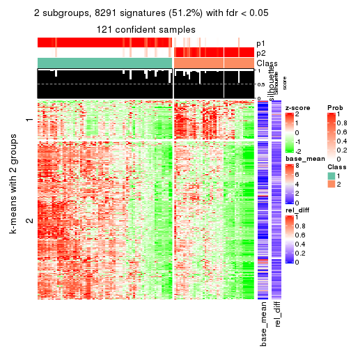</p>

</div>
<div id='tab-MAD-NMF-get-signatures-2'>
<pre><code class="r">get_signatures(res, k = 3)
</code></pre>

<p></p>

</div>
<div id='tab-MAD-NMF-get-signatures-3'>
<pre><code class="r">get_signatures(res, k = 4)
</code></pre>

<p></p>

</div>
<div id='tab-MAD-NMF-get-signatures-4'>
<pre><code class="r">get_signatures(res, k = 5)
</code></pre>

<p>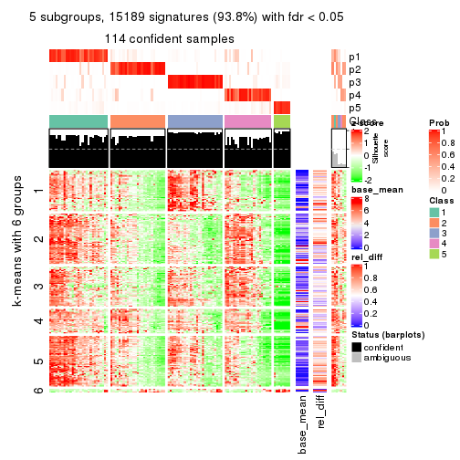</p>

</div>
<div id='tab-MAD-NMF-get-signatures-5'>
<pre><code class="r">get_signatures(res, k = 6)
</code></pre>

<p></p>

</div>
</div>


Signature heatmaps where rows are not scaled:


<script>
$( function() {
	$( '#tabs-MAD-NMF-get-signatures-no-scale' ).tabs();
} );
</script>
<div id='tabs-MAD-NMF-get-signatures-no-scale'>
<ul>
<li><a href='#tab-MAD-NMF-get-signatures-no-scale-1'>k = 2</a></li>
<li><a href='#tab-MAD-NMF-get-signatures-no-scale-2'>k = 3</a></li>
<li><a href='#tab-MAD-NMF-get-signatures-no-scale-3'>k = 4</a></li>
<li><a href='#tab-MAD-NMF-get-signatures-no-scale-4'>k = 5</a></li>
<li><a href='#tab-MAD-NMF-get-signatures-no-scale-5'>k = 6</a></li>
</ul>
<div id='tab-MAD-NMF-get-signatures-no-scale-1'>
<pre><code class="r">get_signatures(res, k = 2, scale_rows = FALSE)
</code></pre>

<p></p>

</div>
<div id='tab-MAD-NMF-get-signatures-no-scale-2'>
<pre><code class="r">get_signatures(res, k = 3, scale_rows = FALSE)
</code></pre>

<p></p>

</div>
<div id='tab-MAD-NMF-get-signatures-no-scale-3'>
<pre><code class="r">get_signatures(res, k = 4, scale_rows = FALSE)
</code></pre>

<p></p>

</div>
<div id='tab-MAD-NMF-get-signatures-no-scale-4'>
<pre><code class="r">get_signatures(res, k = 5, scale_rows = FALSE)
</code></pre>

<p></p>

</div>
<div id='tab-MAD-NMF-get-signatures-no-scale-5'>
<pre><code class="r">get_signatures(res, k = 6, scale_rows = FALSE)
</code></pre>

<p></p>

</div>
</div>


Compare the overlap of signatures from different k:

```r
compare_signatures(res)
```


`get_signature()` returns a data frame invisibly. TO get the list of signatures, the function
call should be assigned to a variable explicitly. In following code, if `plot` argument is set
to `FALSE`, no heatmap is plotted while only the differential analysis is performed.

```r
# code only for demonstration
tb = get_signature(res, k = ..., plot = FALSE)
```

An example of the output of `tb` is:

```
#>   which_row         fdr    mean_1    mean_2 scaled_mean_1 scaled_mean_2 km
#> 1        38 0.042760348  8.373488  9.131774    -0.5533452     0.5164555  1
#> 2        40 0.018707592  7.106213  8.469186    -0.6173731     0.5762149  1
#> 3        55 0.019134737 10.221463 11.207825    -0.6159697     0.5749050  1
#> 4        59 0.006059896  5.921854  7.869574    -0.6899429     0.6439467  1
#> 5        60 0.018055526  8.928898 10.211722    -0.6204761     0.5791110  1
#> 6        98 0.009384629 15.714769 14.887706     0.6635654    -0.6193277  2
...
```

The columns in `tb` are:

1. `which_row`: row indices corresponding to the input matrix.
2. `fdr`: FDR for the differential test. 
3. `mean_x`: The mean value in group x.
4. `scaled_mean_x`: The mean value in group x after rows are scaled.
5. `km`: Row groups if k-means clustering is applied to rows.


UMAP plot which shows how samples are separated.


<script>
$( function() {
	$( '#tabs-MAD-NMF-dimension-reduction' ).tabs();
} );
</script>
<div id='tabs-MAD-NMF-dimension-reduction'>
<ul>
<li><a href='#tab-MAD-NMF-dimension-reduction-1'>k = 2</a></li>
<li><a href='#tab-MAD-NMF-dimension-reduction-2'>k = 3</a></li>
<li><a href='#tab-MAD-NMF-dimension-reduction-3'>k = 4</a></li>
<li><a href='#tab-MAD-NMF-dimension-reduction-4'>k = 5</a></li>
<li><a href='#tab-MAD-NMF-dimension-reduction-5'>k = 6</a></li>
</ul>
<div id='tab-MAD-NMF-dimension-reduction-1'>
<pre><code class="r">dimension_reduction(res, k = 2, method = &quot;UMAP&quot;)
</code></pre>

<p></p>

</div>
<div id='tab-MAD-NMF-dimension-reduction-2'>
<pre><code class="r">dimension_reduction(res, k = 3, method = &quot;UMAP&quot;)
</code></pre>

<p></p>

</div>
<div id='tab-MAD-NMF-dimension-reduction-3'>
<pre><code class="r">dimension_reduction(res, k = 4, method = &quot;UMAP&quot;)
</code></pre>

<p></p>

</div>
<div id='tab-MAD-NMF-dimension-reduction-4'>
<pre><code class="r">dimension_reduction(res, k = 5, method = &quot;UMAP&quot;)
</code></pre>

<p></p>

</div>
<div id='tab-MAD-NMF-dimension-reduction-5'>
<pre><code class="r">dimension_reduction(res, k = 6, method = &quot;UMAP&quot;)
</code></pre>

<p></p>

</div>
</div>


Following heatmap shows how subgroups are split when increasing `k`:

```r
collect_classes(res)
```


If matrix rows can be associated to genes, consider to use `functional_enrichment(res,
...)` to perform function enrichment for the signature genes. See [this vignette](http://bioconductor.org/packages/devel/bioc/vignettes/cola/inst/doc/functional_enrichment.html) for more detailed explanations.


 

---------------------------------------------------


### ATC:hclust**


The object with results only for a single top-value method and a single partition method 
can be extracted as:

```r
res = res_list["ATC", "hclust"]
# you can also extract it by
# res = res_list["ATC:hclust"]
```

A summary of `res` and all the functions that can be applied to it:

```r
res
```

```
#> A 'ConsensusPartition' object with k = 2, 3, 4, 5, 6.
#>   On a matrix with 16187 rows and 121 columns.
#>   Top rows (1000, 2000, 3000, 4000, 5000) are extracted by 'ATC' method.
#>   Subgroups are detected by 'hclust' method.
#>   Performed in total 1250 partitions by row resampling.
#>   Best k for subgroups seems to be 2.
#> 
#> Following methods can be applied to this 'ConsensusPartition' object:
#>  [1] "cola_report"             "collect_classes"         "collect_plots"          
#>  [4] "collect_stats"           "colnames"                "compare_signatures"     
#>  [7] "consensus_heatmap"       "dimension_reduction"     "functional_enrichment"  
#> [10] "get_anno_col"            "get_anno"                "get_classes"            
#> [13] "get_consensus"           "get_matrix"              "get_membership"         
#> [16] "get_param"               "get_signatures"          "get_stats"              
#> [19] "is_best_k"               "is_stable_k"             "membership_heatmap"     
#> [22] "ncol"                    "nrow"                    "plot_ecdf"              
#> [25] "rownames"                "select_partition_number" "show"                   
#> [28] "suggest_best_k"          "test_to_known_factors"
```

`collect_plots()` function collects all the plots made from `res` for all `k` (number of partitions)
into one single page to provide an easy and fast comparison between different `k`.

```r
collect_plots(res)
```


The plots are:

- The first row: a plot of the ECDF (empirical cumulative distribution
  function) curves of the consensus matrix for each `k` and the heatmap of
  predicted classes for each `k`.
- The second row: heatmaps of the consensus matrix for each `k`.
- The third row: heatmaps of the membership matrix for each `k`.
- The fouth row: heatmaps of the signatures for each `k`.

All the plots in panels can be made by individual functions and they are
plotted later in this section.

`select_partition_number()` produces several plots showing different
statistics for choosing "optimized" `k`. There are following statistics:

- ECDF curves of the consensus matrix for each `k`;
- 1-PAC. [The PAC
  score](https://en.wikipedia.org/wiki/Consensus_clustering#Over-interpretation_potential_of_consensus_clustering)
  measures the proportion of the ambiguous subgrouping.
- Mean silhouette score.
- Concordance. The mean probability of fiting the consensus class ids in all
  partitions.
- Area increased. Denote $A_k$ as the area under the ECDF curve for current
  `k`, the area increased is defined as $A_k - A_{k-1}$.
- Rand index. The percent of pairs of samples that are both in a same cluster
  or both are not in a same cluster in the partition of k and k-1.
- Jaccard index. The ratio of pairs of samples are both in a same cluster in
  the partition of k and k-1 and the pairs of samples are both in a same
  cluster in the partition k or k-1.

The detailed explanations of these statistics can be found in [the _cola_
vignette](http://bioconductor.org/packages/devel/bioc/vignettes/cola/inst/doc/cola.html#toc_13).

Generally speaking, lower PAC score, higher mean silhouette score or higher
concordance corresponds to better partition. Rand index and Jaccard index
measure how similar the current partition is compared to partition with `k-1`.
If they are too similar, we won't accept `k` is better than `k-1`.

```r
select_partition_number(res)
```


The numeric values for all these statistics can be obtained by `get_stats()`.

```r
get_stats(res)
```

```
#>   k 1-PAC mean_silhouette concordance area_increased  Rand Jaccard
#> 2 2 0.980           0.972       0.986         0.4397 0.554   0.554
#> 3 3 0.766           0.898       0.891         0.2197 0.947   0.904
#> 4 4 0.699           0.833       0.881         0.2945 0.799   0.599
#> 5 5 0.832           0.803       0.911         0.1413 0.903   0.677
#> 6 6 0.806           0.777       0.852         0.0372 0.947   0.761
```

`suggest_best_k()` suggests the best $k$ based on these statistics. The rules are as follows:

- All $k$ with Jaccard index larger than 0.95 are removed because increasing
  $k$ does not provide enough extra information. If all $k$ are removed, it is
  marked as no subgroup is detected.
- For all $k$ with 1-PAC score larger than 0.9, the maximal $k$ is taken as
  the best $k$, and other $k$ are marked as optional $k$.
- If it does not fit the second rule. The $k$ with the maximal vote of the
  highest 1-PAC score, highest mean silhouette, and highest concordance is
  taken as the best $k$.

```r
suggest_best_k(res)
```

```
#> [1] 2
```


Following shows the table of the partitions (You need to click the **show/hide
code output** link to see it). The membership matrix (columns with name `p*`)
is inferred by
[`clue::cl_consensus()`](https://www.rdocumentation.org/link/cl_consensus?package=clue)
function with the `SE` method. Basically the value in the membership matrix
represents the probability to belong to a certain group. The finall class
label for an item is determined with the group with highest probability it
belongs to.

In `get_classes()` function, the entropy is calculated from the membership
matrix and the silhouette score is calculated from the consensus matrix.


<script>
$( function() {
	$( '#tabs-ATC-hclust-get-classes' ).tabs();
} );
</script>
<div id='tabs-ATC-hclust-get-classes'>
<ul>
<li><a href='#tab-ATC-hclust-get-classes-1'>k = 2</a></li>
<li><a href='#tab-ATC-hclust-get-classes-2'>k = 3</a></li>
<li><a href='#tab-ATC-hclust-get-classes-3'>k = 4</a></li>
<li><a href='#tab-ATC-hclust-get-classes-4'>k = 5</a></li>
<li><a href='#tab-ATC-hclust-get-classes-5'>k = 6</a></li>
</ul>

<div id='tab-ATC-hclust-get-classes-1'>
<p><a id='tab-ATC-hclust-get-classes-1-a' style='color:#0366d6' href='#'>show/hide code output</a></p>
<pre><code class="r">cbind(get_classes(res, k = 2), get_membership(res, k = 2))
</code></pre>

<pre><code>#&gt;           class entropy silhouette    p1    p2
#&gt; DRR006374     2  0.0000      0.965 0.000 1.000
#&gt; DRR006375     1  0.0000      0.995 1.000 0.000
#&gt; DRR006376     1  0.0672      0.991 0.992 0.008
#&gt; DRR006377     1  0.0672      0.991 0.992 0.008
#&gt; DRR006378     2  0.0000      0.965 0.000 1.000
#&gt; DRR006379     1  0.0672      0.991 0.992 0.008
#&gt; DRR006380     2  0.0000      0.965 0.000 1.000
#&gt; DRR006381     1  0.0000      0.995 1.000 0.000
#&gt; DRR006382     2  0.0000      0.965 0.000 1.000
#&gt; DRR006383     1  0.0000      0.995 1.000 0.000
#&gt; DRR006384     2  0.0000      0.965 0.000 1.000
#&gt; DRR006385     1  0.0000      0.995 1.000 0.000
#&gt; DRR006386     2  0.0000      0.965 0.000 1.000
#&gt; DRR006387     1  0.0000      0.995 1.000 0.000
#&gt; DRR006388     1  0.0672      0.991 0.992 0.008
#&gt; DRR006389     1  0.0672      0.991 0.992 0.008
#&gt; DRR006390     2  0.0000      0.965 0.000 1.000
#&gt; DRR006391     2  0.0000      0.965 0.000 1.000
#&gt; DRR006392     1  0.0000      0.995 1.000 0.000
#&gt; DRR006393     1  0.0000      0.995 1.000 0.000
#&gt; DRR006394     2  0.0000      0.965 0.000 1.000
#&gt; DRR006395     1  0.0376      0.993 0.996 0.004
#&gt; DRR006396     1  0.0000      0.995 1.000 0.000
#&gt; DRR006397     1  0.0672      0.991 0.992 0.008
#&gt; DRR006398     1  0.0672      0.991 0.992 0.008
#&gt; DRR006399     1  0.0672      0.991 0.992 0.008
#&gt; DRR006400     1  0.0672      0.991 0.992 0.008
#&gt; DRR006401     2  0.0000      0.965 0.000 1.000
#&gt; DRR006402     2  0.0000      0.965 0.000 1.000
#&gt; DRR006403     1  0.0672      0.991 0.992 0.008
#&gt; DRR006404     1  0.0672      0.991 0.992 0.008
#&gt; DRR006405     1  0.0672      0.991 0.992 0.008
#&gt; DRR006406     1  0.0672      0.991 0.992 0.008
#&gt; DRR006407     2  0.4562      0.889 0.096 0.904
#&gt; DRR006408     2  0.0000      0.965 0.000 1.000
#&gt; DRR006409     1  0.0000      0.995 1.000 0.000
#&gt; DRR006410     1  0.0000      0.995 1.000 0.000
#&gt; DRR006411     2  0.4690      0.886 0.100 0.900
#&gt; DRR006412     2  0.0000      0.965 0.000 1.000
#&gt; DRR006413     1  0.0000      0.995 1.000 0.000
#&gt; DRR006414     1  0.0000      0.995 1.000 0.000
#&gt; DRR006415     1  0.0000      0.995 1.000 0.000
#&gt; DRR006416     1  0.0376      0.993 0.996 0.004
#&gt; DRR006417     1  0.0000      0.995 1.000 0.000
#&gt; DRR006418     1  0.0000      0.995 1.000 0.000
#&gt; DRR006419     1  0.0000      0.995 1.000 0.000
#&gt; DRR006420     1  0.0000      0.995 1.000 0.000
#&gt; DRR006421     1  0.0000      0.995 1.000 0.000
#&gt; DRR006422     1  0.1184      0.984 0.984 0.016
#&gt; DRR006423     2  0.0000      0.965 0.000 1.000
#&gt; DRR006424     1  0.0000      0.995 1.000 0.000
#&gt; DRR006425     2  0.5294      0.866 0.120 0.880
#&gt; DRR006426     1  0.0000      0.995 1.000 0.000
#&gt; DRR006427     2  0.0000      0.965 0.000 1.000
#&gt; DRR006428     1  0.0000      0.995 1.000 0.000
#&gt; DRR006429     2  0.8207      0.693 0.256 0.744
#&gt; DRR006430     1  0.0000      0.995 1.000 0.000
#&gt; DRR006431     1  0.0000      0.995 1.000 0.000
#&gt; DRR006432     1  0.0000      0.995 1.000 0.000
#&gt; DRR006433     1  0.1184      0.984 0.984 0.016
#&gt; DRR006434     2  0.0000      0.965 0.000 1.000
#&gt; DRR006435     2  0.0000      0.965 0.000 1.000
#&gt; DRR006436     2  0.0000      0.965 0.000 1.000
#&gt; DRR006437     1  0.0000      0.995 1.000 0.000
#&gt; DRR006438     1  0.0000      0.995 1.000 0.000
#&gt; DRR006439     1  0.0000      0.995 1.000 0.000
#&gt; DRR006440     2  0.0000      0.965 0.000 1.000
#&gt; DRR006441     2  0.0000      0.965 0.000 1.000
#&gt; DRR006442     1  0.0000      0.995 1.000 0.000
#&gt; DRR006443     2  0.0000      0.965 0.000 1.000
#&gt; DRR006444     2  0.0000      0.965 0.000 1.000
#&gt; DRR006445     1  0.0000      0.995 1.000 0.000
#&gt; DRR006446     2  0.0000      0.965 0.000 1.000
#&gt; DRR006447     1  0.0000      0.995 1.000 0.000
#&gt; DRR006448     1  0.0672      0.991 0.992 0.008
#&gt; DRR006449     1  0.0000      0.995 1.000 0.000
#&gt; DRR006450     1  0.0000      0.995 1.000 0.000
#&gt; DRR006451     1  0.0672      0.991 0.992 0.008
#&gt; DRR006452     1  0.0000      0.995 1.000 0.000
#&gt; DRR006453     1  0.0000      0.995 1.000 0.000
#&gt; DRR006454     2  0.8267      0.686 0.260 0.740
#&gt; DRR006455     2  0.0000      0.965 0.000 1.000
#&gt; DRR006456     1  0.0000      0.995 1.000 0.000
#&gt; DRR006457     1  0.0000      0.995 1.000 0.000
#&gt; DRR006458     1  0.0000      0.995 1.000 0.000
#&gt; DRR006459     1  0.0000      0.995 1.000 0.000
#&gt; DRR006460     2  0.0000      0.965 0.000 1.000
#&gt; DRR006461     2  0.0000      0.965 0.000 1.000
#&gt; DRR006462     1  0.0000      0.995 1.000 0.000
#&gt; DRR006463     2  0.0000      0.965 0.000 1.000
#&gt; DRR006464     2  0.8207      0.693 0.256 0.744
#&gt; DRR006465     1  0.0000      0.995 1.000 0.000
#&gt; DRR006466     1  0.6531      0.792 0.832 0.168
#&gt; DRR006467     1  0.0000      0.995 1.000 0.000
#&gt; DRR006468     2  0.0000      0.965 0.000 1.000
#&gt; DRR006469     2  0.0000      0.965 0.000 1.000
#&gt; DRR006470     1  0.0000      0.995 1.000 0.000
#&gt; DRR006471     1  0.0000      0.995 1.000 0.000
#&gt; DRR006472     1  0.1184      0.984 0.984 0.016
#&gt; DRR006473     2  0.0000      0.965 0.000 1.000
#&gt; DRR006474     2  0.0000      0.965 0.000 1.000
#&gt; DRR006475     1  0.0000      0.995 1.000 0.000
#&gt; DRR006476     2  0.8207      0.693 0.256 0.744
#&gt; DRR006477     1  0.1184      0.984 0.984 0.016
#&gt; DRR006478     1  0.0000      0.995 1.000 0.000
#&gt; DRR006479     1  0.0000      0.995 1.000 0.000
#&gt; DRR006480     1  0.0000      0.995 1.000 0.000
#&gt; DRR006481     1  0.0000      0.995 1.000 0.000
#&gt; DRR006482     1  0.0000      0.995 1.000 0.000
#&gt; DRR006483     1  0.0000      0.995 1.000 0.000
#&gt; DRR006484     1  0.0000      0.995 1.000 0.000
#&gt; DRR006485     2  0.0000      0.965 0.000 1.000
#&gt; DRR006486     1  0.0000      0.995 1.000 0.000
#&gt; DRR006487     1  0.0000      0.995 1.000 0.000
#&gt; DRR006488     2  0.0000      0.965 0.000 1.000
#&gt; DRR006489     1  0.0000      0.995 1.000 0.000
#&gt; DRR006490     1  0.0000      0.995 1.000 0.000
#&gt; DRR006491     1  0.0000      0.995 1.000 0.000
#&gt; DRR006492     1  0.0000      0.995 1.000 0.000
#&gt; DRR006493     1  0.0000      0.995 1.000 0.000
#&gt; DRR006494     1  0.0000      0.995 1.000 0.000
</code></pre>

<script>
$('#tab-ATC-hclust-get-classes-1-a').parent().next().next().hide();
$('#tab-ATC-hclust-get-classes-1-a').click(function(){
  $('#tab-ATC-hclust-get-classes-1-a').parent().next().next().toggle();
  return(false);
});
</script>
</div>

<div id='tab-ATC-hclust-get-classes-2'>
<p><a id='tab-ATC-hclust-get-classes-2-a' style='color:#0366d6' href='#'>show/hide code output</a></p>
<pre><code class="r">cbind(get_classes(res, k = 3), get_membership(res, k = 3))
</code></pre>

<pre><code>#&gt;           class entropy silhouette    p1    p2    p3
#&gt; DRR006374     2  0.5397      0.900 0.000 0.720 0.280
#&gt; DRR006375     1  0.0237      0.912 0.996 0.004 0.000
#&gt; DRR006376     1  0.5431      0.811 0.716 0.284 0.000
#&gt; DRR006377     1  0.5431      0.811 0.716 0.284 0.000
#&gt; DRR006378     2  0.5397      0.900 0.000 0.720 0.280
#&gt; DRR006379     1  0.5431      0.811 0.716 0.284 0.000
#&gt; DRR006380     2  0.5397      0.900 0.000 0.720 0.280
#&gt; DRR006381     1  0.0237      0.912 0.996 0.004 0.000
#&gt; DRR006382     2  0.5397      0.900 0.000 0.720 0.280
#&gt; DRR006383     1  0.2796      0.919 0.908 0.092 0.000
#&gt; DRR006384     3  0.0000      1.000 0.000 0.000 1.000
#&gt; DRR006385     1  0.2796      0.919 0.908 0.092 0.000
#&gt; DRR006386     3  0.0000      1.000 0.000 0.000 1.000
#&gt; DRR006387     1  0.2066      0.920 0.940 0.060 0.000
#&gt; DRR006388     1  0.3752      0.900 0.856 0.144 0.000
#&gt; DRR006389     1  0.3752      0.900 0.856 0.144 0.000
#&gt; DRR006390     3  0.0000      1.000 0.000 0.000 1.000
#&gt; DRR006391     3  0.0000      1.000 0.000 0.000 1.000
#&gt; DRR006392     1  0.0237      0.912 0.996 0.004 0.000
#&gt; DRR006393     1  0.0237      0.912 0.996 0.004 0.000
#&gt; DRR006394     2  0.5397      0.900 0.000 0.720 0.280
#&gt; DRR006395     1  0.2959      0.915 0.900 0.100 0.000
#&gt; DRR006396     1  0.2066      0.920 0.940 0.060 0.000
#&gt; DRR006397     1  0.3752      0.900 0.856 0.144 0.000
#&gt; DRR006398     1  0.3752      0.900 0.856 0.144 0.000
#&gt; DRR006399     1  0.5431      0.811 0.716 0.284 0.000
#&gt; DRR006400     1  0.5431      0.811 0.716 0.284 0.000
#&gt; DRR006401     3  0.0000      1.000 0.000 0.000 1.000
#&gt; DRR006402     3  0.0000      1.000 0.000 0.000 1.000
#&gt; DRR006403     1  0.5431      0.811 0.716 0.284 0.000
#&gt; DRR006404     1  0.5431      0.811 0.716 0.284 0.000
#&gt; DRR006405     1  0.5431      0.811 0.716 0.284 0.000
#&gt; DRR006406     1  0.5431      0.811 0.716 0.284 0.000
#&gt; DRR006407     2  0.4346      0.823 0.000 0.816 0.184
#&gt; DRR006408     2  0.5397      0.900 0.000 0.720 0.280
#&gt; DRR006409     1  0.0237      0.912 0.996 0.004 0.000
#&gt; DRR006410     1  0.0237      0.912 0.996 0.004 0.000
#&gt; DRR006411     2  0.4291      0.819 0.000 0.820 0.180
#&gt; DRR006412     3  0.0000      1.000 0.000 0.000 1.000
#&gt; DRR006413     1  0.0237      0.912 0.996 0.004 0.000
#&gt; DRR006414     1  0.0237      0.912 0.996 0.004 0.000
#&gt; DRR006415     1  0.2796      0.919 0.908 0.092 0.000
#&gt; DRR006416     1  0.3038      0.916 0.896 0.104 0.000
#&gt; DRR006417     1  0.2796      0.919 0.908 0.092 0.000
#&gt; DRR006418     1  0.2796      0.919 0.908 0.092 0.000
#&gt; DRR006419     1  0.2796      0.919 0.908 0.092 0.000
#&gt; DRR006420     1  0.2711      0.920 0.912 0.088 0.000
#&gt; DRR006421     1  0.2796      0.919 0.908 0.092 0.000
#&gt; DRR006422     1  0.5497      0.804 0.708 0.292 0.000
#&gt; DRR006423     2  0.5397      0.900 0.000 0.720 0.280
#&gt; DRR006424     1  0.0237      0.912 0.996 0.004 0.000
#&gt; DRR006425     2  0.4002      0.804 0.000 0.840 0.160
#&gt; DRR006426     1  0.2796      0.919 0.908 0.092 0.000
#&gt; DRR006427     3  0.0000      1.000 0.000 0.000 1.000
#&gt; DRR006428     1  0.0237      0.912 0.996 0.004 0.000
#&gt; DRR006429     2  0.1031      0.688 0.000 0.976 0.024
#&gt; DRR006430     1  0.0237      0.912 0.996 0.004 0.000
#&gt; DRR006431     1  0.0237      0.912 0.996 0.004 0.000
#&gt; DRR006432     1  0.2796      0.919 0.908 0.092 0.000
#&gt; DRR006433     1  0.5497      0.804 0.708 0.292 0.000
#&gt; DRR006434     2  0.5397      0.900 0.000 0.720 0.280
#&gt; DRR006435     3  0.0000      1.000 0.000 0.000 1.000
#&gt; DRR006436     3  0.0000      1.000 0.000 0.000 1.000
#&gt; DRR006437     1  0.2796      0.919 0.908 0.092 0.000
#&gt; DRR006438     1  0.0237      0.912 0.996 0.004 0.000
#&gt; DRR006439     1  0.2796      0.919 0.908 0.092 0.000
#&gt; DRR006440     2  0.5397      0.900 0.000 0.720 0.280
#&gt; DRR006441     2  0.5397      0.900 0.000 0.720 0.280
#&gt; DRR006442     1  0.0237      0.912 0.996 0.004 0.000
#&gt; DRR006443     2  0.5397      0.900 0.000 0.720 0.280
#&gt; DRR006444     3  0.0000      1.000 0.000 0.000 1.000
#&gt; DRR006445     1  0.2796      0.919 0.908 0.092 0.000
#&gt; DRR006446     3  0.0000      1.000 0.000 0.000 1.000
#&gt; DRR006447     1  0.2796      0.919 0.908 0.092 0.000
#&gt; DRR006448     1  0.5431      0.811 0.716 0.284 0.000
#&gt; DRR006449     1  0.2165      0.920 0.936 0.064 0.000
#&gt; DRR006450     1  0.2711      0.920 0.912 0.088 0.000
#&gt; DRR006451     1  0.5431      0.811 0.716 0.284 0.000
#&gt; DRR006452     1  0.0237      0.912 0.996 0.004 0.000
#&gt; DRR006453     1  0.2711      0.920 0.912 0.088 0.000
#&gt; DRR006454     2  0.0892      0.683 0.000 0.980 0.020
#&gt; DRR006455     3  0.0000      1.000 0.000 0.000 1.000
#&gt; DRR006456     1  0.2796      0.919 0.908 0.092 0.000
#&gt; DRR006457     1  0.2796      0.919 0.908 0.092 0.000
#&gt; DRR006458     1  0.0237      0.912 0.996 0.004 0.000
#&gt; DRR006459     1  0.0237      0.912 0.996 0.004 0.000
#&gt; DRR006460     3  0.0000      1.000 0.000 0.000 1.000
#&gt; DRR006461     2  0.5397      0.900 0.000 0.720 0.280
#&gt; DRR006462     1  0.2066      0.920 0.940 0.060 0.000
#&gt; DRR006463     2  0.5397      0.900 0.000 0.720 0.280
#&gt; DRR006464     2  0.1031      0.688 0.000 0.976 0.024
#&gt; DRR006465     1  0.0237      0.912 0.996 0.004 0.000
#&gt; DRR006466     1  0.6252      0.584 0.556 0.444 0.000
#&gt; DRR006467     1  0.0237      0.912 0.996 0.004 0.000
#&gt; DRR006468     3  0.0000      1.000 0.000 0.000 1.000
#&gt; DRR006469     2  0.5397      0.900 0.000 0.720 0.280
#&gt; DRR006470     1  0.2796      0.919 0.908 0.092 0.000
#&gt; DRR006471     1  0.0237      0.912 0.996 0.004 0.000
#&gt; DRR006472     1  0.5497      0.804 0.708 0.292 0.000
#&gt; DRR006473     2  0.5397      0.900 0.000 0.720 0.280
#&gt; DRR006474     2  0.5397      0.900 0.000 0.720 0.280
#&gt; DRR006475     1  0.0237      0.912 0.996 0.004 0.000
#&gt; DRR006476     2  0.1031      0.688 0.000 0.976 0.024
#&gt; DRR006477     1  0.5497      0.804 0.708 0.292 0.000
#&gt; DRR006478     1  0.0237      0.912 0.996 0.004 0.000
#&gt; DRR006479     1  0.0237      0.912 0.996 0.004 0.000
#&gt; DRR006480     1  0.0237      0.912 0.996 0.004 0.000
#&gt; DRR006481     1  0.2796      0.919 0.908 0.092 0.000
#&gt; DRR006482     1  0.2796      0.919 0.908 0.092 0.000
#&gt; DRR006483     1  0.0237      0.912 0.996 0.004 0.000
#&gt; DRR006484     1  0.0237      0.912 0.996 0.004 0.000
#&gt; DRR006485     2  0.5397      0.900 0.000 0.720 0.280
#&gt; DRR006486     1  0.0237      0.912 0.996 0.004 0.000
#&gt; DRR006487     1  0.2796      0.919 0.908 0.092 0.000
#&gt; DRR006488     3  0.0000      1.000 0.000 0.000 1.000
#&gt; DRR006489     1  0.0237      0.912 0.996 0.004 0.000
#&gt; DRR006490     1  0.0237      0.912 0.996 0.004 0.000
#&gt; DRR006491     1  0.0237      0.912 0.996 0.004 0.000
#&gt; DRR006492     1  0.2066      0.920 0.940 0.060 0.000
#&gt; DRR006493     1  0.2796      0.919 0.908 0.092 0.000
#&gt; DRR006494     1  0.0237      0.912 0.996 0.004 0.000
</code></pre>

<script>
$('#tab-ATC-hclust-get-classes-2-a').parent().next().next().hide();
$('#tab-ATC-hclust-get-classes-2-a').click(function(){
  $('#tab-ATC-hclust-get-classes-2-a').parent().next().next().toggle();
  return(false);
});
</script>
</div>

<div id='tab-ATC-hclust-get-classes-3'>
<p><a id='tab-ATC-hclust-get-classes-3-a' style='color:#0366d6' href='#'>show/hide code output</a></p>
<pre><code class="r">cbind(get_classes(res, k = 4), get_membership(res, k = 4))
</code></pre>

<pre><code>#&gt;           class entropy silhouette    p1    p2    p3    p4
#&gt; DRR006374     2  0.2281      0.932 0.000 0.904 0.000 0.096
#&gt; DRR006375     1  0.0000      0.927 1.000 0.000 0.000 0.000
#&gt; DRR006376     3  0.2281      0.752 0.000 0.096 0.904 0.000
#&gt; DRR006377     3  0.2281      0.752 0.000 0.096 0.904 0.000
#&gt; DRR006378     2  0.2281      0.932 0.000 0.904 0.000 0.096
#&gt; DRR006379     3  0.2281      0.752 0.000 0.096 0.904 0.000
#&gt; DRR006380     2  0.2281      0.932 0.000 0.904 0.000 0.096
#&gt; DRR006381     1  0.0000      0.927 1.000 0.000 0.000 0.000
#&gt; DRR006382     2  0.2281      0.932 0.000 0.904 0.000 0.096
#&gt; DRR006383     3  0.3400      0.840 0.180 0.000 0.820 0.000
#&gt; DRR006384     4  0.0000      1.000 0.000 0.000 0.000 1.000
#&gt; DRR006385     3  0.3444      0.839 0.184 0.000 0.816 0.000
#&gt; DRR006386     4  0.0000      1.000 0.000 0.000 0.000 1.000
#&gt; DRR006387     3  0.4543      0.715 0.324 0.000 0.676 0.000
#&gt; DRR006388     3  0.3948      0.827 0.136 0.036 0.828 0.000
#&gt; DRR006389     3  0.3948      0.827 0.136 0.036 0.828 0.000
#&gt; DRR006390     4  0.0000      1.000 0.000 0.000 0.000 1.000
#&gt; DRR006391     4  0.0000      1.000 0.000 0.000 0.000 1.000
#&gt; DRR006392     1  0.0000      0.927 1.000 0.000 0.000 0.000
#&gt; DRR006393     1  0.4977     -0.251 0.540 0.000 0.460 0.000
#&gt; DRR006394     2  0.2281      0.932 0.000 0.904 0.000 0.096
#&gt; DRR006395     3  0.4576      0.772 0.260 0.012 0.728 0.000
#&gt; DRR006396     3  0.4543      0.715 0.324 0.000 0.676 0.000
#&gt; DRR006397     3  0.3948      0.827 0.136 0.036 0.828 0.000
#&gt; DRR006398     3  0.3948      0.827 0.136 0.036 0.828 0.000
#&gt; DRR006399     3  0.2281      0.752 0.000 0.096 0.904 0.000
#&gt; DRR006400     3  0.2281      0.752 0.000 0.096 0.904 0.000
#&gt; DRR006401     4  0.0000      1.000 0.000 0.000 0.000 1.000
#&gt; DRR006402     4  0.0000      1.000 0.000 0.000 0.000 1.000
#&gt; DRR006403     3  0.2281      0.752 0.000 0.096 0.904 0.000
#&gt; DRR006404     3  0.2281      0.752 0.000 0.096 0.904 0.000
#&gt; DRR006405     3  0.2281      0.752 0.000 0.096 0.904 0.000
#&gt; DRR006406     3  0.2281      0.752 0.000 0.096 0.904 0.000
#&gt; DRR006407     2  0.0000      0.875 0.000 1.000 0.000 0.000
#&gt; DRR006408     2  0.2281      0.932 0.000 0.904 0.000 0.096
#&gt; DRR006409     1  0.0000      0.927 1.000 0.000 0.000 0.000
#&gt; DRR006410     1  0.0000      0.927 1.000 0.000 0.000 0.000
#&gt; DRR006411     2  0.0188      0.873 0.000 0.996 0.004 0.000
#&gt; DRR006412     4  0.0000      1.000 0.000 0.000 0.000 1.000
#&gt; DRR006413     1  0.0000      0.927 1.000 0.000 0.000 0.000
#&gt; DRR006414     3  0.4933      0.542 0.432 0.000 0.568 0.000
#&gt; DRR006415     3  0.3400      0.840 0.180 0.000 0.820 0.000
#&gt; DRR006416     3  0.3266      0.838 0.168 0.000 0.832 0.000
#&gt; DRR006417     3  0.3400      0.840 0.180 0.000 0.820 0.000
#&gt; DRR006418     3  0.3444      0.839 0.184 0.000 0.816 0.000
#&gt; DRR006419     3  0.3444      0.839 0.184 0.000 0.816 0.000
#&gt; DRR006420     3  0.3649      0.829 0.204 0.000 0.796 0.000
#&gt; DRR006421     3  0.3400      0.840 0.180 0.000 0.820 0.000
#&gt; DRR006422     3  0.2408      0.751 0.000 0.104 0.896 0.000
#&gt; DRR006423     2  0.2281      0.932 0.000 0.904 0.000 0.096
#&gt; DRR006424     1  0.0000      0.927 1.000 0.000 0.000 0.000
#&gt; DRR006425     2  0.1798      0.865 0.000 0.944 0.040 0.016
#&gt; DRR006426     3  0.3400      0.840 0.180 0.000 0.820 0.000
#&gt; DRR006427     4  0.0000      1.000 0.000 0.000 0.000 1.000
#&gt; DRR006428     1  0.0000      0.927 1.000 0.000 0.000 0.000
#&gt; DRR006429     2  0.3172      0.761 0.000 0.840 0.160 0.000
#&gt; DRR006430     1  0.0000      0.927 1.000 0.000 0.000 0.000
#&gt; DRR006431     1  0.0000      0.927 1.000 0.000 0.000 0.000
#&gt; DRR006432     3  0.3400      0.840 0.180 0.000 0.820 0.000
#&gt; DRR006433     3  0.2408      0.751 0.000 0.104 0.896 0.000
#&gt; DRR006434     2  0.2281      0.932 0.000 0.904 0.000 0.096
#&gt; DRR006435     4  0.0000      1.000 0.000 0.000 0.000 1.000
#&gt; DRR006436     4  0.0000      1.000 0.000 0.000 0.000 1.000
#&gt; DRR006437     3  0.3400      0.840 0.180 0.000 0.820 0.000
#&gt; DRR006438     3  0.4933      0.542 0.432 0.000 0.568 0.000
#&gt; DRR006439     3  0.3486      0.837 0.188 0.000 0.812 0.000
#&gt; DRR006440     2  0.2281      0.932 0.000 0.904 0.000 0.096
#&gt; DRR006441     2  0.2281      0.932 0.000 0.904 0.000 0.096
#&gt; DRR006442     1  0.0000      0.927 1.000 0.000 0.000 0.000
#&gt; DRR006443     2  0.2281      0.932 0.000 0.904 0.000 0.096
#&gt; DRR006444     4  0.0000      1.000 0.000 0.000 0.000 1.000
#&gt; DRR006445     3  0.3444      0.839 0.184 0.000 0.816 0.000
#&gt; DRR006446     4  0.0000      1.000 0.000 0.000 0.000 1.000
#&gt; DRR006447     3  0.3444      0.839 0.184 0.000 0.816 0.000
#&gt; DRR006448     3  0.2281      0.752 0.000 0.096 0.904 0.000
#&gt; DRR006449     3  0.4522      0.721 0.320 0.000 0.680 0.000
#&gt; DRR006450     3  0.3688      0.828 0.208 0.000 0.792 0.000
#&gt; DRR006451     3  0.2281      0.752 0.000 0.096 0.904 0.000
#&gt; DRR006452     1  0.0000      0.927 1.000 0.000 0.000 0.000
#&gt; DRR006453     3  0.3569      0.833 0.196 0.000 0.804 0.000
#&gt; DRR006454     2  0.3219      0.757 0.000 0.836 0.164 0.000
#&gt; DRR006455     4  0.0000      1.000 0.000 0.000 0.000 1.000
#&gt; DRR006456     3  0.3400      0.840 0.180 0.000 0.820 0.000
#&gt; DRR006457     3  0.3400      0.840 0.180 0.000 0.820 0.000
#&gt; DRR006458     1  0.0000      0.927 1.000 0.000 0.000 0.000
#&gt; DRR006459     1  0.0000      0.927 1.000 0.000 0.000 0.000
#&gt; DRR006460     4  0.0000      1.000 0.000 0.000 0.000 1.000
#&gt; DRR006461     2  0.2281      0.932 0.000 0.904 0.000 0.096
#&gt; DRR006462     3  0.4543      0.715 0.324 0.000 0.676 0.000
#&gt; DRR006463     2  0.2281      0.932 0.000 0.904 0.000 0.096
#&gt; DRR006464     2  0.3172      0.761 0.000 0.840 0.160 0.000
#&gt; DRR006465     1  0.4977     -0.251 0.540 0.000 0.460 0.000
#&gt; DRR006466     3  0.4103      0.570 0.000 0.256 0.744 0.000
#&gt; DRR006467     1  0.0000      0.927 1.000 0.000 0.000 0.000
#&gt; DRR006468     4  0.0000      1.000 0.000 0.000 0.000 1.000
#&gt; DRR006469     2  0.2281      0.932 0.000 0.904 0.000 0.096
#&gt; DRR006470     3  0.3400      0.840 0.180 0.000 0.820 0.000
#&gt; DRR006471     1  0.0000      0.927 1.000 0.000 0.000 0.000
#&gt; DRR006472     3  0.2408      0.751 0.000 0.104 0.896 0.000
#&gt; DRR006473     2  0.2281      0.932 0.000 0.904 0.000 0.096
#&gt; DRR006474     2  0.2281      0.932 0.000 0.904 0.000 0.096
#&gt; DRR006475     1  0.0000      0.927 1.000 0.000 0.000 0.000
#&gt; DRR006476     2  0.3172      0.761 0.000 0.840 0.160 0.000
#&gt; DRR006477     3  0.2408      0.751 0.000 0.104 0.896 0.000
#&gt; DRR006478     1  0.4977     -0.251 0.540 0.000 0.460 0.000
#&gt; DRR006479     3  0.4933      0.542 0.432 0.000 0.568 0.000
#&gt; DRR006480     1  0.0000      0.927 1.000 0.000 0.000 0.000
#&gt; DRR006481     3  0.3400      0.840 0.180 0.000 0.820 0.000
#&gt; DRR006482     3  0.3400      0.840 0.180 0.000 0.820 0.000
#&gt; DRR006483     1  0.0000      0.927 1.000 0.000 0.000 0.000
#&gt; DRR006484     3  0.4933      0.542 0.432 0.000 0.568 0.000
#&gt; DRR006485     2  0.2281      0.932 0.000 0.904 0.000 0.096
#&gt; DRR006486     1  0.0000      0.927 1.000 0.000 0.000 0.000
#&gt; DRR006487     3  0.3400      0.840 0.180 0.000 0.820 0.000
#&gt; DRR006488     4  0.0000      1.000 0.000 0.000 0.000 1.000
#&gt; DRR006489     1  0.0000      0.927 1.000 0.000 0.000 0.000
#&gt; DRR006490     1  0.0000      0.927 1.000 0.000 0.000 0.000
#&gt; DRR006491     1  0.0000      0.927 1.000 0.000 0.000 0.000
#&gt; DRR006492     3  0.4454      0.735 0.308 0.000 0.692 0.000
#&gt; DRR006493     3  0.3400      0.840 0.180 0.000 0.820 0.000
#&gt; DRR006494     1  0.0000      0.927 1.000 0.000 0.000 0.000
</code></pre>

<script>
$('#tab-ATC-hclust-get-classes-3-a').parent().next().next().hide();
$('#tab-ATC-hclust-get-classes-3-a').click(function(){
  $('#tab-ATC-hclust-get-classes-3-a').parent().next().next().toggle();
  return(false);
});
</script>
</div>

<div id='tab-ATC-hclust-get-classes-4'>
<p><a id='tab-ATC-hclust-get-classes-4-a' style='color:#0366d6' href='#'>show/hide code output</a></p>
<pre><code class="r">cbind(get_classes(res, k = 5), get_membership(res, k = 5))
</code></pre>

<pre><code>#&gt;           class entropy silhouette    p1    p2    p3    p4 p5
#&gt; DRR006374     2  0.0000    0.93764 0.000 1.000 0.000 0.000  0
#&gt; DRR006375     1  0.0000    0.93449 1.000 0.000 0.000 0.000  0
#&gt; DRR006376     4  0.0880    0.88930 0.000 0.000 0.032 0.968  0
#&gt; DRR006377     4  0.0510    0.88825 0.000 0.000 0.016 0.984  0
#&gt; DRR006378     2  0.0000    0.93764 0.000 1.000 0.000 0.000  0
#&gt; DRR006379     4  0.0880    0.88930 0.000 0.000 0.032 0.968  0
#&gt; DRR006380     2  0.0290    0.93552 0.000 0.992 0.000 0.008  0
#&gt; DRR006381     1  0.0000    0.93449 1.000 0.000 0.000 0.000  0
#&gt; DRR006382     2  0.0510    0.93276 0.000 0.984 0.000 0.016  0
#&gt; DRR006383     3  0.0510    0.77019 0.000 0.000 0.984 0.016  0
#&gt; DRR006384     5  0.0000    1.00000 0.000 0.000 0.000 0.000  1
#&gt; DRR006385     3  0.0451    0.77148 0.004 0.000 0.988 0.008  0
#&gt; DRR006386     5  0.0000    1.00000 0.000 0.000 0.000 0.000  1
#&gt; DRR006387     3  0.3913    0.54017 0.324 0.000 0.676 0.000  0
#&gt; DRR006388     4  0.3274    0.73300 0.000 0.000 0.220 0.780  0
#&gt; DRR006389     4  0.3274    0.73300 0.000 0.000 0.220 0.780  0
#&gt; DRR006390     5  0.0000    1.00000 0.000 0.000 0.000 0.000  1
#&gt; DRR006391     5  0.0000    1.00000 0.000 0.000 0.000 0.000  1
#&gt; DRR006392     1  0.0000    0.93449 1.000 0.000 0.000 0.000  0
#&gt; DRR006393     1  0.4287    0.00597 0.540 0.000 0.460 0.000  0
#&gt; DRR006394     2  0.0000    0.93764 0.000 1.000 0.000 0.000  0
#&gt; DRR006395     4  0.6359    0.25473 0.260 0.000 0.220 0.520  0
#&gt; DRR006396     3  0.3913    0.54017 0.324 0.000 0.676 0.000  0
#&gt; DRR006397     4  0.3274    0.73300 0.000 0.000 0.220 0.780  0
#&gt; DRR006398     4  0.3274    0.73300 0.000 0.000 0.220 0.780  0
#&gt; DRR006399     4  0.0880    0.88930 0.000 0.000 0.032 0.968  0
#&gt; DRR006400     4  0.0880    0.88930 0.000 0.000 0.032 0.968  0
#&gt; DRR006401     5  0.0000    1.00000 0.000 0.000 0.000 0.000  1
#&gt; DRR006402     5  0.0000    1.00000 0.000 0.000 0.000 0.000  1
#&gt; DRR006403     4  0.0880    0.88930 0.000 0.000 0.032 0.968  0
#&gt; DRR006404     4  0.0880    0.88930 0.000 0.000 0.032 0.968  0
#&gt; DRR006405     4  0.0510    0.88825 0.000 0.000 0.016 0.984  0
#&gt; DRR006406     4  0.0510    0.88825 0.000 0.000 0.016 0.984  0
#&gt; DRR006407     2  0.2179    0.88190 0.000 0.888 0.000 0.112  0
#&gt; DRR006408     2  0.0290    0.93552 0.000 0.992 0.000 0.008  0
#&gt; DRR006409     1  0.0000    0.93449 1.000 0.000 0.000 0.000  0
#&gt; DRR006410     1  0.0000    0.93449 1.000 0.000 0.000 0.000  0
#&gt; DRR006411     2  0.2230    0.87951 0.000 0.884 0.000 0.116  0
#&gt; DRR006412     5  0.0000    1.00000 0.000 0.000 0.000 0.000  1
#&gt; DRR006413     1  0.0000    0.93449 1.000 0.000 0.000 0.000  0
#&gt; DRR006414     3  0.4242    0.32080 0.428 0.000 0.572 0.000  0
#&gt; DRR006415     3  0.0703    0.76876 0.000 0.000 0.976 0.024  0
#&gt; DRR006416     4  0.4249    0.34206 0.000 0.000 0.432 0.568  0
#&gt; DRR006417     3  0.2471    0.70611 0.000 0.000 0.864 0.136  0
#&gt; DRR006418     3  0.0566    0.77139 0.004 0.000 0.984 0.012  0
#&gt; DRR006419     3  0.0566    0.77139 0.004 0.000 0.984 0.012  0
#&gt; DRR006420     3  0.1430    0.76590 0.052 0.000 0.944 0.004  0
#&gt; DRR006421     3  0.2690    0.68586 0.000 0.000 0.844 0.156  0
#&gt; DRR006422     4  0.0798    0.88763 0.000 0.008 0.016 0.976  0
#&gt; DRR006423     2  0.0000    0.93764 0.000 1.000 0.000 0.000  0
#&gt; DRR006424     1  0.0000    0.93449 1.000 0.000 0.000 0.000  0
#&gt; DRR006425     2  0.2471    0.86523 0.000 0.864 0.000 0.136  0
#&gt; DRR006426     3  0.2471    0.70611 0.000 0.000 0.864 0.136  0
#&gt; DRR006427     5  0.0000    1.00000 0.000 0.000 0.000 0.000  1
#&gt; DRR006428     1  0.0000    0.93449 1.000 0.000 0.000 0.000  0
#&gt; DRR006429     2  0.3636    0.73317 0.000 0.728 0.000 0.272  0
#&gt; DRR006430     1  0.0000    0.93449 1.000 0.000 0.000 0.000  0
#&gt; DRR006431     1  0.0000    0.93449 1.000 0.000 0.000 0.000  0
#&gt; DRR006432     3  0.2471    0.70611 0.000 0.000 0.864 0.136  0
#&gt; DRR006433     4  0.0798    0.88763 0.000 0.008 0.016 0.976  0
#&gt; DRR006434     2  0.0000    0.93764 0.000 1.000 0.000 0.000  0
#&gt; DRR006435     5  0.0000    1.00000 0.000 0.000 0.000 0.000  1
#&gt; DRR006436     5  0.0000    1.00000 0.000 0.000 0.000 0.000  1
#&gt; DRR006437     3  0.4210    0.03655 0.000 0.000 0.588 0.412  0
#&gt; DRR006438     3  0.4242    0.32080 0.428 0.000 0.572 0.000  0
#&gt; DRR006439     3  0.1251    0.76759 0.008 0.000 0.956 0.036  0
#&gt; DRR006440     2  0.0000    0.93764 0.000 1.000 0.000 0.000  0
#&gt; DRR006441     2  0.0000    0.93764 0.000 1.000 0.000 0.000  0
#&gt; DRR006442     1  0.0000    0.93449 1.000 0.000 0.000 0.000  0
#&gt; DRR006443     2  0.0000    0.93764 0.000 1.000 0.000 0.000  0
#&gt; DRR006444     5  0.0000    1.00000 0.000 0.000 0.000 0.000  1
#&gt; DRR006445     3  0.0451    0.77148 0.004 0.000 0.988 0.008  0
#&gt; DRR006446     5  0.0000    1.00000 0.000 0.000 0.000 0.000  1
#&gt; DRR006447     3  0.0451    0.77148 0.004 0.000 0.988 0.008  0
#&gt; DRR006448     4  0.0880    0.88930 0.000 0.000 0.032 0.968  0
#&gt; DRR006449     3  0.3895    0.54561 0.320 0.000 0.680 0.000  0
#&gt; DRR006450     3  0.3282    0.68440 0.188 0.000 0.804 0.008  0
#&gt; DRR006451     4  0.0880    0.88930 0.000 0.000 0.032 0.968  0
#&gt; DRR006452     1  0.0000    0.93449 1.000 0.000 0.000 0.000  0
#&gt; DRR006453     3  0.1041    0.77065 0.032 0.000 0.964 0.004  0
#&gt; DRR006454     2  0.3661    0.72766 0.000 0.724 0.000 0.276  0
#&gt; DRR006455     5  0.0000    1.00000 0.000 0.000 0.000 0.000  1
#&gt; DRR006456     3  0.0510    0.77019 0.000 0.000 0.984 0.016  0
#&gt; DRR006457     3  0.2690    0.68586 0.000 0.000 0.844 0.156  0
#&gt; DRR006458     1  0.0000    0.93449 1.000 0.000 0.000 0.000  0
#&gt; DRR006459     1  0.0000    0.93449 1.000 0.000 0.000 0.000  0
#&gt; DRR006460     5  0.0000    1.00000 0.000 0.000 0.000 0.000  1
#&gt; DRR006461     2  0.0000    0.93764 0.000 1.000 0.000 0.000  0
#&gt; DRR006462     3  0.3913    0.54017 0.324 0.000 0.676 0.000  0
#&gt; DRR006463     2  0.0000    0.93764 0.000 1.000 0.000 0.000  0
#&gt; DRR006464     2  0.3636    0.73317 0.000 0.728 0.000 0.272  0
#&gt; DRR006465     1  0.4287    0.00597 0.540 0.000 0.460 0.000  0
#&gt; DRR006466     4  0.2561    0.71691 0.000 0.144 0.000 0.856  0
#&gt; DRR006467     1  0.0000    0.93449 1.000 0.000 0.000 0.000  0
#&gt; DRR006468     5  0.0000    1.00000 0.000 0.000 0.000 0.000  1
#&gt; DRR006469     2  0.0000    0.93764 0.000 1.000 0.000 0.000  0
#&gt; DRR006470     3  0.1851    0.73768 0.000 0.000 0.912 0.088  0
#&gt; DRR006471     1  0.0000    0.93449 1.000 0.000 0.000 0.000  0
#&gt; DRR006472     4  0.0798    0.88763 0.000 0.008 0.016 0.976  0
#&gt; DRR006473     2  0.0000    0.93764 0.000 1.000 0.000 0.000  0
#&gt; DRR006474     2  0.0000    0.93764 0.000 1.000 0.000 0.000  0
#&gt; DRR006475     1  0.0000    0.93449 1.000 0.000 0.000 0.000  0
#&gt; DRR006476     2  0.3636    0.73317 0.000 0.728 0.000 0.272  0
#&gt; DRR006477     4  0.0798    0.88763 0.000 0.008 0.016 0.976  0
#&gt; DRR006478     1  0.4287    0.00597 0.540 0.000 0.460 0.000  0
#&gt; DRR006479     3  0.4242    0.32080 0.428 0.000 0.572 0.000  0
#&gt; DRR006480     1  0.0000    0.93449 1.000 0.000 0.000 0.000  0
#&gt; DRR006481     3  0.2690    0.68586 0.000 0.000 0.844 0.156  0
#&gt; DRR006482     3  0.4219    0.02338 0.000 0.000 0.584 0.416  0
#&gt; DRR006483     1  0.0000    0.93449 1.000 0.000 0.000 0.000  0
#&gt; DRR006484     3  0.4242    0.32080 0.428 0.000 0.572 0.000  0
#&gt; DRR006485     2  0.0000    0.93764 0.000 1.000 0.000 0.000  0
#&gt; DRR006486     1  0.0000    0.93449 1.000 0.000 0.000 0.000  0
#&gt; DRR006487     3  0.0510    0.77019 0.000 0.000 0.984 0.016  0
#&gt; DRR006488     5  0.0000    1.00000 0.000 0.000 0.000 0.000  1
#&gt; DRR006489     1  0.0000    0.93449 1.000 0.000 0.000 0.000  0
#&gt; DRR006490     1  0.0000    0.93449 1.000 0.000 0.000 0.000  0
#&gt; DRR006491     1  0.0000    0.93449 1.000 0.000 0.000 0.000  0
#&gt; DRR006492     3  0.3990    0.55840 0.308 0.000 0.688 0.004  0
#&gt; DRR006493     3  0.0510    0.77019 0.000 0.000 0.984 0.016  0
#&gt; DRR006494     1  0.0000    0.93449 1.000 0.000 0.000 0.000  0
</code></pre>

<script>
$('#tab-ATC-hclust-get-classes-4-a').parent().next().next().hide();
$('#tab-ATC-hclust-get-classes-4-a').click(function(){
  $('#tab-ATC-hclust-get-classes-4-a').parent().next().next().toggle();
  return(false);
});
</script>
</div>

<div id='tab-ATC-hclust-get-classes-5'>
<p><a id='tab-ATC-hclust-get-classes-5-a' style='color:#0366d6' href='#'>show/hide code output</a></p>
<pre><code class="r">cbind(get_classes(res, k = 6), get_membership(res, k = 6))
</code></pre>

<pre><code>#&gt;           class entropy silhouette    p1    p2    p3    p4 p5    p6
#&gt; DRR006374     2  0.0000     0.9045 0.000 1.000 0.000 0.000  0 0.000
#&gt; DRR006375     1  0.3151     0.7784 0.748 0.000 0.252 0.000  0 0.000
#&gt; DRR006376     4  0.1003     0.8048 0.000 0.000 0.016 0.964  0 0.020
#&gt; DRR006377     4  0.0000     0.8010 0.000 0.000 0.000 1.000  0 0.000
#&gt; DRR006378     2  0.0146     0.9026 0.000 0.996 0.000 0.000  0 0.004
#&gt; DRR006379     4  0.1003     0.8048 0.000 0.000 0.016 0.964  0 0.020
#&gt; DRR006380     2  0.3854    -0.1908 0.000 0.536 0.000 0.000  0 0.464
#&gt; DRR006381     1  0.0000     0.9132 1.000 0.000 0.000 0.000  0 0.000
#&gt; DRR006382     2  0.2793     0.6317 0.000 0.800 0.000 0.000  0 0.200
#&gt; DRR006383     3  0.3672     0.7398 0.000 0.000 0.632 0.000  0 0.368
#&gt; DRR006384     5  0.0000     1.0000 0.000 0.000 0.000 0.000  1 0.000
#&gt; DRR006385     3  0.3398     0.7406 0.000 0.000 0.740 0.008  0 0.252
#&gt; DRR006386     5  0.0000     1.0000 0.000 0.000 0.000 0.000  1 0.000
#&gt; DRR006387     3  0.1387     0.6666 0.068 0.000 0.932 0.000  0 0.000
#&gt; DRR006388     4  0.3588     0.7070 0.000 0.000 0.060 0.788  0 0.152
#&gt; DRR006389     4  0.3588     0.7070 0.000 0.000 0.060 0.788  0 0.152
#&gt; DRR006390     5  0.0000     1.0000 0.000 0.000 0.000 0.000  1 0.000
#&gt; DRR006391     5  0.0000     1.0000 0.000 0.000 0.000 0.000  1 0.000
#&gt; DRR006392     1  0.0000     0.9132 1.000 0.000 0.000 0.000  0 0.000
#&gt; DRR006393     3  0.3330     0.4040 0.284 0.000 0.716 0.000  0 0.000
#&gt; DRR006394     2  0.0146     0.9026 0.000 0.996 0.000 0.000  0 0.004
#&gt; DRR006395     4  0.4080     0.3611 0.008 0.000 0.456 0.536  0 0.000
#&gt; DRR006396     3  0.1387     0.6666 0.068 0.000 0.932 0.000  0 0.000
#&gt; DRR006397     4  0.3588     0.7070 0.000 0.000 0.060 0.788  0 0.152
#&gt; DRR006398     4  0.3588     0.7070 0.000 0.000 0.060 0.788  0 0.152
#&gt; DRR006399     4  0.1003     0.8048 0.000 0.000 0.016 0.964  0 0.020
#&gt; DRR006400     4  0.1003     0.8048 0.000 0.000 0.016 0.964  0 0.020
#&gt; DRR006401     5  0.0000     1.0000 0.000 0.000 0.000 0.000  1 0.000
#&gt; DRR006402     5  0.0000     1.0000 0.000 0.000 0.000 0.000  1 0.000
#&gt; DRR006403     4  0.1003     0.8048 0.000 0.000 0.016 0.964  0 0.020
#&gt; DRR006404     4  0.1003     0.8048 0.000 0.000 0.016 0.964  0 0.020
#&gt; DRR006405     4  0.0000     0.8010 0.000 0.000 0.000 1.000  0 0.000
#&gt; DRR006406     4  0.0000     0.8010 0.000 0.000 0.000 1.000  0 0.000
#&gt; DRR006407     6  0.4829     0.7623 0.000 0.308 0.000 0.080  0 0.612
#&gt; DRR006408     2  0.3854    -0.1908 0.000 0.536 0.000 0.000  0 0.464
#&gt; DRR006409     1  0.3175     0.7753 0.744 0.000 0.256 0.000  0 0.000
#&gt; DRR006410     1  0.3151     0.7784 0.748 0.000 0.252 0.000  0 0.000
#&gt; DRR006411     6  0.4859     0.7672 0.000 0.304 0.000 0.084  0 0.612
#&gt; DRR006412     5  0.0000     1.0000 0.000 0.000 0.000 0.000  1 0.000
#&gt; DRR006413     1  0.0000     0.9132 1.000 0.000 0.000 0.000  0 0.000
#&gt; DRR006414     3  0.2562     0.5956 0.172 0.000 0.828 0.000  0 0.000
#&gt; DRR006415     3  0.3911     0.7375 0.000 0.000 0.624 0.008  0 0.368
#&gt; DRR006416     4  0.5364     0.4757 0.000 0.000 0.172 0.584  0 0.244
#&gt; DRR006417     3  0.5418     0.6624 0.000 0.000 0.508 0.124  0 0.368
#&gt; DRR006418     3  0.3494     0.7398 0.000 0.000 0.736 0.012  0 0.252
#&gt; DRR006419     3  0.3494     0.7398 0.000 0.000 0.736 0.012  0 0.252
#&gt; DRR006420     3  0.4283     0.7429 0.048 0.000 0.696 0.004  0 0.252
#&gt; DRR006421     3  0.5643     0.6248 0.000 0.000 0.476 0.156  0 0.368
#&gt; DRR006422     4  0.0632     0.7944 0.000 0.000 0.000 0.976  0 0.024
#&gt; DRR006423     2  0.0000     0.9045 0.000 1.000 0.000 0.000  0 0.000
#&gt; DRR006424     1  0.0000     0.9132 1.000 0.000 0.000 0.000  0 0.000
#&gt; DRR006425     6  0.5080     0.7941 0.000 0.288 0.000 0.112  0 0.600
#&gt; DRR006426     3  0.5418     0.6624 0.000 0.000 0.508 0.124  0 0.368
#&gt; DRR006427     5  0.0000     1.0000 0.000 0.000 0.000 0.000  1 0.000
#&gt; DRR006428     1  0.3175     0.7753 0.744 0.000 0.256 0.000  0 0.000
#&gt; DRR006429     6  0.5167     0.8706 0.000 0.148 0.000 0.240  0 0.612
#&gt; DRR006430     1  0.0000     0.9132 1.000 0.000 0.000 0.000  0 0.000
#&gt; DRR006431     1  0.0000     0.9132 1.000 0.000 0.000 0.000  0 0.000
#&gt; DRR006432     3  0.5418     0.6624 0.000 0.000 0.508 0.124  0 0.368
#&gt; DRR006433     4  0.0547     0.7958 0.000 0.000 0.000 0.980  0 0.020
#&gt; DRR006434     2  0.0000     0.9045 0.000 1.000 0.000 0.000  0 0.000
#&gt; DRR006435     5  0.0000     1.0000 0.000 0.000 0.000 0.000  1 0.000
#&gt; DRR006436     5  0.0000     1.0000 0.000 0.000 0.000 0.000  1 0.000
#&gt; DRR006437     4  0.6018     0.0982 0.000 0.000 0.332 0.416  0 0.252
#&gt; DRR006438     3  0.2562     0.5956 0.172 0.000 0.828 0.000  0 0.000
#&gt; DRR006439     3  0.4549     0.7329 0.008 0.000 0.596 0.028  0 0.368
#&gt; DRR006440     2  0.0000     0.9045 0.000 1.000 0.000 0.000  0 0.000
#&gt; DRR006441     2  0.0146     0.9026 0.000 0.996 0.000 0.000  0 0.004
#&gt; DRR006442     1  0.3175     0.7753 0.744 0.000 0.256 0.000  0 0.000
#&gt; DRR006443     2  0.0000     0.9045 0.000 1.000 0.000 0.000  0 0.000
#&gt; DRR006444     5  0.0000     1.0000 0.000 0.000 0.000 0.000  1 0.000
#&gt; DRR006445     3  0.3398     0.7406 0.000 0.000 0.740 0.008  0 0.252
#&gt; DRR006446     5  0.0000     1.0000 0.000 0.000 0.000 0.000  1 0.000
#&gt; DRR006447     3  0.3398     0.7406 0.000 0.000 0.740 0.008  0 0.252
#&gt; DRR006448     4  0.1003     0.8048 0.000 0.000 0.016 0.964  0 0.020
#&gt; DRR006449     3  0.1327     0.6683 0.064 0.000 0.936 0.000  0 0.000
#&gt; DRR006450     3  0.3075     0.7142 0.040 0.000 0.844 0.008  0 0.108
#&gt; DRR006451     4  0.1003     0.8048 0.000 0.000 0.016 0.964  0 0.020
#&gt; DRR006452     1  0.0000     0.9132 1.000 0.000 0.000 0.000  0 0.000
#&gt; DRR006453     3  0.3533     0.7442 0.012 0.000 0.748 0.004  0 0.236
#&gt; DRR006454     6  0.5156     0.8665 0.000 0.144 0.000 0.244  0 0.612
#&gt; DRR006455     5  0.0000     1.0000 0.000 0.000 0.000 0.000  1 0.000
#&gt; DRR006456     3  0.3672     0.7398 0.000 0.000 0.632 0.000  0 0.368
#&gt; DRR006457     3  0.5643     0.6248 0.000 0.000 0.476 0.156  0 0.368
#&gt; DRR006458     1  0.0000     0.9132 1.000 0.000 0.000 0.000  0 0.000
#&gt; DRR006459     1  0.0000     0.9132 1.000 0.000 0.000 0.000  0 0.000
#&gt; DRR006460     5  0.0000     1.0000 0.000 0.000 0.000 0.000  1 0.000
#&gt; DRR006461     2  0.0000     0.9045 0.000 1.000 0.000 0.000  0 0.000
#&gt; DRR006462     3  0.1387     0.6666 0.068 0.000 0.932 0.000  0 0.000
#&gt; DRR006463     2  0.0000     0.9045 0.000 1.000 0.000 0.000  0 0.000
#&gt; DRR006464     6  0.5167     0.8706 0.000 0.148 0.000 0.240  0 0.612
#&gt; DRR006465     3  0.3330     0.4040 0.284 0.000 0.716 0.000  0 0.000
#&gt; DRR006466     4  0.2562     0.6035 0.000 0.000 0.000 0.828  0 0.172
#&gt; DRR006467     1  0.0000     0.9132 1.000 0.000 0.000 0.000  0 0.000
#&gt; DRR006468     5  0.0000     1.0000 0.000 0.000 0.000 0.000  1 0.000
#&gt; DRR006469     2  0.0146     0.9026 0.000 0.996 0.000 0.000  0 0.004
#&gt; DRR006470     3  0.4968     0.6997 0.000 0.000 0.556 0.076  0 0.368
#&gt; DRR006471     1  0.0000     0.9132 1.000 0.000 0.000 0.000  0 0.000
#&gt; DRR006472     4  0.0632     0.7944 0.000 0.000 0.000 0.976  0 0.024
#&gt; DRR006473     2  0.0000     0.9045 0.000 1.000 0.000 0.000  0 0.000
#&gt; DRR006474     2  0.0000     0.9045 0.000 1.000 0.000 0.000  0 0.000
#&gt; DRR006475     1  0.0000     0.9132 1.000 0.000 0.000 0.000  0 0.000
#&gt; DRR006476     6  0.5167     0.8706 0.000 0.148 0.000 0.240  0 0.612
#&gt; DRR006477     4  0.0547     0.7958 0.000 0.000 0.000 0.980  0 0.020
#&gt; DRR006478     3  0.3330     0.4040 0.284 0.000 0.716 0.000  0 0.000
#&gt; DRR006479     3  0.2562     0.5956 0.172 0.000 0.828 0.000  0 0.000
#&gt; DRR006480     1  0.0000     0.9132 1.000 0.000 0.000 0.000  0 0.000
#&gt; DRR006481     3  0.5643     0.6248 0.000 0.000 0.476 0.156  0 0.368
#&gt; DRR006482     4  0.6013     0.1076 0.000 0.000 0.328 0.420  0 0.252
#&gt; DRR006483     1  0.0000     0.9132 1.000 0.000 0.000 0.000  0 0.000
#&gt; DRR006484     3  0.2562     0.5956 0.172 0.000 0.828 0.000  0 0.000
#&gt; DRR006485     2  0.0000     0.9045 0.000 1.000 0.000 0.000  0 0.000
#&gt; DRR006486     1  0.0000     0.9132 1.000 0.000 0.000 0.000  0 0.000
#&gt; DRR006487     3  0.3672     0.7398 0.000 0.000 0.632 0.000  0 0.368
#&gt; DRR006488     5  0.0000     1.0000 0.000 0.000 0.000 0.000  1 0.000
#&gt; DRR006489     1  0.0000     0.9132 1.000 0.000 0.000 0.000  0 0.000
#&gt; DRR006490     1  0.3175     0.7753 0.744 0.000 0.256 0.000  0 0.000
#&gt; DRR006491     1  0.3175     0.7753 0.744 0.000 0.256 0.000  0 0.000
#&gt; DRR006492     3  0.1285     0.6702 0.052 0.000 0.944 0.004  0 0.000
#&gt; DRR006493     3  0.3672     0.7398 0.000 0.000 0.632 0.000  0 0.368
#&gt; DRR006494     1  0.0000     0.9132 1.000 0.000 0.000 0.000  0 0.000
</code></pre>

<script>
$('#tab-ATC-hclust-get-classes-5-a').parent().next().next().hide();
$('#tab-ATC-hclust-get-classes-5-a').click(function(){
  $('#tab-ATC-hclust-get-classes-5-a').parent().next().next().toggle();
  return(false);
});
</script>
</div>
</div>

Heatmaps for the consensus matrix. It visualizes the probability of two
samples to be in a same group.


<script>
$( function() {
	$( '#tabs-ATC-hclust-consensus-heatmap' ).tabs();
} );
</script>
<div id='tabs-ATC-hclust-consensus-heatmap'>
<ul>
<li><a href='#tab-ATC-hclust-consensus-heatmap-1'>k = 2</a></li>
<li><a href='#tab-ATC-hclust-consensus-heatmap-2'>k = 3</a></li>
<li><a href='#tab-ATC-hclust-consensus-heatmap-3'>k = 4</a></li>
<li><a href='#tab-ATC-hclust-consensus-heatmap-4'>k = 5</a></li>
<li><a href='#tab-ATC-hclust-consensus-heatmap-5'>k = 6</a></li>
</ul>
<div id='tab-ATC-hclust-consensus-heatmap-1'>
<pre><code class="r">consensus_heatmap(res, k = 2)
</code></pre>

<p></p>

</div>
<div id='tab-ATC-hclust-consensus-heatmap-2'>
<pre><code class="r">consensus_heatmap(res, k = 3)
</code></pre>

<p></p>

</div>
<div id='tab-ATC-hclust-consensus-heatmap-3'>
<pre><code class="r">consensus_heatmap(res, k = 4)
</code></pre>

<p></p>

</div>
<div id='tab-ATC-hclust-consensus-heatmap-4'>
<pre><code class="r">consensus_heatmap(res, k = 5)
</code></pre>

<p></p>

</div>
<div id='tab-ATC-hclust-consensus-heatmap-5'>
<pre><code class="r">consensus_heatmap(res, k = 6)
</code></pre>

<p></p>

</div>
</div>

Heatmaps for the membership of samples in all partitions to see how consistent they are:


<script>
$( function() {
	$( '#tabs-ATC-hclust-membership-heatmap' ).tabs();
} );
</script>
<div id='tabs-ATC-hclust-membership-heatmap'>
<ul>
<li><a href='#tab-ATC-hclust-membership-heatmap-1'>k = 2</a></li>
<li><a href='#tab-ATC-hclust-membership-heatmap-2'>k = 3</a></li>
<li><a href='#tab-ATC-hclust-membership-heatmap-3'>k = 4</a></li>
<li><a href='#tab-ATC-hclust-membership-heatmap-4'>k = 5</a></li>
<li><a href='#tab-ATC-hclust-membership-heatmap-5'>k = 6</a></li>
</ul>
<div id='tab-ATC-hclust-membership-heatmap-1'>
<pre><code class="r">membership_heatmap(res, k = 2)
</code></pre>

<p></p>

</div>
<div id='tab-ATC-hclust-membership-heatmap-2'>
<pre><code class="r">membership_heatmap(res, k = 3)
</code></pre>

<p></p>

</div>
<div id='tab-ATC-hclust-membership-heatmap-3'>
<pre><code class="r">membership_heatmap(res, k = 4)
</code></pre>

<p></p>

</div>
<div id='tab-ATC-hclust-membership-heatmap-4'>
<pre><code class="r">membership_heatmap(res, k = 5)
</code></pre>

<p></p>

</div>
<div id='tab-ATC-hclust-membership-heatmap-5'>
<pre><code class="r">membership_heatmap(res, k = 6)
</code></pre>

<p></p>

</div>
</div>

As soon as we have had the classes for columns, we can look for signatures
which are significantly different between classes which can be candidate marks
for certain classes. Following are the heatmaps for signatures.


Signature heatmaps where rows are scaled:


<script>
$( function() {
	$( '#tabs-ATC-hclust-get-signatures' ).tabs();
} );
</script>
<div id='tabs-ATC-hclust-get-signatures'>
<ul>
<li><a href='#tab-ATC-hclust-get-signatures-1'>k = 2</a></li>
<li><a href='#tab-ATC-hclust-get-signatures-2'>k = 3</a></li>
<li><a href='#tab-ATC-hclust-get-signatures-3'>k = 4</a></li>
<li><a href='#tab-ATC-hclust-get-signatures-4'>k = 5</a></li>
<li><a href='#tab-ATC-hclust-get-signatures-5'>k = 6</a></li>
</ul>
<div id='tab-ATC-hclust-get-signatures-1'>
<pre><code class="r">get_signatures(res, k = 2)
</code></pre>

<p></p>

</div>
<div id='tab-ATC-hclust-get-signatures-2'>
<pre><code class="r">get_signatures(res, k = 3)
</code></pre>

<p></p>

</div>
<div id='tab-ATC-hclust-get-signatures-3'>
<pre><code class="r">get_signatures(res, k = 4)
</code></pre>

<p></p>

</div>
<div id='tab-ATC-hclust-get-signatures-4'>
<pre><code class="r">get_signatures(res, k = 5)
</code></pre>

<p></p>

</div>
<div id='tab-ATC-hclust-get-signatures-5'>
<pre><code class="r">get_signatures(res, k = 6)
</code></pre>

<p></p>

</div>
</div>


Signature heatmaps where rows are not scaled:


<script>
$( function() {
	$( '#tabs-ATC-hclust-get-signatures-no-scale' ).tabs();
} );
</script>
<div id='tabs-ATC-hclust-get-signatures-no-scale'>
<ul>
<li><a href='#tab-ATC-hclust-get-signatures-no-scale-1'>k = 2</a></li>
<li><a href='#tab-ATC-hclust-get-signatures-no-scale-2'>k = 3</a></li>
<li><a href='#tab-ATC-hclust-get-signatures-no-scale-3'>k = 4</a></li>
<li><a href='#tab-ATC-hclust-get-signatures-no-scale-4'>k = 5</a></li>
<li><a href='#tab-ATC-hclust-get-signatures-no-scale-5'>k = 6</a></li>
</ul>
<div id='tab-ATC-hclust-get-signatures-no-scale-1'>
<pre><code class="r">get_signatures(res, k = 2, scale_rows = FALSE)
</code></pre>

<p></p>

</div>
<div id='tab-ATC-hclust-get-signatures-no-scale-2'>
<pre><code class="r">get_signatures(res, k = 3, scale_rows = FALSE)
</code></pre>

<p></p>

</div>
<div id='tab-ATC-hclust-get-signatures-no-scale-3'>
<pre><code class="r">get_signatures(res, k = 4, scale_rows = FALSE)
</code></pre>

<p></p>

</div>
<div id='tab-ATC-hclust-get-signatures-no-scale-4'>
<pre><code class="r">get_signatures(res, k = 5, scale_rows = FALSE)
</code></pre>

<p></p>

</div>
<div id='tab-ATC-hclust-get-signatures-no-scale-5'>
<pre><code class="r">get_signatures(res, k = 6, scale_rows = FALSE)
</code></pre>

<p></p>

</div>
</div>


Compare the overlap of signatures from different k:

```r
compare_signatures(res)
```


`get_signature()` returns a data frame invisibly. TO get the list of signatures, the function
call should be assigned to a variable explicitly. In following code, if `plot` argument is set
to `FALSE`, no heatmap is plotted while only the differential analysis is performed.

```r
# code only for demonstration
tb = get_signature(res, k = ..., plot = FALSE)
```

An example of the output of `tb` is:

```
#>   which_row         fdr    mean_1    mean_2 scaled_mean_1 scaled_mean_2 km
#> 1        38 0.042760348  8.373488  9.131774    -0.5533452     0.5164555  1
#> 2        40 0.018707592  7.106213  8.469186    -0.6173731     0.5762149  1
#> 3        55 0.019134737 10.221463 11.207825    -0.6159697     0.5749050  1
#> 4        59 0.006059896  5.921854  7.869574    -0.6899429     0.6439467  1
#> 5        60 0.018055526  8.928898 10.211722    -0.6204761     0.5791110  1
#> 6        98 0.009384629 15.714769 14.887706     0.6635654    -0.6193277  2
...
```

The columns in `tb` are:

1. `which_row`: row indices corresponding to the input matrix.
2. `fdr`: FDR for the differential test. 
3. `mean_x`: The mean value in group x.
4. `scaled_mean_x`: The mean value in group x after rows are scaled.
5. `km`: Row groups if k-means clustering is applied to rows.


UMAP plot which shows how samples are separated.


<script>
$( function() {
	$( '#tabs-ATC-hclust-dimension-reduction' ).tabs();
} );
</script>
<div id='tabs-ATC-hclust-dimension-reduction'>
<ul>
<li><a href='#tab-ATC-hclust-dimension-reduction-1'>k = 2</a></li>
<li><a href='#tab-ATC-hclust-dimension-reduction-2'>k = 3</a></li>
<li><a href='#tab-ATC-hclust-dimension-reduction-3'>k = 4</a></li>
<li><a href='#tab-ATC-hclust-dimension-reduction-4'>k = 5</a></li>
<li><a href='#tab-ATC-hclust-dimension-reduction-5'>k = 6</a></li>
</ul>
<div id='tab-ATC-hclust-dimension-reduction-1'>
<pre><code class="r">dimension_reduction(res, k = 2, method = &quot;UMAP&quot;)
</code></pre>

<p></p>

</div>
<div id='tab-ATC-hclust-dimension-reduction-2'>
<pre><code class="r">dimension_reduction(res, k = 3, method = &quot;UMAP&quot;)
</code></pre>

<p></p>

</div>
<div id='tab-ATC-hclust-dimension-reduction-3'>
<pre><code class="r">dimension_reduction(res, k = 4, method = &quot;UMAP&quot;)
</code></pre>

<p></p>

</div>
<div id='tab-ATC-hclust-dimension-reduction-4'>
<pre><code class="r">dimension_reduction(res, k = 5, method = &quot;UMAP&quot;)
</code></pre>

<p></p>

</div>
<div id='tab-ATC-hclust-dimension-reduction-5'>
<pre><code class="r">dimension_reduction(res, k = 6, method = &quot;UMAP&quot;)
</code></pre>

<p></p>

</div>
</div>


Following heatmap shows how subgroups are split when increasing `k`:

```r
collect_classes(res)
```


If matrix rows can be associated to genes, consider to use `functional_enrichment(res,
...)` to perform function enrichment for the signature genes. See [this vignette](http://bioconductor.org/packages/devel/bioc/vignettes/cola/inst/doc/functional_enrichment.html) for more detailed explanations.


 

---------------------------------------------------


### ATC:kmeans**


The object with results only for a single top-value method and a single partition method 
can be extracted as:

```r
res = res_list["ATC", "kmeans"]
# you can also extract it by
# res = res_list["ATC:kmeans"]
```

A summary of `res` and all the functions that can be applied to it:

```r
res
```

```
#> A 'ConsensusPartition' object with k = 2, 3, 4, 5, 6.
#>   On a matrix with 16187 rows and 121 columns.
#>   Top rows (1000, 2000, 3000, 4000, 5000) are extracted by 'ATC' method.
#>   Subgroups are detected by 'kmeans' method.
#>   Performed in total 1250 partitions by row resampling.
#>   Best k for subgroups seems to be 2.
#> 
#> Following methods can be applied to this 'ConsensusPartition' object:
#>  [1] "cola_report"             "collect_classes"         "collect_plots"          
#>  [4] "collect_stats"           "colnames"                "compare_signatures"     
#>  [7] "consensus_heatmap"       "dimension_reduction"     "functional_enrichment"  
#> [10] "get_anno_col"            "get_anno"                "get_classes"            
#> [13] "get_consensus"           "get_matrix"              "get_membership"         
#> [16] "get_param"               "get_signatures"          "get_stats"              
#> [19] "is_best_k"               "is_stable_k"             "membership_heatmap"     
#> [22] "ncol"                    "nrow"                    "plot_ecdf"              
#> [25] "rownames"                "select_partition_number" "show"                   
#> [28] "suggest_best_k"          "test_to_known_factors"
```

`collect_plots()` function collects all the plots made from `res` for all `k` (number of partitions)
into one single page to provide an easy and fast comparison between different `k`.

```r
collect_plots(res)
```


The plots are:

- The first row: a plot of the ECDF (empirical cumulative distribution
  function) curves of the consensus matrix for each `k` and the heatmap of
  predicted classes for each `k`.
- The second row: heatmaps of the consensus matrix for each `k`.
- The third row: heatmaps of the membership matrix for each `k`.
- The fouth row: heatmaps of the signatures for each `k`.

All the plots in panels can be made by individual functions and they are
plotted later in this section.

`select_partition_number()` produces several plots showing different
statistics for choosing "optimized" `k`. There are following statistics:

- ECDF curves of the consensus matrix for each `k`;
- 1-PAC. [The PAC
  score](https://en.wikipedia.org/wiki/Consensus_clustering#Over-interpretation_potential_of_consensus_clustering)
  measures the proportion of the ambiguous subgrouping.
- Mean silhouette score.
- Concordance. The mean probability of fiting the consensus class ids in all
  partitions.
- Area increased. Denote $A_k$ as the area under the ECDF curve for current
  `k`, the area increased is defined as $A_k - A_{k-1}$.
- Rand index. The percent of pairs of samples that are both in a same cluster
  or both are not in a same cluster in the partition of k and k-1.
- Jaccard index. The ratio of pairs of samples are both in a same cluster in
  the partition of k and k-1 and the pairs of samples are both in a same
  cluster in the partition k or k-1.

The detailed explanations of these statistics can be found in [the _cola_
vignette](http://bioconductor.org/packages/devel/bioc/vignettes/cola/inst/doc/cola.html#toc_13).

Generally speaking, lower PAC score, higher mean silhouette score or higher
concordance corresponds to better partition. Rand index and Jaccard index
measure how similar the current partition is compared to partition with `k-1`.
If they are too similar, we won't accept `k` is better than `k-1`.

```r
select_partition_number(res)
```


The numeric values for all these statistics can be obtained by `get_stats()`.

```r
get_stats(res)
```

```
#>   k 1-PAC mean_silhouette concordance area_increased  Rand Jaccard
#> 2 2 1.000           1.000       1.000         0.4411 0.560   0.560
#> 3 3 0.672           0.896       0.920         0.4589 0.706   0.508
#> 4 4 0.749           0.663       0.777         0.1410 0.868   0.635
#> 5 5 0.688           0.768       0.813         0.0729 0.900   0.637
#> 6 6 0.758           0.667       0.782         0.0450 0.967   0.840
```

`suggest_best_k()` suggests the best $k$ based on these statistics. The rules are as follows:

- All $k$ with Jaccard index larger than 0.95 are removed because increasing
  $k$ does not provide enough extra information. If all $k$ are removed, it is
  marked as no subgroup is detected.
- For all $k$ with 1-PAC score larger than 0.9, the maximal $k$ is taken as
  the best $k$, and other $k$ are marked as optional $k$.
- If it does not fit the second rule. The $k$ with the maximal vote of the
  highest 1-PAC score, highest mean silhouette, and highest concordance is
  taken as the best $k$.

```r
suggest_best_k(res)
```

```
#> [1] 2
```


Following shows the table of the partitions (You need to click the **show/hide
code output** link to see it). The membership matrix (columns with name `p*`)
is inferred by
[`clue::cl_consensus()`](https://www.rdocumentation.org/link/cl_consensus?package=clue)
function with the `SE` method. Basically the value in the membership matrix
represents the probability to belong to a certain group. The finall class
label for an item is determined with the group with highest probability it
belongs to.

In `get_classes()` function, the entropy is calculated from the membership
matrix and the silhouette score is calculated from the consensus matrix.


<script>
$( function() {
	$( '#tabs-ATC-kmeans-get-classes' ).tabs();
} );
</script>
<div id='tabs-ATC-kmeans-get-classes'>
<ul>
<li><a href='#tab-ATC-kmeans-get-classes-1'>k = 2</a></li>
<li><a href='#tab-ATC-kmeans-get-classes-2'>k = 3</a></li>
<li><a href='#tab-ATC-kmeans-get-classes-3'>k = 4</a></li>
<li><a href='#tab-ATC-kmeans-get-classes-4'>k = 5</a></li>
<li><a href='#tab-ATC-kmeans-get-classes-5'>k = 6</a></li>
</ul>

<div id='tab-ATC-kmeans-get-classes-1'>
<p><a id='tab-ATC-kmeans-get-classes-1-a' style='color:#0366d6' href='#'>show/hide code output</a></p>
<pre><code class="r">cbind(get_classes(res, k = 2), get_membership(res, k = 2))
</code></pre>

<pre><code>#&gt;           class entropy silhouette    p1    p2
#&gt; DRR006374     2   0.000      1.000 0.000 1.000
#&gt; DRR006375     1   0.000      1.000 1.000 0.000
#&gt; DRR006376     1   0.000      1.000 1.000 0.000
#&gt; DRR006377     1   0.000      1.000 1.000 0.000
#&gt; DRR006378     2   0.000      1.000 0.000 1.000
#&gt; DRR006379     1   0.000      1.000 1.000 0.000
#&gt; DRR006380     2   0.000      1.000 0.000 1.000
#&gt; DRR006381     1   0.000      1.000 1.000 0.000
#&gt; DRR006382     2   0.000      1.000 0.000 1.000
#&gt; DRR006383     1   0.000      1.000 1.000 0.000
#&gt; DRR006384     2   0.000      1.000 0.000 1.000
#&gt; DRR006385     1   0.000      1.000 1.000 0.000
#&gt; DRR006386     2   0.000      1.000 0.000 1.000
#&gt; DRR006387     1   0.000      1.000 1.000 0.000
#&gt; DRR006388     1   0.000      1.000 1.000 0.000
#&gt; DRR006389     1   0.000      1.000 1.000 0.000
#&gt; DRR006390     2   0.000      1.000 0.000 1.000
#&gt; DRR006391     2   0.000      1.000 0.000 1.000
#&gt; DRR006392     1   0.000      1.000 1.000 0.000
#&gt; DRR006393     1   0.000      1.000 1.000 0.000
#&gt; DRR006394     2   0.000      1.000 0.000 1.000
#&gt; DRR006395     1   0.000      1.000 1.000 0.000
#&gt; DRR006396     1   0.000      1.000 1.000 0.000
#&gt; DRR006397     1   0.000      1.000 1.000 0.000
#&gt; DRR006398     1   0.000      1.000 1.000 0.000
#&gt; DRR006399     1   0.000      1.000 1.000 0.000
#&gt; DRR006400     1   0.000      1.000 1.000 0.000
#&gt; DRR006401     2   0.000      1.000 0.000 1.000
#&gt; DRR006402     2   0.000      1.000 0.000 1.000
#&gt; DRR006403     1   0.000      1.000 1.000 0.000
#&gt; DRR006404     1   0.000      1.000 1.000 0.000
#&gt; DRR006405     1   0.000      1.000 1.000 0.000
#&gt; DRR006406     1   0.000      1.000 1.000 0.000
#&gt; DRR006407     2   0.000      1.000 0.000 1.000
#&gt; DRR006408     2   0.000      1.000 0.000 1.000
#&gt; DRR006409     1   0.000      1.000 1.000 0.000
#&gt; DRR006410     1   0.000      1.000 1.000 0.000
#&gt; DRR006411     2   0.000      1.000 0.000 1.000
#&gt; DRR006412     2   0.000      1.000 0.000 1.000
#&gt; DRR006413     1   0.000      1.000 1.000 0.000
#&gt; DRR006414     1   0.000      1.000 1.000 0.000
#&gt; DRR006415     1   0.000      1.000 1.000 0.000
#&gt; DRR006416     1   0.000      1.000 1.000 0.000
#&gt; DRR006417     1   0.000      1.000 1.000 0.000
#&gt; DRR006418     1   0.000      1.000 1.000 0.000
#&gt; DRR006419     1   0.000      1.000 1.000 0.000
#&gt; DRR006420     1   0.000      1.000 1.000 0.000
#&gt; DRR006421     1   0.000      1.000 1.000 0.000
#&gt; DRR006422     1   0.000      1.000 1.000 0.000
#&gt; DRR006423     2   0.000      1.000 0.000 1.000
#&gt; DRR006424     1   0.000      1.000 1.000 0.000
#&gt; DRR006425     2   0.000      1.000 0.000 1.000
#&gt; DRR006426     1   0.000      1.000 1.000 0.000
#&gt; DRR006427     2   0.000      1.000 0.000 1.000
#&gt; DRR006428     1   0.000      1.000 1.000 0.000
#&gt; DRR006429     2   0.000      1.000 0.000 1.000
#&gt; DRR006430     1   0.000      1.000 1.000 0.000
#&gt; DRR006431     1   0.000      1.000 1.000 0.000
#&gt; DRR006432     1   0.000      1.000 1.000 0.000
#&gt; DRR006433     1   0.000      1.000 1.000 0.000
#&gt; DRR006434     2   0.000      1.000 0.000 1.000
#&gt; DRR006435     2   0.000      1.000 0.000 1.000
#&gt; DRR006436     2   0.000      1.000 0.000 1.000
#&gt; DRR006437     1   0.000      1.000 1.000 0.000
#&gt; DRR006438     1   0.000      1.000 1.000 0.000
#&gt; DRR006439     1   0.000      1.000 1.000 0.000
#&gt; DRR006440     2   0.000      1.000 0.000 1.000
#&gt; DRR006441     2   0.000      1.000 0.000 1.000
#&gt; DRR006442     1   0.000      1.000 1.000 0.000
#&gt; DRR006443     2   0.000      1.000 0.000 1.000
#&gt; DRR006444     2   0.000      1.000 0.000 1.000
#&gt; DRR006445     1   0.000      1.000 1.000 0.000
#&gt; DRR006446     2   0.000      1.000 0.000 1.000
#&gt; DRR006447     1   0.000      1.000 1.000 0.000
#&gt; DRR006448     1   0.000      1.000 1.000 0.000
#&gt; DRR006449     1   0.000      1.000 1.000 0.000
#&gt; DRR006450     1   0.000      1.000 1.000 0.000
#&gt; DRR006451     1   0.000      1.000 1.000 0.000
#&gt; DRR006452     1   0.000      1.000 1.000 0.000
#&gt; DRR006453     1   0.000      1.000 1.000 0.000
#&gt; DRR006454     1   0.000      1.000 1.000 0.000
#&gt; DRR006455     2   0.000      1.000 0.000 1.000
#&gt; DRR006456     1   0.000      1.000 1.000 0.000
#&gt; DRR006457     1   0.000      1.000 1.000 0.000
#&gt; DRR006458     1   0.000      1.000 1.000 0.000
#&gt; DRR006459     1   0.000      1.000 1.000 0.000
#&gt; DRR006460     2   0.000      1.000 0.000 1.000
#&gt; DRR006461     2   0.000      1.000 0.000 1.000
#&gt; DRR006462     1   0.000      1.000 1.000 0.000
#&gt; DRR006463     2   0.000      1.000 0.000 1.000
#&gt; DRR006464     2   0.000      1.000 0.000 1.000
#&gt; DRR006465     1   0.000      1.000 1.000 0.000
#&gt; DRR006466     1   0.118      0.984 0.984 0.016
#&gt; DRR006467     1   0.000      1.000 1.000 0.000
#&gt; DRR006468     2   0.000      1.000 0.000 1.000
#&gt; DRR006469     2   0.000      1.000 0.000 1.000
#&gt; DRR006470     1   0.000      1.000 1.000 0.000
#&gt; DRR006471     1   0.000      1.000 1.000 0.000
#&gt; DRR006472     1   0.000      1.000 1.000 0.000
#&gt; DRR006473     2   0.000      1.000 0.000 1.000
#&gt; DRR006474     2   0.000      1.000 0.000 1.000
#&gt; DRR006475     1   0.000      1.000 1.000 0.000
#&gt; DRR006476     2   0.000      1.000 0.000 1.000
#&gt; DRR006477     1   0.000      1.000 1.000 0.000
#&gt; DRR006478     1   0.000      1.000 1.000 0.000
#&gt; DRR006479     1   0.000      1.000 1.000 0.000
#&gt; DRR006480     1   0.000      1.000 1.000 0.000
#&gt; DRR006481     1   0.000      1.000 1.000 0.000
#&gt; DRR006482     1   0.000      1.000 1.000 0.000
#&gt; DRR006483     1   0.000      1.000 1.000 0.000
#&gt; DRR006484     1   0.000      1.000 1.000 0.000
#&gt; DRR006485     2   0.000      1.000 0.000 1.000
#&gt; DRR006486     1   0.000      1.000 1.000 0.000
#&gt; DRR006487     1   0.000      1.000 1.000 0.000
#&gt; DRR006488     2   0.000      1.000 0.000 1.000
#&gt; DRR006489     1   0.000      1.000 1.000 0.000
#&gt; DRR006490     1   0.000      1.000 1.000 0.000
#&gt; DRR006491     1   0.000      1.000 1.000 0.000
#&gt; DRR006492     1   0.000      1.000 1.000 0.000
#&gt; DRR006493     1   0.000      1.000 1.000 0.000
#&gt; DRR006494     1   0.000      1.000 1.000 0.000
</code></pre>

<script>
$('#tab-ATC-kmeans-get-classes-1-a').parent().next().next().hide();
$('#tab-ATC-kmeans-get-classes-1-a').click(function(){
  $('#tab-ATC-kmeans-get-classes-1-a').parent().next().next().toggle();
  return(false);
});
</script>
</div>

<div id='tab-ATC-kmeans-get-classes-2'>
<p><a id='tab-ATC-kmeans-get-classes-2-a' style='color:#0366d6' href='#'>show/hide code output</a></p>
<pre><code class="r">cbind(get_classes(res, k = 3), get_membership(res, k = 3))
</code></pre>

<pre><code>#&gt;           class entropy silhouette    p1    p2    p3
#&gt; DRR006374     2  0.1643      0.944 0.044 0.956 0.000
#&gt; DRR006375     1  0.3267      0.967 0.884 0.000 0.116
#&gt; DRR006376     3  0.0000      0.928 0.000 0.000 1.000
#&gt; DRR006377     3  0.0000      0.928 0.000 0.000 1.000
#&gt; DRR006378     2  0.3267      0.934 0.116 0.884 0.000
#&gt; DRR006379     3  0.0000      0.928 0.000 0.000 1.000
#&gt; DRR006380     2  0.3267      0.934 0.116 0.884 0.000
#&gt; DRR006381     1  0.3267      0.967 0.884 0.000 0.116
#&gt; DRR006382     2  0.8628      0.420 0.116 0.544 0.340
#&gt; DRR006383     3  0.0000      0.928 0.000 0.000 1.000
#&gt; DRR006384     2  0.0000      0.949 0.000 1.000 0.000
#&gt; DRR006385     3  0.0000      0.928 0.000 0.000 1.000
#&gt; DRR006386     2  0.0000      0.949 0.000 1.000 0.000
#&gt; DRR006387     1  0.3267      0.967 0.884 0.000 0.116
#&gt; DRR006388     3  0.0000      0.928 0.000 0.000 1.000
#&gt; DRR006389     3  0.0000      0.928 0.000 0.000 1.000
#&gt; DRR006390     2  0.0000      0.949 0.000 1.000 0.000
#&gt; DRR006391     2  0.0000      0.949 0.000 1.000 0.000
#&gt; DRR006392     1  0.3267      0.967 0.884 0.000 0.116
#&gt; DRR006393     1  0.3267      0.967 0.884 0.000 0.116
#&gt; DRR006394     2  0.3267      0.934 0.116 0.884 0.000
#&gt; DRR006395     3  0.0000      0.928 0.000 0.000 1.000
#&gt; DRR006396     1  0.3267      0.967 0.884 0.000 0.116
#&gt; DRR006397     3  0.0000      0.928 0.000 0.000 1.000
#&gt; DRR006398     3  0.0000      0.928 0.000 0.000 1.000
#&gt; DRR006399     3  0.0000      0.928 0.000 0.000 1.000
#&gt; DRR006400     3  0.0000      0.928 0.000 0.000 1.000
#&gt; DRR006401     2  0.0000      0.949 0.000 1.000 0.000
#&gt; DRR006402     2  0.0000      0.949 0.000 1.000 0.000
#&gt; DRR006403     3  0.0000      0.928 0.000 0.000 1.000
#&gt; DRR006404     3  0.0000      0.928 0.000 0.000 1.000
#&gt; DRR006405     3  0.0000      0.928 0.000 0.000 1.000
#&gt; DRR006406     3  0.0000      0.928 0.000 0.000 1.000
#&gt; DRR006407     3  0.3267      0.848 0.116 0.000 0.884
#&gt; DRR006408     2  0.3267      0.934 0.116 0.884 0.000
#&gt; DRR006409     1  0.3267      0.967 0.884 0.000 0.116
#&gt; DRR006410     1  0.3267      0.967 0.884 0.000 0.116
#&gt; DRR006411     3  0.3267      0.848 0.116 0.000 0.884
#&gt; DRR006412     2  0.0000      0.949 0.000 1.000 0.000
#&gt; DRR006413     1  0.3267      0.967 0.884 0.000 0.116
#&gt; DRR006414     1  0.4796      0.847 0.780 0.000 0.220
#&gt; DRR006415     3  0.0000      0.928 0.000 0.000 1.000
#&gt; DRR006416     3  0.0000      0.928 0.000 0.000 1.000
#&gt; DRR006417     3  0.0000      0.928 0.000 0.000 1.000
#&gt; DRR006418     3  0.2625      0.855 0.084 0.000 0.916
#&gt; DRR006419     3  0.0747      0.917 0.016 0.000 0.984
#&gt; DRR006420     1  0.5465      0.745 0.712 0.000 0.288
#&gt; DRR006421     3  0.0000      0.928 0.000 0.000 1.000
#&gt; DRR006422     3  0.2356      0.881 0.072 0.000 0.928
#&gt; DRR006423     2  0.0000      0.949 0.000 1.000 0.000
#&gt; DRR006424     1  0.3267      0.967 0.884 0.000 0.116
#&gt; DRR006425     3  0.3845      0.840 0.116 0.012 0.872
#&gt; DRR006426     3  0.0000      0.928 0.000 0.000 1.000
#&gt; DRR006427     2  0.0000      0.949 0.000 1.000 0.000
#&gt; DRR006428     1  0.3267      0.967 0.884 0.000 0.116
#&gt; DRR006429     3  0.3267      0.848 0.116 0.000 0.884
#&gt; DRR006430     1  0.3267      0.967 0.884 0.000 0.116
#&gt; DRR006431     1  0.3267      0.967 0.884 0.000 0.116
#&gt; DRR006432     3  0.0000      0.928 0.000 0.000 1.000
#&gt; DRR006433     3  0.0000      0.928 0.000 0.000 1.000
#&gt; DRR006434     2  0.0000      0.949 0.000 1.000 0.000
#&gt; DRR006435     2  0.0000      0.949 0.000 1.000 0.000
#&gt; DRR006436     2  0.0000      0.949 0.000 1.000 0.000
#&gt; DRR006437     3  0.0000      0.928 0.000 0.000 1.000
#&gt; DRR006438     1  0.3267      0.967 0.884 0.000 0.116
#&gt; DRR006439     3  0.0237      0.926 0.004 0.000 0.996
#&gt; DRR006440     2  0.3267      0.934 0.116 0.884 0.000
#&gt; DRR006441     2  0.3267      0.934 0.116 0.884 0.000
#&gt; DRR006442     1  0.3267      0.967 0.884 0.000 0.116
#&gt; DRR006443     2  0.3267      0.934 0.116 0.884 0.000
#&gt; DRR006444     2  0.0000      0.949 0.000 1.000 0.000
#&gt; DRR006445     3  0.2625      0.855 0.084 0.000 0.916
#&gt; DRR006446     2  0.0000      0.949 0.000 1.000 0.000
#&gt; DRR006447     3  0.2625      0.855 0.084 0.000 0.916
#&gt; DRR006448     3  0.0000      0.928 0.000 0.000 1.000
#&gt; DRR006449     1  0.6180      0.474 0.584 0.000 0.416
#&gt; DRR006450     1  0.6309      0.227 0.504 0.000 0.496
#&gt; DRR006451     3  0.0000      0.928 0.000 0.000 1.000
#&gt; DRR006452     1  0.3267      0.967 0.884 0.000 0.116
#&gt; DRR006453     1  0.3482      0.956 0.872 0.000 0.128
#&gt; DRR006454     3  0.3267      0.848 0.116 0.000 0.884
#&gt; DRR006455     2  0.0000      0.949 0.000 1.000 0.000
#&gt; DRR006456     3  0.2796      0.845 0.092 0.000 0.908
#&gt; DRR006457     3  0.0000      0.928 0.000 0.000 1.000
#&gt; DRR006458     1  0.3267      0.967 0.884 0.000 0.116
#&gt; DRR006459     1  0.3267      0.967 0.884 0.000 0.116
#&gt; DRR006460     2  0.0000      0.949 0.000 1.000 0.000
#&gt; DRR006461     2  0.3267      0.934 0.116 0.884 0.000
#&gt; DRR006462     3  0.6309     -0.234 0.496 0.000 0.504
#&gt; DRR006463     2  0.3267      0.934 0.116 0.884 0.000
#&gt; DRR006464     3  0.3267      0.848 0.116 0.000 0.884
#&gt; DRR006465     1  0.3267      0.967 0.884 0.000 0.116
#&gt; DRR006466     3  0.3267      0.848 0.116 0.000 0.884
#&gt; DRR006467     1  0.3267      0.967 0.884 0.000 0.116
#&gt; DRR006468     2  0.0000      0.949 0.000 1.000 0.000
#&gt; DRR006469     2  0.3267      0.934 0.116 0.884 0.000
#&gt; DRR006470     3  0.0592      0.920 0.012 0.000 0.988
#&gt; DRR006471     1  0.3267      0.967 0.884 0.000 0.116
#&gt; DRR006472     3  0.3267      0.848 0.116 0.000 0.884
#&gt; DRR006473     2  0.3267      0.934 0.116 0.884 0.000
#&gt; DRR006474     2  0.3267      0.934 0.116 0.884 0.000
#&gt; DRR006475     1  0.3267      0.967 0.884 0.000 0.116
#&gt; DRR006476     3  0.3267      0.848 0.116 0.000 0.884
#&gt; DRR006477     3  0.0000      0.928 0.000 0.000 1.000
#&gt; DRR006478     1  0.3267      0.967 0.884 0.000 0.116
#&gt; DRR006479     1  0.3267      0.967 0.884 0.000 0.116
#&gt; DRR006480     1  0.3267      0.967 0.884 0.000 0.116
#&gt; DRR006481     3  0.0000      0.928 0.000 0.000 1.000
#&gt; DRR006482     3  0.0000      0.928 0.000 0.000 1.000
#&gt; DRR006483     1  0.3267      0.967 0.884 0.000 0.116
#&gt; DRR006484     3  0.6168      0.115 0.412 0.000 0.588
#&gt; DRR006485     2  0.3267      0.934 0.116 0.884 0.000
#&gt; DRR006486     1  0.3267      0.967 0.884 0.000 0.116
#&gt; DRR006487     3  0.5291      0.552 0.268 0.000 0.732
#&gt; DRR006488     2  0.0000      0.949 0.000 1.000 0.000
#&gt; DRR006489     1  0.3267      0.967 0.884 0.000 0.116
#&gt; DRR006490     1  0.3267      0.967 0.884 0.000 0.116
#&gt; DRR006491     1  0.3267      0.967 0.884 0.000 0.116
#&gt; DRR006492     1  0.3267      0.967 0.884 0.000 0.116
#&gt; DRR006493     3  0.4702      0.664 0.212 0.000 0.788
#&gt; DRR006494     1  0.3267      0.967 0.884 0.000 0.116
</code></pre>

<script>
$('#tab-ATC-kmeans-get-classes-2-a').parent().next().next().hide();
$('#tab-ATC-kmeans-get-classes-2-a').click(function(){
  $('#tab-ATC-kmeans-get-classes-2-a').parent().next().next().toggle();
  return(false);
});
</script>
</div>

<div id='tab-ATC-kmeans-get-classes-3'>
<p><a id='tab-ATC-kmeans-get-classes-3-a' style='color:#0366d6' href='#'>show/hide code output</a></p>
<pre><code class="r">cbind(get_classes(res, k = 4), get_membership(res, k = 4))
</code></pre>

<pre><code>#&gt;           class entropy silhouette    p1    p2    p3    p4
#&gt; DRR006374     2  0.1474    0.75107 0.000 0.948 0.052 0.000
#&gt; DRR006375     1  0.0000    0.96047 1.000 0.000 0.000 0.000
#&gt; DRR006376     4  0.0921    0.64468 0.000 0.000 0.028 0.972
#&gt; DRR006377     4  0.0188    0.64960 0.000 0.000 0.004 0.996
#&gt; DRR006378     2  0.0000    0.74189 0.000 1.000 0.000 0.000
#&gt; DRR006379     4  0.0469    0.64917 0.000 0.000 0.012 0.988
#&gt; DRR006380     2  0.0000    0.74189 0.000 1.000 0.000 0.000
#&gt; DRR006381     1  0.0000    0.96047 1.000 0.000 0.000 0.000
#&gt; DRR006382     2  0.4543    0.22819 0.000 0.676 0.000 0.324
#&gt; DRR006383     3  0.4972    0.80751 0.000 0.000 0.544 0.456
#&gt; DRR006384     2  0.4961    0.79076 0.000 0.552 0.448 0.000
#&gt; DRR006385     3  0.4967    0.81048 0.000 0.000 0.548 0.452
#&gt; DRR006386     2  0.4961    0.79076 0.000 0.552 0.448 0.000
#&gt; DRR006387     3  0.6529    0.71922 0.080 0.000 0.532 0.388
#&gt; DRR006388     4  0.1940    0.60056 0.000 0.000 0.076 0.924
#&gt; DRR006389     4  0.1940    0.60056 0.000 0.000 0.076 0.924
#&gt; DRR006390     2  0.4961    0.79076 0.000 0.552 0.448 0.000
#&gt; DRR006391     2  0.4961    0.79076 0.000 0.552 0.448 0.000
#&gt; DRR006392     1  0.0000    0.96047 1.000 0.000 0.000 0.000
#&gt; DRR006393     1  0.4843    0.35323 0.604 0.000 0.396 0.000
#&gt; DRR006394     2  0.0469    0.73267 0.000 0.988 0.000 0.012
#&gt; DRR006395     4  0.4008    0.23465 0.000 0.000 0.244 0.756
#&gt; DRR006396     1  0.4992    0.11711 0.524 0.000 0.476 0.000
#&gt; DRR006397     4  0.1940    0.60056 0.000 0.000 0.076 0.924
#&gt; DRR006398     4  0.1940    0.60056 0.000 0.000 0.076 0.924
#&gt; DRR006399     4  0.0921    0.64468 0.000 0.000 0.028 0.972
#&gt; DRR006400     4  0.0921    0.64468 0.000 0.000 0.028 0.972
#&gt; DRR006401     2  0.4961    0.79076 0.000 0.552 0.448 0.000
#&gt; DRR006402     2  0.4961    0.79076 0.000 0.552 0.448 0.000
#&gt; DRR006403     4  0.0921    0.64468 0.000 0.000 0.028 0.972
#&gt; DRR006404     4  0.0336    0.64948 0.000 0.000 0.008 0.992
#&gt; DRR006405     4  0.0921    0.64468 0.000 0.000 0.028 0.972
#&gt; DRR006406     4  0.0921    0.64468 0.000 0.000 0.028 0.972
#&gt; DRR006407     4  0.5132    0.28651 0.000 0.448 0.004 0.548
#&gt; DRR006408     2  0.3569    0.51301 0.000 0.804 0.000 0.196
#&gt; DRR006409     1  0.0000    0.96047 1.000 0.000 0.000 0.000
#&gt; DRR006410     1  0.0188    0.95725 0.996 0.000 0.004 0.000
#&gt; DRR006411     4  0.4961    0.28870 0.000 0.448 0.000 0.552
#&gt; DRR006412     2  0.4961    0.79076 0.000 0.552 0.448 0.000
#&gt; DRR006413     1  0.0000    0.96047 1.000 0.000 0.000 0.000
#&gt; DRR006414     3  0.4967    0.81048 0.000 0.000 0.548 0.452
#&gt; DRR006415     4  0.4981   -0.64675 0.000 0.000 0.464 0.536
#&gt; DRR006416     4  0.4843   -0.42245 0.000 0.000 0.396 0.604
#&gt; DRR006417     4  0.4866   -0.46651 0.000 0.000 0.404 0.596
#&gt; DRR006418     3  0.4967    0.81048 0.000 0.000 0.548 0.452
#&gt; DRR006419     3  0.4972    0.80751 0.000 0.000 0.544 0.456
#&gt; DRR006420     3  0.4967    0.81048 0.000 0.000 0.548 0.452
#&gt; DRR006421     4  0.2216    0.58484 0.000 0.000 0.092 0.908
#&gt; DRR006422     4  0.0000    0.64951 0.000 0.000 0.000 1.000
#&gt; DRR006423     2  0.3266    0.76617 0.000 0.832 0.168 0.000
#&gt; DRR006424     1  0.0000    0.96047 1.000 0.000 0.000 0.000
#&gt; DRR006425     4  0.4967    0.28116 0.000 0.452 0.000 0.548
#&gt; DRR006426     4  0.3569    0.35940 0.000 0.000 0.196 0.804
#&gt; DRR006427     2  0.4961    0.79076 0.000 0.552 0.448 0.000
#&gt; DRR006428     1  0.0707    0.94378 0.980 0.000 0.020 0.000
#&gt; DRR006429     4  0.4961    0.28870 0.000 0.448 0.000 0.552
#&gt; DRR006430     1  0.0000    0.96047 1.000 0.000 0.000 0.000
#&gt; DRR006431     1  0.0000    0.96047 1.000 0.000 0.000 0.000
#&gt; DRR006432     4  0.3074    0.47022 0.000 0.000 0.152 0.848
#&gt; DRR006433     4  0.0188    0.64960 0.000 0.000 0.004 0.996
#&gt; DRR006434     2  0.4888    0.78951 0.000 0.588 0.412 0.000
#&gt; DRR006435     2  0.4961    0.79076 0.000 0.552 0.448 0.000
#&gt; DRR006436     2  0.4961    0.79076 0.000 0.552 0.448 0.000
#&gt; DRR006437     3  0.4967    0.81048 0.000 0.000 0.548 0.452
#&gt; DRR006438     3  0.4972    0.05453 0.456 0.000 0.544 0.000
#&gt; DRR006439     3  0.4967    0.81048 0.000 0.000 0.548 0.452
#&gt; DRR006440     2  0.0000    0.74189 0.000 1.000 0.000 0.000
#&gt; DRR006441     2  0.0000    0.74189 0.000 1.000 0.000 0.000
#&gt; DRR006442     1  0.0000    0.96047 1.000 0.000 0.000 0.000
#&gt; DRR006443     2  0.0000    0.74189 0.000 1.000 0.000 0.000
#&gt; DRR006444     2  0.4961    0.79076 0.000 0.552 0.448 0.000
#&gt; DRR006445     3  0.4967    0.81048 0.000 0.000 0.548 0.452
#&gt; DRR006446     2  0.4961    0.79076 0.000 0.552 0.448 0.000
#&gt; DRR006447     3  0.4967    0.81048 0.000 0.000 0.548 0.452
#&gt; DRR006448     4  0.3219    0.43249 0.000 0.000 0.164 0.836
#&gt; DRR006449     3  0.4961    0.80674 0.000 0.000 0.552 0.448
#&gt; DRR006450     3  0.4967    0.81048 0.000 0.000 0.548 0.452
#&gt; DRR006451     4  0.0336    0.64948 0.000 0.000 0.008 0.992
#&gt; DRR006452     1  0.0000    0.96047 1.000 0.000 0.000 0.000
#&gt; DRR006453     3  0.5132    0.80758 0.004 0.000 0.548 0.448
#&gt; DRR006454     4  0.3801    0.52116 0.000 0.220 0.000 0.780
#&gt; DRR006455     2  0.4961    0.79076 0.000 0.552 0.448 0.000
#&gt; DRR006456     3  0.4972    0.80751 0.000 0.000 0.544 0.456
#&gt; DRR006457     4  0.4804   -0.37447 0.000 0.000 0.384 0.616
#&gt; DRR006458     1  0.0000    0.96047 1.000 0.000 0.000 0.000
#&gt; DRR006459     1  0.0000    0.96047 1.000 0.000 0.000 0.000
#&gt; DRR006460     2  0.4961    0.79076 0.000 0.552 0.448 0.000
#&gt; DRR006461     2  0.0000    0.74189 0.000 1.000 0.000 0.000
#&gt; DRR006462     3  0.4961    0.80674 0.000 0.000 0.552 0.448
#&gt; DRR006463     2  0.0000    0.74189 0.000 1.000 0.000 0.000
#&gt; DRR006464     4  0.4961    0.28870 0.000 0.448 0.000 0.552
#&gt; DRR006465     3  0.7083    0.45199 0.328 0.000 0.528 0.144
#&gt; DRR006466     4  0.4933    0.31366 0.000 0.432 0.000 0.568
#&gt; DRR006467     1  0.0000    0.96047 1.000 0.000 0.000 0.000
#&gt; DRR006468     2  0.4961    0.79076 0.000 0.552 0.448 0.000
#&gt; DRR006469     2  0.0000    0.74189 0.000 1.000 0.000 0.000
#&gt; DRR006470     3  0.4972    0.80751 0.000 0.000 0.544 0.456
#&gt; DRR006471     1  0.0000    0.96047 1.000 0.000 0.000 0.000
#&gt; DRR006472     4  0.0000    0.64951 0.000 0.000 0.000 1.000
#&gt; DRR006473     2  0.0000    0.74189 0.000 1.000 0.000 0.000
#&gt; DRR006474     2  0.0000    0.74189 0.000 1.000 0.000 0.000
#&gt; DRR006475     1  0.0000    0.96047 1.000 0.000 0.000 0.000
#&gt; DRR006476     4  0.4961    0.28870 0.000 0.448 0.000 0.552
#&gt; DRR006477     4  0.0000    0.64951 0.000 0.000 0.000 1.000
#&gt; DRR006478     3  0.6538    0.28377 0.392 0.000 0.528 0.080
#&gt; DRR006479     3  0.4989    0.00118 0.472 0.000 0.528 0.000
#&gt; DRR006480     1  0.0000    0.96047 1.000 0.000 0.000 0.000
#&gt; DRR006481     4  0.4454   -0.05947 0.000 0.000 0.308 0.692
#&gt; DRR006482     4  0.1940    0.60056 0.000 0.000 0.076 0.924
#&gt; DRR006483     1  0.0000    0.96047 1.000 0.000 0.000 0.000
#&gt; DRR006484     3  0.4967    0.81048 0.000 0.000 0.548 0.452
#&gt; DRR006485     2  0.0000    0.74189 0.000 1.000 0.000 0.000
#&gt; DRR006486     1  0.0000    0.96047 1.000 0.000 0.000 0.000
#&gt; DRR006487     3  0.4972    0.80751 0.000 0.000 0.544 0.456
#&gt; DRR006488     2  0.4961    0.79076 0.000 0.552 0.448 0.000
#&gt; DRR006489     1  0.0000    0.96047 1.000 0.000 0.000 0.000
#&gt; DRR006490     1  0.0000    0.96047 1.000 0.000 0.000 0.000
#&gt; DRR006491     1  0.0817    0.94002 0.976 0.000 0.024 0.000
#&gt; DRR006492     3  0.7281    0.58585 0.196 0.000 0.532 0.272
#&gt; DRR006493     3  0.4972    0.80751 0.000 0.000 0.544 0.456
#&gt; DRR006494     1  0.0000    0.96047 1.000 0.000 0.000 0.000
</code></pre>

<script>
$('#tab-ATC-kmeans-get-classes-3-a').parent().next().next().hide();
$('#tab-ATC-kmeans-get-classes-3-a').click(function(){
  $('#tab-ATC-kmeans-get-classes-3-a').parent().next().next().toggle();
  return(false);
});
</script>
</div>

<div id='tab-ATC-kmeans-get-classes-4'>
<p><a id='tab-ATC-kmeans-get-classes-4-a' style='color:#0366d6' href='#'>show/hide code output</a></p>
<pre><code class="r">cbind(get_classes(res, k = 5), get_membership(res, k = 5))
</code></pre>

<pre><code>#&gt;           class entropy silhouette    p1    p2    p3    p4    p5
#&gt; DRR006374     2  0.2516     0.5999 0.000 0.860 0.000 0.000 0.140
#&gt; DRR006375     1  0.0404     0.9419 0.988 0.000 0.000 0.000 0.012
#&gt; DRR006376     4  0.3551     0.8009 0.000 0.000 0.136 0.820 0.044
#&gt; DRR006377     4  0.3365     0.8019 0.000 0.000 0.120 0.836 0.044
#&gt; DRR006378     2  0.0000     0.7626 0.000 1.000 0.000 0.000 0.000
#&gt; DRR006379     4  0.3506     0.8014 0.000 0.000 0.132 0.824 0.044
#&gt; DRR006380     2  0.0000     0.7626 0.000 1.000 0.000 0.000 0.000
#&gt; DRR006381     1  0.2408     0.8971 0.892 0.000 0.092 0.000 0.016
#&gt; DRR006382     2  0.3628     0.6667 0.000 0.772 0.000 0.216 0.012
#&gt; DRR006383     3  0.4453     0.7162 0.000 0.000 0.724 0.048 0.228
#&gt; DRR006384     5  0.3837     0.9592 0.000 0.308 0.000 0.000 0.692
#&gt; DRR006385     3  0.1740     0.7983 0.000 0.000 0.932 0.012 0.056
#&gt; DRR006386     5  0.5218     0.9596 0.000 0.308 0.000 0.068 0.624
#&gt; DRR006387     3  0.2615     0.7679 0.008 0.000 0.892 0.080 0.020
#&gt; DRR006388     4  0.4854     0.7358 0.000 0.000 0.260 0.680 0.060
#&gt; DRR006389     4  0.4854     0.7358 0.000 0.000 0.260 0.680 0.060
#&gt; DRR006390     5  0.3837     0.9592 0.000 0.308 0.000 0.000 0.692
#&gt; DRR006391     5  0.3837     0.9592 0.000 0.308 0.000 0.000 0.692
#&gt; DRR006392     1  0.0000     0.9454 1.000 0.000 0.000 0.000 0.000
#&gt; DRR006393     3  0.4318     0.4789 0.292 0.000 0.688 0.000 0.020
#&gt; DRR006394     2  0.1670     0.7477 0.000 0.936 0.000 0.052 0.012
#&gt; DRR006395     4  0.4744     0.7268 0.000 0.000 0.252 0.692 0.056
#&gt; DRR006396     3  0.4407     0.5721 0.244 0.000 0.724 0.012 0.020
#&gt; DRR006397     4  0.4854     0.7358 0.000 0.000 0.260 0.680 0.060
#&gt; DRR006398     4  0.4854     0.7358 0.000 0.000 0.260 0.680 0.060
#&gt; DRR006399     4  0.3551     0.8009 0.000 0.000 0.136 0.820 0.044
#&gt; DRR006400     4  0.3551     0.8009 0.000 0.000 0.136 0.820 0.044
#&gt; DRR006401     5  0.3837     0.9592 0.000 0.308 0.000 0.000 0.692
#&gt; DRR006402     5  0.3837     0.9592 0.000 0.308 0.000 0.000 0.692
#&gt; DRR006403     4  0.3551     0.8009 0.000 0.000 0.136 0.820 0.044
#&gt; DRR006404     4  0.3413     0.8015 0.000 0.000 0.124 0.832 0.044
#&gt; DRR006405     4  0.3692     0.8014 0.000 0.000 0.136 0.812 0.052
#&gt; DRR006406     4  0.3692     0.8014 0.000 0.000 0.136 0.812 0.052
#&gt; DRR006407     2  0.5359     0.3371 0.000 0.532 0.000 0.412 0.056
#&gt; DRR006408     2  0.2719     0.7095 0.000 0.852 0.000 0.144 0.004
#&gt; DRR006409     1  0.1549     0.9261 0.944 0.000 0.040 0.000 0.016
#&gt; DRR006410     1  0.3852     0.7664 0.760 0.000 0.220 0.000 0.020
#&gt; DRR006411     4  0.5057    -0.0877 0.000 0.440 0.008 0.532 0.020
#&gt; DRR006412     5  0.3837     0.9592 0.000 0.308 0.000 0.000 0.692
#&gt; DRR006413     1  0.2351     0.8999 0.896 0.000 0.088 0.000 0.016
#&gt; DRR006414     3  0.2179     0.8008 0.000 0.000 0.888 0.000 0.112
#&gt; DRR006415     3  0.5958     0.4212 0.000 0.000 0.592 0.204 0.204
#&gt; DRR006416     4  0.5785     0.4926 0.000 0.000 0.404 0.504 0.092
#&gt; DRR006417     3  0.6368    -0.0343 0.000 0.000 0.488 0.332 0.180
#&gt; DRR006418     3  0.1831     0.7977 0.000 0.000 0.920 0.004 0.076
#&gt; DRR006419     3  0.2806     0.7796 0.000 0.000 0.844 0.004 0.152
#&gt; DRR006420     3  0.1197     0.8102 0.000 0.000 0.952 0.000 0.048
#&gt; DRR006421     4  0.5642     0.6898 0.000 0.000 0.240 0.624 0.136
#&gt; DRR006422     4  0.2873     0.7804 0.000 0.000 0.120 0.860 0.020
#&gt; DRR006423     2  0.2516     0.5999 0.000 0.860 0.000 0.000 0.140
#&gt; DRR006424     1  0.0000     0.9454 1.000 0.000 0.000 0.000 0.000
#&gt; DRR006425     2  0.4387     0.5493 0.000 0.640 0.000 0.348 0.012
#&gt; DRR006426     4  0.6016     0.6108 0.000 0.000 0.312 0.548 0.140
#&gt; DRR006427     5  0.5218     0.9596 0.000 0.308 0.000 0.068 0.624
#&gt; DRR006428     1  0.4307     0.7946 0.772 0.000 0.128 0.000 0.100
#&gt; DRR006429     2  0.4467     0.5490 0.000 0.640 0.000 0.344 0.016
#&gt; DRR006430     1  0.0000     0.9454 1.000 0.000 0.000 0.000 0.000
#&gt; DRR006431     1  0.0000     0.9454 1.000 0.000 0.000 0.000 0.000
#&gt; DRR006432     4  0.5834     0.6266 0.000 0.000 0.284 0.584 0.132
#&gt; DRR006433     4  0.3365     0.8019 0.000 0.000 0.120 0.836 0.044
#&gt; DRR006434     2  0.3999    -0.0850 0.000 0.656 0.000 0.000 0.344
#&gt; DRR006435     5  0.5218     0.9596 0.000 0.308 0.000 0.068 0.624
#&gt; DRR006436     5  0.5218     0.9596 0.000 0.308 0.000 0.068 0.624
#&gt; DRR006437     3  0.2592     0.7782 0.000 0.000 0.892 0.052 0.056
#&gt; DRR006438     3  0.4636     0.7156 0.132 0.000 0.744 0.000 0.124
#&gt; DRR006439     3  0.2561     0.7902 0.000 0.000 0.856 0.000 0.144
#&gt; DRR006440     2  0.0000     0.7626 0.000 1.000 0.000 0.000 0.000
#&gt; DRR006441     2  0.0000     0.7626 0.000 1.000 0.000 0.000 0.000
#&gt; DRR006442     1  0.3336     0.8710 0.844 0.000 0.060 0.000 0.096
#&gt; DRR006443     2  0.0000     0.7626 0.000 1.000 0.000 0.000 0.000
#&gt; DRR006444     5  0.5218     0.9596 0.000 0.308 0.000 0.068 0.624
#&gt; DRR006445     3  0.0807     0.8054 0.000 0.000 0.976 0.012 0.012
#&gt; DRR006446     5  0.3837     0.9592 0.000 0.308 0.000 0.000 0.692
#&gt; DRR006447     3  0.1364     0.8022 0.000 0.000 0.952 0.012 0.036
#&gt; DRR006448     4  0.4495     0.7284 0.000 0.000 0.244 0.712 0.044
#&gt; DRR006449     3  0.2233     0.7692 0.000 0.000 0.904 0.080 0.016
#&gt; DRR006450     3  0.0807     0.8054 0.000 0.000 0.976 0.012 0.012
#&gt; DRR006451     4  0.3413     0.8015 0.000 0.000 0.124 0.832 0.044
#&gt; DRR006452     1  0.2408     0.8971 0.892 0.000 0.092 0.000 0.016
#&gt; DRR006453     3  0.0693     0.8037 0.000 0.000 0.980 0.012 0.008
#&gt; DRR006454     4  0.3141     0.6243 0.000 0.152 0.000 0.832 0.016
#&gt; DRR006455     5  0.5218     0.9596 0.000 0.308 0.000 0.068 0.624
#&gt; DRR006456     3  0.3496     0.7665 0.000 0.000 0.788 0.012 0.200
#&gt; DRR006457     4  0.6273     0.5417 0.000 0.000 0.316 0.512 0.172
#&gt; DRR006458     1  0.0000     0.9454 1.000 0.000 0.000 0.000 0.000
#&gt; DRR006459     1  0.0000     0.9454 1.000 0.000 0.000 0.000 0.000
#&gt; DRR006460     5  0.3837     0.9592 0.000 0.308 0.000 0.000 0.692
#&gt; DRR006461     2  0.0000     0.7626 0.000 1.000 0.000 0.000 0.000
#&gt; DRR006462     3  0.2017     0.7711 0.000 0.000 0.912 0.080 0.008
#&gt; DRR006463     2  0.0000     0.7626 0.000 1.000 0.000 0.000 0.000
#&gt; DRR006464     2  0.4775     0.5485 0.000 0.640 0.008 0.332 0.020
#&gt; DRR006465     3  0.3314     0.7443 0.124 0.000 0.844 0.012 0.020
#&gt; DRR006466     4  0.3427     0.5675 0.000 0.192 0.000 0.796 0.012
#&gt; DRR006467     1  0.0000     0.9454 1.000 0.000 0.000 0.000 0.000
#&gt; DRR006468     5  0.5218     0.9596 0.000 0.308 0.000 0.068 0.624
#&gt; DRR006469     2  0.0000     0.7626 0.000 1.000 0.000 0.000 0.000
#&gt; DRR006470     3  0.2970     0.7725 0.000 0.000 0.828 0.004 0.168
#&gt; DRR006471     1  0.0000     0.9454 1.000 0.000 0.000 0.000 0.000
#&gt; DRR006472     4  0.3691     0.7639 0.000 0.004 0.164 0.804 0.028
#&gt; DRR006473     2  0.1544     0.7093 0.000 0.932 0.000 0.000 0.068
#&gt; DRR006474     2  0.1478     0.7132 0.000 0.936 0.000 0.000 0.064
#&gt; DRR006475     1  0.0000     0.9454 1.000 0.000 0.000 0.000 0.000
#&gt; DRR006476     2  0.4387     0.5493 0.000 0.640 0.000 0.348 0.012
#&gt; DRR006477     4  0.2280     0.7993 0.000 0.000 0.120 0.880 0.000
#&gt; DRR006478     3  0.3453     0.7346 0.136 0.000 0.832 0.012 0.020
#&gt; DRR006479     3  0.4789     0.6856 0.156 0.000 0.728 0.000 0.116
#&gt; DRR006480     1  0.0000     0.9454 1.000 0.000 0.000 0.000 0.000
#&gt; DRR006481     4  0.6273     0.5417 0.000 0.000 0.316 0.512 0.172
#&gt; DRR006482     4  0.4854     0.7351 0.000 0.000 0.260 0.680 0.060
#&gt; DRR006483     1  0.0000     0.9454 1.000 0.000 0.000 0.000 0.000
#&gt; DRR006484     3  0.3123     0.7770 0.000 0.000 0.812 0.004 0.184
#&gt; DRR006485     2  0.0000     0.7626 0.000 1.000 0.000 0.000 0.000
#&gt; DRR006486     1  0.0000     0.9454 1.000 0.000 0.000 0.000 0.000
#&gt; DRR006487     3  0.3659     0.7571 0.000 0.000 0.768 0.012 0.220
#&gt; DRR006488     5  0.5218     0.9596 0.000 0.308 0.000 0.068 0.624
#&gt; DRR006489     1  0.0000     0.9454 1.000 0.000 0.000 0.000 0.000
#&gt; DRR006490     1  0.2830     0.8940 0.876 0.000 0.044 0.000 0.080
#&gt; DRR006491     1  0.4541     0.7704 0.752 0.000 0.136 0.000 0.112
#&gt; DRR006492     3  0.2502     0.7841 0.060 0.000 0.904 0.012 0.024
#&gt; DRR006493     3  0.3496     0.7665 0.000 0.000 0.788 0.012 0.200
#&gt; DRR006494     1  0.0000     0.9454 1.000 0.000 0.000 0.000 0.000
</code></pre>

<script>
$('#tab-ATC-kmeans-get-classes-4-a').parent().next().next().hide();
$('#tab-ATC-kmeans-get-classes-4-a').click(function(){
  $('#tab-ATC-kmeans-get-classes-4-a').parent().next().next().toggle();
  return(false);
});
</script>
</div>

<div id='tab-ATC-kmeans-get-classes-5'>
<p><a id='tab-ATC-kmeans-get-classes-5-a' style='color:#0366d6' href='#'>show/hide code output</a></p>
<pre><code class="r">cbind(get_classes(res, k = 6), get_membership(res, k = 6))
</code></pre>

<pre><code>#&gt;           class entropy silhouette    p1    p2    p3    p4    p5    p6
#&gt; DRR006374     2  0.3508     0.6352 0.000 0.704 0.000 0.000 0.292 0.004
#&gt; DRR006375     1  0.1349     0.8785 0.940 0.004 0.000 0.000 0.000 0.056
#&gt; DRR006376     4  0.1267     0.6593 0.000 0.000 0.060 0.940 0.000 0.000
#&gt; DRR006377     4  0.1296     0.6593 0.000 0.004 0.044 0.948 0.000 0.004
#&gt; DRR006378     2  0.1588     0.8215 0.000 0.924 0.000 0.000 0.072 0.004
#&gt; DRR006379     4  0.1075     0.6602 0.000 0.000 0.048 0.952 0.000 0.000
#&gt; DRR006380     2  0.1327     0.8236 0.000 0.936 0.000 0.000 0.064 0.000
#&gt; DRR006381     1  0.4145     0.7425 0.736 0.012 0.208 0.000 0.000 0.044
#&gt; DRR006382     2  0.2450     0.8069 0.000 0.896 0.000 0.040 0.016 0.048
#&gt; DRR006383     6  0.4499    -0.0766 0.000 0.012 0.476 0.012 0.000 0.500
#&gt; DRR006384     5  0.0146     0.9248 0.000 0.000 0.000 0.004 0.996 0.000
#&gt; DRR006385     3  0.1765     0.6912 0.000 0.000 0.904 0.000 0.000 0.096
#&gt; DRR006386     5  0.2340     0.9268 0.000 0.000 0.000 0.000 0.852 0.148
#&gt; DRR006387     3  0.2294     0.6893 0.000 0.000 0.892 0.072 0.000 0.036
#&gt; DRR006388     4  0.5809     0.1902 0.000 0.004 0.176 0.496 0.000 0.324
#&gt; DRR006389     4  0.5809     0.1902 0.000 0.004 0.176 0.496 0.000 0.324
#&gt; DRR006390     5  0.0146     0.9245 0.000 0.000 0.000 0.000 0.996 0.004
#&gt; DRR006391     5  0.0146     0.9245 0.000 0.000 0.000 0.000 0.996 0.004
#&gt; DRR006392     1  0.0000     0.8956 1.000 0.000 0.000 0.000 0.000 0.000
#&gt; DRR006393     3  0.4051     0.5716 0.172 0.012 0.760 0.000 0.000 0.056
#&gt; DRR006394     2  0.2670     0.8156 0.000 0.884 0.000 0.020 0.052 0.044
#&gt; DRR006395     4  0.1806     0.6366 0.000 0.004 0.088 0.908 0.000 0.000
#&gt; DRR006396     3  0.3447     0.6131 0.148 0.004 0.804 0.000 0.000 0.044
#&gt; DRR006397     4  0.5809     0.1902 0.000 0.004 0.176 0.496 0.000 0.324
#&gt; DRR006398     4  0.5809     0.1902 0.000 0.004 0.176 0.496 0.000 0.324
#&gt; DRR006399     4  0.1267     0.6593 0.000 0.000 0.060 0.940 0.000 0.000
#&gt; DRR006400     4  0.1267     0.6593 0.000 0.000 0.060 0.940 0.000 0.000
#&gt; DRR006401     5  0.0146     0.9248 0.000 0.000 0.000 0.004 0.996 0.000
#&gt; DRR006402     5  0.0146     0.9248 0.000 0.000 0.000 0.004 0.996 0.000
#&gt; DRR006403     4  0.1267     0.6593 0.000 0.000 0.060 0.940 0.000 0.000
#&gt; DRR006404     4  0.1007     0.6599 0.000 0.000 0.044 0.956 0.000 0.000
#&gt; DRR006405     4  0.1471     0.6583 0.000 0.004 0.064 0.932 0.000 0.000
#&gt; DRR006406     4  0.1471     0.6583 0.000 0.004 0.064 0.932 0.000 0.000
#&gt; DRR006407     2  0.5373     0.5626 0.000 0.588 0.000 0.216 0.000 0.196
#&gt; DRR006408     2  0.3145     0.8028 0.000 0.856 0.000 0.044 0.032 0.068
#&gt; DRR006409     1  0.3278     0.8409 0.848 0.032 0.064 0.000 0.000 0.056
#&gt; DRR006410     1  0.5123     0.5360 0.580 0.016 0.344 0.000 0.000 0.060
#&gt; DRR006411     2  0.6034     0.1894 0.000 0.400 0.000 0.252 0.000 0.348
#&gt; DRR006412     5  0.0291     0.9223 0.000 0.004 0.000 0.000 0.992 0.004
#&gt; DRR006413     1  0.4145     0.7425 0.736 0.012 0.208 0.000 0.000 0.044
#&gt; DRR006414     3  0.3388     0.6570 0.000 0.036 0.792 0.000 0.000 0.172
#&gt; DRR006415     6  0.4976     0.4642 0.000 0.012 0.340 0.056 0.000 0.592
#&gt; DRR006416     4  0.5991    -0.0607 0.000 0.000 0.256 0.436 0.000 0.308
#&gt; DRR006417     6  0.5406     0.6213 0.000 0.004 0.276 0.140 0.000 0.580
#&gt; DRR006418     3  0.2340     0.6680 0.000 0.000 0.852 0.000 0.000 0.148
#&gt; DRR006419     3  0.3428     0.4969 0.000 0.000 0.696 0.000 0.000 0.304
#&gt; DRR006420     3  0.1411     0.7220 0.000 0.004 0.936 0.000 0.000 0.060
#&gt; DRR006421     4  0.5598     0.0577 0.000 0.008 0.140 0.552 0.000 0.300
#&gt; DRR006422     4  0.4586     0.3163 0.000 0.004 0.032 0.564 0.000 0.400
#&gt; DRR006423     2  0.3652     0.6074 0.000 0.672 0.000 0.000 0.324 0.004
#&gt; DRR006424     1  0.0000     0.8956 1.000 0.000 0.000 0.000 0.000 0.000
#&gt; DRR006425     2  0.4220     0.7194 0.000 0.732 0.000 0.096 0.000 0.172
#&gt; DRR006426     6  0.5875     0.4345 0.000 0.008 0.172 0.320 0.000 0.500
#&gt; DRR006427     5  0.2340     0.9268 0.000 0.000 0.000 0.000 0.852 0.148
#&gt; DRR006428     1  0.5324     0.7039 0.672 0.040 0.148 0.000 0.000 0.140
#&gt; DRR006429     2  0.4874     0.6446 0.000 0.640 0.000 0.108 0.000 0.252
#&gt; DRR006430     1  0.0000     0.8956 1.000 0.000 0.000 0.000 0.000 0.000
#&gt; DRR006431     1  0.0000     0.8956 1.000 0.000 0.000 0.000 0.000 0.000
#&gt; DRR006432     6  0.5500     0.3837 0.000 0.004 0.128 0.332 0.000 0.536
#&gt; DRR006433     4  0.1777     0.6547 0.000 0.004 0.044 0.928 0.000 0.024
#&gt; DRR006434     2  0.3961     0.3647 0.000 0.556 0.000 0.000 0.440 0.004
#&gt; DRR006435     5  0.2340     0.9268 0.000 0.000 0.000 0.000 0.852 0.148
#&gt; DRR006436     5  0.2340     0.9268 0.000 0.000 0.000 0.000 0.852 0.148
#&gt; DRR006437     3  0.2432     0.6768 0.000 0.000 0.876 0.024 0.000 0.100
#&gt; DRR006438     3  0.4709     0.6255 0.052 0.040 0.712 0.000 0.000 0.196
#&gt; DRR006439     3  0.3547     0.5106 0.000 0.004 0.696 0.000 0.000 0.300
#&gt; DRR006440     2  0.1471     0.8239 0.000 0.932 0.000 0.000 0.064 0.004
#&gt; DRR006441     2  0.1584     0.8238 0.000 0.928 0.000 0.008 0.064 0.000
#&gt; DRR006442     1  0.4778     0.7675 0.728 0.040 0.096 0.000 0.000 0.136
#&gt; DRR006443     2  0.1471     0.8239 0.000 0.932 0.000 0.000 0.064 0.004
#&gt; DRR006444     5  0.2340     0.9268 0.000 0.000 0.000 0.000 0.852 0.148
#&gt; DRR006445     3  0.1007     0.7223 0.000 0.000 0.956 0.000 0.000 0.044
#&gt; DRR006446     5  0.0146     0.9245 0.000 0.000 0.000 0.000 0.996 0.004
#&gt; DRR006447     3  0.1444     0.7088 0.000 0.000 0.928 0.000 0.000 0.072
#&gt; DRR006448     4  0.1814     0.6242 0.000 0.000 0.100 0.900 0.000 0.000
#&gt; DRR006449     3  0.1895     0.6964 0.000 0.000 0.912 0.072 0.000 0.016
#&gt; DRR006450     3  0.1007     0.7223 0.000 0.000 0.956 0.000 0.000 0.044
#&gt; DRR006451     4  0.1007     0.6599 0.000 0.000 0.044 0.956 0.000 0.000
#&gt; DRR006452     1  0.4145     0.7425 0.736 0.012 0.208 0.000 0.000 0.044
#&gt; DRR006453     3  0.0260     0.7259 0.000 0.000 0.992 0.000 0.000 0.008
#&gt; DRR006454     4  0.5368     0.2466 0.000 0.112 0.000 0.488 0.000 0.400
#&gt; DRR006455     5  0.2340     0.9268 0.000 0.000 0.000 0.000 0.852 0.148
#&gt; DRR006456     3  0.4141     0.3757 0.000 0.016 0.596 0.000 0.000 0.388
#&gt; DRR006457     6  0.6027     0.4933 0.000 0.008 0.184 0.372 0.000 0.436
#&gt; DRR006458     1  0.0000     0.8956 1.000 0.000 0.000 0.000 0.000 0.000
#&gt; DRR006459     1  0.0000     0.8956 1.000 0.000 0.000 0.000 0.000 0.000
#&gt; DRR006460     5  0.0291     0.9231 0.000 0.004 0.000 0.004 0.992 0.000
#&gt; DRR006461     2  0.1471     0.8239 0.000 0.932 0.000 0.000 0.064 0.004
#&gt; DRR006462     3  0.1444     0.6994 0.000 0.000 0.928 0.072 0.000 0.000
#&gt; DRR006463     2  0.1471     0.8239 0.000 0.932 0.000 0.000 0.064 0.004
#&gt; DRR006464     2  0.5119     0.5759 0.000 0.584 0.000 0.108 0.000 0.308
#&gt; DRR006465     3  0.2493     0.6875 0.076 0.004 0.884 0.000 0.000 0.036
#&gt; DRR006466     4  0.5925     0.1965 0.000 0.224 0.000 0.444 0.000 0.332
#&gt; DRR006467     1  0.0000     0.8956 1.000 0.000 0.000 0.000 0.000 0.000
#&gt; DRR006468     5  0.2340     0.9268 0.000 0.000 0.000 0.000 0.852 0.148
#&gt; DRR006469     2  0.1584     0.8238 0.000 0.928 0.000 0.008 0.064 0.000
#&gt; DRR006470     3  0.3706     0.3686 0.000 0.000 0.620 0.000 0.000 0.380
#&gt; DRR006471     1  0.0000     0.8956 1.000 0.000 0.000 0.000 0.000 0.000
#&gt; DRR006472     4  0.4928     0.1811 0.000 0.016 0.032 0.480 0.000 0.472
#&gt; DRR006473     2  0.2772     0.7623 0.000 0.816 0.000 0.000 0.180 0.004
#&gt; DRR006474     2  0.2632     0.7731 0.000 0.832 0.000 0.000 0.164 0.004
#&gt; DRR006475     1  0.0000     0.8956 1.000 0.000 0.000 0.000 0.000 0.000
#&gt; DRR006476     2  0.4787     0.6597 0.000 0.656 0.000 0.108 0.000 0.236
#&gt; DRR006477     4  0.3121     0.6037 0.000 0.004 0.044 0.836 0.000 0.116
#&gt; DRR006478     3  0.2493     0.6875 0.076 0.004 0.884 0.000 0.000 0.036
#&gt; DRR006479     3  0.4758     0.6260 0.064 0.040 0.716 0.000 0.000 0.180
#&gt; DRR006480     1  0.0000     0.8956 1.000 0.000 0.000 0.000 0.000 0.000
#&gt; DRR006481     6  0.6027     0.4933 0.000 0.008 0.184 0.372 0.000 0.436
#&gt; DRR006482     4  0.5809     0.1902 0.000 0.004 0.176 0.496 0.000 0.324
#&gt; DRR006483     1  0.0000     0.8956 1.000 0.000 0.000 0.000 0.000 0.000
#&gt; DRR006484     3  0.4319     0.4305 0.000 0.032 0.620 0.000 0.000 0.348
#&gt; DRR006485     2  0.1471     0.8239 0.000 0.932 0.000 0.000 0.064 0.004
#&gt; DRR006486     1  0.0000     0.8956 1.000 0.000 0.000 0.000 0.000 0.000
#&gt; DRR006487     3  0.4184     0.3354 0.000 0.016 0.576 0.000 0.000 0.408
#&gt; DRR006488     5  0.2340     0.9268 0.000 0.000 0.000 0.000 0.852 0.148
#&gt; DRR006489     1  0.0000     0.8956 1.000 0.000 0.000 0.000 0.000 0.000
#&gt; DRR006490     1  0.4528     0.7850 0.752 0.040 0.088 0.000 0.000 0.120
#&gt; DRR006491     1  0.5522     0.6754 0.648 0.040 0.152 0.000 0.000 0.160
#&gt; DRR006492     3  0.1464     0.7180 0.016 0.004 0.944 0.000 0.000 0.036
#&gt; DRR006493     3  0.4141     0.3757 0.000 0.016 0.596 0.000 0.000 0.388
#&gt; DRR006494     1  0.0000     0.8956 1.000 0.000 0.000 0.000 0.000 0.000
</code></pre>

<script>
$('#tab-ATC-kmeans-get-classes-5-a').parent().next().next().hide();
$('#tab-ATC-kmeans-get-classes-5-a').click(function(){
  $('#tab-ATC-kmeans-get-classes-5-a').parent().next().next().toggle();
  return(false);
});
</script>
</div>
</div>

Heatmaps for the consensus matrix. It visualizes the probability of two
samples to be in a same group.


<script>
$( function() {
	$( '#tabs-ATC-kmeans-consensus-heatmap' ).tabs();
} );
</script>
<div id='tabs-ATC-kmeans-consensus-heatmap'>
<ul>
<li><a href='#tab-ATC-kmeans-consensus-heatmap-1'>k = 2</a></li>
<li><a href='#tab-ATC-kmeans-consensus-heatmap-2'>k = 3</a></li>
<li><a href='#tab-ATC-kmeans-consensus-heatmap-3'>k = 4</a></li>
<li><a href='#tab-ATC-kmeans-consensus-heatmap-4'>k = 5</a></li>
<li><a href='#tab-ATC-kmeans-consensus-heatmap-5'>k = 6</a></li>
</ul>
<div id='tab-ATC-kmeans-consensus-heatmap-1'>
<pre><code class="r">consensus_heatmap(res, k = 2)
</code></pre>

<p></p>

</div>
<div id='tab-ATC-kmeans-consensus-heatmap-2'>
<pre><code class="r">consensus_heatmap(res, k = 3)
</code></pre>

<p></p>

</div>
<div id='tab-ATC-kmeans-consensus-heatmap-3'>
<pre><code class="r">consensus_heatmap(res, k = 4)
</code></pre>

<p></p>

</div>
<div id='tab-ATC-kmeans-consensus-heatmap-4'>
<pre><code class="r">consensus_heatmap(res, k = 5)
</code></pre>

<p></p>

</div>
<div id='tab-ATC-kmeans-consensus-heatmap-5'>
<pre><code class="r">consensus_heatmap(res, k = 6)
</code></pre>

<p></p>

</div>
</div>

Heatmaps for the membership of samples in all partitions to see how consistent they are:


<script>
$( function() {
	$( '#tabs-ATC-kmeans-membership-heatmap' ).tabs();
} );
</script>
<div id='tabs-ATC-kmeans-membership-heatmap'>
<ul>
<li><a href='#tab-ATC-kmeans-membership-heatmap-1'>k = 2</a></li>
<li><a href='#tab-ATC-kmeans-membership-heatmap-2'>k = 3</a></li>
<li><a href='#tab-ATC-kmeans-membership-heatmap-3'>k = 4</a></li>
<li><a href='#tab-ATC-kmeans-membership-heatmap-4'>k = 5</a></li>
<li><a href='#tab-ATC-kmeans-membership-heatmap-5'>k = 6</a></li>
</ul>
<div id='tab-ATC-kmeans-membership-heatmap-1'>
<pre><code class="r">membership_heatmap(res, k = 2)
</code></pre>

<p></p>

</div>
<div id='tab-ATC-kmeans-membership-heatmap-2'>
<pre><code class="r">membership_heatmap(res, k = 3)
</code></pre>

<p></p>

</div>
<div id='tab-ATC-kmeans-membership-heatmap-3'>
<pre><code class="r">membership_heatmap(res, k = 4)
</code></pre>

<p></p>

</div>
<div id='tab-ATC-kmeans-membership-heatmap-4'>
<pre><code class="r">membership_heatmap(res, k = 5)
</code></pre>

<p></p>

</div>
<div id='tab-ATC-kmeans-membership-heatmap-5'>
<pre><code class="r">membership_heatmap(res, k = 6)
</code></pre>

<p></p>

</div>
</div>

As soon as we have had the classes for columns, we can look for signatures
which are significantly different between classes which can be candidate marks
for certain classes. Following are the heatmaps for signatures.


Signature heatmaps where rows are scaled:


<script>
$( function() {
	$( '#tabs-ATC-kmeans-get-signatures' ).tabs();
} );
</script>
<div id='tabs-ATC-kmeans-get-signatures'>
<ul>
<li><a href='#tab-ATC-kmeans-get-signatures-1'>k = 2</a></li>
<li><a href='#tab-ATC-kmeans-get-signatures-2'>k = 3</a></li>
<li><a href='#tab-ATC-kmeans-get-signatures-3'>k = 4</a></li>
<li><a href='#tab-ATC-kmeans-get-signatures-4'>k = 5</a></li>
<li><a href='#tab-ATC-kmeans-get-signatures-5'>k = 6</a></li>
</ul>
<div id='tab-ATC-kmeans-get-signatures-1'>
<pre><code class="r">get_signatures(res, k = 2)
</code></pre>

<p></p>

</div>
<div id='tab-ATC-kmeans-get-signatures-2'>
<pre><code class="r">get_signatures(res, k = 3)
</code></pre>

<p></p>

</div>
<div id='tab-ATC-kmeans-get-signatures-3'>
<pre><code class="r">get_signatures(res, k = 4)
</code></pre>

<p>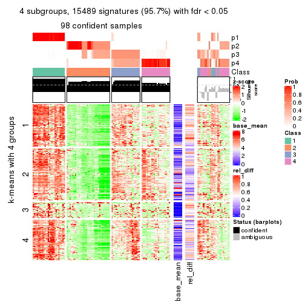</p>

</div>
<div id='tab-ATC-kmeans-get-signatures-4'>
<pre><code class="r">get_signatures(res, k = 5)
</code></pre>

<p></p>

</div>
<div id='tab-ATC-kmeans-get-signatures-5'>
<pre><code class="r">get_signatures(res, k = 6)
</code></pre>

<p></p>

</div>
</div>


Signature heatmaps where rows are not scaled:


<script>
$( function() {
	$( '#tabs-ATC-kmeans-get-signatures-no-scale' ).tabs();
} );
</script>
<div id='tabs-ATC-kmeans-get-signatures-no-scale'>
<ul>
<li><a href='#tab-ATC-kmeans-get-signatures-no-scale-1'>k = 2</a></li>
<li><a href='#tab-ATC-kmeans-get-signatures-no-scale-2'>k = 3</a></li>
<li><a href='#tab-ATC-kmeans-get-signatures-no-scale-3'>k = 4</a></li>
<li><a href='#tab-ATC-kmeans-get-signatures-no-scale-4'>k = 5</a></li>
<li><a href='#tab-ATC-kmeans-get-signatures-no-scale-5'>k = 6</a></li>
</ul>
<div id='tab-ATC-kmeans-get-signatures-no-scale-1'>
<pre><code class="r">get_signatures(res, k = 2, scale_rows = FALSE)
</code></pre>

<p></p>

</div>
<div id='tab-ATC-kmeans-get-signatures-no-scale-2'>
<pre><code class="r">get_signatures(res, k = 3, scale_rows = FALSE)
</code></pre>

<p></p>

</div>
<div id='tab-ATC-kmeans-get-signatures-no-scale-3'>
<pre><code class="r">get_signatures(res, k = 4, scale_rows = FALSE)
</code></pre>

<p></p>

</div>
<div id='tab-ATC-kmeans-get-signatures-no-scale-4'>
<pre><code class="r">get_signatures(res, k = 5, scale_rows = FALSE)
</code></pre>

<p></p>

</div>
<div id='tab-ATC-kmeans-get-signatures-no-scale-5'>
<pre><code class="r">get_signatures(res, k = 6, scale_rows = FALSE)
</code></pre>

<p></p>

</div>
</div>


Compare the overlap of signatures from different k:

```r
compare_signatures(res)
```


`get_signature()` returns a data frame invisibly. TO get the list of signatures, the function
call should be assigned to a variable explicitly. In following code, if `plot` argument is set
to `FALSE`, no heatmap is plotted while only the differential analysis is performed.

```r
# code only for demonstration
tb = get_signature(res, k = ..., plot = FALSE)
```

An example of the output of `tb` is:

```
#>   which_row         fdr    mean_1    mean_2 scaled_mean_1 scaled_mean_2 km
#> 1        38 0.042760348  8.373488  9.131774    -0.5533452     0.5164555  1
#> 2        40 0.018707592  7.106213  8.469186    -0.6173731     0.5762149  1
#> 3        55 0.019134737 10.221463 11.207825    -0.6159697     0.5749050  1
#> 4        59 0.006059896  5.921854  7.869574    -0.6899429     0.6439467  1
#> 5        60 0.018055526  8.928898 10.211722    -0.6204761     0.5791110  1
#> 6        98 0.009384629 15.714769 14.887706     0.6635654    -0.6193277  2
...
```

The columns in `tb` are:

1. `which_row`: row indices corresponding to the input matrix.
2. `fdr`: FDR for the differential test. 
3. `mean_x`: The mean value in group x.
4. `scaled_mean_x`: The mean value in group x after rows are scaled.
5. `km`: Row groups if k-means clustering is applied to rows.


UMAP plot which shows how samples are separated.


<script>
$( function() {
	$( '#tabs-ATC-kmeans-dimension-reduction' ).tabs();
} );
</script>
<div id='tabs-ATC-kmeans-dimension-reduction'>
<ul>
<li><a href='#tab-ATC-kmeans-dimension-reduction-1'>k = 2</a></li>
<li><a href='#tab-ATC-kmeans-dimension-reduction-2'>k = 3</a></li>
<li><a href='#tab-ATC-kmeans-dimension-reduction-3'>k = 4</a></li>
<li><a href='#tab-ATC-kmeans-dimension-reduction-4'>k = 5</a></li>
<li><a href='#tab-ATC-kmeans-dimension-reduction-5'>k = 6</a></li>
</ul>
<div id='tab-ATC-kmeans-dimension-reduction-1'>
<pre><code class="r">dimension_reduction(res, k = 2, method = &quot;UMAP&quot;)
</code></pre>

<p></p>

</div>
<div id='tab-ATC-kmeans-dimension-reduction-2'>
<pre><code class="r">dimension_reduction(res, k = 3, method = &quot;UMAP&quot;)
</code></pre>

<p></p>

</div>
<div id='tab-ATC-kmeans-dimension-reduction-3'>
<pre><code class="r">dimension_reduction(res, k = 4, method = &quot;UMAP&quot;)
</code></pre>

<p></p>

</div>
<div id='tab-ATC-kmeans-dimension-reduction-4'>
<pre><code class="r">dimension_reduction(res, k = 5, method = &quot;UMAP&quot;)
</code></pre>

<p></p>

</div>
<div id='tab-ATC-kmeans-dimension-reduction-5'>
<pre><code class="r">dimension_reduction(res, k = 6, method = &quot;UMAP&quot;)
</code></pre>

<p></p>

</div>
</div>


Following heatmap shows how subgroups are split when increasing `k`:

```r
collect_classes(res)
```

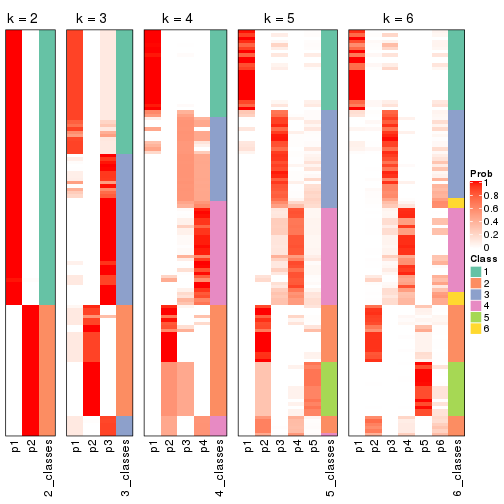


If matrix rows can be associated to genes, consider to use `functional_enrichment(res,
...)` to perform function enrichment for the signature genes. See [this vignette](http://bioconductor.org/packages/devel/bioc/vignettes/cola/inst/doc/functional_enrichment.html) for more detailed explanations.


 

---------------------------------------------------


### ATC:skmeans*


The object with results only for a single top-value method and a single partition method 
can be extracted as:

```r
res = res_list["ATC", "skmeans"]
# you can also extract it by
# res = res_list["ATC:skmeans"]
```

A summary of `res` and all the functions that can be applied to it:

```r
res
```

```
#> A 'ConsensusPartition' object with k = 2, 3, 4, 5, 6.
#>   On a matrix with 16187 rows and 121 columns.
#>   Top rows (1000, 2000, 3000, 4000, 5000) are extracted by 'ATC' method.
#>   Subgroups are detected by 'skmeans' method.
#>   Performed in total 1250 partitions by row resampling.
#>   Best k for subgroups seems to be 6.
#> 
#> Following methods can be applied to this 'ConsensusPartition' object:
#>  [1] "cola_report"             "collect_classes"         "collect_plots"          
#>  [4] "collect_stats"           "colnames"                "compare_signatures"     
#>  [7] "consensus_heatmap"       "dimension_reduction"     "functional_enrichment"  
#> [10] "get_anno_col"            "get_anno"                "get_classes"            
#> [13] "get_consensus"           "get_matrix"              "get_membership"         
#> [16] "get_param"               "get_signatures"          "get_stats"              
#> [19] "is_best_k"               "is_stable_k"             "membership_heatmap"     
#> [22] "ncol"                    "nrow"                    "plot_ecdf"              
#> [25] "rownames"                "select_partition_number" "show"                   
#> [28] "suggest_best_k"          "test_to_known_factors"
```

`collect_plots()` function collects all the plots made from `res` for all `k` (number of partitions)
into one single page to provide an easy and fast comparison between different `k`.

```r
collect_plots(res)
```


The plots are:

- The first row: a plot of the ECDF (empirical cumulative distribution
  function) curves of the consensus matrix for each `k` and the heatmap of
  predicted classes for each `k`.
- The second row: heatmaps of the consensus matrix for each `k`.
- The third row: heatmaps of the membership matrix for each `k`.
- The fouth row: heatmaps of the signatures for each `k`.

All the plots in panels can be made by individual functions and they are
plotted later in this section.

`select_partition_number()` produces several plots showing different
statistics for choosing "optimized" `k`. There are following statistics:

- ECDF curves of the consensus matrix for each `k`;
- 1-PAC. [The PAC
  score](https://en.wikipedia.org/wiki/Consensus_clustering#Over-interpretation_potential_of_consensus_clustering)
  measures the proportion of the ambiguous subgrouping.
- Mean silhouette score.
- Concordance. The mean probability of fiting the consensus class ids in all
  partitions.
- Area increased. Denote $A_k$ as the area under the ECDF curve for current
  `k`, the area increased is defined as $A_k - A_{k-1}$.
- Rand index. The percent of pairs of samples that are both in a same cluster
  or both are not in a same cluster in the partition of k and k-1.
- Jaccard index. The ratio of pairs of samples are both in a same cluster in
  the partition of k and k-1 and the pairs of samples are both in a same
  cluster in the partition k or k-1.

The detailed explanations of these statistics can be found in [the _cola_
vignette](http://bioconductor.org/packages/devel/bioc/vignettes/cola/inst/doc/cola.html#toc_13).

Generally speaking, lower PAC score, higher mean silhouette score or higher
concordance corresponds to better partition. Rand index and Jaccard index
measure how similar the current partition is compared to partition with `k-1`.
If they are too similar, we won't accept `k` is better than `k-1`.

```r
select_partition_number(res)
```


The numeric values for all these statistics can be obtained by `get_stats()`.

```r
get_stats(res)
```

```
#>   k 1-PAC mean_silhouette concordance area_increased  Rand Jaccard
#> 2 2 1.000           0.994       0.997         0.4640 0.538   0.538
#> 3 3 1.000           0.984       0.994         0.2849 0.870   0.758
#> 4 4 0.850           0.784       0.889         0.1511 0.912   0.788
#> 5 5 0.928           0.939       0.970         0.0509 0.917   0.763
#> 6 6 0.933           0.847       0.937         0.0297 0.986   0.949
```

`suggest_best_k()` suggests the best $k$ based on these statistics. The rules are as follows:

- All $k$ with Jaccard index larger than 0.95 are removed because increasing
  $k$ does not provide enough extra information. If all $k$ are removed, it is
  marked as no subgroup is detected.
- For all $k$ with 1-PAC score larger than 0.9, the maximal $k$ is taken as
  the best $k$, and other $k$ are marked as optional $k$.
- If it does not fit the second rule. The $k$ with the maximal vote of the
  highest 1-PAC score, highest mean silhouette, and highest concordance is
  taken as the best $k$.

```r
suggest_best_k(res)
```

```
#> [1] 6
#> attr(,"optional")
#> [1] 2 3 5
```

There is also optional best $k$ = 2 3 5 that is worth to check.

Following shows the table of the partitions (You need to click the **show/hide
code output** link to see it). The membership matrix (columns with name `p*`)
is inferred by
[`clue::cl_consensus()`](https://www.rdocumentation.org/link/cl_consensus?package=clue)
function with the `SE` method. Basically the value in the membership matrix
represents the probability to belong to a certain group. The finall class
label for an item is determined with the group with highest probability it
belongs to.

In `get_classes()` function, the entropy is calculated from the membership
matrix and the silhouette score is calculated from the consensus matrix.


<script>
$( function() {
	$( '#tabs-ATC-skmeans-get-classes' ).tabs();
} );
</script>
<div id='tabs-ATC-skmeans-get-classes'>
<ul>
<li><a href='#tab-ATC-skmeans-get-classes-1'>k = 2</a></li>
<li><a href='#tab-ATC-skmeans-get-classes-2'>k = 3</a></li>
<li><a href='#tab-ATC-skmeans-get-classes-3'>k = 4</a></li>
<li><a href='#tab-ATC-skmeans-get-classes-4'>k = 5</a></li>
<li><a href='#tab-ATC-skmeans-get-classes-5'>k = 6</a></li>
</ul>

<div id='tab-ATC-skmeans-get-classes-1'>
<p><a id='tab-ATC-skmeans-get-classes-1-a' style='color:#0366d6' href='#'>show/hide code output</a></p>
<pre><code class="r">cbind(get_classes(res, k = 2), get_membership(res, k = 2))
</code></pre>

<pre><code>#&gt;           class entropy silhouette    p1    p2
#&gt; DRR006374     2   0.000      1.000 0.000 1.000
#&gt; DRR006375     1   0.000      0.996 1.000 0.000
#&gt; DRR006376     1   0.000      0.996 1.000 0.000
#&gt; DRR006377     1   0.000      0.996 1.000 0.000
#&gt; DRR006378     2   0.000      1.000 0.000 1.000
#&gt; DRR006379     1   0.000      0.996 1.000 0.000
#&gt; DRR006380     2   0.000      1.000 0.000 1.000
#&gt; DRR006381     1   0.000      0.996 1.000 0.000
#&gt; DRR006382     2   0.000      1.000 0.000 1.000
#&gt; DRR006383     1   0.000      0.996 1.000 0.000
#&gt; DRR006384     2   0.000      1.000 0.000 1.000
#&gt; DRR006385     1   0.000      0.996 1.000 0.000
#&gt; DRR006386     2   0.000      1.000 0.000 1.000
#&gt; DRR006387     1   0.000      0.996 1.000 0.000
#&gt; DRR006388     1   0.000      0.996 1.000 0.000
#&gt; DRR006389     1   0.000      0.996 1.000 0.000
#&gt; DRR006390     2   0.000      1.000 0.000 1.000
#&gt; DRR006391     2   0.000      1.000 0.000 1.000
#&gt; DRR006392     1   0.000      0.996 1.000 0.000
#&gt; DRR006393     1   0.000      0.996 1.000 0.000
#&gt; DRR006394     2   0.000      1.000 0.000 1.000
#&gt; DRR006395     1   0.000      0.996 1.000 0.000
#&gt; DRR006396     1   0.000      0.996 1.000 0.000
#&gt; DRR006397     1   0.000      0.996 1.000 0.000
#&gt; DRR006398     1   0.000      0.996 1.000 0.000
#&gt; DRR006399     1   0.000      0.996 1.000 0.000
#&gt; DRR006400     1   0.000      0.996 1.000 0.000
#&gt; DRR006401     2   0.000      1.000 0.000 1.000
#&gt; DRR006402     2   0.000      1.000 0.000 1.000
#&gt; DRR006403     1   0.000      0.996 1.000 0.000
#&gt; DRR006404     1   0.000      0.996 1.000 0.000
#&gt; DRR006405     1   0.000      0.996 1.000 0.000
#&gt; DRR006406     1   0.000      0.996 1.000 0.000
#&gt; DRR006407     2   0.000      1.000 0.000 1.000
#&gt; DRR006408     2   0.000      1.000 0.000 1.000
#&gt; DRR006409     1   0.000      0.996 1.000 0.000
#&gt; DRR006410     1   0.000      0.996 1.000 0.000
#&gt; DRR006411     2   0.000      1.000 0.000 1.000
#&gt; DRR006412     2   0.000      1.000 0.000 1.000
#&gt; DRR006413     1   0.000      0.996 1.000 0.000
#&gt; DRR006414     1   0.000      0.996 1.000 0.000
#&gt; DRR006415     1   0.000      0.996 1.000 0.000
#&gt; DRR006416     1   0.000      0.996 1.000 0.000
#&gt; DRR006417     1   0.000      0.996 1.000 0.000
#&gt; DRR006418     1   0.000      0.996 1.000 0.000
#&gt; DRR006419     1   0.000      0.996 1.000 0.000
#&gt; DRR006420     1   0.000      0.996 1.000 0.000
#&gt; DRR006421     1   0.000      0.996 1.000 0.000
#&gt; DRR006422     2   0.000      1.000 0.000 1.000
#&gt; DRR006423     2   0.000      1.000 0.000 1.000
#&gt; DRR006424     1   0.000      0.996 1.000 0.000
#&gt; DRR006425     2   0.000      1.000 0.000 1.000
#&gt; DRR006426     1   0.000      0.996 1.000 0.000
#&gt; DRR006427     2   0.000      1.000 0.000 1.000
#&gt; DRR006428     1   0.000      0.996 1.000 0.000
#&gt; DRR006429     2   0.000      1.000 0.000 1.000
#&gt; DRR006430     1   0.000      0.996 1.000 0.000
#&gt; DRR006431     1   0.000      0.996 1.000 0.000
#&gt; DRR006432     1   0.745      0.732 0.788 0.212
#&gt; DRR006433     1   0.000      0.996 1.000 0.000
#&gt; DRR006434     2   0.000      1.000 0.000 1.000
#&gt; DRR006435     2   0.000      1.000 0.000 1.000
#&gt; DRR006436     2   0.000      1.000 0.000 1.000
#&gt; DRR006437     1   0.000      0.996 1.000 0.000
#&gt; DRR006438     1   0.000      0.996 1.000 0.000
#&gt; DRR006439     1   0.000      0.996 1.000 0.000
#&gt; DRR006440     2   0.000      1.000 0.000 1.000
#&gt; DRR006441     2   0.000      1.000 0.000 1.000
#&gt; DRR006442     1   0.000      0.996 1.000 0.000
#&gt; DRR006443     2   0.000      1.000 0.000 1.000
#&gt; DRR006444     2   0.000      1.000 0.000 1.000
#&gt; DRR006445     1   0.000      0.996 1.000 0.000
#&gt; DRR006446     2   0.000      1.000 0.000 1.000
#&gt; DRR006447     1   0.000      0.996 1.000 0.000
#&gt; DRR006448     1   0.000      0.996 1.000 0.000
#&gt; DRR006449     1   0.000      0.996 1.000 0.000
#&gt; DRR006450     1   0.000      0.996 1.000 0.000
#&gt; DRR006451     1   0.295      0.944 0.948 0.052
#&gt; DRR006452     1   0.000      0.996 1.000 0.000
#&gt; DRR006453     1   0.000      0.996 1.000 0.000
#&gt; DRR006454     2   0.000      1.000 0.000 1.000
#&gt; DRR006455     2   0.000      1.000 0.000 1.000
#&gt; DRR006456     1   0.000      0.996 1.000 0.000
#&gt; DRR006457     1   0.000      0.996 1.000 0.000
#&gt; DRR006458     1   0.000      0.996 1.000 0.000
#&gt; DRR006459     1   0.000      0.996 1.000 0.000
#&gt; DRR006460     2   0.000      1.000 0.000 1.000
#&gt; DRR006461     2   0.000      1.000 0.000 1.000
#&gt; DRR006462     1   0.000      0.996 1.000 0.000
#&gt; DRR006463     2   0.000      1.000 0.000 1.000
#&gt; DRR006464     2   0.000      1.000 0.000 1.000
#&gt; DRR006465     1   0.000      0.996 1.000 0.000
#&gt; DRR006466     2   0.000      1.000 0.000 1.000
#&gt; DRR006467     1   0.000      0.996 1.000 0.000
#&gt; DRR006468     2   0.000      1.000 0.000 1.000
#&gt; DRR006469     2   0.000      1.000 0.000 1.000
#&gt; DRR006470     1   0.000      0.996 1.000 0.000
#&gt; DRR006471     1   0.000      0.996 1.000 0.000
#&gt; DRR006472     2   0.000      1.000 0.000 1.000
#&gt; DRR006473     2   0.000      1.000 0.000 1.000
#&gt; DRR006474     2   0.000      1.000 0.000 1.000
#&gt; DRR006475     1   0.000      0.996 1.000 0.000
#&gt; DRR006476     2   0.000      1.000 0.000 1.000
#&gt; DRR006477     1   0.260      0.953 0.956 0.044
#&gt; DRR006478     1   0.000      0.996 1.000 0.000
#&gt; DRR006479     1   0.000      0.996 1.000 0.000
#&gt; DRR006480     1   0.000      0.996 1.000 0.000
#&gt; DRR006481     1   0.000      0.996 1.000 0.000
#&gt; DRR006482     1   0.000      0.996 1.000 0.000
#&gt; DRR006483     1   0.000      0.996 1.000 0.000
#&gt; DRR006484     1   0.000      0.996 1.000 0.000
#&gt; DRR006485     2   0.000      1.000 0.000 1.000
#&gt; DRR006486     1   0.000      0.996 1.000 0.000
#&gt; DRR006487     1   0.000      0.996 1.000 0.000
#&gt; DRR006488     2   0.000      1.000 0.000 1.000
#&gt; DRR006489     1   0.000      0.996 1.000 0.000
#&gt; DRR006490     1   0.000      0.996 1.000 0.000
#&gt; DRR006491     1   0.000      0.996 1.000 0.000
#&gt; DRR006492     1   0.000      0.996 1.000 0.000
#&gt; DRR006493     1   0.000      0.996 1.000 0.000
#&gt; DRR006494     1   0.000      0.996 1.000 0.000
</code></pre>

<script>
$('#tab-ATC-skmeans-get-classes-1-a').parent().next().next().hide();
$('#tab-ATC-skmeans-get-classes-1-a').click(function(){
  $('#tab-ATC-skmeans-get-classes-1-a').parent().next().next().toggle();
  return(false);
});
</script>
</div>

<div id='tab-ATC-skmeans-get-classes-2'>
<p><a id='tab-ATC-skmeans-get-classes-2-a' style='color:#0366d6' href='#'>show/hide code output</a></p>
<pre><code class="r">cbind(get_classes(res, k = 3), get_membership(res, k = 3))
</code></pre>

<pre><code>#&gt;           class entropy silhouette    p1    p2    p3
#&gt; DRR006374     2  0.0000     1.0000 0.000 1.000 0.000
#&gt; DRR006375     1  0.0000     0.9884 1.000 0.000 0.000
#&gt; DRR006376     3  0.0000     0.9977 0.000 0.000 1.000
#&gt; DRR006377     3  0.0000     0.9977 0.000 0.000 1.000
#&gt; DRR006378     2  0.0000     1.0000 0.000 1.000 0.000
#&gt; DRR006379     3  0.0000     0.9977 0.000 0.000 1.000
#&gt; DRR006380     2  0.0000     1.0000 0.000 1.000 0.000
#&gt; DRR006381     1  0.0000     0.9884 1.000 0.000 0.000
#&gt; DRR006382     2  0.0000     1.0000 0.000 1.000 0.000
#&gt; DRR006383     1  0.0000     0.9884 1.000 0.000 0.000
#&gt; DRR006384     2  0.0000     1.0000 0.000 1.000 0.000
#&gt; DRR006385     1  0.0000     0.9884 1.000 0.000 0.000
#&gt; DRR006386     2  0.0000     1.0000 0.000 1.000 0.000
#&gt; DRR006387     1  0.0000     0.9884 1.000 0.000 0.000
#&gt; DRR006388     1  0.0000     0.9884 1.000 0.000 0.000
#&gt; DRR006389     1  0.0000     0.9884 1.000 0.000 0.000
#&gt; DRR006390     2  0.0000     1.0000 0.000 1.000 0.000
#&gt; DRR006391     2  0.0000     1.0000 0.000 1.000 0.000
#&gt; DRR006392     1  0.0000     0.9884 1.000 0.000 0.000
#&gt; DRR006393     1  0.0000     0.9884 1.000 0.000 0.000
#&gt; DRR006394     2  0.0000     1.0000 0.000 1.000 0.000
#&gt; DRR006395     3  0.0592     0.9868 0.012 0.000 0.988
#&gt; DRR006396     1  0.0000     0.9884 1.000 0.000 0.000
#&gt; DRR006397     1  0.0000     0.9884 1.000 0.000 0.000
#&gt; DRR006398     1  0.0000     0.9884 1.000 0.000 0.000
#&gt; DRR006399     3  0.0000     0.9977 0.000 0.000 1.000
#&gt; DRR006400     3  0.0000     0.9977 0.000 0.000 1.000
#&gt; DRR006401     2  0.0000     1.0000 0.000 1.000 0.000
#&gt; DRR006402     2  0.0000     1.0000 0.000 1.000 0.000
#&gt; DRR006403     3  0.0000     0.9977 0.000 0.000 1.000
#&gt; DRR006404     3  0.0000     0.9977 0.000 0.000 1.000
#&gt; DRR006405     3  0.0000     0.9977 0.000 0.000 1.000
#&gt; DRR006406     3  0.0000     0.9977 0.000 0.000 1.000
#&gt; DRR006407     2  0.0000     1.0000 0.000 1.000 0.000
#&gt; DRR006408     2  0.0000     1.0000 0.000 1.000 0.000
#&gt; DRR006409     1  0.0000     0.9884 1.000 0.000 0.000
#&gt; DRR006410     1  0.0000     0.9884 1.000 0.000 0.000
#&gt; DRR006411     2  0.0000     1.0000 0.000 1.000 0.000
#&gt; DRR006412     2  0.0000     1.0000 0.000 1.000 0.000
#&gt; DRR006413     1  0.0000     0.9884 1.000 0.000 0.000
#&gt; DRR006414     1  0.0000     0.9884 1.000 0.000 0.000
#&gt; DRR006415     1  0.0000     0.9884 1.000 0.000 0.000
#&gt; DRR006416     1  0.0000     0.9884 1.000 0.000 0.000
#&gt; DRR006417     1  0.0000     0.9884 1.000 0.000 0.000
#&gt; DRR006418     1  0.0000     0.9884 1.000 0.000 0.000
#&gt; DRR006419     1  0.0000     0.9884 1.000 0.000 0.000
#&gt; DRR006420     1  0.0000     0.9884 1.000 0.000 0.000
#&gt; DRR006421     3  0.0747     0.9824 0.016 0.000 0.984
#&gt; DRR006422     2  0.0000     1.0000 0.000 1.000 0.000
#&gt; DRR006423     2  0.0000     1.0000 0.000 1.000 0.000
#&gt; DRR006424     1  0.0000     0.9884 1.000 0.000 0.000
#&gt; DRR006425     2  0.0000     1.0000 0.000 1.000 0.000
#&gt; DRR006426     1  0.0000     0.9884 1.000 0.000 0.000
#&gt; DRR006427     2  0.0000     1.0000 0.000 1.000 0.000
#&gt; DRR006428     1  0.0000     0.9884 1.000 0.000 0.000
#&gt; DRR006429     2  0.0000     1.0000 0.000 1.000 0.000
#&gt; DRR006430     1  0.0000     0.9884 1.000 0.000 0.000
#&gt; DRR006431     1  0.0000     0.9884 1.000 0.000 0.000
#&gt; DRR006432     1  0.4121     0.7728 0.832 0.168 0.000
#&gt; DRR006433     3  0.0000     0.9977 0.000 0.000 1.000
#&gt; DRR006434     2  0.0000     1.0000 0.000 1.000 0.000
#&gt; DRR006435     2  0.0000     1.0000 0.000 1.000 0.000
#&gt; DRR006436     2  0.0000     1.0000 0.000 1.000 0.000
#&gt; DRR006437     1  0.0000     0.9884 1.000 0.000 0.000
#&gt; DRR006438     1  0.0000     0.9884 1.000 0.000 0.000
#&gt; DRR006439     1  0.0000     0.9884 1.000 0.000 0.000
#&gt; DRR006440     2  0.0000     1.0000 0.000 1.000 0.000
#&gt; DRR006441     2  0.0000     1.0000 0.000 1.000 0.000
#&gt; DRR006442     1  0.0000     0.9884 1.000 0.000 0.000
#&gt; DRR006443     2  0.0000     1.0000 0.000 1.000 0.000
#&gt; DRR006444     2  0.0000     1.0000 0.000 1.000 0.000
#&gt; DRR006445     1  0.0000     0.9884 1.000 0.000 0.000
#&gt; DRR006446     2  0.0000     1.0000 0.000 1.000 0.000
#&gt; DRR006447     1  0.0000     0.9884 1.000 0.000 0.000
#&gt; DRR006448     3  0.0000     0.9977 0.000 0.000 1.000
#&gt; DRR006449     1  0.0000     0.9884 1.000 0.000 0.000
#&gt; DRR006450     1  0.0000     0.9884 1.000 0.000 0.000
#&gt; DRR006451     3  0.0000     0.9977 0.000 0.000 1.000
#&gt; DRR006452     1  0.0000     0.9884 1.000 0.000 0.000
#&gt; DRR006453     1  0.0000     0.9884 1.000 0.000 0.000
#&gt; DRR006454     2  0.0000     1.0000 0.000 1.000 0.000
#&gt; DRR006455     2  0.0000     1.0000 0.000 1.000 0.000
#&gt; DRR006456     1  0.0000     0.9884 1.000 0.000 0.000
#&gt; DRR006457     1  0.1031     0.9652 0.976 0.000 0.024
#&gt; DRR006458     1  0.0000     0.9884 1.000 0.000 0.000
#&gt; DRR006459     1  0.0000     0.9884 1.000 0.000 0.000
#&gt; DRR006460     2  0.0000     1.0000 0.000 1.000 0.000
#&gt; DRR006461     2  0.0000     1.0000 0.000 1.000 0.000
#&gt; DRR006462     1  0.0000     0.9884 1.000 0.000 0.000
#&gt; DRR006463     2  0.0000     1.0000 0.000 1.000 0.000
#&gt; DRR006464     2  0.0000     1.0000 0.000 1.000 0.000
#&gt; DRR006465     1  0.0000     0.9884 1.000 0.000 0.000
#&gt; DRR006466     2  0.0000     1.0000 0.000 1.000 0.000
#&gt; DRR006467     1  0.0000     0.9884 1.000 0.000 0.000
#&gt; DRR006468     2  0.0000     1.0000 0.000 1.000 0.000
#&gt; DRR006469     2  0.0000     1.0000 0.000 1.000 0.000
#&gt; DRR006470     1  0.0000     0.9884 1.000 0.000 0.000
#&gt; DRR006471     1  0.0000     0.9884 1.000 0.000 0.000
#&gt; DRR006472     2  0.0000     1.0000 0.000 1.000 0.000
#&gt; DRR006473     2  0.0000     1.0000 0.000 1.000 0.000
#&gt; DRR006474     2  0.0000     1.0000 0.000 1.000 0.000
#&gt; DRR006475     1  0.0000     0.9884 1.000 0.000 0.000
#&gt; DRR006476     2  0.0000     1.0000 0.000 1.000 0.000
#&gt; DRR006477     3  0.0000     0.9977 0.000 0.000 1.000
#&gt; DRR006478     1  0.0000     0.9884 1.000 0.000 0.000
#&gt; DRR006479     1  0.0000     0.9884 1.000 0.000 0.000
#&gt; DRR006480     1  0.0000     0.9884 1.000 0.000 0.000
#&gt; DRR006481     1  0.6308     0.0361 0.508 0.000 0.492
#&gt; DRR006482     1  0.0000     0.9884 1.000 0.000 0.000
#&gt; DRR006483     1  0.0000     0.9884 1.000 0.000 0.000
#&gt; DRR006484     1  0.0000     0.9884 1.000 0.000 0.000
#&gt; DRR006485     2  0.0000     1.0000 0.000 1.000 0.000
#&gt; DRR006486     1  0.0000     0.9884 1.000 0.000 0.000
#&gt; DRR006487     1  0.0000     0.9884 1.000 0.000 0.000
#&gt; DRR006488     2  0.0000     1.0000 0.000 1.000 0.000
#&gt; DRR006489     1  0.0000     0.9884 1.000 0.000 0.000
#&gt; DRR006490     1  0.0000     0.9884 1.000 0.000 0.000
#&gt; DRR006491     1  0.0000     0.9884 1.000 0.000 0.000
#&gt; DRR006492     1  0.0000     0.9884 1.000 0.000 0.000
#&gt; DRR006493     1  0.0000     0.9884 1.000 0.000 0.000
#&gt; DRR006494     1  0.0000     0.9884 1.000 0.000 0.000
</code></pre>

<script>
$('#tab-ATC-skmeans-get-classes-2-a').parent().next().next().hide();
$('#tab-ATC-skmeans-get-classes-2-a').click(function(){
  $('#tab-ATC-skmeans-get-classes-2-a').parent().next().next().toggle();
  return(false);
});
</script>
</div>

<div id='tab-ATC-skmeans-get-classes-3'>
<p><a id='tab-ATC-skmeans-get-classes-3-a' style='color:#0366d6' href='#'>show/hide code output</a></p>
<pre><code class="r">cbind(get_classes(res, k = 4), get_membership(res, k = 4))
</code></pre>

<pre><code>#&gt;           class entropy silhouette    p1    p2    p3    p4
#&gt; DRR006374     2  0.0000      1.000 0.000 1.000 0.000 0.000
#&gt; DRR006375     1  0.4500      0.737 0.684 0.000 0.316 0.000
#&gt; DRR006376     4  0.0000      0.988 0.000 0.000 0.000 1.000
#&gt; DRR006377     4  0.0000      0.988 0.000 0.000 0.000 1.000
#&gt; DRR006378     2  0.0000      1.000 0.000 1.000 0.000 0.000
#&gt; DRR006379     4  0.0000      0.988 0.000 0.000 0.000 1.000
#&gt; DRR006380     2  0.0000      1.000 0.000 1.000 0.000 0.000
#&gt; DRR006381     1  0.4605      0.722 0.664 0.000 0.336 0.000
#&gt; DRR006382     2  0.0000      1.000 0.000 1.000 0.000 0.000
#&gt; DRR006383     1  0.0592      0.562 0.984 0.000 0.016 0.000
#&gt; DRR006384     2  0.0000      1.000 0.000 1.000 0.000 0.000
#&gt; DRR006385     3  0.3688      0.590 0.208 0.000 0.792 0.000
#&gt; DRR006386     2  0.0000      1.000 0.000 1.000 0.000 0.000
#&gt; DRR006387     1  0.4605      0.722 0.664 0.000 0.336 0.000
#&gt; DRR006388     3  0.0592      0.744 0.016 0.000 0.984 0.000
#&gt; DRR006389     3  0.0592      0.744 0.016 0.000 0.984 0.000
#&gt; DRR006390     2  0.0000      1.000 0.000 1.000 0.000 0.000
#&gt; DRR006391     2  0.0000      1.000 0.000 1.000 0.000 0.000
#&gt; DRR006392     1  0.4500      0.737 0.684 0.000 0.316 0.000
#&gt; DRR006393     1  0.4500      0.737 0.684 0.000 0.316 0.000
#&gt; DRR006394     2  0.0000      1.000 0.000 1.000 0.000 0.000
#&gt; DRR006395     4  0.2345      0.825 0.100 0.000 0.000 0.900
#&gt; DRR006396     1  0.4605      0.722 0.664 0.000 0.336 0.000
#&gt; DRR006397     3  0.0592      0.744 0.016 0.000 0.984 0.000
#&gt; DRR006398     3  0.0592      0.744 0.016 0.000 0.984 0.000
#&gt; DRR006399     4  0.0000      0.988 0.000 0.000 0.000 1.000
#&gt; DRR006400     4  0.0000      0.988 0.000 0.000 0.000 1.000
#&gt; DRR006401     2  0.0000      1.000 0.000 1.000 0.000 0.000
#&gt; DRR006402     2  0.0000      1.000 0.000 1.000 0.000 0.000
#&gt; DRR006403     4  0.0000      0.988 0.000 0.000 0.000 1.000
#&gt; DRR006404     4  0.0000      0.988 0.000 0.000 0.000 1.000
#&gt; DRR006405     4  0.0000      0.988 0.000 0.000 0.000 1.000
#&gt; DRR006406     4  0.0000      0.988 0.000 0.000 0.000 1.000
#&gt; DRR006407     2  0.0000      1.000 0.000 1.000 0.000 0.000
#&gt; DRR006408     2  0.0000      1.000 0.000 1.000 0.000 0.000
#&gt; DRR006409     1  0.4500      0.737 0.684 0.000 0.316 0.000
#&gt; DRR006410     1  0.4564      0.729 0.672 0.000 0.328 0.000
#&gt; DRR006411     2  0.0000      1.000 0.000 1.000 0.000 0.000
#&gt; DRR006412     2  0.0000      1.000 0.000 1.000 0.000 0.000
#&gt; DRR006413     1  0.4605      0.722 0.664 0.000 0.336 0.000
#&gt; DRR006414     1  0.0000      0.576 1.000 0.000 0.000 0.000
#&gt; DRR006415     1  0.4948     -0.358 0.560 0.000 0.440 0.000
#&gt; DRR006416     1  0.4605      0.722 0.664 0.000 0.336 0.000
#&gt; DRR006417     3  0.4643      0.428 0.344 0.000 0.656 0.000
#&gt; DRR006418     3  0.3975      0.540 0.240 0.000 0.760 0.000
#&gt; DRR006419     1  0.4961     -0.387 0.552 0.000 0.448 0.000
#&gt; DRR006420     1  0.4500      0.737 0.684 0.000 0.316 0.000
#&gt; DRR006421     1  0.3743      0.341 0.824 0.000 0.016 0.160
#&gt; DRR006422     2  0.0000      1.000 0.000 1.000 0.000 0.000
#&gt; DRR006423     2  0.0000      1.000 0.000 1.000 0.000 0.000
#&gt; DRR006424     1  0.4500      0.737 0.684 0.000 0.316 0.000
#&gt; DRR006425     2  0.0000      1.000 0.000 1.000 0.000 0.000
#&gt; DRR006426     1  0.4916     -0.331 0.576 0.000 0.424 0.000
#&gt; DRR006427     2  0.0000      1.000 0.000 1.000 0.000 0.000
#&gt; DRR006428     1  0.0000      0.576 1.000 0.000 0.000 0.000
#&gt; DRR006429     2  0.0000      1.000 0.000 1.000 0.000 0.000
#&gt; DRR006430     1  0.4500      0.737 0.684 0.000 0.316 0.000
#&gt; DRR006431     1  0.4500      0.737 0.684 0.000 0.316 0.000
#&gt; DRR006432     3  0.4917      0.422 0.336 0.008 0.656 0.000
#&gt; DRR006433     4  0.0000      0.988 0.000 0.000 0.000 1.000
#&gt; DRR006434     2  0.0000      1.000 0.000 1.000 0.000 0.000
#&gt; DRR006435     2  0.0000      1.000 0.000 1.000 0.000 0.000
#&gt; DRR006436     2  0.0000      1.000 0.000 1.000 0.000 0.000
#&gt; DRR006437     3  0.4040      0.514 0.248 0.000 0.752 0.000
#&gt; DRR006438     1  0.0000      0.576 1.000 0.000 0.000 0.000
#&gt; DRR006439     1  0.0000      0.576 1.000 0.000 0.000 0.000
#&gt; DRR006440     2  0.0000      1.000 0.000 1.000 0.000 0.000
#&gt; DRR006441     2  0.0000      1.000 0.000 1.000 0.000 0.000
#&gt; DRR006442     1  0.0000      0.576 1.000 0.000 0.000 0.000
#&gt; DRR006443     2  0.0000      1.000 0.000 1.000 0.000 0.000
#&gt; DRR006444     2  0.0000      1.000 0.000 1.000 0.000 0.000
#&gt; DRR006445     1  0.4624      0.718 0.660 0.000 0.340 0.000
#&gt; DRR006446     2  0.0000      1.000 0.000 1.000 0.000 0.000
#&gt; DRR006447     3  0.3942      0.545 0.236 0.000 0.764 0.000
#&gt; DRR006448     4  0.0000      0.988 0.000 0.000 0.000 1.000
#&gt; DRR006449     1  0.4605      0.722 0.664 0.000 0.336 0.000
#&gt; DRR006450     1  0.4713      0.693 0.640 0.000 0.360 0.000
#&gt; DRR006451     4  0.0000      0.988 0.000 0.000 0.000 1.000
#&gt; DRR006452     1  0.4605      0.722 0.664 0.000 0.336 0.000
#&gt; DRR006453     1  0.4564      0.729 0.672 0.000 0.328 0.000
#&gt; DRR006454     2  0.0000      1.000 0.000 1.000 0.000 0.000
#&gt; DRR006455     2  0.0000      1.000 0.000 1.000 0.000 0.000
#&gt; DRR006456     1  0.0592      0.562 0.984 0.000 0.016 0.000
#&gt; DRR006457     1  0.0592      0.562 0.984 0.000 0.016 0.000
#&gt; DRR006458     1  0.4500      0.737 0.684 0.000 0.316 0.000
#&gt; DRR006459     1  0.4500      0.737 0.684 0.000 0.316 0.000
#&gt; DRR006460     2  0.0000      1.000 0.000 1.000 0.000 0.000
#&gt; DRR006461     2  0.0000      1.000 0.000 1.000 0.000 0.000
#&gt; DRR006462     1  0.4605      0.722 0.664 0.000 0.336 0.000
#&gt; DRR006463     2  0.0000      1.000 0.000 1.000 0.000 0.000
#&gt; DRR006464     2  0.0000      1.000 0.000 1.000 0.000 0.000
#&gt; DRR006465     1  0.4500      0.737 0.684 0.000 0.316 0.000
#&gt; DRR006466     2  0.0000      1.000 0.000 1.000 0.000 0.000
#&gt; DRR006467     1  0.4500      0.737 0.684 0.000 0.316 0.000
#&gt; DRR006468     2  0.0000      1.000 0.000 1.000 0.000 0.000
#&gt; DRR006469     2  0.0000      1.000 0.000 1.000 0.000 0.000
#&gt; DRR006470     1  0.4967     -0.373 0.548 0.000 0.452 0.000
#&gt; DRR006471     1  0.4500      0.737 0.684 0.000 0.316 0.000
#&gt; DRR006472     2  0.0000      1.000 0.000 1.000 0.000 0.000
#&gt; DRR006473     2  0.0000      1.000 0.000 1.000 0.000 0.000
#&gt; DRR006474     2  0.0000      1.000 0.000 1.000 0.000 0.000
#&gt; DRR006475     1  0.4500      0.737 0.684 0.000 0.316 0.000
#&gt; DRR006476     2  0.0000      1.000 0.000 1.000 0.000 0.000
#&gt; DRR006477     4  0.0000      0.988 0.000 0.000 0.000 1.000
#&gt; DRR006478     1  0.4500      0.737 0.684 0.000 0.316 0.000
#&gt; DRR006479     1  0.0188      0.577 0.996 0.000 0.004 0.000
#&gt; DRR006480     1  0.4500      0.737 0.684 0.000 0.316 0.000
#&gt; DRR006481     1  0.2987      0.430 0.880 0.000 0.016 0.104
#&gt; DRR006482     3  0.0817      0.741 0.024 0.000 0.976 0.000
#&gt; DRR006483     1  0.4500      0.737 0.684 0.000 0.316 0.000
#&gt; DRR006484     1  0.0592      0.562 0.984 0.000 0.016 0.000
#&gt; DRR006485     2  0.0000      1.000 0.000 1.000 0.000 0.000
#&gt; DRR006486     1  0.4500      0.737 0.684 0.000 0.316 0.000
#&gt; DRR006487     1  0.0592      0.562 0.984 0.000 0.016 0.000
#&gt; DRR006488     2  0.0000      1.000 0.000 1.000 0.000 0.000
#&gt; DRR006489     1  0.4500      0.737 0.684 0.000 0.316 0.000
#&gt; DRR006490     1  0.0000      0.576 1.000 0.000 0.000 0.000
#&gt; DRR006491     1  0.0000      0.576 1.000 0.000 0.000 0.000
#&gt; DRR006492     1  0.4500      0.737 0.684 0.000 0.316 0.000
#&gt; DRR006493     1  0.0592      0.562 0.984 0.000 0.016 0.000
#&gt; DRR006494     1  0.4500      0.737 0.684 0.000 0.316 0.000
</code></pre>

<script>
$('#tab-ATC-skmeans-get-classes-3-a').parent().next().next().hide();
$('#tab-ATC-skmeans-get-classes-3-a').click(function(){
  $('#tab-ATC-skmeans-get-classes-3-a').parent().next().next().toggle();
  return(false);
});
</script>
</div>

<div id='tab-ATC-skmeans-get-classes-4'>
<p><a id='tab-ATC-skmeans-get-classes-4-a' style='color:#0366d6' href='#'>show/hide code output</a></p>
<pre><code class="r">cbind(get_classes(res, k = 5), get_membership(res, k = 5))
</code></pre>

<pre><code>#&gt;           class entropy silhouette    p1 p2    p3    p4    p5
#&gt; DRR006374     2  0.0000      1.000 0.000  1 0.000 0.000 0.000
#&gt; DRR006375     1  0.0000      0.944 1.000  0 0.000 0.000 0.000
#&gt; DRR006376     4  0.0000      0.971 0.000  0 0.000 1.000 0.000
#&gt; DRR006377     4  0.1544      0.920 0.000  0 0.068 0.932 0.000
#&gt; DRR006378     2  0.0000      1.000 0.000  1 0.000 0.000 0.000
#&gt; DRR006379     4  0.0000      0.971 0.000  0 0.000 1.000 0.000
#&gt; DRR006380     2  0.0000      1.000 0.000  1 0.000 0.000 0.000
#&gt; DRR006381     1  0.0162      0.942 0.996  0 0.004 0.000 0.000
#&gt; DRR006382     2  0.0000      1.000 0.000  1 0.000 0.000 0.000
#&gt; DRR006383     3  0.2583      0.838 0.132  0 0.864 0.000 0.004
#&gt; DRR006384     2  0.0000      1.000 0.000  1 0.000 0.000 0.000
#&gt; DRR006385     5  0.2389      0.827 0.116  0 0.004 0.000 0.880
#&gt; DRR006386     2  0.0000      1.000 0.000  1 0.000 0.000 0.000
#&gt; DRR006387     1  0.0000      0.944 1.000  0 0.000 0.000 0.000
#&gt; DRR006388     5  0.0162      0.928 0.004  0 0.000 0.000 0.996
#&gt; DRR006389     5  0.0162      0.928 0.004  0 0.000 0.000 0.996
#&gt; DRR006390     2  0.0000      1.000 0.000  1 0.000 0.000 0.000
#&gt; DRR006391     2  0.0000      1.000 0.000  1 0.000 0.000 0.000
#&gt; DRR006392     1  0.0000      0.944 1.000  0 0.000 0.000 0.000
#&gt; DRR006393     1  0.0000      0.944 1.000  0 0.000 0.000 0.000
#&gt; DRR006394     2  0.0000      1.000 0.000  1 0.000 0.000 0.000
#&gt; DRR006395     4  0.2605      0.729 0.148  0 0.000 0.852 0.000
#&gt; DRR006396     1  0.0000      0.944 1.000  0 0.000 0.000 0.000
#&gt; DRR006397     5  0.0162      0.928 0.004  0 0.000 0.000 0.996
#&gt; DRR006398     5  0.0162      0.928 0.004  0 0.000 0.000 0.996
#&gt; DRR006399     4  0.0000      0.971 0.000  0 0.000 1.000 0.000
#&gt; DRR006400     4  0.0000      0.971 0.000  0 0.000 1.000 0.000
#&gt; DRR006401     2  0.0000      1.000 0.000  1 0.000 0.000 0.000
#&gt; DRR006402     2  0.0000      1.000 0.000  1 0.000 0.000 0.000
#&gt; DRR006403     4  0.0000      0.971 0.000  0 0.000 1.000 0.000
#&gt; DRR006404     4  0.0000      0.971 0.000  0 0.000 1.000 0.000
#&gt; DRR006405     4  0.0000      0.971 0.000  0 0.000 1.000 0.000
#&gt; DRR006406     4  0.0000      0.971 0.000  0 0.000 1.000 0.000
#&gt; DRR006407     2  0.0000      1.000 0.000  1 0.000 0.000 0.000
#&gt; DRR006408     2  0.0000      1.000 0.000  1 0.000 0.000 0.000
#&gt; DRR006409     1  0.0000      0.944 1.000  0 0.000 0.000 0.000
#&gt; DRR006410     1  0.0000      0.944 1.000  0 0.000 0.000 0.000
#&gt; DRR006411     2  0.0000      1.000 0.000  1 0.000 0.000 0.000
#&gt; DRR006412     2  0.0000      1.000 0.000  1 0.000 0.000 0.000
#&gt; DRR006413     1  0.0162      0.942 0.996  0 0.004 0.000 0.000
#&gt; DRR006414     1  0.3398      0.755 0.780  0 0.216 0.000 0.004
#&gt; DRR006415     3  0.1956      0.896 0.076  0 0.916 0.000 0.008
#&gt; DRR006416     1  0.0162      0.942 0.996  0 0.004 0.000 0.000
#&gt; DRR006417     3  0.1270      0.874 0.000  0 0.948 0.000 0.052
#&gt; DRR006418     1  0.1282      0.912 0.952  0 0.004 0.000 0.044
#&gt; DRR006419     1  0.4990      0.480 0.628  0 0.324 0.000 0.048
#&gt; DRR006420     1  0.0162      0.942 0.996  0 0.004 0.000 0.000
#&gt; DRR006421     3  0.1195      0.898 0.028  0 0.960 0.012 0.000
#&gt; DRR006422     2  0.0000      1.000 0.000  1 0.000 0.000 0.000
#&gt; DRR006423     2  0.0000      1.000 0.000  1 0.000 0.000 0.000
#&gt; DRR006424     1  0.0000      0.944 1.000  0 0.000 0.000 0.000
#&gt; DRR006425     2  0.0000      1.000 0.000  1 0.000 0.000 0.000
#&gt; DRR006426     3  0.1557      0.879 0.008  0 0.940 0.000 0.052
#&gt; DRR006427     2  0.0000      1.000 0.000  1 0.000 0.000 0.000
#&gt; DRR006428     1  0.3143      0.770 0.796  0 0.204 0.000 0.000
#&gt; DRR006429     2  0.0000      1.000 0.000  1 0.000 0.000 0.000
#&gt; DRR006430     1  0.0000      0.944 1.000  0 0.000 0.000 0.000
#&gt; DRR006431     1  0.0000      0.944 1.000  0 0.000 0.000 0.000
#&gt; DRR006432     3  0.1544      0.866 0.000  0 0.932 0.000 0.068
#&gt; DRR006433     4  0.0609      0.959 0.000  0 0.020 0.980 0.000
#&gt; DRR006434     2  0.0000      1.000 0.000  1 0.000 0.000 0.000
#&gt; DRR006435     2  0.0000      1.000 0.000  1 0.000 0.000 0.000
#&gt; DRR006436     2  0.0000      1.000 0.000  1 0.000 0.000 0.000
#&gt; DRR006437     5  0.2674      0.798 0.140  0 0.004 0.000 0.856
#&gt; DRR006438     1  0.3143      0.770 0.796  0 0.204 0.000 0.000
#&gt; DRR006439     1  0.3210      0.762 0.788  0 0.212 0.000 0.000
#&gt; DRR006440     2  0.0000      1.000 0.000  1 0.000 0.000 0.000
#&gt; DRR006441     2  0.0000      1.000 0.000  1 0.000 0.000 0.000
#&gt; DRR006442     1  0.3143      0.770 0.796  0 0.204 0.000 0.000
#&gt; DRR006443     2  0.0000      1.000 0.000  1 0.000 0.000 0.000
#&gt; DRR006444     2  0.0000      1.000 0.000  1 0.000 0.000 0.000
#&gt; DRR006445     1  0.0162      0.942 0.996  0 0.004 0.000 0.000
#&gt; DRR006446     2  0.0000      1.000 0.000  1 0.000 0.000 0.000
#&gt; DRR006447     1  0.1357      0.909 0.948  0 0.004 0.000 0.048
#&gt; DRR006448     4  0.0000      0.971 0.000  0 0.000 1.000 0.000
#&gt; DRR006449     1  0.0000      0.944 1.000  0 0.000 0.000 0.000
#&gt; DRR006450     1  0.0162      0.942 0.996  0 0.004 0.000 0.000
#&gt; DRR006451     4  0.0000      0.971 0.000  0 0.000 1.000 0.000
#&gt; DRR006452     1  0.0000      0.944 1.000  0 0.000 0.000 0.000
#&gt; DRR006453     1  0.0000      0.944 1.000  0 0.000 0.000 0.000
#&gt; DRR006454     2  0.0000      1.000 0.000  1 0.000 0.000 0.000
#&gt; DRR006455     2  0.0000      1.000 0.000  1 0.000 0.000 0.000
#&gt; DRR006456     3  0.2179      0.887 0.100  0 0.896 0.000 0.004
#&gt; DRR006457     3  0.0404      0.893 0.012  0 0.988 0.000 0.000
#&gt; DRR006458     1  0.0000      0.944 1.000  0 0.000 0.000 0.000
#&gt; DRR006459     1  0.0000      0.944 1.000  0 0.000 0.000 0.000
#&gt; DRR006460     2  0.0000      1.000 0.000  1 0.000 0.000 0.000
#&gt; DRR006461     2  0.0000      1.000 0.000  1 0.000 0.000 0.000
#&gt; DRR006462     1  0.0000      0.944 1.000  0 0.000 0.000 0.000
#&gt; DRR006463     2  0.0000      1.000 0.000  1 0.000 0.000 0.000
#&gt; DRR006464     2  0.0000      1.000 0.000  1 0.000 0.000 0.000
#&gt; DRR006465     1  0.0000      0.944 1.000  0 0.000 0.000 0.000
#&gt; DRR006466     2  0.0000      1.000 0.000  1 0.000 0.000 0.000
#&gt; DRR006467     1  0.0000      0.944 1.000  0 0.000 0.000 0.000
#&gt; DRR006468     2  0.0000      1.000 0.000  1 0.000 0.000 0.000
#&gt; DRR006469     2  0.0000      1.000 0.000  1 0.000 0.000 0.000
#&gt; DRR006470     3  0.1670      0.880 0.012  0 0.936 0.000 0.052
#&gt; DRR006471     1  0.0000      0.944 1.000  0 0.000 0.000 0.000
#&gt; DRR006472     2  0.0000      1.000 0.000  1 0.000 0.000 0.000
#&gt; DRR006473     2  0.0000      1.000 0.000  1 0.000 0.000 0.000
#&gt; DRR006474     2  0.0000      1.000 0.000  1 0.000 0.000 0.000
#&gt; DRR006475     1  0.0000      0.944 1.000  0 0.000 0.000 0.000
#&gt; DRR006476     2  0.0000      1.000 0.000  1 0.000 0.000 0.000
#&gt; DRR006477     4  0.1041      0.944 0.000  0 0.032 0.964 0.004
#&gt; DRR006478     1  0.0000      0.944 1.000  0 0.000 0.000 0.000
#&gt; DRR006479     1  0.3143      0.770 0.796  0 0.204 0.000 0.000
#&gt; DRR006480     1  0.0000      0.944 1.000  0 0.000 0.000 0.000
#&gt; DRR006481     3  0.0162      0.887 0.004  0 0.996 0.000 0.000
#&gt; DRR006482     5  0.0451      0.923 0.004  0 0.008 0.000 0.988
#&gt; DRR006483     1  0.0000      0.944 1.000  0 0.000 0.000 0.000
#&gt; DRR006484     3  0.2020      0.887 0.100  0 0.900 0.000 0.000
#&gt; DRR006485     2  0.0000      1.000 0.000  1 0.000 0.000 0.000
#&gt; DRR006486     1  0.0000      0.944 1.000  0 0.000 0.000 0.000
#&gt; DRR006487     3  0.2068      0.891 0.092  0 0.904 0.000 0.004
#&gt; DRR006488     2  0.0000      1.000 0.000  1 0.000 0.000 0.000
#&gt; DRR006489     1  0.0000      0.944 1.000  0 0.000 0.000 0.000
#&gt; DRR006490     1  0.3143      0.770 0.796  0 0.204 0.000 0.000
#&gt; DRR006491     1  0.3210      0.762 0.788  0 0.212 0.000 0.000
#&gt; DRR006492     1  0.0000      0.944 1.000  0 0.000 0.000 0.000
#&gt; DRR006493     3  0.2179      0.887 0.100  0 0.896 0.000 0.004
#&gt; DRR006494     1  0.0000      0.944 1.000  0 0.000 0.000 0.000
</code></pre>

<script>
$('#tab-ATC-skmeans-get-classes-4-a').parent().next().next().hide();
$('#tab-ATC-skmeans-get-classes-4-a').click(function(){
  $('#tab-ATC-skmeans-get-classes-4-a').parent().next().next().toggle();
  return(false);
});
</script>
</div>

<div id='tab-ATC-skmeans-get-classes-5'>
<p><a id='tab-ATC-skmeans-get-classes-5-a' style='color:#0366d6' href='#'>show/hide code output</a></p>
<pre><code class="r">cbind(get_classes(res, k = 6), get_membership(res, k = 6))
</code></pre>

<pre><code>#&gt;           class entropy silhouette    p1    p2    p3    p4    p5    p6
#&gt; DRR006374     2  0.0000     0.9908 0.000 1.000 0.000 0.000 0.000 0.000
#&gt; DRR006375     1  0.0000     0.8763 1.000 0.000 0.000 0.000 0.000 0.000
#&gt; DRR006376     4  0.0000     0.9476 0.000 0.000 0.000 1.000 0.000 0.000
#&gt; DRR006377     4  0.1219     0.9164 0.000 0.000 0.004 0.948 0.048 0.000
#&gt; DRR006378     2  0.0000     0.9908 0.000 1.000 0.000 0.000 0.000 0.000
#&gt; DRR006379     4  0.0000     0.9476 0.000 0.000 0.000 1.000 0.000 0.000
#&gt; DRR006380     2  0.0146     0.9889 0.000 0.996 0.000 0.000 0.004 0.000
#&gt; DRR006381     1  0.1370     0.8525 0.948 0.000 0.012 0.000 0.036 0.004
#&gt; DRR006382     2  0.0146     0.9889 0.000 0.996 0.000 0.000 0.004 0.000
#&gt; DRR006383     3  0.1657     0.8236 0.056 0.000 0.928 0.000 0.016 0.000
#&gt; DRR006384     2  0.0000     0.9908 0.000 1.000 0.000 0.000 0.000 0.000
#&gt; DRR006385     6  0.3150     0.7676 0.112 0.000 0.012 0.000 0.036 0.840
#&gt; DRR006386     2  0.0000     0.9908 0.000 1.000 0.000 0.000 0.000 0.000
#&gt; DRR006387     1  0.0291     0.8734 0.992 0.000 0.000 0.000 0.004 0.004
#&gt; DRR006388     6  0.0146     0.8968 0.000 0.000 0.000 0.000 0.004 0.996
#&gt; DRR006389     6  0.0146     0.8968 0.000 0.000 0.000 0.000 0.004 0.996
#&gt; DRR006390     2  0.0000     0.9908 0.000 1.000 0.000 0.000 0.000 0.000
#&gt; DRR006391     2  0.0000     0.9908 0.000 1.000 0.000 0.000 0.000 0.000
#&gt; DRR006392     1  0.0000     0.8763 1.000 0.000 0.000 0.000 0.000 0.000
#&gt; DRR006393     1  0.0000     0.8763 1.000 0.000 0.000 0.000 0.000 0.000
#&gt; DRR006394     2  0.0000     0.9908 0.000 1.000 0.000 0.000 0.000 0.000
#&gt; DRR006395     4  0.3136     0.5532 0.228 0.000 0.000 0.768 0.004 0.000
#&gt; DRR006396     1  0.1003     0.8610 0.964 0.000 0.004 0.000 0.028 0.004
#&gt; DRR006397     6  0.0260     0.8962 0.000 0.000 0.000 0.000 0.008 0.992
#&gt; DRR006398     6  0.0260     0.8962 0.000 0.000 0.000 0.000 0.008 0.992
#&gt; DRR006399     4  0.0000     0.9476 0.000 0.000 0.000 1.000 0.000 0.000
#&gt; DRR006400     4  0.0000     0.9476 0.000 0.000 0.000 1.000 0.000 0.000
#&gt; DRR006401     2  0.0000     0.9908 0.000 1.000 0.000 0.000 0.000 0.000
#&gt; DRR006402     2  0.0000     0.9908 0.000 1.000 0.000 0.000 0.000 0.000
#&gt; DRR006403     4  0.0000     0.9476 0.000 0.000 0.000 1.000 0.000 0.000
#&gt; DRR006404     4  0.0000     0.9476 0.000 0.000 0.000 1.000 0.000 0.000
#&gt; DRR006405     4  0.0146     0.9461 0.000 0.000 0.000 0.996 0.004 0.000
#&gt; DRR006406     4  0.0146     0.9461 0.000 0.000 0.000 0.996 0.004 0.000
#&gt; DRR006407     2  0.0146     0.9889 0.000 0.996 0.000 0.000 0.004 0.000
#&gt; DRR006408     2  0.0146     0.9889 0.000 0.996 0.000 0.000 0.004 0.000
#&gt; DRR006409     1  0.0000     0.8763 1.000 0.000 0.000 0.000 0.000 0.000
#&gt; DRR006410     1  0.0000     0.8763 1.000 0.000 0.000 0.000 0.000 0.000
#&gt; DRR006411     2  0.0146     0.9889 0.000 0.996 0.000 0.000 0.004 0.000
#&gt; DRR006412     2  0.0000     0.9908 0.000 1.000 0.000 0.000 0.000 0.000
#&gt; DRR006413     1  0.1370     0.8525 0.948 0.000 0.012 0.000 0.036 0.004
#&gt; DRR006414     1  0.3986     0.2677 0.532 0.000 0.464 0.000 0.004 0.000
#&gt; DRR006415     3  0.3342     0.6332 0.012 0.000 0.760 0.000 0.228 0.000
#&gt; DRR006416     1  0.1370     0.8525 0.948 0.000 0.012 0.000 0.036 0.004
#&gt; DRR006417     5  0.1625     0.7559 0.000 0.000 0.060 0.000 0.928 0.012
#&gt; DRR006418     1  0.4313     0.0136 0.504 0.000 0.012 0.000 0.480 0.004
#&gt; DRR006419     5  0.4767    -0.0340 0.444 0.000 0.040 0.000 0.512 0.004
#&gt; DRR006420     1  0.0146     0.8743 0.996 0.000 0.004 0.000 0.000 0.000
#&gt; DRR006421     3  0.1334     0.8446 0.020 0.000 0.948 0.000 0.032 0.000
#&gt; DRR006422     2  0.0260     0.9853 0.000 0.992 0.008 0.000 0.000 0.000
#&gt; DRR006423     2  0.0000     0.9908 0.000 1.000 0.000 0.000 0.000 0.000
#&gt; DRR006424     1  0.0000     0.8763 1.000 0.000 0.000 0.000 0.000 0.000
#&gt; DRR006425     2  0.0000     0.9908 0.000 1.000 0.000 0.000 0.000 0.000
#&gt; DRR006426     5  0.1625     0.7559 0.000 0.000 0.060 0.000 0.928 0.012
#&gt; DRR006427     2  0.0000     0.9908 0.000 1.000 0.000 0.000 0.000 0.000
#&gt; DRR006428     1  0.3810     0.3502 0.572 0.000 0.428 0.000 0.000 0.000
#&gt; DRR006429     2  0.0000     0.9908 0.000 1.000 0.000 0.000 0.000 0.000
#&gt; DRR006430     1  0.0000     0.8763 1.000 0.000 0.000 0.000 0.000 0.000
#&gt; DRR006431     1  0.0000     0.8763 1.000 0.000 0.000 0.000 0.000 0.000
#&gt; DRR006432     5  0.1625     0.7559 0.000 0.000 0.060 0.000 0.928 0.012
#&gt; DRR006433     4  0.3210     0.7743 0.000 0.000 0.152 0.812 0.036 0.000
#&gt; DRR006434     2  0.0000     0.9908 0.000 1.000 0.000 0.000 0.000 0.000
#&gt; DRR006435     2  0.0000     0.9908 0.000 1.000 0.000 0.000 0.000 0.000
#&gt; DRR006436     2  0.0000     0.9908 0.000 1.000 0.000 0.000 0.000 0.000
#&gt; DRR006437     6  0.3150     0.7676 0.112 0.000 0.012 0.000 0.036 0.840
#&gt; DRR006438     1  0.3672     0.4710 0.632 0.000 0.368 0.000 0.000 0.000
#&gt; DRR006439     1  0.3867     0.1907 0.512 0.000 0.488 0.000 0.000 0.000
#&gt; DRR006440     2  0.0146     0.9889 0.000 0.996 0.000 0.000 0.004 0.000
#&gt; DRR006441     2  0.0000     0.9908 0.000 1.000 0.000 0.000 0.000 0.000
#&gt; DRR006442     1  0.3782     0.3849 0.588 0.000 0.412 0.000 0.000 0.000
#&gt; DRR006443     2  0.0146     0.9889 0.000 0.996 0.000 0.000 0.004 0.000
#&gt; DRR006444     2  0.0000     0.9908 0.000 1.000 0.000 0.000 0.000 0.000
#&gt; DRR006445     1  0.1370     0.8525 0.948 0.000 0.012 0.000 0.036 0.004
#&gt; DRR006446     2  0.0000     0.9908 0.000 1.000 0.000 0.000 0.000 0.000
#&gt; DRR006447     1  0.1483     0.8501 0.944 0.000 0.012 0.000 0.036 0.008
#&gt; DRR006448     4  0.0000     0.9476 0.000 0.000 0.000 1.000 0.000 0.000
#&gt; DRR006449     1  0.1080     0.8589 0.960 0.000 0.004 0.000 0.032 0.004
#&gt; DRR006450     1  0.1370     0.8525 0.948 0.000 0.012 0.000 0.036 0.004
#&gt; DRR006451     4  0.0000     0.9476 0.000 0.000 0.000 1.000 0.000 0.000
#&gt; DRR006452     1  0.1370     0.8525 0.948 0.000 0.012 0.000 0.036 0.004
#&gt; DRR006453     1  0.0146     0.8748 0.996 0.000 0.000 0.000 0.004 0.000
#&gt; DRR006454     2  0.0146     0.9889 0.000 0.996 0.000 0.000 0.004 0.000
#&gt; DRR006455     2  0.0000     0.9908 0.000 1.000 0.000 0.000 0.000 0.000
#&gt; DRR006456     3  0.0790     0.8498 0.032 0.000 0.968 0.000 0.000 0.000
#&gt; DRR006457     3  0.1225     0.8411 0.012 0.000 0.952 0.000 0.036 0.000
#&gt; DRR006458     1  0.0000     0.8763 1.000 0.000 0.000 0.000 0.000 0.000
#&gt; DRR006459     1  0.0000     0.8763 1.000 0.000 0.000 0.000 0.000 0.000
#&gt; DRR006460     2  0.0000     0.9908 0.000 1.000 0.000 0.000 0.000 0.000
#&gt; DRR006461     2  0.0146     0.9889 0.000 0.996 0.000 0.000 0.004 0.000
#&gt; DRR006462     1  0.1003     0.8610 0.964 0.000 0.004 0.000 0.028 0.004
#&gt; DRR006463     2  0.0146     0.9889 0.000 0.996 0.000 0.000 0.004 0.000
#&gt; DRR006464     2  0.0000     0.9908 0.000 1.000 0.000 0.000 0.000 0.000
#&gt; DRR006465     1  0.0000     0.8763 1.000 0.000 0.000 0.000 0.000 0.000
#&gt; DRR006466     2  0.0260     0.9868 0.000 0.992 0.000 0.000 0.008 0.000
#&gt; DRR006467     1  0.0000     0.8763 1.000 0.000 0.000 0.000 0.000 0.000
#&gt; DRR006468     2  0.0000     0.9908 0.000 1.000 0.000 0.000 0.000 0.000
#&gt; DRR006469     2  0.0000     0.9908 0.000 1.000 0.000 0.000 0.000 0.000
#&gt; DRR006470     5  0.1625     0.7559 0.000 0.000 0.060 0.000 0.928 0.012
#&gt; DRR006471     1  0.0000     0.8763 1.000 0.000 0.000 0.000 0.000 0.000
#&gt; DRR006472     2  0.3741     0.5297 0.000 0.672 0.008 0.000 0.320 0.000
#&gt; DRR006473     2  0.0000     0.9908 0.000 1.000 0.000 0.000 0.000 0.000
#&gt; DRR006474     2  0.0000     0.9908 0.000 1.000 0.000 0.000 0.000 0.000
#&gt; DRR006475     1  0.0000     0.8763 1.000 0.000 0.000 0.000 0.000 0.000
#&gt; DRR006476     2  0.0146     0.9889 0.000 0.996 0.000 0.000 0.004 0.000
#&gt; DRR006477     3  0.4469    -0.0766 0.000 0.000 0.504 0.468 0.028 0.000
#&gt; DRR006478     1  0.0000     0.8763 1.000 0.000 0.000 0.000 0.000 0.000
#&gt; DRR006479     1  0.3620     0.4984 0.648 0.000 0.352 0.000 0.000 0.000
#&gt; DRR006480     1  0.0000     0.8763 1.000 0.000 0.000 0.000 0.000 0.000
#&gt; DRR006481     3  0.1204     0.8294 0.000 0.000 0.944 0.000 0.056 0.000
#&gt; DRR006482     6  0.1408     0.8772 0.000 0.000 0.020 0.000 0.036 0.944
#&gt; DRR006483     1  0.0000     0.8763 1.000 0.000 0.000 0.000 0.000 0.000
#&gt; DRR006484     3  0.1219     0.8412 0.048 0.000 0.948 0.000 0.004 0.000
#&gt; DRR006485     2  0.0146     0.9889 0.000 0.996 0.000 0.000 0.004 0.000
#&gt; DRR006486     1  0.0000     0.8763 1.000 0.000 0.000 0.000 0.000 0.000
#&gt; DRR006487     3  0.2420     0.7992 0.040 0.000 0.884 0.000 0.076 0.000
#&gt; DRR006488     2  0.0000     0.9908 0.000 1.000 0.000 0.000 0.000 0.000
#&gt; DRR006489     1  0.0000     0.8763 1.000 0.000 0.000 0.000 0.000 0.000
#&gt; DRR006490     1  0.3747     0.4180 0.604 0.000 0.396 0.000 0.000 0.000
#&gt; DRR006491     1  0.3847     0.2803 0.544 0.000 0.456 0.000 0.000 0.000
#&gt; DRR006492     1  0.0000     0.8763 1.000 0.000 0.000 0.000 0.000 0.000
#&gt; DRR006493     3  0.0865     0.8489 0.036 0.000 0.964 0.000 0.000 0.000
#&gt; DRR006494     1  0.0000     0.8763 1.000 0.000 0.000 0.000 0.000 0.000
</code></pre>

<script>
$('#tab-ATC-skmeans-get-classes-5-a').parent().next().next().hide();
$('#tab-ATC-skmeans-get-classes-5-a').click(function(){
  $('#tab-ATC-skmeans-get-classes-5-a').parent().next().next().toggle();
  return(false);
});
</script>
</div>
</div>

Heatmaps for the consensus matrix. It visualizes the probability of two
samples to be in a same group.


<script>
$( function() {
	$( '#tabs-ATC-skmeans-consensus-heatmap' ).tabs();
} );
</script>
<div id='tabs-ATC-skmeans-consensus-heatmap'>
<ul>
<li><a href='#tab-ATC-skmeans-consensus-heatmap-1'>k = 2</a></li>
<li><a href='#tab-ATC-skmeans-consensus-heatmap-2'>k = 3</a></li>
<li><a href='#tab-ATC-skmeans-consensus-heatmap-3'>k = 4</a></li>
<li><a href='#tab-ATC-skmeans-consensus-heatmap-4'>k = 5</a></li>
<li><a href='#tab-ATC-skmeans-consensus-heatmap-5'>k = 6</a></li>
</ul>
<div id='tab-ATC-skmeans-consensus-heatmap-1'>
<pre><code class="r">consensus_heatmap(res, k = 2)
</code></pre>

<p></p>

</div>
<div id='tab-ATC-skmeans-consensus-heatmap-2'>
<pre><code class="r">consensus_heatmap(res, k = 3)
</code></pre>

<p></p>

</div>
<div id='tab-ATC-skmeans-consensus-heatmap-3'>
<pre><code class="r">consensus_heatmap(res, k = 4)
</code></pre>

<p></p>

</div>
<div id='tab-ATC-skmeans-consensus-heatmap-4'>
<pre><code class="r">consensus_heatmap(res, k = 5)
</code></pre>

<p></p>

</div>
<div id='tab-ATC-skmeans-consensus-heatmap-5'>
<pre><code class="r">consensus_heatmap(res, k = 6)
</code></pre>

<p></p>

</div>
</div>

Heatmaps for the membership of samples in all partitions to see how consistent they are:


<script>
$( function() {
	$( '#tabs-ATC-skmeans-membership-heatmap' ).tabs();
} );
</script>
<div id='tabs-ATC-skmeans-membership-heatmap'>
<ul>
<li><a href='#tab-ATC-skmeans-membership-heatmap-1'>k = 2</a></li>
<li><a href='#tab-ATC-skmeans-membership-heatmap-2'>k = 3</a></li>
<li><a href='#tab-ATC-skmeans-membership-heatmap-3'>k = 4</a></li>
<li><a href='#tab-ATC-skmeans-membership-heatmap-4'>k = 5</a></li>
<li><a href='#tab-ATC-skmeans-membership-heatmap-5'>k = 6</a></li>
</ul>
<div id='tab-ATC-skmeans-membership-heatmap-1'>
<pre><code class="r">membership_heatmap(res, k = 2)
</code></pre>

<p></p>

</div>
<div id='tab-ATC-skmeans-membership-heatmap-2'>
<pre><code class="r">membership_heatmap(res, k = 3)
</code></pre>

<p></p>

</div>
<div id='tab-ATC-skmeans-membership-heatmap-3'>
<pre><code class="r">membership_heatmap(res, k = 4)
</code></pre>

<p></p>

</div>
<div id='tab-ATC-skmeans-membership-heatmap-4'>
<pre><code class="r">membership_heatmap(res, k = 5)
</code></pre>

<p></p>

</div>
<div id='tab-ATC-skmeans-membership-heatmap-5'>
<pre><code class="r">membership_heatmap(res, k = 6)
</code></pre>

<p></p>

</div>
</div>

As soon as we have had the classes for columns, we can look for signatures
which are significantly different between classes which can be candidate marks
for certain classes. Following are the heatmaps for signatures.


Signature heatmaps where rows are scaled:


<script>
$( function() {
	$( '#tabs-ATC-skmeans-get-signatures' ).tabs();
} );
</script>
<div id='tabs-ATC-skmeans-get-signatures'>
<ul>
<li><a href='#tab-ATC-skmeans-get-signatures-1'>k = 2</a></li>
<li><a href='#tab-ATC-skmeans-get-signatures-2'>k = 3</a></li>
<li><a href='#tab-ATC-skmeans-get-signatures-3'>k = 4</a></li>
<li><a href='#tab-ATC-skmeans-get-signatures-4'>k = 5</a></li>
<li><a href='#tab-ATC-skmeans-get-signatures-5'>k = 6</a></li>
</ul>
<div id='tab-ATC-skmeans-get-signatures-1'>
<pre><code class="r">get_signatures(res, k = 2)
</code></pre>

<p></p>

</div>
<div id='tab-ATC-skmeans-get-signatures-2'>
<pre><code class="r">get_signatures(res, k = 3)
</code></pre>

<p></p>

</div>
<div id='tab-ATC-skmeans-get-signatures-3'>
<pre><code class="r">get_signatures(res, k = 4)
</code></pre>

<p></p>

</div>
<div id='tab-ATC-skmeans-get-signatures-4'>
<pre><code class="r">get_signatures(res, k = 5)
</code></pre>

<p>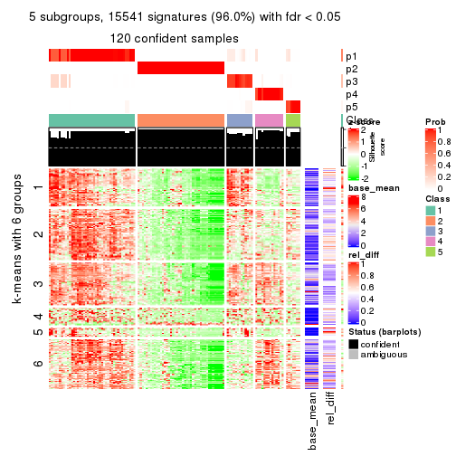</p>

</div>
<div id='tab-ATC-skmeans-get-signatures-5'>
<pre><code class="r">get_signatures(res, k = 6)
</code></pre>

<p></p>

</div>
</div>


Signature heatmaps where rows are not scaled:


<script>
$( function() {
	$( '#tabs-ATC-skmeans-get-signatures-no-scale' ).tabs();
} );
</script>
<div id='tabs-ATC-skmeans-get-signatures-no-scale'>
<ul>
<li><a href='#tab-ATC-skmeans-get-signatures-no-scale-1'>k = 2</a></li>
<li><a href='#tab-ATC-skmeans-get-signatures-no-scale-2'>k = 3</a></li>
<li><a href='#tab-ATC-skmeans-get-signatures-no-scale-3'>k = 4</a></li>
<li><a href='#tab-ATC-skmeans-get-signatures-no-scale-4'>k = 5</a></li>
<li><a href='#tab-ATC-skmeans-get-signatures-no-scale-5'>k = 6</a></li>
</ul>
<div id='tab-ATC-skmeans-get-signatures-no-scale-1'>
<pre><code class="r">get_signatures(res, k = 2, scale_rows = FALSE)
</code></pre>

<p></p>

</div>
<div id='tab-ATC-skmeans-get-signatures-no-scale-2'>
<pre><code class="r">get_signatures(res, k = 3, scale_rows = FALSE)
</code></pre>

<p></p>

</div>
<div id='tab-ATC-skmeans-get-signatures-no-scale-3'>
<pre><code class="r">get_signatures(res, k = 4, scale_rows = FALSE)
</code></pre>

<p></p>

</div>
<div id='tab-ATC-skmeans-get-signatures-no-scale-4'>
<pre><code class="r">get_signatures(res, k = 5, scale_rows = FALSE)
</code></pre>

<p></p>

</div>
<div id='tab-ATC-skmeans-get-signatures-no-scale-5'>
<pre><code class="r">get_signatures(res, k = 6, scale_rows = FALSE)
</code></pre>

<p></p>

</div>
</div>


Compare the overlap of signatures from different k:

```r
compare_signatures(res)
```


`get_signature()` returns a data frame invisibly. TO get the list of signatures, the function
call should be assigned to a variable explicitly. In following code, if `plot` argument is set
to `FALSE`, no heatmap is plotted while only the differential analysis is performed.

```r
# code only for demonstration
tb = get_signature(res, k = ..., plot = FALSE)
```

An example of the output of `tb` is:

```
#>   which_row         fdr    mean_1    mean_2 scaled_mean_1 scaled_mean_2 km
#> 1        38 0.042760348  8.373488  9.131774    -0.5533452     0.5164555  1
#> 2        40 0.018707592  7.106213  8.469186    -0.6173731     0.5762149  1
#> 3        55 0.019134737 10.221463 11.207825    -0.6159697     0.5749050  1
#> 4        59 0.006059896  5.921854  7.869574    -0.6899429     0.6439467  1
#> 5        60 0.018055526  8.928898 10.211722    -0.6204761     0.5791110  1
#> 6        98 0.009384629 15.714769 14.887706     0.6635654    -0.6193277  2
...
```

The columns in `tb` are:

1. `which_row`: row indices corresponding to the input matrix.
2. `fdr`: FDR for the differential test. 
3. `mean_x`: The mean value in group x.
4. `scaled_mean_x`: The mean value in group x after rows are scaled.
5. `km`: Row groups if k-means clustering is applied to rows.


UMAP plot which shows how samples are separated.


<script>
$( function() {
	$( '#tabs-ATC-skmeans-dimension-reduction' ).tabs();
} );
</script>
<div id='tabs-ATC-skmeans-dimension-reduction'>
<ul>
<li><a href='#tab-ATC-skmeans-dimension-reduction-1'>k = 2</a></li>
<li><a href='#tab-ATC-skmeans-dimension-reduction-2'>k = 3</a></li>
<li><a href='#tab-ATC-skmeans-dimension-reduction-3'>k = 4</a></li>
<li><a href='#tab-ATC-skmeans-dimension-reduction-4'>k = 5</a></li>
<li><a href='#tab-ATC-skmeans-dimension-reduction-5'>k = 6</a></li>
</ul>
<div id='tab-ATC-skmeans-dimension-reduction-1'>
<pre><code class="r">dimension_reduction(res, k = 2, method = &quot;UMAP&quot;)
</code></pre>

<p></p>

</div>
<div id='tab-ATC-skmeans-dimension-reduction-2'>
<pre><code class="r">dimension_reduction(res, k = 3, method = &quot;UMAP&quot;)
</code></pre>

<p></p>

</div>
<div id='tab-ATC-skmeans-dimension-reduction-3'>
<pre><code class="r">dimension_reduction(res, k = 4, method = &quot;UMAP&quot;)
</code></pre>

<p></p>

</div>
<div id='tab-ATC-skmeans-dimension-reduction-4'>
<pre><code class="r">dimension_reduction(res, k = 5, method = &quot;UMAP&quot;)
</code></pre>

<p></p>

</div>
<div id='tab-ATC-skmeans-dimension-reduction-5'>
<pre><code class="r">dimension_reduction(res, k = 6, method = &quot;UMAP&quot;)
</code></pre>

<p></p>

</div>
</div>


Following heatmap shows how subgroups are split when increasing `k`:

```r
collect_classes(res)
```


If matrix rows can be associated to genes, consider to use `functional_enrichment(res,
...)` to perform function enrichment for the signature genes. See [this vignette](http://bioconductor.org/packages/devel/bioc/vignettes/cola/inst/doc/functional_enrichment.html) for more detailed explanations.


 

---------------------------------------------------


### ATC:pam**


The object with results only for a single top-value method and a single partition method 
can be extracted as:

```r
res = res_list["ATC", "pam"]
# you can also extract it by
# res = res_list["ATC:pam"]
```

A summary of `res` and all the functions that can be applied to it:

```r
res
```

```
#> A 'ConsensusPartition' object with k = 2, 3, 4, 5, 6.
#>   On a matrix with 16187 rows and 121 columns.
#>   Top rows (1000, 2000, 3000, 4000, 5000) are extracted by 'ATC' method.
#>   Subgroups are detected by 'pam' method.
#>   Performed in total 1250 partitions by row resampling.
#>   Best k for subgroups seems to be 4.
#> 
#> Following methods can be applied to this 'ConsensusPartition' object:
#>  [1] "cola_report"             "collect_classes"         "collect_plots"          
#>  [4] "collect_stats"           "colnames"                "compare_signatures"     
#>  [7] "consensus_heatmap"       "dimension_reduction"     "functional_enrichment"  
#> [10] "get_anno_col"            "get_anno"                "get_classes"            
#> [13] "get_consensus"           "get_matrix"              "get_membership"         
#> [16] "get_param"               "get_signatures"          "get_stats"              
#> [19] "is_best_k"               "is_stable_k"             "membership_heatmap"     
#> [22] "ncol"                    "nrow"                    "plot_ecdf"              
#> [25] "rownames"                "select_partition_number" "show"                   
#> [28] "suggest_best_k"          "test_to_known_factors"
```

`collect_plots()` function collects all the plots made from `res` for all `k` (number of partitions)
into one single page to provide an easy and fast comparison between different `k`.

```r
collect_plots(res)
```


The plots are:

- The first row: a plot of the ECDF (empirical cumulative distribution
  function) curves of the consensus matrix for each `k` and the heatmap of
  predicted classes for each `k`.
- The second row: heatmaps of the consensus matrix for each `k`.
- The third row: heatmaps of the membership matrix for each `k`.
- The fouth row: heatmaps of the signatures for each `k`.

All the plots in panels can be made by individual functions and they are
plotted later in this section.

`select_partition_number()` produces several plots showing different
statistics for choosing "optimized" `k`. There are following statistics:

- ECDF curves of the consensus matrix for each `k`;
- 1-PAC. [The PAC
  score](https://en.wikipedia.org/wiki/Consensus_clustering#Over-interpretation_potential_of_consensus_clustering)
  measures the proportion of the ambiguous subgrouping.
- Mean silhouette score.
- Concordance. The mean probability of fiting the consensus class ids in all
  partitions.
- Area increased. Denote $A_k$ as the area under the ECDF curve for current
  `k`, the area increased is defined as $A_k - A_{k-1}$.
- Rand index. The percent of pairs of samples that are both in a same cluster
  or both are not in a same cluster in the partition of k and k-1.
- Jaccard index. The ratio of pairs of samples are both in a same cluster in
  the partition of k and k-1 and the pairs of samples are both in a same
  cluster in the partition k or k-1.

The detailed explanations of these statistics can be found in [the _cola_
vignette](http://bioconductor.org/packages/devel/bioc/vignettes/cola/inst/doc/cola.html#toc_13).

Generally speaking, lower PAC score, higher mean silhouette score or higher
concordance corresponds to better partition. Rand index and Jaccard index
measure how similar the current partition is compared to partition with `k-1`.
If they are too similar, we won't accept `k` is better than `k-1`.

```r
select_partition_number(res)
```


The numeric values for all these statistics can be obtained by `get_stats()`.

```r
get_stats(res)
```

```
#>   k 1-PAC mean_silhouette concordance area_increased  Rand Jaccard
#> 2 2 1.000           0.991       0.997         0.4445 0.554   0.554
#> 3 3 0.889           0.915       0.964         0.4163 0.803   0.649
#> 4 4 1.000           0.962       0.987         0.0876 0.929   0.813
#> 5 5 0.883           0.866       0.942         0.1392 0.833   0.527
#> 6 6 0.873           0.826       0.891         0.0415 0.944   0.757
```

`suggest_best_k()` suggests the best $k$ based on these statistics. The rules are as follows:

- All $k$ with Jaccard index larger than 0.95 are removed because increasing
  $k$ does not provide enough extra information. If all $k$ are removed, it is
  marked as no subgroup is detected.
- For all $k$ with 1-PAC score larger than 0.9, the maximal $k$ is taken as
  the best $k$, and other $k$ are marked as optional $k$.
- If it does not fit the second rule. The $k$ with the maximal vote of the
  highest 1-PAC score, highest mean silhouette, and highest concordance is
  taken as the best $k$.

```r
suggest_best_k(res)
```

```
#> [1] 4
#> attr(,"optional")
#> [1] 2
```

There is also optional best $k$ = 2 that is worth to check.

Following shows the table of the partitions (You need to click the **show/hide
code output** link to see it). The membership matrix (columns with name `p*`)
is inferred by
[`clue::cl_consensus()`](https://www.rdocumentation.org/link/cl_consensus?package=clue)
function with the `SE` method. Basically the value in the membership matrix
represents the probability to belong to a certain group. The finall class
label for an item is determined with the group with highest probability it
belongs to.

In `get_classes()` function, the entropy is calculated from the membership
matrix and the silhouette score is calculated from the consensus matrix.


<script>
$( function() {
	$( '#tabs-ATC-pam-get-classes' ).tabs();
} );
</script>
<div id='tabs-ATC-pam-get-classes'>
<ul>
<li><a href='#tab-ATC-pam-get-classes-1'>k = 2</a></li>
<li><a href='#tab-ATC-pam-get-classes-2'>k = 3</a></li>
<li><a href='#tab-ATC-pam-get-classes-3'>k = 4</a></li>
<li><a href='#tab-ATC-pam-get-classes-4'>k = 5</a></li>
<li><a href='#tab-ATC-pam-get-classes-5'>k = 6</a></li>
</ul>

<div id='tab-ATC-pam-get-classes-1'>
<p><a id='tab-ATC-pam-get-classes-1-a' style='color:#0366d6' href='#'>show/hide code output</a></p>
<pre><code class="r">cbind(get_classes(res, k = 2), get_membership(res, k = 2))
</code></pre>

<pre><code>#&gt;           class entropy silhouette    p1    p2
#&gt; DRR006374     2  0.0000      0.990 0.000 1.000
#&gt; DRR006375     1  0.0000      1.000 1.000 0.000
#&gt; DRR006376     1  0.0000      1.000 1.000 0.000
#&gt; DRR006377     1  0.0000      1.000 1.000 0.000
#&gt; DRR006378     2  0.0000      0.990 0.000 1.000
#&gt; DRR006379     1  0.0000      1.000 1.000 0.000
#&gt; DRR006380     2  0.0000      0.990 0.000 1.000
#&gt; DRR006381     1  0.0000      1.000 1.000 0.000
#&gt; DRR006382     2  0.0000      0.990 0.000 1.000
#&gt; DRR006383     1  0.0000      1.000 1.000 0.000
#&gt; DRR006384     2  0.0000      0.990 0.000 1.000
#&gt; DRR006385     1  0.0000      1.000 1.000 0.000
#&gt; DRR006386     2  0.0000      0.990 0.000 1.000
#&gt; DRR006387     1  0.0000      1.000 1.000 0.000
#&gt; DRR006388     1  0.0000      1.000 1.000 0.000
#&gt; DRR006389     1  0.0000      1.000 1.000 0.000
#&gt; DRR006390     2  0.0000      0.990 0.000 1.000
#&gt; DRR006391     2  0.0000      0.990 0.000 1.000
#&gt; DRR006392     1  0.0000      1.000 1.000 0.000
#&gt; DRR006393     1  0.0000      1.000 1.000 0.000
#&gt; DRR006394     2  0.0000      0.990 0.000 1.000
#&gt; DRR006395     1  0.0000      1.000 1.000 0.000
#&gt; DRR006396     1  0.0000      1.000 1.000 0.000
#&gt; DRR006397     1  0.0000      1.000 1.000 0.000
#&gt; DRR006398     1  0.0000      1.000 1.000 0.000
#&gt; DRR006399     1  0.0000      1.000 1.000 0.000
#&gt; DRR006400     1  0.0000      1.000 1.000 0.000
#&gt; DRR006401     2  0.0000      0.990 0.000 1.000
#&gt; DRR006402     2  0.0000      0.990 0.000 1.000
#&gt; DRR006403     1  0.0000      1.000 1.000 0.000
#&gt; DRR006404     1  0.0000      1.000 1.000 0.000
#&gt; DRR006405     1  0.0000      1.000 1.000 0.000
#&gt; DRR006406     1  0.0000      1.000 1.000 0.000
#&gt; DRR006407     2  0.0000      0.990 0.000 1.000
#&gt; DRR006408     2  0.0000      0.990 0.000 1.000
#&gt; DRR006409     1  0.0000      1.000 1.000 0.000
#&gt; DRR006410     1  0.0000      1.000 1.000 0.000
#&gt; DRR006411     2  0.0000      0.990 0.000 1.000
#&gt; DRR006412     2  0.0000      0.990 0.000 1.000
#&gt; DRR006413     1  0.0000      1.000 1.000 0.000
#&gt; DRR006414     1  0.0000      1.000 1.000 0.000
#&gt; DRR006415     1  0.0000      1.000 1.000 0.000
#&gt; DRR006416     1  0.0000      1.000 1.000 0.000
#&gt; DRR006417     1  0.0000      1.000 1.000 0.000
#&gt; DRR006418     1  0.0000      1.000 1.000 0.000
#&gt; DRR006419     1  0.0000      1.000 1.000 0.000
#&gt; DRR006420     1  0.0000      1.000 1.000 0.000
#&gt; DRR006421     1  0.0000      1.000 1.000 0.000
#&gt; DRR006422     1  0.0000      1.000 1.000 0.000
#&gt; DRR006423     2  0.0000      0.990 0.000 1.000
#&gt; DRR006424     1  0.0000      1.000 1.000 0.000
#&gt; DRR006425     2  0.0000      0.990 0.000 1.000
#&gt; DRR006426     1  0.0000      1.000 1.000 0.000
#&gt; DRR006427     2  0.0000      0.990 0.000 1.000
#&gt; DRR006428     1  0.0000      1.000 1.000 0.000
#&gt; DRR006429     2  0.0000      0.990 0.000 1.000
#&gt; DRR006430     1  0.0000      1.000 1.000 0.000
#&gt; DRR006431     1  0.0000      1.000 1.000 0.000
#&gt; DRR006432     1  0.0000      1.000 1.000 0.000
#&gt; DRR006433     1  0.0000      1.000 1.000 0.000
#&gt; DRR006434     2  0.0000      0.990 0.000 1.000
#&gt; DRR006435     2  0.0000      0.990 0.000 1.000
#&gt; DRR006436     2  0.0000      0.990 0.000 1.000
#&gt; DRR006437     1  0.0000      1.000 1.000 0.000
#&gt; DRR006438     1  0.0000      1.000 1.000 0.000
#&gt; DRR006439     1  0.0000      1.000 1.000 0.000
#&gt; DRR006440     2  0.0000      0.990 0.000 1.000
#&gt; DRR006441     2  0.0000      0.990 0.000 1.000
#&gt; DRR006442     1  0.0000      1.000 1.000 0.000
#&gt; DRR006443     2  0.0000      0.990 0.000 1.000
#&gt; DRR006444     2  0.0000      0.990 0.000 1.000
#&gt; DRR006445     1  0.0000      1.000 1.000 0.000
#&gt; DRR006446     2  0.0000      0.990 0.000 1.000
#&gt; DRR006447     1  0.0000      1.000 1.000 0.000
#&gt; DRR006448     1  0.0000      1.000 1.000 0.000
#&gt; DRR006449     1  0.0000      1.000 1.000 0.000
#&gt; DRR006450     1  0.0000      1.000 1.000 0.000
#&gt; DRR006451     1  0.0000      1.000 1.000 0.000
#&gt; DRR006452     1  0.0000      1.000 1.000 0.000
#&gt; DRR006453     1  0.0000      1.000 1.000 0.000
#&gt; DRR006454     1  0.0376      0.996 0.996 0.004
#&gt; DRR006455     2  0.0000      0.990 0.000 1.000
#&gt; DRR006456     1  0.0000      1.000 1.000 0.000
#&gt; DRR006457     1  0.0000      1.000 1.000 0.000
#&gt; DRR006458     1  0.0000      1.000 1.000 0.000
#&gt; DRR006459     1  0.0000      1.000 1.000 0.000
#&gt; DRR006460     2  0.0000      0.990 0.000 1.000
#&gt; DRR006461     2  0.0000      0.990 0.000 1.000
#&gt; DRR006462     1  0.0000      1.000 1.000 0.000
#&gt; DRR006463     2  0.0000      0.990 0.000 1.000
#&gt; DRR006464     2  0.0000      0.990 0.000 1.000
#&gt; DRR006465     1  0.0000      1.000 1.000 0.000
#&gt; DRR006466     2  0.9710      0.333 0.400 0.600
#&gt; DRR006467     1  0.0000      1.000 1.000 0.000
#&gt; DRR006468     2  0.0000      0.990 0.000 1.000
#&gt; DRR006469     2  0.0000      0.990 0.000 1.000
#&gt; DRR006470     1  0.0000      1.000 1.000 0.000
#&gt; DRR006471     1  0.0000      1.000 1.000 0.000
#&gt; DRR006472     1  0.0000      1.000 1.000 0.000
#&gt; DRR006473     2  0.0000      0.990 0.000 1.000
#&gt; DRR006474     2  0.0000      0.990 0.000 1.000
#&gt; DRR006475     1  0.0000      1.000 1.000 0.000
#&gt; DRR006476     2  0.0000      0.990 0.000 1.000
#&gt; DRR006477     1  0.0000      1.000 1.000 0.000
#&gt; DRR006478     1  0.0000      1.000 1.000 0.000
#&gt; DRR006479     1  0.0000      1.000 1.000 0.000
#&gt; DRR006480     1  0.0000      1.000 1.000 0.000
#&gt; DRR006481     1  0.0000      1.000 1.000 0.000
#&gt; DRR006482     1  0.0000      1.000 1.000 0.000
#&gt; DRR006483     1  0.0000      1.000 1.000 0.000
#&gt; DRR006484     1  0.0000      1.000 1.000 0.000
#&gt; DRR006485     2  0.0000      0.990 0.000 1.000
#&gt; DRR006486     1  0.0000      1.000 1.000 0.000
#&gt; DRR006487     1  0.0000      1.000 1.000 0.000
#&gt; DRR006488     2  0.0000      0.990 0.000 1.000
#&gt; DRR006489     1  0.0000      1.000 1.000 0.000
#&gt; DRR006490     1  0.0000      1.000 1.000 0.000
#&gt; DRR006491     1  0.0000      1.000 1.000 0.000
#&gt; DRR006492     1  0.0000      1.000 1.000 0.000
#&gt; DRR006493     1  0.0000      1.000 1.000 0.000
#&gt; DRR006494     1  0.0000      1.000 1.000 0.000
</code></pre>

<script>
$('#tab-ATC-pam-get-classes-1-a').parent().next().next().hide();
$('#tab-ATC-pam-get-classes-1-a').click(function(){
  $('#tab-ATC-pam-get-classes-1-a').parent().next().next().toggle();
  return(false);
});
</script>
</div>

<div id='tab-ATC-pam-get-classes-2'>
<p><a id='tab-ATC-pam-get-classes-2-a' style='color:#0366d6' href='#'>show/hide code output</a></p>
<pre><code class="r">cbind(get_classes(res, k = 3), get_membership(res, k = 3))
</code></pre>

<pre><code>#&gt;           class entropy silhouette    p1    p2    p3
#&gt; DRR006374     2  0.0000     0.9497 0.000 1.000 0.000
#&gt; DRR006375     1  0.0000     0.9693 1.000 0.000 0.000
#&gt; DRR006376     3  0.0000     0.9592 0.000 0.000 1.000
#&gt; DRR006377     3  0.0000     0.9592 0.000 0.000 1.000
#&gt; DRR006378     2  0.0000     0.9497 0.000 1.000 0.000
#&gt; DRR006379     3  0.0000     0.9592 0.000 0.000 1.000
#&gt; DRR006380     2  0.0000     0.9497 0.000 1.000 0.000
#&gt; DRR006381     1  0.0000     0.9693 1.000 0.000 0.000
#&gt; DRR006382     2  0.0000     0.9497 0.000 1.000 0.000
#&gt; DRR006383     3  0.0000     0.9592 0.000 0.000 1.000
#&gt; DRR006384     2  0.0000     0.9497 0.000 1.000 0.000
#&gt; DRR006385     3  0.0000     0.9592 0.000 0.000 1.000
#&gt; DRR006386     2  0.0000     0.9497 0.000 1.000 0.000
#&gt; DRR006387     3  0.4654     0.7381 0.208 0.000 0.792
#&gt; DRR006388     3  0.0000     0.9592 0.000 0.000 1.000
#&gt; DRR006389     3  0.0000     0.9592 0.000 0.000 1.000
#&gt; DRR006390     2  0.0000     0.9497 0.000 1.000 0.000
#&gt; DRR006391     2  0.0000     0.9497 0.000 1.000 0.000
#&gt; DRR006392     1  0.0000     0.9693 1.000 0.000 0.000
#&gt; DRR006393     3  0.5431     0.6202 0.284 0.000 0.716
#&gt; DRR006394     2  0.0000     0.9497 0.000 1.000 0.000
#&gt; DRR006395     3  0.0000     0.9592 0.000 0.000 1.000
#&gt; DRR006396     1  0.1031     0.9464 0.976 0.000 0.024
#&gt; DRR006397     3  0.0000     0.9592 0.000 0.000 1.000
#&gt; DRR006398     3  0.0000     0.9592 0.000 0.000 1.000
#&gt; DRR006399     3  0.0000     0.9592 0.000 0.000 1.000
#&gt; DRR006400     3  0.0000     0.9592 0.000 0.000 1.000
#&gt; DRR006401     2  0.0000     0.9497 0.000 1.000 0.000
#&gt; DRR006402     2  0.0000     0.9497 0.000 1.000 0.000
#&gt; DRR006403     3  0.0000     0.9592 0.000 0.000 1.000
#&gt; DRR006404     3  0.0000     0.9592 0.000 0.000 1.000
#&gt; DRR006405     3  0.0000     0.9592 0.000 0.000 1.000
#&gt; DRR006406     3  0.0000     0.9592 0.000 0.000 1.000
#&gt; DRR006407     2  0.5327     0.6744 0.000 0.728 0.272
#&gt; DRR006408     2  0.0000     0.9497 0.000 1.000 0.000
#&gt; DRR006409     1  0.6295     0.0133 0.528 0.000 0.472
#&gt; DRR006410     1  0.0000     0.9693 1.000 0.000 0.000
#&gt; DRR006411     2  0.5465     0.6550 0.000 0.712 0.288
#&gt; DRR006412     2  0.0000     0.9497 0.000 1.000 0.000
#&gt; DRR006413     1  0.0000     0.9693 1.000 0.000 0.000
#&gt; DRR006414     3  0.0000     0.9592 0.000 0.000 1.000
#&gt; DRR006415     3  0.0000     0.9592 0.000 0.000 1.000
#&gt; DRR006416     3  0.0000     0.9592 0.000 0.000 1.000
#&gt; DRR006417     3  0.0000     0.9592 0.000 0.000 1.000
#&gt; DRR006418     3  0.0000     0.9592 0.000 0.000 1.000
#&gt; DRR006419     3  0.0000     0.9592 0.000 0.000 1.000
#&gt; DRR006420     3  0.0000     0.9592 0.000 0.000 1.000
#&gt; DRR006421     3  0.0000     0.9592 0.000 0.000 1.000
#&gt; DRR006422     3  0.0000     0.9592 0.000 0.000 1.000
#&gt; DRR006423     2  0.0000     0.9497 0.000 1.000 0.000
#&gt; DRR006424     1  0.0000     0.9693 1.000 0.000 0.000
#&gt; DRR006425     2  0.3816     0.8075 0.000 0.852 0.148
#&gt; DRR006426     3  0.0000     0.9592 0.000 0.000 1.000
#&gt; DRR006427     2  0.0000     0.9497 0.000 1.000 0.000
#&gt; DRR006428     3  0.5431     0.6202 0.284 0.000 0.716
#&gt; DRR006429     2  0.5431     0.6604 0.000 0.716 0.284
#&gt; DRR006430     1  0.0000     0.9693 1.000 0.000 0.000
#&gt; DRR006431     1  0.0000     0.9693 1.000 0.000 0.000
#&gt; DRR006432     3  0.0000     0.9592 0.000 0.000 1.000
#&gt; DRR006433     3  0.0000     0.9592 0.000 0.000 1.000
#&gt; DRR006434     2  0.0000     0.9497 0.000 1.000 0.000
#&gt; DRR006435     2  0.0000     0.9497 0.000 1.000 0.000
#&gt; DRR006436     2  0.0000     0.9497 0.000 1.000 0.000
#&gt; DRR006437     3  0.0000     0.9592 0.000 0.000 1.000
#&gt; DRR006438     3  0.5431     0.6202 0.284 0.000 0.716
#&gt; DRR006439     3  0.0000     0.9592 0.000 0.000 1.000
#&gt; DRR006440     2  0.0000     0.9497 0.000 1.000 0.000
#&gt; DRR006441     2  0.0000     0.9497 0.000 1.000 0.000
#&gt; DRR006442     1  0.2356     0.8952 0.928 0.000 0.072
#&gt; DRR006443     2  0.0000     0.9497 0.000 1.000 0.000
#&gt; DRR006444     2  0.0000     0.9497 0.000 1.000 0.000
#&gt; DRR006445     3  0.0000     0.9592 0.000 0.000 1.000
#&gt; DRR006446     2  0.0000     0.9497 0.000 1.000 0.000
#&gt; DRR006447     3  0.0000     0.9592 0.000 0.000 1.000
#&gt; DRR006448     3  0.0000     0.9592 0.000 0.000 1.000
#&gt; DRR006449     3  0.0000     0.9592 0.000 0.000 1.000
#&gt; DRR006450     3  0.0000     0.9592 0.000 0.000 1.000
#&gt; DRR006451     3  0.0000     0.9592 0.000 0.000 1.000
#&gt; DRR006452     1  0.0000     0.9693 1.000 0.000 0.000
#&gt; DRR006453     3  0.0000     0.9592 0.000 0.000 1.000
#&gt; DRR006454     3  0.0000     0.9592 0.000 0.000 1.000
#&gt; DRR006455     2  0.0000     0.9497 0.000 1.000 0.000
#&gt; DRR006456     3  0.0000     0.9592 0.000 0.000 1.000
#&gt; DRR006457     3  0.0000     0.9592 0.000 0.000 1.000
#&gt; DRR006458     1  0.0000     0.9693 1.000 0.000 0.000
#&gt; DRR006459     1  0.0000     0.9693 1.000 0.000 0.000
#&gt; DRR006460     2  0.0000     0.9497 0.000 1.000 0.000
#&gt; DRR006461     2  0.0000     0.9497 0.000 1.000 0.000
#&gt; DRR006462     3  0.0000     0.9592 0.000 0.000 1.000
#&gt; DRR006463     2  0.0000     0.9497 0.000 1.000 0.000
#&gt; DRR006464     2  0.5397     0.6651 0.000 0.720 0.280
#&gt; DRR006465     3  0.4654     0.7380 0.208 0.000 0.792
#&gt; DRR006466     3  0.0000     0.9592 0.000 0.000 1.000
#&gt; DRR006467     1  0.0000     0.9693 1.000 0.000 0.000
#&gt; DRR006468     2  0.0000     0.9497 0.000 1.000 0.000
#&gt; DRR006469     2  0.0000     0.9497 0.000 1.000 0.000
#&gt; DRR006470     3  0.0000     0.9592 0.000 0.000 1.000
#&gt; DRR006471     1  0.0000     0.9693 1.000 0.000 0.000
#&gt; DRR006472     3  0.0000     0.9592 0.000 0.000 1.000
#&gt; DRR006473     2  0.0000     0.9497 0.000 1.000 0.000
#&gt; DRR006474     2  0.0000     0.9497 0.000 1.000 0.000
#&gt; DRR006475     1  0.0000     0.9693 1.000 0.000 0.000
#&gt; DRR006476     2  0.5431     0.6604 0.000 0.716 0.284
#&gt; DRR006477     3  0.0000     0.9592 0.000 0.000 1.000
#&gt; DRR006478     3  0.4702     0.7325 0.212 0.000 0.788
#&gt; DRR006479     3  0.5431     0.6202 0.284 0.000 0.716
#&gt; DRR006480     1  0.0000     0.9693 1.000 0.000 0.000
#&gt; DRR006481     3  0.0000     0.9592 0.000 0.000 1.000
#&gt; DRR006482     3  0.0000     0.9592 0.000 0.000 1.000
#&gt; DRR006483     1  0.0000     0.9693 1.000 0.000 0.000
#&gt; DRR006484     3  0.0000     0.9592 0.000 0.000 1.000
#&gt; DRR006485     2  0.0000     0.9497 0.000 1.000 0.000
#&gt; DRR006486     1  0.0000     0.9693 1.000 0.000 0.000
#&gt; DRR006487     3  0.0000     0.9592 0.000 0.000 1.000
#&gt; DRR006488     2  0.0000     0.9497 0.000 1.000 0.000
#&gt; DRR006489     1  0.0000     0.9693 1.000 0.000 0.000
#&gt; DRR006490     1  0.0000     0.9693 1.000 0.000 0.000
#&gt; DRR006491     3  0.6126     0.3695 0.400 0.000 0.600
#&gt; DRR006492     3  0.0592     0.9492 0.012 0.000 0.988
#&gt; DRR006493     3  0.0000     0.9592 0.000 0.000 1.000
#&gt; DRR006494     1  0.0000     0.9693 1.000 0.000 0.000
</code></pre>

<script>
$('#tab-ATC-pam-get-classes-2-a').parent().next().next().hide();
$('#tab-ATC-pam-get-classes-2-a').click(function(){
  $('#tab-ATC-pam-get-classes-2-a').parent().next().next().toggle();
  return(false);
});
</script>
</div>

<div id='tab-ATC-pam-get-classes-3'>
<p><a id='tab-ATC-pam-get-classes-3-a' style='color:#0366d6' href='#'>show/hide code output</a></p>
<pre><code class="r">cbind(get_classes(res, k = 4), get_membership(res, k = 4))
</code></pre>

<pre><code>#&gt;           class entropy silhouette    p1    p2    p3   p4
#&gt; DRR006374     2  0.0000      0.999 0.000 1.000 0.000 0.00
#&gt; DRR006375     1  0.0000      0.951 1.000 0.000 0.000 0.00
#&gt; DRR006376     3  0.0000      0.985 0.000 0.000 1.000 0.00
#&gt; DRR006377     3  0.0000      0.985 0.000 0.000 1.000 0.00
#&gt; DRR006378     2  0.0000      0.999 0.000 1.000 0.000 0.00
#&gt; DRR006379     3  0.0000      0.985 0.000 0.000 1.000 0.00
#&gt; DRR006380     2  0.0000      0.999 0.000 1.000 0.000 0.00
#&gt; DRR006381     1  0.0000      0.951 1.000 0.000 0.000 0.00
#&gt; DRR006382     2  0.0000      0.999 0.000 1.000 0.000 0.00
#&gt; DRR006383     3  0.0000      0.985 0.000 0.000 1.000 0.00
#&gt; DRR006384     4  0.0000      1.000 0.000 0.000 0.000 1.00
#&gt; DRR006385     3  0.0000      0.985 0.000 0.000 1.000 0.00
#&gt; DRR006386     4  0.0000      1.000 0.000 0.000 0.000 1.00
#&gt; DRR006387     3  0.0000      0.985 0.000 0.000 1.000 0.00
#&gt; DRR006388     3  0.0000      0.985 0.000 0.000 1.000 0.00
#&gt; DRR006389     3  0.0000      0.985 0.000 0.000 1.000 0.00
#&gt; DRR006390     4  0.0000      1.000 0.000 0.000 0.000 1.00
#&gt; DRR006391     4  0.0000      1.000 0.000 0.000 0.000 1.00
#&gt; DRR006392     1  0.0000      0.951 1.000 0.000 0.000 0.00
#&gt; DRR006393     3  0.0000      0.985 0.000 0.000 1.000 0.00
#&gt; DRR006394     2  0.0000      0.999 0.000 1.000 0.000 0.00
#&gt; DRR006395     3  0.0000      0.985 0.000 0.000 1.000 0.00
#&gt; DRR006396     1  0.3444      0.701 0.816 0.000 0.184 0.00
#&gt; DRR006397     3  0.0000      0.985 0.000 0.000 1.000 0.00
#&gt; DRR006398     3  0.0000      0.985 0.000 0.000 1.000 0.00
#&gt; DRR006399     3  0.0000      0.985 0.000 0.000 1.000 0.00
#&gt; DRR006400     3  0.0000      0.985 0.000 0.000 1.000 0.00
#&gt; DRR006401     4  0.0000      1.000 0.000 0.000 0.000 1.00
#&gt; DRR006402     4  0.0000      1.000 0.000 0.000 0.000 1.00
#&gt; DRR006403     3  0.0000      0.985 0.000 0.000 1.000 0.00
#&gt; DRR006404     3  0.0000      0.985 0.000 0.000 1.000 0.00
#&gt; DRR006405     3  0.0000      0.985 0.000 0.000 1.000 0.00
#&gt; DRR006406     3  0.0000      0.985 0.000 0.000 1.000 0.00
#&gt; DRR006407     2  0.0000      0.999 0.000 1.000 0.000 0.00
#&gt; DRR006408     2  0.0000      0.999 0.000 1.000 0.000 0.00
#&gt; DRR006409     1  0.4989      0.105 0.528 0.000 0.472 0.00
#&gt; DRR006410     1  0.0000      0.951 1.000 0.000 0.000 0.00
#&gt; DRR006411     2  0.0000      0.999 0.000 1.000 0.000 0.00
#&gt; DRR006412     2  0.0000      0.999 0.000 1.000 0.000 0.00
#&gt; DRR006413     1  0.0000      0.951 1.000 0.000 0.000 0.00
#&gt; DRR006414     3  0.0000      0.985 0.000 0.000 1.000 0.00
#&gt; DRR006415     3  0.0000      0.985 0.000 0.000 1.000 0.00
#&gt; DRR006416     3  0.0000      0.985 0.000 0.000 1.000 0.00
#&gt; DRR006417     3  0.0000      0.985 0.000 0.000 1.000 0.00
#&gt; DRR006418     3  0.0000      0.985 0.000 0.000 1.000 0.00
#&gt; DRR006419     3  0.0000      0.985 0.000 0.000 1.000 0.00
#&gt; DRR006420     3  0.0000      0.985 0.000 0.000 1.000 0.00
#&gt; DRR006421     3  0.0000      0.985 0.000 0.000 1.000 0.00
#&gt; DRR006422     3  0.0000      0.985 0.000 0.000 1.000 0.00
#&gt; DRR006423     2  0.0000      0.999 0.000 1.000 0.000 0.00
#&gt; DRR006424     1  0.0000      0.951 1.000 0.000 0.000 0.00
#&gt; DRR006425     2  0.0000      0.999 0.000 1.000 0.000 0.00
#&gt; DRR006426     3  0.0000      0.985 0.000 0.000 1.000 0.00
#&gt; DRR006427     4  0.0000      1.000 0.000 0.000 0.000 1.00
#&gt; DRR006428     3  0.0000      0.985 0.000 0.000 1.000 0.00
#&gt; DRR006429     2  0.0000      0.999 0.000 1.000 0.000 0.00
#&gt; DRR006430     1  0.0000      0.951 1.000 0.000 0.000 0.00
#&gt; DRR006431     1  0.0000      0.951 1.000 0.000 0.000 0.00
#&gt; DRR006432     3  0.0000      0.985 0.000 0.000 1.000 0.00
#&gt; DRR006433     3  0.0000      0.985 0.000 0.000 1.000 0.00
#&gt; DRR006434     2  0.0000      0.999 0.000 1.000 0.000 0.00
#&gt; DRR006435     4  0.0000      1.000 0.000 0.000 0.000 1.00
#&gt; DRR006436     4  0.0000      1.000 0.000 0.000 0.000 1.00
#&gt; DRR006437     3  0.0000      0.985 0.000 0.000 1.000 0.00
#&gt; DRR006438     3  0.0000      0.985 0.000 0.000 1.000 0.00
#&gt; DRR006439     3  0.0000      0.985 0.000 0.000 1.000 0.00
#&gt; DRR006440     2  0.0000      0.999 0.000 1.000 0.000 0.00
#&gt; DRR006441     2  0.0000      0.999 0.000 1.000 0.000 0.00
#&gt; DRR006442     1  0.1867      0.863 0.928 0.000 0.072 0.00
#&gt; DRR006443     2  0.0000      0.999 0.000 1.000 0.000 0.00
#&gt; DRR006444     4  0.0000      1.000 0.000 0.000 0.000 1.00
#&gt; DRR006445     3  0.0000      0.985 0.000 0.000 1.000 0.00
#&gt; DRR006446     4  0.0000      1.000 0.000 0.000 0.000 1.00
#&gt; DRR006447     3  0.0000      0.985 0.000 0.000 1.000 0.00
#&gt; DRR006448     3  0.0000      0.985 0.000 0.000 1.000 0.00
#&gt; DRR006449     3  0.0000      0.985 0.000 0.000 1.000 0.00
#&gt; DRR006450     3  0.0000      0.985 0.000 0.000 1.000 0.00
#&gt; DRR006451     3  0.0000      0.985 0.000 0.000 1.000 0.00
#&gt; DRR006452     1  0.0000      0.951 1.000 0.000 0.000 0.00
#&gt; DRR006453     3  0.0000      0.985 0.000 0.000 1.000 0.00
#&gt; DRR006454     2  0.0000      0.999 0.000 1.000 0.000 0.00
#&gt; DRR006455     4  0.0000      1.000 0.000 0.000 0.000 1.00
#&gt; DRR006456     3  0.0000      0.985 0.000 0.000 1.000 0.00
#&gt; DRR006457     3  0.0000      0.985 0.000 0.000 1.000 0.00
#&gt; DRR006458     1  0.0000      0.951 1.000 0.000 0.000 0.00
#&gt; DRR006459     1  0.0000      0.951 1.000 0.000 0.000 0.00
#&gt; DRR006460     2  0.0707      0.980 0.000 0.980 0.000 0.02
#&gt; DRR006461     2  0.0000      0.999 0.000 1.000 0.000 0.00
#&gt; DRR006462     3  0.0000      0.985 0.000 0.000 1.000 0.00
#&gt; DRR006463     2  0.0000      0.999 0.000 1.000 0.000 0.00
#&gt; DRR006464     2  0.0000      0.999 0.000 1.000 0.000 0.00
#&gt; DRR006465     3  0.0000      0.985 0.000 0.000 1.000 0.00
#&gt; DRR006466     2  0.0000      0.999 0.000 1.000 0.000 0.00
#&gt; DRR006467     1  0.0000      0.951 1.000 0.000 0.000 0.00
#&gt; DRR006468     4  0.0000      1.000 0.000 0.000 0.000 1.00
#&gt; DRR006469     2  0.0000      0.999 0.000 1.000 0.000 0.00
#&gt; DRR006470     3  0.0000      0.985 0.000 0.000 1.000 0.00
#&gt; DRR006471     1  0.0000      0.951 1.000 0.000 0.000 0.00
#&gt; DRR006472     3  0.4843      0.345 0.000 0.396 0.604 0.00
#&gt; DRR006473     2  0.0000      0.999 0.000 1.000 0.000 0.00
#&gt; DRR006474     2  0.0000      0.999 0.000 1.000 0.000 0.00
#&gt; DRR006475     1  0.0000      0.951 1.000 0.000 0.000 0.00
#&gt; DRR006476     2  0.0000      0.999 0.000 1.000 0.000 0.00
#&gt; DRR006477     3  0.0000      0.985 0.000 0.000 1.000 0.00
#&gt; DRR006478     3  0.0000      0.985 0.000 0.000 1.000 0.00
#&gt; DRR006479     3  0.0000      0.985 0.000 0.000 1.000 0.00
#&gt; DRR006480     1  0.0000      0.951 1.000 0.000 0.000 0.00
#&gt; DRR006481     3  0.0000      0.985 0.000 0.000 1.000 0.00
#&gt; DRR006482     3  0.0000      0.985 0.000 0.000 1.000 0.00
#&gt; DRR006483     1  0.0000      0.951 1.000 0.000 0.000 0.00
#&gt; DRR006484     3  0.0000      0.985 0.000 0.000 1.000 0.00
#&gt; DRR006485     2  0.0000      0.999 0.000 1.000 0.000 0.00
#&gt; DRR006486     1  0.0000      0.951 1.000 0.000 0.000 0.00
#&gt; DRR006487     3  0.0000      0.985 0.000 0.000 1.000 0.00
#&gt; DRR006488     4  0.0000      1.000 0.000 0.000 0.000 1.00
#&gt; DRR006489     1  0.0000      0.951 1.000 0.000 0.000 0.00
#&gt; DRR006490     1  0.0000      0.951 1.000 0.000 0.000 0.00
#&gt; DRR006491     3  0.4855      0.299 0.400 0.000 0.600 0.00
#&gt; DRR006492     3  0.0000      0.985 0.000 0.000 1.000 0.00
#&gt; DRR006493     3  0.0000      0.985 0.000 0.000 1.000 0.00
#&gt; DRR006494     1  0.0000      0.951 1.000 0.000 0.000 0.00
</code></pre>

<script>
$('#tab-ATC-pam-get-classes-3-a').parent().next().next().hide();
$('#tab-ATC-pam-get-classes-3-a').click(function(){
  $('#tab-ATC-pam-get-classes-3-a').parent().next().next().toggle();
  return(false);
});
</script>
</div>

<div id='tab-ATC-pam-get-classes-4'>
<p><a id='tab-ATC-pam-get-classes-4-a' style='color:#0366d6' href='#'>show/hide code output</a></p>
<pre><code class="r">cbind(get_classes(res, k = 5), get_membership(res, k = 5))
</code></pre>

<pre><code>#&gt;           class entropy silhouette    p1    p2    p3    p4    p5
#&gt; DRR006374     2  0.0000     0.8886 0.000 1.000 0.000 0.000 0.000
#&gt; DRR006375     1  0.0000     0.9544 1.000 0.000 0.000 0.000 0.000
#&gt; DRR006376     3  0.0000     0.9723 0.000 0.000 1.000 0.000 0.000
#&gt; DRR006377     3  0.0000     0.9723 0.000 0.000 1.000 0.000 0.000
#&gt; DRR006378     2  0.0000     0.8886 0.000 1.000 0.000 0.000 0.000
#&gt; DRR006379     4  0.2732     0.7649 0.000 0.000 0.160 0.840 0.000
#&gt; DRR006380     2  0.0000     0.8886 0.000 1.000 0.000 0.000 0.000
#&gt; DRR006381     1  0.0000     0.9544 1.000 0.000 0.000 0.000 0.000
#&gt; DRR006382     2  0.0510     0.8817 0.000 0.984 0.000 0.016 0.000
#&gt; DRR006383     3  0.0000     0.9723 0.000 0.000 1.000 0.000 0.000
#&gt; DRR006384     2  0.4138     0.4709 0.000 0.616 0.000 0.000 0.384
#&gt; DRR006385     4  0.0510     0.8636 0.000 0.000 0.016 0.984 0.000
#&gt; DRR006386     5  0.0000     1.0000 0.000 0.000 0.000 0.000 1.000
#&gt; DRR006387     3  0.0000     0.9723 0.000 0.000 1.000 0.000 0.000
#&gt; DRR006388     4  0.0000     0.8639 0.000 0.000 0.000 1.000 0.000
#&gt; DRR006389     4  0.0000     0.8639 0.000 0.000 0.000 1.000 0.000
#&gt; DRR006390     2  0.4138     0.4709 0.000 0.616 0.000 0.000 0.384
#&gt; DRR006391     2  0.4138     0.4709 0.000 0.616 0.000 0.000 0.384
#&gt; DRR006392     1  0.0000     0.9544 1.000 0.000 0.000 0.000 0.000
#&gt; DRR006393     3  0.0000     0.9723 0.000 0.000 1.000 0.000 0.000
#&gt; DRR006394     2  0.0510     0.8817 0.000 0.984 0.000 0.016 0.000
#&gt; DRR006395     3  0.0000     0.9723 0.000 0.000 1.000 0.000 0.000
#&gt; DRR006396     1  0.2966     0.7092 0.816 0.000 0.184 0.000 0.000
#&gt; DRR006397     4  0.0000     0.8639 0.000 0.000 0.000 1.000 0.000
#&gt; DRR006398     4  0.0162     0.8642 0.000 0.000 0.004 0.996 0.000
#&gt; DRR006399     3  0.0000     0.9723 0.000 0.000 1.000 0.000 0.000
#&gt; DRR006400     3  0.0000     0.9723 0.000 0.000 1.000 0.000 0.000
#&gt; DRR006401     2  0.4138     0.4709 0.000 0.616 0.000 0.000 0.384
#&gt; DRR006402     2  0.4138     0.4709 0.000 0.616 0.000 0.000 0.384
#&gt; DRR006403     3  0.0000     0.9723 0.000 0.000 1.000 0.000 0.000
#&gt; DRR006404     3  0.2230     0.8522 0.000 0.000 0.884 0.116 0.000
#&gt; DRR006405     4  0.2127     0.8109 0.000 0.000 0.108 0.892 0.000
#&gt; DRR006406     4  0.0609     0.8628 0.000 0.000 0.020 0.980 0.000
#&gt; DRR006407     4  0.4138     0.5004 0.000 0.384 0.000 0.616 0.000
#&gt; DRR006408     2  0.0404     0.8837 0.000 0.988 0.000 0.012 0.000
#&gt; DRR006409     1  0.4297     0.0947 0.528 0.000 0.472 0.000 0.000
#&gt; DRR006410     1  0.0000     0.9544 1.000 0.000 0.000 0.000 0.000
#&gt; DRR006411     4  0.3039     0.7368 0.000 0.192 0.000 0.808 0.000
#&gt; DRR006412     2  0.0000     0.8886 0.000 1.000 0.000 0.000 0.000
#&gt; DRR006413     1  0.0000     0.9544 1.000 0.000 0.000 0.000 0.000
#&gt; DRR006414     3  0.0000     0.9723 0.000 0.000 1.000 0.000 0.000
#&gt; DRR006415     4  0.2561     0.7517 0.000 0.000 0.144 0.856 0.000
#&gt; DRR006416     4  0.0510     0.8636 0.000 0.000 0.016 0.984 0.000
#&gt; DRR006417     4  0.0703     0.8613 0.000 0.000 0.024 0.976 0.000
#&gt; DRR006418     4  0.4219     0.3781 0.000 0.000 0.416 0.584 0.000
#&gt; DRR006419     3  0.0000     0.9723 0.000 0.000 1.000 0.000 0.000
#&gt; DRR006420     3  0.0000     0.9723 0.000 0.000 1.000 0.000 0.000
#&gt; DRR006421     3  0.0000     0.9723 0.000 0.000 1.000 0.000 0.000
#&gt; DRR006422     4  0.0000     0.8639 0.000 0.000 0.000 1.000 0.000
#&gt; DRR006423     2  0.0000     0.8886 0.000 1.000 0.000 0.000 0.000
#&gt; DRR006424     1  0.0000     0.9544 1.000 0.000 0.000 0.000 0.000
#&gt; DRR006425     2  0.0510     0.8817 0.000 0.984 0.000 0.016 0.000
#&gt; DRR006426     4  0.0880     0.8572 0.000 0.000 0.032 0.968 0.000
#&gt; DRR006427     5  0.0000     1.0000 0.000 0.000 0.000 0.000 1.000
#&gt; DRR006428     3  0.0000     0.9723 0.000 0.000 1.000 0.000 0.000
#&gt; DRR006429     4  0.4138     0.5004 0.000 0.384 0.000 0.616 0.000
#&gt; DRR006430     1  0.0000     0.9544 1.000 0.000 0.000 0.000 0.000
#&gt; DRR006431     1  0.0000     0.9544 1.000 0.000 0.000 0.000 0.000
#&gt; DRR006432     4  0.0000     0.8639 0.000 0.000 0.000 1.000 0.000
#&gt; DRR006433     3  0.0000     0.9723 0.000 0.000 1.000 0.000 0.000
#&gt; DRR006434     2  0.0000     0.8886 0.000 1.000 0.000 0.000 0.000
#&gt; DRR006435     5  0.0000     1.0000 0.000 0.000 0.000 0.000 1.000
#&gt; DRR006436     5  0.0000     1.0000 0.000 0.000 0.000 0.000 1.000
#&gt; DRR006437     4  0.0510     0.8636 0.000 0.000 0.016 0.984 0.000
#&gt; DRR006438     3  0.0000     0.9723 0.000 0.000 1.000 0.000 0.000
#&gt; DRR006439     3  0.0000     0.9723 0.000 0.000 1.000 0.000 0.000
#&gt; DRR006440     2  0.0000     0.8886 0.000 1.000 0.000 0.000 0.000
#&gt; DRR006441     2  0.0510     0.8817 0.000 0.984 0.000 0.016 0.000
#&gt; DRR006442     1  0.1608     0.8715 0.928 0.000 0.072 0.000 0.000
#&gt; DRR006443     2  0.0510     0.8817 0.000 0.984 0.000 0.016 0.000
#&gt; DRR006444     5  0.0000     1.0000 0.000 0.000 0.000 0.000 1.000
#&gt; DRR006445     4  0.3109     0.7227 0.000 0.000 0.200 0.800 0.000
#&gt; DRR006446     2  0.4138     0.4709 0.000 0.616 0.000 0.000 0.384
#&gt; DRR006447     4  0.1965     0.8202 0.000 0.000 0.096 0.904 0.000
#&gt; DRR006448     3  0.3143     0.7061 0.000 0.000 0.796 0.204 0.000
#&gt; DRR006449     3  0.0000     0.9723 0.000 0.000 1.000 0.000 0.000
#&gt; DRR006450     3  0.0000     0.9723 0.000 0.000 1.000 0.000 0.000
#&gt; DRR006451     4  0.0000     0.8639 0.000 0.000 0.000 1.000 0.000
#&gt; DRR006452     1  0.0000     0.9544 1.000 0.000 0.000 0.000 0.000
#&gt; DRR006453     3  0.0000     0.9723 0.000 0.000 1.000 0.000 0.000
#&gt; DRR006454     4  0.0000     0.8639 0.000 0.000 0.000 1.000 0.000
#&gt; DRR006455     5  0.0000     1.0000 0.000 0.000 0.000 0.000 1.000
#&gt; DRR006456     3  0.0000     0.9723 0.000 0.000 1.000 0.000 0.000
#&gt; DRR006457     3  0.0000     0.9723 0.000 0.000 1.000 0.000 0.000
#&gt; DRR006458     1  0.0000     0.9544 1.000 0.000 0.000 0.000 0.000
#&gt; DRR006459     1  0.0000     0.9544 1.000 0.000 0.000 0.000 0.000
#&gt; DRR006460     2  0.0609     0.8773 0.000 0.980 0.000 0.000 0.020
#&gt; DRR006461     2  0.0000     0.8886 0.000 1.000 0.000 0.000 0.000
#&gt; DRR006462     3  0.0000     0.9723 0.000 0.000 1.000 0.000 0.000
#&gt; DRR006463     2  0.0000     0.8886 0.000 1.000 0.000 0.000 0.000
#&gt; DRR006464     4  0.4138     0.5004 0.000 0.384 0.000 0.616 0.000
#&gt; DRR006465     3  0.0000     0.9723 0.000 0.000 1.000 0.000 0.000
#&gt; DRR006466     4  0.0000     0.8639 0.000 0.000 0.000 1.000 0.000
#&gt; DRR006467     1  0.0000     0.9544 1.000 0.000 0.000 0.000 0.000
#&gt; DRR006468     5  0.0000     1.0000 0.000 0.000 0.000 0.000 1.000
#&gt; DRR006469     2  0.0000     0.8886 0.000 1.000 0.000 0.000 0.000
#&gt; DRR006470     3  0.0000     0.9723 0.000 0.000 1.000 0.000 0.000
#&gt; DRR006471     1  0.0000     0.9544 1.000 0.000 0.000 0.000 0.000
#&gt; DRR006472     4  0.0000     0.8639 0.000 0.000 0.000 1.000 0.000
#&gt; DRR006473     2  0.0000     0.8886 0.000 1.000 0.000 0.000 0.000
#&gt; DRR006474     2  0.0000     0.8886 0.000 1.000 0.000 0.000 0.000
#&gt; DRR006475     1  0.0000     0.9544 1.000 0.000 0.000 0.000 0.000
#&gt; DRR006476     4  0.4138     0.5004 0.000 0.384 0.000 0.616 0.000
#&gt; DRR006477     3  0.2230     0.8524 0.000 0.000 0.884 0.116 0.000
#&gt; DRR006478     3  0.0000     0.9723 0.000 0.000 1.000 0.000 0.000
#&gt; DRR006479     3  0.0000     0.9723 0.000 0.000 1.000 0.000 0.000
#&gt; DRR006480     1  0.0000     0.9544 1.000 0.000 0.000 0.000 0.000
#&gt; DRR006481     3  0.0000     0.9723 0.000 0.000 1.000 0.000 0.000
#&gt; DRR006482     4  0.0510     0.8636 0.000 0.000 0.016 0.984 0.000
#&gt; DRR006483     1  0.0000     0.9544 1.000 0.000 0.000 0.000 0.000
#&gt; DRR006484     3  0.0000     0.9723 0.000 0.000 1.000 0.000 0.000
#&gt; DRR006485     2  0.0000     0.8886 0.000 1.000 0.000 0.000 0.000
#&gt; DRR006486     1  0.0000     0.9544 1.000 0.000 0.000 0.000 0.000
#&gt; DRR006487     3  0.0000     0.9723 0.000 0.000 1.000 0.000 0.000
#&gt; DRR006488     5  0.0000     1.0000 0.000 0.000 0.000 0.000 1.000
#&gt; DRR006489     1  0.0000     0.9544 1.000 0.000 0.000 0.000 0.000
#&gt; DRR006490     1  0.0000     0.9544 1.000 0.000 0.000 0.000 0.000
#&gt; DRR006491     3  0.4182     0.2983 0.400 0.000 0.600 0.000 0.000
#&gt; DRR006492     3  0.0000     0.9723 0.000 0.000 1.000 0.000 0.000
#&gt; DRR006493     3  0.0000     0.9723 0.000 0.000 1.000 0.000 0.000
#&gt; DRR006494     1  0.0000     0.9544 1.000 0.000 0.000 0.000 0.000
</code></pre>

<script>
$('#tab-ATC-pam-get-classes-4-a').parent().next().next().hide();
$('#tab-ATC-pam-get-classes-4-a').click(function(){
  $('#tab-ATC-pam-get-classes-4-a').parent().next().next().toggle();
  return(false);
});
</script>
</div>

<div id='tab-ATC-pam-get-classes-5'>
<p><a id='tab-ATC-pam-get-classes-5-a' style='color:#0366d6' href='#'>show/hide code output</a></p>
<pre><code class="r">cbind(get_classes(res, k = 6), get_membership(res, k = 6))
</code></pre>

<pre><code>#&gt;           class entropy silhouette    p1    p2    p3    p4 p5    p6
#&gt; DRR006374     2  0.0458      0.833 0.000 0.984 0.000 0.016  0 0.000
#&gt; DRR006375     1  0.0000      0.956 1.000 0.000 0.000 0.000  0 0.000
#&gt; DRR006376     4  0.3756      0.671 0.000 0.000 0.400 0.600  0 0.000
#&gt; DRR006377     4  0.3756      0.671 0.000 0.000 0.400 0.600  0 0.000
#&gt; DRR006378     2  0.0260      0.833 0.000 0.992 0.000 0.008  0 0.000
#&gt; DRR006379     4  0.5259      0.621 0.000 0.000 0.160 0.600  0 0.240
#&gt; DRR006380     2  0.0000      0.833 0.000 1.000 0.000 0.000  0 0.000
#&gt; DRR006381     1  0.0000      0.956 1.000 0.000 0.000 0.000  0 0.000
#&gt; DRR006382     2  0.0000      0.833 0.000 1.000 0.000 0.000  0 0.000
#&gt; DRR006383     3  0.0000      0.968 0.000 0.000 1.000 0.000  0 0.000
#&gt; DRR006384     2  0.3756      0.717 0.000 0.600 0.000 0.400  0 0.000
#&gt; DRR006385     6  0.0000      0.849 0.000 0.000 0.000 0.000  0 1.000
#&gt; DRR006386     5  0.0000      1.000 0.000 0.000 0.000 0.000  1 0.000
#&gt; DRR006387     3  0.0000      0.968 0.000 0.000 1.000 0.000  0 0.000
#&gt; DRR006388     6  0.0000      0.849 0.000 0.000 0.000 0.000  0 1.000
#&gt; DRR006389     6  0.0000      0.849 0.000 0.000 0.000 0.000  0 1.000
#&gt; DRR006390     2  0.3756      0.717 0.000 0.600 0.000 0.400  0 0.000
#&gt; DRR006391     2  0.3756      0.717 0.000 0.600 0.000 0.400  0 0.000
#&gt; DRR006392     1  0.0000      0.956 1.000 0.000 0.000 0.000  0 0.000
#&gt; DRR006393     3  0.0000      0.968 0.000 0.000 1.000 0.000  0 0.000
#&gt; DRR006394     2  0.0000      0.833 0.000 1.000 0.000 0.000  0 0.000
#&gt; DRR006395     3  0.0000      0.968 0.000 0.000 1.000 0.000  0 0.000
#&gt; DRR006396     1  0.2664      0.700 0.816 0.000 0.184 0.000  0 0.000
#&gt; DRR006397     6  0.0000      0.849 0.000 0.000 0.000 0.000  0 1.000
#&gt; DRR006398     6  0.0000      0.849 0.000 0.000 0.000 0.000  0 1.000
#&gt; DRR006399     4  0.3756      0.671 0.000 0.000 0.400 0.600  0 0.000
#&gt; DRR006400     4  0.3756      0.671 0.000 0.000 0.400 0.600  0 0.000
#&gt; DRR006401     2  0.3756      0.717 0.000 0.600 0.000 0.400  0 0.000
#&gt; DRR006402     2  0.3756      0.717 0.000 0.600 0.000 0.400  0 0.000
#&gt; DRR006403     4  0.3756      0.671 0.000 0.000 0.400 0.600  0 0.000
#&gt; DRR006404     4  0.5138      0.693 0.000 0.000 0.276 0.600  0 0.124
#&gt; DRR006405     4  0.4904      0.547 0.000 0.000 0.084 0.600  0 0.316
#&gt; DRR006406     4  0.3881      0.428 0.000 0.000 0.004 0.600  0 0.396
#&gt; DRR006407     4  0.3756      0.302 0.000 0.400 0.000 0.600  0 0.000
#&gt; DRR006408     2  0.0000      0.833 0.000 1.000 0.000 0.000  0 0.000
#&gt; DRR006409     1  0.3860      0.126 0.528 0.000 0.472 0.000  0 0.000
#&gt; DRR006410     1  0.0000      0.956 1.000 0.000 0.000 0.000  0 0.000
#&gt; DRR006411     6  0.2969      0.680 0.000 0.224 0.000 0.000  0 0.776
#&gt; DRR006412     2  0.3756      0.717 0.000 0.600 0.000 0.400  0 0.000
#&gt; DRR006413     1  0.0000      0.956 1.000 0.000 0.000 0.000  0 0.000
#&gt; DRR006414     3  0.0000      0.968 0.000 0.000 1.000 0.000  0 0.000
#&gt; DRR006415     6  0.2135      0.715 0.000 0.000 0.128 0.000  0 0.872
#&gt; DRR006416     6  0.0000      0.849 0.000 0.000 0.000 0.000  0 1.000
#&gt; DRR006417     6  0.0260      0.844 0.000 0.000 0.008 0.000  0 0.992
#&gt; DRR006418     6  0.3789      0.186 0.000 0.000 0.416 0.000  0 0.584
#&gt; DRR006419     3  0.0000      0.968 0.000 0.000 1.000 0.000  0 0.000
#&gt; DRR006420     3  0.0000      0.968 0.000 0.000 1.000 0.000  0 0.000
#&gt; DRR006421     3  0.0000      0.968 0.000 0.000 1.000 0.000  0 0.000
#&gt; DRR006422     6  0.0000      0.849 0.000 0.000 0.000 0.000  0 1.000
#&gt; DRR006423     2  0.3756      0.717 0.000 0.600 0.000 0.400  0 0.000
#&gt; DRR006424     1  0.0000      0.956 1.000 0.000 0.000 0.000  0 0.000
#&gt; DRR006425     2  0.0000      0.833 0.000 1.000 0.000 0.000  0 0.000
#&gt; DRR006426     6  0.0458      0.838 0.000 0.000 0.016 0.000  0 0.984
#&gt; DRR006427     5  0.0000      1.000 0.000 0.000 0.000 0.000  1 0.000
#&gt; DRR006428     3  0.0000      0.968 0.000 0.000 1.000 0.000  0 0.000
#&gt; DRR006429     6  0.3756      0.485 0.000 0.400 0.000 0.000  0 0.600
#&gt; DRR006430     1  0.0000      0.956 1.000 0.000 0.000 0.000  0 0.000
#&gt; DRR006431     1  0.0000      0.956 1.000 0.000 0.000 0.000  0 0.000
#&gt; DRR006432     6  0.0000      0.849 0.000 0.000 0.000 0.000  0 1.000
#&gt; DRR006433     4  0.3756      0.671 0.000 0.000 0.400 0.600  0 0.000
#&gt; DRR006434     2  0.3756      0.717 0.000 0.600 0.000 0.400  0 0.000
#&gt; DRR006435     5  0.0000      1.000 0.000 0.000 0.000 0.000  1 0.000
#&gt; DRR006436     5  0.0000      1.000 0.000 0.000 0.000 0.000  1 0.000
#&gt; DRR006437     6  0.0000      0.849 0.000 0.000 0.000 0.000  0 1.000
#&gt; DRR006438     3  0.0000      0.968 0.000 0.000 1.000 0.000  0 0.000
#&gt; DRR006439     3  0.0000      0.968 0.000 0.000 1.000 0.000  0 0.000
#&gt; DRR006440     2  0.0000      0.833 0.000 1.000 0.000 0.000  0 0.000
#&gt; DRR006441     2  0.0000      0.833 0.000 1.000 0.000 0.000  0 0.000
#&gt; DRR006442     1  0.1444      0.877 0.928 0.000 0.072 0.000  0 0.000
#&gt; DRR006443     2  0.0000      0.833 0.000 1.000 0.000 0.000  0 0.000
#&gt; DRR006444     5  0.0000      1.000 0.000 0.000 0.000 0.000  1 0.000
#&gt; DRR006445     6  0.2793      0.612 0.000 0.000 0.200 0.000  0 0.800
#&gt; DRR006446     2  0.3756      0.717 0.000 0.600 0.000 0.400  0 0.000
#&gt; DRR006447     6  0.1714      0.766 0.000 0.000 0.092 0.000  0 0.908
#&gt; DRR006448     4  0.3756      0.671 0.000 0.000 0.400 0.600  0 0.000
#&gt; DRR006449     3  0.0000      0.968 0.000 0.000 1.000 0.000  0 0.000
#&gt; DRR006450     3  0.0000      0.968 0.000 0.000 1.000 0.000  0 0.000
#&gt; DRR006451     4  0.3756      0.420 0.000 0.000 0.000 0.600  0 0.400
#&gt; DRR006452     1  0.0000      0.956 1.000 0.000 0.000 0.000  0 0.000
#&gt; DRR006453     3  0.0000      0.968 0.000 0.000 1.000 0.000  0 0.000
#&gt; DRR006454     6  0.0000      0.849 0.000 0.000 0.000 0.000  0 1.000
#&gt; DRR006455     5  0.0000      1.000 0.000 0.000 0.000 0.000  1 0.000
#&gt; DRR006456     3  0.0000      0.968 0.000 0.000 1.000 0.000  0 0.000
#&gt; DRR006457     3  0.0000      0.968 0.000 0.000 1.000 0.000  0 0.000
#&gt; DRR006458     1  0.0000      0.956 1.000 0.000 0.000 0.000  0 0.000
#&gt; DRR006459     1  0.0000      0.956 1.000 0.000 0.000 0.000  0 0.000
#&gt; DRR006460     2  0.3756      0.717 0.000 0.600 0.000 0.400  0 0.000
#&gt; DRR006461     2  0.0458      0.833 0.000 0.984 0.000 0.016  0 0.000
#&gt; DRR006462     3  0.0000      0.968 0.000 0.000 1.000 0.000  0 0.000
#&gt; DRR006463     2  0.0000      0.833 0.000 1.000 0.000 0.000  0 0.000
#&gt; DRR006464     6  0.3756      0.485 0.000 0.400 0.000 0.000  0 0.600
#&gt; DRR006465     3  0.0000      0.968 0.000 0.000 1.000 0.000  0 0.000
#&gt; DRR006466     4  0.4131      0.431 0.000 0.016 0.000 0.600  0 0.384
#&gt; DRR006467     1  0.0000      0.956 1.000 0.000 0.000 0.000  0 0.000
#&gt; DRR006468     5  0.0000      1.000 0.000 0.000 0.000 0.000  1 0.000
#&gt; DRR006469     2  0.0000      0.833 0.000 1.000 0.000 0.000  0 0.000
#&gt; DRR006470     3  0.0000      0.968 0.000 0.000 1.000 0.000  0 0.000
#&gt; DRR006471     1  0.0000      0.956 1.000 0.000 0.000 0.000  0 0.000
#&gt; DRR006472     6  0.0000      0.849 0.000 0.000 0.000 0.000  0 1.000
#&gt; DRR006473     2  0.0458      0.833 0.000 0.984 0.000 0.016  0 0.000
#&gt; DRR006474     2  0.0458      0.833 0.000 0.984 0.000 0.016  0 0.000
#&gt; DRR006475     1  0.0000      0.956 1.000 0.000 0.000 0.000  0 0.000
#&gt; DRR006476     6  0.3756      0.485 0.000 0.400 0.000 0.000  0 0.600
#&gt; DRR006477     3  0.2178      0.753 0.000 0.000 0.868 0.000  0 0.132
#&gt; DRR006478     3  0.0000      0.968 0.000 0.000 1.000 0.000  0 0.000
#&gt; DRR006479     3  0.0000      0.968 0.000 0.000 1.000 0.000  0 0.000
#&gt; DRR006480     1  0.0000      0.956 1.000 0.000 0.000 0.000  0 0.000
#&gt; DRR006481     3  0.0000      0.968 0.000 0.000 1.000 0.000  0 0.000
#&gt; DRR006482     6  0.0000      0.849 0.000 0.000 0.000 0.000  0 1.000
#&gt; DRR006483     1  0.0000      0.956 1.000 0.000 0.000 0.000  0 0.000
#&gt; DRR006484     3  0.0000      0.968 0.000 0.000 1.000 0.000  0 0.000
#&gt; DRR006485     2  0.0000      0.833 0.000 1.000 0.000 0.000  0 0.000
#&gt; DRR006486     1  0.0000      0.956 1.000 0.000 0.000 0.000  0 0.000
#&gt; DRR006487     3  0.0000      0.968 0.000 0.000 1.000 0.000  0 0.000
#&gt; DRR006488     5  0.0000      1.000 0.000 0.000 0.000 0.000  1 0.000
#&gt; DRR006489     1  0.0000      0.956 1.000 0.000 0.000 0.000  0 0.000
#&gt; DRR006490     1  0.0000      0.956 1.000 0.000 0.000 0.000  0 0.000
#&gt; DRR006491     3  0.3756      0.245 0.400 0.000 0.600 0.000  0 0.000
#&gt; DRR006492     3  0.0000      0.968 0.000 0.000 1.000 0.000  0 0.000
#&gt; DRR006493     3  0.0000      0.968 0.000 0.000 1.000 0.000  0 0.000
#&gt; DRR006494     1  0.0000      0.956 1.000 0.000 0.000 0.000  0 0.000
</code></pre>

<script>
$('#tab-ATC-pam-get-classes-5-a').parent().next().next().hide();
$('#tab-ATC-pam-get-classes-5-a').click(function(){
  $('#tab-ATC-pam-get-classes-5-a').parent().next().next().toggle();
  return(false);
});
</script>
</div>
</div>

Heatmaps for the consensus matrix. It visualizes the probability of two
samples to be in a same group.


<script>
$( function() {
	$( '#tabs-ATC-pam-consensus-heatmap' ).tabs();
} );
</script>
<div id='tabs-ATC-pam-consensus-heatmap'>
<ul>
<li><a href='#tab-ATC-pam-consensus-heatmap-1'>k = 2</a></li>
<li><a href='#tab-ATC-pam-consensus-heatmap-2'>k = 3</a></li>
<li><a href='#tab-ATC-pam-consensus-heatmap-3'>k = 4</a></li>
<li><a href='#tab-ATC-pam-consensus-heatmap-4'>k = 5</a></li>
<li><a href='#tab-ATC-pam-consensus-heatmap-5'>k = 6</a></li>
</ul>
<div id='tab-ATC-pam-consensus-heatmap-1'>
<pre><code class="r">consensus_heatmap(res, k = 2)
</code></pre>

<p></p>

</div>
<div id='tab-ATC-pam-consensus-heatmap-2'>
<pre><code class="r">consensus_heatmap(res, k = 3)
</code></pre>

<p></p>

</div>
<div id='tab-ATC-pam-consensus-heatmap-3'>
<pre><code class="r">consensus_heatmap(res, k = 4)
</code></pre>

<p></p>

</div>
<div id='tab-ATC-pam-consensus-heatmap-4'>
<pre><code class="r">consensus_heatmap(res, k = 5)
</code></pre>

<p>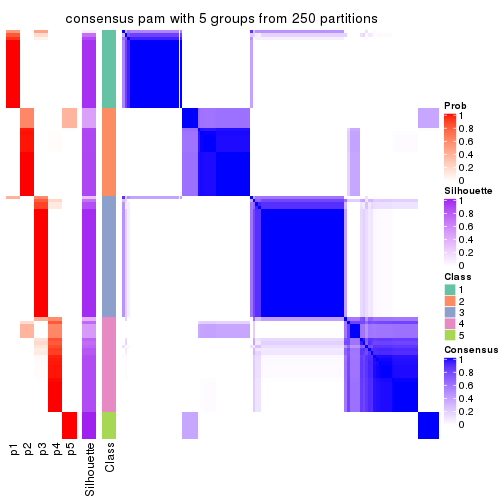</p>

</div>
<div id='tab-ATC-pam-consensus-heatmap-5'>
<pre><code class="r">consensus_heatmap(res, k = 6)
</code></pre>

<p></p>

</div>
</div>

Heatmaps for the membership of samples in all partitions to see how consistent they are:


<script>
$( function() {
	$( '#tabs-ATC-pam-membership-heatmap' ).tabs();
} );
</script>
<div id='tabs-ATC-pam-membership-heatmap'>
<ul>
<li><a href='#tab-ATC-pam-membership-heatmap-1'>k = 2</a></li>
<li><a href='#tab-ATC-pam-membership-heatmap-2'>k = 3</a></li>
<li><a href='#tab-ATC-pam-membership-heatmap-3'>k = 4</a></li>
<li><a href='#tab-ATC-pam-membership-heatmap-4'>k = 5</a></li>
<li><a href='#tab-ATC-pam-membership-heatmap-5'>k = 6</a></li>
</ul>
<div id='tab-ATC-pam-membership-heatmap-1'>
<pre><code class="r">membership_heatmap(res, k = 2)
</code></pre>

<p></p>

</div>
<div id='tab-ATC-pam-membership-heatmap-2'>
<pre><code class="r">membership_heatmap(res, k = 3)
</code></pre>

<p></p>

</div>
<div id='tab-ATC-pam-membership-heatmap-3'>
<pre><code class="r">membership_heatmap(res, k = 4)
</code></pre>

<p>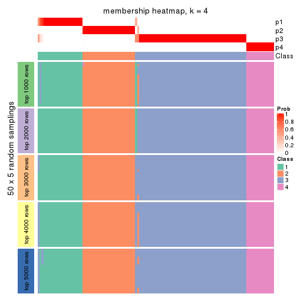</p>

</div>
<div id='tab-ATC-pam-membership-heatmap-4'>
<pre><code class="r">membership_heatmap(res, k = 5)
</code></pre>

<p></p>

</div>
<div id='tab-ATC-pam-membership-heatmap-5'>
<pre><code class="r">membership_heatmap(res, k = 6)
</code></pre>

<p>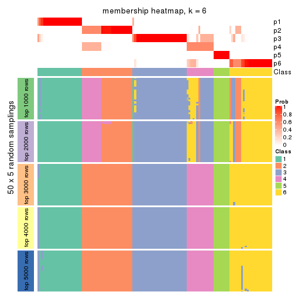</p>

</div>
</div>

As soon as we have had the classes for columns, we can look for signatures
which are significantly different between classes which can be candidate marks
for certain classes. Following are the heatmaps for signatures.


Signature heatmaps where rows are scaled:


<script>
$( function() {
	$( '#tabs-ATC-pam-get-signatures' ).tabs();
} );
</script>
<div id='tabs-ATC-pam-get-signatures'>
<ul>
<li><a href='#tab-ATC-pam-get-signatures-1'>k = 2</a></li>
<li><a href='#tab-ATC-pam-get-signatures-2'>k = 3</a></li>
<li><a href='#tab-ATC-pam-get-signatures-3'>k = 4</a></li>
<li><a href='#tab-ATC-pam-get-signatures-4'>k = 5</a></li>
<li><a href='#tab-ATC-pam-get-signatures-5'>k = 6</a></li>
</ul>
<div id='tab-ATC-pam-get-signatures-1'>
<pre><code class="r">get_signatures(res, k = 2)
</code></pre>

<p></p>

</div>
<div id='tab-ATC-pam-get-signatures-2'>
<pre><code class="r">get_signatures(res, k = 3)
</code></pre>

<p></p>

</div>
<div id='tab-ATC-pam-get-signatures-3'>
<pre><code class="r">get_signatures(res, k = 4)
</code></pre>

<p></p>

</div>
<div id='tab-ATC-pam-get-signatures-4'>
<pre><code class="r">get_signatures(res, k = 5)
</code></pre>

<p>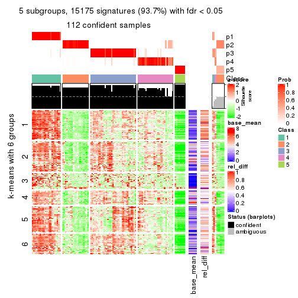</p>

</div>
<div id='tab-ATC-pam-get-signatures-5'>
<pre><code class="r">get_signatures(res, k = 6)
</code></pre>

<p></p>

</div>
</div>


Signature heatmaps where rows are not scaled:


<script>
$( function() {
	$( '#tabs-ATC-pam-get-signatures-no-scale' ).tabs();
} );
</script>
<div id='tabs-ATC-pam-get-signatures-no-scale'>
<ul>
<li><a href='#tab-ATC-pam-get-signatures-no-scale-1'>k = 2</a></li>
<li><a href='#tab-ATC-pam-get-signatures-no-scale-2'>k = 3</a></li>
<li><a href='#tab-ATC-pam-get-signatures-no-scale-3'>k = 4</a></li>
<li><a href='#tab-ATC-pam-get-signatures-no-scale-4'>k = 5</a></li>
<li><a href='#tab-ATC-pam-get-signatures-no-scale-5'>k = 6</a></li>
</ul>
<div id='tab-ATC-pam-get-signatures-no-scale-1'>
<pre><code class="r">get_signatures(res, k = 2, scale_rows = FALSE)
</code></pre>

<p></p>

</div>
<div id='tab-ATC-pam-get-signatures-no-scale-2'>
<pre><code class="r">get_signatures(res, k = 3, scale_rows = FALSE)
</code></pre>

<p></p>

</div>
<div id='tab-ATC-pam-get-signatures-no-scale-3'>
<pre><code class="r">get_signatures(res, k = 4, scale_rows = FALSE)
</code></pre>

<p></p>

</div>
<div id='tab-ATC-pam-get-signatures-no-scale-4'>
<pre><code class="r">get_signatures(res, k = 5, scale_rows = FALSE)
</code></pre>

<p></p>

</div>
<div id='tab-ATC-pam-get-signatures-no-scale-5'>
<pre><code class="r">get_signatures(res, k = 6, scale_rows = FALSE)
</code></pre>

<p></p>

</div>
</div>


Compare the overlap of signatures from different k:

```r
compare_signatures(res)
```


`get_signature()` returns a data frame invisibly. TO get the list of signatures, the function
call should be assigned to a variable explicitly. In following code, if `plot` argument is set
to `FALSE`, no heatmap is plotted while only the differential analysis is performed.

```r
# code only for demonstration
tb = get_signature(res, k = ..., plot = FALSE)
```

An example of the output of `tb` is:

```
#>   which_row         fdr    mean_1    mean_2 scaled_mean_1 scaled_mean_2 km
#> 1        38 0.042760348  8.373488  9.131774    -0.5533452     0.5164555  1
#> 2        40 0.018707592  7.106213  8.469186    -0.6173731     0.5762149  1
#> 3        55 0.019134737 10.221463 11.207825    -0.6159697     0.5749050  1
#> 4        59 0.006059896  5.921854  7.869574    -0.6899429     0.6439467  1
#> 5        60 0.018055526  8.928898 10.211722    -0.6204761     0.5791110  1
#> 6        98 0.009384629 15.714769 14.887706     0.6635654    -0.6193277  2
...
```

The columns in `tb` are:

1. `which_row`: row indices corresponding to the input matrix.
2. `fdr`: FDR for the differential test. 
3. `mean_x`: The mean value in group x.
4. `scaled_mean_x`: The mean value in group x after rows are scaled.
5. `km`: Row groups if k-means clustering is applied to rows.


UMAP plot which shows how samples are separated.


<script>
$( function() {
	$( '#tabs-ATC-pam-dimension-reduction' ).tabs();
} );
</script>
<div id='tabs-ATC-pam-dimension-reduction'>
<ul>
<li><a href='#tab-ATC-pam-dimension-reduction-1'>k = 2</a></li>
<li><a href='#tab-ATC-pam-dimension-reduction-2'>k = 3</a></li>
<li><a href='#tab-ATC-pam-dimension-reduction-3'>k = 4</a></li>
<li><a href='#tab-ATC-pam-dimension-reduction-4'>k = 5</a></li>
<li><a href='#tab-ATC-pam-dimension-reduction-5'>k = 6</a></li>
</ul>
<div id='tab-ATC-pam-dimension-reduction-1'>
<pre><code class="r">dimension_reduction(res, k = 2, method = &quot;UMAP&quot;)
</code></pre>

<p></p>

</div>
<div id='tab-ATC-pam-dimension-reduction-2'>
<pre><code class="r">dimension_reduction(res, k = 3, method = &quot;UMAP&quot;)
</code></pre>

<p></p>

</div>
<div id='tab-ATC-pam-dimension-reduction-3'>
<pre><code class="r">dimension_reduction(res, k = 4, method = &quot;UMAP&quot;)
</code></pre>

<p></p>

</div>
<div id='tab-ATC-pam-dimension-reduction-4'>
<pre><code class="r">dimension_reduction(res, k = 5, method = &quot;UMAP&quot;)
</code></pre>

<p></p>

</div>
<div id='tab-ATC-pam-dimension-reduction-5'>
<pre><code class="r">dimension_reduction(res, k = 6, method = &quot;UMAP&quot;)
</code></pre>

<p></p>

</div>
</div>


Following heatmap shows how subgroups are split when increasing `k`:

```r
collect_classes(res)
```


If matrix rows can be associated to genes, consider to use `functional_enrichment(res,
...)` to perform function enrichment for the signature genes. See [this vignette](http://bioconductor.org/packages/devel/bioc/vignettes/cola/inst/doc/functional_enrichment.html) for more detailed explanations.


 

---------------------------------------------------


### ATC:mclust*


The object with results only for a single top-value method and a single partition method 
can be extracted as:

```r
res = res_list["ATC", "mclust"]
# you can also extract it by
# res = res_list["ATC:mclust"]
```

A summary of `res` and all the functions that can be applied to it:

```r
res
```

```
#> A 'ConsensusPartition' object with k = 2, 3, 4, 5, 6.
#>   On a matrix with 16187 rows and 121 columns.
#>   Top rows (1000, 2000, 3000, 4000, 5000) are extracted by 'ATC' method.
#>   Subgroups are detected by 'mclust' method.
#>   Performed in total 1250 partitions by row resampling.
#>   Best k for subgroups seems to be 4.
#> 
#> Following methods can be applied to this 'ConsensusPartition' object:
#>  [1] "cola_report"             "collect_classes"         "collect_plots"          
#>  [4] "collect_stats"           "colnames"                "compare_signatures"     
#>  [7] "consensus_heatmap"       "dimension_reduction"     "functional_enrichment"  
#> [10] "get_anno_col"            "get_anno"                "get_classes"            
#> [13] "get_consensus"           "get_matrix"              "get_membership"         
#> [16] "get_param"               "get_signatures"          "get_stats"              
#> [19] "is_best_k"               "is_stable_k"             "membership_heatmap"     
#> [22] "ncol"                    "nrow"                    "plot_ecdf"              
#> [25] "rownames"                "select_partition_number" "show"                   
#> [28] "suggest_best_k"          "test_to_known_factors"
```

`collect_plots()` function collects all the plots made from `res` for all `k` (number of partitions)
into one single page to provide an easy and fast comparison between different `k`.

```r
collect_plots(res)
```


The plots are:

- The first row: a plot of the ECDF (empirical cumulative distribution
  function) curves of the consensus matrix for each `k` and the heatmap of
  predicted classes for each `k`.
- The second row: heatmaps of the consensus matrix for each `k`.
- The third row: heatmaps of the membership matrix for each `k`.
- The fouth row: heatmaps of the signatures for each `k`.

All the plots in panels can be made by individual functions and they are
plotted later in this section.

`select_partition_number()` produces several plots showing different
statistics for choosing "optimized" `k`. There are following statistics:

- ECDF curves of the consensus matrix for each `k`;
- 1-PAC. [The PAC
  score](https://en.wikipedia.org/wiki/Consensus_clustering#Over-interpretation_potential_of_consensus_clustering)
  measures the proportion of the ambiguous subgrouping.
- Mean silhouette score.
- Concordance. The mean probability of fiting the consensus class ids in all
  partitions.
- Area increased. Denote $A_k$ as the area under the ECDF curve for current
  `k`, the area increased is defined as $A_k - A_{k-1}$.
- Rand index. The percent of pairs of samples that are both in a same cluster
  or both are not in a same cluster in the partition of k and k-1.
- Jaccard index. The ratio of pairs of samples are both in a same cluster in
  the partition of k and k-1 and the pairs of samples are both in a same
  cluster in the partition k or k-1.

The detailed explanations of these statistics can be found in [the _cola_
vignette](http://bioconductor.org/packages/devel/bioc/vignettes/cola/inst/doc/cola.html#toc_13).

Generally speaking, lower PAC score, higher mean silhouette score or higher
concordance corresponds to better partition. Rand index and Jaccard index
measure how similar the current partition is compared to partition with `k-1`.
If they are too similar, we won't accept `k` is better than `k-1`.

```r
select_partition_number(res)
```


The numeric values for all these statistics can be obtained by `get_stats()`.

```r
get_stats(res)
```

```
#>   k 1-PAC mean_silhouette concordance area_increased  Rand Jaccard
#> 2 2 0.417           0.679       0.814         0.2800 0.890   0.890
#> 3 3 0.795           0.906       0.944         0.9520 0.592   0.542
#> 4 4 0.938           0.913       0.964         0.3085 0.689   0.421
#> 5 5 0.875           0.900       0.912         0.0447 0.952   0.838
#> 6 6 0.838           0.821       0.865         0.0430 0.985   0.944
```

`suggest_best_k()` suggests the best $k$ based on these statistics. The rules are as follows:

- All $k$ with Jaccard index larger than 0.95 are removed because increasing
  $k$ does not provide enough extra information. If all $k$ are removed, it is
  marked as no subgroup is detected.
- For all $k$ with 1-PAC score larger than 0.9, the maximal $k$ is taken as
  the best $k$, and other $k$ are marked as optional $k$.
- If it does not fit the second rule. The $k$ with the maximal vote of the
  highest 1-PAC score, highest mean silhouette, and highest concordance is
  taken as the best $k$.

```r
suggest_best_k(res)
```

```
#> [1] 4
```


Following shows the table of the partitions (You need to click the **show/hide
code output** link to see it). The membership matrix (columns with name `p*`)
is inferred by
[`clue::cl_consensus()`](https://www.rdocumentation.org/link/cl_consensus?package=clue)
function with the `SE` method. Basically the value in the membership matrix
represents the probability to belong to a certain group. The finall class
label for an item is determined with the group with highest probability it
belongs to.

In `get_classes()` function, the entropy is calculated from the membership
matrix and the silhouette score is calculated from the consensus matrix.


<script>
$( function() {
	$( '#tabs-ATC-mclust-get-classes' ).tabs();
} );
</script>
<div id='tabs-ATC-mclust-get-classes'>
<ul>
<li><a href='#tab-ATC-mclust-get-classes-1'>k = 2</a></li>
<li><a href='#tab-ATC-mclust-get-classes-2'>k = 3</a></li>
<li><a href='#tab-ATC-mclust-get-classes-3'>k = 4</a></li>
<li><a href='#tab-ATC-mclust-get-classes-4'>k = 5</a></li>
<li><a href='#tab-ATC-mclust-get-classes-5'>k = 6</a></li>
</ul>

<div id='tab-ATC-mclust-get-classes-1'>
<p><a id='tab-ATC-mclust-get-classes-1-a' style='color:#0366d6' href='#'>show/hide code output</a></p>
<pre><code class="r">cbind(get_classes(res, k = 2), get_membership(res, k = 2))
</code></pre>

<pre><code>#&gt;           class entropy silhouette    p1    p2
#&gt; DRR006374     1  0.0000      0.735 1.000 0.000
#&gt; DRR006375     1  0.7674      0.721 0.776 0.224
#&gt; DRR006376     1  0.9460      0.688 0.636 0.364
#&gt; DRR006377     1  0.9460      0.688 0.636 0.364
#&gt; DRR006378     1  0.2603      0.696 0.956 0.044
#&gt; DRR006379     1  0.9460      0.688 0.636 0.364
#&gt; DRR006380     1  0.2603      0.696 0.956 0.044
#&gt; DRR006381     1  0.3584      0.746 0.932 0.068
#&gt; DRR006382     1  0.2043      0.740 0.968 0.032
#&gt; DRR006383     1  0.9460      0.688 0.636 0.364
#&gt; DRR006384     1  0.5519      0.559 0.872 0.128
#&gt; DRR006385     1  0.4161      0.745 0.916 0.084
#&gt; DRR006386     2  0.9460      1.000 0.364 0.636
#&gt; DRR006387     1  0.9129      0.694 0.672 0.328
#&gt; DRR006388     1  0.0000      0.735 1.000 0.000
#&gt; DRR006389     1  0.0000      0.735 1.000 0.000
#&gt; DRR006390     1  0.9881     -0.554 0.564 0.436
#&gt; DRR006391     1  0.9881     -0.554 0.564 0.436
#&gt; DRR006392     1  0.0000      0.735 1.000 0.000
#&gt; DRR006393     1  0.5408      0.741 0.876 0.124
#&gt; DRR006394     1  0.1633      0.716 0.976 0.024
#&gt; DRR006395     1  0.9460      0.688 0.636 0.364
#&gt; DRR006396     1  0.2778      0.745 0.952 0.048
#&gt; DRR006397     1  0.0000      0.735 1.000 0.000
#&gt; DRR006398     1  0.0000      0.735 1.000 0.000
#&gt; DRR006399     1  0.9460      0.688 0.636 0.364
#&gt; DRR006400     1  0.9460      0.688 0.636 0.364
#&gt; DRR006401     1  0.2603      0.696 0.956 0.044
#&gt; DRR006402     1  0.2603      0.696 0.956 0.044
#&gt; DRR006403     1  0.9460      0.688 0.636 0.364
#&gt; DRR006404     1  0.9460      0.688 0.636 0.364
#&gt; DRR006405     1  0.9460      0.688 0.636 0.364
#&gt; DRR006406     1  0.9460      0.688 0.636 0.364
#&gt; DRR006407     1  0.9460      0.688 0.636 0.364
#&gt; DRR006408     1  0.9460      0.688 0.636 0.364
#&gt; DRR006409     1  0.9460      0.688 0.636 0.364
#&gt; DRR006410     1  0.9460      0.688 0.636 0.364
#&gt; DRR006411     1  0.0672      0.729 0.992 0.008
#&gt; DRR006412     1  0.9323     -0.247 0.652 0.348
#&gt; DRR006413     1  0.7056      0.728 0.808 0.192
#&gt; DRR006414     1  0.9427      0.689 0.640 0.360
#&gt; DRR006415     1  0.9460      0.688 0.636 0.364
#&gt; DRR006416     1  0.0000      0.735 1.000 0.000
#&gt; DRR006417     1  0.9460      0.688 0.636 0.364
#&gt; DRR006418     1  0.4690      0.744 0.900 0.100
#&gt; DRR006419     1  0.7674      0.721 0.776 0.224
#&gt; DRR006420     1  0.3584      0.746 0.932 0.068
#&gt; DRR006421     1  0.9460      0.688 0.636 0.364
#&gt; DRR006422     1  0.0000      0.735 1.000 0.000
#&gt; DRR006423     1  0.2603      0.696 0.956 0.044
#&gt; DRR006424     1  0.0000      0.735 1.000 0.000
#&gt; DRR006425     1  0.2423      0.700 0.960 0.040
#&gt; DRR006426     1  0.4022      0.739 0.920 0.080
#&gt; DRR006427     1  0.9881     -0.554 0.564 0.436
#&gt; DRR006428     1  0.9460      0.688 0.636 0.364
#&gt; DRR006429     1  0.2423      0.700 0.960 0.040
#&gt; DRR006430     1  0.0000      0.735 1.000 0.000
#&gt; DRR006431     1  0.0672      0.738 0.992 0.008
#&gt; DRR006432     1  0.2423      0.742 0.960 0.040
#&gt; DRR006433     1  0.9460      0.688 0.636 0.364
#&gt; DRR006434     1  0.0000      0.735 1.000 0.000
#&gt; DRR006435     2  0.9460      1.000 0.364 0.636
#&gt; DRR006436     2  0.9460      1.000 0.364 0.636
#&gt; DRR006437     1  0.0376      0.737 0.996 0.004
#&gt; DRR006438     1  0.9460      0.688 0.636 0.364
#&gt; DRR006439     1  0.9460      0.688 0.636 0.364
#&gt; DRR006440     1  0.2236      0.740 0.964 0.036
#&gt; DRR006441     1  0.2603      0.696 0.956 0.044
#&gt; DRR006442     1  0.9460      0.688 0.636 0.364
#&gt; DRR006443     1  0.2236      0.740 0.964 0.036
#&gt; DRR006444     2  0.9460      1.000 0.364 0.636
#&gt; DRR006445     1  0.0672      0.738 0.992 0.008
#&gt; DRR006446     1  0.9881     -0.554 0.564 0.436
#&gt; DRR006447     1  0.1414      0.741 0.980 0.020
#&gt; DRR006448     1  0.9460      0.688 0.636 0.364
#&gt; DRR006449     1  0.9129      0.694 0.672 0.328
#&gt; DRR006450     1  0.2423      0.744 0.960 0.040
#&gt; DRR006451     1  0.9460      0.688 0.636 0.364
#&gt; DRR006452     1  0.0672      0.738 0.992 0.008
#&gt; DRR006453     1  0.0938      0.739 0.988 0.012
#&gt; DRR006454     1  0.0000      0.735 1.000 0.000
#&gt; DRR006455     2  0.9460      1.000 0.364 0.636
#&gt; DRR006456     1  0.9460      0.688 0.636 0.364
#&gt; DRR006457     1  0.9460      0.688 0.636 0.364
#&gt; DRR006458     1  0.0000      0.735 1.000 0.000
#&gt; DRR006459     1  0.3114      0.746 0.944 0.056
#&gt; DRR006460     1  0.2603      0.696 0.956 0.044
#&gt; DRR006461     1  0.0938      0.738 0.988 0.012
#&gt; DRR006462     1  0.9129      0.694 0.672 0.328
#&gt; DRR006463     1  0.2236      0.740 0.964 0.036
#&gt; DRR006464     1  0.0672      0.729 0.992 0.008
#&gt; DRR006465     1  0.5842      0.738 0.860 0.140
#&gt; DRR006466     1  0.9460      0.688 0.636 0.364
#&gt; DRR006467     1  0.0000      0.735 1.000 0.000
#&gt; DRR006468     2  0.9460      1.000 0.364 0.636
#&gt; DRR006469     1  0.2603      0.696 0.956 0.044
#&gt; DRR006470     1  0.9460      0.688 0.636 0.364
#&gt; DRR006471     1  0.0000      0.735 1.000 0.000
#&gt; DRR006472     1  0.0000      0.735 1.000 0.000
#&gt; DRR006473     1  0.2603      0.696 0.956 0.044
#&gt; DRR006474     1  0.2603      0.696 0.956 0.044
#&gt; DRR006475     1  0.0000      0.735 1.000 0.000
#&gt; DRR006476     1  0.3733      0.717 0.928 0.072
#&gt; DRR006477     1  0.9460      0.688 0.636 0.364
#&gt; DRR006478     1  0.6531      0.733 0.832 0.168
#&gt; DRR006479     1  0.6048      0.737 0.852 0.148
#&gt; DRR006480     1  0.0000      0.735 1.000 0.000
#&gt; DRR006481     1  0.9460      0.688 0.636 0.364
#&gt; DRR006482     1  0.0000      0.735 1.000 0.000
#&gt; DRR006483     1  0.0000      0.735 1.000 0.000
#&gt; DRR006484     1  0.9460      0.688 0.636 0.364
#&gt; DRR006485     1  0.2236      0.740 0.964 0.036
#&gt; DRR006486     1  0.7453      0.724 0.788 0.212
#&gt; DRR006487     1  0.9460      0.688 0.636 0.364
#&gt; DRR006488     2  0.9460      1.000 0.364 0.636
#&gt; DRR006489     1  0.0000      0.735 1.000 0.000
#&gt; DRR006490     1  0.9427      0.689 0.640 0.360
#&gt; DRR006491     1  0.9460      0.688 0.636 0.364
#&gt; DRR006492     1  0.4022      0.747 0.920 0.080
#&gt; DRR006493     1  0.9460      0.688 0.636 0.364
#&gt; DRR006494     1  0.0000      0.735 1.000 0.000
</code></pre>

<script>
$('#tab-ATC-mclust-get-classes-1-a').parent().next().next().hide();
$('#tab-ATC-mclust-get-classes-1-a').click(function(){
  $('#tab-ATC-mclust-get-classes-1-a').parent().next().next().toggle();
  return(false);
});
</script>
</div>

<div id='tab-ATC-mclust-get-classes-2'>
<p><a id='tab-ATC-mclust-get-classes-2-a' style='color:#0366d6' href='#'>show/hide code output</a></p>
<pre><code class="r">cbind(get_classes(res, k = 3), get_membership(res, k = 3))
</code></pre>

<pre><code>#&gt;           class entropy silhouette    p1    p2    p3
#&gt; DRR006374     3  0.0000      0.913 0.000 0.000 1.000
#&gt; DRR006375     1  0.0000      0.983 1.000 0.000 0.000
#&gt; DRR006376     3  0.1411      0.911 0.036 0.000 0.964
#&gt; DRR006377     3  0.0000      0.913 0.000 0.000 1.000
#&gt; DRR006378     3  0.4842      0.783 0.000 0.224 0.776
#&gt; DRR006379     3  0.1964      0.906 0.056 0.000 0.944
#&gt; DRR006380     3  0.3310      0.899 0.028 0.064 0.908
#&gt; DRR006381     1  0.0000      0.983 1.000 0.000 0.000
#&gt; DRR006382     3  0.0000      0.913 0.000 0.000 1.000
#&gt; DRR006383     3  0.1964      0.901 0.056 0.000 0.944
#&gt; DRR006384     3  0.5138      0.750 0.000 0.252 0.748
#&gt; DRR006385     1  0.0000      0.983 1.000 0.000 0.000
#&gt; DRR006386     2  0.0000      1.000 0.000 1.000 0.000
#&gt; DRR006387     1  0.0237      0.979 0.996 0.000 0.004
#&gt; DRR006388     1  0.0000      0.983 1.000 0.000 0.000
#&gt; DRR006389     1  0.0000      0.983 1.000 0.000 0.000
#&gt; DRR006390     3  0.5948      0.584 0.000 0.360 0.640
#&gt; DRR006391     3  0.5948      0.584 0.000 0.360 0.640
#&gt; DRR006392     1  0.0000      0.983 1.000 0.000 0.000
#&gt; DRR006393     1  0.0000      0.983 1.000 0.000 0.000
#&gt; DRR006394     3  0.1643      0.909 0.044 0.000 0.956
#&gt; DRR006395     3  0.1860      0.907 0.052 0.000 0.948
#&gt; DRR006396     1  0.0000      0.983 1.000 0.000 0.000
#&gt; DRR006397     1  0.0237      0.979 0.996 0.000 0.004
#&gt; DRR006398     1  0.0000      0.983 1.000 0.000 0.000
#&gt; DRR006399     3  0.1964      0.906 0.056 0.000 0.944
#&gt; DRR006400     3  0.1964      0.906 0.056 0.000 0.944
#&gt; DRR006401     3  0.3941      0.834 0.000 0.156 0.844
#&gt; DRR006402     3  0.3941      0.834 0.000 0.156 0.844
#&gt; DRR006403     3  0.1860      0.907 0.052 0.000 0.948
#&gt; DRR006404     3  0.1163      0.912 0.028 0.000 0.972
#&gt; DRR006405     3  0.1964      0.906 0.056 0.000 0.944
#&gt; DRR006406     3  0.1964      0.906 0.056 0.000 0.944
#&gt; DRR006407     3  0.0000      0.913 0.000 0.000 1.000
#&gt; DRR006408     3  0.1964      0.906 0.056 0.000 0.944
#&gt; DRR006409     3  0.2796      0.884 0.092 0.000 0.908
#&gt; DRR006410     1  0.1753      0.924 0.952 0.000 0.048
#&gt; DRR006411     3  0.4189      0.885 0.056 0.068 0.876
#&gt; DRR006412     3  0.5948      0.584 0.000 0.360 0.640
#&gt; DRR006413     1  0.0000      0.983 1.000 0.000 0.000
#&gt; DRR006414     3  0.3879      0.835 0.152 0.000 0.848
#&gt; DRR006415     3  0.0000      0.913 0.000 0.000 1.000
#&gt; DRR006416     1  0.0000      0.983 1.000 0.000 0.000
#&gt; DRR006417     3  0.0000      0.913 0.000 0.000 1.000
#&gt; DRR006418     1  0.0000      0.983 1.000 0.000 0.000
#&gt; DRR006419     1  0.3816      0.766 0.852 0.000 0.148
#&gt; DRR006420     3  0.5968      0.505 0.364 0.000 0.636
#&gt; DRR006421     3  0.0000      0.913 0.000 0.000 1.000
#&gt; DRR006422     3  0.4288      0.883 0.060 0.068 0.872
#&gt; DRR006423     3  0.4842      0.783 0.000 0.224 0.776
#&gt; DRR006424     1  0.0000      0.983 1.000 0.000 0.000
#&gt; DRR006425     3  0.1964      0.906 0.056 0.000 0.944
#&gt; DRR006426     3  0.0000      0.913 0.000 0.000 1.000
#&gt; DRR006427     3  0.5948      0.584 0.000 0.360 0.640
#&gt; DRR006428     3  0.0000      0.913 0.000 0.000 1.000
#&gt; DRR006429     3  0.4189      0.885 0.056 0.068 0.876
#&gt; DRR006430     1  0.0000      0.983 1.000 0.000 0.000
#&gt; DRR006431     1  0.0000      0.983 1.000 0.000 0.000
#&gt; DRR006432     3  0.0237      0.913 0.004 0.000 0.996
#&gt; DRR006433     3  0.0000      0.913 0.000 0.000 1.000
#&gt; DRR006434     3  0.0000      0.913 0.000 0.000 1.000
#&gt; DRR006435     2  0.0000      1.000 0.000 1.000 0.000
#&gt; DRR006436     2  0.0000      1.000 0.000 1.000 0.000
#&gt; DRR006437     1  0.0000      0.983 1.000 0.000 0.000
#&gt; DRR006438     3  0.2261      0.891 0.068 0.000 0.932
#&gt; DRR006439     3  0.0000      0.913 0.000 0.000 1.000
#&gt; DRR006440     3  0.0000      0.913 0.000 0.000 1.000
#&gt; DRR006441     3  0.3412      0.871 0.000 0.124 0.876
#&gt; DRR006442     3  0.0000      0.913 0.000 0.000 1.000
#&gt; DRR006443     3  0.0000      0.913 0.000 0.000 1.000
#&gt; DRR006444     2  0.0000      1.000 0.000 1.000 0.000
#&gt; DRR006445     1  0.0000      0.983 1.000 0.000 0.000
#&gt; DRR006446     3  0.5948      0.584 0.000 0.360 0.640
#&gt; DRR006447     1  0.0000      0.983 1.000 0.000 0.000
#&gt; DRR006448     3  0.2066      0.905 0.060 0.000 0.940
#&gt; DRR006449     1  0.0000      0.983 1.000 0.000 0.000
#&gt; DRR006450     1  0.0000      0.983 1.000 0.000 0.000
#&gt; DRR006451     3  0.1964      0.906 0.056 0.000 0.944
#&gt; DRR006452     1  0.0000      0.983 1.000 0.000 0.000
#&gt; DRR006453     1  0.0000      0.983 1.000 0.000 0.000
#&gt; DRR006454     3  0.4189      0.885 0.056 0.068 0.876
#&gt; DRR006455     2  0.0000      1.000 0.000 1.000 0.000
#&gt; DRR006456     3  0.0000      0.913 0.000 0.000 1.000
#&gt; DRR006457     3  0.0000      0.913 0.000 0.000 1.000
#&gt; DRR006458     1  0.0000      0.983 1.000 0.000 0.000
#&gt; DRR006459     3  0.4931      0.730 0.232 0.000 0.768
#&gt; DRR006460     3  0.3941      0.834 0.000 0.156 0.844
#&gt; DRR006461     3  0.0000      0.913 0.000 0.000 1.000
#&gt; DRR006462     1  0.0000      0.983 1.000 0.000 0.000
#&gt; DRR006463     3  0.0000      0.913 0.000 0.000 1.000
#&gt; DRR006464     3  0.4189      0.885 0.056 0.068 0.876
#&gt; DRR006465     1  0.0000      0.983 1.000 0.000 0.000
#&gt; DRR006466     3  0.0000      0.913 0.000 0.000 1.000
#&gt; DRR006467     1  0.0000      0.983 1.000 0.000 0.000
#&gt; DRR006468     2  0.0000      1.000 0.000 1.000 0.000
#&gt; DRR006469     3  0.3412      0.871 0.000 0.124 0.876
#&gt; DRR006470     3  0.0424      0.913 0.008 0.000 0.992
#&gt; DRR006471     1  0.0000      0.983 1.000 0.000 0.000
#&gt; DRR006472     3  0.1753      0.908 0.048 0.000 0.952
#&gt; DRR006473     3  0.4842      0.783 0.000 0.224 0.776
#&gt; DRR006474     3  0.3619      0.864 0.000 0.136 0.864
#&gt; DRR006475     1  0.0000      0.983 1.000 0.000 0.000
#&gt; DRR006476     3  0.1860      0.907 0.052 0.000 0.948
#&gt; DRR006477     3  0.0000      0.913 0.000 0.000 1.000
#&gt; DRR006478     1  0.0000      0.983 1.000 0.000 0.000
#&gt; DRR006479     3  0.3412      0.862 0.124 0.000 0.876
#&gt; DRR006480     1  0.0000      0.983 1.000 0.000 0.000
#&gt; DRR006481     3  0.0000      0.913 0.000 0.000 1.000
#&gt; DRR006482     1  0.1411      0.939 0.964 0.000 0.036
#&gt; DRR006483     1  0.0237      0.979 0.996 0.000 0.004
#&gt; DRR006484     3  0.0000      0.913 0.000 0.000 1.000
#&gt; DRR006485     3  0.0000      0.913 0.000 0.000 1.000
#&gt; DRR006486     1  0.0000      0.983 1.000 0.000 0.000
#&gt; DRR006487     3  0.0000      0.913 0.000 0.000 1.000
#&gt; DRR006488     2  0.0000      1.000 0.000 1.000 0.000
#&gt; DRR006489     1  0.0000      0.983 1.000 0.000 0.000
#&gt; DRR006490     3  0.2261      0.891 0.068 0.000 0.932
#&gt; DRR006491     3  0.1289      0.908 0.032 0.000 0.968
#&gt; DRR006492     1  0.1643      0.930 0.956 0.000 0.044
#&gt; DRR006493     3  0.0000      0.913 0.000 0.000 1.000
#&gt; DRR006494     1  0.4002      0.750 0.840 0.000 0.160
</code></pre>

<script>
$('#tab-ATC-mclust-get-classes-2-a').parent().next().next().hide();
$('#tab-ATC-mclust-get-classes-2-a').click(function(){
  $('#tab-ATC-mclust-get-classes-2-a').parent().next().next().toggle();
  return(false);
});
</script>
</div>

<div id='tab-ATC-mclust-get-classes-3'>
<p><a id='tab-ATC-mclust-get-classes-3-a' style='color:#0366d6' href='#'>show/hide code output</a></p>
<pre><code class="r">cbind(get_classes(res, k = 4), get_membership(res, k = 4))
</code></pre>

<pre><code>#&gt;           class entropy silhouette    p1    p2    p3    p4
#&gt; DRR006374     2  0.4804      0.472 0.000 0.616 0.384 0.000
#&gt; DRR006375     1  0.0000      0.987 1.000 0.000 0.000 0.000
#&gt; DRR006376     4  0.0000      0.977 0.000 0.000 0.000 1.000
#&gt; DRR006377     3  0.4925      0.250 0.000 0.000 0.572 0.428
#&gt; DRR006378     2  0.0000      0.889 0.000 1.000 0.000 0.000
#&gt; DRR006379     4  0.0000      0.977 0.000 0.000 0.000 1.000
#&gt; DRR006380     2  0.0000      0.889 0.000 1.000 0.000 0.000
#&gt; DRR006381     1  0.0000      0.987 1.000 0.000 0.000 0.000
#&gt; DRR006382     3  0.0000      0.965 0.000 0.000 1.000 0.000
#&gt; DRR006383     3  0.0000      0.965 0.000 0.000 1.000 0.000
#&gt; DRR006384     2  0.0000      0.889 0.000 1.000 0.000 0.000
#&gt; DRR006385     1  0.0000      0.987 1.000 0.000 0.000 0.000
#&gt; DRR006386     2  0.0000      0.889 0.000 1.000 0.000 0.000
#&gt; DRR006387     1  0.0000      0.987 1.000 0.000 0.000 0.000
#&gt; DRR006388     1  0.0000      0.987 1.000 0.000 0.000 0.000
#&gt; DRR006389     1  0.0000      0.987 1.000 0.000 0.000 0.000
#&gt; DRR006390     2  0.0000      0.889 0.000 1.000 0.000 0.000
#&gt; DRR006391     2  0.0000      0.889 0.000 1.000 0.000 0.000
#&gt; DRR006392     1  0.0000      0.987 1.000 0.000 0.000 0.000
#&gt; DRR006393     1  0.0000      0.987 1.000 0.000 0.000 0.000
#&gt; DRR006394     2  0.4713      0.517 0.000 0.640 0.360 0.000
#&gt; DRR006395     4  0.3873      0.671 0.000 0.000 0.228 0.772
#&gt; DRR006396     1  0.0000      0.987 1.000 0.000 0.000 0.000
#&gt; DRR006397     1  0.0000      0.987 1.000 0.000 0.000 0.000
#&gt; DRR006398     1  0.0000      0.987 1.000 0.000 0.000 0.000
#&gt; DRR006399     4  0.0000      0.977 0.000 0.000 0.000 1.000
#&gt; DRR006400     4  0.0000      0.977 0.000 0.000 0.000 1.000
#&gt; DRR006401     2  0.0000      0.889 0.000 1.000 0.000 0.000
#&gt; DRR006402     2  0.0000      0.889 0.000 1.000 0.000 0.000
#&gt; DRR006403     4  0.0000      0.977 0.000 0.000 0.000 1.000
#&gt; DRR006404     4  0.0000      0.977 0.000 0.000 0.000 1.000
#&gt; DRR006405     4  0.0000      0.977 0.000 0.000 0.000 1.000
#&gt; DRR006406     4  0.0000      0.977 0.000 0.000 0.000 1.000
#&gt; DRR006407     4  0.0000      0.977 0.000 0.000 0.000 1.000
#&gt; DRR006408     4  0.0000      0.977 0.000 0.000 0.000 1.000
#&gt; DRR006409     3  0.0000      0.965 0.000 0.000 1.000 0.000
#&gt; DRR006410     1  0.0000      0.987 1.000 0.000 0.000 0.000
#&gt; DRR006411     1  0.0336      0.979 0.992 0.000 0.008 0.000
#&gt; DRR006412     2  0.0000      0.889 0.000 1.000 0.000 0.000
#&gt; DRR006413     1  0.0000      0.987 1.000 0.000 0.000 0.000
#&gt; DRR006414     1  0.4855      0.310 0.600 0.000 0.400 0.000
#&gt; DRR006415     3  0.0000      0.965 0.000 0.000 1.000 0.000
#&gt; DRR006416     1  0.0000      0.987 1.000 0.000 0.000 0.000
#&gt; DRR006417     3  0.0000      0.965 0.000 0.000 1.000 0.000
#&gt; DRR006418     1  0.0000      0.987 1.000 0.000 0.000 0.000
#&gt; DRR006419     1  0.0000      0.987 1.000 0.000 0.000 0.000
#&gt; DRR006420     1  0.0188      0.983 0.996 0.000 0.004 0.000
#&gt; DRR006421     3  0.0000      0.965 0.000 0.000 1.000 0.000
#&gt; DRR006422     1  0.0000      0.987 1.000 0.000 0.000 0.000
#&gt; DRR006423     2  0.0000      0.889 0.000 1.000 0.000 0.000
#&gt; DRR006424     1  0.0000      0.987 1.000 0.000 0.000 0.000
#&gt; DRR006425     2  0.5874      0.514 0.008 0.616 0.344 0.032
#&gt; DRR006426     3  0.0000      0.965 0.000 0.000 1.000 0.000
#&gt; DRR006427     2  0.0000      0.889 0.000 1.000 0.000 0.000
#&gt; DRR006428     3  0.0000      0.965 0.000 0.000 1.000 0.000
#&gt; DRR006429     2  0.6222      0.539 0.080 0.616 0.304 0.000
#&gt; DRR006430     1  0.0000      0.987 1.000 0.000 0.000 0.000
#&gt; DRR006431     1  0.0000      0.987 1.000 0.000 0.000 0.000
#&gt; DRR006432     3  0.0336      0.957 0.008 0.000 0.992 0.000
#&gt; DRR006433     3  0.0000      0.965 0.000 0.000 1.000 0.000
#&gt; DRR006434     2  0.4804      0.472 0.000 0.616 0.384 0.000
#&gt; DRR006435     2  0.0000      0.889 0.000 1.000 0.000 0.000
#&gt; DRR006436     2  0.0000      0.889 0.000 1.000 0.000 0.000
#&gt; DRR006437     1  0.0000      0.987 1.000 0.000 0.000 0.000
#&gt; DRR006438     3  0.0000      0.965 0.000 0.000 1.000 0.000
#&gt; DRR006439     3  0.0000      0.965 0.000 0.000 1.000 0.000
#&gt; DRR006440     3  0.0000      0.965 0.000 0.000 1.000 0.000
#&gt; DRR006441     2  0.0000      0.889 0.000 1.000 0.000 0.000
#&gt; DRR006442     3  0.0000      0.965 0.000 0.000 1.000 0.000
#&gt; DRR006443     3  0.0000      0.965 0.000 0.000 1.000 0.000
#&gt; DRR006444     2  0.0000      0.889 0.000 1.000 0.000 0.000
#&gt; DRR006445     1  0.0000      0.987 1.000 0.000 0.000 0.000
#&gt; DRR006446     2  0.0000      0.889 0.000 1.000 0.000 0.000
#&gt; DRR006447     1  0.0000      0.987 1.000 0.000 0.000 0.000
#&gt; DRR006448     4  0.0188      0.973 0.004 0.000 0.000 0.996
#&gt; DRR006449     1  0.0000      0.987 1.000 0.000 0.000 0.000
#&gt; DRR006450     1  0.0000      0.987 1.000 0.000 0.000 0.000
#&gt; DRR006451     4  0.0000      0.977 0.000 0.000 0.000 1.000
#&gt; DRR006452     1  0.0000      0.987 1.000 0.000 0.000 0.000
#&gt; DRR006453     1  0.0000      0.987 1.000 0.000 0.000 0.000
#&gt; DRR006454     1  0.0000      0.987 1.000 0.000 0.000 0.000
#&gt; DRR006455     2  0.0000      0.889 0.000 1.000 0.000 0.000
#&gt; DRR006456     3  0.0000      0.965 0.000 0.000 1.000 0.000
#&gt; DRR006457     3  0.0000      0.965 0.000 0.000 1.000 0.000
#&gt; DRR006458     1  0.0000      0.987 1.000 0.000 0.000 0.000
#&gt; DRR006459     1  0.2011      0.892 0.920 0.000 0.080 0.000
#&gt; DRR006460     2  0.0000      0.889 0.000 1.000 0.000 0.000
#&gt; DRR006461     3  0.1302      0.919 0.000 0.044 0.956 0.000
#&gt; DRR006462     1  0.0000      0.987 1.000 0.000 0.000 0.000
#&gt; DRR006463     3  0.0000      0.965 0.000 0.000 1.000 0.000
#&gt; DRR006464     2  0.6695      0.541 0.220 0.616 0.164 0.000
#&gt; DRR006465     1  0.0000      0.987 1.000 0.000 0.000 0.000
#&gt; DRR006466     3  0.0000      0.965 0.000 0.000 1.000 0.000
#&gt; DRR006467     1  0.0000      0.987 1.000 0.000 0.000 0.000
#&gt; DRR006468     2  0.0000      0.889 0.000 1.000 0.000 0.000
#&gt; DRR006469     2  0.0000      0.889 0.000 1.000 0.000 0.000
#&gt; DRR006470     3  0.0000      0.965 0.000 0.000 1.000 0.000
#&gt; DRR006471     1  0.0000      0.987 1.000 0.000 0.000 0.000
#&gt; DRR006472     3  0.4193      0.595 0.268 0.000 0.732 0.000
#&gt; DRR006473     2  0.0000      0.889 0.000 1.000 0.000 0.000
#&gt; DRR006474     2  0.0000      0.889 0.000 1.000 0.000 0.000
#&gt; DRR006475     1  0.0000      0.987 1.000 0.000 0.000 0.000
#&gt; DRR006476     2  0.4804      0.472 0.000 0.616 0.384 0.000
#&gt; DRR006477     3  0.0000      0.965 0.000 0.000 1.000 0.000
#&gt; DRR006478     1  0.0000      0.987 1.000 0.000 0.000 0.000
#&gt; DRR006479     3  0.3219      0.750 0.164 0.000 0.836 0.000
#&gt; DRR006480     1  0.0000      0.987 1.000 0.000 0.000 0.000
#&gt; DRR006481     3  0.0000      0.965 0.000 0.000 1.000 0.000
#&gt; DRR006482     1  0.0000      0.987 1.000 0.000 0.000 0.000
#&gt; DRR006483     1  0.0000      0.987 1.000 0.000 0.000 0.000
#&gt; DRR006484     3  0.0000      0.965 0.000 0.000 1.000 0.000
#&gt; DRR006485     3  0.0000      0.965 0.000 0.000 1.000 0.000
#&gt; DRR006486     1  0.0000      0.987 1.000 0.000 0.000 0.000
#&gt; DRR006487     3  0.0000      0.965 0.000 0.000 1.000 0.000
#&gt; DRR006488     2  0.0000      0.889 0.000 1.000 0.000 0.000
#&gt; DRR006489     1  0.0000      0.987 1.000 0.000 0.000 0.000
#&gt; DRR006490     3  0.0000      0.965 0.000 0.000 1.000 0.000
#&gt; DRR006491     3  0.0000      0.965 0.000 0.000 1.000 0.000
#&gt; DRR006492     1  0.0000      0.987 1.000 0.000 0.000 0.000
#&gt; DRR006493     3  0.0000      0.965 0.000 0.000 1.000 0.000
#&gt; DRR006494     1  0.0000      0.987 1.000 0.000 0.000 0.000
</code></pre>

<script>
$('#tab-ATC-mclust-get-classes-3-a').parent().next().next().hide();
$('#tab-ATC-mclust-get-classes-3-a').click(function(){
  $('#tab-ATC-mclust-get-classes-3-a').parent().next().next().toggle();
  return(false);
});
</script>
</div>

<div id='tab-ATC-mclust-get-classes-4'>
<p><a id='tab-ATC-mclust-get-classes-4-a' style='color:#0366d6' href='#'>show/hide code output</a></p>
<pre><code class="r">cbind(get_classes(res, k = 5), get_membership(res, k = 5))
</code></pre>

<pre><code>#&gt;           class entropy silhouette    p1    p2    p3    p4    p5
#&gt; DRR006374     2  0.3304      0.687 0.000 0.816 0.168 0.000 0.016
#&gt; DRR006375     1  0.1774      0.947 0.932 0.000 0.016 0.000 0.052
#&gt; DRR006376     4  0.0000      0.976 0.000 0.000 0.000 1.000 0.000
#&gt; DRR006377     3  0.4199      0.851 0.000 0.000 0.764 0.056 0.180
#&gt; DRR006378     2  0.0000      0.921 0.000 1.000 0.000 0.000 0.000
#&gt; DRR006379     4  0.0324      0.976 0.000 0.000 0.004 0.992 0.004
#&gt; DRR006380     2  0.0854      0.915 0.000 0.976 0.004 0.008 0.012
#&gt; DRR006381     1  0.1557      0.941 0.940 0.000 0.008 0.000 0.052
#&gt; DRR006382     3  0.1990      0.839 0.004 0.068 0.920 0.000 0.008
#&gt; DRR006383     3  0.0162      0.858 0.004 0.000 0.996 0.000 0.000
#&gt; DRR006384     2  0.0671      0.920 0.000 0.980 0.004 0.000 0.016
#&gt; DRR006385     1  0.1557      0.941 0.940 0.000 0.008 0.000 0.052
#&gt; DRR006386     5  0.3857      1.000 0.000 0.312 0.000 0.000 0.688
#&gt; DRR006387     1  0.0898      0.953 0.972 0.000 0.020 0.000 0.008
#&gt; DRR006388     1  0.0865      0.950 0.972 0.000 0.004 0.000 0.024
#&gt; DRR006389     1  0.0865      0.950 0.972 0.000 0.004 0.000 0.024
#&gt; DRR006390     2  0.0451      0.918 0.008 0.988 0.000 0.000 0.004
#&gt; DRR006391     2  0.0451      0.918 0.008 0.988 0.000 0.000 0.004
#&gt; DRR006392     1  0.1544      0.943 0.932 0.000 0.000 0.000 0.068
#&gt; DRR006393     1  0.1251      0.953 0.956 0.000 0.008 0.000 0.036
#&gt; DRR006394     2  0.2805      0.786 0.000 0.872 0.108 0.008 0.012
#&gt; DRR006395     4  0.2339      0.847 0.000 0.004 0.100 0.892 0.004
#&gt; DRR006396     1  0.1701      0.942 0.936 0.000 0.016 0.000 0.048
#&gt; DRR006397     1  0.0451      0.952 0.988 0.000 0.004 0.008 0.000
#&gt; DRR006398     1  0.0451      0.952 0.988 0.000 0.004 0.008 0.000
#&gt; DRR006399     4  0.0000      0.976 0.000 0.000 0.000 1.000 0.000
#&gt; DRR006400     4  0.0000      0.976 0.000 0.000 0.000 1.000 0.000
#&gt; DRR006401     2  0.0671      0.920 0.000 0.980 0.004 0.000 0.016
#&gt; DRR006402     2  0.0671      0.920 0.000 0.980 0.004 0.000 0.016
#&gt; DRR006403     4  0.0000      0.976 0.000 0.000 0.000 1.000 0.000
#&gt; DRR006404     4  0.0000      0.976 0.000 0.000 0.000 1.000 0.000
#&gt; DRR006405     4  0.0613      0.974 0.000 0.004 0.008 0.984 0.004
#&gt; DRR006406     4  0.0613      0.974 0.000 0.004 0.008 0.984 0.004
#&gt; DRR006407     4  0.0981      0.961 0.000 0.012 0.008 0.972 0.008
#&gt; DRR006408     4  0.0693      0.964 0.000 0.012 0.000 0.980 0.008
#&gt; DRR006409     3  0.2729      0.870 0.008 0.004 0.876 0.004 0.108
#&gt; DRR006410     1  0.0798      0.954 0.976 0.000 0.016 0.008 0.000
#&gt; DRR006411     1  0.4118      0.716 0.772 0.188 0.032 0.008 0.000
#&gt; DRR006412     2  0.0451      0.918 0.008 0.988 0.000 0.000 0.004
#&gt; DRR006413     1  0.2054      0.937 0.920 0.000 0.028 0.000 0.052
#&gt; DRR006414     3  0.3366      0.573 0.232 0.000 0.768 0.000 0.000
#&gt; DRR006415     3  0.0162      0.858 0.004 0.000 0.996 0.000 0.000
#&gt; DRR006416     1  0.0451      0.952 0.988 0.000 0.004 0.008 0.000
#&gt; DRR006417     3  0.0162      0.858 0.004 0.000 0.996 0.000 0.000
#&gt; DRR006418     1  0.0510      0.954 0.984 0.000 0.016 0.000 0.000
#&gt; DRR006419     1  0.1608      0.931 0.928 0.000 0.072 0.000 0.000
#&gt; DRR006420     1  0.2771      0.878 0.860 0.000 0.128 0.000 0.012
#&gt; DRR006421     3  0.3492      0.863 0.000 0.000 0.796 0.016 0.188
#&gt; DRR006422     1  0.1243      0.947 0.960 0.004 0.028 0.008 0.000
#&gt; DRR006423     2  0.0162      0.920 0.000 0.996 0.000 0.000 0.004
#&gt; DRR006424     1  0.1478      0.944 0.936 0.000 0.000 0.000 0.064
#&gt; DRR006425     2  0.3279      0.807 0.004 0.868 0.064 0.052 0.012
#&gt; DRR006426     3  0.0162      0.858 0.004 0.000 0.996 0.000 0.000
#&gt; DRR006427     2  0.0162      0.920 0.000 0.996 0.000 0.000 0.004
#&gt; DRR006428     3  0.2966      0.867 0.000 0.000 0.816 0.000 0.184
#&gt; DRR006429     2  0.2938      0.808 0.048 0.880 0.064 0.008 0.000
#&gt; DRR006430     1  0.1544      0.943 0.932 0.000 0.000 0.000 0.068
#&gt; DRR006431     1  0.2046      0.944 0.916 0.000 0.016 0.000 0.068
#&gt; DRR006432     3  0.0162      0.858 0.004 0.000 0.996 0.000 0.000
#&gt; DRR006433     3  0.4133      0.853 0.000 0.000 0.768 0.052 0.180
#&gt; DRR006434     3  0.4767      0.311 0.000 0.420 0.560 0.000 0.020
#&gt; DRR006435     5  0.3857      1.000 0.000 0.312 0.000 0.000 0.688
#&gt; DRR006436     5  0.3857      1.000 0.000 0.312 0.000 0.000 0.688
#&gt; DRR006437     1  0.1701      0.942 0.936 0.000 0.016 0.000 0.048
#&gt; DRR006438     3  0.0162      0.858 0.004 0.000 0.996 0.000 0.000
#&gt; DRR006439     3  0.2179      0.870 0.004 0.000 0.896 0.000 0.100
#&gt; DRR006440     3  0.3988      0.853 0.000 0.036 0.768 0.000 0.196
#&gt; DRR006441     2  0.0451      0.918 0.008 0.988 0.000 0.004 0.000
#&gt; DRR006442     3  0.0162      0.858 0.004 0.000 0.996 0.000 0.000
#&gt; DRR006443     3  0.3988      0.853 0.000 0.036 0.768 0.000 0.196
#&gt; DRR006444     5  0.3857      1.000 0.000 0.312 0.000 0.000 0.688
#&gt; DRR006445     1  0.1270      0.939 0.948 0.000 0.000 0.000 0.052
#&gt; DRR006446     2  0.0451      0.918 0.008 0.988 0.000 0.000 0.004
#&gt; DRR006447     1  0.0798      0.953 0.976 0.000 0.008 0.000 0.016
#&gt; DRR006448     4  0.0486      0.975 0.004 0.000 0.004 0.988 0.004
#&gt; DRR006449     1  0.0932      0.953 0.972 0.000 0.020 0.004 0.004
#&gt; DRR006450     1  0.1557      0.941 0.940 0.000 0.008 0.000 0.052
#&gt; DRR006451     4  0.0324      0.976 0.000 0.000 0.004 0.992 0.004
#&gt; DRR006452     1  0.1557      0.941 0.940 0.000 0.008 0.000 0.052
#&gt; DRR006453     1  0.0290      0.952 0.992 0.000 0.000 0.000 0.008
#&gt; DRR006454     1  0.1455      0.941 0.952 0.032 0.008 0.008 0.000
#&gt; DRR006455     5  0.3857      1.000 0.000 0.312 0.000 0.000 0.688
#&gt; DRR006456     3  0.2966      0.867 0.000 0.000 0.816 0.000 0.184
#&gt; DRR006457     3  0.3282      0.865 0.000 0.000 0.804 0.008 0.188
#&gt; DRR006458     1  0.1478      0.943 0.936 0.000 0.000 0.000 0.064
#&gt; DRR006459     1  0.2770      0.914 0.880 0.000 0.076 0.000 0.044
#&gt; DRR006460     2  0.0671      0.920 0.000 0.980 0.004 0.000 0.016
#&gt; DRR006461     3  0.4101      0.850 0.000 0.048 0.768 0.000 0.184
#&gt; DRR006462     1  0.0898      0.953 0.972 0.000 0.020 0.000 0.008
#&gt; DRR006463     3  0.3988      0.853 0.000 0.036 0.768 0.000 0.196
#&gt; DRR006464     2  0.3620      0.737 0.048 0.832 0.112 0.008 0.000
#&gt; DRR006465     1  0.0898      0.954 0.972 0.000 0.008 0.000 0.020
#&gt; DRR006466     3  0.4106      0.854 0.000 0.028 0.768 0.008 0.196
#&gt; DRR006467     1  0.1830      0.944 0.924 0.000 0.008 0.000 0.068
#&gt; DRR006468     5  0.3857      1.000 0.000 0.312 0.000 0.000 0.688
#&gt; DRR006469     2  0.0162      0.921 0.000 0.996 0.000 0.004 0.000
#&gt; DRR006470     3  0.0162      0.858 0.004 0.000 0.996 0.000 0.000
#&gt; DRR006471     1  0.1981      0.943 0.920 0.000 0.016 0.000 0.064
#&gt; DRR006472     3  0.1186      0.849 0.020 0.008 0.964 0.008 0.000
#&gt; DRR006473     2  0.0486      0.920 0.004 0.988 0.004 0.000 0.004
#&gt; DRR006474     2  0.0162      0.922 0.000 0.996 0.000 0.000 0.004
#&gt; DRR006475     1  0.1981      0.943 0.920 0.000 0.016 0.000 0.064
#&gt; DRR006476     3  0.5182      0.344 0.012 0.404 0.564 0.008 0.012
#&gt; DRR006477     3  0.3841      0.857 0.000 0.000 0.780 0.032 0.188
#&gt; DRR006478     1  0.1557      0.948 0.940 0.000 0.008 0.000 0.052
#&gt; DRR006479     3  0.2233      0.765 0.104 0.000 0.892 0.000 0.004
#&gt; DRR006480     1  0.1981      0.943 0.920 0.000 0.016 0.000 0.064
#&gt; DRR006481     3  0.3282      0.865 0.000 0.000 0.804 0.008 0.188
#&gt; DRR006482     1  0.0566      0.952 0.984 0.000 0.004 0.000 0.012
#&gt; DRR006483     1  0.2171      0.940 0.912 0.000 0.024 0.000 0.064
#&gt; DRR006484     3  0.2966      0.867 0.000 0.000 0.816 0.000 0.184
#&gt; DRR006485     3  0.3988      0.853 0.000 0.036 0.768 0.000 0.196
#&gt; DRR006486     1  0.1557      0.943 0.940 0.000 0.052 0.000 0.008
#&gt; DRR006487     3  0.0162      0.858 0.004 0.000 0.996 0.000 0.000
#&gt; DRR006488     5  0.3857      1.000 0.000 0.312 0.000 0.000 0.688
#&gt; DRR006489     1  0.0693      0.953 0.980 0.000 0.008 0.000 0.012
#&gt; DRR006490     3  0.0162      0.858 0.004 0.000 0.996 0.000 0.000
#&gt; DRR006491     3  0.0162      0.858 0.004 0.000 0.996 0.000 0.000
#&gt; DRR006492     1  0.0992      0.954 0.968 0.000 0.008 0.000 0.024
#&gt; DRR006493     3  0.3123      0.867 0.004 0.000 0.812 0.000 0.184
#&gt; DRR006494     1  0.2795      0.920 0.880 0.000 0.056 0.000 0.064
</code></pre>

<script>
$('#tab-ATC-mclust-get-classes-4-a').parent().next().next().hide();
$('#tab-ATC-mclust-get-classes-4-a').click(function(){
  $('#tab-ATC-mclust-get-classes-4-a').parent().next().next().toggle();
  return(false);
});
</script>
</div>

<div id='tab-ATC-mclust-get-classes-5'>
<p><a id='tab-ATC-mclust-get-classes-5-a' style='color:#0366d6' href='#'>show/hide code output</a></p>
<pre><code class="r">cbind(get_classes(res, k = 6), get_membership(res, k = 6))
</code></pre>

<pre><code>#&gt;           class entropy silhouette    p1    p2    p3    p4    p5 p6
#&gt; DRR006374     2  0.2302      0.809 0.000 0.872 0.120 0.000 0.000 NA
#&gt; DRR006375     1  0.3337      0.774 0.736 0.000 0.004 0.000 0.000 NA
#&gt; DRR006376     4  0.0260      0.973 0.000 0.008 0.000 0.992 0.000 NA
#&gt; DRR006377     3  0.0520      0.810 0.000 0.000 0.984 0.008 0.000 NA
#&gt; DRR006378     2  0.0000      0.927 0.000 1.000 0.000 0.000 0.000 NA
#&gt; DRR006379     4  0.0260      0.973 0.000 0.008 0.000 0.992 0.000 NA
#&gt; DRR006380     2  0.0000      0.927 0.000 1.000 0.000 0.000 0.000 NA
#&gt; DRR006381     1  0.2190      0.822 0.900 0.000 0.000 0.000 0.040 NA
#&gt; DRR006382     3  0.2451      0.785 0.000 0.068 0.888 0.004 0.000 NA
#&gt; DRR006383     3  0.4189      0.676 0.004 0.000 0.552 0.008 0.000 NA
#&gt; DRR006384     2  0.0000      0.927 0.000 1.000 0.000 0.000 0.000 NA
#&gt; DRR006385     1  0.1865      0.832 0.920 0.000 0.000 0.000 0.040 NA
#&gt; DRR006386     5  0.1007      1.000 0.000 0.044 0.000 0.000 0.956 NA
#&gt; DRR006387     1  0.1049      0.851 0.960 0.008 0.000 0.032 0.000 NA
#&gt; DRR006388     1  0.1245      0.845 0.952 0.000 0.000 0.000 0.016 NA
#&gt; DRR006389     1  0.1245      0.845 0.952 0.000 0.000 0.000 0.016 NA
#&gt; DRR006390     2  0.0000      0.927 0.000 1.000 0.000 0.000 0.000 NA
#&gt; DRR006391     2  0.0000      0.927 0.000 1.000 0.000 0.000 0.000 NA
#&gt; DRR006392     1  0.3547      0.731 0.668 0.000 0.000 0.000 0.000 NA
#&gt; DRR006393     1  0.1765      0.844 0.904 0.000 0.000 0.000 0.000 NA
#&gt; DRR006394     2  0.0000      0.927 0.000 1.000 0.000 0.000 0.000 NA
#&gt; DRR006395     4  0.2400      0.809 0.000 0.008 0.116 0.872 0.000 NA
#&gt; DRR006396     1  0.1865      0.832 0.920 0.000 0.000 0.000 0.040 NA
#&gt; DRR006397     1  0.0520      0.852 0.984 0.000 0.000 0.000 0.008 NA
#&gt; DRR006398     1  0.0520      0.852 0.984 0.000 0.000 0.000 0.008 NA
#&gt; DRR006399     4  0.0260      0.973 0.000 0.008 0.000 0.992 0.000 NA
#&gt; DRR006400     4  0.0260      0.973 0.000 0.008 0.000 0.992 0.000 NA
#&gt; DRR006401     2  0.0000      0.927 0.000 1.000 0.000 0.000 0.000 NA
#&gt; DRR006402     2  0.0000      0.927 0.000 1.000 0.000 0.000 0.000 NA
#&gt; DRR006403     4  0.0260      0.973 0.000 0.008 0.000 0.992 0.000 NA
#&gt; DRR006404     4  0.0260      0.973 0.000 0.008 0.000 0.992 0.000 NA
#&gt; DRR006405     4  0.0665      0.966 0.008 0.008 0.004 0.980 0.000 NA
#&gt; DRR006406     4  0.0260      0.973 0.000 0.008 0.000 0.992 0.000 NA
#&gt; DRR006407     4  0.0405      0.971 0.000 0.008 0.004 0.988 0.000 NA
#&gt; DRR006408     4  0.0363      0.971 0.000 0.012 0.000 0.988 0.000 NA
#&gt; DRR006409     3  0.1498      0.808 0.028 0.000 0.940 0.000 0.000 NA
#&gt; DRR006410     1  0.1049      0.851 0.960 0.008 0.000 0.032 0.000 NA
#&gt; DRR006411     1  0.4741      0.430 0.600 0.344 0.052 0.000 0.004 NA
#&gt; DRR006412     2  0.0000      0.927 0.000 1.000 0.000 0.000 0.000 NA
#&gt; DRR006413     1  0.2190      0.822 0.900 0.000 0.000 0.000 0.040 NA
#&gt; DRR006414     3  0.5659      0.575 0.168 0.000 0.496 0.000 0.000 NA
#&gt; DRR006415     3  0.4147      0.676 0.000 0.000 0.552 0.012 0.000 NA
#&gt; DRR006416     1  0.0405      0.852 0.988 0.000 0.000 0.000 0.004 NA
#&gt; DRR006417     3  0.4147      0.676 0.000 0.000 0.552 0.012 0.000 NA
#&gt; DRR006418     1  0.0000      0.852 1.000 0.000 0.000 0.000 0.000 NA
#&gt; DRR006419     1  0.1367      0.846 0.944 0.000 0.044 0.000 0.000 NA
#&gt; DRR006420     1  0.4022      0.622 0.708 0.000 0.252 0.000 0.000 NA
#&gt; DRR006421     3  0.0146      0.812 0.000 0.000 0.996 0.004 0.000 NA
#&gt; DRR006422     1  0.1370      0.849 0.948 0.012 0.036 0.004 0.000 NA
#&gt; DRR006423     2  0.0000      0.927 0.000 1.000 0.000 0.000 0.000 NA
#&gt; DRR006424     1  0.2964      0.804 0.792 0.000 0.000 0.000 0.004 NA
#&gt; DRR006425     2  0.1779      0.864 0.000 0.920 0.064 0.016 0.000 NA
#&gt; DRR006426     3  0.2234      0.798 0.000 0.000 0.872 0.004 0.000 NA
#&gt; DRR006427     2  0.0000      0.927 0.000 1.000 0.000 0.000 0.000 NA
#&gt; DRR006428     3  0.0146      0.813 0.004 0.000 0.996 0.000 0.000 NA
#&gt; DRR006429     2  0.1411      0.873 0.000 0.936 0.060 0.004 0.000 NA
#&gt; DRR006430     1  0.3563      0.728 0.664 0.000 0.000 0.000 0.000 NA
#&gt; DRR006431     1  0.3804      0.652 0.576 0.000 0.000 0.000 0.000 NA
#&gt; DRR006432     3  0.4144      0.695 0.000 0.004 0.580 0.008 0.000 NA
#&gt; DRR006433     3  0.0291      0.812 0.000 0.000 0.992 0.004 0.000 NA
#&gt; DRR006434     2  0.3774      0.493 0.000 0.664 0.328 0.000 0.000 NA
#&gt; DRR006435     5  0.1007      1.000 0.000 0.044 0.000 0.000 0.956 NA
#&gt; DRR006436     5  0.1007      1.000 0.000 0.044 0.000 0.000 0.956 NA
#&gt; DRR006437     1  0.1865      0.834 0.920 0.000 0.000 0.000 0.040 NA
#&gt; DRR006438     3  0.3862      0.710 0.004 0.000 0.608 0.000 0.000 NA
#&gt; DRR006439     3  0.1297      0.812 0.012 0.000 0.948 0.000 0.000 NA
#&gt; DRR006440     3  0.1471      0.786 0.000 0.004 0.932 0.000 0.000 NA
#&gt; DRR006441     2  0.0000      0.927 0.000 1.000 0.000 0.000 0.000 NA
#&gt; DRR006442     3  0.3728      0.729 0.004 0.000 0.652 0.000 0.000 NA
#&gt; DRR006443     3  0.1471      0.786 0.000 0.004 0.932 0.000 0.000 NA
#&gt; DRR006444     5  0.1007      1.000 0.000 0.044 0.000 0.000 0.956 NA
#&gt; DRR006445     1  0.1794      0.835 0.924 0.000 0.000 0.000 0.040 NA
#&gt; DRR006446     2  0.0000      0.927 0.000 1.000 0.000 0.000 0.000 NA
#&gt; DRR006447     1  0.0622      0.850 0.980 0.000 0.000 0.000 0.008 NA
#&gt; DRR006448     4  0.1333      0.919 0.048 0.008 0.000 0.944 0.000 NA
#&gt; DRR006449     1  0.1049      0.851 0.960 0.008 0.000 0.032 0.000 NA
#&gt; DRR006450     1  0.1865      0.832 0.920 0.000 0.000 0.000 0.040 NA
#&gt; DRR006451     4  0.0891      0.951 0.024 0.008 0.000 0.968 0.000 NA
#&gt; DRR006452     1  0.2066      0.826 0.908 0.000 0.000 0.000 0.040 NA
#&gt; DRR006453     1  0.0000      0.852 1.000 0.000 0.000 0.000 0.000 NA
#&gt; DRR006454     1  0.1777      0.839 0.928 0.044 0.024 0.004 0.000 NA
#&gt; DRR006455     5  0.1007      1.000 0.000 0.044 0.000 0.000 0.956 NA
#&gt; DRR006456     3  0.0146      0.813 0.004 0.000 0.996 0.000 0.000 NA
#&gt; DRR006457     3  0.0146      0.813 0.004 0.000 0.996 0.000 0.000 NA
#&gt; DRR006458     1  0.3810      0.649 0.572 0.000 0.000 0.000 0.000 NA
#&gt; DRR006459     1  0.5000      0.643 0.580 0.000 0.088 0.000 0.000 NA
#&gt; DRR006460     2  0.0000      0.927 0.000 1.000 0.000 0.000 0.000 NA
#&gt; DRR006461     3  0.1643      0.770 0.000 0.068 0.924 0.000 0.000 NA
#&gt; DRR006462     1  0.0935      0.851 0.964 0.004 0.000 0.032 0.000 NA
#&gt; DRR006463     3  0.1471      0.786 0.000 0.004 0.932 0.000 0.000 NA
#&gt; DRR006464     2  0.2135      0.797 0.000 0.872 0.128 0.000 0.000 NA
#&gt; DRR006465     1  0.1075      0.851 0.952 0.000 0.000 0.000 0.000 NA
#&gt; DRR006466     3  0.0291      0.812 0.000 0.000 0.992 0.004 0.000 NA
#&gt; DRR006467     1  0.3351      0.759 0.712 0.000 0.000 0.000 0.000 NA
#&gt; DRR006468     5  0.1007      1.000 0.000 0.044 0.000 0.000 0.956 NA
#&gt; DRR006469     2  0.0000      0.927 0.000 1.000 0.000 0.000 0.000 NA
#&gt; DRR006470     3  0.4246      0.693 0.008 0.000 0.576 0.008 0.000 NA
#&gt; DRR006471     1  0.3446      0.747 0.692 0.000 0.000 0.000 0.000 NA
#&gt; DRR006472     3  0.4841      0.466 0.320 0.008 0.620 0.004 0.000 NA
#&gt; DRR006473     2  0.0000      0.927 0.000 1.000 0.000 0.000 0.000 NA
#&gt; DRR006474     2  0.0146      0.924 0.000 0.996 0.004 0.000 0.000 NA
#&gt; DRR006475     1  0.3515      0.736 0.676 0.000 0.000 0.000 0.000 NA
#&gt; DRR006476     2  0.3930      0.181 0.000 0.576 0.420 0.004 0.000 NA
#&gt; DRR006477     3  0.0291      0.812 0.000 0.000 0.992 0.004 0.000 NA
#&gt; DRR006478     1  0.2003      0.838 0.884 0.000 0.000 0.000 0.000 NA
#&gt; DRR006479     3  0.5475      0.617 0.148 0.000 0.536 0.000 0.000 NA
#&gt; DRR006480     1  0.3810      0.649 0.572 0.000 0.000 0.000 0.000 NA
#&gt; DRR006481     3  0.0146      0.813 0.004 0.000 0.996 0.000 0.000 NA
#&gt; DRR006482     1  0.0622      0.851 0.980 0.000 0.000 0.000 0.008 NA
#&gt; DRR006483     1  0.3804      0.653 0.576 0.000 0.000 0.000 0.000 NA
#&gt; DRR006484     3  0.0146      0.813 0.004 0.000 0.996 0.000 0.000 NA
#&gt; DRR006485     3  0.1471      0.786 0.000 0.004 0.932 0.000 0.000 NA
#&gt; DRR006486     1  0.1528      0.846 0.936 0.000 0.048 0.000 0.000 NA
#&gt; DRR006487     3  0.3852      0.713 0.004 0.000 0.612 0.000 0.000 NA
#&gt; DRR006488     5  0.1007      1.000 0.000 0.044 0.000 0.000 0.956 NA
#&gt; DRR006489     1  0.1682      0.855 0.928 0.000 0.000 0.000 0.020 NA
#&gt; DRR006490     3  0.3862      0.710 0.004 0.000 0.608 0.000 0.000 NA
#&gt; DRR006491     3  0.3852      0.713 0.004 0.000 0.612 0.000 0.000 NA
#&gt; DRR006492     1  0.1814      0.843 0.900 0.000 0.000 0.000 0.000 NA
#&gt; DRR006493     3  0.0603      0.814 0.004 0.000 0.980 0.000 0.000 NA
#&gt; DRR006494     1  0.3804      0.652 0.576 0.000 0.000 0.000 0.000 NA
</code></pre>

<script>
$('#tab-ATC-mclust-get-classes-5-a').parent().next().next().hide();
$('#tab-ATC-mclust-get-classes-5-a').click(function(){
  $('#tab-ATC-mclust-get-classes-5-a').parent().next().next().toggle();
  return(false);
});
</script>
</div>
</div>

Heatmaps for the consensus matrix. It visualizes the probability of two
samples to be in a same group.


<script>
$( function() {
	$( '#tabs-ATC-mclust-consensus-heatmap' ).tabs();
} );
</script>
<div id='tabs-ATC-mclust-consensus-heatmap'>
<ul>
<li><a href='#tab-ATC-mclust-consensus-heatmap-1'>k = 2</a></li>
<li><a href='#tab-ATC-mclust-consensus-heatmap-2'>k = 3</a></li>
<li><a href='#tab-ATC-mclust-consensus-heatmap-3'>k = 4</a></li>
<li><a href='#tab-ATC-mclust-consensus-heatmap-4'>k = 5</a></li>
<li><a href='#tab-ATC-mclust-consensus-heatmap-5'>k = 6</a></li>
</ul>
<div id='tab-ATC-mclust-consensus-heatmap-1'>
<pre><code class="r">consensus_heatmap(res, k = 2)
</code></pre>

<p></p>

</div>
<div id='tab-ATC-mclust-consensus-heatmap-2'>
<pre><code class="r">consensus_heatmap(res, k = 3)
</code></pre>

<p></p>

</div>
<div id='tab-ATC-mclust-consensus-heatmap-3'>
<pre><code class="r">consensus_heatmap(res, k = 4)
</code></pre>

<p></p>

</div>
<div id='tab-ATC-mclust-consensus-heatmap-4'>
<pre><code class="r">consensus_heatmap(res, k = 5)
</code></pre>

<p></p>

</div>
<div id='tab-ATC-mclust-consensus-heatmap-5'>
<pre><code class="r">consensus_heatmap(res, k = 6)
</code></pre>

<p></p>

</div>
</div>

Heatmaps for the membership of samples in all partitions to see how consistent they are:


<script>
$( function() {
	$( '#tabs-ATC-mclust-membership-heatmap' ).tabs();
} );
</script>
<div id='tabs-ATC-mclust-membership-heatmap'>
<ul>
<li><a href='#tab-ATC-mclust-membership-heatmap-1'>k = 2</a></li>
<li><a href='#tab-ATC-mclust-membership-heatmap-2'>k = 3</a></li>
<li><a href='#tab-ATC-mclust-membership-heatmap-3'>k = 4</a></li>
<li><a href='#tab-ATC-mclust-membership-heatmap-4'>k = 5</a></li>
<li><a href='#tab-ATC-mclust-membership-heatmap-5'>k = 6</a></li>
</ul>
<div id='tab-ATC-mclust-membership-heatmap-1'>
<pre><code class="r">membership_heatmap(res, k = 2)
</code></pre>

<p></p>

</div>
<div id='tab-ATC-mclust-membership-heatmap-2'>
<pre><code class="r">membership_heatmap(res, k = 3)
</code></pre>

<p></p>

</div>
<div id='tab-ATC-mclust-membership-heatmap-3'>
<pre><code class="r">membership_heatmap(res, k = 4)
</code></pre>

<p></p>

</div>
<div id='tab-ATC-mclust-membership-heatmap-4'>
<pre><code class="r">membership_heatmap(res, k = 5)
</code></pre>

<p></p>

</div>
<div id='tab-ATC-mclust-membership-heatmap-5'>
<pre><code class="r">membership_heatmap(res, k = 6)
</code></pre>

<p></p>

</div>
</div>

As soon as we have had the classes for columns, we can look for signatures
which are significantly different between classes which can be candidate marks
for certain classes. Following are the heatmaps for signatures.


Signature heatmaps where rows are scaled:


<script>
$( function() {
	$( '#tabs-ATC-mclust-get-signatures' ).tabs();
} );
</script>
<div id='tabs-ATC-mclust-get-signatures'>
<ul>
<li><a href='#tab-ATC-mclust-get-signatures-1'>k = 2</a></li>
<li><a href='#tab-ATC-mclust-get-signatures-2'>k = 3</a></li>
<li><a href='#tab-ATC-mclust-get-signatures-3'>k = 4</a></li>
<li><a href='#tab-ATC-mclust-get-signatures-4'>k = 5</a></li>
<li><a href='#tab-ATC-mclust-get-signatures-5'>k = 6</a></li>
</ul>
<div id='tab-ATC-mclust-get-signatures-1'>
<pre><code class="r">get_signatures(res, k = 2)
</code></pre>

<p></p>

</div>
<div id='tab-ATC-mclust-get-signatures-2'>
<pre><code class="r">get_signatures(res, k = 3)
</code></pre>

<p></p>

</div>
<div id='tab-ATC-mclust-get-signatures-3'>
<pre><code class="r">get_signatures(res, k = 4)
</code></pre>

<p></p>

</div>
<div id='tab-ATC-mclust-get-signatures-4'>
<pre><code class="r">get_signatures(res, k = 5)
</code></pre>

<p></p>

</div>
<div id='tab-ATC-mclust-get-signatures-5'>
<pre><code class="r">get_signatures(res, k = 6)
</code></pre>

<p></p>

</div>
</div>


Signature heatmaps where rows are not scaled:


<script>
$( function() {
	$( '#tabs-ATC-mclust-get-signatures-no-scale' ).tabs();
} );
</script>
<div id='tabs-ATC-mclust-get-signatures-no-scale'>
<ul>
<li><a href='#tab-ATC-mclust-get-signatures-no-scale-1'>k = 2</a></li>
<li><a href='#tab-ATC-mclust-get-signatures-no-scale-2'>k = 3</a></li>
<li><a href='#tab-ATC-mclust-get-signatures-no-scale-3'>k = 4</a></li>
<li><a href='#tab-ATC-mclust-get-signatures-no-scale-4'>k = 5</a></li>
<li><a href='#tab-ATC-mclust-get-signatures-no-scale-5'>k = 6</a></li>
</ul>
<div id='tab-ATC-mclust-get-signatures-no-scale-1'>
<pre><code class="r">get_signatures(res, k = 2, scale_rows = FALSE)
</code></pre>

<p></p>

</div>
<div id='tab-ATC-mclust-get-signatures-no-scale-2'>
<pre><code class="r">get_signatures(res, k = 3, scale_rows = FALSE)
</code></pre>

<p></p>

</div>
<div id='tab-ATC-mclust-get-signatures-no-scale-3'>
<pre><code class="r">get_signatures(res, k = 4, scale_rows = FALSE)
</code></pre>

<p></p>

</div>
<div id='tab-ATC-mclust-get-signatures-no-scale-4'>
<pre><code class="r">get_signatures(res, k = 5, scale_rows = FALSE)
</code></pre>

<p></p>

</div>
<div id='tab-ATC-mclust-get-signatures-no-scale-5'>
<pre><code class="r">get_signatures(res, k = 6, scale_rows = FALSE)
</code></pre>

<p></p>

</div>
</div>


Compare the overlap of signatures from different k:

```r
compare_signatures(res)
```


`get_signature()` returns a data frame invisibly. TO get the list of signatures, the function
call should be assigned to a variable explicitly. In following code, if `plot` argument is set
to `FALSE`, no heatmap is plotted while only the differential analysis is performed.

```r
# code only for demonstration
tb = get_signature(res, k = ..., plot = FALSE)
```

An example of the output of `tb` is:

```
#>   which_row         fdr    mean_1    mean_2 scaled_mean_1 scaled_mean_2 km
#> 1        38 0.042760348  8.373488  9.131774    -0.5533452     0.5164555  1
#> 2        40 0.018707592  7.106213  8.469186    -0.6173731     0.5762149  1
#> 3        55 0.019134737 10.221463 11.207825    -0.6159697     0.5749050  1
#> 4        59 0.006059896  5.921854  7.869574    -0.6899429     0.6439467  1
#> 5        60 0.018055526  8.928898 10.211722    -0.6204761     0.5791110  1
#> 6        98 0.009384629 15.714769 14.887706     0.6635654    -0.6193277  2
...
```

The columns in `tb` are:

1. `which_row`: row indices corresponding to the input matrix.
2. `fdr`: FDR for the differential test. 
3. `mean_x`: The mean value in group x.
4. `scaled_mean_x`: The mean value in group x after rows are scaled.
5. `km`: Row groups if k-means clustering is applied to rows.


UMAP plot which shows how samples are separated.


<script>
$( function() {
	$( '#tabs-ATC-mclust-dimension-reduction' ).tabs();
} );
</script>
<div id='tabs-ATC-mclust-dimension-reduction'>
<ul>
<li><a href='#tab-ATC-mclust-dimension-reduction-1'>k = 2</a></li>
<li><a href='#tab-ATC-mclust-dimension-reduction-2'>k = 3</a></li>
<li><a href='#tab-ATC-mclust-dimension-reduction-3'>k = 4</a></li>
<li><a href='#tab-ATC-mclust-dimension-reduction-4'>k = 5</a></li>
<li><a href='#tab-ATC-mclust-dimension-reduction-5'>k = 6</a></li>
</ul>
<div id='tab-ATC-mclust-dimension-reduction-1'>
<pre><code class="r">dimension_reduction(res, k = 2, method = &quot;UMAP&quot;)
</code></pre>

<p></p>

</div>
<div id='tab-ATC-mclust-dimension-reduction-2'>
<pre><code class="r">dimension_reduction(res, k = 3, method = &quot;UMAP&quot;)
</code></pre>

<p></p>

</div>
<div id='tab-ATC-mclust-dimension-reduction-3'>
<pre><code class="r">dimension_reduction(res, k = 4, method = &quot;UMAP&quot;)
</code></pre>

<p></p>

</div>
<div id='tab-ATC-mclust-dimension-reduction-4'>
<pre><code class="r">dimension_reduction(res, k = 5, method = &quot;UMAP&quot;)
</code></pre>

<p></p>

</div>
<div id='tab-ATC-mclust-dimension-reduction-5'>
<pre><code class="r">dimension_reduction(res, k = 6, method = &quot;UMAP&quot;)
</code></pre>

<p></p>

</div>
</div>


Following heatmap shows how subgroups are split when increasing `k`:

```r
collect_classes(res)
```


If matrix rows can be associated to genes, consider to use `functional_enrichment(res,
...)` to perform function enrichment for the signature genes. See [this vignette](http://bioconductor.org/packages/devel/bioc/vignettes/cola/inst/doc/functional_enrichment.html) for more detailed explanations.


 

---------------------------------------------------


### ATC:NMF


The object with results only for a single top-value method and a single partition method 
can be extracted as:

```r
res = res_list["ATC", "NMF"]
# you can also extract it by
# res = res_list["ATC:NMF"]
```

A summary of `res` and all the functions that can be applied to it:

```r
res
```

```
#> A 'ConsensusPartition' object with k = 2, 3, 4, 5, 6.
#>   On a matrix with 16187 rows and 121 columns.
#>   Top rows (1000, 2000, 3000, 4000, 5000) are extracted by 'ATC' method.
#>   Subgroups are detected by 'NMF' method.
#>   Performed in total 1250 partitions by row resampling.
#>   Best k for subgroups seems to be 2.
#> 
#> Following methods can be applied to this 'ConsensusPartition' object:
#>  [1] "cola_report"             "collect_classes"         "collect_plots"          
#>  [4] "collect_stats"           "colnames"                "compare_signatures"     
#>  [7] "consensus_heatmap"       "dimension_reduction"     "functional_enrichment"  
#> [10] "get_anno_col"            "get_anno"                "get_classes"            
#> [13] "get_consensus"           "get_matrix"              "get_membership"         
#> [16] "get_param"               "get_signatures"          "get_stats"              
#> [19] "is_best_k"               "is_stable_k"             "membership_heatmap"     
#> [22] "ncol"                    "nrow"                    "plot_ecdf"              
#> [25] "rownames"                "select_partition_number" "show"                   
#> [28] "suggest_best_k"          "test_to_known_factors"
```

`collect_plots()` function collects all the plots made from `res` for all `k` (number of partitions)
into one single page to provide an easy and fast comparison between different `k`.

```r
collect_plots(res)
```


The plots are:

- The first row: a plot of the ECDF (empirical cumulative distribution
  function) curves of the consensus matrix for each `k` and the heatmap of
  predicted classes for each `k`.
- The second row: heatmaps of the consensus matrix for each `k`.
- The third row: heatmaps of the membership matrix for each `k`.
- The fouth row: heatmaps of the signatures for each `k`.

All the plots in panels can be made by individual functions and they are
plotted later in this section.

`select_partition_number()` produces several plots showing different
statistics for choosing "optimized" `k`. There are following statistics:

- ECDF curves of the consensus matrix for each `k`;
- 1-PAC. [The PAC
  score](https://en.wikipedia.org/wiki/Consensus_clustering#Over-interpretation_potential_of_consensus_clustering)
  measures the proportion of the ambiguous subgrouping.
- Mean silhouette score.
- Concordance. The mean probability of fiting the consensus class ids in all
  partitions.
- Area increased. Denote $A_k$ as the area under the ECDF curve for current
  `k`, the area increased is defined as $A_k - A_{k-1}$.
- Rand index. The percent of pairs of samples that are both in a same cluster
  or both are not in a same cluster in the partition of k and k-1.
- Jaccard index. The ratio of pairs of samples are both in a same cluster in
  the partition of k and k-1 and the pairs of samples are both in a same
  cluster in the partition k or k-1.

The detailed explanations of these statistics can be found in [the _cola_
vignette](http://bioconductor.org/packages/devel/bioc/vignettes/cola/inst/doc/cola.html#toc_13).

Generally speaking, lower PAC score, higher mean silhouette score or higher
concordance corresponds to better partition. Rand index and Jaccard index
measure how similar the current partition is compared to partition with `k-1`.
If they are too similar, we won't accept `k` is better than `k-1`.

```r
select_partition_number(res)
```


The numeric values for all these statistics can be obtained by `get_stats()`.

```r
get_stats(res)
```

```
#>   k 1-PAC mean_silhouette concordance area_increased  Rand Jaccard
#> 2 2 0.669           0.826       0.928         0.4695 0.533   0.533
#> 3 3 0.710           0.803       0.911         0.3984 0.717   0.510
#> 4 4 0.604           0.685       0.834         0.1239 0.811   0.518
#> 5 5 0.605           0.628       0.780         0.0773 0.853   0.511
#> 6 6 0.598           0.476       0.676         0.0386 0.899   0.569
```

`suggest_best_k()` suggests the best $k$ based on these statistics. The rules are as follows:

- All $k$ with Jaccard index larger than 0.95 are removed because increasing
  $k$ does not provide enough extra information. If all $k$ are removed, it is
  marked as no subgroup is detected.
- For all $k$ with 1-PAC score larger than 0.9, the maximal $k$ is taken as
  the best $k$, and other $k$ are marked as optional $k$.
- If it does not fit the second rule. The $k$ with the maximal vote of the
  highest 1-PAC score, highest mean silhouette, and highest concordance is
  taken as the best $k$.

```r
suggest_best_k(res)
```

```
#> [1] 2
```


Following shows the table of the partitions (You need to click the **show/hide
code output** link to see it). The membership matrix (columns with name `p*`)
is inferred by
[`clue::cl_consensus()`](https://www.rdocumentation.org/link/cl_consensus?package=clue)
function with the `SE` method. Basically the value in the membership matrix
represents the probability to belong to a certain group. The finall class
label for an item is determined with the group with highest probability it
belongs to.

In `get_classes()` function, the entropy is calculated from the membership
matrix and the silhouette score is calculated from the consensus matrix.


<script>
$( function() {
	$( '#tabs-ATC-NMF-get-classes' ).tabs();
} );
</script>
<div id='tabs-ATC-NMF-get-classes'>
<ul>
<li><a href='#tab-ATC-NMF-get-classes-1'>k = 2</a></li>
<li><a href='#tab-ATC-NMF-get-classes-2'>k = 3</a></li>
<li><a href='#tab-ATC-NMF-get-classes-3'>k = 4</a></li>
<li><a href='#tab-ATC-NMF-get-classes-4'>k = 5</a></li>
<li><a href='#tab-ATC-NMF-get-classes-5'>k = 6</a></li>
</ul>

<div id='tab-ATC-NMF-get-classes-1'>
<p><a id='tab-ATC-NMF-get-classes-1-a' style='color:#0366d6' href='#'>show/hide code output</a></p>
<pre><code class="r">cbind(get_classes(res, k = 2), get_membership(res, k = 2))
</code></pre>

<pre><code>#&gt;           class entropy silhouette    p1    p2
#&gt; DRR006374     1  0.9850     0.2355 0.572 0.428
#&gt; DRR006375     1  0.4690     0.8546 0.900 0.100
#&gt; DRR006376     2  0.0000     0.9094 0.000 1.000
#&gt; DRR006377     2  0.0000     0.9094 0.000 1.000
#&gt; DRR006378     2  0.0000     0.9094 0.000 1.000
#&gt; DRR006379     2  0.0000     0.9094 0.000 1.000
#&gt; DRR006380     2  0.0000     0.9094 0.000 1.000
#&gt; DRR006381     1  0.0000     0.9229 1.000 0.000
#&gt; DRR006382     1  0.0000     0.9229 1.000 0.000
#&gt; DRR006383     1  0.0000     0.9229 1.000 0.000
#&gt; DRR006384     2  0.0000     0.9094 0.000 1.000
#&gt; DRR006385     1  0.0000     0.9229 1.000 0.000
#&gt; DRR006386     1  0.8955     0.5255 0.688 0.312
#&gt; DRR006387     2  0.8016     0.6617 0.244 0.756
#&gt; DRR006388     1  0.2236     0.9049 0.964 0.036
#&gt; DRR006389     1  0.1843     0.9102 0.972 0.028
#&gt; DRR006390     2  0.0000     0.9094 0.000 1.000
#&gt; DRR006391     2  0.0000     0.9094 0.000 1.000
#&gt; DRR006392     1  0.0000     0.9229 1.000 0.000
#&gt; DRR006393     1  0.1414     0.9159 0.980 0.020
#&gt; DRR006394     2  0.0000     0.9094 0.000 1.000
#&gt; DRR006395     2  0.0000     0.9094 0.000 1.000
#&gt; DRR006396     1  0.2236     0.9050 0.964 0.036
#&gt; DRR006397     1  0.6148     0.8016 0.848 0.152
#&gt; DRR006398     1  0.4939     0.8474 0.892 0.108
#&gt; DRR006399     2  0.0000     0.9094 0.000 1.000
#&gt; DRR006400     2  0.0000     0.9094 0.000 1.000
#&gt; DRR006401     2  0.0000     0.9094 0.000 1.000
#&gt; DRR006402     2  0.0000     0.9094 0.000 1.000
#&gt; DRR006403     2  0.0000     0.9094 0.000 1.000
#&gt; DRR006404     2  0.0000     0.9094 0.000 1.000
#&gt; DRR006405     2  0.0000     0.9094 0.000 1.000
#&gt; DRR006406     2  0.0000     0.9094 0.000 1.000
#&gt; DRR006407     2  0.0000     0.9094 0.000 1.000
#&gt; DRR006408     2  0.0000     0.9094 0.000 1.000
#&gt; DRR006409     1  0.9323     0.4767 0.652 0.348
#&gt; DRR006410     2  0.6712     0.7558 0.176 0.824
#&gt; DRR006411     2  0.4431     0.8459 0.092 0.908
#&gt; DRR006412     2  0.0000     0.9094 0.000 1.000
#&gt; DRR006413     1  0.0000     0.9229 1.000 0.000
#&gt; DRR006414     1  0.0000     0.9229 1.000 0.000
#&gt; DRR006415     1  0.0000     0.9229 1.000 0.000
#&gt; DRR006416     1  0.0000     0.9229 1.000 0.000
#&gt; DRR006417     1  0.0000     0.9229 1.000 0.000
#&gt; DRR006418     1  0.0000     0.9229 1.000 0.000
#&gt; DRR006419     1  0.0000     0.9229 1.000 0.000
#&gt; DRR006420     1  0.0376     0.9220 0.996 0.004
#&gt; DRR006421     2  0.5842     0.7987 0.140 0.860
#&gt; DRR006422     1  0.0376     0.9220 0.996 0.004
#&gt; DRR006423     1  0.9954     0.1629 0.540 0.460
#&gt; DRR006424     1  0.0000     0.9229 1.000 0.000
#&gt; DRR006425     2  0.0000     0.9094 0.000 1.000
#&gt; DRR006426     1  0.4815     0.8453 0.896 0.104
#&gt; DRR006427     1  0.0938     0.9191 0.988 0.012
#&gt; DRR006428     1  0.3114     0.8906 0.944 0.056
#&gt; DRR006429     1  0.9754     0.3297 0.592 0.408
#&gt; DRR006430     1  0.0000     0.9229 1.000 0.000
#&gt; DRR006431     1  0.1184     0.9167 0.984 0.016
#&gt; DRR006432     1  0.2043     0.9076 0.968 0.032
#&gt; DRR006433     2  0.0000     0.9094 0.000 1.000
#&gt; DRR006434     1  0.9954     0.1221 0.540 0.460
#&gt; DRR006435     1  0.9580     0.3646 0.620 0.380
#&gt; DRR006436     1  0.0000     0.9229 1.000 0.000
#&gt; DRR006437     1  0.2236     0.9050 0.964 0.036
#&gt; DRR006438     1  0.0376     0.9220 0.996 0.004
#&gt; DRR006439     1  0.6048     0.8026 0.852 0.148
#&gt; DRR006440     2  0.9686     0.3534 0.396 0.604
#&gt; DRR006441     2  0.0938     0.9025 0.012 0.988
#&gt; DRR006442     1  0.0000     0.9229 1.000 0.000
#&gt; DRR006443     2  0.7883     0.6708 0.236 0.764
#&gt; DRR006444     1  0.0000     0.9229 1.000 0.000
#&gt; DRR006445     1  0.0000     0.9229 1.000 0.000
#&gt; DRR006446     2  0.0000     0.9094 0.000 1.000
#&gt; DRR006447     1  0.0000     0.9229 1.000 0.000
#&gt; DRR006448     2  0.0000     0.9094 0.000 1.000
#&gt; DRR006449     2  0.6531     0.7664 0.168 0.832
#&gt; DRR006450     1  0.0000     0.9229 1.000 0.000
#&gt; DRR006451     2  0.0000     0.9094 0.000 1.000
#&gt; DRR006452     1  0.0000     0.9229 1.000 0.000
#&gt; DRR006453     1  0.0000     0.9229 1.000 0.000
#&gt; DRR006454     2  0.2778     0.8789 0.048 0.952
#&gt; DRR006455     1  0.0000     0.9229 1.000 0.000
#&gt; DRR006456     1  0.0000     0.9229 1.000 0.000
#&gt; DRR006457     1  0.9427     0.4289 0.640 0.360
#&gt; DRR006458     1  0.0000     0.9229 1.000 0.000
#&gt; DRR006459     1  0.0376     0.9220 0.996 0.004
#&gt; DRR006460     2  0.0000     0.9094 0.000 1.000
#&gt; DRR006461     1  0.8763     0.5645 0.704 0.296
#&gt; DRR006462     2  0.9129     0.5084 0.328 0.672
#&gt; DRR006463     2  0.9775     0.3128 0.412 0.588
#&gt; DRR006464     1  0.2236     0.9049 0.964 0.036
#&gt; DRR006465     1  0.1414     0.9159 0.980 0.020
#&gt; DRR006466     2  0.0000     0.9094 0.000 1.000
#&gt; DRR006467     1  0.0000     0.9229 1.000 0.000
#&gt; DRR006468     1  0.9710     0.3157 0.600 0.400
#&gt; DRR006469     2  0.8144     0.6559 0.252 0.748
#&gt; DRR006470     1  0.0672     0.9207 0.992 0.008
#&gt; DRR006471     1  0.0000     0.9229 1.000 0.000
#&gt; DRR006472     1  0.0672     0.9207 0.992 0.008
#&gt; DRR006473     1  0.0000     0.9229 1.000 0.000
#&gt; DRR006474     1  0.8144     0.6572 0.748 0.252
#&gt; DRR006475     1  0.0000     0.9229 1.000 0.000
#&gt; DRR006476     2  0.0000     0.9094 0.000 1.000
#&gt; DRR006477     2  0.0000     0.9094 0.000 1.000
#&gt; DRR006478     1  0.1843     0.9124 0.972 0.028
#&gt; DRR006479     1  0.0376     0.9220 0.996 0.004
#&gt; DRR006480     1  0.0000     0.9229 1.000 0.000
#&gt; DRR006481     2  0.9998     0.0386 0.492 0.508
#&gt; DRR006482     1  0.1843     0.9114 0.972 0.028
#&gt; DRR006483     1  0.0000     0.9229 1.000 0.000
#&gt; DRR006484     1  0.4298     0.8610 0.912 0.088
#&gt; DRR006485     2  0.9970     0.1338 0.468 0.532
#&gt; DRR006486     1  0.0000     0.9229 1.000 0.000
#&gt; DRR006487     1  0.0000     0.9229 1.000 0.000
#&gt; DRR006488     1  0.0000     0.9229 1.000 0.000
#&gt; DRR006489     1  0.0000     0.9229 1.000 0.000
#&gt; DRR006490     1  0.0000     0.9229 1.000 0.000
#&gt; DRR006491     1  0.0000     0.9229 1.000 0.000
#&gt; DRR006492     1  0.1184     0.9182 0.984 0.016
#&gt; DRR006493     1  0.0376     0.9220 0.996 0.004
#&gt; DRR006494     1  0.0000     0.9229 1.000 0.000
</code></pre>

<script>
$('#tab-ATC-NMF-get-classes-1-a').parent().next().next().hide();
$('#tab-ATC-NMF-get-classes-1-a').click(function(){
  $('#tab-ATC-NMF-get-classes-1-a').parent().next().next().toggle();
  return(false);
});
</script>
</div>

<div id='tab-ATC-NMF-get-classes-2'>
<p><a id='tab-ATC-NMF-get-classes-2-a' style='color:#0366d6' href='#'>show/hide code output</a></p>
<pre><code class="r">cbind(get_classes(res, k = 3), get_membership(res, k = 3))
</code></pre>

<pre><code>#&gt;           class entropy silhouette    p1    p2    p3
#&gt; DRR006374     3  0.0592      0.857 0.000 0.012 0.988
#&gt; DRR006375     1  0.2711      0.867 0.912 0.088 0.000
#&gt; DRR006376     2  0.0237      0.902 0.000 0.996 0.004
#&gt; DRR006377     2  0.1643      0.884 0.000 0.956 0.044
#&gt; DRR006378     2  0.0000      0.903 0.000 1.000 0.000
#&gt; DRR006379     2  0.0000      0.903 0.000 1.000 0.000
#&gt; DRR006380     2  0.0747      0.899 0.000 0.984 0.016
#&gt; DRR006381     1  0.0000      0.925 1.000 0.000 0.000
#&gt; DRR006382     3  0.0892      0.859 0.020 0.000 0.980
#&gt; DRR006383     1  0.2066      0.889 0.940 0.000 0.060
#&gt; DRR006384     2  0.1289      0.892 0.000 0.968 0.032
#&gt; DRR006385     1  0.0000      0.925 1.000 0.000 0.000
#&gt; DRR006386     1  0.3879      0.795 0.848 0.152 0.000
#&gt; DRR006387     2  0.5497      0.595 0.292 0.708 0.000
#&gt; DRR006388     1  0.1031      0.917 0.976 0.024 0.000
#&gt; DRR006389     1  0.1031      0.917 0.976 0.024 0.000
#&gt; DRR006390     3  0.6126      0.305 0.000 0.400 0.600
#&gt; DRR006391     3  0.6225      0.213 0.000 0.432 0.568
#&gt; DRR006392     1  0.0000      0.925 1.000 0.000 0.000
#&gt; DRR006393     1  0.0592      0.922 0.988 0.012 0.000
#&gt; DRR006394     2  0.3412      0.816 0.000 0.876 0.124
#&gt; DRR006395     2  0.0000      0.903 0.000 1.000 0.000
#&gt; DRR006396     1  0.0892      0.919 0.980 0.020 0.000
#&gt; DRR006397     1  0.3619      0.815 0.864 0.136 0.000
#&gt; DRR006398     1  0.3038      0.851 0.896 0.104 0.000
#&gt; DRR006399     2  0.0000      0.903 0.000 1.000 0.000
#&gt; DRR006400     2  0.0000      0.903 0.000 1.000 0.000
#&gt; DRR006401     2  0.0000      0.903 0.000 1.000 0.000
#&gt; DRR006402     2  0.0000      0.903 0.000 1.000 0.000
#&gt; DRR006403     2  0.0000      0.903 0.000 1.000 0.000
#&gt; DRR006404     2  0.0000      0.903 0.000 1.000 0.000
#&gt; DRR006405     2  0.0237      0.902 0.004 0.996 0.000
#&gt; DRR006406     2  0.0237      0.902 0.004 0.996 0.000
#&gt; DRR006407     2  0.0892      0.897 0.000 0.980 0.020
#&gt; DRR006408     2  0.0000      0.903 0.000 1.000 0.000
#&gt; DRR006409     1  0.6359      0.283 0.592 0.404 0.004
#&gt; DRR006410     2  0.4750      0.716 0.216 0.784 0.000
#&gt; DRR006411     2  0.7250      0.338 0.032 0.572 0.396
#&gt; DRR006412     2  0.6180      0.286 0.000 0.584 0.416
#&gt; DRR006413     1  0.0237      0.924 0.996 0.000 0.004
#&gt; DRR006414     1  0.2261      0.883 0.932 0.000 0.068
#&gt; DRR006415     3  0.1860      0.849 0.052 0.000 0.948
#&gt; DRR006416     1  0.0000      0.925 1.000 0.000 0.000
#&gt; DRR006417     3  0.0237      0.859 0.004 0.000 0.996
#&gt; DRR006418     1  0.0892      0.917 0.980 0.000 0.020
#&gt; DRR006419     1  0.5882      0.456 0.652 0.000 0.348
#&gt; DRR006420     1  0.2537      0.873 0.920 0.000 0.080
#&gt; DRR006421     3  0.0892      0.854 0.000 0.020 0.980
#&gt; DRR006422     1  0.0000      0.925 1.000 0.000 0.000
#&gt; DRR006423     3  0.1525      0.853 0.004 0.032 0.964
#&gt; DRR006424     1  0.0000      0.925 1.000 0.000 0.000
#&gt; DRR006425     2  0.0000      0.903 0.000 1.000 0.000
#&gt; DRR006426     3  0.0424      0.860 0.008 0.000 0.992
#&gt; DRR006427     3  0.0000      0.859 0.000 0.000 1.000
#&gt; DRR006428     3  0.3192      0.811 0.112 0.000 0.888
#&gt; DRR006429     3  0.9653      0.239 0.232 0.312 0.456
#&gt; DRR006430     1  0.0000      0.925 1.000 0.000 0.000
#&gt; DRR006431     1  0.0592      0.922 0.988 0.012 0.000
#&gt; DRR006432     3  0.1031      0.859 0.024 0.000 0.976
#&gt; DRR006433     3  0.5859      0.461 0.000 0.344 0.656
#&gt; DRR006434     3  0.0424      0.858 0.000 0.008 0.992
#&gt; DRR006435     1  0.7158      0.336 0.596 0.032 0.372
#&gt; DRR006436     3  0.6286      0.117 0.464 0.000 0.536
#&gt; DRR006437     1  0.0892      0.919 0.980 0.020 0.000
#&gt; DRR006438     3  0.2356      0.839 0.072 0.000 0.928
#&gt; DRR006439     3  0.5595      0.675 0.228 0.016 0.756
#&gt; DRR006440     3  0.0592      0.857 0.000 0.012 0.988
#&gt; DRR006441     2  0.4654      0.719 0.000 0.792 0.208
#&gt; DRR006442     3  0.5859      0.482 0.344 0.000 0.656
#&gt; DRR006443     3  0.0747      0.855 0.000 0.016 0.984
#&gt; DRR006444     1  0.4931      0.700 0.768 0.000 0.232
#&gt; DRR006445     1  0.0000      0.925 1.000 0.000 0.000
#&gt; DRR006446     2  0.1289      0.891 0.000 0.968 0.032
#&gt; DRR006447     1  0.0000      0.925 1.000 0.000 0.000
#&gt; DRR006448     2  0.0747      0.895 0.016 0.984 0.000
#&gt; DRR006449     2  0.5016      0.682 0.240 0.760 0.000
#&gt; DRR006450     1  0.0000      0.925 1.000 0.000 0.000
#&gt; DRR006451     2  0.0000      0.903 0.000 1.000 0.000
#&gt; DRR006452     1  0.0000      0.925 1.000 0.000 0.000
#&gt; DRR006453     1  0.0000      0.925 1.000 0.000 0.000
#&gt; DRR006454     2  0.3987      0.816 0.108 0.872 0.020
#&gt; DRR006455     1  0.0237      0.924 0.996 0.000 0.004
#&gt; DRR006456     3  0.1163      0.858 0.028 0.000 0.972
#&gt; DRR006457     3  0.0237      0.859 0.000 0.004 0.996
#&gt; DRR006458     1  0.0000      0.925 1.000 0.000 0.000
#&gt; DRR006459     1  0.0237      0.924 0.996 0.004 0.000
#&gt; DRR006460     2  0.0237      0.903 0.000 0.996 0.004
#&gt; DRR006461     3  0.0237      0.859 0.000 0.004 0.996
#&gt; DRR006462     2  0.6192      0.296 0.420 0.580 0.000
#&gt; DRR006463     3  0.0424      0.858 0.000 0.008 0.992
#&gt; DRR006464     3  0.3482      0.804 0.128 0.000 0.872
#&gt; DRR006465     1  0.0592      0.922 0.988 0.012 0.000
#&gt; DRR006466     3  0.3752      0.752 0.000 0.144 0.856
#&gt; DRR006467     1  0.0000      0.925 1.000 0.000 0.000
#&gt; DRR006468     3  0.2050      0.854 0.020 0.028 0.952
#&gt; DRR006469     3  0.1643      0.843 0.000 0.044 0.956
#&gt; DRR006470     3  0.1529      0.855 0.040 0.000 0.960
#&gt; DRR006471     1  0.0237      0.924 0.996 0.000 0.004
#&gt; DRR006472     3  0.5431      0.608 0.284 0.000 0.716
#&gt; DRR006473     1  0.5706      0.524 0.680 0.000 0.320
#&gt; DRR006474     3  0.3550      0.825 0.080 0.024 0.896
#&gt; DRR006475     1  0.0237      0.924 0.996 0.000 0.004
#&gt; DRR006476     2  0.1031      0.896 0.000 0.976 0.024
#&gt; DRR006477     3  0.5810      0.491 0.000 0.336 0.664
#&gt; DRR006478     1  0.0747      0.920 0.984 0.016 0.000
#&gt; DRR006479     1  0.5254      0.639 0.736 0.000 0.264
#&gt; DRR006480     1  0.0237      0.924 0.996 0.000 0.004
#&gt; DRR006481     3  0.0424      0.858 0.000 0.008 0.992
#&gt; DRR006482     1  0.0747      0.921 0.984 0.016 0.000
#&gt; DRR006483     1  0.0237      0.924 0.996 0.000 0.004
#&gt; DRR006484     3  0.0237      0.859 0.004 0.000 0.996
#&gt; DRR006485     3  0.0237      0.859 0.000 0.004 0.996
#&gt; DRR006486     1  0.0747      0.919 0.984 0.000 0.016
#&gt; DRR006487     3  0.1163      0.858 0.028 0.000 0.972
#&gt; DRR006488     1  0.3752      0.809 0.856 0.000 0.144
#&gt; DRR006489     1  0.0000      0.925 1.000 0.000 0.000
#&gt; DRR006490     1  0.5621      0.557 0.692 0.000 0.308
#&gt; DRR006491     3  0.5810      0.498 0.336 0.000 0.664
#&gt; DRR006492     1  0.0592      0.922 0.988 0.012 0.000
#&gt; DRR006493     3  0.0747      0.860 0.016 0.000 0.984
#&gt; DRR006494     1  0.0424      0.923 0.992 0.000 0.008
</code></pre>

<script>
$('#tab-ATC-NMF-get-classes-2-a').parent().next().next().hide();
$('#tab-ATC-NMF-get-classes-2-a').click(function(){
  $('#tab-ATC-NMF-get-classes-2-a').parent().next().next().toggle();
  return(false);
});
</script>
</div>

<div id='tab-ATC-NMF-get-classes-3'>
<p><a id='tab-ATC-NMF-get-classes-3-a' style='color:#0366d6' href='#'>show/hide code output</a></p>
<pre><code class="r">cbind(get_classes(res, k = 4), get_membership(res, k = 4))
</code></pre>

<pre><code>#&gt;           class entropy silhouette    p1    p2    p3    p4
#&gt; DRR006374     3  0.1770     0.7834 0.016 0.016 0.952 0.016
#&gt; DRR006375     1  0.1821     0.8206 0.948 0.012 0.008 0.032
#&gt; DRR006376     4  0.1118     0.8598 0.000 0.036 0.000 0.964
#&gt; DRR006377     4  0.1520     0.8541 0.000 0.024 0.020 0.956
#&gt; DRR006378     2  0.2882     0.7302 0.024 0.892 0.000 0.084
#&gt; DRR006379     4  0.0707     0.8654 0.000 0.020 0.000 0.980
#&gt; DRR006380     4  0.1256     0.8579 0.000 0.008 0.028 0.964
#&gt; DRR006381     1  0.1867     0.7969 0.928 0.072 0.000 0.000
#&gt; DRR006382     3  0.2412     0.7853 0.084 0.008 0.908 0.000
#&gt; DRR006383     1  0.5150     0.3076 0.596 0.000 0.396 0.008
#&gt; DRR006384     4  0.1042     0.8613 0.000 0.008 0.020 0.972
#&gt; DRR006385     1  0.3873     0.6567 0.772 0.228 0.000 0.000
#&gt; DRR006386     1  0.4877     0.7262 0.800 0.092 0.012 0.096
#&gt; DRR006387     4  0.7273     0.0535 0.400 0.148 0.000 0.452
#&gt; DRR006388     2  0.4948     0.2627 0.440 0.560 0.000 0.000
#&gt; DRR006389     2  0.4972     0.2126 0.456 0.544 0.000 0.000
#&gt; DRR006390     2  0.2988     0.7162 0.000 0.876 0.112 0.012
#&gt; DRR006391     2  0.2741     0.7271 0.000 0.892 0.096 0.012
#&gt; DRR006392     1  0.1296     0.8243 0.964 0.004 0.028 0.004
#&gt; DRR006393     1  0.1471     0.8239 0.960 0.004 0.024 0.012
#&gt; DRR006394     2  0.4234     0.6938 0.000 0.816 0.132 0.052
#&gt; DRR006395     4  0.0188     0.8656 0.004 0.000 0.000 0.996
#&gt; DRR006396     1  0.2921     0.7526 0.860 0.140 0.000 0.000
#&gt; DRR006397     2  0.4391     0.6225 0.252 0.740 0.000 0.008
#&gt; DRR006398     2  0.4511     0.6029 0.268 0.724 0.000 0.008
#&gt; DRR006399     4  0.0336     0.8667 0.000 0.008 0.000 0.992
#&gt; DRR006400     4  0.0336     0.8667 0.000 0.008 0.000 0.992
#&gt; DRR006401     4  0.0469     0.8664 0.000 0.012 0.000 0.988
#&gt; DRR006402     4  0.0469     0.8664 0.000 0.012 0.000 0.988
#&gt; DRR006403     4  0.0336     0.8667 0.000 0.008 0.000 0.992
#&gt; DRR006404     4  0.0000     0.8658 0.000 0.000 0.000 1.000
#&gt; DRR006405     4  0.0927     0.8617 0.008 0.016 0.000 0.976
#&gt; DRR006406     4  0.0779     0.8653 0.004 0.016 0.000 0.980
#&gt; DRR006407     4  0.2149     0.8195 0.000 0.088 0.000 0.912
#&gt; DRR006408     4  0.0469     0.8664 0.000 0.012 0.000 0.988
#&gt; DRR006409     4  0.6845     0.3712 0.308 0.000 0.128 0.564
#&gt; DRR006410     4  0.4464     0.6538 0.208 0.024 0.000 0.768
#&gt; DRR006411     2  0.0992     0.7527 0.012 0.976 0.008 0.004
#&gt; DRR006412     2  0.1970     0.7433 0.000 0.932 0.060 0.008
#&gt; DRR006413     1  0.2011     0.7939 0.920 0.080 0.000 0.000
#&gt; DRR006414     1  0.4855     0.4344 0.644 0.004 0.352 0.000
#&gt; DRR006415     3  0.3217     0.7745 0.128 0.012 0.860 0.000
#&gt; DRR006416     1  0.2814     0.7603 0.868 0.132 0.000 0.000
#&gt; DRR006417     2  0.4855     0.2588 0.000 0.600 0.400 0.000
#&gt; DRR006418     2  0.4543     0.5261 0.324 0.676 0.000 0.000
#&gt; DRR006419     2  0.4464     0.6806 0.208 0.768 0.024 0.000
#&gt; DRR006420     1  0.2124     0.8224 0.932 0.040 0.028 0.000
#&gt; DRR006421     3  0.2467     0.7653 0.004 0.024 0.920 0.052
#&gt; DRR006422     1  0.2587     0.8090 0.908 0.004 0.076 0.012
#&gt; DRR006423     2  0.2408     0.7280 0.000 0.896 0.104 0.000
#&gt; DRR006424     1  0.0592     0.8200 0.984 0.016 0.000 0.000
#&gt; DRR006425     4  0.0336     0.8668 0.000 0.008 0.000 0.992
#&gt; DRR006426     2  0.4188     0.5866 0.004 0.752 0.244 0.000
#&gt; DRR006427     3  0.2319     0.7862 0.036 0.040 0.924 0.000
#&gt; DRR006428     3  0.3764     0.7371 0.172 0.000 0.816 0.012
#&gt; DRR006429     2  0.2421     0.7539 0.048 0.924 0.020 0.008
#&gt; DRR006430     1  0.1109     0.8248 0.968 0.004 0.028 0.000
#&gt; DRR006431     1  0.2413     0.8119 0.916 0.000 0.064 0.020
#&gt; DRR006432     2  0.3498     0.6882 0.008 0.832 0.160 0.000
#&gt; DRR006433     4  0.5427     0.2044 0.000 0.016 0.416 0.568
#&gt; DRR006434     3  0.3402     0.6931 0.000 0.164 0.832 0.004
#&gt; DRR006435     1  0.7337     0.2920 0.540 0.132 0.316 0.012
#&gt; DRR006436     3  0.7469     0.2794 0.340 0.188 0.472 0.000
#&gt; DRR006437     1  0.4164     0.5964 0.736 0.264 0.000 0.000
#&gt; DRR006438     3  0.5395     0.7152 0.184 0.084 0.732 0.000
#&gt; DRR006439     3  0.4482     0.6322 0.264 0.000 0.728 0.008
#&gt; DRR006440     3  0.4483     0.5542 0.000 0.284 0.712 0.004
#&gt; DRR006441     2  0.2368     0.7489 0.008 0.928 0.032 0.032
#&gt; DRR006442     3  0.4193     0.6354 0.268 0.000 0.732 0.000
#&gt; DRR006443     3  0.3450     0.6988 0.000 0.156 0.836 0.008
#&gt; DRR006444     1  0.6039     0.3885 0.596 0.056 0.348 0.000
#&gt; DRR006445     1  0.3907     0.6513 0.768 0.232 0.000 0.000
#&gt; DRR006446     2  0.1488     0.7498 0.032 0.956 0.000 0.012
#&gt; DRR006447     2  0.4948     0.2662 0.440 0.560 0.000 0.000
#&gt; DRR006448     4  0.0657     0.8657 0.004 0.012 0.000 0.984
#&gt; DRR006449     4  0.7063     0.2244 0.360 0.132 0.000 0.508
#&gt; DRR006450     1  0.3942     0.6457 0.764 0.236 0.000 0.000
#&gt; DRR006451     4  0.3257     0.7567 0.004 0.152 0.000 0.844
#&gt; DRR006452     1  0.2868     0.7566 0.864 0.136 0.000 0.000
#&gt; DRR006453     1  0.2469     0.7774 0.892 0.108 0.000 0.000
#&gt; DRR006454     2  0.5613     0.6315 0.120 0.724 0.000 0.156
#&gt; DRR006455     1  0.1637     0.8194 0.940 0.000 0.060 0.000
#&gt; DRR006456     3  0.2814     0.7680 0.132 0.000 0.868 0.000
#&gt; DRR006457     3  0.1305     0.7698 0.000 0.036 0.960 0.004
#&gt; DRR006458     1  0.2441     0.8127 0.916 0.004 0.068 0.012
#&gt; DRR006459     1  0.3808     0.7397 0.824 0.004 0.160 0.012
#&gt; DRR006460     4  0.0188     0.8655 0.000 0.000 0.004 0.996
#&gt; DRR006461     3  0.2099     0.7870 0.040 0.004 0.936 0.020
#&gt; DRR006462     1  0.6828     0.4109 0.588 0.264 0.000 0.148
#&gt; DRR006463     3  0.4343     0.5822 0.000 0.264 0.732 0.004
#&gt; DRR006464     2  0.2282     0.7514 0.024 0.924 0.052 0.000
#&gt; DRR006465     1  0.1114     0.8213 0.972 0.016 0.004 0.008
#&gt; DRR006466     3  0.4988     0.5836 0.000 0.036 0.728 0.236
#&gt; DRR006467     1  0.1004     0.8246 0.972 0.004 0.024 0.000
#&gt; DRR006468     3  0.4606     0.7405 0.060 0.124 0.808 0.008
#&gt; DRR006469     2  0.2714     0.7250 0.000 0.884 0.112 0.004
#&gt; DRR006470     2  0.3852     0.6549 0.008 0.800 0.192 0.000
#&gt; DRR006471     1  0.1406     0.8240 0.960 0.016 0.024 0.000
#&gt; DRR006472     1  0.7344     0.2649 0.512 0.188 0.300 0.000
#&gt; DRR006473     2  0.5169     0.6277 0.272 0.696 0.032 0.000
#&gt; DRR006474     3  0.5209     0.7046 0.104 0.000 0.756 0.140
#&gt; DRR006475     1  0.1610     0.8247 0.952 0.016 0.032 0.000
#&gt; DRR006476     4  0.1118     0.8588 0.000 0.036 0.000 0.964
#&gt; DRR006477     4  0.5497     0.0794 0.016 0.000 0.460 0.524
#&gt; DRR006478     1  0.1762     0.8119 0.944 0.048 0.004 0.004
#&gt; DRR006479     1  0.4483     0.5756 0.712 0.004 0.284 0.000
#&gt; DRR006480     1  0.2266     0.8047 0.912 0.000 0.084 0.004
#&gt; DRR006481     3  0.3105     0.7108 0.000 0.140 0.856 0.004
#&gt; DRR006482     1  0.3852     0.7032 0.800 0.192 0.008 0.000
#&gt; DRR006483     1  0.1953     0.8237 0.940 0.012 0.044 0.004
#&gt; DRR006484     3  0.1706     0.7789 0.016 0.036 0.948 0.000
#&gt; DRR006485     3  0.4454     0.5187 0.000 0.308 0.692 0.000
#&gt; DRR006486     1  0.1970     0.8198 0.932 0.008 0.060 0.000
#&gt; DRR006487     3  0.2542     0.7866 0.084 0.012 0.904 0.000
#&gt; DRR006488     1  0.4840     0.6412 0.732 0.028 0.240 0.000
#&gt; DRR006489     1  0.1022     0.8157 0.968 0.032 0.000 0.000
#&gt; DRR006490     3  0.4989     0.1219 0.472 0.000 0.528 0.000
#&gt; DRR006491     3  0.4193     0.6365 0.268 0.000 0.732 0.000
#&gt; DRR006492     1  0.3289     0.7789 0.864 0.004 0.120 0.012
#&gt; DRR006493     3  0.1767     0.7876 0.044 0.012 0.944 0.000
#&gt; DRR006494     1  0.3672     0.7331 0.824 0.000 0.164 0.012
</code></pre>

<script>
$('#tab-ATC-NMF-get-classes-3-a').parent().next().next().hide();
$('#tab-ATC-NMF-get-classes-3-a').click(function(){
  $('#tab-ATC-NMF-get-classes-3-a').parent().next().next().toggle();
  return(false);
});
</script>
</div>

<div id='tab-ATC-NMF-get-classes-4'>
<p><a id='tab-ATC-NMF-get-classes-4-a' style='color:#0366d6' href='#'>show/hide code output</a></p>
<pre><code class="r">cbind(get_classes(res, k = 5), get_membership(res, k = 5))
</code></pre>

<pre><code>#&gt;           class entropy silhouette    p1    p2    p3    p4    p5
#&gt; DRR006374     3  0.3269   0.758138 0.096 0.056 0.848 0.000 0.000
#&gt; DRR006375     1  0.2868   0.697998 0.884 0.012 0.000 0.032 0.072
#&gt; DRR006376     4  0.2103   0.873923 0.056 0.020 0.000 0.920 0.004
#&gt; DRR006377     1  0.6106   0.088439 0.544 0.056 0.028 0.368 0.004
#&gt; DRR006378     2  0.4087   0.779776 0.032 0.820 0.000 0.068 0.080
#&gt; DRR006379     4  0.1560   0.882249 0.020 0.028 0.000 0.948 0.004
#&gt; DRR006380     4  0.7114   0.396167 0.008 0.020 0.236 0.500 0.236
#&gt; DRR006381     5  0.2520   0.667550 0.096 0.004 0.012 0.000 0.888
#&gt; DRR006382     3  0.2124   0.745844 0.004 0.000 0.900 0.000 0.096
#&gt; DRR006383     3  0.6058   0.241179 0.136 0.000 0.528 0.000 0.336
#&gt; DRR006384     4  0.5672   0.687684 0.008 0.024 0.112 0.700 0.156
#&gt; DRR006385     5  0.2370   0.677487 0.056 0.040 0.000 0.000 0.904
#&gt; DRR006386     5  0.2856   0.662371 0.040 0.004 0.012 0.052 0.892
#&gt; DRR006387     5  0.5645   0.222813 0.040 0.020 0.000 0.408 0.532
#&gt; DRR006388     5  0.5294   0.343380 0.056 0.332 0.000 0.004 0.608
#&gt; DRR006389     5  0.5279   0.352261 0.056 0.328 0.000 0.004 0.612
#&gt; DRR006390     2  0.1997   0.819019 0.000 0.932 0.028 0.016 0.024
#&gt; DRR006391     2  0.1913   0.819632 0.000 0.936 0.024 0.020 0.020
#&gt; DRR006392     1  0.3957   0.571332 0.712 0.000 0.008 0.000 0.280
#&gt; DRR006393     1  0.3439   0.664450 0.800 0.008 0.000 0.004 0.188
#&gt; DRR006394     2  0.1743   0.813032 0.000 0.940 0.028 0.028 0.004
#&gt; DRR006395     4  0.2237   0.865331 0.084 0.008 0.000 0.904 0.004
#&gt; DRR006396     5  0.2166   0.675065 0.072 0.012 0.000 0.004 0.912
#&gt; DRR006397     2  0.5124   0.530759 0.036 0.636 0.000 0.012 0.316
#&gt; DRR006398     2  0.5176   0.532415 0.040 0.636 0.000 0.012 0.312
#&gt; DRR006399     4  0.0798   0.878878 0.000 0.008 0.000 0.976 0.016
#&gt; DRR006400     4  0.0798   0.878878 0.000 0.008 0.000 0.976 0.016
#&gt; DRR006401     4  0.0290   0.882941 0.000 0.008 0.000 0.992 0.000
#&gt; DRR006402     4  0.0290   0.882941 0.000 0.008 0.000 0.992 0.000
#&gt; DRR006403     4  0.0324   0.883277 0.004 0.004 0.000 0.992 0.000
#&gt; DRR006404     4  0.2102   0.871235 0.068 0.012 0.000 0.916 0.004
#&gt; DRR006405     4  0.3243   0.835768 0.116 0.032 0.000 0.848 0.004
#&gt; DRR006406     4  0.3007   0.847885 0.104 0.028 0.000 0.864 0.004
#&gt; DRR006407     4  0.2228   0.863441 0.012 0.076 0.000 0.908 0.004
#&gt; DRR006408     4  0.1978   0.865041 0.004 0.024 0.000 0.928 0.044
#&gt; DRR006409     1  0.5174  -0.000219 0.516 0.000 0.016 0.452 0.016
#&gt; DRR006410     4  0.2885   0.828507 0.052 0.004 0.000 0.880 0.064
#&gt; DRR006411     2  0.3359   0.792754 0.000 0.848 0.016 0.024 0.112
#&gt; DRR006412     2  0.1974   0.819621 0.000 0.932 0.016 0.016 0.036
#&gt; DRR006413     5  0.3080   0.651702 0.140 0.008 0.008 0.000 0.844
#&gt; DRR006414     3  0.5049   0.066185 0.032 0.000 0.484 0.000 0.484
#&gt; DRR006415     3  0.2881   0.729496 0.012 0.004 0.860 0.000 0.124
#&gt; DRR006416     5  0.5343   0.386094 0.340 0.068 0.000 0.000 0.592
#&gt; DRR006417     2  0.3895   0.369774 0.000 0.680 0.320 0.000 0.000
#&gt; DRR006418     2  0.5446   0.503935 0.100 0.628 0.000 0.000 0.272
#&gt; DRR006419     2  0.5727   0.299534 0.028 0.532 0.036 0.000 0.404
#&gt; DRR006420     5  0.5067   0.561069 0.232 0.024 0.044 0.000 0.700
#&gt; DRR006421     3  0.2077   0.768462 0.000 0.040 0.920 0.040 0.000
#&gt; DRR006422     1  0.1836   0.682882 0.936 0.000 0.008 0.040 0.016
#&gt; DRR006423     2  0.1530   0.819420 0.028 0.952 0.008 0.004 0.008
#&gt; DRR006424     5  0.4201   0.259057 0.408 0.000 0.000 0.000 0.592
#&gt; DRR006425     4  0.2522   0.866327 0.076 0.024 0.000 0.896 0.004
#&gt; DRR006426     2  0.4049   0.722167 0.140 0.800 0.052 0.004 0.004
#&gt; DRR006427     1  0.4995   0.373515 0.668 0.068 0.264 0.000 0.000
#&gt; DRR006428     3  0.4659   0.532990 0.332 0.000 0.644 0.020 0.004
#&gt; DRR006429     2  0.3990   0.773042 0.096 0.828 0.004 0.032 0.040
#&gt; DRR006430     1  0.3333   0.651506 0.788 0.000 0.004 0.000 0.208
#&gt; DRR006431     1  0.3563   0.695993 0.824 0.000 0.008 0.028 0.140
#&gt; DRR006432     2  0.2569   0.793671 0.068 0.892 0.040 0.000 0.000
#&gt; DRR006433     4  0.5421   0.301996 0.044 0.012 0.360 0.584 0.000
#&gt; DRR006434     3  0.3300   0.713816 0.004 0.204 0.792 0.000 0.000
#&gt; DRR006435     1  0.8634   0.238902 0.380 0.184 0.220 0.012 0.204
#&gt; DRR006436     1  0.7915   0.206878 0.416 0.144 0.308 0.000 0.132
#&gt; DRR006437     5  0.2578   0.655592 0.000 0.040 0.016 0.040 0.904
#&gt; DRR006438     3  0.4907   0.737297 0.052 0.120 0.764 0.000 0.064
#&gt; DRR006439     3  0.4433   0.699825 0.116 0.000 0.792 0.032 0.060
#&gt; DRR006440     3  0.3707   0.644442 0.000 0.284 0.716 0.000 0.000
#&gt; DRR006441     2  0.2722   0.810457 0.000 0.892 0.008 0.040 0.060
#&gt; DRR006442     3  0.4718   0.461062 0.344 0.000 0.628 0.000 0.028
#&gt; DRR006443     3  0.3246   0.724853 0.008 0.184 0.808 0.000 0.000
#&gt; DRR006444     5  0.6264   0.351630 0.096 0.024 0.328 0.000 0.552
#&gt; DRR006445     5  0.3507   0.658904 0.120 0.052 0.000 0.000 0.828
#&gt; DRR006446     2  0.3192   0.782464 0.000 0.848 0.000 0.040 0.112
#&gt; DRR006447     5  0.5375   0.254844 0.064 0.368 0.000 0.000 0.568
#&gt; DRR006448     4  0.2672   0.825046 0.008 0.004 0.000 0.872 0.116
#&gt; DRR006449     5  0.4712   0.403282 0.004 0.016 0.008 0.304 0.668
#&gt; DRR006450     5  0.2074   0.675949 0.044 0.036 0.000 0.000 0.920
#&gt; DRR006451     4  0.4779   0.725257 0.008 0.120 0.000 0.748 0.124
#&gt; DRR006452     5  0.2777   0.663616 0.120 0.016 0.000 0.000 0.864
#&gt; DRR006453     5  0.4318   0.501457 0.292 0.020 0.000 0.000 0.688
#&gt; DRR006454     5  0.6672   0.351634 0.008 0.212 0.024 0.172 0.584
#&gt; DRR006455     5  0.4797   0.573058 0.172 0.000 0.104 0.000 0.724
#&gt; DRR006456     3  0.1798   0.759808 0.064 0.004 0.928 0.000 0.004
#&gt; DRR006457     3  0.3736   0.756692 0.072 0.100 0.824 0.004 0.000
#&gt; DRR006458     1  0.3031   0.699606 0.852 0.000 0.016 0.004 0.128
#&gt; DRR006459     1  0.2521   0.660534 0.900 0.000 0.024 0.068 0.008
#&gt; DRR006460     4  0.0854   0.883092 0.012 0.004 0.008 0.976 0.000
#&gt; DRR006461     3  0.1029   0.766215 0.008 0.008 0.972 0.008 0.004
#&gt; DRR006462     5  0.5532   0.612479 0.064 0.068 0.000 0.156 0.712
#&gt; DRR006463     3  0.3612   0.663521 0.000 0.268 0.732 0.000 0.000
#&gt; DRR006464     2  0.1822   0.820054 0.024 0.936 0.004 0.000 0.036
#&gt; DRR006465     1  0.2967   0.699159 0.868 0.016 0.000 0.012 0.104
#&gt; DRR006466     3  0.4830   0.648979 0.004 0.072 0.716 0.208 0.000
#&gt; DRR006467     1  0.4304   0.068860 0.516 0.000 0.000 0.000 0.484
#&gt; DRR006468     3  0.6016   0.678461 0.136 0.180 0.656 0.004 0.024
#&gt; DRR006469     2  0.0960   0.819071 0.008 0.972 0.016 0.000 0.004
#&gt; DRR006470     2  0.2364   0.794460 0.020 0.908 0.064 0.000 0.008
#&gt; DRR006471     1  0.3548   0.667051 0.796 0.004 0.012 0.000 0.188
#&gt; DRR006472     1  0.5705   0.581457 0.684 0.184 0.104 0.004 0.024
#&gt; DRR006473     1  0.4830   0.545767 0.700 0.248 0.012 0.000 0.040
#&gt; DRR006474     3  0.6453   0.468243 0.256 0.000 0.552 0.180 0.012
#&gt; DRR006475     1  0.2733   0.702155 0.872 0.004 0.012 0.000 0.112
#&gt; DRR006476     4  0.1652   0.881306 0.004 0.040 0.004 0.944 0.008
#&gt; DRR006477     3  0.5402   0.534617 0.008 0.004 0.664 0.252 0.072
#&gt; DRR006478     1  0.3086   0.695975 0.876 0.036 0.000 0.020 0.068
#&gt; DRR006479     5  0.5568   0.236582 0.076 0.000 0.384 0.000 0.540
#&gt; DRR006480     1  0.4696   0.431820 0.616 0.000 0.024 0.000 0.360
#&gt; DRR006481     3  0.3993   0.704986 0.028 0.216 0.756 0.000 0.000
#&gt; DRR006482     5  0.4081   0.616308 0.008 0.028 0.084 0.052 0.828
#&gt; DRR006483     1  0.2037   0.704572 0.920 0.004 0.012 0.000 0.064
#&gt; DRR006484     3  0.2450   0.767683 0.028 0.076 0.896 0.000 0.000
#&gt; DRR006485     3  0.3932   0.589302 0.000 0.328 0.672 0.000 0.000
#&gt; DRR006486     1  0.4553   0.491286 0.652 0.004 0.016 0.000 0.328
#&gt; DRR006487     3  0.1904   0.766259 0.020 0.016 0.936 0.000 0.028
#&gt; DRR006488     1  0.5745   0.584174 0.656 0.012 0.152 0.000 0.180
#&gt; DRR006489     5  0.4211   0.381740 0.360 0.004 0.000 0.000 0.636
#&gt; DRR006490     3  0.5224   0.555138 0.140 0.000 0.684 0.000 0.176
#&gt; DRR006491     3  0.3401   0.713327 0.064 0.000 0.840 0.000 0.096
#&gt; DRR006492     5  0.5490   0.545750 0.176 0.000 0.120 0.016 0.688
#&gt; DRR006493     3  0.0451   0.766542 0.000 0.008 0.988 0.000 0.004
#&gt; DRR006494     1  0.2938   0.697625 0.880 0.000 0.048 0.008 0.064
</code></pre>

<script>
$('#tab-ATC-NMF-get-classes-4-a').parent().next().next().hide();
$('#tab-ATC-NMF-get-classes-4-a').click(function(){
  $('#tab-ATC-NMF-get-classes-4-a').parent().next().next().toggle();
  return(false);
});
</script>
</div>

<div id='tab-ATC-NMF-get-classes-5'>
<p><a id='tab-ATC-NMF-get-classes-5-a' style='color:#0366d6' href='#'>show/hide code output</a></p>
<pre><code class="r">cbind(get_classes(res, k = 6), get_membership(res, k = 6))
</code></pre>

<pre><code>#&gt;           class entropy silhouette    p1    p2    p3    p4    p5    p6
#&gt; DRR006374     3  0.4884    0.72393 0.004 0.016 0.736 0.116 0.112 0.016
#&gt; DRR006375     4  0.4967    0.48148 0.080 0.064 0.000 0.728 0.124 0.004
#&gt; DRR006376     4  0.6091    0.08154 0.032 0.400 0.004 0.460 0.000 0.104
#&gt; DRR006377     4  0.6645    0.46812 0.000 0.200 0.044 0.560 0.164 0.032
#&gt; DRR006378     6  0.1621    0.77396 0.028 0.008 0.004 0.004 0.012 0.944
#&gt; DRR006379     2  0.6759   -0.01389 0.120 0.424 0.000 0.360 0.000 0.096
#&gt; DRR006380     2  0.7220    0.19944 0.316 0.408 0.176 0.092 0.000 0.008
#&gt; DRR006381     1  0.4518    0.35859 0.612 0.000 0.004 0.016 0.356 0.012
#&gt; DRR006382     3  0.4702    0.69474 0.176 0.000 0.716 0.084 0.024 0.000
#&gt; DRR006383     3  0.6646    0.26508 0.392 0.000 0.408 0.116 0.084 0.000
#&gt; DRR006384     2  0.5492    0.55540 0.148 0.688 0.068 0.084 0.000 0.012
#&gt; DRR006385     1  0.4773    0.50230 0.684 0.000 0.000 0.008 0.208 0.100
#&gt; DRR006386     1  0.6047    0.47634 0.620 0.088 0.000 0.076 0.204 0.012
#&gt; DRR006387     1  0.6564    0.50209 0.576 0.236 0.000 0.048 0.076 0.064
#&gt; DRR006388     6  0.5799    0.33093 0.292 0.004 0.000 0.004 0.168 0.532
#&gt; DRR006389     6  0.5871    0.26811 0.316 0.004 0.000 0.004 0.168 0.508
#&gt; DRR006390     6  0.1456    0.77374 0.008 0.004 0.020 0.012 0.004 0.952
#&gt; DRR006391     6  0.1456    0.77374 0.008 0.004 0.020 0.012 0.004 0.952
#&gt; DRR006392     4  0.5537   -0.00473 0.116 0.000 0.004 0.472 0.408 0.000
#&gt; DRR006393     5  0.3908    0.52652 0.092 0.004 0.000 0.104 0.792 0.008
#&gt; DRR006394     6  0.2030    0.76173 0.000 0.016 0.048 0.012 0.004 0.920
#&gt; DRR006395     2  0.2288    0.68370 0.000 0.904 0.004 0.048 0.040 0.004
#&gt; DRR006396     1  0.4652    0.54214 0.728 0.000 0.000 0.076 0.164 0.032
#&gt; DRR006397     6  0.3400    0.71616 0.132 0.000 0.000 0.008 0.044 0.816
#&gt; DRR006398     6  0.3567    0.70867 0.136 0.000 0.000 0.008 0.052 0.804
#&gt; DRR006399     2  0.2189    0.68483 0.032 0.904 0.004 0.060 0.000 0.000
#&gt; DRR006400     2  0.2128    0.68754 0.032 0.908 0.004 0.056 0.000 0.000
#&gt; DRR006401     2  0.0520    0.71071 0.000 0.984 0.000 0.008 0.000 0.008
#&gt; DRR006402     2  0.0520    0.71071 0.000 0.984 0.000 0.008 0.000 0.008
#&gt; DRR006403     2  0.0748    0.70901 0.000 0.976 0.004 0.016 0.000 0.004
#&gt; DRR006404     2  0.3607    0.28452 0.000 0.652 0.000 0.348 0.000 0.000
#&gt; DRR006405     4  0.5183    0.34308 0.020 0.316 0.000 0.612 0.016 0.036
#&gt; DRR006406     4  0.5088    0.24123 0.016 0.384 0.000 0.560 0.012 0.028
#&gt; DRR006407     2  0.2463    0.67589 0.004 0.888 0.004 0.024 0.000 0.080
#&gt; DRR006408     2  0.1426    0.70715 0.028 0.948 0.000 0.008 0.000 0.016
#&gt; DRR006409     2  0.6741   -0.33377 0.004 0.388 0.036 0.356 0.216 0.000
#&gt; DRR006410     1  0.7229   -0.00504 0.356 0.304 0.000 0.280 0.036 0.024
#&gt; DRR006411     6  0.2432    0.76053 0.072 0.000 0.016 0.020 0.000 0.892
#&gt; DRR006412     6  0.1396    0.77352 0.024 0.004 0.008 0.012 0.000 0.952
#&gt; DRR006413     1  0.4659    0.35139 0.592 0.000 0.000 0.020 0.368 0.020
#&gt; DRR006414     1  0.5954   -0.17051 0.492 0.000 0.372 0.100 0.036 0.000
#&gt; DRR006415     3  0.5838    0.61014 0.196 0.000 0.624 0.100 0.080 0.000
#&gt; DRR006416     5  0.5817    0.25730 0.256 0.000 0.000 0.032 0.580 0.132
#&gt; DRR006417     6  0.4106    0.48393 0.004 0.000 0.312 0.020 0.000 0.664
#&gt; DRR006418     6  0.3896    0.70804 0.112 0.000 0.000 0.016 0.080 0.792
#&gt; DRR006419     6  0.6069    0.43249 0.176 0.000 0.016 0.008 0.252 0.548
#&gt; DRR006420     5  0.6145    0.27265 0.244 0.000 0.028 0.040 0.596 0.092
#&gt; DRR006421     3  0.3059    0.76205 0.048 0.032 0.872 0.036 0.000 0.012
#&gt; DRR006422     4  0.4495    0.31727 0.000 0.020 0.004 0.580 0.392 0.004
#&gt; DRR006423     6  0.4083    0.73967 0.012 0.024 0.028 0.024 0.100 0.812
#&gt; DRR006424     1  0.5916    0.24124 0.464 0.000 0.000 0.376 0.148 0.012
#&gt; DRR006425     4  0.5808    0.12959 0.036 0.412 0.004 0.488 0.004 0.056
#&gt; DRR006426     6  0.4525    0.67007 0.000 0.000 0.092 0.060 0.088 0.760
#&gt; DRR006427     5  0.5753    0.07150 0.000 0.000 0.120 0.352 0.512 0.016
#&gt; DRR006428     3  0.4971    0.69738 0.008 0.044 0.736 0.124 0.084 0.004
#&gt; DRR006429     6  0.5169    0.60913 0.008 0.036 0.020 0.020 0.244 0.672
#&gt; DRR006430     4  0.5121    0.33974 0.096 0.004 0.000 0.624 0.272 0.004
#&gt; DRR006431     4  0.5642    0.20259 0.064 0.028 0.000 0.500 0.404 0.004
#&gt; DRR006432     6  0.2737    0.75718 0.000 0.000 0.060 0.036 0.024 0.880
#&gt; DRR006433     2  0.4284    0.04609 0.000 0.544 0.440 0.000 0.012 0.004
#&gt; DRR006434     3  0.2238    0.75706 0.004 0.000 0.900 0.016 0.004 0.076
#&gt; DRR006435     5  0.8403    0.29146 0.060 0.056 0.168 0.108 0.464 0.144
#&gt; DRR006436     5  0.6584    0.36004 0.048 0.000 0.140 0.164 0.596 0.052
#&gt; DRR006437     1  0.2820    0.56256 0.880 0.012 0.004 0.036 0.004 0.064
#&gt; DRR006438     3  0.4566    0.71141 0.040 0.000 0.756 0.012 0.144 0.048
#&gt; DRR006439     3  0.5527    0.71438 0.076 0.068 0.704 0.032 0.120 0.000
#&gt; DRR006440     3  0.2933    0.73863 0.008 0.000 0.848 0.016 0.004 0.124
#&gt; DRR006441     6  0.5546    0.64370 0.048 0.188 0.008 0.024 0.048 0.684
#&gt; DRR006442     3  0.4971    0.68233 0.032 0.000 0.704 0.120 0.144 0.000
#&gt; DRR006443     3  0.2209    0.75732 0.000 0.000 0.900 0.024 0.004 0.072
#&gt; DRR006444     1  0.7564    0.10355 0.380 0.000 0.212 0.084 0.300 0.024
#&gt; DRR006445     1  0.4756    0.55270 0.736 0.000 0.000 0.048 0.108 0.108
#&gt; DRR006446     6  0.2179    0.76372 0.064 0.008 0.004 0.016 0.000 0.908
#&gt; DRR006447     6  0.5521    0.14843 0.412 0.000 0.000 0.028 0.064 0.496
#&gt; DRR006448     1  0.5961    0.10752 0.500 0.288 0.000 0.204 0.000 0.008
#&gt; DRR006449     1  0.4263    0.53912 0.776 0.084 0.000 0.100 0.000 0.040
#&gt; DRR006450     1  0.4266    0.54835 0.760 0.004 0.000 0.008 0.116 0.112
#&gt; DRR006451     1  0.7310    0.11533 0.392 0.248 0.000 0.120 0.000 0.240
#&gt; DRR006452     1  0.4544    0.54932 0.748 0.000 0.000 0.064 0.140 0.048
#&gt; DRR006453     1  0.5965    0.17263 0.452 0.000 0.000 0.044 0.420 0.084
#&gt; DRR006454     1  0.6659    0.18192 0.496 0.120 0.016 0.056 0.000 0.312
#&gt; DRR006455     1  0.5771    0.21139 0.476 0.000 0.024 0.096 0.404 0.000
#&gt; DRR006456     3  0.2434    0.76859 0.008 0.000 0.892 0.036 0.064 0.000
#&gt; DRR006457     3  0.2693    0.76710 0.000 0.004 0.888 0.024 0.048 0.036
#&gt; DRR006458     5  0.3883    0.37959 0.028 0.000 0.000 0.240 0.728 0.004
#&gt; DRR006459     4  0.5257    0.20369 0.004 0.032 0.020 0.484 0.456 0.004
#&gt; DRR006460     2  0.1439    0.70492 0.008 0.952 0.004 0.024 0.004 0.008
#&gt; DRR006461     3  0.2452    0.76903 0.020 0.008 0.900 0.056 0.016 0.000
#&gt; DRR006462     1  0.5987    0.53026 0.652 0.032 0.000 0.168 0.064 0.084
#&gt; DRR006463     3  0.3061    0.73544 0.008 0.000 0.840 0.020 0.004 0.128
#&gt; DRR006464     6  0.2302    0.77754 0.024 0.000 0.016 0.012 0.036 0.912
#&gt; DRR006465     4  0.5161    0.38687 0.032 0.020 0.000 0.604 0.328 0.016
#&gt; DRR006466     3  0.3553    0.72583 0.016 0.120 0.824 0.020 0.000 0.020
#&gt; DRR006467     5  0.5333    0.33428 0.240 0.000 0.004 0.152 0.604 0.000
#&gt; DRR006468     3  0.7463    0.51433 0.024 0.056 0.560 0.108 0.136 0.116
#&gt; DRR006469     6  0.1325    0.77581 0.004 0.004 0.024 0.008 0.004 0.956
#&gt; DRR006470     6  0.3333    0.72993 0.004 0.000 0.128 0.024 0.016 0.828
#&gt; DRR006471     5  0.4470    0.39288 0.052 0.000 0.000 0.256 0.684 0.008
#&gt; DRR006472     5  0.4250    0.49311 0.004 0.000 0.044 0.052 0.780 0.120
#&gt; DRR006473     5  0.5906    0.30092 0.004 0.000 0.020 0.136 0.552 0.288
#&gt; DRR006474     3  0.7648    0.08920 0.008 0.288 0.296 0.120 0.288 0.000
#&gt; DRR006475     5  0.2136    0.52611 0.012 0.000 0.000 0.064 0.908 0.016
#&gt; DRR006476     2  0.3613    0.64247 0.012 0.840 0.012 0.048 0.012 0.076
#&gt; DRR006477     3  0.6328    0.32530 0.080 0.328 0.500 0.092 0.000 0.000
#&gt; DRR006478     5  0.4799    0.20079 0.020 0.004 0.000 0.324 0.624 0.028
#&gt; DRR006479     3  0.6621    0.04711 0.372 0.000 0.396 0.044 0.188 0.000
#&gt; DRR006480     5  0.3821    0.50556 0.156 0.000 0.004 0.064 0.776 0.000
#&gt; DRR006481     3  0.2896    0.75154 0.000 0.000 0.864 0.044 0.012 0.080
#&gt; DRR006482     1  0.3693    0.52418 0.840 0.008 0.044 0.064 0.012 0.032
#&gt; DRR006483     5  0.4227   -0.20736 0.008 0.000 0.000 0.488 0.500 0.004
#&gt; DRR006484     3  0.1777    0.76894 0.000 0.000 0.932 0.032 0.012 0.024
#&gt; DRR006485     3  0.3104    0.72166 0.004 0.000 0.824 0.016 0.004 0.152
#&gt; DRR006486     5  0.2257    0.55321 0.076 0.000 0.004 0.012 0.900 0.008
#&gt; DRR006487     3  0.2880    0.76277 0.060 0.000 0.876 0.036 0.024 0.004
#&gt; DRR006488     5  0.3577    0.50332 0.028 0.000 0.020 0.136 0.812 0.004
#&gt; DRR006489     5  0.5832   -0.03695 0.380 0.000 0.000 0.124 0.480 0.016
#&gt; DRR006490     3  0.5141    0.65839 0.168 0.000 0.688 0.040 0.104 0.000
#&gt; DRR006491     3  0.4787    0.70436 0.140 0.000 0.728 0.044 0.088 0.000
#&gt; DRR006492     5  0.6919    0.24172 0.228 0.120 0.028 0.088 0.536 0.000
#&gt; DRR006493     3  0.1755    0.76907 0.032 0.000 0.932 0.028 0.008 0.000
#&gt; DRR006494     5  0.3319    0.44327 0.004 0.004 0.016 0.160 0.812 0.004
</code></pre>

<script>
$('#tab-ATC-NMF-get-classes-5-a').parent().next().next().hide();
$('#tab-ATC-NMF-get-classes-5-a').click(function(){
  $('#tab-ATC-NMF-get-classes-5-a').parent().next().next().toggle();
  return(false);
});
</script>
</div>
</div>

Heatmaps for the consensus matrix. It visualizes the probability of two
samples to be in a same group.


<script>
$( function() {
	$( '#tabs-ATC-NMF-consensus-heatmap' ).tabs();
} );
</script>
<div id='tabs-ATC-NMF-consensus-heatmap'>
<ul>
<li><a href='#tab-ATC-NMF-consensus-heatmap-1'>k = 2</a></li>
<li><a href='#tab-ATC-NMF-consensus-heatmap-2'>k = 3</a></li>
<li><a href='#tab-ATC-NMF-consensus-heatmap-3'>k = 4</a></li>
<li><a href='#tab-ATC-NMF-consensus-heatmap-4'>k = 5</a></li>
<li><a href='#tab-ATC-NMF-consensus-heatmap-5'>k = 6</a></li>
</ul>
<div id='tab-ATC-NMF-consensus-heatmap-1'>
<pre><code class="r">consensus_heatmap(res, k = 2)
</code></pre>

<p></p>

</div>
<div id='tab-ATC-NMF-consensus-heatmap-2'>
<pre><code class="r">consensus_heatmap(res, k = 3)
</code></pre>

<p></p>

</div>
<div id='tab-ATC-NMF-consensus-heatmap-3'>
<pre><code class="r">consensus_heatmap(res, k = 4)
</code></pre>

<p></p>

</div>
<div id='tab-ATC-NMF-consensus-heatmap-4'>
<pre><code class="r">consensus_heatmap(res, k = 5)
</code></pre>

<p></p>

</div>
<div id='tab-ATC-NMF-consensus-heatmap-5'>
<pre><code class="r">consensus_heatmap(res, k = 6)
</code></pre>

<p></p>

</div>
</div>

Heatmaps for the membership of samples in all partitions to see how consistent they are:


<script>
$( function() {
	$( '#tabs-ATC-NMF-membership-heatmap' ).tabs();
} );
</script>
<div id='tabs-ATC-NMF-membership-heatmap'>
<ul>
<li><a href='#tab-ATC-NMF-membership-heatmap-1'>k = 2</a></li>
<li><a href='#tab-ATC-NMF-membership-heatmap-2'>k = 3</a></li>
<li><a href='#tab-ATC-NMF-membership-heatmap-3'>k = 4</a></li>
<li><a href='#tab-ATC-NMF-membership-heatmap-4'>k = 5</a></li>
<li><a href='#tab-ATC-NMF-membership-heatmap-5'>k = 6</a></li>
</ul>
<div id='tab-ATC-NMF-membership-heatmap-1'>
<pre><code class="r">membership_heatmap(res, k = 2)
</code></pre>

<p></p>

</div>
<div id='tab-ATC-NMF-membership-heatmap-2'>
<pre><code class="r">membership_heatmap(res, k = 3)
</code></pre>

<p></p>

</div>
<div id='tab-ATC-NMF-membership-heatmap-3'>
<pre><code class="r">membership_heatmap(res, k = 4)
</code></pre>

<p></p>

</div>
<div id='tab-ATC-NMF-membership-heatmap-4'>
<pre><code class="r">membership_heatmap(res, k = 5)
</code></pre>

<p></p>

</div>
<div id='tab-ATC-NMF-membership-heatmap-5'>
<pre><code class="r">membership_heatmap(res, k = 6)
</code></pre>

<p></p>

</div>
</div>

As soon as we have had the classes for columns, we can look for signatures
which are significantly different between classes which can be candidate marks
for certain classes. Following are the heatmaps for signatures.


Signature heatmaps where rows are scaled:


<script>
$( function() {
	$( '#tabs-ATC-NMF-get-signatures' ).tabs();
} );
</script>
<div id='tabs-ATC-NMF-get-signatures'>
<ul>
<li><a href='#tab-ATC-NMF-get-signatures-1'>k = 2</a></li>
<li><a href='#tab-ATC-NMF-get-signatures-2'>k = 3</a></li>
<li><a href='#tab-ATC-NMF-get-signatures-3'>k = 4</a></li>
<li><a href='#tab-ATC-NMF-get-signatures-4'>k = 5</a></li>
<li><a href='#tab-ATC-NMF-get-signatures-5'>k = 6</a></li>
</ul>
<div id='tab-ATC-NMF-get-signatures-1'>
<pre><code class="r">get_signatures(res, k = 2)
</code></pre>

<p></p>

</div>
<div id='tab-ATC-NMF-get-signatures-2'>
<pre><code class="r">get_signatures(res, k = 3)
</code></pre>

<p></p>

</div>
<div id='tab-ATC-NMF-get-signatures-3'>
<pre><code class="r">get_signatures(res, k = 4)
</code></pre>

<p></p>

</div>
<div id='tab-ATC-NMF-get-signatures-4'>
<pre><code class="r">get_signatures(res, k = 5)
</code></pre>

<p></p>

</div>
<div id='tab-ATC-NMF-get-signatures-5'>
<pre><code class="r">get_signatures(res, k = 6)
</code></pre>

<p></p>

</div>
</div>


Signature heatmaps where rows are not scaled:


<script>
$( function() {
	$( '#tabs-ATC-NMF-get-signatures-no-scale' ).tabs();
} );
</script>
<div id='tabs-ATC-NMF-get-signatures-no-scale'>
<ul>
<li><a href='#tab-ATC-NMF-get-signatures-no-scale-1'>k = 2</a></li>
<li><a href='#tab-ATC-NMF-get-signatures-no-scale-2'>k = 3</a></li>
<li><a href='#tab-ATC-NMF-get-signatures-no-scale-3'>k = 4</a></li>
<li><a href='#tab-ATC-NMF-get-signatures-no-scale-4'>k = 5</a></li>
<li><a href='#tab-ATC-NMF-get-signatures-no-scale-5'>k = 6</a></li>
</ul>
<div id='tab-ATC-NMF-get-signatures-no-scale-1'>
<pre><code class="r">get_signatures(res, k = 2, scale_rows = FALSE)
</code></pre>

<p></p>

</div>
<div id='tab-ATC-NMF-get-signatures-no-scale-2'>
<pre><code class="r">get_signatures(res, k = 3, scale_rows = FALSE)
</code></pre>

<p></p>

</div>
<div id='tab-ATC-NMF-get-signatures-no-scale-3'>
<pre><code class="r">get_signatures(res, k = 4, scale_rows = FALSE)
</code></pre>

<p></p>

</div>
<div id='tab-ATC-NMF-get-signatures-no-scale-4'>
<pre><code class="r">get_signatures(res, k = 5, scale_rows = FALSE)
</code></pre>

<p></p>

</div>
<div id='tab-ATC-NMF-get-signatures-no-scale-5'>
<pre><code class="r">get_signatures(res, k = 6, scale_rows = FALSE)
</code></pre>

<p></p>

</div>
</div>


Compare the overlap of signatures from different k:

```r
compare_signatures(res)
```


`get_signature()` returns a data frame invisibly. TO get the list of signatures, the function
call should be assigned to a variable explicitly. In following code, if `plot` argument is set
to `FALSE`, no heatmap is plotted while only the differential analysis is performed.

```r
# code only for demonstration
tb = get_signature(res, k = ..., plot = FALSE)
```

An example of the output of `tb` is:

```
#>   which_row         fdr    mean_1    mean_2 scaled_mean_1 scaled_mean_2 km
#> 1        38 0.042760348  8.373488  9.131774    -0.5533452     0.5164555  1
#> 2        40 0.018707592  7.106213  8.469186    -0.6173731     0.5762149  1
#> 3        55 0.019134737 10.221463 11.207825    -0.6159697     0.5749050  1
#> 4        59 0.006059896  5.921854  7.869574    -0.6899429     0.6439467  1
#> 5        60 0.018055526  8.928898 10.211722    -0.6204761     0.5791110  1
#> 6        98 0.009384629 15.714769 14.887706     0.6635654    -0.6193277  2
...
```

The columns in `tb` are:

1. `which_row`: row indices corresponding to the input matrix.
2. `fdr`: FDR for the differential test. 
3. `mean_x`: The mean value in group x.
4. `scaled_mean_x`: The mean value in group x after rows are scaled.
5. `km`: Row groups if k-means clustering is applied to rows.


UMAP plot which shows how samples are separated.


<script>
$( function() {
	$( '#tabs-ATC-NMF-dimension-reduction' ).tabs();
} );
</script>
<div id='tabs-ATC-NMF-dimension-reduction'>
<ul>
<li><a href='#tab-ATC-NMF-dimension-reduction-1'>k = 2</a></li>
<li><a href='#tab-ATC-NMF-dimension-reduction-2'>k = 3</a></li>
<li><a href='#tab-ATC-NMF-dimension-reduction-3'>k = 4</a></li>
<li><a href='#tab-ATC-NMF-dimension-reduction-4'>k = 5</a></li>
<li><a href='#tab-ATC-NMF-dimension-reduction-5'>k = 6</a></li>
</ul>
<div id='tab-ATC-NMF-dimension-reduction-1'>
<pre><code class="r">dimension_reduction(res, k = 2, method = &quot;UMAP&quot;)
</code></pre>

<p></p>

</div>
<div id='tab-ATC-NMF-dimension-reduction-2'>
<pre><code class="r">dimension_reduction(res, k = 3, method = &quot;UMAP&quot;)
</code></pre>

<p></p>

</div>
<div id='tab-ATC-NMF-dimension-reduction-3'>
<pre><code class="r">dimension_reduction(res, k = 4, method = &quot;UMAP&quot;)
</code></pre>

<p></p>

</div>
<div id='tab-ATC-NMF-dimension-reduction-4'>
<pre><code class="r">dimension_reduction(res, k = 5, method = &quot;UMAP&quot;)
</code></pre>

<p></p>

</div>
<div id='tab-ATC-NMF-dimension-reduction-5'>
<pre><code class="r">dimension_reduction(res, k = 6, method = &quot;UMAP&quot;)
</code></pre>

<p></p>

</div>
</div>


Following heatmap shows how subgroups are split when increasing `k`:

```r
collect_classes(res)
```


If matrix rows can be associated to genes, consider to use `functional_enrichment(res,
...)` to perform function enrichment for the signature genes. See [this vignette](http://bioconductor.org/packages/devel/bioc/vignettes/cola/inst/doc/functional_enrichment.html) for more detailed explanations.


 

## Session info


```r
sessionInfo()
```

```
#> R version 3.6.0 (2019-04-26)
#> Platform: x86_64-pc-linux-gnu (64-bit)
#> Running under: CentOS Linux 7 (Core)
#> 
#> Matrix products: default
#> BLAS:   /usr/lib64/libblas.so.3.4.2
#> LAPACK: /usr/lib64/liblapack.so.3.4.2
#> 
#> locale:
#>  [1] LC_CTYPE=en_GB.UTF-8       LC_NUMERIC=C               LC_TIME=en_GB.UTF-8       
#>  [4] LC_COLLATE=en_GB.UTF-8     LC_MONETARY=en_GB.UTF-8    LC_MESSAGES=en_GB.UTF-8   
#>  [7] LC_PAPER=en_GB.UTF-8       LC_NAME=C                  LC_ADDRESS=C              
#> [10] LC_TELEPHONE=C             LC_MEASUREMENT=en_GB.UTF-8 LC_IDENTIFICATION=C       
#> 
#> attached base packages:
#> [1] grid      stats     graphics  grDevices utils     datasets  methods   base     
#> 
#> other attached packages:
#> [1] genefilter_1.66.0    ComplexHeatmap_2.3.1 markdown_1.1         knitr_1.26          
#> [5] GetoptLong_0.1.7     cola_1.3.2          
#> 
#> loaded via a namespace (and not attached):
#>  [1] circlize_0.4.8       shape_1.4.4          xfun_0.11            slam_0.1-46         
#>  [5] lattice_0.20-38      splines_3.6.0        colorspace_1.4-1     vctrs_0.2.0         
#>  [9] stats4_3.6.0         blob_1.2.0           XML_3.98-1.20        survival_2.44-1.1   
#> [13] rlang_0.4.2          pillar_1.4.2         DBI_1.0.0            BiocGenerics_0.30.0 
#> [17] bit64_0.9-7          RColorBrewer_1.1-2   matrixStats_0.55.0   stringr_1.4.0       
#> [21] GlobalOptions_0.1.1  evaluate_0.14        memoise_1.1.0        Biobase_2.44.0      
#> [25] IRanges_2.18.3       parallel_3.6.0       AnnotationDbi_1.46.1 highr_0.8           
#> [29] Rcpp_1.0.3           xtable_1.8-4         backports_1.1.5      S4Vectors_0.22.1    
#> [33] annotate_1.62.0      skmeans_0.2-11       bit_1.1-14           microbenchmark_1.4-7
#> [37] brew_1.0-6           impute_1.58.0        rjson_0.2.20         png_0.1-7           
#> [41] digest_0.6.23        stringi_1.4.3        polyclip_1.10-0      clue_0.3-57         
#> [45] tools_3.6.0          bitops_1.0-6         magrittr_1.5         eulerr_6.0.0        
#> [49] RCurl_1.95-4.12      RSQLite_2.1.4        tibble_2.1.3         cluster_2.1.0       
#> [53] crayon_1.3.4         pkgconfig_2.0.3      zeallot_0.1.0        Matrix_1.2-17       
#> [57] xml2_1.2.2           httr_1.4.1           R6_2.4.1             mclust_5.4.5        
#> [61] compiler_3.6.0
```


